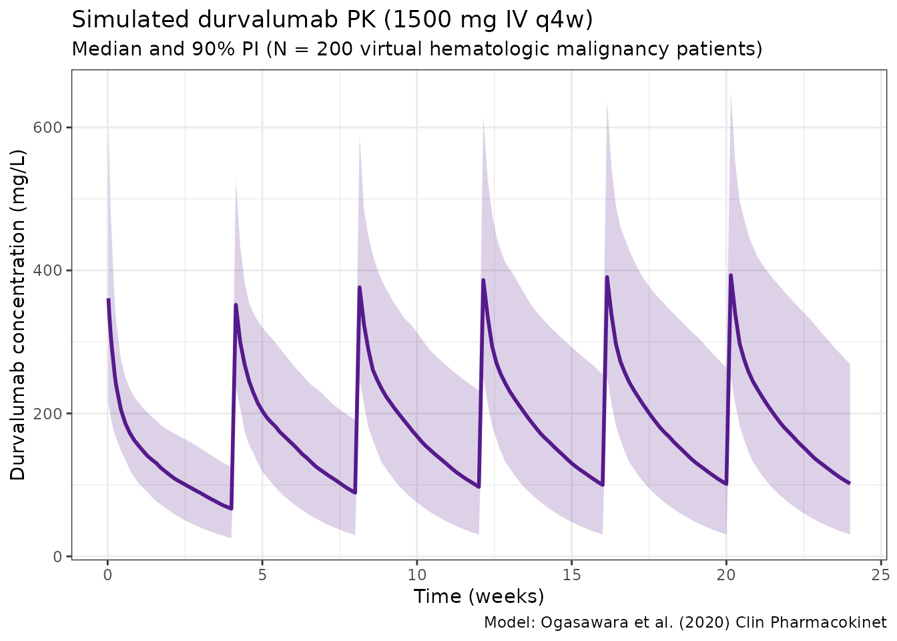
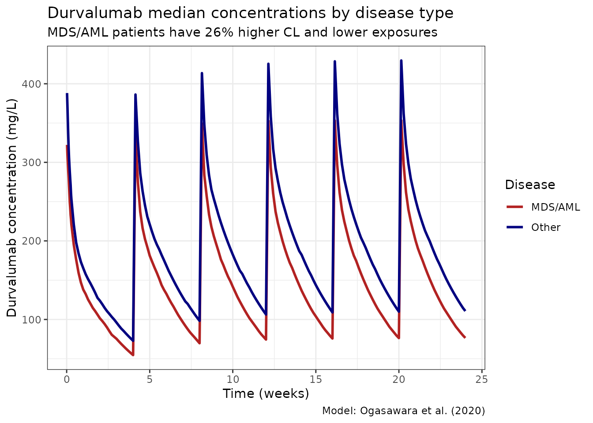

# Ogasawara_2020_durvalumab

``` r
library(nlmixr2lib)
library(rxode2)
#> rxode2 5.0.2 using 2 threads (see ?getRxThreads)
#>   no cache: create with `rxCreateCache()`
library(dplyr)
#> 
#> Attaching package: 'dplyr'
#> The following objects are masked from 'package:stats':
#> 
#>     filter, lag
#> The following objects are masked from 'package:base':
#> 
#>     intersect, setdiff, setequal, union
library(tidyr)
library(ggplot2)
library(PKNCA)
#> 
#> Attaching package: 'PKNCA'
#> The following object is masked from 'package:stats':
#> 
#>     filter
```

## Model and source

- Citation: Ogasawara K, Newhall K, Maxwell SE, et al. Population
  Pharmacokinetics of an Anti-PD-L1 Antibody, Durvalumab in Patients
  with Hematologic Malignancies. Clin Pharmacokinet. 2020;59(2):217-227.
  <doi:10.1007/s40262-019-00804-x>
- Description: Two compartment PK model of durvalumab (anti-PD-L1) in
  patients with hematologic malignancies (Ogasawara 2020)
- Article: <https://doi.org/10.1007/s40262-019-00804-x>

## Durvalumab population PK simulation

Simulate durvalumab concentration-time profiles using the final
population PK model from Ogasawara et al. (2020) in patients with
hematologic malignancies (MDS/AML and multiple myeloma, N = 267).

Durvalumab is a human IgG1 kappa anti-PD-L1 checkpoint inhibitor. The
model is a 2-compartment IV model with linear elimination and extensive
covariate effects (11 covariate-parameter relationships). Anti-drug
antibodies (ADA) were NOT examined as a covariate in this analysis.

**Note:** Time units are hours (matching the original publication).

Source: Table 3 of Ogasawara et al. (2020) Clin Pharmacokinet.
59(2):217-227. <doi:10.1007/s40262-019-00804-x>. Parameters and
equations verified against PMC7007418 (Table 3 footnotes b and c).

### Virtual population

``` r
set.seed(2020)
n_subj <- 500

pop <- data.frame(
  ID     = seq_len(n_subj),
  WT     = rlnorm(n_subj, log(74.7), 0.25),  # Median 74.7 kg (Table 2)
  ALB    = rnorm(n_subj, 40, 5),              # Median 40 g/L (Table 2)
  IGG    = rlnorm(n_subj, log(7.6), 0.35),   # Median 7.6 g/L (Table 2)
  SPDL1  = rlnorm(n_subj, log(173.8), 0.8),  # Median 173.8 pg/mL (Table 2)
  LDH    = rlnorm(n_subj, log(216), 0.4),    # Median 216 U/L (Table 2)
  SEX    = rbinom(n_subj, 1, 0.352),          # 35.2% female (Table 2)
  MDSAML = rbinom(n_subj, 1, 0.37),           # 37% MDS/AML (Table 2)
  MM     = 0
)
pop$ALB <- pmax(20, pmin(pop$ALB, 55))
# MM is complement of MDSAML (simplified: NHL excluded)
pop$MM <- ifelse(pop$MDSAML == 0, rbinom(n_subj, 1, 0.73), 0)
```

### Dosing dataset

Simulate durvalumab 1500 mg IV every 4 weeks (q4w) for 24 weeks.
Infusion over 1 hour.

``` r
dose_weeks <- seq(0, 20, by = 4)
dose_times_h <- dose_weeks * 7 * 24  # weeks to hours

obs_times_h <- sort(unique(c(
  seq(0, 48, by = 4),                            # Dense first 2 days
  seq(48, max(dose_times_h) + 28 * 24, by = 24)  # Daily to end
)))

d_dose <- pop %>%
  crossing(TIME = dose_times_h) %>%
  mutate(AMT = 1500, EVID = 1, CMT = 1, DUR = 1, DV = NA_real_)

d_obs <- pop %>%
  crossing(TIME = obs_times_h) %>%
  mutate(AMT = NA_real_, EVID = 0, CMT = 1, DUR = NA_real_, DV = NA_real_)

d_sim <- bind_rows(d_dose, d_obs) %>%
  arrange(ID, TIME, desc(EVID)) %>%
  as.data.frame()
```

### Simulate

``` r
mod <- readModelDb("Ogasawara_2020_durvalumab")
sim <- rxSolve(mod, d_sim, returnType = "data.frame")
#> ℹ parameter labels from comments will be replaced by 'label()'
```

### Concentration-time profiles

``` r
sim_summary <- sim %>%
  filter(time > 0) %>%
  group_by(time) %>%
  summarise(
    median = median(Cc, na.rm = TRUE),
    lo     = quantile(Cc, 0.05, na.rm = TRUE),
    hi     = quantile(Cc, 0.95, na.rm = TRUE),
    .groups = "drop"
  )

ggplot(sim_summary, aes(x = time / (24 * 7))) +
  geom_ribbon(aes(ymin = lo, ymax = hi), alpha = 0.2, fill = "purple4") +
  geom_line(aes(y = median), color = "purple4", linewidth = 1) +
  labs(
    x = "Time (weeks)",
    y = "Durvalumab concentration (mg/L)",
    title = "Simulated durvalumab PK (1500 mg IV q4w)",
    subtitle = "Median and 90% PI (N = 500 virtual hematologic malignancy patients)",
    caption = "Model: Ogasawara et al. (2020) Clin Pharmacokinet"
  ) +
  theme_bw()
```



### PK by disease type

``` r
# The rxSolve output carries covariates through, so MDSAML is already in sim
sim_df_disease <- as.data.frame(sim)
sim_df_disease <- sim_df_disease[sim_df_disease$time > 0, ]
sim_df_disease$Disease <- ifelse(sim_df_disease$MDSAML == 1, "MDS/AML", "Other")

sim_disease_summary <- sim_df_disease %>%
  group_by(time, Disease) %>%
  summarise(median = median(Cc, na.rm = TRUE), .groups = "drop")

ggplot(sim_disease_summary, aes(x = time / (24 * 7), y = median, color = Disease)) +
  geom_line(linewidth = 1) +
  scale_color_manual(values = c("MDS/AML" = "firebrick", "Other" = "navy")) +
  labs(
    x = "Time (weeks)",
    y = "Durvalumab concentration (mg/L)",
    title = "Durvalumab median concentrations by disease type",
    subtitle = "MDS/AML patients have 26% higher CL and lower exposures",
    caption = "Model: Ogasawara et al. (2020)"
  ) +
  theme_bw()
```



### NCA analysis

``` r
# Use 3rd dosing interval (weeks 8-12 = hours 1344-2016)
sim_df <- as.data.frame(sim)
# Build unique subject key from sim.id and id
if (all(c("sim.id", "id") %in% names(sim_df))) {
  sim_df$subject <- paste(sim_df$sim.id, sim_df$id, sep = "_")
} else if ("id" %in% names(sim_df)) {
  sim_df$subject <- sim_df$id
} else {
  sim_df$subject <- sim_df$sim.id
}
nca_data <- data.frame(
  subject  = sim_df$subject,
  time_rel = (sim_df$time - 1344) / 24,  # Convert to days relative to dose 3
  Cc       = sim_df$Cc
)
nca_data <- nca_data[nca_data$time_rel >= 0 & nca_data$time_rel <= 28 & nca_data$Cc > 0, ]

conc_obj <- PKNCAconc(nca_data, Cc ~ time_rel | subject)
dose_obj <- PKNCAdose(
  data.frame(subject = unique(nca_data$subject), time_rel = 0, AMT = 1500),
  AMT ~ time_rel | subject
)
data_obj <- PKNCAdata(conc_obj, dose_obj,
                       intervals = data.frame(start = 0, end = 28,
                                              cmax = TRUE, tmax = TRUE,
                                              auclast = TRUE, half.life = TRUE))
nca_results <- pk.nca(data_obj)
#>  ■■■■■■■                           19% |  ETA: 10s
#>  ■■■■■■■■■■■■■■                    44% |  ETA:  7s
#>  ■■■■■■■■■■■■■■■■■■■■■■            69% |  ETA:  4s
#>  ■■■■■■■■■■■■■■■■■■■■■■■■■■■■■     94% |  ETA:  1s
nca_summary <- summary(nca_results)
knitr::kable(nca_summary, digits = 2,
             caption = "NCA summary (3rd dosing interval, weeks 8-12)")
```

| start | end | N   | auclast       | cmax         | tmax                | half.life     |
|------:|----:|:----|:--------------|:-------------|:--------------------|:--------------|
|     0 |  28 | 500 | 5180 \[39.5\] | 387 \[27.9\] | 1.00 \[1.00, 1.00\] | 19.7 \[7.57\] |

NCA summary (3rd dosing interval, weeks 8-12)

### Notes

- **Model:** 2-compartment IV with linear elimination. No TMDD.
- **11 covariate effects** including soluble PD-L1 (the drug’s target)
  on CL.
- **Log-additive residual error** (concentrations log-transformed prior
  to modeling).
- **Time in hours** — unlike most mAb models that use days.
- **ADA not examined** as a covariate in this analysis.
- **Reference values** are Table 2 medians: ALB 40 g/L, IgG 7.61 g/L,
  sPD-L1 173.8 pg/mL, LDH 216 U/L, WT 74.7 kg.
- **Albumin, IgG, sPD-L1, LDH** were time-varying covariates in the
  model.
- **MDS/AML effect:** 26% higher CL (clinically meaningful).
