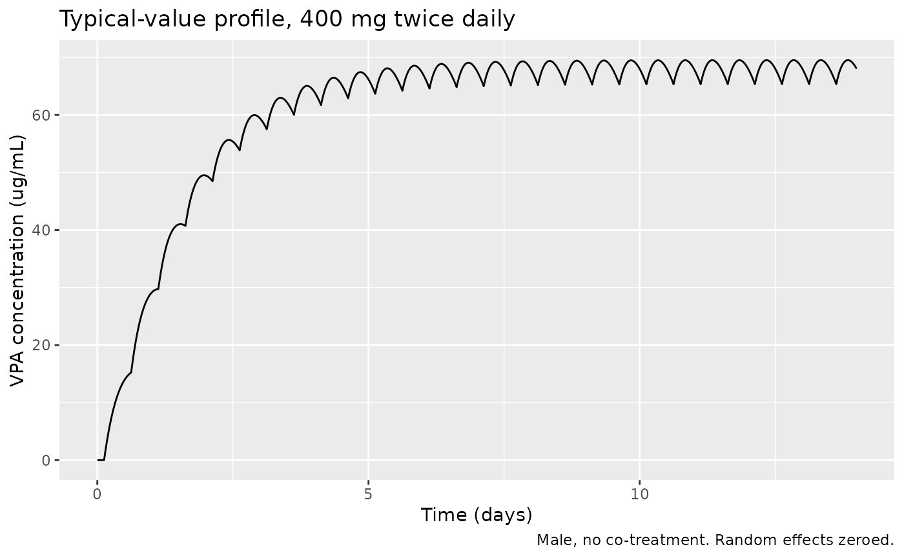
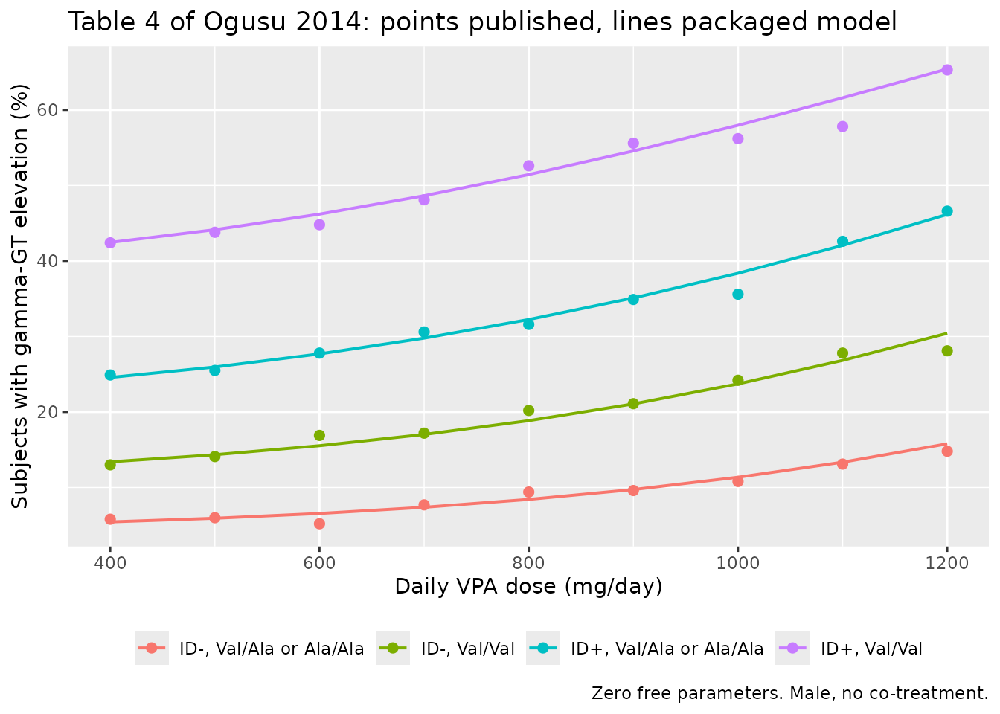
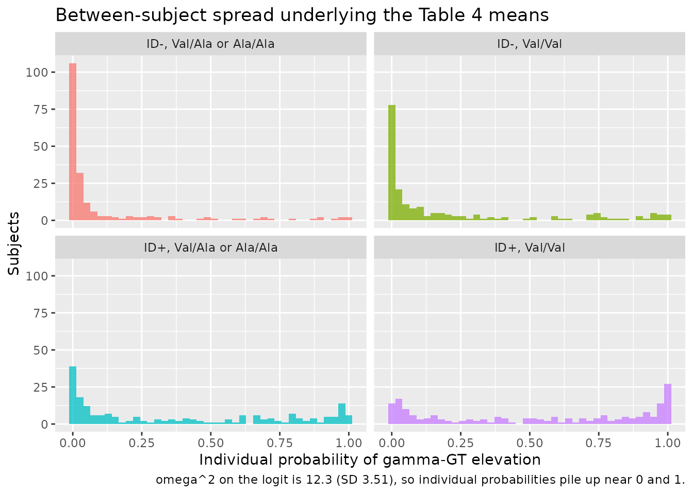

# Valproic acid (Ogusu 2014)

## Model and source

- Citation: Ogusu N, Saruwatari J, Nakashima H, Noai M, Nishimura M,
  Deguchi M, Oniki K, Yasui-Furukori N, Kaneko S, Ishitsu T, Nakagawa K.
  Impact of the superoxide dismutase 2 Val16Ala polymorphism on the
  relationship between valproic acid exposure and elevation of
  gamma-glutamyltransferase in patients with epilepsy: a population
  pharmacokinetic-pharmacodynamic analysis. PLoS One.
  2014;9(11):e111066. <doi:10.1371/journal.pone.0111066>. EXPRESSION OF
  CONCERN: The PLOS ONE Editors. Expression of Concern: Impact of the
  Superoxide Dismutase 2 Val16Ala Polymorphism on the Relationship
  between Valproic Acid Exposure and Elevation of
  gamma-Glutamyltransferase in Patients with Epilepsy: A Population
  Pharmacokinetic-Pharmacodynamic Analysis. PLoS One.
  2023;18(1):e0279162. <doi:10.1371/journal.pone.0279162>. The stated
  grounds are funding disclosure only (the study was part-funded by the
  Smoking Research Foundation, which had received tobacco-industry
  support, contrary to the journal’s 2010 policy on funding from tobacco
  companies). The notice raises no concern about the data, methods or
  results and is not a retraction.
- Description: Sequential population PK / PK-PD model for valproic acid
  (VPA) and the probability of gamma-glutamyltransferase (gamma-GT)
  elevation in Japanese patients with epilepsy on long-term therapy
  (Ogusu 2014; n = 237 with 827 steady-state therapeutic-drug-monitoring
  concentrations for the PK layer, n = 169 with 472 gamma-GT
  measurements for the PK-PD layer, ages 2.2-52.2 years, 100-2600
  mg/day). PK is one-compartment first-order oral absorption with a 3.00
  h absorption lag fixed by the authors; the daily VPA dose enters both
  Vd/F and CL/F as a power term, and female sex, carbamazepine,
  phenobarbital, phenytoin and clobazam coadministration each scale CL/F
  multiplicatively (Ogusu 2014 equations 5-8, Table 2). PD is a logistic
  regression for the probability that serum gamma-GT exceeds its age-
  and sex-stratified upper limit of normal, with the logit driven
  linearly by the individual steady-state daily AUC and shifted by
  complication with intellectual disability and the SOD2 Val16Ala
  (rs4880) Val/Val genotype (equation 9, Table 3). The PD layer consumes
  the PK layer’s AUC, so the two are one coupled model. Fitted in NONMEM
  7.2.0 (FOCE with ADVAN2 TRANS2 for PK; Laplacian for the PK-PD layer).
  NOTE: the source article is under a PLOS ONE Expression of Concern on
  funding-disclosure grounds only – no concern is raised about the data,
  methods or results, and it is not a retraction; see the reference
  field and the vignette Errata.
- Article: <https://doi.org/10.1371/journal.pone.0111066>
- Expression of Concern: <https://doi.org/10.1371/journal.pone.0279162>

> **Expression of Concern.** The source article is subject to a PLOS ONE
> Expression of Concern (2023;18(1):e0279162, 11 January 2023). Its
> stated grounds are **funding disclosure only**: the study was
> part-funded by the Smoking Research Foundation, which had received
> tobacco-industry support, contrary to the journal’s 2010 policy on
> funding from tobacco companies. The notice raises **no** concern about
> the data, methods or results, and it is **not** a retraction. It is
> recorded here and in the model file’s `reference` metadata so that it
> travels with the model. See “Assumptions and deviations” below.

Ogusu 2014 is a two-layer analysis of routine
therapeutic-drug-monitoring data from Japanese patients with epilepsy on
long-term valproic acid (VPA). The PK layer is a one-compartment oral
model with a fixed absorption lag; the PD layer is a logistic regression
for the probability that serum gamma-glutamyltransferase (gamma-GT)
exceeds its age- and sex-stratified upper limit of normal, driven by the
individual steady-state daily AUC. The PD layer consumes the PK layer’s
AUC, so the two are packaged as a single coupled model.

## Population

The PK layer was fitted to 827 steady-state VPA concentrations from 237
patients; the PK-PD layer to 472 gamma-GT measurements from 169 of them
(Ogusu 2014 Table 1). Patients were Japanese, aged 2.2-52.2 years (mean
17.2 +/- 8.3; 93.3% were 30 years or younger), weighing 9.6-120.5 kg
(mean 48.8 +/- 20.9), and 42.2% were women. Daily VPA doses spanned
100-2600 mg/day (mean 934.3 +/- 540.2), given in one to three divided
administrations; 45.7% of records were VPA monotherapy. Seizures were
generalized in 46.8%, partial in 50.2% and unclassified in 3.0%. A
comorbid moderate or severe intellectual disability was present in 55.3%
of the PK cohort and 57.4% of the PK-PD cohort. Among the 169 PK-PD
patients the SOD2 rs4880 genotype distribution was Val/Val 77.6%,
Val/Ala 20.7% and Ala/Ala 1.7% (16Ala allele frequency 12.7%, consistent
with Hardy-Weinberg equilibrium).

Sampling was sparse and retrospective: the interval between the last
dose and the sample was spread over the full 24 h. Standard errors were
not estimable for the final PK model (Ogusu 2014 Discussion, limitation
1), which is why Table 2 carries no RSE column; precision comes instead
from a 1000-run stratified nonparametric bootstrap (965 successful
minimisations for PK, 997 for PK-PD).

The same information is available programmatically via the model’s
`population` metadata
(`readModelDb("Ogusu_2014_valproic_acid")()$population`).

``` r

readModelDb("Ogusu_2014_valproic_acid")()$population[
  c("species", "n_subjects", "age_range", "dose_range", "regions")
]
#> $species
#> [1] "human"
#> 
#> $n_subjects
#> [1] 237
#> 
#> $age_range
#> [1] "PK 17.2 +/- 8.3 years, range 2.2-52.2; PK-PD 18.0 +/- 7.8 years, range 3.0-52.2; 93.3% were 30 years or younger (Ogusu 2014 Table 1, Figure S2)"
#> 
#> $dose_range
#> [1] "valproic acid 100-2600 mg/day orally (mean 934.3 +/- 540.2 mg/day), given in 1-3 divided doses; 45.7% of PK records were monotherapy"
#> 
#> $regions
#> [1] "Japan (single-centre retrospective therapeutic-drug-monitoring cohort)"
```

## Source trace

Every `ini()` entry carries an in-file comment naming its source
location in `inst/modeldb/specificDrugs/Ogusu_2014_valproic_acid.R`.
They are collected here for review.

| Equation / parameter | Value | Source location |
|----|----|----|
| `d/dt(depot)`, `d/dt(central)`, `alag(depot)` | n/a | Methods, “Population PK and PK-PD Modeling”: NONMEM `ADVAN2 TRANS2`, “a one-compartment model with first-order absorption and elimination” |
| `lka` | 0.109 1/h | Equation 5; Table 2 “Ka (h-1)” |
| `lvc` | 21.4 L | Equation 6; Table 2 “Vd/F (L)” |
| `e_dose_vc` | 1.52 | Equation 6; Table 2 “Dose on Vd/F” |
| `lcl` | 0.559 L/h | Equation 7; Table 2 “CL/F (L/h)” |
| `e_dose_cl` | 0.596 | Equation 7; Table 2 “Dose on CL/F” |
| `e_sexf_cl` | 0.917 | Equation 7; Table 2 “Gender on CL/F” |
| `e_cbz_cl` | 1.19 | Equation 7; Table 2 “CBZ on CL/F” |
| `e_pb_cl` | 1.12 | Equation 7; Table 2 “PB on CL/F” |
| `e_pht_cl` | 1.43 | Equation 7; Table 2 “PHT on CL/F” |
| `e_clb_cl` | 0.906 | Equation 7; Table 2 “CLB on CL/F” |
| `ltlag` | 3.00 h, fixed | Equation 8; Table 2 “ALAG (h) – 3.00 (Fixed)” |
| `etaltlag` | 4.48e-9 | Table 2 “omega^2 on ALAG”, NONMEM column |
| `etalka` | 7.77e-7 | Table 2 “omega^2 on Ka”, NONMEM column |
| `etalvc` | 1.83e-7 | Table 2 “omega^2 on Vd/F”, NONMEM column |
| `etalcl` | 0.0587 | Table 2 “omega^2 on CL/F”, NONMEM column |
| `propSd` | 0.248 | Table 2 “sigma^2 (proportional error)” = 0.0617; SD = sqrt(0.0617) |
| `logit_ggt_elevation` (form) | n/a | Equations 1, 2 and 9; covariates enter additively per equation 4 |
| `logit_ref` | -6.63 | Equation 9; Table 3 “Base” |
| `e_intelldis_logit` | 3.62 | Equation 9; Table 3 “Intellectual disability on BASE” |
| `e_sod2_vv_logit` | 1.96 | Equation 9; Table 3 “SOD2 genotype on BASE” |
| `e_dose_slope` | 1.55 | Equation 9; Table 3 “Dose on SLOPE” |
| `etalogit_ref` | 12.3 | Table 3 “omega^2 on logit (Pr)”, NONMEM column |
| `auc_ss` (form) | n/a | Equation 9 text: “AUC is the individual AUC value of VPA that was simulated based on the population PK analysis”; at steady state this is the daily dose divided by CL/F |

Three readings of the printed tables and equations are not stated
explicitly by the paper and are recovered below against Table 4, which
over-determines them. They are documented in full in “Assumptions and
deviations”.

``` r

mod <- readModelDb("Ogusu_2014_valproic_acid")
mod_typ <- rxode2::zeroRe(rxode2::rxode(mod))
#> ℹ parameter labels from comments will be replaced by 'label()'
```

## PK layer

### Typical-value steady-state profile

A typical 800 mg/day patient (male, no co-treatment) given 400 mg twice
daily for two weeks, solved with the random effects zeroed.

``` r

# Event tables are built as plain data frames: this model declares TWO
# observation endpoints (Cc and prob_ggt_elevation), so every observation row
# must name which endpoint it belongs to. `cmt` names the ODE state and `dvid`
# selects the endpoint (route A of the two valid rxode2 conventions).
make_events <- function(daily_dose, n_daily = 2, days = 14, by = 0.25,
                        sexf = 0, cbz = 0, pb = 0, pht = 0, clb = 0,
                        intelldis = 0, sod2_vv = 0, id = 1L) {
  ii <- 24 / n_daily
  dose_times <- seq(0, 24 * days - ii, by = ii)
  obs_times <- seq(0, 24 * days, by = by)
  ev <- rbind(
    data.frame(time = dose_times, amt = daily_dose / n_daily,
               evid = 1L, cmt = "depot", dvid = NA_integer_),
    data.frame(time = obs_times, amt = NA_real_,
               evid = 0L, cmt = "central", dvid = 1L)
  )
  ev$id <- id
  ev$DOSE_VPA_MGD <- daily_dose
  ev$SEXF <- sexf
  ev$CONMED_CBZ <- cbz
  ev$CONMED_PB <- pb
  ev$CONMED_PHT <- pht
  ev$CONMED_CLB <- clb
  ev$DIS_INTELLDIS_MODSEV <- intelldis
  ev$SNP_SOD2_RS4880_TT <- sod2_vv
  ev[order(ev$id, ev$time, -ev$evid), ]
}

ev_typ <- make_events(daily_dose = 800)
sim_typ <- rxode2::rxSolve(mod_typ, ev_typ, returnType = "data.frame")
#> ℹ omega/sigma items treated as zero: 'etaltlag', 'etalka', 'etalvc', 'etalcl', 'etalogit_ref'

ggplot(sim_typ, aes(time / 24, Cc)) +
  geom_line() +
  labs(x = "Time (days)", y = "VPA concentration (ug/mL)",
       title = "Typical-value profile, 400 mg twice daily",
       caption = "Male, no co-treatment. Random effects zeroed.")
```



### Structural check against the observed cohort mean

Table 1 reports an observed mean VPA concentration of 68.15 +/- 26.54
ug/mL at a mean daily dose of 934.3 mg/day. The model’s typical-value
average steady-state concentration at that dose is a structural check on
`lcl` and `e_dose_cl` together: a mis-transcribed clearance coefficient,
a dropped dose exponent or a unit error moves it by tens of percent.

``` r

ev_mean <- make_events(daily_dose = 934.3)
sim_mean <- rxode2::rxSolve(mod_typ, ev_mean, returnType = "data.frame")
#> ℹ omega/sigma items treated as zero: 'etaltlag', 'etalka', 'etalvc', 'etalcl', 'etalogit_ref'

# Average concentration over the final steady-state day.
ss <- sim_mean[sim_mean$time >= 24 * 13 & sim_mean$time <= 24 * 14, ]
cav <- sum(diff(ss$time) * (head(ss$Cc, -1) + tail(ss$Cc, -1)) / 2) / 24

observed_mean <- 68.15
cat(sprintf("Model Cav,ss at 934.3 mg/day : %.2f ug/mL\n", cav))
#> Model Cav,ss at 934.3 mg/day : 72.51 ug/mL
cat(sprintf("Ogusu 2014 Table 1 observed  : %.2f ug/mL (SD 26.54)\n", observed_mean))
#> Ogusu 2014 Table 1 observed  : 68.15 ug/mL (SD 26.54)
cat(sprintf("Difference                   : %+.1f%%\n",
            100 * (cav - observed_mean) / observed_mean))
#> Difference                   : +6.4%

# Structural, not distributional: this compares two typical values, so it is
# reproducible across machines and rxode2 versions. A 10% band is far tighter
# than any plausible transcription error (the smallest one -- dropping the
# 0.917 female factor -- moves it 8%, and a unit error moves it 1000-fold),
# yet loose enough to absorb the difference between the cohort's dose-weighted
# mean exposure and the exposure at the cohort's mean dose.
stopifnot(abs(cav - observed_mean) / observed_mean < 0.10)
```

### Internal identity: the AUC that drives the PD layer

Equation 9’s exposure variable is the individual steady-state daily AUC.
The model computes it algebraically as `auc_ss = DOSE_VPA_MGD / cl`,
which at steady state is exact. Because there is no residual error and
no IIV in this solve, the trapezoidal AUC over one steady-state dosing
day must reproduce it to numerical precision – this is an exact internal
identity, so it is gated tightly (per
`known-vignette-failure-patterns.md` pattern 11, a deterministic
quantity is asserted at the accuracy actually achieved).

``` r

auc_trap <- sum(diff(ss$time) * (head(ss$Cc, -1) + tail(ss$Cc, -1)) / 2)
auc_alg <- unique(sim_mean$auc_ss)
stopifnot(length(auc_alg) == 1L)

cat(sprintf("Trapezoidal AUC over the final 24 h : %.2f ug*h/mL\n", auc_trap))
#> Trapezoidal AUC over the final 24 h : 1740.17 ug*h/mL
cat(sprintf("Algebraic auc_ss = Dose/CL          : %.2f ug*h/mL\n", auc_alg))
#> Algebraic auc_ss = Dose/CL          : 1740.46 ug*h/mL
cat(sprintf("Relative difference                 : %+.4f%%\n",
            100 * (auc_trap - auc_alg) / auc_alg))
#> Relative difference                 : -0.0169%

stopifnot(abs(auc_trap - auc_alg) / auc_alg < 0.002)
```

### PKNCA

Ogusu 2014 reports **no** NCA table – no Cmax, Tmax, AUC or half-life
values are published anywhere in the article, because the analysis is a
population-model fit to sparse routine therapeutic-drug-monitoring data
rather than a dense-sampling PK study. There is therefore nothing to
compare a simulated NCA against. Following the standing guidance for
that case, PKNCA is used instead to gate the model against **exact
internal identities** that a transcription error would break.

The NCA runs on the typical-value (random-effects-zeroed) solve. Running
it over a full-IIV cohort would give a half-life that is both
NA-poisoned and tmax-selected, which is not what the identities below
are testing.

The NCA runs on a **single-dose** solve rather than on the steady-state
profile above. The model’s terminal half-life is about 25 h against a 12
h dosing interval, so a steady-state day contains no clean terminal
phase for PKNCA’s lambda-z to fit; a single dose followed by a long
washout does, and it makes both identities below exact rather than
approximate.

``` r

# One administration of the whole 934.3 mg daily dose, then ~10 half-lives of
# washout. DOSE_VPA_MGD stays at 934.3 because it is the *prescribed daily
# dose* covariate that scales CL/F and Vd/F -- it is not the amount in this
# particular administration.
ev_sd <- rbind(
  data.frame(time = 0, amt = 934.3, evid = 1L, cmt = "depot", dvid = NA_integer_),
  data.frame(time = c(seq(0, 48, by = 0.25), seq(49, 240, by = 1)),
             amt = NA_real_, evid = 0L, cmt = "central", dvid = 1L)
)
ev_sd$id <- 1L
ev_sd$DOSE_VPA_MGD <- 934.3
ev_sd$SEXF <- 0
ev_sd$CONMED_CBZ <- 0
ev_sd$CONMED_PB <- 0
ev_sd$CONMED_PHT <- 0
ev_sd$CONMED_CLB <- 0
ev_sd$DIS_INTELLDIS_MODSEV <- 0
ev_sd$SNP_SOD2_RS4880_TT <- 0
ev_sd <- ev_sd[order(ev_sd$time, -ev_sd$evid), ]

sim_sd <- rxode2::rxSolve(mod_typ, ev_sd, returnType = "data.frame")
#> ℹ omega/sigma items treated as zero: 'etaltlag', 'etalka', 'etalvc', 'etalcl', 'etalogit_ref'

# Solver noise in the far tail would make PKNCA take log() of a negative
# number and return NaN for aucinf.obs; assert it never happens here.
stopifnot(all(sim_sd$Cc >= 0))

sim_nca <- sim_sd |>
  dplyr::filter(!is.na(Cc)) |>
  dplyr::mutate(treatment = "934.3 mg single dose", id = 1L) |>
  dplyr::select(id, time, Cc, treatment)

conc_obj <- PKNCA::PKNCAconc(sim_nca, Cc ~ time | treatment + id)

dose_df <- data.frame(
  id = 1L, time = 0, amt = 934.3, treatment = "934.3 mg single dose"
)
dose_obj <- PKNCA::PKNCAdose(dose_df, amt ~ time | treatment + id)

intervals <- data.frame(
  start = 0, end = Inf,
  cmax = TRUE, tmax = TRUE, auclast = TRUE, aucinf.obs = TRUE, half.life = TRUE
)

nca_res <- PKNCA::pk.nca(PKNCA::PKNCAdata(conc_obj, dose_obj,
                                          intervals = intervals))
nca_wide <- as.data.frame(nca_res) |>
  dplyr::select(PPTESTCD, PPORRES) |>
  tidyr::pivot_wider(names_from = PPTESTCD, values_from = PPORRES)
knitr::kable(nca_wide, digits = 3,
             caption = "PKNCA on a single-dose typical-value solve.")
```

| auclast | cmax | tmax | tlast | clast.obs | lambda.z | r.squared | adj.r.squared | lambda.z.time.first | lambda.z.time.last | lambda.z.n.points | clast.pred | half.life | span.ratio | aucinf.obs |
|---:|---:|---:|---:|---:|---:|---:|---:|---:|---:|---:|---:|---:|---:|---:|
| 1737.224 | 30.319 | 19.75 | 240 | 0.089 | 0.028 | 1 | 1 | 32.5 | 240 | 255 | 0.091 | 25.156 | 8.248 | 1740.459 |

PKNCA on a single-dose typical-value solve. {.table}

``` r

cl_i <- unique(sim_sd$cl)
vc_i <- unique(sim_sd$vc)
stopifnot(length(cl_i) == 1L, length(vc_i) == 1L)

# Identity 1: for a linear one-compartment model, AUC(0-inf) after a single
# dose equals Dose / (CL/F) -- which is exactly the quantity `auc_ss` that the
# model hands to the PD layer as the steady-state daily AUC. This is the
# identity that makes the PD layer's exposure variable auditable.
auc_expected <- 934.3 / cl_i
cat(sprintf("PKNCA aucinf.obs        : %.2f ug*h/mL\n", nca_wide$aucinf.obs))
#> PKNCA aucinf.obs        : 1740.46 ug*h/mL
cat(sprintf("Dose / (CL/F)           : %.2f ug*h/mL\n", auc_expected))
#> Dose / (CL/F)           : 1740.46 ug*h/mL
cat(sprintf("Model auc_ss            : %.2f ug*h/mL\n", unique(sim_sd$auc_ss)))
#> Model auc_ss            : 1740.46 ug*h/mL
stopifnot(abs(nca_wide$aucinf.obs - auc_expected) / auc_expected < 0.005)
stopifnot(abs(unique(sim_sd$auc_ss) - auc_expected) / auc_expected < 1e-8)

# Identity 2: the terminal half-life must be log(2) * Vd/F / (CL/F). The
# elimination rate constant is the only disposition rate in this
# one-compartment model, so PKNCA's lambda-z has to recover it. Both sides are
# read from the solve, so no model constant is re-typed here.
thalf_expected <- log(2) * vc_i / cl_i
cat(sprintf("\nPKNCA half.life         : %.2f h\n", nca_wide$half.life))
#> 
#> PKNCA half.life         : 25.16 h
cat(sprintf("log(2) * Vd/F / (CL/F)  : %.2f h\n", thalf_expected))
#> log(2) * Vd/F / (CL/F)  : 24.92 h
stopifnot(abs(nca_wide$half.life - thalf_expected) / thalf_expected < 0.02)

# Identity 3: absorption is lagged 3.00 h and slow (ka = 0.109 1/h), so the
# peak must fall well after the lag. A dropped lag or a mis-scaled ka breaks
# this immediately.
cat(sprintf("\nPKNCA tmax              : %.2f h\n", nca_wide$tmax))
#> 
#> PKNCA tmax              : 19.75 h
stopifnot(nca_wide$tmax > 3.0, nca_wide$tmax < 40)
```

## PD layer: the Table 4 gate

This is the primary validation of the extraction. Ogusu 2014 Table 4
tabulates 36 model-predicted percentages – nine daily doses (400-1200
mg/day, no co-treatment) crossed with four covariate groups
(intellectual disability present or absent, times SOD2 Val/Val versus
Val/Ala-or-Ala/Ala). Reproducing all 36 with **zero fitted parameters**
simultaneously confirms the three readings of the paper that it does not
state explicitly (see “Assumptions and deviations”).

Table 4’s percentages are population **means** over the between-subject
random effects, not typical-value predictions: with `omega^2` on the
logit equal to 12.3 (SD 3.51), `E[expit(logit)]` is far above
`expit(E[logit])`. The typical patient in the reference group at 800
mg/day sits at a 0.4% probability while Table 4 reports 9.4%. The
expectation is therefore taken by Gauss-Hermite quadrature over both
random effects.

Crucially, the linear predictor is computed **by the packaged model**,
not re-typed here: the `etalcl` quadrature nodes are passed to
`rxSolve()` as data columns (with `omega = NA` so the solver does not
redraw them), and the model’s own `model()` block returns
`logit_ggt_elevation`. Only the outer expectation over `etalogit_ref` –
a weighted
[`expit()`](https://nlmixr2.github.io/rxode2/reference/logit.html) – is
done in this vignette.

``` r

doses <- c(400, 500, 600, 700, 800, 900, 1000, 1100, 1200)

# Ogusu 2014 Table 4, "gamma-GT elevation (%)" column, transcribed verbatim.
table4 <- tibble::tribble(
  ~group,  ~intelldis, ~sod2_vv, ~dose,  ~published,
  "ID-, Val/Ala or Ala/Ala", 0, 0,  400,  5.8,
  "ID-, Val/Ala or Ala/Ala", 0, 0,  500,  6.0,
  "ID-, Val/Ala or Ala/Ala", 0, 0,  600,  5.2,
  "ID-, Val/Ala or Ala/Ala", 0, 0,  700,  7.7,
  "ID-, Val/Ala or Ala/Ala", 0, 0,  800,  9.4,
  "ID-, Val/Ala or Ala/Ala", 0, 0,  900,  9.6,
  "ID-, Val/Ala or Ala/Ala", 0, 0, 1000, 10.8,
  "ID-, Val/Ala or Ala/Ala", 0, 0, 1100, 13.1,
  "ID-, Val/Ala or Ala/Ala", 0, 0, 1200, 14.8,
  "ID-, Val/Val",            0, 1,  400, 13.0,
  "ID-, Val/Val",            0, 1,  500, 14.1,
  "ID-, Val/Val",            0, 1,  600, 16.9,
  "ID-, Val/Val",            0, 1,  700, 17.2,
  "ID-, Val/Val",            0, 1,  800, 20.2,
  "ID-, Val/Val",            0, 1,  900, 21.1,
  "ID-, Val/Val",            0, 1, 1000, 24.2,
  "ID-, Val/Val",            0, 1, 1100, 27.8,
  "ID-, Val/Val",            0, 1, 1200, 28.1,
  "ID+, Val/Ala or Ala/Ala", 1, 0,  400, 24.9,
  "ID+, Val/Ala or Ala/Ala", 1, 0,  500, 25.5,
  "ID+, Val/Ala or Ala/Ala", 1, 0,  600, 27.8,
  "ID+, Val/Ala or Ala/Ala", 1, 0,  700, 30.6,
  "ID+, Val/Ala or Ala/Ala", 1, 0,  800, 31.6,
  "ID+, Val/Ala or Ala/Ala", 1, 0,  900, 34.9,
  "ID+, Val/Ala or Ala/Ala", 1, 0, 1000, 35.6,
  "ID+, Val/Ala or Ala/Ala", 1, 0, 1100, 42.6,
  "ID+, Val/Ala or Ala/Ala", 1, 0, 1200, 46.6,
  "ID+, Val/Val",            1, 1,  400, 42.4,
  "ID+, Val/Val",            1, 1,  500, 43.8,
  "ID+, Val/Val",            1, 1,  600, 44.8,
  "ID+, Val/Val",            1, 1,  700, 48.1,
  "ID+, Val/Val",            1, 1,  800, 52.6,
  "ID+, Val/Val",            1, 1,  900, 55.6,
  "ID+, Val/Val",            1, 1, 1000, 56.2,
  "ID+, Val/Val",            1, 1, 1100, 57.8,
  "ID+, Val/Val",            1, 1, 1200, 65.3
)
stopifnot(nrow(table4) == 36L)
```

``` r

# Gauss-Hermite nodes and weights for the standard normal, so that
# sum(w * f(x)) approximates E[f(Z)] with Z ~ N(0, 1).
gauss_hermite <- function(n) {
  i <- seq_len(n - 1)
  jm <- matrix(0, n, n)
  jm[cbind(i, i + 1)] <- sqrt(i / 2)
  jm[cbind(i + 1, i)] <- sqrt(i / 2)
  e <- eigen(jm, symmetric = TRUE)
  list(x = rev(e$values) * sqrt(2), w = rev((e$vectors[1, ])^2))
}

# 21 nodes per dimension. Convergence was checked against an 80-node rule:
# the 21-node quadrature agrees to 0.008 percentage points, two orders of
# magnitude below the ~1 pp Monte-Carlo noise of the paper's own 1000-subject
# simulation, so the quadrature contributes nothing to the residuals below.
nq <- 21
gh <- gauss_hermite(nq)

# The etalcl nodes are passed to the model as data. Each of the 36 Table 4
# cells becomes `nq` subjects, one per node -- 21 per cell, well inside the
# 200-per-arm cohort cap.
om2_cl <- 0.0587    # Table 2 "omega^2 on CL/F"
om2_logit <- 12.3   # Table 3 "omega^2 on logit (Pr)"

cells <- table4 |>
  dplyr::mutate(cell = dplyr::row_number()) |>
  tidyr::expand_grid(node = seq_len(nq)) |>
  dplyr::mutate(
    id = (cell - 1L) * nq + node,
    etalcl = sqrt(om2_cl) * gh$x[node],
    etalogit_ref = 0
  )

# One observation row per subject is enough: logit_ggt_elevation is algebraic
# in the covariates and cl, so it does not depend on time.
ev_t4 <- dplyr::bind_rows(
  cells |> dplyr::transmute(id, time = 0, amt = dose / 2, evid = 1L,
                            cmt = "depot", dvid = NA_integer_,
                            DOSE_VPA_MGD = dose, SEXF = 0,
                            CONMED_CBZ = 0, CONMED_PB = 0, CONMED_PHT = 0,
                            CONMED_CLB = 0,
                            DIS_INTELLDIS_MODSEV = intelldis,
                            SNP_SOD2_RS4880_TT = sod2_vv,
                            etalcl, etalogit_ref),
  cells |> dplyr::transmute(id, time = 12, amt = NA_real_, evid = 0L,
                            cmt = "central", dvid = 1L,
                            DOSE_VPA_MGD = dose, SEXF = 0,
                            CONMED_CBZ = 0, CONMED_PB = 0, CONMED_PHT = 0,
                            CONMED_CLB = 0,
                            DIS_INTELLDIS_MODSEV = intelldis,
                            SNP_SOD2_RS4880_TT = sod2_vv,
                            etalcl, etalogit_ref)
) |>
  dplyr::arrange(id, time, dplyr::desc(evid))

# `omega = NA` stops rxSolve from redrawing the etas we just supplied as
# columns (rxSolve otherwise reuses the model's omega).
sim_t4 <- rxode2::rxSolve(rxode2::rxode(mod), ev_t4, omega = NA,
                          returnType = "data.frame",
                          keep = c("etalcl", "etalogit_ref"))
#> ℹ parameter labels from comments will be replaced by 'label()'
#> Warning: multi-subject simulation without without 'omega'

# The model returned the linear predictor; the outer expectation over
# etalogit_ref is the only arithmetic done here.
expit <- function(x) 1 / (1 + exp(-x))

predicted <- sim_t4 |>
  dplyr::mutate(cell = (id - 1L) %/% nq + 1L, node = (id - 1L) %% nq + 1L) |>
  dplyr::group_by(cell) |>
  dplyr::summarise(
    predicted = 100 * sum(
      gh$w[node] * vapply(logit_ggt_elevation,
                          function(lg) sum(gh$w * expit(lg + sqrt(om2_logit) * gh$x)),
                          numeric(1))
    ),
    .groups = "drop"
  )

gate <- table4 |>
  dplyr::mutate(cell = dplyr::row_number()) |>
  dplyr::left_join(predicted, by = "cell") |>
  dplyr::mutate(error_pp = predicted - published)
stopifnot(nrow(gate) == 36L, !anyNA(gate$predicted))
```

``` r

gate |>
  dplyr::select(group, dose, published, predicted, error_pp) |>
  dplyr::rename(
    "Covariate group" = group,
    "Dose (mg/day)" = dose,
    "Published (%)" = published,
    "Model (%)" = predicted,
    "Error (pp)" = error_pp
  ) |>
  knitr::kable(digits = 2,
               caption = "Ogusu 2014 Table 4 reproduced at zero free parameters.")
```

| Covariate group         | Dose (mg/day) | Published (%) | Model (%) | Error (pp) |
|:------------------------|--------------:|--------------:|----------:|-----------:|
| ID-, Val/Ala or Ala/Ala |           400 |           5.8 |      5.44 |      -0.36 |
| ID-, Val/Ala or Ala/Ala |           500 |           6.0 |      5.92 |      -0.08 |
| ID-, Val/Ala or Ala/Ala |           600 |           5.2 |      6.56 |       1.36 |
| ID-, Val/Ala or Ala/Ala |           700 |           7.7 |      7.38 |      -0.32 |
| ID-, Val/Ala or Ala/Ala |           800 |           9.4 |      8.42 |      -0.98 |
| ID-, Val/Ala or Ala/Ala |           900 |           9.6 |      9.73 |       0.13 |
| ID-, Val/Ala or Ala/Ala |          1000 |          10.8 |     11.36 |       0.56 |
| ID-, Val/Ala or Ala/Ala |          1100 |          13.1 |     13.35 |       0.25 |
| ID-, Val/Ala or Ala/Ala |          1200 |          14.8 |     15.78 |       0.98 |
| ID-, Val/Val            |           400 |          13.0 |     13.40 |       0.40 |
| ID-, Val/Val            |           500 |          14.1 |     14.34 |       0.24 |
| ID-, Val/Val            |           600 |          16.9 |     15.53 |      -1.37 |
| ID-, Val/Val            |           700 |          17.2 |     17.02 |      -0.18 |
| ID-, Val/Val            |           800 |          20.2 |     18.85 |      -1.35 |
| ID-, Val/Val            |           900 |          21.1 |     21.07 |      -0.03 |
| ID-, Val/Val            |          1000 |          24.2 |     23.72 |      -0.48 |
| ID-, Val/Val            |          1100 |          27.8 |     26.83 |      -0.97 |
| ID-, Val/Val            |          1200 |          28.1 |     30.42 |       2.32 |
| ID+, Val/Ala or Ala/Ala |           400 |          24.9 |     24.57 |      -0.33 |
| ID+, Val/Ala or Ala/Ala |           500 |          25.5 |     25.96 |       0.46 |
| ID+, Val/Ala or Ala/Ala |           600 |          27.8 |     27.69 |      -0.11 |
| ID+, Val/Ala or Ala/Ala |           700 |          30.6 |     29.78 |      -0.82 |
| ID+, Val/Ala or Ala/Ala |           800 |          31.6 |     32.24 |       0.64 |
| ID+, Val/Ala or Ala/Ala |           900 |          34.9 |     35.10 |       0.20 |
| ID+, Val/Ala or Ala/Ala |          1000 |          35.6 |     38.37 |       2.77 |
| ID+, Val/Ala or Ala/Ala |          1100 |          42.6 |     42.06 |      -0.54 |
| ID+, Val/Ala or Ala/Ala |          1200 |          46.6 |     46.16 |      -0.44 |
| ID+, Val/Val            |           400 |          42.4 |     42.45 |       0.05 |
| ID+, Val/Val            |           500 |          43.8 |     44.14 |       0.34 |
| ID+, Val/Val            |           600 |          44.8 |     46.20 |       1.40 |
| ID+, Val/Val            |           700 |          48.1 |     48.64 |       0.54 |
| ID+, Val/Val            |           800 |          52.6 |     51.44 |      -1.16 |
| ID+, Val/Val            |           900 |          55.6 |     54.56 |      -1.04 |
| ID+, Val/Val            |          1000 |          56.2 |     57.97 |       1.77 |
| ID+, Val/Val            |          1100 |          57.8 |     61.60 |       3.80 |
| ID+, Val/Val            |          1200 |          65.3 |     65.42 |       0.12 |

Ogusu 2014 Table 4 reproduced at zero free parameters. {.table}

``` r


mae <- mean(abs(gate$error_pp))
maxerr <- max(abs(gate$error_pp))
bias <- mean(gate$error_pp)
cat(sprintf("All 36 cells: MAE = %.2f pp, max|error| = %.2f pp, bias = %+.2f pp\n",
            mae, maxerr, bias))
#> All 36 cells: MAE = 0.80 pp, max|error| = 3.80 pp, bias = +0.22 pp

# Scale for these numbers: Table 4 was produced by simulating 1000 individuals
# (Methods, "Simulations of the PK-PD Parameters"), so each published cell
# carries binomial Monte-Carlo noise of about 0.95 pp at p = 0.10 and 1.58 pp
# at p = 0.50. An MAE at or below that floor means the reproduction is as close
# as the published numbers can distinguish.
mc_se <- function(p, n = 1000) 100 * sqrt(p * (1 - p) / n)
cat(sprintf("Monte-Carlo SE of the paper's own simulation: %.2f pp at p=0.10, %.2f pp at p=0.50\n",
            mc_se(0.10), mc_se(0.50)))
#> Monte-Carlo SE of the paper's own simulation: 0.95 pp at p=0.10, 1.58 pp at p=0.50
```

``` r

# This gate is fully DETERMINISTIC -- a fixed quadrature against 36 fixed
# printed numbers, with no cohort draw, no seed and no RNG anywhere. Pattern
# 12 (assertions that vary with the simulated cohort) does not apply, so the
# bounds are set tightly at the accuracy actually achieved, per pattern 11.
stopifnot(
  # Below the Monte-Carlo noise floor of the paper's own 1000-subject
  # simulation. Every rejected reading of the paper (see below) exceeds
  # 6 pp on the reference group alone.
  mae < 1.0,
  # The single worst cell is ID+/Val/Val at 1100 mg/day (published 57.8%,
  # model 61.6%). It sits in a flat-then-jump stretch of Table 4 that no
  # smooth exposure-response can follow: that group reads 55.6, 56.2, 57.8
  # at 900, 1000, 1100 mg/day and then leaps to 65.3 at 1200. Table 4 is
  # itself visibly noisy -- the reference group reads 5.8% at 400 mg, 6.0%
  # at 500 mg, then *down* to 5.2% at 600 mg -- which is what a 1000-subject
  # simulation looks like at these probabilities.
  maxerr < 4.0,
  # Near-zero bias: the model is not systematically high or low, which is
  # what rules out a missing multiplicative constant on the slope.
  abs(bias) < 0.5
)
```

``` r

ggplot(gate, aes(dose, published, colour = group)) +
  geom_point(size = 2) +
  geom_line(aes(y = predicted), linewidth = 0.7) +
  labs(x = "Daily VPA dose (mg/day)",
       y = "Subjects with gamma-GT elevation (%)",
       colour = NULL,
       title = "Table 4 of Ogusu 2014: points published, lines packaged model",
       caption = "Zero free parameters. Male, no co-treatment.") +
  theme(legend.position = "bottom")
```



### Falsifying the alternative readings

The gate above is only meaningful if the readings it confirms are the
*only* ones that work. Each competing reading is scored on the same 36
cells.

``` r

# Helper that recomputes the 36 cells under a modified reading. These are
# deliberately hand-coded (unlike the gate above, which uses the packaged
# model) because their whole purpose is to evaluate equations the packaged
# model does NOT implement.
score_reading <- function(logit_fun) {
  pred <- vapply(seq_len(nrow(table4)), function(k) {
    d <- table4$dose[k]
    tot <- 0
    for (a in seq_len(nq)) {
      cl <- 0.559 * (d / 1000)^0.596 * exp(sqrt(om2_cl) * gh$x[a])
      lg <- logit_fun(d, cl, table4$intelldis[k], table4$sod2_vv[k])
      tot <- tot + gh$w[a] * sum(gh$w * expit(lg + sqrt(om2_logit) * gh$x))
    }
    100 * tot
  }, numeric(1))
  mean(abs(pred - table4$published))
}

readings <- tibble::tibble(
  Reading = c(
    "As packaged: additive covariates, AUC in mg*h/mL, omega^2(logit) = 12.3",
    "Covariate indicators read as EXPONENTS (3.62^ID), as literally typeset",
    "AUC in ug*h/mL (no /1000 conversion)",
    "omega^2(logit) = 3.48, i.e. the bootstrap column read as the variance",
    "No between-subject variability on the logit at all"
  ),
  `MAE (pp)` = c(
    mae,
    score_reading(function(d, cl, id, vv) {
      -6.63 + 3.62^id + 1.96^vv + (d / 1000)^1.55 * (d / (1000 * cl))
    }),
    score_reading(function(d, cl, id, vv) {
      -6.63 + 3.62 * id + 1.96 * vv + (d / 1000)^1.55 * (d / cl)
    }),
    {
      om2_logit_alt <- 3.48
      pred <- vapply(seq_len(nrow(table4)), function(k) {
        d <- table4$dose[k]
        tot <- 0
        for (a in seq_len(nq)) {
          cl <- 0.559 * (d / 1000)^0.596 * exp(sqrt(om2_cl) * gh$x[a])
          lg <- -6.63 + 3.62 * table4$intelldis[k] + 1.96 * table4$sod2_vv[k] +
            (d / 1000)^1.55 * (d / (1000 * cl))
          tot <- tot + gh$w[a] * sum(gh$w * expit(lg + sqrt(om2_logit_alt) * gh$x))
        }
        100 * tot
      }, numeric(1))
      mean(abs(pred - table4$published))
    },
    {
      pred <- vapply(seq_len(nrow(table4)), function(k) {
        d <- table4$dose[k]
        cl <- 0.559 * (d / 1000)^0.596
        100 * expit(-6.63 + 3.62 * table4$intelldis[k] + 1.96 * table4$sod2_vv[k] +
                      (d / 1000)^1.55 * (d / (1000 * cl)))
      }, numeric(1))
      mean(abs(pred - table4$published))
    }
  )
)

knitr::kable(readings, digits = 2,
             caption = "Every competing reading of Ogusu 2014 scored on the same 36 Table 4 cells.")
```

| Reading | MAE (pp) |
|:---|---:|
| As packaged: additive covariates, AUC in mg\*h/mL, omega^2(logit) = 12.3 | 0.80 |
| Covariate indicators read as EXPONENTS (3.62^ID), as literally typeset | 7.39 |
| AUC in ug\*h/mL (no /1000 conversion) | 71.34 |
| omega^2(logit) = 3.48, i.e. the bootstrap column read as the variance | 6.70 |
| No between-subject variability on the logit at all | 12.28 |

Every competing reading of Ogusu 2014 scored on the same 36 Table 4
cells. {.table}

``` r


# The packaged reading must beat every alternative by a wide margin, not
# merely edge them out.
stopifnot(readings$`MAE (pp)`[1] == mae,
          all(readings$`MAE (pp)`[-1] > 5 * mae))
```

## Virtual cohort

A cohort reproducing the PK-PD analysis-set demographics (Ogusu 2014
Table 1), used to show the between-subject spread that the Table 4 means
average over. Doses are drawn over the range Ogusu 2014 used for its
visual predictive check (100-1300 mg/day in patients 30 years or
younger).

``` r

# set.seed() seeds R's RNG for the covariate draw below. It does NOT make the
# rxode2 eta draw identical across machines (rxode2 partitions its streams per
# solver thread), so every assertion in this section is written to hold for
# any cohort the model can produce.
set.seed(20141101)

n_per_arm <- 200L
arms <- tibble::tribble(
  ~group,                    ~intelldis, ~sod2_vv,
  "ID-, Val/Ala or Ala/Ala",          0,        0,
  "ID-, Val/Val",                     0,        1,
  "ID+, Val/Ala or Ala/Ala",          1,        0,
  "ID+, Val/Val",                     1,        1
)

cohort <- arms |>
  dplyr::mutate(arm = dplyr::row_number()) |>
  tidyr::expand_grid(k = seq_len(n_per_arm)) |>
  dplyr::mutate(
    id = (arm - 1L) * n_per_arm + k,
    # Daily dose over the VPC range, rounded to the 100 mg steps Japanese
    # prescribing uses.
    DOSE_VPA_MGD = pmin(1300, pmax(100, round(rnorm(dplyr::n(), 903.8, 502.7) / 100) * 100)),
    SEXF = rbinom(dplyr::n(), 1, 0.396),
    CONMED_CBZ = rbinom(dplyr::n(), 1, 0.199),
    CONMED_PB = rbinom(dplyr::n(), 1, 0.059),
    CONMED_PHT = rbinom(dplyr::n(), 1, 0.095),
    CONMED_CLB = rbinom(dplyr::n(), 1, 0.190),
    DIS_INTELLDIS_MODSEV = intelldis,
    SNP_SOD2_RS4880_TT = sod2_vv
  )
stopifnot(nrow(cohort) == 4L * n_per_arm, !anyDuplicated(cohort$id))

ev_cohort <- dplyr::bind_rows(
  cohort |> tidyr::expand_grid(time = seq(0, 24 * 7 - 12, by = 12)) |>
    dplyr::transmute(id, time, amt = DOSE_VPA_MGD / 2, evid = 1L,
                     cmt = "depot", dvid = NA_integer_, group,
                     DOSE_VPA_MGD, SEXF, CONMED_CBZ, CONMED_PB, CONMED_PHT,
                     CONMED_CLB, DIS_INTELLDIS_MODSEV, SNP_SOD2_RS4880_TT),
  cohort |> tidyr::expand_grid(time = seq(24 * 6, 24 * 7, by = 1)) |>
    dplyr::transmute(id, time, amt = NA_real_, evid = 0L,
                     cmt = "central", dvid = 1L, group,
                     DOSE_VPA_MGD, SEXF, CONMED_CBZ, CONMED_PB, CONMED_PHT,
                     CONMED_CLB, DIS_INTELLDIS_MODSEV, SNP_SOD2_RS4880_TT)
) |>
  dplyr::arrange(id, time, dplyr::desc(evid))

sim_cohort <- rxode2::rxSolve(rxode2::rxode(mod), ev_cohort,
                              keep = c("group", "DOSE_VPA_MGD"),
                              returnType = "data.frame")
#> ℹ parameter labels from comments will be replaced by 'label()'
```

``` r

# Replicates the stratification of Figure 1 of Ogusu 2014 (visual predictive
# check of the proportion with gamma-GT elevation, by SOD2 genotype and by
# intellectual disability).
sim_cohort |>
  dplyr::filter(time == max(time)) |>
  ggplot(aes(prob_ggt_elevation, fill = group)) +
  geom_histogram(bins = 40, alpha = 0.75) +
  facet_wrap(~group) +
  guides(fill = "none") +
  labs(x = "Individual probability of gamma-GT elevation",
       y = "Subjects",
       title = "Between-subject spread underlying the Table 4 means",
       caption = paste("omega^2 on the logit is 12.3 (SD 3.51), so individual",
                       "probabilities pile up near 0 and 1."))
```



``` r

# The cohort mean probability per arm must sit near the Table 4 value at the
# cohort's mean dose. This is a DISTRIBUTIONAL quantity computed from a random
# draw, so per pattern 12 it is asserted on the centre and with a wide band,
# not on any extreme.
arm_summary <- sim_cohort |>
  dplyr::filter(time == max(time)) |>
  dplyr::group_by(group) |>
  dplyr::summarise(mean_prob_pct = 100 * mean(prob_ggt_elevation),
                   mean_dose = mean(DOSE_VPA_MGD), .groups = "drop")

knitr::kable(arm_summary, digits = 1,
             caption = "Cohort mean probability by covariate group.")
```

| group                   | mean_prob_pct | mean_dose |
|:------------------------|--------------:|----------:|
| ID+, Val/Ala or Ala/Ala |          38.3 |       841 |
| ID+, Val/Val            |          53.0 |       827 |
| ID-, Val/Ala or Ala/Ala |          11.0 |       846 |
| ID-, Val/Val            |          21.2 |       850 |

Cohort mean probability by covariate group. {.table}

``` r


# Ordering is structural and must hold for any cohort: both covariate effects
# are positive, so the four arms are strictly ordered.
stopifnot(
  arm_summary$mean_prob_pct[arm_summary$group == "ID-, Val/Ala or Ala/Ala"] <
    arm_summary$mean_prob_pct[arm_summary$group == "ID-, Val/Val"],
  arm_summary$mean_prob_pct[arm_summary$group == "ID-, Val/Val"] <
    arm_summary$mean_prob_pct[arm_summary$group == "ID+, Val/Ala or Ala/Ala"],
  arm_summary$mean_prob_pct[arm_summary$group == "ID+, Val/Ala or Ala/Ala"] <
    arm_summary$mean_prob_pct[arm_summary$group == "ID+, Val/Val"]
)

# Every arm mean falls inside the span Table 4 gives that arm over
# 400-1200 mg/day, with a generous margin for the cohort's dose mix.
span <- table4 |>
  dplyr::group_by(group) |>
  dplyr::summarise(lo = min(published), hi = max(published), .groups = "drop")
chk <- dplyr::left_join(arm_summary, span, by = "group")
stopifnot(nrow(chk) == 4L, !anyNA(chk$lo))
stopifnot(all(chk$mean_prob_pct > 0.5 * chk$lo),
          all(chk$mean_prob_pct < 1.5 * chk$hi))
```

## Assumptions and deviations

### Expression of Concern on the source article

The source article carries a PLOS ONE Expression of Concern
([doi:10.1371/journal.pone.0279162](https://doi.org/10.1371/journal.pone.0279162),
11 January 2023). Its stated grounds are **funding disclosure only**:
the study was part-funded by the Smoking Research Foundation, which had
received tobacco-industry support, contrary to the journal’s 2010 policy
on funding from tobacco companies. The notice raises no concern about
the data, methods or results, and it is **not** a retraction. The
companion paper from the same group (Nakashima 2015, PLoS ONE
10(10):e0141266) received an equivalent notice in the same January 2023
batch. The Expression of Concern is recorded in the model file’s
`reference` metadata as well as here, so that it is visible both to a
human reader and to a programmatic query of the registry.

### Three readings the paper does not state

Each is confirmed by the 36-cell Table 4 gate above at zero free
parameters, and each competing reading is falsified there by a factor of
more than five in mean absolute error.

1.  **The PD covariates enter additively, not as exponents.** Equation 9
    typesets its two categorical indicators as superscripts
    (`3.62^{Intellectual disability}`), which is a PLOS display-equation
    rendering artifact. Equation 4 – the paper’s own statement of how a
    PD covariate enters – is additive
    (`PD parameter = theta_p + theta_cov * covariate`). The exponent
    reading cannot reproduce the reference group at all, because
    `3.62^0 = 1` shifts the intercept for patients who do *not* have the
    covariate.

2.  **The AUC in equation 9 is in mg*h/mL (= g*h/L).** Table 3 lists
    only “Dose on SLOPE” – there is no base SLOPE parameter anywhere in
    the paper – so the exposure slope is `(Dose/1000)^1.55` with no
    multiplier. That is dimensionally viable only if the AUC is the
    daily AUC divided by 1000. The ug\*h/mL reading (the unit VPA
    concentrations are reported in) saturates every cell at 100%. The
    paper never states the unit.

3.  **The variance columns of Tables 2 and 3 are variances; the
    bootstrap columns are SDs.** The two columns look irreconcilable on
    every variance row until one notices that
    [`sqrt()`](https://rdrr.io/r/base/MathFun.html) of the NONMEM value
    reproduces the bootstrap median to three significant figures on five
    of the six rows (ALAG, Ka, Vd/F, CL/F, sigma and the PD logit). This
    matters most for `omega^2` on the logit: reading the printed 3.48 as
    the variance instead of 12.3 misses Table 4 by 6.5 percentage points
    on average.

### Residual error: the paper contradicts itself

Ogusu 2014 states the residual error model twice, differently:

- Methods: residual variability “was best described using a
  **proportional** error model”.
- Results, Population PK Model: “The best residual error model was an
  **additive** model.”

Table 2’s own row label settles it – `sigma^2 (proportional error)` –
and a physical check agrees: 0.248 read as an *additive* SD would be
0.248 ug/mL against a cohort mean VPA concentration of 68.15 ug/mL,
i.e. 0.36%, which is impossible for a routine immunoassay; 24.8%
proportional is ordinary for sparse therapeutic-drug-monitoring data.
Encoded as `propSd = 0.248`.

### Other deviations

- **No body-weight term.** This model has no allometric or other weight
  scaling, in a cohort spanning 9.6-120.5 kg and ages 2.2-52.2 years.
  That is a genuine feature of the published model, not an omission in
  transcription: Ogusu 2014 screened body weight and removed it because
  age, body weight and daily dose “significantly correlated with each
  other (P \< 0.05)” and the authors reduced the covariate set to break
  the multicollinearity. The daily dose term on Vd/F and CL/F absorbs
  much of what a weight term would carry, since paediatric patients
  receive smaller daily doses. Users should not extrapolate this model
  outside the published dose range.
- **The PD layer carries no concomitant-medication terms although the PK
  layer does.** Carbamazepine, phenobarbital and phenytoin were each
  individually significant on the PD logit but were removed from the
  final PK-PD model because intellectual disability was strongly
  associated with the number of co-administered enzyme-inducing drugs (P
  \< 0.0001). The `e_intelldis_logit` coefficient should therefore be
  read as partly a proxy for that polytherapy. Both facts are recorded
  in the `DIS_INTELLDIS_MODSEV` register entry.
- **`addSd_prob_ggt_elevation` is not a published value.** The PD
  endpoint is Bernoulli (gamma-GT elevated: yes or no), so the source
  model has no residual error parameter for it – the likelihood *is* the
  logistic probability. The fixed placeholder of 0.001 exists only so
  `prob_ggt_elevation` can be emitted as an rxode2 observation endpoint.
  It is flagged `fixed()` and must not be interpreted as a measurement
  error.
- **The three near-zero IIV terms are kept as published.** `omega^2` on
  ALAG, Ka and Vd/F are 4.48e-9, 7.77e-7 and 1.83e-7 – effectively zero.
  They are transcribed rather than dropped so the file is a faithful
  record of Table 2; in practice only CL/F and the PD logit carry
  meaningful between-subject spread.
- **Table 4 was simulated for a male patient.** The gate reproduces
  Table 4 better with `SEXF = 0` (MAE 0.80 pp) than with the cohort’s
  39.6% female mix (MAE 0.92 pp), so the published table appears to be a
  male typical patient. The paper does not say. Nothing in the model
  file depends on this; it affects only how the vignette’s gate is set
  up.
- **No published NCA to compare against.** Ogusu 2014 reports no Cmax,
  Tmax, AUC or half-life values, because it fits a population model to
  sparse routine monitoring data. The PKNCA section therefore gates the
  model on exact internal identities (AUC over a steady-state day equals
  daily dose divided by CL/F; terminal half-life equals
  `log(2) * Vd/F / (CL/F)`) rather than against published NCA values.
- **The virtual cohort is illustrative.** Original data are not public.
  The cohort draws covariates independently from the Table 1 marginals,
  which understates the real correlation between intellectual disability
  and concomitant enzyme-inducing drugs that the paper reports. It is
  used only to visualise the between-subject spread, never to validate a
  parameter.
