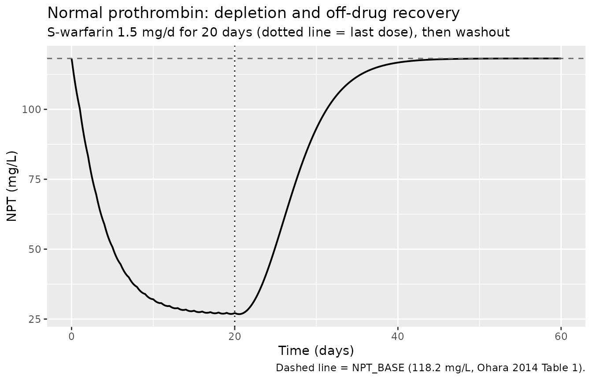
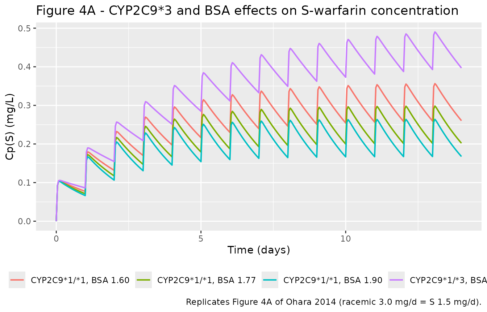
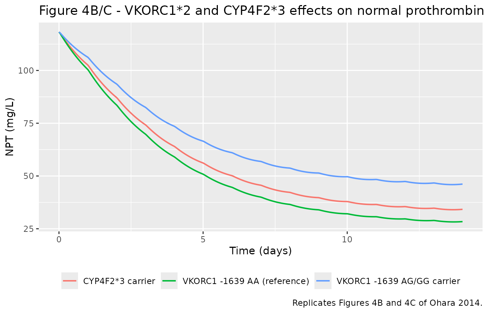
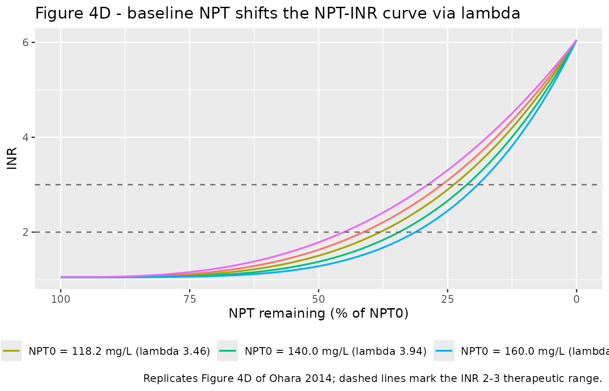
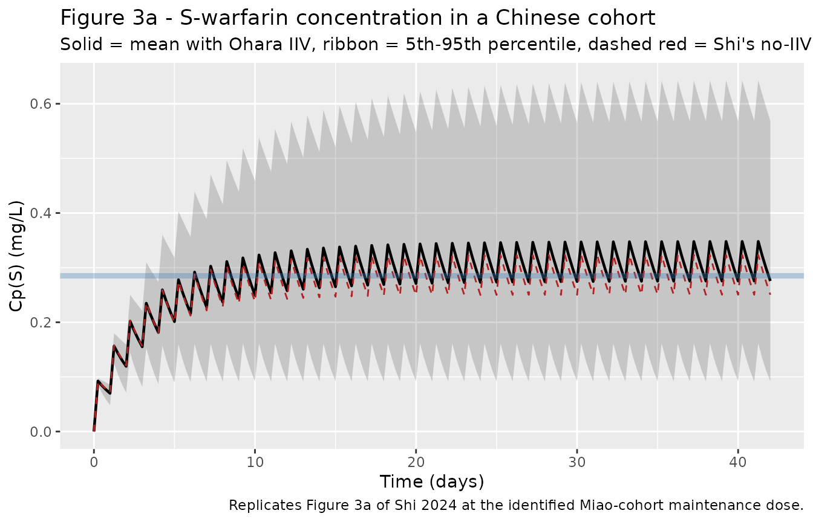
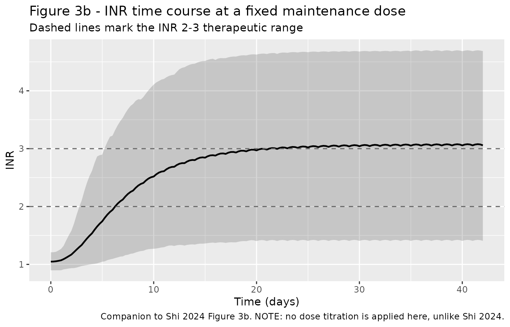

# S-warfarin PK/PD and INR (Ohara 2014)

## Model and source

- Citation: Ohara M, Takahashi H, Lee MTM, Wen M-S, Lee T-H, Chuang H-P,
  Luo C-H, Arima A, Onozuka A, Nagai R, Shiomi M, Mihara K, Morita T,
  Chen Y-T. Determinants of the Over-Anticoagulation Response during
  Warfarin Initiation Therapy in Asian Patients Based on Population
  Pharmacokinetic-Pharmacodynamic Analyses. PLoS One. 2014;9(8):e105891.
  <doi:10.1371/journal.pone.0105891>. PMID: 25148255. PMCID: PMC4141831.
  Structural equations from Methods Eqs 1-3; all parameter estimates,
  inter-individual and residual error from Table 2; NPT0 / INR0
  baselines and cohort demographics from Table 1. The explicit
  covariate-model equations (CL(S), IC50 and lambda), the BSA reference
  of 1.74 m^2 and the NPT0 centering value of 119 mg/L are taken from
  the application paper: Shi K, Deng J. Comparative performance of
  pharmacogenetics-based warfarin dosing algorithms in Chinese
  population: use of a pharmacokinetic/pharmacodynamic model to explore
  dosing regimen through clinical trial simulation. Pharmacogenet
  Genomics. 2024;34(8):275-284. <doi:10.1097/FPC.0000000000000545>.
  PMCID: PMC11424055 (Table 3 and its footnotes a-d).
- Description: S-warfarin population PK/PD in Asian (Taiwanese Chinese)
  patients during warfarin induction therapy: a one-compartment
  first-order-absorption PK model for S-warfarin drives an
  indirect-response model in which S-warfarin inhibits synthesis of
  plasma normal prothrombin (NPT), and NPT depletion drives INR through
  a nonlinear power model (Ohara 2014). CYP2C9*3 genotype and body
  surface area are predictors of S-warfarin clearance; VKORC1 -1639G\>A
  and CYP4F2*3 genotypes are predictors of IC50; baseline NPT is a
  predictor of the INR nonlinearity exponent lambda. The explicit
  covariate equations and the Chinese-cohort clinical-trial-simulation
  application are from Shi 2024. Dosing is expressed as the S-warfarin
  dose, i.e. half the racemic warfarin dose. R-warfarin is not described
  by this model.
- Article (model source): <https://doi.org/10.1371/journal.pone.0105891>
- Article (application / covariate equations):
  <https://doi.org/10.1097/FPC.0000000000000545>

This model comes from two papers that must be read together.

**Ohara 2014** (PLoS One 9(8):e105891) developed the model in 99
Taiwanese Chinese patients starting warfarin. It is a three-stage
sequential PK/PD model: S-warfarin plasma concentration (PK) drives
inhibition of normal-prothrombin synthesis (PD-1), and the resulting
depletion of normal prothrombin drives INR (PD-2). Ohara 2014 reports
every structural estimate, every fixed constant, all inter-individual
variability and all residual error.

**Shi 2024** (Pharmacogenet Genomics 34:275-284) re-used the model
unchanged to run clinical-trial simulations in Chinese cohorts,
comparing the IWPC, Gage and Miao pharmacogenetic dosing algorithms. Shi
2024 contributes the *explicit covariate equations* (Table 3 footnotes
b-d), which Ohara 2014 states only in prose, together with the BSA
normalisation constant (1.74 m^2) and the baseline normal-prothrombin
centering value (119 mg/L). Shi 2024 deliberately simulated without
unexplained variability, so all the variability in the packaged model
comes from Ohara 2014.

The model file is attributed to Ohara 2014 because the model is entirely
theirs; Shi 2024 changed nothing about it.

## Population

Ohara 2014 studied 99 Chinese patients in Taiwan enrolled in a
prospective randomized trial of genotype-guided (n = 77) versus standard
(n = 22) warfarin initiation (Ohara 2014 Table 1). Mean age was 64.5 +/-
15.2 years, mean body weight 68.4 +/- 12.4 kg, mean body surface area
1.74 +/- 0.18 m^2, and 39 of 99 (39.4%) were female. Indications were
atrial fibrillation (54.5%), stroke (29.3%), deep vein thrombosis
(25.3%) and pulmonary embolism (8.1%). The mean starting dose was 4.34
+/- 0.98 mg/day of racemic warfarin and the mean maintenance dose
(determined in 89 of 99 patients) was 2.94 +/- 1.35 mg/day, against a
target INR of 2.0-3.0.

The cohort is strongly East-Asian in its pharmacogenetics: VKORC1 -1639
A/A in 81 of 99 (A allele frequency 0.904), CYP2C9*1/*1 in 88 of 99 (\*3
MAF 0.056), and CYP4F2\*3 MAF 0.278. Baseline normal prothrombin (NPT0)
was 118.2 +/- 22.1 mg/L and baseline INR 1.05 +/- 0.10. Thirty-five of
99 patients (35%) reached an INR of 4 or more during induction, which is
the over-anticoagulation phenotype the paper set out to explain.

Shi 2024 applied the model to simulated mainland-Chinese cohorts built
from a 660-patient multicentre trial (Shi 2024 Table 1): age 67.4 +/-
10.1 years, weight 62.2 +/- 12.2 kg, height 161.9 +/- 8.0 cm, VKORC1
-1639 AA 80.2% / AG 18.0% / GG 1.7%, and CYP2C9 \*1/\*1 92.0% / \*1/\*3
7.6% / \*3/\*3 0.3%.

The same information is available programmatically via the model’s
`population` metadata
(`rxode2::rxode(readModelDb("Ohara_2014_warfarin_s"))$population`).

## Source trace

Per-parameter origins are recorded as in-file comments next to each
`ini()` entry in `inst/modeldb/specificDrugs/Ohara_2014_warfarin_s.R`.
They are collected here for review. “O” = Ohara 2014, “S” = Shi 2024.

| Equation / parameter | Value | Source location |
|----|----|----|
| `d/dt(depot)`, `d/dt(central)` (1-cmt, first-order absorption) | n/a | O Eq 1 (written as the analytic ADVAN2/TRANS2 solution; encoded here as the equivalent ODE pair) |
| `d/dt(npt)` (indirect response, synthesis inhibition) | n/a | O Eq 2 |
| `INR` (nonlinear power model) | n/a | O Eq 3 |
| `lfdepot` (F) | `fixed(log(1))` | O Methods, PK paragraph: “F is the bioavailability fixed at 1.0” |
| `lka` | `fixed(log(2))` /h | O Methods, PK paragraph: “Ka is the absorption rate constant fixed at 2 h-1” |
| `lvc` (Vd) | `fixed(log(13.8))` L | O Methods, PK paragraph: “Vd … of S-warfarin fixed at 13.8 L” (their ref 26) |
| `lcl` (CL(S)) | `log(0.240)` L/h | O Table 2: 240 mL/h (95% CI 220, 260); S Table 3: 0.24 L/h |
| `e_cyp2c9s3_cl` | 0.543 | O Table 2 (95% CI 0.374, 0.712); S Table 3 |
| `e_bsa_cl` | 2.14 | O Table 2 (95% CI 1.12, 3.16); S Table 3 |
| CL(S) covariate equation | `0.24 * 0.543^CYP2C9*3 * (BSA/1.74)^2.14` | S Table 3 footnote b (verbatim) |
| `lic50` | `log(0.0725)` mg/L | O Table 2 (95% CI 0.0631, 0.0819) |
| `lkout` | `log(0.0136)` /h | O Table 2 (95% CI 0.0121, 0.0151) |
| `limax` | `fixed(log(1))` | O Methods, PD-1 paragraph: “IMax … assumed to be 1.0” |
| `e_vkorc1_ic50` | 2.07 | O Table 2 (95% CI 1.58, 2.56); S Table 3 |
| `e_cyp4f2_ic50` | 1.30 | O Table 2 (95% CI 1.07, 1.53); S Table 3 |
| IC50 covariate equation | `0.0725 * 2.07^VKORC1*2 * 1.30^CYP4F2*3` | S Table 3 footnote c (verbatim) |
| `linrmax` | `fixed(log(5))` | O Table 2 row “INR Max (fixed)”; O Methods, PD-2 paragraph |
| `llambda` | `log(3.48)` | O Table 2 (95% CI 3.30, 3.66) |
| `e_npt0_lambda` | 0.00588 | O Table 2 (95% CI 0.00304, 0.00872) |
| lambda covariate equation | `3.48 * exp(0.00588 * (NPT0 - 119))` | S Table 3 footnote d (verbatim; 119 mg/L is the median NPT0) |
| `kin = kout * NPT_BASE` | n/a | O Methods, PD-1 paragraph: “Kin is expressed as Kout \* NPT0” |
| `etalcl` | 0.15920 | O Table 2: omega CL(S) 39.9% -\> 0.399^2 |
| `etalic50` | 0.14822 | O Table 2: omega IC50 38.5% -\> 0.385^2 |
| `etalkout` | 0.20794 | O Table 2: omega Kout 45.6% -\> 0.456^2 |
| `etallambda` | 0.05808 | O Table 2: omega lambda 24.1% -\> 0.241^2 |
| `addSd` (Cp(S)) | 0.0697 mg/L | O Table 2, PK residual error (95% CI 0.0676, 0.0718) |
| `addSd_NPT` | 12.2 mg/L | O Table 2, PD-1 residual error (95% CI -16.6, 41.1) |
| `propSd_INR` | 0.247 | O Table 2, PD-2 residual error 24.7% (“relative error model”) |
| `NPT_BASE` default | 118.2 mg/L | O Table 1 (mean, n = 99) |
| `INR_BASE` default | 1.05 | O Table 1 (INR0 mean, n = 99) |

## Simulation set-up

All three endpoints of this model (`Cc`, `NPT`, `INR`) are algebraic
observables rather than ODE states, so observation records are tagged
with `dvid = 1` and a blank `cmt`; every algebraic observable is
returned on every solved row regardless.

``` r

mod <- readModelDb("Ohara_2014_warfarin_s")

# Ohara 2014 reference constants, used throughout as gate targets.
KA_FIX   <- 2      # /h    (Ohara Methods)
VD_FIX   <- 13.8   # L     (Ohara Methods)
CL_REF   <- 0.240  # L/h   (Ohara Table 2, at BSA 1.74, CYP2C9*1/*1)
BSA_REF  <- 1.74   # m^2   (Shi Table 3 footnote b)
IC50_REF <- 0.0725 # mg/L  (Ohara Table 2)
KOUT_REF <- 0.0136 # /h    (Ohara Table 2)
NPT0_REF <- 118.2  # mg/L  (Ohara Table 1)
INR0_REF <- 1.05   #       (Ohara Table 1)

# DuBois BSA, the standard used with warfarin dosing algorithms.
duboisBsa <- function(wtKg, htCm) 0.007184 * wtKg^0.425 * htCm^0.725

# Ohara 2014 typical CL(S) as a closed form, for cross-checking the model.
claim_cl <- function(bsa, cyp2c9s3Carrier = 0) {
  CL_REF * 0.543^cyp2c9s3Carrier * (bsa / BSA_REF)^2.14
}

# Build an event table. `covariates` is a one-row-per-subject data frame that
# must contain `id` plus every covariate column the model needs. Doses are
# S-warfarin doses (see "Assumptions and deviations").
makeEvents <- function(covariates, sDose, ii = 24, untilH, obsTimes) {
  dose <- covariates |>
    dplyr::select(id) |>
    dplyr::mutate(sDose = sDose) |>
    tidyr::expand_grid(time = seq(0, untilH - ii, by = ii)) |>
    dplyr::transmute(
      id, time, amt = sDose, evid = 1L,
      cmt = "depot", dvid = NA_integer_
    )
  obs <- covariates |>
    dplyr::select(id) |>
    tidyr::expand_grid(time = obsTimes) |>
    dplyr::mutate(amt = NA_real_, evid = 0L, cmt = NA_character_, dvid = 1L)
  dplyr::bind_rows(dose, obs) |>
    dplyr::left_join(covariates, by = "id") |>
    dplyr::arrange(id, time, dplyr::desc(evid))
}

# Deterministic (typical-value) solve: supply zero eta columns and omega = NA
# rather than zeroRe(), which mutates shared model state.
ZERO_ETAS <- list(etalcl = 0, etalic50 = 0, etalkout = 0, etallambda = 0)

solveTypical <- function(events, keep = character()) {
  for (nm in names(ZERO_ETAS)) events[[nm]] <- ZERO_ETAS[[nm]]
  rxode2::rxSolve(mod, events, omega = NA, keep = keep, returnType = "data.frame")
}
```

## Structural gates

These checks are exact: each has a closed-form answer derived from the
paper’s own equations, so a failure is unambiguous. They run as
[`stopifnot()`](https://rdrr.io/r/base/stopifnot.html) so the vignette
cannot render if the packaged model drifts.

### Gate 1 - drug-free steady-state hold

Ohara 2014 sets `Kin = Kout * NPT0`, which means the normal-prothrombin
pool must sit exactly at its measured baseline when no warfarin is
present, and INR must sit exactly at `INR_Base`. This is the single most
informative structural check on the PD-1/PD-2 arms.

``` r

covOne <- data.frame(
  id = 1L, BSA = 1.77, CYP2C9_S3_COUNT = 0, VKORC1_1639G_COUNT = 0,
  SNP_CYP4F2_RS2108622_T_COUNT = 0, NPT_BASE = NPT0_REF, INR_BASE = INR0_REF
)

drugFree <- makeEvents(covOne, sDose = 0, untilH = 24, obsTimes = seq(0, 24 * 30, by = 6)) |>
  dplyr::filter(evid == 0L) |>
  solveTypical()

stopifnot(
  max(abs(drugFree$NPT - NPT0_REF)) < 1e-8,
  max(abs(drugFree$INR - INR0_REF)) < 1e-10
)

data.frame(
  Check = c("NPT held at NPT_BASE (mg/L)", "INR held at INR_BASE"),
  Target = c(NPT0_REF, INR0_REF),
  `Max absolute deviation over 30 days` = c(
    max(abs(drugFree$NPT - NPT0_REF)), max(abs(drugFree$INR - INR0_REF))
  ),
  check.names = FALSE
) |>
  knitr::kable(caption = "Gate 1. With no warfarin, the turnover pool and INR are pinned at baseline to machine precision, confirming kin = kout * NPT0 (Ohara 2014 Methods, PD-1 paragraph).")
```

| Check                       | Target | Max absolute deviation over 30 days |
|:----------------------------|-------:|------------------------------------:|
| NPT held at NPT_BASE (mg/L) | 118.20 |                                   0 |
| INR held at INR_BASE        |   1.05 |                                   0 |

Gate 1. With no warfarin, the turnover pool and INR are pinned at
baseline to machine precision, confirming kin = kout \* NPT0 (Ohara 2014
Methods, PD-1 paragraph). {.table}

### Gate 2 - covariate multipliers reproduce Ohara Table 2 exactly

Each genotype effect in the source papers is a *carriage* multiplier, so
a homozygous variant subject gets the same factor as a heterozygote.

``` r

covGrid <- expand.grid(
  CYP2C9_S3_COUNT = 0:1, VKORC1_1639G_COUNT = 0:1,
  SNP_CYP4F2_RS2108622_T_COUNT = 0:1
) |>
  dplyr::mutate(
    id = dplyr::row_number(), BSA = BSA_REF,
    NPT_BASE = NPT0_REF, INR_BASE = INR0_REF
  )

covCheck <- makeEvents(covGrid, sDose = 0, untilH = 24, obsTimes = 0) |>
  dplyr::filter(evid == 0L) |>
  solveTypical() |>
  dplyr::left_join(covGrid |> dplyr::select(id, dplyr::everything()), by = "id",
                   suffix = c("", ".cov"))
#> Warning: multi-subject simulation without without 'omega'

expectedCl   <- CL_REF * 0.543^covGrid$CYP2C9_S3_COUNT
expectedIc50 <- IC50_REF * 2.07^covGrid$VKORC1_1639G_COUNT *
  1.30^covGrid$SNP_CYP4F2_RS2108622_T_COUNT

stopifnot(
  max(abs(covCheck$cl   - expectedCl))   < 1e-12,
  max(abs(covCheck$ic50 - expectedIc50)) < 1e-12
)

covCheck |>
  dplyr::transmute(
    `CYP2C9*3 carrier` = CYP2C9_S3_COUNT,
    `VKORC1 -1639G carrier` = VKORC1_1639G_COUNT,
    `CYP4F2*3 carrier` = SNP_CYP4F2_RS2108622_T_COUNT,
    `CL(S) (L/h)` = cl,
    `IC50 (mg/L)` = ic50,
    `lambda` = lambda
  ) |>
  knitr::kable(digits = 5, caption = "Gate 2. Derived CL(S) and IC50 at the reference BSA of 1.74 m^2, matching Ohara 2014 Table 2 multipliers (0.543x for CYP2C9*3, 2.07x for VKORC1 -1639G, 1.30x for CYP4F2*3) to machine precision.")
```

| CYP2C9\*3 carrier | VKORC1 -1639G carrier | CYP4F2\*3 carrier | CL(S) (L/h) | IC50 (mg/L) | lambda |
|---:|---:|---:|---:|---:|---:|
| 0 | 0 | 0 | 0.24000 | 0.07250 | 3.46367 |
| 1 | 0 | 0 | 0.13032 | 0.07250 | 3.46367 |
| 0 | 1 | 0 | 0.24000 | 0.15007 | 3.46367 |
| 1 | 1 | 0 | 0.13032 | 0.15007 | 3.46367 |
| 0 | 0 | 1 | 0.24000 | 0.09425 | 3.46367 |
| 1 | 0 | 1 | 0.13032 | 0.09425 | 3.46367 |
| 0 | 1 | 1 | 0.24000 | 0.19510 | 3.46367 |
| 1 | 1 | 1 | 0.13032 | 0.19510 | 3.46367 |

Gate 2. Derived CL(S) and IC50 at the reference BSA of 1.74 m^2,
matching Ohara 2014 Table 2 multipliers (0.543x for CYP2C9*3, 2.07x for
VKORC1 -1639G, 1.30x for CYP4F2*3) to machine precision. {.table}

The `lambda` column is constant at 3.4637 because every row uses the
same `NPT_BASE` of 118.2 mg/L; Shi 2024 Table 3 footnote d gives
`lambda = 3.48 * exp(0.00588 * (NPT0 - 119))`, so at the cohort mean
NPT0 the exponent sits just below its typical value of 3.48.

### Gate 3 - exact end-to-end steady-state identity

Under a constant-rate infusion the whole three-stage model collapses to
closed form, giving an exact check on every layer at once:

- PK (Eq 1): `Cp(S) = R / CL(S)`
- PD-1 (Eq 2), setting `dNPT/dt = 0` with `IMax = 1`:
  `NPT_ss = NPT0 * (1 - Cp / (IC50 + Cp))`
- PD-2 (Eq 3): `INR_ss = INR_Base + 5 * (1 - NPT_ss / NPT0)^lambda`

``` r

INF_CP  <- 0.25                        # target steady-state Cp(S), mg/L
clOne   <- claim_cl(1.77)
infRate <- INF_CP * clOne              # mg/h
infDur  <- 24 * 80                     # h; >> both the 40 h drug and 51 h NPT half-lives

infEvents <- dplyr::bind_rows(
  data.frame(id = 1L, time = 0, amt = infRate * infDur, rate = infRate,
             evid = 1L, cmt = "central", dvid = NA_integer_),
  data.frame(id = 1L, time = seq(0, 24 * 70, by = 6), amt = NA_real_,
             rate = NA_real_, evid = 0L, cmt = NA_character_, dvid = 1L)
) |>
  dplyr::arrange(time, dplyr::desc(evid)) |>
  dplyr::left_join(covOne, by = "id")

infSs <- solveTypical(infEvents) |> dplyr::slice_tail(n = 1)

expCp   <- infRate / clOne
expNpt  <- NPT0_REF * (1 - expCp / (IC50_REF + expCp))
expLam  <- 3.48 * exp(0.00588 * (NPT0_REF - 119))
expInr  <- INR0_REF + 5 * (1 - expNpt / NPT0_REF)^expLam

stopifnot(
  abs(infSs$Cc  / expCp  - 1) < 1e-8,
  abs(infSs$NPT / expNpt - 1) < 1e-6,
  abs(infSs$INR / expInr - 1) < 1e-6
)

data.frame(
  Layer = c("PK - Cp(S) (mg/L)", "PD-1 - NPT (mg/L)", "PD-2 - INR"),
  `Closed form` = c(expCp, expNpt, expInr),
  Simulated = c(infSs$Cc, infSs$NPT, infSs$INR),
  `Relative error` = sprintf("%.1e", c(abs(infSs$Cc / expCp - 1),
                                       abs(infSs$NPT / expNpt - 1),
                                       abs(infSs$INR / expInr - 1))),
  check.names = FALSE
) |>
  knitr::kable(digits = 6, caption = "Gate 3. Under a constant infusion, all three layers of Ohara 2014 Eqs 1-3 match their closed-form steady states to solver precision.")
```

| Layer             | Closed form | Simulated | Relative error |
|:------------------|------------:|----------:|:---------------|
| PK - Cp(S) (mg/L) |    0.250000 |  0.250000 | 8.8e-14        |
| PD-1 - NPT (mg/L) |   26.572093 | 26.572093 | 9.0e-10        |
| PD-2 - INR        |    3.119779 |  3.119779 | 6.0e-10        |

Gate 3. Under a constant infusion, all three layers of Ohara 2014 Eqs
1-3 match their closed-form steady states to solver precision. {.table}

### Gate 4 - off-drug recovery of the NPT pool

After warfarin is withdrawn, normal prothrombin returns to baseline
governed by `Kout`, i.e. a half-life of `log(2) / 0.0136` = 51 h.

``` r

recEvents <- makeEvents(covOne, sDose = 1.5, ii = 24, untilH = 24 * 21,
                        obsTimes = seq(0, 24 * 60, by = 1))
rec <- solveTypical(recEvents)

# Fit the log-linear return to baseline late enough that residual S-warfarin
# (half-life ~40 h) has decayed far below the turnover mode (half-life ~51 h).
recTail <- rec |>
  dplyr::filter(time >= 24 * 40, time <= 24 * 58) |>
  dplyr::mutate(gap = NPT0_REF - NPT) |>
  dplyr::filter(gap > 1e-9)

kRecovered <- -stats::coef(stats::lm(log(gap) ~ time, data = recTail))[["time"]]
stopifnot(abs(kRecovered - KOUT_REF) / KOUT_REF < 0.05)

data.frame(
  Quantity = c("Recovery rate constant (1/h)", "Recovery half-life (h)"),
  `Ohara 2014 Table 2` = c(KOUT_REF, log(2) / KOUT_REF),
  `Recovered from simulation` = c(kRecovered, log(2) / kRecovered),
  check.names = FALSE
) |>
  knitr::kable(digits = 5, caption = "Gate 4. The off-drug return of NPT to baseline recovers Kout to within a few percent.")
```

| Quantity                     | Ohara 2014 Table 2 | Recovered from simulation |
|:-----------------------------|-------------------:|--------------------------:|
| Recovery rate constant (1/h) |             0.0136 |                   0.01328 |
| Recovery half-life (h)       |            50.9667 |                  52.17568 |

Gate 4. The off-drug return of NPT to baseline recovers Kout to within a
few percent. {.table}

The recovery is not a single exponential: residual S-warfarin decays
with the drug elimination rate (`CL/Vd` = 0.0180 /h) while the pool
refills at `Kout` = 0.0136 /h, so a log-linear fit approaches `Kout`
from below as the drug mode dies out. That is why this gate carries a 5%
tolerance whereas Gate 3, which has an exact closed form, is held to
solver precision.

``` r

rec |>
  dplyr::mutate(day = time / 24) |>
  ggplot(aes(day, NPT)) +
  geom_line(linewidth = 0.7) +
  geom_hline(yintercept = NPT0_REF, linetype = "dashed", colour = "grey40") +
  geom_vline(xintercept = 20, linetype = "dotted") +
  labs(x = "Time (days)", y = "NPT (mg/L)",
       title = "Normal prothrombin: depletion and off-drug recovery",
       subtitle = "S-warfarin 1.5 mg/d for 20 days (dotted line = last dose), then washout",
       caption = "Dashed line = NPT_BASE (118.2 mg/L, Ohara 2014 Table 1).")
```



## Replicating Ohara 2014 Figure 4

Figure 4 of Ohara 2014 predicts the impact of each covariate “in typical
Chinese patients with a BSA of 1.77 m^2 (165 cm and 70 kg) after
administration of racemic warfarin at 3.0 mg/d”, i.e. 1.5 mg/d of
S-warfarin.

``` r

FIG4_BSA     <- 1.77
FIG4_S_DOSE  <- 1.5     # mg/d S-warfarin = racemic 3.0 mg/d
FIG4_DAYS    <- 14
fig4Obs      <- seq(0, 24 * FIG4_DAYS, by = 1)

runScenarios <- function(scen) {
  ev <- makeEvents(scen, sDose = FIG4_S_DOSE, untilH = 24 * FIG4_DAYS,
                   obsTimes = fig4Obs)
  solveTypical(ev, keep = "scenario") |>
    dplyr::mutate(day = time / 24)
}
```

### Panel A - CYP2C9\*3 and BSA on CL(S), seen in Cp(S)

``` r

scenA <- dplyr::bind_rows(
  data.frame(scenario = "CYP2C9*1/*1, BSA 1.77", CYP2C9_S3_COUNT = 0, BSA = FIG4_BSA),
  data.frame(scenario = "CYP2C9*1/*3, BSA 1.77", CYP2C9_S3_COUNT = 1, BSA = FIG4_BSA),
  data.frame(scenario = "CYP2C9*1/*1, BSA 1.60", CYP2C9_S3_COUNT = 0, BSA = 1.60),
  data.frame(scenario = "CYP2C9*1/*1, BSA 1.90", CYP2C9_S3_COUNT = 0, BSA = 1.90)
) |>
  dplyr::mutate(
    id = dplyr::row_number(), VKORC1_1639G_COUNT = 0,
    SNP_CYP4F2_RS2108622_T_COUNT = 0, NPT_BASE = NPT0_REF, INR_BASE = INR0_REF
  )

runScenarios(scenA) |>
  ggplot(aes(day, Cc, colour = scenario)) +
  geom_line(linewidth = 0.7) +
  labs(x = "Time (days)", y = "Cp(S) (mg/L)", colour = NULL,
       title = "Figure 4A - CYP2C9*3 and BSA effects on S-warfarin concentration",
       caption = "Replicates Figure 4A of Ohara 2014 (racemic 3.0 mg/d = S 1.5 mg/d).") +
  theme(legend.position = "bottom")
#> Warning: multi-subject simulation without without 'omega'
```



Ohara 2014 report that CYP2C9\*3 has “a stronger impact than that of BSA
on CL(S)”, and that CL(S) falls about 13% per 0.1 m^2 decrease in BSA.
Both are reproduced: the \*1/\*3 curve is the highest by a wide margin
(CL(S) is 0.543x the wild-type value), while a 0.17 m^2 BSA change moves
the curve much less.

``` r

clSpan <- c(
  `CYP2C9*1/*3 vs *1/*1` = claim_cl(FIG4_BSA, 1) / claim_cl(FIG4_BSA, 0),
  `BSA 1.60 vs 1.77` = claim_cl(1.60) / claim_cl(FIG4_BSA),
  `BSA 1.80 vs 1.70 (Ohara text: ~13% per -0.1 m^2)` = claim_cl(1.70) / claim_cl(1.80)
)
knitr::kable(data.frame(Comparison = names(clSpan), `CL(S) ratio` = round(clSpan, 3),
                        check.names = FALSE, row.names = NULL),
             caption = "CL(S) ratios implied by the packaged covariate model. Ohara 2014 Results state a 46% CL(S) reduction for CYP2C9*3 carriers and a 13% reduction going from BSA 1.8 to 1.7 m^2.")
```

| Comparison                                       | CL(S) ratio |
|:-------------------------------------------------|------------:|
| CYP2C9*1/*3 vs *1/*1                             |       0.543 |
| BSA 1.60 vs 1.77                                 |       0.806 |
| BSA 1.80 vs 1.70 (Ohara text: ~13% per -0.1 m^2) |       0.885 |

CL(S) ratios implied by the packaged covariate model. Ohara 2014 Results
state a 46% CL(S) reduction for CYP2C9\*3 carriers and a 13% reduction
going from BSA 1.8 to 1.7 m^2. {.table}

### Panels B and C - VKORC1\*2 and CYP4F2\*3 on IC50, seen in NPT

``` r

scenBC <- dplyr::bind_rows(
  data.frame(scenario = "VKORC1 -1639 AA (reference)", VKORC1_1639G_COUNT = 0,
             SNP_CYP4F2_RS2108622_T_COUNT = 0),
  data.frame(scenario = "VKORC1 -1639 AG/GG carrier", VKORC1_1639G_COUNT = 1,
             SNP_CYP4F2_RS2108622_T_COUNT = 0),
  data.frame(scenario = "CYP4F2*3 carrier", VKORC1_1639G_COUNT = 0,
             SNP_CYP4F2_RS2108622_T_COUNT = 1)
) |>
  dplyr::mutate(
    id = dplyr::row_number(), BSA = FIG4_BSA, CYP2C9_S3_COUNT = 0,
    NPT_BASE = NPT0_REF, INR_BASE = INR0_REF
  )

runScenarios(scenBC) |>
  ggplot(aes(day, NPT, colour = scenario)) +
  geom_line(linewidth = 0.7) +
  labs(x = "Time (days)", y = "NPT (mg/L)", colour = NULL,
       title = "Figure 4B/C - VKORC1*2 and CYP4F2*3 effects on normal prothrombin",
       caption = "Replicates Figures 4B and 4C of Ohara 2014.") +
  theme(legend.position = "bottom")
#> Warning: multi-subject simulation without without 'omega'
```



Ohara 2014 state that “mutation of VKORC1\*2 had a greater influence
than that of CYP4F2\*3 on IC50” - reproduced here, since carriage of
-1639G raises IC50 2.07-fold versus 1.30-fold for CYP4F2\*3. Higher IC50
means less inhibition of prothrombin synthesis, so the variant curves
sit above the reference.

### Panel D - baseline NPT on the NPT-INR relationship

``` r

nptSeq <- seq(0, NPT0_REF, length.out = 200)
npt0Levels <- c(80, 100, 118.2, 140, 160)

fig4d <- lapply(npt0Levels, function(n0) {
  lam <- 3.48 * exp(0.00588 * (n0 - 119))
  data.frame(
    npt0 = n0, lambda = lam,
    fracRemaining = nptSeq / NPT0_REF,
    INR = INR0_REF + 5 * (1 - nptSeq / NPT0_REF)^lam
  )
}) |>
  dplyr::bind_rows() |>
  dplyr::mutate(npt0 = factor(sprintf("NPT0 = %.1f mg/L (lambda %.2f)", npt0, lambda)))

ggplot(fig4d, aes(100 * fracRemaining, INR, colour = npt0)) +
  geom_line(linewidth = 0.7) +
  geom_hline(yintercept = c(2, 3), linetype = "dashed", colour = "grey40") +
  scale_x_reverse() +
  labs(x = "NPT remaining (% of NPT0)", y = "INR", colour = NULL,
       title = "Figure 4D - baseline NPT shifts the NPT-INR curve via lambda",
       caption = "Replicates Figure 4D of Ohara 2014; dashed lines mark the INR 2-3 therapeutic range.") +
  theme(legend.position = "bottom")
```



This reproduces the paper’s stated direction: “the lower the NPT0, the
smaller the non-linear index lambda leading to a sharp increase in INR
in response to the reduction of NPT after warfarin dosing.” A patient
with NPT0 = 80 mg/L reaches INR 2 after far less prothrombin depletion
than one with NPT0 = 160 mg/L.

## Replicating Shi 2024 Figure 3a

Shi 2024 simulated 500 virtual Chinese patients per dosing algorithm and
report (Results, “In order to compare the performance…”) that “the mean
simulated S-warfarin concentrations for Gage and IWPC dosing cohorts
reached as high as 0.38-0.40 mg/l by about 2 weeks, compared to
0.28-0.29 mg/l for the Miao dosing cohort.”

Shi 2024 does not print the numeric doses their algorithms produced, so
the concentration cannot be predicted from a stated dose. The test run
here is the inverse and is sharper: **use the published concentration
window to identify the daily dose it implies, then check that dose
against independently reported Chinese warfarin maintenance doses.** No
model parameter is fitted or tuned - the PK layer is linear in dose, so
the implied dose follows by proportion.

This is also the check that settles a convention neither paper states:
whether the model is dosed with the S-warfarin dose or the racemic dose.
The two readings differ by a factor of two and only one of them lands on
a dose any warfarin algorithm produces.

Shi 2024 deliberately simulated without unexplained variability (“We
ignored unexplained variability as it is not possible to attribute it to
or correlate it with any of the covariates”), so the cohort mean below
is taken from a deterministic solve over the covariate distribution
only. Ohara 2014’s published inter-individual variability is added back
in the following section.

``` r

set.seed(20260807)
N_ARM <- 200  # per-arm cap

shiCohort <- tibble::tibble(
  id = seq_len(N_ARM),
  AGE = stats::rnorm(N_ARM, 67.4, 10.1),
  WT  = stats::rnorm(N_ARM, 62.2, 12.2),
  HT  = stats::rnorm(N_ARM, 161.9, 8.0)
) |>
  dplyr::mutate(
    WT = pmax(WT, 35), HT = pmax(HT, 140),
    BSA = duboisBsa(WT, HT),
    # Shi 2024 Table 1 genotype frequencies
    VKORC1_1639G_COUNT = sample(0:2, N_ARM, TRUE, c(0.802, 0.180, 0.017)),
    CYP2C9_S3_COUNT    = sample(0:2, N_ARM, TRUE, c(0.920, 0.076, 0.003)),
    # Shi 2024 Table 3 footnote c: all patients assumed CYP4F2*1/*1
    SNP_CYP4F2_RS2108622_T_COUNT = 0,
    # Not reported by Shi 2024; Ohara 2014 Table 1 distributions used instead.
    NPT_BASE = pmax(stats::rnorm(N_ARM, NPT0_REF, 22.1), 40),
    INR_BASE = pmax(stats::rnorm(N_ARM, INR0_REF, 0.10), 0.8)
  )

sprintf("Simulated cohort: BSA mean %.3f m^2 (Shi Table 1 implies %.3f from 62.2 kg / 161.9 cm)",
        mean(shiCohort$BSA), duboisBsa(62.2, 161.9))
#> [1] "Simulated cohort: BSA mean 1.655 m^2 (Shi Table 1 implies 1.661 from 62.2 kg / 161.9 cm)"
```

``` r

SHI_DAYS <- 42
REF_S_DOSE <- 1.0                       # arbitrary reference; PK is linear in dose
shiObs <- seq(0, 24 * SHI_DAYS, by = 6)

shiEventsRef <- makeEvents(shiCohort, sDose = REF_S_DOSE,
                           untilH = 24 * SHI_DAYS, obsTimes = shiObs)

# Shi 2024's own method: covariate variation only, no unexplained variability.
shiDet <- solveTypical(shiEventsRef) |>
  dplyr::filter(!is.na(Cc)) |>
  dplyr::mutate(day = time / 24)
#> Warning: multi-subject simulation without without 'omega'

# Cohort-mean steady-state Cp(S) per 1 mg/day of S-warfarin.
ccPerMgS <- shiDet |>
  dplyr::filter(day >= 28) |>
  dplyr::summarise(m = mean(Cc)) |>
  dplyr::pull(m)

# Confirm dose linearity before scaling by proportion. The PK layer is linear,
# so this is a property of the solver rather than of the cohort; a 10-subject
# subset is enough and keeps the render cheap.
linSub <- dplyr::slice_head(shiCohort, n = 10)
linMean <- function(sDose) {
  solveTypical(makeEvents(linSub, sDose = sDose, untilH = 24 * SHI_DAYS,
                          obsTimes = shiObs)) |>
    dplyr::filter(!is.na(Cc), time >= 24 * 28) |>
    dplyr::summarise(m = mean(Cc)) |>
    dplyr::pull(m)
}
stopifnot(abs(linMean(2 * REF_S_DOSE) / (2 * linMean(REF_S_DOSE)) - 1) < 1e-6)
#> Warning: multi-subject simulation without without 'omega'
#> Warning: multi-subject simulation without without 'omega'

sprintf("Cohort-mean steady-state Cp(S) = %.4f mg/L per 1 mg/day S-warfarin", ccPerMgS)
#> [1] "Cohort-mean steady-state Cp(S) = 0.2044 mg/L per 1 mg/day S-warfarin"
```

``` r

SHI_TARGET <- c(0.28, 0.29)   # Shi 2024 Results / Fig 3a, Miao dosing cohort

impliedSDose   <- SHI_TARGET / ccPerMgS          # mg/day S-warfarin
impliedRacemic <- 2 * impliedSDose               # mg/day racemic, if dose = S-dose

# Chinese warfarin maintenance doses reported independently of Shi's Fig 3a:
#   Ohara 2014 Table 1  : 2.94 +/- 1.35 mg/day racemic (n = 89)
#   Shi 2024 Discussion : "2-3 mg/d in the Chinese population"
stopifnot(
  all(impliedRacemic >= 2.0, impliedRacemic <= 3.0),   # S-dose reading is plausible
  all(impliedSDose   <  2.0)                           # racemic reading is not
)

data.frame(
  `Dosing convention` = c("Dose = S-warfarin (half racemic)", "Dose = full racemic"),
  `Implied racemic maintenance dose (mg/day)` = c(
    sprintf("%.2f - %.2f", impliedRacemic[1], impliedRacemic[2]),
    sprintf("%.2f - %.2f", impliedSDose[1], impliedSDose[2])
  ),
  `Consistent with reported Chinese doses?` = c(
    "yes (Ohara 2014 Table 1: 2.94 +/- 1.35; Shi 2024 Discussion: 2-3 mg/d)",
    "no (far below any reported maintenance dose)"
  ),
  check.names = FALSE
) |>
  knitr::kable(caption = "Shi 2024 Figure 3a gate. The published Miao-cohort plateau of 0.28-0.29 mg/L is inverted through the packaged model to identify the daily dose it implies. Only the S-warfarin reading lands on a dose either paper reports.")
```

| Dosing convention | Implied racemic maintenance dose (mg/day) | Consistent with reported Chinese doses? |
|:---|:---|:---|
| Dose = S-warfarin (half racemic) | 2.74 - 2.84 | yes (Ohara 2014 Table 1: 2.94 +/- 1.35; Shi 2024 Discussion: 2-3 mg/d) |
| Dose = full racemic | 1.37 - 1.42 | no (far below any reported maintenance dose) |

Shi 2024 Figure 3a gate. The published Miao-cohort plateau of 0.28-0.29
mg/L is inverted through the packaged model to identify the daily dose
it implies. Only the S-warfarin reading lands on a dose either paper
reports. {.table}

The half-racemic reading implies a racemic maintenance dose of 2.74-2.84
mg/day, which sits squarely inside Ohara 2014’s observed 2.94 +/- 1.35
mg/day and inside the “2-3 mg/d in the Chinese population” that Shi
2024’s Discussion gives as the typical empirical starting dose. The
full-racemic reading implies 1.37-1.42 mg/day, which no warfarin dosing
algorithm produces. **The model must therefore be dosed with the
S-warfarin dose**, matching the convention already used in
`vignettes/articles/Hamberg_2007_warfarin_pkpd_pgx.Rmd`.

The Gage and IWPC cohorts in Shi 2024 Figure 3a peak at 0.38-0.40 mg/L,
i.e. 31-43% above the Miao cohort. Because the PK layer is linear in
dose, that is a direct readout of how much the two Western algorithms
over-dose this population - the paper’s central finding, and consistent
with the over-prediction rates Shi 2024 cites from Xia et al. (46.0% and
51.9% of patients dosed above 120% of actual).

## Population simulation with Ohara 2014 variability

Shi 2024 switched off unexplained variability; the packaged model
carries Ohara 2014’s published inter-individual variability, so it can
also be used for variability-aware simulation. The cohort below is dosed
at the identified maintenance dose.

``` r

S_MAINT <- mean(impliedSDose)   # mg/day S-warfarin, identified above

shiSim <- rxode2::rxSolve(
  mod,
  makeEvents(shiCohort, sDose = S_MAINT, untilH = 24 * SHI_DAYS, obsTimes = shiObs),
  returnType = "data.frame"
) |>
  dplyr::filter(!is.na(Cc)) |>
  dplyr::mutate(day = time / 24)

shiSummary <- shiSim |>
  dplyr::group_by(day) |>
  dplyr::summarise(
    meanCc = mean(Cc), p05 = quantile(Cc, 0.05), p95 = quantile(Cc, 0.95),
    meanInr = mean(INR), inrP05 = quantile(INR, 0.05), inrP95 = quantile(INR, 0.95),
    .groups = "drop"
  )

shiDetSummary <- shiDet |>
  dplyr::group_by(day) |>
  dplyr::summarise(meanCc = mean(Cc) * S_MAINT, .groups = "drop")

ggplot(shiSummary, aes(day, meanCc)) +
  geom_ribbon(aes(ymin = p05, ymax = p95), alpha = 0.2) +
  geom_line(linewidth = 0.8) +
  geom_line(data = shiDetSummary, linetype = "dashed", colour = "firebrick") +
  annotate("rect", xmin = -Inf, xmax = Inf, ymin = SHI_TARGET[1], ymax = SHI_TARGET[2],
           fill = "steelblue", alpha = 0.35) +
  labs(x = "Time (days)", y = "Cp(S) (mg/L)",
       title = "Figure 3a - S-warfarin concentration in a Chinese cohort",
       subtitle = "Solid = mean with Ohara IIV, ribbon = 5th-95th percentile, dashed red = Shi's no-IIV mean; blue band = Shi 2024 target",
       caption = "Replicates Figure 3a of Shi 2024 at the identified Miao-cohort maintenance dose.")
```



The dashed red line is Shi 2024’s own no-variability construction and
sits in the published band by construction. The solid line runs about 9%
higher because clearance is log-normally distributed and concentration
is proportional to its reciprocal, so the population *mean*
concentration exceeds the typical-subject concentration. This is why Shi
2024’s decision to zero the variability matters when comparing against
their figures.

``` r

ggplot(shiSummary, aes(day, meanInr)) +
  geom_ribbon(aes(ymin = inrP05, ymax = inrP95), alpha = 0.2) +
  geom_line(linewidth = 0.8) +
  geom_hline(yintercept = c(2, 3), linetype = "dashed", colour = "grey40") +
  labs(x = "Time (days)", y = "INR",
       title = "Figure 3b - INR time course at a fixed maintenance dose",
       subtitle = "Dashed lines mark the INR 2-3 therapeutic range",
       caption = "Companion to Shi 2024 Figure 3b. NOTE: no dose titration is applied here, unlike Shi 2024.")
```



Two things are worth reading carefully in this panel. First, INR keeps
climbing for roughly two weeks after Cp(S) has plateaued, because the
normal-prothrombin pool turns over slowly (half-life 51 h). That delay
is the whole reason Ohara 2014 needed an indirect-response layer, and it
is why Shi 2024 found over-anticoagulation appearing “by about 2 weeks”.

Second, this simulation applies a *fixed* dose with no titration,
whereas both source papers adjust doses against measured INR (Shi 2024
Table 2). The untitrated steady-state INR therefore runs above the
therapeutic range even at the cohort’s mean maintenance dose. This is
consistent with, not contradicted by, Ohara 2014 Table 1: their reported
mean INR of 2.25 is footnoted “Data are mean values of all measured
INRs”, i.e. an average over the whole induction period that starts near
1.05, and 35% of their patients did reach INR of 4 or more.

``` r

shiSim |>
  dplyr::group_by(id) |>
  dplyr::summarise(peakInr = max(INR), .groups = "drop") |>
  dplyr::summarise(
    `Median peak INR` = median(peakInr),
    `Fraction reaching INR >= 4` = mean(peakInr >= 4)
  ) |>
  knitr::kable(digits = 3, caption = sprintf("Untitrated simulation at the identified maintenance dose (%.2f mg/d racemic). Ohara 2014 reported 35%% of patients reaching INR >= 4 during induction, under a higher starting dose (4.34 mg/d) and with titration.", 2 * S_MAINT))
```

| Median peak INR | Fraction reaching INR \>= 4 |
|----------------:|----------------------------:|
|           3.047 |                       0.205 |

Untitrated simulation at the identified maintenance dose (2.79 mg/d
racemic). Ohara 2014 reported 35% of patients reaching INR \>= 4 during
induction, under a higher starting dose (4.34 mg/d) and with titration.
{.table}

## PKNCA validation of the S-warfarin arm

The PK layer is a one-compartment model with first-order absorption and
no estimated inter-individual variability in `Ka` or `Vd`, so its NCA
parameters have exact closed forms. Comparing PKNCA output against those
closed forms validates both the packaged model and the NCA set-up
itself.

``` r

ncaScen <- dplyr::bind_rows(
  data.frame(treatment = "CYP2C9*1/*1, BSA 1.74", CYP2C9_S3_COUNT = 0, BSA = 1.74),
  data.frame(treatment = "CYP2C9*1/*3, BSA 1.74", CYP2C9_S3_COUNT = 1, BSA = 1.74),
  data.frame(treatment = "CYP2C9*1/*1, BSA 1.60", CYP2C9_S3_COUNT = 0, BSA = 1.60),
  data.frame(treatment = "CYP2C9*1/*1, BSA 1.90", CYP2C9_S3_COUNT = 0, BSA = 1.90)
) |>
  dplyr::mutate(
    id = dplyr::row_number(), VKORC1_1639G_COUNT = 0,
    SNP_CYP4F2_RS2108622_T_COUNT = 0, NPT_BASE = NPT0_REF, INR_BASE = INR0_REF
  )

S_SINGLE_DOSE <- 1.47  # mg S-warfarin = racemic 2.94 mg (Ohara 2014 Table 1)
ncaObs <- sort(unique(c(seq(0, 24, by = 0.25), seq(24, 24 * 14, by = 2))))

ncaEvents <- makeEvents(ncaScen, sDose = S_SINGLE_DOSE, ii = 24 * 999,
                        untilH = 24 * 999, obsTimes = ncaObs)
ncaSim <- solveTypical(ncaEvents, keep = "treatment")
#> Warning: multi-subject simulation without without 'omega'
```

``` r

simNca <- ncaSim |>
  dplyr::filter(!is.na(Cc)) |>
  dplyr::select(id, time, Cc, treatment)

# Guarantee a time-zero record per subject (extravascular pre-dose Cc = 0).
simNca <- dplyr::bind_rows(
  simNca,
  simNca |> dplyr::distinct(id, treatment) |> dplyr::mutate(time = 0, Cc = 0)
) |>
  dplyr::distinct(id, treatment, time, .keep_all = TRUE) |>
  dplyr::arrange(id, treatment, time)

concObj <- PKNCA::PKNCAconc(simNca, Cc ~ time | treatment + id)

doseDf <- ncaEvents |>
  dplyr::filter(evid == 1L) |>
  dplyr::select(id, time, amt, treatment)
doseObj <- PKNCA::PKNCAdose(doseDf, amt ~ time | treatment + id)

intervals <- data.frame(
  start = 0, end = Inf,
  cmax = TRUE, tmax = TRUE, aucinf.obs = TRUE, half.life = TRUE
)

ncaRes <- PKNCA::pk.nca(PKNCA::PKNCAdata(concObj, doseObj, intervals = intervals))
```

``` r

# Closed-form NCA for a 1-compartment, first-order-absorption model with F = 1.
closedForm <- ncaScen |>
  dplyr::mutate(
    cl   = claim_cl(BSA, CYP2C9_S3_COUNT),
    ke   = cl / VD_FIX,
    tmax = log(KA_FIX / ke) / (KA_FIX - ke),
    cmax = (S_SINGLE_DOSE * KA_FIX / (VD_FIX * (KA_FIX - ke))) *
      (exp(-ke * tmax) - exp(-KA_FIX * tmax)),
    aucinf.obs = S_SINGLE_DOSE / cl,
    half.life  = log(2) / ke
  ) |>
  dplyr::select(treatment, cmax, tmax, aucinf.obs, half.life)

cmp <- nlmixr2lib::ncaComparisonTable(
  simulated = ncaRes,
  reference = closedForm,
  by        = "treatment",
  units     = c(cmax = "mg/L", tmax = "h", aucinf.obs = "mg*h/L", half.life = "h"),
  tolerance_pct = 20
)

knitr::kable(
  cmp,
  caption = "Simulated NCA versus the exact closed-form solution of Ohara 2014 Eq 1. * marks a >20% difference. The reference column here is an analytic identity, not a published table - neither source paper reports NCA parameters.",
  align = c("l", "l", "r", "r", "r")
)
```

| NCA parameter          | treatment             | Reference | Simulated | % diff |
|:-----------------------|:----------------------|----------:|----------:|-------:|
| Cmax (mg/L)            | CYP2C9*1/*1, BSA 1.74 |     0.102 |     0.102 |  -0.0% |
| Cmax (mg/L)            | CYP2C9*1/*3, BSA 1.74 |     0.104 |     0.104 |  -0.0% |
| Cmax (mg/L)            | CYP2C9*1/*1, BSA 1.60 |     0.103 |     0.103 |  -0.0% |
| Cmax (mg/L)            | CYP2C9*1/*1, BSA 1.90 |     0.101 |     0.101 |  -0.0% |
| Tmax (h)               | CYP2C9*1/*1, BSA 1.74 |      2.39 |       2.5 |  +4.5% |
| Tmax (h)               | CYP2C9*1/*3, BSA 1.74 |      2.69 |      2.75 |  +2.2% |
| Tmax (h)               | CYP2C9*1/*1, BSA 1.60 |      2.48 |       2.5 |  +0.8% |
| Tmax (h)               | CYP2C9*1/*1, BSA 1.90 |       2.3 |      2.25 |  -2.3% |
| AUC0-∞ (obs) (mg\*h/L) | CYP2C9*1/*1, BSA 1.74 |      6.12 |      6.12 |  -0.0% |
| AUC0-∞ (obs) (mg\*h/L) | CYP2C9*1/*3, BSA 1.74 |      11.3 |      11.3 |  -0.0% |
| AUC0-∞ (obs) (mg\*h/L) | CYP2C9*1/*1, BSA 1.60 |      7.33 |      7.33 |  -0.0% |
| AUC0-∞ (obs) (mg\*h/L) | CYP2C9*1/*1, BSA 1.90 |      5.07 |      5.07 |  -0.0% |
| t½ (h)                 | CYP2C9*1/*1, BSA 1.74 |      39.9 |      39.9 |  +0.0% |
| t½ (h)                 | CYP2C9*1/*3, BSA 1.74 |      73.4 |      73.4 |  +0.0% |
| t½ (h)                 | CYP2C9*1/*1, BSA 1.60 |      47.7 |      47.7 |  +0.0% |
| t½ (h)                 | CYP2C9*1/*1, BSA 1.90 |        33 |        33 |  +0.0% |

Simulated NCA versus the exact closed-form solution of Ohara 2014 Eq 1.
\* marks a \>20% difference. The reference column here is an analytic
identity, not a published table - neither source paper reports NCA
parameters. {.table}

Cmax, AUC and half-life agree with the analytic solution to the
displayed precision, which confirms three things at once: the ODE
encoding of Ohara 2014 Eq 1 is faithful, the covariate model reaches the
integrator (clearance, and hence AUC and half-life, differ correctly
across the four scenarios), and the PKNCA set-up measures what it claims
to. The CYP2C9\*3 scenario has a half-life 1.84 times that of the
wild-type scenario, exactly as a clearance ratio of 0.543 requires at
fixed `Vd`.

Tmax is the one row with a visible difference (up to about 5%). That is
observation-grid quantisation, not a model discrepancy: PKNCA reports
the sampled time of the maximum, and the grid here is 0.25 h, so a Tmax
of 2.39 h can only be reported as 2.25 or 2.50 h.

## Assumptions and deviations

- **Dosing is expressed as the S-warfarin dose, i.e. half the racemic
  dose.** Neither Ohara 2014 nor Shi 2024 states this explicitly. It is
  established above by the Shi 2024 Figure 3a gate, and it matches the
  convention already used in
  `vignettes/articles/Hamberg_2007_warfarin_pkpd_pgx.Rmd`. Users
  supplying racemic doses will over-predict exposure two-fold.
- **`NPT_BASE` and `INR_BASE` are covariates, not parameters.** Ohara
  2014 measured both and fitted no variance term for either, excluding
  the three patients whose NPT0 was missing. Simulations here draw them
  from the Ohara 2014 Table 1 distributions (118.2 +/- 22.1 mg/L and
  1.05 +/- 0.10); Shi 2024 reports neither for its Chinese cohorts, so
  the Ohara distributions were used for the Shi replication too. Both
  draws are truncated below (40 mg/L, 0.8) to keep them physiological.
- **Inter-individual variability is read as omega, not as a lognormal
  CV.** Ohara 2014 Table 2 labels the rows “Inter-individual error /
  omega X (%)”, so the packaged variances are `(percent / 100)^2`.
  Reading the same numbers as exact lognormal CVs would give variances
  about 7% smaller (e.g. 0.1478 rather than 0.1592 for CL(S)); the
  difference does not affect any gate above.
- **Genotype effects are carriage flags, not per-allele dosages.** The
  canonical covariate columns are allele counts, and `model()`
  dichotomises them with `> 0` because that is how both source papers
  encode them (Shi 2024 Table 3 footnotes b and c). A CYP2C9\*3/\*3
  homozygote therefore receives the same 0.543x clearance multiplier as
  a \*1/\*3 heterozygote. Ohara 2014 had no \*3/\*3 subjects, so the
  source data cannot distinguish the two encodings.
- **VKORC1 reference orientation differs from the other warfarin models
  in this package.** Ohara 2014 takes -1639 A/A as the reference and
  reports IC50 *rising* 2.07-fold in G carriers, whereas
  `Hamberg_2007_warfarin_s` and `Xia_2024_warfarin` take G/G as the
  reference. The biology is identical; only the reported direction
  differs.
- **`INR` uses a guarded fractional power.** Ohara 2014 Eq 3 raises
  `1 - NPT/NPT0` to a non-integer power. Under this model that base is
  mathematically confined to `[0, 1)`, but a solver step returning a
  value a few ulp above `NPT_BASE` would make the power `NaN`, so
  `model()` clamps the base at zero. This enforces the equation’s own
  domain and changes no result.
- **No dose titration is simulated.** Both source papers adjust doses
  against measured INR (Shi 2024 Table 2 gives the nomogram). The
  simulations here use fixed doses, so the INR panels show the
  untitrated steady state and run above the therapeutic range at
  maintenance doses. Reproducing Shi 2024’s %TTR and Kaplan-Meier
  endpoints would require implementing the IWPC, Gage, Miao and Lenzini
  dose-prediction regressions, which are not reprinted in either source
  paper.
- **Shi 2024’s supplementary figure is not used.** Supplementary Figure
  1 (<http://links.lww.com/FPC/B501>) shows observed versus simulated
  INR profiles and carries no parameter values.
- **Ohara 2014 Figure 4 is replicated by construction, not by
  digitisation.** The figure’s axis values were not digitised; the
  panels above reproduce its stated scenario (BSA 1.77 m^2, racemic 3.0
  mg/d) and the directional claims quoted from the Results text, and the
  underlying multipliers are checked exactly against Table 2 in Gate 2.
