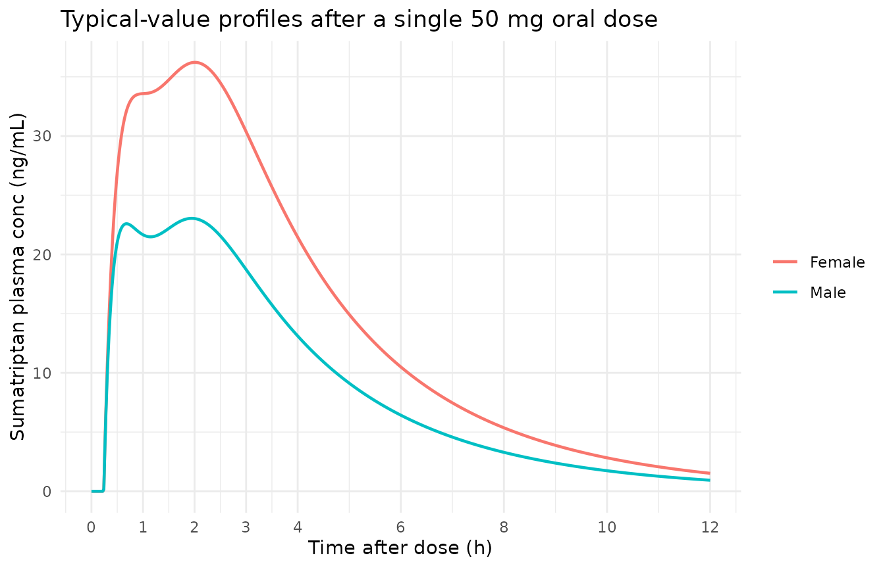
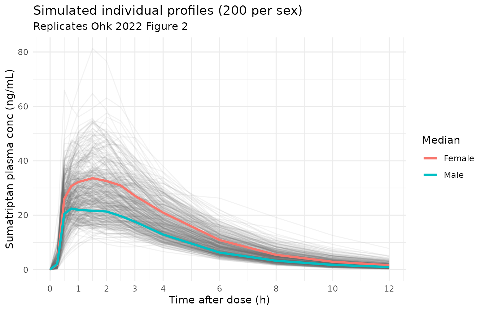
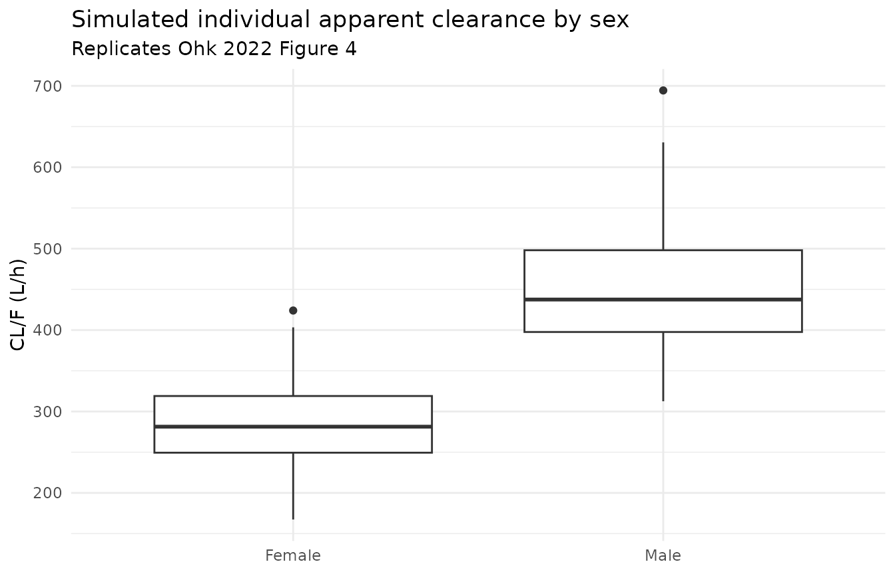
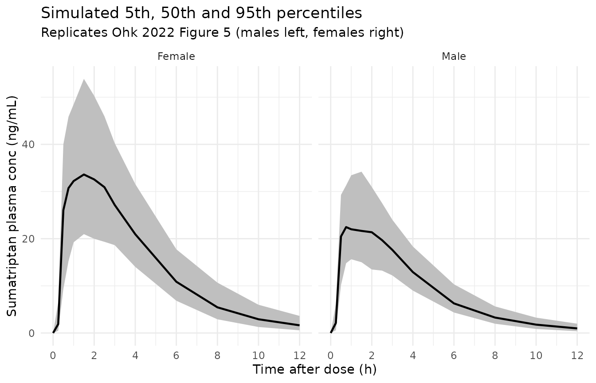

# Sumatriptan (Ohk 2022)

## Model and source

- Citation: Ohk B, Seong S, Lee J, Gwon M, Kang W, Lee H, Yoon Y, Yoo H.
  Evaluation of sex differences in the pharmacokinetics of oral
  sumatriptan in healthy Korean subjects using population
  pharmacokinetic modeling. Biopharm Drug Dispos. 2022;43(1):24-31.
  <doi:10.1002/bdd.2307>.
- Description: One-compartment population PK model for oral sumatriptan
  in healthy Korean adults (Ohk 2022): two parallel absorption routes
  (first-order absorption with lag time, and a transit-compartment chain
  with the Savic 2007 analytical input form) into a single central
  compartment with linear elimination, with separate typical apparent
  clearances for males and females.
- Article: <https://doi.org/10.1002/bdd.2307> (open access; PMC9306698)

Ohk 2022 re-fits the sumatriptan model of Lee 2015 (packaged as
`Lee_2015_sumatriptan`) to a pooled cohort that adds a second study with
female subjects, and finds that apparent oral clearance differs by sex.

## Population

Thirty-eight healthy Korean adults (29 males, 76.3%; 9 females, 23.7%)
from two single-dose studies run under the same protocol at Kyungpook
National University Hospital, Daegu: the male cohort of Lee 2015 and an
additional study (CRIS KCT0001784) run to evaluate sex differences. Age
was 24.8 +/- 2.7 years (21-31), weight 64.0 +/- 9.8 kg (50-84), height
171.1 +/- 7.8 cm, BMI 21.8 +/- 2.2 kg/m^2 and Cockcroft-Gault creatinine
clearance 119.2 +/- 17.9 mL/min (Table 1, Section 3.1). Each subject
received a single 50 mg sumatriptan tablet under fasting conditions;
plasma was sampled pre-dose and at 0.25, 0.5, 0.75, 1, 1.5, 2, 2.5, 3,
4, 6, 8, 10 and 12 h (Section 2.2), giving 532 concentrations for the
population analysis.

``` r

str(rxode2::rxode(readModelDb("Ohk_2022_sumatriptan"))$population)
#> ℹ parameter labels from comments will be replaced by 'label()'
#> List of 13
#>  $ species       : chr "human"
#>  $ n_subjects    : int 38
#>  $ n_studies     : int 2
#>  $ age_range     : chr "21-31 years"
#>  $ age_median    : chr "24.8 years (mean)"
#>  $ weight_range  : chr "50-84 kg"
#>  $ weight_median : chr "64.0 kg (mean)"
#>  $ sex_female_pct: num 23.7
#>  $ race_ethnicity: chr "Korean"
#>  $ disease_state : chr "Healthy adult volunteers"
#>  $ dose_range    : chr "Single 50 mg oral dose of sumatriptan (Sumatran 50 mg tablet) under fasting conditions"
#>  $ regions       : chr "Republic of Korea (Kyungpook National University Hospital Clinical Trial Center, Daegu)"
#>  $ notes         : chr "Pooled analysis of two single-dose studies run with the same protocol: the male cohort previously analysed by L"| __truncated__
```

## Source trace

| Equation / parameter | Value | Source location |
|----|----|----|
| `lcl_male` (CL/F, males) | log(444) | Table 4 CL/F M = 444 L/h (RSE 4%); also Section 3.4 |
| `lcl_female` (CL/F, females) | log(281) | Table 4 CL/F F = 281 L/h (RSE 7%); also Section 3.4 |
| `lvc` (V/F) | log(68.7) | Table 4 V3/F = 68.7 L (RSE 32%) |
| `lka1` (first-order absorption rate) | log(0.568) | Table 4 ka1 = 0.568 1/h (RSE 12%) |
| `lka2` (final transit compartment -\> central) | log(0.295) | Table 4 ka2 = 0.295 1/h (RSE 5%) |
| `lmtt` (mean transit time) | log(1.52) | Table 4 MTT = 1.52 h (RSE 11%) |
| `lntr` (number of transit compartments) | log(6.7) | Table 4 NN = 6.7 (RSE 48%) |
| `ltlag` (lag time of the first-order arm) | log(0.239) | Table 4 ALAG1 = 0.239 h (RSE 1%) |
| `lfr` (fraction through the transit arm) | log(0.558) | Table 4 f = 0.558 (RSE 7%) |
| `etalcl` | 0.03016 | Table 4 BSV CL/F = 17.5 CV%; log(1 + 0.175^2) |
| `etalvc` | 0.69215 | Table 4 BSV V3/F = 99.9 CV%; log(1 + 0.999^2) |
| `etalka2` | 0.05172 | Table 4 BSV ka2 = 23.04 CV%; log(1 + 0.2304^2) |
| `etalmtt` | 0.16554 | Table 4 BSV MTT = 42.43 CV%; log(1 + 0.4243^2) |
| `propSd` | 0.249 | Table 4 proportional error = 0.249 (RSE 6%) |
| `addSd` (ng/mL) | 0.276 | Table 4 additive error = 0.276 (RSE 21%) |
| CL/F = ((1 - SEX) theta_male + SEX theta_female) exp(eta) | n/a | Table 3 model 4; SEX coded 0 = male, 1 = female (Section 2.5) |
| One compartment, parallel first-order (lag) and transit absorption | n/a | Section 2.4, Section 3.3 and Figure 1 |
| ktr = (n + 1) / MTT; a_n(t) = f Dose (ktr t)^n / n! exp(-ktr t) | n/a | Section 2.4 equations; implemented with rxode2 `transit(ntr, mtt, fr)` |
| Combined proportional and additive residual error | n/a | Section 2.4 |

## Virtual cohort

Individual data are not public. The virtual cohort below has 200 males
and 200 females (sex is the only covariate in the final model), each
given a single 50 mg oral dose and sampled on the study grid.

The model has two parallel absorption arms, so each administration
carries **two** dose records with the same amount: one to `depot`
(first-order arm, scaled by `f(depot) = 1 - fr`) and one to `depot2`
(transit arm; the bolus is suppressed by `f(depot2) = 0` and the drug
enters through `transit()`).

``` r

obs_grid <- c(0, 0.25, 0.5, 0.75, 1, 1.5, 2, 2.5, 3, 4, 6, 8, 10, 12)
n_per_sex <- 200L

make_events <- function(ids, sexf, times) {
  one_id <- function(id) {
    rbind(
      data.frame(id = id, time = 0, evid = 1L, amt = 50, cmt = "depot"),
      data.frame(id = id, time = 0, evid = 1L, amt = 50, cmt = "depot2"),
      data.frame(id = id, time = times, evid = 0L, amt = 0, cmt = "central")
    )
  }
  ev <- do.call(rbind, lapply(ids, one_id))
  ev$SEXF <- sexf[match(ev$id, ids)]
  ev
}

ids <- seq_len(2L * n_per_sex)
sexf <- rep(c(0L, 1L), each = n_per_sex)
events <- make_events(ids, sexf, obs_grid)
events$sex <- ifelse(events$SEXF == 1L, "Female", "Male")
```

## Simulation

``` r

mod <- readModelDb("Ohk_2022_sumatriptan")
rxode2::rxSetSeed(20222307)
sim <- as.data.frame(rxode2::rxSolve(mod, events = events, keep = c("sex")))
#> ℹ parameter labels from comments will be replaced by 'label()'
```

## Typical-value checks

With linear elimination and a dose split whose fractions sum to one, the
typical-value AUC from 0 to infinity must equal Dose / (CL/F) in each
sex: 50 mg / 444 L/h = 112.6 ng.h/mL for males and 50 mg / 281 L/h =
177.9 ng.h/mL for females. Integrating the typical profile to 72 h
checks both the `transit()` input scaling (the arm with fraction `fr`)
and the sex covariate in one step.

``` r

typ_grid <- c(seq(0, 12, by = 0.02), seq(12.5, 72, by = 0.5))
typ_events <- make_events(1:2, c(0L, 1L), typ_grid)
typ <- as.data.frame(rxode2::rxSolve(rxode2::zeroRe(mod), events = typ_events))
#> ℹ parameter labels from comments will be replaced by 'label()'
#> ℹ omega/sigma items treated as zero: 'etalcl', 'etalvc', 'etalka2', 'etalmtt'
#> Warning: multi-subject simulation without without 'omega'
typ$sex <- ifelse(typ$id == 2, "Female", "Male")

trap <- function(x, y) sum(diff(x) * (head(y, -1) + tail(y, -1)) / 2)
typ_auc <- typ |>
  dplyr::group_by(sex) |>
  dplyr::summarise(
    auc_numeric = trap(time, Cc),
    cmax = max(Cc),
    tmax = time[which.max(Cc)],
    .groups = "drop"
  ) |>
  dplyr::mutate(auc_closed_form = 50 * 1000 / ifelse(sex == "Male", 444, 281))
knitr::kable(typ_auc, digits = 2,
             caption = "Typical-value AUC0-72 (trapezoidal, 0.02 h grid) vs Dose / (CL/F).")
```

| sex    | auc_numeric |  cmax | tmax | auc_closed_form |
|:-------|------------:|------:|-----:|----------------:|
| Female |      177.94 | 36.22 | 2.00 |          177.94 |
| Male   |      112.61 | 23.05 | 1.94 |          112.61 |

Typical-value AUC0-72 (trapezoidal, 0.02 h grid) vs Dose / (CL/F).
{.table}

``` r


# Same parameters on both sides: the only difference is quadrature error
# and the < 0.1% of AUC beyond 72 h.
stopifnot(all(abs(typ_auc$auc_numeric / typ_auc$auc_closed_form - 1) < 0.01))

ggplot(typ |> dplyr::filter(time <= 12), aes(time, Cc, colour = sex)) +
  geom_line(linewidth = 0.8) +
  scale_x_continuous(breaks = c(0, 1, 2, 3, 4, 6, 8, 10, 12)) +
  labs(x = "Time after dose (h)", y = "Sumatriptan plasma conc (ng/mL)",
       colour = NULL,
       title = "Typical-value profiles after a single 50 mg oral dose") +
  theme_minimal()
```



The typical profile shows the early lagged first-order peak and the
later transit-arm shoulder that produce the multiple peaks described in
Section 3.2.

## Replicate published figures

### Figure 2 – individual profiles with the median by sex

``` r

med <- sim |>
  dplyr::group_by(sex, time) |>
  dplyr::summarise(Cc = median(Cc), .groups = "drop")

ggplot(sim, aes(time, Cc)) +
  geom_line(aes(group = id), alpha = 0.08, colour = "gray40") +
  geom_line(data = med, aes(colour = sex), linewidth = 1.1) +
  scale_x_continuous(breaks = c(0, 1, 2, 3, 4, 6, 8, 10, 12)) +
  labs(x = "Time after dose (h)", y = "Sumatriptan plasma conc (ng/mL)",
       colour = "Median",
       title = "Simulated individual profiles (200 per sex)",
       subtitle = "Replicates Ohk 2022 Figure 2") +
  theme_minimal()
```



### Figure 4 – individual CL/F by sex

``` r

cl_ind <- sim |>
  dplyr::filter(time == 0) |>
  dplyr::distinct(id, sex, cl)

ggplot(cl_ind, aes(sex, cl)) +
  geom_boxplot() +
  labs(x = NULL, y = "CL/F (L/h)",
       title = "Simulated individual apparent clearance by sex",
       subtitle = "Replicates Ohk 2022 Figure 4") +
  theme_minimal()
```



### Figure 5 – visual predictive check by sex

``` r

vpc <- sim |>
  dplyr::group_by(sex, time) |>
  dplyr::summarise(
    p05 = quantile(Cc, 0.05),
    p50 = quantile(Cc, 0.50),
    p95 = quantile(Cc, 0.95),
    .groups = "drop"
  )

ggplot(vpc, aes(time, p50)) +
  geom_ribbon(aes(ymin = p05, ymax = p95), fill = "gray75") +
  geom_line(linewidth = 0.8) +
  facet_wrap(~sex) +
  scale_x_continuous(breaks = c(0, 2, 4, 6, 8, 10, 12)) +
  labs(x = "Time after dose (h)", y = "Sumatriptan plasma conc (ng/mL)",
       title = "Simulated 5th, 50th and 95th percentiles",
       subtitle = "Replicates Ohk 2022 Figure 5 (males left, females right)") +
  theme_minimal()
```



## PKNCA validation

``` r

conc_df <- sim |>
  dplyr::filter(!is.na(Cc)) |>
  dplyr::select(id, time, Cc, sex)
dose_df <- events |>
  dplyr::filter(evid == 1, cmt == "depot") |>
  dplyr::select(id, time, amt, sex)

conc_obj <- PKNCA::PKNCAconc(conc_df, Cc ~ time | sex + id,
                             concu = "ng/mL", timeu = "h")
dose_obj <- PKNCA::PKNCAdose(dose_df, amt ~ time | sex + id, doseu = "mg")

intervals <- data.frame(
  start = c(0, 0),
  end = c(Inf, 2),
  cmax = c(TRUE, FALSE),
  tmax = c(TRUE, FALSE),
  auclast = c(TRUE, FALSE),
  aucinf.obs = c(TRUE, FALSE),
  half.life = c(TRUE, FALSE),
  aucint.last = c(FALSE, TRUE)
)

nca_res <- PKNCA::pk.nca(PKNCA::PKNCAdata(conc_obj, dose_obj, intervals = intervals))
nca_ind <- as.data.frame(nca_res$result)
```

### Comparison against published NCA

Table 2 of Ohk 2022 reports geometric means for AUC and Cmax, the median
for Tmax and the arithmetic mean for t1/2. The simulated values are
summarised with the same statistics before comparison. `aucint.last` is
AUC0-2 and `auclast` is AUC0-12 (the last sample is at 12 h).

``` r

gm <- function(x) exp(mean(log(x[x > 0])))
sim_summary <- nca_ind |>
  dplyr::filter(PPTESTCD %in% c("cmax", "tmax", "auclast", "aucinf.obs",
                                "half.life", "aucint.last")) |>
  dplyr::group_by(sex, PPTESTCD) |>
  dplyr::summarise(
    value = dplyr::case_when(
      dplyr::first(PPTESTCD) == "tmax" ~ median(PPORRES, na.rm = TRUE),
      dplyr::first(PPTESTCD) == "half.life" ~ mean(PPORRES, na.rm = TRUE),
      TRUE ~ gm(PPORRES)
    ),
    .groups = "drop"
  ) |>
  tidyr::pivot_wider(names_from = PPTESTCD, values_from = value)

published <- tibble::tribble(
  ~sex,     ~aucint.last, ~auclast, ~aucinf.obs, ~cmax, ~tmax, ~half.life,
  "Male",   34.7,         111.3,    117.1,       29.0,  1.5,   2.9,
  "Female", 52.9,         182.0,    188.9,       41.4,  1.5,   2.6
)

cmp <- nlmixr2lib::ncaComparisonTable(
  simulated = sim_summary,
  reference = published,
  by = "sex",
  units = c(cmax = "ng/mL", tmax = "h", auclast = "ng*h/mL",
            aucinf.obs = "ng*h/mL", aucint.last = "ng*h/mL", half.life = "h"),
  tolerance_pct = 20
)
#> Warning: ncaParamLabel(): unknown PKNCA code(s) returned as-is: 'aucint.last'
cmp[[1]] <- sub("^aucint\\.last.*$", "AUC0-2 (ng*h/mL)", cmp[[1]])
knitr::kable(cmp, caption = "Simulated vs. published (Ohk 2022 Table 2) NCA. * differs from reference by >20%.")
```

| NCA parameter           | sex    | Reference | Simulated | % diff   |
|:------------------------|:-------|:----------|:----------|:---------|
| Cmax (ng/mL)            | Male   | 29        | 24.4      | -15.8%   |
| Cmax (ng/mL)            | Female | 41.4      | 36.8      | -11.2%   |
| Tmax (h)                | Male   | 1.5       | 1         | -33.3%\* |
| Tmax (h)                | Female | 1.5       | 1.5       | +0.0%    |
| AUC0-∞ (obs) (ng\*h/mL) | Male   | 117       | 111       | -4.9%    |
| AUC0-∞ (obs) (ng\*h/mL) | Female | 189       | 176       | -6.9%    |
| AUClast (ng\*h/mL)      | Male   | 111       | 108       | -3.3%    |
| AUClast (ng\*h/mL)      | Female | 182       | 170       | -6.8%    |
| t½ (h)                  | Male   | 2.9       | 2.28      | -21.4%\* |
| t½ (h)                  | Female | 2.6       | 2.24      | -13.8%   |
| AUC0-2 (ng\*h/mL)       | Male   | 34.7      | 35.7      | +3.0%    |
| AUC0-2 (ng\*h/mL)       | Female | 52.9      | 51.5      | -2.7%    |

Simulated vs. published (Ohk 2022 Table 2) NCA. \* differs from
reference by \>20%. {.table}

``` r

auc_ratio <- sim_summary$aucinf.obs[sim_summary$sex == "Female"] /
  sim_summary$aucinf.obs[sim_summary$sex == "Male"]
cat(sprintf("Simulated female/male AUCinf ratio (geometric means): %.2f (Table 2: 1.61)\n",
            auc_ratio))
#> Simulated female/male AUCinf ratio (geometric means): 1.58 (Table 2: 1.61)

# Centre-of-distribution checks only (geometric means of 200 subjects).
# A mis-transcribed clearance or a mis-scaled transit arm moves these by
# far more than the tolerance.
sim_m <- sim_summary[sim_summary$sex == "Male", ]
sim_f <- sim_summary[sim_summary$sex == "Female", ]
stopifnot(
  abs(sim_m$aucinf.obs / 117.1 - 1) < 0.2,
  abs(sim_f$aucinf.obs / 188.9 - 1) < 0.2,
  abs(auc_ratio / 1.61 - 1) < 0.2
)
```

AUC0-2, AUC0-12 and AUC0-infinity agree with Table 2 within 10% in both
sexes, and the simulated female/male AUC ratio matches the published
1.61. Cmax runs 10-20% below the observed geometric means. Rows that are
starred usually come from one of two sources:

- **Tmax in males.** Tmax is a median on the discrete sampling grid. Two
  absorption arms of similar size put the simulated peak close to either
  1 h (first-order arm) or 1.5-2 h (transit arm), so a small shift in
  the cohort moves the median a whole grid step. The female median
  matches.
- **t1/2 in males.** NCA half-life here is fitted to the last points of
  a 12-h profile whose terminal phase is limited by absorption (ka2 =
  0.295 1/h, i.e. a 2.3 h half-life), not by elimination (CL/V of about
  6.5 1/h). The simulated value sits near log(2) / ka2. Observed
  half-lives also include assay noise near the 0.5 ng/mL lower limit of
  quantification.

Neither difference points to a transcription error. The values are not
tuned.

## Assumptions and deviations

- **Between-subject variability scale.** Table 4 reports BSV as “CV%”
  for exponential etas. The maintainers converted with omega^2 = log(1 +
  CV^2), matching the packaged Lee 2015 model from the same group. The
  paper does not give an omega CI or footnote that separates this from
  the omega x 100 reading. The two readings differ materially only for
  V/F (99.9 CV%: omega^2 = 0.692 here vs 0.998 under omega x 100).
- **Residual error.** Section 2.4 states a combined proportional and
  additive model; Table 4 gives 0.249 and 0.276 without units. They are
  encoded as standard deviations (proportional as a fraction, additive
  in ng/mL), following the Lee 2015 control stream from the same group
  (`W = SQRT(THETA^2 + THETA^2 * IPRED^2)`).
- **Bootstrap intervals.** The bootstrap 95% CI for the additive error
  (0.21-0.27) excludes the point estimate 0.276, and the CI for CL/F in
  males (388-452) is asymmetric about 444. The point estimates from
  Table 4 are used unchanged.
- **Transit input.** rxode2’s `transit(ntr, mtt, fr)` evaluates the
  Savic 2007 kernel with `lgamma(n + 1)` for the non-integer NN = 6.7
  and ktr = (n + 1) / MTT, as printed in Section 2.4.
- **Dose.** 50 mg is the labelled tablet strength (Sumatran 50 mg); the
  paper does not state a salt correction, so the dose is entered as 50
  mg.
- **Excluded covariates.** Weight was significant alone but was not
  retained once sex was on CL/F (Table 3); age, height, BMI and
  creatinine clearance were not significant. These are listed in
  `covariatesDataExcluded`.
- No erratum or correction notice was found in Europe PMC (checked
  2026-10-03).
