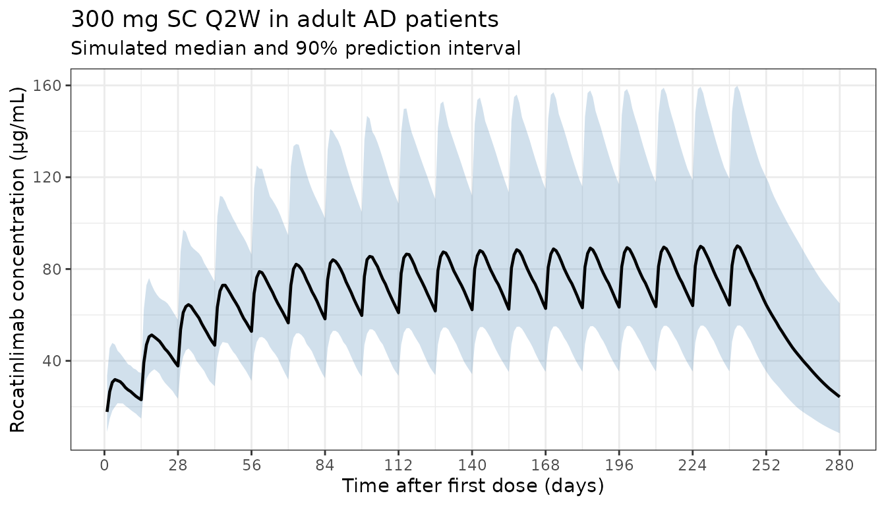
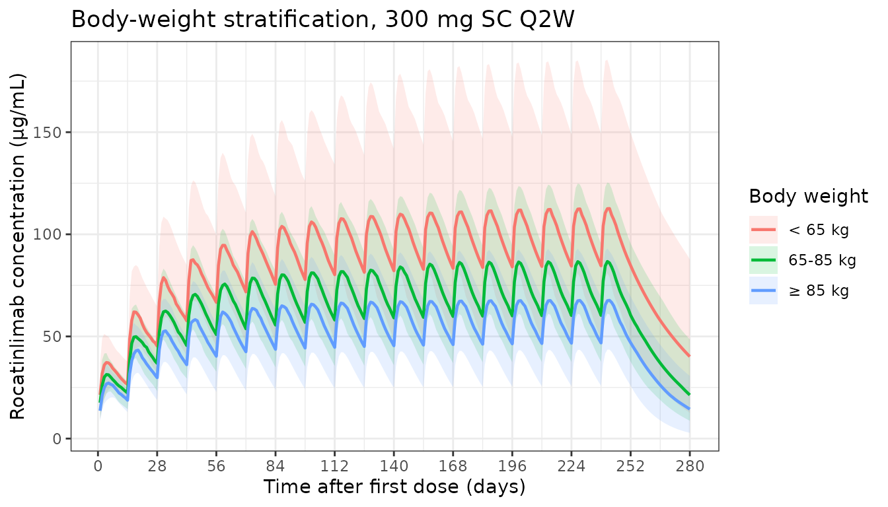
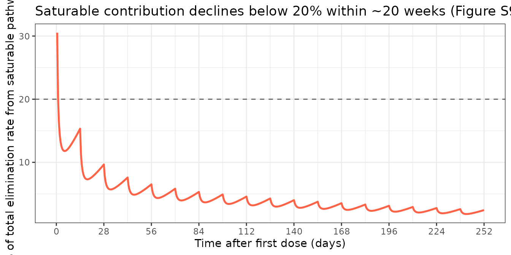

# Rocatinlimab (Okada 2025)

``` r

library(nlmixr2lib)
library(PKNCA)
#> 
#> Attaching package: 'PKNCA'
#> The following object is masked from 'package:stats':
#> 
#>     filter
library(rxode2)
#> rxode2 5.1.2 using 2 threads (see ?getRxThreads)
#>   no cache: create with `rxCreateCache()`
library(dplyr)
#> 
#> Attaching package: 'dplyr'
#> The following objects are masked from 'package:stats':
#> 
#>     filter, lag
#> The following objects are masked from 'package:base':
#> 
#>     intersect, setdiff, setequal, union
library(tidyr)
library(ggplot2)
```

## Model and source

- Citation: Okada H, Liao S, Khouri L, Liao L, Hruska MW, Nagata Y,
  Hasegawa M, Gewitz A, Marsteller D. Continuous-Time Markov Population
  PK/PD Modeling of Longitudinal EASI Categorical Score in Atopic
  Dermatitis Treated With Rocatinlimab, an Anti-OX40 Monoclonal
  Antibody. CPT Pharmacometrics Syst Pharmacol. 2025;14(10):1587-1597.
  <doi:10.1002/psp4.70069>
- Description: Two-compartment population PK model with parallel linear
  and time-dependent saturable (Michaelis-Menten) clearance and
  first-order subcutaneous absorption for rocatinlimab (anti-OX40 mAb)
  in adults; covariates body weight, albumin, plaque-psoriasis disease
  state, and healthy-volunteer cohort indicator (Okada 2025)
- Article: <https://doi.org/10.1002/psp4.70069>

Okada et al. (2025) report a population PK model for rocatinlimab — an
anti-OX40 monoclonal antibody — pooled across five clinical studies
(plaque psoriasis, ulcerative colitis, atopic dermatitis, and healthy
volunteers; n = 413). The structural model is a two-compartment
disposition with first-order subcutaneous absorption (F3) and parallel
linear plus time-dependent saturable (Michaelis-Menten) elimination from
the central compartment. The saturable maximum velocity declines
exponentially over time at rate Kdes (TDVM = Vmax · exp(-Kdes · t)),
representing target receptor (OX40) occupancy effects. Body weight
enters allometrically on CL, V1, and Vmax; serum albumin acts as a
power-law covariate on CL; plaque psoriasis shifts CL multiplicatively;
and healthy-volunteer status shifts Vmax multiplicatively.

The continuous-time Markov PK/PD component for EASI categorical response
— the main contribution of the paper — is **not** part of this
nlmixr2lib model; only the population PK structure is packaged here.

## Population

The full PPK dataset combined five studies (Okada 2025 Table 1 and
Tables S1, S2):

- n = 413 subjects (54 plaque psoriasis, 49 + 8 ulcerative colitis, 36
  healthy volunteers, 22 + 244 atopic dermatitis).
- Body weight: median 70.3 kg, range 38.0-166.0 kg.
- Age: median 35 years, range 18-89 years.
- Sex: 32.7% female (135/413).
- Race: 52.2% Asian, 43.9% White (non-Hispanic/Latino), 2.2% Black or
  African, 1.2% White Hispanic/Latino, 0.5% American Indian/Alaskan
  Native.
- Albumin: mean 43.8 g/L, median 44 g/L, range 31-53 g/L.

The target indication of interest for nlmixr2lib users is
moderate-to-severe atopic dermatitis (Studies 4 and 5, n = 266 AD
patients combined): weight median 67-68 kg, age median 31-34 years,
18-41% female, 65-100% Asian.

The same information is available programmatically via the model’s
`population` metadata
(`readModelDb("Okada_2025_rocatinlimab")$population`).

## Source trace

Per-parameter origin is recorded as in-file comments next to each
[`ini()`](https://nlmixr2.github.io/rxode2/reference/ini.html) entry in
`inst/modeldb/specificDrugs/Okada_2025_rocatinlimab.R`. The table below
collects them in one place.

| Equation / parameter | Value | Source location |
|----|---:|----|
| `lcl` (CL) | 0.230 L/day | Supplement Table S3 |
| `lvc` (V1) | 3.30 L | Supplement Table S3 (also main text §3.2) |
| `lvp` (V2) | 2.82 L | Supplement Table S3 |
| `lq` (Q) | 0.775 L/day | Supplement Table S3 |
| `lvmax` (Vmax) | 0.968 mg/day | Supplement Table S3 |
| `lkm` (Km) | 0.289 µg/mL | Supplement Table S3 |
| `lkdes` (Kdes) | 0.00439 1/day | Supplement Table S3 |
| `lka` (ka) | 0.312 1/day | Supplement Table S3 |
| `lfdepot` (F3) | 0.855 (logit-transformed in NONMEM) | Supplement Table S3 |
| `e_wt_cl` | 0.923 | Supplement Table S3, footnote |
| `e_wt_vc` | 0.828 | Supplement Table S3, footnote |
| `e_wt_vmax` | 0.494 | Supplement Table S3, footnote |
| `e_alb_cl` | -1.30 | Supplement Table S3, footnote (reference 44 g/L) |
| `e_psoriasis_cl` | -0.372 | Supplement Table S3, footnote |
| `e_healthy_vmax` | -0.532 | Supplement Table S3, footnote |
| BSV CL (21.7% CV) | omega² = 0.04600 | Supplement Table S3 |
| BSV V1 (17.3% CV) | omega² = 0.02949 | Supplement Table S3 |
| BSV V2 (29.0% CV) | omega² = 0.08075 | Supplement Table S3 |
| BSV Vmax (80.7% CV) | omega² = 0.50151 | Supplement Table S3 |
| BSV Kdes (37.8% CV) | omega² = 0.13356 | Supplement Table S3 |
| BSV ka (42.1% CV) | omega² = 0.16319 | Supplement Table S3 |
| `propSd` (16.4% CV) | 0.164 | Supplement Table S3 (ADD ERR2, patients) |
| Two-compartment ODEs | n/a | Supplement §1.3 and S2 NONMEM control stream |
| TDVM = Vmax · exp(-Kdes·t) | n/a | Supplement Equation 1 |
| Logit-transformed F3 | n/a | Supplement Equations 2-5 |

## Virtual cohort

Original observed data are not publicly available. The figures below use
a virtual atopic-dermatitis cohort whose covariate distributions
approximate the published trial demographics for Studies 4 and 5
(supplement Tables S1, S2).

``` r

set.seed(2025)

n_subj <- 200

# Body weight: log-normal around the AD-cohort median (~ 67-68 kg),
# truncated to the study range [38, 166] kg.
WT <- pmin(pmax(exp(rnorm(n_subj, log(70), 0.27)), 38), 166)

# Serum albumin: AD-cohort summary mean 44.6 g/L, SD 3.0 g/L,
# truncated to the observed range [31, 53] g/L.
ALB <- pmin(pmax(rnorm(n_subj, 44.6, 3.0), 31), 53)

# Disease covariates: AD patients are non-psoriasis, non-healthy.
# (Set DIS_PSORIASIS = 0 and DIS_HEALTHY = 0 for the target indication.)
pop <- data.frame(
  ID            = seq_len(n_subj),
  WT            = WT,
  ALB           = ALB,
  DIS_PSORIASIS = 0L,
  DIS_HEALTHY        = 0L
)

pop$wt_group <- cut(
  pop$WT,
  breaks = c(0, 65, 85, Inf),
  labels = c("< 65 kg", "65-85 kg", "≥ 85 kg"),
  right  = FALSE
)
```

## Simulation — STREAM-AD-style 300 mg SC Q2W (the registered AD regimen)

Okada 2025 Table 4 and Figure S8 simulate 300 mg SC Q2W and 600 mg SC
Q2W for 34 weeks. The labelled clinical scenario evaluated for AD is 300
mg SC Q2W; we replicate it here.

``` r

# 300 mg SC Q2W for 36 weeks (18 doses), with weekly observations through week 40.
dose_days <- seq(0, 14 * 17, by = 14)
obs_days  <- seq(0, 14 * 20, by = 1)

d_dose <- pop[rep(seq_len(n_subj), each = length(dose_days)), ] |>
  mutate(
    TIME = rep(dose_days, times = n_subj),
    AMT  = 300,
    EVID = 1,
    CMT  = "depot",
    DV   = NA
  )

d_obs <- pop[rep(seq_len(n_subj), each = length(obs_days)), ] |>
  mutate(
    TIME = rep(obs_days, times = n_subj),
    AMT  = 0,
    EVID = 0,
    CMT  = "central",
    DV   = NA
  )

events <- bind_rows(d_dose, d_obs) |>
  arrange(ID, TIME, desc(EVID)) |>
  select(ID, TIME, AMT, EVID, CMT, DV, WT, ALB, DIS_PSORIASIS, DIS_HEALTHY, wt_group)
```

``` r

mod <- readModelDb("Okada_2025_rocatinlimab")

set.seed(2025)
sim_out <- rxode2::rxSolve(mod, events = events)
#> ℹ parameter labels from comments will be replaced by 'label()'
```

### Population concentration-time profile (median and 90% PI)

``` r

sim_plot <- as.data.frame(sim_out) |> filter(time > 0)

d_overall <- sim_plot |>
  group_by(time) |>
  summarise(
    Q05 = quantile(Cc, 0.05, na.rm = TRUE),
    Q50 = quantile(Cc, 0.50, na.rm = TRUE),
    Q95 = quantile(Cc, 0.95, na.rm = TRUE),
    .groups = "drop"
  )

ggplot(d_overall, aes(x = time, y = Q50)) +
  geom_ribbon(aes(ymin = Q05, ymax = Q95), fill = "steelblue", alpha = 0.25) +
  geom_line(linewidth = 0.8) +
  scale_x_continuous(breaks = seq(0, 14 * 20, by = 28)) +
  labs(
    x        = "Time after first dose (days)",
    y        = "Rocatinlimab concentration (μg/mL)",
    title    = "300 mg SC Q2W in adult AD patients",
    subtitle = "Simulated median and 90% prediction interval"
  ) +
  theme_bw()
```



### Stratification by baseline body weight

``` r

wt_map <- pop |> select(ID, wt_group)

d_wt <- sim_plot |>
  left_join(wt_map, by = c("id" = "ID")) |>
  group_by(time, wt_group) |>
  summarise(
    Q05 = quantile(Cc, 0.05, na.rm = TRUE),
    Q50 = quantile(Cc, 0.50, na.rm = TRUE),
    Q95 = quantile(Cc, 0.95, na.rm = TRUE),
    .groups = "drop"
  )

ggplot(d_wt, aes(x = time, y = Q50, colour = wt_group, fill = wt_group)) +
  geom_ribbon(aes(ymin = Q05, ymax = Q95), alpha = 0.15, colour = NA) +
  geom_line(linewidth = 0.8) +
  scale_x_continuous(breaks = seq(0, 14 * 20, by = 28)) +
  labs(
    x      = "Time after first dose (days)",
    y      = "Rocatinlimab concentration (μg/mL)",
    colour = "Body weight",
    fill   = "Body weight",
    title  = "Body-weight stratification, 300 mg SC Q2W"
  ) +
  theme_bw()
```



## PKNCA validation — comparison against published Table 4

Okada 2025 Table 4 reports model-predicted PK metrics (Cmax, Cmin, Cavg)
for several SC regimens. Below we reproduce the four AD-regimen
scenarios in Table 4 by simulating an 80-kg typical patient (the paper’s
trial-simulation virtual subject) with random effects zeroed, and
compare the per-cycle PKNCA values at steady state to the published
medians.

The PKNCA formula uses `Cc ~ time | regimen + id` so per-regimen results
are computed and can be compared 1-to-1 to Table 4.

``` r

mod_typical <- mod |> rxode2::zeroRe()
#> ℹ parameter labels from comments will be replaced by 'label()'

build_regimen <- function(dose, ii, addl, regimen, id) {
  dose_t <- seq(0, ii * (addl - 1), by = ii)
  obs_t  <- seq(0, ii * addl, by = 0.5)

  dose_df <- data.frame(
    ID = id, TIME = dose_t, AMT = dose, EVID = 1, CMT = "depot",
    DV = NA, WT = 80, ALB = 44, DIS_PSORIASIS = 0L, DIS_HEALTHY = 0L,
    regimen = regimen
  )
  obs_df <- data.frame(
    ID = id, TIME = obs_t, AMT = 0, EVID = 0, CMT = "central",
    DV = NA, WT = 80, ALB = 44, DIS_PSORIASIS = 0L, DIS_HEALTHY = 0L,
    regimen = regimen
  )
  bind_rows(dose_df, obs_df) |> arrange(ID, TIME, desc(EVID))
}

regimens <- bind_rows(
  build_regimen(150, 14, 18, "150 mg Q2W",  1L),
  build_regimen(150, 28, 9,  "150 mg Q4W",  2L),
  build_regimen(300, 14, 18, "300 mg Q2W",  3L),
  build_regimen(300, 28, 9,  "300 mg Q4W",  4L),
  build_regimen(600, 14, 18, "600 mg Q2W",  5L),
  build_regimen(600, 28, 9,  "600 mg Q4W",  6L)
)

typ_sim <- rxode2::rxSolve(mod_typical, events = regimens, keep = "regimen") |>
  as.data.frame()
#> ℹ omega/sigma items treated as zero: 'etalcl', 'etalvc', 'etalvp', 'etalvmax', 'etalkdes', 'etalka'
#> Warning: multi-subject simulation without without 'omega'
```

``` r

# Last steady-state cycle for each regimen
ss_window <- typ_sim |>
  group_by(regimen) |>
  mutate(
    tau     = ifelse(grepl("Q2W", regimen[1]), 14, 28),
    addl    = ifelse(grepl("Q2W", regimen[1]), 18, 9),
    ss_start = (addl - 1) * tau,
    ss_end   = addl * tau
  ) |>
  filter(time >= ss_start, time <= ss_end) |>
  ungroup()

ss_summary <- ss_window |>
  group_by(regimen) |>
  summarise(
    Cmax_sim  = max(Cc),
    Cmin_sim  = min(Cc),
    Cavg_sim  = mean(Cc),
    .groups = "drop"
  )

# Published medians from Table 4 (multiple-dose at steady state)
table4 <- tibble::tribble(
  ~regimen,        ~Cavg_pub, ~Cmax_pub, ~Cmin_pub,
  "150 mg Q2W",     33.49,     38.64,     26.90,
  "150 mg Q4W",     16.79,     24.07,     10.05,
  "300 mg Q2W",     72.33,     81.80,     59.02,
  "300 mg Q4W",     34.26,     46.76,     20.95,
  "600 mg Q2W",    144.38,    164.66,    117.91,
  "600 mg Q4W",     68.16,     94.25,     41.51
)

cmp <- ss_summary |>
  left_join(table4, by = "regimen") |>
  mutate(
    Cavg_pct = 100 * (Cavg_sim - Cavg_pub) / Cavg_pub,
    Cmax_pct = 100 * (Cmax_sim - Cmax_pub) / Cmax_pub,
    Cmin_pct = 100 * (Cmin_sim - Cmin_pub) / Cmin_pub
  ) |>
  select(regimen,
         Cavg_pub, Cavg_sim, Cavg_pct,
         Cmax_pub, Cmax_sim, Cmax_pct,
         Cmin_pub, Cmin_sim, Cmin_pct)

knitr::kable(
  cmp,
  digits  = c(0, 2, 2, 1, 2, 2, 1, 2, 2, 1),
  caption = "Steady-state PK metrics: simulated typical patient (80 kg, ALB 44 g/L) vs Okada 2025 Table 4 published medians (μg/mL)."
)
```

| regimen | Cavg_pub | Cavg_sim | Cavg_pct | Cmax_pub | Cmax_sim | Cmax_pct | Cmin_pub | Cmin_sim | Cmin_pct |
|:---|---:|---:|---:|---:|---:|---:|---:|---:|---:|
| 150 mg Q2W | 33.49 | 33.45 | -0.1 | 38.64 | 38.52 | -0.3 | 26.90 | 26.85 | -0.2 |
| 150 mg Q4W | 16.79 | 15.93 | -5.1 | 24.07 | 22.96 | -4.6 | 10.05 | 8.90 | -11.4 |
| 300 mg Q2W | 72.33 | 68.40 | -5.4 | 81.80 | 78.57 | -3.9 | 59.02 | 55.25 | -6.4 |
| 300 mg Q4W | 34.26 | 33.39 | -2.5 | 46.76 | 47.52 | 1.6 | 20.95 | 19.42 | -7.3 |
| 600 mg Q2W | 144.38 | 138.31 | -4.2 | 164.66 | 158.68 | -3.6 | 117.91 | 112.07 | -5.0 |
| 600 mg Q4W | 68.16 | 68.32 | 0.2 | 94.25 | 96.66 | 2.6 | 41.51 | 40.49 | -2.5 |

Steady-state PK metrics: simulated typical patient (80 kg, ALB 44 g/L)
vs Okada 2025 Table 4 published medians (μg/mL). {.table}

A separate PKNCA call computes Cmax, Tmax, AUClast, and AUCinf on the
typical first-dose profile of the 300 mg Q2W regimen for completeness;
the formula uses `Cc ~ time | regimen + id` so per-regimen rows can be
extracted directly from the result table.

``` r

first_cycle <- typ_sim |>
  filter(regimen == "300 mg Q2W", time <= 14)

conc_obj <- PKNCA::PKNCAconc(first_cycle, Cc ~ time | regimen + id)

dose_df <- regimens |>
  filter(regimen == "300 mg Q2W", EVID == 1, TIME == 0) |>
  mutate(time = 0, amt = 300) |>
  select(id = ID, time, amt, regimen)

dose_obj <- PKNCA::PKNCAdose(dose_df, amt ~ time | regimen + id)

intervals <- data.frame(
  start    = 0,
  end      = 14,
  cmax     = TRUE,
  tmax     = TRUE,
  auclast  = TRUE,
  half.life = TRUE
)

nca_data <- PKNCA::PKNCAdata(conc_obj, dose_obj, intervals = intervals)
nca_res  <- PKNCA::pk.nca(nca_data)

knitr::kable(
  as.data.frame(nca_res$result)[, c("regimen", "PPTESTCD", "PPORRES")],
  digits  = 3,
  caption = "First-dose NCA on the 300 mg SC Q2W typical-patient profile."
)
```

| regimen    | PPTESTCD            | PPORRES |
|:-----------|:--------------------|--------:|
| 300 mg Q2W | auclast             | 353.087 |
| 300 mg Q2W | cmax                |  30.523 |
| 300 mg Q2W | tmax                |   5.000 |
| 300 mg Q2W | tlast               |  14.000 |
| 300 mg Q2W | lambda.z            |   0.045 |
| 300 mg Q2W | r.squared           |   1.000 |
| 300 mg Q2W | adj.r.squared       |   1.000 |
| 300 mg Q2W | lambda.z.time.first |   9.000 |
| 300 mg Q2W | lambda.z.time.last  |  14.000 |
| 300 mg Q2W | lambda.z.n.points   |  11.000 |
| 300 mg Q2W | clast.pred          |  21.578 |
| 300 mg Q2W | half.life           |  15.506 |
| 300 mg Q2W | span.ratio          |   0.322 |

First-dose NCA on the 300 mg SC Q2W typical-patient profile. {.table}

## Time-dependent saturable clearance — supplement claim

The supplement (§2.5, Figure S9) reports that the saturable elimination
contributes \< 20% of total clearance, declines exponentially at rate
Kdes = 0.00439/day, and total clearance approaches the linear CL (0.230
L/day) by ~ 20 weeks. We confirm those qualitative claims:

``` r

typ_check <- typ_sim |>
  filter(regimen == "300 mg Q2W") |>
  transmute(
    time_d  = time,
    Cc      = Cc,
    tdvm    = 0.968 * exp(-0.00439 * time),
    nl_clr  = tdvm * Cc / (0.289 + Cc),  # mg/day saturable elimination rate
    lin_clr = 0.230 * Cc,                # mg/day linear elimination rate
    nl_pct  = 100 * nl_clr / (nl_clr + lin_clr)
  )

ggplot(typ_check, aes(x = time_d, y = nl_pct)) +
  geom_line(colour = "tomato", linewidth = 0.9) +
  geom_hline(yintercept = 20, linetype = "dashed", colour = "grey40") +
  scale_x_continuous(breaks = seq(0, 14 * 20, by = 28)) +
  labs(
    x       = "Time after first dose (days)",
    y       = "% of total elimination rate from saturable pathway",
    title   = "Saturable contribution declines below 20% within ~20 weeks (Figure S9)"
  ) +
  theme_bw()
#> Warning: Removed 1 row containing missing values or values outside the scale range
#> (`geom_line()`).
```



## Assumptions and deviations

- Between-occasion variability (BOV on CL = 17.3% CV, on V1 = 23.5% CV;
  fixed values from Table S3) is **not** included in the packaged model.
  The Okada 2025 NONMEM control stream estimated BOV only for Study 2 (n
  = 49 UC patients) with three pre-defined occasions; for the AD-target
  simulations the dataset has no occasion structure and BOV collapses
  into the BSV term.
- Residual error: the source paper reports two SDs (NONMEM additive on
  log scale): ADD ERR1 = 9.3% CV for healthy volunteers and ADD ERR2 =
  16.4% CV for patients. The packaged model uses the patient value (ADD
  ERR2 = 0.164) since the target indication is moderate-to- severe
  atopic dermatitis. Users simulating the healthy-volunteer cohort can
  replace `propSd` with 0.093 manually.
- Disease-state covariate decomposition: the source NONMEM `DIS` column
  is a 4-level categorical (0 = healthy, 1 = psoriasis, 2 = UC, 3 = AD).
  Only two effects survived backward elimination (psoriasis on CL,
  healthy on Vmax), so the model exposes two binary indicators
  (`DIS_PSORIASIS`, `DIS_HEALTHY`). For an AD or UC simulation, both are
  0.
- Time variable in the saturable-clearance term
  `TDVM = Vmax · exp(-Kdes·t)` uses simulation time `t` directly,
  matching the NONMEM control-stream formulation. Align datasets so the
  first rocatinlimab dose is at `t = 0` to reproduce the supplement’s
  published profile.
- The continuous-time Markov PK/PD model on EASI categorical scores
  (Okada 2025 main contribution) is **not** packaged here. nlmixr2lib
  focuses on PK structures; the categorical-response component would
  need a separate handling and a different validation strategy.
