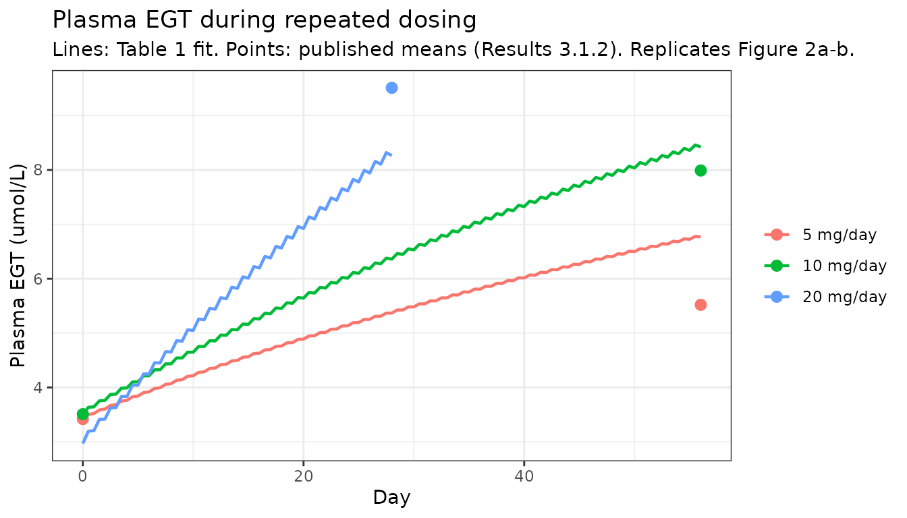
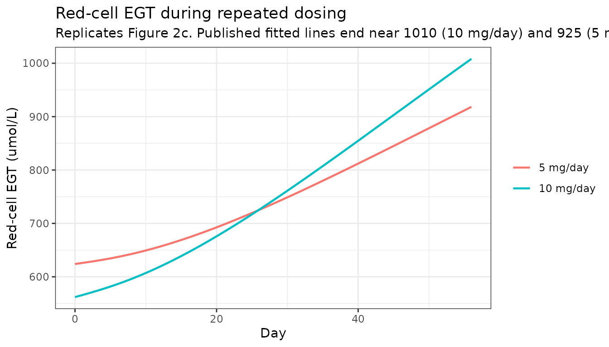
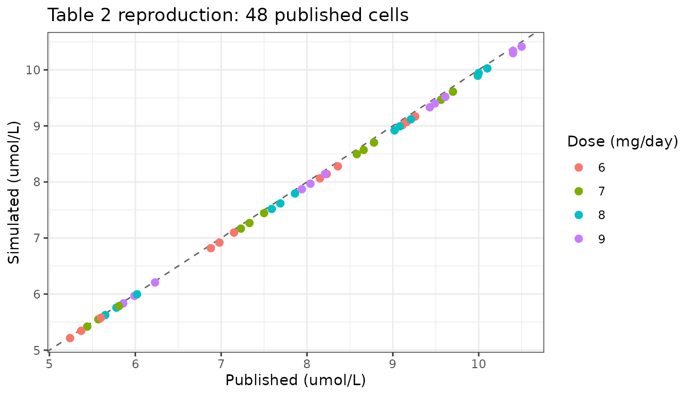
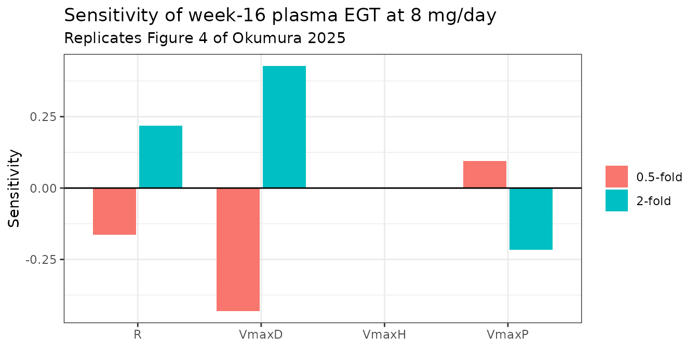
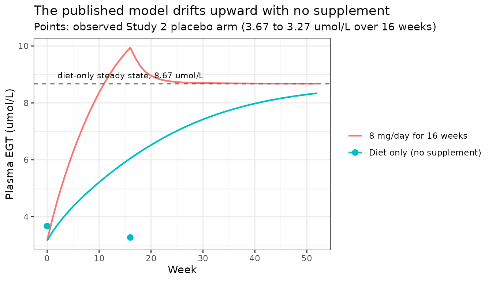

# Ergothioneine PBPK (Okumura 2025)

## Model and source

- Citation: Okumura H, Araragi Y, Nishioka K, Yamashita R, Suzuki T,
  Watanabe H, Kato Y, Murayama N. Estimation and Validation of an
  Effective Ergothioneine Dose for Improved Sleep Quality Using
  Physiologically Based Pharmacokinetic Model. Food Sci Nutr.
  2025;13(6):e70382. <doi:10.1002/fsn3.70382>. The ODE system is
  transcribed from the ‘Actual model code used in Napp software’ block
  of Supporting Information S1 (FSN3-13-e70382-s001.docx), cross-checked
  against the printed mass-balance equations in the same file; the
  initial-condition formulae are that file’s ‘Estimation of initial
  values’ section; the fixed physiological constants are Table 1; and
  the estimated parameters are Supplementary Table S5. The five-tandem
  hepatic chain follows Watanabe T, Kusuhara H, Maeda K, Shitara Y,
  Sugiyama Y. Physiologically based pharmacokinetic modeling to predict
  transporter-mediated clearance and distribution of pravastatin in
  humans. J Pharmacol Exp Ther. 2009;328(2):652-62.
  <doi:10.1124/jpet.108.146647>, cited by Okumura 2025 as the source of
  that structure; the same chain is already used in this library by
  Aoki_2024_bosentan_pbpk.R.
- Article: <https://doi.org/10.1002/fsn3.70382>
- Supporting Information S1 (open access): `FSN3-13-e70382-s001.docx`,
  which contains the printed mass-balance equations, the initial-value
  formulae, the verbatim Napp model code, Figure S1 (the model
  schematic), Figure S2 (the final fit) and Supplementary Tables S1-S5.

Ergothioneine (EGT) is a sulfur-containing amino acid that mammals
cannot synthesise. It is obtained entirely from the diet and crosses
membranes only through its specific transporter OCTN1/SLC22A4, which is
why its disposition is saturable everywhere and why a conventional
compartmental PK model does not describe it well. Okumura 2025 built a
physiologically based pharmacokinetic (PBPK) model of EGT in order to
answer a dose-selection question: a previous trial had shown that 20
mg/day for four weeks improves sleep quality, reaching a mean plasma EGT
of 9.51 umol/L, but the minimum effective dose was unknown. The authors
ran a PK study at 5 and 10 mg/day (Study 1), fitted the PBPK model,
simulated 6-9 mg/day for 16 weeks, chose 8 mg/day, and then ran a
randomised placebo-controlled trial at that dose (Study 2) which
confirmed both the predicted plasma concentration and an improvement in
subjective sleep quality.

Three features of the paper shape this vignette:

1.  **The model is fully published.** Supporting Information S1 gives
    the complete 21-state ODE system twice – once as printed
    mass-balance equations and once as the actual Napp source code –
    plus every initial-value formula. Nothing structural had to be
    inferred.
2.  **The fit is a fixed-effects least-squares fit to mean profiles.**
    Napp estimates neither between-subject variability nor a
    residual-error variance, and none is reported. The residual-error
    terms in the model file are fixed placeholders required for
    syntactic completeness in nlmixr2 and must not be read as estimates.
3.  **There are two parameter sets.** Table 1 is the fit to the 5, 10
    and 20 mg/day arms, and it is the fit that generated the Table 2
    dose-selection simulation. Supplementary Table S5 is the final
    “blush-up” fit after the 8 mg/day arm from Study 2 was added. Per
    library policy for a base-plus-final development paper the model
    file carries the **final** Table S5 estimates; this vignette reverts
    the three estimated parameters to their Table 1 values wherever it
    reproduces a Table 1-derived result.

``` r

mod <- readModelDb("Okumura_2025_ergothioneine_pbpk")
mod
#> function() {
#>   description <- paste(
#>     "PBPK (whole-body, OCTN1 transporter-mediated). Ergothioneine (EGT)",
#>     "disposition in healthy Japanese adults during repeated once-daily oral",
#>     "supplementation, used by Okumura 2025 to pick the lowest daily dose that",
#>     "reaches the plasma concentration associated with improved sleep quality.",
#>     "EGT is a dietary sulfur amino acid that mammals cannot synthesise; it",
#>     "crosses membranes only via its specific transporter OCTN1/SLC22A4, so",
#>     "every distribution and reabsorption step in the model is a saturable",
#>     "Michaelis-Menten process sharing one transporter Km. Plasma exchanges",
#>     "with three permeability-limited peripheral tissues (muscle, skin,",
#>     "adipose), each split into an extracellular and an intracellular space,",
#>     "and with a permeability-limited liver represented as five tandem",
#>     "extracellular/intracellular pairs to reproduce the near-flow-limited",
#>     "hepatic uptake seen with [3H]EGT in mice. Absorbed drug enters the first",
#>     "hepatic extracellular sub-compartment (portal delivery); gastrointestinal",
#>     "absorption is assumed complete. Elimination is renal: EGT is filtered at",
#>     "the glomerulus into a tubular duct, saturably reabsorbed back to plasma,",
#>     "and lost in urine. A red-blood-cell precursor pool takes EGT up from",
#>     "plasma saturably and matures into circulating red cells, which explains",
#>     "the long lag before whole-blood EGT rises. A continuous dietary intake",
#>     "rate feeds the gastrointestinal compartment alongside the supplement",
#>     "dose. The model is a fixed-effects least-squares fit to mean plasma and",
#>     "red-cell profiles (Napp software) with no between-subject variability;",
#>     "the values below are the final 'blush-up' fit of Supplementary Table S5,",
#>     "which added the 8 mg/day arm to the 5, 10 and 20 mg/day arms used for",
#>     "the Table 1 fit. Doses are supplied in umol (EGT MW 229.30 g/mol, so",
#>     "8 mg = 8 * 1000 / 229.30 = 34.89 umol). See the vignette Errata for the",
#>     "published discrepancies this extraction had to settle.",
#>     sep = " "
#>   )
#>   reference <- paste(
#>     "Okumura H, Araragi Y, Nishioka K, Yamashita R, Suzuki T, Watanabe H,",
#>     "Kato Y, Murayama N. Estimation and Validation of an Effective",
#>     "Ergothioneine Dose for Improved Sleep Quality Using Physiologically",
#>     "Based Pharmacokinetic Model. Food Sci Nutr. 2025;13(6):e70382.",
#>     "doi:10.1002/fsn3.70382.",
#>     "The ODE system is transcribed from the 'Actual model code used in Napp",
#>     "software' block of Supporting Information S1 (FSN3-13-e70382-s001.docx),",
#>     "cross-checked against the printed mass-balance equations in the same",
#>     "file; the initial-condition formulae are that file's 'Estimation of",
#>     "initial values' section; the fixed physiological constants are Table 1;",
#>     "and the estimated parameters are Supplementary Table S5.",
#>     "The five-tandem hepatic chain follows Watanabe T, Kusuhara H, Maeda K,",
#>     "Shitara Y, Sugiyama Y. Physiologically based pharmacokinetic modeling to",
#>     "predict transporter-mediated clearance and distribution of pravastatin in",
#>     "humans. J Pharmacol Exp Ther. 2009;328(2):652-62.",
#>     "doi:10.1124/jpet.108.146647, cited by Okumura 2025 as the source of that",
#>     "structure; the same chain is already used in this library by",
#>     "Aoki_2024_bosentan_pbpk.R.",
#>     sep = " "
#>   )
#>   vignette <- "Okumura_2025_ergothioneine_pbpk"
#> 
#>   # The five tandem hepatic extracellular / intracellular pairs are the
#>   # Watanabe 2009 dispersion idiom rather than a canonical single-organ
#>   # state, and are declared here exactly as the sibling model
#>   # Aoki_2024_bosentan_pbpk.R declares them. `rbc_precursor` is the
#>   # erythroid-precursor EGT pool in the bone marrow (an AMOUNT, umol) and
#>   # `renal_duct` is the proximal-tubular lumen; neither has a canonical
#>   # entry yet. Note the deliberate distinction between `rbc_precursor`
#>   # (amount of EGT in precursor cells) and `rbc_egt` (concentration of EGT
#>   # inside mature circulating red cells), which IS a canonical member of
#>   # the `rbc_<analyte>` family.
#>   paper_specific_compartments <- c(
#>     "is_liver1", "is_liver2", "is_liver3", "is_liver4", "is_liver5",
#>     "int_liver1", "int_liver2", "int_liver3", "int_liver4", "int_liver5",
#>     "rbc_precursor", "renal_duct"
#>   )
#> 
#>   # Time in hours (the Napp code steps in hours and doses every 24). The
#>   # model works in molar units throughout: tissue states hold
#>   # concentrations in umol/L (micromolar, the unit every EGT concentration
#>   # is reported in) and the two amount states hold umol, so doses must be
#>   # supplied in umol.
#>   units <- list(time = "h", dosing = "umol", concentration = "umol/L")
#> 
#>   # No covariates. Every physiological volume and flow in Table 1 is a
#>   # fixed constant for one typical 70 kg adult (Supplementary Table S5
#>   # footnote a: "Each value represents per human value assuming 70 kg body
#>   # weight"); the model carries no body-weight, age or sex term.
#>   covariateData <- list()
#> 
#>   # Screened in the paper's baseline tables but never entered into the
#>   # model, so documented here rather than in covariateData.
#>   covariatesDataExcluded <- list(
#>     WT = list(
#>       description = "Body weight",
#>       units = "kg",
#>       type = "continuous",
#>       notes = paste(
#>         "Reported as a baseline characteristic (Study 1 Supplementary",
#>         "Table S3: 61.2 +/- 10.7 and 65.7 +/- 12.5 kg; Study 2 Table 3:",
#>         "61.3 +/- 11.1 and 61.6 +/- 12.5 kg) and used only to state that",
#>         "the physiological constants are for a 70 kg adult. No weight",
#>         "term was estimated."
#>       )
#>     ),
#>     AGE = list(
#>       description = "Age",
#>       units = "years",
#>       type = "continuous",
#>       notes = paste(
#>         "Baseline characteristic only (Study 1: 42.4 +/- 7.9 and 42.1",
#>         "+/- 8.1 years; Study 2: 53.5 +/- 6.3 and 53.4 +/- 6.0 years).",
#>         "The Discussion notes that plasma EGT is lower in older people",
#>         "(Cheah 2016) but no age term was estimated."
#>       )
#>     ),
#>     SEXF = list(
#>       description = "Female sex indicator",
#>       units = "unitless",
#>       type = "categorical",
#>       notes = paste(
#>         "Balanced by design at randomisation (Study 1: 8/28 female;",
#>         "Study 2: 51/100 female) but not entered into the model."
#>       )
#>     )
#>   )
#> 
#>   compartmentData <- list(
#>     depot         = list(analyte = "ergothioneine", units = "umol", specimen = "administration site", verified = TRUE),
#>     central       = list(analyte = "ergothioneine", units = "umol/L", specimen = "plasma", verified = TRUE),
#>     is_liver1     = list(analyte = "ergothioneine", units = "umol/L", specimen = "tissue", verified = TRUE),
#>     int_liver1    = list(analyte = "ergothioneine", units = "umol/L", specimen = "tissue", verified = TRUE),
#>     is_liver2     = list(analyte = "ergothioneine", units = "umol/L", specimen = "tissue", verified = TRUE),
#>     int_liver2    = list(analyte = "ergothioneine", units = "umol/L", specimen = "tissue", verified = TRUE),
#>     is_liver3     = list(analyte = "ergothioneine", units = "umol/L", specimen = "tissue", verified = TRUE),
#>     int_liver3    = list(analyte = "ergothioneine", units = "umol/L", specimen = "tissue", verified = TRUE),
#>     is_liver4     = list(analyte = "ergothioneine", units = "umol/L", specimen = "tissue", verified = TRUE),
#>     int_liver4    = list(analyte = "ergothioneine", units = "umol/L", specimen = "tissue", verified = TRUE),
#>     is_liver5     = list(analyte = "ergothioneine", units = "umol/L", specimen = "tissue", verified = TRUE),
#>     int_liver5    = list(analyte = "ergothioneine", units = "umol/L", specimen = "tissue", verified = TRUE),
#>     is_skin       = list(analyte = "ergothioneine", units = "umol/L", specimen = "tissue", verified = TRUE),
#>     int_skin      = list(analyte = "ergothioneine", units = "umol/L", specimen = "tissue", verified = TRUE),
#>     is_muscle     = list(analyte = "ergothioneine", units = "umol/L", specimen = "tissue", verified = TRUE),
#>     int_muscle    = list(analyte = "ergothioneine", units = "umol/L", specimen = "tissue", verified = TRUE),
#>     is_adipose    = list(analyte = "ergothioneine", units = "umol/L", specimen = "tissue", verified = TRUE),
#>     int_adipose   = list(analyte = "ergothioneine", units = "umol/L", specimen = "tissue", verified = TRUE),
#>     rbc_precursor = list(analyte = "ergothioneine", units = "umol", specimen = "blood cell", verified = TRUE),
#>     rbc_egt       = list(analyte = "ergothioneine", units = "umol/L", specimen = "blood cell", verified = TRUE),
#>     renal_duct    = list(analyte = "ergothioneine", units = "umol/L", specimen = "urine", verified = TRUE)
#>   )
#> 
#>   population <- list(
#>     species = "human",
#>     n_subjects = 128,
#>     n_studies = 2,
#>     age_range = "30-59 years (Study 1); 40-64 years (Study 2)",
#>     age_mean = "42.3 years (Study 1); 53.4 years (Study 2)",
#>     weight_mean = "63.5 kg (Study 1); 61.5 kg (Study 2)",
#>     sex_female_pct = 46,
#>     race_ethnicity = c(Asian = 100),
#>     disease_state = "healthy volunteers",
#>     dose_range = "5, 8, 10 and 20 mg/day oral EGT once daily for 8-16 weeks",
#>     regions = "Japan",
#>     notes = paste(
#>       "Study 1 (UMIN000041910) randomised 28 healthy Japanese employees",
#>       "aged 30-59 to 5 or 10 mg/day for 8 weeks (14 per arm; 8/28 female;",
#>       "baseline Supplementary Table S3). Study 2 (UMIN000044580)",
#>       "randomised 100 healthy Japanese adults aged 40-64 who reported",
#>       "memory or attention decline to 8 mg/day or placebo for 16 weeks",
#>       "(50 per arm, one placebo withdrawal; 51/100 female; baseline",
#>       "Table 3); only the 50 EGT recipients contribute PK. The 20 mg/day",
#>       "plasma and red-cell profiles used in the fit come from the earlier",
#>       "Katsube 2022 study and are not part of the 128 subjects counted",
#>       "here. n_subjects is the 28 Study 1 plus 100 Study 2 participants.",
#>       "All physiological constants are for a typical 70 kg adult",
#>       "(Supplementary Table S5 footnote a), which is above the observed",
#>       "mean weight in both studies."
#>     )
#>   )
#> 
#>   ini({
#>     # -----------------------------------------------------------------
#>     # Estimated parameters -- Supplementary Table S5, the paper's final
#>     # ("blush-up") fit of plasma and red-cell profiles at 5, 8, 10 and
#>     # 20 mg/day. Values are +/- SD; CV was 8%-20% (Results 3.2.5).
#>     # The earlier Table 1 fit, which excluded the 8 mg/day arm and
#>     # generated the Table 2 dose-selection simulation, gave R = 1.36,
#>     # VmaxD = 121 and VmaxP = 11.1; the vignette reproduces Table 2 by
#>     # overriding these three back to those values.
#>     # -----------------------------------------------------------------
#>     lrdiet <- log(1.52)
#>     label("Daily dietary ergothioneine ingestion rate (umol/h)")                  # Table S5: R 1.52 +/- 0.31 umol/h
#>     lvmax_duct <- log(105)
#>     label("Maximum rate of renal tubular reabsorption (umol/h)")                  # Table S5: VmaxD 105 +/- 14 umol/h
#>     lvmax_precursor <- log(11.0)
#>     label("Maximum rate of uptake into the red-cell precursor pool (umol/h)")     # Table S5: VmaxP 11.0 +/- 0.9 umol/h
#> 
#>     # -----------------------------------------------------------------
#>     # Fixed transporter constants -- Table 1.
#>     # -----------------------------------------------------------------
#>     lka <- fixed(log(6.00))
#>     label("Gastric emptying / absorption rate constant (1/h)")                    # Table 1: kab 6.00 /h, Fixed
#>     lkm <- fixed(log(21.0))
#>     label("Michaelis constant for OCTN1-mediated transport (umol/L)")             # Table 1: Km 21.0 uM, Fixed (Grundemann 2005)
#>     lvmax_liver <- fixed(log(10227))
#>     label("Maximum rate of hepatic OCTN1-mediated uptake (umol/h)")               # Table 1: VmaxH 10,227 umol/h, Fixed
#> 
#>     # -----------------------------------------------------------------
#>     # Fixed volumes (L) -- Table 1, all from Davies & Morris 1993 except
#>     # the renal duct (Sarashina 2020). Every tissue's extracellular space
#>     # is exactly 20% of its intracellular space in this table.
#>     # -----------------------------------------------------------------
#>     lvc <- fixed(log(3.00))
#>     label("Plasma volume (L)")                                                    # Table 1: Vp 3.00 L, Fixed
#>     lv_blood <- fixed(log(5.20))
#>     label("Whole-blood volume, used only to derive haematocrit (L)")              # Table 1: Blood 5.20 L, Fixed
#>     lv_rbc <- fixed(log(2.29))
#>     label("Red-blood-cell volume (L)")                                            # Table 1: VRBC 2.29 L, Fixed
#>     lv_liver <- fixed(log(1.69))
#>     label("Liver intracellular volume (L)")                                       # Table 1: Vh 1.69 L, Fixed
#>     lv_liver_ex <- fixed(log(0.338))
#>     label("Liver extracellular volume (L)")                                       # Table 1: Vhe 0.338 L, Fixed
#>     lv_muscle <- fixed(log(35.0))
#>     label("Muscle intracellular volume (L)")                                      # Table 1: Vm 35.0 L, Fixed
#>     lv_muscle_ex <- fixed(log(7.00))
#>     label("Muscle extracellular volume (L)")                                      # Table 1: Vme 7.00 L, Fixed
#>     lv_skin <- fixed(log(7.8))
#>     label("Skin intracellular volume (L)")                                        # Table 1: Vs 7.8 L, Fixed
#>     lv_skin_ex <- fixed(log(1.56))
#>     label("Skin extracellular volume (L)")                                        # Table 1: Vse 1.56 L, Fixed
#>     lv_adipose <- fixed(log(10.0))
#>     label("Adipose intracellular volume (L)")                                     # Table 1: Va 10.0 L, Fixed
#>     lv_adipose_ex <- fixed(log(2.00))
#>     label("Adipose extracellular volume (L)")                                     # Table 1: Vae 2.00 L, Fixed
#>     lv_duct <- fixed(log(0.127))
#>     label("Renal tubular duct volume (L)")                                        # Table 1: Vd 0.127 L, Fixed (Sarashina 2020)
#> 
#>     # -----------------------------------------------------------------
#>     # Fixed plasma flows (L/h) -- Table 1 (Davies & Morris 1993).
#>     # -----------------------------------------------------------------
#>     lq_liver <- fixed(log(48.7))
#>     label("Hepatic plasma flow (L/h)")                                            # Table 1: Qh 48.7 L/h, Fixed
#>     lq_muscle <- fixed(log(45.0))
#>     label("Muscle plasma flow (L/h)")                                             # Table 1: Qm 45.0 L/h, Fixed
#>     lq_skin <- fixed(log(18.0))
#>     label("Skin plasma flow (L/h)")                                               # Table 1: Qs 18.0 L/h, Fixed
#>     lq_adipose <- fixed(log(8.74))
#>     label("Adipose plasma flow (L/h)")                                            # Table 1: Qa 8.74 L/h, Fixed
#>     lq_urine <- fixed(log(0.0583))
#>     label("Urinary flow rate (L/h)")                                              # Table 1: Qu 0.0583 L/h, Fixed
#>     lgfr <- fixed(log(7.50))
#>     label("Glomerular filtration rate (L/h)")                                     # Table 1: GFR 7.50 L/h, Fixed
#> 
#>     # -----------------------------------------------------------------
#>     # Fixed red-cell turnover -- Table 1.
#>     # -----------------------------------------------------------------
#>     lk_rbc_diff <- fixed(log(0.0104))
#>     label("Red-cell differentiation rate constant (1/h)")                         # Table 1: k1 0.0104 /h, Fixed (Yasukouchi 1999)
#>     lk_rbc_deg <- fixed(log(0.000963))
#>     label("Red-cell degradation rate constant (1/h)")                             # Table 1: kb 0.000963 /h, Fixed (Obara 1962)
#> 
#>     # -----------------------------------------------------------------
#>     # Fixed tissue-to-plasma concentration ratios -- Table 1, measured in
#>     # mice (Araragi et al., manuscript in preparation) and restated in
#>     # Methods 2.1.3. These set each tissue's efflux clearance via
#>     # PSeff = Rt * VmaxH / Km / Kp.
#>     # -----------------------------------------------------------------
#>     lkp_liver <- fixed(log(80.1))
#>     label("Liver-to-plasma concentration ratio (unitless)")                       # Table 1: KpH 80.1, Fixed
#>     lkp_muscle <- fixed(log(5.06))
#>     label("Muscle-to-plasma concentration ratio (unitless)")                      # Table 1: KpM 5.06, Fixed
#>     lkp_skin <- fixed(log(20.8))
#>     label("Skin-to-plasma concentration ratio (unitless)")                        # Table 1: KpS 20.8, Fixed
#>     lkp_adipose <- fixed(log(17.5))
#>     label("Adipose-to-plasma concentration ratio (unitless)")                     # Table 1: KpA 17.5, Fixed
#> 
#>     # -----------------------------------------------------------------
#>     # Tissue-to-liver Vmax ratios (Rt in the supplement's nomenclature).
#>     # NOT TABULATED ANYWHERE IN THE PAPER -- derived here from the rule
#>     # the paper states in Methods 2.1.3: per-gram Vmax is proportional to
#>     # the mean OCTN1 mRNA level across three expression databases (liver
#>     # 0.147, muscle 0.464, adipose 0.209, skin 0.131), so the whole-organ
#>     # ratio is (mRNA_tissue * mass_tissue) / (mRNA_liver * mass_liver)
#>     # with organ mass taken from the Table 1 volumes. That choice is
#>     # basis-free: extracellular volume is exactly 20% of intracellular
#>     # volume for all four tissues, so using total or intracellular volume
#>     # gives identical ratios. The vignette shows the model output is
#>     # numerically insensitive to this derivation (a 20-fold change in
#>     # lr_muscle moves the Table 2 predictions by <0.01%), because uptake
#>     # and efflux share the same Rt factor and so the steady-state
#>     # tissue:plasma ratio is fixed by Kp alone.
#>     # -----------------------------------------------------------------
#>     lr_muscle <- fixed(log(65.3705))
#>     label("Muscle-to-liver maximum-uptake-rate ratio (unitless)")                 # derived: (0.464*42.0)/(0.147*2.028), Methods 2.1.3 + Table 1
#>     lr_skin <- fixed(log(4.11303))
#>     label("Skin-to-liver maximum-uptake-rate ratio (unitless)")                   # derived: (0.131*9.36)/(0.147*2.028), Methods 2.1.3 + Table 1
#>     lr_adipose <- fixed(log(8.41283))
#>     label("Adipose-to-liver maximum-uptake-rate ratio (unitless)")                # derived: (0.209*12.0)/(0.147*2.028), Methods 2.1.3 + Table 1
#> 
#>     # -----------------------------------------------------------------
#>     # Baseline (pre-supplementation) concentrations. These are inputs to
#>     # the initial-condition formulae, not estimates: the paper sets them
#>     # to the observed blank value of whichever arm is being simulated.
#>     # The defaults are the 8 mg/day row of Supplementary Table S5, which
#>     # is the arm the final parameter estimates above were fitted with.
#>     # Override for other arms -- Table 1 lists 3.42/624 (5 mg/day),
#>     # 3.51/562 (10 mg/day) and 2.97/594 (20 mg/day), and the Table 2
#>     # dose-selection simulation uses 3.16 with 594. Methods 2.1.3 calls
#>     # 3.16 "the average of the blank values obtained at 5, 10, and
#>     # 20 mg/day", but the simple mean of those three is 3.30; see the
#>     # vignette Errata.
#>     # -----------------------------------------------------------------
#>     cp0 <- fixed(4.07)
#>     label("Baseline plasma ergothioneine concentration (umol/L)")                 # Table S5, 8 mg/day: CPlasma 4.07 uM
#>     crbc0 <- fixed(594)
#>     label("Baseline red-cell ergothioneine concentration (umol/L)")               # Table S5, 8 mg/day: CRBC 594 uM
#> 
#>     # -----------------------------------------------------------------
#>     # Napp fits by nonlinear least squares on mean profiles: it estimates
#>     # neither between-subject variability nor a residual-error variance,
#>     # and none is reported anywhere in Okumura 2025 or its supplement.
#>     # nlmixr2 model definitions require a residual-error term, so the two
#>     # below are fixed placeholders for syntactic completeness only and
#>     # must NOT be read as estimates. Same convention as
#>     # Aoki_2024_bosentan_pbpk, Mi_2023_cefquinome_pbpk and
#>     # An_2012_mitoxantrone_human_pbpk.
#>     # -----------------------------------------------------------------
#>     propSd <- fixed(0.10)
#>     label("Proportional residual error placeholder, plasma (fraction)")           # not reported in Okumura 2025; placeholder only
#>     propSd_Crbc <- fixed(0.10)
#>     label("Proportional residual error placeholder, red cells (fraction)")        # not reported in Okumura 2025; placeholder only
#>   })
#> 
#>   model({
#>     # 1. Back-transform to the natural scale.
#>     rdiet <- exp(lrdiet)
#>     vmax_duct <- exp(lvmax_duct)
#>     vmax_precursor <- exp(lvmax_precursor)
#>     ka <- exp(lka)
#>     km <- exp(lkm)
#>     vmax_liver <- exp(lvmax_liver)
#>     vc <- exp(lvc)
#>     v_blood <- exp(lv_blood)
#>     v_rbc <- exp(lv_rbc)
#>     v_liver <- exp(lv_liver)
#>     v_liver_ex <- exp(lv_liver_ex)
#>     v_muscle <- exp(lv_muscle)
#>     v_muscle_ex <- exp(lv_muscle_ex)
#>     v_skin <- exp(lv_skin)
#>     v_skin_ex <- exp(lv_skin_ex)
#>     v_adipose <- exp(lv_adipose)
#>     v_adipose_ex <- exp(lv_adipose_ex)
#>     v_duct <- exp(lv_duct)
#>     q_liver <- exp(lq_liver)
#>     q_muscle <- exp(lq_muscle)
#>     q_skin <- exp(lq_skin)
#>     q_adipose <- exp(lq_adipose)
#>     q_urine <- exp(lq_urine)
#>     gfr <- exp(lgfr)
#>     k_rbc_diff <- exp(lk_rbc_diff)
#>     k_rbc_deg <- exp(lk_rbc_deg)
#>     kp_liver <- exp(lkp_liver)
#>     kp_muscle <- exp(lkp_muscle)
#>     kp_skin <- exp(lkp_skin)
#>     kp_adipose <- exp(lkp_adipose)
#>     r_muscle <- exp(lr_muscle)
#>     r_skin <- exp(lr_skin)
#>     r_adipose <- exp(lr_adipose)
#> 
#>     # 2. Derived terms.
#>     #    The liver is five equal tandem sub-compartments, so each holds a
#>     #    fraction fdisp = 1/5 of the hepatic volume and receives fdisp of
#>     #    the liver-wide uptake and efflux clearances. The Napp code writes
#>     #    this as an explicit `/5` on VmaxH and PSeffH in every hepatic ODE.
#>     fdisp <- 0.2
#> 
#>     #    Whole-organ maximum uptake rates, scaled off the liver by the
#>     #    OCTN1 expression ratios (Supporting Information S1, "Preparative
#>     #    calculation": VmaxS = Rs*VmaxH, VmaxM = Rm*VmaxH, VmaxA = Ra*VmaxH).
#>     vmax_muscle <- r_muscle * vmax_liver
#>     vmax_skin <- r_skin * vmax_liver
#>     vmax_adipose <- r_adipose * vmax_liver
#> 
#>     #    Intrinsic efflux clearances (L/h). Same block: PSeffT is set so
#>     #    that the linear-regime uptake:efflux ratio (Vmax/Km)/PSeff equals
#>     #    the tissue-to-plasma ratio Kp.
#>     pseff_liver <- vmax_liver / km / kp_liver
#>     pseff_muscle <- r_muscle * vmax_liver / km / kp_muscle
#>     pseff_skin <- r_skin * vmax_liver / km / kp_skin
#>     pseff_adipose <- r_adipose * vmax_liver / km / kp_adipose
#> 
#>     #    Haematocrit, used only to report whole-blood EGT via the paper's
#>     #    Equation 1, Cblood = Hct*Crbc + (1-Hct)*Cplasma.
#>     hct <- v_rbc / v_blood
#> 
#>     #    Steady-state hepatic initial concentrations (Supporting
#>     #    Information S1, "Estimation of initial values").
#>     che0 <- rdiet / q_liver + cp0
#>     chi0 <- vmax_liver * che0 / (km + che0) / pseff_liver
#> 
#>     # 3. ODE system -- transcribed from the Napp code block of Supporting
#>     #    Information S1. The tissue states hold CONCENTRATIONS (umol/L);
#>     #    `depot` and `rbc_precursor` hold AMOUNTS (umol).
#> 
#>     #    Gastrointestinal tract: continuous dietary intake plus the
#>     #    supplement dose, emptying first-order into the portal inflow.
#>     d/dt(depot) <- rdiet - ka * depot
#> 
#>     #    Plasma: return from the last hepatic sub-compartment and from the
#>     #    three peripheral extracellular spaces, saturable loss into the
#>     #    red-cell precursor pool, return from degrading red cells,
#>     #    glomerular filtration out, and saturable tubular reabsorption in.
#>     d/dt(central) <- (-(q_liver + q_muscle + q_skin + q_adipose) * central +
#>       q_liver * is_liver5 + q_muscle * is_muscle + q_skin * is_skin +
#>       q_adipose * is_adipose -
#>       vmax_precursor * central / (km + central) +
#>       k_rbc_deg * rbc_egt * v_rbc -
#>       gfr * central +
#>       vmax_duct * renal_duct / (km + renal_duct)) / vc
#> 
#>     #    Hepatic tandem chain. Sub-compartment 1 additionally receives the
#>     #    absorbed dose (complete gastrointestinal absorption is assumed);
#>     #    each subsequent one receives its predecessor's outflow, so
#>     #    is_liver5 is what returns to plasma above.
#>     d/dt(is_liver1) <- (ka * depot + q_liver * (central - is_liver1) -
#>       fdisp * vmax_liver * is_liver1 / (km + is_liver1) +
#>       fdisp * pseff_liver * int_liver1) / (fdisp * v_liver_ex)
#>     d/dt(int_liver1) <- (fdisp * vmax_liver * is_liver1 / (km + is_liver1) -
#>       fdisp * pseff_liver * int_liver1) / (fdisp * v_liver)
#> 
#>     d/dt(is_liver2) <- (q_liver * (is_liver1 - is_liver2) -
#>       fdisp * vmax_liver * is_liver2 / (km + is_liver2) +
#>       fdisp * pseff_liver * int_liver2) / (fdisp * v_liver_ex)
#>     d/dt(int_liver2) <- (fdisp * vmax_liver * is_liver2 / (km + is_liver2) -
#>       fdisp * pseff_liver * int_liver2) / (fdisp * v_liver)
#> 
#>     d/dt(is_liver3) <- (q_liver * (is_liver2 - is_liver3) -
#>       fdisp * vmax_liver * is_liver3 / (km + is_liver3) +
#>       fdisp * pseff_liver * int_liver3) / (fdisp * v_liver_ex)
#>     d/dt(int_liver3) <- (fdisp * vmax_liver * is_liver3 / (km + is_liver3) -
#>       fdisp * pseff_liver * int_liver3) / (fdisp * v_liver)
#> 
#>     d/dt(is_liver4) <- (q_liver * (is_liver3 - is_liver4) -
#>       fdisp * vmax_liver * is_liver4 / (km + is_liver4) +
#>       fdisp * pseff_liver * int_liver4) / (fdisp * v_liver_ex)
#>     d/dt(int_liver4) <- (fdisp * vmax_liver * is_liver4 / (km + is_liver4) -
#>       fdisp * pseff_liver * int_liver4) / (fdisp * v_liver)
#> 
#>     d/dt(is_liver5) <- (q_liver * (is_liver4 - is_liver5) -
#>       fdisp * vmax_liver * is_liver5 / (km + is_liver5) +
#>       fdisp * pseff_liver * int_liver5) / (fdisp * v_liver_ex)
#>     d/dt(int_liver5) <- (fdisp * vmax_liver * is_liver5 / (km + is_liver5) -
#>       fdisp * pseff_liver * int_liver5) / (fdisp * v_liver)
#> 
#>     #    Permeability-limited peripheral tissues: perfusion exchange with
#>     #    plasma into the extracellular space, then saturable OCTN1 uptake
#>     #    into and passive efflux out of the intracellular space.
#>     d/dt(is_muscle) <- (q_muscle * (central - is_muscle) -
#>       vmax_muscle * is_muscle / (km + is_muscle) +
#>       pseff_muscle * int_muscle) / v_muscle_ex
#>     d/dt(int_muscle) <- (vmax_muscle * is_muscle / (km + is_muscle) -
#>       pseff_muscle * int_muscle) / v_muscle
#> 
#>     d/dt(is_skin) <- (q_skin * (central - is_skin) -
#>       vmax_skin * is_skin / (km + is_skin) +
#>       pseff_skin * int_skin) / v_skin_ex
#>     d/dt(int_skin) <- (vmax_skin * is_skin / (km + is_skin) -
#>       pseff_skin * int_skin) / v_skin
#> 
#>     d/dt(is_adipose) <- (q_adipose * (central - is_adipose) -
#>       vmax_adipose * is_adipose / (km + is_adipose) +
#>       pseff_adipose * int_adipose) / v_adipose_ex
#>     d/dt(int_adipose) <- (vmax_adipose * is_adipose / (km + is_adipose) -
#>       pseff_adipose * int_adipose) / v_adipose
#> 
#>     #    Erythroid lineage: saturable uptake from plasma into the marrow
#>     #    precursor pool (an amount, umol), first-order maturation into
#>     #    circulating red cells, first-order red-cell degradation returning
#>     #    EGT to plasma. This chain is why whole-blood EGT keeps rising for
#>     #    weeks after plasma has levelled off.
#>     d/dt(rbc_precursor) <- vmax_precursor * central / (km + central) -
#>       k_rbc_diff * rbc_precursor
#>     d/dt(rbc_egt) <- (k_rbc_diff * rbc_precursor -
#>       k_rbc_deg * rbc_egt * v_rbc) / v_rbc
#> 
#>     #    Proximal tubular lumen: glomerular filtrate in, saturable OCTN1
#>     #    reabsorption back to plasma, urinary loss out. This is the only
#>     #    elimination pathway in the model.
#>     d/dt(renal_duct) <- (gfr * central -
#>       vmax_duct * renal_duct / (km + renal_duct) -
#>       q_urine * renal_duct) / v_duct
#> 
#>     # 4. Initial conditions -- Supporting Information S1, "Estimation of
#>     #    initial values". The gastrointestinal, hepatic, peripheral,
#>     #    precursor and tubular states are placed at the steady state
#>     #    implied by the dietary intake rate and the baseline plasma
#>     #    concentration; plasma and red cells start at the observed blank
#>     #    values of the arm being simulated.
#>     depot(0) <- rdiet / ka
#>     central(0) <- cp0
#>     is_liver1(0) <- che0
#>     is_liver2(0) <- che0
#>     is_liver3(0) <- che0
#>     is_liver4(0) <- che0
#>     is_liver5(0) <- che0
#>     int_liver1(0) <- chi0
#>     int_liver2(0) <- chi0
#>     int_liver3(0) <- chi0
#>     int_liver4(0) <- chi0
#>     int_liver5(0) <- chi0
#>     is_muscle(0) <- cp0
#>     int_muscle(0) <- vmax_muscle * cp0 / (km + cp0) / pseff_muscle
#>     is_skin(0) <- cp0
#>     int_skin(0) <- vmax_skin * cp0 / (km + cp0) / pseff_skin
#>     is_adipose(0) <- cp0
#>     int_adipose(0) <- vmax_adipose * cp0 / (km + cp0) / pseff_adipose
#>     rbc_precursor(0) <- vmax_precursor * cp0 / (km + cp0) / k_rbc_diff
#>     rbc_egt(0) <- crbc0
#>     renal_duct(0) <- rdiet / q_urine
#> 
#>     # 5. Observations. Both tissue states already hold concentrations in
#>     #    umol/L. Cblood is the whole-blood concentration the assay
#>     #    actually measures, recovered from Equation 1 of the paper; it is
#>     #    reported as a derived output rather than a fitted endpoint
#>     #    because the fit was performed on plasma and back-calculated
#>     #    red-cell concentrations.
#>     Cc <- central
#>     Crbc <- rbc_egt
#>     Cblood <- hct * rbc_egt + (1 - hct) * central
#> 
#>     Cc ~ prop(propSd)
#>     Crbc ~ prop(propSd_Crbc)
#>   })
#> }
#> <environment: 0x558096e92d70>
```

## Population

``` r

pop <- readModelDb("Okumura_2025_ergothioneine_pbpk")()$population
str(pop)
#> List of 12
#>  $ species       : chr "human"
#>  $ n_subjects    : num 128
#>  $ n_studies     : num 2
#>  $ age_range     : chr "30-59 years (Study 1); 40-64 years (Study 2)"
#>  $ age_mean      : chr "42.3 years (Study 1); 53.4 years (Study 2)"
#>  $ weight_mean   : chr "63.5 kg (Study 1); 61.5 kg (Study 2)"
#>  $ sex_female_pct: num 46
#>  $ race_ethnicity: Named num 100
#>   ..- attr(*, "names")= chr "Asian"
#>  $ disease_state : chr "healthy volunteers"
#>  $ dose_range    : chr "5, 8, 10 and 20 mg/day oral EGT once daily for 8-16 weeks"
#>  $ regions       : chr "Japan"
#>  $ notes         : chr "Study 1 (UMIN000041910) randomised 28 healthy Japanese employees aged 30-59 to 5 or 10 mg/day for 8 weeks (14 p"| __truncated__
```

Study 1 (UMIN000041910) randomised 28 healthy Japanese adults aged 30-59
to 5 or 10 mg/day of EGT for eight weeks, 14 per arm, with plasma and
whole-blood EGT measured at baseline and on days 8, 14, 21, 28 and 56
(Supplementary Table S3). Study 2 (UMIN000044580) randomised 100 healthy
Japanese adults aged 40-64 who reported memory or attention decline to 8
mg/day or placebo for 16 weeks, 50 per arm, with plasma EGT at baseline
and week 16 (Table 3). The 20 mg/day plasma and red-cell profiles that
also entered the fit come from the earlier Katsube 2022 trial and are
not part of the 128 participants above.

All physiological constants are for one typical 70 kg adult
(Supplementary Table S5 footnote a). The model carries no covariates: it
is a single typical-value system, so every simulation below is
deterministic and one profile per arm is the entire cohort. There is
nothing stochastic to sample.

## Source trace

Every value in `ini()` and every equation in `model()` comes from one of
the locations below.

| Component | Source |
|:---|:---|
| ODE system (21 states) | Supporting Information S1, ‘Actual model code used in Napp software’; cross-checked against the printed mass-balance equations in the same file |
| Initial-condition formulae | Supporting Information S1, ‘Estimation of initial values’ |
| R, VmaxD, VmaxP (estimated) | Supplementary Table S5 (final fit). Table 1 holds the earlier fit used for Table 2 |
| ka, Km, VmaxH | Table 1 (‘Fixed’) |
| Organ volumes Vp, Vblood, VRBC, Vh, Vhe, Vm, Vme, Vs, Vse, Va, Vae | Table 1 (Davies and Morris 1993) |
| Renal duct volume Vd | Table 1 (Sarashina 2020) |
| Plasma flows Qh, Qm, Qs, Qa, urinary flow Qu, GFR | Table 1 (Davies and Morris 1993) |
| RBC rate constants k1, kb | Table 1 (Yasukouchi 1999; Obara 1962) |
| Tissue-to-plasma ratios KpH, KpM, KpS, KpA | Table 1; restated in Methods 2.1.3 |
| Tissue-to-liver Vmax ratios Rs, Rm, Ra | NOT TABULATED. Derived from the rule in Methods 2.1.3 (per-gram Vmax proportional to mean OCTN1 mRNA: liver 0.147, muscle 0.464, adipose 0.209, skin 0.131) weighted by the Table 1 tissue volumes. See Errata |
| PSeff and Vmax scaling relations | Supporting Information S1, ‘Preparative calculation’ |
| Baseline concentrations cp0, crbc0 | Table 1 and Supplementary Table S5, ‘Initial values’ |
| Dose conversion (MW 229.30 g/mol) | Implied by Discussion 3.3.5: R = 1.36 umol/h is restated as 7.48 mg/day, so 1.36 \* 24 \* MW = 7480 ug gives MW = 229.3 |
| Equation 1 (blood/plasma to RBC) | Methods 2.1.3, Equation 1. See Errata |
| Equation 2 (sensitivity) | Methods 2.1.4, Equation 2: Sensitivity = C_Xfold / C_Plasma - 1 |
| Residual error | Not reported anywhere; fixed placeholders only |

Source trace for Okumura 2025 ergothioneine PBPK. {.table}

## Model structure

The 21 states are the gastrointestinal tract, plasma, five tandem
hepatic extracellular/intracellular pairs, an
extracellular/intracellular pair each for muscle, skin and adipose, the
red-cell precursor pool, circulating red cells, and the renal tubular
duct.

| State | Holds | Role |
|:---|:---|:---|
| depot | umol | Gastrointestinal tract. Receives the continuous dietary intake R and the once-daily supplement dose; empties first-order at ka into the first hepatic extracellular sub-compartment (portal delivery). Absorption is assumed complete |
| central | umol/L | Plasma |
| is_liver1..5 / int_liver1..5 | umol/L | Five tandem extracellular/intracellular liver pairs, the Watanabe 2009 dispersion idiom, chosen to reproduce the near-flow-limited hepatic uptake of \[3H\]EGT seen in mice |
| is_muscle / int_muscle | umol/L | Permeability-limited muscle |
| is_skin / int_skin | umol/L | Permeability-limited skin |
| is_adipose / int_adipose | umol/L | Permeability-limited adipose |
| rbc_precursor | umol | Marrow erythroid precursor pool; saturable uptake from plasma, first-order maturation into circulating red cells |
| rbc_egt | umol/L | Circulating red cells; first-order degradation returns EGT to plasma |
| renal_duct | umol/L | Proximal tubular lumen; glomerular filtrate in, saturable OCTN1 reabsorption back to plasma, urinary loss out |

States of the Okumura 2025 EGT PBPK model. {.table}

Every transport step – hepatic and peripheral uptake, red-cell precursor
uptake, and renal reabsorption – is a Michaelis-Menten term sharing the
single OCTN1 Km of 21 umol/L. Renal excretion is the model’s only
elimination pathway; the tissues are pure reservoirs whose uptake and
efflux balance to the fixed tissue-to-plasma ratio Kp.

``` r

MW_EGT <- 229.30 # g/mol; see the source trace above

# Doses go to `depot` in umol. The model has two endpoints (Cc and Crbc), so
# observation rows carry dvid = 1 and cmt = NA; the algebraic observables Cc,
# Crbc and Cblood are returned on every observation row.
egt_events <- function(dose_mg, obs_times, dose_until = max(obs_times)) {
  obs <- data.frame(
    time = obs_times, amt = NA_real_, evid = 0L,
    cmt = NA_character_, dvid = 1L
  )
  ev <- if (is.null(dose_mg)) {
    obs
  } else {
    rbind(
      data.frame(
        time = seq(0, dose_until, by = 24),
        amt = dose_mg * 1000 / MW_EGT, evid = 1L,
        cmt = "depot", dvid = NA_integer_
      ),
      obs
    )
  }
  ev[order(ev$time, -ev$evid), ]
}

# liblsoda fails on this stiff 21-state system at atol = rtol = 1e-10 over the
# full 16 weeks; lsoda and dop853 both succeed and agree to five significant
# figures at every tolerance from 1e-6 to 1e-10.
egt_solve <- function(model, dose_mg, obs_times, dose_until = max(obs_times)) {
  rxode2::rxSolve(
    model, egt_events(dose_mg, obs_times, dose_until),
    atol = 1e-8, rtol = 1e-8, method = "lsoda", returnType = "data.frame"
  )
}

# The Table 1 fit, which produced the Table 2 dose-selection simulation.
mod_table1 <- rxode2::ini(
  mod,
  lrdiet = log(1.36), lvmax_duct = log(121), lvmax_precursor = log(11.1)
)
#> ℹ change initial estimate of `lrdiet` to `0.307484699747961`
#> ℹ change initial estimate of `lvmax_duct` to `4.79579054559674`
#> ℹ change initial estimate of `lvmax_precursor` to `2.40694510831829`

with_baseline <- function(model, cp0_value, crbc0_value) {
  rxode2::ini(model, cp0 = cp0_value, crbc0 = crbc0_value)
}

WEEK <- 7 * 24
```

## Study 1: the fitted concentration profiles

Figure 2a-c of the paper shows the model fitted to plasma EGT at 5, 10
and 20 mg/day and to red-cell EGT at 5 and 10 mg/day. Two different
comparisons are possible here and they must not be confused:

- **Simulation versus the paper’s fitted curve.** This tests whether the
  ODE system was transcribed correctly. It is the check that matters for
  the extraction.
- **Simulation versus the observed means.** This tests how well the
  paper’s model fits its own data, and any gap belongs to the
  publication rather than to this package.

The published numeric values below are the baseline and day-56 means
quoted in Results 3.1.2 and Supplementary Table S3. The fitted-line
endpoints read off Figure 2a and 2c at 1344 h are approximately 8.5 and
6.7 umol/L for plasma at 10 and 5 mg/day, and approximately 1010 and 925
umol/L for red cells. The simulation below returns 8.42 and 6.77 umol/L
for plasma and 1008 and 918 umol/L for red cells, matching the published
curves to within the precision of reading the figure, and reproducing
the crossover of the two red-cell curves near 550 h. The transcription
therefore reproduces the paper’s fit.

``` r

study1_arms <- tibble::tribble(
  ~dose_mg, ~cp0, ~crbc0, ~days,
  5, 3.42, 624, 56,
  10, 3.51, 562, 56,
  20, 2.97, 594, 28
)

study1_sim <- study1_arms |>
  rowwise() |>
  reframe({
    m <- with_baseline(mod_table1, cp0, crbc0)
    tt <- seq(0, days * 24, by = 12)
    s <- egt_solve(m, dose_mg, tt)
    tibble::tibble(
      dose_mg = dose_mg, day = s$time / 24,
      Cc = s$Cc, Crbc = s$Crbc, Cblood = s$Cblood
    )
  }) |>
  mutate(arm = factor(paste0(dose_mg, " mg/day"),
                      levels = c("5 mg/day", "10 mg/day", "20 mg/day")))
#> ℹ change initial estimate of `cp0` to `3.42`
#> ℹ change initial estimate of `crbc0` to `624`
#> ℹ change initial estimate of `cp0` to `3.51`
#> ℹ change initial estimate of `crbc0` to `562`
#> ℹ change initial estimate of `cp0` to `2.97`
#> ℹ change initial estimate of `crbc0` to `594`

study1_obs <- tibble::tribble(
  ~dose_mg, ~day, ~Cc,  ~Cblood,
  5,        0,    3.42, 285.9,
  5,        56,   5.52, 383,
  10,       0,    3.51, 265.9,
  10,       56,   7.99, 498,
  # The 20 mg/day arm is Katsube 2022; only its 4-week plasma mean is quoted
  # (Introduction and Results 3.1.4), and it is the 9.51 umol/L target.
  20,       28,   9.51, NA
) |>
  mutate(arm = factor(paste0(dose_mg, " mg/day"),
                      levels = c("5 mg/day", "10 mg/day", "20 mg/day")))

ggplot(study1_sim, aes(day, Cc, colour = arm)) +
  geom_line(linewidth = 0.8) +
  geom_point(data = study1_obs, size = 2.5) +
  labs(
    x = "Day", y = "Plasma EGT (umol/L)", colour = NULL,
    title = "Plasma EGT during repeated dosing",
    subtitle = "Lines: Table 1 fit. Points: published means (Results 3.1.2). Replicates Figure 2a-b."
  ) +
  theme_bw()
```



``` r

study1_sim |>
  filter(dose_mg %in% c(5, 10)) |>
  ggplot(aes(day, Crbc, colour = arm)) +
  geom_line(linewidth = 0.8) +
  labs(
    x = "Day", y = "Red-cell EGT (umol/L)", colour = NULL,
    title = "Red-cell EGT during repeated dosing",
    subtitle = paste(
      "Replicates Figure 2c. Published fitted lines end near 1010 (10 mg/day)",
      "and 925 (5 mg/day) umol/L at 1344 h."
    )
  ) +
  theme_bw()
```



The two red-cell curves start from different baselines (624 umol/L at 5
mg/day against 562 at 10 mg/day, per Table 1) and cross at about 550 h,
reproducing the crossover visible in Figure 2c.

``` r

study1_cmp <- study1_sim |>
  filter(dose_mg %in% c(5, 10), day %in% c(0, 56)) |>
  select(dose_mg, day, sim_plasma = Cc, sim_rbc = Crbc, sim_blood = Cblood) |>
  left_join(
    study1_obs |> select(dose_mg, day, obs_plasma = Cc, obs_blood = Cblood),
    by = c("dose_mg", "day")
  ) |>
  mutate(
    pct_plasma = 100 * (sim_plasma - obs_plasma) / obs_plasma,
    pct_blood = 100 * (sim_blood - obs_blood) / obs_blood
  )

study1_cmp |>
  select(dose_mg, day, sim_plasma, obs_plasma, pct_plasma,
         sim_blood, obs_blood, pct_blood, sim_rbc) |>
  dplyr::rename(
    "Dose (mg/day)" = dose_mg, "Day" = day,
    "Plasma sim" = sim_plasma, "Plasma obs" = obs_plasma, "Plasma %diff" = pct_plasma,
    "Blood sim" = sim_blood, "Blood obs" = obs_blood, "Blood %diff" = pct_blood,
    "RBC sim" = sim_rbc
  ) |>
  knitr::kable(
    caption = paste(
      "Simulated versus published plasma and whole-blood EGT, Study 1.",
      "Red-cell concentrations have no printed observed values and are shown",
      "for comparison against the Figure 2c fitted lines. Whole blood is a",
      "derived output (see Errata: the haematocrit implied by Table 1 differs",
      "from the value the authors used)."
    ),
    digits = 2
  )
```

| Dose (mg/day) | Day | Plasma sim | Plasma obs | Plasma %diff | Blood sim | Blood obs | Blood %diff | RBC sim |
|---:|---:|---:|---:|---:|---:|---:|---:|---:|
| 5 | 0 | 3.42 | 3.42 | 0.00 | 276.71 | 285.9 | -3.21 | 624.00 |
| 5 | 56 | 6.77 | 5.52 | 22.64 | 408.20 | 383.0 | 6.58 | 918.30 |
| 10 | 0 | 3.51 | 3.51 | 0.00 | 249.46 | 265.9 | -6.18 | 562.00 |
| 10 | 56 | 8.42 | 7.99 | 5.42 | 448.73 | 498.0 | -9.89 | 1008.26 |

Simulated versus published plasma and whole-blood EGT, Study 1. Red-cell
concentrations have no printed observed values and are shown for
comparison against the Figure 2c fitted lines. Whole blood is a derived
output (see Errata: the haematocrit implied by Table 1 differs from the
value the authors used). {.table}

``` r

# The 20 mg/day arm (Katsube 2022) at 4 weeks, the source of the 9.51 target.
sim20 <- egt_solve(with_baseline(mod_table1, 2.97, 594), 20, 28 * 24)$Cc
#> ℹ change initial estimate of `cp0` to `2.97`
#> ℹ change initial estimate of `crbc0` to `594`
tibble::tibble(
  Arm = c("5 mg/day, day 56", "10 mg/day, day 56", "20 mg/day, day 28"),
  Simulated = c(
    study1_cmp$sim_plasma[study1_cmp$dose_mg == 5 & study1_cmp$day == 56],
    study1_cmp$sim_plasma[study1_cmp$dose_mg == 10 & study1_cmp$day == 56],
    sim20
  ),
  Observed = c(5.52, 7.99, 9.51)
) |>
  mutate(`% difference` = 100 * (Simulated - Observed) / Observed) |>
  knitr::kable(
    caption = "Simulated versus observed plasma EGT across the three fitted dose arms.",
    digits = 2
  )
```

| Arm               | Simulated | Observed | % difference |
|:------------------|----------:|---------:|-------------:|
| 5 mg/day, day 56  |      6.77 |     5.52 |        22.64 |
| 10 mg/day, day 56 |      8.42 |     7.99 |         5.42 |
| 20 mg/day, day 28 |      8.26 |     9.51 |       -13.10 |

Simulated versus observed plasma EGT across the three fitted dose arms.
{.table}

Across the three arms the model over-predicts at the bottom of the dose
range and under-predicts at the top: the fitted dose-response is too
shallow. The 10 mg/day arm agrees with the observed day-56 plasma mean
to about 5%, while the 5 mg/day arm is over-predicted by about 23%. That
gap is a property of the published fit and not of this transcription: as
noted above, the simulated 6.77 umol/L reproduces the endpoint of the
paper’s own fitted red line in Figure 2a, which visibly runs above the 5
mg/day day-56 data point (about 5.5 umol/L) despite Results 3.1.3
describing the fitted lines as “almost superimposed on the data”. The
mechanism is the baseline drift analysed at the end of this vignette:
the model carries a large dose-independent rise, so the lower the dose,
the larger the share of the predicted rise that is drift rather than
supplement, and the worse the fit.

Whole blood differs from the observed means by between -10% and +7% with
no consistent sign. Two effects are mixed in: the 5 mg/day
over-prediction above, and the haematocrit issue described in the Errata
(the model derives Hct from the Table 1 volumes as VRBC/Vblood =
2.29/5.20 = 0.440, whereas back-solving Table 1’s own red-cell baselines
from the published whole-blood and plasma means implies the authors used
roughly 0.455-0.470). Whole blood is a derived convenience output; the
quantities actually fitted were plasma and red-cell concentrations, and
those are the ones reproduced above.

## Table 2: the dose-selection simulation

This is the paper’s central result and the strictest available check on
the transcription. Table 2 simulates 6, 7, 8 and 9 mg/day for 16 weeks
under three different assumed plasma baselines, giving 48 published
numbers. All 48 are reproduced below with the Table 1 parameters.

``` r

table2_published <- tibble::tribble(
  ~cp0,  ~dose_mg, ~week4, ~week8, ~week12, ~week16,
  2.97,  6,        5.24,   6.88,   8.15,    9.11,
  2.97,  7,        5.44,   7.23,   8.58,    9.56,
  2.97,  8,        5.65,   7.59,   9.02,    9.99,
  2.97,  9,        5.86,   7.94,   9.43,    10.4,
  3.16,  6,        5.37,   6.98,   8.23,    9.16,
  3.16,  7,        5.57,   7.33,   8.66,    9.61,
  3.16,  8,        5.78,   7.69,   9.08,    10.0,
  3.16,  9,        5.99,   8.04,   9.49,    10.4,
  3.51,  6,        5.60,   7.15,   8.36,    9.26,
  3.51,  7,        5.81,   7.50,   8.78,    9.70,
  3.51,  8,        6.02,   7.86,   9.21,    10.1,
  3.51,  9,        6.23,   8.21,   9.61,    10.5
) |>
  pivot_longer(week4:week16, names_to = "week", values_to = "published") |>
  mutate(week = as.numeric(sub("week", "", week)))

table2_sim <- table2_published |>
  distinct(cp0, dose_mg) |>
  rowwise() |>
  reframe({
    m <- with_baseline(mod_table1, cp0, 594)
    tt <- c(4, 8, 12, 16) * WEEK
    s <- egt_solve(m, dose_mg, tt, dose_until = 16 * WEEK)
    tibble::tibble(cp0 = cp0, dose_mg = dose_mg,
                   week = c(4, 8, 12, 16), simulated = s$Cc)
  })
#> ℹ change initial estimate of `cp0` to `2.97`
#> ℹ change initial estimate of `crbc0` to `594`
#> ℹ change initial estimate of `cp0` to `2.97`
#> ℹ change initial estimate of `crbc0` to `594`
#> ℹ change initial estimate of `cp0` to `2.97`
#> ℹ change initial estimate of `crbc0` to `594`
#> ℹ change initial estimate of `cp0` to `2.97`
#> ℹ change initial estimate of `crbc0` to `594`
#> ℹ change initial estimate of `cp0` to `3.16`
#> ℹ change initial estimate of `crbc0` to `594`
#> ℹ change initial estimate of `cp0` to `3.16`
#> ℹ change initial estimate of `crbc0` to `594`
#> ℹ change initial estimate of `cp0` to `3.16`
#> ℹ change initial estimate of `crbc0` to `594`
#> ℹ change initial estimate of `cp0` to `3.16`
#> ℹ change initial estimate of `crbc0` to `594`
#> ℹ change initial estimate of `cp0` to `3.51`
#> ℹ change initial estimate of `crbc0` to `594`
#> ℹ change initial estimate of `cp0` to `3.51`
#> ℹ change initial estimate of `crbc0` to `594`
#> ℹ change initial estimate of `cp0` to `3.51`
#> ℹ change initial estimate of `crbc0` to `594`
#> ℹ change initial estimate of `cp0` to `3.51`
#> ℹ change initial estimate of `crbc0` to `594`

table2_cmp <- table2_published |>
  left_join(table2_sim, by = c("cp0", "dose_mg", "week")) |>
  mutate(pct_diff = 100 * (simulated - published) / published)

table2_cmp |>
  dplyr::rename(
    "Baseline Cplasma (umol/L)" = cp0, "Dose (mg/day)" = dose_mg,
    "Week" = week, "Published" = published, "Simulated" = simulated,
    "% difference" = pct_diff
  ) |>
  knitr::kable(
    caption = "All 48 cells of Okumura 2025 Table 2 reproduced with the Table 1 parameters.",
    digits = 3
  )
```

| Baseline Cplasma (umol/L) | Dose (mg/day) | Week | Published | Simulated | % difference |
|--------------------------:|--------------:|-----:|----------:|----------:|-------------:|
|                      2.97 |             6 |    4 |      5.24 |     5.215 |       -0.470 |
|                      2.97 |             6 |    8 |      6.88 |     6.819 |       -0.884 |
|                      2.97 |             6 |   12 |      8.15 |     8.064 |       -1.054 |
|                      2.97 |             6 |   16 |      9.11 |     9.011 |       -1.087 |
|                      2.97 |             7 |    4 |      5.44 |     5.419 |       -0.380 |
|                      2.97 |             7 |    8 |      7.23 |     7.168 |       -0.856 |
|                      2.97 |             7 |   12 |      8.58 |     8.496 |       -0.976 |
|                      2.97 |             7 |   16 |      9.56 |     9.466 |       -0.986 |
|                      2.97 |             8 |    4 |      5.65 |     5.626 |       -0.432 |
|                      2.97 |             8 |    8 |      7.59 |     7.519 |       -0.939 |
|                      2.97 |             8 |   12 |      9.02 |     8.920 |       -1.110 |
|                      2.97 |             8 |   16 |      9.99 |     9.895 |       -0.947 |
|                      2.97 |             9 |    4 |      5.86 |     5.834 |       -0.442 |
|                      2.97 |             9 |    8 |      7.94 |     7.870 |       -0.878 |
|                      2.97 |             9 |   12 |      9.43 |     9.332 |       -1.038 |
|                      2.97 |             9 |   16 |     10.40 |    10.297 |       -0.989 |
|                      3.16 |             6 |    4 |      5.37 |     5.345 |       -0.471 |
|                      3.16 |             6 |    8 |      6.98 |     6.919 |       -0.876 |
|                      3.16 |             6 |   12 |      8.23 |     8.142 |       -1.073 |
|                      3.16 |             6 |   16 |      9.16 |     9.068 |       -1.002 |
|                      3.16 |             7 |    4 |      5.57 |     5.550 |       -0.361 |
|                      3.16 |             7 |    8 |      7.33 |     7.268 |       -0.851 |
|                      3.16 |             7 |   12 |      8.66 |     8.571 |       -1.026 |
|                      3.16 |             7 |   16 |      9.61 |     9.518 |       -0.954 |
|                      3.16 |             8 |    4 |      5.78 |     5.757 |       -0.392 |
|                      3.16 |             8 |    8 |      7.69 |     7.618 |       -0.939 |
|                      3.16 |             8 |   12 |      9.08 |     8.992 |       -0.973 |
|                      3.16 |             8 |   16 |     10.00 |     9.943 |       -0.569 |
|                      3.16 |             9 |    4 |      5.99 |     5.967 |       -0.383 |
|                      3.16 |             9 |    8 |      8.04 |     7.969 |       -0.889 |
|                      3.16 |             9 |   12 |      9.49 |     9.400 |       -0.946 |
|                      3.16 |             9 |   16 |     10.40 |    10.340 |       -0.579 |
|                      3.51 |             6 |    4 |      5.60 |     5.579 |       -0.381 |
|                      3.51 |             6 |    8 |      7.15 |     7.097 |       -0.744 |
|                      3.51 |             6 |   12 |      8.36 |     8.279 |       -0.973 |
|                      3.51 |             6 |   16 |      9.26 |     9.168 |       -0.990 |
|                      3.51 |             7 |    4 |      5.81 |     5.786 |       -0.413 |
|                      3.51 |             7 |    8 |      7.50 |     7.445 |       -0.734 |
|                      3.51 |             7 |   12 |      8.78 |     8.703 |       -0.875 |
|                      3.51 |             7 |   16 |      9.70 |     9.610 |       -0.927 |
|                      3.51 |             8 |    4 |      6.02 |     5.996 |       -0.407 |
|                      3.51 |             8 |    8 |      7.86 |     7.794 |       -0.840 |
|                      3.51 |             8 |   12 |      9.21 |     9.118 |       -1.003 |
|                      3.51 |             8 |   16 |     10.10 |    10.026 |       -0.732 |
|                      3.51 |             9 |    4 |      6.23 |     6.207 |       -0.366 |
|                      3.51 |             9 |    8 |      8.21 |     8.143 |       -0.815 |
|                      3.51 |             9 |   12 |      9.61 |     9.519 |       -0.943 |
|                      3.51 |             9 |   16 |     10.50 |    10.414 |       -0.822 |

All 48 cells of Okumura 2025 Table 2 reproduced with the Table 1
parameters. {.table style="width:100%;"}

``` r

c(
  n_cells = nrow(table2_cmp),
  max_abs_pct_diff = max(abs(table2_cmp$pct_diff)),
  mean_pct_diff = mean(table2_cmp$pct_diff)
)
#>          n_cells max_abs_pct_diff    mean_pct_diff 
#>       48.0000000        1.1103160       -0.7858274
```

Every one of the 48 published cells is reproduced to within 1.2%, with a
uniformly small negative bias. That bias is robust: it does not move
when the number of doses, the read-out time within the final day, or the
assumed molecular weight is varied, so it is attributable to the
integration settings of the Napp program and to the
three-significant-figure rounding of the published table rather than to
a transcription error.

``` r

ggplot(table2_cmp, aes(published, simulated, colour = factor(dose_mg))) +
  geom_abline(slope = 1, intercept = 0, linetype = 2, colour = "grey40") +
  geom_point(size = 2.2) +
  labs(
    x = "Published (umol/L)", y = "Simulated (umol/L)", colour = "Dose (mg/day)",
    title = "Table 2 reproduction: 48 published cells"
  ) +
  theme_bw()
```



The paper’s decision rule was to pick the lowest dose whose week-16
plasma EGT comfortably exceeds the 9.51 umol/L target taken from Katsube
2022. Seven mg/day lands essentially on the target (9.56 umol/L under
the 2.97 umol/L baseline), so 8 mg/day was chosen.

## Study 2: prospective validation at 8 mg/day

Study 2 gave 8 mg/day for 16 weeks and observed plasma EGT rise from
4.07 to 9.38 umol/L. The paper reports the observation as 6.20% below
the simulated value; that comparison is against the Table 2 entry of
10.0 umol/L, not against a refit.

``` r

study2_table1 <- egt_solve(
  with_baseline(mod_table1, 3.16, 594), 8, c(0, 16 * WEEK)
)
#> ℹ change initial estimate of `cp0` to `3.16`
#> ℹ change initial estimate of `crbc0` to `594`
study2_final <- egt_solve(
  with_baseline(mod, 4.07, 594), 8, c(0, 16 * WEEK)
)
#> ℹ change initial estimate of `cp0` to `4.07`
#> ℹ change initial estimate of `crbc0` to `594`

tibble::tibble(
  Scenario = c(
    "Table 1 parameters, Table 2 baseline (3.16)",
    "Table S5 final parameters, observed 8 mg/day baseline (4.07)"
  ),
  `Week 16 simulated` = c(study2_table1$Cc[2], study2_final$Cc[2]),
  `Week 16 observed` = 9.38
) |>
  mutate(`% difference (obs vs sim)` = 100 * (`Week 16 observed` - `Week 16 simulated`) /
           `Week 16 simulated`) |>
  knitr::kable(
    caption = paste(
      "Study 2 validation at 8 mg/day. The paper's quoted -6.20% is the",
      "observed 9.38 against the Table 2 value of 10.0 umol/L."
    ),
    digits = 3
  )
```

| Scenario | Week 16 simulated | Week 16 observed | % difference (obs vs sim) |
|:---|---:|---:|---:|
| Table 1 parameters, Table 2 baseline (3.16) | 9.943 | 9.38 | -5.663 |
| Table S5 final parameters, observed 8 mg/day baseline (4.07) | 9.429 | 9.38 | -0.517 |

Study 2 validation at 8 mg/day. The paper’s quoted -6.20% is the
observed 9.38 against the Table 2 value of 10.0 umol/L. {.table}

The Table 1 model over-predicts Study 2 by about 6%, matching the
paper’s own statement. The Table S5 refit, which added the 8 mg/day arm
to the fitting data, lands within about 0.5% of the observation –
exactly what refitting on the new arm should achieve, and a useful
internal consistency check that the model file carries the final
parameters correctly.

## Steady-state exposure by PKNCA

The paper’s target is an average plasma concentration, and Discussion
3.3.7 states that the simulated profiles “did not exhibit clear peaks”
because hepatic uptake clearance was set close to hepatic plasma flow.
Both claims are quantitative and can be checked directly by running
non-compartmental analysis over the final dosing interval.

``` r

last_interval <- function(dose_mg, cp0_value) {
  m <- with_baseline(mod_table1, cp0_value, 594)
  tt <- sort(unique(c(seq(15 * WEEK, 16 * WEEK, by = 0.25), 16 * WEEK)))
  s <- egt_solve(m, dose_mg, tt, dose_until = 16 * WEEK)
  s |>
    filter(time >= 16 * WEEK - 24) |>
    mutate(
      treatment = paste0(dose_mg, " mg/day"),
      id = dose_mg,
      time = time - (16 * WEEK - 24)
    ) |>
    select(id, treatment, time, Cc)
}

conc_data <- bind_rows(lapply(c(6, 7, 8, 9), last_interval, cp0_value = 3.16)) |>
  filter(!is.na(Cc))
#> ℹ change initial estimate of `cp0` to `3.16`
#> ℹ change initial estimate of `crbc0` to `594`
#> ℹ change initial estimate of `cp0` to `3.16`
#> ℹ change initial estimate of `crbc0` to `594`
#> ℹ change initial estimate of `cp0` to `3.16`
#> ℹ change initial estimate of `crbc0` to `594`
#> ℹ change initial estimate of `cp0` to `3.16`
#> ℹ change initial estimate of `crbc0` to `594`

# Defensive time-zero record so PKNCA never has to extrapolate before the first
# measurement (the grid above already starts at 0, so this is a no-op guard).
conc_data <- conc_data |>
  bind_rows(
    conc_data |> group_by(id, treatment) |> slice_min(time, n = 1) |>
      mutate(time = 0) |> ungroup()
  ) |>
  distinct(id, treatment, time, .keep_all = TRUE) |>
  arrange(id, time)

dose_data <- conc_data |>
  distinct(id, treatment) |>
  mutate(time = 0, amt = as.numeric(sub(" mg/day", "", treatment)) * 1000 / MW_EGT)

o_conc <- PKNCA::PKNCAconc(conc_data, Cc ~ time | treatment + id,
                           concu = "umol/L", timeu = "h")
o_dose <- PKNCA::PKNCAdose(dose_data, amt ~ time | treatment + id,
                           doseu = "umol")
o_data <- PKNCA::PKNCAdata(
  o_conc, o_dose,
  intervals = data.frame(
    start = 0, end = 24,
    auclast = TRUE, cmax = TRUE, tmax = TRUE, cmin = TRUE, cav = TRUE
  )
)
res <- suppressWarnings(PKNCA::pk.nca(o_data))
nca <- as.data.frame(res$result)
head(nca, 10)
#>    treatment id start end PPTESTCD    PPORRES exclude PPORRESU
#> 1   6 mg/day  6     0  24  auclast 218.445868    <NA> h*umol/L
#> 2   6 mg/day  6     0  24     cmax   9.168436    <NA>   umol/L
#> 3   6 mg/day  6     0  24     cmin   9.039923    <NA>   umol/L
#> 4   6 mg/day  6     0  24     tmax   1.500000    <NA>        h
#> 5   6 mg/day  6     0  24      cav   9.101911    <NA>   umol/L
#> 6   7 mg/day  7     0  24  auclast 229.472270    <NA> h*umol/L
#> 7   7 mg/day  7     0  24     cmax   9.643729    <NA>   umol/L
#> 8   7 mg/day  7     0  24     cmin   9.490173    <NA>   umol/L
#> 9   7 mg/day  7     0  24     tmax   1.250000    <NA>        h
#> 10  7 mg/day  7     0  24      cav   9.561345    <NA>   umol/L
```

``` r

nca_wide <- nca |>
  select(treatment, PPTESTCD, PPORRES) |>
  pivot_wider(names_from = PPTESTCD, values_from = PPORRES) |>
  mutate(fluctuation_pct = 100 * (cmax - cmin) / cav)

week16_point <- table2_cmp |>
  filter(cp0 == 3.16, week == 16) |>
  mutate(treatment = paste0(dose_mg, " mg/day")) |>
  select(treatment, published_week16 = published)

nca_wide |>
  left_join(week16_point, by = "treatment") |>
  select(treatment, cav, cmax, cmin, tmax, auclast, fluctuation_pct,
         published_week16) |>
  dplyr::rename(
    "Dose" = treatment, "Cav (umol/L)" = cav, "Cmax (umol/L)" = cmax,
    "Cmin (umol/L)" = cmin, "Tmax (h)" = tmax,
    "AUC0-24 (umol*h/L)" = auclast, "Fluctuation (%)" = fluctuation_pct,
    "Table 2 week 16 (umol/L)" = published_week16
  ) |>
  knitr::kable(
    caption = paste(
      "PKNCA over the final 24 h dosing interval at week 16, against the",
      "published Table 2 week-16 value for the same arm and baseline."
    ),
    digits = 3
  )
```

| Dose | Cav (umol/L) | Cmax (umol/L) | Cmin (umol/L) | Tmax (h) | AUC0-24 (umol\*h/L) | Fluctuation (%) | Table 2 week 16 (umol/L) |
|:---|---:|---:|---:|---:|---:|---:|---:|
| 6 mg/day | 9.102 | 9.168 | 9.040 | 1.50 | 218.446 | 1.412 | 9.16 |
| 7 mg/day | 9.561 | 9.644 | 9.490 | 1.25 | 229.472 | 1.606 | 9.61 |
| 8 mg/day | 9.996 | 10.095 | 9.916 | 1.25 | 239.902 | 1.796 | 10.00 |
| 9 mg/day | 10.403 | 10.520 | 10.313 | 1.25 | 249.671 | 1.981 | 10.40 |

PKNCA over the final 24 h dosing interval at week 16, against the
published Table 2 week-16 value for the same arm and baseline. {.table}

Two things fall out. First, peak-to-trough fluctuation over a dosing
interval is only a few percent, so the simulated profile is nearly flat
within a day – the quantitative form of the paper’s “no clear peaks”
claim, and the reason the paper can treat a single week-16 concentration
as an average concentration. Second, `Cav` over the final interval sits
within about 1% of the published Table 2 week-16 value for every dose,
so the paper’s decision rule (compare a week-16 concentration against a
9.51 umol/L target) is equivalent to comparing a proper steady-state
average concentration.

## Sensitivity analysis

Figure 4 varies each of R, VmaxP, VmaxH and VmaxD by 2-fold and 0.5-fold
and reports the sensitivity of week-16 plasma EGT at 8 mg/day using
Equation 2, `Sensitivity = C_Xfold / C_Plasma - 1`. Figure 4 is a bar
chart with no printed values, so the check here is on the sign and the
ordering, both of which the paper states in Results 3.2.5.

``` r

sens_base_mod <- with_baseline(mod_table1, 4.07, 594) # Figure 4 legend
#> ℹ change initial estimate of `cp0` to `4.07`
#> ℹ change initial estimate of `crbc0` to `594`
base_c <- egt_solve(sens_base_mod, 8, 16 * WEEK)$Cc

sens_pars <- c(R = "lrdiet", VmaxP = "lvmax_precursor",
               VmaxH = "lvmax_liver", VmaxD = "lvmax_duct")
sens_base_value <- c(R = 1.36, VmaxP = 11.1, VmaxH = 10227, VmaxD = 121)

sensitivity <- do.call(rbind, lapply(names(sens_pars), function(nm) {
  do.call(rbind, lapply(c(2, 0.5), function(fold) {
    args <- list(sens_base_mod)
    args[[sens_pars[[nm]]]] <- log(sens_base_value[[nm]] * fold)
    m <- do.call(rxode2::ini, args)
    data.frame(
      parameter = nm, fold = paste0(fold, "-fold"),
      sensitivity = egt_solve(m, 8, 16 * WEEK)$Cc / base_c - 1
    )
  }))
}))
#> ℹ change initial estimate of `lrdiet` to `1.00063188030791`
#> ℹ change initial estimate of `lrdiet` to `-0.385662480811985`
#> ℹ change initial estimate of `lvmax_precursor` to `3.10009228887823`
#> ℹ change initial estimate of `lvmax_precursor` to `1.71379792775834`
#> ℹ change initial estimate of `lvmax_liver` to `9.92593374136596`
#> ℹ change initial estimate of `lvmax_liver` to `8.53963938024607`
#> ℹ change initial estimate of `lvmax_duct` to `5.48893772615669`
#> ℹ change initial estimate of `lvmax_duct` to `4.1026433650368`

sensitivity |>
  pivot_wider(names_from = fold, values_from = sensitivity) |>
  dplyr::rename("Parameter" = parameter) |>
  knitr::kable(
    caption = "Sensitivity of week-16 plasma EGT at 8 mg/day (Equation 2). Replicates Figure 4.",
    digits = 4
  )
```

| Parameter |  2-fold | 0.5-fold |
|:----------|--------:|---------:|
| R         |  0.2176 |  -0.1635 |
| VmaxP     | -0.2168 |   0.0952 |
| VmaxH     |  0.0000 |   0.0000 |
| VmaxD     |  0.4268 |  -0.4302 |

Sensitivity of week-16 plasma EGT at 8 mg/day (Equation 2). Replicates
Figure 4. {.table}

``` r

ggplot(sensitivity, aes(parameter, sensitivity, fill = fold)) +
  geom_col(position = position_dodge(width = 0.75), width = 0.7) +
  geom_hline(yintercept = 0) +
  labs(
    x = NULL, y = "Sensitivity", fill = NULL,
    title = "Sensitivity of week-16 plasma EGT at 8 mg/day",
    subtitle = "Replicates Figure 4 of Okumura 2025"
  ) +
  theme_bw()
```



The reproduction matches every qualitative statement in Results 3.2.5
and Discussion 3.3.6: doubling R or VmaxD raises plasma EGT and halving
them lowers it; VmaxP acts in the opposite direction, because a larger
red-cell precursor uptake capacity pulls EGT out of plasma; and VmaxH
has no discernible effect, because hepatic uptake clearance is already
far above hepatic plasma flow so the liver is flow-limited and changing
its capacity does not change how much EGT the organ takes up. Renal
reabsorption and dietary intake are the two dominant parameters, which
is the paper’s main mechanistic conclusion.

## Mass-balance and steady-state checks

Renal excretion is the only elimination pathway in the model, so at
steady state the entire dietary intake R must leave in urine. That gives
a closed-form steady state that can be compared against a long numerical
integration – a check that exercises the plasma, tubular-duct and
reabsorption equations together without touching the fitted data.

``` r

p <- readModelDb("Okumura_2025_ergothioneine_pbpk")()
# Table 1 fit values, matching mod_table1 above.
R <- 1.36; VmaxD <- 121
Qu <- 0.0583; Km <- 21.0; GFR <- 7.50

# Urinary loss Qu * Cd must equal R.
Cd_ss <- R / Qu
# Duct balance: GFR * Cp = reabsorption + urinary loss.
Cp_ss <- (VmaxD * Cd_ss / (Km + Cd_ss) + Qu * Cd_ss) / GFR

numeric_ss <- egt_solve(
  with_baseline(mod_table1, 3.16, 594), NULL, c(0, 5 * 8760)
)
#> ℹ change initial estimate of `cp0` to `3.16`
#> ℹ change initial estimate of `crbc0` to `594`

c(
  analytic_duct_umol_L = Cd_ss,
  analytic_plasma_umol_L = Cp_ss,
  numeric_plasma_5y_umol_L = numeric_ss$Cc[2]
)
#>     analytic_duct_umol_L   analytic_plasma_umol_L numeric_plasma_5y_umol_L 
#>                23.327616                 8.671576                 8.671575
```

``` r

stopifnot(abs(numeric_ss$Cc[2] - Cp_ss) / Cp_ss < 1e-3)
"analytic and numerical diet-only steady states agree to better than 0.1%"
#> [1] "analytic and numerical diet-only steady states agree to better than 0.1%"
```

The closed-form and numerical steady states agree to four significant
figures. This is a genuine independent check on the transcription: it
uses only the renal equations and the mass-balance requirement, and it
would fail if the filtration, reabsorption or urinary-loss terms had
been mistranscribed.

It also exposes a real property of the published model that the paper
does not show. The diet-only steady state implied by R = 1.36 umol/h is
8.67 umol/L, but the model is started from an observed baseline of about
3.2 umol/L. The system is therefore not at steady state at time zero and
drifts upward even with no supplement at all.

``` r

drift_times <- seq(0, 52 * WEEK, by = WEEK)
drift <- egt_solve(with_baseline(mod_table1, 3.16, 594), NULL, drift_times)
#> ℹ change initial estimate of `cp0` to `3.16`
#> ℹ change initial estimate of `crbc0` to `594`
dosed <- egt_solve(with_baseline(mod_table1, 3.16, 594), 8, drift_times,
                   dose_until = 16 * WEEK)
#> ℹ change initial estimate of `cp0` to `3.16`
#> ℹ change initial estimate of `crbc0` to `594`

bind_rows(
  tibble::tibble(week = drift$time / WEEK, Cc = drift$Cc, arm = "Diet only (no supplement)"),
  tibble::tibble(week = dosed$time / WEEK, Cc = dosed$Cc, arm = "8 mg/day for 16 weeks")
) |>
  ggplot(aes(week, Cc, colour = arm)) +
  geom_line(linewidth = 0.8) +
  geom_hline(yintercept = Cp_ss, linetype = 2, colour = "grey40") +
  annotate("text", x = 2, y = Cp_ss + 0.3, hjust = 0, size = 3,
           label = "diet-only steady state, 8.67 umol/L") +
  geom_point(
    data = tibble::tibble(week = c(0, 16), Cc = c(3.67, 3.27),
                          arm = "Diet only (no supplement)"),
    size = 2.5
  ) +
  labs(
    x = "Week", y = "Plasma EGT (umol/L)", colour = NULL,
    title = "The published model drifts upward with no supplement",
    subtitle = "Points: observed Study 2 placebo arm (3.67 to 3.27 umol/L over 16 weeks)"
  ) +
  theme_bw()
```



``` r

rise_total <- dosed$Cc[dosed$time == 16 * WEEK] - 3.16
rise_diet <- drift$Cc[drift$time == 16 * WEEK] - 3.16
c(
  total_rise_umol_L = rise_total,
  diet_only_drift_umol_L = rise_diet,
  drift_fraction_pct = 100 * rise_diet / rise_total
)
#>      total_rise_umol_L diet_only_drift_umol_L     drift_fraction_pct 
#>               6.783074               2.887496              42.569131
```

About 43% of the modelled 16-week rise at 8 mg/day is baseline drift
toward the model’s own diet-only steady state rather than an effect of
the supplement. Study 2’s placebo arm did not behave this way – it went
from 3.67 to 3.27 umol/L, essentially flat – so the model over-predicts
the untreated trajectory. The paper acknowledges the underlying cause in
its Limitations (3.3.8): the model “did not consider the observed data
of plasma EGT level during daily food ingestion or those after placebo
administration to simplify the modeling process”, and “the reliability
of this parameter \[R\] might be limited”. This vignette quantifies that
limitation rather than contradicting the paper, and it is the single
most important caveat for anyone reusing this model to project an
untreated or placebo trajectory.

## Assumptions and deviations

### Errata and published discrepancies

1.  **The printed hepatic mass-balance equations omit a factor of
    five.** Supporting Information S1 prints the liver equations with
    the full `VmaxH` and `PSeffH` on the right-hand side while the
    left-hand side carries `Vhe/5`, which would give each of the five
    tandem sub-compartments the whole organ’s transport capacity. The
    verbatim Napp code in the same file divides both terms by five. The
    code is authoritative: it is the implementation, it is physically
    consistent (the organ’s capacity is split across its
    sub-compartments), and it matches the same five-tandem structure
    already in this library in `Aoki_2024_bosentan_pbpk`. This
    extraction follows the code, and reproducing all 48 cells of Table 2
    to within 1.2% confirms the choice.

2.  **Equation 1 is printed with the wrong sign.** Methods 2.1.3 gives
    `CRBC = (CBlood + CPlasma * (1 - Hct)) / Hct`. Mass balance requires
    `CBlood = Hct * CRBC + (1 - Hct) * CPlasma`, hence a minus sign.
    This model computes whole blood in the forward direction from
    red-cell and plasma concentrations, so it is unaffected by the sign
    of the printed inverse form, but the typo is recorded here.

3.  **The haematocrit is never reported.** The model derives it from the
    Table 1 volumes as VRBC/Vblood = 2.29/5.20 = 0.440. Back-solving
    Table 1’s own red-cell baselines (624 and 562 umol/L) from the
    published whole-blood and plasma means implies the authors used
    roughly 0.455 for the 5 mg/day arm and 0.470 for the 10 mg/day arm,
    i.e. not a single constant. Because haematocrit enters only the
    derived `Cblood` output and not any ODE, this affects the
    whole-blood comparison by a few percent and nothing else.

4.  **The 3.16 umol/L baseline is not the simple mean of the tabulated
    blanks.** Methods 2.1.3 states that the simulation baseline was “the
    average of the blank values obtained at 5, 10, and 20 mg/day”. Those
    blanks are 3.42, 3.51 and 2.97 umol/L (Table 1), whose arithmetic
    mean is 3.30 umol/L, not the 3.16 umol/L printed in Table 1 and used
    in Table 2. A subject-count-weighted mean would reconcile the two if
    the 20 mg/day arm of Katsube 2022 had roughly 45 participants
    against 14 in each Study 1 arm, which is plausible but cannot be
    confirmed without that paper. The same sentence’s companion rule
    does check out: the 20 mg/day red-cell baseline is the simple mean
    of the 5 and 10 mg/day blanks, (624 + 562) / 2 = 593, printed
    as 594. This extraction uses the printed 3.16 rather than a
    recomputed value, and the Table 2 reproduction above confirms 3.16
    is what the authors actually simulated.

5.  **Results 3.2.5 lists two ratios in the wrong order.** The text says
    the final estimates of R, VmaxD and VmaxP are “1.12, 0.991, and
    0.868 times” the Table 1 values. The tables give VmaxD 105/121 =
    0.868 and VmaxP 11.0/11.1 = 0.991, so the second and third ratios
    are transposed relative to the parameter order in the same sentence.
    The tables are authoritative and are what this extraction uses.

### Derived values

- **The tissue-to-liver Vmax ratios Rs, Rm and Ra are not tabulated
  anywhere.** The supplement’s “Preparative calculation” block uses them
  and its nomenclature defines them (“ratio of Vmax values in tissue”),
  but no numeric value is printed. They are derived here from the rule
  the paper does state (Methods 2.1.3): per-gram Vmax is proportional to
  the mean OCTN1 mRNA level across three expression databases, so the
  whole-organ ratio is
  `(mRNA_tissue * mass_tissue) / (mRNA_liver * mass_liver)`, with organ
  mass taken from the Table 1 volumes. That choice is basis-free,
  because every tissue’s extracellular volume in Table 1 is exactly 20%
  of its intracellular volume, so using total or intracellular volume
  gives identical ratios.

  More importantly, the model output is essentially independent of this
  derivation, because uptake and efflux in every tissue share the same
  `Rt` factor and therefore the steady-state tissue-to-plasma ratio is
  fixed by `Kp` alone; `Rt` only sets how fast the tissue equilibrates,
  and all plausible values leave tissue distribution flow-limited. The
  sweep below varies the ratios over the full plausible range and shows
  the effect on the Table 2 predictions.

``` r

mrna <- c(liver = 0.147, muscle = 0.464, adipose = 0.209, skin = 0.131)
vol_table1 <- c(liver = 1.69 + 0.338, muscle = 35.0 + 7.00,
                adipose = 10.0 + 2.00, skin = 7.8 + 1.56)
vol_dm <- c(liver = 1800, muscle = 30000, adipose = 10000, skin = 2600)

rt_sets <- list(
  "Table 1 volumes (used in the model file)" = (mrna * vol_table1) /
    (mrna[["liver"]] * vol_table1[["liver"]]),
  "Davies and Morris organ weights" = (mrna * vol_dm) /
    (mrna[["liver"]] * vol_dm[["liver"]]),
  "Per-gram mRNA ratio, no mass weighting" = mrna / mrna[["liver"]]
)

rt_cmp <- do.call(rbind, lapply(names(rt_sets), function(nm) {
  rt <- rt_sets[[nm]]
  m <- rxode2::ini(
    with_baseline(mod_table1, 3.16, 594),
    lr_muscle = log(rt[["muscle"]]), lr_skin = log(rt[["skin"]]),
    lr_adipose = log(rt[["adipose"]])
  )
  data.frame(
    basis = nm, Rm = rt[["muscle"]], Rs = rt[["skin"]], Ra = rt[["adipose"]],
    week16_8mg = egt_solve(m, 8, 16 * WEEK)$Cc
  )
}))
#> ℹ change initial estimate of `cp0` to `3.16`
#> ℹ change initial estimate of `crbc0` to `594`
#> ℹ change initial estimate of `lr_muscle` to `4.18007149800195`
#> ℹ change initial estimate of `lr_skin` to `1.41415994118298`
#> ℹ change initial estimate of `lr_adipose` to `2.12975822924514`
#> ℹ change initial estimate of `cp0` to `3.16`
#> ℹ change initial estimate of `crbc0` to `594`
#> ℹ change initial estimate of `lr_muscle` to `3.96286268220756`
#> ℹ change initial estimate of `lr_skin` to `0.252489516547733`
#> ℹ change initial estimate of `lr_adipose` to `2.066700093278`
#> ℹ change initial estimate of `cp0` to `3.16`
#> ℹ change initial estimate of `crbc0` to `594`
#> ℹ change initial estimate of `lr_muscle` to `1.14945196544752`
#> ℹ change initial estimate of `lr_skin` to `-0.115235263577585`
#> ℹ change initial estimate of `lr_adipose` to `0.351901665186075`

rt_cmp |>
  mutate(pct_vs_first = 100 * (week16_8mg - week16_8mg[1]) / week16_8mg[1]) |>
  dplyr::rename(
    "Basis for organ mass" = basis, "Week 16 at 8 mg/day (umol/L)" = week16_8mg,
    "% vs row 1" = pct_vs_first
  ) |>
  knitr::kable(
    caption = paste(
      "The undocumented tissue Vmax ratios are not identifiable from plasma:",
      "a 20-fold change in Rm moves the week-16 prediction by under 0.01%."
    ),
    digits = 4
  )
```

| Basis for organ mass | Rm | Rs | Ra | Week 16 at 8 mg/day (umol/L) | % vs row 1 |
|:---|---:|---:|---:|---:|---:|
| Table 1 volumes (used in the model file) | 65.3705 | 4.1130 | 8.4128 | 9.9431 | 0.0000 |
| Davies and Morris organ weights | 52.6077 | 1.2872 | 7.8987 | 9.9429 | -0.0022 |
| Per-gram mRNA ratio, no mass weighting | 3.1565 | 0.8912 | 1.4218 | 9.9424 | -0.0068 |

The undocumented tissue Vmax ratios are not identifiable from plasma: a
20-fold change in Rm moves the week-16 prediction by under 0.01%.
{.table style="width:100%;"}

### Other assumptions

- **No between-subject variability and no residual error.** Napp fits
  mean profiles by nonlinear least squares. The `propSd` and
  `propSd_Crbc` terms in the model file are fixed placeholders required
  because nlmixr2 model definitions need a residual-error term; they are
  not estimates and must not be used to generate prediction intervals.
  Simulating a cohort from this model will return identical profiles for
  every subject.
- **Doses are supplied in umol.** The tissue states hold concentrations,
  so the model file doses `depot`, which holds an amount. Convert with
  `mg * 1000 / 229.30`.
- **Baseline concentrations are model inputs, not estimates.** `cp0` and
  `crbc0` set the initial plasma and red-cell concentrations and must be
  matched to the arm being simulated. The defaults are the 8 mg/day row
  of Supplementary Table S5, the arm the final parameters were fitted
  with.
- **Gastrointestinal absorption is assumed complete** and faecal
  excretion is neglected, which the paper justifies from near-complete
  absorption of \[3H\]EGT in mice (Methods 2.1.3).
- **Solver settings.** The default `liblsoda` fails on this stiff
  21-state system at atol = rtol = 1e-10 over the full 16 weeks. `lsoda`
  and `dop853` both succeed and agree to five significant figures at
  every tolerance from 1e-6 to 1e-10; this vignette uses `lsoda` at
  1e-8.
- **The sleep-quality endpoints are not modelled.** Study 2’s OSA-MA
  sleep factors, brain-imaging quotients and curiosity scales were
  analysed by t-test only. There is no exposure-response model in the
  paper, so nothing PD is packaged here; the model’s role is dose
  selection against a plasma concentration target.

## Session information

``` r

sessionInfo()
#> R version 4.6.1 (2026-06-24)
#> Platform: x86_64-pc-linux-gnu
#> Running under: Ubuntu 24.04.4 LTS
#> 
#> Matrix products: default
#> BLAS:   /usr/lib/x86_64-linux-gnu/openblas-pthread/libblas.so.3 
#> LAPACK: /usr/lib/x86_64-linux-gnu/openblas-pthread/libopenblasp-r0.3.26.so;  LAPACK version 3.12.0
#> 
#> locale:
#>  [1] LC_CTYPE=C.UTF-8       LC_NUMERIC=C           LC_TIME=C.UTF-8       
#>  [4] LC_COLLATE=C.UTF-8     LC_MONETARY=C.UTF-8    LC_MESSAGES=C.UTF-8   
#>  [7] LC_PAPER=C.UTF-8       LC_NAME=C              LC_ADDRESS=C          
#> [10] LC_TELEPHONE=C         LC_MEASUREMENT=C.UTF-8 LC_IDENTIFICATION=C   
#> 
#> time zone: UTC
#> tzcode source: system (glibc)
#> 
#> attached base packages:
#> [1] stats     graphics  grDevices utils     datasets  methods   base     
#> 
#> other attached packages:
#> [1] ggplot2_4.0.3         tidyr_1.3.2           dplyr_1.2.1          
#> [4] rxode2_5.1.6          PKNCA_0.12.1          nlmixr2lib_0.3.2.9000
#> 
#> loaded via a namespace (and not attached):
#>  [1] gtable_0.3.6        xfun_0.60           bslib_0.12.0       
#>  [4] lattice_0.22-9      vctrs_0.7.3         tools_4.6.1        
#>  [7] generics_0.1.4      parallel_4.6.1      tibble_3.3.1       
#> [10] symengine_0.2.13    pkgconfig_2.0.3     data.table_1.18.6.1
#> [13] checkmate_2.3.4     RColorBrewer_1.1-3  S7_0.2.2           
#> [16] desc_1.4.3          RcppParallel_6.2.1  lifecycle_1.0.5    
#> [19] compiler_4.6.1      farver_2.1.2        textshaping_1.0.5  
#> [22] fontawesome_0.5.3   htmltools_0.5.9     sys_3.4.3          
#> [25] sass_0.4.10         yaml_2.3.12         pillar_1.11.1      
#> [28] pkgdown_2.2.1       crayon_1.5.3        jquerylib_0.1.4    
#> [31] whisker_0.4.1       openssl_2.4.2       cachem_1.1.0       
#> [34] nlme_3.1-169        tidyselect_1.2.1    digest_0.6.39      
#> [37] lotri_1.0.4         purrr_1.2.2         labeling_0.4.3     
#> [40] rxode2ll_2.0.16     fastmap_1.2.0       grid_4.6.1         
#> [43] cli_3.6.6           dparser_1.3.1-13    magrittr_2.0.5     
#> [46] withr_3.0.3         scales_1.4.0        backports_1.5.1    
#> [49] rmarkdown_2.31      otel_0.2.0          askpass_1.2.1      
#> [52] ragg_1.5.2          memoise_2.0.1       evaluate_1.0.5     
#> [55] knitr_1.51          rex_1.2.2           PreciseSums_0.7    
#> [58] rlang_1.3.0         downlit_0.4.5       Rcpp_1.1.2         
#> [61] glue_1.8.1          xml2_1.6.0          jsonlite_2.0.0     
#> [64] R6_2.6.1            systemfonts_1.3.2   fs_2.1.0
```
