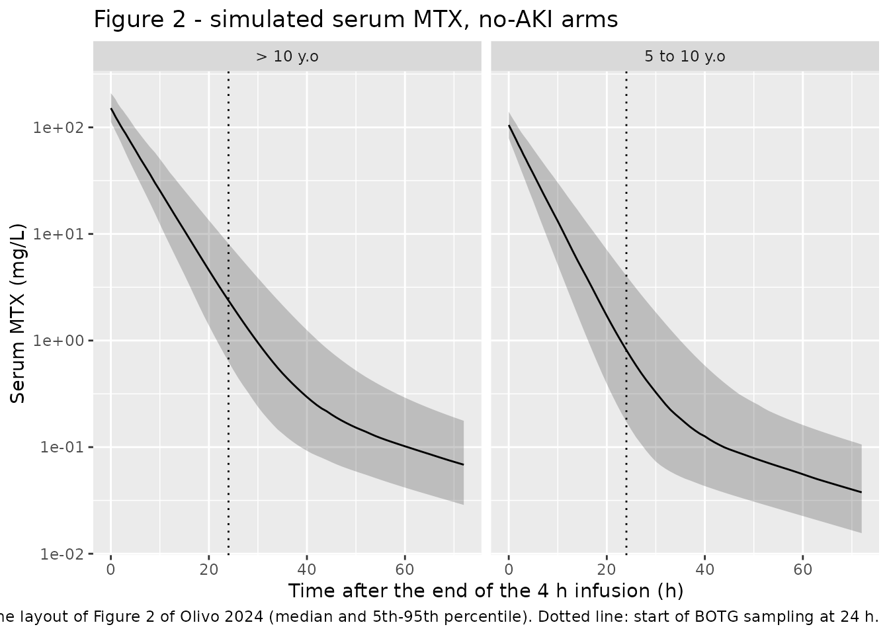
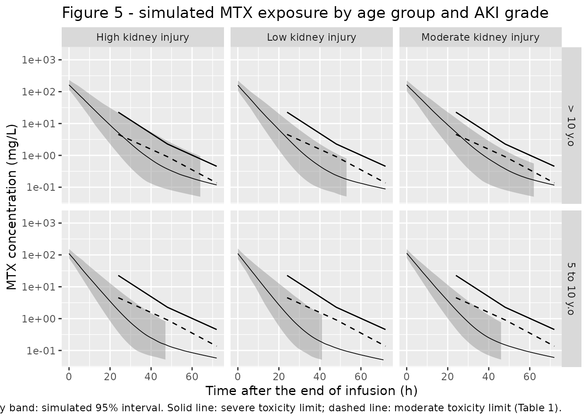

# Methotrexate (Olivo 2024)

## Model and source

- Citation: Olivo LB, de Oliveira Henz P, Wermann S, Dias BB, Porto GO,
  Pinhatti AV, Martins MD, Gregianin LJ, Costa TD, de Araujo BV (2024).
  Anticipating Leucovorin Rescue Therapy in Patients with Osteosarcoma
  through Methotrexate Population Pharmacokinetic Model. Pharmaceutics
  16(9):1180. <doi:10.3390/pharmaceutics16091180>.
- Description: Two-compartment population PK model for high-dose
  intravenous methotrexate (12 g/m^2 over a 4 h infusion) in Brazilian
  paediatric patients with osteosarcoma treated on the Brazilian
  Osteosarcoma Treatment Group (BOTG) protocol (Olivo 2024; n = 32
  patients, 216 cycles, 563 therapeutic-drug-monitoring concentrations).
  Linear first-order elimination from the central compartment. Serum
  creatinine scales clearance as a power function normalized to the
  cohort median 0.58 mg/dL (exponent -0.192), and body surface area
  scales the central volume as a power function normalized to the cohort
  median 1.45 m^2 (exponent 0.301). Correlated exponential
  between-subject variability on CL and Vc (correlation 94%),
  exponential between-occasion variability on CL shared across MTX
  cycles, and a proportional residual error. Built to anticipate
  leucovorin (folinic acid) rescue dose adjustments before the first
  monitored MTX concentration.
- Article: <https://doi.org/10.3390/pharmaceutics16091180>

Olivo 2024 is the first population PK model for methotrexate (MTX) in
Brazilian and Latin-American paediatric patients with osteosarcoma. Its
clinical purpose is to predict whether a patient will reach toxic MTX
concentrations *before* the first monitored sample is drawn, so that the
leucovorin (folinic acid, LCV) rescue dose can be adjusted at the 24 h
time point rather than reactively.

## Population

Thirty-two Brazilian children and adolescents with osteosarcoma, treated
at the Hospital de Clinicas de Porto Alegre between January 2015 and
March 2023 on the Brazilian Osteosarcoma Treatment Group (BOTG)
protocol, contributed 216 high-dose-MTX cycles and 563 serum
concentrations (Table 2). Median age was 13.25 years (range 5-18); 24 of
the 32 patients were adolescents older than 12 years. Median weight was
47 kg (13.80-85.50), median height 159 cm (115-177), and median body
surface area 1.45 m^2 (0.67-2.03, Haycock equation). Sex was well
balanced (18 male / 14 female) and the cohort was 78.1% White, 18.8%
Black and 3.1% other. Median serum creatinine was 0.58 mg/dL (0.17-3.2)
and median Schwartz creatinine clearance 190.28 mL/min/1.73 m^2
(37.41-372.05).

Each patient received 12 cycles of high-dose MTX as a 4 h intravenous
infusion, at a median realised dose of 11.9 g/m^2 (range 5.9-12.9)
against a protocol dose of 12 g/m^2, together with hydration (3000
mL/m^2/day) and sodium-bicarbonate urine alkalinisation. Sampling
started 24 h after the end of the infusion, so the concentration peak
was never captured; observations beyond 96 h were removed because
patients still under monitoring at that point are selected for dialysis.

The same information is available programmatically via
`readModelDb("Olivo_2024_methotrexate")()$population`.

## Source trace

Every `ini()` entry in
`inst/modeldb/specificDrugs/Olivo_2024_methotrexate.R` carries an
in-file comment pointing at its origin. They are collected here for
review.

| Equation / parameter | Value | Source location |
|----|----|----|
| Structural model: 2-compartment, linear first-order elimination from the central compartment | n/a | Results 3.3 (“A two-compartment model with first-order elimination from the central compartment parametrized in terms of clearance (CL), central compartment volume (Vc), peripherical compartment volume (Vp), and inter-compartmental clearance (Q) best described the data”) |
| `lcl` = log(14.8) | 14.8 L/h | Table 3 `TVCL` (RSE 19%; bootstrap 14.4, 95% CI 10.7-19.3); Eq. 8 |
| `lvc` = log(82.5) | 82.5 L | Table 3 `TVVC` (RSE 23%; bootstrap 79.9, 95% CI 54.5-115.9); Eq. 9 |
| `lq` = log(0.178) | 0.178 L/h | Table 3 `TVQ` (RSE 31%; bootstrap 0.171, 95% CI 0.106-0.285); Eq. 10 |
| `lvp` = log(5.72) | 5.72 L | Table 3 `TVVP` (RSE 35%; bootstrap 5.42, 95% CI 3.1-10.5); Eq. 11 |
| `e_creat_cl` | -0.192 | Table 3 `theta SCr` (RSE 31%; bootstrap -0.201, 95% CI -0.32 to -0.08); Eq. 8 `CL = 14.8 x (SCr/0.58)^-0.192` |
| `e_bsa_vc` | 0.301 | Table 3 `theta BSA` (RSE 36%; bootstrap 0.298, 95% CI 0.025-0.481); Eq. 9 `Vc = 82.5 x (BSA/1.45)^0.301` |
| SCr reference 0.58 mg/dL | 0.58 | Table 2 cohort median SCr; Methods 2.3 (“normalized by their respective medians”) |
| BSA reference 1.45 m^2 | 1.45 | Table 2 cohort median BSA (Haycock); Methods 2.3 |
| `etalcl` variance | 0.0391 | Eq. 8 exponential term `e^(0.0391 + 0.0228)`; Table 3 omega BSV CL = 19.8% (RSE 16%) |
| `etalvc` variance | 0.0181 | Eq. 9 exponential term `e^(0.0181)`; Table 3 omega BSV Vc = 13.5% (RSE 29%) |
| `etalcl`-`etalvc` covariance | 0.0250 | Table 3 “Correlation CL-Vc 94%”; Results 3.3; `0.94 * sqrt(0.0391 * 0.0181)` |
| `etaiov_cl_*` variance | 0.0228 | Eq. 8 exponential term `e^(... + 0.0228)`; Table 3 omega BOV CL = 15.1% (RSE 6%; bootstrap 14.8, 95% CI 12.8-16.9) |
| 12 occasion slots | n/a | Methods 2.1 (“Each patient received 12 cycles of HDMTX”); Results 3.3 (“Between-occasion variability was estimated as a single value for all different MTX occasions”) |
| `propSd` | 0.309 | Table 3 “Residual Variability Proporcional Error” = 30.9% (RSE 4%; bootstrap 30.3, 95% CI 27.5-33.1); Results 3.3 |
| Dose 12 g/m^2 over 4 h IV | n/a | Methods 2.1 |
| AKI grades = 1.5x / 2.5x / 3x reference SCr | n/a | Methods 2.4, Eqs. 5-7 |
| Toxicity thresholds (C24h / C48h / C72h) | n/a | Table 1 (BOTG protocol) |

### Reading the omega scale from the paper’s own equations

Table 3 reports the random-effect magnitudes as percentages (BSV CL
19.8%, BSV Vc 13.5%, BOV CL 15.1%) without saying whether they are
log-scale standard deviations or CV%. Equations 8 and 9 settle it,
because they print the corresponding variances explicitly:

- Eq. 8: `e^(0.0391 + 0.0228)` and `0.198^2 = 0.0392`,
  `0.151^2 = 0.0228`.
- Eq. 9: `e^(0.0181)` and `0.135^2 = 0.0182`.

Reading the percentages as CV% instead would give
`log(1 + 0.198^2) = 0.0385`, which does not match the printed 0.0391.
The variances used in the model file are therefore taken verbatim from
Eqs. 8-9.

``` r

mod <- readModelDb("Olivo_2024_methotrexate")
om <- rxode2::rxode(mod)$omega
#> ℹ parameter labels from comments will be replaced by 'label()'
#> Warning: some etas defaulted to non-mu referenced, possible parsing error: etaiov_cl_1, etaiov_cl_2, etaiov_cl_3, etaiov_cl_4, etaiov_cl_5, etaiov_cl_6, etaiov_cl_7, etaiov_cl_8, etaiov_cl_9, etaiov_cl_10, etaiov_cl_11, etaiov_cl_12
#> as a work-around try putting the mu-referenced expression on a simple line
knitr::kable(
  round(om[c("etalcl", "etalvc"), c("etalcl", "etalvc")], 5),
  caption = "Between-subject omega block (Eqs. 8-9 variances, 94% CL-Vc correlation)."
)
```

|        | etalcl | etalvc |
|:-------|-------:|-------:|
| etalcl | 0.0391 | 0.0250 |
| etalvc | 0.0250 | 0.0181 |

Between-subject omega block (Eqs. 8-9 variances, 94% CL-Vc correlation).
{.table}

``` r

c(
  `correlation CL-Vc` = om["etalcl", "etalvc"] / sqrt(om["etalcl", "etalcl"] * om["etalvc", "etalvc"]),
  determinant = det(om[c("etalcl", "etalvc"), c("etalcl", "etalvc")])
)
#> correlation CL-Vc       determinant 
#>        0.93975002        0.00008271
```

## Virtual cohort

Original observed data are not publicly available. The cohort below
reproduces the six simulation scenarios of Figure 5 (two age strata x
three acute kidney injury grades) plus a no-AKI reference arm in each
stratum, giving eight arms of 100 virtual patients each.

Serum creatinine for each AKI grade follows Methods 2.4 / Eqs. 5-7
(`AKI_LOW = 1.5 x reference SCr`, `AKI_MODERATE = 2.5 x`,
`AKI_HIGH = 3 x`). The paper takes its age-specific reference SCr from
an external paediatric renal-impairment guidance (its reference \[24\])
that is not reproduced in the article, so the cohort median SCr of 0.58
mg/dL (Table 2) is used here as the normal anchor for both age strata;
see “Assumptions and deviations”.

``` r

set.seed(20240906)

MW_MTX <- 454.44 # g/mol; the paper's own uM -> mg/L conversions in Table 1 imply ~454
uM_to_mgL <- function(uM) uM * MW_MTX / 1000

SCR_REF <- 0.58 # mg/dL, Table 2 cohort median
DOSE_PER_M2 <- 12000 # mg/m^2, Methods 2.1 (12 g/m^2)
INFUSION_H <- 4 # h, Methods 2.1
N_PER_ARM <- 200L # the per-arm cap; severe-threshold crossings are rare events

age_strata <- tibble::tribble(
  ~age_group, ~bsa_med, ~bsa_min, ~bsa_max, ~bsa_sd,
  "5 to 10 y.o", 0.95, 0.67, 1.25, 0.14,
  "> 10 y.o", 1.45, 1.20, 2.03, 0.17
)

renal_grades <- tibble::tribble(
  ~renal, ~scr_mult,
  "No AKI", 1.0,
  "Low kidney injury", 1.5,
  "Moderate kidney injury", 2.5,
  "High kidney injury", 3.0
)

# Observation grid in absolute time; the infusion starts at t = 0 and ends at
# t = 4 h, so "time after the end of infusion" (the paper's x axis) is t - 4.
obs_times <- sort(unique(c(seq(0, 8, by = 0.5), seq(9, 76, by = 1))))

make_arm <- function(n, bsa_med, bsa_min, bsa_max, bsa_sd, creat,
                     age_group, renal, id_offset) {
  subj <- tibble::tibble(
    id = id_offset + seq_len(n),
    BSA = pmin(pmax(bsa_med * exp(stats::rnorm(n, 0, bsa_sd)), bsa_min), bsa_max),
    CREAT = creat,
    OCC = 1L,
    age_group = age_group,
    renal = renal
  ) |>
    dplyr::mutate(arm = paste(age_group, renal, sep = " | "), dose_mg = DOSE_PER_M2 * BSA)

  doses <- subj |>
    dplyr::mutate(
      time = 0, amt = dose_mg, evid = 1L,
      rate = dose_mg / INFUSION_H, cmt = "central"
    )
  obs <- subj |>
    tidyr::crossing(time = obs_times) |>
    dplyr::mutate(amt = NA_real_, evid = 0L, rate = NA_real_, cmt = "central")

  dplyr::bind_rows(doses, obs) |>
    dplyr::arrange(id, time, dplyr::desc(evid))
}

grid <- tidyr::crossing(age_strata, renal_grades) |>
  dplyr::mutate(
    creat = SCR_REF * scr_mult,
    id_offset = (dplyr::row_number() - 1L) * N_PER_ARM
  )

events <- dplyr::bind_rows(lapply(seq_len(nrow(grid)), function(i) {
  make_arm(
    n = N_PER_ARM,
    bsa_med = grid$bsa_med[i], bsa_min = grid$bsa_min[i],
    bsa_max = grid$bsa_max[i], bsa_sd = grid$bsa_sd[i],
    creat = grid$creat[i], age_group = grid$age_group[i],
    renal = grid$renal[i], id_offset = grid$id_offset[i]
  )
}))

stopifnot(!anyDuplicated(unique(events[, c("id", "time", "evid")])))
nrow(events)
#> [1] 137600
dplyr::n_distinct(events$id)
#> [1] 1600
```

## Simulation

`rxSolve()` returns two concentration columns for a model that carries
an error model, and the distinction matters for the toxicity tables
below:

- `Cc` is the individual prediction (identical to `ipredSim`) - the
  structural exposure for that subject’s sampled random effects, with
  **no** residual error. This is the right quantity for the profile
  figures and for the NCA, where assay noise would only degrade the
  lambda-z estimate.
- `sim` is that value plus the 30.9% proportional residual error - what
  an assayed sample would actually read. It is renamed `Cc_assay` here
  to keep it distinct, and it is the right quantity for threshold
  crossing, because a BOTG rescue decision is made on a measured
  concentration.

``` r

sim <- rxode2::rxSolve(
  mod,
  events = events,
  keep = c("age_group", "renal", "arm", "BSA", "CREAT"),
  addDosing = FALSE
) |>
  as.data.frame() |>
  dplyr::rename(Cc_assay = sim) |>
  dplyr::mutate(tae = time - INFUSION_H) # time after the end of infusion
#> ℹ parameter labels from comments will be replaced by 'label()'
#> Warning: some etas defaulted to non-mu referenced, possible parsing error: etaiov_cl_1, etaiov_cl_2, etaiov_cl_3, etaiov_cl_4, etaiov_cl_5, etaiov_cl_6, etaiov_cl_7, etaiov_cl_8, etaiov_cl_9, etaiov_cl_10, etaiov_cl_11, etaiov_cl_12
#> as a work-around try putting the mu-referenced expression on a simple line
#> Warning: some etas defaulted to non-mu referenced, possible parsing error: etaiov_cl_1, etaiov_cl_2, etaiov_cl_3, etaiov_cl_4, etaiov_cl_5, etaiov_cl_6, etaiov_cl_7, etaiov_cl_8, etaiov_cl_9, etaiov_cl_10, etaiov_cl_11, etaiov_cl_12
#> as a work-around try putting the mu-referenced expression on a simple line

# rxSolve silently drops subjects on some failures; assert the count.
stopifnot(dplyr::n_distinct(sim$id) == nrow(grid) * N_PER_ARM)

# Confirm the two columns are what the text claims they are.
stopifnot(isTRUE(all.equal(sim$Cc, sim$ipredSim)))
stopifnot(!isTRUE(all.equal(sim$Cc, sim$Cc_assay)))
```

## Replicate published figures

### Figure 2 - serum MTX versus time after the end of infusion

Figure 2 of Olivo 2024 plots the observed serum MTX concentrations
against time after the end of the 4 h infusion, with a Loess trend. The
observed data are not public, so the simulated no-AKI arms are shown
over the same window. The paper’s sampling only begins 24 h after the
end of infusion, which is marked below.

``` r

sim |>
  dplyr::filter(renal == "No AKI", tae >= 0) |>
  dplyr::group_by(age_group, tae) |>
  dplyr::summarise(
    Q05 = quantile(Cc, 0.05, na.rm = TRUE),
    Q50 = quantile(Cc, 0.50, na.rm = TRUE),
    Q95 = quantile(Cc, 0.95, na.rm = TRUE),
    .groups = "drop"
  ) |>
  ggplot(aes(tae, Q50)) +
  geom_ribbon(aes(ymin = Q05, ymax = Q95), alpha = 0.25) +
  geom_line() +
  geom_vline(xintercept = 24, linetype = "dotted") +
  facet_wrap(~age_group) +
  scale_y_log10() +
  labs(
    x = "Time after the end of the 4 h infusion (h)",
    y = "Serum MTX (mg/L)",
    title = "Figure 2 - simulated serum MTX, no-AKI arms",
    caption = paste(
      "Replicates the layout of Figure 2 of Olivo 2024 (median and 5th-95th",
      "percentile). Dotted line: start of BOTG sampling at 24 h."
    )
  )
```



### Figure 5 - AKI scenarios against the BOTG toxicity limits

Figure 5 overlays the simulated MTX exposure for three AKI grades in two
age groups onto the severe (solid) and moderate (dashed) toxicity limits
of Table 1. The limits are defined only at 24, 48 and 72 h after the end
of infusion.

``` r

tox_limits <- tibble::tribble(
  ~tae, ~severe_uM, ~moderate_uM,
  24, 50, 10,
  48, 5, 2,
  72, 1, 0.3
) |>
  dplyr::mutate(
    severe = uM_to_mgL(severe_uM),
    moderate = uM_to_mgL(moderate_uM)
  )

fig5 <- sim |>
  dplyr::filter(renal != "No AKI", tae >= 0) |>
  dplyr::mutate(
    age_group = factor(age_group, levels = c("> 10 y.o", "5 to 10 y.o")),
    renal = factor(renal, levels = c(
      "High kidney injury", "Low kidney injury", "Moderate kidney injury"
    ))
  ) |>
  dplyr::group_by(age_group, renal, tae) |>
  dplyr::summarise(
    lo = quantile(Cc, 0.025, na.rm = TRUE),
    md = quantile(Cc, 0.500, na.rm = TRUE),
    hi = quantile(Cc, 0.975, na.rm = TRUE),
    .groups = "drop"
  )

ggplot(fig5, aes(tae, md)) +
  geom_ribbon(aes(ymin = lo, ymax = hi), fill = "grey60", alpha = 0.5) +
  geom_line(linewidth = 0.3) +
  geom_line(
    data = tox_limits, aes(tae, severe),
    inherit.aes = FALSE, linewidth = 0.5
  ) +
  geom_line(
    data = tox_limits, aes(tae, moderate),
    inherit.aes = FALSE, linetype = "dashed", linewidth = 0.5
  ) +
  facet_grid(age_group ~ renal) +
  scale_y_log10(limits = c(0.05, 1500)) +
  labs(
    x = "Time after the end of infusion (h)",
    y = "MTX concentration (mg/L)",
    title = "Figure 5 - simulated MTX exposure by age group and AKI grade",
    caption = paste(
      "Replicates Figure 5 of Olivo 2024. Grey band: simulated 95% interval.",
      "Solid line: severe toxicity limit; dashed line: moderate toxicity limit",
      "(Table 1)."
    )
  )
#> Warning: Removed 119 rows containing missing values or values outside the scale range
#> (`geom_ribbon()`).
#> Warning: Removed 1 row containing missing values or values outside the scale range
#> (`geom_line()`).
```



### BOTG threshold attainment

Table 1 of the BOTG protocol defines the MTX levels that trigger an
escalated leucovorin rescue. The table below reports the proportion of
simulated patients who exceed the moderate and severe thresholds at each
monitoring time point.

``` r

monitor <- sim |>
  dplyr::filter(tae %in% c(24, 48, 72)) |>
  dplyr::left_join(
    tox_limits |> dplyr::select(tae, severe, moderate),
    by = "tae"
  ) |>
  dplyr::group_by(age_group, renal, tae) |>
  dplyr::summarise(
    `Median (mg/L)` = round(median(Cc_assay), 3),
    `>= moderate (%)` = round(100 * mean(Cc_assay >= moderate), 1),
    `>= severe (%)` = round(100 * mean(Cc_assay >= severe), 1),
    .groups = "drop"
  ) |>
  dplyr::arrange(age_group, tae, renal)

monitor |>
  dplyr::rename(
    "Age group" = age_group,
    "Renal status" = renal,
    "Time after infusion (h)" = tae
  ) |>
  knitr::kable(
    caption = paste(
      "Simulated proportion of patients above the BOTG moderate and severe",
      "MTX toxicity thresholds (Table 1 of Olivo 2024)."
    )
  )
```

| Age group | Renal status | Time after infusion (h) | Median (mg/L) | \>= moderate (%) | \>= severe (%) |
|:---|:---|---:|---:|---:|---:|
| 5 to 10 y.o | High kidney injury | 24 | 1.941 | 19.5 | 0.0 |
| 5 to 10 y.o | Low kidney injury | 24 | 1.316 | 7.0 | 0.0 |
| 5 to 10 y.o | Moderate kidney injury | 24 | 1.850 | 10.5 | 0.0 |
| 5 to 10 y.o | No AKI | 24 | 0.803 | 2.5 | 0.0 |
| 5 to 10 y.o | High kidney injury | 48 | 0.135 | 2.5 | 0.0 |
| 5 to 10 y.o | Low kidney injury | 48 | 0.113 | 1.5 | 0.0 |
| 5 to 10 y.o | Moderate kidney injury | 48 | 0.139 | 2.5 | 0.0 |
| 5 to 10 y.o | No AKI | 48 | 0.086 | 0.5 | 0.0 |
| 5 to 10 y.o | High kidney injury | 72 | 0.057 | 11.5 | 0.0 |
| 5 to 10 y.o | Low kidney injury | 72 | 0.047 | 5.5 | 0.0 |
| 5 to 10 y.o | Moderate kidney injury | 72 | 0.061 | 11.0 | 0.0 |
| 5 to 10 y.o | No AKI | 72 | 0.037 | 2.0 | 0.0 |
| \> 10 y.o | High kidney injury | 24 | 5.510 | 60.5 | 2.5 |
| \> 10 y.o | Low kidney injury | 24 | 3.472 | 37.0 | 0.0 |
| \> 10 y.o | Moderate kidney injury | 24 | 4.919 | 53.0 | 0.0 |
| \> 10 y.o | No AKI | 24 | 2.085 | 16.5 | 0.0 |
| \> 10 y.o | High kidney injury | 48 | 0.352 | 18.0 | 3.5 |
| \> 10 y.o | Low kidney injury | 48 | 0.235 | 4.5 | 0.5 |
| \> 10 y.o | Moderate kidney injury | 48 | 0.366 | 18.0 | 1.0 |
| \> 10 y.o | No AKI | 48 | 0.173 | 2.5 | 0.0 |
| \> 10 y.o | High kidney injury | 72 | 0.112 | 41.0 | 4.0 |
| \> 10 y.o | Low kidney injury | 72 | 0.089 | 24.5 | 1.5 |
| \> 10 y.o | Moderate kidney injury | 72 | 0.111 | 37.5 | 0.5 |
| \> 10 y.o | No AKI | 72 | 0.066 | 13.5 | 0.0 |

Simulated proportion of patients above the BOTG moderate and severe MTX
toxicity thresholds (Table 1 of Olivo 2024). {.table
style="width:100%;"}

Two claims from the paper can be checked directly against this table.

``` r

severe_any_time <- sim |>
  dplyr::filter(tae %in% c(24, 48, 72)) |>
  dplyr::left_join(tox_limits |> dplyr::select(tae, severe, moderate), by = "tae") |>
  dplyr::group_by(age_group, renal, id) |>
  dplyr::summarise(
    any_severe = any(Cc_assay >= severe),
    any_moderate = any(Cc_assay >= moderate),
    .groups = "drop"
  ) |>
  dplyr::group_by(age_group, renal) |>
  dplyr::summarise(
    `Any severe (%)` = round(100 * mean(any_severe), 1),
    `Any moderate or worse (%)` = round(100 * mean(any_moderate), 1),
    .groups = "drop"
  )

severe_any_time |>
  dplyr::rename("Age group" = age_group, "Renal status" = renal) |>
  knitr::kable(
    caption = paste(
      "Patients crossing a toxicity threshold at any of the 24 / 48 / 72 h",
      "monitoring points."
    )
  )
```

| Age group   | Renal status           | Any severe (%) | Any moderate or worse (%) |
|:------------|:-----------------------|---------------:|--------------------------:|
| 5 to 10 y.o | High kidney injury     |            0.0 |                      22.5 |
| 5 to 10 y.o | Low kidney injury      |            0.0 |                       8.0 |
| 5 to 10 y.o | Moderate kidney injury |            0.0 |                      15.0 |
| 5 to 10 y.o | No AKI                 |            0.0 |                       3.5 |
| \> 10 y.o   | High kidney injury     |            5.5 |                      62.5 |
| \> 10 y.o   | Low kidney injury      |            1.5 |                      41.0 |
| \> 10 y.o   | Moderate kidney injury |            1.0 |                      60.5 |
| \> 10 y.o   | No AKI                 |            0.0 |                      22.0 |

Patients crossing a toxicity threshold at any of the 24 / 48 / 72 h
monitoring points. {.table}

``` r


# Values quoted in the narrative below, taken from the tables rather than
# transcribed, so the prose cannot drift away from the rendered numbers.
noaki24 <- monitor |> dplyr::filter(renal == "No AKI", tae == 24)
pctYoung <- noaki24$`>= moderate (%)`[noaki24$age_group == "5 to 10 y.o"]
pctOld <- noaki24$`>= moderate (%)`[noaki24$age_group == "> 10 y.o"]

aki <- severe_any_time |> dplyr::filter(renal != "No AKI")
wideBy <- function(col) {
  aki |>
    dplyr::select(age_group, renal, dplyr::all_of(col)) |>
    tidyr::pivot_wider(names_from = age_group, values_from = dplyr::all_of(col))
}
sevWide <- wideBy("Any severe (%)")
modWide <- wideBy("Any moderate or worse (%)")

# Moderate-or-worse has large counts and is the robust comparison; severe is a
# rare event, so it is reported as "not lower" plus a strict-win count.
olderModHigher <- all(modWide$`> 10 y.o` > modWide$`5 to 10 y.o`)
olderSevNotLower <- all(sevWide$`> 10 y.o` >= sevWide$`5 to 10 y.o`)
olderSevStrict <- sum(sevWide$`> 10 y.o` > sevWide$`5 to 10 y.o`)
nGrades <- nrow(sevWide)

data.frame(
  check = c(
    "no-AKI 24 h moderate, 5-10 y (%)",
    "no-AKI 24 h moderate, >10 y (%)",
    "older moderate-or-worse higher at every AKI grade",
    "older severe rate never lower than younger",
    "AKI grades where older is strictly higher on severe"
  ),
  value = c(
    format(pctYoung), format(pctOld),
    format(olderModHigher), format(olderSevNotLower),
    paste0(olderSevStrict, " of ", nGrades)
  )
)
#>                                                 check  value
#> 1                    no-AKI 24 h moderate, 5-10 y (%)    2.5
#> 2                     no-AKI 24 h moderate, >10 y (%)   16.5
#> 3   older moderate-or-worse higher at every AKI grade   TRUE
#> 4          older severe rate never lower than younger   TRUE
#> 5 AKI grades where older is strictly higher on severe 3 of 3
```

- Discussion: “patients above 10 years with any degree of AKI present a
  higher probability of achieving severe toxic MTX concentration”. In
  the table above the `> 10 y.o` stratum carries the higher risk at
  every AKI grade, reproducing the direction of the published claim. The
  robust form of the comparison is the moderate-or-worse rate, which has
  large counts and is strictly higher in the older stratum at every AKI
  grade (TRUE). Severe crossings are rare events even at 200 subjects
  per arm, so that rate is reported more cautiously: the older stratum
  is never lower (TRUE) and is strictly higher in 3 of the 3 AKI grades.
  The mechanism in the model is Eq. 9: a larger BSA raises Vc, which
  slows the terminal decline relative to the smaller children.
- Results 3.1: “In the first 24 h after the end of the infusion, only 1%
  of the observations presented moderate to severe toxic MTX
  concentrations.” The no-AKI arms are the closest analogue to the
  observed cohort (its median SCr is the 0.58 mg/dL anchor), but they do
  **not** reproduce that 1%: the younger stratum exceeds the 24 h
  moderate threshold in 2.5% of subjects and the older stratum in 16.5%.
  The model over-predicts the toxic tail at 24 h rather than matching
  it, and the reason is structural rather than an encoding error, as the
  next chunk shows.

The 24 h monitoring point sits roughly six elimination half-lives after
the end of the infusion, so it amplifies any error in clearance:
differentiating the mono-exponential tail gives
`d log(C24) / d log(CL) = -kel * 24`, about -4.3 for the typical
patient. The combined between-subject and between-occasion spread on CL
is a log-scale SD of `sqrt(0.0391 + 0.0228) = 0.249`, which the
amplification turns into a geometric SD near 3 at the 24 h sample,
before the 30.9% proportional residual error is added.

``` r

kel_typ <- 14.8 / 82.5
amp <- kel_typ * 24
sd_cl <- sqrt(0.0391 + 0.0228)
c(
  `typical kel (1/h)` = round(kel_typ, 4),
  `typical t1/2 (h)` = round(log(2) / kel_typ, 2),
  `d log(C24)/d log(CL)` = round(-amp, 2),
  `log-SD of CL (BSV+BOV)` = round(sd_cl, 4),
  `induced log-SD at 24 h` = round(amp * sd_cl, 2),
  `induced geometric SD at 24 h` = round(exp(amp * sd_cl), 2)
)
#>            typical kel (1/h)             typical t1/2 (h) 
#>                       0.1794                       3.8600 
#>         d log(C24)/d log(CL)       log-SD of CL (BSV+BOV) 
#>                      -4.3100                       0.2488 
#>       induced log-SD at 24 h induced geometric SD at 24 h 
#>                       1.0700                       2.9200
```

A geometric SD of that size puts a substantial fraction of any simulated
arm above a threshold only about twice the median, which is what the
table shows. The published 1% is an observed *per-observation* rate in a
cohort that was sparsely sampled (median 3 samples per cycle, sampling
starting at 24 h) and that was already receiving protocol leucovorin
rescue, so it is not the same quantity as a per-subject exceedance rate
in an unrescued simulation. No parameter was adjusted to narrow the gap.

## PKNCA validation

``` r

sim_nca <- sim |>
  dplyr::filter(!is.na(Cc)) |>
  dplyr::select(id, time, Cc, arm)

# Guarantee a time = 0 row per subject. This is an IV infusion, so the
# pre-dose concentration is 0.
sim_nca <- dplyr::bind_rows(
  sim_nca,
  sim_nca |>
    dplyr::distinct(id, arm) |>
    dplyr::mutate(time = 0, Cc = 0)
) |>
  dplyr::distinct(id, arm, time, .keep_all = TRUE) |>
  dplyr::arrange(id, time)

conc_obj <- PKNCA::PKNCAconc(
  sim_nca, Cc ~ time | arm + id,
  concu = "mg/L", timeu = "h"
)

dose_df <- events |>
  dplyr::filter(evid == 1) |>
  dplyr::select(id, time, amt, arm)

dose_obj <- PKNCA::PKNCAdose(dose_df, amt ~ time | arm + id, doseu = "mg")

intervals <- data.frame(
  start = 0,
  end = Inf,
  cmax = TRUE,
  tmax = TRUE,
  aucinf.obs = TRUE,
  half.life = TRUE,
  cl.obs = TRUE
)

nca_res <- PKNCA::pk.nca(PKNCA::PKNCAdata(conc_obj, dose_obj, intervals = intervals))
```

### Comparison against the published parameter equations

Olivo 2024 does not report a non-compartmental analysis of its own
cohort, so there is no published Cmax / AUC table to compare against.
Two quantities can nonetheless be checked directly against the paper’s
printed equations: the NCA-derived clearance must reproduce Eq. 8 for
each arm’s serum creatinine, and the NCA-derived AUC must reproduce
`dose / CL` at the arm’s median BSA. This is a strict test of the
covariate model, because the SCr exponent enters only through Eq. 8.

``` r

reference <- grid |>
  dplyr::mutate(
    arm = paste(age_group, renal, sep = " | "),
    cl.obs = 14.8 * (creat / SCR_REF)^-0.192,
    aucinf.obs = (DOSE_PER_M2 * bsa_med) / cl.obs
  ) |>
  dplyr::select(arm, cl.obs, aucinf.obs)

cmp <- nlmixr2lib::ncaComparisonTable(
  simulated = nca_res,
  reference = reference,
  by = "arm",
  units = c(cl.obs = "L/h", aucinf.obs = "mg*h/L"),
  tolerance_pct = 20
)

knitr::kable(
  cmp,
  caption = paste(
    "Simulated NCA versus the values implied by Olivo 2024 Eqs. 8-11",
    "(CL = 14.8 x (SCr/0.58)^-0.192; AUC = dose / CL at the arm's median BSA).",
    "* differs from reference by more than 20%."
  )
)
```

| NCA parameter | arm | Reference | Simulated | % diff |
|:---|:---|:---|:---|:---|
| AUC0-∞ (obs) (mg\*h/L) | \> 10 y.o \| High kidney injury | 1450 | 1500 | +3.1% |
| AUC0-∞ (obs) (mg\*h/L) | \> 10 y.o \| Low kidney injury | 1270 | 1340 | +5.8% |
| AUC0-∞ (obs) (mg\*h/L) | \> 10 y.o \| Moderate kidney injury | 1400 | 1490 | +6.4% |
| AUC0-∞ (obs) (mg\*h/L) | \> 10 y.o \| No AKI | 1180 | 1180 | +0.8% |
| AUC0-∞ (obs) (mg\*h/L) | 5 to 10 y.o \| High kidney injury | 951 | 888 | -6.6% |
| AUC0-∞ (obs) (mg\*h/L) | 5 to 10 y.o \| Low kidney injury | 833 | 842 | +1.1% |
| AUC0-∞ (obs) (mg\*h/L) | 5 to 10 y.o \| Moderate kidney injury | 918 | 908 | -1.1% |
| AUC0-∞ (obs) (mg\*h/L) | 5 to 10 y.o \| No AKI | 770 | 743 | -3.6% |
| CL/F (L/h) | \> 10 y.o \| High kidney injury | 12 | 11.4 | -4.6% |
| CL/F (L/h) | \> 10 y.o \| Low kidney injury | 13.7 | 13.4 | -2.4% |
| CL/F (L/h) | \> 10 y.o \| Moderate kidney injury | 12.4 | 11.7 | -5.6% |
| CL/F (L/h) | \> 10 y.o \| No AKI | 14.8 | 14.7 | -1.0% |
| CL/F (L/h) | 5 to 10 y.o \| High kidney injury | 12 | 12.7 | +5.9% |
| CL/F (L/h) | 5 to 10 y.o \| Low kidney injury | 13.7 | 13.5 | -1.4% |
| CL/F (L/h) | 5 to 10 y.o \| Moderate kidney injury | 12.4 | 12.5 | +0.8% |
| CL/F (L/h) | 5 to 10 y.o \| No AKI | 14.8 | 15 | +1.7% |

Simulated NCA versus the values implied by Olivo 2024 Eqs. 8-11 (CL =
14.8 x (SCr/0.58)^-0.192; AUC = dose / CL at the arm’s median BSA). \*
differs from reference by more than 20%. {.table}

``` r

attr(cmp, "footnote")
#> NULL
```

### Simulated exposure against the published target windows

The paper cites two literature exposure windows for high-dose MTX in
osteosarcoma: a Cmax of 700-1000 uM after a 4-6 h infusion for efficacy
(Introduction, references 9 and 10) and a safe AUC of 4000-12,000 uM.h
(references 10 and 12). These are targets quoted from other cohorts, not
NCA values measured in this study, so the table below is a context check
rather than a reproduction target.

``` r

nca_tbl <- as.data.frame(nca_res$result) |>
  dplyr::filter(PPTESTCD %in% c("cmax", "tmax", "half.life", "aucinf.obs")) |>
  dplyr::group_by(arm, PPTESTCD) |>
  dplyr::summarise(median = median(PPORRES, na.rm = TRUE), .groups = "drop") |>
  tidyr::pivot_wider(names_from = PPTESTCD, values_from = median)

nca_tbl |>
  dplyr::mutate(
    `Cmax (uM)` = round(cmax / MW_MTX * 1000, 0),
    `AUCinf (uM*h)` = round(aucinf.obs / MW_MTX * 1000, 0),
    `Cmax (mg/L)` = round(cmax, 1),
    `Tmax (h)` = round(tmax, 2),
    `t1/2 (h)` = round(half.life, 1)
  ) |>
  dplyr::select(
    arm, `Cmax (mg/L)`, `Cmax (uM)`, `Tmax (h)`, `t1/2 (h)`, `AUCinf (uM*h)`
  ) |>
  dplyr::rename("Arm" = arm) |>
  knitr::kable(
    caption = paste(
      "Median simulated NCA per arm. Literature targets quoted by Olivo 2024:",
      "Cmax 700-1000 uM; safe AUC 4000-12,000 uM*h."
    )
  )
```

| Arm | Cmax (mg/L) | Cmax (uM) | Tmax (h) | t1/2 (h) | AUCinf (uM\*h) |
|:---|---:|---:|---:|---:|---:|
| 5 to 10 y.o \| High kidney injury | 110.5 | 243 | 4 | 21.5 | 1955 |
| 5 to 10 y.o \| Low kidney injury | 110.5 | 243 | 4 | 21.8 | 1852 |
| 5 to 10 y.o \| Moderate kidney injury | 112.9 | 248 | 4 | 21.5 | 1998 |
| 5 to 10 y.o \| No AKI | 105.2 | 232 | 4 | 22.0 | 1635 |
| \> 10 y.o \| High kidney injury | 163.0 | 359 | 4 | 19.6 | 3293 |
| \> 10 y.o \| Low kidney injury | 159.9 | 352 | 4 | 20.7 | 2958 |
| \> 10 y.o \| Moderate kidney injury | 163.6 | 360 | 4 | 19.5 | 3282 |
| \> 10 y.o \| No AKI | 151.4 | 333 | 4 | 21.5 | 2607 |

Median simulated NCA per arm. Literature targets quoted by Olivo 2024:
Cmax 700-1000 uM; safe AUC 4000-12,000 uM\*h. {.table}

Simulated Cmax (roughly 230-360 uM across the eight arms) and AUC
(roughly 1600-3300 uM.h) both sit below those literature windows. This
is a property of the published parameter estimates, not of the encoding,
and the paper discusses it directly: because BOTG sampling starts 24 h
after the end of infusion, “it \[is\] impossible to capture the MTX
serum peak, leading to an estimation of higher Vc” (Vc 82.5 L here
versus 11-19 L in the osteosarcoma models the paper compares against),
and the estimated CL of 14.8 L/h is likewise two to four times the
3.68-5.81 L/h reported elsewhere in osteosarcoma. A larger Vc depresses
Cmax and a larger CL depresses AUC. No parameter was adjusted to close
the gap.

``` r

# Analytic terminal half-life from the typical-value micro-constants, as an
# independent check on the NCA lambda-z estimate.
cl <- 14.8; vc <- 82.5; q <- 0.178; vp <- 5.72
kel <- cl / vc; k12 <- q / vc; k21 <- q / vp
s <- kel + k12 + k21
beta <- 0.5 * (s - sqrt(s^2 - 4 * kel * k21))
c(`analytic terminal t1/2 (h)` = round(log(2) / beta, 2),
  `median NCA t1/2, no-AKI > 10 y.o (h)` = round(
    nca_tbl$half.life[nca_tbl$arm == "> 10 y.o | No AKI"], 2
  ))
#>           analytic terminal t1/2 (h) median NCA t1/2, no-AKI > 10 y.o (h) 
#>                                22.60                                21.45
```

## Assumptions and deviations

- **Age-stratified body surface area.** Figure 5 splits the simulation
  into `5 to 10 y.o` and `> 10 y.o` strata, but the paper reports BSA
  only for the pooled cohort (Table 2: median 1.45 m^2, range
  0.67-2.03). The two strata here partition that published range - the
  older stratum is anchored at the cohort median of 1.45 m^2
  (appropriate because 24 of 32 patients were older than 12 years), the
  younger stratum at 0.95 m^2 in the lower part of the range - using a
  log-normal draw clamped to the stratum bounds. No age-to-BSA
  relationship from outside the paper was used.
- **Reference serum creatinine for the AKI scenarios.** Methods 2.4
  takes the normal paediatric SCr from an external renal-impairment
  guidance (reference \[24\]) that is not reproduced in the article, and
  Eqs. 5-7 then scale it by 1.5, 2.5 and 3. The cohort median SCr of
  0.58 mg/dL (Table 2) is used here as the normal anchor for both age
  strata. The absolute AKI concentrations therefore depend on that
  anchor; the relative ordering across AKI grades, which is what Figure
  5 conveys, does not.
- **Occasion count.** Between-occasion variability was estimated as a
  single shared value across MTX cycles (Results 3.3), so the number of
  occasion slots affects only how many cycles can be simulated. Twelve
  slots are provided, matching the twelve HDMTX cycles per patient in
  Methods 2.1. The Discussion separately mentions n = 21 cycles in the
  final dataset; extending past twelve requires adding further
  `etaiov_cl_<n>` entries with the same fixed variance. All simulations
  here use `OCC = 1` (a single cycle).
- **Conclusions section places the BSA effect on Vp.** The Conclusions
  state that SCr and BSA explain the variability in “MTX CL and Vp,
  respectively”, but Table 3 lists `theta BSA` under Central Volume, Eq.
  9 applies it to Vc, and both the Abstract and Results 3.3 say Vc. The
  model encodes the effect on Vc; the Conclusions wording is treated as
  a typographical slip.
- **Discussion quotes CL as 15.1 L/h.** The Discussion opens its
  parameter comparison with “The CL estimated in the present study (15.1
  L/h)”, but 15.1 is the value of the BOV percentage in Table 3, and
  both the Abstract and Table 3 give CL as 14.8 L/h. The model uses 14.8
  L/h.
- **Molecular weight for the uM / mg/L conversions.** Table 1 states
  both units for each threshold (for example 10 uM = 4.5 mg/L, 50 uM =
  22.7 mg/L), implying a molecular weight of about 454 g/mol. The
  vignette uses 454.44 g/mol; the paper’s own rounded mg/L values are
  used for the plotted limits wherever Table 1 states them.
- **Supplementary material.** Figure S1 (literature-search flow
  diagram), Figure S2 (Spanish versus Brazilian mean concentration-time
  profiles) and Table S1 (covariate model development) are hosted by
  MDPI behind an edge filter that returned HTTP 403 at extraction time.
  None of them contain final parameter values: the complete final model
  is given by Table 3 and Eqs. 8-11 in the main text, both of which are
  on disk.
- **No published NCA to reproduce.** The paper reports no
  non-compartmental analysis of its own cohort, so the NCA comparison
  above is against the values implied by its own printed equations
  rather than against a published NCA table. The literature Cmax and AUC
  windows quoted in the Introduction are targets from other cohorts and
  are presented only as context.
- **Two concentration columns, used for different purposes.** BOTG
  rescue decisions are made on a measured concentration, so the
  toxicity-threshold tables use `Cc_assay` (rxode2’s `sim` column:
  individual prediction plus the 30.9% proportional residual error), as
  an assayed sample would read. The profile figures and the PKNCA block
  instead use `Cc` (the individual prediction, no residual error),
  because assay noise would only degrade the lambda-z and AUC estimates
  without making them more faithful to the paper’s printed equations.
  The Simulation section asserts that the two columns really are
  distinct, so this cannot silently regress to a single quantity.
