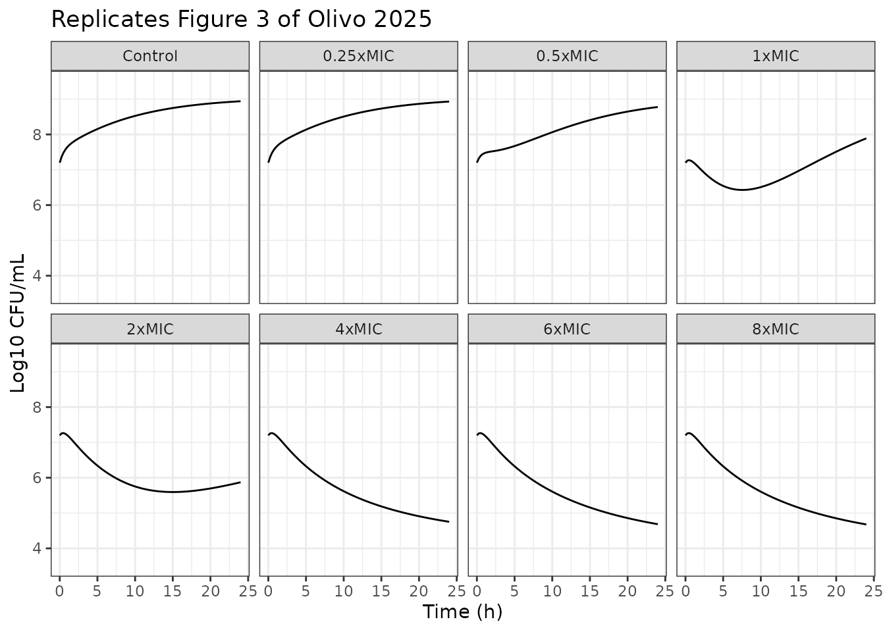
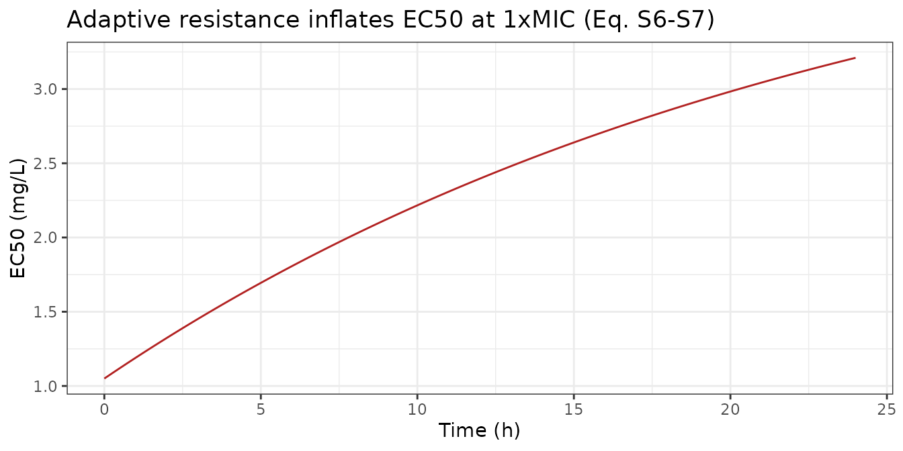
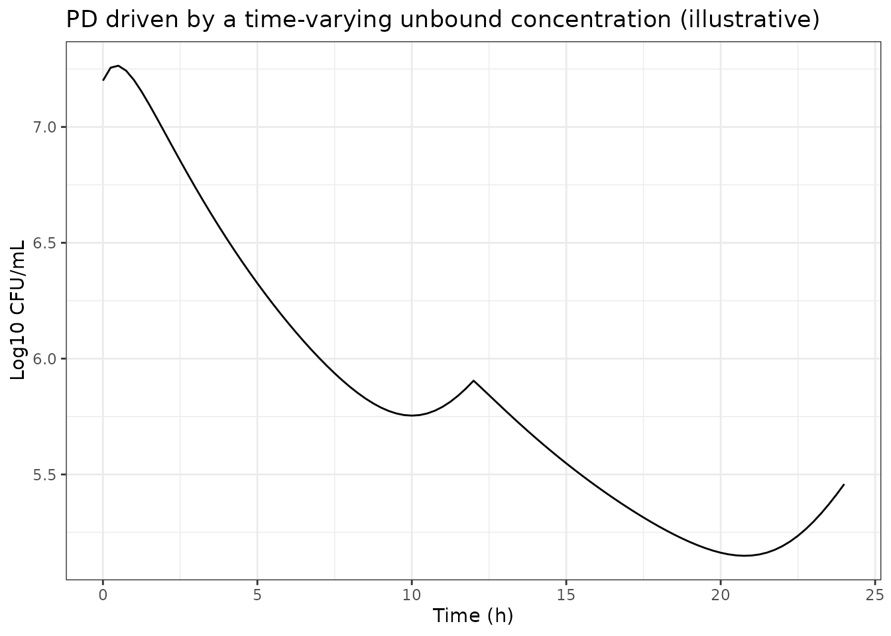

# Vancomycin against MRSA with adaptive resistance (Olivo 2025)

## Model and source

``` r

mod <- rxode2::rxode(readModelDb("Olivo_2025_vancomycin_invitro"))
```

- Citation: Ben Olivo L, Silva de Lemos JL, Rodrigues VJ, Kretschmer DB,
  Cruz WdA, Staudt KJ, Annaert P, Verlindo de Araujo B. PBPK/PD Model of
  Vancomycin in Sepsis: Linking Interstitial Exposure in
  Perfusion-Limited Tissues to MRSA Infection. Pharmaceutics. 2025 Aug
  26;17(9):1111. <doi:10.3390/pharmaceutics17091111>. PMCID:
  PMC12473409. PD model structure: Supplementary File Section S1,
  Equations S1-S7, plus the drug-effect Equation (3) in Materials and
  methods 2.2 and the EC50-MIC relationship Equation (4) in Results 3.3.
  Parameter estimates with RSE and sampling-importance-resampling 95%
  CIs: Table 4. Observed time-kill data and model fit: Figure 3. Visual
  predictive check: Supplementary Figure S4. The adaptive-resistance
  structure is adopted from Vera-Yunca D, Girard P, Parra-Guillen ZP,
  Munafo A, Ottinger S, Terranova N. Machine learning and quantitative
  systems pharmacology to predict the effect of vancomycin. (Source
  reference 24.) The EC50-MIC interrelationship is taken from Schmidt S,
  Barbour A, Sahre M, Rand KH, Derendorf H. PK/PD: new insights for
  antibacterial and antiviral applications. Curr Opin Pharmacol. 2008
  (source reference 25).
- Article: <https://doi.org/10.3390/pharmaceutics17091111>
- PubMed Central open-access copy:
  <https://pmc.ncbi.nlm.nih.gov/articles/PMC12473409/>

Olivo 2025 has two halves. The first is a whole-body physiologically
based pharmacokinetic (PBPK) model of vancomycin built in PK-Sim (Open
Systems Pharmacology Suite 11.0) for healthy volunteers and for a
100-subject virtual septic population. The second is a semi-mechanistic
pharmacodynamic (PD) model of vancomycin against methicillin-resistant
*Staphylococcus aureus* (MRSA), fitted in NONMEM to 24 h static
time-kill curves and carrying an adaptive resistance mechanism. The two
are then coupled, so that PBPK-predicted unbound interstitial
concentrations in kidney, liver, lung and subcutis drive bacterial kill.

**This model file contains the PD half only.** The PBPK half is not
reproduced, because it is not reproducible from the published record:
Table 1 tabulates vancomycin’s compound properties (molecular weight,
log P, pKa, solubility, fraction unbound, permeabilities, renal and
hepatic clearance) but the organ volumes, blood flows and tissue
partition coefficients are computed inside PK-Sim by the Schmitt method
and are never written out, and the whole-body ordinary differential
equations are never given. Per the library’s PBPK/QSP policy, a platform
model whose system equations and physiological parameters live only
inside the platform is documented rather than guessed at. Vancomycin
exposure therefore enters this model as the covariate `CONC_VAN_MGL`,
which can be held constant to reproduce the time-kill experiment or
driven with a concentration-time profile to exercise the coupled mode.

## Biological context

``` r

pop <- mod$population
tibble::tibble(Field = names(pop),
               Value = vapply(pop, function(x) paste(format(x), collapse = "; "),
                              character(1))) |>
  knitr::kable()
```

| Field | Value |
|:---|:---|
| species | in vitro (Staphylococcus aureus ATCC 43300, methicillin-resistant) |
| n_subjects | NA |
| n_studies | 1 |
| organism | Methicillin-resistant Staphylococcus aureus ATCC 43300; broth-microdilution MIC of vancomycin 2 mg/L, classified susceptible (Results 3.3) |
| system | Static time-kill curves in sterile flasks containing 20 mL Mueller-Hinton broth inoculated with 100 uL of bacterial suspension, pre-incubated 3 h 30 min to reach exponential (log) phase; viable counts at 0, 1, 2, 4, 6, 8, 10, 12 and 24 h, in triplicate per concentration |
| medium | Mueller-Hinton broth |
| temperature | 35 C |
| duration | 24 h |
| starting_inoculum | Approximately 10^7.2 CFU/mL; the paper does not tabulate the inoculum, so this value was read from the earliest observations across the eight arms of Figure 3 (see the bact0 note in ini()) |
| mic_values | 2 mg/L |
| concentration_range | 0 (growth control) and 0.25, 0.5, 1, 2, 4, 6, 8 x MIC |
| disease_state | not applicable (in vitro) |
| notes | Model development was done in NONMEM 7.4 with PsN 4.9.0; robustness was assessed by sampling importance resampling (n = 1000), whose medians and 95% CIs are the last column of Table 4. The paper additionally reports simulations for hypothetical MRSA strains with MICs of 4 and 8 mg/L, obtained by scaling EC50 through Equation (4); those are reproduced here by changing the `mic` parameter rather than by refitting. The whole-body PBPK half of the paper (PK-Sim, Open Systems Pharmacology Suite 11.0, healthy volunteers and a 100-subject virtual septic population) is deliberately not part of this model file; see the description field and the vignette Errata. |

## Source trace

Every structural equation and every `ini()` value, with where it comes
from.

| Element | Source location |
|----|----|
| Active/dormant bacterial ODEs | Supplementary File Eq. S1, S2 |
| Density-dependent transfer `kad` | Supplementary File Eq. S3 |
| Adaptive-resistance ODEs | Supplementary File Eq. S4, S5 |
| Adaptive-resistance effect on EC50 | Supplementary File Eq. S6, S7 |
| Sigmoidal Emax kill term | Materials and methods 2.2, Eq. (3) |
| EC50 proportional to MIC | Results 3.3, Eq. (4) |
| `lkgrow`, `lkdeath`, `nmax`, `lkda` | Table 4 |
| `lemax`, `lec50Ref`, `hill` | Table 4 |
| `lkon`, `slopeAr` | Table 4 |
| `addSd` | Table 4, “Proportional error” row (see Errata) |
| `micRef`, `mic` | Results 3.3 (MIC 2 mg/L; 4 and 8 mg/L simulated) |
| `bact0` | Figure 3, digitised (see Errata) |

``` r

mod$iniDf |>
  dplyr::filter(!is.na(ntheta)) |>
  dplyr::transmute(Parameter = name,
                   Estimate = est,
                   Fixed = fix,
                   Label = label) |>
  knitr::kable(digits = 4)
```

| Parameter | Estimate | Fixed | Label |
|:---|---:|:---|:---|
| lkgrow | 0.6729 | FALSE | Log growth rate constant of the active bacterial state (1/h) |
| lkdeath | 0.6152 | FALSE | Log natural death rate constant, both bacterial states (1/h) |
| nmax | 8.9400 | FALSE | Maximum bacterial density (log10 CFU/mL) |
| lkda | -3.8167 | FALSE | Log transfer rate constant from the dormant to the active state (1/h) |
| lemax | -2.7969 | FALSE | Log maximum vancomycin kill rate constant (1/h) |
| lec50Ref | 0.0488 | FALSE | Log EC50 in the absence of adaptive resistance, at the reference MIC (mg/L) |
| hill | 5.7400 | FALSE | Hill coefficient of the sigmoidal vancomycin effect (unitless) |
| lkon | -3.8632 | FALSE | Log adaptive-resistance activation rate constant (L/(mg\*h)) |
| slopeAr | 3.2400 | FALSE | Linear slope of adaptive resistance on EC50 (unitless) |
| micRef | 2.0000 | TRUE | MIC of vancomycin for the fitted strain, ATCC 43300 (mg/L) |
| mic | 2.0000 | TRUE | MIC of vancomycin for the strain being simulated (mg/L) |
| bact0 | 7.2000 | FALSE | Initial density of the active bacterial state (log10 CFU/mL) – figure-derived |
| addSd | 0.4000 | FALSE | Additive residual SD on the log10 bacterial count (log10 CFU/mL) |

### Dimensional analysis

The bacterial states are carried in `log10 CFU/mL` (see the next
section), so every term of Eq. S1 and S2 must reduce to
`log10 CFU/mL per h`.

| Symbol                                            | Units         |
|---------------------------------------------------|---------------|
| `gro`, `pers`, `nmax`, `bact0`                    | log10 CFU/mL  |
| `kgrow`, `kdeath`, `kda`, `kad`, `emax`, `effect` | 1/h           |
| `ec50`, `ec500`, `CONC_VAN_MGL`, `mic`, `micRef`  | mg/L          |
| `aroff`, `aron`, `areff`, `hill`, `slopeAr`       | dimensionless |
| `kon`                                             | L/(mg\*h)     |
| `addSd`                                           | log10 CFU/mL  |

`kad = (kgrow - kdeath) * (gro + pers) / nmax` is
`(1/h) * (log10 CFU/mL) / (log10 CFU/mL) = 1/h`, so `kad * gro` is
`log10 CFU/mL per h` as required. `kon * CONC_VAN_MGL` is
`L/(mg*h) * mg/L = 1/h`, which is why `kon` cannot be the bare `1/h`
that Table 4’s unit column prints for it.

## The scale of the bacterial states

This is the one interpretive decision in the extraction, so it is gated
rather than asserted.

Equations S1-S3 are written as though `A` and `D` were counts in CFU/mL,
which is the usual convention for this model family. Under that reading
the published parameters are not a poor fit but structurally impossible:
the largest kill rate the model can generate is `emax = 0.061 /h`, which
is **smaller** than the net growth rate
`kgrow - kdeath = 1.96 - 1.85 = 0.11 /h`. The derivative of the active
state is then positive at every concentration, so no arm can ever
decline – yet Figure 3 shows decline in five of its eight arms.

``` r

net_growth <- 1.96 - 1.85
emax_paper <- 0.061
c(net_growth = net_growth, emax = emax_paper,
  kill_possible_on_cfu_scale = emax_paper > net_growth)
#>                 net_growth                       emax 
#>                      0.110                      0.061 
#> kill_possible_on_cfu_scale 
#>                      0.000

# On a CFU scale the model cannot kill at ANY concentration.
stopifnot(emax_paper < net_growth)
```

Taking the states in `log10 CFU/mL` instead – which is what Table 4’s
unit column says for the capacity parameter, “Maximum bacteria, Log
CFU/mL, 8.94” – makes the system logistic in log space and reproduces
the data. `nmax` is then used directly rather than exponentiated.

``` r

solve_static <- function(conc, mic = 2, times = seq(0, 24, by = 0.25)) {
  ev <- as.data.frame(rxode2::et(times))
  ev$CONC_VAN_MGL <- conc
  out <- rxode2::rxSolve(mod, ev, params = c(mic = mic),
                         returnType = "data.frame")
  out$conc <- conc
  out$mic <- mic
  out
}
```

## Replicating Figure 3

The eight time-kill arms are the growth control plus 0.25, 0.5, 1, 2, 4,
6 and 8 times the MIC of 2 mg/L.

``` r

mults <- c(0, 0.25, 0.5, 1, 2, 4, 6, 8)
tk <- dplyr::bind_rows(lapply(mults, function(f) {
  s <- solve_static(conc = f * 2)
  s$arm <- if (f == 0) "Control" else paste0(f, "xMIC")
  s
}))
tk$arm <- factor(tk$arm, levels = c("Control", "0.25xMIC", "0.5xMIC", "1xMIC",
                                    "2xMIC", "4xMIC", "6xMIC", "8xMIC"))

ggplot(tk, aes(time, Cc)) +
  geom_line() +
  facet_wrap(~arm, ncol = 4) +
  coord_cartesian(ylim = c(3.5, 9.5)) +
  labs(x = "Time (h)", y = "Log10 CFU/mL",
       title = "Replicates Figure 3 of Olivo 2025") +
  theme_bw()
```



The observed counts below were read off Figure 3; the paper tabulates no
time-kill values, so they carry the imprecision of reading a figure
(roughly +/- 0.2 log10 CFU/mL) and the gate is set accordingly.

``` r

obs24 <- c(Control = 9.0, `0.25xMIC` = 8.9, `0.5xMIC` = 8.5, `1xMIC` = 7.5,
           `2xMIC` = 5.9, `4xMIC` = 4.7, `6xMIC` = 4.6, `8xMIC` = 4.6)

chk <- tk |>
  dplyr::filter(time == 24) |>
  dplyr::transmute(Arm = as.character(arm),
                   Predicted = round(Cc, 2),
                   `Observed (Figure 3)` = obs24[as.character(arm)],
                   Difference = round(Cc - obs24[as.character(arm)], 2))
knitr::kable(chk)
```

| Arm      | Predicted | Observed (Figure 3) | Difference |
|:---------|----------:|--------------------:|-----------:|
| Control  |      8.94 |                 9.0 |      -0.06 |
| 0.25xMIC |      8.93 |                 8.9 |       0.03 |
| 0.5xMIC  |      8.78 |                 8.5 |       0.28 |
| 1xMIC    |      7.89 |                 7.5 |       0.39 |
| 2xMIC    |      5.87 |                 5.9 |      -0.03 |
| 4xMIC    |      4.75 |                 4.7 |       0.05 |
| 6xMIC    |      4.69 |                 4.6 |       0.09 |
| 8xMIC    |      4.68 |                 4.6 |       0.08 |

``` r


stopifnot(
  nrow(chk) == 8L,
  # Figure-reading precision is about +/- 0.2 log10; 0.6 admits that plus the
  # single shared inoculum used for all eight arms (the panels of Figure 3
  # start between about 6.8 and 7.5). A mis-transcribed Emax, kgrow or kdeath
  # moves the killed arms by more than 2 log10 and still breaks this.
  max(abs(chk$Difference)) < 0.6,
  median(abs(chk$Difference)) < 0.3
)
```

### The kill hierarchy is reproduced

``` r

# 2 log10 reduction versus the untreated control is the paper's own definition
# of satisfactory bactericidal activity (Materials and methods 2.2).
ctrl24 <- chk$Predicted[chk$Arm == "Control"]
drop <- ctrl24 - chk$Predicted
names(drop) <- chk$Arm
round(drop, 2)
#>  Control 0.25xMIC  0.5xMIC    1xMIC    2xMIC    4xMIC    6xMIC    8xMIC 
#>     0.00     0.01     0.16     1.05     3.07     4.19     4.25     4.26

stopifnot(
  # Results 3.3 / Figure 3: >= 2 log10 kill versus control at 2xMIC and above,
  # and no such kill at or below 1xMIC.
  all(drop[c("2xMIC", "4xMIC", "6xMIC", "8xMIC")] >= 2),
  all(drop[c("0.25xMIC", "0.5xMIC", "1xMIC")] < 2)
)
```

## Closed-form checks

Because the model has no between-subject variability and no stochastic
component, these are exact identities rather than tolerances on a
simulated cohort, and they are gated tightly.

### Stationary density of the growth control

Setting both derivatives to zero with `effect = 0` gives
`gro + pers = nmax * (kdeath + kda) / kdeath`.

``` r

kgrow <- 1.96; kdeath <- 1.85; kda <- 0.022; nmax <- 8.94
ss_pred <- nmax * (kdeath + kda) / kdeath

ctrl_long <- solve_static(conc = 0, times = seq(0, 400, by = 1))
ss_sim <- tail(ctrl_long$Cc, 1)

c(closed_form = ss_pred, simulated = ss_sim)
#> closed_form   simulated 
#>    9.046314    9.046314
stopifnot(abs(ss_sim - ss_pred) < 1e-3)
```

The carrying capacity the model actually settles at is 9.046 log10
CFU/mL, i.e. 1.2% above `nmax` – which is why `nmax` is a sensible name
for the parameter, and a further sign that the states are on the log10
scale.

### Kill asymptote at saturating concentration

With `effect` saturated at `emax`, the same balance gives
`gro + pers = nmax * (1 - emax / (kgrow - kdeath)) * (kdeath + kda) / kdeath`.

``` r

emax <- 0.061
kill_pred <- nmax * (1 - emax / (kgrow - kdeath)) * (kdeath + kda) / kdeath

kill_long <- solve_static(conc = 16, times = seq(0, 400, by = 1))
kill_sim <- tail(kill_long$Cc, 1)

c(closed_form = kill_pred, simulated = kill_sim)
#> closed_form   simulated 
#>    4.029721    4.032966
stopifnot(abs(kill_sim - kill_pred) < 1e-2)
```

A saturating exposure drives the system to about 4.03 log10 CFU/mL and
no further. That floor is a direct consequence of `emax` being only a
little more than half of `kgrow - kdeath`, and it is why the paper
describes vancomycin’s activity against this strain as slow (Discussion:
“a half-kill time of 11 h”).

### EC50 scales exactly with MIC

Equation (4) makes MIC proportional to EC50 through constants that do
not depend on the strain, so EC50 must be proportional to MIC. The
paper’s own numbers are 1.05, 2.1 and 4.2 mg/L at MICs of 2, 4 and 8
mg/L.

``` r

ec50_for <- function(m) 1.05 * m / 2
published <- c(`2` = 1.05, `4` = 2.1, `8` = 4.2)
computed <- vapply(c(2, 4, 8), ec50_for, numeric(1))
names(computed) <- names(published)
rbind(published = published, computed = computed)
#>              2   4   8
#> published 1.05 2.1 4.2
#> computed  1.05 2.1 4.2

stopifnot(max(abs(computed - published)) < 1e-8)
```

## Adaptive resistance

Adaptive resistance is what makes the 1xMIC arm dip and then regrow:
`aron` accumulates at `kon * CONC_VAN_MGL`, and Eq. S6/S7 inflate EC50
linearly, so potency decays over the experiment.

``` r

arm1 <- solve_static(conc = 2)
arm1 |>
  dplyr::filter(time %in% c(0, 4, 8, 12, 16, 20, 24)) |>
  dplyr::transmute(`Time (h)` = time,
                   `Log10 CFU/mL` = round(Cc, 2),
                   `EC50 (mg/L)` = round(ec50, 3),
                   ARon = round(aron, 3)) |>
  knitr::kable()
```

| Time (h) | Log10 CFU/mL | EC50 (mg/L) |  ARon |
|---------:|-------------:|------------:|------:|
|        0 |         7.20 |       1.050 | 0.000 |
|        4 |         6.66 |       1.576 | 0.155 |
|        8 |         6.43 |       2.021 | 0.285 |
|       12 |         6.66 |       2.397 | 0.396 |
|       16 |         7.08 |       2.715 | 0.489 |
|       20 |         7.51 |       2.983 | 0.568 |
|       24 |         7.89 |       3.210 | 0.635 |

``` r


nadir_time <- arm1$time[which.min(arm1$Cc)]
c(nadir_time = nadir_time,
  nadir = round(min(arm1$Cc), 2),
  at24 = round(arm1$Cc[arm1$time == 24], 2))
#> nadir_time      nadir       at24 
#>       7.50       6.43       7.89

stopifnot(
  # Results 3.3: "The bacteria exposed to the 1xMIC concentration exhibited
  # regrowth after 12 h."
  nadir_time > 4, nadir_time < 14,
  arm1$Cc[arm1$time == 24] > min(arm1$Cc) + 1,
  # EC50 must rise monotonically and stay within the 1 + slopeAr bound.
  all(diff(arm1$ec50) >= 0),
  max(arm1$ec50) < (1 + 3.24) * 1.05
)
```

``` r

ggplot(arm1, aes(time)) +
  geom_line(aes(y = ec50), colour = "firebrick") +
  labs(x = "Time (h)", y = "EC50 (mg/L)",
       title = "Adaptive resistance inflates EC50 at 1xMIC (Eq. S6-S7)") +
  theme_bw()
```



Without adaptive resistance the same arm would not regrow, which is the
paper’s stated reason for including the mechanism.

``` r

ev <- as.data.frame(rxode2::et(seq(0, 24, by = 0.25)))
ev$CONC_VAN_MGL <- 2
no_ar <- rxode2::rxSolve(mod, ev, params = c(slopeAr = 0),
                         returnType = "data.frame")
c(with_ar_24h = round(arm1$Cc[arm1$time == 24], 2),
  without_ar_24h = round(no_ar$Cc[no_ar$time == 24], 2))
#>    with_ar_24h without_ar_24h 
#>           7.89           4.76

stopifnot(no_ar$Cc[no_ar$time == 24] < arm1$Cc[arm1$time == 24] - 0.5)
```

## Higher-MIC strains

Results 3.4 reports that strains with MICs of 4 and 8 mg/L do not
respond adequately to the simulated regimens. With EC50 scaling through
Eq. (4), the concentration needed for a given effect scales with the
MIC.

``` r

grid <- expand.grid(conc = c(2, 4, 8, 16, 32), mic = c(2, 4, 8))
mic_res <- dplyr::bind_rows(lapply(seq_len(nrow(grid)), function(i) {
  s <- solve_static(conc = grid$conc[i], mic = grid$mic[i])
  data.frame(mic = grid$mic[i], conc = grid$conc[i],
             drop24 = s$Cc[s$time == 0] - s$Cc[s$time == 24])
}))

mic_res |>
  dplyr::mutate(drop24 = round(drop24, 2)) |>
  tidyr::pivot_wider(names_from = mic, values_from = drop24,
                     names_prefix = "MIC ") |>
  dplyr::rename("Concentration (mg/L)" = conc) |>
  knitr::kable(caption = "Log10 CFU/mL fall from inoculum at 24 h")
```

| Concentration (mg/L) | MIC 2 | MIC 4 | MIC 8 |
|---------------------:|------:|------:|------:|
|                    2 | -0.69 | -1.68 | -1.74 |
|                    4 |  1.33 | -1.32 | -1.71 |
|                    8 |  2.45 |  0.49 | -1.55 |
|                   16 |  2.52 |  2.42 |  0.10 |
|                   32 |  2.52 |  2.52 |  2.41 |

Log10 CFU/mL fall from inoculum at 24 h {.table}

Potency scales exactly with MIC, but the *response* does not scale
exactly, because adaptive resistance is driven by the absolute
concentration (`kon * CONC_VAN_MGL`) rather than by the
concentration-to-MIC ratio. A higher-MIC strain treated at a
proportionally higher concentration therefore accrues resistance faster
and fares slightly worse – except once the effect saturates, where the
two coincide.

``` r

ratio_drop <- function(ratio) {
  vapply(c(2, 4, 8), function(m) {
    s <- solve_static(conc = ratio * m, mic = m)
    s$Cc[s$time == 0] - s$Cc[s$time == 24]
  }, numeric(1))
}
ratios <- c(1, 2, 4, 8)
rt <- t(vapply(ratios, ratio_drop, numeric(3)))
dimnames(rt) <- list(paste0(ratios, "xMIC"), paste("MIC", c(2, 4, 8)))
round(rt, 3)
#>        MIC 2  MIC 4  MIC 8
#> 1xMIC -0.689 -1.322 -1.551
#> 2xMIC  1.329  0.491  0.102
#> 4xMIC  2.447  2.420  2.410
#> 8xMIC  2.522  2.522  2.522

stopifnot(
  # At a saturating ratio the drug effect is at Emax regardless of MIC, so the
  # three strains coincide: an exact structural identity, not a fitted result.
  max(rt["8xMIC", ]) - min(rt["8xMIC", ]) < 0.01,
  # Below saturation the higher-MIC strain does strictly worse, because the
  # absolute concentration needed is higher and drives AR faster.
  rt["2xMIC", "MIC 8"] < rt["2xMIC", "MIC 2"] - 0.5,
  # Monotone in MIC at that ratio.
  rt["2xMIC", "MIC 2"] > rt["2xMIC", "MIC 4"],
  rt["2xMIC", "MIC 4"] > rt["2xMIC", "MIC 8"]
)
```

The paper reports (Table S5) that unbound tissue concentrations in
septic patients are far below plasma – kidney Cmax 17.7 to 23.1 mg/L and
liver 31.3 to 36.0 mg/L against a plasma Cmax of 89.4 to 109.7 mg/L.
Reading the table above at those tissue concentrations reproduces the
paper’s conclusion qualitatively: a MIC 2 strain is cleared, a MIC 8
strain is not.

``` r

kidney_like <- 20  # mg/L, mid-range of the septic kidney Cmax in Table S5
drop_mic <- vapply(c(2, 4, 8),
                   function(m) {
                     s <- solve_static(conc = kidney_like, mic = m)
                     s$Cc[s$time == 0] - s$Cc[s$time == 24]
                   }, numeric(1))
names(drop_mic) <- paste("MIC", c(2, 4, 8))
round(drop_mic, 2)
#> MIC 2 MIC 4 MIC 8 
#>  2.52  2.49  1.33

stopifnot(
  # Conclusions: adequate response "only when the infecting strain was
  # classified as susceptible (MIC <= 2 ug/mL)".
  drop_mic[["MIC 2"]] >= 2,
  drop_mic[["MIC 8"]] < 2
)
```

## Time-varying exposure

The same PD block accepts a concentration-time profile, which is how the
paper couples it to PBPK-predicted interstitial concentrations (Figures
4 and 5). The profile below is a simple bi-exponential stand-in, **not**
a reproduction of the PK-Sim output, included to exercise the
time-varying path and to show that intermittent troughs let adaptive
resistance run.

``` r

tt <- seq(0, 24, by = 0.25)
# Illustrative q12h tissue-like profile, peak about 20 mg/L.
prof <- 20 * (exp(-0.15 * (tt %% 12)) )
ev_tv <- as.data.frame(rxode2::et(tt))
ev_tv$CONC_VAN_MGL <- prof
tv <- rxode2::rxSolve(mod, ev_tv, returnType = "data.frame")

ggplot(tv, aes(time)) +
  geom_line(aes(y = Cc)) +
  labs(x = "Time (h)", y = "Log10 CFU/mL",
       title = "PD driven by a time-varying unbound concentration (illustrative)") +
  theme_bw()
```



``` r


stopifnot(
  # The covariate really did vary and really did drive the solve.
  length(unique(round(prof, 3))) > 10,
  tv$Cc[tv$time == 24] < tv$Cc[tv$time == 0],
  all(is.finite(tv$Cc))
)
```

## Reproducing the printed Equation S2

Equation S2 as printed applies the natural death rate to `A` a second
time rather than to `D`. The model file uses the corrected form. The
chunk below shows why: with the printed form the untreated growth
control decays instead of growing to the carrying capacity,
contradicting Figure 3.

``` r

# Add the printed Eq. S2 to Eq. S1 for the untreated control (effect = 0):
#   dA/dt = kgrow*A - kad*A - kdeath*A            + kda*D
#   dD/dt =           kad*A - kdeath*A            - kda*D     <- as printed
#   -------------------------------------------------------
#   d(A+D)/dt = (kgrow - 2*kdeath) * A
# With the corrected kdeath*D term the same sum is kgrow*A - kdeath*(A+D).
kgrow_p <- 1.96
kdeath_p <- 1.85
c(printed_net_rate = kgrow_p - 2 * kdeath_p,
  corrected_net_rate_at_low_density = kgrow_p - kdeath_p)
#>                  printed_net_rate corrected_net_rate_at_low_density 
#>                             -1.74                              0.11

stopifnot(
  # As printed, the total population can only ever decay: the growth control
  # could not rise to a carrying capacity at all, let alone the 8.94 log10
  # CFU/mL that Table 4 reports and Figure 3 shows.
  kgrow_p - 2 * kdeath_p < 0,
  kgrow_p - kdeath_p > 0,
  # The corrected form is what the simulated control actually does.
  chk$Predicted[chk$Arm == "Control"] > 8.5
)
```

The printed form is not merely a poor fit: because the dormant state is
drained at `kdeath * A` rather than `kdeath * D`, it runs away negative
and rxode2 cannot integrate it at all.

## Assumptions and deviations

**The PBPK half of the paper is not reproduced.** Only vancomycin’s
compound properties are tabulated (Table 1). The whole-body structure,
organ volumes, blood flows and Schmitt-method partition coefficients are
internal to PK-Sim and are not published, so the PBPK model cannot be
rebuilt from the on-disk record. Vancomycin exposure is supplied to this
PD model through the `CONC_VAN_MGL` covariate instead. As a consequence,
Figures 2, 4 and Tables S2-S5 are not reproduced here, and the tissue
concentrations quoted in the “Higher-MIC strains” section are read from
the paper rather than simulated.

**The bacterial states are in log10 CFU/mL, not CFU/mL.** Equations
S1-S3 are written in the notation this model family normally uses for
counts, but the published parameters are only self-consistent on the
log10 scale: `emax` (0.061 /h) is smaller than `kgrow - kdeath` (0.11
/h), so on a count scale the model could not kill at any concentration,
whereas Figure 3 shows kill in five arms. Three checks pass on the log10
reading and fail on the count reading: the curvature of the growth
control (observed about 0.175 log10/h early and 0.025 log10/h late,
versus a count-scale ceiling of 0.048 log10/h), the kill plateau near 4
log10 CFU/mL in the 4-8xMIC arms, and the timing of the 1xMIC regrowth.
`nmax` is therefore used as 8.94 rather than 10^8.94, which is also what
Table 4’s unit column (“Log CFU/mL”) states. No parameter was altered to
achieve this; the entire Figure 3 replication above uses the printed
values.

**Equation S2 contains a typographical error.** As printed its second
term is `kd * A`; it must be `kd * D`. Materials and methods 2.2 states
the model has “a natural death rate in both states”, and the printed
form makes the untreated control decay monotonically (demonstrated
above). The corrected form is used.

**`addSd` is the square root of the tabulated value.** Table 4’s last
row reads “Proportional error \| % \| 0.16”. Taken literally as 0.16% of
a log10 count of about 7 it implies a residual SD of 0.011 log10 CFU/mL;
taken as 16% it implies 1.1. The Figure S4 visual predictive check shows
a 10th-to-90th percentile band about 1.0 log10 CFU/mL wide, i.e. an SD
near 0.39. The tabulated 0.16 is therefore the NONMEM `$SIGMA` variance
and the SD is `sqrt(0.16) = 0.4`. It is encoded as additive because the
observation is already a log10 count. This affects only simulated
residual scatter, not any typical-value prediction in this vignette.

**`bact0` is digitised from Figure 3.** The paper reports no initial
inoculum in Table 4 or the Supplementary File, giving only the
preparation (100 uL of suspension into 20 mL of broth, 3 h 30 min to log
phase). The eight panels of Figure 3 start between about 6.8 and 7.5
log10 CFU/mL; 7.2 is their mean and is used for every arm. Per-arm
inoculum differences are the largest single contributor to the residuals
in the Figure 3 gate above.

\*\*`kon` is dimensioned L/(mg\*h).\*\* Table 4 prints “h-1” for it, but
Equations S4 and S5 multiply `kON` by a concentration, so a bare 1/h
would leave those equations dimensionally inconsistent. The value is
unchanged; only the unit label in `label()` differs from the table.

**The MIC 4 and 8 mg/L strains are simulated, not fitted.** Their EC50
values come from Equation (4) applied to the fitted strain, exactly as
the paper does in Results 3.3. Only the fitted MIC 2 mg/L strain has
time-kill data behind it.

**No between-subject variability.** The time-kill experiment used
triplicate flasks of a single isolate, and the paper reports no IIV; the
model is deterministic apart from residual error.
