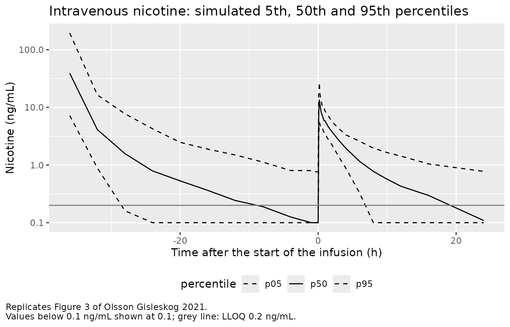
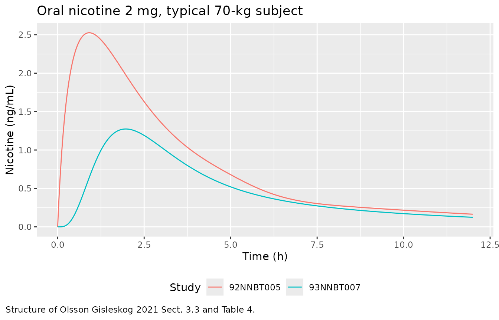
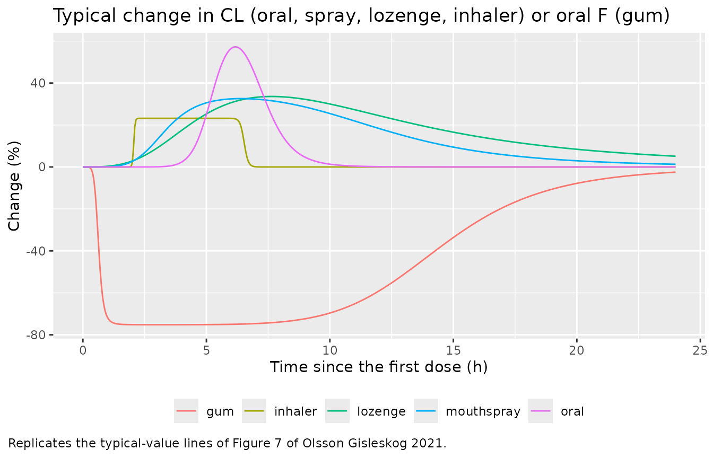
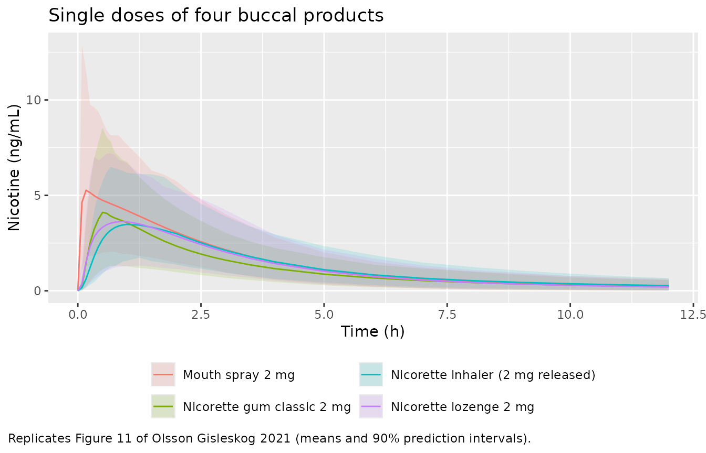
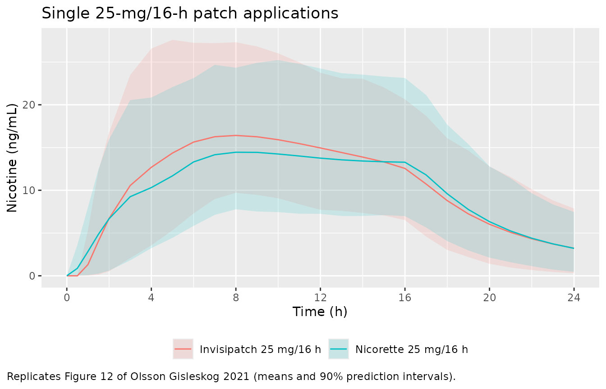
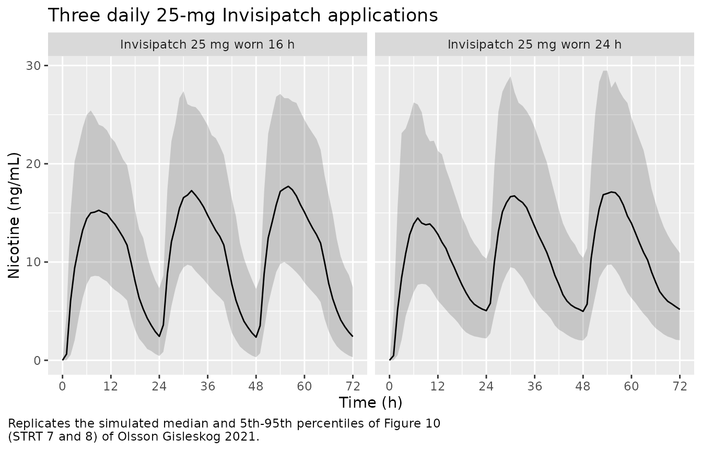

# Nicotine intravenous, oral, buccal and transdermal (Olsson Gisleskog 2021)

## Model and source

Olsson Gisleskog et al. (2021) pooled 29 single- and repeated-dose
studies of Nicorette and related nicotine replacement products in 930
healthy smokers and fitted seven population PK models: one for
intravenous nicotine and one each for oral microtablets, mouth spray,
chewing gum, lozenge, inhaler and transdermal patch. Joint fits across
routes did not converge, so the intravenous model was fitted first and
its disposition parameters and their between-subject variability were
then held fixed in the six extravascular models. The library follows the
same structure: seven model files, all described in this article.

- Citation: Olsson Gisleskog PO, Perez Ruixo JJ, Westin A, Hansson AC,
  Soons PA. Nicotine Population Pharmacokinetics in Healthy Smokers
  After Intravenous, Oral, Buccal and Transdermal Administration. Clin
  Pharmacokinet. 2021;60(4):541-561. <doi:10.1007/s40262-020-00960-5>
- Article: <https://doi.org/10.1007/s40262-020-00960-5> (open access)
- Supplementary NONMEM control streams and output for all seven final
  models (Electronic Supplementary Material 7):
  <https://static-content.springer.com/esm/art%3A10.1007%2Fs40262-020-00960-5/MediaObjects/40262_2020_960_MOESM7_ESM.docx>

``` r

model_names <- c(
  iv = "OlssonGisleskog_2021_nicotine_iv",
  oral = "OlssonGisleskog_2021_nicotine_oral",
  mouthspray = "OlssonGisleskog_2021_nicotine_mouthspray",
  gum = "OlssonGisleskog_2021_nicotine_gum",
  lozenge = "OlssonGisleskog_2021_nicotine_lozenge",
  inhaler = "OlssonGisleskog_2021_nicotine_inhaler",
  transdermal = "OlssonGisleskog_2021_nicotine_transdermal"
)
mods <- lapply(model_names, function(n) rxode2::rxode(readModelDb(n)))
#> ℹ parameter labels from comments will be replaced by 'label()'
#> ℹ parameter labels from comments will be replaced by 'label()'
#> ℹ parameter labels from comments will be replaced by 'label()'
#> Warning: some etas defaulted to non-mu referenced, possible parsing error: etaiov_ktr_6, etaiov_ktr_5, etaiov_ktr_4, etaiov_ktr_3, etaiov_ktr_2, etaiov_ktr_1, etaiov_fsw_6, etaiov_fsw_5, etaiov_fsw_4, etaiov_fsw_3, etaiov_fsw_2, etaiov_fsw_1, etaiov_ka_6, etaiov_ka_5, etaiov_ka_4, etaiov_ka_3, etaiov_ka_2, etaiov_ka_1, etaiov_fcentral_6, etaiov_fcentral_5, etaiov_fcentral_4, etaiov_fcentral_3, etaiov_fcentral_2, etaiov_fcentral_1
#> as a work-around try putting the mu-referenced expression on a simple line
#> ℹ parameter labels from comments will be replaced by 'label()'
#> Warning: some etas defaulted to non-mu referenced, possible parsing error: etaiov_fcentral_5, etaiov_fcentral_4, etaiov_fcentral_3, etaiov_fcentral_2, etaiov_fcentral_1, etaiov_fsw_5, etaiov_fsw_4, etaiov_fsw_3, etaiov_fsw_2, etaiov_fsw_1
#> as a work-around try putting the mu-referenced expression on a simple line
#> ℹ parameter labels from comments will be replaced by 'label()'
#> Warning: some etas defaulted to non-mu referenced, possible parsing error: etaiov_ktr_5, etaiov_ktr_4, etaiov_ktr_3, etaiov_ktr_2, etaiov_ktr_1, etaiov_krel_5, etaiov_krel_4, etaiov_krel_3, etaiov_krel_2, etaiov_krel_1, etaiov_fsw_5, etaiov_fsw_4, etaiov_fsw_3, etaiov_fsw_2, etaiov_fsw_1, etaiov_fcentral_5, etaiov_fcentral_4, etaiov_fcentral_3, etaiov_fcentral_2, etaiov_fcentral_1
#> as a work-around try putting the mu-referenced expression on a simple line
#> ℹ parameter labels from comments will be replaced by 'label()'
#> Warning: some etas defaulted to non-mu referenced, possible parsing error: etaiov_ktr_2, etaiov_ktr_1, etaiov_fsw_2, etaiov_fsw_1, etaiov_fcentral_2, etaiov_fcentral_1
#> as a work-around try putting the mu-referenced expression on a simple line
#> ℹ parameter labels from comments will be replaced by 'label()'
#> Warning: some etas defaulted to non-mu referenced, possible parsing error: etaiov_fdepot_6, etaiov_fdepot_5, etaiov_fdepot_4, etaiov_fdepot_3, etaiov_fdepot_2, etaiov_fdepot_1, etaiov_fcentral_6, etaiov_fcentral_5, etaiov_fcentral_4, etaiov_fcentral_3, etaiov_fcentral_2, etaiov_fcentral_1
#> as a work-around try putting the mu-referenced expression on a simple line

# Every model must be integrated as written: a cl/vc pair must not have been
# turned into an analytic linCmt() solution that would drop the absorption
# chains.
stopifnot(all(vapply(mods, function(m) is.null(m$linCmt), logical(1))))

tibble(
  Model = unname(model_names),
  Description = vapply(mods, function(m) m$description, character(1))
) |>
  knitr::kable()
```

| Model | Description |
|:---|:---|
| OlssonGisleskog_2021_nicotine_iv | Three-compartment population PK model for intravenous nicotine in healthy adult smokers (Olsson Gisleskog 2021; 80 subjects, 4 studies, 0.028 mg/kg infused over 10 min). Clearance and inter-compartmental flows are allometrically scaled by (WT/70)^0.75 and the three volumes by (WT/70)^1. Residual nicotine from pre-study smoking is described by a virtual 1-mg bolus into the central compartment at the start of the 36-h washout, whose bioavailability (the pre-washout nicotine dose, 4.90 mg) carries its own IIV; the record is flagged with VIRTUAL_DOSE = 1. This IV model supplies the disposition parameters (and their IIV) that the paper’s oral, buccal and transdermal models hold fixed. |
| OlssonGisleskog_2021_nicotine_oral | Population PK model for orally ingested nicotine microtablets in healthy adult smokers (Olsson Gisleskog 2021; 26 subjects, 2 studies, 2 and 6 mg). Disposition (three compartments with allometric weight scaling) and its IIV are fixed to the paper’s intravenous model. Absorption differs by study: in 92NNBT005 (repeated dosing, tablets chewed) first-order absorption directly into the central compartment (ka 1.55 1/h, F 39.5%); in 93NNBT007 (single dose, tablets swallowed whole) first-order transfer at the same ka into a chain of three transit compartments (ktr 3.60 1/h, F 22.3%). A transient time-dependent increase in clearance during the repeated-dose day (77.3% maximum, 50% onset at 5.29 h after the first dose, lasting 1.92 h) applies in 92NNBT005 only. Residual pre-study nicotine is a virtual 1-mg bolus into central at the start of the washout with bioavailability 4.92 mg. |
| OlssonGisleskog_2021_nicotine_mouthspray | Population PK model for nicotine oromucosal mouth spray (Nicorette QuickMist, 1 mg per spray) in healthy adult smokers (Olsson Gisleskog 2021; 201 subjects, 6 studies, 1-4 mg). Disposition (three compartments with allometric weight scaling) and its IIV are fixed to the paper’s intravenous model. The dose is delivered as a bolus split between the buccal cavity and the gut: a dose-dependent fraction Frsw (60.6% at 2 mg, rising with dose, logit-scale IOV) is swallowed and absorbed through a gut compartment and two transit compartments (ktr 3.70 1/h) with oral bioavailability fixed to 39.5%; the remainder is absorbed oromucosally (F = 1) after a 1.4-min lag with ka 15.9 1/h (buccal spraying) or 86.0 1/h (sublingual spraying). A transient time-dependent clearance increase (35.7% maximum) describes the lower-than-expected accumulation on repeated dosing. Residual pre-study nicotine is a virtual 1-mg bolus into central at the start of the washout (bioavailability 4.84 mg). IOV over up to six study periods on ka, Frsw, ktr and the pre-washout dose. |
| OlssonGisleskog_2021_nicotine_gum | Population PK model for nicotine chewing gum (Nicorette classic and Freshmint/Freshfruit coated gum, 2-6 mg, chewed for 30 min) in healthy adult smokers (Olsson Gisleskog 2021; 512 subjects, 14 studies). Disposition (three compartments with allometric weight scaling) and its IIV are fixed to the paper’s intravenous model. Nicotine is released from the gum by a first-order process whose rate is calculated from the individual amount released, and release stops at the end of the 0.5-h chewing period. A fraction Frsw (54.7%, logit-scale IOV) of the dose is swallowed, released at the same rate in the gut and absorbed through three transit compartments (ktr 5.53 1/h) with oral bioavailability fixed to 39.5%; the remainder passes from the gum to the buccal cavity after a lag and is absorbed oromucosally (F = 1) with ka 26.5 1/h (Nicorette classic) or 9.29 1/h (Freshmint/Freshfruit) at 2 mg, scaled by (dose/2)^0.507. On repeated dosing a transient time-dependent decrease in oral bioavailability (75.2% maximum, logit-scale IIV) describes the lower-than-expected accumulation. Residual pre-study nicotine is a virtual 1-mg bolus into central at the start of the washout (bioavailability 6.93 mg). |
| OlssonGisleskog_2021_nicotine_lozenge | Population PK model for nicotine lozenges (Nicorette and NiQuitin, 2 and 4 mg, dissolved in the mouth) in healthy adult smokers (Olsson Gisleskog 2021; 303 subjects, 6 studies). Disposition (three compartments with allometric weight scaling) and its IIV are fixed to the paper’s intravenous model. Nicotine is released from the lozenge by a first-order process (Krel 6.41 1/h, IOV). A fraction Frsw of the dose is swallowed (68.8% for 4-mg NiQuitin, lower at 2 mg and higher for Nicorette lozenges; logit-scale IOV), released at the same rate in the gut and absorbed through three transit compartments (ktr 3.54 1/h, IOV) with oral bioavailability fixed to 39.5%; the remainder passes after a lag into the buccal cavity and is absorbed oromucosally (ka 11.6 1/h, F = 1 with IIV). A transient time-dependent clearance increase (54.4% maximum) describes the lower-than-expected accumulation on repeated dosing. Residual pre-study nicotine is a virtual 1-mg bolus into central at the start of the washout (bioavailability 5.44 mg). |
| OlssonGisleskog_2021_nicotine_inhaler | Population PK model for the nicotine inhaler (Nicorette Inhalator, 10 and 15 mg cartridges, inhaled over 20-min sessions) in healthy adult smokers (Olsson Gisleskog 2021; 58 subjects, 3 studies). Disposition (three compartments with allometric weight scaling) and its IIV are fixed to the paper’s intravenous model. The amount released per session (from the inhaler weight change) enters as a 20-min zero-order input split between the buccal cavity and the gut: a fraction Frsw (66.9%, logit-scale IOV) is swallowed and absorbed through a gut compartment and two transit compartments (ktr 5.26 1/h, IOV) with oral bioavailability fixed to 39.5%; the remainder is absorbed oromucosally (ka 0.753 1/h, F = 1 with IIV). Bioavailability of both routes is 66% higher in study 97NNIN024. A transient time-dependent clearance increase (23.2% maximum, IIV) describes the lower-than-expected accumulation on repeated dosing. Residual pre-study nicotine is a virtual 1-mg bolus into central at the start of the washout (bioavailability 7.31 mg). |
| OlssonGisleskog_2021_nicotine_transdermal | Population PK model for transdermal nicotine patches (Nicorette patch 5-15 mg/16 h and Nicorette Invisipatch 10-25 mg/16 h, worn 16 or 24 h) in healthy adult smokers (Olsson Gisleskog 2021; 73 subjects, 3 studies). Disposition (three compartments with allometric weight scaling) and its IIV are fixed to the paper’s intravenous model. Nicotine leaves the patch by two parallel pathways: a fraction Fr1 (40.0% Nicorette patch, 71.9% Invisipatch; logit-scale IIV) by a first-order release (Krel 0.146 1/h) that runs from application (after a 0.53-h lag for Invisipatch) for a fraction Frdur1 of 16 h (44.5% and 96.2%), scaled so that the whole fraction is delivered in that window, and the remainder by a zero-order release from 4.06 h after application until patch removal. Released nicotine is absorbed through three transit compartments (ktr 3.62 1/h) with transdermal bioavailability 75.8% (IOV). Clearance is 11.6% higher from 25 h after the first application. Residual pre-study nicotine is a virtual 1-mg bolus into central at the start of the washout (bioavailability 3.82 mg). |

All models share the same disposition: three compartments with clearance
and inter-compartmental flows scaled by `(WT/70)^0.75` and volumes by
`(WT/70)^1`. Concentrations are in ng/mL, doses in mg and time in hours.

Every model also carries the paper’s device for residual nicotine from
smoking before the study: a virtual bolus of 1 mg given into `central`
at the start of the washout, whose bioavailability `fcentral` (reported
as the “pre-washout nicotine dose”, 3.8-7.3 mg across models) has its
own IIV and, where there were several periods, IOV. In the extravascular
models only this virtual dose enters `central`. In the intravenous model
the real infusion also enters `central`, so the virtual-dose record is
flagged with `VIRTUAL_DOSE = 1`. Omit the virtual dose to simulate a
subject with no residual nicotine; this article does so except where a
published figure shows the washout.

## Population

``` r

pop <- lapply(mods, function(m) m$population)
tibble(
  Model = names(pop),
  N = vapply(pop, function(p) p$n_subjects, integer(1)),
  Studies = vapply(pop, function(p) p$n_studies, integer(1)),
  `Age, median (range)` = paste0(vapply(pop, function(p) p$age_median, character(1)), " (", vapply(pop, function(p) p$age_range, character(1)), ")"),
  `Weight, median (range)` = paste0(vapply(pop, function(p) p$weight_median, character(1)), " (", vapply(pop, function(p) p$weight_range, character(1)), ")"),
  `Female (%)` = vapply(pop, function(p) p$sex_female_pct, numeric(1)),
  Doses = vapply(pop, function(p) p$dose_range, character(1))
) |>
  knitr::kable(caption = "Study populations by model (Olsson Gisleskog 2021 Tables 1 and 2).")
```

| Model | N | Studies | Age, median (range) | Weight, median (range) | Female (%) | Doses |
|:---|---:|---:|:---|:---|---:|:---|
| iv | 80 | 4 | 36 years (20-76 years) | 72.9 kg (49.0-99.0 kg) | 46.2 | 0.028 mg/kg nicotine intravenous infusion over 10 min |
| oral | 26 | 2 | 38 years (24-47 years) | 62.5 kg (44.0-105.0 kg) | 53.8 | 2 and 6 mg nicotine microtablets, single (93NNBT007) and repeated (92NNBT005) oral doses |
| mouthspray | 201 | 6 | 27 years (18-50 years) | 72.6 kg (49.4-105.6 kg) | 44.3 | 1, 2, 3 and 4 mg nicotine oromucosal spray, single and repeated doses |
| gum | 512 | 14 | 26 years (18-50 years) | 71.5 kg (40.6-108.0 kg) | 48.0 | 2, 4 and 6 mg nicotine chewing gum chewed for 30 min, single and repeated doses |
| lozenge | 303 | 6 | 28 years (18-50 years) | 72.8 kg (52.2-105.0 kg) | 47.2 | 2 and 4 mg nicotine lozenge (Nicorette, NiQuitin), single and repeated doses |
| inhaler | 58 | 3 | 29 years (22-49 years) | 71.0 kg (43.0-101.0 kg) | 53.4 | Nicotine inhaler, about 2 mg released per 20-min inhalation session, single and repeated sessions |
| transdermal | 73 | 3 | 24 years (19-50 years) | 71.2 kg (43.2-112.8 kg) | 38.4 | 5, 10, 15, 25 and 37 mg nicotine patches applied for 16 h (24 h in one arm), single and three daily applications |

Study populations by model (Olsson Gisleskog 2021 Tables 1 and 2).
{.table}

All subjects were healthy adult smokers (typically 15-20
cigarettes/day), almost all White, studied at clinical units in Sweden
between 1993 and 2012. The intravenous dataset excluded subjects with
hepatic or renal impairment. Demographics were similar across routes,
with slightly older subjects in the intravenous and oral studies. No
covariate other than body weight (as fixed allometry) was retained in
any model.

## Source trace

Every `ini()` value carries an in-file comment naming its source: Tables
3-6 of the paper and the final NONMEM control streams and output files
in the electronic supplementary material (ESM). The table below is
generated from those comments so that it cannot drift from the model
files. The disposition parameters and their IIV are the same fixed
values in all six extravascular models; they are listed once, under the
intravenous model, and checked for identity in code below.

``` r

# Parse the ini() block of a model file into (parameter, value, source) rows.
# Assignment lines are followed by a label() line that carries the source
# comment; eta lines carry it on the same line (or on the closing line of a
# multi-line block).
trace_ini <- function(file) {
  x <- readLines(file)
  start <- grep("^\\s*ini\\(\\{", x)
  end <- grep("^\\s*\\}\\)", x)
  end <- end[end > start][1]
  x <- x[(start + 1):(end - 1)]
  rows <- list()
  cur <- NULL
  eta_lhs <- NULL
  eta_rhs <- ""
  for (ln in x) {
    has_cmt <- grepl("#", ln)
    code <- trimws(sub("#.*$", "", ln))
    cmt <- if (has_cmt) trimws(sub("^[^#]*#", "", ln)) else ""
    if (!is.null(eta_lhs)) {
      eta_rhs <- paste(eta_rhs, code)
      if (has_cmt) {
        rows[[length(rows) + 1]] <- c(eta_lhs, eta_rhs, cmt)
        eta_lhs <- NULL
      }
    } else if (grepl("^[A-Za-z][A-Za-z0-9_.]*\\s*<-", code)) {
      cur <- c(trimws(sub("<-.*$", "", code)), trimws(sub("^[^<]*<-", "", code)))
    } else if (grepl("^label\\(", code) && !is.null(cur)) {
      rows[[length(rows) + 1]] <- c(cur, cmt)
      cur <- NULL
    } else if (grepl("~", code)) {
      lhs <- trimws(sub("~.*$", "", code))
      rhs <- trimws(sub("^[^~]*~", "", code))
      if (has_cmt) {
        rows[[length(rows) + 1]] <- c(lhs, rhs, cmt)
      } else {
        eta_lhs <- lhs
        eta_rhs <- rhs
      }
    }
  }
  out <- as.data.frame(do.call(rbind, rows), stringsAsFactors = FALSE)
  names(out) <- c("parameter", "value", "source")
  out
}

model_file <- function(n) {
  f <- system.file("modeldb", "specificDrugs", paste0(n, ".R"), package = "nlmixr2lib")
  if (!nzchar(f)) stop("model file not found for ", n)
  f
}

trace <- bind_rows(lapply(names(model_names), function(k) {
  trace_ini(model_file(model_names[[k]])) |> mutate(model = k, .before = 1)
}))

# Every ini() entry of every model must have been captured with a source.
n_ini <- vapply(mods, function(m) {
  d <- m$iniDf
  # a block of correlated etas is one source row; count its diagonal entries
  # as one row per block
  n_theta <- sum(!is.na(d$ntheta))
  etas <- d[is.na(d$ntheta), ]
  diag_rows <- etas[etas$neta1 == etas$neta2, ]
  in_block <- diag_rows$neta1 %in% c(etas$neta1[etas$neta1 != etas$neta2], etas$neta2[etas$neta1 != etas$neta2])
  n_theta + sum(!in_block) + as.integer(any(in_block))
}, integer(1))
n_trace <- table(factor(trace$model, levels = names(model_names)))
stopifnot(identical(as.integer(n_trace), unname(n_ini)))
stopifnot(all(nzchar(trace$source)))
```

``` r

shared <- c("lcl", "lvc", "lq", "lvp", "lq2", "lvp2", "e_wt_cl_q", "e_wt_vc_vp")
ev_models <- setdiff(names(mods), "iv")
iv_ini <- mods$iv$iniDf
for (k in ev_models) {
  d <- mods[[k]]$iniDf
  # Disposition thetas: same values as the IV estimates, and fixed.
  stopifnot(
    isTRUE(all.equal(d$est[match(shared, d$name)], iv_ini$est[match(shared, iv_ini$name)])),
    all(d$fix[match(shared, d$name)])
  )
  # Disposition IIV (CL and the V1/V3/V2 block): same values, fixed.
  eta_names <- c("etalcl", "etalvc", "etalvp2", "etalvp")
  iv_om <- mods$iv$omega[eta_names, eta_names]
  om <- mods[[k]]$omega[eta_names, eta_names]
  stopifnot(isTRUE(all.equal(unname(om), unname(iv_om))))
}
```

``` r

trace |>
  filter(model == "iv" | !(parameter %in% c(shared, "etalcl", "etalvc + etalvp2 + etalvp"))) |>
  rename(Model = model, Parameter = parameter, `Value (as coded)` = value, Source = source) |>
  knitr::kable(caption = "Source of every ini() value (ESM = electronic supplementary material, NONMEM code and output).")
```

| Model | Parameter | Value (as coded) | Source |
|:---|:---|:---|:---|
| iv | lcl | log(67.4136) | Table 3 ‘CL (L/h)’ 67.4; ESM \$THETA 67.4136 |
| iv | lvc | log(117.373) | Table 3 ‘V1 (L)’ 117; ESM \$THETA 117.373 |
| iv | lq | log(38.615) | Table 3 ‘Q2 (L/h)’ 38.6; ESM \$THETA 38.615 |
| iv | lvp | log(130.372) | Table 3 ‘V2 (L)’ 130; ESM \$THETA 130.372 |
| iv | lq2 | log(216.29) | Table 3 ‘Q3 (L/h)’ 216; ESM \$THETA 216.29 |
| iv | lvp2 | log(53.4189) | Table 3 ‘V3 (L)’ 53.4; ESM \$THETA 53.4189 |
| iv | e_wt_cl_q | fixed(0.75) | Sect. 2.3.1 ‘allometric exponent for CL and intercompartmental flows was fixed to 0.75’ |
| iv | e_wt_vc_vp | fixed(1) | Sect. 2.3.1 ‘and to 1.0 for Vn’ |
| iv | lfcentral | log(4.90) | Table 3 ‘Pre-washout nicotine dose (mg)’ 4.90; ESM output TH7 4.90E+00 |
| iv | etalcl | 0.0705245 | Table 3 ‘IIV CL’ 27.0% CV; ESM \$OMEGA IIV_CL 0.0705245 |
| iv | etalvc + etalvp2 + etalvp | c( 0.381077, -0.230826, 0.450311, 0, 0.5527, 1.83554 ) | Table 3 IIV V1 68.1%, IIV V3 75.4%, IIV V2 230%, covariances V1/V3 -0.231 and V2/V3 0.553; ESM \$OMEGA BLOCK(3) |
| iv | etalfcentral | 0.519 | Table 3 ‘IIV pre washout nicotine dose’ 82.5% CV; ESM output OMEGA(5,5) 5.19E-01 |
| iv | propSd | 0.0926 | Table 3 ‘Proportional residual error’ 0.0926 |
| iv | addSd | 0.212 | Table 3 ‘Additive residual error (ng/mL)’ 0.212 |
| oral | lka | log(1.55) | Table 4 ‘Ka (h-1)’ 1.55 |
| oral | lfdepot_92nnbt005 | log(0.395) | Table 4 ‘F study 92NNBT005 (%)’ 39.5 |
| oral | lfdepot_93nnbt007 | log(0.223) | Table 4 ‘F study 93NNBT007 (%)’ 22.3 |
| oral | lktr | log(3.60) | Table 4 ‘Ktr study 93NNBT007 (h-1)’ 3.60 |
| oral | lcl_t50 | log(5.29) | Table 4 ‘Start (h)’ 5.29 |
| oral | lcl_time_dur | log(1.92) | Table 4 ‘Duration (h)’ 1.92 |
| oral | lcl_time_max | log(0.773) | Table 4 ‘Emax (%)’ 77.3 |
| oral | lcl_time_hill | log(12.3) | Table 4 ‘pow’ 12.3 |
| oral | lfcentral | log(4.92) | Table 4 ‘Pre-washout nicotine dose (mg)’ 4.92 |
| oral | etalfdepot | 0.0499 | Table 4 ‘IIV F’ 22.6% CV; ESM output OMEGA(5,5) 4.99E-02 |
| oral | etalktr | 0.186 | Table 4 ‘IIV Ktr’ 45.2% CV; ESM output OMEGA(6,6) 1.86E-01 |
| oral | etalfcentral | 0.610 | Table 4 ‘IIV pre-washout nicotine dose’ 91.7% CV; ESM output OMEGA(7,7) 6.10E-01 |
| oral | etalcl_time_dur | 0.340 | Table 4 ‘IIV duration’ 63.7% CV; ESM output OMEGA(8,8) 3.40E-01 |
| oral | propSd | 0.0987 | Table 4 ‘Proportional residual error (%)’ 9.87 |
| oral | addSd | 0.162 | Table 4 ‘Additive residual error (ng/mL)’ 0.162 |
| mouthspray | lka_buccal | log(15.9) | Table 5 ‘Ka (h-1)’ 15.9 (footnote c, buccal) |
| mouthspray | lka_sublingual | log(86.0) | Table 5 ‘Ka (h-1)’ 86.0 (footnote c, sublingual) |
| mouthspray | ltlag | log(0.0230) | Table 5 ‘Lag time (h)’ 0.0230 |
| mouthspray | logitfsw | logit(0.606) | Table 5 ‘Frsw (%)’ 60.6 at 2 mg (footnote e); ESM output TH10 0.606 |
| mouthspray | e_dose_nicotine_mg_fsw | 0.0928 | ESM output TH11 9.28E-02 (POWFRSW); reproduces Table 5 Frsw 64.6% at 4 mg |
| mouthspray | lktr | log(3.70) | Table 5 ‘Ktrg (h-1)’ 3.70 |
| mouthspray | lfdepot_buccal | fixed(log(1)) | ESM \$THETA ‘1 FIX ; F total’; Sect. 2.3.4 ‘a F of 100%’ |
| mouthspray | lfdepot_oral | fixed(log(0.395)) | ESM $`PK ORAL_F = 0.395*EXP(ETA(6)); Table 4 F study 92NNBT005 39.5%; Sect. 3.4 'oral F fixed to 40%'           |
|mouthspray  |lcl_t50                               |log(3.37)                                              |Table 5 'Start (h)' 3.37                                                                                       |
|mouthspray  |lcl_time_dur                          |log(8.78)                                              |Table 5 'Duration (h)' 8.78                                                                                    |
|mouthspray  |lcl_time_max                          |log(0.357)                                             |Table 5 'Emax (%)' 35.7                                                                                        |
|mouthspray  |lcl_time_hill                         |log(4.82)                                              |Table 5 'pow' 4.82                                                                                             |
|mouthspray  |lfcentral                             |log(4.84)                                              |Table 5 'Pre-washout nicotine dose (mg)' 4.84                                                                  |
|mouthspray  |etaltlag                              |0.0472                                                 |Table 5 'IIV lag time' 22.0% CV; ESM output OMEGA(5,5) 4.72E-02                                                |
|mouthspray  |etalfdepot_oral                       |0.307                                                  |Table 5 'IIV Foral' 60.0% CV; ESM output OMEGA(6,6) 3.07E-01                                                   |
|mouthspray  |etalfcentral                          |0.509                                                  |Table 5 'IIV pre-washout nicotine dose' 81.5% CV; ESM output OMEGA(7,7) 5.09E-01                               |
|mouthspray  |etalcl_time_dur                       |0.543                                                  |Table 5 'IIV duration' 84.9% CV; ESM output OMEGA(8,8) 5.43E-01                                                |
|mouthspray  |etaiov_fcentral_1                     |0.229                                                  |Table 5 'IOV pre-washout nicotine dose' 50.7% CV; ESM output OMEGA(9,9) 2.29E-01                               |
|mouthspray  |etaiov_fcentral_2                     |fixed(0.229)                                           |`$OMEGA BLOCK(1) SAME |
| mouthspray | etaiov_fcentral_3 | fixed(0.229) | $`OMEGA BLOCK(1) SAME                                                                                           |
|mouthspray  |etaiov_fcentral_4                     |fixed(0.229)                                           |`$OMEGA BLOCK(1) SAME |
| mouthspray | etaiov_fcentral_5 | fixed(0.229) | $`OMEGA BLOCK(1) SAME                                                                                           |
|mouthspray  |etaiov_fcentral_6                     |fixed(0.229)                                           |`$OMEGA BLOCK(1) SAME |
| mouthspray | etaiov_ka_1 | 0.653 | Table 5 ‘IOV Ka’ 96.0% CV; ESM output OMEGA(15,15) 6.53E-01 |
| mouthspray | etaiov_ka_2 | fixed(0.653) | $`OMEGA BLOCK(1) SAME                                                                                           |
|mouthspray  |etaiov_ka_3                           |fixed(0.653)                                           |`$OMEGA BLOCK(1) SAME |
| mouthspray | etaiov_ka_4 | fixed(0.653) | $`OMEGA BLOCK(1) SAME                                                                                           |
|mouthspray  |etaiov_ka_5                           |fixed(0.653)                                           |`$OMEGA BLOCK(1) SAME |
| mouthspray | etaiov_ka_6 | fixed(0.653) | $`OMEGA BLOCK(1) SAME                                                                                           |
|mouthspray  |etaiov_fsw_1                          |0.294                                                  |Table 5 'IOV Frsw' 0.294 (logit scale); ESM output OMEGA(21,21) 2.94E-01                                       |
|mouthspray  |etaiov_fsw_2                          |fixed(0.294)                                           |`$OMEGA BLOCK(1) SAME |
| mouthspray | etaiov_fsw_3 | fixed(0.294) | $`OMEGA BLOCK(1) SAME                                                                                           |
|mouthspray  |etaiov_fsw_4                          |fixed(0.294)                                           |`$OMEGA BLOCK(1) SAME |
| mouthspray | etaiov_fsw_5 | fixed(0.294) | $`OMEGA BLOCK(1) SAME                                                                                           |
|mouthspray  |etaiov_fsw_6                          |fixed(0.294)                                           |`$OMEGA BLOCK(1) SAME |
| mouthspray | etaiov_ktr_1 | 0.353 | Table 5 ‘IOV Ktr’ 65.1% CV; ESM output OMEGA(27,27) 3.53E-01 |
| mouthspray | etaiov_ktr_2 | fixed(0.353) | $`OMEGA BLOCK(1) SAME                                                                                           |
|mouthspray  |etaiov_ktr_3                          |fixed(0.353)                                           |`$OMEGA BLOCK(1) SAME |
| mouthspray | etaiov_ktr_4 | fixed(0.353) | $`OMEGA BLOCK(1) SAME                                                                                           |
|mouthspray  |etaiov_ktr_5                          |fixed(0.353)                                           |`$OMEGA BLOCK(1) SAME |
| mouthspray | etaiov_ktr_6 | fixed(0.353) | \$OMEGA BLOCK(1) SAME |
| mouthspray | propSd | 0.101 | Table 5 ‘Proportional residual error (%)’ 10.1 |
| mouthspray | addSd | 0.136 | Table 5 (continued) ‘Additive residual error (ng/mL)’ 0.136 |
| gum | ltlag | log(0.0531) | Table 5 ‘Lag time (h)’ 0.0531 |
| gum | lka_classic | log(26.5) | Table 5 ‘Ka (h-1)’ 26.5 (footnote d); ESM \$PK TVKA reference NDOSE/2 |
| gum | lka_freshmint | log(9.29) | Table 5 ‘Ka (h-1)’ 9.29 (footnote d) |
| gum | e_dose_nicotine_mg_ka | 0.507 | Table 5 ‘Dose on Ka’ 0.507; ESM TVKA = …\*(NDOSE/2)\*\*POWKA |
| gum | logitfsw | logit(0.547) | Table 5 ‘Frsw (%)’ 54.7 |
| gum | lktr | log(5.53) | Table 5 ‘Ktrg (h-1)’ 5.53 |
| gum | lfdepot_buccal | fixed(log(1)) | ESM \$PK TVFBUCC = 1; Sect. 2.3.4 ‘a F of 100%’ |
| gum | lfdepot_oral | fixed(log(0.395)) | ESM $`PK TVORAL_F = 0.395; Table 4 F study 92NNBT005 39.5%                                                      |
|gum         |logitfdepot_oral_time_max             |logit(0.752)                                           |Table 5 'Emax (%)' -75.2 (a decrease); ESM output TH13 0.752 (F_EFF, logit IIV)                                |
|gum         |lfdepot_oral_t50                      |log(0.636)                                             |Table 5 'Start (h)' 0.636                                                                                      |
|gum         |lfdepot_oral_time_dur                 |log(13.9)                                              |Table 5 'Duration (h)' 13.9                                                                                    |
|gum         |fdepot_oral_time_hill                 |6.75                                                   |Table 5 'pow' 6.75                                                                                             |
|gum         |lfcentral                             |log(6.93)                                              |Table 5 'Pre-washout nicotine dose (mg)' 6.93                                                                  |
|gum         |etaltlag                              |0.132                                                  |Table 5 'IIV lag time' 37.5% CV; ESM output OMEGA(5,5) 1.32E-01                                                |
|gum         |etalfdepot_oral                       |0.411                                                  |Table 5 'IIV Foral' 71.3% CV; ESM output OMEGA(6,6) 4.11E-01                                                   |
|gum         |etalogitfdepot_oral_time_max          |2.67                                                   |Table 5 'IIV Emax' 366 (logit-scale variance printed through the CV formula); ESM output OMEGA(7,7) 2.67E+00   |
|gum         |etalfdepot_oral_t50                   |0.275                                                  |Table 5 'IIV start' 56.3% CV; ESM output OMEGA(8,8) 2.75E-01                                                   |
|gum         |etalfdepot_oral_time_dur              |0.537                                                  |Table 5 'IIV duration' 84.3% CV; ESM output OMEGA(9,9) 5.37E-01                                                |
|gum         |etalfcentral                          |0.549                                                  |Table 5 'IIV pre-washout nicotine dose' 85.5% CV; ESM output OMEGA(10,10) 5.49E-01                             |
|gum         |etaiov_fsw_1                          |1.04                                                   |Table 5 'IOV Frsw' 1.04 (logit scale); ESM output OMEGA(11,11) 1.04E+00                                        |
|gum         |etaiov_fsw_2                          |fixed(1.04)                                            |`$OMEGA BLOCK(1) SAME |
| gum | etaiov_fsw_3 | fixed(1.04) | $`OMEGA BLOCK(1) SAME                                                                                           |
|gum         |etaiov_fsw_4                          |fixed(1.04)                                            |`$OMEGA BLOCK(1) SAME |
| gum | etaiov_fsw_5 | fixed(1.04) | $`OMEGA BLOCK(1) SAME                                                                                           |
|gum         |etaiov_fcentral_1                     |0.164                                                  |Table 5 'IOV pre-washout nicotine dose' 42.2% CV; ESM output OMEGA(16,16) 1.64E-01                             |
|gum         |etaiov_fcentral_2                     |fixed(0.164)                                           |`$OMEGA BLOCK(1) SAME |
| gum | etaiov_fcentral_3 | fixed(0.164) | $`OMEGA BLOCK(1) SAME                                                                                           |
|gum         |etaiov_fcentral_4                     |fixed(0.164)                                           |`$OMEGA BLOCK(1) SAME |
| gum | etaiov_fcentral_5 | fixed(0.164) | \$OMEGA BLOCK(1) SAME |
| gum | propSd | 0.104 | Table 5 ‘Proportional residual error (%)’ 10.4 |
| gum | addSd | 0.157 | Table 5 (continued) ‘Additive residual error (ng/mL)’ 0.157 |
| lozenge | lkrel | log(6.41) | Table 5 ‘Krel (h-1)’ 6.41 |
| lozenge | ltlag | log(0.0437) | Table 5 ‘Lag time (h)’ 0.0437 |
| lozenge | lka | log(11.6) | Table 5 ‘Ka (h-1)’ 11.6 |
| lozenge | logitfsw | logit(0.688) | Table 5 ‘Frsw (%)’ 68.8 at 4 mg (footnote e); ESM output TH10 0.688 |
| lozenge | e_form_nicotine_nicorette_lozenge_fsw | 0.412 | Table 5 ‘Nicorette on Frsw’ 0.412 (footnote g, additive on logit scale) |
| lozenge | e_dose2mg_fsw | -0.217 | ESM output TH14 -2.17E-01; reproduces Table 5 Frsw 64.0% at 2 mg |
| lozenge | lktr | log(3.54) | Table 5 ‘Ktrg (h-1)’ 3.54 |
| lozenge | lfdepot_buccal | fixed(log(1)) | ESM \$PK TVFBUCC = 1 with IIV; Sect. 2.3.4 ‘a F of 100%’ |
| lozenge | lfdepot_oral | fixed(log(0.395)) | ESM $`PK ORAL_F = 0.395*EXP(ETA(7)); Table 4 F study 92NNBT005 39.5%                                            |
|lozenge     |lcl_t50                               |log(4.86)                                              |Table 5 'Start (h)' 4.86                                                                                       |
|lozenge     |lcl_time_dur                          |log(7.18)                                              |ESM output TH17 7.18E+00 (SE 1.45, RSE 20.2%); Table 5 prints 20.2 in this cell, see vignette Errata           |
|lozenge     |lcl_time_max                          |log(0.544)                                             |Table 5 'Emax (%)' 54.4                                                                                        |
|lozenge     |lcl_time_hill                         |log(3.18)                                              |ESM output TH18 3.18E+00 (SE 0.314, RSE 9.87%); Table 5 prints 9.88 in this cell, see vignette Errata          |
|lozenge     |lfcentral                             |log(5.44)                                              |Table 5 'Pre-washout nicotine dose (mg)' 5.44                                                                  |
|lozenge     |etaltlag                              |0.0991                                                 |Table 5 'IIV lag time' 32.3% CV; ESM output OMEGA(5,5) 9.91E-02                                                |
|lozenge     |etalka                                |0.637                                                  |Table 5 'IIV Ka' 94.4% CV; ESM output OMEGA(6,6) 6.37E-01                                                      |
|lozenge     |etalfdepot_oral                       |0.316                                                  |Table 5 'IIV Foral' 61.0% CV; ESM output OMEGA(7,7) 3.16E-01                                                   |
|lozenge     |etalfcentral                          |0.320                                                  |Table 5 'IIV pre-washout nicotine dose' 61.4% CV; ESM output OMEGA(8,8) 3.20E-01                               |
|lozenge     |etalfdepot_buccal                     |0.0533                                                 |Table 5 'IIV Fbuccal' 23.4% CV; ESM output OMEGA(9,9) 5.33E-02                                                 |
|lozenge     |etalcl_t50                            |0.171                                                  |Table 5 'IIV start' 43.2% CV; ESM output OMEGA(10,10) 1.71E-01                                                 |
|lozenge     |etalcl_time_dur                       |0.428                                                  |Table 5 'IIV duration' 73.1% CV; ESM output OMEGA(11,11) 4.28E-01                                              |
|lozenge     |etaiov_fcentral_1                     |0.171                                                  |Table 5 'IOV pre-washout nicotine dose' 43.1% CV; ESM output OMEGA(12,12) 1.71E-01                             |
|lozenge     |etaiov_fcentral_2                     |fixed(0.171)                                           |`$OMEGA BLOCK(1) SAME |
| lozenge | etaiov_fcentral_3 | fixed(0.171) | $`OMEGA BLOCK(1) SAME                                                                                           |
|lozenge     |etaiov_fcentral_4                     |fixed(0.171)                                           |`$OMEGA BLOCK(1) SAME |
| lozenge | etaiov_fcentral_5 | fixed(0.171) | $`OMEGA BLOCK(1) SAME                                                                                           |
|lozenge     |etaiov_fsw_1                          |0.245                                                  |Table 5 'IOV Frsw' 0.245 (logit scale); ESM output OMEGA(17,17) 2.45E-01                                       |
|lozenge     |etaiov_fsw_2                          |fixed(0.245)                                           |`$OMEGA BLOCK(1) SAME |
| lozenge | etaiov_fsw_3 | fixed(0.245) | $`OMEGA BLOCK(1) SAME                                                                                           |
|lozenge     |etaiov_fsw_4                          |fixed(0.245)                                           |`$OMEGA BLOCK(1) SAME |
| lozenge | etaiov_fsw_5 | fixed(0.245) | $`OMEGA BLOCK(1) SAME                                                                                           |
|lozenge     |etaiov_krel_1                         |0.387                                                  |Table 5 'IOV Krel' 68.7% CV; ESM output OMEGA(22,22) 3.87E-01                                                  |
|lozenge     |etaiov_krel_2                         |fixed(0.387)                                           |`$OMEGA BLOCK(1) SAME |
| lozenge | etaiov_krel_3 | fixed(0.387) | $`OMEGA BLOCK(1) SAME                                                                                           |
|lozenge     |etaiov_krel_4                         |fixed(0.387)                                           |`$OMEGA BLOCK(1) SAME |
| lozenge | etaiov_krel_5 | fixed(0.387) | $`OMEGA BLOCK(1) SAME                                                                                           |
|lozenge     |etaiov_ktr_1                          |0.281                                                  |Table 5 'IOV Ktr' 56.9% CV; ESM output OMEGA(27,27) 2.81E-01                                                   |
|lozenge     |etaiov_ktr_2                          |fixed(0.281)                                           |`$OMEGA BLOCK(1) SAME |
| lozenge | etaiov_ktr_3 | fixed(0.281) | $`OMEGA BLOCK(1) SAME                                                                                           |
|lozenge     |etaiov_ktr_4                          |fixed(0.281)                                           |`$OMEGA BLOCK(1) SAME |
| lozenge | etaiov_ktr_5 | fixed(0.281) | \$OMEGA BLOCK(1) SAME |
| lozenge | propSd | 0.107 | Table 5 ‘Proportional residual error (%)’ 10.7 |
| lozenge | addSd | 0.0851 | Table 5 (continued) ‘Additive residual error (ng/mL)’ 0.0851 |
| inhaler | lka | log(0.753) | Table 5 ‘Ka (h-1)’ 0.753 |
| inhaler | logitfsw | logit(0.669) | Table 5 ‘Frsw (%)’ 66.9 |
| inhaler | lktr | log(5.26) | Table 5 ‘Ktrg (h-1)’ 5.26 |
| inhaler | lfdepot_buccal | fixed(log(1)) | ESM \$PK TVFBUCC = 1 with IIV; Sect. 2.3.4 ‘a F of 100%’ |
| inhaler | lfdepot_oral | fixed(log(0.395)) | ESM \$PK ORAL_F = 0.395\*EXP(ETA(6)); Table 4 F study 92NNBT005 39.5% |
| inhaler | e_study_97nnin024_f | 0.660 | Table 5 ‘F increase, Study 97NNIN024 (%)’ 66.0 |
| inhaler | lcl_t50 | log(2.06) | Table 5 ‘Start (h)’ 2.06 |
| inhaler | lcl_time_dur | log(4.47) | Table 5 ‘Duration (h)’ 4.47 |
| inhaler | lcl_time_max | log(0.232) | Table 5 ‘Emax (%)’ 23.2; ESM ICL_EFF = THETA(14)\*EXP(ETA(10)) |
| inhaler | lcl_time_hill | fixed(log(80)) | Table 5 ‘pow’ ‘80 (fixed)’; ESM $`THETA 80 FIX                                                                  |
|inhaler     |lfcentral                             |log(7.31)                                              |Table 5 'Pre-washout nicotine dose (mg)' 7.31                                                                  |
|inhaler     |etalfdepot_buccal                     |0.116                                                  |Table 5 'IIV Fbuccal' 35.1% CV; ESM output OMEGA(5,5) 1.16E-01                                                 |
|inhaler     |etalfdepot_oral                       |0.0811                                                 |Table 5 'IIV Foral' 29.1% CV; ESM output OMEGA(6,6) 8.11E-02                                                   |
|inhaler     |etalfcentral                          |0.140                                                  |Table 5 'IIV pre-washout nicotine dose' 38.7% CV; ESM output OMEGA(7,7) 1.40E-01                               |
|inhaler     |etalcl_time_dur                       |0.0840                                                 |Table 5 'IIV duration' 29.6% CV; ESM output OMEGA(9,9) 8.40E-02                                                |
|inhaler     |etalcl_time_max                       |0.316                                                  |Table 5 'IIV Emax' 60.9% CV; ESM output OMEGA(10,10) 3.16E-01                                                  |
|inhaler     |etaiov_fcentral_1                     |0.0579                                                 |Table 5 'IOV pre-washout nicotine dose' 24.4% CV; ESM output OMEGA(11,11) 5.79E-02                             |
|inhaler     |etaiov_fcentral_2                     |fixed(0.0579)                                          |`$OMEGA BLOCK(1) SAME |
| inhaler | etaiov_fsw_1 | 0.483 | Table 5 ‘IOV Frsw’ 0.483 (logit scale); ESM output OMEGA(13,13) 4.83E-01 |
| inhaler | etaiov_fsw_2 | fixed(0.483) | $`OMEGA BLOCK(1) SAME                                                                                           |
|inhaler     |etaiov_ktr_1                          |0.246                                                  |Table 5 'IOV Ktr' 52.8% CV; ESM output OMEGA(15,15) 2.46E-01                                                   |
|inhaler     |etaiov_ktr_2                          |fixed(0.246)                                           |`$OMEGA BLOCK(1) SAME |
| inhaler | propSd | 0.0761 | Table 5 ‘Proportional residual error (%)’ 7.61 |
| inhaler | addSd | 0.179 | Table 5 (continued) ‘Additive residual error (ng/mL)’ 0.179 |
| transdermal | lkrel | log(0.146) | Table 6 ‘Krel (h-1)’ 0.146 |
| transdermal | lktr | log(3.62) | Table 6 ‘Ktrs (h-1)’ 3.62 |
| transdermal | logitffo_nicorette | logit(0.400) | Table 6 ‘Fr1 Nicorette (%)’ 40.0 |
| transdermal | logitffo_invisipatch | logit(0.719) | Table 6 ‘Fr1 Invisipatch (%)’ 71.9 |
| transdermal | logitfrdur_nicorette | logit(0.445) | Table 6 ‘Frdur1 Nicorette (%)’ 44.5 |
| transdermal | logitfrdur_invisipatch | logit(0.962) | Table 6 ‘Frdur1 Invisipatch (%)’ 96.2 |
| transdermal | lfdepot | log(0.758) | Table 6 ‘F (%)’ 75.8 |
| transdermal | ltlag_invisipatch | log(0.53) | Table 6 ‘Lag time1 (h)’ 0.53 (ESM ALAG1 = THETA(14)\*(1-FORMFL)) |
| transdermal | ltlag2 | log(4.06) | Table 6 ‘Lag time2 (h)’ 4.06 (ESM ALAG5) |
| transdermal | lcl_time_max | log(0.116) | Table 6 ‘CLch24 (%)’ 11.6; ESM TVCL*(1+TFLAG*THETA(19)), TFLAG = TSSP \> 25 |
| transdermal | lfcentral | log(3.82) | Table 6 ‘Pre-washout nicotine dose (mg)’ 3.82 |
| transdermal | etalkrel | 0.219 | Table 6 ‘IIV Krel’ 49.5% CV; ESM output OMEGA(5,5) 2.19E-01 |
| transdermal | etalktr | 0.835 | Table 6 ‘IIV KTR’ 114% CV; ESM output OMEGA(6,6) 8.35E-01 |
| transdermal | etalogitfrdur | 0.498 | Table 6 ‘IIV Frdur1’ 0.498 (logit scale); ESM output OMEGA(7,7) 4.98E-01 |
| transdermal | etalogitffo | 0.238 | Table 6 ‘IIV Fr1’ 0.238 (logit scale); ESM output OMEGA(8,8) 2.38E-01 |
| transdermal | etalfcentral | 0.906 | Table 6 ‘IIV pre-washout nicotine dose’ 121% CV; ESM output OMEGA(9,9) 9.06E-01 |
| transdermal | etaiov_fcentral_1 | 0.603 | Table 6 ‘IOV pre washout nicotine dose’ 91% CV; ESM output OMEGA(10,10) 6.03E-01 |
| transdermal | etaiov_fcentral_2 | fixed(0.603) | $`OMEGA BLOCK(1) SAME                                                                                           |
|transdermal |etaiov_fcentral_3                     |fixed(0.603)                                           |`$OMEGA BLOCK(1) SAME |
| transdermal | etaiov_fcentral_4 | fixed(0.603) | $`OMEGA BLOCK(1) SAME                                                                                           |
|transdermal |etaiov_fcentral_5                     |fixed(0.603)                                           |`$OMEGA BLOCK(1) SAME |
| transdermal | etaiov_fcentral_6 | fixed(0.603) | $`OMEGA BLOCK(1) SAME                                                                                           |
|transdermal |etaiov_fdepot_1                       |0.0164                                                 |Table 6 'IOV F' 12.9% CV; ESM output OMEGA(16,16) 1.64E-02                                                     |
|transdermal |etaiov_fdepot_2                       |fixed(0.0164)                                          |`$OMEGA BLOCK(1) SAME |
| transdermal | etaiov_fdepot_3 | fixed(0.0164) | $`OMEGA BLOCK(1) SAME                                                                                           |
|transdermal |etaiov_fdepot_4                       |fixed(0.0164)                                          |`$OMEGA BLOCK(1) SAME |
| transdermal | etaiov_fdepot_5 | fixed(0.0164) | $`OMEGA BLOCK(1) SAME                                                                                           |
|transdermal |etaiov_fdepot_6                       |fixed(0.0164)                                          |`$OMEGA BLOCK(1) SAME |
| transdermal | propSd | 0.19 | Table 6 ‘Proportional residual error’ 0.19 |
| transdermal | addSd | 0.257 | Table 6 ‘Additive residual error (ng/mL)’ 0.257 |

Source of every ini() value (ESM = electronic supplementary material,
NONMEM code and output). {.table}

The model equations come from the ESM control streams and the paper:

| Equation | Source |
|----|----|
| Three-compartment disposition, allometry `(WT/70)^0.75` on CL/Q2/Q3 and `^1` on V1-V3 | Sect. 2.3.1, Fig. 1; ESM `$PK` (all models) |
| Virtual pre-washout bolus into central, `F = pre-washout dose * exp(eta [+ IOV])` | Sect. 2.3.2; ESM `$PK` `F1`/`F2` on `PREDOSE` records |
| Oral: `depot -> central` (92NNBT005) or `depot -> transit1-3 -> central` (93NNBT007) | Sect. 3.3; ESM oral `$DES` |
| Time-dependent change `P = Pbl (1 + Emax [T^pow/(Start^pow + T^pow) - T^pow/((Start + Duration)^pow + T^pow)])` | Eq. 2; ESM `TFL` (oral, spray, lozenge, inhaler on CL; gum on oral F) |
| Buccal split: `F_buccal (1 - Frsw)` to the buccal cavity, `F_oral Frsw` to the gut, `F_oral = 0.395` | Sect. 2.3.4, Fig. 1; ESM `F1`/`F5` |
| Mouth spray/inhaler: `depot_buccal -> central` (ka); `depot_oral -> transit1 -> transit2 -> central` (ktr) | Sect. 3.4; ESM mouth-spray/inhaler `$DES` |
| Gum/lozenge: `depot -> depot_buccal` (Krel) `-> central` (ka); `depot_oral -> transit1-3 -> central` (Krel, then ktr) | Sect. 3.4; ESM gum/lozenge `$DES` |
| Gum release `Krel = -log(1 - ADOSE/NDOSE)/0.5`, stopping 0.5 h after the dose | Eq. 1; ESM gum `KREL`, `ENDDOSE` |
| Fraction swallowed: logit-normal; spray `Frsw = 0.606 (dose/2)^0.0928`; lozenge logit shifts for Nicorette and 2 mg | Table 5; ESM `TVFRSW`, `EFF_FRSW1/2` |
| Patch: `depot_td -> transit1` (Krel while `t <= Frdur1*16 h`) with `F = FTOT Fr1 / (1 - exp(-Krel Frdur1 16))`; zero-order `FTOT (1 - Fr1)` into `transit1` from 4.06 h to removal; `transit1-3 -> central` | Sect. 2.3.5, 3.5, Fig. 1; ESM transdermal `$PK`/`$DES` (`MTIME`, `D5 = DUR - ALAG5`) |
| Patch CL `x (1 + 0.116)` from 25 h after the first application | Table 6 ‘CLch24’; ESM `TFLAG` |
| Residual error `sqrt(add^2 + prop^2 IPRED^2)` | Sect. 2.3; ESM `$ERROR` |

## Virtual cohort

The individual data are not public. Simulations use virtual subjects
whose body weight follows the published distribution (median about 72
kg, CV about 16%, range 40-113 kg; Table 2), redrawn rather than clipped
when outside the observed range. At most 200 subjects are simulated per
arm.

``` r

set.seed(2021)
draw_wt <- function(n) {
  wt <- rlnorm(n, log(72), 0.16)
  bad <- wt < 40 | wt > 113
  while (any(bad)) {
    wt[bad] <- rlnorm(sum(bad), log(72), 0.16)
    bad <- wt < 40 | wt > 113
  }
  wt
}
n_arm <- 200L

# One event table for an arm: `doses` holds the dose records (time, cmt, amt,
# rate) given to every subject, `covs` the covariate columns. ids are offset
# so arms can be combined.
make_arm <- function(doses, obs_times, covs, treatment, id_offset) {
  wt <- draw_wt(n_arm)
  bind_rows(lapply(seq_len(n_arm), function(i) {
    obs <- tibble(time = obs_times, evid = 0L, cmt = "central", amt = NA_real_, rate = NA_real_)
    bind_rows(mutate(doses, evid = 1L), obs) |>
      mutate(id = id_offset + i, WT = wt[i])
  })) |>
    bind_cols(as_tibble(covs)[rep(1, n_arm * (nrow(doses) + length(obs_times))), ]) |>
    mutate(treatment = treatment) |>
    arrange(id, time, desc(evid))
}
```

## Intravenous model

### Derived disposition quantities

The paper reports the half-lives and the fraction of the area under the
curve of the three disposition phases (7 min, 57 min and 4.5 h; 0.04,
0.36 and 0.61), a typical clearance of 1.1 L/min and a volume of
distribution at steady state of 4.3 L/kg for a 70-kg subject (Sect. 3.2
and Conclusions). These follow in closed form from the typical
parameters.

``` r

th <- function(m, p) {
  v <- m$iniDf$est[m$iniDf$name == p]
  if (length(v) != 1) stop("no unique parameter ", p)
  v
}
cl <- exp(th(mods$iv, "lcl"))
v1 <- exp(th(mods$iv, "lvc"))
q2 <- exp(th(mods$iv, "lq"))
v2 <- exp(th(mods$iv, "lvp"))
q3 <- exp(th(mods$iv, "lq2"))
v3 <- exp(th(mods$iv, "lvp2"))
K <- matrix(c(
  -(cl + q2 + q3) / v1, q2 / v1, q3 / v1,
  q2 / v2, -q2 / v2, 0,
  q3 / v3, 0, -q3 / v3
), 3, 3)
eg <- eigen(K)
lam <- -eg$values
coef <- eg$vectors[1, ] * solve(eg$vectors, c(1, 0, 0)) / v1
ord <- order(lam, decreasing = TRUE)
lam <- lam[ord]
coef <- coef[ord]
phase <- tibble(
  Phase = c("rapid", "intermediate", "slowest"),
  `Half-life (model)` = c(sprintf("%.1f min", 60 * log(2) / lam[1:2]), sprintf("%.2f h", log(2) / lam[3])),
  `Half-life (paper)` = c("7 min", "57 min", "4.5 h"),
  `AUC fraction (model)` = round((coef / lam) / sum(coef / lam), 3),
  `AUC fraction (paper)` = c(0.04, 0.36, 0.61)
)
knitr::kable(phase, caption = "Disposition phases of the typical 70-kg subject after an IV bolus.")
```

| Phase | Half-life (model) | Half-life (paper) | AUC fraction (model) | AUC fraction (paper) |
|:---|:---|:---|---:|---:|
| rapid | 6.7 min | 7 min | 0.036 | 0.04 |
| intermediate | 57.2 min | 57 min | 0.359 | 0.36 |
| slowest | 4.54 h | 4.5 h | 0.605 | 0.61 |

Disposition phases of the typical 70-kg subject after an IV bolus.
{.table}

``` r

cat(sprintf("CL = %.2f L/min (paper 1.1); Vss = %.2f L/kg (paper 4.3)\n", cl / 60, (v1 + v2 + v3) / 70))
#> CL = 1.12 L/min (paper 1.1); Vss = 4.30 L/kg (paper 4.3)

stopifnot(
  round(60 * log(2) / lam[1]) == 7,
  round(60 * log(2) / lam[2]) == 57,
  round(log(2) / lam[3], 1) == 4.5,
  all(abs((coef / lam) / sum(coef / lam) - c(0.04, 0.36, 0.61)) <= 0.005),
  round(cl / 60, 1) == 1.1,
  round((v1 + v2 + v3) / 70, 1) == 4.3
)
```

### Mass balance

A deterministic typical-value solve must return the whole infused dose:
`CL * AUC(0-inf) = dose`. The same identity is checked for every
extravascular model below, where it also tests the dose split between
the buccal cavity and the gut, the bioavailabilities and the release
windows.

``` r

dense_grid <- sort(unique(c(seq(0, 2, 0.005), seq(2, 12, 0.02), seq(12, 120, 0.1))))
auc_trap <- function(t, c) sum(diff(t) * (head(c, -1) + tail(c, -1)) / 2)
solve_typical <- function(m, doses, covs) {
  obs <- tibble(time = dense_grid, evid = 0L, cmt = "central", amt = NA_real_, rate = NA_real_)
  ev <- bind_rows(mutate(doses, evid = 1L), obs) |>
    mutate(id = 1L) |>
    bind_cols(as_tibble(covs)[rep(1, nrow(doses) + length(dense_grid)), ]) |>
    arrange(time, desc(evid))
  rxode2::rxSolve(rxode2::zeroRe(m), ev,
    returnType = "data.frame",
    rtol = 1e-10, atol = 1e-12, maxsteps = 1e6
  )
}
# Relative error of CL * AUC against the expected systemically available
# amount (mg). Concentrations are ng/mL = ug/L, so AUC/1000 is mg*h/L.
mb_error <- function(sim, expected_mg) auc_trap(sim$time, sim$Cc) / 1000 * cl / expected_mg - 1
mass_balance <- list()
```

``` r

dose_iv <- 0.028 * 70 # 0.028 mg/kg over 10 min (Table 1)
s <- solve_typical(
  mods$iv,
  tibble(time = 0, cmt = "central", amt = dose_iv, rate = dose_iv * 6),
  list(WT = 70, VIRTUAL_DOSE = 0)
)
#> ℹ omega/sigma items treated as zero: 'etalvp', 'etalvp2', 'etalvc', 'etalfcentral', 'etalcl'
mass_balance$iv <- mb_error(s, dose_iv)
```

### Replicating Figure 3

Figure 3 of the paper is a VPC of the intravenous data, including the
washout period during which residual nicotine from smoking decays. The
simulation below reproduces the study design: a virtual 1-mg bolus with
`VIRTUAL_DOSE = 1` at the start of the 36-h washout, then 0.028 mg/kg
infused over 10 min.

``` r

times_iv <- c(seq(-36, -4, by = 4), -1, -0.5, seq(0, 1, by = 1 / 12), 1.5, 2, 3, 4, 6, 8, 10, 12, 16, 24)
ev_iv <- bind_rows(lapply(seq_len(n_arm), function(i) {
  wt <- draw_wt(1)
  d <- 0.028 * wt
  bind_rows(
    tibble(time = -36, evid = 1L, cmt = "central", amt = 1, rate = NA_real_, VIRTUAL_DOSE = 1),
    tibble(time = 0, evid = 1L, cmt = "central", amt = d, rate = d * 6, VIRTUAL_DOSE = 0),
    tibble(time = times_iv, evid = 0L, cmt = "central", amt = NA_real_, rate = NA_real_, VIRTUAL_DOSE = 0)
  ) |>
    mutate(id = i, WT = wt)
})) |>
  arrange(id, time, desc(evid))
sim_iv <- rxode2::rxSolve(mods$iv, ev_iv, returnType = "data.frame")
#> Warning: 
#> with negative times, compartments initialize at first negative observed time
#> with positive times, compartments initialize at time zero
#> use 'rxSetIni0(FALSE)' to initialize at first observed time
#> this warning is displayed once per session
sim_iv |>
  group_by(time) |>
  summarise(
    p05 = quantile(sim, 0.05), p50 = median(sim), p95 = quantile(sim, 0.95),
    .groups = "drop"
  ) |>
  pivot_longer(-time, names_to = "percentile", values_to = "Cc") |>
  mutate(Cc = pmax(Cc, 0.1)) |>
  ggplot(aes(time, Cc, linetype = percentile)) +
  geom_line() +
  geom_hline(yintercept = 0.2, colour = "grey50") +
  scale_y_log10() +
  scale_linetype_manual(values = c(p05 = "dashed", p50 = "solid", p95 = "dashed")) +
  labs(
    x = "Time after the start of the infusion (h)", y = "Nicotine (ng/mL)",
    title = "Intravenous nicotine: simulated 5th, 50th and 95th percentiles",
    caption = "Replicates Figure 3 of Olsson Gisleskog 2021.\nValues below 0.1 ng/mL shown at 0.1; grey line: LLOQ 0.2 ng/mL."
  )
```



``` r

# Approximate values read from the raster Figure 3 (observed percentiles and
# the proportion of observations below the limit of quantification).
fig3 <- tibble(
  time = c(-24, 1 / 6, 6, 12, 24),
  `Figure 3 median (ng/mL)` = c("1.4", "12", "1.5", "0.6", "< LLOQ"),
  `Figure 3 BQL (%)` = c("0", "0", "0", "30", "70")
)
iv_tab <- sim_iv |>
  mutate(time = round(time, 4)) |>
  filter(time %in% round(fig3$time, 4)) |>
  group_by(time) |>
  summarise(
    `Simulated 5th` = quantile(sim, 0.05), `Simulated median` = median(sim),
    `Simulated 95th` = quantile(sim, 0.95), `Simulated BQL (%)` = 100 * mean(sim < 0.2),
    .groups = "drop"
  ) |>
  inner_join(fig3 |> mutate(time = round(time, 4)), by = "time")
stopifnot(nrow(iv_tab) == nrow(fig3))
iv_tab |>
  rename(`Time (h)` = time) |>
  knitr::kable(digits = 2, caption = "Simulated IV percentiles (with residual error) vs Figure 3.")
```

| Time (h) | Simulated 5th | Simulated median | Simulated 95th | Simulated BQL (%) | Figure 3 median (ng/mL) | Figure 3 BQL (%) |
|---:|---:|---:|---:|---:|:---|:---|
| -24.00 | -0.04 | 0.79 | 4.26 | 15.0 | 1.4 | 0 |
| 0.17 | 5.44 | 13.42 | 27.05 | 0.0 | 12 | 0 |
| 6.00 | 0.33 | 1.16 | 2.59 | 3.0 | 1.5 | 0 |
| 12.00 | -0.06 | 0.43 | 1.43 | 24.5 | 0.6 | 30 |
| 24.00 | -0.31 | 0.11 | 0.78 | 57.0 | \< LLOQ | 70 |

Simulated IV percentiles (with residual error) vs Figure 3. {.table}

The simulated medians fall inside the model-predicted median bands drawn
in Figure 3 (about 0.35-1.5 ng/mL at -24 h, 0.45-0.65 ng/mL at 12 h) and
sit slightly below the observed medians, and roughly half to two-thirds
of the simulated 24-h values are below the 0.2 ng/mL limit of
quantification, as in the figure’s lower panel. Figure 3 itself shows
the model somewhat overpredicting the spread of the data, which the
paper notes (Sect. 3.2).

## Oral model

In study 92NNBT005 (microtablets chewed, repeated doses) absorption is
first-order directly into `central` with F = 39.5%; in 93NNBT007
(tablets swallowed whole, single dose) the drug passes through three
transit compartments and F is 22.3%. The typical single-dose profiles
after 2 mg follow.

``` r

oral_typ <- bind_rows(lapply(0:1, function(st) {
  s <- solve_typical(
    mods$oral,
    tibble(time = 0, cmt = "depot", amt = 2, rate = NA_real_),
    list(WT = 70, STUDY_93NNBT007 = st)
  )
  tibble(time = s$time, Cc = s$Cc, study = if (st == 1) "93NNBT007" else "92NNBT005")
}))
#> ℹ omega/sigma items treated as zero: 'etalvp', 'etalvp2', 'etalvc', 'etalcl_time_dur', 'etalfcentral', 'etalktr', 'etalfdepot', 'etalcl'
#> ℹ omega/sigma items treated as zero: 'etalvp', 'etalvp2', 'etalvc', 'etalcl_time_dur', 'etalfcentral', 'etalktr', 'etalfdepot', 'etalcl'
oral_typ |>
  filter(time <= 12) |>
  ggplot(aes(time, Cc, colour = study)) +
  geom_line() +
  labs(
    x = "Time (h)", y = "Nicotine (ng/mL)", colour = "Study",
    title = "Oral nicotine 2 mg, typical 70-kg subject",
    caption = "Structure of Olsson Gisleskog 2021 Sect. 3.3 and Table 4."
  )
```



``` r

# Study 93NNBT007 has no time effect; for 92NNBT005 the transient clearance
# increase is switched off so that CL is constant and the identity applies.
oral_off <- rxode2::ini(mods$oral, lcl_time_max = -50)
#> ℹ change initial estimate of `lcl_time_max` to `-50`
for (st in 0:1) {
  s <- solve_typical(
    oral_off,
    tibble(time = 0, cmt = "depot", amt = 2, rate = NA_real_),
    list(WT = 70, STUDY_93NNBT007 = st)
  )
  f_oral <- exp(th(mods$oral, if (st == 1) "lfdepot_93nnbt007" else "lfdepot_92nnbt005"))
  mass_balance[[paste0("oral_", if (st == 1) "93NNBT007" else "92NNBT005")]] <- mb_error(s, 2 * f_oral)
}
#> ℹ omega/sigma items treated as zero: 'etalvp', 'etalvp2', 'etalvc', 'etalcl_time_dur', 'etalfcentral', 'etalktr', 'etalfdepot', 'etalcl'
#> ℹ omega/sigma items treated as zero: 'etalvp', 'etalvp2', 'etalvc', 'etalcl_time_dur', 'etalfcentral', 'etalktr', 'etalfdepot', 'etalcl'
```

### Replicating Figure 7: time-dependent clearance and bioavailability

Repeated oral and buccal dosing gave lower-than-expected accumulation,
which the paper describes with a transient increase in clearance (oral,
mouth spray, lozenge, inhaler) or a decrease in oral bioavailability
(chewing gum) following Eq. 2, where T is the time since the first dose
of the treatment period. The typical time courses:

``` r

eq2 <- function(t, start, dur, pow) {
  ifelse(t > 0, 1 / (1 + (start / t)^pow) - 1 / (1 + ((start + dur) / t)^pow), 0)
}
tt <- seq(0, 24, by = 0.05)
typ_eff <- function(k) {
  m <- mods[[k]]
  if (k == "gum") {
    emax <- -plogis(th(m, "logitfdepot_oral_time_max"))
    start <- exp(th(m, "lfdepot_oral_t50"))
    dur <- exp(th(m, "lfdepot_oral_time_dur"))
    pow <- th(m, "fdepot_oral_time_hill")
  } else {
    emax <- exp(th(m, "lcl_time_max"))
    start <- exp(th(m, "lcl_t50"))
    dur <- exp(th(m, "lcl_time_dur"))
    pow <- exp(th(m, "lcl_time_hill"))
  }
  tibble(time = tt, change = 100 * emax * eq2(tt, start, dur, pow), model = k)
}
fig7 <- bind_rows(lapply(c("oral", "mouthspray", "lozenge", "inhaler", "gum"), typ_eff))
ggplot(fig7, aes(time, change, colour = model)) +
  geom_line() +
  labs(
    x = "Time since the first dose (h)", y = "Change (%)", colour = NULL,
    title = "Typical change in CL (oral, spray, lozenge, inhaler) or oral F (gum)",
    caption = "Replicates the typical-value lines of Figure 7 of Olsson Gisleskog 2021."
  )
```



``` r

fig7_max <- fig7 |>
  group_by(model) |>
  summarise(change = change[which.max(abs(change))], .groups = "drop")
stopifnot(nrow(fig7_max) == 5)
fig7_max |>
  rename(Model = model, `Largest typical change (%)` = change) |>
  knitr::kable(digits = 1)
```

| Model      | Largest typical change (%) |
|:-----------|---------------------------:|
| gum        |                      -75.2 |
| inhaler    |                       23.2 |
| lozenge    |                       33.6 |
| mouthspray |                       32.6 |
| oral       |                       57.2 |

The paper summarises the buccal clearance increases as “around 30%”; the
typical maxima above are 23-34% for the mouth spray, lozenge and inhaler
(the mouth-spray and lozenge Emax estimates of 36% and 54% are not
reached because onset and offset overlap), with the individual curves in
Figure 7 varying widely around them because the onset, duration or Emax
carry IIV. The oral repeated-dose study and the gum have larger, shorter
or longer-lasting changes, as in Figure 7.

## Buccal models

### Fraction swallowed

``` r

fsw_tab <- tibble(
  Product = c("Mouth spray 2 mg", "Mouth spray 4 mg", "Chewing gum", "Lozenge (NiQuitin) 2 mg", "Lozenge (NiQuitin) 4 mg", "Inhaler"),
  Model = c(
    100 * plogis(th(mods$mouthspray, "logitfsw")) * (c(2, 4) / 2)^th(mods$mouthspray, "e_dose_nicotine_mg_fsw"),
    100 * plogis(th(mods$gum, "logitfsw")),
    100 * plogis(th(mods$lozenge, "logitfsw") + c(th(mods$lozenge, "e_dose2mg_fsw"), 0)),
    100 * plogis(th(mods$inhaler, "logitfsw"))
  ),
  `Table 5` = c(60.6, 64.6, 54.7, 64.0, 68.8, 66.9)
)
knitr::kable(fsw_tab, digits = 1, caption = "Typical fraction of the dose swallowed (%).")
```

| Product                 | Model | Table 5 |
|:------------------------|------:|--------:|
| Mouth spray 2 mg        |  60.6 |    60.6 |
| Mouth spray 4 mg        |  64.6 |    64.6 |
| Chewing gum             |  54.7 |    54.7 |
| Lozenge (NiQuitin) 2 mg |  64.0 |    64.0 |
| Lozenge (NiQuitin) 4 mg |  68.8 |    68.8 |
| Inhaler                 |  66.9 |    66.9 |

Typical fraction of the dose swallowed (%). {.table}

``` r

stopifnot(all(abs(fsw_tab$Model - fsw_tab$`Table 5`) < 0.051))
```

These are also the values quoted in the Discussion: lowest for chewing
gum (55%), then mouth spray (61%), inhaler (67%) and lozenge (69%). A
Nicorette lozenge adds 0.412 on the logit scale, giving 76.9% at 4 mg.

### Mass balance

With the time-dependent change switched off, `CL * AUC(0-inf)` must
equal the dose times `(1 - Frsw) * F_buccal + Frsw * F_oral`. For the
gum only the amount released during the 0.5-h chew counts:
`1 - exp(-Krel (0.5 - lag))` of the buccal share, whose release starts
after the lag, and `1 - exp(-Krel 0.5)` (= released/nominal) of the
swallowed share.

``` r

D <- 2
f_or <- 0.395

m <- rxode2::ini(mods$mouthspray, lcl_time_max = -50)
#> ℹ change initial estimate of `lcl_time_max` to `-50`
fsw <- plogis(th(m, "logitfsw"))
s <- solve_typical(m, tibble(time = 0, cmt = c("depot_buccal", "depot_oral"), amt = D, rate = NA_real_),
  list(WT = 70, OCC = 1, DOSE_NICOTINE_MG = D, ROUTE_SUBLINGUAL = 0))
#> Warning: some etas defaulted to non-mu referenced, possible parsing error: etaiov_ktr_6, etaiov_ktr_5, etaiov_ktr_4, etaiov_ktr_3, etaiov_ktr_2, etaiov_ktr_1, etaiov_fsw_6, etaiov_fsw_5, etaiov_fsw_4, etaiov_fsw_3, etaiov_fsw_2, etaiov_fsw_1, etaiov_ka_6, etaiov_ka_5, etaiov_ka_4, etaiov_ka_3, etaiov_ka_2, etaiov_ka_1, etaiov_fcentral_6, etaiov_fcentral_5, etaiov_fcentral_4, etaiov_fcentral_3, etaiov_fcentral_2, etaiov_fcentral_1
#> as a work-around try putting the mu-referenced expression on a simple line
#> ℹ omega/sigma items treated as zero: 'etalvp', 'etalvp2', 'etalvc', 'etaiov_ktr_6', 'etaiov_ktr_5', 'etaiov_ktr_4', 'etaiov_ktr_3', 'etaiov_ktr_2', 'etaiov_ktr_1', 'etaiov_fsw_6', 'etaiov_fsw_5', 'etaiov_fsw_4', 'etaiov_fsw_3', 'etaiov_fsw_2', 'etaiov_fsw_1', 'etaiov_ka_6', 'etaiov_ka_5', 'etaiov_ka_4', 'etaiov_ka_3', 'etaiov_ka_2', 'etaiov_ka_1', 'etaiov_fcentral_6', 'etaiov_fcentral_5', 'etaiov_fcentral_4', 'etaiov_fcentral_3', 'etaiov_fcentral_2', 'etaiov_fcentral_1', 'etalcl_time_dur', 'etalfcentral', 'etalfdepot_oral', 'etaltlag', 'etalcl'
mass_balance$mouthspray <- mb_error(s, D * ((1 - fsw) + fsw * f_or))

released_gum <- D * (1 - exp(-2.8 * 0.5)) # the paper's average Krel of 2.8 1/h
krel_gum <- -log(1 - released_gum / D) / 0.5
lag_gum <- exp(th(mods$gum, "ltlag"))
fsw <- plogis(th(mods$gum, "logitfsw"))
s <- solve_typical(mods$gum, tibble(time = 0, cmt = c("depot", "depot_oral"), amt = D, rate = NA_real_),
  list(WT = 70, OCC = 1, DOSE_NICOTINE_MG = D, DOSE_NICOTINE_RELEASED_MG = released_gum, FORM_NICOTINE_FRESHMINT = 0))
#> Warning: some etas defaulted to non-mu referenced, possible parsing error: etaiov_fcentral_5, etaiov_fcentral_4, etaiov_fcentral_3, etaiov_fcentral_2, etaiov_fcentral_1, etaiov_fsw_5, etaiov_fsw_4, etaiov_fsw_3, etaiov_fsw_2, etaiov_fsw_1
#> as a work-around try putting the mu-referenced expression on a simple line
#> ℹ omega/sigma items treated as zero: 'etalvp', 'etalvp2', 'etalvc', 'etaiov_fcentral_5', 'etaiov_fcentral_4', 'etaiov_fcentral_3', 'etaiov_fcentral_2', 'etaiov_fcentral_1', 'etaiov_fsw_5', 'etaiov_fsw_4', 'etaiov_fsw_3', 'etaiov_fsw_2', 'etaiov_fsw_1', 'etalfcentral', 'etalfdepot_oral_time_dur', 'etalfdepot_oral_t50', 'etalogitfdepot_oral_time_max', 'etalfdepot_oral', 'etaltlag', 'etalcl'
mass_balance$gum <- mb_error(s, D * ((1 - fsw) * (1 - exp(-krel_gum * (0.5 - lag_gum))) + fsw * f_or * (1 - exp(-krel_gum * 0.5))))

m <- rxode2::ini(mods$lozenge, lcl_time_max = -50)
#> ℹ change initial estimate of `lcl_time_max` to `-50`
fsw <- plogis(th(m, "logitfsw") + th(m, "e_form_nicotine_nicorette_lozenge_fsw") + th(m, "e_dose2mg_fsw"))
s <- solve_typical(m, tibble(time = 0, cmt = c("depot", "depot_oral"), amt = D, rate = NA_real_),
  list(WT = 70, OCC = 1, DOSE_NICOTINE_MG = D, FORM_NICOTINE_NICORETTE_LOZENGE = 1))
#> Warning: some etas defaulted to non-mu referenced, possible parsing error: etaiov_ktr_5, etaiov_ktr_4, etaiov_ktr_3, etaiov_ktr_2, etaiov_ktr_1, etaiov_krel_5, etaiov_krel_4, etaiov_krel_3, etaiov_krel_2, etaiov_krel_1, etaiov_fsw_5, etaiov_fsw_4, etaiov_fsw_3, etaiov_fsw_2, etaiov_fsw_1, etaiov_fcentral_5, etaiov_fcentral_4, etaiov_fcentral_3, etaiov_fcentral_2, etaiov_fcentral_1
#> as a work-around try putting the mu-referenced expression on a simple line
#> ℹ omega/sigma items treated as zero: 'etalvp', 'etalvp2', 'etalvc', 'etaiov_ktr_5', 'etaiov_ktr_4', 'etaiov_ktr_3', 'etaiov_ktr_2', 'etaiov_ktr_1', 'etaiov_krel_5', 'etaiov_krel_4', 'etaiov_krel_3', 'etaiov_krel_2', 'etaiov_krel_1', 'etaiov_fsw_5', 'etaiov_fsw_4', 'etaiov_fsw_3', 'etaiov_fsw_2', 'etaiov_fsw_1', 'etaiov_fcentral_5', 'etaiov_fcentral_4', 'etaiov_fcentral_3', 'etaiov_fcentral_2', 'etaiov_fcentral_1', 'etalcl_time_dur', 'etalcl_t50', 'etalfdepot_buccal', 'etalfcentral', 'etalfdepot_oral', 'etalka', 'etaltlag', 'etalcl'
mass_balance$lozenge <- mb_error(s, D * ((1 - fsw) + fsw * f_or))

m <- rxode2::ini(mods$inhaler, lcl_time_max = -50)
#> ℹ change initial estimate of `lcl_time_max` to `-50`
fsw <- plogis(th(m, "logitfsw"))
for (st in 0:1) {
  s <- solve_typical(m, tibble(time = 0, cmt = c("depot_buccal", "depot_oral"), amt = D, rate = D * 3),
    list(WT = 70, OCC = 1, STUDY_97NNIN024 = st))
  f_study <- 1 + th(m, "e_study_97nnin024_f") * st
  mass_balance[[paste0("inhaler_study97NNIN024_", st)]] <- mb_error(s, D * f_study * ((1 - fsw) + fsw * f_or))
}
#> Warning: some etas defaulted to non-mu referenced, possible parsing error: etaiov_ktr_2, etaiov_ktr_1, etaiov_fsw_2, etaiov_fsw_1, etaiov_fcentral_2, etaiov_fcentral_1
#> as a work-around try putting the mu-referenced expression on a simple line
#> ℹ omega/sigma items treated as zero: 'etalvp', 'etalvp2', 'etalvc', 'etaiov_ktr_2', 'etaiov_ktr_1', 'etaiov_fsw_2', 'etaiov_fsw_1', 'etaiov_fcentral_2', 'etaiov_fcentral_1', 'etalcl_time_max', 'etalcl_time_dur', 'etalfcentral', 'etalfdepot_oral', 'etalfdepot_buccal', 'etalcl'
#> Warning: some etas defaulted to non-mu referenced, possible parsing error: etaiov_ktr_2, etaiov_ktr_1, etaiov_fsw_2, etaiov_fsw_1, etaiov_fcentral_2, etaiov_fcentral_1
#> as a work-around try putting the mu-referenced expression on a simple line
#> ℹ omega/sigma items treated as zero: 'etalvp', 'etalvp2', 'etalvc', 'etaiov_ktr_2', 'etaiov_ktr_1', 'etaiov_fsw_2', 'etaiov_fsw_1', 'etaiov_fcentral_2', 'etaiov_fcentral_1', 'etalcl_time_max', 'etalcl_time_dur', 'etalfcentral', 'etalfdepot_oral', 'etalfdepot_buccal', 'etalcl'
```

### Replicating Figure 11

Figure 11 compares simulated single doses of a 2-mg mouth spray, 2-mg
Nicorette classic gum, 2-mg Nicorette lozenge and the inhaler (means and
90% prediction intervals). The gum is simulated with the released amount
that gives the paper’s average release rate of 2.8 1/h (75% of the
nominal dose), and the inhaler with 2 mg released over a 20-min session,
the average reported in Sect. 3.4.

``` r

t_buc <- c(seq(0, 1, by = 1 / 12), seq(1.25, 3, by = 0.25), 3.5, 4:12)
ev_buc <- bind_rows(
  make_arm(tibble(time = 0, cmt = c("depot_buccal", "depot_oral"), amt = 2, rate = NA_real_), t_buc,
    list(OCC = 1, DOSE_NICOTINE_MG = 2, ROUTE_SUBLINGUAL = 0), "Mouth spray 2 mg", 0L),
  make_arm(tibble(time = 0, cmt = c("depot", "depot_oral"), amt = 2, rate = NA_real_), t_buc,
    list(OCC = 1, DOSE_NICOTINE_MG = 2, DOSE_NICOTINE_RELEASED_MG = released_gum, FORM_NICOTINE_FRESHMINT = 0),
    "Nicorette gum classic 2 mg", 1000L),
  make_arm(tibble(time = 0, cmt = c("depot", "depot_oral"), amt = 2, rate = NA_real_), t_buc,
    list(OCC = 1, DOSE_NICOTINE_MG = 2, FORM_NICOTINE_NICORETTE_LOZENGE = 1), "Nicorette lozenge 2 mg", 2000L),
  make_arm(tibble(time = 0, cmt = c("depot_buccal", "depot_oral"), amt = 2, rate = 2 * 3), t_buc,
    list(OCC = 1, STUDY_97NNIN024 = 0), "Nicorette inhaler (2 mg released)", 3000L)
)
stopifnot(!anyDuplicated(unique(ev_buc[, c("id", "time", "evid", "cmt")])))
buc_model <- c(
  "Mouth spray 2 mg" = "mouthspray", "Nicorette gum classic 2 mg" = "gum",
  "Nicorette lozenge 2 mg" = "lozenge", "Nicorette inhaler (2 mg released)" = "inhaler"
)
sim_buc <- bind_rows(lapply(names(buc_model), function(trt) {
  ev <- ev_buc |>
    filter(treatment == trt) |>
    select(where(~ !all(is.na(.x))))
  rxode2::rxSolve(mods[[buc_model[[trt]]]], ev, keep = "treatment", returnType = "data.frame")
}))
buc_sum <- sim_buc |>
  group_by(treatment, time) |>
  summarise(mean = mean(Cc), p05 = quantile(Cc, 0.05), p95 = quantile(Cc, 0.95), .groups = "drop")
ggplot(buc_sum, aes(time, mean, colour = treatment, fill = treatment)) +
  geom_ribbon(aes(ymin = p05, ymax = p95), alpha = 0.15, colour = NA) +
  geom_line() +
  labs(
    x = "Time (h)", y = "Nicotine (ng/mL)", colour = NULL, fill = NULL,
    title = "Single doses of four buccal products",
    caption = "Replicates Figure 11 of Olsson Gisleskog 2021 (means and 90% prediction intervals)."
  ) +
  guides(colour = guide_legend(ncol = 2), fill = guide_legend(ncol = 2))
```



``` r

# Peaks of the MEAN curves read by eye from the raster Figure 11 (about
# +/- 0.2 ng/mL, +/- 5 min). The published inhaler curve is labelled
# '15-mg inhaler' without the released amount, so it is shown but not gated.
fig11 <- tibble(
  treatment = names(buc_model),
  `Figure 11 peak (ng/mL)` = c(4.9, 3.5, 3.6, 4.5),
  `Figure 11 time of peak (h)` = c(0.17, 0.5, 1.0, 1.0),
  gated = c(TRUE, TRUE, TRUE, FALSE)
)
fig11_cmp <- buc_sum |>
  group_by(treatment) |>
  summarise(`Simulated peak (ng/mL)` = max(mean), `Simulated time of peak (h)` = time[which.max(mean)], .groups = "drop") |>
  inner_join(fig11, by = "treatment") |>
  mutate(`Difference (%)` = 100 * (`Simulated peak (ng/mL)` / `Figure 11 peak (ng/mL)` - 1))
stopifnot(nrow(fig11_cmp) == 4)
fig11_cmp |>
  select(-gated) |>
  knitr::kable(digits = 2, caption = "Peak of the simulated mean curve vs Figure 11.")
```

| treatment | Simulated peak (ng/mL) | Simulated time of peak (h) | Figure 11 peak (ng/mL) | Figure 11 time of peak (h) | Difference (%) |
|:---|---:|---:|---:|---:|---:|
| Mouth spray 2 mg | 5.27 | 0.17 | 4.9 | 0.17 | 7.49 |
| Nicorette gum classic 2 mg | 4.11 | 0.50 | 3.5 | 0.50 | 17.33 |
| Nicorette inhaler (2 mg released) | 3.48 | 1.00 | 4.5 | 1.00 | -22.73 |
| Nicorette lozenge 2 mg | 3.63 | 0.92 | 3.6 | 1.00 | 0.69 |

Peak of the simulated mean curve vs Figure 11. {.table
style="width:100%;"}

``` r

# Over 8 seeds (identical at 1 and 4 solver threads) the differences were
# -3.5 to +4.2% (spray), +7.8 to +18.8% (gum; systematically high, see the
# text) and -7.5 to +2.7% (lozenge), so 30% leaves at least 11 points of
# headroom. A transcription error in a rate constant, a fraction swallowed or
# a unit moves the peak by far more.
stopifnot(all(abs(fig11_cmp$`Difference (%)`[fig11_cmp$gated]) < 30))
```

The mouth spray, gum and lozenge reproduce Figure 11 in both height and
timing of the mean peak. The gum peak is about 10% higher than the
figure in every cohort drawn while developing this article, which is
consistent with the released amount assumed here (the paper does not
state the one it simulated). The simulated inhaler peak is lower than
the published one (see Assumptions and deviations).

## Transdermal model

### Mass balance

The first-order pathway is scaled so that the whole fraction Fr1 of the
bioavailable dose leaves the patch within its release window of Frdur1 x
16 h. For the Invisipatch the window is timed from application but the
first-order release only starts after the 0.53-h lag, so slightly less
than Fr1 is released; the zero-order pathway delivers `FTOT (1 - Fr1)`
between 4.06 h and patch removal.

``` r

m <- rxode2::ini(mods$transdermal, lcl_time_max = -50)
#> ℹ change initial estimate of `lcl_time_max` to `-50`
for (inv in 0:1) {
  sfx <- if (inv == 1) "invisipatch" else "nicorette"
  s <- solve_typical(m, tibble(time = 0, cmt = c("depot_td", "transit1"), amt = 25, rate = c(NA_real_, -2)),
    list(WT = 70, OCC = 1, FORM_NICOTINE_INVISIPATCH = inv, T_PATCH_WEAR = 16))
  ftot <- exp(th(m, "lfdepot"))
  ffo <- plogis(th(m, paste0("logitffo_", sfx)))
  dd <- 16 * plogis(th(m, paste0("logitfrdur_", sfx)))
  kr <- exp(th(m, "lkrel"))
  lag1 <- if (inv == 1) exp(th(m, "ltlag_invisipatch")) else 0
  expected <- 25 * ftot * (ffo * (1 - exp(-kr * (dd - lag1))) / (1 - exp(-kr * dd)) + (1 - ffo))
  mass_balance[[paste0("patch_", sfx)]] <- mb_error(s, expected)
}
#> Warning: some etas defaulted to non-mu referenced, possible parsing error: etaiov_fdepot_6, etaiov_fdepot_5, etaiov_fdepot_4, etaiov_fdepot_3, etaiov_fdepot_2, etaiov_fdepot_1, etaiov_fcentral_6, etaiov_fcentral_5, etaiov_fcentral_4, etaiov_fcentral_3, etaiov_fcentral_2, etaiov_fcentral_1
#> as a work-around try putting the mu-referenced expression on a simple line
#> ℹ omega/sigma items treated as zero: 'etalvp', 'etalvp2', 'etalvc', 'etaiov_fdepot_6', 'etaiov_fdepot_5', 'etaiov_fdepot_4', 'etaiov_fdepot_3', 'etaiov_fdepot_2', 'etaiov_fdepot_1', 'etaiov_fcentral_6', 'etaiov_fcentral_5', 'etaiov_fcentral_4', 'etaiov_fcentral_3', 'etaiov_fcentral_2', 'etaiov_fcentral_1', 'etalfcentral', 'etalogitffo', 'etalogitfrdur', 'etalktr', 'etalkrel', 'etalcl'
#> Warning: some etas defaulted to non-mu referenced, possible parsing error: etaiov_fdepot_6, etaiov_fdepot_5, etaiov_fdepot_4, etaiov_fdepot_3, etaiov_fdepot_2, etaiov_fdepot_1, etaiov_fcentral_6, etaiov_fcentral_5, etaiov_fcentral_4, etaiov_fcentral_3, etaiov_fcentral_2, etaiov_fcentral_1
#> as a work-around try putting the mu-referenced expression on a simple line
#> ℹ omega/sigma items treated as zero: 'etalvp', 'etalvp2', 'etalvc', 'etaiov_fdepot_6', 'etaiov_fdepot_5', 'etaiov_fdepot_4', 'etaiov_fdepot_3', 'etaiov_fdepot_2', 'etaiov_fdepot_1', 'etaiov_fcentral_6', 'etaiov_fcentral_5', 'etaiov_fcentral_4', 'etaiov_fcentral_3', 'etaiov_fcentral_2', 'etaiov_fcentral_1', 'etalfcentral', 'etalogitffo', 'etalogitfrdur', 'etalktr', 'etalkrel', 'etalcl'
```

### Replicating Figure 12

``` r

t_td <- c(seq(0, 2, by = 0.5), 3:24)
ev_td <- bind_rows(
  make_arm(tibble(time = 0, cmt = c("depot_td", "transit1"), amt = 25, rate = c(NA_real_, -2)), t_td,
    list(OCC = 1, FORM_NICOTINE_INVISIPATCH = 0, T_PATCH_WEAR = 16), "Nicorette 25 mg/16 h", 0L),
  make_arm(tibble(time = 0, cmt = c("depot_td", "transit1"), amt = 25, rate = c(NA_real_, -2)), t_td,
    list(OCC = 1, FORM_NICOTINE_INVISIPATCH = 1, T_PATCH_WEAR = 16), "Invisipatch 25 mg/16 h", 1000L)
)
stopifnot(!anyDuplicated(unique(ev_td[, c("id", "time", "evid", "cmt")])))
sim_td <- rxode2::rxSolve(mods$transdermal, ev_td, keep = "treatment", returnType = "data.frame")
td_sum <- sim_td |>
  group_by(treatment, time) |>
  summarise(mean = mean(Cc), p05 = quantile(Cc, 0.05), p95 = quantile(Cc, 0.95), .groups = "drop")
ggplot(td_sum, aes(time, mean, colour = treatment, fill = treatment)) +
  geom_ribbon(aes(ymin = p05, ymax = p95), alpha = 0.15, colour = NA) +
  geom_line() +
  scale_x_continuous(breaks = seq(0, 24, 4)) +
  labs(
    x = "Time (h)", y = "Nicotine (ng/mL)", colour = NULL, fill = NULL,
    title = "Single 25-mg/16-h patch applications",
    caption = "Replicates Figure 12 of Olsson Gisleskog 2021 (means and 90% prediction intervals)."
  )
```



``` r

# Mean curves read by eye from the raster Figure 12 (about +/- 0.5 ng/mL).
fig12 <- tribble(
  ~treatment, ~time, ~figure12,
  "Nicorette 25 mg/16 h", 4, 17.0,
  "Nicorette 25 mg/16 h", 8, 16.2,
  "Nicorette 25 mg/16 h", 12, 13.0,
  "Nicorette 25 mg/16 h", 16, 11.7,
  "Nicorette 25 mg/16 h", 24, 2.6,
  "Invisipatch 25 mg/16 h", 4, 13.6,
  "Invisipatch 25 mg/16 h", 8, 15.8,
  "Invisipatch 25 mg/16 h", 12, 14.2,
  "Invisipatch 25 mg/16 h", 16, 11.7,
  "Invisipatch 25 mg/16 h", 24, 2.6
)
fig12_cmp <- fig12 |>
  inner_join(td_sum |> select(treatment, time, simulated = mean), by = c("treatment", "time")) |>
  mutate(`Difference (%)` = 100 * (simulated / figure12 - 1))
stopifnot(nrow(fig12_cmp) == nrow(fig12))
fig12_cmp |>
  rename(`Time (h)` = time, `Figure 12 mean (ng/mL)` = figure12, `Simulated mean (ng/mL)` = simulated) |>
  knitr::kable(digits = 1, caption = "Simulated mean concentration vs Figure 12.")
```

| treatment | Time (h) | Figure 12 mean (ng/mL) | Simulated mean (ng/mL) | Difference (%) |
|:---|---:|---:|---:|---:|
| Nicorette 25 mg/16 h | 4 | 17.0 | 10.3 | -39.3 |
| Nicorette 25 mg/16 h | 8 | 16.2 | 14.5 | -10.8 |
| Nicorette 25 mg/16 h | 12 | 13.0 | 13.8 | 5.8 |
| Nicorette 25 mg/16 h | 16 | 11.7 | 13.3 | 13.5 |
| Nicorette 25 mg/16 h | 24 | 2.6 | 3.2 | 23.4 |
| Invisipatch 25 mg/16 h | 4 | 13.6 | 12.7 | -6.7 |
| Invisipatch 25 mg/16 h | 8 | 15.8 | 16.4 | 3.9 |
| Invisipatch 25 mg/16 h | 12 | 14.2 | 15.0 | 5.3 |
| Invisipatch 25 mg/16 h | 16 | 11.7 | 12.6 | 7.3 |
| Invisipatch 25 mg/16 h | 24 | 2.6 | 3.2 | 24.0 |

Simulated mean concentration vs Figure 12. {.table}

``` r

# Invisipatch during wear (4-16 h): gated. Over 8 seeds the differences were
# -10.9 to +8.5%, so 25% leaves 14 points of headroom. The 24-h point (8 h
# after removal) and the Nicorette patch are discussed below and not gated.
inv_wear <- fig12_cmp |> filter(treatment == "Invisipatch 25 mg/16 h", time <= 16)
stopifnot(nrow(inv_wear) == 4, all(abs(inv_wear$`Difference (%)`) < 25))
```

The Invisipatch reproduces Figure 12 during the application period. The
Nicorette patch does not: the model rises more slowly (-39% against the
published mean at 4 h) and stays higher towards removal (+14% at 16 h).
The simulated Nicorette profile does, however, agree with the simulated
median of the paper’s own VPC for the 25-mg Nicorette patch (Figure 10,
STRT 3: about 12-14 ng/mL from 8 to 12 h, peak observed around 10 h,
Sect. 3.5), and the parameters are those printed in Table 6 and in the
final NONMEM output. The difference is therefore attributed to Figure 12
rather than to the model; see Assumptions and deviations.

### Replicating Figure 10 (STRT 7 and 8): three daily Invisipatch applications

``` r

t_rep <- c(seq(0, 72, by = 1))
ev_rep <- bind_rows(lapply(c(16, 24), function(wear) {
  make_arm(
    tibble(time = rep(c(0, 24, 48), each = 2), cmt = rep(c("depot_td", "transit1"), 3), amt = 25, rate = rep(c(NA_real_, -2), 3)),
    t_rep, list(OCC = 1, FORM_NICOTINE_INVISIPATCH = 1, T_PATCH_WEAR = wear),
    paste0("Invisipatch 25 mg worn ", wear, " h"), if (wear == 16) 0L else 1000L
  )
}))
sim_rep <- rxode2::rxSolve(mods$transdermal, ev_rep, keep = "treatment", returnType = "data.frame")
sim_rep |>
  group_by(treatment, time) |>
  summarise(p05 = quantile(Cc, 0.05), p50 = median(Cc), p95 = quantile(Cc, 0.95), .groups = "drop") |>
  ggplot(aes(time, p50)) +
  geom_ribbon(aes(ymin = p05, ymax = p95), alpha = 0.2) +
  geom_line() +
  facet_wrap(~treatment) +
  scale_x_continuous(breaks = seq(0, 72, 12)) +
  labs(
    x = "Time (h)", y = "Nicotine (ng/mL)",
    title = "Three daily 25-mg Invisipatch applications",
    caption = "Replicates the simulated median and 5th-95th percentiles of Figure 10\n(STRT 7 and 8) of Olsson Gisleskog 2021."
  )
```



``` r

rep_tab <- sim_rep |>
  group_by(treatment, time) |>
  summarise(median = median(Cc), .groups = "drop") |>
  group_by(treatment) |>
  summarise(
    `Day 1 peak (ng/mL)` = max(median[time <= 24]),
    `Trough before day 2 (ng/mL)` = median[time == 24],
    `Day 3 peak (ng/mL)` = max(median[time >= 48 & time <= 72]),
    .groups = "drop"
  )
stopifnot(nrow(rep_tab) == 2)
knitr::kable(rep_tab, digits = 1, caption = "Median profile features for three daily 25-mg Invisipatch applications.")
```

| treatment | Day 1 peak (ng/mL) | Trough before day 2 (ng/mL) | Day 3 peak (ng/mL) |
|:---|---:|---:|---:|
| Invisipatch 25 mg worn 16 h | 15.3 | 2.4 | 17.7 |
| Invisipatch 25 mg worn 24 h | 14.5 | 5.1 | 17.1 |

Median profile features for three daily 25-mg Invisipatch applications.
{.table}

Sect. 3.5 reports that keeping the patch on for 24 h raised the trough
without a large difference in peak exposure; the table shows the same
pattern in the simulation.

## Mass-balance summary

``` r

mb <- tibble(Check = names(mass_balance), `Relative error` = unlist(mass_balance))
knitr::kable(mb, digits = 8, caption = "CL * AUC(0-inf) against the expected bioavailable amount (typical values, tight solver tolerances).")
```

| Check                    | Relative error |
|:-------------------------|---------------:|
| iv                       |      -5.91e-06 |
| oral_92NNBT005           |       2.02e-06 |
| oral_93NNBT007           |       2.48e-06 |
| mouthspray               |       9.25e-06 |
| gum                      |       4.22e-06 |
| lozenge                  |       4.17e-06 |
| inhaler_study97NNIN024_0 |       3.73e-06 |
| inhaler_study97NNIN024_1 |       3.75e-06 |
| patch_nicorette          |       5.00e-08 |
| patch_invisipatch        |       1.07e-06 |

CL \* AUC(0-inf) against the expected bioavailable amount (typical
values, tight solver tolerances). {.table}

``` r

# Realised errors are below 1e-5 (trapezoid rule on the dense grid); a
# mis-set bioavailability, dose split, lag or release window moves them by
# at least a few percent.
stopifnot(length(mass_balance) == 10, all(abs(mb$`Relative error`) < 1e-4))
```

## PKNCA

The paper reports no non-compartmental results. For reference, PKNCA
summaries of the simulated single-dose cohorts of Figures 11 and 12
follow.

``` r

nca_one <- function(sim, end) {
  conc <- sim |>
    filter(!is.na(Cc)) |>
    mutate(Cc = pmax(Cc, 0)) |>
    select(id, time, Cc, treatment)
  conc <- bind_rows(conc, distinct(conc, id, treatment) |> mutate(time = 0, Cc = 0)) |>
    distinct(id, treatment, time, .keep_all = TRUE) |>
    arrange(treatment, id, time)
  dose <- distinct(conc, id, treatment) |> mutate(time = 0, amt = 1)
  conc_obj <- PKNCA::PKNCAconc(conc, Cc ~ time | treatment + id, concu = "ng/mL", timeu = "h")
  dose_obj <- PKNCA::PKNCAdose(dose, amt ~ time | treatment + id, doseu = "mg")
  intervals <- data.frame(start = 0, end = end, cmax = TRUE, tmax = TRUE, auclast = TRUE)
  PKNCA::pk.nca(PKNCA::PKNCAdata(conc_obj, dose_obj, intervals = intervals))
}
nca_buc <- nca_one(sim_buc, 12)
nca_td <- nca_one(sim_td, 24)
nca_tab <- bind_rows(as.data.frame(nca_buc), as.data.frame(nca_td)) |>
  group_by(treatment, PPTESTCD) |>
  summarise(median = median(PPORRES), .groups = "drop") |>
  pivot_wider(names_from = PPTESTCD, values_from = median)
stopifnot(nrow(nca_tab) == 6)
nca_tab |>
  select(treatment, cmax, tmax, auclast) |>
  rename(
    Treatment = treatment, `Cmax (ng/mL)` = cmax, `Tmax (h)` = tmax,
    `AUC0-last (ng*h/mL; 0-12 h buccal, 0-24 h patch)` = auclast
  ) |>
  knitr::kable(digits = 2, caption = "Median simulated single-dose NCA (virtual subjects without residual pre-study nicotine).")
```

| Treatment | Cmax (ng/mL) | Tmax (h) | AUC0-last (ng\*h/mL; 0-12 h buccal, 0-24 h patch) |
|:---|---:|---:|---:|
| Invisipatch 25 mg/16 h | 17.05 | 8.00 | 253.19 |
| Mouth spray 2 mg | 5.27 | 0.25 | 16.59 |
| Nicorette 25 mg/16 h | 15.54 | 9.00 | 230.88 |
| Nicorette gum classic 2 mg | 4.06 | 0.58 | 12.35 |
| Nicorette inhaler (2 mg released) | 3.43 | 1.12 | 13.70 |
| Nicorette lozenge 2 mg | 3.91 | 0.92 | 13.33 |

Median simulated single-dose NCA (virtual subjects without residual
pre-study nicotine). {.table}

## Assumptions and deviations

- **Source of the values.** Parameter values were taken from the paper’s
  Tables 3-6 and cross-checked against the final NONMEM control streams
  and output listings in the electronic supplementary material. Where
  the paper prints three significant figures and the extravascular
  control streams carry the intravenous estimates to more (for example
  CL 67.4 vs 67.4136 L/h), the longer value is used; the two agree to
  the printed precision.
- **Lozenge duration and pow (Table 5 misprint).** Table 5 prints 20.2 h
  and 9.88 as the lozenge ‘Duration’ and ‘pow’. The final NONMEM output
  gives 7.18 h (standard error 1.45) and 3.18 (standard error 0.314),
  whose relative standard errors are 20.2% and 9.87%: the table printed
  each RSE in the estimate column. The model uses 7.18 h and 3.18. Every
  other lozenge value in Table 5 matches the output.
- **Gum ka footnotes.** Table 5 footnote f gives
  `Ka = Ka2mg + (1/NDOSE)^0.507` and footnote d refers to ‘3 mg of
  Nicorette classic’. The control stream computes
  `KA = THETA * (NDOSE/2)^0.507` with 2 mg as the reference for both
  gums; the model follows the control stream.
- **Time since the first dose.** Eq. 2 uses the time since the first
  dose of the study period (dataset column TSSP). The models compute it
  with rxode2’s `tafd()` on a compartment that has no lag (the gut dose
  for the buccal products; the patch dose plus its lag for the patch).
  NONMEM evaluated TSSP only at data records, so its clearance changed
  in steps between records while rxode2 changes it continuously. For
  multi-period (crossover) simulations, simulate each period as its own
  subject or reset the system between periods, and set `OCC` to the
  period number: `tafd()` counts from the first dose ever given to the
  subject.
- **Inhaler input.** The inhaler dose records carry a fixed infusion
  rate (released amount over 20 min), as in the source data. With a
  fixed rate, bioavailability shortens the input rather than lowering
  its rate (NONMEM and rxode2 behave the same way), so the effective
  input lasts `F x 20 min`. Supply `rate = amt * 3` rather than a
  modelled duration.
- **Parameters fixed to zero in the source.** The inhaler control stream
  carries an IIV on the onset time of the clearance change fixed to 0,
  and the lozenge control stream a NiQuitin effect on Krel fixed to 0.
  Both are omitted: they have no effect, and a zero variance would make
  the OMEGA matrix singular.
- **Patch release window after a repeat application.** The first-order
  window is timed from each application. For the Invisipatch, rxode2
  measures the time from the lagged (0.53 h) arrival of the new dose, so
  during the first 0.53 h after a repeat application the small residue
  left in the first-order pool from the previous patch is not released
  as it would be in NONMEM. The effect on concentrations is negligible.
- **Figure 12, Nicorette patch.** The simulated mean for the 25-mg
  Nicorette patch is about 40% below Figure 12 at 4 h and 10-15% above
  it at 16 h, while the Invisipatch agrees. The model uses the published
  Table 6 values, which match the final NONMEM output, and it agrees
  with the paper’s own VPC for this product (Figure 10, STRT 3). No
  correction notice for the article was found (checked 2026-09-28). The
  difference is left as a documented deviation; the parameters were not
  adjusted.
- **Figure 11, inhaler.** The published curve is labelled ‘15-mg
  inhaler’ without the amount released or the number of sessions.
  Simulating the reported average of 2 mg released in one 20-min session
  gives a mean peak of 3.5 ng/mL against about 4.5 ng/mL in the figure.
  The inhaler is therefore not gated against Figure 11.
- **Simulation inputs not given in the paper.** Body weights are drawn
  from a log-normal distribution matching Table 2. The gum simulation
  uses a released amount of 75% of the nominal dose, which reproduces
  the paper’s average release rate constant of 2.8 1/h. The simulations
  for Figures 11 and 12 omit residual pre-study nicotine (no virtual
  pre-washout dose).
- **Data below the limit of quantification.** The intravenous model was
  fitted with the M3 method and the other models excluded such data.
  This affects estimation only and has no counterpart in the simulation
  models.
