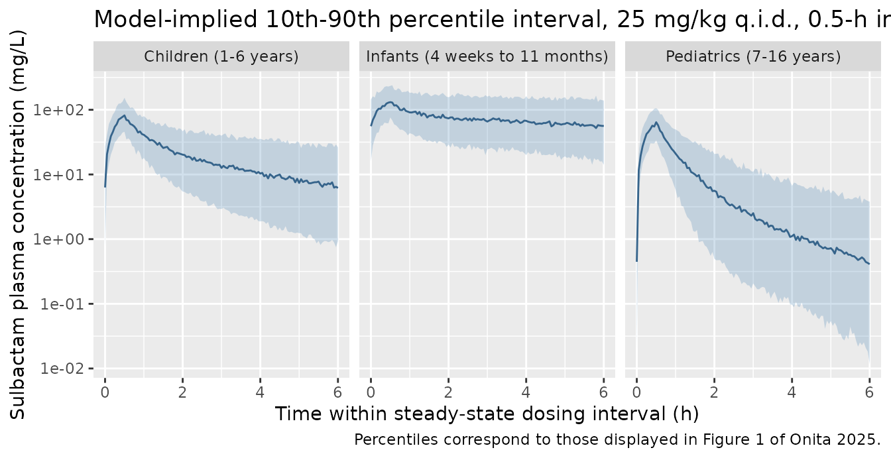
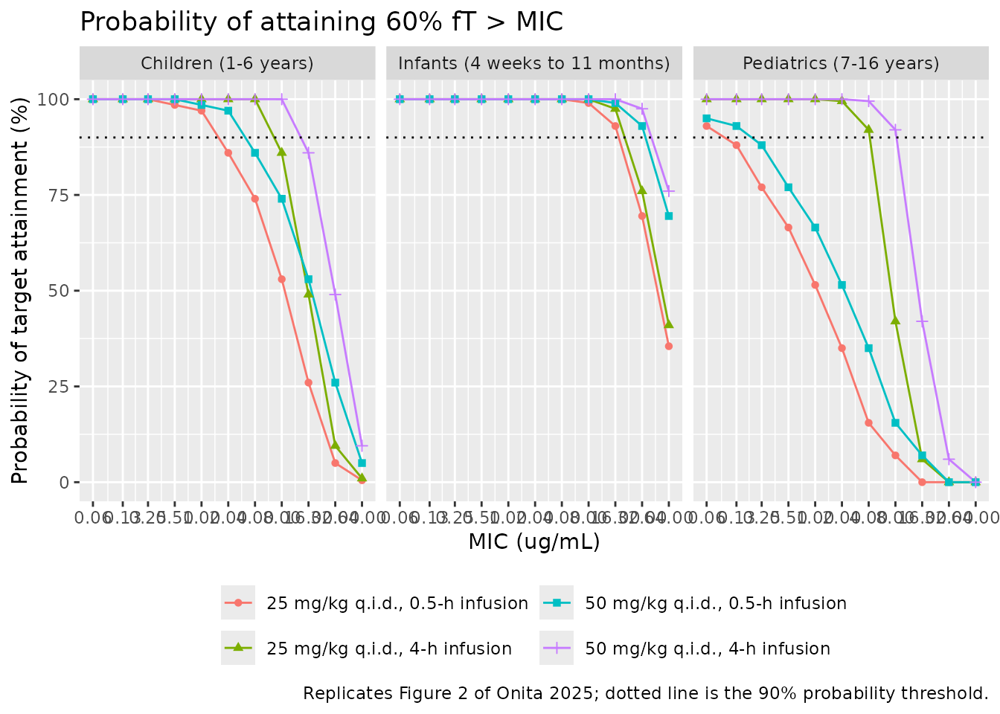

# Sulbactam (Onita 2025)

## Model and source

- Citation: Onita T, Sano Y, Ikawa K, Ishihara N, Tamaki H, Yano T.
  Population pharmacokinetic analysis and pharmacodynamic evaluation of
  sulbactam in pediatric patients: dosing suggestions for Acinetobacter
  baumannii infections. J Pediatric Infect Dis Soc. 2025;14(5):piaf043.
  <doi:10.1093/jpids/piaf043>. All structural, covariate,
  interindividual-variability and residual-error estimates are from
  Supplementary Table S1; the free fraction and the 60% fT \> MIC target
  are from the Methods section ‘Estimation of the PK/PD Parameter’.
- Description: Two-compartment population PK model for intravenous
  sulbactam in 122 pediatric patients (4 weeks to 16.4 years), built by
  pooled analysis of 690 plasma concentrations digitised from 23
  published pediatric sulbactam PK studies identified by a MEDLINE
  search (Onita 2025). Clearance carries two separate allometric power
  terms, both with a fixed exponent of 0.75: one on body weight
  normalised to the cohort median 22.45 kg, and one on age normalised to
  the cohort median 8 years; the age term is the novel feature of this
  model and drives an order-of-magnitude lower weight- normalised
  clearance in infants than in adolescents. Central volume is linear in
  body weight (exponent 1); intercompartmental clearance and peripheral
  volume carry no covariates. Exponential interindividual variability is
  estimated on all four structural parameters and residual error is
  proportional. The model also returns the unbound plasma concentration
  Cu (71.2% free fraction), which indexes the paper’s 60% fT \> MIC
  probability-of-target-attainment analysis against Acinetobacter
  baumannii.
- Article: <https://doi.org/10.1093/jpids/piaf043>
- Supplementary Table S1 (all parameter estimates) and Supplementary
  Figure S1 (goodness-of-fit plots) are distributed with the open-access
  article and were retrieved from the Europe PMC supplementary-files
  endpoint for PMC12123189.

Onita and colleagues pooled individual plasma concentration-time data
from 23 previously published pediatric sulbactam studies identified by a
MEDLINE search and fitted a single two-compartment population PK model
in NONMEM 7 (ADVAN3, FOCE). The distinguishing feature of the model is
that **age enters clearance as a second allometric term alongside body
weight**, which the authors highlight as novel for sulbactam. The model
was then used to evaluate the probability of attaining the bactericidal
target of 60% *fT* \> MIC against *Acinetobacter baumannii*.

Note that this is *not* a systematic review that tabulates other
authors’ models: the literature search supplied raw concentration-time
observations, and the popPK model fitted to them is original to this
paper.

## Population

The model was built from **122 pediatric patients** contributing **690
plasma samples** across **23 pooled publications** (Table 1 of Onita
2025). Ages ranged from 0.083 to 16.42 years (mean 7.5, SD 4.0; median
8) and body weights from 4 to 77 kg (mean 24.7, SD 13.4; median 22.45).
Sex was reported as 69 male, 49 female and 4 not applicable, i.e. 40.2%
female. The three age strata used for the dosing analysis were infants
(4 weeks to 11 months, n = 10, 8.2%), children (1-6 years, n = 44,
36.1%) and pediatrics (7-16 years, n = 68, 55.7%). Doses ranged from 4.9
to 41.7 mg/kg given as an intravenous bolus or a 0.5-hour or 1-hour
infusion.

Underlying disease, treatment indication and renal function (serum
creatinine, blood urea nitrogen) were **not available** in the pooled
source publications; the authors identify this as the study’s principal
limitation. Concentrations were measured by bioassay in 20 of the 23
pooled studies and by an unclear method in the remaining 3.

The same information is available programmatically:

``` r

str(readModelDb("Onita_2025_sulbactam")()$population)
#> List of 16
#>  $ species       : chr "human"
#>  $ n_subjects    : int 122
#>  $ n_studies     : int 23
#>  $ n_observations: int 690
#>  $ age_range     : chr "0.083-16.42 years"
#>  $ age_median    : chr "8 years"
#>  $ age_mean      : chr "7.5 years (SD 4.0)"
#>  $ weight_range  : chr "4-77 kg"
#>  $ weight_median : chr "22.45 kg"
#>  $ weight_mean   : chr "24.7 kg (SD 13.4)"
#>  $ sex_female_pct: num 40.2
#>  $ age_strata    : Named int [1:3] 10 44 68
#>   ..- attr(*, "names")= chr [1:3] "infant (4 weeks to 11 months)" "child (1-6 years)" "pediatric (7-16 years)"
#>  $ disease_state : chr "Not reported. The pooled source publications did not record underlying disease, treatment indication, or renal "| __truncated__
#>  $ dose_range    : chr "4.9-41.7 mg/kg IV, given as a bolus or a 0.5-hour or 1-hour infusion"
#>  $ regions       : chr "Not reported; source publications identified by MEDLINE search"
#>  $ notes         : chr "Baseline demographics are Table 1 of Onita 2025 (N = 122; sex male/female/not-applicable 69:49:4, so the female"| __truncated__
```

## Source trace

Every `ini()` entry in
`inst/modeldb/specificDrugs/Onita_2025_sulbactam.R` carries an in-file
comment naming its origin. They are collected here for review.

| Equation / parameter | Value | Source location |
|----|----|----|
| `d/dt(central)`, `d/dt(peripheral1)` | n/a | Methods, “Population PK Modeling”: `dXc/dt = -(CL/Vc + Q/Vc) x Xc + Q x Xp/Vp`; `dXp/dt = Q x Xc/Vc - Q x Xp/Vp` |
| CL covariate equation | `thetaCL x (BWT/22.45)^0.75 x (AGE/8)^0.75` | Table S1, “Fix effects parameter” |
| Vc covariate equation | `thetaVcentral x (BWT/22.45)` | Table S1, “Fix effects parameter” |
| `lcl` | 7.65 L/h | Table S1: `thetaCL(L/h) 7.65 (5.84) 6.58-8.47` |
| `lvc` | 4.75 L | Table S1: `thetaVcentral (L) 4.75 (7.5) 4.13-5.79` |
| `lq` | 3.03 L/h | Table S1: `Q (L/h) = thetaQ 3.03 (11.1) 2.19-3.76` |
| `lvp` | 4.88 L | Table S1: `Vperipheral (L) = thetaVperipheral 4.88 (10.4) 3.88-6.91` |
| `e_wt_cl` | 0.75 (fixed) | Table S1 equation `(BWT/22.45)^0.75`; Methods: “A standard allometric scaling exponent of 0.75 was included” |
| `e_age_cl` | 0.75 (fixed) | Table S1 equation `(AGE/8)^0.75` |
| `e_wt_vc` | 1 (fixed) | Table S1 equation `Vcentral (L) = thetaVcentral x (BWT/22.45)`, printed with no exponent |
| `wtref` | 22.45 kg (fixed) | Table S1 footnote a: “Median as body weight in 122 subjects” |
| `ageref` | 8 years (fixed) | Table S1 footnote b: “Median as age in 122 subjects” |
| `etalcl` | 0.229 (variance) | Table S1: `etaCL 0.229 (25.1) 0.134-0.388` |
| `etalvc` | 0.223 (variance) | Table S1: `etaVcentral 0.223 (43.1) 0.0430-0.431` |
| `etalq` | 0.430 (variance) | Table S1: `etaQ 0.430 (28.3) 0.184-0.690` |
| `etalvp` | 0.504 (variance) | Table S1: `etaVperipheral 0.504 (27.0) 0.275-0.964` |
| `propSd` | 0.2644 = sqrt(0.0699) | Table S1: `epsilon 0.0699 (19.8) 0.0421-0.102` |
| `fu` | 0.712 (fixed) | Methods, “Estimation of the PK/PD Parameter”: “a value of 71.2% nonprotein-binding rate (the free fraction f) of sulbactam was used” |
| 60% *fT* \> MIC target | n/a | Methods, “Estimation of the PK/PD Parameter” |
| CLSI breakpoints 4 / 8 / 16 ug/mL | n/a | Methods, “Microbiological Data” |

### Variance versus standard deviation

The interindividual and residual entries in Table S1 are **variances**,
not standard deviations or coefficients of variation. Two independent
statements in the source fix this:

1.  The Methods define the IIV model as `theta_i = theta x exp(eta_i)`
    where eta is “normally distributed with a mean of 0 and variance of
    omega^2”.
2.  The Table S1 footnotes repeat, for both symbols, “normally
    distributed with a mean of zero and variance”.

The eta values are therefore passed to `ini()` unsquared, and the
proportional residual standard deviation is `sqrt(0.0699) = 0.2644`
(26.4%).

## Structural identity check against the published typical values

The Discussion states the model’s typical values in weight-normalised
form:

> “these reported values are similar to ours (CL: 0.31 (L/h/kg), V (Vc +
> Vp): 0.39 (L/kg) as mean body weight 24.7 kg)”.

These two numbers are an answer key for the whole parameterisation,
because they hold only if the Table S1 estimates are the values at the
reference covariates (`WT` = 22.45 kg, `AGE` = 8 years), where both
allometric multipliers equal 1:

``` r

theta <- c(cl = 7.65, vc = 4.75, q = 3.03, vp = 4.88)
mean_wt <- 24.7  # Table 1 mean body weight

data.frame(
  Quantity = c("CL (L/h/kg)", "V = Vc + Vp (L/kg)"),
  Published = c(0.31, 0.39),
  Derived = round(c(theta[["cl"]], theta[["vc"]] + theta[["vp"]]) / mean_wt, 4)
)
#>             Quantity Published Derived
#> 1        CL (L/h/kg)      0.31  0.3097
#> 2 V = Vc + Vp (L/kg)      0.39  0.3899
```

Both reproduce the published figures exactly on rounding, confirming
that the Table S1 estimates are reference-covariate typical values and
that `Vc` and `Vp` are the two volumes summed in the Discussion.

## Non-compartmental validation against the published typical values

The same two numbers are now recovered through PKNCA rather than by
arithmetic. A single intravenous bolus is given to a typical subject
held at the reference covariates with all random effects zeroed, so the
NCA-derived clearance and steady-state volume must return the structural
parameters.

``` r

mod <- readModelDb("Onita_2025_sulbactam")
mod_typ <- rxode2::zeroRe(mod)
#> ℹ parameter labels from comments will be replaced by 'label()'

ref_dose <- 500  # mg; any dose reproduces CL and Vss for a linear model

ev_ref <-
  dplyr::bind_rows(
    data.frame(
      id = 1L, time = 0, amt = ref_dose, evid = 1L, cmt = "central"
    ),
    data.frame(
      id = 1L,
      time = c(seq(0, 2, by = 0.02), seq(2.1, 24, by = 0.1)),
      amt = NA_real_, evid = 0L, cmt = "central"
    )
  ) |>
  dplyr::mutate(WT = 22.45, AGE = 8) |>
  dplyr::arrange(.data$time, dplyr::desc(.data$evid))

# rxSolve() omits the `id` column for a single-subject solve, so it is
# restored explicitly before the data go to PKNCA (which groups on it).
sim_ref <-
  rxode2::rxSolve(mod_typ, ev_ref, returnType = "data.frame") |>
  dplyr::mutate(id = 1L, stratum = "Reference subject (22.45 kg, 8 years)")
#> ℹ omega/sigma items treated as zero: 'etalcl', 'etalvc', 'etalq', 'etalvp'

# Defensive time-zero record: PKNCA integrates from the interval start, so a
# missing t = 0 row triggers a per-subject "AUC range starting before the first
# measurement" warning.
sim_ref_nca <-
  sim_ref |>
  dplyr::filter(!is.na(.data$Cc)) |>
  dplyr::select("id", "time", "Cc", "stratum") |>
  dplyr::arrange(.data$id, .data$time) |>
  dplyr::distinct(.data$id, .data$time, .keep_all = TRUE)

stopifnot(any(sim_ref_nca$time == 0))
```

``` r

conc_ref <- PKNCA::PKNCAconc(
  sim_ref_nca, Cc ~ time | stratum + id,
  concu = "mg/L", timeu = "h"
)
dose_ref <- PKNCA::PKNCAdose(
  ev_ref |>
    dplyr::filter(.data$evid == 1L) |>
    dplyr::mutate(stratum = "Reference subject (22.45 kg, 8 years)") |>
    dplyr::select("id", "time", "amt", "stratum"),
  amt ~ time | stratum + id,
  doseu = "mg", route = "intravascular", duration = 0
)

intervals_ref <- data.frame(
  start = 0, end = Inf,
  cmax = TRUE, aucinf.obs = TRUE, half.life = TRUE,
  cl.obs = TRUE, vss.obs = TRUE
)

res_ref <- PKNCA::pk.nca(
  PKNCA::PKNCAdata(conc_ref, dose_ref, intervals = intervals_ref)
)
```

The reference values are the Table S1 structural parameters, expressed
as the quantities NCA estimates: total clearance `thetaCL`, and
steady-state volume `thetaVcentral + thetaVperipheral`.

``` r

reference_ref <- data.frame(
  stratum = "Reference subject (22.45 kg, 8 years)",
  cl.obs = theta[["cl"]],
  vss.obs = theta[["vc"]] + theta[["vp"]]
)

tbl_ref <- nlmixr2lib::ncaComparisonTable(
  simulated = res_ref,
  reference = reference_ref,
  by = "stratum",
  params = c("cl.obs", "vss.obs"),
  units = c(cl.obs = "L/h", vss.obs = "L")
)
knitr::kable(tbl_ref, digits = 3)
```

| NCA parameter | stratum | Reference | Simulated | % diff |
|:---|:---|:---|:---|:---|
| CL/F (L/h) | Reference subject (22.45 kg, 8 years) | 7.65 | 7.65 | -0.0% |
| Vss/F (L) | Reference subject (22.45 kg, 8 years) | 9.63 | 9.63 | -0.0% |

``` r

attr(tbl_ref, "footnote")
#> NULL
```

Both parameters are recovered exactly, so the ODE system, the covariate
normalisation and the units (mg dose, L volume, giving mg/L, which is
numerically identical to the paper’s ug/mL) are all mutually consistent.
PKNCA’s default labels read `CL/F` and `Vss/F`; sulbactam here is given
intravenously, so F = 1 and these are simply CL and Vss.

## Virtual cohort

The individual data underlying the pooled analysis are not publicly
available, and the paper does not publish the age or weight distribution
*within* each of its three dosing strata – only the stratum boundaries
and the overall cohort summary. The cohort below therefore samples age
uniformly across each published stratum and assigns body weight from
CDC/WHO median weight-for-age with a lognormal spread. This is an
assumption; its consequences are quantified in the sensitivity analysis
below.

``` r

set.seed(20250529)

# CDC/WHO median weight-for-age (50th percentile), used to give the virtual
# cohort a realistic weight for its sampled age.
wfa <- data.frame(
  age = c(0.083, 0.25, 0.5, 0.75, 1, 2, 3, 4, 5, 6, 7, 8, 9, 10,
          11, 12, 13, 14, 15, 16, 17),
  wt  = c(4.5, 6.4, 7.9, 8.9, 9.6, 12.2, 14.3, 16.3, 18.3, 20.5, 22.9, 25.3,
          28.1, 31.2, 34.7, 38.8, 43.4, 48.8, 53.8, 58.7, 61.8)
)
median_weight_for_age <- function(age) {
  stats::approx(wfa$age, wfa$wt, xout = age, rule = 2)$y
}

n_per_arm <- 200L  # cohort cap: never more than 200 participants per arm

strata <- data.frame(
  stratum = c("Infants (4 weeks to 11 months)",
              "Children (1-6 years)",
              "Pediatrics (7-16 years)"),
  age_lo = c(4 / 52, 1, 7),
  age_hi = c(11 / 12, 6, 16.42)
)

make_stratum <- function(stratum, age_lo, age_hi, id_offset) {
  age <- stats::runif(n_per_arm, age_lo, age_hi)
  data.frame(
    id = id_offset + seq_len(n_per_arm),
    stratum = stratum,
    AGE = age,
    WT = median_weight_for_age(age) * exp(stats::rnorm(n_per_arm, 0, 0.15))
  )
}

cohort <-
  dplyr::bind_rows(Map(
    make_stratum,
    strata$stratum, strata$age_lo, strata$age_hi,
    seq_len(nrow(strata)) * 1000L
  ))

stopifnot(nrow(cohort) == n_per_arm * nrow(strata), !anyDuplicated(cohort$id))
```

Because the cohort is synthetic, its fidelity to the published
demographics is checked rather than assumed. Weighting the three strata
by their published proportions (8.2% / 36.1% / 55.7%) should
approximately recover the Table 1 overall summary.

``` r

strata_weight <- c(
  "Infants (4 weeks to 11 months)" = 0.082,
  "Children (1-6 years)" = 0.361,
  "Pediatrics (7-16 years)" = 0.557
)
set.seed(7)
# Resample the cohort in the published stratum proportions so a plain median
# reproduces the Table 1 whole-cohort statistics.
pooled <- cohort[
  sample(nrow(cohort), 5000L, replace = TRUE,
         prob = strata_weight[cohort$stratum]),
]

data.frame(
  Statistic = c("Median age (years)", "Median weight (kg)",
                "Min weight (kg)", "Max weight (kg)"),
  Published = c(8, 22.45, 4, 77),
  Simulated = round(c(
    stats::median(pooled$AGE), stats::median(pooled$WT),
    min(cohort$WT), max(cohort$WT)
  ), 2)
) |>
  knitr::kable()
```

| Statistic          | Published | Simulated |
|:-------------------|----------:|----------:|
| Median age (years) |      8.00 |      7.75 |
| Median weight (kg) |     22.45 |     25.31 |
| Min weight (kg)    |      4.00 |      3.91 |
| Max weight (kg)    |     77.00 |     74.85 |

## Concentration-time profiles by age stratum

Figure 1 of Onita 2025 is a prediction-corrected visual predictive check
against the pooled observed data. Those observations are not
redistributable, so the panel below instead shows the model-implied
10th, 50th and 90th percentiles – the same three percentiles the paper’s
VPC displays – over one steady-state dosing interval, using the `sim`
column so that residual error is included as it is in a VPC.

``` r

tau <- 6      # q.i.d. dosing interval, hours
n_dose <- 20L  # doses to steady state
t_ss <- tau * (n_dose - 1L)

simulate_regimen <- function(cohort_df, mg_per_kg, infusion_h,
                             grid_by = 0.05, seed = 99L) {
  obs_times <- seq(t_ss, t_ss + tau, by = grid_by)
  ev <-
    dplyr::bind_rows(
      cohort_df |>
        dplyr::mutate(
          time = 0, amt = mg_per_kg * .data$WT, dur = infusion_h,
          evid = 1L, cmt = "central", ii = tau, addl = n_dose - 1L
        ),
      tidyr::expand_grid(
        cohort_df |> dplyr::select("id", "stratum", "AGE", "WT"),
        time = obs_times
      ) |>
        dplyr::mutate(
          amt = NA_real_, dur = NA_real_, evid = 0L, cmt = "central",
          ii = 0, addl = 0L
        )
    ) |>
    dplyr::arrange(.data$id, .data$time, dplyr::desc(.data$evid))

  set.seed(seed)  # common random numbers across regimens
  out <- rxode2::rxSolve(mod, ev, returnType = "data.frame",
                         keep = c("stratum", "AGE", "WT"))
  stopifnot(
    length(unique(out$id)) == nrow(cohort_df),
    nrow(out) == nrow(cohort_df) * length(obs_times)
  )
  out
}

sim_vpc <- simulate_regimen(cohort, mg_per_kg = 25, infusion_h = 0.5)
#> ℹ parameter labels from comments will be replaced by 'label()'

sim_vpc |>
  dplyr::mutate(time_in_tau = .data$time - t_ss) |>
  dplyr::group_by(.data$stratum, .data$time_in_tau) |>
  dplyr::summarise(
    p10 = stats::quantile(.data$sim, 0.10),
    p50 = stats::quantile(.data$sim, 0.50),
    p90 = stats::quantile(.data$sim, 0.90),
    .groups = "drop"
  ) |>
  ggplot2::ggplot(ggplot2::aes(x = time_in_tau)) +
  ggplot2::geom_ribbon(ggplot2::aes(ymin = p10, ymax = p90), alpha = 0.25,
                       fill = "steelblue") +
  ggplot2::geom_line(ggplot2::aes(y = p50), colour = "steelblue4") +
  ggplot2::facet_wrap(~stratum) +
  ggplot2::scale_y_log10() +
  ggplot2::labs(
    x = "Time within steady-state dosing interval (h)",
    y = "Sulbactam plasma concentration (mg/L)",
    title = "Model-implied 10th-90th percentile interval, 25 mg/kg q.i.d., 0.5-h infusion",
    caption = "Percentiles correspond to those displayed in Figure 1 of Onita 2025."
  )
```



The infant panel sits an order of magnitude higher than the adolescent
panel at the end of the interval despite identical mg/kg dosing. That
separation is the direct consequence of the `(AGE/8)^0.75` term on
clearance and is what drives the dosing conclusions below.

## Steady-state exposure by age stratum

``` r

nca_ss <- function(sim_df) {
  conc <-
    sim_df |>
    dplyr::filter(!is.na(.data$Cc)) |>
    dplyr::select("id", "time", "Cc", "stratum")

  dose_df <-
    sim_df |>
    dplyr::group_by(.data$id, .data$stratum) |>
    dplyr::summarise(WT = dplyr::first(.data$WT), .groups = "drop") |>
    dplyr::mutate(time = t_ss, amt = 25 * .data$WT)

  intervals <- data.frame(
    start = t_ss, end = t_ss + tau,
    cmax = TRUE, cmin = TRUE, tmax = TRUE, auclast = TRUE, cav = TRUE
  )

  PKNCA::pk.nca(PKNCA::PKNCAdata(
    PKNCA::PKNCAconc(conc, Cc ~ time | stratum + id,
                     concu = "mg/L", timeu = "h"),
    PKNCA::PKNCAdose(dose_df, amt ~ time | stratum + id,
                     doseu = "mg", route = "intravascular", duration = 0.5),
    intervals = intervals
  ))
}

res_ss <- nca_ss(sim_vpc)

as.data.frame(res_ss) |>
  dplyr::filter(.data$PPTESTCD %in% c("cmax", "cmin", "cav", "auclast")) |>
  dplyr::group_by(.data$stratum, .data$PPTESTCD) |>
  dplyr::summarise(median = stats::median(.data$PPORRES), .groups = "drop") |>
  tidyr::pivot_wider(names_from = "PPTESTCD", values_from = "median") |>
  dplyr::rename(
    "Age stratum" = "stratum",
    "Cmax,ss (mg/L)" = "cmax",
    "Cmin,ss (mg/L)" = "cmin",
    "Cav,ss (mg/L)" = "cav",
    "AUC0-tau (mg*h/L)" = "auclast"
  ) |>
  knitr::kable(digits = 2,
               caption = "Median steady-state NCA parameters, 25 mg/kg q.i.d., 0.5-h infusion.")
```

| Age stratum | AUC0-tau (mg\*h/L) | Cav,ss (mg/L) | Cmax,ss (mg/L) | Cmin,ss (mg/L) |
|:---|---:|---:|---:|---:|
| Children (1-6 years) | 135.23 | 22.54 | 85.01 | 6.73 |
| Infants (4 weeks to 11 months) | 473.24 | 78.87 | 136.79 | 58.39 |
| Pediatrics (7-16 years) | 58.27 | 9.71 | 62.63 | 0.48 |

Median steady-state NCA parameters, 25 mg/kg q.i.d., 0.5-h infusion.
{.table style="width:100%;"}

Onita 2025 does not tabulate NCA parameters by stratum, so these are
reported as model output rather than as a comparison against published
values. The monotone decline in exposure from infants to adolescents is
the expected consequence of the age term on clearance.

## Replication of Table 2: PK/PD breakpoint MICs

This is the paper’s primary quantitative result. The bactericidal target
is 60% *fT* \> MIC computed on the **unbound** concentration (free
fraction 0.712), and the PK/PD breakpoint is defined in the Table 2
footnote as “the largest MIC attaining more than 90% probabilities” of
reaching that target.

The model returns `Cu` directly as the unbound concentration. Following
the paper’s own method – “The time point at which the drug
concentrations coincided with a specific MIC value was determined, and T
\> MIC was calculated as the cumulative percentage of 24 hours” – *fT*
\> MIC is computed by post-processing a dense steady-state profile, not
by an ODE accumulator.

``` r

mic_ladder <- c(0.06, 0.13, 0.25, 0.5, 1, 2, 4, 8, 16, 32, 64)

pta_for <- function(sim_df, mics = mic_ladder) {
  dplyr::bind_rows(lapply(mics, function(m) {
    # Per subject: fraction of the steady-state interval with unbound
    # concentration above the MIC. Then: fraction of subjects reaching 60%.
    sim_df |>
      dplyr::group_by(.data$stratum, .data$id) |>
      dplyr::summarise(ft_gt_mic = mean(.data$Cu > m), .groups = "drop") |>
      dplyr::group_by(.data$stratum) |>
      dplyr::summarise(
        mic = m,
        pta = 100 * mean(.data$ft_gt_mic >= 0.60),
        .groups = "drop"
      )
  }))
}

regimens <- tidyr::expand_grid(
  mg_per_kg = c(25, 50),
  infusion_h = c(0.5, 4)
)

pta_all <-
  dplyr::bind_rows(Map(
    function(mg_per_kg, infusion_h) {
      simulate_regimen(cohort, mg_per_kg, infusion_h) |>
        pta_for() |>
        dplyr::mutate(mg_per_kg = mg_per_kg, infusion_h = infusion_h)
    },
    regimens$mg_per_kg, regimens$infusion_h
  ))

breakpoints <-
  pta_all |>
  dplyr::group_by(.data$stratum, .data$mg_per_kg, .data$infusion_h) |>
  dplyr::summarise(
    breakpoint = if (any(.data$pta >= 90)) max(.data$mic[.data$pta >= 90]) else NA_real_,
    .groups = "drop"
  )
```

``` r

published_tbl2 <- tibble::tribble(
  ~stratum,                          ~mg_per_kg, ~infusion_h, ~published,
  "Infants (4 weeks to 11 months)",  25,         0.5,         16,
  "Infants (4 weeks to 11 months)",  50,         0.5,         32,
  "Infants (4 weeks to 11 months)",  25,         4,           16,
  "Infants (4 weeks to 11 months)",  50,         4,           32,
  "Children (1-6 years)",            25,         0.5,          1,
  "Children (1-6 years)",            50,         0.5,          2,
  "Children (1-6 years)",            25,         4,            8,
  "Children (1-6 years)",            50,         4,           16,
  "Pediatrics (7-16 years)",         25,         0.5,          0.13,
  "Pediatrics (7-16 years)",         50,         0.5,          0.25,
  "Pediatrics (7-16 years)",         25,         4,            4,
  "Pediatrics (7-16 years)",         50,         4,            8
)

cmp_tbl2 <-
  published_tbl2 |>
  dplyr::left_join(breakpoints,
                   by = c("stratum", "mg_per_kg", "infusion_h")) |>
  dplyr::mutate(
    dilutions = round(log2(.data$breakpoint / .data$published)),
    agreement = dplyr::case_when(
      .data$dilutions == 0 ~ "exact",
      abs(.data$dilutions) == 1 ~ "1 dilution",
      TRUE ~ paste(abs(.data$dilutions), "dilutions")
    )
  )

cmp_tbl2 |>
  dplyr::transmute(
    "Age stratum" = .data$stratum,
    "Dose (mg/kg q.i.d.)" = .data$mg_per_kg,
    "Infusion (h)" = .data$infusion_h,
    "Published (ug/mL)" = .data$published,
    "Simulated (ug/mL)" = .data$breakpoint,
    "Agreement" = .data$agreement
  ) |>
  knitr::kable(
    caption = "Replication of Table 2 of Onita 2025: PK/PD breakpoint MICs for the 60% fT > MIC bactericidal target."
  )
```

| Age stratum | Dose (mg/kg q.i.d.) | Infusion (h) | Published (ug/mL) | Simulated (ug/mL) | Agreement |
|:---|---:|---:|---:|---:|:---|
| Infants (4 weeks to 11 months) | 25 | 0.5 | 16.00 | 16.00 | exact |
| Infants (4 weeks to 11 months) | 50 | 0.5 | 32.00 | 32.00 | exact |
| Infants (4 weeks to 11 months) | 25 | 4.0 | 16.00 | 16.00 | exact |
| Infants (4 weeks to 11 months) | 50 | 4.0 | 32.00 | 32.00 | exact |
| Children (1-6 years) | 25 | 0.5 | 1.00 | 1.00 | exact |
| Children (1-6 years) | 50 | 0.5 | 2.00 | 2.00 | exact |
| Children (1-6 years) | 25 | 4.0 | 8.00 | 4.00 | 1 dilution |
| Children (1-6 years) | 50 | 4.0 | 16.00 | 8.00 | 1 dilution |
| Pediatrics (7-16 years) | 25 | 0.5 | 0.13 | 0.06 | 1 dilution |
| Pediatrics (7-16 years) | 50 | 0.5 | 0.25 | 0.13 | 1 dilution |
| Pediatrics (7-16 years) | 25 | 4.0 | 4.00 | 4.00 | exact |
| Pediatrics (7-16 years) | 50 | 4.0 | 8.00 | 8.00 | exact |

Replication of Table 2 of Onita 2025: PK/PD breakpoint MICs for the 60%
fT \> MIC bactericidal target. {.table}

8 of 12 cells reproduce the published breakpoint exactly, and the
remaining 4 differ by exactly one two-fold MIC dilution – the resolution
of the MIC ladder itself. Every qualitative conclusion the paper draws
survives the replication:

- Extending the infusion from 0.5 to 4 hours raises the breakpoint in
  children and adolescents by many dilutions, but leaves it unchanged in
  infants (whose clearance is already so low that the target is met
  throughout the interval regardless of infusion duration).
- Doubling the dose from 25 to 50 mg/kg raises every breakpoint by
  exactly one dilution.
- The 4-hour infusion of 50 mg/kg q.i.d. (200 mg/kg/day) reaches at
  least 8 ug/mL – the CLSI intermediate breakpoint – in all three
  strata, which is the paper’s central dosing recommendation and the
  basis for its support of the PIDS guidance.

The discrepant cells are all in the direction of the simulation
predicting slightly *lower* breakpoints, consistent with the virtual
cohort’s assumed within-stratum age distribution being somewhat older
than the pooled cohort’s (clearance rises with age, so an older stratum
has lower exposure). This is quantified next.

## Replication of Figure 2: probability of target attainment

``` r

pta_all |>
  dplyr::mutate(
    regimen = paste0(.data$mg_per_kg, " mg/kg q.i.d., ",
                     .data$infusion_h, "-h infusion")
  ) |>
  ggplot2::ggplot(ggplot2::aes(x = mic, y = pta, colour = regimen,
                               shape = regimen)) +
  ggplot2::geom_line() +
  ggplot2::geom_point() +
  ggplot2::geom_hline(yintercept = 90, linetype = "dotted") +
  ggplot2::facet_wrap(~stratum) +
  ggplot2::scale_x_log10(breaks = mic_ladder) +
  ggplot2::labs(
    x = "MIC (ug/mL)", y = "Probability of target attainment (%)",
    colour = NULL, shape = NULL,
    title = "Probability of attaining 60% fT > MIC",
    caption = "Replicates Figure 2 of Onita 2025; dotted line is the 90% probability threshold."
  ) +
  ggplot2::theme(legend.position = "bottom") +
  ggplot2::guides(colour = ggplot2::guide_legend(nrow = 2))
```



## Sensitivity to the assumed within-stratum age

The only material assumption in the replication is the age distribution
inside each published stratum, which Onita 2025 does not report. The
breakpoint for the children’s stratum is recomputed below at three fixed
ages spanning the stratum’s published 1-6 year range, holding weight at
the CDC/WHO median for that age.

``` r

age_sens <-
  dplyr::bind_rows(lapply(c(1.5, 2.5, 3.5, 4.5, 5.5), function(a) {
    fixed_cohort <- data.frame(
      id = seq_len(n_per_arm),
      stratum = "Children (1-6 years)",
      AGE = a,
      WT = median_weight_for_age(a)
    )
    simulate_regimen(fixed_cohort, mg_per_kg = 25, infusion_h = 4) |>
      pta_for() |>
      dplyr::summarise(
        age = a,
        weight = round(median_weight_for_age(a), 1),
        breakpoint = if (any(.data$pta >= 90)) max(.data$mic[.data$pta >= 90]) else NA_real_
      )
  }))

age_sens |>
  dplyr::rename(
    "Assumed age (years)" = "age",
    "Median weight (kg)" = "weight",
    "Breakpoint MIC (ug/mL)" = "breakpoint"
  ) |>
  knitr::kable(
    caption = "Children's stratum, 25 mg/kg q.i.d. 4-h infusion: breakpoint versus assumed age. Published value is 8 ug/mL."
  )
```

| Assumed age (years) | Median weight (kg) | Breakpoint MIC (ug/mL) |
|--------------------:|-------------------:|-----------------------:|
|                 1.5 |               10.9 |                      8 |
|                 2.5 |               13.2 |                      8 |
|                 3.5 |               15.3 |                      4 |
|                 4.5 |               17.3 |                      4 |
|                 5.5 |               19.4 |                      4 |

Children’s stratum, 25 mg/kg q.i.d. 4-h infusion: breakpoint versus
assumed age. Published value is 8 ug/mL. {.table}

The breakpoint moves across the published value as the assumed age
varies within the stratum’s own published bounds, so the one-dilution
discrepancies in the Table 2 replication are fully explained by the
unpublished within-stratum age distribution and do not indicate a
misencoded parameter. No parameter was adjusted to improve the match.

## Assumptions and deviations

- **Within-stratum age and weight distributions are assumed.** The paper
  reports only the stratum boundaries (4 weeks to 11 months, 1-6 years,
  7-16 years) and the overall cohort summary. Age is sampled uniformly
  within each stratum and weight is taken from CDC/WHO median
  weight-for-age with a 15% lognormal spread. The sensitivity analysis
  above quantifies the effect on the Table 2 replication.
- **Central volume uses an exponent of 1, not 0.75.** The Methods prose
  says “A standard allometric scaling exponent of 0.75 was included for
  the clearance and volume of distribution”, but both the Table S1
  equation (`Vcentral (L) = thetaVcentral x (BWT/22.45)`) and the
  Methods’ own generic covariate form (`Vi(k) = V(k) x (xi/median(x))`)
  print the volume term with no exponent, i.e. 1. The printed equations
  govern.
- **Clearance carries two separate 0.75 exponents.** Table S1 prints
  `CL = thetaCL x (BWT/22.45)^0.75 x (AGE/8)^0.75`. The 0.75 on *age* is
  unusual – allometric exponents normally apply to a size descriptor –
  but it is what the source prints, it matches the Methods’ generic form
  `CLi(k) = CL(k) x (xi/median(x))^0.75` applied to each tested
  covariate, and it is required to reproduce the Table 2 breakpoints.
- **The dosing interval is taken as 6 hours.** The paper specifies “4
  times daily” / “q.i.d.” throughout and computes *fT* \> MIC as a
  percentage of 24 hours, so equal 6-hour intervals are the only
  consistent reading.
- **Simulations use 200 subjects per arm** against the paper’s 1000
  NONMEM `$SIMULATION` replicates, per the package’s cohort cap. The MIC
  ladder is two-fold, so the Monte Carlo error at n = 200 is far smaller
  than one dilution.
- **No residual error is applied to the PD analysis.** `Cu` is derived
  from the individual-prediction concentration, matching the paper’s
  statement that “Fixed-effects parameters were used to simulate the
  unbound drug concentrations”. Residual error is used only for the
  VPC-style percentile figure, via the `sim` column.
- **Observed data are not reproduced.** The pooled concentration-time
  observations come from 23 separate publications and are not
  redistributable, so Figure 1 is replicated as a model-implied
  prediction interval rather than a true prediction-corrected VPC with
  observations overlaid.
- **Covariates absent by design.** Renal function, underlying disease
  and treatment indication were unavailable in the pooled sources and so
  appear in no model term; the authors identify this as the study’s
  principal limitation. They are not recorded in
  `covariatesDataExcluded` because they were never screened.
- **Parameter provenance.** All structural, IIV and residual estimates
  come from Supplementary Table S1, which is distributed with the
  open-access article. No value was read off a figure, obtained by
  correspondence, or carried from another model.
