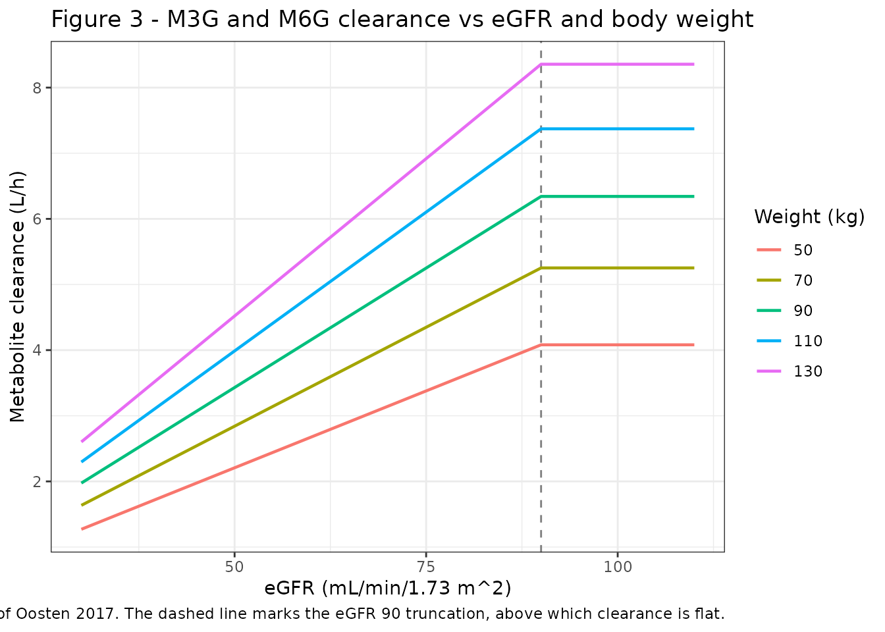
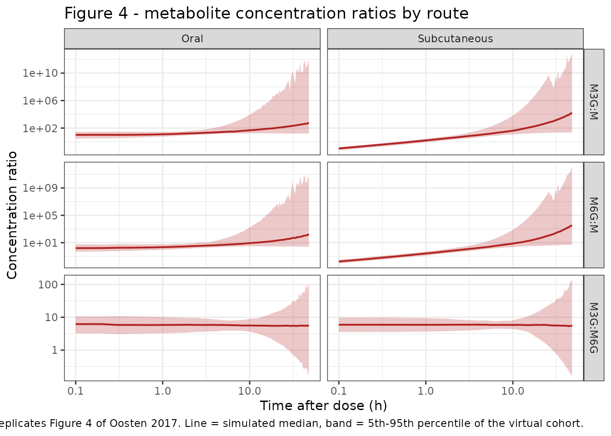
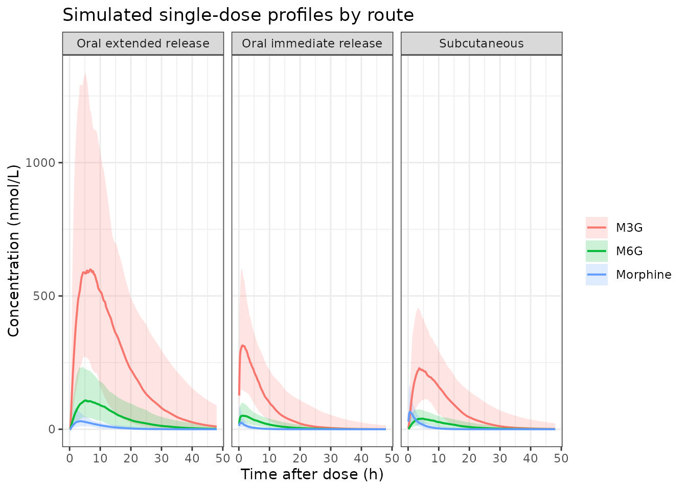

# Morphine, M3G and M6G (Oosten 2017)

## Model and source

- Citation: Oosten AW, Abrantes JA, Jonsson S, Matic M, van Schaik RHN,
  de Bruijn P, van der Rijt CCD, Mathijssen RHJ. A Prospective
  Population Pharmacokinetic Study on Morphine Metabolism in Cancer
  Patients. Clin Pharmacokinet. 2017;56(6):649-659 (published online 5
  November 2016). <doi:10.1007/s40262-016-0471-7>.
- Description: Joint parent-metabolite population PK model for morphine
  and its two glucuronide metabolites (M3G, M6G) in 49 adult cancer
  patients treated for nociceptive cancer pain (Oosten 2017). Morphine:
  one-compartment disposition with three parallel first-order absorption
  routes (subcutaneous, oral immediate release, oral extended release
  with a lag time); the subcutaneous route is assumed completely
  bioavailable and the oral routes carry an extensive first pass. The
  oral first pass is a four-way partition of the absorbed dose -
  unchanged morphine, M3G, M6G and a residual lost fraction -
  parameterised as odds against the unchanged route, which is what makes
  oral bioavailability (0.372) and the first-pass metabolite fractions
  (0.355 for M3G, 0.0631 for M6G) sum to at most one by construction.
  M3G and M6G are each one-compartment models fed both by this oral
  first pass and by fixed-fraction transformation of systemic morphine
  clearance (0.57 to M3G, 0.10 to M6G, both fixed from literature); the
  two metabolites share a single estimated clearance and volume and
  differ only in how much of them is formed. Allometric body weight with
  theory-based exponents is applied a priori to every disposition
  parameter of every entity, and metabolite clearance rises linearly
  with estimated glomerular filtration rate up to a plateau at 90
  mL/min/1.73 m^2. All amounts are nmol of the free base and all
  concentrations nmol/L, so the 1:1 molar conversion of morphine to each
  glucuronide needs no molecular-weight factor.
- Article: <https://doi.org/10.1007/s40262-016-0471-7>
- Supplement (SIR procedure, observation plots): retrieved from
  EuropePMC `PMC5488155` supplementary files; it contains no parameter
  values beyond the main text.

Oosten 2017 fitted morphine together with its two glucuronide
metabolites in one NONMEM run, so the whole paper is a single coupled
model and is packaged as a single model file.

## Population

410 plasma samples from 49 adults admitted to the Erasmus MC Cancer
Institute (Rotterdam) with moderate to severe nociceptive cancer-related
pain, enrolled February 2010 to March 2014 (Dutch Trial Register
NTR4369). Median age 60 years (38-80), median weight 83 kg (53-140), 45%
female, 90% Caucasian; 89% had distant metastases and the median WHO
performance status was 2. Median baseline creatinine was 72 umol/L
(25-190) and median eGFR 81 mL/min/1.73 m^2, with values above 90
truncated at 90 and seven patients between 33 and 57 (Oosten 2017 Table
2).

During sampling 57% of patients received subcutaneous morphine only, 24%
oral extended-release plus immediate-release, 12% oral immediate-release
only, and 6% both oral and subcutaneous consecutively. Median doses were
2 mg/h subcutaneously (0.6-14 mg/h), 40 mg twice daily orally as
extended release (10-150 mg) and 10 mg as immediate release (5-60 mg).

The same information is available programmatically via
`readModelDb("Oosten_2017_morphine")()$population`.

## Model structure

Morphine follows one-compartment disposition fed by three parallel
first-order absorption routes. The subcutaneous route is assumed
completely bioavailable; both oral routes pass through an extensive
first pass that splits the absorbed dose four ways at a single point –
unchanged morphine into the central compartment, M3G and M6G straight
into their own compartments, and a residual fraction lost. M3G and M6G
are each one-compartment models that additionally receive fixed
fractions of systemic morphine clearance. They share a single estimated
clearance and a single estimated volume and differ only in how much of
each is formed, and in their independent random effects.

Table 3 footnote b parameterises the first-pass split as odds against
the route delivering unchanged morphine:

    F_oral   = 1      / (1 + theta1 + theta2 + theta3)
    F1p,M3G  = theta2 / (1 + theta1 + theta2 + theta3)
    F1p,M6G  = theta1 / (1 + theta1 + theta2 + theta3)

which is what makes the shares sum to at most one by construction – the
constraint the Methods describe. The model file keeps the thetas primary
(as `lfprat_m3g`, `lfprat_m6g`, `lfprat_other`) because the published
random effects sit on `theta1` and `theta3` and propagate non-linearly
to all four shares through the shared denominator; an eta placed on a
derived fraction could not reproduce that structure.

All amounts are nmol of morphine free base and all concentrations are
nmol/L (Methods 2.4), so the 1:1 molar conversion of morphine into each
glucuronide needs no molecular-weight factor.

## Source trace

Every `ini()` entry in
`inst/modeldb/specificDrugs/Oosten_2017_morphine.R` carries an in-file
comment naming its origin. They are collected here for review.

| Equation / parameter | Value | Source location |
|----|----|----|
| `ltlag_er` | 0.25 h (fixed) | Table 3, `t lag, ER` |
| `lka_sc` | 3.96 /h (fixed) | Table 3, `k a, SC`; literature value, refs 27-28 |
| `lka_oral_ir` | 6.00 /h (fixed) | Table 3, `k a, IR`; literature value, refs 27-28 |
| `lka_oral_er` | 0.221 /h | Table 3, `k a, ER` (RSE 17.7%, CI 0.155-0.306) |
| `lfprat_m3g` | 0.953 | Table 3, `theta 2` (RSE 8.95%, CI 0.796-1.14) |
| `lfprat_m6g` | 0.170 | Table 3, `theta 1` (RSE 10.4%, CI 0.136-0.206) |
| `lfprat_other` | 0.565 | Table 3, `theta 3` (RSE 30.3%, CI 0.310-1.01) |
| derived `F_oral` = 1/(1+t1+t2+t3) | 0.372 | Table 3 footnote b and row `F oral` |
| derived `F1p,M3G` = t2/(1+t1+t2+t3) | 0.355 | Table 3 footnote b and row `F 1p, M3G` |
| derived `F1p,M6G` = t1/(1+t1+t2+t3) | 0.0631 | Table 3 footnote b and row `F 1p, M6G` |
| `lcl` | 91.9 L/h | Table 3, `CL 70kg` (RSE 3.91%, CI 85.8-99.9) |
| `lvc` | 278 L | Table 3, `V 70kg` (RSE 12.3%, CI 221-351) |
| `e_wt_cl`, `e_wt_cl_m3g`, `e_wt_cl_m6g` | 0.75 (fixed) | Table 3 footnote c |
| `e_wt_vc`, `e_wt_vc_m3g`, `e_wt_vc_m6g` | 1 (fixed) | Table 3 footnote c |
| `fm_m3g` | 0.57 (fixed) | Results 3.2 prose; see Errata (Table 3 prints 0.573) |
| `fm_m6g` | 0.10 (fixed) | Results 3.2 prose; see Errata (Table 3 prints 0.104) |
| `lcl_m3g`, `lcl_m6g` | 4.71 L/h | Table 3, `CL met, 70kg` (RSE 5.24%); one estimate common to both |
| `lvc_m3g`, `lvc_m6g` | 25.8 L | Table 3, `V met, 70kg` (RSE 6.12%); one estimate common to both |
| `e_crcl_cl_m3g`, `e_crcl_cl_m6g` | 0.0128 | Table 3, `eGFR on CL met, 70kg` (RSE 12.9%) |
| eGFR truncation at 90 | n/a | Methods 2 (“values \> 90 … were truncated”) and Results 3.2 |
| `etalka` | 71.0% CV | Table 3 IIV, `k a, all` |
| `etalcl` | 22.2% CV | Table 3 IIV, `CL 70kg` |
| `etalvc` | 74.7% CV | Table 3 IIV, `V 70kg` |
| `etalcl_m3g` / `etalcl_m6g` block | 36.2% / 36.8% CV, rho 0.912 | Table 3 IIV and `Correlation CL M3G - CL M6G`, footnote e |
| `etalvc_m3g`, `etalvc_m6g` | 24.7%, 24.3% CV | Table 3 IIV, `V M3G` / `V M6G` |
| `etalfprat_m6g`, `etalfprat_other` | 15.0%, 98.2% CV | Table 3 IIV, `theta 1` / `theta 3` |
| `propSd`, `propSd_m3g`, `propSd_m6g` | 0.286, 0.200, 0.239 | Table 3 residual variability, footnote a |
| ODE topology (three depots, first-pass arrows, `CL * Fm` arms) | n/a | Figure 1 |

``` r

mod <- readModelDb("Oosten_2017_morphine")
ui <- rxode2::rxode(mod)

# Doses were handled as free base in molar units (Methods 2.4). The salts the
# study used, with the molecular weights the paper states:
#   parenteral: morphine hydrochloride-3-water, 375.84 mg/mmol, 1 morphine/mol
#   oral:       morphine 5-sulphate-water,      758.83 mg/mmol, 2 morphine/mol
nmol_sc <- function(mg) mg / 375.84 * 1e6
nmol_oral <- function(mg) mg / 758.83 * 2 * 1e6

# This model declares three endpoints (Cc, Cc_m3g, Cc_m6g), so rxode2 assigns
# their slots AFTER the six ODE states. Observation rows must therefore carry
# cmt = "Cc" (slot 7), not cmt = "central" (slot 4), which errors with
# "'dvid'->'cmt' ... on a undefined compartment". rxSolve still returns all
# three endpoint columns from a single endpoint's observation rows.
ui$predDf[, c("cond", "var", "dvid", "cmt")]
#>     cond    var dvid cmt
#> 1     Cc     Cc    1   7
#> 2 Cc_m3g Cc_m3g    2   8
#> 3 Cc_m6g Cc_m6g    3   9
```

## Typical-value replication of the published derived quantities

The first-pass fractions are not estimated directly; they are functions
of the three odds parameters. Recovering the published values is the
cheapest check that the partition is transcribed correctly.

``` r

typical_solve <- function(cmt_dose, amt, wt = 70, egfr = 81,
                          times = c(seq(0, 24, by = 0.02), seq(24.1, 96, by = 0.1)),
                          params = NULL) {
  ev <- rxode2::et(amt = amt, cmt = cmt_dose, time = 0) |>
    rxode2::et(times, cmt = "Cc")
  d <- as.data.frame(ev)
  d$WT <- wt
  d$CRCL <- egfr
  args <- list(
    object = mod, events = d, omega = NA, returnType = "data.frame",
    # rxode2's automatic ODE -> linCmt conversion can corrupt the dvid mapping
    # for multi-output models; disable it (see known-vignette-failure-patterns
    # pattern 5b).
    useLinCmt = FALSE
  )
  if (!is.null(params)) args$params <- params
  do.call(rxode2::rxSolve, args)
}

ref <- typical_solve("depot3", nmol_oral(40))

derived <- tibble::tibble(
  Quantity = c("F_oral", "F1p,M3G", "F1p,M6G", "residual lost fraction"),
  Simulated = c(ref$fdepot[1], ref$f1p_m3g[1], ref$f1p_m6g[1],
                1 - ref$fdepot[1] - ref$f1p_m3g[1] - ref$f1p_m6g[1]),
  Published = c(0.372, 0.355, 0.0631, NA_real_),
  `Table 3 row` = c("F oral", "F 1p, M3G", "F 1p, M6G", "not reported")
)
knitr::kable(derived, digits = 4,
             caption = "Derived first-pass fractions vs Oosten 2017 Table 3.")
```

| Quantity               | Simulated | Published | Table 3 row  |
|:-----------------------|----------:|----------:|:-------------|
| F_oral                 |    0.3720 |    0.3720 | F oral       |
| F1p,M3G                |    0.3545 |    0.3550 | F 1p, M3G    |
| F1p,M6G                |    0.0632 |    0.0631 | F 1p, M6G    |
| residual lost fraction |    0.2102 |        NA | not reported |

Derived first-pass fractions vs Oosten 2017 Table 3. {.table}

``` r


# Deterministic quantities, so the tolerance is set by rounding alone. The
# model recomputes each fraction from the ROUNDED thetas Table 3 prints, while
# the paper printed each fraction from its own unrounded estimates, so the two
# can disagree in the last digit: F1p,M6G is 0.170 / 2.688 = 0.06324 here
# against a printed 0.0631 (0.23%), and theta1 = 0.1696 would reproduce the
# printed value exactly. 0.5% covers that and still goes red on any real
# transcription error, which would move these by whole per cent.
stopifnot(
  abs(ref$fdepot[1] / 0.372 - 1) < 0.005,
  abs(ref$f1p_m3g[1] / 0.355 - 1) < 0.005,
  abs(ref$f1p_m6g[1] / 0.0631 - 1) < 0.005,
  # The four shares sum to exactly one by construction.
  abs(ref$fdepot[1] + ref$f1p_m3g[1] + ref$f1p_m6g[1] +
        exp(ui$theta[["lfprat_other"]]) / (1 + exp(ui$theta[["lfprat_m6g"]]) +
          exp(ui$theta[["lfprat_m3g"]]) + exp(ui$theta[["lfprat_other"]])) - 1) < 1e-12
)
```

### Covariate model

``` r

cl_met <- function(wt, egfr) {
  s <- typical_solve("depot", nmol_sc(1), wt = wt, egfr = egfr, times = c(0, 1))
  s$cl_m3g[1]
}

# Abstract: metabolite clearance "increased 0.602 L/h with every increase in
# eGFR of 10 mL/min/1.73 m^2".
slope_per_10 <- cl_met(70, 90) - cl_met(70, 80)

# Results 3.2: "up to an eGFR of 90 mL/min/1.73 m^2, above which clearance was
# constant".
plateau_gap <- cl_met(70, 120) - cl_met(70, 90)

# Table 3 footnotes c and d: theory-based allometric exponents.
allom_cl <- cl_met(140, 81) / cl_met(70, 81)

tibble::tibble(
  Check = c("dCLmet per 10 mL/min/1.73 m^2 eGFR (L/h)",
            "CLmet(eGFR 120) - CLmet(eGFR 90) (L/h)",
            "CLmet(140 kg) / CLmet(70 kg)"),
  Simulated = c(slope_per_10, plateau_gap, allom_cl),
  Published = c(0.602, 0, 2^0.75)
) |>
  knitr::kable(digits = 4, caption = "Covariate-model checks.")
```

| Check                                    | Simulated | Published |
|:-----------------------------------------|----------:|----------:|
| dCLmet per 10 mL/min/1.73 m^2 eGFR (L/h) |    0.6029 |    0.6020 |
| CLmet(eGFR 120) - CLmet(eGFR 90) (L/h)   |    0.0000 |    0.0000 |
| CLmet(140 kg) / CLmet(70 kg)             |    1.6818 |    1.6818 |

Covariate-model checks. {.table}

``` r


stopifnot(
  abs(slope_per_10 - 0.602) < 5e-3,
  plateau_gap == 0,
  abs(allom_cl - 2^0.75) < 1e-9
)
```

`plateau_gap == 0` is an exact-equality assertion on a *deterministic*
quantity (no cohort, no random draw): above 90 mL/min/1.73 m^2 the model
substitutes the truncated value, so the two clearances are the same
floating-point number.

## Reproducing the published AUC ratios

Oosten 2017 reports no absolute NCA values, so there is nothing to feed
[`nlmixr2lib::ncaComparisonTable()`](https://nlmixr2.github.io/nlmixr2lib/reference/ncaComparisonTable.md).
What it does report – the paper’s headline result – is six mean AUC
molar ratios for a typical patient (70 kg, eGFR 81 mL/min/1.73 m^2)
after oral versus subcutaneous morphine (Results 3.2). Those ratios are
a strong structural gate: the subcutaneous ones contain no first-pass
term at all, so they pin the systemic metabolic fractions directly,
while the oral ones additionally exercise the whole first-pass
partition.

AUC is computed with PKNCA, over a window long enough that `auclast` is
indistinguishable from `aucinf` (morphine t1/2 = ln2 \* 278 / 91.9 = 2.1
h, metabolite t1/2 = ln2 \* 25.8 / 4.71 = 3.8 h, window 96 h).

``` r

auc_of <- function(s, col) {
  PKNCA::pk.calc.auc.last(conc = s[[col]], time = s$time)
}

ratio_row <- function(label, s) {
  a <- auc_of(s, "Cc")
  tibble::tibble(
    Route = label,
    `M3G:morphine` = auc_of(s, "Cc_m3g") / a,
    `M6G:morphine` = auc_of(s, "Cc_m6g") / a,
    `M3G:M6G` = auc_of(s, "Cc_m3g") / auc_of(s, "Cc_m6g")
  )
}

sc_typ <- typical_solve("depot", nmol_sc(10))
er_typ <- typical_solve("depot3", nmol_oral(40))
ir_typ <- typical_solve("depot2", nmol_oral(10))

sim_ratios <- dplyr::bind_rows(
  ratio_row("Subcutaneous", sc_typ),
  ratio_row("Oral extended release", er_typ),
  ratio_row("Oral immediate release", ir_typ)
)

published_ratios <- tibble::tribble(
  ~Route, ~`M3G:morphine`, ~`M6G:morphine`, ~`M3G:M6G`,
  "Subcutaneous", 11.1, 1.95, 5.70,
  "Oral extended release", 29.7, 5.26, 5.65,
  "Oral immediate release", 29.7, 5.26, 5.65
)

cmp <- dplyr::bind_rows(
  sim_ratios |> dplyr::mutate(Source = "Simulated"),
  published_ratios |> dplyr::mutate(Source = "Oosten 2017 Results 3.2")
) |>
  dplyr::relocate(Source, .after = Route) |>
  dplyr::arrange(Route, Source)

knitr::kable(cmp, digits = 3,
             caption = paste("Mean AUC molar ratios for a typical patient",
                             "(70 kg, eGFR 81 mL/min/1.73 m^2).",
                             "Oosten 2017 reports one oral column; the model",
                             "predicts the same ratios for both oral",
                             "formulations, because an AUC ratio is invariant",
                             "to the absorption rate constant."))
```

| Route | Source | M3G:morphine | M6G:morphine | M3G:M6G |
|:---|:---|---:|---:|---:|
| Oral extended release | Oosten 2017 Results 3.2 | 29.700 | 5.260 | 5.650 |
| Oral extended release | Simulated | 29.716 | 5.268 | 5.641 |
| Oral immediate release | Oosten 2017 Results 3.2 | 29.700 | 5.260 | 5.650 |
| Oral immediate release | Simulated | 29.718 | 5.268 | 5.641 |
| Subcutaneous | Oosten 2017 Results 3.2 | 11.100 | 1.950 | 5.700 |
| Subcutaneous | Simulated | 11.122 | 1.951 | 5.700 |

Mean AUC molar ratios for a typical patient (70 kg, eGFR 81 mL/min/1.73
m^2). Oosten 2017 reports one oral column; the model predicts the same
ratios for both oral formulations, because an AUC ratio is invariant to
the absorption rate constant. {.table}

``` r


pct <- function(sim, pub) 100 * abs(sim - pub) / pub
dev <- dplyr::inner_join(sim_ratios, published_ratios, by = "Route",
                         suffix = c("_sim", "_pub")) |>
  dplyr::mutate(
    d_m3g_m = pct(`M3G:morphine_sim`, `M3G:morphine_pub`),
    d_m6g_m = pct(`M6G:morphine_sim`, `M6G:morphine_pub`),
    d_m3g_m6g = pct(`M3G:M6G_sim`, `M3G:M6G_pub`)
  )
print(dev[, c("Route", "d_m3g_m", "d_m6g_m", "d_m3g_m6g")])
#> # A tibble: 3 × 4
#>   Route                  d_m3g_m d_m6g_m d_m3g_m6g
#>   <chr>                    <dbl>   <dbl>     <dbl>
#> 1 Subcutaneous            0.200   0.0645  1.48e-12
#> 2 Oral extended release   0.0547  0.155   1.64e- 1
#> 3 Oral immediate release  0.0594  0.160   1.64e- 1

# Deterministic typical-value quantities, so a tight bound is correct here (see
# known-vignette-failure-patterns pattern 11 vs 12). Realised maximum is 0.21%,
# from rounding the published ratios to three significant figures. The bound
# can still go red: encoding the Table 3 metabolic fractions 0.573 / 0.104
# instead of the Results-text 0.57 / 0.10 moves the subcutaneous M6G:morphine
# ratio from 1.95 to 2.03, a 4.1% deviation (see Errata).
stopifnot(max(dev$d_m3g_m, dev$d_m6g_m, dev$d_m3g_m6g) < 1)
```

### Mass-balance gates

An AUC ratio is blind to how the dose was split between input paths, so
it is paired here with per-path recovery gates. Solving each route on
its own and recovering the dose from `CL * AUC` is what discriminates a
mis-transcribed bioavailability or first-pass fraction.

``` r

th <- ui$theta
fdep <- ref$fdepot[1]
f3 <- ref$f1p_m3g[1]
f6 <- ref$f1p_m6g[1]
fm3 <- 0.57
fm6 <- 0.10
CL <- 91.9
CLMET <- 4.71

balance <- tibble::tribble(
  ~Route, ~Entity, ~Recovered, ~Expected,
  "Subcutaneous", "morphine", CL * auc_of(sc_typ, "Cc"), nmol_sc(10),
  "Subcutaneous", "M3G", CLMET * auc_of(sc_typ, "Cc_m3g"), nmol_sc(10) * fm3,
  "Subcutaneous", "M6G", CLMET * auc_of(sc_typ, "Cc_m6g"), nmol_sc(10) * fm6,
  "Oral ER", "morphine", CL * auc_of(er_typ, "Cc"), nmol_oral(40) * fdep,
  "Oral ER", "M3G", CLMET * auc_of(er_typ, "Cc_m3g"),
    nmol_oral(40) * (f3 + fdep * fm3),
  "Oral ER", "M6G", CLMET * auc_of(er_typ, "Cc_m6g"),
    nmol_oral(40) * (f6 + fdep * fm6),
  "Oral IR", "morphine", CL * auc_of(ir_typ, "Cc"), nmol_oral(10) * fdep,
  "Oral IR", "M3G", CLMET * auc_of(ir_typ, "Cc_m3g"),
    nmol_oral(10) * (f3 + fdep * fm3),
  "Oral IR", "M6G", CLMET * auc_of(ir_typ, "Cc_m6g"),
    nmol_oral(10) * (f6 + fdep * fm6)
) |>
  dplyr::mutate(`Error (%)` = 100 * (Recovered - Expected) / Expected)

knitr::kable(balance, digits = c(0, 0, 1, 1, 4),
             caption = paste("Amount balance (nmol): CL * AUC recovered from",
                             "the solve versus the amount the model should",
                             "deliver down each path."))
```

| Route        | Entity   | Recovered | Expected | Error (%) |
|:-------------|:---------|----------:|---------:|----------:|
| Subcutaneous | morphine |   26605.8 |  26607.1 |   -0.0046 |
| Subcutaneous | M3G      |   15166.0 |  15166.0 |    0.0000 |
| Subcutaneous | M6G      |    2660.7 |   2660.7 |    0.0000 |
| Oral ER      | morphine |   39220.8 |  39220.8 |    0.0001 |
| Oral ER      | M3G      |   59733.2 |  59733.2 |    0.0000 |
| Oral ER      | M6G      |   10589.6 |  10589.6 |    0.0000 |
| Oral IR      | morphine |    9804.5 |   9805.2 |   -0.0069 |
| Oral IR      | M3G      |   14933.0 |  14933.3 |   -0.0023 |
| Oral IR      | M6G      |    2647.3 |   2647.4 |   -0.0024 |

Amount balance (nmol): CL \* AUC recovered from the solve versus the
amount the model should deliver down each path. {.table}

``` r


# Pure numerical (trapezoid + truncation) error between two sides computed from
# the same parameters, so a tight absolute bound is correct.
stopifnot(max(abs(balance$`Error (%)`)) < 0.05)
```

### The subcutaneous route carries no first pass

``` r

# Drive the first-pass M3G odds to ~0 and re-solve the identical event tables.
# The oral M3G exposure must fall substantially; the subcutaneous one must not
# move at all. This is the check that a silently dropped first-pass arm (or a
# partition applied to the wrong depot) cannot survive.
kill <- c(lfprat_m3g = log(1e-9))
er_nofp <- typical_solve("depot3", nmol_oral(40), params = kill)
sc_nofp <- typical_solve("depot", nmol_sc(10), params = kill)

drop_oral <- 1 - auc_of(er_nofp, "Cc_m3g") / auc_of(er_typ, "Cc_m3g")
drop_sc <- 1 - auc_of(sc_nofp, "Cc_m3g") / auc_of(sc_typ, "Cc_m3g")
c(oral_M3G_AUC_drop = drop_oral, sc_M3G_AUC_drop = drop_sc)
#> oral_M3G_AUC_drop   sc_M3G_AUC_drop 
#>         0.4201649         0.0000000

stopifnot(
  # Deterministic and closed-form. Setting theta2 to 0 removes the first-pass
  # M3G route AND shrinks the odds denominator from 2.688 to 1.735, so oral
  # bioavailability rises from 0.372 to 0.576 and part of the lost M3G returns
  # via the systemic route. Expected oral M3G exposure ratio is therefore
  # (0.576 * 0.57) / (0.3545 + 0.372 * 0.57) = 0.580, i.e. a 42.0% drop.
  drop_oral > 0.35, drop_oral < 0.50,
  # The subcutaneous route never touches the first-pass partition.
  abs(drop_sc) < 1e-9,
  # Subcutaneous M3G:M6G is exactly fm_m3g / fm_m6g, with no first-pass term.
  abs(auc_of(sc_typ, "Cc_m3g") / auc_of(sc_typ, "Cc_m6g") - fm3 / fm6) < 1e-3
)
```

## Virtual cohort

Original observed data are not publicly available. The cohort below
approximates the Table 2 demographics: weight log-normal about the 83 kg
median and clipped to the published 53-140 kg range, eGFR normal about
81 and clipped to the published 33-90 range (values above 90 were
truncated by the authors).

``` r

# `set.seed()` seeds R's RNG, which is what draws the covariates below. It does
# NOT seed rxode2's simulation RNG, whose streams are partitioned per solver
# thread -- so the eta draws differ between a 16-thread workstation and a
# 2-core CI runner and no seed can make them agree. Every assertion on a
# cohort-derived quantity below is therefore written as a robust
# median/quantile statement, never as a sign, an exact value or a bound taken
# from one run.
set.seed(20170605)

n_per_arm <- 150L

make_cohort <- function(n, admin_arm, cmt_dose, amt, id_offset = 0L) {
  subj <- tibble::tibble(
    id = id_offset + seq_len(n),
    WT = pmin(pmax(stats::rlnorm(n, log(83), 0.28), 53), 140),
    CRCL = pmin(pmax(stats::rnorm(n, 81, 18), 33), 90),
    admin_arm = admin_arm
  )
  # 48 h is 15-23 morphine half-lives and ~13 metabolite half-lives for a
  # typical subject, so auclast is within a rounding error of aucinf while the
  # tail stays well clear of the solver noise floor that a 96 h window reaches
  # for the fastest-clearing subjects (pattern 11 of
  # known-vignette-failure-patterns).
  times <- c(seq(0, 12, by = 0.1), seq(12.5, 24, by = 0.5), seq(25, 48, by = 1))
  doses <- subj |>
    dplyr::mutate(time = 0, amt = amt, evid = 1L, cmt = cmt_dose)
  obs <- subj |>
    tidyr::crossing(time = times) |>
    dplyr::mutate(amt = NA_real_, evid = 0L, cmt = "Cc")
  dplyr::bind_rows(doses, obs) |>
    dplyr::arrange(id, time, dplyr::desc(evid))
}

events <- dplyr::bind_rows(
  make_cohort(n_per_arm, "Subcutaneous", "depot", nmol_sc(10), id_offset = 0L),
  make_cohort(n_per_arm, "Oral extended release", "depot3", nmol_oral(40),
              id_offset = 1000L),
  make_cohort(n_per_arm, "Oral immediate release", "depot2", nmol_oral(10),
              id_offset = 2000L)
)
stopifnot(!anyDuplicated(unique(events[, c("id", "time", "evid")])))
```

``` r

sim <- rxode2::rxSolve(
  mod,
  events = events,
  keep = c("admin_arm"),
  useLinCmt = FALSE
) |>
  as.data.frame()

stopifnot(nrow(sim) > 0, !anyNA(sim$Cc), !anyNA(sim$Cc_m3g), !anyNA(sim$Cc_m6g))

# Deep in the terminal phase the ODE solver can return values a few orders of
# magnitude below machine epsilon relative to Cmax, and those can be very
# slightly negative. Assert the excursion is pure numerical noise rather than a
# structural sign error, then clamp so PKNCA never takes log() of a negative.
neg_frac <- min(c(sim$Cc, sim$Cc_m3g, sim$Cc_m6g)) / max(sim$Cc_m3g)
stopifnot(neg_frac > -1e-9)
sim <- sim |>
  dplyr::mutate(dplyr::across(c(Cc, Cc_m3g, Cc_m6g), ~ pmax(.x, 0)))
```

## Replicate published figures

``` r

# Replicates Figure 3 of Oosten 2017: metabolite clearance as a function of
# eGFR and body weight. Typical values, no between-subject variability.
fig3 <- tidyr::expand_grid(
  WT = c(50, 70, 90, 110, 130),
  CRCL = seq(30, 110, by = 2)
) |>
  dplyr::rowwise() |>
  dplyr::mutate(CLmet = cl_met(WT, CRCL)) |>
  dplyr::ungroup()

ggplot(fig3, aes(CRCL, CLmet, colour = factor(WT), group = WT)) +
  geom_vline(xintercept = 90, linetype = "dashed", colour = "grey50") +
  geom_line(linewidth = 0.8) +
  labs(
    x = "eGFR (mL/min/1.73 m^2)",
    y = "Metabolite clearance (L/h)",
    colour = "Weight (kg)",
    title = "Figure 3 - M3G and M6G clearance vs eGFR and body weight",
    caption = paste("Replicates Figure 3 of Oosten 2017. The dashed line marks",
                    "the eGFR 90 truncation, above which clearance is flat.")
  ) +
  theme_bw()
```



``` r

# Replicates Figure 4 of Oosten 2017: observed and simulated metabolite
# concentration ratios over time after dose, stratified by route. Oosten 2017
# pools both oral formulations into a single "Oral" panel.
ratios <- sim |>
  dplyr::filter(time > 0, Cc > 0, Cc_m6g > 0) |>
  dplyr::mutate(
    panel = ifelse(admin_arm == "Subcutaneous", "Subcutaneous", "Oral"),
    `M3G:M` = Cc_m3g / Cc,
    `M6G:M` = Cc_m6g / Cc,
    `M3G:M6G` = Cc_m3g / Cc_m6g
  ) |>
  tidyr::pivot_longer(c(`M3G:M`, `M6G:M`, `M3G:M6G`),
                      names_to = "ratio", values_to = "value") |>
  dplyr::mutate(ratio = factor(ratio, levels = c("M3G:M", "M6G:M", "M3G:M6G")))

ratios |>
  dplyr::group_by(panel, ratio, time) |>
  dplyr::summarise(
    Q05 = stats::quantile(value, 0.05),
    Q50 = stats::median(value),
    Q95 = stats::quantile(value, 0.95),
    .groups = "drop"
  ) |>
  ggplot(aes(time, Q50)) +
  geom_ribbon(aes(ymin = Q05, ymax = Q95), alpha = 0.25, fill = "firebrick") +
  geom_line(colour = "firebrick", linewidth = 0.7) +
  facet_grid(ratio ~ panel, scales = "free_y") +
  scale_x_log10() +
  scale_y_log10() +
  labs(
    x = "Time after dose (h)", y = "Concentration ratio",
    title = "Figure 4 - metabolite concentration ratios by route",
    caption = paste("Replicates Figure 4 of Oosten 2017. Line = simulated",
                    "median, band = 5th-95th percentile of the virtual cohort.")
  ) +
  theme_bw()
```



Oosten 2017 Figure 4 shows the two features this reproduces: the
metabolite:morphine ratios are several-fold higher after oral than after
subcutaneous morphine and rise with time after dose, whereas M3G:M6G is
flat and nearly identical between routes. The M3G:M6G panels differ
between the routes only by the first-pass contribution (5.70
subcutaneously against about 5.64 orally), which is why the paper
describes it as “constant regardless of the level of renal impairment or
route of administration”.

``` r

# Concentration-time profiles underlying the ratios above.
sim |>
  dplyr::filter(time > 0) |>
  tidyr::pivot_longer(c(Cc, Cc_m3g, Cc_m6g),
                      names_to = "analyte", values_to = "conc") |>
  dplyr::mutate(analyte = dplyr::recode(analyte, Cc = "Morphine",
                                        Cc_m3g = "M3G", Cc_m6g = "M6G")) |>
  dplyr::group_by(admin_arm, analyte, time) |>
  dplyr::summarise(
    Q05 = stats::quantile(conc, 0.05),
    Q50 = stats::median(conc),
    Q95 = stats::quantile(conc, 0.95),
    .groups = "drop"
  ) |>
  ggplot(aes(time, Q50, colour = analyte, fill = analyte)) +
  geom_ribbon(aes(ymin = Q05, ymax = Q95), alpha = 0.2, colour = NA) +
  geom_line(linewidth = 0.7) +
  facet_wrap(~admin_arm) +
  coord_cartesian(xlim = c(0, 48)) +
  labs(x = "Time after dose (h)", y = "Concentration (nmol/L)",
       colour = NULL, fill = NULL,
       title = "Simulated single-dose profiles by route") +
  theme_bw()
```



## PKNCA validation

One PKNCA run per analyte, each grouped by route so per-route exposures
can be compared. The dose object carries the morphine dose in nmol for
every analyte; dose-normalised parameters are meaningful only for the
morphine run.

``` r

dose_df <- events |>
  dplyr::filter(evid == 1L) |>
  dplyr::select(id, time, amt, admin_arm)

intervals <- data.frame(
  start = 0, end = Inf,
  cmax = TRUE, tmax = TRUE, auclast = TRUE, aucinf.obs = TRUE, half.life = TRUE
)

run_nca <- function(conc_col) {
  # Filter on !is.na() ONLY: adding `time > 0` or `conc > 0` would drop the
  # time-zero row PKNCA needs to anchor AUC0-*.
  d <- sim |>
    dplyr::filter(!is.na(.data[[conc_col]])) |>
    dplyr::transmute(id, time, admin_arm, Cc = .data[[conc_col]])
  d <- dplyr::bind_rows(
    d,
    d |> dplyr::distinct(id, admin_arm) |> dplyr::mutate(time = 0, Cc = 0)
  ) |>
    dplyr::distinct(id, admin_arm, time, .keep_all = TRUE) |>
    dplyr::arrange(id, admin_arm, time)

  conc_obj <- PKNCA::PKNCAconc(d, Cc ~ time | admin_arm + id)
  dose_obj <- PKNCA::PKNCAdose(dose_df, amt ~ time | admin_arm + id)
  PKNCA::pk.nca(PKNCA::PKNCAdata(conc_obj, dose_obj, intervals = intervals))
}

nca <- list(
  Morphine = run_nca("Cc"),
  M3G = run_nca("Cc_m3g"),
  M6G = run_nca("Cc_m6g")
)

nca_tbl <- dplyr::bind_rows(lapply(names(nca), function(a) {
  as.data.frame(nca[[a]]) |> dplyr::mutate(Analyte = a)
}))

nca_summary <- nca_tbl |>
  dplyr::filter(PPTESTCD %in% c("cmax", "tmax", "aucinf.obs", "half.life")) |>
  dplyr::group_by(Analyte, admin_arm, PPTESTCD) |>
  dplyr::summarise(Median = stats::median(PPORRES), .groups = "drop") |>
  tidyr::pivot_wider(names_from = PPTESTCD, values_from = Median)

nca_summary |>
  dplyr::relocate(Analyte, admin_arm, cmax, tmax, aucinf.obs, half.life) |>
  dplyr::rename(
    "Route" = admin_arm,
    "Cmax (nmol/L)" = cmax,
    "Tmax (h)" = tmax,
    "AUC0-inf (nmol*h/L)" = aucinf.obs,
    "t1/2 (h)" = half.life
  ) |>
  knitr::kable(digits = 2,
               caption = paste("Median non-compartmental parameters over the",
                               "virtual cohort, by analyte and route.",
                               "Oosten 2017 publishes no absolute NCA values;",
                               "the published comparison is the AUC-ratio",
                               "table above."))
```

| Analyte | Route | Cmax (nmol/L) | Tmax (h) | AUC0-inf (nmol\*h/L) | t1/2 (h) |
|:---|:---|---:|---:|---:|---:|
| M3G | Oral extended release | 642.75 | 6.0 | 11283.98 | 6.01 |
| M3G | Oral immediate release | 324.30 | 1.1 | 2943.74 | 4.44 |
| M3G | Subcutaneous | 237.65 | 4.6 | 3346.36 | 4.75 |
| M6G | Oral extended release | 110.23 | 6.1 | 1946.91 | 5.63 |
| M6G | Oral immediate release | 52.05 | 1.2 | 503.78 | 4.75 |
| M6G | Subcutaneous | 42.39 | 4.5 | 592.19 | 5.08 |
| Morphine | Oral extended release | 31.56 | 3.7 | 355.54 | 3.85 |
| Morphine | Oral immediate release | 25.44 | 0.5 | NA | NA |
| Morphine | Subcutaneous | 67.81 | 0.6 | 260.46 | 2.07 |

Median non-compartmental parameters over the virtual cohort, by analyte
and route. Oosten 2017 publishes no absolute NCA values; the published
comparison is the AUC-ratio table above. {.table style="width:100%;"}

``` r

half_life <- function(analyte, rte) {
  nca_tbl |>
    dplyr::filter(Analyte == analyte, admin_arm == rte, PPTESTCD == "half.life") |>
    dplyr::pull(PPORRES) |>
    stats::median()
}

t_half_sc <- half_life("Morphine", "Subcutaneous")
t_half_met <- half_life("M3G", "Subcutaneous")

tibble::tibble(
  Claim = c(
    "Morphine terminal t1/2 within the 1.4-3.4 h literature range cited in the Introduction",
    "Metabolite t1/2 consistent with the model's ln(2) * Vmet / CLmet = 3.8 h"
  ),
  Achieved = c(t_half_sc, t_half_met)
) |>
  knitr::kable(digits = 2, caption = "Cohort-level half-life checks.")
```

| Claim | Achieved |
|:---|---:|
| Morphine terminal t1/2 within the 1.4-3.4 h literature range cited in the Introduction | 2.07 |
| Metabolite t1/2 consistent with the model’s ln(2) \* Vmet / CLmet = 3.8 h | 4.75 |

Cohort-level half-life checks. {.table}

``` r


# Cohort medians, so these are robust-statistic bounds with headroom, not
# bounds read off one run. The subcutaneous arm is chosen because it has no
# flip-flop: ka,SC = 3.96 /h is far faster than kel = 91.9/278 = 0.33 /h.
stopifnot(
  t_half_sc > 1.4, t_half_sc < 3.4,
  t_half_met > 2.5, t_half_met < 6.0
)

# The extended-release arm is absorption-limited: ka,ER = 0.221 /h is SLOWER
# than morphine's elimination rate constant, so its apparent terminal half-life
# must exceed the subcutaneous one (flip-flop kinetics). This compares a large
# structural difference (ln2/0.221 = 3.1 h against 2.1 h), not two noisy
# statistics racing.
stopifnot(half_life("Morphine", "Oral extended release") > t_half_sc)
```

## Cohort-level reproduction of the route contrast

``` r

per_subject <- sim |>
  dplyr::group_by(id, admin_arm) |>
  dplyr::summarise(
    a_m = PKNCA::pk.calc.auc.last(conc = Cc, time = time),
    a_3 = PKNCA::pk.calc.auc.last(conc = Cc_m3g, time = time),
    a_6 = PKNCA::pk.calc.auc.last(conc = Cc_m6g, time = time),
    .groups = "drop"
  ) |>
  dplyr::mutate(r_3m = a_3 / a_m, r_6m = a_6 / a_m, r_36 = a_3 / a_6)

cohort_tbl <- per_subject |>
  dplyr::group_by(admin_arm) |>
  dplyr::summarise(
    `M3G:morphine median` = stats::median(r_3m),
    `M6G:morphine median` = stats::median(r_6m),
    `M3G:M6G median` = stats::median(r_36),
    `M3G:M6G 5th-95th` = sprintf("%.2f - %.2f",
                                 stats::quantile(r_36, 0.05),
                                 stats::quantile(r_36, 0.95)),
    .groups = "drop"
  )
knitr::kable(cohort_tbl, digits = 2,
             caption = paste("Per-subject AUC ratios across the virtual",
                             "cohort. Typical-value ratios are in the table",
                             "further up; these carry between-subject",
                             "variability and so sit near, not on, them."))
```

| admin_arm | M3G:morphine median | M6G:morphine median | M3G:M6G median | M3G:M6G 5th-95th |
|:---|---:|---:|---:|:---|
| Oral extended release | 30.40 | 5.46 | 5.74 | 4.17 - 7.59 |
| Oral immediate release | 29.87 | 5.06 | 5.76 | 4.35 - 7.48 |
| Subcutaneous | 12.27 | 2.04 | 5.91 | 4.61 - 7.18 |

Per-subject AUC ratios across the virtual cohort. Typical-value ratios
are in the table further up; these carry between-subject variability and
so sit near, not on, them. {.table style="width:100%;"}

``` r


sc_med <- cohort_tbl |> dplyr::filter(admin_arm == "Subcutaneous")
or_med <- cohort_tbl |> dplyr::filter(admin_arm == "Oral extended release")

# Centre-of-the-distribution assertions with generous headroom, chosen so they
# hold for ANY cohort this model can draw while still going red on a
# mis-transcribed fraction, clearance or dose (which move these medians by
# tens of per cent). M3G:M6G is the tightest because it is nearly free of
# between-subject variability: the two metabolites share CLmet and Vmet and
# their random effects are 0.912-correlated.
stopifnot(
  sc_med$`M3G:morphine median` > 7, sc_med$`M3G:morphine median` < 17,
  or_med$`M3G:morphine median` > 20, or_med$`M3G:morphine median` < 45,
  # The route contrast the paper highlights: oral first pass roughly triples
  # the M3G:morphine ratio.
  or_med$`M3G:morphine median` / sc_med$`M3G:morphine median` > 1.8,
  abs(sc_med$`M3G:M6G median` - 5.70) < 1.2,
  abs(or_med$`M3G:M6G median` - 5.65) < 1.2
)
```

## Assumptions and deviations

### Errata and value conflicts in the source

**Fractions of morphine clearance forming each metabolite (`fm_m3g`,
`fm_m6g`).** The paper states two different pairs of values. Results 3.2
says “The fractions of total morphine clearance forming M3G and M6G were
fixed to 0.57 and 0.10, respectively”, while Table 3 prints
`0.573 fixed` and `0.104 fixed`. The model file uses 0.57 and 0.10,
because the subcutaneous AUC ratios published in the same Results
section have no first-pass term and so depend on nothing but these
fractions and the CL/CLmet pair:

| Published (Results 3.2) | With 0.57 / 0.10 | With 0.573 / 0.104 |
|-------------------------|------------------|--------------------|
| M3G:morphine = 11.1     | 11.12            | 11.18              |
| M6G:morphine = 1.95     | 1.95             | 2.03               |
| M3G:M6G = 5.70          | 5.70             | 5.51               |

The M6G:morphine and M3G:M6G rows are far outside rounding, and the
three oral ratios agree with the 0.57 / 0.10 reading as well (see the
AUC-ratio table above, maximum deviation 0.21%). Two independent lines
of evidence – the Results prose and all six of the paper’s own derived
ratios – therefore point the same way, against Table 3’s two cells.

**Morphine clearance.** Table 3 gives `CL 70kg = 91.9 L/h`; the
Discussion says “clearance in our study, estimated to be 92.9 L/h for a
patient weighing 70 kg”. The model uses the tabulated 91.9, which is the
value carrying the SIR confidence interval (85.8-99.9) and the value
that reproduces the published AUC ratios (92.9 would put subcutaneous
M6G:morphine at 1.97 rather than 1.95).

### Structural interpretations

**Where the first-pass metabolite enters.** Figure 1 draws the
first-pass arrows leaving the oral dose boxes without an absorption rate
constant on them, so the diagram alone does not settle whether the
first-pass metabolite appears as an instantaneous bolus in the
metabolite compartment or is carried at the route’s own absorption rate.
The model applies the four-way partition to the **absorption flux out of
each oral depot**, i.e. at the route’s own `ka` (and, for the
extended-release route, behind its lag time). Two reasons: every arrow
in Figure 1, solid and dashed, leaves the dose box rather than bypassing
it; and the odds-style parameterisation of Table 3 footnote b is the
signature of competing first-order routes out of a shared compartment.
The two readings give **identical** AUCs, AUC ratios and steady states –
they differ only in the early metabolite profile after an
extended-release dose, where a bolus reading would put metabolite in
plasma before any parent had been absorbed.

**Interindividual variability on absorption.** Table 3 reports one IIV
term for `k a, all` (71.0% CV) covering all three route-specific
absorption rate constants, and the model applies a single `etalka` to
all three accordingly. That row is reported with no SIR relative
standard error and no confidence interval. Every other such `NA` row in
Table 3 is either a fixed value or a derived quantity, and the
subcutaneous and immediate-release absorption constants were themselves
fixed from the literature, which suggests this variance was fixed too –
but the paper never says so, so it is encoded here as estimated rather
than `fixed()`. The distinction matters only to someone re-fitting the
model.

**eGFR truncation.** The Methods truncate eGFR at 90 mL/min/1.73 m^2 in
the dataset, and Results 3.2 states metabolite clearance is constant
above that value. The model applies `min(CRCL, 90)` inside `model()`
rather than relying on the input data being pre-truncated. Note that the
covariate form is linear, not a power function, and goes negative below
eGFR = 3.1 mL/min/1.73 m^2 – far below the observed 33 to \>90 range,
but the model must not be extrapolated there.

### Not represented

**Correlated residual errors.** Oosten 2017 used the NONMEM `L2` data
item to estimate correlations between the three residual errors of one
blood sample (morphine-M3G 0.420, morphine-M6G 0.386, M3G-M6G 0.918).
nlmixr2 has no analogue, so those three off-diagonal `$SIGMA` terms are
absent from the packaged model. They affect only the within-sample
scatter of an *observed* concentration ratio; every concentration, AUC,
AUC ratio and typical-value profile in this vignette is unaffected,
because all three are computed from model predictions rather than from
residual-perturbed observations.

**Screened but unretained covariates.** Age, sex, and the `UGT2B7`,
`SLC22A1` and `ABCC3` polymorphisms were all tested and none reached p
\< 0.01 (Results 3.2 and 3.3). They are documented in the model file’s
`covariatesDataExcluded` metadata rather than encoded. The one point
estimate the paper prints for a rejected covariate – a 17.0% lower
morphine clearance in women – carries no reported uncertainty and was
not retained, so it is recorded in prose only.

**Treatment failure.** The paper tested treatment failure as a binary
covariate on morphine and metabolite clearance and found no effect
(Results 3.4); nothing is carried into the model.

### Simulation assumptions

- Covariate distributions are reconstructed from the Table 2 marginal
  summaries (median and range) because subject-level data are not
  public: weight log-normal about 83 kg clipped to 53-140 kg, eGFR
  normal about 81 clipped to 33-90. The paper reports no weight-eGFR
  correlation, and explicitly states that “no correlation was found
  between these two” for their effects on metabolite clearance, so they
  are drawn independently.
- Single doses are simulated (10 mg subcutaneous, 40 mg oral extended
  release, 10 mg oral immediate release) so that “time after dose” on
  the Figure 4 replication means the same thing it does in the paper.
  The trial itself used continuous subcutaneous infusion and repeated
  oral dosing.
- Doses are converted from the labelled salt weight to nmol of free base
  using the molecular weights the paper states (375.84 mg/mmol for
  morphine hydrochloride-3-water; 758.83 mg/mmol per two morphine for
  morphine 5-sulphate-water).
- Every parameter value in the model file came from the paper’s own
  text, tables or figures. No value was taken from an external source,
  digitised from a plot, or obtained by correspondence.
