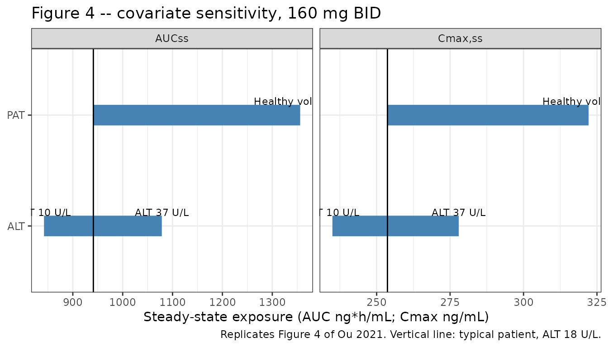
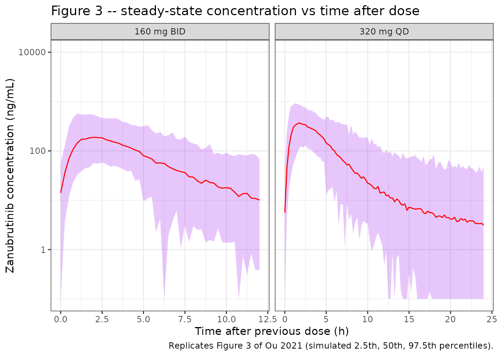

# Zanubrutinib (Ou 2021)

## Model and source

- Citation: Ou YC, Liu L, Tariq B, Wang K, Jindal A, Tang Z, Gao Y,
  Sahasranaman S. Population pharmacokinetic analysis of the BTK
  inhibitor zanubrutinib in healthy volunteers and patients with B-cell
  malignancies. Clin Transl Sci. 2021;14(2):764-772.
  <doi:10.1111/cts.12948>. PMCID: PMC7993273.
- Description: Two-compartment population PK model with sequential
  zero-order then first-order absorption for oral zanubrutinib in
  healthy volunteers and adults with B-cell malignancies
- Article: <https://doi.org/10.1111/cts.12948> (open access, PMC7993273)
- Supplement (demographics, model-development run log, diagnostic
  plots): <https://europepmc.org/article/PMC/PMC7993273>

Zanubrutinib is an oral, irreversible, second-generation Bruton’s
tyrosine kinase (BTK) inhibitor. Ou 2021 pooled nine clinical studies –
four in healthy volunteers and five in patients with B-cell malignancies
– and described the plasma concentrations with a two-compartment model
with sequential zero-order then first-order absorption: the dose enters
a depot compartment at a constant rate over a duration D1 and is then
absorbed into the central compartment with a first-order rate constant
ka (Figure 1). Health status (healthy volunteer vs patient) and baseline
alanine aminotransferase (ALT) were retained as covariates on apparent
clearance. Inter-occasion variability (IOV) was estimated on CL/F, Vc/F
and D1, and the residual error switches from additive-only to combined
additive plus proportional at 5 hours after the previous dose.

``` r

mod <- readModelDb("Ou_2021_zanubrutinib")
ui <- rxode2::rxode(mod)
#> ℹ parameter labels from comments will be replaced by 'label()'
#> Warning: some etas defaulted to non-mu referenced, possible parsing error: etaiov_cl_1, etaiov_cl_2, etaiov_vc_1, etaiov_vc_2, etaiov_d1_1, etaiov_d1_2
#> as a work-around try putting the mu-referenced expression on a simple line
ui
#>  ── rxode2-based free-form 3-cmt ODE model ────────────────────────────────────── 
#>  ── Initalization: ──  
#> Fixed Effects ($theta): 
#>              lcl              lvc               lq              lvp 
#>        5.1357984        4.7184989        3.2771447        5.8435444 
#>              lka              ld1 e_dis_healthy_cl         e_alt_cl 
#>       -0.6424541        0.1204462       -0.3651138       -0.1890000 
#>      addSd_early       addSd_late      propSd_late 
#>        8.6900000        0.6330000        0.4490000 
#> 
#> Omega ($omega): 
#>             etalcl etalvc  etalq etalvp etald1 etaiov_cl_1 etaiov_cl_2
#> etalcl      0.1347 0.1290 0.0000 0.0000 0.0000      0.0000      0.0000
#> etalvc      0.1290 0.1376 0.0000 0.0000 0.0000      0.0000      0.0000
#> etalq       0.0000 0.0000 1.0404 0.0000 0.0000      0.0000      0.0000
#> etalvp      0.0000 0.0000 0.0000 0.7465 0.0000      0.0000      0.0000
#> etald1      0.0000 0.0000 0.0000 0.0000 0.3881      0.0000      0.0000
#> etaiov_cl_1 0.0000 0.0000 0.0000 0.0000 0.0000      0.0818      0.0000
#> etaiov_cl_2 0.0000 0.0000 0.0000 0.0000 0.0000      0.0000      0.0818
#> etaiov_vc_1 0.0000 0.0000 0.0000 0.0000 0.0000      0.0000      0.0000
#> etaiov_vc_2 0.0000 0.0000 0.0000 0.0000 0.0000      0.0000      0.0000
#> etaiov_d1_1 0.0000 0.0000 0.0000 0.0000 0.0000      0.0000      0.0000
#> etaiov_d1_2 0.0000 0.0000 0.0000 0.0000 0.0000      0.0000      0.0000
#>             etaiov_vc_1 etaiov_vc_2 etaiov_d1_1 etaiov_d1_2
#> etalcl           0.0000      0.0000      0.0000      0.0000
#> etalvc           0.0000      0.0000      0.0000      0.0000
#> etalq            0.0000      0.0000      0.0000      0.0000
#> etalvp           0.0000      0.0000      0.0000      0.0000
#> etald1           0.0000      0.0000      0.0000      0.0000
#> etaiov_cl_1      0.0000      0.0000      0.0000      0.0000
#> etaiov_cl_2      0.0000      0.0000      0.0000      0.0000
#> etaiov_vc_1      0.4556      0.0000      0.0000      0.0000
#> etaiov_vc_2      0.0000      0.4556      0.0000      0.0000
#> etaiov_d1_1      0.0000      0.0000      0.3881      0.0000
#> etaiov_d1_2      0.0000      0.0000      0.0000      0.3881
#> attr(,"lotriLabels")
#>  [1] NA                                                                                              
#>  [2] "Table 2, IIV CL/F 36.7% (0.367^2), IIV Vc/F 37.1% (0.371^2), 'Covariance (CL/F, Vc/F)' = 0.129"
#>  [3] "Table 2, IIV Q/F 102% (1.02^2)"                                                                
#>  [4] "Table 2, IIV Vp/F 86.4% (0.864^2)"                                                             
#>  [5] "Table 2, IIV D1 62.3% (0.623^2)"                                                               
#>  [6] "Table 2, IOV CL/F 28.6% (0.286^2)"                                                             
#>  [7] "same variance as occasion 1 (SAME)"                                                            
#>  [8] "Table 2, IOV Vc/F 67.5% (0.675^2)"                                                             
#>  [9] "same variance as occasion 1 (SAME)"                                                            
#> [10] "Table 2, IOV D1 62.3% (0.623^2); identical to the IIV D1 row as printed"                       
#> [11] "same variance as occasion 1 (SAME)"                                                            
#> attr(,"lotriFix")
#>             etalcl etalvc etalq etalvp etald1 etaiov_cl_1 etaiov_cl_2
#> etalcl       FALSE  FALSE FALSE  FALSE  FALSE       FALSE       FALSE
#> etalvc       FALSE  FALSE FALSE  FALSE  FALSE       FALSE       FALSE
#> etalq        FALSE  FALSE FALSE  FALSE  FALSE       FALSE       FALSE
#> etalvp       FALSE  FALSE FALSE  FALSE  FALSE       FALSE       FALSE
#> etald1       FALSE  FALSE FALSE  FALSE  FALSE       FALSE       FALSE
#> etaiov_cl_1  FALSE  FALSE FALSE  FALSE  FALSE       FALSE       FALSE
#> etaiov_cl_2  FALSE  FALSE FALSE  FALSE  FALSE       FALSE        TRUE
#> etaiov_vc_1  FALSE  FALSE FALSE  FALSE  FALSE       FALSE       FALSE
#> etaiov_vc_2  FALSE  FALSE FALSE  FALSE  FALSE       FALSE       FALSE
#> etaiov_d1_1  FALSE  FALSE FALSE  FALSE  FALSE       FALSE       FALSE
#> etaiov_d1_2  FALSE  FALSE FALSE  FALSE  FALSE       FALSE       FALSE
#>             etaiov_vc_1 etaiov_vc_2 etaiov_d1_1 etaiov_d1_2
#> etalcl            FALSE       FALSE       FALSE       FALSE
#> etalvc            FALSE       FALSE       FALSE       FALSE
#> etalq             FALSE       FALSE       FALSE       FALSE
#> etalvp            FALSE       FALSE       FALSE       FALSE
#> etald1            FALSE       FALSE       FALSE       FALSE
#> etaiov_cl_1       FALSE       FALSE       FALSE       FALSE
#> etaiov_cl_2       FALSE       FALSE       FALSE       FALSE
#> etaiov_vc_1       FALSE       FALSE       FALSE       FALSE
#> etaiov_vc_2       FALSE        TRUE       FALSE       FALSE
#> etaiov_d1_1       FALSE       FALSE       FALSE       FALSE
#> etaiov_d1_2       FALSE       FALSE       FALSE        TRUE
#> 
#> States ($state or $stateDf): 
#>   Compartment Number Compartment Name
#> 1                  1            depot
#> 2                  2          central
#> 3                  3      peripheral1
#>  ── μ-referencing ($muRefTable): ──  
#>   theta    eta level
#> 1   lcl etalcl    id
#> 2   lvc etalvc    id
#> 3    lq  etalq    id
#> 4   lvp etalvp    id
#> 5   ld1 etald1    id
#>                                                              covariates
#> 1 DIS_HEALTHY*e_dis_healthy_cl + log(0.0555555555555556 * ALT)*e_alt_cl
#> 2                                                                      
#> 3                                                                      
#> 4                                                                      
#> 5                                                                      
#> 
#>  ── Model (Normalized Syntax): ── 
#> function() {
#>     compartmentData <- list(depot = list(analyte = "zanubrutinib", 
#>         units = "mg", specimen = "administration site", verified = TRUE), 
#>         central = list(analyte = "zanubrutinib", units = "mg", 
#>             specimen = "plasma", verified = TRUE), peripheral1 = list(analyte = "zanubrutinib", 
#>             units = "mg", specimen = "tissue", verified = TRUE))
#>     covariateData <- list(ALT = list(description = "Baseline serum alanine aminotransferase", 
#>         units = "U/L", type = "continuous", reference_category = NULL, 
#>         notes = "Baseline (time-fixed). Enters CL/F as a power function normalised to 18 U/L, the typical-patient value of Eq. 5 and the cohort median (Table S1a: median 18, range 4-197 IU/L overall; 20 IU/L in healthy volunteers and 18 IU/L in patients). The paper writes the effect as -0.189 x log(ALT/18) inside the exponent of Eq. 5, i.e. (ALT/18)^-0.189. Three subjects with missing ALT were imputed to the population median (Supplementary Material, Handling of Missing Covariates).", 
#>         source_name = "ALT"), DIS_HEALTHY = list(description = "Healthy-volunteer indicator (1 = healthy volunteer, 0 = patient with a B-cell malignancy)", 
#>         units = "(binary)", type = "binary", reference_category = "patient with a B-cell malignancy (DIS_HEALTHY = 0)", 
#>         notes = "Eq. 5 carries two indicator terms, 5.13 x Patient + 4.77 x HV, so each health-status group has its own typical log CL/F (Table 2: exp(theta1) = 170 L/h for patients, exp(theta10) = 118 L/h for healthy volunteers). Encoded here as the patient typical value plus a log-ratio shift for DIS_HEALTHY = 1. The patient cohort pools CLL/SLL, MCL, WM and other B-cell malignancies (Table S1b); tumor type was screened but not retained.", 
#>         source_name = "HV / Patient"), OCC = list(description = "Occasion index for the between-occasion random effects", 
#>         units = "(count)", type = "categorical", reference_category = NULL, 
#>         notes = "Two occasions (Results, Base model development): OCC = 1 for records < 7 days after the first dose (single-dose data) and OCC = 2 for records >= 7 days after the first dose (after repeated dosing). Selects the per-occasion IOV etas on CL/F, Vc/F and D1. A single-occasion simulation may use OCC = 1 throughout.", 
#>         source_name = "OCC"))
#>     covariatesDataExcluded <- list(AGE = list(description = "Baseline age", 
#>         units = "years", type = "continuous", notes = "Screened (19-90 years) and not a statistically significant covariate on CL/F or Vc/F (Results, Base model development and covariate assessment; Figure S1C)."), 
#>         WT = list(description = "Baseline body weight", units = "kg", 
#>             type = "continuous", notes = "Screened (36-144 kg) and not statistically significant on CL/F or Vc/F (Figure S1D)."), 
#>         SEXF = list(description = "Female sex indicator", units = "(binary)", 
#>             type = "binary", notes = "Screened and not statistically significant (Results)."), 
#>         RACE_ASIAN = list(description = "Asian race indicator", 
#>             units = "(binary)", type = "binary", notes = "Race (Asian, white, other) screened and not statistically significant (Figure S1A)."), 
#>         CRCL_BASE = list(description = "Baseline Cockcroft-Gault creatinine clearance", 
#>             units = "mL/min", type = "continuous", notes = "Mild or moderate renal impairment (CrCL >= 30 mL/min) screened and not statistically significant (Figure S1E)."), 
#>         AST = list(description = "Baseline aspartate aminotransferase", 
#>             units = "U/L", type = "continuous", notes = "Screened and not statistically significant (Results)."), 
#>         TBILI = list(description = "Baseline total bilirubin", 
#>             units = "umol/L", type = "continuous", notes = "Screened and not statistically significant (Results)."), 
#>         CONMED_PPI = list(description = "Concomitant proton-pump inhibitor use", 
#>             units = "(binary)", type = "binary", notes = "PPI and H2RA use were pooled as one acid-reducing-agent category and were not statistically significant (P > 0.074, ANOVA; Figure S2)."), 
#>         CONMED_H2RA = list(description = "Concomitant H2-receptor-antagonist use", 
#>             units = "(binary)", type = "binary", notes = "Pooled with PPI use as acid-reducing agents; not statistically significant (Figure S2)."), 
#>         TUMTP_MCL = list(description = "Mantle cell lymphoma tumor-type indicator", 
#>             units = "(binary)", type = "binary", notes = "Tumor type (MCL, CLL/SLL, WM, other) passed the P < 0.01 screen but was not retained by the NONMEM stepwise search (Table S2)."))
#>     description <- "Two-compartment population PK model with sequential zero-order then first-order absorption for oral zanubrutinib in healthy volunteers and adults with B-cell malignancies"
#>     population <- list(species = "human", n_subjects = 632, n_studies = 9, 
#>         n_observations = 4925, age_median = "64 years (range 19-90); healthy volunteers 43, patients 66", 
#>         weight_median = "75 kg (range 36-144)", sex_female_pct = 29.7, 
#>         race_ethnicity = c(White = 67.7, Asian = 23.1, Black = 4.1, 
#>             Other = 3, Missing = 2.1), disease_state = "90 healthy volunteers (14.2%) and 542 patients with B-cell malignancies: CLL/SLL 135 (21.4%), Waldenstrom's macroglobulinemia 196 (31.0%), mantle cell lymphoma 70 (11.1%), other 141 (22.3%)", 
#>         dose_range = "20-320 mg orally once or twice daily (most subjects 160 mg twice daily); the 480 mg single-dose data were excluded", 
#>         hepatic_function = "baseline ALT median 18 IU/L (range 4-197)", 
#>         renal_function = "baseline Cockcroft-Gault CrCL median 86 mL/min (range 13.5-240)", 
#>         co_medication = "proton-pump inhibitors 21.5%, H2-receptor antagonists 9.2%", 
#>         regions = "global phase I-III program (studies AU-003, 1002, 205, 206, 103, 104, 105, 106, 302)", 
#>         notes = "Demographics from Tables S1a/S1b; study list from Table 1 of Ou 2021. LLOQ 1 ng/mL; 6.05% of samples were below it and were omitted. Nine healthy volunteers dosed at 480 mg (study BGB-3111-106) were excluded because of less-than-dose-proportional exposure, and two subjects with extreme PK parameters were excluded.")
#>     reference <- "Ou YC, Liu L, Tariq B, Wang K, Jindal A, Tang Z, Gao Y, Sahasranaman S. Population pharmacokinetic analysis of the BTK inhibitor zanubrutinib in healthy volunteers and patients with B-cell malignancies. Clin Transl Sci. 2021;14(2):764-772. doi:10.1111/cts.12948. PMCID: PMC7993273."
#>     units <- list(time = "h", dosing = "mg", concentration = "ng/mL")
#>     vignette <- "Ou_2021_zanubrutinib"
#>     ini({
#>         lcl <- 5.13579843705026
#>         label("Apparent clearance CL/F, patient (L/h)")
#>         lvc <- 4.71849887129509
#>         label("Apparent central volume Vc/F (L)")
#>         lq <- 3.27714473299218
#>         label("Apparent intercompartmental clearance Q/F (L/h)")
#>         lvp <- 5.84354441703136
#>         label("Apparent peripheral volume Vp/F (L)")
#>         lka <- -0.642454066244427
#>         label("First-order absorption rate constant ka (1/h)")
#>         ld1 <- 0.120446153075867
#>         label("Duration of zero-order input into the depot D1 (h)")
#>         e_dis_healthy_cl <- -0.365113812584597
#>         label("Log-ratio of CL/F in healthy volunteers vs patients (unitless)")
#>         e_alt_cl <- -0.189
#>         label("Power exponent on (ALT/18) for CL/F (unitless)")
#>         addSd_early <- 8.69
#>         label("Additive residual error SD, TFDS < 5 h (ng/mL)")
#>         addSd_late <- 0.633
#>         label("Additive residual error SD, TFDS >= 5 h (ng/mL)")
#>         propSd_late <- 0.449
#>         label("Proportional residual error SD, TFDS >= 5 h (fraction)")
#>         etalcl ~ 0.1347
#>         etalvc ~ c(0.129, 0.1376)
#>         label("Table 2, IIV CL/F 36.7% (0.367^2), IIV Vc/F 37.1% (0.371^2), 'Covariance (CL/F, Vc/F)' = 0.129")
#>         etalq ~ 1.0404
#>         label("Table 2, IIV Q/F 102% (1.02^2)")
#>         etalvp ~ 0.7465
#>         label("Table 2, IIV Vp/F 86.4% (0.864^2)")
#>         etald1 ~ 0.3881
#>         label("Table 2, IIV D1 62.3% (0.623^2)")
#>         etaiov_cl_1 ~ 0.0818
#>         label("Table 2, IOV CL/F 28.6% (0.286^2)")
#>         etaiov_cl_2 ~ fix(0.0818)
#>         label("same variance as occasion 1 (SAME)")
#>         etaiov_vc_1 ~ 0.4556
#>         label("Table 2, IOV Vc/F 67.5% (0.675^2)")
#>         etaiov_vc_2 ~ fix(0.4556)
#>         label("same variance as occasion 1 (SAME)")
#>         etaiov_d1_1 ~ 0.3881
#>         label("Table 2, IOV D1 62.3% (0.623^2); identical to the IIV D1 row as printed")
#>         etaiov_d1_2 ~ fix(0.3881)
#>         label("same variance as occasion 1 (SAME)")
#>     })
#>     model({
#>         oc1 <- (OCC == 1)
#>         oc2 <- (OCC == 2)
#>         iov_cl <- oc1 * etaiov_cl_1 + oc2 * etaiov_cl_2
#>         iov_vc <- oc1 * etaiov_vc_1 + oc2 * etaiov_vc_2
#>         iov_d1 <- oc1 * etaiov_d1_1 + oc2 * etaiov_d1_2
#>         cl <- exp(lcl + e_dis_healthy_cl * DIS_HEALTHY + e_alt_cl * 
#>             log(ALT/18) + etalcl + iov_cl)
#>         vc <- exp(lvc + etalvc + iov_vc)
#>         q <- exp(lq + etalq)
#>         vp <- exp(lvp + etalvp)
#>         ka <- exp(lka)
#>         d1 <- exp(ld1 + etald1 + iov_d1)
#>         kel <- cl/vc
#>         k12 <- q/vc
#>         k21 <- q/vp
#>         d/dt(depot) <- -ka * depot
#>         d/dt(central) <- ka * depot - kel * central - k12 * central + 
#>             k21 * peripheral1
#>         d/dt(peripheral1) <- k12 * central - k21 * peripheral1
#>         dur(depot) <- d1
#>         Cc <- 1000 * central/vc
#>         tfds <- tad()
#>         late <- tfds >= 5
#>         addSdTad <- addSd_early * (1 - late) + addSd_late * late
#>         propSdTad <- propSd_late * late
#>         Cc ~ add(addSdTad) + prop(propSdTad)
#>     })
#> }

# A cl/vc pair can make rxode2 replace the ODEs with its analytic linear
# compartment solution, which would silently drop dur(depot). Confirm the
# explicit ODE system is the one being solved.
stopifnot(is.null(ui$linCmt) || isFALSE(ui$linCmt))
```

## Population

The analysis dataset held 4,925 zanubrutinib plasma concentrations from
632 subjects across nine studies (Table 1 of Ou 2021; Results, Clinical
data): 90 healthy volunteers (14.2%) and 542 patients with B-cell
malignancies – CLL/SLL 135 (21.4%), Waldenstrom’s macroglobulinemia 196
(31.0%), mantle cell lymphoma 70 (11.1%) and other B-cell malignancies
141 (22.3%) (Table S1b). Median age was 64 years (range 19-90; 43 in
healthy volunteers, 66 in patients), median body weight 75 kg (36-144),
29.7% of subjects were female, and 67.7% were White, 23.1% Asian and
4.1% Black. Median baseline ALT was 18 IU/L (range 4-197) (Table S1a).
Doses ranged from 20 to 320 mg once or twice daily, most subjects
receiving 160 mg twice daily; data at 480 mg were excluded because
exposure was less than dose-proportional. The assay LLOQ was 1 ng/mL,
and the 6.05% of samples below it were omitted.

``` r

str(ui$population)
#> List of 15
#>  $ species         : chr "human"
#>  $ n_subjects      : num 632
#>  $ n_studies       : num 9
#>  $ n_observations  : num 4925
#>  $ age_median      : chr "64 years (range 19-90); healthy volunteers 43, patients 66"
#>  $ weight_median   : chr "75 kg (range 36-144)"
#>  $ sex_female_pct  : num 29.7
#>  $ race_ethnicity  : Named num [1:5] 67.7 23.1 4.1 3 2.1
#>   ..- attr(*, "names")= chr [1:5] "White" "Asian" "Black" "Other" ...
#>  $ disease_state   : chr "90 healthy volunteers (14.2%) and 542 patients with B-cell malignancies: CLL/SLL 135 (21.4%), Waldenstrom's mac"| __truncated__
#>  $ dose_range      : chr "20-320 mg orally once or twice daily (most subjects 160 mg twice daily); the 480 mg single-dose data were excluded"
#>  $ hepatic_function: chr "baseline ALT median 18 IU/L (range 4-197)"
#>  $ renal_function  : chr "baseline Cockcroft-Gault CrCL median 86 mL/min (range 13.5-240)"
#>  $ co_medication   : chr "proton-pump inhibitors 21.5%, H2-receptor antagonists 9.2%"
#>  $ regions         : chr "global phase I-III program (studies AU-003, 1002, 205, 206, 103, 104, 105, 106, 302)"
#>  $ notes           : chr "Demographics from Tables S1a/S1b; study list from Table 1 of Ou 2021. LLOQ 1 ng/mL; 6.05% of samples were below"| __truncated__
```

## Source trace

The per-parameter origin is recorded as an in-file comment next to each
`ini()` entry in `inst/modeldb/specificDrugs/Ou_2021_zanubrutinib.R`.
The table below collects them in one place.

| Equation / parameter | Value | Source location |
|----|----|----|
| `lcl` | CL/F = 170 L/h (patient) | Table 2, `exp(theta1)`; Eq. 5 coefficient 5.13 |
| `e_dis_healthy_cl` | log(118 / 170) = -0.365 | Table 2, `exp(theta10)` CL/F in healthy volunteers = 118 L/h; Eq. 5 coefficient 4.77 |
| `e_alt_cl` | -0.189 | Table 2, `theta11`; Eq. 5 term `-0.189 x log(ALT/18)` |
| `lvc` | Vc/F = 112 L | Table 2, `exp(theta2)`; Eq. 6 coefficient 4.72 |
| `lq` | Q/F = 26.5 L/h | Table 2, `exp(theta3)` |
| `lvp` | Vp/F = 345 L | Table 2, `exp(theta4)` |
| `lka` | ka = 0.526 1/h | Table 2, `exp(theta5)` |
| `ld1` | D1 = 1.128 h | Table 2, `exp(theta6)` |
| `etalcl`, `etalvc` | 0.367^2, 0.371^2 | Table 2, IIV CL/F 36.7%, Vc/F 37.1% |
| `etalcl`-`etalvc` covariance | 0.129 | Table 2, `Covariance (CL/F, Vc/F)` |
| `etalq`, `etalvp`, `etald1` | 1.02^2, 0.864^2, 0.623^2 | Table 2, IIV Q/F 102%, Vp/F 86.4%, D1 62.3% |
| `etaiov_cl_*`, `etaiov_vc_*`, `etaiov_d1_*` | 0.286^2, 0.675^2, 0.623^2 | Table 2, IOV CL/F 28.6%, Vc/F 67.5%, D1 62.3% |
| `addSd_early` | 8.69 ng/mL | Table 2, `theta9`, additive error for TFDS \< 5 h |
| `addSd_late` | 0.633 ng/mL | Table 2, `theta7`, additive error for TFDS \>= 5 h |
| `propSd_late` | 0.449 | Table 2, `theta8`, proportional error 44.9% |
| Two-compartment model, zero-order input into depot then first-order absorption | n/a | Figure 1 (equations and diagram); Results, Base model development |
| Covariate form on CL/F | n/a | Eq. 5 |
| IOV occasions (\< 7 days and \>= 7 days) | n/a | Results, Base model development |
| Residual-error switch at 5 h after the previous dose | n/a | Results, Base model development; Discussion |

## Typical-value checks against Figure 4

Figure 4 of Ou 2021 is a sensitivity analysis of steady-state exposure
after 20 doses of 160 mg twice daily. It prints the typical patient’s
exposure (ALT = 18 U/L: AUCss 943 ng\*h/mL and Cmax,ss 254 ng/mL) and
the percent change for each retained covariate. Those numbers are
typical-value (deterministic) predictions, so they are reproduced here
with `zeroRe()`. Because Cmax depends on ka and D1 as well as on the
disposition parameters, matching Cmax,ss tests the absorption structure,
not only the clearance.

``` r

TAU <- 12
N_DOSES <- 20
SS_START <- (N_DOSES - 1) * TAU   # time of the 20th dose

# Dose rows carry rate = -2 so that dur(depot) <- d1 is honoured; without it
# the dose is a bolus into the depot.
ss_events <- function(scen, rate = -2, fine = 0.01) {
  doses <- expand.grid(id = scen$id, time = (seq_len(N_DOSES) - 1) * TAU)
  doses$amt <- 160
  doses$evid <- 1L
  doses$rate <- rate
  obs <- expand.grid(id = scen$id, time = seq(SS_START, SS_START + TAU, by = fine))
  obs$amt <- NA_real_
  obs$evid <- 0L
  obs$rate <- NA_real_
  ev <- bind_rows(doses, obs)
  ev$cmt <- ifelse(ev$evid == 1L, "depot", "central")
  ev <- merge(ev, scen, by = "id")
  ev[order(ev$id, ev$time, -ev$evid), ]
}

scenarios <- tibble::tribble(
  ~scenario,             ~DIS_HEALTHY, ~ALT,
  "Patient, ALT 18 U/L",            0,   18,
  "Healthy volunteer",              1,   18,
  "ALT 10 U/L",                     0,   10,
  "ALT 37 U/L",                     0,   37
) |>
  mutate(id = row_number(), OCC = 2)

sim_typ <- rxode2::rxSolve(rxode2::zeroRe(mod), events = ss_events(scenarios),
                           keep = "id", returnType = "data.frame") |>
  filter(!is.na(Cc), time >= SS_START) |>
  left_join(scenarios |> select(id, scenario), by = "id")
#> ℹ parameter labels from comments will be replaced by 'label()'
#> Warning: some etas defaulted to non-mu referenced, possible parsing error: etaiov_cl_1, etaiov_cl_2, etaiov_vc_1, etaiov_vc_2, etaiov_d1_1, etaiov_d1_2
#> as a work-around try putting the mu-referenced expression on a simple line
#> Warning: No sigma parameters in the model
#> Warning: some etas defaulted to non-mu referenced, possible parsing error: etaiov_cl_1, etaiov_cl_2, etaiov_vc_1, etaiov_vc_2, etaiov_d1_1, etaiov_d1_2
#> as a work-around try putting the mu-referenced expression on a simple line
#> Warning: 'keep' contains id
#> which are output when needed, ignoring these items
#> ℹ omega/sigma items treated as zero: 'etalcl', 'etalvc', 'etalq', 'etalvp', 'etald1', 'etaiov_cl_1', 'etaiov_cl_2', 'etaiov_vc_1', 'etaiov_vc_2', 'etaiov_d1_1', 'etaiov_d1_2'
#> Warning: multi-subject simulation without without 'omega'
```

### Steady-state mass balance

For a linear model the solved AUC over one steady-state dosing interval
must equal `Dose / (CL/F)`. Both sides use the same parameters, so the
only residual is integration and trapezoid error.

``` r

mb <- sim_typ |>
  group_by(scenario) |>
  summarise(cl = first(cl),
            auc = sum(diff(time) * (head(Cc, -1) + tail(Cc, -1)) / 2),
            cmax = max(Cc), cmin = min(Cc), .groups = "drop") |>
  mutate(auc_closed = 160 * 1000 / cl, rel_err = auc / auc_closed - 1)

knitr::kable(
  mb |>
    select(scenario, cl, auc_closed, auc, rel_err) |>
    dplyr::rename("Scenario" = scenario, "CL/F (L/h)" = cl,
                  "Dose/(CL/F) (ng*h/mL)" = auc_closed,
                  "Solved AUC0-tau (ng*h/mL)" = auc,
                  "Relative error" = rel_err),
  digits = c(0, 2, 1, 1, 7),
  caption = "Steady-state mass balance for the typical-value scenarios."
)
```

| Scenario | CL/F (L/h) | Dose/(CL/F) (ng\*h/mL) | Solved AUC0-tau (ng\*h/mL) | Relative error |
|:---|---:|---:|---:|---:|
| ALT 10 U/L | 189.97 | 842.2 | 842.2 | -1e-07 |
| ALT 37 U/L | 148.36 | 1078.5 | 1078.5 | -1e-07 |
| Healthy volunteer | 118.00 | 1355.9 | 1355.9 | -2e-07 |
| Patient, ALT 18 U/L | 170.00 | 941.2 | 941.2 | -1e-07 |

Steady-state mass balance for the typical-value scenarios. {.table}

``` r


stopifnot(
  # Same parameters on both sides; the residual is trapezoid error on a
  # 0.01 h grid and the approach to steady state after 20 doses (realised
  # about 2e-7).
  max(abs(mb$rel_err)) < 1e-5
)
```

### Figure 4: covariate sensitivity

``` r

base <- mb |> filter(scenario == "Patient, ALT 18 U/L")

published_fig4 <- tibble::tribble(
  ~scenario,           ~metric, ~published_pct,
  "Healthy volunteer", "AUCss",           43.7,
  "ALT 10 U/L",        "AUCss",          -10.5,
  "ALT 37 U/L",        "AUCss",           14.6,
  "Healthy volunteer", "Cmax,ss",         26.8,
  "ALT 10 U/L",        "Cmax,ss",        -7.37,
  "ALT 37 U/L",        "Cmax,ss",          9.6
)

fig4 <- mb |>
  transmute(scenario,
            AUCss = 100 * (auc / base$auc - 1),
            `Cmax,ss` = 100 * (cmax / base$cmax - 1)) |>
  pivot_longer(c(AUCss, `Cmax,ss`), names_to = "metric", values_to = "model_pct") |>
  inner_join(published_fig4, by = c("scenario", "metric")) |>
  mutate(abs_diff = abs(model_pct - published_pct))

knitr::kable(
  fig4 |>
    dplyr::rename("Scenario" = scenario, "Metric" = metric,
                  "Model (% change)" = model_pct,
                  "Published (% change)" = published_pct,
                  "|difference| (percentage points)" = abs_diff),
  digits = 2,
  caption = "Percent change in steady-state exposure vs the typical patient: model vs Figure 4 of Ou 2021."
)
```

| Scenario | Metric | Model (% change) | Published (% change) | \|difference\| (percentage points) |
|:---|:---|---:|---:|---:|
| ALT 10 U/L | AUCss | -10.51 | -10.50 | 0.01 |
| ALT 10 U/L | Cmax,ss | -7.38 | -7.37 | 0.01 |
| ALT 37 U/L | AUCss | 14.59 | 14.60 | 0.01 |
| ALT 37 U/L | Cmax,ss | 9.57 | 9.60 | 0.03 |
| Healthy volunteer | AUCss | 44.07 | 43.70 | 0.37 |
| Healthy volunteer | Cmax,ss | 26.99 | 26.80 | 0.19 |

Percent change in steady-state exposure vs the typical patient: model vs
Figure 4 of Ou 2021. {.table}

``` r


cmin_alt <- mb |>
  filter(scenario %in% c("ALT 10 U/L", "ALT 37 U/L")) |>
  mutate(pct = 100 * (cmin / base$cmin - 1))

stopifnot(
  # Typical patient: 941.2 vs 943 printed (0.19%) and 253.7 vs 254 (0.13%).
  # The residual is the paper printing CL/F as 170 rather than its unrounded
  # estimate. 1% keeps headroom and still goes red on a unit or dose error.
  abs(base$auc / 943 - 1) < 0.01,
  abs(base$cmax / 254 - 1) < 0.01,
  # Covariate effects: largest gap is the healthy-volunteer AUC (44.07% from
  # the rounded 170/118 vs 43.7% printed). 0.6 points absorbs that rounding;
  # a sign error, a log10 in place of the natural log, or a wrong reference
  # ALT moves these by several points.
  max(fig4$abs_diff) < 0.6,
  # Results: the ALT effect on Cmin,ss is "moderate (< 30%)".
  all(abs(cmin_alt$pct) < 30)
)
```

``` r

# Replicates Figure 4 of Ou 2021 (covariate bars only; the population 5th-95th
# percentile bar is compared with the simulated cohort further below).
bars <- mb |>
  transmute(scenario, AUCss = auc, `Cmax,ss` = cmax) |>
  pivot_longer(-scenario, names_to = "metric", values_to = "value") |>
  left_join(base |> transmute(AUCss = auc, `Cmax,ss` = cmax) |>
              pivot_longer(everything(), names_to = "metric", values_to = "base"),
            by = "metric") |>
  mutate(covariate = case_when(
    scenario == "Healthy volunteer" ~ "PAT",
    grepl("ALT", scenario) & scenario != "Patient, ALT 18 U/L" ~ "ALT",
    TRUE ~ NA_character_)) |>
  filter(!is.na(covariate))

ggplot(bars, aes(y = covariate)) +
  geom_segment(aes(x = base, xend = value, yend = covariate), linewidth = 8,
               colour = "steelblue") +
  geom_vline(aes(xintercept = base)) +
  geom_text(aes(x = value, label = scenario), vjust = -1.4, size = 3) +
  facet_wrap(~metric, scales = "free_x") +
  labs(x = "Steady-state exposure (AUC ng*h/mL; Cmax ng/mL)", y = NULL,
       title = "Figure 4 -- covariate sensitivity, 160 mg BID",
       caption = "Replicates Figure 4 of Ou 2021. Vertical line: typical patient, ALT 18 U/L.") +
  theme_bw()
```



### The zero-order input is load-bearing

As a control, the same typical patient is solved with the doses entered
as a bolus into the depot (no `rate = -2`, so `dur(depot)` is ignored).
The bolus leaves AUC unchanged but raises Cmax,ss by about 4%, so the 1%
Cmax gate above would fail on it. The gate therefore checks the
absorption structure and not only CL/F.

``` r

bolus <- rxode2::rxSolve(rxode2::zeroRe(mod),
                         events = ss_events(scenarios[1, ], rate = 0),
                         returnType = "data.frame") |>
  filter(!is.na(Cc), time >= SS_START)
#> ℹ parameter labels from comments will be replaced by 'label()'
#> Warning: some etas defaulted to non-mu referenced, possible parsing error: etaiov_cl_1, etaiov_cl_2, etaiov_vc_1, etaiov_vc_2, etaiov_d1_1, etaiov_d1_2
#> as a work-around try putting the mu-referenced expression on a simple line
#> Warning: No sigma parameters in the model
#> Warning: some etas defaulted to non-mu referenced, possible parsing error: etaiov_cl_1, etaiov_cl_2, etaiov_vc_1, etaiov_vc_2, etaiov_d1_1, etaiov_d1_2
#> as a work-around try putting the mu-referenced expression on a simple line
#> ℹ omega/sigma items treated as zero: 'etalcl', 'etalvc', 'etalq', 'etalvp', 'etald1', 'etaiov_cl_1', 'etaiov_cl_2', 'etaiov_vc_1', 'etaiov_vc_2', 'etaiov_d1_1', 'etaiov_d1_2'
bolus_cmax <- max(bolus$Cc)
bolus_cmax
#> [1] 265.1966

stopifnot(
  abs(bolus_cmax / 254 - 1) > 0.02,
  abs(base$cmax / 254 - 1) < abs(bolus_cmax / 254 - 1)
)
```

## Virtual cohort

Subject-level data are not public. The cohort below is two arms of 200
patients with B-cell malignancies at the two dosing regimens shown in
Figure 3 of Ou 2021 (160 mg twice daily and 320 mg once daily). Baseline
ALT is drawn log-normally with the patient median of 18 IU/L and mean of
22.1 IU/L (Table S1a). Each subject receives eight days of dosing.
Records before day 7 are occasion 1 and later records are occasion 2,
matching the paper’s occasion definition, so the first-dose and
steady-state intervals use independent IOV draws.

``` r

# set.seed() fixes the covariate draw. rxode2's own eta and residual draws are
# partitioned per solver thread and can differ between machines, so every
# assertion on this cohort below is a centre or robust-quantile bound.
set.seed(20210301)
rxode2::rxSetSeed(20210301)

N_PER_ARM <- 200
alt_sdlog <- sqrt(2 * log(22.1 / 18))

arms <- tibble::tribble(
  ~treatment,    ~dose, ~tau,
  "160 mg BID",    160,   12,
  "320 mg QD",     320,   24
)

cohort <- bind_rows(
  tibble(id = seq_len(N_PER_ARM), arms[1, ]),
  tibble(id = 1000L + seq_len(N_PER_ARM), arms[2, ])
) |>
  mutate(ALT = rlnorm(n(), log(18), alt_sdlog), DIS_HEALTHY = 0)

SS_DAY_START <- 192   # start of the day-9 steady-state interval (occasion 2)

cohort_events <- function(cohort) {
  per_id <- lapply(split(cohort, cohort$id), function(s) {
    dose_t <- seq(0, SS_DAY_START, by = s$tau)
    obs_t <- sort(unique(c(
      seq(0, s$tau, by = 0.25),
      SS_DAY_START + seq(0, s$tau, by = 0.25)
    )))
    bind_rows(
      tibble(id = s$id, time = dose_t, evid = 1L, amt = s$dose, rate = -2,
             cmt = "depot"),
      tibble(id = s$id, time = obs_t, evid = 0L, amt = NA_real_,
             rate = NA_real_, cmt = "central")
    )
  })
  ev <- bind_rows(per_id) |>
    left_join(cohort |> select(id, treatment, ALT, DIS_HEALTHY), by = "id") |>
    mutate(OCC = ifelse(time < 7 * 24, 1, 2)) |>
    arrange(id, time, desc(evid))
  as.data.frame(ev)
}

events <- cohort_events(cohort)
stopifnot(!anyDuplicated(events[, c("id", "time", "evid")]))
```

## Simulation

``` r

sim <- rxode2::rxSolve(mod, events = events, keep = "treatment",
                       returnType = "data.frame") |>
  filter(!is.na(Cc)) |>
  mutate(treatment = as.character(treatment),
         interval = ifelse(time >= SS_DAY_START, "Steady state (day 9)", "First dose"))
#> ℹ parameter labels from comments will be replaced by 'label()'
#> Warning: some etas defaulted to non-mu referenced, possible parsing error: etaiov_cl_1, etaiov_cl_2, etaiov_vc_1, etaiov_vc_2, etaiov_d1_1, etaiov_d1_2
#> as a work-around try putting the mu-referenced expression on a simple line

stopifnot(!anyNA(sim$Cc), all(sim$Cc >= -1e-6 * max(sim$Cc)))
```

### Figure 3: concentration vs time after the previous dose

Figure 3 of Ou 2021 is a prediction-corrected VPC by regimen, plotted
against time after the previous dose on a log axis. The panels below
show the 2.5th, 50th and 97.5th percentiles of the simulated
observations (`sim`, which carries the time-dependent residual error) at
steady state.

``` r

vpc <- sim |>
  filter(interval == "Steady state (day 9)") |>
  mutate(tad = round(time - SS_DAY_START, 2)) |>
  group_by(treatment, tad) |>
  summarise(lo = quantile(sim, 0.025), med = median(sim),
            hi = quantile(sim, 0.975), .groups = "drop")

ggplot(vpc, aes(tad, med)) +
  geom_ribbon(aes(ymin = pmax(lo, 0.1), ymax = hi), alpha = 0.25, fill = "purple") +
  geom_line(colour = "red") +
  scale_y_log10(limits = c(0.1, 1e4)) +
  facet_wrap(~treatment, scales = "free_x") +
  labs(x = "Time after previous dose (h)", y = "Zanubrutinib concentration (ng/mL)",
       title = "Figure 3 -- steady-state concentration vs time after dose",
       caption = "Replicates Figure 3 of Ou 2021 (simulated 2.5th, 50th, 97.5th percentiles).") +
  theme_bw()
```



### Residual-error structure

The error model is additive only (SD 8.69 ng/mL) for records less than 5
h after the previous dose, and combined additive (0.633 ng/mL) plus
proportional (44.9%) from 5 h onward. Standardising each simulated
residual by the SD that applies in its stratum should give a unit
standard deviation in both strata. Swapping the two branches, or
dropping the switch, moves one of them far from 1.

``` r

# Time after the previous dose: in the first interval the only dose is at 0;
# in the steady-state interval the last dose is at SS_DAY_START. Records that
# coincide with a dose (tfds = 0, and the end of the first interval, where the
# next dose is given) are dropped so no record sits on a dose boundary.
res <- sim |>
  left_join(arms |> select(treatment, tau), by = "treatment") |>
  mutate(tfds = ifelse(interval == "First dose", time, time - SS_DAY_START)) |>
  filter(tfds > 0, !(interval == "First dose" & tfds >= tau)) |>
  mutate(stratum = ifelse(tfds >= 5, "TFDS >= 5 h", "TFDS < 5 h"),
         sd_expected = ifelse(tfds >= 5, sqrt(0.633^2 + (0.449 * Cc)^2), 8.69),
         z = (sim - Cc) / sd_expected)

res_tab <- res |>
  group_by(stratum) |>
  summarise(n = n(), sd_z = sd(z), .groups = "drop")

knitr::kable(
  res_tab |> dplyr::rename("Stratum" = stratum, "n" = n,
                           "SD of standardised residual" = sd_z),
  digits = 3,
  caption = "Standardised residuals by time-after-dose stratum; each should have SD near 1."
)
```

| Stratum      |     n | SD of standardised residual |
|:-------------|------:|----------------------------:|
| TFDS \< 5 h  | 15200 |                       1.005 |
| TFDS \>= 5 h | 42000 |                       0.998 |

Standardised residuals by time-after-dose stratum; each should have SD
near 1. {.table}

``` r


stopifnot(
  # Thousands of draws per stratum; the SD of a unit-variance sample of this
  # size is within a few percent of 1. Swapping the strata would give an SD
  # of order 10 in one of them.
  all(abs(res_tab$sd_z - 1) < 0.1)
)
```

## PKNCA validation

NCA on the steady-state (day 9) dosing interval of each arm, with the
time axis shifted so the interval starts at 0.

``` r

conc_ss <- sim |>
  filter(interval == "Steady state (day 9)") |>
  transmute(id, treatment, time = time - SS_DAY_START, Cc)
dose_ss <- cohort |> transmute(id, treatment, time = 0, amt = dose)

nca_res <- PKNCA::pk.nca(PKNCA::PKNCAdata(
  PKNCA::PKNCAconc(as.data.frame(conc_ss), Cc ~ time | treatment + id,
                   concu = "ng/mL", timeu = "h"),
  PKNCA::PKNCAdose(as.data.frame(dose_ss), amt ~ time | treatment + id,
                   doseu = "mg"),
  intervals = data.frame(
    start = 0, end = c(12, 24),
    cmax = TRUE, tmax = TRUE, auclast = TRUE, cmin = TRUE
  ) |> mutate(treatment = c("160 mg BID", "320 mg QD"))
))
```

### Comparison against published exposures

Ou 2021 reports typical-patient steady-state exposure for 160 mg twice
daily (AUCss 943 ng*h/mL, Cmax,ss 254 ng/mL; Figure 4) and a total daily
AUC of 1,886 ng*h/mL. For a log-normal clearance the cohort median AUC
equals the typical value, so the median over the virtual cohort is
compared with it. The paper reports no typical exposures for 320 mg once
daily. For a linear model its daily AUC equals the 160 mg twice-daily
daily AUC, which is used as the reference.

Only AUC is gated. Cmax is not log-linear in the random effects, and
Vc/F carries both IIV (37.1%) and IOV (67.5%), a combined log-scale
variance of 0.59. The cohort median Cmax therefore sits below the Cmax
of the typical subject (about 15% lower here). The typical-value Cmax of
254 ng/mL is already matched exactly by the deterministic check above.

``` r

sim_med <- as.data.frame(nca_res$result) |>
  filter(PPTESTCD %in% c("cmax", "auclast"), !is.na(PPORRES)) |>
  group_by(treatment, PPTESTCD) |>
  summarise(PPORRES = median(PPORRES), .groups = "drop")

published <- tibble::tribble(
  ~treatment,    ~cmax, ~auclast,
  "160 mg BID",    254,      943,
  "320 mg QD",      NA,     1886
)

cmp <- nlmixr2lib::ncaComparisonTable(
  simulated = sim_med,
  reference = published,
  by = "treatment",
  units = c(cmax = "ng/mL", auclast = "ng*h/mL"),
  tolerance_pct = 20
)

knitr::kable(
  cmp,
  caption = paste(
    "Simulated cohort median vs the typical-patient exposures of Ou 2021.",
    "The 320 mg QD AUC0-24 reference is the paper's total daily AUC of",
    "1,886 ng*h/mL. * marks a difference above 20%."
  )
)
```

| NCA parameter      | treatment  | Reference | Simulated | % diff |
|:-------------------|:-----------|:----------|:----------|:-------|
| Cmax (ng/mL)       | 160 mg BID | 254       | 217       | -14.7% |
| Cmax (ng/mL)       | 320 mg QD  | —         | 409       | —      |
| AUClast (ng\*h/mL) | 160 mg BID | 943       | 963       | +2.2%  |
| AUClast (ng\*h/mL) | 320 mg QD  | 1890      | 1820      | -3.5%  |

Simulated cohort median vs the typical-patient exposures of Ou 2021. The
320 mg QD AUC0-24 reference is the paper’s total daily AUC of 1,886
ng*h/mL.* marks a difference above 20%. {.table}

``` r


auc_med <- sim_med |> filter(PPTESTCD == "auclast")

stopifnot(
  # Centre, not extremes: the cohort median AUC must match the typical value.
  # log(AUC) has an SD of about 0.47 (IIV + IOV on CL/F), so the SE of the
  # median over 200 subjects is about 4%; 15% is well over 3 SE and still goes
  # red on a mis-transcribed CL/F, dose or unit.
  abs(auc_med$PPORRES[auc_med$treatment == "160 mg BID"] / 943 - 1) < 0.15,
  abs(auc_med$PPORRES[auc_med$treatment == "320 mg QD"] / 1886 - 1) < 0.15
)
```

Figure 4 also prints the 5th-95th percentile range of steady-state
exposure across the whole analysis population (AUCss 526-2,114 ng\*h/mL;
Cmax,ss 152-499 ng/mL at 160 mg twice daily). The paper’s range comes
from the individual (post hoc) parameters of the 632 analysed subjects,
healthy volunteers included, and is shrunk toward the typical value. The
simulated range comes from the full IIV and IOV in patients only. The
comparison is shown for context and is not gated.

``` r

as.data.frame(nca_res$result) |>
  filter(treatment == "160 mg BID", PPTESTCD %in% c("auclast", "cmax")) |>
  group_by(PPTESTCD) |>
  summarise(p05 = quantile(PPORRES, 0.05), p95 = quantile(PPORRES, 0.95),
            .groups = "drop") |>
  mutate(published_p05 = ifelse(PPTESTCD == "auclast", 526.2, 152),
         published_p95 = ifelse(PPTESTCD == "auclast", 2114, 499)) |>
  dplyr::rename("Parameter" = PPTESTCD, "Simulated 5th" = p05,
                "Simulated 95th" = p95, "Published 5th" = published_p05,
                "Published 95th" = published_p95) |>
  knitr::kable(digits = 1, caption = "5th-95th percentile steady-state exposure, 160 mg BID.")
```

| Parameter | Simulated 5th | Simulated 95th | Published 5th | Published 95th |
|:----------|--------------:|---------------:|--------------:|---------------:|
| auclast   |         455.6 |         2279.4 |         526.2 |           2114 |
| cmax      |          92.0 |          514.7 |         152.0 |            499 |

5th-95th percentile steady-state exposure, 160 mg BID. {.table
style="width:100%;"}

## Assumptions and deviations

- **IIV/IOV variance scale.** Table 2 reports variability as percent CV.
  The variances are encoded as `(CV/100)^2`. The printed (CL/F, Vc/F)
  covariance of 0.129 settles this: with `(CV/100)^2` variances (0.1347,
  0.1376) the implied correlation is 0.947, whereas `log(1 + CV^2)`
  variances (0.1261, 0.1289) would imply a correlation of 1.01, which is
  not a valid covariance matrix.

- **IIV and IOV on D1 are printed identically.** Table 2 gives 62.3%
  (95% CI 57.1-67.1; bootstrap 62.2, 51.9-72.4) for both the IIV and the
  IOV of D1. The two agree down to the confidence interval, which
  suggests one row was duplicated when the table was typeset. No other
  source prints either value, so both are encoded as printed.

- **Occasions.** IOV uses two occasions, records \< 7 days and \>= 7
  days after the first dose (Results). The `OCC` covariate must be
  supplied as 1 or 2 accordingly; a simulation confined to one occasion
  may use `OCC = 1` throughout.

- **Health-status effect.** Eq. 5 gives patients and healthy volunteers
  separate typical log CL/F values (5.13 and 4.77). The model encodes
  the Table 2 typical values, 170 and 118 L/h, as the patient CL/F plus
  a log-ratio shift for `DIS_HEALTHY = 1`. The rounded values give a
  44.1% higher AUC in healthy volunteers against 43.7% printed in
  Figure 4. The Results text says the health-status effect acts on “CL/F
  and Vc/F”, but Eq. 5, Eq. 6 and the run log (Table S2) place it on
  CL/F only, and that is what is encoded.

- **Residual error parameterisation.** The Table 2 residual-error thetas
  are read as standard deviations (additive in ng/mL, proportional as a
  fraction), combined as `sqrt(add^2 + (prop * Cc)^2)` for records 5 h
  or more after the previous dose. The paper’s Eq. 2 is the usual
  combined additive-plus-proportional form.

- **Elimination half-life.** The Results report a “geometric mean
  elimination t1/2 of 3.44 hours (CV 40.0%)” without saying how it was
  derived. For the typical parameters the model’s terminal half-life is
  10.5 h and its distribution half-life is 0.39 h. Log-linear fits to
  the single-dose typical profile give 1.9 h over 4-12 h and 4.9 h over
  6-24 h. The 3.44 h figure is therefore not used as a validation
  target.

- **Bioavailability.** Only oral data were analysed, so all parameters
  are apparent (CL/F, Vc/F, Q/F, Vp/F). No `f(depot)` term is encoded,
  and the food, CYP3A-interaction and acid-reducing-agent studies enter
  at face value (acid-reducing agents were screened and not retained).

- **Virtual cohort.** Patients only, with baseline ALT drawn
  log-normally to match the Table S1a patient median (18 IU/L) and mean
  (22.1 IU/L). Other demographics are not needed because no other
  covariate is in the final model.
