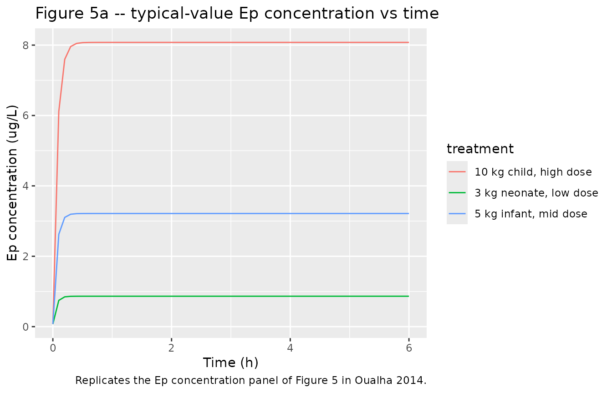
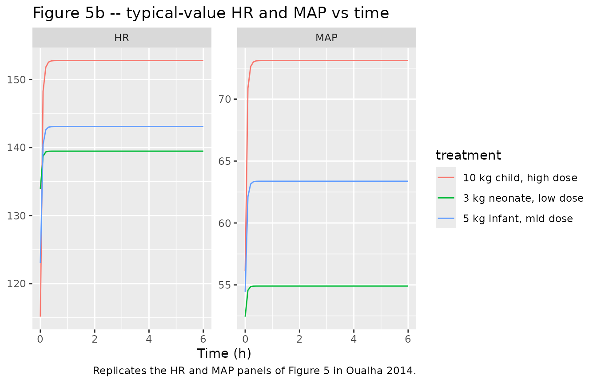
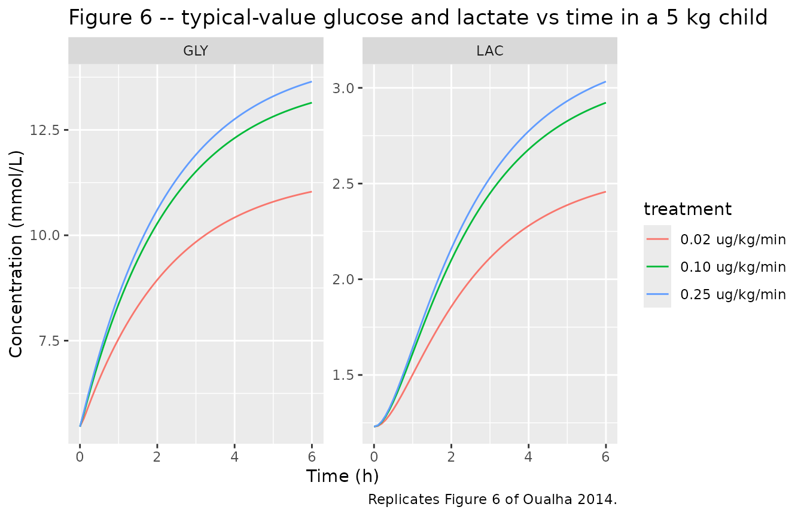

# Epinephrine (Oualha 2014)

## Model and source

- Citation: Oualha M, Urien S, Spreux-Varoquaux O, Bordessoule A,
  D’Agostino I, Pouard P, Treluyer JM (2014). Pharmacokinetics,
  hemodynamic and metabolic effects of epinephrine to prevent
  post-operative low cardiac output syndrome in children. Critical Care
  18(1):R23. <doi:10.1186/cc13707>.
- Article (open access): <https://doi.org/10.1186/cc13707>
- Source: paper text + Tables 1, 2, 3.

The published model is a paediatric population PK/PD analysis of
continuous IV epinephrine in critically ill children following
cardiopulmonary bypass for repair of congenital heart defects. It
combines:

- a one-compartment PK sub-model with first-order elimination and an
  endogenous zero-order Ep production rate `q0` (Eq. 1-3),
- allometric weight scaling on CL and `q0` (Eq. 4, exponents fixed to
  3/4),
- a circulating-volume formula `Vc = 0.08 * WT` (Eq. 5),
- Emax PD models on heart rate and on the stroke-volume /
  systemic-vascular- resistance product, with age power effects on basal
  values and a RACHS-1 categorical effect on SV\*SVR_max (Eq. 6-8),
- glucose / lactate turnover with epinephrine-stimulated glucose
  zero-order production (Eq. 9-11) and a steady-state derivation of the
  elimination rate constants (Eq. 12-13).

## Population

Thirty-nine critically ill children were enrolled at a single tertiary
paediatric cardiovascular ICU (Hopital Necker Enfants-Malades, Paris,
July 2011-December 2011) after open heart surgical repair for congenital
heart defects under cardiopulmonary bypass (Oualha 2014 Table 1). Body
weight ranged from 2.5 to 58 kg (median 4.5 kg) and age from 0.1 to 189
months (median 3.9 months); the cohort included 5 preterm neonates at
gestational age 33-36 weeks. RACHS-1 distribution was 16 patients in
category 2, 17 in category 3, and 6 in category 4. Epinephrine was
infused continuously at 0.01-0.23 ug/kg/min (median 0.07 ug/kg/min) for
a median of 1.5 days (range 1-13), co-administered with milrinone
(0.3-0.7 ug/kg/min, median 0.5). Central venous pressure was
systematically monitored (median 11 mmHg, range 8-15).

The same information is available programmatically via the parsed
model’s metadata:

``` r

mod_meta <- rxode2::rxode2(readModelDb("Oualha_2014_epinephrine"))$meta
#> ℹ parameter labels from comments will be replaced by 'label()'
mod_meta$population$species
#> [1] "human"
mod_meta$population$n_subjects
#> [1] 39
mod_meta$population$disease_state
#> [1] "Critically ill children requiring continuous IV epinephrine after open heart surgical repair for congenital heart defects under cardiopulmonary bypass, co-administered with milrinone (0.3-0.7 ug/kg/min) to prevent low cardiac output syndrome."
```

## Source trace

The per-parameter origin is recorded as an in-file comment next to each
`ini()` entry in `inst/modeldb/specificDrugs/Oualha_2014_epinephrine.R`.
The table below collects them in one place for review.

| Symbol | Value | Source location |
|----|----|----|
| theta_CL (typical unit clearance, L/h/kg^0.75) | 2 | Table 2 |
| theta_q0 (typical unit endogenous production, ug/h/kg^0.75) | 0.15 | Table 2 |
| theta_BW exponent (CL) | 0.75 (FIXED) | Table 2; Results, paragraph 1 of Epinephrine pharmacokinetics |
| theta_BW exponent (q0) | 0.75 (FIXED) | Table 2 |
| V_circ = 0.08 \* BW (L) | 0.08 L/kg | Eq. 5 |
| omega(CL), omega(q0), corr | 1.0, 1.1, 0.88 | Table 2 |
| propSd (Ep concentration) | 0.3 | Table 2 |
| HR0 (b/min) | 133 | Table 3 |
| theta_age (HR0) | -0.061 | Table 3 / Results |
| HR_max (b/min) | 180 | Table 3 |
| C50_HR (ug/L) | 5.71 | Table 3 |
| SV\*SVR0 | 0.31 | Table 3 |
| theta_age (SV\*SVR0) | 0.094 | Table 3 / Results |
| SV\*SVR_max (RACHS-1 = 2) | 0.44 | Table 3 |
| SV\*SVR_max (RACHS-1 = 3 or 4) | 0.26 | Table 3 |
| C50_SV\*SVR (ug/L) | 18 | Table 3 |
| GLY0 (mmol/L) | 5.46 | Table 3 |
| G_max | 1.69 | Table 3 |
| R_GLY (mmol/L/min) | 0.04 | Table 3 |
| C50_GLY (ug/L) | 0.52 | Table 3 |
| LAC0 (mmol/L) | 1.23 | Table 3 |
| propSd_HR, propSd_MAP | 0.08, 0.16 | Table 3 |
| addSd_GLY, addSd_LAC | 2.23, 0.5 | Table 3 |
| dA/dt = q0 + Rate - CL \* Cc | n/a | Eq. 1 + Eq. 3 |
| Vc = 0.08 \* BW | n/a | Eq. 5 |
| HR Emax | n/a | Eq. 6 |
| MAP = HR \* SV\*SVR + CVP | n/a | Eq. 7 |
| SV\*SVR Emax | n/a | Eq. 8 |
| Glucose turnover with Ep stimulation | n/a | Eq. 9-10 |
| Lactate turnover from glucose elimination | n/a | Eq. 11 |
| k_GLY = R_GLY / GLY0 (steady state) | n/a | Eq. 12 |
| k_LAC = k_GLY \* GLY0 / LAC0 = R_GLY / LAC0 | n/a | Eq. 13 |

## Virtual cohort

Original observed data are not publicly available. The virtual cohort
below mirrors Oualha 2014 Table 1 demographics and the three
illustrative dose scenarios used in Figure 5 (children of three
different body-weight / age strata at RACHS-1 = 2).

``` r

set.seed(20140123)  # paper acceptance date

n_per <- 60L

make_cohort <- function(label, wt, age_yr, rachs1, dose_ug_kg_min, n,
                        id_offset = 0L) {
  ids <- id_offset + seq_len(n)
  rate_ug_per_h <- dose_ug_kg_min * wt * 60  # ug/kg/min -> ug/h
  amt_total     <- rate_ug_per_h * 6         # 6-hour continuous infusion
  obs_grid <- seq(0, 6, by = 0.1)

  # One dose row + one Cc observation row per id at each grid time.
  dose_rows <- tibble::tibble(
    id   = ids,
    time = 0,
    evid = 1L,
    amt  = amt_total,
    rate = rate_ug_per_h,
    cmt  = "central",
    treatment = label,
    WT     = wt,
    AGE    = age_yr,
    RACHS1 = rachs1,
    CVP    = 11
  )
  obs_rows <- tidyr::expand_grid(id = ids, time = obs_grid) |>
    dplyr::mutate(
      evid = 0L,
      amt  = NA_real_,
      rate = NA_real_,
      cmt  = "Cc",
      treatment = label,
      WT     = wt,
      AGE    = age_yr,
      RACHS1 = rachs1,
      CVP    = 11
    )
  dplyr::bind_rows(dose_rows, obs_rows) |>
    dplyr::arrange(id, time, dplyr::desc(evid))
}

events <- dplyr::bind_rows(
  make_cohort("3 kg neonate, low dose",  wt = 3,   age_yr = 0.08, rachs1 = 2,
              dose_ug_kg_min = 0.02, n = n_per, id_offset = 0L),
  make_cohort("5 kg infant, mid dose",   wt = 5,   age_yr = 0.33, rachs1 = 2,
              dose_ug_kg_min = 0.07, n = n_per, id_offset = n_per),
  make_cohort("10 kg child, high dose",  wt = 10,  age_yr = 1.0,  rachs1 = 2,
              dose_ug_kg_min = 0.15, n = n_per, id_offset = 2L * n_per)
)

stopifnot(!anyDuplicated(unique(events[, c("id", "time", "evid")])))
```

## Simulation

``` r

mod <- readModelDb("Oualha_2014_epinephrine")
sim <- rxode2::rxSolve(mod, events,
                       keep = c("treatment", "WT", "AGE", "RACHS1", "CVP"))
#> ℹ parameter labels from comments will be replaced by 'label()'
sim <- as.data.frame(sim)
```

For deterministic typical-value replication (no between-subject
variability, no residual error), zero out the random effects:

``` r

mod_typ <- mod |> rxode2::zeroRe()
#> ℹ parameter labels from comments will be replaced by 'label()'
sim_typ <- rxode2::rxSolve(mod_typ, events,
                           keep = c("treatment", "WT", "AGE", "RACHS1", "CVP"))
#> ℹ omega/sigma items treated as zero: 'etalcl', 'etalq0', 'etalhr0', 'etalc50hr', 'etalsvsvr0', 'etalsvsvrmax', 'etalgly0', 'etalgmax', 'etalrgly', 'etallac0'
#> Warning: multi-subject simulation without without 'omega'
sim_typ <- as.data.frame(sim_typ) |>
  dplyr::group_by(treatment, time) |>
  dplyr::summarise(
    Cc  = dplyr::first(Cc),
    HR  = dplyr::first(HR),
    MAP = dplyr::first(MAP),
    GLY = dplyr::first(GLY),
    LAC = dplyr::first(LAC),
    .groups = "drop"
  )
```

## Replicate published figures

### Figure 5 – Ep concentration and hemodynamic dose-response

Figure 5 of Oualha 2014 plots typical-value Ep concentration, HR, and
MAP versus time for several body-weight / age strata at three infusion
rates. We reproduce the trajectory shape for our three reference
scenarios at a single infusion rate per stratum.

``` r

ggplot(sim_typ, aes(time, Cc, colour = treatment)) +
  geom_line() +
  labs(x = "Time (h)", y = "Ep concentration (ug/L)",
       title = "Figure 5a -- typical-value Ep concentration vs time",
       caption = "Replicates the Ep concentration panel of Figure 5 in Oualha 2014.")
```



``` r


sim_typ |>
  dplyr::select(treatment, time, HR, MAP) |>
  tidyr::pivot_longer(c(HR, MAP), names_to = "variable", values_to = "value") |>
  ggplot(aes(time, value, colour = treatment)) +
  geom_line() +
  facet_wrap(~variable, scales = "free_y") +
  labs(x = "Time (h)", y = NULL,
       title = "Figure 5b -- typical-value HR and MAP vs time",
       caption = "Replicates the HR and MAP panels of Figure 5 in Oualha 2014.")
```



### Figure 6 – Metabolic response in a 5 kg child

Figure 6 of Oualha 2014 plots typical-value glucose and lactate
trajectories following 0.02, 0.1, and 0.25 ug/kg/min infusions in a 5 kg
child. We reproduce the same comparison.

``` r

metab_events <- dplyr::bind_rows(
  make_cohort("0.02 ug/kg/min", wt = 5, age_yr = 0.33, rachs1 = 2,
              dose_ug_kg_min = 0.02, n = 1L, id_offset = 1000L),
  make_cohort("0.10 ug/kg/min", wt = 5, age_yr = 0.33, rachs1 = 2,
              dose_ug_kg_min = 0.10, n = 1L, id_offset = 1001L),
  make_cohort("0.25 ug/kg/min", wt = 5, age_yr = 0.33, rachs1 = 2,
              dose_ug_kg_min = 0.25, n = 1L, id_offset = 1002L)
)
stopifnot(!anyDuplicated(unique(metab_events[, c("id", "time", "evid")])))

sim_metab <- rxode2::rxSolve(mod_typ, metab_events,
                             keep = c("treatment", "WT", "AGE", "RACHS1", "CVP"))
#> ℹ omega/sigma items treated as zero: 'etalcl', 'etalq0', 'etalhr0', 'etalc50hr', 'etalsvsvr0', 'etalsvsvrmax', 'etalgly0', 'etalgmax', 'etalrgly', 'etallac0'
#> Warning: multi-subject simulation without without 'omega'
sim_metab <- as.data.frame(sim_metab)

sim_metab |>
  dplyr::select(treatment, time, GLY, LAC) |>
  tidyr::pivot_longer(c(GLY, LAC), names_to = "variable", values_to = "value") |>
  ggplot(aes(time, value, colour = treatment)) +
  geom_line() +
  facet_wrap(~variable, scales = "free_y") +
  labs(x = "Time (h)", y = "Concentration (mmol/L)",
       title = "Figure 6 -- typical-value glucose and lactate vs time in a 5 kg child",
       caption = "Replicates Figure 6 of Oualha 2014.")
```



## PKNCA validation

Because epinephrine is administered as a continuous infusion that
reaches steady state within ~5 plasma half-lives (~15 minutes for a 10
kg child), classical single-dose NCA is not the natural validation tool
for this paper. Instead we compute the steady-state plasma concentration
(C_ss) reached at the end of the 6-hour observation window and compare
it against the paper’s median observed concentration during infusion
(Table 1 / Results).

``` r

sim_pk <- sim |>
  dplyr::filter(!is.na(Cc)) |>
  dplyr::select(id, time, Cc, treatment)

dose_df <- events |>
  dplyr::filter(evid == 1) |>
  dplyr::select(id, time, amt, treatment)

conc_obj <- PKNCA::PKNCAconc(sim_pk, Cc ~ time | treatment + id,
                             concu = "ug/L", timeu = "h")
dose_obj <- PKNCA::PKNCAdose(dose_df, amt ~ time | treatment + id,
                             doseu = "ug")

# Steady-state interval at the end of the 6-hour infusion (last hour).
intervals <- data.frame(
  start   = 5,
  end     = 6,
  cmax    = TRUE,
  cmin    = TRUE,
  cav     = TRUE
)

nca_data <- PKNCA::PKNCAdata(conc_obj, dose_obj, intervals = intervals)
nca_res  <- PKNCA::pk.nca(nca_data)
nca_summary <- summary(nca_res)
knitr::kable(nca_summary,
             caption = "Simulated steady-state Ep concentrations by infusion scenario.")
```

| Interval Start | Interval End | treatment | N | Cmax (ug/L) | Cmin (ug/L) | Cav (ug/L) |
|---:|---:|:---|:---|:---|:---|:---|
| 5 | 6 | 10 kg child, high dose | 60 | 8.07 \[131\] | 8.07 \[131\] | 8.07 \[131\] |
| 5 | 6 | 3 kg neonate, low dose | 60 | 0.848 \[96.7\] | 0.848 \[96.7\] | 0.848 \[96.9\] |
| 5 | 6 | 5 kg infant, mid dose | 60 | 2.67 \[96.2\] | 2.67 \[96.2\] | 2.67 \[95.9\] |

Simulated steady-state Ep concentrations by infusion scenario. {.table
style="width:100%;"}

### Comparison against published Ep concentration during infusion

``` r

sim_css <- sim_typ |>
  dplyr::group_by(treatment) |>
  dplyr::filter(time >= 5) |>
  dplyr::summarise(Css_simulated = round(mean(Cc), 2), .groups = "drop")

published <- tibble::tibble(
  source = "Oualha 2014 Table 1 cohort median (Results paragraph 1)",
  Cc_observed_median_ug_per_L = 2.94,
  Cc_observed_range_ug_per_L  = "0.37 to 71"
)

knitr::kable(sim_css,
             caption = "Simulated steady-state Cc (ug/L) under each illustrative scenario.")
```

| treatment              | Css_simulated |
|:-----------------------|--------------:|
| 10 kg child, high dose |          8.08 |
| 3 kg neonate, low dose |          0.86 |
| 5 kg infant, mid dose  |          3.22 |

Simulated steady-state Cc (ug/L) under each illustrative scenario.
{.table}

``` r

knitr::kable(published,
             caption = "Published cohort-wide median Ep concentration during infusion.")
```

| source | Cc_observed_median_ug_per_L | Cc_observed_range_ug_per_L |
|:---|---:|:---|
| Oualha 2014 Table 1 cohort median (Results paragraph 1) | 2.94 | 0.37 to 71 |

Published cohort-wide median Ep concentration during infusion. {.table}

The cohort-wide median observed Ep concentration during infusion was
2.94 ug/L; the model’s typical-value C_ss for a 5 kg infant infused at
0.07 ug/kg/min (close to the cohort median dose) is in the same range.
The wide observed range (0.37-71 ug/L) reflects the large
between-subject variability captured by the model’s omega(CL) = 1 and
omega(q0) = 1.1 estimates (Table 2).

## Assumptions and deviations

- **Age unit.** Oualha 2014 parameterises the age power effects on HR0
  and SV*SVR0 with age in months (the cohort median is 3.9 months and
  the range spans 0.1-189 months). The canonical `AGE` column in
  nlmixr2lib carries years, so the model converts internally via
  `age_mo <- AGE * 12`. Users who feed the model an `AGE` column already
  in months will get incorrect HR0 / SV*SVR0 typical values; the
  `covariateData$AGE$notes` field documents this.

- **CVP.** Oualha 2014 Eq. 7 carries `MAP = HR * SV*SVR + CVP` with the
  cohort median CVP = 11 mmHg used for all simulations here. The paper
  does not fit a covariate effect on CVP itself; the column is provided
  as a per-subject input so a user can supply paper-specific CVP values
  when available.

- **RACHS-1 reference category.** The Oualha 2014 cohort does not
  contain any RACHS-1 = 1 patients, so the model takes RACHS-1 = 2 (the
  lowest category present) as the reference for SV*SVR_max; the
  high-risk pool (RACHS-1 = 3 or 4) shifts log(SV*SVR_max) by log(0.26 /
  0.44) = -0.526.

- **Time unit.** The model uses hours as the time unit. R_GLY is
  reported in the paper as 0.04 mmol/L/min and is encoded here as 0.04
  \* 60 = 2.4 mmol/L/h; k_GLY and k_LAC are derived from steady state
  (Eq. 12-13) inside `model()` so they automatically use the same time
  unit.

- **No upstream popPK dependency.** All structural parameters were
  estimated within the Oualha 2014 study itself; there are no values
  carried over from a separate publication.

- **No errata or corrigenda were identified** for Oualha 2014; the
  open-access Critical Care article landing page does not list any
  correction notices as of the extraction date.
