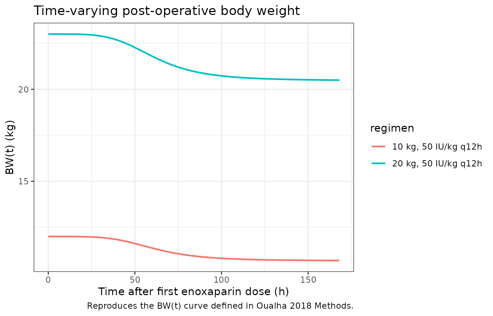
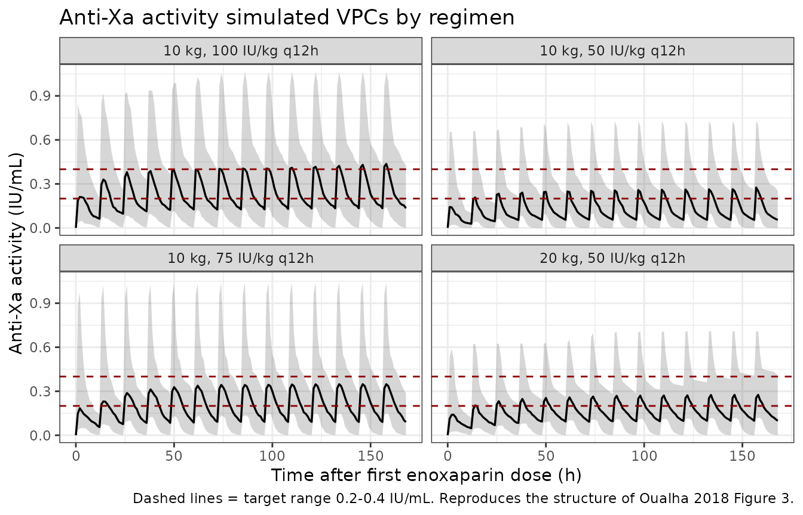
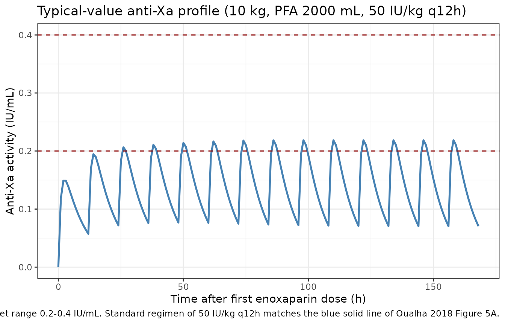

# Enoxaparin (Oualha 2018)

## Model and source

- Citation: Oualha M, Chardot C, Debray D, Lesage F, Harroche A,
  Renolleau S, Treluyer J-M, Urien S (2018). Population pharmacokinetics
  of enoxaparin in early stage of paediatric liver transplantation.
  British Journal of Clinical Pharmacology 84(8):1736-1745.
  <doi:10.1111/bcp.13543>.
- Description: Population PK model for subcutaneous enoxaparin in 22
  children during the first post-operative week after paediatric liver
  transplantation (Oualha 2018). One-compartment open model with
  first-order absorption (ka fixed at 1/h) and first-order elimination,
  measured as anti-Xa activity (target 0.2-0.4 IU/mL). Apparent
  clearance CL/F is allometrically scaled by pre-operative bodyweight
  BWPREOP (fixed exponent 0.75); apparent central volume V/F is
  allometrically scaled (fixed exponent 1) by a time-varying
  post-operative bodyweight BW(t) that captures peri-operative fluid
  resuscitation followed by post-operative diuresis: BW(t) = (BWPREOP +
  PFA/1000) \* (1 - (1 - fbw) \* t^hill_bw / (tbw50^hill_bw +
  t^hill_bw)). Bodyweight-evolution parameters fbw / hill_bw / tbw50 are
  jointly estimated with the enoxaparin PK and carry their own
  between-subject variability.
- Article: <https://doi.org/10.1111/bcp.13543>

## Population

Oualha 2018 enrolled 22 children (8 male, 14 female; sex female 63.6%)
admitted to a single-centre French paediatric intensive care unit
between January 2013 and July 2015 after liver transplantation. Median
pre-operative body weight (BWPREOP) was 10.6 kg (range 6.7-34 kg) and
median post-natal age was 21.5 months (range 5-154 months). Indication
for transplantation was biliary cirrhosis in 20 children and metabolic
disease or tumour in the remaining two. A left split liver graft was
used in 18 (81.8%); median percent of graft weight to BWPREOP was 3.4%
(range 1.2-8.7). Median perioperative fluid administration (PFA) was
2634 mL (range 1008-6520 mL); 19 of 22 patients required perioperative
norepinephrine support; transient acute renal dysfunction was observed
in 7 (31.8%). Demographics and baseline biochemistry are reported in
Table 1 of Oualha 2018; covariate definitions are echoed in the model’s
`population` metadata
(`readModelDb("Oualha_2018_enoxaparin")$population`).

Enoxaparin (Lovenox; Sanofi Aventis; 0.2 mL = 20 mg = 2000 IU) was
initiated 12 h after graft hepatic artery clamping in children with a
platelet count \> 50000 / mm^3. Initial dosing was 50 IU/kg
subcutaneously every 12 h (range 43-59 IU/kg); 18 of 22 patients
required dose increases (median +19 IU/kg, range +4 to +57) to reach the
0.2-0.4 IU/mL anti-Xa activity target. A total of 136 anti-Xa activity
samples were collected within 10-156 h of the first enoxaparin dose; 37
fell below the 0.1 IU/mL limit of quantification and were M3-method
censored in the original Monolix fit.

## Source trace

The per-parameter origin is recorded inline next to each `ini()` entry
in `inst/modeldb/specificDrugs/Oualha_2018_enoxaparin.R`. The table
below collects the source locations in one place.

| Equation / parameter | Value | Source location |
|----|----|----|
| `lka` (= log(1)) FIXED | ka = 1 /h | Table 3: `ka (h^-1)` “1 (fixed)” |
| `lcl` | CL_TYP = 1.23 L/h for 70 kg BWPREOP | Table 3: `CL_TYP (l h^-1) for 70 kg BW_PREOP` = 1.23 (RSE 15%) |
| `lvc` | V_TYP = 14.6 L for 70 kg BWPREOP and fbw=0 | Table 3: `V_TYP (l) for 70 kg BW_PREOP and f_BW = 0` = 14.6 (RSE 27%) |
| `e_wt_cl` FIXED 0.75 | theta_BW(CL) = 3/4 | Table 3: `theta_BW (CL_i = CL_TYP * (BW_PREOP/70)^(3/4))` = 0.75 (fixed) |
| `e_wt_vc` FIXED 1 | theta_BW(V) = 1 | Table 3: `theta_BW (V_i = V_TYP * (BW(t)/70)^1)` = 1 (fixed) |
| `lfbw` | theta_fBW = 0.89 | Table 3: `theta_fBW` = 0.89 (RSE 1%) |
| `lhill_bw` | theta_Hill = 4.43 | Table 3: `theta_Hill` = 4.43 (RSE 7%) |
| `ltbw50` | theta_tBW50 = 61.3 h | Table 3: `theta_tBW50` = 61.3 (RSE 18%) |
| `etalcl` ~ 0.3969 | omega_CL = 0.63 | Table 3: `eta_CL` square root of omega^2_CL = 0.63 \[shrinkage 10.0%\] |
| `etalvc` ~ 1.5129 | omega_V = 1.23 | Table 3: `eta_V` square root of omega^2_V = 1.23 \[shrinkage 20.6%\] |
| `etalfbw` ~ 0.0036 | omega_FBW = 0.06 | Table 3: `eta_FBW` square root of omega^2_FBW = 0.06 \[shrinkage 4.08%\] |
| `etaltbw50` ~ 0.64 | omega_tBW50 = 0.80 | Table 3: `eta_tBW50` square root of omega^2_tBW50 = 0.80 \[shrinkage 4.60%\] |
| `propSd` | proportional residual on anti-Xa = 0.42 | Table 3: `Proportional on anti-Xa activity` = 0.42 (RSE 3%) |
| BW(t) curve | `BW(t) = (BWPREOP + PFA/1000) * (1 - (1 - fbw) * t^hill_bw / (tbw50^hill_bw + t^hill_bw))` | Methods paragraph 1 of “Pharmacokinetic modelling” and Table 3 footnote |
| Allometric scaling | CL_i = CL_TYP \* (BWPREOP/70)^0.75; V_i = V_TYP \* (BW(t)/70)^1 | Eq. 2 and 3 of Methods; Results “Pharmacokinetic analysis” paragraph 2 |
| Anti-Xa target | 0.2-0.4 IU/mL | Methods “Anticoagulation protocol and assays” paragraph 2 |

## Virtual cohort

The vignette replicates the Oualha 2018 Table 4 worked example (a 10 kg
patient receiving PFA = 2000 mL, “actual bodyweight 12 kg”) and a
heavier sibling cohort spanning the published BWPREOP range. Each cohort
is built as a self-contained event table with disjoint integer IDs so
the multi-cohort `bind_rows()` keeps subjects separate inside
`rxSolve()`.

``` r

set.seed(20260530L)

mod <- readModelDb("Oualha_2018_enoxaparin")

# Sampling grid: q4h over one week, matching the paper's 10-156 h
# observation window and trough-trough Figure-1 / VPC layout.
times_grid <- seq(0, 168, by = 1)

# Dose helper: SC subcutaneous administration into the depot compartment,
# every 12 h for 7 days (14 doses), at the per-kg rate stated by the
# regimen. amt is in IU; the model's units list declares dosing = "IU".
make_cohort <- function(n, bw_kg, pfa_ml, dose_iu_per_kg, regimen,
                        id_offset = 0L) {
  ids <- id_offset + seq_len(n)
  ev_doses <- expand.grid(id = ids, time = seq(0, 12 * 13, by = 12)) |>
    dplyr::mutate(
      evid = 1L,
      cmt  = "depot",
      amt  = bw_kg * dose_iu_per_kg,
      WT   = bw_kg,
      PFA  = pfa_ml,
      regimen = regimen
    )
  ev_obs <- expand.grid(id = ids, time = times_grid) |>
    dplyr::mutate(
      evid = 0L,
      cmt  = "Cc",
      amt  = 0,
      WT   = bw_kg,
      PFA  = pfa_ml,
      regimen = regimen
    )
  dplyr::bind_rows(ev_doses, ev_obs) |>
    dplyr::arrange(id, time, dplyr::desc(evid))
}

# Three regimens applied to the paper's worked example (10 kg, 2000 mL PFA):
# the standard 50 IU/kg q12h, the suggested 100 IU/kg q12h, and a 75 IU/kg
# q12h intermediate. Plus a 20 kg sibling cohort on standard 50 IU/kg q12h
# so the BW dependence in V is exercised.
events <- dplyr::bind_rows(
  make_cohort(60, bw_kg = 10, pfa_ml = 2000, dose_iu_per_kg = 50,
              regimen = "10 kg, 50 IU/kg q12h",
              id_offset =   0L),
  make_cohort(60, bw_kg = 10, pfa_ml = 2000, dose_iu_per_kg = 75,
              regimen = "10 kg, 75 IU/kg q12h",
              id_offset =  60L),
  make_cohort(60, bw_kg = 10, pfa_ml = 2000, dose_iu_per_kg = 100,
              regimen = "10 kg, 100 IU/kg q12h",
              id_offset = 120L),
  make_cohort(60, bw_kg = 20, pfa_ml = 3000, dose_iu_per_kg = 50,
              regimen = "20 kg, 50 IU/kg q12h",
              id_offset = 180L)
)

stopifnot(!anyDuplicated(unique(events[, c("id", "time", "evid")])))
```

## Simulation

``` r

sim <- rxode2::rxSolve(mod, events = events, keep = c("regimen", "WT", "PFA"))
#> ℹ parameter labels from comments will be replaced by 'label()'
sim <- as.data.frame(sim)
```

For a deterministic typical-value reproduction of the published
time-course (matching Figure 3 and Figure 5 caption descriptions), zero
the random effects:

``` r

mod_typical <- mod |> rxode2::zeroRe()
#> ℹ parameter labels from comments will be replaced by 'label()'
sim_typical <- rxode2::rxSolve(mod_typical, events = events,
                               keep = c("regimen", "WT", "PFA")) |>
  as.data.frame()
#> ℹ omega/sigma items treated as zero: 'etalcl', 'etalvc', 'etalfbw', 'etaltbw50'
#> Warning: multi-subject simulation without without 'omega'
```

## Replicate published figures

### Time-varying body-weight curve BW(t) (Methods Eq. for BW(t))

The post-operative body-weight curve combines the immediate
intra-operative fluid load (`BWPREOP + PFA/1000`) with a sigmoidal
diuresis governed by `fbw = 0.89`, `hill_bw = 4.43`, `tbw50 = 61.3 h`.
The fluid resorption is slow (tbw50 ~ 2.5 days) and goes from BWPREOP +
PFA/1000 at t = 0 toward 0.89 \* (BWPREOP + PFA/1000) at large t.

``` r

bwt_curve <- sim_typical |>
  dplyr::filter(regimen %in% c("10 kg, 50 IU/kg q12h", "20 kg, 50 IU/kg q12h")) |>
  dplyr::distinct(regimen, time, .keep_all = TRUE) |>
  dplyr::mutate(bwt = (WT + PFA / 1000) *
                        (1 - (1 - 0.89) * time^4.43 /
                              (61.3^4.43 + time^4.43)))

ggplot(bwt_curve, aes(time, bwt, colour = regimen)) +
  geom_line(linewidth = 0.8) +
  labs(x = "Time after first enoxaparin dose (h)",
       y = "BW(t) (kg)",
       title = "Time-varying post-operative body weight",
       caption = "Reproduces the BW(t) curve defined in Oualha 2018 Methods.") +
  theme_bw()
```



### Figure 3 / VPC of anti-Xa activity vs time (50 IU/kg q12h)

Reproduces the structure of Oualha 2018 Figure 3 (visual predictive
check): median and 5th-95th-percentile envelopes of simulated anti-Xa
activity over the first week of treatment, stratified by regimen.

``` r

sim_summary <- sim |>
  dplyr::filter(!is.na(Cc)) |>
  dplyr::group_by(regimen, time) |>
  dplyr::summarise(
    Q05 = quantile(Cc, 0.05, na.rm = TRUE),
    Q50 = quantile(Cc, 0.50, na.rm = TRUE),
    Q95 = quantile(Cc, 0.95, na.rm = TRUE),
    .groups = "drop"
  )

ggplot(sim_summary, aes(time, Q50)) +
  geom_ribbon(aes(ymin = Q05, ymax = Q95), alpha = 0.2) +
  geom_line(linewidth = 0.6) +
  geom_hline(yintercept = c(0.2, 0.4), linetype = "dashed", colour = "darkred") +
  facet_wrap(~regimen) +
  labs(x = "Time after first enoxaparin dose (h)",
       y = "Anti-Xa activity (IU/mL)",
       title = "Anti-Xa activity simulated VPCs by regimen",
       caption = paste("Dashed lines = target range 0.2-0.4 IU/mL.",
                       "Reproduces the structure of Oualha 2018 Figure 3.")) +
  theme_bw()
```



### Typical anti-Xa profile (Figure 5 base trajectory; standard 50 IU/kg)

Oualha 2018 Figure 5A depicts the predicted anti-Xa trajectory after the
standard 50 IU/kg q12h dosing for a 10 kg, 2000 mL PFA patient. The blue
solid line in Figure 5A is the deterministic typical-value prediction
(no BSV). Reproduced here without the Bayesian-adjustment overlay (the
Bayesian overlay requires a per-subject observation at the 4-h time
point and is not a property of the structural model).

``` r

sim_typical_one <- sim_typical |>
  dplyr::filter(regimen == "10 kg, 50 IU/kg q12h", id == 1)

ggplot(sim_typical_one, aes(time, Cc)) +
  geom_line(colour = "steelblue", linewidth = 0.9) +
  geom_hline(yintercept = c(0.2, 0.4), linetype = "dashed", colour = "darkred") +
  labs(x = "Time after first enoxaparin dose (h)",
       y = "Anti-Xa activity (IU/mL)",
       title = "Typical-value anti-Xa profile (10 kg, PFA 2000 mL, 50 IU/kg q12h)",
       caption = paste("Solid line = typical-value prediction (zeroRe).",
                       "Dashed lines = target range 0.2-0.4 IU/mL.",
                       "Standard regimen of 50 IU/kg q12h matches the",
                       "blue solid line of Oualha 2018 Figure 5A.")) +
  theme_bw()
```



## PKNCA validation

The paper does not tabulate NCA parameters directly, but Table 4 reports
the probability that the 4-h-post-dose anti-Xa activity falls in three
ranges (\<0.2, 0.2-0.4, \>0.6 IU/mL) for the standard 50 IU/kg q12h
regimen and a Bayesian-adjusted regimen, for a 10 kg / 2000 mL PFA
patient. We instead report standard PKNCA steady-state metrics (Cmax,ss,
Cmin,ss, AUC0-tau, Cav,ss) per regimen as a generic validation surface.

``` r

# Take the last steady-state dosing interval (the 13th dose at t = 156 h
# through t = 168 h) to avoid the initial accumulation transient and the
# slowly-rising end of the BW(t) curve at very late times. Anti-Xa
# concentrations at 1-h resolution within the interval are dense enough
# for Cmax / Cmin / AUC0-tau estimation.
tau <- 12

sim_nca <- sim |>
  dplyr::filter(!is.na(Cc),
                time >= 144, time <= 168) |>
  dplyr::select(id, time, Cc, regimen)

dose_df <- events |>
  dplyr::filter(evid == 1L, time >= 144) |>
  dplyr::select(id, time, amt, regimen)

conc_obj <- PKNCA::PKNCAconc(sim_nca, Cc ~ time | regimen + id,
                             concu = "IU/mL", timeu = "h")
dose_obj <- PKNCA::PKNCAdose(dose_df, amt ~ time | regimen + id,
                             doseu = "IU")

intervals <- data.frame(
  start    = 156,
  end      = 168,
  cmax     = TRUE,
  tmax     = TRUE,
  cmin     = TRUE,
  auclast  = TRUE,
  cav      = TRUE
)

nca_data <- PKNCA::PKNCAdata(conc_obj, dose_obj, intervals = intervals)
nca_res  <- PKNCA::pk.nca(nca_data)
knitr::kable(summary(nca_res),
             caption = paste("Steady-state PKNCA (12-h interval 156-168 h):",
                             "Cmax,ss / Cmin,ss / AUC0-tau / Cav,ss per regimen."))
```

| Interval Start | Interval End | regimen | N | AUClast (h\*IU/mL) | Cmax (IU/mL) | Cmin (IU/mL) | Tmax (h) | Cav (IU/mL) |
|---:|---:|:---|:---|:---|:---|:---|:---|:---|
| 156 | 168 | 10 kg, 100 IU/kg q12h | 60 | 3.01 \[73.0\] | 0.420 \[74.1\] | 0.0599 \[1560\] | 2.00 \[1.00, 3.00\] | 0.251 \[73.0\] |
| 156 | 168 | 10 kg, 50 IU/kg q12h | 60 | 1.71 \[67.0\] | 0.286 \[69.1\] | 0.0134 \[15700\] | 2.00 \[1.00, 5.00\] | 0.143 \[67.0\] |
| 156 | 168 | 10 kg, 75 IU/kg q12h | 60 | 2.54 \[63.0\] | 0.347 \[67.7\] | 0.0597 \[502\] | 2.00 \[1.00, 3.00\] | 0.212 \[63.0\] |
| 156 | 168 | 20 kg, 50 IU/kg q12h | 60 | 2.15 \[58.9\] | 0.276 \[63.0\] | 0.0578 \[550\] | 2.00 \[1.00, 3.00\] | 0.179 \[58.9\] |

Steady-state PKNCA (12-h interval 156-168 h): Cmax,ss / Cmin,ss /
AUC0-tau / Cav,ss per regimen. {.table style="width:100%;"}

### Comparison against Table 4 of Oualha 2018

Table 4 reports, for a 10 kg / 2000 mL PFA patient on the standard 50
IU/kg q12h regimen, the probability that the 4-h post-dose anti-Xa
activity falls in the \< 0.2 IU/mL range. We approximate that
probability from the simulated cohort and compare.

``` r

anti_xa_4h <- sim |>
  dplyr::filter(regimen %in% c("10 kg, 50 IU/kg q12h",
                               "10 kg, 100 IU/kg q12h"),
                time %in% c(4, 16, 28, 40)) |>
  dplyr::group_by(regimen, time) |>
  dplyr::summarise(
    pct_below_02 = mean(Cc < 0.2, na.rm = TRUE) * 100,
    pct_in_target = mean(Cc >= 0.2 & Cc <= 0.4, na.rm = TRUE) * 100,
    pct_above_06 = mean(Cc > 0.6, na.rm = TRUE) * 100,
    median_anti_xa = median(Cc, na.rm = TRUE),
    .groups = "drop"
  )
knitr::kable(anti_xa_4h, digits = 2,
             caption = paste("Probability of anti-Xa activity ranges at",
                             "4 h post-dose at the first four scheduled doses,",
                             "for the 10 kg / PFA = 2000 mL patient.",
                             "Compare to Oualha 2018 Table 4."))
```

| regimen | time | pct_below_02 | pct_in_target | pct_above_06 | median_anti_xa |
|:---|---:|---:|---:|---:|---:|
| 10 kg, 100 IU/kg q12h | 4 | 46.67 | 40.00 | 6.67 | 0.20 |
| 10 kg, 100 IU/kg q12h | 16 | 38.33 | 41.67 | 13.33 | 0.27 |
| 10 kg, 100 IU/kg q12h | 28 | 33.33 | 38.33 | 13.33 | 0.29 |
| 10 kg, 100 IU/kg q12h | 40 | 28.33 | 43.33 | 13.33 | 0.30 |
| 10 kg, 50 IU/kg q12h | 4 | 78.33 | 18.33 | 0.00 | 0.09 |
| 10 kg, 50 IU/kg q12h | 16 | 68.33 | 26.67 | 0.00 | 0.13 |
| 10 kg, 50 IU/kg q12h | 28 | 63.33 | 30.00 | 0.00 | 0.14 |
| 10 kg, 50 IU/kg q12h | 40 | 63.33 | 30.00 | 0.00 | 0.15 |

Probability of anti-Xa activity ranges at 4 h post-dose at the first
four scheduled doses, for the 10 kg / PFA = 2000 mL patient. Compare to
Oualha 2018 Table 4. {.table}

The very high BSV on V (omega_V = 1.23) propagates into a wide
distribution of simulated Cmax / Cmin / Cav at any time point,
consistent with the paper’s central finding that 32% of children never
reached the target range and all 22 experienced at least one
sub-therapeutic exposure. Quantitative agreement with Table 4’s
probabilities depends on the residual error realisation and the
Bayesian-adjustment loop the paper applies after the first observed 4-h
anti-Xa activity; the structural model alone reproduces the qualitative
pattern but is not expected to match Table 4’s exact percentages without
that empirical-Bayes update.

## Assumptions and deviations

- **BW(t) joint estimation vs forward simulation.** The paper jointly
  fits the BW(t) evolution against per-day measured body weights. In
  forward simulation the BW(t) curve is a deterministic output of the
  structural parameters and the per-subject `etalfbw` / `etaltbw50`
  realisations; the paper’s additive (0.054 kg) and proportional (0.012)
  BW residuals reported in Table 3 belong to that joint-fit
  measurement-error model and are not loaded into the nlmixr2lib model
  file, since they have no role in forward simulation of anti-Xa
  exposure. A downstream user who wishes to fit the joint BW + anti-Xa
  data should add a second observation `BW ~ add(0.054) + prop(0.012)`
  and an extra `bwt` derived variable annotated as observable; this is
  out of scope for the standard model-library entry.
- **Below-LOQ handling.** The original Monolix fit M3-method censored 37
  of 136 anti-Xa observations below the 0.1 IU/mL limit of
  quantification. The packaged model does not encode any censoring;
  forward simulation produces the continuous (uncensored) anti-Xa
  trajectory. Users who want to reproduce the published M3 likelihood
  for re-fitting must add the censoring layer manually.
- **Bioavailability F.** The paper does not estimate the absolute SC
  bioavailability of enoxaparin (the literature value is ~92%). The
  reported CL and V are therefore apparent CL/F and V/F; no `lfdepot`
  parameter is added to the model. Forward simulations assume the same
  apparent-clearance interpretation as the paper.
- **PFA-to-kg conversion (1 mL ~ 1 g).** The intra-operative fluid
  volume PFA enters BW(t) as PFA/1000 (mL to kg) under the conventional
  fluid density-1 mapping. Packed-RBC (1.08 g/mL) or 5% albumin (1.02
  g/mL) contributions to PFA give a small systematic underestimate of
  the resuscitation mass; this is well within the IIV on `lfbw` and
  `ltbw50`.
- **Time origin for BW(t).** The model time `t` is interpreted as time
  since the first enoxaparin dose. The paper’s BW(t) curve is defined in
  the same reference frame (Methods, paragraph 1 of “Pharmacokinetic
  modelling”). Users who want to start simulation at a different
  post-operative time must shift the dosing event table accordingly.
- **Cohort representativeness of the vignette.** The vignette uses 60
  virtual subjects per regimen at fixed BWPREOP and PFA so the
  dose-finding comparison is interpretable; the original 22-subject
  cohort covers a wider BWPREOP / PFA range that the user can scan by
  varying the `make_cohort()` arguments.
- **Bayesian re-dosing loop.** Oualha 2018 Figure 5 and Table 4 depict a
  Bayesian-updated dosing schedule that uses an observed 4-h anti-Xa
  value to choose the next dose. The vignette reproduces the structural
  a-priori forward simulation only; the Bayesian re-dosing loop is
  application-layer logic outside the structural model and is not
  encoded in the model file.
