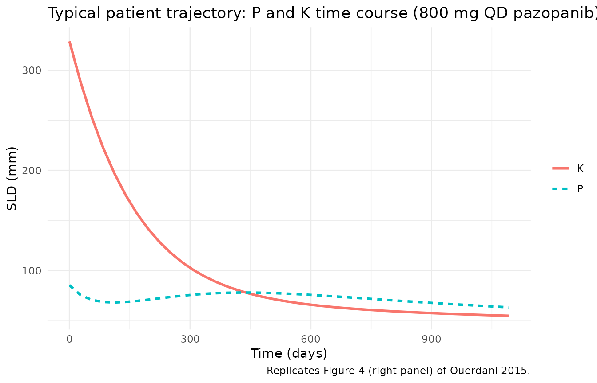
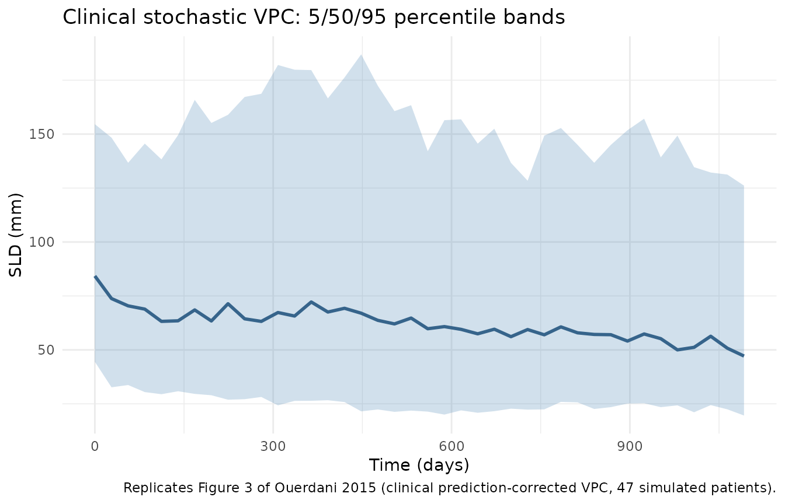
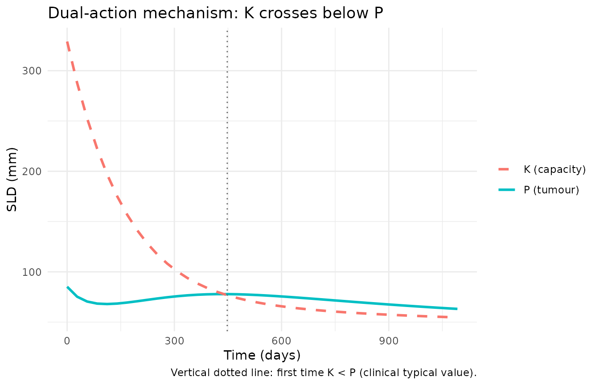

# Pazopanib clinical TGI (Ouerdani 2015)

## Model and source

- Citation: Ouerdani A, Struemper H, Suttle AB, Ouellet D, Ribba B.
  Preclinical modeling of tumor growth and angiogenesis inhibition to
  describe pazopanib clinical effects in renal cell carcinoma. *CPT
  Pharmacometrics Syst Pharmacol.* 2015;4(11):660-668.
  <doi:%5B10.1002/psp4.12001>\](<https://doi.org/10.1002/psp4.12001>).
- The on-disk PDF is the corrected version of the article (revised
  online 2015-11-12); the paper’s first-page footnote states that Table
  1 was replaced after the initial publication. All parameter values
  used here come from the corrected Table 1.

This vignette validates the clinical fit of the semi-mechanistic
tumour-growth and angiogenesis-inhibition (TGI) model in renal-cell
carcinoma patients. The paired preclinical (CAKI-2 xenograft mouse) fit
lives in `Ouerdani_2015_pazopanib_mouse` and is covered by a separate
vignette. The clinical fit differs from the preclinical fit in two
model-structure ways: (a) the empirical capacity-growth exponent `n` is
fixed at `0.5` (vs `1` in the mouse fit), and (b) both AUC exponents on
the drug-effect rates (`b_a` cytotoxic and `b_c` antiangiogenic) are
estimated (vs `b_a` fixed to 0 in the mouse fit).

## Population

47 adult patients with advanced and/or metastatic renal-cell carcinoma
of predominantly clear-cell histology, ages 43-79 years, with measurable
disease by RECIST. All were either treatment-naive or had received a
single prior systemic immunotherapy with cytokines, and/or had prior
surgery (nephrectomy) and/or radiotherapy; ECOG performance status 0 or
1; adequate haematologic, hepatic, and renal function. Patients received
800 mg pazopanib once daily, with dose reductions allowed in case of
intolerance (mean dose 727 mg/day, range 473-800). Disease assessments
by CT or MRI were scheduled at baseline, weeks 8 and 12, and every 8
weeks thereafter until RECIST 1.1 progression. The dataset comes from
the multicenter open-label Phase 2 study NCT00244764 (Ouerdani 2015
reference 16).

The same information is available programmatically via
`readModelDb("Ouerdani_2015_pazopanib")$population`.

## Source trace

Equations from Ouerdani 2015 Methods Equation 1 (clinical fit with
`n = 0.5`); parameter values from the corrected Table 1, clinical
column. Drug exposure (`AUC_PAZO`) is sourced from an Emax fit to mean
AUCs reported across five prior pazopanib trials at daily doses ranging
from 5 mg to 2000 mg (Ouerdani 2015 Methods, clinical-data section).

| Equation / parameter | Value | Source location |
|----|----|----|
| `d/dt(tumorSize)` | n/a | Ouerdani 2015 Methods Equation 1 |
| `d/dt(carryingCapacity)` | n/a | Ouerdani 2015 Methods Equation 1 |
| `a = a0 * AUC_PAZO^b_a` | n/a | Ouerdani 2015 Methods Equation 2 |
| `c = c0 * AUC_PAZO^b_c` | n/a | Ouerdani 2015 Methods Equation 3 |
| `lk_tumor` | `log(0.0021)` | Table 1 clinical k = 0.0021 (RSE 6%) |
| `lk_cap` (b) | `log(0.0392)` | Table 1 clinical b = 0.0392 (RSE 22%); IIV fixed to 0 |
| `lk_aa0` (c0) | `log(0.0023)` | Table 1 clinical c = 0.0023 (RSE 9%) |
| `lk_cyto0` (a0) | `log(0.0032)` | Table 1 clinical a = 0.0032 (RSE 2%) |
| `lk_res` (d) | `log(0.0153)` | Table 1 clinical d = 0.0153 (RSE 3%) |
| `lK0` | `log(329)` | Table 1 clinical K0 = 329 (RSE 25%); IIV fixed to 0 |
| `e_auc_pazo_k_aa` (b_c) | `0.142` | Table 1 clinical b_c = 0.142 (RSE 7%) |
| `e_auc_pazo_k_cyto` (b_a) | `0.125` | Table 1 clinical b_a = 0.125 (RSE 14%) |
| `n` | `fixed(0.5)` | Results: clinical fit uses n = 0.5 (vs n = 1 in the paired mouse fit) |
| `etalk_tumor` | `0.6724` (= 0.82^2) | Table 1 clinical IIV on k = 82% (RSE 35%) |
| `etalk_aa0` | `0.0961` (= 0.31^2) | Table 1 clinical IIV on c0 = 31% (RSE 51%) |
| `etalk_cyto0` | `0.3844` (= 0.62^2) | Table 1 clinical IIV on a0 = 62% (RSE 29%) |
| `etalk_res` | `1.0201` (= 1.01^2) | Table 1 clinical IIV on d = 101% (RSE 45%) |
| `propSd` | `0.08` | Table 1 clinical e1 = 8% (RSE 2%) |
| `addSd` | `1` | Table 1 clinical e2 = 1 mm (RSE 3%) |
| Mean `AUC_PAZO` (population) | `771.6 ug*h/mL` | Methods, clinical-data section; range 629.4-802.4 across 47 patients |

## Virtual cohort

The source dataset is 47 patients, all on pazopanib (no placebo arm);
per-patient AUC is derived from an Emax fit to the patient’s own dose
history. The virtual cohort below uses 47 patients on 800 mg pazopanib
once daily with a single average exposure of 771.6 ug\*h/mL throughout
follow-up (the paper’s reported population mean). Per-patient baseline
SLD (`TUM_SLD`) is drawn from a lognormal distribution centred near the
model’s typical K0 to span the tumour-burden range commonly seen in
advanced RCC.

``` r

set.seed(2015)

n_subjects     <- 47L
followup_days  <- 365 * 3L   # 3 years of follow-up; assessment grid every 28 days
obs_times      <- seq(0, followup_days, by = 28)

baseline_sld <- rlnorm(n_subjects, meanlog = log(85), sdlog = 0.45)  # span ~30-200 mm

events_clin <- tibble(
  id       = seq_len(n_subjects),
  TUM_SLD  = baseline_sld,
  AUC_PAZO = 771.6
) |>
  tidyr::crossing(time = obs_times) |>
  mutate(evid = 0L, amt = 0,
         trial = "NCT00244764 (Phase 2 RCC; 800 mg QD pazopanib)")

stopifnot(!anyDuplicated(unique(events_clin[, c("id", "time", "evid")])))
```

## Typical-value simulation (Figure 4 right panel)

Ouerdani 2015 Figure 4 (right panel) shows the typical-value time
courses of `P` (SLD) and `K` (carrying capacity) in patients. The
simulation reproduces the published mechanistic signature: (i) an
initial short-term SLD decline driven by the cytotoxic effect
`a * exp(-d*t)`; (ii) regrowth as the cytotoxic resistance `exp(-d*t)`
decays; (iii) a second, slower SLD decline as `K` (driven down by the
antiangiogenic effect `c`) crosses below `P`. The paper’s Discussion
notes this “unusual pattern” was observed in about 13% of patients; the
typical-value simulation puts the second-decline inflection near month
~17, in line with the published narrative.

``` r

mod_clin <- readModelDb("Ouerdani_2015_pazopanib")
mod_clin_typ <- mod_clin |> rxode2::zeroRe()
#> ℹ parameter labels from comments will be replaced by 'label()'

# For a clean typical-value trajectory plot, fix TUM_SLD to the cohort median
# so all subjects start at the same baseline; this isolates the model's
# mechanistic shape from baseline variability.
events_typical <- tibble(
  id       = 1L,
  TUM_SLD  = median(baseline_sld),
  AUC_PAZO = 771.6
) |>
  tidyr::crossing(time = obs_times) |>
  mutate(evid = 0L, amt = 0)

sim_clin_typ <- rxode2::rxSolve(
  mod_clin_typ,
  events = events_typical
) |>
  as.data.frame()
#> ℹ omega/sigma items treated as zero: 'etalk_tumor', 'etalk_aa0', 'etalk_cyto0', 'etalk_res'

clin_long <- sim_clin_typ |>
  select(time, P = tumorSize, K = carryingCapacity) |>
  pivot_longer(c(P, K), names_to = "state", values_to = "value")

ggplot(clin_long, aes(time, value, colour = state, linetype = state)) +
  geom_line(linewidth = 1) +
  labs(x = "Time (days)", y = "SLD (mm)",
       colour = NULL, linetype = NULL,
       title = "Typical patient trajectory: P and K time course (800 mg QD pazopanib)",
       caption = "Replicates Figure 4 (right panel) of Ouerdani 2015.") +
  theme_minimal()
```



## Stochastic VPC (Figure 3 of the paper)

Including IIV on `k`, `c0`, `a0`, and `d` (per the paper’s clinical
column) and the combined additive + proportional residual error gives a
stochastic VPC analogous to Figure 3 of the paper (prediction-corrected
VPC of the clinical SLD trajectories).

``` r

sim_clin_iiv <- rxode2::rxSolve(
  mod_clin,
  events = events_clin,
  keep   = c("trial")
) |>
  as.data.frame()
#> ℹ parameter labels from comments will be replaced by 'label()'

vpc_clin <- sim_clin_iiv |>
  group_by(time) |>
  summarise(
    Q05 = quantile(sim, 0.05, na.rm = TRUE),
    Q50 = quantile(sim, 0.50, na.rm = TRUE),
    Q95 = quantile(sim, 0.95, na.rm = TRUE),
    .groups = "drop"
  )

ggplot(vpc_clin, aes(time, Q50)) +
  geom_ribbon(aes(ymin = pmax(Q05, 0), ymax = Q95), alpha = 0.25, fill = "steelblue") +
  geom_line(linewidth = 1, colour = "steelblue4") +
  labs(x = "Time (days)", y = "SLD (mm)",
       title = "Clinical stochastic VPC: 5/50/95 percentile bands",
       caption = "Replicates Figure 3 of Ouerdani 2015 (clinical prediction-corrected VPC, 47 simulated patients).") +
  theme_minimal()
```



## Mechanistic sanity checks

### 1. Drug-free trajectory = pure logistic growth

Setting `AUC_PAZO = 0` zeroes both drug-effect rates via the model’s
`if (AUC_PAZO > 0)` gate. A “drug-free” simulation should therefore show
monotonic SLD growth (Verhulst-Pearl logistic plus capacity expansion).

``` r

events_off <- events_typical |>
  mutate(AUC_PAZO = 0)

sim_off <- rxode2::rxSolve(mod_clin_typ, events = events_off) |>
  as.data.frame()
#> ℹ omega/sigma items treated as zero: 'etalk_tumor', 'etalk_aa0', 'etalk_cyto0', 'etalk_res'

stopifnot(all(diff(sim_off$tumorSize) > 0))

knitr::kable(
  sim_off |>
    select(time, tumorSize, carryingCapacity) |>
    filter(time %in% c(0, 168, 364, 728, followup_days)),
  digits = 3,
  caption = "Drug-free clinical trajectory (AUC_PAZO = 0; pure logistic growth)."
)
```

| time | tumorSize | carryingCapacity |
|-----:|----------:|-----------------:|
|    0 |    85.174 |          329.000 |
|  168 |   110.225 |          393.890 |
|  364 |   147.451 |          480.758 |
|  728 |   245.373 |          678.427 |

Drug-free clinical trajectory (AUC_PAZO = 0; pure logistic growth).
{.table}

### 2. Dual-action mechanism: P and K crossings

In the published Discussion the long-term SLD decline is attributed to
the antiangiogenic effect `c` driving `K` below `P` after the initial
cytotoxic-effect-driven decline has been undone by the resistance term
`exp(-d*t)`. The simulation should show `K` crossing below `P` at some
point after the initial cytotoxic transient.

``` r

crossing_time <- sim_clin_typ |>
  filter(carryingCapacity < tumorSize) |>
  summarise(first_cross = min(time)) |>
  pull(first_cross)

cat(sprintf("Typical-value K-below-P crossover at t = %s days (~%.1f months)\n",
            crossing_time, crossing_time / 30.4))
#> Typical-value K-below-P crossover at t = 448 days (~14.7 months)

ggplot(sim_clin_typ, aes(time)) +
  geom_line(aes(y = tumorSize, colour = "P (tumour)"), linewidth = 1) +
  geom_line(aes(y = carryingCapacity, colour = "K (capacity)"), linewidth = 1, linetype = "dashed") +
  geom_vline(xintercept = crossing_time, linetype = "dotted", colour = "grey40") +
  labs(x = "Time (days)", y = "SLD (mm)",
       colour = NULL,
       title = "Dual-action mechanism: K crosses below P",
       caption = "Vertical dotted line: first time K < P (clinical typical value).") +
  theme_minimal()
```



### 3. Dimensional analysis of the ODE

| Term | Units | Reduces to |
|----|----|----|
| `k_tumor * tumorSize` | `1/day * mm` | `mm / day` |
| `(1 - tumorSize / carryingCapacity)` | unitless | unitless |
| `cyto_rate * exp(-k_res*t) * tumorSize` | `1/day * unitless * mm` | `mm / day` |
| `k_cap * tumorSize^n` | `(mm^0.5 / day) * mm^0.5` | `mm / day` (clinical n = 0.5) |
| `aa_rate * carryingCapacity` | `1/day * mm` | `mm / day` |

Both ODE right-hand sides reduce to `mm / day`, consistent with
`d/dt(state)` where `state` is in `mm` (SLD scale) and `t` is in days.
The clinical fit’s `n = 0.5` shifts the units burden onto `k_cap`, whose
effective unit becomes `mm^(0.5) / day`; that absorbs the source paper’s
preclinical-to-clinical re-parameterisation.

## Assumptions and deviations

- **[`checkModelConventions()`](https://nlmixr2.github.io/nlmixr2lib/reference/checkModelConventions.md)
  deviations (intentional).** Running
  `nlmixr2lib::checkModelConventions("Ouerdani_2015_pazopanib")` flags
  four warnings (no errors): (1) the `tumorSize` compartment is not on
  the canonical-compartment list; (2) the `carryingCapacity` compartment
  is not on the canonical-compartment list; (3) the single-output
  observation variable should be `Cc`; (4) `units$concentration` does
  not contain `/` (mass / volume). All four are intrinsic to a
  tumour-volume-dynamics model with no drug-concentration / dosing ODE.
  The same deviations apply to every other tumour-size-dynamics model in
  the package. SLD in mm is not a drug concentration; `Cc` is reserved
  for plasma drug concentrations and would be misleading here. The
  deviations are intentional.
- **`AUC_PAZO > 0` gate.** Same rationale as the paired mouse model: at
  AUC = 0 the power forms `a = a0 * AUC^b_a` and `c = c0 * AUC^b_c`
  would either give `0` (if both exponents are positive) or `a0` / `c0`
  (under the NONMEM convention `0^0 = 1`). The gate forces both rates to
  exactly zero off-treatment, which matches the paper’s no-drug-effect
  intent for permanent-discontinuation intervals. The clinical-fit
  exponents `b_a = 0.125` and `b_c = 0.142` are both strictly positive,
  so the gate only matters when the user simulates an off-treatment
  period (set `AUC_PAZO = 0`).
- **Per-patient baseline SLD drawn from a lognormal.** The paper sets P0
  per-patient from the observed baseline SLD but does not report
  individual values. The virtual cohort here draws `TUM_SLD` from a
  lognormal with median 85 mm and `sdlog = 0.45`, spanning approximately
  30-200 mm to match the qualitative range of clinical RCC baseline
  SLDs. Users with patient-level SLD data should supply `TUM_SLD`
  directly per subject.
- **Per-patient AUC fixed at the population mean.** The paper estimates
  per-patient AUC from an Emax fit to the patient’s own dose history.
  The virtual cohort uses the reported population mean of
  `771.6 ug*h/mL` for every subject; per-subject AUC variability around
  the mean (range 629.4-802.4) is not retained in this simulation.
- **PKNCA validation is omitted.** This is a tumour-size-dynamics model
  with no drug-concentration / dosing ODE. The vignette substitutes the
  mechanistic-sanity checks above (drug-free = pure growth, K-below-P
  crossover, dimensional analysis), matching the validation pattern used
  by the paired mouse model and by `Zecchin_2016_tumorovarian`.
- **Erratum (Table 1 replacement) folded into the on-disk PDF.** The
  paper’s first-page footnote states that an error in Table 1 was
  corrected, with the revised version published online on 2015-11-12.
  The on-disk PDF used for this extraction is the corrected version; all
  parameter values come from that corrected Table 1 (no separate erratum
  document to track).
