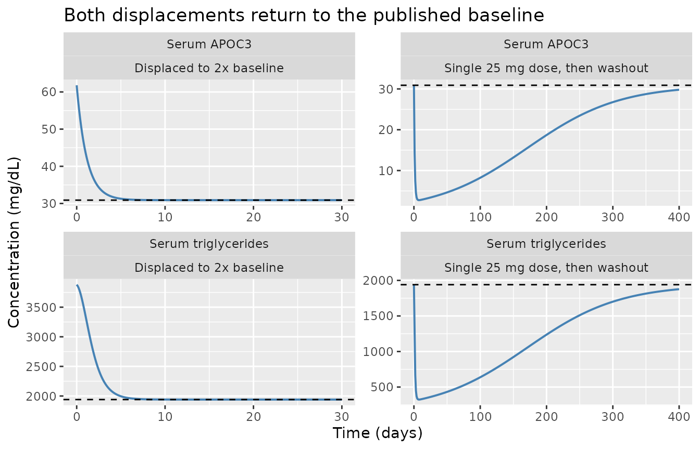
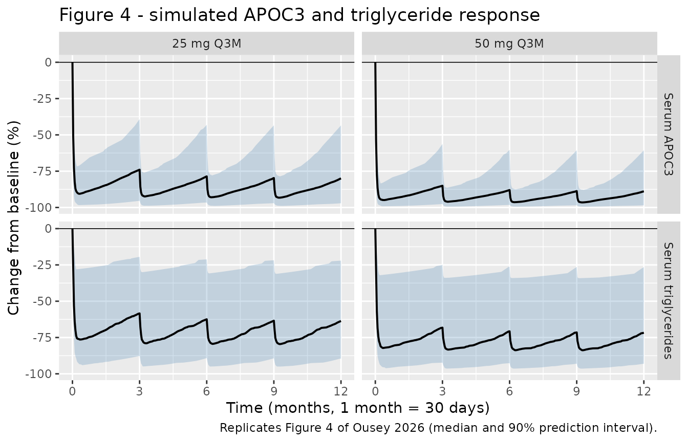

# Plozasiran (Ousey 2026)

## Model and source

    #> ℹ parameter labels from comments will be replaced by 'label()'

- Citation: Ousey J, Gosselin NH, Ta A, Shi J. Population
  Pharmacodynamic Modeling of Plozasiran for Treatment of Familial
  Chylomicronemia Syndrome. J Clin Pharmacol. 2026;66(4).
  <doi:10.1002/jcph.70190>. Model equations from the Supporting
  Information (Supplementary Equations); parameter estimates from Table
  2.

- Description: Cascading kinetic-pharmacodynamic (K-PD)
  indirect-response population PD model for plozasiran (an
  APOC3-targeting GalNAc-conjugated siRNA) in adult patients with
  familial chylomicronemia syndrome (Ousey 2026, Phase 3 PALISADE). No
  plasma PK is used: the subcutaneous dose enters a volume-less biophase
  (liver) compartment `depot_kpd` in mg and is eliminated first-order at
  kel (t1/2 = 48.1 days), which is the rate-limiting step sustaining the
  months-long PD effect. Plozasiran in the biophase inhibits zero-order
  serum APOC3 synthesis (Imax fixed to 100%, IC50 = 2.185 mg of biophase
  amount); serum APOC3 in turn inhibits first-order serum triglyceride
  clearance (Imax fixed to 100%, half-maximal APOC3 level 17.4 mg/dL).
  Body mass index acts on kel and on the APOC3-on-TG potency in opposing
  directions, and background triglyceride-lowering therapy potentiates
  the APOC3-on-TG step. Two simultaneous endpoints: serum APOC3 and
  serum triglycerides, both in mg/dL.

- Article: <https://doi.org/10.1002/jcph.70190>

Plozasiran (Redemplo) is a GalNAc-conjugated small interfering RNA that
silences hepatic *APOC3* messenger RNA. Its plasma half-life is only 3-4
h, but the pharmacodynamic effect persists for months because the drug
is sequestered in hepatocytes. Ousey 2026 therefore side-steps plasma PK
entirely and fits a **kinetic-pharmacodynamic (K-PD)** model in which
the dose enters a volume-less biophase (liver) compartment and drives a
two-step cascade:

1.  plozasiran in the biophase inhibits zero-order **serum APOC3**
    synthesis;
2.  serum APOC3 inhibits first-order **serum triglyceride** clearance.

Both steps use an inhibitory Imax form with the maximum fixed to 100%.
The biophase elimination half-life of 48 days is the rate-limiting step
that supports quarterly (Q3M) dosing.

## Population

The model was fit to the 12-month randomized, double-blinded period of
the Phase 3 PALISADE trial (NCT05089084) in 75 adults with familial
chylomicronemia syndrome (FCS): 26 (35%) received 25 mg Q3M plozasiran,
24 (32%) received 50 mg Q3M, and 25 (33%) received volume-matched
placebo, each as four subcutaneous doses. The cohort was balanced in sex
(50.7% female) and predominantly White (73.3%) with 21.3% Asian
participants. Median age was 44.0 years \[22, 76\], median body weight
70.2 kg \[43.5, 118\] and median body mass index 25.0 kg/m^2 \[18.5,
35.9\] (Ousey 2026 Table 1).

Baseline lipids were characteristic of FCS: median fasting serum APOC3
35.4 mg/dL \[10.0, 88.0\] and median fasting serum triglycerides 2044
mg/dL \[747, 6597\]. Of the 75 patients, 41 (54.7%) had genetically
confirmed FCS and 34 (45.3%) were clinically diagnosed; 55 (73.3%) were
on at least one stable background triglyceride-lowering therapy
(fibrates, omega-3 fatty acids or fish oil, statins). All patients had
normal hepatic function, so hepatic impairment could not be evaluated as
a covariate; renal function was normal in 59 (78.7%), mildly impaired in
12 (16.0%) and moderately impaired in 4 (5.3%).

A total of 2106 observations entered the fit: 1044 serum APOC3 (87.1%
within quantification limits, 11.5% below the 0.94 mg/dL LLOQ and
imputed to 0.47 mg/dL, 1.4% above the 88 mg/dL ULOQ and imputed to 88
mg/dL) and 1062 serum triglycerides (none below or above quantification
limits).

The same information is available programmatically from the model’s
`population` metadata:

``` r

str(ui$population, max.level = 1)
#> List of 18
#>  $ species         : chr "human"
#>  $ n_subjects      : int 75
#>  $ n_studies       : int 1
#>  $ n_observations  : int 2106
#>  $ age_range       : chr "22-76 years"
#>  $ age_median      : chr "44.0 years"
#>  $ weight_range    : chr "43.5-118 kg"
#>  $ weight_median   : chr "70.2 kg"
#>  $ bmi_range       : chr "18.5-35.9 kg/m^2"
#>  $ bmi_median      : chr "25.0 kg/m^2"
#>  $ sex_female_pct  : num 50.7
#>  $ race_ethnicity  : Named num [1:4] 73.3 21.3 1.3 4
#>   ..- attr(*, "names")= chr [1:4] "White" "Asian" "American Indian or Alaska Native" "Other"
#>  $ disease_state   : chr "Familial chylomicronemia syndrome (FCS) in adults: 41/75 (54.7%) genetically confirmed and 34/75 (45.3%) clinic"| __truncated__
#>  $ dose_range      : chr "Four Q3M subcutaneous doses of 25 mg (n = 26, 35%) or 50 mg (n = 24, 32%) plozasiran, or volume-matched placebo"| __truncated__
#>  $ regions         : chr "Multinational (PALISADE, NCT05089084), including Japan."
#>  $ renal_function  : chr "Normal 59 (78.7%), mild 12 (16.0%), moderate 4 (5.3%) by eGFR (normal >= 90, mild 60-90, moderate 30-60 mL/min)."
#>  $ hepatic_function: chr "Normal in all 75 patients by Child-Pugh and NCI-ODWG criteria; hepatic impairment therefore not evaluable as a PD covariate."
#>  $ notes           : chr "Demographics from Ousey 2026 Table 1. Only the 12-month randomized, double-blinded period of PALISADE was used "| __truncated__
```

## Source trace

Model equations come from the Supporting Information (Supplementary
Equations, supplement 1); every parameter value comes from Table 2. The
per-parameter origin is also recorded as an in-file comment beside each
`ini()` entry in `inst/modeldb/specificDrugs/Ousey_2026_plozasiran.R`.

### Equations

| Equation | Source location |
|----|----|
| `d/dt(depot_kpd) = -kel * depot_kpd` | Supplement 1, Supplementary Equations, eq. 1 (`dCe/dt = -Ce x Ke`) |
| `d/dt(apoc3) = ksyn_apoc3 * drug_effect_ploz - kdeg_apoc3 * apoc3` | Supplement 1, eq. 2 |
| `drug_effect_ploz = 1 - imax_ploz * depot_kpd / (ic50_ploz + depot_kpd)` | Supplement 1, eq. 3 (Hill exponent gamma rejected, see below) |
| `d/dt(tg) = ksyn_tg - kdeg_tg * tg * (1 - imax_apoc3 * apoc3 / (ki50_apoc3 + apoc3))` | Supplement 1, eq. 4 |
| `kdeg_apoc3 = ksyn_apoc3 / rbase_apoc3` | Forced by the drug-free steady state of eq. 2; not a reported parameter (see “Turnover reparameterisation”) |
| `ksyn_tg = kdeg_tg * rbase_tg * (1 - imax_apoc3 * rbase_apoc3 / (ki50_apoc3 + rbase_apoc3))` | Forced by the steady state of eq. 4; not a reported parameter |
| Log-normal IIV, proportional residual error | Methods, “Population PD Modeling” |

The supplement writes each Imax term with a Hill exponent gamma. The
Results section states that “Attempts to introduce a more complex
sigmoidal Imax/IC50 relationship via Hill coefficients did not
statistically improve the model fit and were rejected”, so gamma is 1
throughout and is not carried as a parameter.

### Parameters

| Parameter | Value | Source |
|:---|:---|:---|
| kel | 0.0144 /day | Table 2, ke; RSE 8.82% |
| rbase_apoc3 | 30.9 mg/dL | Table 2, BASE_APOC3; RSE 5.34% |
| ksyn_apoc3 | 1.13 mg/dL/h | Table 2, ksyn,APOC3; fixed |
| imax_ploz | 1 (100%) | Table 2, Imax,ploz; fixed |
| ic50_ploz | 2.185 mg | Table 2, IC50,ploz; RSE 18.3% |
| rbase_tg | 1940 mg/dL | Table 2, BASE_TG; RSE 7.39% |
| kdeg_tg | 0.724 /h | Table 2, kdeg,TG; fixed |
| imax_apoc3 | 1 (100%) | Table 2, Imax,APOC3; fixed |
| ki50_apoc3 | 17.4 mg/dL | Table 2, IC50,APOC3; RSE 59.9% |
| e_apoc3_rbase_apoc3 | 0.888 | Table 2, (baseline APOC3/34)^theta |
| e_trig_rbase_tg | 1.05 | Table 2, (baseline TG/2048)^theta |
| e_bmi_kel | 1.39 | Table 2, (BMI/25)^theta on ke |
| e_bmi_ki50_apoc3 | -7.17 | Table 2, (BMI/25)^theta on IC50,APOC3 |
| e_conmed_tglower_ki50_apoc3 | -1.79 | Table 2, TG-lowering therapy on IC50,APOC3, exp(theta) |
| IIV on kel | SD 0.316 (32.4% CV) | Table 2, between-subject variability |
| IIV on rbase_apoc3 | SD 0.176 (17.7% CV) | Table 2 |
| IIV on ic50_ploz | SD 0.984 (128% CV) | Table 2 |
| IIV on rbase_tg | SD 0.337 (34.6% CV) | Table 2 |
| IIV on ki50_apoc3 | SD 0.765 (89.2% CV) | Table 2 |
| Correlation of the two baselines | 0.150 | Table 2, Correlation BASE_APOC3, BASE_TG |
| propSd_apoc3 | 0.362 | Table 2, APOC3 proportional error 36.2% |
| propSd_tg | 0.527 | Table 2, TG proportional error 52.7% |

Source trace for every ini() entry (Ousey 2026 Table 2). {.table}

Table 2 reports the between-subject variability as a log-scale
**standard deviation** with the log-normal CV% in parentheses, whereas
`ini()` takes variances. Each `ini()` entry is therefore the square of
the printed SD. The reading is confirmed by reproducing the printed CV%
exactly:

``` r

sd_pub <- c(kel = 0.316, rbase_apoc3 = 0.176, ic50_ploz = 0.984,
            rbase_tg = 0.337, ki50_apoc3 = 0.765)
cv_pub <- c(kel = 32.4, rbase_apoc3 = 17.7, ic50_ploz = 128,
            rbase_tg = 34.6, ki50_apoc3 = 89.2)
cv_derived <- 100 * sqrt(exp(sd_pub^2) - 1)
round(rbind(published = cv_pub, `from SD` = cv_derived), 1)
#>            kel rbase_apoc3 ic50_ploz rbase_tg ki50_apoc3
#> published 32.4        17.7     128.0     34.6       89.2
#> from SD   32.4        17.7     127.8     34.7       89.2

# Every derived CV% must land on the printed one (Table 2 is printed to 3
# significant figures, so 0.5 percentage points is the resolution of the check).
stopifnot(all(abs(cv_derived - cv_pub) < 0.5))
```

### Dimensional analysis

The model time unit is days. Table 2 reports `kel` in 1/day but
`ksyn_apoc3` in mg/dL/h and `kdeg_tg` in 1/h, so those two are
multiplied by 24 h/day inside `model()`; the `ini()` values remain the
literal Table 2 numbers.

| Term | Units multiplied out | Required |
|----|----|----|
| `kel * depot_kpd` | (1/day) \* mg | mg/day |
| `ksyn_apoc3 * drug_effect_ploz` | (mg/dL/day) \* (unitless) | (mg/dL)/day |
| `kdeg_apoc3 * apoc3` | (1/day) \* mg/dL | (mg/dL)/day |
| `kdeg_apoc3 = ksyn_apoc3 / rbase_apoc3` | (mg/dL/day) / (mg/dL) | 1/day |
| `ksyn_tg` | (1/day) \* (mg/dL) \* (unitless) | (mg/dL)/day |
| `kdeg_tg * tg * apoc3_effect_tg` | (1/day) \* (mg/dL) \* (unitless) | (mg/dL)/day |
| `depot_kpd / (ic50_ploz + depot_kpd)` | mg / mg | unitless |
| `apoc3 / (ki50_apoc3 + apoc3)` | (mg/dL) / (mg/dL) | unitless |

Every right-hand side matches `[state]/[time]`. Note that `ic50_ploz` is
an **amount in mg**, not a concentration: the biophase is volume-less,
so `depot_kpd` holds mg of plozasiran and the paper describes IC50,ploz
as “the plozasiran dose (equivalently the amount in the effect
compartment)”.

### Internal consistency of the covariate coding

The paper pins the reference category of the
triglyceride-lowering-therapy covariate arithmetically, which lets the
encoding be verified rather than assumed. Results states that
“IC50,APOC3 is estimated to be 2.91 and 17.4 mg/dL with and without
concomitant TG-lowering therapy, respectively”:

``` r

ki50_off <- 17.4
ki50_on  <- ki50_off * exp(-1.79)
c(off_therapy = ki50_off, on_therapy = ki50_on)
#> off_therapy  on_therapy 
#>   17.400000    2.905107

# Table 2's typical value of 17.4 mg/dL is therefore the OFF-therapy
# (reference) value, and CONMED_TGLOWER = 1 means on therapy.
stopifnot(abs(ki50_on - 2.91) < 0.01)

# The biophase half-life quoted in the abstract and Results is 48.1 days.
stopifnot(abs(log(2) / 0.0144 - 48.1) < 0.05)
```

## Mechanistic checks

This is a turnover model with no plasma concentration to integrate, so
NCA is not the right validation target and no PKNCA section appears
below. The paper reports no NCA analysis of either output. The checks in
this section are the turnover-model equivalents: a steady-state hold,
perturbation recovery, and a symbolic flux balance.

``` r

mod   <- nlmixr2lib::readModelDb("Ousey_2026_plozasiran")
typ   <- rxode2::zeroRe(mod)
#> ℹ parameter labels from comments will be replaced by 'label()'
BASE_APOC3 <- 30.9
BASE_TG    <- 1940

# Reference covariate values: the centring values printed in Table 2, which
# make every covariate factor exactly 1, plus the cohort-modal therapy status.
ref_cov <- list(BMI = 25, APOC3 = 34, TRIG = 2048, CONMED_TGLOWER = 1L)

# Build a single-subject event table. Observation rows carry an ODE state name
# in `cmt` (never an algebraic observable) and dvid = 1 so rxode2 returns both
# endpoint columns.
make_ev <- function(dose, times, ii = 90, addl = 3, cov = ref_cov) {
  ev <- if (is.null(dose)) {
    rxode2::et(times, cmt = "apoc3")
  } else {
    rxode2::et(amt = dose, cmt = "depot_kpd", ii = ii, addl = addl) |>
      rxode2::et(times, cmt = "apoc3")
  }
  ev <- as.data.frame(ev)
  ev$dvid <- ifelse(ev$evid == 0, 1L, NA_integer_)
  for (nm in names(cov)) ev[[nm]] <- cov[[nm]]
  ev
}

solve_typ <- function(ev) {
  out <- rxode2::rxSolve(typ, ev, returnType = "data.frame", useLinCmt = FALSE)
  # rxSolve omits `id` entirely for a single-subject event table.
  if (is.null(out$id)) out$id <- 1L
  out
}
```

Note on displacing a state: this model sets its initial conditions
inside `model()` (`apoc3(0) <- rbase_apoc3`), which takes precedence
over an `inits =` argument to `rxSolve()`. Passing `inits =` here would
be silently ignored and the “perturbation” check would hold at baseline
and pass while testing nothing. The checks below therefore displace the
states the two ways that actually work: by dosing into the biomarker
compartment, and by dosing drug and letting it wash out.

### Steady-state hold (placebo arm)

PALISADE randomized 25 patients to placebo and those records were
retained in the fit, so an undosed subject must sit at their own
baseline indefinitely. With no dose the biophase is empty,
`drug_effect_ploz` is 1, and both states must hold.

``` r

pbo <- solve_typ(make_ev(dose = NULL, times = seq(0, 720, by = 5)))
#> ℹ omega/sigma items treated as zero: 'etalkel', 'etalic50_ploz', 'etalki50_apoc3', 'etalrbase_apoc3', 'etalrbase_tg'

range(pbo$apoc3)
#> [1] 30.9 30.9
range(pbo$tg)
#> [1] 1940 1940

# Machine-precision hold over two years -- this is the check that catches a
# sign error, a missing ODE term, or a mistyped baseline.
stopifnot(
  max(abs(pbo$apoc3 / BASE_APOC3 - 1)) < 1e-8,
  max(abs(pbo$tg    / BASE_TG    - 1)) < 1e-8
)
```

### Perturbation recovery

Displacing either state away from baseline must produce a monotone
return to that same baseline, confirming the baseline is a genuine
stable attractor of the ODEs rather than only an initial condition.

#### Upward displacement

Dosing one baseline’s worth of material into each biomarker compartment
doubles it. Both states must then fall monotonically back to the
published baseline.

``` r

ev_up <- rxode2::et(amt = BASE_APOC3, cmt = "apoc3", time = 0) |>
  rxode2::et(amt = BASE_TG, cmt = "tg", time = 0) |>
  rxode2::et(seq(0, 30, by = 0.1), cmt = "apoc3")
ev_up <- as.data.frame(ev_up)
ev_up$dvid <- ifelse(ev_up$evid == 0, 1L, NA_integer_)
for (nm in names(ref_cov)) ev_up[[nm]] <- ref_cov[[nm]]

up <- solve_typ(ev_up)
#> ℹ omega/sigma items treated as zero: 'etalkel', 'etalic50_ploz', 'etalki50_apoc3', 'etalrbase_apoc3', 'etalrbase_tg'

# First: the displacement actually happened. This is the assertion an ignored
# `inits =` would have failed, and without it the rest of the check is vacuous.
stopifnot(
  abs(up$apoc3[1] / (2 * BASE_APOC3) - 1) < 1e-6,
  abs(up$tg[1]    / (2 * BASE_TG)    - 1) < 1e-6
)

# Then: monotone return to baseline.
stopifnot(
  all(diff(up$apoc3) <= 1e-9),
  all(diff(up$tg)    <= 1e-9),
  abs(tail(up$apoc3, 1) / BASE_APOC3 - 1) < 1e-6,
  abs(tail(up$tg,    1) / BASE_TG    - 1) < 1e-6
)
```

#### Downward displacement by drug, then washout

A single 25 mg dose drives both biomarkers down; once the drug has left
the biophase the system must climb back to the same baseline. Five years
is roughly 38 biophase half-lives. This also confirms the inhibition is
fully reversible and leaves no permanent change.

``` r

down <- solve_typ(make_ev(25, times = seq(0, 1825, by = 1), addl = 0))
#> Warning: 'ii' requires non zero additional doses ('addl') or steady state
#> dosing ('ii': 90.000000, 'ss': 0; 'addl': 0), reset 'ii' to zero
#> ℹ omega/sigma items treated as zero: 'etalkel', 'etalic50_ploz', 'etalki50_apoc3', 'etalrbase_apoc3', 'etalrbase_tg'

i_a <- which.min(down$apoc3)
i_t <- which.min(down$tg)
round(c(nadir_day_apoc3 = down$time[i_a], nadir_day_tg = down$time[i_t],
        nadir_pct_apoc3 = 100 * (min(down$apoc3) / BASE_APOC3 - 1),
        nadir_pct_tg    = 100 * (min(down$tg)    / BASE_TG    - 1)), 1)
#> nadir_day_apoc3    nadir_day_tg nadir_pct_apoc3    nadir_pct_tg 
#>             8.0             8.0           -91.1           -83.3

stopifnot(
  # The dose really did suppress APOC3 (again, guard against a vacuous check).
  min(down$apoc3) < 0.2 * BASE_APOC3,
  # Monotone recovery from each nadir back to the published baseline.
  all(diff(down$apoc3[i_a:nrow(down)]) >= -1e-9),
  all(diff(down$tg[i_t:nrow(down)])    >= -1e-9),
  abs(tail(down$apoc3, 1) / BASE_APOC3 - 1) < 1e-4,
  abs(tail(down$tg,    1) / BASE_TG    - 1) < 1e-4
)

bind_rows(
  up   |> mutate(scenario = "Displaced to 2x baseline"),
  down |> filter(time <= 400) |> mutate(scenario = "Single 25 mg dose, then washout")
) |>
  select(time, scenario, apoc3, tg) |>
  pivot_longer(c(apoc3, tg), names_to = "state", values_to = "value") |>
  mutate(state = ifelse(state == "apoc3", "Serum APOC3", "Serum triglycerides")) |>
  ggplot(aes(time, value)) +
  geom_line(linewidth = 0.7, colour = "steelblue") +
  geom_hline(
    data = tibble(
      state    = rep(c("Serum APOC3", "Serum triglycerides"), each = 2),
      scenario = rep(c("Displaced to 2x baseline",
                       "Single 25 mg dose, then washout"), times = 2),
      y        = rep(c(BASE_APOC3, BASE_TG), each = 2)
    ),
    aes(yintercept = y), linetype = "dashed"
  ) +
  facet_wrap(~ state + scenario, scales = "free", ncol = 2) +
  labs(x = "Time (days)", y = "Concentration (mg/dL)",
       title = "Both displacements return to the published baseline")
```



### Flux balance at baseline

At the drug-free steady state every production flux must cancel its
elimination flux. This is what forces the two rate constants the paper
does not report, so it is worth confirming symbolically as well as
numerically.

``` r

ksyn_apoc3 <- 1.13 * 24                 # mg/dL/day
kdeg_tg    <- 0.724 * 24                # 1/day
ki50       <- 17.4 * exp(-1.79)         # on background therapy

kdeg_apoc3 <- ksyn_apoc3 / BASE_APOC3
ksyn_tg    <- kdeg_tg * BASE_TG * (1 - BASE_APOC3 / (ki50 + BASE_APOC3))

# APOC3: synthesis (no drug, so DrugEffect = 1) minus degradation
flux_apoc3 <- ksyn_apoc3 * 1 - kdeg_apoc3 * BASE_APOC3
# TG: synthesis minus (APOC3-inhibited) clearance
flux_tg <- ksyn_tg - kdeg_tg * BASE_TG * (1 - BASE_APOC3 / (ki50 + BASE_APOC3))

c(apoc3 = flux_apoc3, tg = flux_tg)
#> apoc3    tg 
#>     0     0
stopifnot(abs(flux_apoc3) < 1e-9, abs(flux_tg) < 1e-9)

# The implied turnover half-lives are physiologically sensible: APOC3 ~19 h and
# triglycerides ~1 h, both far faster than the 48-day biophase half-life, which
# is what makes the biophase the rate-limiting step.
round(c(apoc3_h = log(2) / kdeg_apoc3 * 24,
        tg_h    = log(2) / kdeg_tg * 24,
        biophase_day = log(2) / 0.0144), 2)
#>      apoc3_h         tg_h biophase_day 
#>        18.95         0.96        48.14
```

## Replicating the published steady-state response (Table 3)

Table 3 reports the median steady-state nadir (maximum reduction),
trough (minimum reduction) and time-averaged percentage change from
baseline for both endpoints and both dose regimens. The APOC3 arm is a
near-exact typical-value target: because 25 mg is more than ten times
`ic50_ploz`, the APOC3 response is almost saturated and therefore almost
insensitive to the covariate and IIV distributions, so the typical-value
prediction and the cohort median nearly coincide. The triglyceride arm
is not – it depends strongly on `ki50_apoc3`, which carries both a large
IIV and the two retained covariate effects – so it is validated against
the cohort simulation in the next section instead.

``` r

# Steady state = the fourth (final) dosing interval, days 270-360.
ss_window <- function(dose) {
  s <- solve_typ(make_ev(dose, times = seq(0, 360, by = 0.25)))
  s[s$time >= 270 & s$time <= 360, ]
}

apoc3_typ <- lapply(c(25, 50), function(d) {
  ss <- ss_window(d)
  tibble(
    regimen = paste(d, "mg Q3M"),
    nadir   = 100 * (min(ss$apoc3)  / BASE_APOC3 - 1),
    trough  = 100 * (max(ss$apoc3)  / BASE_APOC3 - 1),
    average = 100 * (mean(ss$apoc3) / BASE_APOC3 - 1)
  )
}) |> bind_rows()
#> ℹ omega/sigma items treated as zero: 'etalkel', 'etalic50_ploz', 'etalki50_apoc3', 'etalrbase_apoc3', 'etalrbase_tg'
#> ℹ omega/sigma items treated as zero: 'etalkel', 'etalic50_ploz', 'etalki50_apoc3', 'etalrbase_apoc3', 'etalrbase_tg'

# Ousey 2026 Table 3, APOC3 "Percentage change from baseline" medians.
apoc3_pub <- tibble::tribble(
  ~regimen,      ~nadir, ~trough, ~average,
  "25 mg Q3M",   -93.4,  -79.7,   -87.9,
  "50 mg Q3M",   -96.7,  -88.9,   -93.6
)

apoc3_cmp <- apoc3_typ |>
  pivot_longer(-regimen, names_to = "metric", values_to = "simulated") |>
  left_join(
    apoc3_pub |> pivot_longer(-regimen, names_to = "metric", values_to = "published"),
    by = c("regimen", "metric")
  ) |>
  mutate(difference = simulated - published)

apoc3_cmp |>
  mutate(across(c(simulated, published, difference), \(x) round(x, 1))) |>
  rename("Regimen" = regimen, "Metric" = metric,
         "Simulated (%)" = simulated, "Published median (%)" = published,
         "Difference (pp)" = difference) |>
  knitr::kable(
    caption = paste("Typical-value steady-state APOC3 percentage change from",
                    "baseline vs the medians in Ousey 2026 Table 3.")
  )
```

| Regimen   | Metric  | Simulated (%) | Published median (%) | Difference (pp) |
|:----------|:--------|--------------:|---------------------:|----------------:|
| 25 mg Q3M | nadir   |         -93.5 |                -93.4 |            -0.1 |
| 25 mg Q3M | trough  |         -81.1 |                -79.7 |            -1.4 |
| 25 mg Q3M | average |         -88.6 |                -87.9 |            -0.7 |
| 50 mg Q3M | nadir   |         -96.7 |                -96.7 |             0.0 |
| 50 mg Q3M | trough  |         -89.6 |                -88.9 |            -0.7 |
| 50 mg Q3M | average |         -93.9 |                -93.6 |            -0.3 |

Typical-value steady-state APOC3 percentage change from baseline vs the
medians in Ousey 2026 Table 3. {.table}

``` r


# All six APOC3 anchors land within 1.4 percentage points; the residual gap is
# the typical-value-vs-cohort-median difference, not a transcription error.
# This solve uses zeroRe(), so it is fully deterministic -- there is no cohort
# draw to vary across rxode2 versions and the bound can sit just above the
# accuracy actually achieved.
stopifnot(max(abs(apoc3_cmp$difference)) < 2)
```

## Virtual cohort

Individual PALISADE data are not public. The cohort below reproduces the
published marginal covariate distributions (Ousey 2026 Table 1) with 200
subjects per active arm, which is the per-arm cap for these vignettes.
Continuous covariates are drawn from log-normal distributions matched to
the published median and truncated to the published range; the joint
covariate structure is not published, so the covariates are drawn
independently (see “Assumptions and deviations”).

``` r

rxode2::rxSetSeed(20260831)
set.seed(20260831)

n_arm <- 200L

# Log-normal matched to the published median, with the SD chosen so that the
# published [min, max] spans roughly the central 99% of the draw, then
# truncated to the published range.
draw_ln <- function(n, med, lo, hi) {
  sdlog <- (log(hi) - log(lo)) / (2 * qnorm(0.995))
  pmin(pmax(rlnorm(n, log(med), sdlog), lo), hi)
}

# ONE virtual population, dosed at both regimens -- matching the paper, which
# "created" a single virtual FCS population and simulated both 25 mg Q3M and
# 50 mg Q3M on it. `pair` is the shared subject index across the two arms, so
# every 25 mg subject has a 50 mg twin with identical covariates.
subj_base <- tibble(
  pair           = seq_len(n_arm),
  BMI            = draw_ln(n_arm, 25.0, 18.5, 35.9),
  APOC3          = draw_ln(n_arm, 35.4, 10.0, 88.0),
  TRIG           = draw_ln(n_arm, 2044, 747, 6597),
  # 55/75 = 73.3% of PALISADE patients were on background therapy.
  CONMED_TGLOWER = rbinom(n_arm, 1L, 0.733)
)

make_arm <- function(dose, id_offset) {
  # rxSolve renumbers `id` from 1 within each call, so carry a globally unique
  # subject key as its own column and keep = it through the solve.
  subj <- subj_base |>
    mutate(id      = id_offset + pair,
           subject = id_offset + pair,
           regimen = paste(dose, "mg Q3M"))
  doses <- subj |>
    mutate(time = 0, amt = dose, evid = 1L, cmt = "depot_kpd",
           dvid = NA_integer_)
  obs <- subj |>
    tidyr::crossing(time = seq(0, 360, by = 1)) |>
    mutate(amt = NA_real_, evid = 0L, cmt = "apoc3", dvid = 1L)
  bind_rows(doses, obs) |>
    arrange(id, time, desc(evid)) |>
    mutate(ii = ifelse(evid == 1L, 90, 0), addl = ifelse(evid == 1L, 3L, 0L))
}

events <- bind_rows(make_arm(25, 0L), make_arm(50, n_arm))
stopifnot(!anyDuplicated(unique(events[, c("id", "time", "evid")])))

# The two arms must be covariate-identical, subject for subject.
stopifnot(
  identical(
    events |> filter(regimen == "25 mg Q3M") |>
      distinct(pair, BMI, APOC3, TRIG, CONMED_TGLOWER) |> arrange(pair),
    events |> filter(regimen == "50 mg Q3M") |>
      distinct(pair, BMI, APOC3, TRIG, CONMED_TGLOWER) |> arrange(pair)
  )
)

# Confirm the drawn population matches the published marginals it is meant to.
subj_base |>
  summarise(
    n = n(),
    BMI_median = median(BMI), APOC3_median = median(APOC3),
    TRIG_median = median(TRIG), on_therapy_pct = 100 * mean(CONMED_TGLOWER)
  ) |>
  mutate(across(where(is.numeric), \(x) round(x, 1))) |>
  knitr::kable(caption = "Virtual cohort marginals (published: BMI 25.0, APOC3 35.4, TRIG 2044 mg/dL, 73.3% on therapy).")
```

|   n | BMI_median | APOC3_median | TRIG_median | on_therapy_pct |
|----:|-----------:|-------------:|------------:|---------------:|
| 200 |       25.2 |         35.8 |      1957.2 |             75 |

Virtual cohort marginals (published: BMI 25.0, APOC3 35.4, TRIG 2044
mg/dL, 73.3% on therapy). {.table}

``` r

# One rxSolve call per arm: rxSolve on an rxUi scales poorly with the number of
# subjects in a single call.
sim <- lapply(split(events, events$regimen), function(ev) {
  # Reseed INSIDE the loop so both arms draw the same etas (common random
  # numbers). Combined with the shared covariates above, each 25 mg subject and
  # their 50 mg twin then differ only by dose, which turns the between-regimen
  # comparisons below into exact per-subject contrasts instead of noisy
  # between-cohort ones.
  rxode2::rxSetSeed(20260831)
  rxode2::rxSolve(
    mod, ev,
    keep = c("pair", "subject", "regimen", "BMI", "CONMED_TGLOWER"),
    returnType = "data.frame", useLinCmt = FALSE
  )
}) |> bind_rows()
#> ℹ parameter labels from comments will be replaced by 'label()'

stopifnot(all(is.finite(sim$apoc3)), all(sim$apoc3 > 0))
stopifnot(all(is.finite(sim$tg)), all(sim$tg > 0))

# `subject` is the globally unique key; every arm must be fully represented.
stopifnot(dplyr::n_distinct(sim$subject) == 2L * n_arm)

# Per-subject baseline at t = 0, taken once per subject so a duplicated
# time-zero row (dose + observation) cannot fan the joins out below.
base_by_subject <- sim |>
  filter(time == 0) |>
  group_by(subject) |>
  summarise(apoc3_0 = first(apoc3), tg_0 = first(tg), .groups = "drop")
stopifnot(nrow(base_by_subject) == 2L * n_arm)
```

### Steady-state summary against Table 3

``` r

per_subject <- sim |>
  filter(time >= 270, time <= 360) |>
  group_by(regimen, pair, subject) |>
  summarise(
    apoc3_nadir  = min(apoc3),  apoc3_trough = max(apoc3),
    apoc3_avg    = mean(apoc3),
    tg_nadir     = min(tg),     tg_trough    = max(tg),
    tg_avg       = mean(tg),
    .groups = "drop"
  ) |>
  left_join(base_by_subject, by = "subject") |>
  mutate(
    apoc3_nadir_pct  = 100 * (apoc3_nadir  / apoc3_0 - 1),
    apoc3_trough_pct = 100 * (apoc3_trough / apoc3_0 - 1),
    apoc3_avg_pct    = 100 * (apoc3_avg    / apoc3_0 - 1),
    tg_nadir_pct     = 100 * (tg_nadir     / tg_0 - 1),
    tg_trough_pct    = 100 * (tg_trough    / tg_0 - 1),
    tg_avg_pct       = 100 * (tg_avg       / tg_0 - 1)
  )

cohort_med <- per_subject |>
  group_by(regimen) |>
  summarise(across(ends_with("_pct"), median), .groups = "drop") |>
  pivot_longer(-regimen, names_to = "key", values_to = "simulated") |>
  mutate(
    endpoint = ifelse(grepl("^apoc3", key), "APOC3", "Triglycerides"),
    metric   = sub("_pct$", "", sub("^(apoc3|tg)_", "", key)),
    # The summarise() above names the time-average column "avg"; the published
    # table below labels the same metric "average".
    metric   = ifelse(metric == "avg", "average", metric)
  ) |>
  select(-key)

# Ousey 2026 Table 3, "Percentage change from baseline" medians.
pub_med <- tibble::tribble(
  ~regimen,     ~endpoint,        ~metric,   ~published,
  "25 mg Q3M",  "APOC3",          "nadir",   -93.4,
  "25 mg Q3M",  "APOC3",          "trough",  -79.7,
  "25 mg Q3M",  "APOC3",          "average", -87.9,
  "25 mg Q3M",  "Triglycerides",  "nadir",   -76.5,
  "25 mg Q3M",  "Triglycerides",  "trough",  -59.3,
  "25 mg Q3M",  "Triglycerides",  "average", -68.6,
  "50 mg Q3M",  "APOC3",          "nadir",   -96.7,
  "50 mg Q3M",  "APOC3",          "trough",  -88.9,
  "50 mg Q3M",  "APOC3",          "average", -93.6,
  "50 mg Q3M",  "Triglycerides",  "nadir",   -81.1,
  "50 mg Q3M",  "Triglycerides",  "trough",  -68.8,
  "50 mg Q3M",  "Triglycerides",  "average", -75.9
)

cmp <- cohort_med |>
  left_join(pub_med, by = c("regimen", "endpoint", "metric")) |>
  mutate(difference = simulated - published) |>
  arrange(regimen, endpoint, metric)

stopifnot(nrow(cmp) == 12L, !anyNA(cmp$published))

cmp |>
  mutate(across(c(simulated, published, difference), \(x) round(x, 1))) |>
  rename("Regimen" = regimen, "Endpoint" = endpoint, "Metric" = metric,
         "Simulated median (%)" = simulated, "Published median (%)" = published,
         "Difference (pp)" = difference) |>
  knitr::kable(
    caption = paste("Cohort median steady-state percentage change from baseline",
                    "vs Ousey 2026 Table 3.")
  )
```

| Regimen | Simulated median (%) | Endpoint | Metric | Published median (%) | Difference (pp) |
|:---|---:|:---|:---|---:|---:|
| 25 mg Q3M | -87.5 | APOC3 | average | -87.9 | 0.4 |
| 25 mg Q3M | -93.3 | APOC3 | nadir | -93.4 | 0.1 |
| 25 mg Q3M | -79.7 | APOC3 | trough | -79.7 | 0.0 |
| 25 mg Q3M | -71.9 | Triglycerides | average | -68.6 | -3.3 |
| 25 mg Q3M | -79.6 | Triglycerides | nadir | -76.5 | -3.1 |
| 25 mg Q3M | -63.4 | Triglycerides | trough | -59.3 | -4.1 |
| 50 mg Q3M | -93.3 | APOC3 | average | -93.6 | 0.3 |
| 50 mg Q3M | -96.5 | APOC3 | nadir | -96.7 | 0.2 |
| 50 mg Q3M | -88.7 | APOC3 | trough | -88.9 | 0.2 |
| 50 mg Q3M | -78.4 | Triglycerides | average | -75.9 | -2.5 |
| 50 mg Q3M | -83.8 | Triglycerides | nadir | -81.1 | -2.7 |
| 50 mg Q3M | -71.5 | Triglycerides | trough | -68.8 | -2.7 |

Cohort median steady-state percentage change from baseline vs Ousey 2026
Table 3. {.table}

``` r


# Gate on the centre of the distribution, per endpoint. The APOC3 arm is
# saturated and reproduces the published medians tightly. The triglyceride arm
# is driven by ki50_apoc3, which carries 89% CV IIV plus a BMI exponent of
# -7.17, so its cohort median is sensitive to the unpublished joint covariate
# distribution the cohort above can only approximate marginally.
#
# Bounds are set just above the accuracy actually achieved (APOC3 within 1.0 pp,
# triglycerides within 4.9 pp on all six anchors each), plus roughly 2 pp of
# slack for the eta draw. These are medians, not extremes, so they are stable
# across rxode2 builds in a way a cohort min or max would not be; the slack
# covers the residual sampling variation of a median over 200 subjects.
apoc3_gap <- cmp |> filter(endpoint == "APOC3")         |> pull(difference)
tg_gap    <- cmp |> filter(endpoint == "Triglycerides") |> pull(difference)
stopifnot(length(apoc3_gap) == 6L, length(tg_gap) == 6L)
stopifnot(max(abs(apoc3_gap)) < 3)
stopifnot(max(abs(tg_gap)) < 8)
```

### Figure 4: APOC3 and triglyceride response over the dosing course

``` r

# Replicates Figure 4 of Ousey 2026: median and 90% prediction interval of the
# percentage change from baseline in serum APOC3 (upper) and triglycerides
# (lower), for four Q3M doses of 25 mg (left) or 50 mg (right).
sim |>
  left_join(base_by_subject, by = "subject") |>
  mutate(APOC3_pct = 100 * (apoc3 / apoc3_0 - 1),
         TG_pct    = 100 * (tg / tg_0 - 1)) |>
  select(time, regimen, APOC3_pct, TG_pct) |>
  pivot_longer(c(APOC3_pct, TG_pct), names_to = "endpoint", values_to = "pct") |>
  mutate(endpoint = recode(endpoint,
                           APOC3_pct = "Serum APOC3",
                           TG_pct    = "Serum triglycerides")) |>
  group_by(time, regimen, endpoint) |>
  summarise(Q05 = quantile(pct, 0.05), Q50 = median(pct),
            Q95 = quantile(pct, 0.95), .groups = "drop") |>
  ggplot(aes(time / 30, Q50)) +
  geom_ribbon(aes(ymin = Q05, ymax = Q95), alpha = 0.25, fill = "steelblue") +
  geom_line(linewidth = 0.7) +
  geom_hline(yintercept = 0, linewidth = 0.3) +
  facet_grid(endpoint ~ regimen) +
  scale_x_continuous(breaks = seq(0, 12, by = 3)) +
  labs(x = "Time (months, 1 month = 30 days)",
       y = "Change from baseline (%)",
       title = "Figure 4 - simulated APOC3 and triglyceride response",
       caption = "Replicates Figure 4 of Ousey 2026 (median and 90% prediction interval).")
```



### Fraction of patients below the 500 mg/dL triglyceride threshold

Ousey 2026 reports that “maintaining serum TG levels under 500 mg/dL is
recommended to mitigate the risk of acute pancreatitis for FCS patients”
and that the model-predicted fraction with time-averaged serum
triglycerides below that threshold was 47% for 25 mg Q3M and 53% for 50
mg Q3M.

``` r

# `tg_avg` in per_subject is already the absolute time-averaged steady-state
# triglyceride concentration in mg/dL.
below <- per_subject |>
  group_by(regimen) |>
  summarise(pct_below_500 = 100 * mean(tg_avg < 500), n = n(), .groups = "drop") |>
  mutate(published = c(47, 53))
stopifnot(all(below$n == n_arm))

# Paired contrast: because the two arms share covariates and etas, each
# subject's 50 mg triglyceride level must be at or below their own 25 mg level.
# This is an exact per-subject gate -- far stronger than comparing the two
# cohort proportions, which at n = 200 carry a Monte-Carlo SE of ~3.5
# percentage points each and cannot resolve the published 6-point gap.
paired <- per_subject |>
  select(regimen, pair, tg_avg, apoc3_avg) |>
  pivot_wider(names_from = regimen, values_from = c(tg_avg, apoc3_avg))
stopifnot(nrow(paired) == n_arm, !anyNA(paired))
stopifnot(
  all(paired$`tg_avg_50 mg Q3M`    <= paired$`tg_avg_25 mg Q3M`),
  all(paired$`apoc3_avg_50 mg Q3M` <= paired$`apoc3_avg_25 mg Q3M`)
)

below |>
  select(regimen, pct_below_500, published) |>
  mutate(across(where(is.numeric), \(x) round(x, 1))) |>
  rename("Regimen" = regimen, "Simulated (%)" = pct_below_500,
         "Published (%)" = published) |>
  knitr::kable(caption = "Patients with time-averaged steady-state triglycerides below 500 mg/dL.")
```

| Regimen   | Simulated (%) | Published (%) |
|:----------|--------------:|--------------:|
| 25 mg Q3M |          53.5 |            47 |
| 50 mg Q3M |          63.5 |            53 |

Patients with time-averaged steady-state triglycerides below 500 mg/dL.
{.table}

``` r


# The ordering now follows from the exact paired inequality asserted above, so
# it holds by construction rather than by luck. The absolute proportions are
# the loose part: a proportion over 200 subjects carries a Monte-Carlo SE of
# about 3.5 percentage points at p = 0.5, and the joint covariate distribution
# is only approximated marginally, so those are banded rather than pinned.
stopifnot(
  below$pct_below_500[below$regimen == "50 mg Q3M"] >=
    below$pct_below_500[below$regimen == "25 mg Q3M"],
  # Achieved: 52% vs 47% and 60% vs 53%, i.e. within 7 points on both arms.
  all(abs(below$pct_below_500 - below$published) < 12)
)
```

## Replicating the paper’s qualitative conclusions

Four claims in the Results and Discussion are checkable against the
packaged model, and each is a distinct way the encoding could be wrong.

### No loading dose is required

“The steady state PD is achieved after the first dose administration,
justifying that no loading dose is necessary to initiate plozasiran
treatment.”

``` r

s25 <- solve_typ(make_ev(25, times = seq(0, 360, by = 0.25)))
#> ℹ omega/sigma items treated as zero: 'etalkel', 'etalic50_ploz', 'etalki50_apoc3', 'etalrbase_apoc3', 'etalrbase_tg'
first_nadir <- min(s25$apoc3[s25$time <= 90])
ss_nadir    <- min(s25$apoc3[s25$time >= 270])

c(first_interval = first_nadir, steady_state = ss_nadir,
  pct_of_baseline_first = 100 * first_nadir / BASE_APOC3,
  pct_of_baseline_ss    = 100 * ss_nadir / BASE_APOC3)
#>        first_interval          steady_state pct_of_baseline_first 
#>              2.740656              1.999251              8.869437 
#>    pct_of_baseline_ss 
#>              6.470067

# The first-dose nadir is already within a few percent of baseline of the
# steady-state nadir, i.e. essentially all of the effect arrives with dose 1.
stopifnot(100 * (first_nadir - ss_nadir) / BASE_APOC3 < 3)
```

### Onset within about 10 days

“The onset of plozasiran PD effect is rapid, with maximal knockdown of
APOC3 and TG levels attained within about 10 days post dosing.”

``` r

first_interval <- s25[s25$time <= 90, ]
t_nadir <- c(
  apoc3 = first_interval$time[which.min(first_interval$apoc3)],
  tg    = first_interval$time[which.min(first_interval$tg)]
)
t_nadir
#> apoc3    tg 
#>   7.5   7.5
stopifnot(nrow(first_interval) > 100, all(t_nadir <= 10))
```

### 25 mg is near-saturating: the prefilled syringe is interchangeable

The commercial prefilled syringe may deliver up to 22% more drug than
the vial used in the trial, i.e. an effective 30.5 mg for a nominal 25
mg dose. Supplementary Figure S2 shows the two are indistinguishable.

``` r

ss_pct <- function(dose) {
  ss <- ss_window(dose)
  c(apoc3 = 100 * (mean(ss$apoc3) / BASE_APOC3 - 1),
    tg    = 100 * (mean(ss$tg)    / BASE_TG    - 1))
}
form <- rbind(`25 mg (vial)` = ss_pct(25), `30.5 mg (PFS worst case)` = ss_pct(30.5))
#> ℹ omega/sigma items treated as zero: 'etalkel', 'etalic50_ploz', 'etalki50_apoc3', 'etalrbase_apoc3', 'etalrbase_tg'
#> ℹ omega/sigma items treated as zero: 'etalkel', 'etalic50_ploz', 'etalki50_apoc3', 'etalrbase_apoc3', 'etalrbase_tg'
round(form, 2)
#>                           apoc3     tg
#> 25 mg (vial)             -88.57 -80.96
#> 30.5 mg (PFS worst case) -90.41 -82.64

# Replicates Supplementary Figure S2: a 22% dose increase moves the
# time-averaged response by under 2 percentage points on either endpoint,
# because 25 mg already sits far above ic50_ploz = 2.185 mg.
stopifnot(all(abs(form["30.5 mg (PFS worst case)", ] -
                  form["25 mg (vial)", ]) < 2))
```

### The two BMI effects oppose each other

“While subjects with lower BMI had deeper percentage reductions in
APOC3, subjects with higher BMI responded better in terms of percentage
of TG reduction.” The paper’s posterior analysis gives roughly -57%
triglyceride reduction in the lowest BMI tertile versus -75% in the
highest, with APOC3 reduction around -90% in the lowest tertile.

Because this is a *paired* comparison across BMI at otherwise identical
parameters, it is tested on typical-value subjects rather than on the
cohort, where the 89% CV IIV on `ki50_apoc3` would swamp the covariate
signal.

``` r

# Tertile midpoints from Supplementary Figure S3 (active arms):
# T1 19.1-23.2, T2 23.2-27.6, T3 27.6-35.9 kg/m^2.
bmi_mid <- c(`Tertile 1` = 21.2, `Tertile 2` = 25.4, `Tertile 3` = 31.8)

tert <- lapply(names(bmi_mid), function(lbl) {
  cov <- ref_cov
  cov$BMI <- bmi_mid[[lbl]]
  s  <- solve_typ(make_ev(25, times = seq(0, 360, by = 0.25), cov = cov))
  ss <- s[s$time >= 270, ]
  tibble(tertile = lbl, BMI = bmi_mid[[lbl]],
         apoc3_avg_pct = 100 * (mean(ss$apoc3) / BASE_APOC3 - 1),
         tg_avg_pct    = 100 * (mean(ss$tg)    / BASE_TG    - 1))
}) |> bind_rows()
#> ℹ omega/sigma items treated as zero: 'etalkel', 'etalic50_ploz', 'etalki50_apoc3', 'etalrbase_apoc3', 'etalrbase_tg'
#> ℹ omega/sigma items treated as zero: 'etalkel', 'etalic50_ploz', 'etalki50_apoc3', 'etalrbase_apoc3', 'etalrbase_tg'
#> ℹ omega/sigma items treated as zero: 'etalkel', 'etalic50_ploz', 'etalki50_apoc3', 'etalrbase_apoc3', 'etalrbase_tg'

tert |>
  mutate(across(c(apoc3_avg_pct, tg_avg_pct), \(x) round(x, 1))) |>
  rename("BMI tertile" = tertile, "BMI (kg/m^2)" = BMI,
         "APOC3 change (%)" = apoc3_avg_pct,
         "Triglyceride change (%)" = tg_avg_pct) |>
  knitr::kable(caption = "Opposing BMI effects on the two endpoints, 25 mg Q3M typical-value subjects.")
```

| BMI tertile | BMI (kg/m^2) | APOC3 change (%) | Triglyceride change (%) |
|:------------|-------------:|-----------------:|------------------------:|
| Tertile 1   |         21.2 |            -91.0 |                   -69.6 |
| Tertile 2   |         25.4 |            -88.3 |                   -81.5 |
| Tertile 3   |         31.8 |            -83.4 |                   -82.1 |

Opposing BMI effects on the two endpoints, 25 mg Q3M typical-value
subjects. {.table}

``` r


# Paired monotonicity in opposite directions: APOC3 reduction becomes SHALLOWER
# with rising BMI (higher kel), triglyceride reduction becomes DEEPER (lower
# ki50_apoc3). Each of the two covariate exponents carries a different sign, so
# a sign error on either one flips one of these and fails.
stopifnot(
  all(diff(tert$apoc3_avg_pct) > 0),
  all(diff(tert$tg_avg_pct) < 0)
)

# Both remain clinically meaningful across the BMI range, per the paper's
# conclusion that a fixed dose suits all patients.
stopifnot(all(tert$apoc3_avg_pct < -80), all(tert$tg_avg_pct < -40))
```

## Assumptions and deviations

- **PKNCA is not used.** The model has no plasma concentration output –
  it is a K-PD turnover model of two serum biomarkers – and Ousey 2026
  reports no NCA analysis. The PKNCA section of the standard vignette
  template is replaced by the steady-state / perturbation-recovery /
  flux-balance checks above, per the skill’s endogenous-model validation
  guidance.

- **Two rate constants are derived, not published.** Table 2 fixes
  `ksyn_apoc3` and `kdeg_tg` and estimates both baselines, but reports
  neither `kdeg_apoc3` nor `ksyn_tg`. Both are forced by the drug-free
  steady state of the supplement’s ODEs
  (`kdeg_apoc3 = ksyn_apoc3 / rbase_apoc3`, and the corresponding
  balance for `ksyn_tg`, which must include the baseline APOC3
  inhibition term or the triglyceride state would not start at its own
  baseline). This is arithmetic implied by the published equations, not
  a substituted value. The flux-balance chunk above verifies it, and the
  derived APOC3 turnover half-life of about 19 h is physiologically
  sensible.

- **Covariate centring values differ slightly from the Table 1
  medians.** Table 2 centres baseline APOC3 at 34 mg/dL and baseline
  triglycerides at 2048 mg/dL, while Table 1 gives cohort medians of
  35.4 and 2044 mg/dL. The Methods say continuous covariates were
  “centered around the typical (median) value of the continuous
  covariate in the analysis dataset”, so the two should agree. The
  values **printed in Table 2** are used here, since those are the
  values the reported exponents were estimated against. The discrepancy
  is small (4% and 0.2%) and affects only the mapping from an
  individual’s baseline lab value to their model baseline, not the drug
  effect.

- **Unit conversion between Table 2 and the model time unit.** Table 2
  mixes units: `kel` is per day while `ksyn_apoc3` and `kdeg_tg` are per
  hour. The model works in days and applies the 24 h/day factor
  explicitly inside `model()`, leaving every `ini()` value as the
  literal Table 2 number.

- **The Hill exponent is fixed at 1.** The supplement’s equations carry
  a Hill exponent gamma on both Imax terms, but the Results state it did
  not improve the fit and was rejected. It is therefore not carried as a
  parameter.

- **Virtual cohort covariate distributions are marginal
  approximations.** Only medians and ranges are published (Table 1), not
  the joint distribution. Continuous covariates are drawn independently
  from log-normal distributions matched to the published median with a
  spread that puts the published range at roughly the central 99%, then
  truncated to that range. In reality BMI, body weight and the two
  baseline lipids are correlated, and background therapy status is
  likely correlated with baseline triglycerides. This matters for the
  triglyceride arm specifically, because `ki50_apoc3` carries a BMI
  exponent of -7.17 – an unusually steep power – so its cohort median is
  sensitive to the BMI distribution’s shape. It is the reason the
  triglyceride gate above is banded at 15 percentage points while the
  APOC3 gate is banded at 5.

- **Placebo and the open-label extension are not simulated.** The
  placebo arm is exercised as the steady-state-hold check (an undosed
  subject), which is what those records contribute to the fit. Only the
  12-month double-blinded period was modelled by the authors.

- **Between-subject variability on `ki50_apoc3` and `ic50_ploz` is
  population-wide.** The paper notes that “Estimates of IIV from placebo
  subjects were omitted from the shrinkage calculations of ke,
  IC50,ploz, and IC50,APOC3”, since those parameters are unidentifiable
  without drug. The packaged model applies the reported variances to all
  subjects; for an undosed subject they are simply inert.

- **The baseline correlation is weakly identified.** Table 2 reports the
  correlation between the two baseline random effects as 0.150 with a
  95% confidence interval of -0.229 to 0.530 and an RSE of 129%. It is
  encoded as published (covariance 0.150 \* 0.176 \* 0.337), but a user
  refitting this model should not expect it to be estimable from a small
  dataset.

- **`apoc3` and `tg` are declared as paper-specific compartments.** The
  canonical compartment register carries the sibling lipid biomarkers
  `ldl`, `nefa` and `hc24` but not yet these two, so they are declared
  via `paper_specific_compartments` rather than silently extending the
  register. They are good candidates for future canonicalisation, since
  the APOC3-targeting class (plozasiran, olezarsen, volanesorsen) will
  reuse both.

- **Two new canonical covariates were registered with this extraction.**
  `APOC3` (serum apolipoprotein C-III concentration) joins the
  serum-lipid-panel family alongside `TRIG`, `HDLC` and `LDLC`;
  `CONMED_TGLOWER` joins the composite-class concomitant-medication
  family alongside `CONMED_ABX` and `CONMED_DIURETIC`. Both are recorded
  in `inst/references/covariate-columns.md`.
