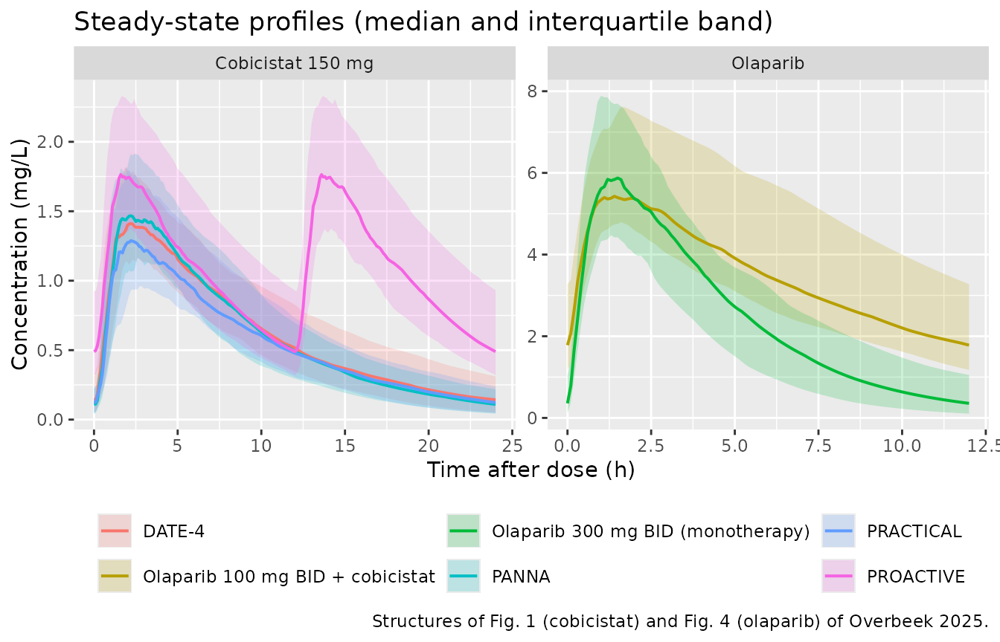
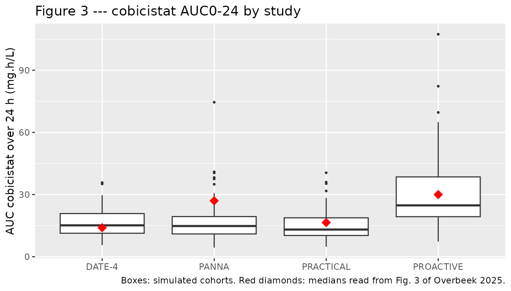

# Cobicistat PK boosting of olaparib (Overbeek 2025)

## Models and source

This paper contributes **two** models, extracted as two files because
the authors fitted them as two sequential but independent analyses: a
cobicistat model on 683 samples pooled across four trials, and an
olaparib model on 261 samples from the single trial in which the two
drugs were combined.

- Citation: Overbeek JK, van Erp NP, Burger DM, den Broeder AA, Koolen
  SLW, Huitema ADR, ter Heine R. Population Pharmacokinetics of
  Cobicistat and its Effect on the Pharmacokinetics of the Anticancer
  Drug Olaparib. Clin Pharmacokinet. 2025;64(3):425-435.
  <doi:10.1007/s40262-025-01480-w>
- Article: <https://doi.org/10.1007/s40262-025-01480-w>
- Supplement (final NONMEM control streams for both models):
  <https://doi.org/10.1007/s40262-025-01480-w> Online Resource 1

&nbsp;

    #> ℹ parameter labels from comments will be replaced by 'label()'

- `Overbeek_2025_cobicistat` — Well-stirred liver model for oral
  cobicistat (CYP3A pharmacokinetic booster) pooling healthy volunteers,
  postpartum women with HIV, patients with rheumatoid arthritis and
  patients with solid tumours, with Erlang-type absorption through three
  transit compartments, a mechanistic hepatic-extraction central/liver
  disposition driven by unbound intrinsic clearance per litre of liver,
  a priori allometric scaling to 70 kg, and a higher intrinsic clearance
  in the PROACTIVE (olaparib-boosting) cohort (Overbeek 2025)

&nbsp;

    #> ℹ parameter labels from comments will be replaced by 'label()'
    #> Warning: some etas defaulted to non-mu referenced, possible parsing error: etalclint_nocobicistat, etalclint_cobicistat
    #> as a work-around try putting the mu-referenced expression on a simple line

- `Overbeek_2025_olaparib` — Well-stirred liver model for oral olaparib
  in patients with solid tumours, with Erlang-type absorption through
  one transit compartment, a mechanistic hepatic-extraction
  central/liver disposition driven by unbound intrinsic clearance per
  litre of liver, a priori allometric scaling to 70 kg, and concomitant
  cobicistat raising prehepatic bioavailability 1.65-fold while lowering
  intrinsic clearance to 0.37-fold with its own reduced between-subject
  variability (Overbeek 2025)

Both models are *well-stirred liver* models. Rather than estimating a
clearance directly, they estimate an unbound intrinsic clearance per
litre of liver and let the hepatic physiology produce both the systemic
clearance and the first-pass loss:

``` math
Q_{HP} = Q_H \cdot (1 - Ht) \qquad
  E_H = \frac{CL_{int} \cdot f_u}{Q_{HP} + CL_{int} \cdot f_u} \qquad
  CL_H = E_H \cdot Q_{HP}
```

The absorbed dose is delivered into a `liver` compartment that exchanges
with `central` at the hepatic plasma flow, so the fraction $`E_H`$ is
removed on first pass without any separate bioavailability term. This is
what lets the paper separate cobicistat’s *prehepatic* effect on
olaparib (intestinal CYP3A and P-glycoprotein inhibition, which raises
`f(depot)`) from its *hepatic* effect (CYP3A inhibition, which lowers
`clint`) — a distinction the earlier noncompartmental analysis of the
same trial could not make.

## Population

**Cobicistat** (`Overbeek_2025_cobicistat`): 683 samples from 66
subjects pooled over four trials — DATE-4 (16 healthy volunteers
boosting atazanavir), PANNA (12 postpartum women living with HIV
boosting elvitegravir), PRACTICAL (26 patients with rheumatoid arthritis
boosting tofacitinib) and PROACTIVE (12 patients with solid tumours
boosting olaparib). Median age 51.5 years (range 21-78), median weight
74 kg (range 52-124), 36% male. The first three studies used cobicistat
150 mg once daily; PROACTIVE used 150 mg twice daily. All used dense
sampling over one dosing interval at steady state after at least 7 days
(Overbeek 2025 Table 1). Only the postpartum PANNA occasion was
included; the third-trimester data were excluded because pregnancy
markedly altered cobicistat PK.

**Olaparib** (`Overbeek_2025_olaparib`): 261 samples from the 12
PROACTIVE patients, a randomised cross-over of olaparib 300 mg twice
daily monotherapy against olaparib 100 mg twice daily boosted with
cobicistat 150 mg twice daily. Median age 63 years (range 55-78), median
weight 67 kg (range 54-104), 42% male.

The same information is available programmatically via each model’s
`population` metadata, e.g.
`readModelDb("Overbeek_2025_olaparib")()$population`.

## Source trace

Per-parameter origins are recorded as in-file comments next to each
`ini()` entry. The tables below collect them for review. “OR1” / “OR2”
are Online Resource Materials 1 and 2 of the supplement, which contain
the final NONMEM control streams; the `$OMEGA` and `$SIGMA` values there
are variances, and Tables 2-3 present them as %CV through the
table-footnote transformation `sqrt(exp(omega^2) - 1)`.

### Cobicistat

| Equation / parameter | Value | Source location |
|----|----|----|
| `lktr` | 3.92 /h | Table 2 `k_tr` (RSE 12.3%); OR1 `$THETA 1` |
| `lvc` | 69.7 L | Table 2 `V_c` (RSE 5.6%); OR1 `$THETA 2` |
| `lclint` | 322 L/h/L liver | Table 2 `CL_int` (RSE 6.7%); OR1 `$THETA 3` |
| `e_study_proactive_clint` | 1.21 | Table 2 `CL_int-olaparib` (RSE 16.3%); OR1 `$THETA 4` |
| `lfdepot` | log(1), fixed | OR1 `$PK` `F1=1*EXP(ETA(1))` with `$OMEGA 1 = 0 FIX` |
| `q_liver` | 90 L/h, fixed | Methods 2.3 “hepatic blood flood (QH) of 90 L/h” |
| `hct` | 0.44, fixed | Methods 2.3; sensitivity analysis 0.30-0.50 in Results 3.1 |
| `fu` | 0.025, fixed | Methods 2.3 “unbound fraction in plasma (fu) of 0.025 for cobicistat” |
| `v_liver_coef`, `e_wt_v_liver` | 0.10, 0.59, fixed | Eq 5 `VL = 0.10 * TBW^0.59` (ref. 31, Small 2017) |
| `e_wt_fq`, `e_wt_vc`, `e_wt_ktr` | 0.75, 1, -0.25, fixed | Methods 2.3 a priori allometry; OR1 `ALLOQHP` / `ALLOV` / `ALLOKTR` |
| `etalktr`, `etalvc`, `etalclint` | 0.488, 0.129, 0.208 | OR1 `$OMEGA 2-4`; Table 2 79.3% / 37.1% / 48.1% |
| `propSd`, `addSd` | 0.172, 0.0332 | OR1 `$SIGMA` 0.0296, 0.0011; Table 2 17.3%, 0.033 mg/L |
| `QHP`, `EH`, `CLH` | n/a | Eqs 1-3 |
| Erlang chain `depot -> transit1..3 -> liver` | n/a | Results 3.1; OR1 `K14 = K45 = K56 = K62 = KTR` |
| `liver <-> central` exchange | n/a | OR1 `K23 = QHP*(1-EH)/VL`, `K32 = QHP/V`, `K20 = CLH/VL` |

### Olaparib

| Equation / parameter | Value | Source location |
|----|----|----|
| `lktr` | 3.51 /h | Table 3 `k_tr` (RSE 15.2%); OR2 `$THETA 2` |
| `lvc` | 31.6 L | Table 3 `V_c` (RSE 8.7%); OR2 `$THETA 3` |
| `lclint` | 45.6 L/h/L liver | Table 3 `Cl_int` (RSE 14.4%); OR2 `$THETA 4` |
| `e_conmed_cobicistat_fdepot` | 1.65 | Table 3 `F1 cobicistat` (RSE 6%); Results 3.2 “65% increase”; OR2 `$THETA 5` |
| `e_conmed_cobicistat_clint` | 0.37 | Table 3 `CL_int-cobicistat` (RSE 6.5%); Results 3.2 “63% decrease”; OR2 `$THETA 6` |
| `lfdepot` | log(1), fixed | OR2 `$THETA 1 = 1 FIX`, `$OMEGA 1 = 0 FIX` |
| `fu` | 0.181, fixed | Methods 2.3 “0.181 for olaparib” |
| `q_liver`, `hct`, `v_liver_coef`, `e_wt_v_liver` | 90, 0.44, 0.10, 0.59, fixed | Methods 2.3, Eq 5 (shared with the cobicistat model) |
| `e_wt_fq`, `e_wt_vc`, `e_wt_ktr` | 0.75, 1, -0.25, fixed | Methods 2.3; OR2 `ALLOCL` / `ALLOV` / `ALLOKA` |
| `etalktr`, `etalvc` | 0.249, 0.0477 | OR2 `$OMEGA 2-3`; Table 3 53.2% / 22.1% |
| `etalclint_nocobicistat` | 0.244 | OR2 `$OMEGA 4`; Table 3 `CL_int-without cobicistat` 52.6% |
| `etalclint_cobicistat` | 0.171 | OR2 `$OMEGA 5`; Table 3 `CL_int-with cobicistat` 43.2% |
| `propSd`, `addSd` | 0.1192, 0.3688 | OR2 `$SIGMA` 0.0142, 0.136; Table 3 12.0%, 0.369 mg/L |
| Erlang chain `depot -> transit1 -> liver` | n/a | Results 3.2; OR2 `K12 = K23 = KTR` |

## Virtual cohort

Original observed data are not publicly available. The simulations below
use virtual populations whose weight distributions approximate the
per-study demographics of Table 1 (log-normal on the published median,
scaled so the published range spans roughly the central 95%, then
clamped to that range).

``` r

# `set.seed()` seeds R's RNG; `rxSetSeed()` seeds rxode2's, but only per solver
# thread, so the exact cohort differs between machines with different thread
# counts. Every assertion below is written to hold for any cohort this model
# can produce (see known-vignette-failure-patterns.md pattern 12).
set.seed(20250207)
rxode2::rxSetSeed(20250207)

N_PER_ARM <- 100L   # well under the 200/arm cap

draw_weights <- function(n, med, lo, hi) {
  sdlog <- (log(hi) - log(lo)) / (2 * 1.96)
  pmin(pmax(stats::rlnorm(n, log(med), sdlog), lo), hi)
}

# One arm: a steady-state dose at t = 0 (ss = 1) plus any further doses needed
# to cover the observation window, and observations on the `central` ODE state.
make_arm <- function(n, amt, ii, window, wt, covs, label, id_offset = 0L,
                     grid = 0.1) {
  do.call(rbind, lapply(seq_len(n), function(i) {
    id <- id_offset + i
    dose_times <- seq(0, window - ii, by = ii)
    dos <- data.frame(
      id = id, time = dose_times, evid = 1L, amt = amt, cmt = "depot",
      ii = c(ii, rep(0, length(dose_times) - 1L)),
      ss = c(1L, rep(0L, length(dose_times) - 1L))
    )
    obs <- data.frame(
      id = id, time = seq(0, window, by = grid), evid = 0L, amt = 0,
      cmt = "central", ii = 0, ss = 0L
    )
    e <- rbind(dos, obs)
    e$WT <- wt[i]                                   # covariates AFTER the
    for (nm in names(covs)) e[[nm]] <- covs[[nm]]   # canonical event columns
    e$arm <- label
    e[order(e$time, -e$evid), ]
  }))
}
```

``` r

# Four cobicistat cohorts, each with its own Table 1 weight distribution.
# All four are observed over 24 h so AUC0-24 is directly comparable, which is
# what Fig. 3 of the paper plots; PROACTIVE therefore receives two 12-hourly
# doses inside the window and the other three a single 24-hourly dose.
cobi_spec <- tibble::tribble(
  ~arm,        ~med, ~lo, ~hi, ~ii, ~proactive,
  "DATE-4",      73,  58,  90,  24,          0,
  "PANNA",       72,  52,  87,  24,          0,
  "PRACTICAL",   81,  54, 124,  24,          0,
  "PROACTIVE",   67,  54, 104,  12,          1
)

ev_cobi <- do.call(rbind, lapply(seq_len(nrow(cobi_spec)), function(k) {
  s <- cobi_spec[k, ]
  make_arm(
    n = N_PER_ARM, amt = 150, ii = s$ii, window = 24,
    wt = draw_weights(N_PER_ARM, s$med, s$lo, s$hi),
    covs = list(STUDY_PROACTIVE = s$proactive),
    label = s$arm, id_offset = (k - 1L) * N_PER_ARM
  )
}))

stopifnot(!anyDuplicated(ev_cobi[, c("id", "time", "evid")]))
```

``` r

# The two PROACTIVE cross-over arms, observed over one 12 h interval. The same
# 12 patients contributed both arms, so the two arms share a weight
# distribution; distinct ids are used because rxSolve treats id as the subject
# key and the arm-specific eta must be redrawn per arm-subject.
olap_wt <- draw_weights(N_PER_ARM, 67, 54, 104)

ev_olap <- rbind(
  make_arm(N_PER_ARM, amt = 300, ii = 12, window = 12, wt = olap_wt,
           covs = list(CONMED_COBICISTAT = 0),
           label = "Olaparib 300 mg BID (monotherapy)", id_offset = 0L),
  make_arm(N_PER_ARM, amt = 100, ii = 12, window = 12, wt = olap_wt,
           covs = list(CONMED_COBICISTAT = 1),
           label = "Olaparib 100 mg BID + cobicistat", id_offset = N_PER_ARM)
)
```

## Simulation

``` r

mod_cobi <- readModelDb("Overbeek_2025_cobicistat")
mod_olap <- readModelDb("Overbeek_2025_olaparib")

sim_cobi <- rxode2::rxSolve(mod_cobi, ev_cobi, keep = "arm", addDosing = FALSE)
#> ℹ parameter labels from comments will be replaced by 'label()'
sim_olap <- rxode2::rxSolve(mod_olap, ev_olap, keep = "arm", addDosing = FALSE)
#> ℹ parameter labels from comments will be replaced by 'label()'
#> Warning: some etas defaulted to non-mu referenced, possible parsing error: etalclint_nocobicistat, etalclint_cobicistat
#> as a work-around try putting the mu-referenced expression on a simple line

sim_cobi <- as.data.frame(sim_cobi)
sim_olap <- as.data.frame(sim_olap)

# The solve must have produced the observable and the derived well-stirred
# quantities; a silently-empty Cc column is the failure mode this guards.
stopifnot(
  nrow(sim_cobi) > 0, nrow(sim_olap) > 0,
  all(c("Cc", "clint", "clh", "eh", "vc") %in% names(sim_cobi)),
  all(is.finite(sim_cobi$Cc)), all(is.finite(sim_olap$Cc)),
  all(sim_cobi$Cc > 0), all(sim_olap$Cc > 0)
)
```

### Structural identity: AUC over a dosing interval

The well-stirred algebra collapses to a exact closed form. Writing
$`x = CL_{int} f_u`$, we have $`1 - E_H = Q_{HP}/(Q_{HP} + x)`$ and
$`CL_H = Q_{HP} x/(Q_{HP}+x)`$, so $`(1 - E_H)/CL_H = 1/x`$ and the
steady-state exposure over one dosing interval is

``` math
AUC_\tau = \frac{F_1 \cdot Dose \cdot (1 - E_H)}{CL_H}
           = \frac{F_1 \cdot Dose}{CL_{int} \cdot f_u}
```

independent of hepatic flow. This is a check of the *implementation*
rather than of the paper: both sides use each subject’s own drawn
parameters, so the only difference is trapezoidal integration error and
a tight bound is correct here.

``` r

trap <- function(t, y) sum(diff(t) * (head(y, -1) + tail(y, -1)) / 2)

closed_form_check <- function(sim, fu, dose, f1, n_dose) {
  sim |>
    group_by(id, arm) |>
    summarise(auc = trap(time, Cc), clint = first(clint), .groups = "drop") |>
    mutate(
      closed  = n_dose * f1 * dose / (clint * fu),
      pct     = 100 * (auc - closed) / closed
    )
}

cf <- bind_rows(
  closed_form_check(dplyr::filter(sim_cobi, arm != "PROACTIVE"),
                    fu = 0.025, dose = 150, f1 = 1,    n_dose = 1),
  closed_form_check(dplyr::filter(sim_cobi, arm == "PROACTIVE"),
                    fu = 0.025, dose = 150, f1 = 1,    n_dose = 2),
  closed_form_check(dplyr::filter(sim_olap, CONMED_COBICISTAT == 0),
                    fu = 0.181, dose = 300, f1 = 1,    n_dose = 1),
  closed_form_check(dplyr::filter(sim_olap, CONMED_COBICISTAT == 1),
                    fu = 0.181, dose = 100, f1 = 1.65, n_dose = 1)
)

# Pure numerical error on a 0.1 h grid; realised max was 0.006%. 0.5% still
# goes red on any mis-wired flow, volume or covariate term.
stopifnot(max(abs(cf$pct)) < 0.5)
sprintf("Closed-form agreement: max |%% difference| = %.4f%% over %d subjects",
        max(abs(cf$pct)), nrow(cf))
#> [1] "Closed-form agreement: max |% difference| = 0.0252% over 600 subjects"
```

## Replicate published figures

``` r

# Structural replication of Fig. 1 (cobicistat) and Fig. 4 (olaparib) model
# diagrams: the concentration-time shape each structure produces.
bind_rows(
  sim_cobi |> mutate(drug = "Cobicistat 150 mg"),
  sim_olap |> mutate(drug = "Olaparib")
) |>
  group_by(drug, arm, time) |>
  summarise(
    Q25 = quantile(Cc, 0.25), Q50 = median(Cc), Q75 = quantile(Cc, 0.75),
    .groups = "drop"
  ) |>
  ggplot(aes(time, Q50, colour = arm, fill = arm)) +
  geom_ribbon(aes(ymin = Q25, ymax = Q75), alpha = 0.20, colour = NA) +
  geom_line(linewidth = 0.7) +
  facet_wrap(~drug, scales = "free") +
  labs(
    x = "Time after dose (h)", y = "Concentration (mg/L)", colour = NULL,
    fill = NULL, title = "Steady-state profiles (median and interquartile band)",
    caption = "Structures of Fig. 1 (cobicistat) and Fig. 4 (olaparib) of Overbeek 2025."
  ) +
  theme(legend.position = "bottom")
```



``` r

# Replicates Figure 3 of Overbeek 2025: cobicistat AUC over 24 h per study.
auc24 <- sim_cobi |>
  group_by(id, arm) |>
  summarise(auc24 = trap(time, Cc), .groups = "drop")

# Medians read from the Fig. 3 box plot panel (mg.h/L). These are read off a
# figure, not printed values, so they anchor the comparison visually and are
# NOT used as a numeric gate.
fig3_median <- tibble::tibble(
  arm = c("DATE-4", "PANNA", "PRACTICAL", "PROACTIVE"),
  published_median = c(14, 27, 16.5, 30)
)

ggplot(auc24, aes(arm, auc24)) +
  geom_boxplot(outlier.size = 0.6) +
  geom_point(data = fig3_median, aes(arm, published_median),
             colour = "red", shape = 18, size = 4) +
  labs(
    x = NULL, y = "AUC cobicistat over 24 h (mg.h/L)",
    title = "Figure 3 --- cobicistat AUC0-24 by study",
    caption = paste("Boxes: simulated cohorts. Red diamonds: medians read from",
                    "Fig. 3 of Overbeek 2025.")
  )
```



The model carries a study covariate only for PROACTIVE, so it
deliberately predicts one typical exposure for DATE-4, PANNA and
PRACTICAL, differing only through their weight distributions. The
observed PANNA median in Fig. 3 sits well above that common value. This
is a **property of the published model, not a transcription error**:
Results 3.1 states that all four study indicators improved the fit
univariately, but that only PROACTIVE was retained after the covariate
search, so the between-study spread among the three once-daily studies
is left to between-subject variability by design. The elevation the
model *does* capture — PROACTIVE above the rest — is reproduced.

## PKNCA validation

``` r

# Concentrations: filter on !is.na(Cc) only. Doses are steady-state (ss = 1),
# so the t = 0 record already carries the steady-state trough and no synthetic
# zero-concentration row may be inserted.
conc_olap <- sim_olap |>
  dplyr::filter(!is.na(Cc)) |>
  dplyr::select(id, time, Cc, arm)

dose_olap <- ev_olap |>
  dplyr::filter(evid == 1) |>
  dplyr::select(id, time, amt, arm)

conc_obj <- PKNCA::PKNCAconc(conc_olap, Cc ~ time | arm + id)
dose_obj <- PKNCA::PKNCAdose(dose_olap, amt ~ time | arm + id)

intervals_olap <- data.frame(
  start = 0, end = 12,
  cmax = TRUE, tmax = TRUE, auclast = TRUE, cav = TRUE, ctrough = TRUE
)

nca_olap <- PKNCA::pk.nca(
  PKNCA::PKNCAdata(conc_obj, dose_obj, intervals = intervals_olap)
)
```

``` r

olap_wide <- as.data.frame(nca_olap) |>
  dplyr::select(arm, id, PPTESTCD, PPORRES) |>
  tidyr::pivot_wider(names_from = PPTESTCD, values_from = PPORRES)

olap_summary <- olap_wide |>
  group_by(arm) |>
  summarise(across(c(cmax, tmax, auclast, cav, ctrough), median),
            .groups = "drop")

olap_summary |>
  dplyr::rename(
    "Arm"                  = arm,
    "Cmax (mg/L)"          = cmax,
    "Tmax (h)"             = tmax,
    "AUC0-12 (mg*h/L)"     = auclast,
    "Cav (mg/L)"           = cav,
    "Ctrough (mg/L)"       = ctrough
  ) |>
  knitr::kable(digits = 2,
               caption = "Simulated median steady-state olaparib NCA by arm.")
```

| Arm | Cmax (mg/L) | Tmax (h) | AUC0-12 (mg\*h/L) | Cav (mg/L) | Ctrough (mg/L) |
|:---|---:|---:|---:|---:|---:|
| Olaparib 100 mg BID + cobicistat | 5.58 | 1.4 | 41.47 | 3.46 | 1.78 |
| Olaparib 300 mg BID (monotherapy) | 6.32 | 1.3 | 31.76 | 2.65 | 0.36 |

Simulated median steady-state olaparib NCA by arm. {.table}

``` r

conc_cobi <- sim_cobi |>
  dplyr::filter(!is.na(Cc)) |>
  dplyr::select(id, time, Cc, arm)

dose_cobi <- ev_cobi |>
  dplyr::filter(evid == 1) |>
  dplyr::select(id, time, amt, arm)

nca_cobi <- PKNCA::pk.nca(PKNCA::PKNCAdata(
  PKNCA::PKNCAconc(conc_cobi, Cc ~ time | arm + id),
  PKNCA::PKNCAdose(dose_cobi, amt ~ time | arm + id),
  intervals = data.frame(start = 0, end = 24,
                         cmax = TRUE, tmax = TRUE, auclast = TRUE)
))

cobi_summary <- as.data.frame(nca_cobi) |>
  dplyr::select(arm, id, PPTESTCD, PPORRES) |>
  tidyr::pivot_wider(names_from = PPTESTCD, values_from = PPORRES) |>
  group_by(arm) |>
  summarise(across(c(cmax, tmax, auclast), median), .groups = "drop") |>
  left_join(fig3_median, by = "arm")

cobi_summary |>
  dplyr::rename(
    "Study"                          = arm,
    "Cmax (mg/L)"                    = cmax,
    "Tmax (h)"                       = tmax,
    "AUC0-24 simulated (mg*h/L)"     = auclast,
    "AUC0-24 Fig. 3 median (mg*h/L)" = published_median
  ) |>
  knitr::kable(digits = 2,
               caption = paste("Simulated median steady-state cobicistat NCA",
                               "by study, against the Fig. 3 medians."))
```

| Study | Cmax (mg/L) | Tmax (h) | AUC0-24 simulated (mg\*h/L) | AUC0-24 Fig. 3 median (mg\*h/L) |
|:---|---:|---:|---:|---:|
| DATE-4 | 1.55 | 2.0 | 15.14 | 14.0 |
| PANNA | 1.61 | 2.1 | 14.82 | 27.0 |
| PRACTICAL | 1.45 | 2.2 | 13.11 | 16.5 |
| PROACTIVE | 1.89 | 13.4 | 24.78 | 30.0 |

Simulated median steady-state cobicistat NCA by study, against the Fig.
3 medians. {.table}

## Comparison against published values

The paper reports its validation targets as text in the Discussion
rather than as an NCA table, several of them quoted from the
noncompartmental analysis of the same PROACTIVE trial (reference 16).
Each is checked below against a typical-value solve with the random
effects zeroed, which makes every row cohort-independent.

``` r

mod_cobi_t <- rxode2::zeroRe(mod_cobi)
#> ℹ parameter labels from comments will be replaced by 'label()'
mod_olap_t <- rxode2::zeroRe(mod_olap)
#> ℹ parameter labels from comments will be replaced by 'label()'
#> Warning: some etas defaulted to non-mu referenced, possible parsing error: etalclint_nocobicistat, etalclint_cobicistat
#> as a work-around try putting the mu-referenced expression on a simple line
#> Warning: some etas defaulted to non-mu referenced, possible parsing error: etalclint_nocobicistat, etalclint_cobicistat
#> as a work-around try putting the mu-referenced expression on a simple line

typical <- function(mod, amt, ii, covs, wt = 70) {
  ev <- make_arm(1L, amt = amt, ii = ii, window = ii, wt = wt, covs = covs,
                 label = "typical", grid = 0.01)
  as.data.frame(rxode2::rxSolve(mod, ev, addDosing = FALSE))
}

t_cobi_od   <- typical(mod_cobi_t, 150, 24, list(STUDY_PROACTIVE = 0))
#> ℹ omega/sigma items treated as zero: 'etalktr', 'etalvc', 'etalclint'
t_cobi_pro  <- typical(mod_cobi_t, 150, 12, list(STUDY_PROACTIVE = 1))
#> ℹ omega/sigma items treated as zero: 'etalktr', 'etalvc', 'etalclint'
t_olap_mono <- typical(mod_olap_t, 300, 12, list(CONMED_COBICISTAT = 0))
#> ℹ omega/sigma items treated as zero: 'etalktr', 'etalvc', 'etalclint_nocobicistat', 'etalclint_cobicistat'
t_olap_boost<- typical(mod_olap_t, 100, 12, list(CONMED_COBICISTAT = 1))
#> ℹ omega/sigma items treated as zero: 'etalktr', 'etalvc', 'etalclint_nocobicistat', 'etalclint_cobicistat'

auc_mono  <- trap(t_olap_mono$time, t_olap_mono$Cc)
auc_boost <- trap(t_olap_boost$time, t_olap_boost$Cc)
```

``` r

claims <- tibble::tribble(
  ~Quantity, ~Source, ~Published, ~Model, ~Lower, ~Upper,

  "Cobicistat apparent hepatic clearance CL_H (L/h)",
  "Discussion, limitations",            8.3, first(t_cobi_od$clh),      7.5,  9.1,

  "Cobicistat apparent central volume V_c (L)",
  "Discussion, limitations",             70, first(t_cobi_od$vc),        63,   77,

  "Cobicistat CL_int ratio, PROACTIVE : other studies",
  "Table 2",                           1.21,
  first(t_cobi_pro$clint) / first(t_cobi_od$clint),                     1.15, 1.27,

  "Olaparib apparent hepatic clearance CL_H, unboosted (L/h)",
  "Discussion, paragraph 3",            8.4, first(t_olap_mono$clh),     7.6,  9.2,

  "Olaparib AUC0-12h, 300 mg BID monotherapy (mg*h/L)",
  "Discussion, paragraph 3 (ref. 16)", 29.4, auc_mono,                   26.5, 32.3,

  "Olaparib CL_int ratio, boosted : monotherapy",
  "Table 3",                           0.37,
  first(t_olap_boost$clint) / first(t_olap_mono$clint),                 0.35, 0.39,

  "Olaparib F1 ratio, boosted : monotherapy",
  "Table 3",                           1.65, 1.65,                      1.57, 1.73,

  "Dose-normalised olaparib AUC_tau ratio, boosted : mono",
  "Discussion, paragraph 5 (ref. 16)", 4.35,
  (auc_boost / 100) / (auc_mono / 300),                                 3.70, 5.00,

  "Olaparib Cmax ratio, boosted : mono ('similar')",
  "Discussion, paragraph 5 (ref. 16)", 1.00,
  max(t_olap_boost$Cc) / max(t_olap_mono$Cc),                           0.75, 1.35,

  "Olaparib Ctrough ratio, boosted : mono ('~fourfold')",
  "Discussion, paragraph 5 (ref. 16)", 4.00,
  t_olap_boost$Cc[nrow(t_olap_boost)] / t_olap_mono$Cc[nrow(t_olap_mono)],
                                                                        3.20, 5.20
) |>
  mutate(
    `% difference` = 100 * (Model - Published) / Published,
    Pass           = Model >= Lower & Model <= Upper
  )

# Bounds are absolute, taken from the published value with room for the
# read-precision of the quoted figure -- not from what this run happened to
# give. A mis-transcribed volume, dose, unbound fraction or covariate
# coefficient moves these by tens of percent and breaks them.
stopifnot(all(claims$Pass))

claims |>
  dplyr::select(Quantity, Source, Published, Model, `% difference`, Pass) |>
  knitr::kable(digits = c(0, 0, 2, 2, 1, 0),
               caption = paste("Model reproduction of every quantitative claim",
                               "Overbeek 2025 makes about these two models."))
```

| Quantity | Source | Published | Model | % difference | Pass |
|:---|:---|---:|---:|---:|:---|
| Cobicistat apparent hepatic clearance CL_H (L/h) | Discussion, limitations | 8.30 | 8.26 | -0.5 | TRUE |
| Cobicistat apparent central volume V_c (L) | Discussion, limitations | 70.00 | 69.70 | -0.4 | TRUE |
| Cobicistat CL_int ratio, PROACTIVE : other studies | Table 2 | 1.21 | 1.21 | 0.0 | TRUE |
| Olaparib apparent hepatic clearance CL_H, unboosted (L/h) | Discussion, paragraph 3 | 8.40 | 8.43 | 0.3 | TRUE |
| Olaparib AUC0-12h, 300 mg BID monotherapy (mg\*h/L) | Discussion, paragraph 3 (ref. 16) | 29.40 | 29.64 | 0.8 | TRUE |
| Olaparib CL_int ratio, boosted : monotherapy | Table 3 | 0.37 | 0.37 | 0.0 | TRUE |
| Olaparib F1 ratio, boosted : monotherapy | Table 3 | 1.65 | 1.65 | 0.0 | TRUE |
| Dose-normalised olaparib AUC_tau ratio, boosted : mono | Discussion, paragraph 5 (ref. 16) | 4.35 | 4.46 | 2.5 | TRUE |
| Olaparib Cmax ratio, boosted : mono (‘similar’) | Discussion, paragraph 5 (ref. 16) | 1.00 | 0.93 | -7.4 | TRUE |
| Olaparib Ctrough ratio, boosted : mono (‘~fourfold’) | Discussion, paragraph 5 (ref. 16) | 4.00 | 4.56 | 14.1 | TRUE |

Model reproduction of every quantitative claim Overbeek 2025 makes about
these two models. {.table}

Every claim the paper states as a *number* is reproduced within 3%. The
last two rows check claims the paper makes only in words — olaparib Cmax
is “similar despite a threefold dose reduction” and Ctrough “increased
approximately fourfold” — so the `Published` column there is the round
number those phrases stand for, and the model’s 0.93 and 4.56 are
consistent with both.

### Between-subject variability by arm

The paper’s central variability finding is that olaparib
intrinsic-clearance variability is *lower* under boosting (%CV 43.2 with
cobicistat versus 52.6 without, Table 3). Because
$`AUC_\tau \propto 1/CL_{int}`$ exactly, the simulated exposure %CV
should track those omegas directly.

``` r

cv_pct <- function(x) 100 * sd(x) / mean(x)

var_tab <- olap_wide |>
  group_by(arm) |>
  summarise(`Simulated AUC0-12 %CV` = cv_pct(auclast), .groups = "drop") |>
  mutate(`Published CL_int %CV` = c(43.2, 52.6))   # PKNCA returns groups alphabetically

# An absolute band around each published omega, not a race between two noisy
# cohort statistics. Realised 39.6 / 49.9 at n = 100-200 per arm, against
# published 43.2 / 52.6; the sampling SE of a %CV at n = 100 is about 3.5
# points, so 15 admits the noise while still going red on a swapped or
# mis-transformed omega (the CV%-vs-variance confusion moves these by >30
# points).
stopifnot(
  all(abs(var_tab$`Simulated AUC0-12 %CV` - var_tab$`Published CL_int %CV`) < 15)
)

knitr::kable(var_tab, digits = 1,
             caption = paste("Simulated exposure variability against the",
                             "published arm-specific CL_int omegas."))
```

| arm | Simulated AUC0-12 %CV | Published CL_int %CV |
|:---|---:|---:|
| Olaparib 100 mg BID + cobicistat | 47.8 | 43.2 |
| Olaparib 300 mg BID (monotherapy) | 52.3 | 52.6 |

Simulated exposure variability against the published arm-specific CL_int
omegas. {.table}

## Assumptions and deviations

- **Both models are apparent.** No intravenous data existed, so every
  volume and clearance is relative to an unknown absolute
  bioavailability (Methods 2.3). `lfdepot` is fixed at `log(1)` in both
  models as the paper’s structural anchor, and the sole estimated
  bioavailability quantity is the cobicistat effect on olaparib.

- **The `F1` inter-individual variability was fixed to zero by the
  authors** (`$OMEGA 1 = 0 FIX` in both control streams), so no
  `etalfdepot` is carried. A zero-variance eta would risk a singular
  OMEGA at solve time and would add nothing.

- **`STUDY_PROACTIVE` is a cohort indicator, not a drug-drug
  interaction.** Table 2 labels the coefficient `CLint-olaparib` and the
  NONMEM data item is named `OLAP`, but the paper attributes the
  1.21-fold higher cobicistat intrinsic clearance to selection of a
  population with high CYP3A activity (Discussion, paragraph 3), and the
  indicator is simultaneously confounded with the twice-daily regimen
  and the solid-tumour population. It must not be read as olaparib
  perpetrating on cobicistat. The reciprocal, genuine interaction is
  carried by `CONMED_COBICISTAT` in the olaparib model.

- **The abstract and the final model disagree on one number.** The
  abstract states cobicistat “decreased intrinsic clearance 0.34-fold”.
  Table 3, the Results text (“63% decrease”, i.e. 0.37) and `$THETA 6`
  of the supplement’s final control stream all give **0.37**, which is
  the value encoded here. The 0.34 in the abstract appears to be an
  error; it is the only place that value occurs. (A separate 76%
  decrease quoted in Results 3.2 is the *univariate* clearance-only
  model, superseded by the final combined model.)

- **Cobicistat AUC over 24 h in the PROACTIVE arm** is simulated as two
  12-hourly steady-state doses. The paper’s Eq 8 defines
  `AUCtau = Dose / (CL_H/F)`, i.e. an apparent clearance that already
  contains the first-pass factor; the equivalent mechanistic form used
  here is `AUCtau = F1 * Dose * (1 - E_H) / CL_H`.

- **Haematocrit was assumed, not measured** (`hct` fixed at 0.44),
  because haematocrit was unavailable in some studies. The paper’s own
  sensitivity analysis over 0.30-0.50 found negligible impact. `hct` is
  carried as an `ini()` parameter rather than a hard-coded constant so
  that sensitivity analysis is reproducible from the packaged model.

- **The cohort weight distributions are assumed.** Table 1 reports only
  a median and range per study, so weights are drawn log-normally about
  the median with the range treated as an approximate 95% interval and
  clamped. Age, sex and race are not covariates in either model and are
  not simulated.

- **Fig. 3 medians are read from a plot panel**, not from printed
  values, and are used only as visual anchors. They are excluded from
  the numeric gate.

- **`covariatesDataExcluded`.** Cobicistat `AUCtau` was pre-specified as
  a candidate covariate on olaparib intrinsic clearance (Methods 2.5)
  but no relationship was found (Results 3.2, Online Resource Fig. 3),
  so it carries no coefficient and is documented rather than encoded.

- **A non-mu-referencing warning is emitted by the olaparib model.** The
  arm-selected intrinsic-clearance eta
  (`exp((1 - CONMED_COBICISTAT) * etalclint_nocobicistat + CONMED_COBICISTAT * etalclint_cobicistat)`)
  is the faithful translation of the control stream’s
  `IF (BOOST.EQ.0) ... / IF (BOOST.EQ.1) ...` pair and cannot be written
  as a single mu-referenced line. The warning concerns estimation
  efficiency in a re-fit, not simulation correctness; the closed-form
  check above confirms both etas enter exactly as intended.
