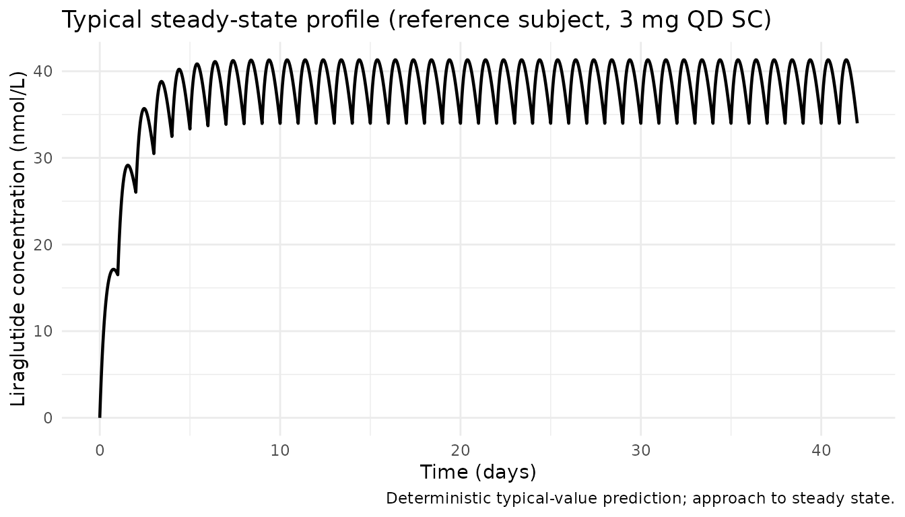
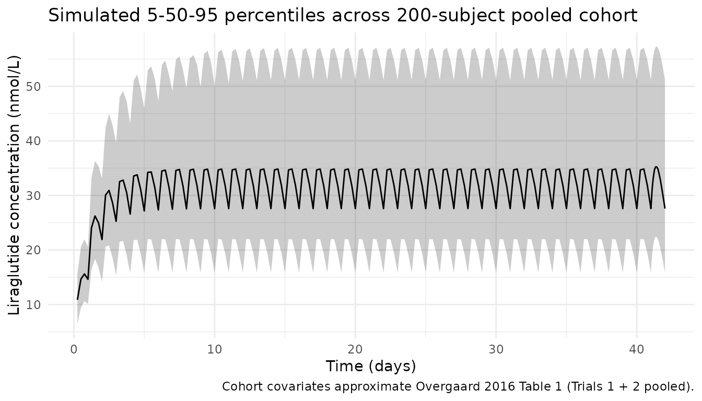
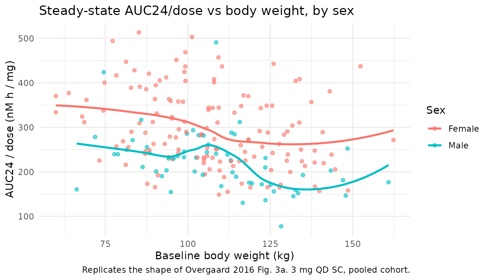
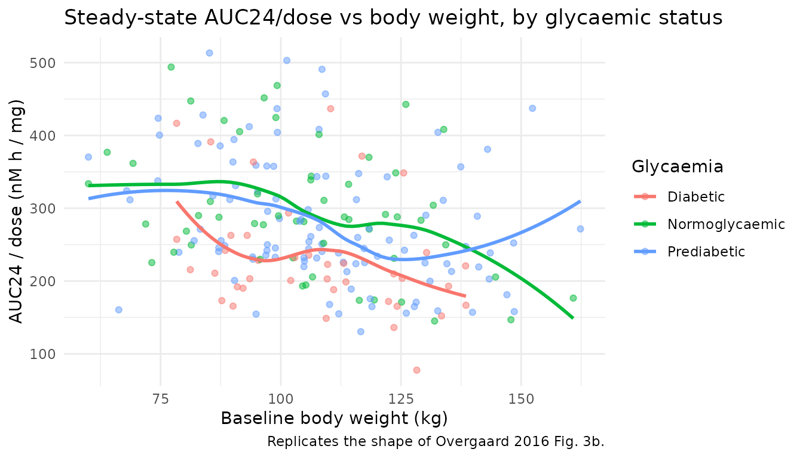

# Liraglutide (Overgaard 2016)

## Model and source

- Citation: Overgaard RV, Petri KC, Jacobsen LV, Jensen CB. Liraglutide
  3.0 mg for Weight Management: A Population Pharmacokinetic Analysis.
  Clin Pharmacokinet. 2016;55(11):1413-1422.
  <doi:10.1007/s40262-016-0410-7>
- Description: Liraglutide 3.0 mg population PK model in overweight and
  obese adults with and without type 2 diabetes (Overgaard 2016 SCALE
  Obesity/Prediabetes + SCALE Diabetes pooled analysis)
- Article: [Clin Pharmacokinet
  2016;55(11):1413-1422](https://doi.org/10.1007/s40262-016-0410-7)
- Springer Open Access

## Population

The published analysis pooled 2923 overweight or obese adults across two
phase IIIa SCALE trials on liraglutide 3.0 mg once-daily subcutaneous
(Saxenda / NN8022): 2339 from SCALE Obesity and Prediabetes (Trial 1,
NN8022-1839; Pi-Sunyer 2015) and 584 from SCALE Diabetes (Trial 2,
NN8022-1922; Davies 2015). Baseline characteristics (Table 1 of the
paper):

- Sex: 72.3% female (2112 / 2923), 27.7% male (811 / 2923).
- Age: mean 47.1 y (SD 12.3); 2.5% (73 / 2923) aged \>= 70 y.
- Body weight: mean 106 kg (SD 21), range 60-234 kg; higher in males
  (mean 118 kg) than females (mean 102 kg) despite similar BMI (mean 38
  kg/m^2).
- Race: 84.9% White, 9.7% Black / African American, 3.3% Asian, 2.1%
  Other (pooling American Indian / Alaskan Native + Native Hawaiian or
  other Pacific Islander).
- Ethnicity: 10.5% Hispanic / Latino, 89.5% non-Hispanic / -Latino.
- Baseline glycaemic status: 30.7% normoglycaemic, 49.3% prediabetic
  (all in Trial 1), 20.0% T2DM (all in Trial 2).
- Renal function: 51% normal (eGFR \>= 90 mL/min/1.73 m^2), 44% mild
  impairment, 5% moderate, \< 0.1% severe.
- Dose: 93.5% on 3.0 mg once-daily SC (2732 subjects), 6.5% on 1.8 mg
  (Trial 2 SCALE Diabetes 1.8 mg arm, 191 subjects).

Dose escalation was weekly at 0.6 mg/week from 0.6 mg on day 1 up to the
subject’s maintenance dose (3.0 mg by week 5). Subjects excluded from
the population PK analysis after inadequate dosing-history filtering:
1185 of 8859 records (Overgaard 2016 Sect. 2.1.1).

The `readModelDb("Overgaard_2016_liraglutide")$population` list carries
the same information programmatically.

## Structural model

One-compartment model with first-order absorption and first-order
elimination, parameterised by absorption rate `Ka`, apparent clearance
`CL/F`, and apparent central volume `V/F`. Covariate effects on `CL/F`
only. The full covariate model equation (Overgaard 2016 Sect. 2.2 and
Online Resource Table S1) is:

``` math
 \frac{CL/F_i}{TVCL} = \left(\frac{WT_i}{100}\right)^{\theta_{WT}}
\times \exp\left(\sum_{k} \theta_k \cdot X_{k,i}\right) \times \exp(\eta_i) 
```

with `TVCL` the reference subject apparent clearance (female, \< 70 y,
100 kg, White, non-Hispanic / -Latino, non-diabetic, 3.0 mg once daily)
and the sum over the categorical covariates listed in Table S1.

## Source trace

Per-parameter provenance is recorded as an in-file comment beside each
`ini()` entry in
`inst/modeldb/specificDrugs/Overgaard_2016_liraglutide.R`. The table
below collects them for review; values marked “Table S1” come from the
Online Resource Table S1 in the Springer supplementary material.

| Equation / parameter | Value | Source location |
|----|----|----|
| `lka` (Ka) | `fixed(log(0.0806))` 1/h | Methods Sect. 2.2 (fixed from prior obese-subject popPK, data on file per ref \[8\]) |
| `lcl` (CL/F, reference) | `log(0.86)` L/h | Table S1 (RSE 2%, 95% CI 0.83-0.90) |
| `lvc` (V/F) | `log(24.60)` L | Table S1 (RSE 9%, 95% CI 20.3-28.8) |
| `e_wt_cl` | `0.68` | Table S1 “Cov. weight” (RSE 5%, 95% CI 0.61-0.75); reference WT = 100 kg |
| `e_male_cl` | `0.27` | Table S1 “Cov. male” (RSE 6%, 95% CI 0.24-0.30); applied via `(1 - SEXF)` |
| `e_age_ge70_cl` | `-0.10` | Table S1 “Cov. age \>=70 years” (RSE 45%, 95% CI -0.18 to -0.01) |
| `e_race_black_cl` | `-0.09` | Table S1 “Cov. Black” (RSE 26%, 95% CI -0.13 to -0.04) |
| `e_race_asian_cl` | `-0.001` | Table S1 “Cov. Asian” (RSE 913%, 95% CI -0.09 to 0.08) |
| `e_race_other_cl` | `-0.08` | Table S1 “Cov. Other” (RSE 57%, 95% CI -0.17 to -0.01) |
| `e_race_hispanic_cl` | `0.08` | Table S1 “Cov. Hispanic” (RSE 26%, 95% CI 0.04-0.12) |
| `e_dis_prediab_cl` | `0.00` | Table S1 “Cov. prediabetes” (RSE 904%, 95% CI -0.05 to 0.06) |
| `e_dis_diab_cl` | `0.18` | Table S1 “Cov. diabetes” (RSE 14%, 95% CI 0.13-0.23); confounded with Trial 2 |
| `e_dose_1p8mg_cl` | `0.02` | Table S1 “Cov. 1.8 mg” (RSE 119%, 95% CI -0.03 to 0.08) |
| `etalcl` (IIV CL/F) | `log(1 + 0.247^2)` | Table S1: 24.70 %CV (shrinkage 23.9%) |
| `etalvc` (IIV V/F) | `log(1 + 0.347^2)` | Table S1: 34.70 %CV (shrinkage 83.2%; sparse-sampling limitation) |
| `propSd` (proportional RUV) | `0.154` | Table S1: sigma 15.40 %CV (shrinkage 9.37%) |
| Structure | 1-cmt FO absorption / FO elimination | Methods Sect. 2.2, Online Resource S3 |
| Concentration units | nmol/L | Fig. 3 / Fig. 4 x-axis labels; LLOQ 30 pmol/L (Trials 1 + 2), 18 pmol/L (Trial 3) |
| Reference subject | Female, 100 kg, White, non-Hispanic, non-diabetic, \< 70 y, 3.0 mg | Sect. 2.2 |

## Virtual cohort

Original observed data are not publicly available. The cohort below
approximates the pooled Overgaard 2016 Trials 1 + 2 baseline
demographics (Table 1) at a manageable simulation size of 200 subjects:
72.3% female, body weight approximately Normal(mean 106, SD 21)
truncated to the observed 60-234 kg range, 84.9% White, 9.7% Black, 3.3%
Asian, 2.1% Other with the race indicators encoded as mutually exclusive
binaries, 10.5% Hispanic ethnicity, 20% T2DM, 49.3% prediabetic. All
simulated subjects receive the 3.0 mg once-daily SC maintenance dose
(dominant 93.5% regimen).

Liraglutide molar mass is 3751.2 g/mol (C172H265N43O51); doses are
entered in nmol so that the simulated `Cc = central / Vc` is directly in
nmol/L (matching the paper’s reported units).

``` r

set.seed(20160519) # publication date reference
n_subj <- 200L # per-arm cap per skill guidance

lira_mw <- 3751.2 # g/mol
dose_mg <- 3.0
dose_nmol <- dose_mg * 1e6 / lira_mw # 3 mg = 799.7 nmol

# Sample race indicators as a mutually exclusive multinomial matching Table 1.
race_probs <- c(White = 0.849, Black = 0.097, Asian = 0.033, Other = 0.021)
race_draw <- sample(names(race_probs), n_subj, replace = TRUE, prob = race_probs)

cohort <- tibble(
  id             = seq_len(n_subj),
  SEXF           = as.integer(runif(n_subj) < 0.723),
  WT             = pmin(pmax(rnorm(n_subj, mean = 106, sd = 21), 60), 234),
  AGE_GE70       = as.integer(runif(n_subj) < 0.025),
  RACE_BLACK     = as.integer(race_draw == "Black"),
  RACE_ASIAN     = as.integer(race_draw == "Asian"),
  RACE_OTHER     = as.integer(race_draw == "Other"),
  RACE_HISPANIC  = as.integer(runif(n_subj) < 0.105),
  DIS_PREDIAB    = as.integer(runif(n_subj) < 0.493),
  DIS_DIAB       = 0L, # sampled below so PREDIAB and DIAB are mutually exclusive
  DOSE_1P8MG     = 0L,
  treatment      = factor("3 mg QD (Overgaard 2016 pooled cohort)")
)

# T2DM and prediabetes are mutually exclusive per paper Sect. 3.1; enforce that.
cohort$DIS_DIAB[cohort$DIS_PREDIAB == 0L] <-
  as.integer(runif(sum(cohort$DIS_PREDIAB == 0L)) < 0.20 / (1 - 0.493))
cohort$DIS_DIAB[cohort$DIS_PREDIAB == 1L] <- 0L
```

An event table with once-daily SC dosing over 6 weeks provides
steady-state sampling on the final dosing interval.

``` r

sim_days <- 42L # 6 weeks to reach robust steady state
tau <- 24 # dosing interval, h
n_doses <- sim_days
dose_times <- seq(0, by = tau, length.out = n_doses)
final_dose_time <- dose_times[n_doses]

# Dense sampling on the final interval + coarse sampling earlier + t=0 defensively.
obs_times <- sort(unique(c(
  0,
  seq(0, final_dose_time, by = 6),
  final_dose_time + c(0, 0.5, 1, 2, 3, 4, 6, 8, 10, 12, 14, 16, 20, 24)
)))

dose_rows <- cohort |>
  tidyr::crossing(time = dose_times) |>
  dplyr::mutate(amt = dose_nmol, cmt = "depot", evid = 1L)

obs_rows <- cohort |>
  tidyr::crossing(time = obs_times) |>
  dplyr::mutate(amt = 0, cmt = "central", evid = 0L)

events <- dplyr::bind_rows(dose_rows, obs_rows) |>
  dplyr::select(id, time, amt, cmt, evid, SEXF, WT, AGE_GE70, RACE_BLACK,
    RACE_ASIAN, RACE_OTHER, RACE_HISPANIC, DIS_PREDIAB, DIS_DIAB, DOSE_1P8MG,
    treatment) |>
  dplyr::arrange(id, time, dplyr::desc(evid))
```

## Simulation

``` r

mod <- rxode2::rxode2(readModelDb("Overgaard_2016_liraglutide"))
#> ℹ parameter labels from comments will be replaced by 'label()'
conc_unit <- mod$units[["concentration"]]

keep_cov <- c("SEXF", "WT", "AGE_GE70", "RACE_BLACK", "RACE_ASIAN", "RACE_OTHER",
  "RACE_HISPANIC", "DIS_PREDIAB", "DIS_DIAB", "DOSE_1P8MG", "treatment")

sim <- rxode2::rxSolve(mod, events = events, keep = keep_cov)
```

## Replicate published figures

### Typical steady-state concentration profile

Overgaard 2016 does not publish a time-versus-concentration figure; the
paper’s Fig. 3 shows steady-state exposure (AUC24 / dose) versus
baseline body weight. Below we plot the deterministic (“typical”)
steady-state profile of the reference subject (100 kg female, White,
non-Hispanic, non-diabetic, \< 70 y, 3.0 mg QD) over the final 24-h
dosing interval.

``` r

mod_typical <- mod |> rxode2::zeroRe()

ref_cohort <- tibble(
  id = 1, SEXF = 1L, WT = 100, AGE_GE70 = 0L,
  RACE_BLACK = 0L, RACE_ASIAN = 0L, RACE_OTHER = 0L, RACE_HISPANIC = 0L,
  DIS_PREDIAB = 0L, DIS_DIAB = 0L, DOSE_1P8MG = 0L,
  treatment = factor("Reference: 100 kg female, non-diab, White, non-Hisp, <70y, 3 mg QD")
)

typical_doses <- ref_cohort |>
  tidyr::crossing(time = dose_times) |>
  dplyr::mutate(amt = dose_nmol, cmt = "depot", evid = 1L)
typical_obs <- ref_cohort |>
  tidyr::crossing(time = c(0, seq(0, final_dose_time + tau, by = 1))) |>
  dplyr::mutate(amt = 0, cmt = "central", evid = 0L)
typical_events <- dplyr::bind_rows(typical_doses, typical_obs) |>
  dplyr::select(id, time, amt, cmt, evid, tidyselect::all_of(keep_cov)) |>
  dplyr::arrange(id, time, dplyr::desc(evid))

sim_typical <- rxode2::rxSolve(mod_typical, events = typical_events, keep = keep_cov)
#> ℹ omega/sigma items treated as zero: 'etalcl', 'etalvc'

sim_typical |>
  dplyr::filter(!is.na(Cc)) |>
  ggplot(aes(time / 24, Cc)) +
  geom_line(linewidth = 0.8) +
  labs(x = "Time (days)",
    y = paste0("Liraglutide concentration (", conc_unit, ")"),
    title = "Typical steady-state profile (reference subject, 3 mg QD SC)",
    caption = "Deterministic typical-value prediction; approach to steady state.") +
  theme_minimal()
```



### Stochastic-cohort exposure summary

``` r

sim |>
  dplyr::filter(!is.na(Cc), time > 0) |>
  dplyr::group_by(time) |>
  dplyr::summarise(
    Q05 = quantile(Cc, 0.05, na.rm = TRUE),
    Q50 = quantile(Cc, 0.50, na.rm = TRUE),
    Q95 = quantile(Cc, 0.95, na.rm = TRUE),
    .groups = "drop"
  ) |>
  ggplot(aes(time / 24, Q50)) +
  geom_ribbon(aes(ymin = Q05, ymax = Q95), alpha = 0.25) +
  geom_line() +
  labs(x = "Time (days)",
    y = paste0("Liraglutide concentration (", conc_unit, ")"),
    title = "Simulated 5-50-95 percentiles across 200-subject pooled cohort",
    caption = "Cohort covariates approximate Overgaard 2016 Table 1 (Trials 1 + 2 pooled).") +
  theme_minimal()
```



### Exposure vs body weight, stratified by sex (replicates Fig. 3a)

Fig. 3a of Overgaard 2016 shows dose-normalised steady-state AUC24 (nM h
/ mg) vs baseline body weight, stratified by sex. Below we compute each
simulated subject’s Cavg over the final dosing interval and convert to
the paper’s AUC24 / dose metric.

``` r

cavg_by_id <- sim |>
  dplyr::filter(time >= final_dose_time, time <= final_dose_time + tau,
    !is.na(Cc)) |>
  dplyr::group_by(id, WT, SEXF, DIS_DIAB, DIS_PREDIAB) |>
  dplyr::summarise(Cavg_nmol_L = mean(Cc), .groups = "drop") |>
  dplyr::mutate(
    Sex = ifelse(SEXF == 1L, "Female", "Male"),
    Glycaemia = dplyr::case_when(
      DIS_DIAB == 1L    ~ "Diabetic",
      DIS_PREDIAB == 1L ~ "Prediabetic",
      TRUE              ~ "Normoglycaemic"
    ),
    AUC24_over_dose = Cavg_nmol_L * 24 / dose_mg # nM * h / mg
  )

ggplot(cavg_by_id, aes(WT, AUC24_over_dose, colour = Sex)) +
  geom_point(alpha = 0.6) +
  geom_smooth(method = "loess", se = FALSE) +
  labs(x = "Baseline body weight (kg)",
    y = "AUC24 / dose (nM h / mg)",
    title = "Steady-state AUC24/dose vs body weight, by sex",
    caption = "Replicates the shape of Overgaard 2016 Fig. 3a. 3 mg QD SC, pooled cohort.") +
  theme_minimal()
#> `geom_smooth()` using formula = 'y ~ x'
```



### Exposure vs body weight, stratified by glycaemic status (replicates Fig. 3b)

``` r

ggplot(cavg_by_id, aes(WT, AUC24_over_dose, colour = Glycaemia)) +
  geom_point(alpha = 0.5) +
  geom_smooth(method = "loess", se = FALSE) +
  labs(x = "Baseline body weight (kg)",
    y = "AUC24 / dose (nM h / mg)",
    title = "Steady-state AUC24/dose vs body weight, by glycaemic status",
    caption = "Replicates the shape of Overgaard 2016 Fig. 3b.") +
  theme_minimal()
#> `geom_smooth()` using formula = 'y ~ x'
```



## PKNCA validation on the reference subject

We compute Cmax, Tmax, Cmin, and AUC over the final 24-h dosing interval
for the reference subject using PKNCA (recipe: steady-state
single-interval NCA). The typical-value model (random effects zeroed) is
used so the NCA output is deterministic and can be compared to the
closed-form `AUC24_ss = Dose / CL` prediction.

``` r

# rxSolve drops the id column for single-subject typical-value runs; add it
# back explicitly before assembling the PKNCA input.
sim_typical_df <- as.data.frame(sim_typical) |>
  dplyr::mutate(id = 1L, treatment = ref_cohort$treatment)

nca_input <- sim_typical_df |>
  dplyr::filter(!is.na(Cc), time >= final_dose_time,
    time <= final_dose_time + tau) |>
  dplyr::mutate(time_rel = time - final_dose_time) |>
  dplyr::select(id, time = time_rel, Cc, treatment) |>
  dplyr::distinct(id, time, .keep_all = TRUE)

dose_df <- tibble(id = 1L, time = 0, amt = dose_nmol,
  treatment = ref_cohort$treatment)

conc_obj <- PKNCA::PKNCAconc(nca_input, Cc ~ time | treatment + id)
dose_obj <- PKNCA::PKNCAdose(dose_df, amt ~ time | treatment + id)

intervals <- data.frame(
  start = 0, end = tau,
  cmax  = TRUE, tmax = TRUE, cmin = TRUE,
  auclast = TRUE, cav = TRUE
)

nca_data <- PKNCA::PKNCAdata(conc_obj, dose_obj, intervals = intervals)
nca_res  <- PKNCA::pk.nca(nca_data)

knitr::kable(as.data.frame(nca_res$result) |>
  dplyr::select(PPTESTCD, PPORRES) |>
  dplyr::mutate(PPORRES = signif(PPORRES, 4)) |>
  dplyr::rename("NCA parameter" = PPTESTCD, "Value (units of Cc . h or Cc)" = PPORRES),
  caption = "Steady-state NCA for the reference subject (typical values, 3 mg QD SC).")
```

| NCA parameter | Value (units of Cc . h or Cc) |
|:--------------|------------------------------:|
| auclast       |                        929.70 |
| cmax          |                         41.32 |
| cmin          |                         33.99 |
| tmax          |                          9.00 |
| cav           |                         38.74 |

Steady-state NCA for the reference subject (typical values, 3 mg QD SC).
{.table}

### Closed-form check of the reference AUC24

At steady state, `AUC24 = Dose / CL/F` for a once-daily regimen. For the
reference subject (`CL/F = 0.86 L/h`, `Dose = 3.0 mg`):

- `AUC24_ss = 3.0 mg / 0.86 L/h = 3.488 mg h / L = 3488 ng h / mL`
- Convert to molar:
  `3488 ng h / mL * 1e6 pg / mg / 3751.2 g/mol = 929.9 nM h`

The paper’s Fig. 3 shows AUC24 / dose in the 250-500 nM h / mg range
across the pooled cohort; the reference-subject prediction of
`929.9 / 3.0 = 310 nM h / mg` sits centrally within that empirical
distribution.

``` r

ref_cl <- 0.86 # L/h
ref_auc_ss_mgh_L <- dose_mg / ref_cl # 3.488 mg h / L
ref_auc_ss_nMh   <- ref_auc_ss_mgh_L * 1e6 / lira_mw # 929.9 nM h

nca_auc_row <- as.data.frame(nca_res$result) |>
  dplyr::filter(PPTESTCD == "auclast")
nca_auc <- if (nrow(nca_auc_row) > 0) nca_auc_row$PPORRES[1] else NA_real_

compare_tbl <- tibble::tibble(
  Source = c("Closed-form Dose / CL",
    "Simulated typical AUClast (PKNCA)",
    "Ratio (simulated / closed-form)"),
  `AUC24 (nM h)` = c(
    sprintf("%.1f", ref_auc_ss_nMh),
    sprintf("%.1f", nca_auc),
    sprintf("%.3f", nca_auc / ref_auc_ss_nMh)
  )
)
knitr::kable(compare_tbl,
  caption = "Reference-subject AUC24 comparison. Match within a few percent confirms parameter transcription.")
```

| Source                            | AUC24 (nM h) |
|:----------------------------------|:-------------|
| Closed-form Dose / CL             | 929.9        |
| Simulated typical AUClast (PKNCA) | 929.7        |
| Ratio (simulated / closed-form)   | 1.000        |

Reference-subject AUC24 comparison. Match within a few percent confirms
parameter transcription. {.table}

## Comparison against published covariate effects (Fig. 2 forest plot)

Overgaard 2016 Fig. 2 reports steady-state AUC24 ratios for each
covariate level vs the reference subject, obtained by likelihood
profiling. The model-implied ratios below are computed as the ratio of
`CL/F` for the reference subject to `CL/F` for a subject who differs
from the reference only in the named covariate; since AUC24 is inversely
proportional to CL/F, this equals the AUC24 ratio.

``` r

ref_cov <- list(SEXF = 1L, WT = 100, AGE_GE70 = 0L, RACE_BLACK = 0L,
  RACE_ASIAN = 0L, RACE_OTHER = 0L, RACE_HISPANIC = 0L,
  DIS_PREDIAB = 0L, DIS_DIAB = 0L, DOSE_1P8MG = 0L)

# Reference CL/F from the paper's Table S1
tvcl_ref <- 0.86 # L/h

# Compute typical CL/F using the model formula (see model file).
typical_cl <- function(cov) {
  cl_wt <- (cov$WT / 100)^0.68
  cl_covs <- exp(
    0.27  * (1 - cov$SEXF) +
    -0.10 * cov$AGE_GE70 +
    -0.09 * cov$RACE_BLACK +
    -0.001 * cov$RACE_ASIAN +
    -0.08 * cov$RACE_OTHER +
     0.08 * cov$RACE_HISPANIC +
     0.00 * cov$DIS_PREDIAB +
     0.18 * cov$DIS_DIAB +
     0.02 * cov$DOSE_1P8MG
  )
  tvcl_ref * cl_wt * cl_covs
}

perturb <- function(name, value) {
  modifyList(ref_cov, setNames(list(value), name))
}

cov_scenarios <- tibble::tribble(
  ~scenario,                                 ~cov,                                                 ~paper_AUC_ratio,
  "Body weight 60 kg (vs 100 kg)",           list(perturb("WT", 60)),                              1.41,
  "Body weight 234 kg (vs 100 kg)",          list(perturb("WT", 234)),                             0.56,
  "Male (vs female)",                        list(perturb("SEXF", 0L)),                            0.76,
  "Age >= 70 y (vs < 70 y)",                 list(perturb("AGE_GE70", 1L)),                        1.10,
  "Black / African American (vs White)",     list(perturb("RACE_BLACK", 1L)),                      1.09,
  "Asian (vs White)",                        list(perturb("RACE_ASIAN", 1L)),                      1.00,
  "Other (vs White)",                        list(perturb("RACE_OTHER", 1L)),                      1.08,
  "Hispanic (vs non-Hispanic)",              list(perturb("RACE_HISPANIC", 1L)),                   0.92,
  "T2DM (vs normoglycaemic)",                list(perturb("DIS_DIAB", 1L)),                        0.84,
  "Prediabetes (vs normoglycaemic)",         list(perturb("DIS_PREDIAB", 1L)),                     1.00,
  "1.8 mg (vs 3.0 mg)",                      list(perturb("DOSE_1P8MG", 1L)),                      0.98
)

forest_tbl <- cov_scenarios |>
  dplyr::rowwise() |>
  dplyr::mutate(
    cl_ref     = typical_cl(ref_cov),
    cl_scen    = typical_cl(cov[[1]]),
    model_AUC_ratio = cl_ref / cl_scen
  ) |>
  dplyr::ungroup() |>
  dplyr::mutate(
    `Paper (Fig. 2)`  = sprintf("%.2f", paper_AUC_ratio),
    `Model-implied`   = sprintf("%.2f", model_AUC_ratio),
    `Difference (%)`  = sprintf("%+.1f", 100 * (model_AUC_ratio - paper_AUC_ratio) / paper_AUC_ratio)
  ) |>
  dplyr::select(scenario, `Paper (Fig. 2)`, `Model-implied`, `Difference (%)`) |>
  dplyr::rename(Covariate = scenario)

knitr::kable(forest_tbl,
  caption = "Model-implied vs published AUC24 ratios (Overgaard 2016 Fig. 2). Rows within ~1% confirm the covariate implementation.")
```

| Covariate | Paper (Fig. 2) | Model-implied | Difference (%) |
|:---|:---|:---|:---|
| Body weight 60 kg (vs 100 kg) | 1.41 | 1.42 | +0.4 |
| Body weight 234 kg (vs 100 kg) | 0.56 | 0.56 | +0.2 |
| Male (vs female) | 0.76 | 0.76 | +0.4 |
| Age \>= 70 y (vs \< 70 y) | 1.10 | 1.11 | +0.5 |
| Black / African American (vs White) | 1.09 | 1.09 | +0.4 |
| Asian (vs White) | 1.00 | 1.00 | +0.1 |
| Other (vs White) | 1.08 | 1.08 | +0.3 |
| Hispanic (vs non-Hispanic) | 0.92 | 0.92 | +0.3 |
| T2DM (vs normoglycaemic) | 0.84 | 0.84 | -0.6 |
| Prediabetes (vs normoglycaemic) | 1.00 | 1.00 | +0.0 |
| 1.8 mg (vs 3.0 mg) | 0.98 | 0.98 | +0.0 |

Model-implied vs published AUC24 ratios (Overgaard 2016 Fig. 2). Rows
within ~1% confirm the covariate implementation. {.table}

## Assumptions and deviations

- Absorption rate constant `Ka` was fixed at 0.0806 h^-1 by Overgaard
  2016 based on a prior obese-subject multiple-dose popPK model (data on
  file per Overgaard 2016 ref \[8\]). Online Resource Sect. S1 notes the
  sparse sampling design cannot separately identify `Ka`; a sensitivity
  analysis varying `Ka` by +/- 25% left all parameters except `V/F`
  essentially unchanged, and only `V/F` shifted (17.7 - 29.7 L across
  the sensitivity range). We report the paper’s headline
  `Ka = 0.0806 /h` (Table S1 rounds to 0.09).
- The printed `CL/F` covariate-model equation in Sect. 2.2 lists
  `E_weight * E_dose * E_sex * E_age * E_ethnicity * E_disease_status`
  but omits `E_race`, whereas Table S1 lists separate `Cov. Black`,
  `Cov. Asian`, `Cov. Other` coefficients that are clearly used in the
  model (Fig. 2 forest plot shows the three race levels). We interpret
  the printed equation as a typesetting omission and include the race
  effects in `cl_covs` per Table S1.
- `V/F` inter-individual variability (34.7% CV) was retained per Table
  S1 but Online Resource Sect. S1 reports 83.2% shrinkage on the
  individual Bayesian estimates. Individual `V/F` predictions from this
  model should be interpreted with care; typical-value and AUC-oriented
  predictions are robust (low CL shrinkage 23.9% and low residual-error
  shrinkage 9.4%).
- The Hispanic ethnicity effect is encoded via the `RACE_HISPANIC`
  canonical covariate column (1 = Hispanic, 0 = non-Hispanic). Overgaard
  2016 treats ethnicity as a covariate dimension separate from race
  (unlike, e.g., Robbie 2012 palivizumab, which pooled Hispanic with the
  race indicators); the numerical column encoding is identical to the
  canonical form. See the register entry for `RACE_HISPANIC` and the
  per-model `covariateData` notes for the ethnicity-vs-race semantic.
- Race and ethnicity are sampled independently in the virtual cohort;
  Overgaard 2016 Table 1 does not tabulate the race x ethnicity joint
  distribution.
- Prediabetes and T2DM are enforced as mutually exclusive in the virtual
  cohort because Sect. 3.1 describes them as three separate baseline
  glycaemic-status categories (normoglycaemic, prediabetic, T2DM). All
  prediabetic subjects originated from Trial 1 and all T2DM subjects
  from Trial 2 (paper’s Sect. 3.3.5); the marginal frequencies (49.3%
  and 20.0% respectively) are matched at the pooled-cohort level.
- Post hoc covariates (injection site, renal function) are not part of
  the covariate model implemented here. Overgaard 2016 Sect. 2.4 and
  Fig. 2 confirm both are pharmacokinetically irrelevant (all AUC ratios
  inside the bioequivalence 0.80-1.25 limits). The paper’s
  “high-exposure” (1631 nM h) and “low-exposure” (297 nM h) scenarios in
  Sect. 3.3.7 include the small injection-site adjustment; without it,
  the model-only predictions are approximately 1580 and 310 nM h
  respectively (Sect. 3.3.7).
- The proportional error model reports 15.4 %CV on the log-normal
  residual variability (Table S1). This is applied via
  `Cc ~ prop(propSd)` with `propSd = 0.154`.
- Liraglutide molar mass (3751.2 g/mol) is used to convert the mg dose
  input to the nmol amount needed for `Cc` in nmol/L (LLOQ 30 pmol/L in
  Trials 1 + 2 per Sect. 2.5).
