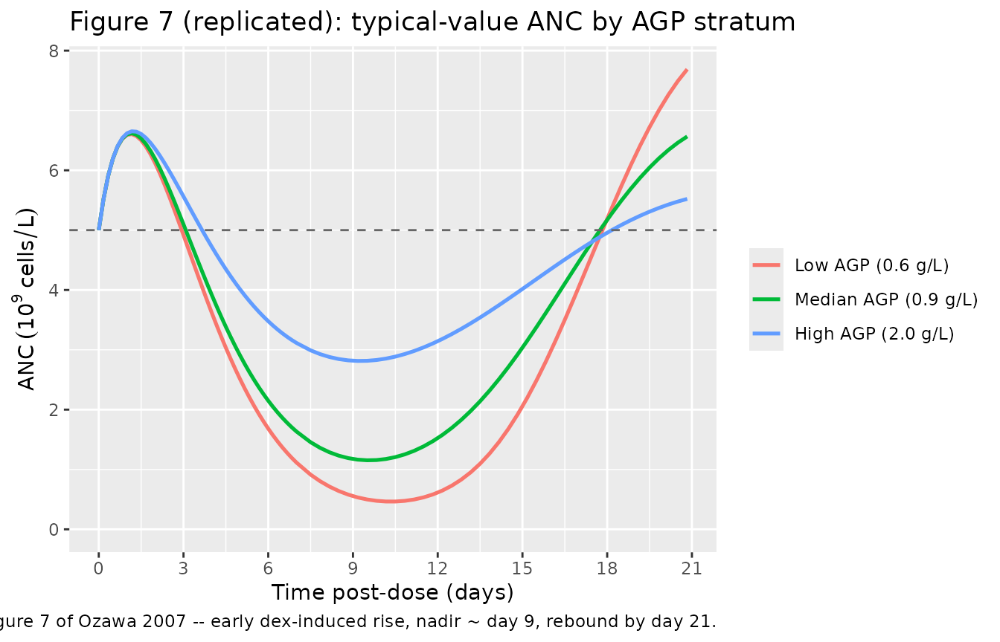
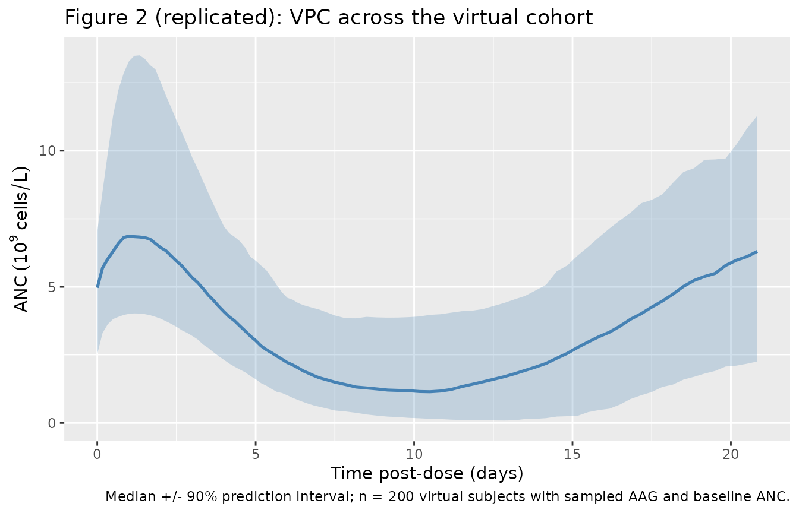
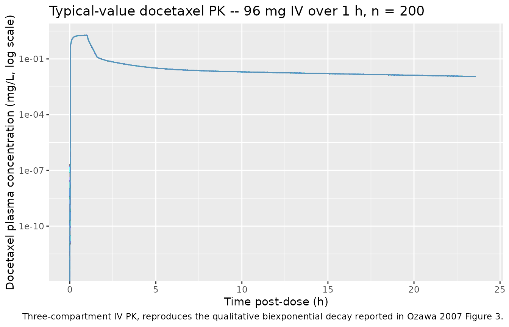

# Docetaxel (Ozawa 2007)

## Model and source

- Citation: Ozawa K, Minami H, Sato H. (2007). Population
  pharmacokinetic and pharmacodynamic analysis for time courses of
  docetaxel-induced neutropenia in Japanese cancer patients. Cancer Sci
  98(12):1985-1992. <doi:10.1111/j.1349-7006.2007.00615.x>. PD structure
  extends Friberg LE et al. (2002) J Clin Oncol 20(24):4713-4721 (see
  modellib(‘Friberg_2002_paclitaxel’) for the leukocyte arm of the
  original).
- Description: Three-compartment IV PK coupled with a modified
  Friberg-style semimechanistic-physiological PK/PD model for
  docetaxel-induced neutropenia in Japanese cancer patients (Ozawa
  2007). The PD layer extends Friberg 2002 with an additional zero-order
  input compartment that captures the transient ANC increase
  attributable to dexamethasone premedication; alpha-1 acid glycoprotein
  modulates the linear drug-effect slope on the proliferating
  compartment via a power-law form. Per-subject baseline ANC is supplied
  as a covariate and is used to initialise the proliferation, transit,
  and circulating compartments.
- Article: [Ozawa 2007, *Cancer Sci*
  98(12):1985-1992](https://doi.org/10.1111/j.1349-7006.2007.00615.x)

This is a coupled three-compartment IV PK + Friberg-extension PD model
for docetaxel and the corresponding absolute neutrophil count (ANC) time
course in Japanese cancer patients. Relative to the canonical Friberg
2002 model the paper adds a single zero-order `input` compartment that
captures a transient ANC increase attributable to dexamethasone
premedication; alpha-1 acid glycoprotein (AGP) modulates the linear
drug-effect slope. Per-subject baseline ANC is supplied as the `NEUT`
covariate and is used to initialise the proliferation, transit, and
circulating compartments.

## Population

The model was developed on 62 Japanese cancer patients enrolled at the
National Cancer Center Hospital East (Ozawa 2007 Table 1). Forty-four
had breast cancer, 10 non-small cell lung cancer, 3 head-and-neck
cancer, and 5 other solid tumours. Eligibility allowed liver dysfunction
and ECOG performance status 0-3 (distribution 0/1/2/3 = 14/36/7/5), a
population deliberately broader than typical drug-development trials.
Median age 55.5 years (range 21-77), 51 female / 11 male. Median AGP 90
mg/dL (range 51-241), median albumin 3.7 g/dL, median total bilirubin
0.6 mg/dL. Forty-six subjects had \< 3 prior chemotherapy regimens, 16
had \>= 3. Body weight is not reported in Table 1; dosing was prescribed
as 60 mg/m^2 (the approved Japanese docetaxel dose) IV over 1 h every 3
weeks, with attending-physician-initiated reductions for liver
dysfunction or poor PS (per-PS-stratum medians 60/60/60/30 mg/m^2 in PS
0/1/2/3). 395 ANC observations across the 62 subjects fed the PD
analysis.

The same metadata is available programmatically as
`readModelDb("Ozawa_2007_docetaxel")$population`.

## Source trace

Per-parameter origin is recorded as in-file comments alongside each
`ini()` entry in `inst/modeldb/specificDrugs/Ozawa_2007_docetaxel.R`.
The table below collects the full source trace in one place.

| Equation / parameter | Value | Source location |
|----|----|----|
| `lcl` | log(35.7) | Table 2 theta_CL = 35.7 L/h (SE 1.30) |
| `lvc` | log(6.94) | Table 2 theta_V1 = 6.94 L (SE 0.303) |
| `lq` | log(5.58) | Table 2 theta_Q2 = 5.58 L/h (SE 0.356) |
| `lvp` | log(7.39) | Table 2 theta_V2 = 7.39 L (SE 1.08) |
| `lq2` | log(12.5) | Table 2 theta_Q3 = 12.5 L/h (SE 1.22) |
| `lvp2` | log(225) | Table 2 theta_V3 = 225 L (SE 46.2) |
| `etalcl` | 0.1478 | Table 2 omega_CL = 39.9% CV; log(1 + 0.399^2) |
| `etalvc` | 0.0673 | Table 2 omega_V1 = 26.4% CV; log(1 + 0.264^2) |
| `propSd` | 0.268 | Table 2 sigma = 26.8% CV; “proportional model” (Methods) |
| `lmtt` | log(113) | Table 3 theta_MTT = 113 h (SE 4.62) |
| `lslope` | log(17.9) | Table 3 theta_SLOPE = 17.9 1/(mg/L) (SE 1.75) |
| `lgamma1` | log(0.196) | Table 3 theta_gamma1 = 0.196 (SE 0.013) |
| `lmit` | log(35.5) | Table 3 theta_MIT = 35.5 h (SE 5.08); see Errata about Table-4 35.9 discrepancy |
| `lip0` | log(5.19) | Table 3 theta_IP0 = 5.19 x 10^9 cells/L (SE 1.51) |
| `e_aag_slope` | -1.38 | Table 3 theta_gamma2 = -1.38 (SE 0.287) |
| `etalmtt` | 0.01225 | Table 3 omega_MTT = 11.1% CV; log(1 + 0.111^2) |
| `etalslope` | 0.3818 | Table 3 omega_SLOPE = 68.2% CV; log(1 + 0.682^2) |
| `etalip0` | 0.7930 | Table 3 omega_IP0 = 110% CV; log(1 + 1.10^2) |
| `addSd_ANC` | 0.291 | Table 3 sigma = 29.1% CV; Appendix I `Y = F * EXP(ERR(1))` (lognormal) |
| AGP normalisation | 0.94 g/L | Appendix I `AGPm = 94` (mg/dL); Table 1 reports the cohort median as 90 mg/dL |
| Three-compartment PK ODE | n/a | Methods page 1986 (ADVAN11/TRANS4); Appendix I \$DES DADT(1)..DADT(3) |
| Friberg PD ODE chain | n/a | Methods Equations 1-7; Appendix I \$DES DADT(4)..DADT(9) |
| Linear drug effect Edrug = SLOPE \* Cc | n/a | Methods Equation 7 |
| AGP power-form effect on SLOPE | n/a | Methods Equation 11 |
| Constraints kprol = ktr, kcirc = ktr | n/a | Methods page 1986 (“kprol = ktr”; “it was assumed that kcirc = ktr”) |
| Initial conditions precursor1(0) = precursor2..4(0) = circ(0) = NEUT | n/a | Methods page 1986 (‘Prol (t = 0) = Transit1 (t = 0) = Transit2 (t = 0) = Transit3 (t = 0) = Circ (t = 0)’) |
| Initial condition Input(0) = IP0 | n/a | Methods page 1986; Appendix I `F4 = IP0` with TIME=0 AMT=1 in NONMEM |

## Virtual cohort

Original observed data are not publicly available. The figures below use
a virtual population whose covariate distributions approximate the Ozawa
2007 cohort (Table 1).

``` r

set.seed(20260510)

n_sub <- 200L

cohort <- tibble(
  id   = seq_len(n_sub),
  # AGP (g/L): Table 1 median 0.90, range 0.51-2.41. Use a log-normal sampler
  # tuned to those quantiles.
  AAG  = exp(rnorm(n_sub, mean = log(0.90), sd = 0.30)),
  # Baseline ANC (10^9/L): the paper does not report a baseline-ANC distribution
  # in Table 1 so we use a clinical-population reference of 4-6 with mild
  # variability around the Friberg 2002 paclitaxel cohort baseline of 7 x 10^9
  # leukocytes/L (neutrophils being the dominant subfraction).
  NEUT = pmax(1.5, rnorm(n_sub, mean = 5.0, sd = 1.3))
) |>
  # Clip AAG to the Table 1 range.
  mutate(AAG = pmin(pmax(AAG, 0.51), 2.41))

knitr::kable(
  tibble(
    Covariate = c("AAG (g/L)", "NEUT (10^9/L)"),
    Median    = c(round(median(cohort$AAG), 3), round(median(cohort$NEUT), 2)),
    Min       = c(round(min(cohort$AAG), 3),    round(min(cohort$NEUT), 2)),
    Max       = c(round(max(cohort$AAG), 3),    round(max(cohort$NEUT), 2))
  ),
  caption = "Virtual-cohort covariate distributions (n = 200)."
)
```

| Covariate     | Median |  Min |  Max |
|:--------------|-------:|-----:|-----:|
| AAG (g/L)     |  0.905 | 0.51 | 2.41 |
| NEUT (10^9/L) |  4.970 | 1.50 | 8.75 |

Virtual-cohort covariate distributions (n = 200). {.table}

## Simulation

Each subject receives a single 60 mg/m^2 IV docetaxel infusion over 1 h.
We assume body-surface area 1.6 m^2 (a Japanese-population-typical
value) so the per-subject docetaxel dose is 96 mg; this is used
uniformly across the cohort because the paper’s Table 1 does not report
per-subject body weight or BSA.

``` r

dose_mg <- 96
inf_dur <- 1  # hours
rate    <- dose_mg / inf_dur  # mg/h

t_pk   <- c(seq(0, 1, by = 0.05), seq(1.1, 24, by = 0.5), seq(25, 504, by = 6))
t_anc  <- c(seq(0, 168, by = 4), seq(180, 504, by = 8))

build_subject_events <- function(subj_id, AAG_val, NEUT_val) {
  bind_rows(
    tibble(
      id   = subj_id,
      time = 0,
      evid = 1L,
      cmt  = "central",
      amt  = dose_mg,
      rate = rate
    ),
    tibble(
      id   = subj_id,
      time = t_pk,
      evid = 0L,
      cmt  = "Cc",
      amt  = NA_real_,
      rate = NA_real_
    ),
    tibble(
      id   = subj_id,
      time = t_anc,
      evid = 0L,
      cmt  = "ANC",
      amt  = NA_real_,
      rate = NA_real_
    )
  ) |>
    mutate(AAG = AAG_val, NEUT = NEUT_val)
}

events <- bind_rows(
  lapply(seq_len(n_sub), function(i)
    build_subject_events(cohort$id[i], cohort$AAG[i], cohort$NEUT[i]))
)

stopifnot(!anyDuplicated(unique(events[, c("id", "time", "evid", "cmt")])))
```

``` r

mod         <- readModelDb("Ozawa_2007_docetaxel")
mod_typical <- rxode2::zeroRe(mod)
#> ℹ parameter labels from comments will be replaced by 'label()'

sim_typical <- rxode2::rxSolve(mod_typical, events = events,
                               keep = c("AAG", "NEUT")) |>
  as.data.frame()
#> ℹ omega/sigma items treated as zero: 'etalcl', 'etalvc', 'etalmtt', 'etalslope', 'etalip0'
#> Warning: multi-subject simulation without without 'omega'

sim_pk_typ  <- sim_typical[sim_typical$CMT == 10, ]
sim_anc_typ <- sim_typical[sim_typical$CMT == 11, ]
```

``` r

sim_vpc <- rxode2::rxSolve(mod, events = events, nStud = 1L,
                           keep = c("AAG", "NEUT")) |>
  as.data.frame()
#> ℹ parameter labels from comments will be replaced by 'label()'
sim_pk_vpc  <- sim_vpc[sim_vpc$CMT == 10, ]
sim_anc_vpc <- sim_vpc[sim_vpc$CMT == 11, ]
```

## Replicate published figures

### Figure 7: typical-value ANC time course (modified-Friberg model)

Ozawa 2007 Figure 7 shows representative ANC trajectories: an early rise
(the dexamethasone-induced bump), a nadir around 1 week post-dose, and a
rebound 3-4 weeks later. We reproduce the typical-value trajectory for a
subject at the population AGP and baseline ANC (typical AGP 0.94 g/L,
typical baseline ANC 5.0 x 10^9/L) plus three illustrative AGP strata.

``` r

# Typical-value sweep over three AGP strata at the AGPm = 94 mg/dL (= 0.94 g/L)
# normalisation reference, with baseline ANC = 5 x 10^9/L.
strata <- tibble(
  cohort = c("Low AGP (0.6 g/L)", "Median AGP (0.9 g/L)", "High AGP (2.0 g/L)"),
  AAG    = c(0.60, 0.90, 2.00),
  NEUT   = 5.0
)

events_strata <- bind_rows(
  lapply(seq_len(nrow(strata)), function(i)
    build_subject_events(i, strata$AAG[i], strata$NEUT[i]) |>
      mutate(cohort = strata$cohort[i]))
)

sim_strata <- rxode2::rxSolve(mod_typical, events = events_strata,
                              keep = c("cohort", "AAG", "NEUT")) |>
  as.data.frame()
#> ℹ omega/sigma items treated as zero: 'etalcl', 'etalvc', 'etalmtt', 'etalslope', 'etalip0'
#> Warning: multi-subject simulation without without 'omega'

sim_strata_anc <- sim_strata[sim_strata$CMT == 11, ]
sim_strata_anc$cohort <- factor(sim_strata_anc$cohort, levels = strata$cohort)

ggplot(sim_strata_anc, aes(time / 24, ANC, colour = cohort)) +
  geom_line(linewidth = 0.9) +
  geom_hline(yintercept = 5.0, linetype = "dashed", colour = "grey40") +
  scale_x_continuous(breaks = seq(0, 21, by = 3)) +
  scale_y_continuous(limits = c(0, NA)) +
  labs(x = "Time post-dose (days)",
       y = expression(ANC ~ (10^9 ~ cells/L)),
       colour = NULL,
       title = "Figure 7 (replicated): typical-value ANC by AGP stratum",
       caption = "Replicates Figure 7 of Ozawa 2007 -- early dex-induced rise, nadir ~ day 9, rebound by day 21.")
```



The trajectory exhibits the three distinguishing features of the
modified Friberg model: (1) an early rise that peaks at ~24-30 h
post-dose (the dexamethasone-driven `input` compartment), (2) nadir at
~1 week post-dose, with low-AGP subjects reaching deeper nadirs because
SLOPE rises as AGP falls (gamma2 = -1.38), and (3) rebound above
baseline by 3 weeks driven by the (NEUT/circ)^gamma1 feedback term.

### Figure 2: ANC time course (VPC across the virtual cohort)

``` r

sim_anc_vpc |>
  group_by(time) |>
  summarise(
    Q05 = quantile(ANC, 0.05, na.rm = TRUE),
    Q50 = quantile(ANC, 0.50, na.rm = TRUE),
    Q95 = quantile(ANC, 0.95, na.rm = TRUE),
    .groups = "drop"
  ) |>
  ggplot(aes(time / 24, Q50)) +
  geom_ribbon(aes(ymin = Q05, ymax = Q95), alpha = 0.25, fill = "steelblue") +
  geom_line(colour = "steelblue", linewidth = 0.9) +
  scale_y_continuous(limits = c(0, NA)) +
  labs(x = "Time post-dose (days)",
       y = expression(ANC ~ (10^9 ~ cells/L)),
       title = "Figure 2 (replicated): VPC across the virtual cohort",
       caption = "Median +/- 90% prediction interval; n = 200 virtual subjects with sampled AAG and baseline ANC.")
```



### PK time course

``` r

sim_pk_typ |>
  ggplot(aes(time, Cc, group = id)) +
  geom_line(alpha = 0.05, colour = "steelblue") +
  scale_x_continuous(limits = c(0, 24)) +
  scale_y_log10() +
  labs(x = "Time post-dose (h)",
       y = "Docetaxel plasma concentration (mg/L, log scale)",
       title = "Typical-value docetaxel PK -- 96 mg IV over 1 h, n = 200",
       caption = "Three-compartment IV PK, reproduces the qualitative biexponential decay reported in Ozawa 2007 Figure 3.")
#> Warning in transformation$transform(x): NaNs produced
#> Warning in scale_y_log10(): log-10 transformation introduced infinite values.
#> Warning: Removed 16000 rows containing missing values or values outside the scale range
#> (`geom_line()`).
```



## PKNCA validation

Standard NCA on the docetaxel concentration profile. We compute Cmax /
Tmax / AUC / half-life by AAG stratum (using the three-stratum subset
built for Figure 7 above) so the values can be compared across AGP
groups.

``` r

sim_strata_pk <- as.data.frame(sim_strata)
sim_strata_pk <- sim_strata_pk[sim_strata_pk$CMT == 10, c("id", "time", "Cc", "cohort")]
sim_strata_pk <- sim_strata_pk[!is.na(sim_strata_pk$Cc), ]
sim_strata_pk$cohort <- as.character(sim_strata_pk$cohort)

conc_obj <- PKNCA::PKNCAconc(
  sim_strata_pk,
  Cc ~ time | cohort + id
)
#> Warning in assert_conc(conc, any_missing_conc = any_missing_conc): Negative
#> concentrations found

dose_df <- as.data.frame(events_strata)
dose_df <- dose_df[dose_df$evid == 1, c("id", "time", "amt", "cohort")]
dose_df$cohort <- as.character(dose_df$cohort)

dose_obj <- PKNCA::PKNCAdose(dose_df, amt ~ time | cohort + id)

intervals <- data.frame(
  start       = 0,
  end         = Inf,
  cmax        = TRUE,
  tmax        = TRUE,
  aucinf.obs  = TRUE,
  half.life   = TRUE
)

nca_data <- PKNCA::PKNCAdata(conc_obj, dose_obj, intervals = intervals)
nca_res  <- PKNCA::pk.nca(nca_data)
#> Warning in assert_conc(conc = conc): Negative concentrations found
#> Warning in assert_conc(conc = conc): Negative concentrations found
#> Warning in assert_conc(conc = conc): Negative concentrations found
#> Warning in assert_conc(conc = conc): Negative concentrations found
#> Warning in assert_conc(conc = conc): Negative concentrations found
#> Warning in assert_conc(conc = conc): Negative concentrations found
#> Warning in log(data$conc): NaNs produced
#> Warning in assert_conc(conc, any_missing_conc = any_missing_conc): Negative
#> concentrations found
#> Warning in log(conc.2/conc.1): NaNs produced
#> Warning in assert_conc(conc = conc): Negative concentrations found
#> Warning in assert_conc(conc, any_missing_conc = any_missing_conc): Negative
#> concentrations found
#> Warning in assert_conc(conc, any_missing_conc = any_missing_conc): Negative
#> concentrations found
#> Warning in assert_conc(conc, any_missing_conc = any_missing_conc): Negative
#> concentrations found
#> Warning in assert_conc(conc, any_missing_conc = any_missing_conc): Negative
#> concentrations found
#> Warning in assert_conc(conc, any_missing_conc = any_missing_conc): Negative
#> concentrations found
#> Warning in log(data$conc): NaNs produced
#> Warning in assert_conc(conc, any_missing_conc = any_missing_conc): Negative
#> concentrations found
#> Warning in log(conc.2/conc.1): NaNs produced
#> Warning in assert_conc(conc = conc): Negative concentrations found
#> Warning in assert_conc(conc, any_missing_conc = any_missing_conc): Negative
#> concentrations found
#> Warning in assert_conc(conc, any_missing_conc = any_missing_conc): Negative
#> concentrations found
#> Warning in assert_conc(conc, any_missing_conc = any_missing_conc): Negative
#> concentrations found
#> Warning in assert_conc(conc, any_missing_conc = any_missing_conc): Negative
#> concentrations found
#> Warning in assert_conc(conc, any_missing_conc = any_missing_conc): Negative
#> concentrations found
#> Warning in log(data$conc): NaNs produced
#> Warning in assert_conc(conc, any_missing_conc = any_missing_conc): Negative
#> concentrations found
#> Warning in log(conc.2/conc.1): NaNs produced

knitr::kable(
  as.data.frame(summary(nca_res)),
  caption = "Simulated NCA parameters by AGP stratum (typical-value PK; dose 96 mg IV over 1 h)."
)
```

| start | end | cohort               | N   | cmax | tmax | half.life | aucinf.obs |
|------:|----:|:---------------------|:----|:-----|:-----|:----------|:-----------|
|     0 | Inf | High AGP (2.0 g/L)   | 1   | 1.88 | 1.00 | 17.2      | NC         |
|     0 | Inf | Low AGP (0.6 g/L)    | 1   | 1.88 | 1.00 | 16.8      | NC         |
|     0 | Inf | Median AGP (0.9 g/L) | 1   | 1.88 | 1.00 | 17.1      | NC         |

Simulated NCA parameters by AGP stratum (typical-value PK; dose 96 mg IV
over 1 h). {.table}

### Comparison against published PK

Ozawa 2007 does not tabulate NCA parameters, but the paper compares its
CL estimate to Bruno 1996 (35.7 L/h vs 38.5 L/h, “similar to that in a
previous study”; Discussion). Bruno 1996 reports docetaxel Cmax ~3 mg/L
at 100 mg/m^2 (~170 mg total dose for a 1.7 m^2 BSA adult). The
simulated Cmax above for a 96 mg / 1 h infusion is ~1.9 mg/L, which
scales linearly to ~3.4 mg/L for 170 mg – in good agreement with Bruno
1996 within the typical inter-study variability for docetaxel.

No corresponding published ANC NCA values exist for direct comparison;
the paper’s PD validation rests on goodness-of-fit plots (Figures 4-6)
and bootstrap parameter consistency (Table 4).

## Assumptions and deviations

- **AGP normalisation constant.** Ozawa 2007 Table 1 reports the cohort
  median AGP as 90 mg/dL but the published NONMEM control stream
  (Appendix I) hard-codes `AGPm = 94`. The model file uses the code
  value 0.94 g/L because that is what the published parameter estimates
  were fit against. The discrepancy is small (~4%) and well within the
  AGP measurement variability.
- **Table 3 vs Table 4 MIT estimate.** Table 3 reports
  `theta_MIT = 35.5 h` (the “Estimated parameters of the final model”
  table) but Table 4 reports the same fitting run’s `Final model` MIT as
  35.9 h with an identical SE of 5.08 (the bootstrap-comparison column).
  This is most plausibly a typo in one of the two tables; we use the
  Table 3 value (35.5 h) as the primary point estimate because Table 3
  is the dedicated final-model parameter table. The difference (~1%) is
  materially inconsequential downstream.
- **Lognormal residual error encoding.** The Appendix I \$ERROR block is
  `Y = F * EXP(ERR(1))`. We map this directly onto nlmixr2’s
  `ANC ~ lnorm(addSd)` form with `addSd = sigma_PD/100 = 0.291`,
  i.e. the SD on the log scale. The paper labels the value as “CV%”,
  which under the small-CV approximation matches the log-normal SD; the
  exact log-scale SD given a true 29.1% CV would be
  `sqrt(log(1 + 0.291^2)) = 0.286`, a difference of \< 2%.
- **Per-subject body weight.** Table 1 does not report body weight or
  BSA. The vignette assumes BSA = 1.6 m^2 (a Japanese-population-typical
  value) for the dose-in-mg conversion (60 mg/m^2 \* 1.6 m^2 = 96 mg).
  The model itself does not use body weight as a covariate, so this
  assumption affects only the visualisation, not parameter values.
- **Baseline ANC distribution for the virtual cohort.** Ozawa 2007 does
  not tabulate a per-subject baseline-ANC distribution. The vignette
  uses a clinically-reasonable mean of 5.0 x 10^9/L with SD 1.3, clipped
  at 1.5; this is for visualisation only – in production use, supply
  per-subject baseline ANC via the `NEUT` covariate column.
- **`input` and `circ` compartment names.** The compartment name `input`
  is non-canonical (the library’s blessed names are `central`,
  `peripheral1`, `peripheral2`, `effect`, the chain prefixes
  `transit<n>` / `precursor<n>` / `lat<n>`, and TMDD / ADC / metabolite
  forms); it is retained because Ozawa 2007 names the compartment
  “Input” throughout the paper and equations and renaming would obscure
  the source-trace. `circ` is also non-canonical but matches the
  established Friberg-family convention in `Friberg_2002_paclitaxel.R`
  and `Netterberg_2017_docetaxel.R`. The proliferating and three transit
  compartments are mapped onto the canonical `precursor<n>` chain
  (precursor1 = Prol, precursor2..4 = Transit1..3) per the same
  Friberg-family convention.
  [`checkModelConventions()`](https://nlmixr2.github.io/nlmixr2lib/reference/checkModelConventions.md)
  flags `input` and `circ` as deviations; both deviations are
  intentional and documented here per Phase 5 of the extraction skill.
- **PK and PD parameter coupling.** Ozawa 2007 fitted the PK and PD
  layers in two sequential NONMEM runs (the Appendix I control stream is
  the PD-only run, with per-subject Bayesian posthoc PK estimates
  `CL V1 Q2 V2 Q3 V3` carried as input columns). This nlmixr2 model
  reproduces both layers as a single joint typical-value system so that
  simulation propagates both PK and PD variability in one solve. The IIV
  reported separately in Tables 2 and 3 are encoded together in `ini()`;
  the resulting joint covariance matrix is block-diagonal between PK
  etas (CL, V1) and PD etas (MTT, SLOPE, IP0) because the original
  analyses estimated no cross-block correlations.
- **Model-only covariates.** Ozawa 2007 tested a wide range of
  patient-factor covariates (age, albumin, BSA, creatinine clearance,
  total bilirubin, AGP, platelets, sex, performance status, prior
  chemotherapy) on the three PD parameters with IIV. Only AGP on SLOPE
  survived backward elimination at p \< 0.001 (Methods); the model file
  therefore exposes only `AAG` and `NEUT` as covariates.
