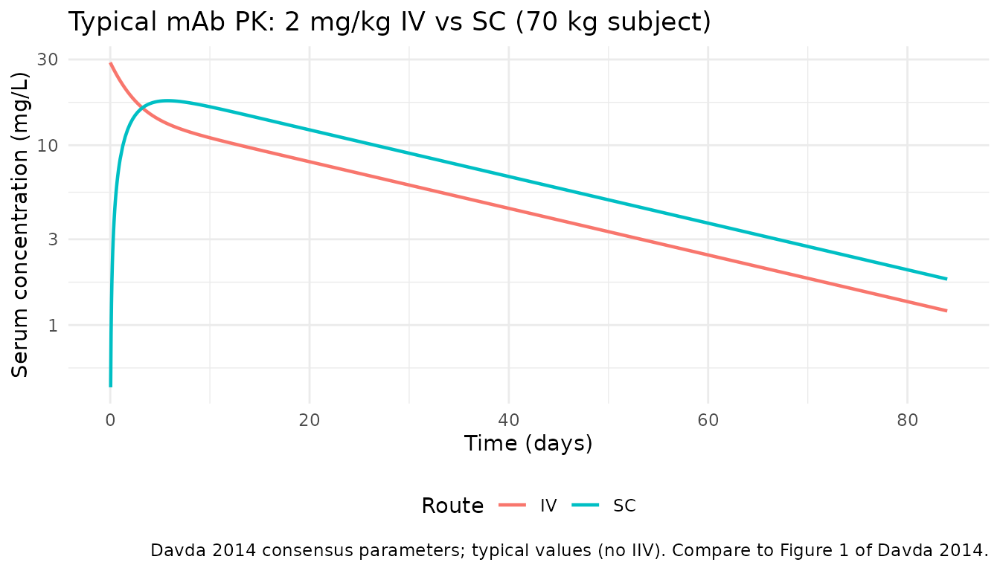
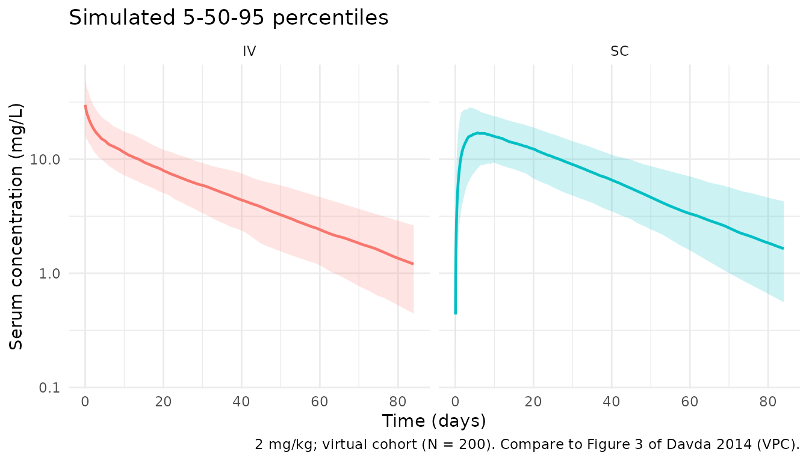

# PK_2cmt_mAb_Davda_2014

## Model and source

- Citation: Davda JP, Dodds MG, Gibbs MA, Wisdom W, Gibbs JP. A
  model-based meta-analysis of monoclonal antibody pharmacokinetics to
  guide optimal first-in-human study design. MAbs. 2014;6(4):1094-1102.
  <doi:10.4161/mabs.29095>
- Description: Two compartment PK model with linear clearance for
  average monoclonal antibodies (Davda 2014)
- Article: [MAbs
  2014;6(4):1094-1102](https://doi.org/10.4161/mabs.29095)
- Open access: <https://pmc.ncbi.nlm.nih.gov/articles/PMC4171012/>

## Population

Davda 2014 is a **model-based meta-analysis** of first-in-human (FIH)
population PK data from four therapeutic monoclonal antibodies (labeled
mAb a, b, c, d). mAb a, b, and c are humanized/human IgG2 antibodies;
mAb d is a human IgG1. All four target soluble ligands. The pooled
dataset comprised 171 healthy adult volunteers (2,716 serum
concentrations: 1,153 from IV dosing and 1,563 from SC dosing). The IV
dose range was 1–700 mg and the SC dose range was 2.1–700 mg. Per-study
demographic breakdowns (age, sex, weight bands, race) are not tabulated
in the published paper; the allometric reference weight is 70 kg. The
resulting consensus parameters (Table 3) are intended to guide FIH dose
selection for new therapeutic mAbs against soluble targets with similar
properties.

The same information is available programmatically via
`readModelDb("PK_2cmt_mAb_Davda_2014")$population`.

## Source trace

Per-parameter origin is recorded as an in-file comment next to each
[`ini()`](https://nlmixr2.github.io/rxode2/reference/ini.html) entry in
`inst/modeldb/pharmacokinetics/PK_2cmt_mAb_Davda_2014.R`. The table
below collects them for review.

| Equation / parameter                    | Value                | Source location                                                                            |
|-----------------------------------------|----------------------|--------------------------------------------------------------------------------------------|
| `lfdepot` (F1)                          | `log(0.744)`         | Davda 2014 Table 3                                                                         |
| `lka` (Ka)                              | `log(0.282)` 1/day   | Davda 2014 Table 3                                                                         |
| `lcl` (CL)                              | `log(0.200)` L/day   | Davda 2014 Table 3                                                                         |
| `lvc` (V1 / Vc)                         | `log(3.61)` L        | Davda 2014 Table 3                                                                         |
| `lvp` (V2 / Vp)                         | `log(2.75)` L        | Davda 2014 Table 3                                                                         |
| `lq` (Q)                                | `log(0.747)` L/day   | Davda 2014 Table 3                                                                         |
| `allocl` (allometric exponent on CL, Q) | `0.865`              | Davda 2014 Table 3                                                                         |
| `allov` (allometric exponent on Vc, Vp) | `0.957`              | Davda 2014 Table 3                                                                         |
| `etalka` IIV                            | `0.416` (= 0.645^2)  | Davda 2014 Table 3 (CV = 64.5%; omega^2 = CV^2)                                            |
| `etalcl` IIV                            | `0.0987` (= 0.314^2) | Davda 2014 Table 3 (CV = 31.4%)                                                            |
| `etalvc` IIV                            | `0.116` (= 0.341^2)  | Davda 2014 Table 3 (CV = 34.1%)                                                            |
| `etalvp` IIV                            | `0.0789` (= 0.281^2) | Davda 2014 Table 3 (CV = 28.1%)                                                            |
| `etalq` IIV                             | `0.699` (= 0.836^2)  | Davda 2014 Table 3 (CV = 83.6%)                                                            |
| COV(CL, Vc)                             | `0.0786`             | Davda 2014 Table 3                                                                         |
| COV(Vc, Vp)                             | `0.0619`             | Davda 2014 Table 3                                                                         |
| COV(CL, Vp)                             | `0.0377`             | Davda 2014 Table 3                                                                         |
| `propSd` (residual proportional SD)     | `0.144`              | Davda 2014 Table 3 (sigma = 14.4%, sigma^2 = 0.0208)                                       |
| Structure                               | n/a                  | Davda 2014 Methods / Table 3: two-compartment linear CL, first-order SC absorption with F1 |

Davda 2014 uses the convention that reported “%CV” is `omega × 100`
where `omega` is the standard deviation of the log-normally distributed
random effect. The diagonal of OMEGA is therefore simply `(CV/100)^2`.
This is the encoding used in the
[`ini()`](https://nlmixr2.github.io/rxode2/reference/ini.html) block
above.

## Virtual cohort

Individual observed data are not public. The cohort below is a virtual
population of healthy adults with body weight sampled from a truncated
normal centered on 70 kg (SD 12 kg, truncated to 45-120 kg), simulated
under two regimens:

- **IV** 2 mg/kg as an instantaneous bolus into the central compartment.
- **SC** 2 mg/kg into the depot compartment (bioavailability from the
  model).

Both follow one subject for 84 days to capture the terminal phase of an
average mAb (apparent half-life ~20 days).

``` r
set.seed(20260418)
n_subj <- 200

wt_draws <- pmin(pmax(rnorm(n_subj, mean = 70, sd = 12), 45), 120)

cohort <- tibble(
  id = seq_len(n_subj),
  WT = wt_draws
)

obs_times <- c(
  seq(0, 1, by = 1 / 24), # first 24 h hourly
  seq(1.25, 7, by = 0.25), # first week quarter-day
  seq(7.5, 28, by = 0.5), # out to day 28 twice-daily
  seq(29, 84, by = 1) # to day 84 daily
)

make_events <- function(cohort, route = c("IV", "SC")) {
  route <- match.arg(route)
  cmt_dose <- if (route == "IV") "central" else "depot"
  doses <- cohort |>
    dplyr::mutate(
      time = 0,
      amt = 2 * WT, # 2 mg/kg
      cmt = cmt_dose,
      evid = 1L
    ) |>
    dplyr::select(id, time, amt, cmt, evid, WT)
  obs <- cohort |>
    tidyr::crossing(time = obs_times) |>
    dplyr::mutate(amt = 0, cmt = NA_character_, evid = 0L) |>
    dplyr::select(id, time, amt, cmt, evid, WT)
  dplyr::bind_rows(doses, obs) |>
    dplyr::arrange(id, time, dplyr::desc(evid)) |>
    dplyr::mutate(treatment = route)
}

events_iv <- make_events(cohort, "IV")
events_sc <- make_events(cohort, "SC")
```

## Simulation

``` r
mod <- rxode2::rxode2(readModelDb("PK_2cmt_mAb_Davda_2014"))

sim_iv <- rxode2::rxSolve(mod, events = events_iv, keep = c("WT", "treatment"))
#> ℹ omega/sigma items treated as zero: 'etalfdepot'
sim_sc <- rxode2::rxSolve(mod, events = events_sc, keep = c("WT", "treatment"))
#> ℹ omega/sigma items treated as zero: 'etalfdepot'

sim <- dplyr::bind_rows(
  as_tibble(sim_iv),
  as_tibble(sim_sc)
)
```

For a deterministic typical-subject (70 kg, no between-subject
variability) comparison of IV vs SC, zero out random effects:

``` r
mod_typical <- mod |> rxode2::zeroRe()

typical_cohort <- tibble(id = 1:2, WT = 70,
  treatment = c("IV", "SC"))

ev_typical <- dplyr::bind_rows(
  tibble(id = 1, time = 0, amt = 140, cmt = "central", evid = 1L, WT = 70,
    treatment = "IV"),
  tibble(id = 2, time = 0, amt = 140, cmt = "depot", evid = 1L, WT = 70,
    treatment = "SC")
) |>
  dplyr::bind_rows(
    typical_cohort |>
      tidyr::crossing(time = obs_times) |>
      dplyr::mutate(amt = 0, cmt = NA_character_, evid = 0L)
  ) |>
  dplyr::arrange(id, time, dplyr::desc(evid))

sim_typical <- rxode2::rxSolve(
  mod_typical, events = ev_typical, keep = c("WT", "treatment")
) |> as_tibble()
#> ℹ omega/sigma items treated as zero: 'etalfdepot', 'etalka', 'etalcl', 'etalvc', 'etalvp', 'etalq'
#> Warning: multi-subject simulation without without 'omega'
```

## Replicate published figures

### Figure 1 / 3 — typical IV vs SC profiles

Davda 2014 Figure 1 shows representative concentration-time profiles for
IV and SC administration of the included mAbs, and Figure 3 shows the
VPC of the final model. Below is the typical-subject analogue: a 70 kg
adult receiving a 2 mg/kg (140 mg) IV or SC dose.

``` r
sim_typical |>
  dplyr::filter(!is.na(Cc), Cc > 0) |>
  ggplot(aes(time, Cc, colour = treatment)) +
  geom_line(linewidth = 0.8) +
  scale_y_log10() +
  labs(x = "Time (days)", y = "Serum concentration (mg/L)",
    colour = "Route",
    title = "Typical mAb PK: 2 mg/kg IV vs SC (70 kg subject)",
    caption = "Davda 2014 consensus parameters; typical values (no IIV). Compare to Figure 1 of Davda 2014.") +
  theme_minimal() +
  theme(legend.position = "bottom")
```



### VPC-style percentile bands

Virtual cohort percentiles with IIV for the IV and SC regimens.
Analogous to Davda 2014 Figure 3 (VPC), though the underlying
individuals differ from the paper’s observed dataset.

``` r
sim |>
  dplyr::filter(!is.na(Cc), Cc > 0) |>
  dplyr::group_by(time, treatment) |>
  dplyr::summarise(
    Q05 = quantile(Cc, 0.05),
    Q50 = quantile(Cc, 0.50),
    Q95 = quantile(Cc, 0.95),
    .groups = "drop"
  ) |>
  ggplot(aes(time, Q50, fill = treatment, colour = treatment)) +
  geom_ribbon(aes(ymin = Q05, ymax = Q95), alpha = 0.2, colour = NA) +
  geom_line(linewidth = 0.8) +
  scale_y_log10() +
  facet_wrap(~treatment) +
  labs(x = "Time (days)", y = "Serum concentration (mg/L)",
    title = "Simulated 5-50-95 percentiles",
    caption = "2 mg/kg; virtual cohort (N = 200). Compare to Figure 3 of Davda 2014 (VPC).") +
  theme_minimal() +
  theme(legend.position = "none")
```



## PKNCA validation

Cmax, Tmax, AUC0-inf, and terminal half-life computed with `PKNCA`,
stratified by route (the `treatment` grouping variable).

``` r
sim_nca <- sim |>
  dplyr::filter(!is.na(Cc), Cc > 0) |>
  dplyr::select(id, time, Cc, treatment)

# IDs must be unique across treatment levels — namespace them
sim_nca <- sim_nca |>
  dplyr::mutate(id = paste(treatment, id, sep = "_"))

dose_df <- dplyr::bind_rows(events_iv, events_sc) |>
  dplyr::filter(evid == 1) |>
  dplyr::mutate(id = paste(treatment, id, sep = "_")) |>
  dplyr::select(id, time, amt, treatment)

conc_obj <- PKNCA::PKNCAconc(sim_nca, Cc ~ time | treatment + id)
dose_obj <- PKNCA::PKNCAdose(dose_df, amt ~ time | treatment + id)

intervals <- data.frame(
  start      = 0,
  end        = Inf,
  cmax       = TRUE,
  tmax       = TRUE,
  aucinf.obs = TRUE,
  half.life  = TRUE
)

nca_res <- PKNCA::pk.nca(
  PKNCA::PKNCAdata(conc_obj, dose_obj, intervals = intervals)
)
#>  ■■■                                7% |  ETA: 42s
#>  ■■■■■                             14% |  ETA: 37s
#>  ■■■■■■■                           21% |  ETA: 34s
#>  ■■■■■■■■■                         28% |  ETA: 31s
#>  ■■■■■■■■■■■■                      35% |  ETA: 28s
#>  ■■■■■■■■■■■■■■                    42% |  ETA: 25s
#>  ■■■■■■■■■■■■■■■■                  50% |  ETA: 22s
#>  ■■■■■■■■■■■■■■■■■■■               59% |  ETA: 17s
#>  ■■■■■■■■■■■■■■■■■■■■■             68% |  ETA: 13s
#>  ■■■■■■■■■■■■■■■■■■■■■■■■■         78% |  ETA:  8s
#>  ■■■■■■■■■■■■■■■■■■■■■■■■■■■       88% |  ETA:  5s
#>  ■■■■■■■■■■■■■■■■■■■■■■■■■■■■■■    98% |  ETA:  1s

summary(nca_res)
#>  start end treatment   N        cmax                 tmax   half.life
#>      0 Inf        IV 200 28.5 [35.4] 0.000 [0.000, 0.000] 24.1 [6.44]
#>      0 Inf        SC 200 17.7 [33.0]    6.25 [1.25, 27.0] 25.0 [6.66]
#>  aucinf.obs
#>  506 [34.4]
#>          NC
#> 
#> Caption: cmax, aucinf.obs: geometric mean and geometric coefficient of variation; tmax: median and range; half.life: arithmetic mean and standard deviation; N: number of subjects
```

### Comparison against published NCA

Davda 2014 is a population-PK meta-analysis and does **not** report a
standalone NCA table for Cmax / Tmax / AUC by route. Instead, the paper
characterises the mAb class via the population parameter estimates in
Table 3. The simulated NCA output above is provided so that readers can
inspect the emergent exposure properties of the consensus model. A
typical-subject sanity check at 70 kg, 2 mg/kg IV / SC:

``` r
typical_nca_conc <- sim_typical |>
  dplyr::filter(!is.na(Cc), Cc > 0) |>
  dplyr::mutate(id = paste(treatment, id, sep = "_")) |>
  dplyr::select(id, time, Cc, treatment)

typical_nca_dose <- tibble(
  id = c("IV_1", "SC_2"),
  time = 0,
  amt = 140,
  treatment = c("IV", "SC")
)

nca_typical <- PKNCA::pk.nca(PKNCA::PKNCAdata(
  PKNCA::PKNCAconc(typical_nca_conc, Cc ~ time | treatment + id),
  PKNCA::PKNCAdose(typical_nca_dose, amt ~ time | treatment + id),
  intervals = data.frame(
    start = 0, end = Inf,
    cmax = TRUE, tmax = TRUE, aucinf.obs = TRUE, half.life = TRUE
  )
))

typical_tbl <- as.data.frame(nca_typical$result) |>
  dplyr::filter(PPTESTCD %in% c("cmax", "tmax", "aucinf.obs", "half.life")) |>
  dplyr::select(treatment, PPTESTCD, PPORRES) |>
  tidyr::pivot_wider(names_from = PPTESTCD, values_from = PPORRES)

knitr::kable(
  typical_tbl,
  digits = 3,
  caption = paste(
    "Typical-subject (70 kg, 2 mg/kg) NCA for the Davda 2014 consensus model.",
    "The paper does not publish NCA for comparison; values shown for reader inspection."
  )
)
```

| treatment |   cmax | tmax | half.life | aucinf.obs |
|:----------|-------:|-----:|----------:|-----------:|
| IV        | 28.853 | 0.00 |    23.114 |    520.637 |
| SC        | 17.694 | 5.75 |    23.289 |         NA |

Typical-subject (70 kg, 2 mg/kg) NCA for the Davda 2014 consensus model.
The paper does not publish NCA for comparison; values shown for reader
inspection.

Qualitative expectations from the Davda 2014 consensus parameters at 70
kg, 2 mg/kg:

- IV Cmax at t=0 ~ `dose / Vc` = `140 / 3.61` ≈ 39 mg/L.
- SC Cmax is lower than IV and delayed by the slow first-order SC
  absorption (Ka = 0.282/day → absorption half-life ~2.5 days).
- Apparent terminal half-life for an average mAb ~
  `0.693 × (Vc + Vp) / CL` = `0.693 × 6.36 / 0.2` ≈ 22 days, consistent
  with class expectations (IgG catabolic half-life 2-4 weeks).
- SC AUC0-inf = IV AUC0-inf × F1 = IV AUC0-inf × 0.744.

## Assumptions and deviations

- Davda 2014 does not tabulate age, sex, or race distributions for the
  underlying 171 healthy volunteers. The virtual cohort uses body weight
  only (truncated normal around 70 kg). These population-level
  demographics are flagged as `NA` in `population` metadata rather than
  invented.
- The SC dose is administered into the depot compartment;
  bioavailability applies there (F1 = 0.744). The IV dose is placed
  directly in the central compartment (F = 1). This matches the model
  structure in Davda 2014.
- Simulation window (84 days) is long enough to characterise the
  terminal phase of an average mAb but is longer than some of the FIH
  follow-up windows in the original studies.
- The PKNCA comparison table is a qualitative check only: the paper does
  not publish NCA parameters, so no side-by-side published vs simulated
  table is possible. Values were **not** tuned to any target.
- IIV is encoded with `omega^2 = (CV/100)^2` on the diagonal, matching
  the paper’s convention that reported “%CV” is `omega × 100` (SD of the
  log-normal). Off-diagonal covariances are used as reported in Table 3.
