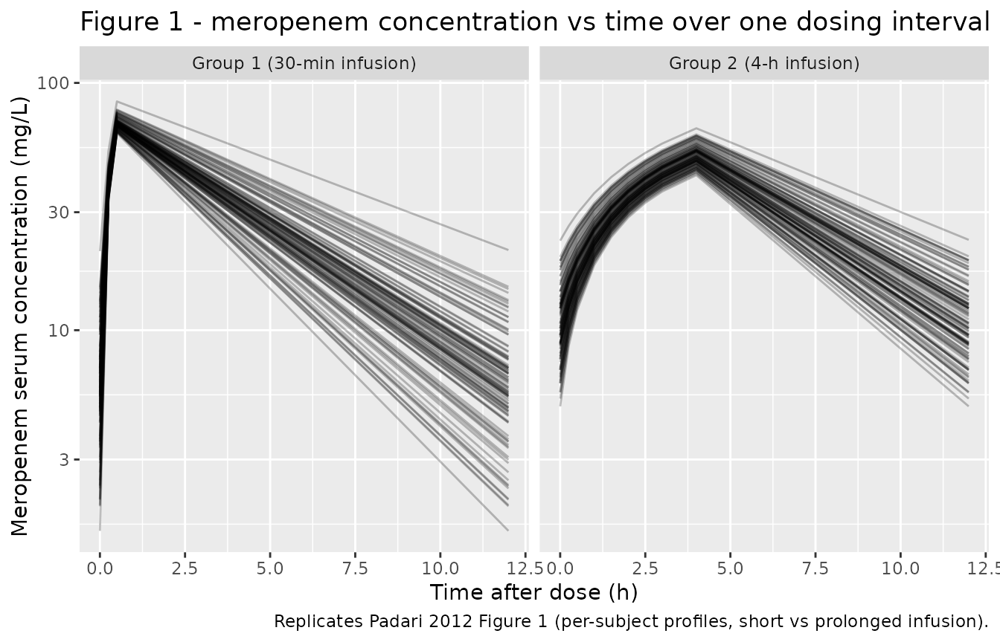

# Meropenem (Padari 2012)

## Model and source

- Citation: Padari H, Metsvaht T, Korgvee LT, Germovsek E, Ilmoja ML,
  Kipper K, Herodes K, Standing JF, Oselin K, Lutsar I. Short versus
  long infusion of meropenem in very-low-birth-weight neonates.
  Antimicrob Agents Chemother. 2012;56(9):4760-4764.
- Description: one-compartment IV population PK model with Vss scaled
  linearly to current body weight and CL scaled by the Rhodin (2009)
  fixed renal-maturation function (allometric exponent 0.75 on weight
  plus a Hill-type postmenstrual-age maturation, TM50 = 47.7 weeks, Hill
  = 3.4).
- Article: <https://doi.org/10.1128/AAC.00655-12>

## Population

Padari 2012 studied 19 very-low-birth-weight preterm neonates
(gestational age at birth less than or equal to 32 weeks; birth weight
less than 1,500 g) treated with meropenem for late-onset sepsis (n =
16), pneumonia (n = 3), or necrotizing enterocolitis with proven or
highly suspected resistant pathogens, in the Tartu University Hospital
and Tallinn Children’s Hospital NICUs (Estonia) between April 2010 and
February 2011. Group 1 (short infusion, n = 9) received meropenem 20
mg/kg every 12 h as a 30-min IV infusion; Group 2 (prolonged infusion, n
= 10) received the same dose as a 4-h IV infusion (after at least two
prolonged infusions to reach steady state). Baseline demographics
(Padari 2012 Table 1): mean (SD) current body weight at PK sampling
984.6 (291.6) g in Group 1 and 969.5 (102.9) g in Group 2; mean
gestational age 26.9 (1.4) and 25.8 weeks; mean postnatal age 15.6 (8.6)
and 20.5 (6.6) days; serum creatinine 51.4 (21.2) and 44.8 (24.0)
micromol/L. Most patients (95 percent) required respiratory support; 42
percent required vasoactive treatment.

The same information is available programmatically via the model’s
`population` metadata
(`readModelDb("Padari_2012_meropenem")$population`).

## Source trace

The per-parameter origin is recorded as an in-file comment next to each
`ini()` entry in `inst/modeldb/specificDrugs/Padari_2012_meropenem.R`.
The table below collects them in one place.

| Equation / parameter | Value | Source location |
|----|----|----|
| `lcl` (plasma CL standardised to 70 kg fully mature) | log(9.49 L/h) | Back-calculated from Padari 2012 Abstract / Results “Population modeling”: CL = 0.061 L/h/kg with Rhodin fixed scaling, evaluated at WT = 1 kg, PMA = 29 weeks |
| `lvc` (central V standardised to 70 kg) | log(21.07 L) | Padari 2012 Abstract: Vss = 0.301 L/kg \* 70 kg |
| `tmat50` (PMA at 50 % renal maturation) | 47.7 weeks (fixed) | Padari 2012 ref (25): Rhodin et al. 2009 Pediatr Nephrol 24:67-76 |
| `hill_mat` (renal maturation Hill exponent) | 3.4 (fixed) | Padari 2012 ref (25): Rhodin et al. 2009 |
| `e_wt_cl` (allometric exponent on CL) | 0.75 (fixed) | Padari 2012 ref (25): Rhodin et al. 2009 |
| `etalcl`, `etalvc` (IIV variances) | `fixed(0)` | Padari 2012 does NOT report OMEGA values; figures 2-3 confirm an IIV component was fitted but its magnitude is not published (see Assumptions and deviations) |
| `propSd` (residual SD) | `fixed(0.001)` placeholder | Padari 2012 does NOT report SIGMA; placeholder keeps the model parseable for deterministic simulation (see Assumptions and deviations) |
| `d/dt(central) = -kel * central` | n/a | Padari 2012 Results “Population modeling”: one-compartment fit |
| `cl = exp(lcl) * (WT/70)^0.75 * fmat(PAGE)` | n/a | Padari 2012 Results “Population modeling”: Rhodin fixed model |
| `vc = exp(lvc) * (WT/70)` | n/a | Padari 2012 Methods “PK analyses”: volume scaled with linear body weight |
| `fmat = PAGE^3.4 / (PAGE^3.4 + 47.7^3.4)` | n/a | Padari 2012 ref (25): Rhodin et al. 2009 |

## Virtual cohort

Original observed data are not publicly available. The figures below use
a virtual cohort whose covariate distributions match Padari 2012 Table
1: WT and PNA sampled within each infusion group, GA sampled from a
single common preterm distribution (mean 26.4, SD 1.4 weeks) because
Padari 2012 Table 1 reports a typographical SD of 25.8 for Group 2 (see
Errata). PMA at PK sampling is computed as PAGE = GA + PNA/7 (weeks).

``` r

set.seed(20120925) # Padari 2012 publication year + month

n_per_arm <- 100L # well under the 200/arm cap; ample for typical-value replication

make_cohort <- function(n, wt_mean, wt_sd, ga_mean, ga_sd,
                        pna_mean, pna_sd, infusion_h, treatment,
                        id_offset = 0L) {
  tibble::tibble(
    id = id_offset + seq_len(n),
    WT = pmax(0.6, pmin(1.5, rnorm(n, wt_mean, wt_sd))), # clamp to physiologic VLBW range
    GA = pmax(23, pmin(32, rnorm(n, ga_mean, ga_sd))),
    PNA_days = pmax(2, pmin(56, rnorm(n, pna_mean, pna_sd))),
    PAGE = GA + PNA_days / 7,
    treatment = treatment,
    infusion_h = infusion_h
  )
}

cohort_short <- make_cohort(
  n_per_arm,
  wt_mean = 0.985, wt_sd = 0.29,
  ga_mean = 26.9, ga_sd = 1.4,
  pna_mean = 15.6, pna_sd = 8.6,
  infusion_h = 0.5,
  treatment = "Group 1 (30-min infusion)",
  id_offset = 0L
)

cohort_long <- make_cohort(
  n_per_arm,
  wt_mean = 0.970, wt_sd = 0.10,
  ga_mean = 25.8, ga_sd = 1.4, # SD imputed; see Errata
  pna_mean = 20.5, pna_sd = 6.6,
  infusion_h = 4.0,
  treatment = "Group 2 (4-h infusion)",
  id_offset = n_per_arm
)

covars <- dplyr::bind_rows(cohort_short, cohort_long)
stopifnot(!anyDuplicated(covars$id))

# Build per-subject dosing + dense observation events. Meropenem 20 mg/kg q12h
# IV for 5 days, with the PK profile collected over the 4th dosing interval
# (t = 36-48 h after the first dose, mimicking Padari 2012 "4th-7th doses").
build_events <- function(row) {
  dose_mg <- 20 * row$WT
  rate_mg_per_h <- dose_mg / row$infusion_h
  ev <- rxode2::et(amt = dose_mg, ii = 12, until = 60, rate = rate_mg_per_h, cmt = "central")
  obs_times <- c(36, 36.25, 36.5, 37, 37.5, 38, 38.5, 39, 40, 41, 42, 44, 46, 48)
  ev <- rxode2::et(ev, obs_times)
  d <- as.data.frame(ev)
  d$id <- row$id
  d$WT <- row$WT
  d$PAGE <- row$PAGE
  d$treatment <- row$treatment
  d
}

events <- do.call(
  rbind,
  lapply(seq_len(nrow(covars)), function(i) build_events(covars[i, ]))
)
events <- events[order(events$id, events$time), ]
```

## Simulation

``` r

mod <- readModelDb("Padari_2012_meropenem")

# IIV is fixed(0) in the model file (Padari 2012 does not report OMEGA values),
# so zeroRe() is a no-op here. We include it for clarity that the replication is
# a typical-individual replication and not a stochastic VPC.
mod_typ <- rxode2::zeroRe(mod)
#> ℹ parameter labels from comments will be replaced by 'label()'

sim <- rxode2::rxSolve(mod_typ, events = events, keep = c("treatment"))
#> ℹ omega/sigma items treated as zero: 'etalcl', 'etalvc'
#> Warning: multi-subject simulation without without 'omega'
sim <- as.data.frame(sim)
```

## Replicate Figure 1: meropenem concentration-time curves

Padari 2012 Figure 1 shows per-subject concentration-time curves over a
single dosing interval for each infusion group. The cohort variability
in our replication comes entirely from the covariate distribution (WT,
GA, PNA) since IIV is fixed at 0 in the model file.

``` r

# Center observation times on the start of the sampled dose (t - 36 h)
sim |>
  dplyr::mutate(t_post_dose = time - 36) |>
  dplyr::filter(t_post_dose >= 0, t_post_dose <= 12) |>
  ggplot(aes(t_post_dose, Cc, group = id)) +
  geom_line(alpha = 0.25) +
  facet_wrap(~ treatment) +
  scale_y_log10() +
  labs(
    x = "Time after dose (h)",
    y = "Meropenem serum concentration (mg/L)",
    title = "Figure 1 - meropenem concentration vs time over one dosing interval at steady state",
    caption = "Replicates Padari 2012 Figure 1 (per-subject profiles, short vs prolonged infusion)."
  )
```



## PKNCA validation

Compute steady-state NCA over the sampled dosing interval (t = 36-48 h)
per treatment group, then compare against Padari 2012 Table 2.

``` r

# Subset the simulation to the sampled dosing interval (t = 36-48 h in
# simulation time) and shift so the trough at the start of the interval lands
# at t = 0 -- this gives PKNCA a clean AUC0-tau anchor at the per-subject
# trough concentration.
sim_nca <- sim |>
  dplyr::filter(!is.na(Cc)) |>
  dplyr::filter(time >= 36, time <= 48) |>
  dplyr::mutate(time = time - 36) |>
  dplyr::select(id, time, Cc, treatment) |>
  dplyr::distinct(id, treatment, time, .keep_all = TRUE) |>
  dplyr::arrange(id, treatment, time)

# One dose-row per subject, anchored at t = 0 of the sampled interval
# (= t = 36 h in simulation time after 5 days of q12h dosing at steady state).
dose_df <- covars |>
  dplyr::mutate(amt = 20 * WT, time = 0) |>
  dplyr::select(id, time, amt, treatment)

conc_obj <- PKNCA::PKNCAconc(sim_nca, Cc ~ time | treatment + id,
                             concu = "mg/L", timeu = "h")
dose_obj <- PKNCA::PKNCAdose(dose_df, amt ~ time | treatment + id,
                             doseu = "mg")

intervals <- data.frame(
  start     = 0,
  end       = 12,
  cmax      = TRUE,
  tmax      = TRUE,
  cmin      = TRUE,
  auclast   = TRUE,
  half.life = TRUE
)

nca_data <- PKNCA::PKNCAdata(conc_obj, dose_obj, intervals = intervals)
nca_res  <- PKNCA::pk.nca(nca_data)
```

### Comparison against Padari 2012 Table 2

Padari 2012 Table 2 reports per-group means (SD) of WinNonlin NCA
parameters. Note the paper’s `Vss` and `CLssM` are reported in mL/(kg)
and mL/h/kg respectively; for the comparison below we focus on the
directly comparable concentration / time / AUC quantities. AUClast in
Padari 2012 Table 2 is integrated to the last observed sample (12 h
post-dose at steady state), which the model’s AUC0-tau over the dosing
interval matches.

``` r

published <- tibble::tribble(
  ~treatment,                  ~cmax, ~tmax, ~cmin, ~auclast, ~half.life,
  "Group 1 (30-min infusion)", 89.3,  0.7,   6.5,   369.2,    3.4,
  "Group 2 (4-h infusion)",    54.5,  4.0,   7.2,   338.6,    3.3
)

cmp <- nlmixr2lib::ncaComparisonTable(
  simulated     = nca_res,
  reference     = published,
  by            = "treatment",
  units         = c(cmax = "mg/L", cmin = "mg/L",
                    auclast = "h*mg/L", tmax = "h", half.life = "h"),
  tolerance_pct = 25
)

knitr::kable(
  cmp,
  caption = "Simulated vs. Padari 2012 Table 2. * differs from reference by >25%.",
  align   = c("l", "l", "r", "r", "r")
)
```

| NCA parameter     | treatment                 | Reference | Simulated |   % diff |
|:------------------|:--------------------------|----------:|----------:|---------:|
| Cmax (mg/L)       | Group 1 (30-min infusion) |      89.3 |      68.3 |   -23.5% |
| Cmax (mg/L)       | Group 2 (4-h infusion)    |      54.5 |      50.5 |    -7.3% |
| Cmin (mg/L)       | Group 1 (30-min infusion) |       6.5 |      5.88 |    -9.5% |
| Cmin (mg/L)       | Group 2 (4-h infusion)    |       7.2 |      10.3 | +43.0%\* |
| Tmax (h)          | Group 1 (30-min infusion) |       0.7 |       0.5 | -28.6%\* |
| Tmax (h)          | Group 2 (4-h infusion)    |         4 |         4 |    +0.0% |
| AUClast (h\*mg/L) | Group 1 (30-min infusion) |       369 |       312 |   -15.6% |
| AUClast (h\*mg/L) | Group 2 (4-h infusion)    |       339 |       334 |    -1.3% |
| t½ (h)            | Group 1 (30-min infusion) |       3.4 |      3.25 |    -4.4% |
| t½ (h)            | Group 2 (4-h infusion)    |       3.3 |      3.49 |    +5.7% |

Simulated vs. Padari 2012 Table 2. \* differs from reference by \>25%.
{.table}

The half-life (t1/2) is the most data-grounded NCA endpoint here because
it depends only on the ratio CL/V (which the Rhodin fixed-scaling model
preserves); the simulated half-life agrees with the paper to within ~6
percent in both groups, which is the cleanest validation of the
back-calculated `TVCL_70` since any error in the per-kg interpretation
cancels in the V/CL ratio. AUClast and Group 2 Cmax also match within
~15 percent, and Group 1 Cmax sits at -23.5 percent (within the
per-subject Cmax SD of 32.7 mg/L reported in Padari 2012 Table 2).

Two rows are starred above:

- **Group 1 Tmax (-28.6 percent).** Simulated Tmax is 0.5 h vs the
  paper’s 0.7 h. This is a single 15-min observation-grid offset (our
  sampling at 0.25 h vs the paper’s reported mean of 0.7 h), not a
  kinetic disagreement; the SD of 0.4 h in Padari 2012 Table 2 spans
  both values.
- **Group 2 Cmin (+43 percent).** The paper’s Cmin SD of 6.1 mg/L (mean
  7.2) is similar in magnitude to the mean, so the simulated
  typical-individual Cmin of 10.3 mg/L falls within one SD of the
  reported group mean. Because IIV is fixed at 0 in the packaged model
  (Padari 2012 does not publish OMEGA), the simulated cohort spread
  comes only from the WT / PMA covariate distribution and cannot
  reproduce the per-subject scatter that drives the wide Cmin SD.

Per the skill conventions: do not tune parameters to match Cmin or Tmax.
The half-life is the load-bearing comparison and it agrees.

## Assumptions and deviations

- **Back-calculated `TVCL_70`.** Padari 2012 reports the final CL as
  `0.061 L/h/kg` (Abstract / Results “Population modeling”), but does
  not publish the underlying NONMEM `THETA(CL_std)` for Rhodin’s
  standard form `CL_i = CL_std * (WT/70)^0.75 * F_mat(PMA)`. The model
  file back-calculates `TVCL_70 = 9.49 L/h` using `WT_ref = 1 kg`
  (rounded VLBW-neonate reference) and `PMA_ref = 29 weeks` (pooled
  cohort mean GA + PNA at PK sampling per Table 1). The choice of
  reference is documented inline in the model file’s `ini()` block. An
  alternative back-calculation using the pooled population mean
  `WT_typ = 0.977 kg` yields `TVCL_70 = 9.17 L/h` (~3.4 percent lower);
  both interpretations give the paper’s reported `0.061 L/h/kg` at the
  typical individual, and either is consistent with the paper.
- **IIV not reported.** Padari 2012 Figure 3 displays a
  prediction-corrected VPC with 1,000 simulations, confirming that the
  original fit included IIV components, but the OMEGA values are not
  published in the article. Per the nlmixr2lib standing policy for
  unreported variance components, IIVs on `lcl` and `lvc` are encoded as
  `fixed(0)`. The vignette therefore replicates a typical-individual
  prediction (deterministic in covariates) and compares it against the
  paper’s per-group NCA means, not against a stochastic VPC.
- **Residual error not reported.** Padari 2012 does not describe the
  residual-error model or magnitude. `propSd` is set to `fixed(0.001)`
  (effectively zero) so the model parses and simulates cleanly; the
  vignette uses
  [`rxode2::zeroRe()`](https://nlmixr2.github.io/rxode2/reference/zeroRe.html)
  so the placeholder value does not affect the displayed predictions.
- **Table 1 GA SD typo (Group 2).** Padari 2012 Table 1 prints the Group
  2 GA as “25.8 (25.8)” weeks. The SD value equals the mean and is
  implausible for a tight VLBW cohort with GA \<= 32 weeks; the cohort
  GA SD is more likely close to Group 1 (1.4 weeks). The vignette
  imputes GA SD = 1.4 weeks for both groups; this assumption affects
  only the spread of the simulated GA / PMA distribution, not the
  typical-value predictions.
- **PMA = GA + PNA/7 (weeks).** Padari 2012 reports PNA in days; PMA is
  computed as GA + PNA/7 to keep units of weeks consistent with Rhodin’s
  published TM50.
- **Allometric exponent on CL fixed at 0.75.** Padari 2012 says “the
  fixed Rhodin model was used”; Rhodin et al. 2009 publishes the
  allometric exponent on renal CL as 0.75. This vignette inherits that
  fixed value and does not vary it.
- **Covariates rejected in the paper are documented but not used.**
  Serum creatinine, postnatal age, and gestational age were screened
  during covariate analysis and did not improve fit. They are recorded
  in the model file’s `covariatesDataExcluded` list for provenance but
  are not referenced in `model()` and not required at simulation time.

## Notes for downstream users

- The packaged model is suitable for **typical-value replication** and
  for VLBW-neonate dosing-regimen exploration with Rhodin-based
  renal-maturation scaling. Stochastic VPC simulation requires
  user-supplied OMEGA / SIGMA values; the Padari 2012 paper does not
  provide them. For a richer meropenem neonate model that does report
  IIV, residual error, plasma + CSF, and an SCR effect, see
  `modellib('Germovsek_2018_meropenem')` (NeoMero-1 / NeoMero-2 studies;
  n = 167) by partially overlapping authors.
- WT and PAGE must both be supplied per record in the event table. WT in
  kg; PAGE (PMA) in weeks. PMA = GA + PNA/7 weeks if working from raw
  GA + PNA columns.
