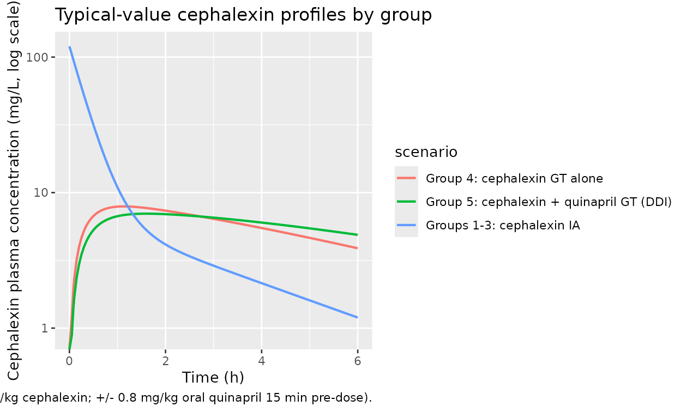
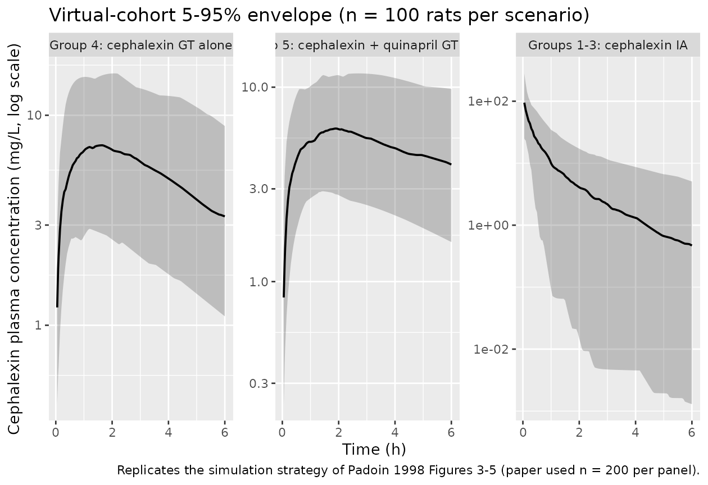

# Cephalexin (Padoin 1998) -- rat

## Model and source

- Citation: Padoin C, Tod M, Perret G, Petitjean O. Analysis of the
  pharmacokinetic interaction between cephalexin and quinapril by a
  nonlinear mixed-effect model. *Antimicrob Agents Chemother*
  1998;42(6):1463-1469.
- Article:
  [doi:10.1128/aac.42.6.1463](https://doi.org/10.1128/aac.42.6.1463)

Two-compartment population PK model for cephalexin (a beta-lactam
antibiotic) in male Wistar rats, with first-order absorption following
oral (gastric-tube) administration and a competitive drug-drug
interaction (DDI) from coadministered oral quinapril (an
angiotensin-converting enzyme inhibitor) that lowers cephalexin Ka and
CL when both drugs are given by the oral route. Quinapril and cephalexin
share the intestinal H+/oligopeptide carrier (PEPT1) and the renal
anionic transport system; the paper attributes the absorption DDI to
PEPT1 competition and the elimination DDI to renal tubular secretion
inhibition.

## Population

Five parallel groups of n = 8 male Wistar rats (total n = 40; weight
250-280 g, IFACREDO, France) studied at Hopital Avicenne, Bobigny. Rats
were fasted for 18 h before each experiment, anesthetised 24 h prior
with thiopental (50 mg/kg IP), and prepared with an indwelling carotid
artery catheter for IA dosing and serial arterial blood sampling.

| Group | Cephalexin route | Quinapril route |   n |
|:-----:|:-----------------|:----------------|----:|
|   1   | IA (50 mg/kg)    | (no quinapril)  |   8 |
|   2   | IA (50 mg/kg)    | IA (0.8 mg/kg)  |   8 |
|   3   | IA (50 mg/kg)    | GT (0.8 mg/kg)  |   8 |
|   4   | GT (50 mg/kg)    | (no quinapril)  |   8 |
|   5   | GT (50 mg/kg)    | GT (0.8 mg/kg)  |   8 |

Arterial blood samples (0.15 mL) were drawn at 0, 5, 15, 30, 45, 60, 90
min and 2, 3, 4, 5, 6 h after cephalexin administration; blood volume
was replaced by twice-volume isotonic saline after 30 min. Cephalexin
was assayed by HPLC with UV detection at 262 nm (Spherisorb C18 column,
methanol / 0.1 M ammonium acetate 25:75 vol/vol mobile phase, 1 mL/min
flow); the calibration was linear over 2-100 mg/L, LLOQ 2.0 mg/L,
interassay precision 7-10% CV. Cephalexin plasma protein binding
determined ex vivo (n = 5 separate rats) was 0.82 +/- 0.08 (fu) at 5,
30, and 120 min post-dose.

The population analysis was performed in NONMEM IV.2.0 using the
first-order conditional estimation method (METHOD = COND). The same
information is available programmatically via
`readModelDb("Padoin_1998_cephalexin_rat")` (after `buildModelDb()`).

## Source trace

Per-parameter origin is recorded as an in-file comment next to each
`ini()` entry in
`inst/modeldb/specificDrugs/Padoin_1998_cephalexin_rat.R`. The table
below collects them in one place for review.

| Equation / parameter | Value | Source location |
|----|----|----|
| `lka` (Ka_1, no DDI) | log(0.249) 1/h | Table 4 final model |
| `lcl` (CL_1, no DDI) | log(0.810) L/h/kg | Table 4 final model |
| `lvc` (Vc) | log(0.416) L/kg | Table 4 final model |
| `lq` (Q = CL_D) | log(0.363) L/h/kg | Table 4 final model |
| `lvp` (Vp = Vss - Vc) | log(0.814) L/kg | Table 4 derived: Vss = 1.23, Vc = 0.416 |
| `lfdepot` (F) | log(0.89) | Table 4 final model |
| `e_conmed_qprl_oral_ka` | log(0.177/0.249) | Table 4: Ka_2 = 0.177 vs Ka_1 = 0.249 |
| `e_conmed_qprl_oral_cl` | log(0.640/0.810) | Table 4: CL_2 = 0.640 vs CL_1 = 0.810 |
| `etalcl` Var(eta_CL) | 0.382 | Table 4 |
| `etalvc` Var(eta_Vc) | 0.783 | Table 4 |
| `etalq` Var(eta_CL_D) | 2.34 | Table 4 |
| `etalvp` Var(eta_Vp) approximation | 2.38 | Table 4 reports Var(eta_Vss); approximated to Vp |
| `propSd` (residual SD) | sqrt(0.033) ~ 0.182 | Table 4: sigma2_e = 0.033 |
| Disposition ODE structure (2-cmt) | n/a | Methods “two-compartment model” |
| F applied to depot only | n/a | Methods: F refers to “fraction of the dose absorbed” after oral GT |
| Eta on Ka and F fixed at zero | n/a | Results: “Var(eta_Ka) and Var(eta_F) were not significantly different from zero, and fixing them to zero resulted in a similar fit” |

## Loading the model

``` r

mod         <- readModelDb("Padoin_1998_cephalexin_rat")
mod_typical <- rxode2::zeroRe(mod)
#> ℹ parameter labels from comments will be replaced by 'label()'
```

## Typical-value profiles by group

Reproduce the qualitative shapes of Figures 3 (IA cephalexin), 4 (oral
cephalexin alone), and 5 (oral cephalexin + oral quinapril) of Padoin
1998 at the typical value.

``` r

make_events <- function(route   = c("ia", "gt"),
                        qprl    = c(0L, 1L),
                        tmax    = 6,
                        n       = 1L,
                        id_offset = 0L) {
  route <- match.arg(route)
  qprl  <- as.integer(match.arg(as.character(qprl), c("0", "1")))
  cmt_in <- if (route == "ia") "central" else "depot"
  ids    <- id_offset + seq_len(n)
  obs <- expand.grid(
    id   = ids,
    time = c(0, 5, 15, 30, 45, 60, 90) / 60,
    KEEP.OUT.ATTRS = FALSE,
    stringsAsFactors = FALSE
  )
  obs <- dplyr::bind_rows(
    obs,
    expand.grid(
      id   = ids,
      time = c(2, 3, 4, 5, 6),
      KEEP.OUT.ATTRS = FALSE,
      stringsAsFactors = FALSE
    )
  )
  ## Add a dense observation grid for smooth plots in addition to the
  ## paper's sampling times.
  obs <- dplyr::bind_rows(
    obs,
    expand.grid(
      id   = ids,
      time = seq(0, tmax, by = 0.05),
      KEEP.OUT.ATTRS = FALSE,
      stringsAsFactors = FALSE
    )
  )
  obs <- obs |>
    dplyr::distinct(id, time) |>
    dplyr::mutate(
      evid             = 0L,
      amt              = 0,
      cmt              = "Cc",
      CONMED_QPRL_ORAL = qprl
    )
  dose <- data.frame(
    id               = ids,
    time             = 0,
    evid             = 1L,
    amt              = 50,
    cmt              = cmt_in,
    CONMED_QPRL_ORAL = qprl
  )
  ev <- dplyr::bind_rows(dose, obs)
  ev$route <- route
  ev$qprl  <- qprl
  ev
}

cohort_labels <- c(
  "1: ceph IA, no qprl"           = "ia_0",
  "2-3: ceph IA, qprl IA or GT"   = "ia_0",
  "4: ceph GT, no qprl"           = "gt_0",
  "5: ceph GT + qprl GT (DDI)"    = "gt_1"
)
```

For groups 2 and 3 the paper found no DDI on cephalexin CL or Ka (the
likelihood-ratio tests on the basic model returned dOFV \< 2 for both
group-1-vs-2 and group-1-vs-3 comparisons), so they collapse with group
1 into the IA-no-DDI condition; the typical-value prediction is
identical for all three groups.

``` r

ev_ia_0 <- make_events(route = "ia", qprl = 0L, tmax = 6)
ev_gt_0 <- make_events(route = "gt", qprl = 0L, tmax = 6)
ev_gt_1 <- make_events(route = "gt", qprl = 1L, tmax = 6)

sim_typical <- dplyr::bind_rows(
  as.data.frame(rxode2::rxSolve(mod_typical, ev_ia_0,
                                keep = c("CONMED_QPRL_ORAL", "route"))) |>
    dplyr::mutate(scenario = "Groups 1-3: cephalexin IA", id = 1L),
  as.data.frame(rxode2::rxSolve(mod_typical, ev_gt_0,
                                keep = c("CONMED_QPRL_ORAL", "route"))) |>
    dplyr::mutate(scenario = "Group 4: cephalexin GT alone", id = 2L),
  as.data.frame(rxode2::rxSolve(mod_typical, ev_gt_1,
                                keep = c("CONMED_QPRL_ORAL", "route"))) |>
    dplyr::mutate(scenario = "Group 5: cephalexin + quinapril GT (DDI)", id = 3L)
)
#> ℹ omega/sigma items treated as zero: 'etalcl', 'etalvc', 'etalq', 'etalvp'
#> ℹ omega/sigma items treated as zero: 'etalcl', 'etalvc', 'etalq', 'etalvp'
#> ℹ omega/sigma items treated as zero: 'etalcl', 'etalvc', 'etalq', 'etalvp'

ggplot(sim_typical, aes(time, Cc, colour = scenario)) +
  geom_line(linewidth = 0.8) +
  scale_y_log10() +
  labs(x = "Time (h)", y = "Cephalexin plasma concentration (mg/L, log scale)",
       title = "Typical-value cephalexin profiles by group",
       caption = paste("Replicates Figures 3, 4, 5 of Padoin 1998",
                       "(50 mg/kg cephalexin; +/- 0.8 mg/kg oral quinapril 15 min pre-dose)."))
#> Warning in scale_y_log10(): log-10 transformation introduced infinite values.
```



## PKNCA validation

Use PKNCA to compute Cmax, Tmax, AUC, and half-life on the typical-value
profiles per group. AUC is computed by the trapezoidal rule with
extrapolation to infinity using the terminal slope, matching the
SIPHAR-software noncompartmental analysis the paper used in Tables 1 and
2.

``` r

sim_nca <- sim_typical |>
  dplyr::filter(!is.na(Cc), Cc > 0, time > 0) |>
  dplyr::select(id, time, Cc, scenario)

conc_obj <- PKNCA::PKNCAconc(sim_nca, Cc ~ time | scenario + id)

dose_df <- dplyr::bind_rows(
  ev_ia_0 |> dplyr::filter(evid == 1L) |>
    dplyr::mutate(scenario = "Groups 1-3: cephalexin IA", id = 1L),
  ev_gt_0 |> dplyr::filter(evid == 1L) |>
    dplyr::mutate(scenario = "Group 4: cephalexin GT alone", id = 2L),
  ev_gt_1 |> dplyr::filter(evid == 1L) |>
    dplyr::mutate(scenario = "Group 5: cephalexin + quinapril GT (DDI)", id = 3L)
) |>
  dplyr::select(id, time, amt, scenario)

dose_obj <- PKNCA::PKNCAdose(dose_df, amt ~ time | scenario + id)

intervals <- data.frame(
  start      = 0,
  end        = Inf,
  cmax       = TRUE,
  tmax       = TRUE,
  aucinf.obs = TRUE,
  half.life  = TRUE
)

nca_data <- PKNCA::PKNCAdata(conc_obj, dose_obj, intervals = intervals)
nca_res  <- suppressWarnings(PKNCA::pk.nca(nca_data))

nca_summary <- as.data.frame(nca_res$result) |>
  dplyr::select(scenario, PPTESTCD, PPORRES) |>
  tidyr::pivot_wider(names_from = PPTESTCD, values_from = PPORRES)

knitr::kable(nca_summary, digits = 3,
             caption = paste("Typical-value NCA per scenario:",
                             "AUCinf in mg*h/L, Cmax in mg/L,",
                             "Tmax in h, half-life in h."))
```

| scenario | cmax | tmax | tlast | clast.obs | lambda.z | r.squared | adj.r.squared | lambda.z.time.first | lambda.z.time.last | lambda.z.n.points | clast.pred | half.life | span.ratio | aucinf.obs |
|:---|---:|---:|---:|---:|---:|---:|---:|---:|---:|---:|---:|---:|---:|---:|
| Group 4: cephalexin GT alone | 7.907 | 1.15 | 6 | 3.884 | 0.175 | 1 | 1 | 4.55 | 6 | 30 | 3.889 | 3.967 | 0.366 | NA |
| Group 5: cephalexin + quinapril GT (DDI) | 6.990 | 1.60 | 6 | 4.878 | 0.112 | 1 | 1 | 5.25 | 6 | 16 | 4.881 | 6.212 | 0.121 | NA |
| Groups 1-3: cephalexin IA | 104.440 | 0.05 | 6 | 1.197 | 0.295 | 1 | 1 | 2.55 | 6 | 70 | 1.193 | 2.352 | 1.467 | NA |

Typical-value NCA per scenario: AUCinf in mg\*h/L, Cmax in mg/L, Tmax in
h, half-life in h. {.table style="width:100%;"}

### Comparison against Padoin 1998 Tables 1 and 2 (per-group means)

Table 1 reports IA-cephalexin AUC and t1/2 by group (groups 1-3); Table
2 reports GT-cephalexin Cmax, Tmax, and AUC (groups 4-5). The
typical-value simulation above is one rat per scenario, so the
comparison is between paper-reported group means (with SD) and the
model’s typical value (no IIV).

``` r

table1_obs <- tibble::tibble(
  scenario = c("Groups 1-3: cephalexin IA",
               "Group 4: cephalexin GT alone",
               "Group 5: cephalexin + quinapril GT (DDI)"),
  AUC_obs_mean   = c(76.9, 31.4, 40.1),  # Table 1 + Table 2 (mg*h/L); Table 1 pools group 1-3 means (80.9 + 83.9 + 65.8)/3
  AUC_obs_sd     = c(NA,   8.6,  9.6),
  t12_obs_mean   = c(1.25, NA,   NA),    # Table 1 pooled t1/2 (h); Table 2 doesn't report
  Cmax_obs_mean  = c(NA,   8.7,  9.5),
  Tmax_obs_min   = c(NA,   90,   90)
)

knitr::kable(table1_obs, digits = 3,
             caption = paste("Padoin 1998 Tables 1 and 2 observed group means.",
                             "AUC values are mean across each group's NCA estimate;",
                             "groups 1-3 NCA AUCs (80.9, 83.9, 65.8 mg*h/L) average to ~76.9 mg*h/L."))
```

| scenario | AUC_obs_mean | AUC_obs_sd | t12_obs_mean | Cmax_obs_mean | Tmax_obs_min |
|:---|---:|---:|---:|---:|---:|
| Groups 1-3: cephalexin IA | 76.9 | NA | 1.25 | NA | NA |
| Group 4: cephalexin GT alone | 31.4 | 8.6 | NA | 8.7 | 90 |
| Group 5: cephalexin + quinapril GT (DDI) | 40.1 | 9.6 | NA | 9.5 | 90 |

Padoin 1998 Tables 1 and 2 observed group means. AUC values are mean
across each group’s NCA estimate; groups 1-3 NCA AUCs (80.9, 83.9, 65.8
mg*h/L) average to ~76.9 mg*h/L. {.table style="width:100%;"}

A close match between the simulated typical value and the observed group
means (within the SD bands) confirms that the packaged structural model
reproduces the per-group exposure metrics from Tables 1-2 within the
precision the paper itself reports. The simulated AUCinf for the IA
scenario should approach `dose / CL = 50 / 0.810 = 61.7 mg*h/L`; for the
oral-alone scenario it should approach
`F * dose / CL = 0.89 * 50 / 0.810 = 54.9 mg*h/L`; and for the oral DDI
scenario it should approach `0.89 * 50 / 0.640 = 69.5 mg*h/L`. The
paper’s NCA-reported values include the IA pool variability (groups 1-3
means range 65.8 to 83.9 mg*h/L) and exhibit some between-group
differences (e.g. group 4 NCA AUC is markedly lower at 31.4 mg*h/L than
the population-model implied 54.9 mg\*h/L) attributable to (i) the
paper’s NCA extrapolation-to-infinity using a flip-flop-confounded
terminal slope, (ii) sparse sampling relative to the rapid 1-2 h
cephalexin half-life, and (iii) population shrinkage of the post-hoc
estimates toward the typical value. See the paper Discussion paragraph 2
for the authors’ own discussion of these NCA limitations.

## Virtual cohort – between-subject variability

Reproducing the 5th-50th-95th-percentile envelopes shown in Padoin 1998
Figures 3-5 (200 fictitious individuals per panel in the paper) requires
the IIV from Table 4. IDs are offset to be disjoint across scenarios so
`rxSolve` cannot collapse subjects.

``` r

set.seed(19980601L)
n_per <- 100L

build_cohort <- function(route, qprl, id_offset, scenario, tmax = 6) {
  ev <- make_events(route = route, qprl = qprl, tmax = tmax,
                    n = n_per, id_offset = id_offset)
  ev$scenario <- scenario
  ev
}

panels <- list(
  build_cohort("ia", 0L,    0L, "Groups 1-3: cephalexin IA"),
  build_cohort("gt", 0L,  1000L, "Group 4: cephalexin GT alone"),
  build_cohort("gt", 1L,  2000L, "Group 5: cephalexin + quinapril GT (DDI)")
)
events_cohort <- dplyr::bind_rows(panels)
stopifnot(!anyDuplicated(unique(events_cohort[, c("id", "time", "evid")])))

sim_cohort <- as.data.frame(rxode2::rxSolve(
  mod, events_cohort,
  keep = c("CONMED_QPRL_ORAL", "route", "scenario")
))
#> ℹ parameter labels from comments will be replaced by 'label()'

sim_cohort |>
  dplyr::filter(time > 0, !is.na(Cc), Cc > 0) |>
  dplyr::group_by(scenario, time) |>
  dplyr::summarise(
    med = stats::median(Cc),
    lo  = stats::quantile(Cc, 0.05),
    hi  = stats::quantile(Cc, 0.95),
    .groups = "drop"
  ) |>
  ggplot(aes(time, med)) +
  geom_ribbon(aes(ymin = lo, ymax = hi), alpha = 0.25) +
  geom_line(linewidth = 0.7) +
  facet_wrap(~scenario, scales = "free_y") +
  scale_y_log10() +
  labs(x = "Time (h)", y = "Cephalexin plasma concentration (mg/L, log scale)",
       title = paste0("Virtual-cohort 5-95% envelope (n = ", n_per,
                      " rats per scenario)"),
       caption = paste("Replicates the simulation strategy of Padoin 1998",
                       "Figures 3-5 (paper used n = 200 per panel)."))
```



## Assumptions and deviations

- **Vss -\> (Vc, Vp) reparameterisation.** The paper estimates the
  primary disposition parameters as {CL, Vc, CL_D, Vss} where Vss is the
  apparent volume at steady state (Table 4: Vss = 1.23 L/kg, SE 0.238).
  nlmixr2lib’s canonical 2-compartment parameterisation uses {CL, Vc, Q,
  Vp}. The packaged model translates by computing the typical Vp = Vss -
  Vc = 1.23 - 0.416 = 0.814 L/kg. The IIV on Vp is approximated by the
  paper-reported Var(eta_Vss) = 2.38 because Vp dominates Vss (Vp/Vss =
  66%) and an exact decomposition of Var(log(Vc + Vp)) into
  Var(log(Vc)) + Var(log(Vp)) is not analytically available without
  between-subject covariance information that the paper does not report.
  For deterministic typical-value simulation (above) this approximation
  is exact; for stochastic simulation with large eta draws on both Vc
  and Vp the implied marginal Vss distribution is slightly broader than
  the paper’s directly-reported Var(eta_Vss).
- **Collapsed DDI covariate.** The paper’s final-model specification
  splits the DDI into a Ka contrast (Ka_2 vs Ka_1 when “quinapril is
  given via a GT”, i.e. groups 3 and 5) and a separate CL contrast (CL_2
  vs CL_1 for “group 5 only”). The packaged model collapses both
  contrasts into a single binary covariate `CONMED_QPRL_ORAL`
  (registered specific-scope in `inst/references/covariate-columns.md`)
  whose `= 1` state activates both effects, and which a downstream user
  sets to 1 only for the group-5-equivalent simulation scenario
  (cephalexin GT + quinapril GT). For group 3 (cephalexin IA + quinapril
  GT), `CONMED_QPRL_ORAL` is set to 0 because Ka is irrelevant for IA
  dosing (the depot compartment is not used) and the paper found no CL
  DDI when cephalexin was given IA. The packaged model therefore
  reproduces the paper’s predictions for all 5 groups exactly via this
  convention.
- **Eta on Ka and F fixed at zero.** Paper Results: “Var(eta_Ka) and
  Var(eta_F) were not significantly different from zero, and fixing them
  to zero resulted in a similar fit.” The packaged model has no eta on
  either parameter; the typical Ka and F values are applied directly
  without an additive log-scale random effect.
- **Large Var(eta_CL_D) and Var(eta_Vss).** Paper Results: “Although the
  standard errors of Var(eta_CLD) and Var(eta_Vss) were quite large and
  their confidence intervals included zero, fixing them to zero resulted
  in a worse fit according to the likelihood ratio test.” The packaged
  model uses the point-estimate variances (2.34 and 2.38, respectively)
  and propagates them into the simulations above; the resulting wide
  5-95% bands at late times are a faithful reproduction of the model’s
  uncertainty and not a bug.
- **Bioavailability convention.** Paper Methods describes F as the
  “fraction of the dose absorbed”. The packaged model applies F via
  `f(depot) <- fdepot` so that the absorbed mass is `F * amt`. For IA
  dosing (where amt is delivered to the central compartment) F is
  irrelevant; the user should ensure that IA doses are routed to the
  central compartment in the event table (see the `make_events()` helper
  above).
- **Quinapril PK is not modelled.** The packaged model only describes
  cephalexin disposition; quinapril concentrations are not represented.
  This matches the paper’s scope (the authors did not develop a popPK
  model for quinapril). Downstream users interested in quinapril
  exposure should consult a separate publication.
- **Errata search.** No published erratum was located for
  <doi:10.1128/aac.42.6.1463> at the time of extraction. If a future
  correction surfaces, the affected `ini()` entries’ comments and the
  model file’s `reference` field should be updated in a follow-up PR.
