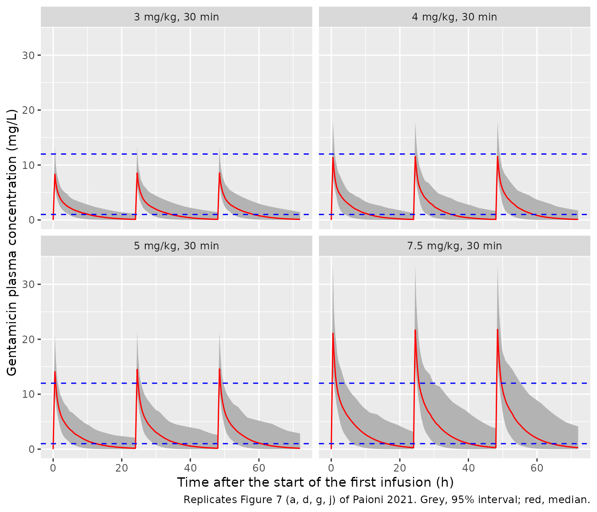

# Gentamicin (Paioni 2021)

## Model and source

- Citation: Paioni P, Jaggi VF, Tilen R, Seiler M, Baumann P, Bram DS,
  Jetzer C, Haid RTU, Goetschi AN, Goers R, Muller D, Coman Schmid D,
  Meyer zu Schwabedissen HE, Rinn B, Berger C, Kramer SD. Gentamicin
  Population Pharmacokinetics in Pediatric Patients-A Prospective Study
  with Data Analysis Using the saemix Package in R. Pharmaceutics.
  2021;13(10):1596. <doi:10.3390/pharmaceutics13101596>.
- Article: <https://doi.org/10.3390/pharmaceutics13101596> (open access)
- The online supplement holds figures, the research plan and the
  start-value ranges of the multistart fit (Table S1); every value used
  below comes from the main article text, equations and tables. No
  correction notice was found for this article as of 2026-09-29.

## Population

Paioni 2021 is a prospective observational study at University
Children’s Hospital Zurich (1 October 2017 to 30 April 2019). It
enrolled 109 children aged 0.9 days to 14.5 years (median 29.1 days)
receiving gentamicin for at least 48 h; 67 were male and 42 female.
Median body weight was 4.23 kg (range 2.5-35, mean 5.42), median
gestational age 39.3 weeks (29-42; 11 born before 37 weeks). Serum
creatinine was below the 27 umol/L reporting limit in 73 of 107 patients
(range \< 27-72 umol/L) and median serum urea was 3.20 mmol/L (\< 1.8 to
17.3) (Table 1). Indications were suspected (43), suspected superimposed
(14) and proven (51) bacterial infection, plus one surgical prophylaxis
(Table 2). Patients with cystic fibrosis or on any dialysis /
haemofiltration were excluded.

Gentamicin was given once daily per hospital practice (5 mg/kg at age \<
7 days, 7.5 mg/kg at \>= 7 days) as a 2-min or 30-min infusion. Up to
three samples were taken per dosing interval (trough, about 30 min and
about 4 h after the end of the second or third infusion): 310
concentrations, 71 below the 0.3 mg/L LOQ.

The same information is available programmatically via
`readModelDb("Paioni_2021_gentamicin")()$population`.

## Source trace

| Equation / parameter | Value | Source location |
|----|----|----|
| Two-compartment model, zero-order infusion, linear distribution and elimination | n/a | Section 2.3, Equations (1)-(5); Section 3.2 |
| `lambda_z = CL / (V1 + V2')` | n/a | Section 2.3 text following Equation (1) |
| `f1 = (1/V1) * (k21 - lambda1)/(lambda_z - lambda1) * CL/lambda1` | n/a | Equation (2) |
| `k21 = lambda1 * lambda_z * V1 / CL` | n/a | Equation (3) |
| Covariate equations (power of `cov / ref`) | n/a | Table 3 equation rows |
| `lcl` | 2.267 (ln L/d) | Table 3, q1 |
| `lvparea` (V2’) | -0.174 (ln L) | Table 3, q2 |
| `lalpha` (lambda1) | 3.644 (ln 1/d) | Table 3, q3 |
| `lvc` (V1) | 0.204 (ln L) | Table 3, q4 |
| `e_wt_cl` | 1.219 | Table 3, q5 (reference ln(4 kg)) |
| `e_creat_cl` | -0.964 | Table 3, q6 (reference ln(27 uM)) |
| `e_bun_cl` | -0.168 | Table 3, q7 (reference ln(3 mM)) |
| `e_wt_vparea` | 0.974 | Table 3, q8 (reference ln(4 kg)) |
| `e_wt_vc` | 0.688 | Table 3, q9 (reference ln(4 kg)) |
| `etalcl` | 0.107 (variance) | Table 3, variance of random effects ln(CL) |
| `etalvparea` | 0.291 (variance) | Table 3, variance of random effects ln(V2’) |
| `etalvc` | 0.0391 (variance) | Table 3, variance of random effects ln(V1) |
| No IIV on lambda1 | n/a | Sections 3.2 and 3.3 |
| `expSd` | 0.102 | Table 3, residual error; “exponential” error model, Section 2.3 |

### Parameterisation

The authors fit the closed-form bi-exponential solution (Equation 1)
with four parameters: CL, the central volume V1, the fast disposition
rate constant lambda1, and an *apparent* peripheral volume V2’ defined
so that the terminal rate constant is lambda_z = CL / (V1 + V2’). V1 +
V2’ is therefore the terminal-phase volume (V_z, “V_area”), not the
steady-state volume, and V2’ is not the peripheral volume of the
micro-constant parameterisation. The packaged model keeps the authors’
four parameters (so every `ini()` value appears in Table 3) and derives
the micro-constants from the two-compartment identities

- kel = CL / V1
- k21 = lambda1 \* lambda_z / kel (Equation 3)
- k12 = lambda1 + lambda_z - kel - k21

The derived peripheral volume `vp = V1 * k12 / k21` and
inter-compartmental clearance `q = k12 * V1` are carried as model
outputs. For the typical 4-kg patient, V2’ = 0.840 L while the
micro-constant peripheral volume is 0.667 L.

The chunk below checks that the ODE model reproduces the paper’s closed
form (Equations 1, 2, 4 and 5) for a typical patient given three 30-min
infusions. Both sides use the same parameters, so the agreement is
limited only by the ODE solver tolerance.

``` r

mod <- readModelDb("Paioni_2021_gentamicin")
mod_typ <- rxode2::zeroRe(mod)
#> ℹ parameter labels from comments will be replaced by 'label()'

typ_cov <- data.frame(WT = 4, CREAT = 27, BUN = 3)
dose_mg <- 7.5 * typ_cov$WT
tinf <- 0.5
obs_t <- sort(unique(c(seq(0, 72, by = 0.25), 48 + tinf + 0.5)))

ev_typ <- dplyr::bind_rows(
  data.frame(time = c(0, 24, 48), evid = 1, amt = dose_mg, dur = tinf, cmt = "central"),
  data.frame(time = obs_t, evid = 0, amt = 0, dur = 0, cmt = "central")
) |>
  dplyr::mutate(id = 1L, WT = typ_cov$WT, CREAT = typ_cov$CREAT, BUN = typ_cov$BUN) |>
  dplyr::arrange(time, dplyr::desc(evid))

sim_typ <- rxode2::rxSolve(mod_typ, events = ev_typ, returnType = "data.frame")
#> ℹ omega/sigma items treated as zero: 'etalcl', 'etalvparea', 'etalvc'

# Paper Equation (1), time in hours. Parameters from Table 3 at the reference
# covariates, converted from per-day to per-hour.
cl <- exp(2.267) / 24
v1 <- exp(0.204)
v2a <- exp(-0.174)
l1 <- exp(3.644) / 24
lz <- cl / (v1 + v2a)
k21 <- l1 * lz * v1 / cl
f1 <- (1 / v1) * (k21 - l1) / (lz - l1) * cl / l1
r0 <- dose_mg / tinf
closed_form <- function(t) {
  out <- 0
  for (t0 in c(0, 24, 48)) {
    tin <- (t - t0) * ((t - t0) <= tinf) * ((t - t0) >= 0)
    tel <- (t - t0 - tinf) * ((t - t0 - tinf) >= 0)
    after <- (tinf + t0) < t
    term <- function(lam) {
      (1 - exp(-lam * tin)) + (1 - exp(-lam * tinf)) * exp(-lam * tel) * after
    }
    out <- out + r0 / cl * (f1 * term(l1) + (1 - f1) * term(lz))
  }
  out
}

chk <- sim_typ |>
  dplyr::filter(time > 0) |>
  dplyr::mutate(Cc_eq1 = closed_form(time), rel_diff = (Cc - Cc_eq1) / Cc_eq1)

c(f1 = f1, max_abs_rel_diff = max(abs(chk$rel_diff)))
#>               f1 max_abs_rel_diff 
#>     9.530452e-02     4.451086e-07
stopifnot(max(abs(chk$rel_diff)) < 1e-3)
```

## Virtual cohort

The individual data are not public (they are held on the SPHN Leonhard
Med platform). The simulations below draw a virtual cohort whose
covariate distributions approximate Table 1:

- body weight: log-normal with location log(3.0 kg) and log-SD 0.7,
  truncated to the observed 2.5-35 kg range (after truncation this gives
  a median of about 4.3 kg and a mean of about 5.3 kg, against 4.23 and
  5.42 kg in Table 1);
- serum creatinine: 68% (73/107) at the 27 umol/L reporting limit, the
  rest log-uniform between 27 and 72 umol/L;
- serum urea: log-normal, median 3.2 mmol/L and log-SD 0.45, truncated
  to 1.8-17.3 mmol/L.

Covariates are drawn independently; the paper does not report their
joint distribution.

``` r

set.seed(20211001)
n_per_arm <- 200L

draw_trunc_lnorm <- function(n, meanlog, sdlog, lo, hi) {
  out <- numeric(0)
  while (length(out) < n) {
    x <- rlnorm(n, meanlog, sdlog)
    out <- c(out, x[x >= lo & x <= hi])
  }
  out[seq_len(n)]
}

make_covariates <- function(n) {
  creat_censored <- runif(n) < 73 / 107
  data.frame(
    WT = draw_trunc_lnorm(n, log(3.0), 0.7, 2.5, 35),
    CREAT = ifelse(creat_censored, 27, exp(runif(n, log(27), log(72)))),
    BUN = draw_trunc_lnorm(n, log(3.2), 0.45, 1.8, 17.3)
  )
}

covs <- make_covariates(n_per_arm)
summary(covs)
#>        WT             CREAT            BUN        
#>  Min.   : 2.506   Min.   :27.00   Min.   : 1.826  
#>  1st Qu.: 3.276   1st Qu.:27.00   1st Qu.: 2.593  
#>  Median : 4.148   Median :27.00   Median : 3.341  
#>  Mean   : 5.156   Mean   :32.34   Mean   : 3.666  
#>  3rd Qu.: 6.033   3rd Qu.:30.52   3rd Qu.: 4.160  
#>  Max.   :16.995   Max.   :71.60   Max.   :11.941
```

### Typical-value PK parameters across the cohort (Table 4)

Table 4 of the paper summarises the population-level (covariate-only) PK
parameters of the 109 study patients. The same quantities computed for
the virtual cohort:

``` r

pk_typ <- covs |>
  dplyr::mutate(
    cl_Lh = exp(2.267 + 1.219 * log(WT / 4) - 0.964 * log(CREAT / 27) - 0.168 * log(BUN / 3)) / 24,
    v1 = exp(0.204 + 0.688 * log(WT / 4)),
    v2a = exp(-0.174 + 0.974 * log(WT / 4)),
    vz = v1 + v2a,
    CL_mLmin = cl_Lh * 1000 / 60,
    t_half = log(2) * vz / cl_Lh
  )

tab4 <- tibble::tribble(
  ~parameter, ~published_median, ~published_range,
  "CL (mL/min)", 6.88, "2.76-73.2",
  "Vz = V1 + V2' (L)", 2.16, "1.42-12.4",
  "V1 (L)", 1.27, "0.887-5.46",
  "t1/2 (h)", 3.53, "1.72-8.38"
) |>
  dplyr::mutate(
    simulated_median = c(
      median(pk_typ$CL_mLmin), median(pk_typ$vz),
      median(pk_typ$v1), median(pk_typ$t_half)
    ),
    simulated_range = c(
      paste(signif(range(pk_typ$CL_mLmin), 3), collapse = "-"),
      paste(signif(range(pk_typ$vz), 3), collapse = "-"),
      paste(signif(range(pk_typ$v1), 3), collapse = "-"),
      paste(signif(range(pk_typ$t_half), 3), collapse = "-")
    ),
    pct_diff = 100 * (simulated_median - published_median) / published_median
  )

tab4 |>
  dplyr::rename(
    "Parameter" = parameter,
    "Published median" = published_median,
    "Published range" = published_range,
    "Virtual-cohort median" = simulated_median,
    "Virtual-cohort range" = simulated_range,
    "% difference of medians" = pct_diff
  ) |>
  knitr::kable(digits = 2, caption = "Population-level PK parameters: Table 4 of Paioni 2021 vs the virtual cohort.")
```

| Parameter | Published median | Published range | Virtual-cohort median | Virtual-cohort range | % difference of medians |
|:---|---:|:---|---:|:---|---:|
| CL (mL/min) | 6.88 | 2.76-73.2 | 6.36 | 1.64-38.1 | -7.55 |
| Vz = V1 + V2’ (L) | 2.16 | 1.42-12.4 | 2.13 | 1.42-6.76 | -1.49 |
| V1 (L) | 1.27 | 0.887-5.46 | 1.26 | 0.889-3.32 | -1.00 |
| t1/2 (h) | 3.53 | 1.72-8.38 | 3.86 | 1.97-10.8 | 9.47 |

Population-level PK parameters: Table 4 of Paioni 2021 vs the virtual
cohort. {.table style="width:100%;"}

``` r


# Structural check on the medians: a mis-transcribed intercept or exponent
# moves these by tens of percent. Weight is the dominant covariate and the
# virtual cohort matches the Table 1 weight median only approximately.
stopifnot(all(abs(tab4$pct_diff) < 10))
```

### Scale of the Table 3 random effects

Table 3 labels the inter-individual terms “Variance of the random
effects”, the quantity saemix reports. Table 4 independently confirms
that reading: it prints each PK parameter at the population level
(covariates only) and at the individual level (covariates plus the
fitted random effects), and the gap between the two extremes fixes a
minimum size for the random effect of at least one patient.
Population-level V1 per 70 kg is largest at the lightest weight (2.5
kg), where the model gives the Table 4 value of 24.8 L/70 kg, yet one
patient’s individual V1 reaches 33.4 L/70 kg. Likewise the lowest
individual CL is 19.7 mL/min per 70 kg against a population-level
minimum of 42.4.

``` r

v1_70_max <- exp(0.204) * (2.5 / 4)^0.688 * 70 / 2.5
eta_v1_min <- log(33.4 / 24.8)
eta_cl_min <- log(19.7 / 42.4)
omega_check <- tibble::tibble(
  parameter = c("V1", "CL"),
  printed_value = c(0.0391, 0.107),
  min_abs_eta = abs(c(eta_v1_min, eta_cl_min))
) |>
  dplyr::mutate(
    z_if_variance = min_abs_eta / sqrt(printed_value),
    z_if_sd = min_abs_eta / printed_value
  )
omega_check |>
  dplyr::rename(
    "Parameter" = parameter,
    "Table 3 value" = printed_value,
    "Smallest |eta| implied by Table 4" = min_abs_eta,
    "|eta| / SD, value read as variance" = z_if_variance,
    "|eta| / SD, value read as SD" = z_if_sd
  ) |>
  knitr::kable(digits = 2, caption = "Random-effect size implied by the Table 4 individual-level extremes.")
```

| Parameter | Table 3 value | Smallest \|eta\| implied by Table 4 | \|eta\| / SD, value read as variance | \|eta\| / SD, value read as SD |
|:---|---:|---:|---:|---:|
| V1 | 0.04 | 0.30 | 1.51 | 7.61 |
| CL | 0.11 | 0.77 | 2.34 | 7.16 |

Random-effect size implied by the Table 4 individual-level extremes.
{.table}

``` r


# Deterministic (no cohort): the population-level bound reproduces Table 4, and
# only the variance reading keeps the implied random effects plausible.
stopifnot(
  abs(v1_70_max / 24.8 - 1) < 0.01,
  all(omega_check$z_if_variance < 3),
  all(omega_check$z_if_sd > 5)
)
```

Read as SDs, the printed values would require random effects of 7 or
more standard deviations, so the model encodes them as variances.

## Simulation of the typical once-daily regimens (Figure 7)

Section 3.7 simulates three 24-hourly doses of 3, 4, 5 and 7.5 mg/kg in
the study population with the random effects of Table 3 and no residual
error, and reports the 95% interval of the concentration 30 min after
the end of the third infusion, C(30 min’). The virtual cohort above is
dosed with each regimen as a 30-min infusion, and with 7.5 mg/kg as a
2-min infusion.

``` r

regimens <- tibble::tribble(
  ~regimen, ~mgkg, ~tinf,
  "3 mg/kg, 30 min", 3, 0.5,
  "4 mg/kg, 30 min", 4, 0.5,
  "5 mg/kg, 30 min", 5, 0.5,
  "7.5 mg/kg, 30 min", 7.5, 0.5,
  "7.5 mg/kg, 2 min", 7.5, 2 / 60
)

make_arm <- function(i, covs) {
  r <- regimens[i, ]
  n <- nrow(covs)
  ids <- (i - 1L) * n + seq_len(n)
  obs_t <- sort(unique(c(seq(0, 72, by = 0.25), 48 + r$tinf + 0.5, 72)))
  subj <- covs |> dplyr::mutate(id = ids, regimen = r$regimen)
  doses <- subj |>
    tidyr::crossing(time = c(0, 24, 48)) |>
    dplyr::mutate(evid = 1L, amt = r$mgkg * WT, dur = r$tinf, cmt = "central")
  obs <- subj |>
    tidyr::crossing(time = obs_t) |>
    dplyr::mutate(evid = 0L, amt = 0, dur = 0, cmt = "central")
  dplyr::bind_rows(doses, obs)
}

events <- dplyr::bind_rows(lapply(seq_len(nrow(regimens)), make_arm, covs = covs)) |>
  dplyr::arrange(id, time, dplyr::desc(evid))
stopifnot(!anyDuplicated(unique(events[, c("id", "time", "evid")])))

rxode2::rxSetSeed(20211001)
sim <- rxode2::rxSolve(mod, events = events, keep = c("regimen", "WT"), returnType = "data.frame") |>
  dplyr::mutate(regimen = factor(regimen, levels = regimens$regimen))
#> ℹ parameter labels from comments will be replaced by 'label()'

# Sensitivity run: the Table 3 values used as standard deviations (so each
# variance is the square of the printed value). See "C(30 min') after the
# third dose" below for why.
mod_sd <- mod |>
  rxode2::ini(etalcl ~ 0.011449, etalvparea ~ 0.084681, etalvc ~ 0.00152881)
#> ℹ parameter labels from comments will be replaced by 'label()'
#> ℹ change initial estimate of `etalcl` to `0.011449`
#> ℹ change initial estimate of `etalvparea` to `0.084681`
#> ℹ change initial estimate of `etalvc` to `0.00152881`
rxode2::rxSetSeed(20211001)
sim_sd <- rxode2::rxSolve(mod_sd, events = events, keep = c("regimen", "WT"), returnType = "data.frame") |>
  dplyr::mutate(regimen = factor(regimen, levels = regimens$regimen))
```

``` r

# Replicates Figure 7 (a, d, g, j) of Paioni 2021: 95% interval and median of
# the simulated concentration-time curves for 30-min infusions.
sim |>
  dplyr::filter(grepl("30 min", regimen)) |>
  dplyr::group_by(regimen, time) |>
  dplyr::summarise(
    lo = quantile(Cc, 0.025), med = median(Cc), hi = quantile(Cc, 0.975),
    .groups = "drop"
  ) |>
  ggplot(aes(time, med)) +
  geom_ribbon(aes(ymin = lo, ymax = hi), fill = "grey70") +
  geom_line(colour = "red") +
  geom_hline(yintercept = c(1, 12), colour = "blue", linetype = "dashed") +
  facet_wrap(~regimen) +
  labs(
    x = "Time after the start of the first infusion (h)",
    y = "Gentamicin plasma concentration (mg/L)",
    caption = "Replicates Figure 7 (a, d, g, j) of Paioni 2021. Grey, 95% interval; red, median."
  )
```



### C(30 min’) after the third dose

``` r

summarise_c30 <- function(s, label) {
  s |>
    dplyr::mutate(t30 = 48 + regimens$tinf[match(as.character(regimen), regimens$regimen)] + 0.5) |>
    dplyr::filter(abs(time - t30) < 1e-6) |>
    dplyr::group_by(regimen) |>
    dplyr::summarise(
      sim_lo = quantile(Cc, 0.025), sim_med = median(Cc), sim_hi = quantile(Cc, 0.975),
      .groups = "drop"
    ) |>
    dplyr::mutate(iiv = label)
}
c30 <- dplyr::bind_rows(
  summarise_c30(sim, "Table 3 as variances (packaged model)"),
  summarise_c30(sim_sd, "Table 3 as SDs (sensitivity)")
)

pub_c30 <- tibble::tribble(
  ~regimen, ~pub_lo, ~pub_hi,
  "3 mg/kg, 30 min", 5.2, 8.4,
  "4 mg/kg, 30 min", 6.9, 11.3,
  "5 mg/kg, 30 min", NA, NA,
  "7.5 mg/kg, 30 min", 13.0, 21.2,
  "7.5 mg/kg, 2 min", 14.6, 25.0
)

c30_cmp <- c30 |>
  dplyr::mutate(regimen = as.character(regimen)) |>
  dplyr::left_join(pub_c30, by = "regimen") |>
  dplyr::mutate(
    pub_mid = sqrt(pub_lo * pub_hi),
    pct_diff_mid = 100 * (sim_med - pub_mid) / pub_mid
  )

c30_cmp |>
  dplyr::select(iiv, regimen, pub_lo, pub_hi, sim_lo, sim_med, sim_hi, pct_diff_mid) |>
  dplyr::rename(
    "IIV" = iiv,
    "Regimen" = regimen,
    "Published 2.5%" = pub_lo,
    "Published 97.5%" = pub_hi,
    "Simulated 2.5%" = sim_lo,
    "Simulated median" = sim_med,
    "Simulated 97.5%" = sim_hi,
    "% diff of median vs published interval midpoint" = pct_diff_mid
  ) |>
  knitr::kable(digits = 1, caption = "C(30 min') after the third dose (mg/L): Section 3.7 of Paioni 2021 vs simulation.")
```

| IIV | Regimen | Published 2.5% | Published 97.5% | Simulated 2.5% | Simulated median | Simulated 97.5% | % diff of median vs published interval midpoint |
|:---|:---|---:|---:|---:|---:|---:|---:|
| Table 3 as variances (packaged model) | 3 mg/kg, 30 min | 5.2 | 8.4 | 4.3 | 6.2 | 9.2 | -6.4 |
| Table 3 as variances (packaged model) | 4 mg/kg, 30 min | 6.9 | 11.3 | 5.8 | 8.3 | 12.7 | -5.8 |
| Table 3 as variances (packaged model) | 5 mg/kg, 30 min | NA | NA | 7.4 | 10.4 | 15.2 | NA |
| Table 3 as variances (packaged model) | 7.5 mg/kg, 30 min | 13.0 | 21.2 | 11.8 | 15.9 | 24.4 | -4.4 |
| Table 3 as variances (packaged model) | 7.5 mg/kg, 2 min | 14.6 | 25.0 | 13.2 | 17.9 | 27.2 | -6.5 |
| Table 3 as SDs (sensitivity) | 3 mg/kg, 30 min | 5.2 | 8.4 | 5.3 | 6.2 | 8.2 | -5.8 |
| Table 3 as SDs (sensitivity) | 4 mg/kg, 30 min | 6.9 | 11.3 | 7.0 | 8.3 | 10.7 | -6.3 |
| Table 3 as SDs (sensitivity) | 5 mg/kg, 30 min | NA | NA | 8.8 | 10.4 | 13.3 | NA |
| Table 3 as SDs (sensitivity) | 7.5 mg/kg, 30 min | 13.0 | 21.2 | 13.3 | 15.6 | 20.1 | -5.9 |
| Table 3 as SDs (sensitivity) | 7.5 mg/kg, 2 min | 14.6 | 25.0 | 15.3 | 17.7 | 22.4 | -7.3 |

C(30 min’) after the third dose (mg/L): Section 3.7 of Paioni 2021 vs
simulation. {.table}

``` r


# The paper does not print the median, so the centre is compared with the
# geometric midpoint of the published 95% interval. A mis-transcribed volume or
# clearance moves this by tens of percent.
stopifnot(all(abs(c30_cmp$pct_diff_mid) < 12, na.rm = TRUE))
```

The centre of every published interval is reproduced. The published
intervals are, however, markedly narrower than those of the packaged
model (for example 5.2-8.4 mg/L at 3 mg/kg), and they are matched
closely when the Table 3 values are used as standard deviations instead
of variances. The Table 4 check above shows the fitted random effects
are variances, so the paper’s own Section 3.7 simulations appear to have
drawn the random effects with the printed variance used as the standard
deviation (Section 2.7 describes drawing from N(0, s^2) “with s equal
the standard deviation of the respective random effect”). The packaged
model keeps the fitted variances; its C(30 min’) and C(24 h’) intervals
are therefore wider than those printed in the paper. The paper also
reports the 99% interval of C(30 min’) at 5 mg/kg (8.2-16.9 mg/L) and at
7.5 mg/kg (12.4-25.4 mg/L), both for 30-min infusions (Discussion).

``` r

# Section 3.7 / Discussion: for doses up to 4 mg/kg, >= 95% of simulated
# C(24 h') (24 h after the start of the third infusion) were below 1 mg/L;
# abstract: at 7.5 mg/kg 95% were < 1.8 mg/L.
summarise_c24 <- function(s, label) {
  s |>
    dplyr::filter(time == 72) |>
    dplyr::group_by(regimen) |>
    dplyr::summarise(
      q95 = quantile(Cc, 0.95),
      pct_below_1 = 100 * mean(Cc < 1),
      .groups = "drop"
    ) |>
    dplyr::mutate(iiv = label, .before = 1)
}
c24 <- dplyr::bind_rows(
  summarise_c24(sim, "Table 3 as variances (packaged model)"),
  summarise_c24(sim_sd, "Table 3 as SDs (sensitivity)")
)
c24 |>
  dplyr::rename(
    "IIV" = iiv,
    "Regimen" = regimen,
    "95th percentile (mg/L)" = q95,
    "% below 1 mg/L" = pct_below_1
  ) |>
  knitr::kable(digits = 2, caption = "Simulated C(24 h') after the third dose.")
```

| IIV | Regimen | 95th percentile (mg/L) | % below 1 mg/L |
|:---|:---|---:|---:|
| Table 3 as variances (packaged model) | 3 mg/kg, 30 min | 1.08 | 94.5 |
| Table 3 as variances (packaged model) | 4 mg/kg, 30 min | 1.26 | 93.5 |
| Table 3 as variances (packaged model) | 5 mg/kg, 30 min | 1.89 | 89.0 |
| Table 3 as variances (packaged model) | 7.5 mg/kg, 30 min | 3.31 | 76.5 |
| Table 3 as variances (packaged model) | 7.5 mg/kg, 2 min | 2.53 | 82.5 |
| Table 3 as SDs (sensitivity) | 3 mg/kg, 30 min | 0.68 | 98.0 |
| Table 3 as SDs (sensitivity) | 4 mg/kg, 30 min | 0.89 | 96.5 |
| Table 3 as SDs (sensitivity) | 5 mg/kg, 30 min | 1.23 | 92.0 |
| Table 3 as SDs (sensitivity) | 7.5 mg/kg, 30 min | 1.97 | 87.0 |
| Table 3 as SDs (sensitivity) | 7.5 mg/kg, 2 min | 1.79 | 89.5 |

Simulated C(24 h’) after the third dose. {.table}

## PKNCA validation

The paper reports no NCA table. Its Table 4 gives the median terminal
half-life of the study patients at the population level (covariates
only, no random effects), 3.53 h. PKNCA is therefore run over the first
dosing interval (0-24 h) of each 30-min regimen on a typical-value solve
of the virtual cohort (random effects set to zero), which is the same
quantity.

``` r

ev_30 <- events |> dplyr::filter(grepl("30 min", regimen))
# rxode2 warns that a multi-subject solve has no omega; that is the intent here.
sim_pop <- suppressWarnings(
  rxode2::rxSolve(mod_typ, events = ev_30, keep = c("regimen"), returnType = "data.frame")
)
#> ℹ omega/sigma items treated as zero: 'etalcl', 'etalvparea', 'etalvc'

sim_nca <- sim_pop |>
  dplyr::filter(!is.na(Cc)) |>
  dplyr::mutate(regimen = as.character(regimen)) |>
  dplyr::select(id, time, Cc, regimen)

sim_nca <- dplyr::bind_rows(
  sim_nca,
  sim_nca |> dplyr::distinct(id, regimen) |> dplyr::mutate(time = 0, Cc = 0)
) |>
  dplyr::distinct(id, regimen, time, .keep_all = TRUE) |>
  dplyr::arrange(id, regimen, time)

dose_df <- ev_30 |>
  dplyr::filter(evid == 1, time == 0) |>
  dplyr::select(id, time, amt, dur, regimen)

conc_obj <- PKNCA::PKNCAconc(sim_nca, Cc ~ time | regimen + id)
dose_obj <- PKNCA::PKNCAdose(dose_df, amt ~ time | regimen + id, route = "intravascular", duration = "dur")
intervals <- data.frame(start = 0, end = 24, cmax = TRUE, tmax = TRUE, auclast = TRUE, half.life = TRUE)
nca_res <- PKNCA::pk.nca(PKNCA::PKNCAdata(conc_obj, dose_obj, intervals = intervals))

published <- tibble::tibble(
  regimen = unique(sim_nca$regimen),
  half.life = 3.53
)

cmp <- nlmixr2lib::ncaComparisonTable(
  simulated = nca_res,
  reference = published,
  by = "regimen",
  units = c(cmax = "mg/L", tmax = "h", auclast = "h*mg/L", half.life = "h"),
  tolerance_pct = 20
)
cmp |>
  knitr::kable(caption = "PKNCA over the first dosing interval vs the Table 4 median half-life. * differs from reference by >20%.")
```

| NCA parameter | regimen           | Reference | Simulated | % diff |
|:--------------|:------------------|:----------|:----------|:-------|
| t½ (h)        | 3 mg/kg, 30 min   | 3.53      | 3.85      | +9.1%  |
| t½ (h)        | 4 mg/kg, 30 min   | 3.53      | 3.85      | +9.1%  |
| t½ (h)        | 5 mg/kg, 30 min   | 3.53      | 3.85      | +9.1%  |
| t½ (h)        | 7.5 mg/kg, 30 min | 3.53      | 3.85      | +9.1%  |

PKNCA over the first dosing interval vs the Table 4 median half-life. \*
differs from reference by \>20%. {.table}

The model is linear, so the half-life does not depend on the dose; the
four rows differ only through the dose-proportional grid. The residual
difference from 3.53 h reflects the virtual cohort’s covariate mix
(Table 4 median weight and creatinine are those of the study patients).

## Errata in the source

**The paper’s simulated concentration intervals are inconsistent with
its own Table 3 random-effect variances.** Table 3 labels the random
effects “Variance of the random effects (inter-individual variance)”,
and the Table 4 individual-level extremes confirm that scale (see “Scale
of the Table 3 random effects”). The 95% intervals of C(30 min’) printed
in Section 3.7, the abstract and the Discussion (3 mg/kg 5.2-8.4, 4
mg/kg 6.9-11.3, 7.5 mg/kg 13.0-21.2 mg/L) are, however, reproduced only
when the printed values are used as standard deviations; with the
printed variances the intervals are wider. The medians agree under
either reading. The packaged model encodes Table 3 verbatim as
variances, because the printed estimates take precedence over the
paper’s derived simulations. Its C(30 min’) and C(24 h’) intervals are
therefore wider than those published. The SD-scale sensitivity run above
shows the published intervals are recovered under the alternative
reading.

## Assumptions and deviations

- **Parameter names.** The paper’s apparent peripheral volume V2’ is
  carried as `lvparea` / `vparea` and the distribution-phase rate
  constant lambda1 as `lalpha` / `alpha`; the micro-constants and the
  micro-constant peripheral volume `vp` are derived (see
  “Parameterisation”).
- **Units.** Table 3 reports CL in L/day and lambda1 in 1/day; the model
  converts both to hours.
- **Residual error.** saemix’s “exponential” error model is log(y) =
  log(f) + a \* eps; the Table 3 value 0.102 is taken as the log-scale
  SD `a`, the quantity saemix reports, and encoded as `lnorm(expSd)`.
- **Censored covariates.** Serum creatinine was below the 27 umol/L
  reporting limit in 73 of 107 patients and the reference value is 27
  umol/L; the paper does not say how the censored values were coded.
  Entering them at 27 umol/L is assumed (and is what the virtual cohort
  does). Supplying a creatinine below 27 umol/L extrapolates the power
  effect beyond the data. The coding of the eight urea values below 1.8
  mmol/L is also not stated.
- **Missing covariates** were entered at the reference value in the fit
  (Section 2.3); do the same when simulating a patient with a missing
  value.
- **Scale of the random effects.** Table 3 values are encoded as
  variances, and the model is not adjusted to reproduce the narrower
  published simulation intervals; see “Errata in the source”.
- **Structural constraint.** The fit rejected parameter sets with CL \>
  lambda1 \* V1 (Section 2.3). For such a set the derived k12 is
  negative; the ODE still reproduces the paper’s bi-exponential
  Equation (1) but the peripheral amount is no longer physical. This
  only occurs far outside the covariate range of the study (for example
  a heavy child with a low creatinine and a high CL random effect).
- **Virtual cohort.** Covariates were drawn independently from
  distributions matched to the Table 1 summary statistics; the study’s
  own 109 patients (whom the paper’s simulations used, 100 replicates
  each) are not available.
- **BLQ handling** in the fit (Section 2.4) affects estimation only and
  has no counterpart in the simulation model. The bracketed Table 3
  values from the LOQ/2 sensitivity analysis are not used.
