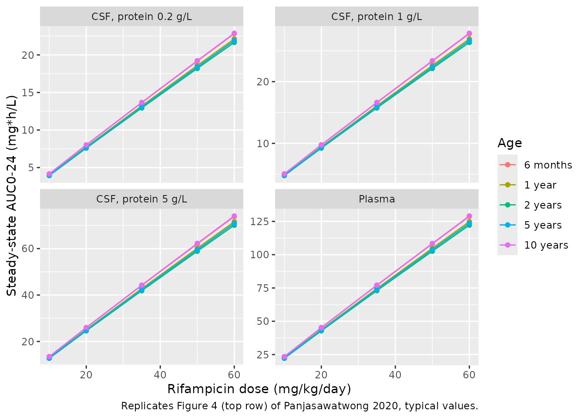
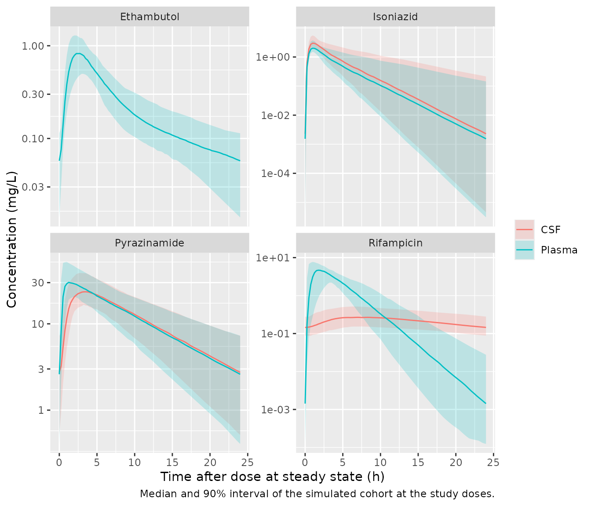
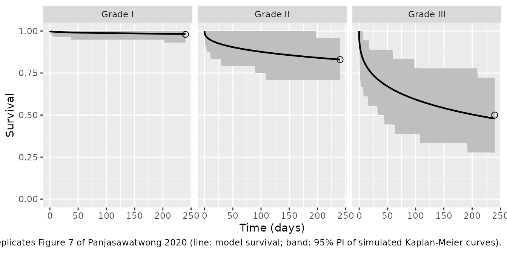

# Isoniazid, rifampicin, pyrazinamide and ethambutol in children with tuberculous meningitis (Panjasawatwong 2020)

``` r

library(nlmixr2lib)
library(rxode2)
library(PKNCA)
library(dplyr)
library(ggplot2)

rxode2::rxSetSeed(20201216)
set.seed(20201216)
```

Panjasawatwong et al. (2020) described the plasma and cerebrospinal
fluid (CSF) pharmacokinetics of the four first-line antituberculosis
drugs in 100 Vietnamese children with tuberculous meningitis (TBM). Each
drug was modelled separately, and the time to death was modelled with
its own time-to-event model, so the package ships five model files that
share this vignette:

``` r

inh <- nlmixr2lib::readModelDb("Panjasawatwong_2020_isoniazid")
rif <- nlmixr2lib::readModelDb("Panjasawatwong_2020_rifampicin")
pza <- nlmixr2lib::readModelDb("Panjasawatwong_2020_pyrazinamide")
emb <- nlmixr2lib::readModelDb("Panjasawatwong_2020_ethambutol")
tte <- nlmixr2lib::readModelDb("Panjasawatwong_2020_tbm_mortality")
```

Reference: Panjasawatwong N, Wattanakul T, Hoglund RM, Bang ND, Pouplin
T, Nosoongnoen W, Ngo VN, Day JN, Tarning J (2020). Population
pharmacokinetic properties of antituberculosis drugs in Vietnamese
children with tuberculous meningitis. *Antimicrob Agents Chemother*
65(1):e00487-20.
[doi:10.1128/AAC.00487-20](https://doi.org/10.1128/AAC.00487-20)

## Population

One hundred children younger than 15 years with suspected TBM were
enrolled at Pham Ngoc Thach Hospital, Ho Chi Minh City, between October
2009 and March 2011 and treated with the 2006 WHO paediatric regimen:
isoniazid 5 mg/kg, rifampicin 10 mg/kg, pyrazinamide 25 mg/kg and
ethambutol 15 mg/kg once daily (plus streptomycin for 2 months and
adjunctive dexamethasone). Six plasma samples were drawn per child over
days 1, 14, 30 and 90, with two CSF samples on days 30 and 90.
Ethambutol could not be quantified in CSF.

| Characteristic (Table 1)                  | Value                 |
|-------------------------------------------|-----------------------|
| Boys / girls                              | 56 / 44               |
| Body weight, kg                           | 10.9 (4.0-43)         |
| Age, years                                | 3.0 (0.167-15.0)      |
| Weight-for-age z-score                    | -1.93 (-5.52 to 1.99) |
| TBM grade I / II / III                    | 58 / 24 / 18          |
| HIV positive / negative / unknown         | 4 / 92 / 4            |
| NAT2 fast / intermediate / slow / unknown | 17 / 47 / 28 / 8      |
| CSF protein, g/L                          | 1.20 (0.1-5)          |

Values are median (range) or counts.

## Model structure

All four models share one skeleton (Figure 2 of the paper): oral dose
into a depot, a chain of transit compartments in which the absorption
rate constant equals the transit rate constant (`ktr = (n + 1) / MTT`
with `n` = 2 for isoniazid, rifampicin and ethambutol and `n` = 3 for
pyrazinamide), and one or two disposition compartments. Isoniazid,
rifampicin and pyrazinamide carry a CSF compartment whose volume is
fixed from age (Methods Eq 1). Drug enters it at `QCSF * fu * PC * Cc`
and leaves at `QCSF * Ccsf`, so at steady state the CSF-to-plasma AUC
ratio equals `fu * PC`.

Every clearance and inter-compartmental flow is scaled by
`(WT / 10.9)^0.75` and every plasma volume by `WT / 10.9`. Clearance
also carries a sigmoidal maturation function of postmenstrual age,
`PMA^HILL / (PMA^HILL + MAT50^HILL)`, with PMA in months equal to
postnatal age plus 9.33 months. The tabulated estimates are “scaled to
typical patient at 10.9 kg and 3 years” (Tables 2-5, footnote b), so the
maturation term is divided by its value at 3 years (PMA 45.33 months).

Drug-specific terms:

- **Isoniazid:** two-compartment disposition; CL/F is 56.4% lower in
  NAT2 slow acetylators. Fast, intermediate and ungenotyped children
  form a single reference group.
- **Rifampicin:** autoinduction through an enzyme-turnover pool with
  kENZ, Emax and EC50 fixed to the adult values of Smythe et al. (2012).
  The pool multiplies the pre-induced CL/F. The penetration multiplier
  rises exponentially with CSF protein:
  `PC = 0.844 * exp(0.245 * CSF_TPRO)`.
- **Pyrazinamide:** CL/F changes by +4.76% and Vc/F by -4.65% per unit
  of weight-for-age z-score, and relative bioavailability carries
  interoccasion variability across the four sampling days.
- **Ethambutol:** two-compartment disposition, plasma only; the
  maturation Hill coefficient is fixed to 1.

Residual error is additive on log-transformed concentrations for every
matrix (`lnorm()`).

The time-to-death model (supplemental Table S3) has a Weibull hazard,
`h(t) = lambda * alpha * (lambda * t)^(alpha - 1)`, with time in hours
from the start of treatment. The shape factor `alpha` is shared across
the cohort, and the scale factor `lambda` is estimated separately for
each baseline TBM grade. The grade is supplied as two indicators,
`TBM_GRADE_II` and `TBM_GRADE_III`, with grade I as the reference. The
model has no drug input: the first-day plasma and CSF exposures of all
four drugs were tested and none improved the fit. It returns the
cumulative hazard `(lambda * t)^alpha` and the survival probability
`sur = exp(-cumhaz)` in closed form.

## Source trace

| Quantity | Isoniazid | Rifampicin | Pyrazinamide | Ethambutol | Source |
|----|----|----|----|----|----|
| CL/F (L/h) | 9.43 | 3.22 (pre-induced) | 1.07 | 28.2 | Tables 2-5 |
| Vc/F (L) | 3.78 | 12.3 | 7.38 | 98.6 | Tables 2-5 |
| Q/F (L/h) | 28.0 | \- | \- | 16.9 | Tables 2, 5 |
| Vp/F (L) | 15.3 | \- | \- | 153 | Tables 2, 5 |
| MTT (h) | 0.878 | 1.25 | 0.457 | 1.8 | Tables 2-5 |
| Transit compartments | 2 | 2 | 3 | 2 | Results, each drug |
| MAT50 (months PMA) | 12.7 | 6.81 | 12.1 | 3.99 | Tables 2-5 |
| HILL | 4.7 | 1.38 | 2.73 | 1 (fixed) | Tables 2-5 |
| QCSF/F (L/h) | 13.7 | 0.00482 | 0.0964 | \- | Tables 2-4 |
| fu (fixed) | 0.9 | 0.2 | 0.9 | \- | Tables 2-4 |
| PC | 1.65 | 0.844 | 1.02 | \- | Tables 2-4 |
| Covariate effects | slow acetylator -56.4% on CL | CSF protein +24.5%/(g/L), exponential on PC | WAZ +4.76% on CL, -4.65% on Vc | \- | Tables 2-4 |
| Autoinduction (fixed) | \- | kENZ 0.00369 1/h, Emax 1.04, EC50 70.5 ug/L | \- | \- | Table 3; Eqs 2-3 |
| IIV (%CV) | CL 36.8, Q 101 | CL 19.4, Vc 23.0, MTT 85.0, PC 22.0 | CL 20.0, Vc 18.3, MTT 64.5 | F 20.1, Vc 51.1, MTT 18.4, Vp 96.3 | Tables 2-5 |
| IOV (%CV) | \- | \- | F 19.0 | \- | Table 4 |
| Residual variance, plasma / CSF | 0.474 / 0.170 | 0.513 / 0.309 | 0.0274 / 0.0114 | 0.197 / - | Tables 2-5 |
| Allometric exponents | 0.75 (flows), 1 (volumes), fixed | same | same | same | Methods |
| Maturation function | Eq 4 | Eq 4 | Eq 4 | Eq 4 | Methods |
| CSF volume | Eq 1 | Eq 1 | Eq 1 | \- | Methods |
| Enzyme pool | \- | Eqs 2-3 | \- | \- | Methods |

Time-to-death model:

| Quantity | Value | Source |
|----|----|----|
| Weibull scale `lambda`, grade I (1/h) | 5.74e-9 | Table S3 ‘Baseline (hr-1)’ |
| Weibull scale `lambda`, grade II (1/h) | 2.35e-6 | Table S3 |
| Weibull scale `lambda`, grade III (1/h) | 7.94e-5 | Table S3 |
| Weibull shape `alpha` | 0.391 | Table S3 ‘Slope’ |
| Hazard `lambda * alpha * (lambda * t)^(alpha - 1)` | \- | Table S3 equation |
| Grade-specific `lambda` | \- | Table S3 equation; Results (dOFV -19.0) |
| Grade definition (BCS below 5 years, GCS from 5 years) | \- | Table 1 footnote b |

## Structural verification

These checks compare a typical-value solve (all random effects zeroed)
against its own closed form, so both sides use the same parameters and
the only difference is numerical integration error. They are asserted
tightly.

``` r

# Two endpoints (Cc, Ccsf): observation rows nominate the endpoint through dvid.
# dvid = 1 on every observation row returns both Cc and Ccsf as columns.
steady_state_events <- function(amt, n_doses, grid = 0.05, two_endpoints = TRUE) {
  t_last <- (n_doses - 1) * 24
  dose <- data.frame(
    time = 0, amt = amt, evid = 1, cmt = "depot",
    ii = ifelse(n_doses > 1, 24, 0), addl = n_doses - 1
  )
  obs <- data.frame(time = seq(t_last, t_last + 24, by = grid))
  obs$amt <- NA_real_
  obs$evid <- 0
  obs$ii <- 0
  obs$addl <- 0
  if (two_endpoints) {
    dose$dvid <- NA_real_
    obs$cmt <- NA_character_
    obs$dvid <- 1
    keep <- c("time", "amt", "evid", "cmt", "ii", "addl", "dvid")
  } else {
    obs$cmt <- "central"
    keep <- c("time", "amt", "evid", "cmt", "ii", "addl")
  }
  rbind(dose[, keep], obs[, keep])
}

trap <- function(time, conc) {
  sum(diff(time) * (utils::head(conc, -1) + utils::tail(conc, -1)) / 2)
}

typical_profile <- function(model, amt, covariates, n_doses = 21, two_endpoints = TRUE) {
  ev <- steady_state_events(amt, n_doses, two_endpoints = two_endpoints)
  for (nm in names(covariates)) ev[[nm]] <- covariates[[nm]]
  out <- rxode2::rxSolve(rxode2::zeroRe(model), ev, returnType = "data.frame")
  out <- out[!duplicated(out$time), ]
  out$time <- out$time - (n_doses - 1) * 24
  out
}

typical_child <- list(WT = 10.9, AGE = 3)
```

**Isoniazid.** At steady state the amount cleared over one interval
equals the dose, so `CL * AUCtau` must equal the dose for both
acetylator groups. The CSF-to-plasma AUC ratio must equal
`fu * PC = 0.9 * 1.65 = 1.485`. The slow-to-fast plasma AUC ratio must
equal `1 / (1 - 0.564)`.

``` r

inh_dose <- 5 * 10.9
inh_fast <- typical_profile(inh, inh_dose, c(typical_child, NAT2_SLOW = 0))
#> ℹ parameter labels from comments will be replaced by 'label()'
#> ℹ omega/sigma items treated as zero: 'etalcl', 'etalq'
inh_slow <- typical_profile(inh, inh_dose, c(typical_child, NAT2_SLOW = 1))
#> ℹ parameter labels from comments will be replaced by 'label()'
#> ℹ omega/sigma items treated as zero: 'etalcl', 'etalq'
auc_inh_fast <- trap(inh_fast$time, inh_fast$Cc)
auc_inh_slow <- trap(inh_slow$time, inh_slow$Cc)

stopifnot(
  abs(9.43 * auc_inh_fast / inh_dose - 1) < 0.002,
  abs(9.43 * (1 - 0.564) * auc_inh_slow / inh_dose - 1) < 0.002,
  abs(trap(inh_fast$time, inh_fast$Ccsf) / auc_inh_fast - 0.9 * 1.65) < 0.005,
  abs(auc_inh_slow / auc_inh_fast - 1 / (1 - 0.564)) < 0.005,
  # The explicit ODE system survives: no closed-form linCmt() takeover.
  identical(
    rxode2::rxode2(inh)$state,
    c("depot", "transit1", "transit2", "central", "peripheral1", "csf")
  )
)
#> ℹ parameter labels from comments will be replaced by 'label()'
c(auc_fast = auc_inh_fast, auc_slow = auc_inh_slow)
#>  auc_fast  auc_slow 
#>  5.779432 13.255573
```

**Pyrazinamide and ethambutol.** The same mass balance holds at the
reference covariates. For pyrazinamide the reference is WAZ = 0 and the
IOV is switched off (`OCC = 0`). The pyrazinamide CSF ratio must equal
`0.9 * 1.02 = 0.918`.

``` r

pza_dose <- 25 * 10.9
pza_typ <- typical_profile(pza, pza_dose, c(typical_child, WAZ = 0, OCC = 0))
#> ℹ parameter labels from comments will be replaced by 'label()'
#> Warning: some etas defaulted to non-mu referenced, possible parsing error: etaiov_fdepot_1, etaiov_fdepot_2, etaiov_fdepot_3, etaiov_fdepot_4
#> as a work-around try putting the mu-referenced expression on a simple line
#> Warning: some etas defaulted to non-mu referenced, possible parsing error: etaiov_fdepot_1, etaiov_fdepot_2, etaiov_fdepot_3, etaiov_fdepot_4
#> as a work-around try putting the mu-referenced expression on a simple line
#> ℹ omega/sigma items treated as zero: 'etalcl', 'etalvc', 'etalmtt', 'etaiov_fdepot_1', 'etaiov_fdepot_2', 'etaiov_fdepot_3', 'etaiov_fdepot_4'
auc_pza <- trap(pza_typ$time, pza_typ$Cc)

emb_dose <- 15 * 10.9
emb_typ <- typical_profile(emb, emb_dose, typical_child, two_endpoints = FALSE)
#> ℹ parameter labels from comments will be replaced by 'label()'
#> ℹ omega/sigma items treated as zero: 'etalfdepot', 'etalvc', 'etalmtt', 'etalvp'
auc_emb <- trap(emb_typ$time, emb_typ$Cc)

stopifnot(
  abs(1.07 * auc_pza / pza_dose - 1) < 0.002,
  abs(trap(pza_typ$time, pza_typ$Ccsf) / auc_pza - 0.9 * 1.02) < 0.005,
  abs(28.2 * auc_emb / emb_dose - 1) < 0.002
)
c(auc_pza = auc_pza, auc_emb = auc_emb)
#>    auc_pza    auc_emb 
#> 254.672901   5.797872
```

**Rifampicin.** Autoinduction raises clearance over the first weeks, so
the check runs after 60 daily doses; the paper reports that steady state
was reached within 40 days. With the pool at steady state, the dose must
equal `AUCtau` times the time-averaged induced clearance. The time
average is `CLpre` times the mean enzyme amount over the interval. The
CSF-to-plasma AUC ratio must equal
`fu * PC(protein) = 0.2 * 0.844 * exp(0.245 * protein)` at each protein
level.

``` r

rif_dose <- 10 * 10.9
rif_ss <- lapply(c(0.2, 1.2, 5), function(p) {
  typical_profile(rif, rif_dose, c(typical_child, CSF_TPRO = p), n_doses = 61)
})
#> ℹ parameter labels from comments will be replaced by 'label()'
#> ℹ omega/sigma items treated as zero: 'etalcl', 'etalvc', 'etalmtt', 'etalpc'
#> ℹ parameter labels from comments will be replaced by 'label()'
#> ℹ omega/sigma items treated as zero: 'etalcl', 'etalvc', 'etalmtt', 'etalpc'
#> ℹ parameter labels from comments will be replaced by 'label()'
#> ℹ omega/sigma items treated as zero: 'etalcl', 'etalvc', 'etalmtt', 'etalpc'
rif_ratio <- vapply(rif_ss, function(d) trap(d$time, d$Ccsf) / trap(d$time, d$Cc), numeric(1))
rif_expected <- 0.2 * 0.844 * exp(0.245 * c(0.2, 1.2, 5))
rif_cl_avg <- trap(rif_ss[[2]]$time, 3.22 * rif_ss[[2]]$enz_pool) / 24
auc_rif_ss <- trap(rif_ss[[2]]$time, rif_ss[[2]]$Cc)

rif_day1 <- typical_profile(rif, rif_dose, c(typical_child, CSF_TPRO = 1.2), n_doses = 1)
#> ℹ parameter labels from comments will be replaced by 'label()'
#> ℹ omega/sigma items treated as zero: 'etalcl', 'etalvc', 'etalmtt', 'etalpc'
auc_rif_day1 <- trap(rif_day1$time, rif_day1$Cc)

stopifnot(
  all(abs(rif_ratio / rif_expected - 1) < 0.01),
  abs(rif_cl_avg * auc_rif_ss / rif_dose - 1) < 0.005,
  # Induction lowers steady-state exposure below the first-dose exposure.
  auc_rif_ss < auc_rif_day1
)
data.frame(
  protein_g_L = c(0.2, 1.2, 5),
  csf_plasma_auc_ratio = signif(rif_ratio, 4),
  expected = signif(rif_expected, 4)
)
#>   protein_g_L csf_plasma_auc_ratio expected
#> 1         0.2               0.1773   0.1773
#> 2         1.2               0.2265   0.2265
#> 3         5.0               0.5746   0.5746
c(auc_day1 = auc_rif_day1, auc_ss = auc_rif_ss, induced_cl_over_pre = rif_cl_avg / 3.22)
#>            auc_day1              auc_ss induced_cl_over_pre 
#>           33.200826           21.737094            1.561435
```

For the typical child, the time-averaged steady-state clearance is 56%
above the pre-induced value. The paper reports that “the fully induced
clearance rate was 80.1% higher than the preinduced clearance rate”
without saying how that figure was summarised. The enzyme pool’s ceiling
is `1 + Emax = 2.04`, and the pool runs below it because plasma
rifampicin falls towards the EC50 late in each dosing interval. The
typical-value first-dose to steady-state plasma AUC ratio is 1.53. For
comparison, the ratio of the cohort’s post hoc medians is 1.75: 37.6
mg*h/L on day 1 (Table S1, fully recovered children) against 21.5 mg*h/L
at steady state (Table 3).

## Rifampicin exposure by dose, age and CSF protein (Figure 4)

Figure 4 of the paper shows simulated steady-state rifampicin plasma and
CSF AUC0-24 over doses of 10-60 mg/kg in five age groups, and at CSF
protein of 0.2, 1.0 and 5.0 g/L. The typical-value curves below use the
Table S5 median body weight for each age group (6.9, 8.5, 10.5, 14.5 and
20.2 kg). The paper’s box medians at 60 mg/kg in 10-year-olds read off
the figure are about 125 mg*h/L (plasma) and about 23, 28 and 75 mg*h/L
(CSF at 0.2, 1.0 and 5.0 g/L).

``` r

age_groups <- data.frame(
  age_label = c("6 months", "1 year", "2 years", "5 years", "10 years"),
  AGE = c(0.5, 1, 2, 5, 10),
  WT = c(6.90, 8.50, 10.5, 14.5, 20.2)
)
fig4_grid <- expand.grid(
  age_idx = seq_len(nrow(age_groups)),
  dose_mgkg = c(10, 20, 35, 50, 60),
  protein = c(0.2, 1.0, 5.0)
)
fig4 <- do.call(rbind, lapply(seq_len(nrow(fig4_grid)), function(i) {
  g <- fig4_grid[i, ]
  a <- age_groups[g$age_idx, ]
  d <- typical_profile(
    rif, g$dose_mgkg * a$WT,
    list(WT = a$WT, AGE = a$AGE, CSF_TPRO = g$protein),
    n_doses = 61
  )
  data.frame(
    age_label = a$age_label, dose_mgkg = g$dose_mgkg, protein = g$protein,
    auc_plasma = trap(d$time, d$Cc), auc_csf = trap(d$time, d$Ccsf)
  )
}))
#> ℹ parameter labels from comments will be replaced by 'label()'
#> ℹ omega/sigma items treated as zero: 'etalcl', 'etalvc', 'etalmtt', 'etalpc'
#> ℹ parameter labels from comments will be replaced by 'label()'
#> ℹ omega/sigma items treated as zero: 'etalcl', 'etalvc', 'etalmtt', 'etalpc'
#> ℹ parameter labels from comments will be replaced by 'label()'
#> ℹ omega/sigma items treated as zero: 'etalcl', 'etalvc', 'etalmtt', 'etalpc'
#> ℹ parameter labels from comments will be replaced by 'label()'
#> ℹ omega/sigma items treated as zero: 'etalcl', 'etalvc', 'etalmtt', 'etalpc'
#> ℹ parameter labels from comments will be replaced by 'label()'
#> ℹ omega/sigma items treated as zero: 'etalcl', 'etalvc', 'etalmtt', 'etalpc'
#> ℹ parameter labels from comments will be replaced by 'label()'
#> ℹ omega/sigma items treated as zero: 'etalcl', 'etalvc', 'etalmtt', 'etalpc'
#> ℹ parameter labels from comments will be replaced by 'label()'
#> ℹ omega/sigma items treated as zero: 'etalcl', 'etalvc', 'etalmtt', 'etalpc'
#> ℹ parameter labels from comments will be replaced by 'label()'
#> ℹ omega/sigma items treated as zero: 'etalcl', 'etalvc', 'etalmtt', 'etalpc'
#> ℹ parameter labels from comments will be replaced by 'label()'
#> ℹ omega/sigma items treated as zero: 'etalcl', 'etalvc', 'etalmtt', 'etalpc'
#> ℹ parameter labels from comments will be replaced by 'label()'
#> ℹ omega/sigma items treated as zero: 'etalcl', 'etalvc', 'etalmtt', 'etalpc'
#> ℹ parameter labels from comments will be replaced by 'label()'
#> ℹ omega/sigma items treated as zero: 'etalcl', 'etalvc', 'etalmtt', 'etalpc'
#> ℹ parameter labels from comments will be replaced by 'label()'
#> ℹ omega/sigma items treated as zero: 'etalcl', 'etalvc', 'etalmtt', 'etalpc'
#> ℹ parameter labels from comments will be replaced by 'label()'
#> ℹ omega/sigma items treated as zero: 'etalcl', 'etalvc', 'etalmtt', 'etalpc'
#> ℹ parameter labels from comments will be replaced by 'label()'
#> ℹ omega/sigma items treated as zero: 'etalcl', 'etalvc', 'etalmtt', 'etalpc'
#> ℹ parameter labels from comments will be replaced by 'label()'
#> ℹ omega/sigma items treated as zero: 'etalcl', 'etalvc', 'etalmtt', 'etalpc'
#> ℹ parameter labels from comments will be replaced by 'label()'
#> ℹ omega/sigma items treated as zero: 'etalcl', 'etalvc', 'etalmtt', 'etalpc'
#> ℹ parameter labels from comments will be replaced by 'label()'
#> ℹ omega/sigma items treated as zero: 'etalcl', 'etalvc', 'etalmtt', 'etalpc'
#> ℹ parameter labels from comments will be replaced by 'label()'
#> ℹ omega/sigma items treated as zero: 'etalcl', 'etalvc', 'etalmtt', 'etalpc'
#> ℹ parameter labels from comments will be replaced by 'label()'
#> ℹ omega/sigma items treated as zero: 'etalcl', 'etalvc', 'etalmtt', 'etalpc'
#> ℹ parameter labels from comments will be replaced by 'label()'
#> ℹ omega/sigma items treated as zero: 'etalcl', 'etalvc', 'etalmtt', 'etalpc'
#> ℹ parameter labels from comments will be replaced by 'label()'
#> ℹ omega/sigma items treated as zero: 'etalcl', 'etalvc', 'etalmtt', 'etalpc'
#> ℹ parameter labels from comments will be replaced by 'label()'
#> ℹ omega/sigma items treated as zero: 'etalcl', 'etalvc', 'etalmtt', 'etalpc'
#> ℹ parameter labels from comments will be replaced by 'label()'
#> ℹ omega/sigma items treated as zero: 'etalcl', 'etalvc', 'etalmtt', 'etalpc'
#> ℹ parameter labels from comments will be replaced by 'label()'
#> ℹ omega/sigma items treated as zero: 'etalcl', 'etalvc', 'etalmtt', 'etalpc'
#> ℹ parameter labels from comments will be replaced by 'label()'
#> ℹ omega/sigma items treated as zero: 'etalcl', 'etalvc', 'etalmtt', 'etalpc'
#> ℹ parameter labels from comments will be replaced by 'label()'
#> ℹ omega/sigma items treated as zero: 'etalcl', 'etalvc', 'etalmtt', 'etalpc'
#> ℹ parameter labels from comments will be replaced by 'label()'
#> ℹ omega/sigma items treated as zero: 'etalcl', 'etalvc', 'etalmtt', 'etalpc'
#> ℹ parameter labels from comments will be replaced by 'label()'
#> ℹ omega/sigma items treated as zero: 'etalcl', 'etalvc', 'etalmtt', 'etalpc'
#> ℹ parameter labels from comments will be replaced by 'label()'
#> ℹ omega/sigma items treated as zero: 'etalcl', 'etalvc', 'etalmtt', 'etalpc'
#> ℹ parameter labels from comments will be replaced by 'label()'
#> ℹ omega/sigma items treated as zero: 'etalcl', 'etalvc', 'etalmtt', 'etalpc'
#> ℹ parameter labels from comments will be replaced by 'label()'
#> ℹ omega/sigma items treated as zero: 'etalcl', 'etalvc', 'etalmtt', 'etalpc'
#> ℹ parameter labels from comments will be replaced by 'label()'
#> ℹ omega/sigma items treated as zero: 'etalcl', 'etalvc', 'etalmtt', 'etalpc'
#> ℹ parameter labels from comments will be replaced by 'label()'
#> ℹ omega/sigma items treated as zero: 'etalcl', 'etalvc', 'etalmtt', 'etalpc'
#> ℹ parameter labels from comments will be replaced by 'label()'
#> ℹ omega/sigma items treated as zero: 'etalcl', 'etalvc', 'etalmtt', 'etalpc'
#> ℹ parameter labels from comments will be replaced by 'label()'
#> ℹ omega/sigma items treated as zero: 'etalcl', 'etalvc', 'etalmtt', 'etalpc'
#> ℹ parameter labels from comments will be replaced by 'label()'
#> ℹ omega/sigma items treated as zero: 'etalcl', 'etalvc', 'etalmtt', 'etalpc'
#> ℹ parameter labels from comments will be replaced by 'label()'
#> ℹ omega/sigma items treated as zero: 'etalcl', 'etalvc', 'etalmtt', 'etalpc'
#> ℹ parameter labels from comments will be replaced by 'label()'
#> ℹ omega/sigma items treated as zero: 'etalcl', 'etalvc', 'etalmtt', 'etalpc'
#> ℹ parameter labels from comments will be replaced by 'label()'
#> ℹ omega/sigma items treated as zero: 'etalcl', 'etalvc', 'etalmtt', 'etalpc'
#> ℹ parameter labels from comments will be replaced by 'label()'
#> ℹ omega/sigma items treated as zero: 'etalcl', 'etalvc', 'etalmtt', 'etalpc'
#> ℹ parameter labels from comments will be replaced by 'label()'
#> ℹ omega/sigma items treated as zero: 'etalcl', 'etalvc', 'etalmtt', 'etalpc'
#> ℹ parameter labels from comments will be replaced by 'label()'
#> ℹ omega/sigma items treated as zero: 'etalcl', 'etalvc', 'etalmtt', 'etalpc'
#> ℹ parameter labels from comments will be replaced by 'label()'
#> ℹ omega/sigma items treated as zero: 'etalcl', 'etalvc', 'etalmtt', 'etalpc'
#> ℹ parameter labels from comments will be replaced by 'label()'
#> ℹ omega/sigma items treated as zero: 'etalcl', 'etalvc', 'etalmtt', 'etalpc'
#> ℹ parameter labels from comments will be replaced by 'label()'
#> ℹ omega/sigma items treated as zero: 'etalcl', 'etalvc', 'etalmtt', 'etalpc'
#> ℹ parameter labels from comments will be replaced by 'label()'
#> ℹ omega/sigma items treated as zero: 'etalcl', 'etalvc', 'etalmtt', 'etalpc'
#> ℹ parameter labels from comments will be replaced by 'label()'
#> ℹ omega/sigma items treated as zero: 'etalcl', 'etalvc', 'etalmtt', 'etalpc'
#> ℹ parameter labels from comments will be replaced by 'label()'
#> ℹ omega/sigma items treated as zero: 'etalcl', 'etalvc', 'etalmtt', 'etalpc'
#> ℹ parameter labels from comments will be replaced by 'label()'
#> ℹ omega/sigma items treated as zero: 'etalcl', 'etalvc', 'etalmtt', 'etalpc'
#> ℹ parameter labels from comments will be replaced by 'label()'
#> ℹ omega/sigma items treated as zero: 'etalcl', 'etalvc', 'etalmtt', 'etalpc'
#> ℹ parameter labels from comments will be replaced by 'label()'
#> ℹ omega/sigma items treated as zero: 'etalcl', 'etalvc', 'etalmtt', 'etalpc'
#> ℹ parameter labels from comments will be replaced by 'label()'
#> ℹ omega/sigma items treated as zero: 'etalcl', 'etalvc', 'etalmtt', 'etalpc'
#> ℹ parameter labels from comments will be replaced by 'label()'
#> ℹ omega/sigma items treated as zero: 'etalcl', 'etalvc', 'etalmtt', 'etalpc'
#> ℹ parameter labels from comments will be replaced by 'label()'
#> ℹ omega/sigma items treated as zero: 'etalcl', 'etalvc', 'etalmtt', 'etalpc'
#> ℹ parameter labels from comments will be replaced by 'label()'
#> ℹ omega/sigma items treated as zero: 'etalcl', 'etalvc', 'etalmtt', 'etalpc'
#> ℹ parameter labels from comments will be replaced by 'label()'
#> ℹ omega/sigma items treated as zero: 'etalcl', 'etalvc', 'etalmtt', 'etalpc'
#> ℹ parameter labels from comments will be replaced by 'label()'
#> ℹ omega/sigma items treated as zero: 'etalcl', 'etalvc', 'etalmtt', 'etalpc'
#> ℹ parameter labels from comments will be replaced by 'label()'
#> ℹ omega/sigma items treated as zero: 'etalcl', 'etalvc', 'etalmtt', 'etalpc'
#> ℹ parameter labels from comments will be replaced by 'label()'
#> ℹ omega/sigma items treated as zero: 'etalcl', 'etalvc', 'etalmtt', 'etalpc'
#> ℹ parameter labels from comments will be replaced by 'label()'
#> ℹ omega/sigma items treated as zero: 'etalcl', 'etalvc', 'etalmtt', 'etalpc'
#> ℹ parameter labels from comments will be replaced by 'label()'
#> ℹ omega/sigma items treated as zero: 'etalcl', 'etalvc', 'etalmtt', 'etalpc'
#> ℹ parameter labels from comments will be replaced by 'label()'
#> ℹ omega/sigma items treated as zero: 'etalcl', 'etalvc', 'etalmtt', 'etalpc'
#> ℹ parameter labels from comments will be replaced by 'label()'
#> ℹ omega/sigma items treated as zero: 'etalcl', 'etalvc', 'etalmtt', 'etalpc'
#> ℹ parameter labels from comments will be replaced by 'label()'
#> ℹ omega/sigma items treated as zero: 'etalcl', 'etalvc', 'etalmtt', 'etalpc'
#> ℹ parameter labels from comments will be replaced by 'label()'
#> ℹ omega/sigma items treated as zero: 'etalcl', 'etalvc', 'etalmtt', 'etalpc'
#> ℹ parameter labels from comments will be replaced by 'label()'
#> ℹ omega/sigma items treated as zero: 'etalcl', 'etalvc', 'etalmtt', 'etalpc'
#> ℹ parameter labels from comments will be replaced by 'label()'
#> ℹ omega/sigma items treated as zero: 'etalcl', 'etalvc', 'etalmtt', 'etalpc'
#> ℹ parameter labels from comments will be replaced by 'label()'
#> ℹ omega/sigma items treated as zero: 'etalcl', 'etalvc', 'etalmtt', 'etalpc'
#> ℹ parameter labels from comments will be replaced by 'label()'
#> ℹ omega/sigma items treated as zero: 'etalcl', 'etalvc', 'etalmtt', 'etalpc'
#> ℹ parameter labels from comments will be replaced by 'label()'
#> ℹ omega/sigma items treated as zero: 'etalcl', 'etalvc', 'etalmtt', 'etalpc'
#> ℹ parameter labels from comments will be replaced by 'label()'
#> ℹ omega/sigma items treated as zero: 'etalcl', 'etalvc', 'etalmtt', 'etalpc'
#> ℹ parameter labels from comments will be replaced by 'label()'
#> ℹ omega/sigma items treated as zero: 'etalcl', 'etalvc', 'etalmtt', 'etalpc'
#> ℹ parameter labels from comments will be replaced by 'label()'
#> ℹ omega/sigma items treated as zero: 'etalcl', 'etalvc', 'etalmtt', 'etalpc'
#> ℹ parameter labels from comments will be replaced by 'label()'
#> ℹ omega/sigma items treated as zero: 'etalcl', 'etalvc', 'etalmtt', 'etalpc'
#> ℹ parameter labels from comments will be replaced by 'label()'
#> ℹ omega/sigma items treated as zero: 'etalcl', 'etalvc', 'etalmtt', 'etalpc'
fig4$age_label <- factor(fig4$age_label, levels = age_groups$age_label)

fig4_long <- rbind(
  fig4 |>
    dplyr::filter(protein == 1.0) |>
    dplyr::transmute(age_label, dose_mgkg, panel = "Plasma", auc = auc_plasma),
  fig4 |>
    dplyr::transmute(age_label, dose_mgkg, panel = paste0("CSF, protein ", protein, " g/L"), auc = auc_csf)
)

ggplot(fig4_long, aes(dose_mgkg, auc, colour = age_label)) +
  geom_line() +
  geom_point() +
  facet_wrap(~panel, scales = "free_y") +
  labs(
    x = "Rifampicin dose (mg/kg/day)", y = "Steady-state AUC0-24 (mg*h/L)",
    colour = "Age", caption = "Replicates Figure 4 (top row) of Panjasawatwong 2020, typical values."
  )
```



``` r


fig4_check <- fig4 |> dplyr::filter(age_label == "10 years", dose_mgkg == 60)
fig4_check
#>   age_label dose_mgkg protein auc_plasma  auc_csf
#> 1  10 years        60     0.2   129.0915 22.88544
#> 2  10 years        60     1.0   129.0713 27.83641
#> 3  10 years        60     5.0   128.8856 74.06219
stopifnot(
  # The CSF-protein effect is uncentred: at 5 g/L the CSF/plasma ratio is
  # 0.2 * 0.844 * exp(0.245 * 5) = 0.574, matching Figure 4 (about 75/125).
  # Centring on the cohort median of 1.2 g/L would give about 0.43.
  abs(fig4_check$auc_csf[fig4_check$protein == 5] /
    fig4_check$auc_plasma[fig4_check$protein == 5] - 0.574) < 0.01
)
```

## Virtual cohort

The paper’s Tables 2-5 report median (range) steady-state exposures
derived from the individual (post hoc) estimates of the study children
at the study doses. A virtual cohort resembling the study population is
simulated below at the same doses. Age is log-normal around the 3-year
median, truncated to the observed 2 months to 15 years. Weight is the
Table S5 median weight for age, interpolated on the log scale, with 15%
variation, truncated to the observed 4-43 kg. Truncation redraws values
outside the limits rather than clamping them. Weight-for-age z-scores
and CSF protein are drawn around the Table 1 medians within the observed
ranges. 28% of children are slow acetylators.

``` r

n_sub <- 200

draw_truncated <- function(n, draw, lower, upper) {
  out <- draw(n)
  bad <- out < lower | out > upper
  while (any(bad)) {
    out[bad] <- draw(sum(bad))
    bad <- out < lower | out > upper
  }
  out
}

age <- draw_truncated(n_sub, function(n) exp(rnorm(n, log(3), 0.9)), 0.167, 15)
wt_median <- exp(stats::approx(
  log(age_groups$AGE), log(age_groups$WT),
  xout = log(pmin(pmax(age, 0.5), 10))
)$y)
# Beyond the Table S5 age span, extend the growth curve with the end slopes.
slope_lo <- log(8.50 / 6.90) / log(1 / 0.5)
slope_hi <- log(20.2 / 14.5) / log(10 / 5)
wt_median <- ifelse(age < 0.5, 6.90 * (age / 0.5)^slope_lo, wt_median)
wt_median <- ifelse(age > 10, 20.2 * (age / 10)^slope_hi, wt_median)
wt_factor <- draw_truncated(n_sub, function(n) exp(rnorm(n, 0, 0.15)), 0.5, 2)
wt <- wt_median * wt_factor
wt[wt < 4 | wt > 43] <- NA
while (anyNA(wt)) {
  i <- is.na(wt)
  wt[i] <- wt_median[i] * exp(rnorm(sum(i), 0, 0.15))
  wt[wt < 4 | wt > 43] <- NA
}

cohort <- data.frame(
  id = seq_len(n_sub),
  AGE = age,
  WT = wt,
  NAT2_SLOW = as.integer(runif(n_sub) < 0.28),
  WAZ = draw_truncated(n_sub, function(n) rnorm(n, -1.93, 1.4), -5.52, 1.99),
  CSF_TPRO = draw_truncated(n_sub, function(n) exp(rnorm(n, log(1.2), 0.8)), 0.1, 5)
)

stopifnot(
  nrow(cohort) <= 200,
  all(cohort$WT >= 4 & cohort$WT <= 43),
  abs(median(cohort$AGE) / 3 - 1) < 0.25,
  abs(median(cohort$WT) / 10.9 - 1) < 0.25
)
summary(cohort[, c("AGE", "WT", "WAZ", "CSF_TPRO")])
#>       AGE                WT              WAZ            CSF_TPRO     
#>  Min.   : 0.2087   Min.   : 4.339   Min.   :-5.291   Min.   :0.1539  
#>  1st Qu.: 1.5402   1st Qu.: 9.522   1st Qu.:-2.925   1st Qu.:0.7199  
#>  Median : 2.6967   Median :11.404   Median :-1.887   Median :1.1445  
#>  Mean   : 3.5474   Mean   :12.312   Mean   :-1.907   Mean   :1.3749  
#>  3rd Qu.: 4.4933   3rd Qu.:14.646   3rd Qu.:-1.023   3rd Qu.:1.7196  
#>  Max.   :14.9646   Max.   :28.343   Max.   : 1.684   Max.   :4.9771
```

``` r

# Daily doses in mg/kg; the last dosing interval is observed on a 0.25-h grid.
cohort_events <- function(mg_per_kg, n_doses, two_endpoints = TRUE) {
  do.call(rbind, lapply(seq_len(nrow(cohort)), function(i) {
    ev <- steady_state_events(mg_per_kg * cohort$WT[i], n_doses,
      grid = 0.25,
      two_endpoints = two_endpoints
    )
    ev <- cbind(id = cohort$id[i], ev)
    ev$time <- ev$time
    for (nm in c("AGE", "WT", "NAT2_SLOW", "WAZ", "CSF_TPRO")) ev[[nm]] <- cohort[[nm]][i]
    ev
  }))
}

simulate_ss <- function(model, mg_per_kg, n_doses, two_endpoints = TRUE, extra = list()) {
  ev <- cohort_events(mg_per_kg, n_doses, two_endpoints)
  for (nm in names(extra)) ev[[nm]] <- extra[[nm]]
  out <- rxode2::rxSolve(model, ev, returnType = "data.frame")
  t_last <- (n_doses - 1) * 24
  out <- out[out$time >= t_last, ]
  out$time <- out$time - t_last
  out
}

sim_inh <- simulate_ss(inh, 5, 21) |>
  dplyr::select(-dplyr::any_of("NAT2_SLOW")) |>
  dplyr::left_join(cohort[, c("id", "NAT2_SLOW")], by = "id") |>
  dplyr::mutate(arm = ifelse(NAT2_SLOW == 1, "Slow acetylators", "Fast and intermediate"))
#> ℹ parameter labels from comments will be replaced by 'label()'
sim_rif <- simulate_ss(rif, 10, 61) |> dplyr::mutate(arm = "All")
#> ℹ parameter labels from comments will be replaced by 'label()'
# Occasion 3 (day 30) carries the steady-state IOV draw on F.
sim_pza <- simulate_ss(pza, 25, 21, extra = list(OCC = 3)) |> dplyr::mutate(arm = "All")
#> ℹ parameter labels from comments will be replaced by 'label()'
#> Warning: some etas defaulted to non-mu referenced, possible parsing error: etaiov_fdepot_1, etaiov_fdepot_2, etaiov_fdepot_3, etaiov_fdepot_4
#> as a work-around try putting the mu-referenced expression on a simple line
sim_emb <- simulate_ss(emb, 15, 21, two_endpoints = FALSE) |> dplyr::mutate(arm = "All")
#> ℹ parameter labels from comments will be replaced by 'label()'

stopifnot(
  # Random effects actually varied across subjects.
  dplyr::n_distinct(round(sim_rif$Cc[sim_rif$time == 2], 6)) > 50,
  dplyr::n_distinct(round(sim_emb$Cc[sim_emb$time == 2], 6)) > 50
)
```

``` r

vpc_data <- dplyr::bind_rows(
  sim_inh |> dplyr::transmute(id, time, drug = "Isoniazid", Plasma = Cc, CSF = Ccsf),
  sim_rif |> dplyr::transmute(id, time, drug = "Rifampicin", Plasma = Cc, CSF = Ccsf),
  sim_pza |> dplyr::transmute(id, time, drug = "Pyrazinamide", Plasma = Cc, CSF = Ccsf),
  sim_emb |> dplyr::transmute(id, time, drug = "Ethambutol", Plasma = Cc, CSF = NA_real_)
) |>
  tidyr::pivot_longer(c(Plasma, CSF), names_to = "matrix", values_to = "conc") |>
  dplyr::filter(!is.na(conc)) |>
  dplyr::group_by(drug, matrix, time) |>
  dplyr::summarise(
    p05 = quantile(conc, 0.05), p50 = median(conc), p95 = quantile(conc, 0.95),
    .groups = "drop"
  )

ggplot(vpc_data, aes(time, p50, colour = matrix, fill = matrix)) +
  geom_ribbon(aes(ymin = p05, ymax = p95), alpha = 0.2, colour = NA) +
  geom_line() +
  facet_wrap(~drug, scales = "free_y") +
  scale_y_log10() +
  labs(
    x = "Time after dose at steady state (h)", y = "Concentration (mg/L)",
    colour = NULL, fill = NULL,
    caption = "Median and 90% interval of the simulated cohort at the study doses."
  )
```



## PKNCA

`PKNCA` computes AUC0-24, Cmax and Tmax over the steady-state interval
for each drug and matrix. The concentration frame is filtered only on
missingness, so the time-zero record survives.

``` r

run_nca <- function(sim, conc_col) {
  dat <- sim |>
    dplyr::mutate(conc = .data[[conc_col]], treatment = arm) |>
    dplyr::filter(!is.na(conc)) |>
    dplyr::select(id, treatment, time, conc)
  doses <- dat |>
    dplyr::distinct(id, treatment) |>
    dplyr::mutate(time = 0)
  o_conc <- PKNCA::PKNCAconc(dat, conc ~ time | id / treatment)
  o_dose <- PKNCA::PKNCAdose(doses, ~ time | id + treatment)
  intervals <- data.frame(start = 0, end = 24, auclast = TRUE, cmax = TRUE, tmax = TRUE)
  res <- PKNCA::pk.nca(PKNCA::PKNCAdata(o_conc, o_dose, intervals = intervals))
  as.data.frame(res$result) |>
    dplyr::filter(PPTESTCD %in% c("auclast", "cmax", "tmax"))
}

nca_all <- dplyr::bind_rows(
  run_nca(sim_inh, "Cc") |> dplyr::mutate(drug = "Isoniazid", matrix = "Plasma"),
  run_nca(sim_inh, "Ccsf") |> dplyr::mutate(drug = "Isoniazid", matrix = "CSF"),
  run_nca(sim_rif, "Cc") |> dplyr::mutate(drug = "Rifampicin", matrix = "Plasma"),
  run_nca(sim_rif, "Ccsf") |> dplyr::mutate(drug = "Rifampicin", matrix = "CSF"),
  run_nca(sim_pza, "Cc") |> dplyr::mutate(drug = "Pyrazinamide", matrix = "Plasma"),
  run_nca(sim_pza, "Ccsf") |> dplyr::mutate(drug = "Pyrazinamide", matrix = "CSF"),
  run_nca(sim_emb, "Cc") |> dplyr::mutate(drug = "Ethambutol", matrix = "Plasma")
)

stopifnot(
  nrow(nca_all) > 0,
  !any(is.na(nca_all$PPORRES))
)
```

## Comparison against the published exposures

The reference values are the median steady-state exposures of Tables
2-5.

``` r

simulated_long <- nca_all |>
  dplyr::mutate(group = paste(drug, matrix, treatment, sep = " | ")) |>
  dplyr::select(group, PPTESTCD, PPORRES)

published <- tibble::tribble(
  ~group,                                       ~auclast, ~cmax, ~tmax,
  "Isoniazid | Plasma | Fast and intermediate", 6.35,     2.12,  0.942,
  "Isoniazid | CSF | Fast and intermediate",    9.42,     3.14,  0.955,
  "Isoniazid | Plasma | Slow acetylators",      12.4,     2.41,  1.14,
  "Isoniazid | CSF | Slow acetylators",         18.4,     3.58,  1.15,
  "Rifampicin | Plasma | All",                  21.5,     4.94,  2.13,
  "Rifampicin | CSF | All",                     4.08,     0.253, 10.0,
  "Pyrazinamide | Plasma | All",                288,      42.5,  1.08,
  "Pyrazinamide | CSF | All",                   266,      31.3,  3.06,
  "Ethambutol | Plasma | All",                  8.18,     1.26,  2.59
)

cmp <- nlmixr2lib::ncaComparisonTable(
  simulated = simulated_long,
  reference = published,
  by = "group",
  params = c("auclast", "cmax", "tmax"),
  tolerance_pct = 20
)
knitr::kable(cmp)
```

| NCA parameter | group | Reference | Simulated | % diff |
|:---|:---|:---|:---|:---|
| Cmax | Isoniazid \| Plasma \| Fast and intermediate | 2.12 | 1.97 | -7.1% |
| Cmax | Isoniazid \| CSF \| Fast and intermediate | 3.14 | 2.92 | -7.0% |
| Cmax | Isoniazid \| Plasma \| Slow acetylators | 2.41 | 2.44 | +1.2% |
| Cmax | Isoniazid \| CSF \| Slow acetylators | 3.58 | 3.62 | +1.2% |
| Cmax | Rifampicin \| Plasma \| All | 4.94 | 5.01 | +1.4% |
| Cmax | Rifampicin \| CSF \| All | 0.253 | 0.273 | +7.8% |
| Cmax | Pyrazinamide \| Plasma \| All | 42.5 | 31.6 | -25.6%\* |
| Cmax | Pyrazinamide \| CSF \| All | 31.3 | 23.7 | -24.3%\* |
| Cmax | Ethambutol \| Plasma \| All | 1.26 | 0.853 | -32.3%\* |
| Tmax | Isoniazid \| Plasma \| Fast and intermediate | 0.942 | 1 | +6.2% |
| Tmax | Isoniazid \| CSF \| Fast and intermediate | 0.955 | 1 | +4.7% |
| Tmax | Isoniazid \| Plasma \| Slow acetylators | 1.14 | 1 | -12.3% |
| Tmax | Isoniazid \| CSF \| Slow acetylators | 1.15 | 1 | -13.0% |
| Tmax | Rifampicin \| Plasma \| All | 2.13 | 2 | -6.1% |
| Tmax | Rifampicin \| CSF \| All | 10 | 6.5 | -35.0%\* |
| Tmax | Pyrazinamide \| Plasma \| All | 1.08 | 1 | -7.4% |
| Tmax | Pyrazinamide \| CSF \| All | 3.06 | 3.25 | +6.2% |
| Tmax | Ethambutol \| Plasma \| All | 2.59 | 2.62 | +1.4% |
| AUClast | Isoniazid \| Plasma \| Fast and intermediate | 6.35 | 6.14 | -3.2% |
| AUClast | Isoniazid \| CSF \| Fast and intermediate | 9.42 | 9.13 | -3.1% |
| AUClast | Isoniazid \| Plasma \| Slow acetylators | 12.4 | 13.8 | +11.2% |
| AUClast | Isoniazid \| CSF \| Slow acetylators | 18.4 | 20.5 | +11.3% |
| AUClast | Rifampicin \| Plasma \| All | 21.5 | 22.7 | +5.6% |
| AUClast | Rifampicin \| CSF \| All | 4.08 | 5.13 | +25.7%\* |
| AUClast | Pyrazinamide \| Plasma \| All | 288 | 296 | +2.7% |
| AUClast | Pyrazinamide \| CSF \| All | 266 | 272 | +2.1% |
| AUClast | Ethambutol \| Plasma \| All | 8.18 | 5.94 | -27.4%\* |

``` r


auc_cmp <- simulated_long |>
  dplyr::filter(PPTESTCD == "auclast") |>
  dplyr::group_by(group) |>
  dplyr::summarise(sim = median(PPORRES), .groups = "drop") |>
  dplyr::inner_join(published[, c("group", "auclast")], by = "group") |>
  dplyr::mutate(ratio = sim / auclast)

auc_checked <- auc_cmp |>
  dplyr::filter(!grepl("Ethambutol", group), group != "Rifampicin | CSF | All")
stopifnot(
  # Isoniazid (both matrices), rifampicin plasma and pyrazinamide (both
  # matrices) AUC medians agree with the published medians. Ethambutol and
  # rifampicin CSF are discussed below.
  nrow(auc_checked) == 7,
  all(abs(auc_checked$ratio - 1) < 0.2)
)
```

The isoniazid and pyrazinamide AUC rows (plasma and CSF) and the
rifampicin plasma AUC row reproduce the published medians. The
CSF-to-plasma ratios follow from `fu * PC`, which the structural gate
checks exactly. Some rows differ, and they are reported here rather than
tuned:

- **Ethambutol** simulates about 30% below the published AUC and Cmax
  medians. At steady state AUC0-24 equals `F * Dose / CL` exactly, and
  ethambutol CL/F carries no IIV. A median of 8.18 mg\*h/L therefore
  implies a median dose about 40% above the nominal 15 mg/kg at the
  tabulated CL/F of 28.2 L/h. The paper’s own adult comparison (114 L/h
  scaled to 70 kg) confirms that tabulated CL/F. The most likely
  explanation is that the dispensed milligram doses (rounded to tablet
  strengths) exceeded the nominal mg/kg; the actual doses are not
  reported.
- **Pyrazinamide Cmax** runs below the published median while AUC
  agrees. For a 10.9-kg child the tabulated Vc/F of 7.38 L bounds the
  peak from a 272.5-mg dose at about 37 mg/L, below the published median
  of 42.5 mg/L, so this row, too, points to actual doses above nominal.
- **Rifampicin CSF AUC** runs about 25% above the published median. The
  CSF exposure depends on each child’s CSF protein, and the virtual
  cohort draws protein around the baseline median of 1.20 g/L. The
  published steady-state ratio of CSF to plasma AUC medians (4.08 / 21.5
  = 0.19) corresponds to `0.2 * 0.844 * exp(0.245 * protein)` at a
  protein of about 0.5 g/L. The CSF samples were taken on days 30 and
  90, and CSF protein at those visits is not reported; it may have
  fallen from baseline with treatment.
- **Rifampicin CSF Tmax** is about 6 h in the simulation against a
  published median of 10.0 h (range 5.72-13.9). It depends on QCSF and
  the transit absorption rather than on the CSF volume (varying the
  volume 4-fold moves it by under 0.5 h). The simulated CSF Cmax and AUC
  agree with the table.

## Time to death (Figure 7)

The survival model is solved for one typical child in each TBM grade
over the 240-day follow-up. It is algebraic, so the solve is compared
against the Table S3 closed form, and the hazard against the numerical
derivative of the cumulative hazard. Both sides use the same parameters,
so the bounds are tight.

``` r

tte_grid <- sort(unique(c(seq(0, 24, by = 1), seq(0, 240 * 24, by = 24))))
tte_events <- data.frame(
  id = rep(1:3, each = length(tte_grid)),
  time = rep(tte_grid, times = 3),
  evid = 0
)
tte_events$TBM_GRADE_II <- as.integer(tte_events$id == 2)
tte_events$TBM_GRADE_III <- as.integer(tte_events$id == 3)

tte_sim <- rxode2::rxSolve(tte, tte_events, returnType = "data.frame") |>
  dplyr::mutate(grade = c("Grade I", "Grade II", "Grade III")[id])

closed_form <- exp(-(tte_sim$lam * tte_sim$time)^tte_sim$alfa)
stopifnot(max(abs(tte_sim$sur - closed_form)) < 1e-12)

# Hazard against the central-difference derivative of the cumulative hazard,
# with a step of 0.1% of t, away from t = 0 where the alpha < 1 hazard is
# unbounded.
check_t <- c(1, 24, 168, 960, 5760)
deriv_events <- expand.grid(
  step = c(-1, 0, 1),
  check_t = check_t,
  id = 1:3
) |>
  dplyr::mutate(
    time = check_t * (1 + 1e-3 * step),
    evid = 0,
    TBM_GRADE_II = as.integer(id == 2),
    TBM_GRADE_III = as.integer(id == 3)
  ) |>
  dplyr::arrange(id, time)
deriv_check <- rxode2::rxSolve(
  tte,
  deriv_events,
  returnType = "data.frame",
  keep = c("step", "check_t")
) |>
  dplyr::group_by(id, check_t) |>
  dplyr::summarise(
    dh = (cumhaz[step == 1] - cumhaz[step == -1]) /
      (time[step == 1] - time[step == -1]),
    hazard = hazard[step == 0],
    .groups = "drop"
  )
stopifnot(
  nrow(deriv_check) == 15,
  max(abs(deriv_check$dh / deriv_check$hazard - 1)) < 1e-4
)
```

Figure 7 of the paper is a visual predictive check of the Kaplan-Meier
curve in each grade, with a 95% prediction interval from 1,000 simulated
trials. Here 200 trials of the Table 1 grade sizes (58, 24 and 18
children) are drawn by inverting the survival function,
`T = (-log(U))^(1 / alpha) / lambda`, with censoring at 240 days. The
points are the observed survival at 240 days read from Figure 7.

``` r

grade_n <- c("Grade I" = 58, "Grade II" = 24, "Grade III" = 18)
tte_par <- tte_sim |>
  dplyr::distinct(grade, lam, alfa)
day_grid <- 0:240
n_trials <- 200

km_trials <- lapply(seq_len(nrow(tte_par)), function(i) {
  g <- tte_par$grade[i]
  n <- grade_n[[g]]
  surv_mat <- vapply(
    seq_len(n_trials),
    function(r) {
      event_h <- (-log(stats::runif(n)))^(1 / tte_par$alfa[i]) / tte_par$lam[i]
      vapply(day_grid, function(d) mean(event_h > d * 24), numeric(1))
    },
    numeric(length(day_grid))
  )
  data.frame(
    grade = g,
    day = day_grid,
    lo = apply(surv_mat, 1, stats::quantile, probs = 0.025),
    hi = apply(surv_mat, 1, stats::quantile, probs = 0.975)
  )
}) |>
  dplyr::bind_rows()

fig7_observed <- data.frame(
  grade = c("Grade I", "Grade II", "Grade III"),
  day = 240,
  sur = c(0.98, 0.83, 0.50)
)

ggplot() +
  geom_ribbon(
    data = km_trials,
    aes(x = day, ymin = lo, ymax = hi),
    fill = "grey75"
  ) +
  geom_line(
    data = tte_sim,
    aes(x = time / 24, y = sur),
    linewidth = 0.8
  ) +
  geom_point(data = fig7_observed, aes(x = day, y = sur), shape = 1, size = 2.5) +
  facet_wrap(~grade) +
  coord_cartesian(ylim = c(0, 1)) +
  labs(
    x = "Time (days)",
    y = "Survival",
    caption = "Replicates Figure 7 of Panjasawatwong 2020 (line: model survival; band: 95% PI of simulated Kaplan-Meier curves)."
  )
```



Expected deaths follow from the model survival and the grade sizes. The
observed counts are 1, 4 and 10 deaths in grades I, II and III (15 in
total; Table 1 and Discussion), with 8 of the 15 in the first week
(Results).

``` r

expected_deaths <- tte_sim |>
  dplyr::filter(time %in% c(7 * 24, 240 * 24)) |>
  dplyr::mutate(
    n = grade_n[grade],
    deaths = n * (1 - sur),
    window = ifelse(time == 7 * 24, "first_week", "day_240")
  ) |>
  dplyr::select(grade, n, window, deaths) |>
  tidyr::pivot_wider(names_from = window, values_from = deaths) |>
  dplyr::mutate(
    observed = c("Grade I" = 1, "Grade II" = 4, "Grade III" = 10)[grade]
  )

expected_deaths |>
  dplyr::rename(
    "TBM grade" = grade,
    "Children" = n,
    "Model deaths, first week" = first_week,
    "Model deaths, 240 days" = day_240,
    "Observed deaths" = observed
  ) |>
  knitr::kable(digits = 2)
```

| TBM grade | Children | Model deaths, first week | Model deaths, 240 days | Observed deaths |
|:---|---:|---:|---:|---:|
| Grade I | 58 | 0.26 | 1.02 | 1 |
| Grade II | 24 | 1.09 | 4.07 | 4 |
| Grade III | 18 | 3.04 | 9.38 | 10 |

``` r


stopifnot(
  # Each grade's 240-day expected deaths lie within 1.5 of the observed count,
  # and the total within 1 of the observed 15. Deterministic (no sampling).
  all(abs(expected_deaths$day_240 - expected_deaths$observed) < 1.5),
  abs(sum(expected_deaths$day_240) - 15) < 1
)
```

The model reproduces the observed 240-day survival in every grade
(Figure 7) and the number of deaths per grade. It places fewer deaths
early than were observed, though: about 4.4 in the first week against
the 8 reported. The fitted shape factor of 0.391 spreads the deaths over
the whole follow-up. Figure 7’s observed grade III curve falls below the
model line during the first 2 months and stays inside the paper’s
prediction band. This is reported as a property of the published
estimates and has not been tuned.

## Assumptions and deviations

- **CSF volume equation (Methods Eq 1).** As typeset, Eq 1 reads
  `150 * [38.78 + age^1.071 * (102.6 - 38.78)] / (age^1.071 + 1.297^1.071)`
  mL, which gives about 8 L for a 3-year-old. Here it is read as a
  sigmoid in percent of the 150-mL adult CSF volume:
  `150 * (38.78 + age^1.071 * (102.6 - 38.78) / (age^1.071 + 1.297^1.071)) / 100`,
  giving 58 mL at birth, 126 mL at 3 years and about 154 mL in adults.
  This reading also reproduces the published rifampicin CSF Cmax (0.257
  vs 0.253 mg/L for the typical child at the cohort-median protein).
- **CSF protein effect is uncentred.** The paper does not print a
  centring value for the exponential CSF-protein effect on rifampicin
  PC. The uncentred form `0.844 * exp(0.245 * protein)` reproduces
  Figure 4’s CSF exposures at 0.2, 1.0 and 5.0 g/L (see the Figure 4
  check above). Centring on the cohort median of 1.20 g/L would lower
  the 5.0-g/L CSF AUC by about 25%.
- **WAZ reference.** The paper does not print a centring value for the
  linear WAZ effects on pyrazinamide CL/F and Vc/F. Here WAZ enters
  uncentred, so the tabulated CL/F and Vc/F apply at WAZ = 0, the
  growth-standard median. Had the authors centred on the cohort median
  of -1.93, the typical CL/F and Vc/F at WAZ = 0 would be about 9%
  higher and 9% lower, respectively. The comparison above cannot
  separate the two because actual doses are uncertain.
- **Maturation normalisation.** Tables 2-5 give estimates “scaled to
  typical patient at 10.9 kg and 3 years”. The maturation term is
  therefore divided by its value at 3 years (PMA 45.33 months), so the
  tabulated CL/F applies to a 3-year-old of 10.9 kg.
- **IIV and residual error scales.** Tables 2-5 give IIV and IOV as %CV.
  They are converted to log-scale variances with
  `omega^2 = log(1 + CV^2)`. Residual error is described as “variance of
  the residual variability, incorporated as an additive error on the
  logarithmic scale” (Tables 2-5, footnote a). It is encoded as
  `lnorm(sqrt(variance))`.
- **Transit chain.** “Two fixed-transit absorption compartments (ka was
  set to be identical to ktr)” together with Figure 2 (dose compartment,
  transit compartments, central) is encoded as depot plus `n` transit
  compartments with `ktr = (n + 1) / MTT`. The typical isoniazid Tmax of
  0.96 h matches the published median of 0.942 h.
- **CSF mass balance.** Drug moving into the CSF is removed from the
  central compartment, following the arrows of Figure 2. Because the CSF
  volume is about 0.1 L, this has a negligible effect on plasma
  concentrations.
- **NAT2 phenotype.** Slow acetylators are the only group with a
  separate clearance. Fast, intermediate and ungenotyped children share
  the reference clearance, as in the paper’s reduced two-group covariate
  model.
- **Pyrazinamide IOV.** One shared IOV variance on F is used across the
  four sampling occasions (days 1, 14, 30 and 90). `OCC` values outside
  1-4 switch the IOV off.
- **Rifampicin autoinduction.** kENZ, Emax and EC50 are fixed to the
  adult values of Smythe et al. (2012), as in the paper; EC50 is
  converted from 70.5 ug/L to 0.0705 mg/L. The enzyme pool starts at 1
  with production equal to kENZ.
- **Time-to-death scale factors.** Table S3 writes
  `lambda = (10^theta)(TBM Severity)` and prints, under ‘Baseline
  (hr-1)’, one value per grade. These printed values are taken to be
  `lambda` itself, the estimate back-transformed from the `10^theta`
  form used in NONMEM. With time in hours this reading reproduces the
  observed 240-day survival of each grade in Figure 7 (0.98, 0.83 and
  0.50 against 0.982, 0.830 and 0.479 in the model). Reading the time
  axis in days instead would predict about 5 deaths in total rather than
  15.
- **TBM grade encoding.** The paper uses one three-level severity
  column. It is supplied here as two mutually exclusive indicators,
  `TBM_GRADE_II` and `TBM_GRADE_III`, with grade I as the reference,
  following the package’s convention for multi-level categories.
- **No variability in the time-to-death model.** Table S3 reports only
  the four fixed effects, so the model has no random effects and no
  residual error. Simulated event times come from the survival function,
  as in the Figure 7 check above. The four children lost to follow-up
  are not treated as censored in the expected-death table, which
  slightly overstates the expected counts.
- **Virtual cohort.** Age, weight, WAZ and CSF protein are drawn
  independently around the Table 1 medians, and weight follows the Table
  S5 growth curve. The study’s individual covariates are not published.
