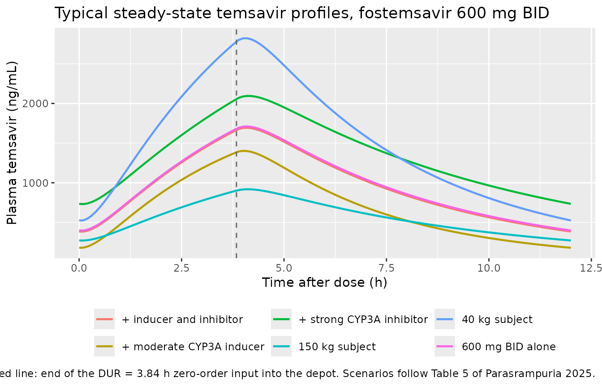
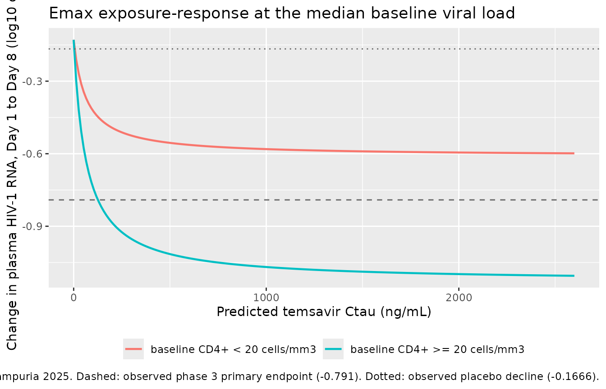
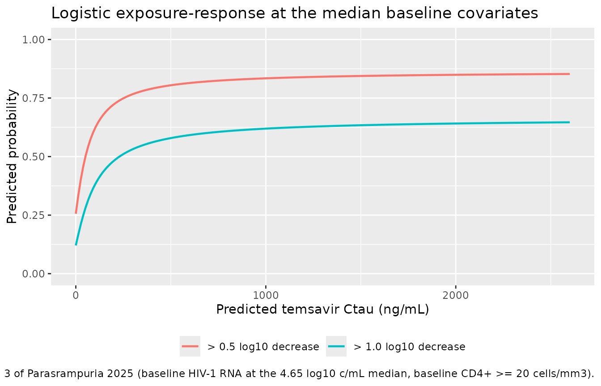

# Temsavir population PK and exposure-response (Parasrampuria 2025)

## Models and source

Parasrampuria 2025 reports **four** separately fitted models, so this
paper contributes four model files. They are packaged as the authors
built them – one population PK model, and three exposure-response models
that consume that model’s steady-state trough as a scalar covariate
rather than being fitted jointly with it.

``` r

modelNames <- c(
  "Parasrampuria_2025_temsavir",
  "Parasrampuria_2025_temsavir_hivrna_day8",
  "Parasrampuria_2025_temsavir_resp05log_day8",
  "Parasrampuria_2025_temsavir_resp1log_day8"
)
uis <- lapply(modelNames, function(nm) rxode2::rxode(readModelDb(nm)))
#> ℹ parameter labels from comments will be replaced by 'label()'
names(uis) <- modelNames

tibble::tibble(
  Model = modelNames,
  Role = c(
    "Population PK of temsavir (2-compartment, sequential zero- then first-order absorption)",
    "Emax exposure-response: Day 1 to Day 8 change in plasma HIV-1 RNA (Table 3)",
    "Logistic exposure-response: P(> 0.5 log10 decrease at Day 8) (Table 4, left)",
    "Logistic exposure-response: P(> 1.0 log10 decrease at Day 8) (Table 4, right)"
  )
) |>
  knitr::kable(caption = "The four models contributed by Parasrampuria 2025.")
```

| Model | Role |
|:---|:---|
| Parasrampuria_2025_temsavir | Population PK of temsavir (2-compartment, sequential zero- then first-order absorption) |
| Parasrampuria_2025_temsavir_hivrna_day8 | Emax exposure-response: Day 1 to Day 8 change in plasma HIV-1 RNA (Table 3) |
| Parasrampuria_2025_temsavir_resp05log_day8 | Logistic exposure-response: P(\> 0.5 log10 decrease at Day 8) (Table 4, left) |
| Parasrampuria_2025_temsavir_resp1log_day8 | Logistic exposure-response: P(\> 1.0 log10 decrease at Day 8) (Table 4, right) |

The four models contributed by Parasrampuria 2025. {.table}

- Citation: Parasrampuria R, Thakkar N, Moore K, Ackerman P, Magee M.
  Population pharmacokinetics and exposure-response relationship for
  temsavir following fostemsavir administration in treatment-experienced
  HIV patients. Pharmacol Res Perspect. 2025;13(3):e70023.
  <doi:10.1002/prp2.70023>. Studies AI438006 (NCT01009814), AI438011
  (NCT01384734) and AI438047 / BRIGHTE (NCT02362503).
- Article: <https://doi.org/10.1002/prp2.70023>
- Supplement (Tables S1, S2 and Figures S1-S3):
  <https://www.ebi.ac.uk/europepmc/webservices/rest/PMC12050361/supplementaryFiles>

Fostemsavir is a methyl-phosphate prodrug hydrolysed by gastrointestinal
alkaline phosphatase to the active moiety temsavir, an HIV-1 attachment
inhibitor that binds viral gp120 and blocks the initial gp120-CD4
interaction. Only temsavir is measured and only temsavir is modelled;
fostemsavir itself never appears in plasma at meaningful concentrations.

## Population

The population PK model was fit to **10,236 quantifiable plasma temsavir
concentrations from 764 subjects** pooled across seven studies: four
phase 1 studies in healthy adult volunteers (including a thorough-QT
study and drug-drug-interaction studies with darunavir/ritonavir and
etravirine), the phase 2a proof-of-concept study AI438006 (NCT01009814),
the phase 2b combination-therapy study AI438011 (NCT01384734), and the
phase 3 BRIGHTE study AI438047 (NCT02362503) (Table S1). Concentrations
below the 5 ng/mL lower limit of quantification were excluded rather
than imputed.

Baseline characteristics (Table S2): 606 subjects (79%) were
HIV-1-infected and 158 (21%) were healthy volunteers; median age 42
years (range 17-73, with only 11 subjects aged 65 or over); median
baseline body weight 72 kg (range 38-151); 72% male; 64% White, 23%
Black or African American, 1% Asian, 12% other. 293 subjects (38%) were
on a concomitant CYP3A inhibitor and 37 (5%) on a concomitant CYP3A
inducer.

The three exposure-response models were fit to a **different, narrower
analysis set**: the 258 subjects of the randomised cohort of the phase 3
BRIGHTE study who had both a PK sample and Day 8 plasma HIV-1 RNA data
(193 on fostemsavir 600 mg BID, 65 on placebo). These are heavily
treatment-experienced adults with multidrug-resistant HIV-1 failing
their current antiretroviral regimen: median baseline plasma HIV-1 RNA
44,943 c/mL (4.65 log10 c/mL, range 1.59-6.91) and median baseline CD4+
count 98.5 cells/mm3 (range 0-1160), with 69 subjects (27%) below 20
cells/mm3.

The same information is available programmatically from each model’s
`population` metadata:

``` r

str(uis[["Parasrampuria_2025_temsavir"]]$population, max.level = 1, give.attr = FALSE)
#> List of 13
#>  $ species       : chr "human"
#>  $ n_subjects    : int 764
#>  $ n_studies     : int 7
#>  $ n_observations: chr "10,236 quantifiable plasma temsavir concentrations; BLQ records (< 5 ng/mL) were neither imputed nor included"
#>  $ age_range     : chr "17-73 years (median 42; 11 subjects (1.4%) aged 65 years or older) (Table S2)"
#>  $ weight_range  : chr "38-151 kg (median 72; baseline BMI median 24.9 kg/m2, range 14.4-52.2) (Table S2)"
#>  $ sex_female_pct: num 28.3
#>  $ race_ethnicity: Named num [1:4] 64 23 1 12
#>  $ disease_state : chr "pooled healthy adult volunteers (158, 21%) and adults with HIV-1 infection (606, 79%); the phase 2 and phase 3 "| __truncated__
#>  $ dose_range    : chr "fostemsavir extended-release tablets, oral: monotherapy 600-2400 mg twice daily and 1200 mg once daily; in comb"| __truncated__
#>  $ regions       : chr "multinational; the phase 3 BRIGHTE randomised cohort was 41% North America, 38% South America, 19% Europe, 3% other (Table S2)"
#>  $ co_medication : chr "concomitant CYP3A inhibitor 293 subjects (38%), concomitant CYP3A inducer 37 subjects (5%) (Table S2)"
#>  $ notes         : chr "Seven pooled studies: four phase 1 studies in healthy volunteers (including a thorough-QT study and DDI studies"| __truncated__
```

## Source trace

Every value below carries an in-file comment next to its `ini()` entry
pointing at the source location. The table collects them for review.

| Model | Parameter / equation | Value | Source location |
|----|----|----|----|
| popPK | `lcl` (CL/F) | 51.0 L/h | Table 2, RSE 2.16%, bootstrap 49.1-52.9 |
| popPK | `lvc` (V2/F) | 257 L | Table 2, RSE 3.18%, bootstrap 233-279 |
| popPK | `lq` (Q/F) | 2.58 L/h | Table 2, RSE 7.13%, bootstrap 0.973-4.40 |
| popPK | `lvp` (V3/F) | 37.4 L | Table 2, RSE 3.95%, bootstrap 26.5-65.6 |
| popPK | `lka` (Ka) | 2.33 1/h | Table 2, RSE 13.3%, bootstrap 1.84-2.79 |
| popPK | `ld1` (DUR) | 3.84 h | Table 2, RSE 2.51%, bootstrap 3.68-3.99 |
| popPK | `e_wt_cl_q` | 0.75 (fixed) | Table 2, “Effect of WT on CL/F and Q/F”, `0.75 Fixed (NA)` |
| popPK | `e_wt_vc_vp` | 1 (fixed) | Table 2, “Effect of WT on V2/F and V3/F”, `1 Fixed (NA)` |
| popPK | reference weight | 72 kg | Table 2 Note `(WT/72)`; cohort median, Table S2 |
| popPK | `e_conmed_cyp3a4_ind_mod_cl` | 1.41 | Table 2, RSE 2.39%, bootstrap 1.25-1.58 |
| popPK | `e_conmed_cyp3a4_inh_strong_cl` | 0.721 | Table 2, RSE 1.57%, bootstrap 0.687-0.764 |
| popPK | `etalcl` variance | 0.1667645 | Table 2 ETA(CL/F)% = 42.6; `log(1 + 0.426^2)` |
| popPK | `etalvc` variance | 0.2151920 | Table 2 ETA(V2/F)% = 49.0; `log(1 + 0.490^2)` |
| popPK | CL/F-V2/F covariance | 0.1153672 | Table 2 BSC = 0.609 read as a correlation (see Errata 1) |
| popPK | `etalka` variance | 0.9604607 | Table 2 ETA(Ka)% = 127; `log(1 + 1.27^2)` |
| popPK | `expSd` | 0.613 | Table 2, “Residual Additive SD on Log Scale”, RSE 1.69% |
| popPK | `etaexpSd` variance | 0.1045618 | Table 2 ETA (Residual)% = 33.2; `log(1 + 0.332^2)` |
| popPK | covariate equations | n/a | Table 2 Note (CL/Fi, V2/Fi, Q/Fi, V3/Fi, Kai, DUR) |
| ER Emax | `e0` | -0.129 log10 c/mL | Table 3, RSE 66.1%, bootstrap -0.268 to -0.00665 |
| ER Emax | `lemax` | 1.00 log10 c/mL | Table 3, RSE 17.1%, bootstrap 0.825-1.28 |
| ER Emax | `lec50` | 64.3 ng/mL | Table 3, RSE 98.0%, bootstrap 16.6-250 |
| ER Emax | `e_hiv_vload_emax` | 0.150 | Table 3, RSE 29.6%, bootstrap 0.113-0.197 |
| ER Emax | `e_cd4_abs_emax` | 0.481 | Table 3, RSE 19.9%, bootstrap 0.293-0.673 |
| ER Emax | `addSd_d_viral_load` | 0.653 log10 c/mL | Table 3, RSE 4.10%, bootstrap 0.594-0.699 |
| ER Emax | equation | n/a | Table 3 Note |
| ER \> 0.5 log10 | `e0` / `emax` / `lec50` | -1.07 / -2.92 / 88 ng/mL | Table 4 left column |
| ER \> 0.5 log10 | `e_hiv_vload_logit` / `e_cd4_abs_logit` | 0.836 / -1.27 | Table 4 left column |
| ER \> 1.0 log10 | `e0` / `emax` / `lec50` | -1.99 / -2.67 / 78.8 ng/mL | Table 4 right column |
| ER \> 1.0 log10 | `e_hiv_vload_logit` / `e_cd4_abs_logit` | 0.848 / -0.781 | Table 4 right column |
| ER logistic | equation | n/a | Table 4 Note |
| ER logistic | centring 4.65 log10 c/mL | n/a | Table 4 Note; Table S2 cohort median |
| ER all | CD4+ threshold 20 cells/mm3 | n/a | Table 3 / Table 4 abbreviations, “baseline CD4+ flag” |

## Part 1 – population PK

### Structure

The absorption is **sequential**, not parallel: the dose enters `depot`
as a constant-rate input of duration `DUR` and the depot then empties
into `central` first-order at `Ka`. Results 3.1 describe the base model
as having “dual zero- and first-order absorption (zero order modeled as
an estimated constant infusion of duration DUR in absorption depot
compartment)”, and Table 2 estimates no dose-splitting fraction – a
parallel-pathway model would require one.

In rxode2 this is `dur(depot) <- d1` in the model body plus `rate = -2`
on every dose record. Omitting `rate = -2` silently drops the zero-order
half of the absorption model and moves Tmax earlier.

``` r

cat(uis[["Parasrampuria_2025_temsavir"]]$funTxt)
#> cl <- exp(lcl + etalcl) * (WT/72)^e_wt_cl_q * e_conmed_cyp3a4_inh_strong_cl^CONMED_CYP3A4_INH_STRONG * e_conmed_cyp3a4_ind_mod_cl^CONMED_CYP3A4_IND_MOD
#> vc <- exp(lvc + etalvc) * (WT/72)^e_wt_vc_vp
#> q <- exp(lq) * (WT/72)^e_wt_cl_q
#> vp <- exp(lvp) * (WT/72)^e_wt_vc_vp
#> ka <- exp(lka + etalka)
#> d1 <- exp(ld1)
#> kel <- cl/vc
#> k12 <- q/vc
#> k21 <- q/vp
#> d/dt(depot) <- -ka * depot
#> d/dt(central) <- ka * depot - kel * central - k12 * central + k21 * peripheral1
#> d/dt(peripheral1) <- k12 * central - k21 * peripheral1
#> dur(depot) <- d1
#> Cc <- 1000 * central/vc
#> expSdi <- expSd * exp(etaexpSd)
#> Cc ~ lnorm(expSdi)
```

### Typical steady-state profile under the Table 5 scenarios

``` r

# Deterministic: typical values only (zeroRe), ss = 1 so the profile is exactly
# at steady state rather than approaching it over a burn-in.
scenarios <- tibble::tibble(
  scen = c("600 mg BID alone", "+ moderate CYP3A inducer", "+ strong CYP3A inhibitor",
           "+ inducer and inhibitor", "40 kg subject", "150 kg subject"),
  WT   = c(72, 72, 72, 72, 40, 150),
  IND  = c(0, 1, 0, 1, 0, 0),
  INH  = c(0, 0, 1, 1, 0, 0),
  # Table 5, "Plasma temsavir Ctau (ng/mL)" median column.
  pubCtau = c(433, 205, 775, 414, 599, 296)
)

makeSsArm <- function(wt, ind, inh, id) {
  ev <- rxode2::et(amt = 600, rate = -2, cmt = "depot", ii = 12, ss = 1) |>
    rxode2::et(seq(0, 12, by = 0.1), cmt = "central")
  ev <- as.data.frame(ev)
  ev$id <- id
  ev$WT <- wt
  ev$CONMED_CYP3A4_IND_MOD <- ind
  ev$CONMED_CYP3A4_INH_STRONG <- inh
  ev
}

evScen <- dplyr::bind_rows(lapply(seq_len(nrow(scenarios)), function(i) {
  out <- makeSsArm(scenarios$WT[i], scenarios$IND[i], scenarios$INH[i], id = i)
  out$scen <- scenarios$scen[i]
  out
}))
stopifnot(!anyDuplicated(unique(evScen[, c("id", "time", "evid")])))

simScen <- rxode2::rxSolve(
  rxode2::zeroRe(uis[["Parasrampuria_2025_temsavir"]]),
  evScen,
  keep = "scen",
  # rxode2's automatic ODE -> linCmt() conversion is not needed here and the
  # explicit ODEs plus dur(depot) are what the paper specifies.
  useLinCmt = FALSE,
  returnType = "data.frame"
)
#> Warning: No sigma parameters in the model
#> ℹ omega/sigma items treated as zero: 'etalcl', 'etalvc', 'etalka', 'etaexpSd'
#> Warning: multi-subject simulation without without 'omega'
```

``` r

simScen |>
  dplyr::filter(!is.na(Cc)) |>
  ggplot(aes(time, Cc, colour = scen)) +
  geom_line(linewidth = 0.8) +
  geom_vline(xintercept = 3.84, linetype = "dashed", colour = "grey40") +
  labs(
    x = "Time after dose (h)", y = "Plasma temsavir (ng/mL)", colour = NULL,
    title = "Typical steady-state temsavir profiles, fostemsavir 600 mg BID",
    caption = paste("Dashed line: end of the DUR = 3.84 h zero-order input into the depot.",
                    "Scenarios follow Table 5 of Parasrampuria 2025.")
  ) +
  theme(legend.position = "bottom")
```



Tmax falls just after the zero-order input window closes, which is the
signature of the sequential absorption structure.

### Gate 1 – Table 5 exposure ratios

Table 5’s Ctau column is a median over the simulated phase 3 cohort, so
its absolute level is not a typical-value quantity. Its **ratios** to
the reference scenario are, because every scenario shares the same
cohort and differs only in the covariate values – so the ratio is a
deterministic function of the covariate model. This is the sharpest
available test of the covariate transcription: a wrong CYP3A multiplier
or a wrong allometric exponent moves these ratios by tens of percent.

``` r

ctauScen <- simScen |>
  dplyr::filter(!is.na(Cc)) |>
  dplyr::group_by(scen) |>
  dplyr::summarise(modCtau = Cc[which.max(time)], .groups = "drop")

gate1 <- scenarios |>
  dplyr::left_join(ctauScen, by = "scen") |>
  dplyr::mutate(
    modRatio = modCtau / modCtau[scen == "600 mg BID alone"],
    pubRatio = pubCtau / pubCtau[scen == "600 mg BID alone"],
    pctDiff  = 100 * (modRatio / pubRatio - 1)
  )

gate1 |>
  dplyr::select(scen, modCtau, pubCtau, modRatio, pubRatio, pctDiff) |>
  dplyr::rename(
    "Scenario" = scen,
    "Model Ctau (ng/mL)" = modCtau,
    "Published median Ctau (ng/mL)" = pubCtau,
    "Model ratio" = modRatio,
    "Published ratio" = pubRatio,
    "Difference (%)" = pctDiff
  ) |>
  knitr::kable(digits = c(0, 1, 0, 3, 3, 2),
               caption = "Gate 1: typical-value Ctau ratios vs the Table 5 medians.")
```

| Scenario | Model Ctau (ng/mL) | Published median Ctau (ng/mL) | Model ratio | Published ratio | Difference (%) |
|:---|---:|---:|---:|---:|---:|
| 600 mg BID alone | 398.4 | 433 | 1.000 | 1.000 | 0.00 |
| \+ moderate CYP3A inducer | 180.2 | 205 | 0.452 | 0.473 | -4.48 |
| \+ strong CYP3A inhibitor | 734.1 | 775 | 1.843 | 1.790 | 2.95 |
| \+ inducer and inhibitor | 385.1 | 414 | 0.967 | 0.956 | 1.09 |
| 40 kg subject | 525.0 | 599 | 1.318 | 1.383 | -4.75 |
| 150 kg subject | 272.5 | 296 | 0.684 | 0.684 | 0.05 |

Gate 1: typical-value Ctau ratios vs the Table 5 medians. {.table}

``` r


# Fully deterministic on both sides (typical-value solve vs printed constants),
# so this is tightened to the accuracy actually achieved (max 4.8%) with a
# little headroom. A wrong CYP3A multiplier moves the inducer ratio from 0.45
# to 0.71 (+57%) and a wrong allometric exponent moves the 40 kg ratio
# comparably, so 8% still goes red on any transcription error.
stopifnot(max(abs(gate1$pctDiff)) < 8)
```

The paper’s prose claim – steady-state Ctau over the 40 to 150 kg
baseline weight range is “1.4- to 0.7-fold that of a 72-kg subject” –
follows from the same two rows:

``` r

wtFold <- gate1$modRatio[gate1$scen %in% c("40 kg subject", "150 kg subject")]
round(wtFold, 2)
#> [1] 1.32 0.68
```

### Gate 2 – steady-state Cavg against the closed form

At steady state the average concentration over a dosing interval must
equal `Dose / (CL/F x tau)` exactly, so this checks the
volume-and-clearance arithmetic and the mg-to-ng/mL unit conversion
against a closed form rather than against another simulation. PKNCA
computes the left-hand side.

``` r

ncaIn <- simScen |>
  dplyr::filter(scen == "600 mg BID alone", !is.na(Cc)) |>
  dplyr::transmute(id = 1L, time, Cc, treatment = "600 mg BID")

# Time-zero record: with ss = 1 the t = 0 observation is the true steady-state
# pre-dose value, so no defensive row is needed -- but assert it is there,
# because ctrough is NA unless a record sits exactly on the interval end too.
stopifnot(any(ncaIn$time == 0), any(ncaIn$time == 12))

concObj <- PKNCA::PKNCAconc(ncaIn, Cc ~ time | treatment + id)
doseObj <- PKNCA::PKNCAdose(
  data.frame(id = 1L, time = 0, amt = 600, treatment = "600 mg BID"),
  amt ~ time | treatment + id
)
intervals <- data.frame(start = 0, end = 12, cmax = TRUE, tmax = TRUE,
                        ctrough = TRUE, auclast = TRUE, cav = TRUE)
ncaRes <- PKNCA::pk.nca(PKNCA::PKNCAdata(concObj, doseObj, intervals = intervals))

ncaWide <- as.data.frame(ncaRes$result) |>
  dplyr::select(PPTESTCD, PPORRES) |>
  tidyr::pivot_wider(names_from = PPTESTCD, values_from = PPORRES)

closedFormCav <- 1000 * 600 / (51.0 * 12)

tibble::tibble(
  Quantity = c("Cavg over tau (ng/mL)", "AUCtau (ng*h/mL)", "Cmax (ng/mL)",
               "Tmax (h)", "Ctau, end of interval (ng/mL)"),
  PKNCA = c(ncaWide$cav, ncaWide$auclast, ncaWide$cmax, ncaWide$tmax, ncaWide$ctrough),
  Reference = c(closedFormCav, closedFormCav * 12, NA, NA, 433),
  Note = c("Dose / (CL/F x tau) closed form", "Cavg x tau", "no published value",
           "no published value; DUR = 3.84 h", "Table 5 cohort median, not a typical value")
) |>
  knitr::kable(digits = 2, caption = "Gate 2: PKNCA steady-state metrics.")
```

| Quantity | PKNCA | Reference | Note |
|:---|---:|---:|:---|
| Cavg over tau (ng/mL) | 980.37 | 980.39 | Dose / (CL/F x tau) closed form |
| AUCtau (ng\*h/mL) | 11764.50 | 11764.71 | Cavg x tau |
| Cmax (ng/mL) | 1710.09 | NA | no published value |
| Tmax (h) | 4.10 | NA | no published value; DUR = 3.84 h |
| Ctau, end of interval (ng/mL) | 398.42 | 433.00 | Table 5 cohort median, not a typical value |

Gate 2: PKNCA steady-state metrics. {.table}

``` r


# Deterministic: a solver-accuracy comparison, so a tight bound is correct.
stopifnot(abs(ncaWide$cav / closedFormCav - 1) < 0.005)
# Tmax must sit at or after the end of the zero-order input window.
stopifnot(ncaWide$tmax >= 3.84, ncaWide$tmax < 6)
```

### Gate 3 – cohort variability against the Table 5 interval

Table 5 reports a 95% interval alongside each median Ctau (33.6 to 2400
ng/mL for 600 mg BID alone – a 71-fold span). That span is far wider
than the spread of individual *predictions*, and reproducing it is what
tests the variability transcription: the `omega^2 = log(1 + CV^2)`
back-transform of the Table 2 percentages, the reading of BSC as a
correlation, and the exponential IIV on the residual magnitude.

``` r

# set.seed() seeds R's RNG for the weight draw. It does NOT seed rxode2's
# simulation RNG, and rxode2's streams are partitioned per solver thread, so
# the cohort below differs between a 2-core CI runner and a 16-thread
# workstation. Every assertion here is written to hold for any such cohort.
set.seed(438047)
nSub <- 200  # per-arm cap

# Baseline weight matched to the Day 8 phase 3 cohort (Table S2: median 70 kg,
# range 38-146). Log-normal, truncated to the published range.
wt <- pmin(pmax(exp(stats::rnorm(nSub, log(70), 0.24)), 38), 146)

evCohort <- dplyr::bind_rows(lapply(seq_len(nSub), function(i) {
  out <- makeSsArm(wt[i], ind = 0, inh = 0, id = i)
  out
}))
stopifnot(!anyDuplicated(unique(evCohort[, c("id", "time", "evid")])))

simCohort <- rxode2::rxSolve(
  uis[["Parasrampuria_2025_temsavir"]], evCohort,
  keep = "WT", useLinCmt = FALSE, returnType = "data.frame"
)
```

``` r

# Cc is the individual PREDICTION (no residual error); `sim` additionally
# carries the log-normal residual whose magnitude itself varies by subject.
ctauCohort <- simCohort |>
  dplyr::filter(!is.na(Cc)) |>
  dplyr::group_by(id) |>
  dplyr::slice_max(time, n = 1, with_ties = FALSE) |>
  dplyr::ungroup()

qPred <- stats::quantile(ctauCohort$Cc, c(0.025, 0.5, 0.975))
qSim  <- stats::quantile(ctauCohort$sim, c(0.025, 0.5, 0.975))

# The 2.5th / 97.5th percentiles of a 200-subject cohort are tail order
# statistics and swing by a factor of two between draws, so the gate below is
# written on sd(log(.)) instead -- the same information, estimated from all 200
# subjects rather than from the two most extreme ones. The published 71.4-fold
# span implies sd(log Ctau) = log(71.4) / (2 * 1.96) = 1.089.
sdLogPred <- stats::sd(log(ctauCohort$Cc))
sdLogSim  <- stats::sd(log(ctauCohort$sim))
sdLogPub  <- log(2400 / 33.6) / (2 * stats::qnorm(0.975))

tibble::tibble(
  Quantity = c("Median Ctau (ng/mL)", "2.5th percentile (ng/mL)",
               "97.5th percentile (ng/mL)", "97.5th / 2.5th (fold)",
               "sd(log Ctau)"),
  `Individual prediction` = c(qPred[2], qPred[1], qPred[3],
                              qPred[3] / qPred[1], sdLogPred),
  `Prediction + residual` = c(qSim[2], qSim[1], qSim[3],
                              qSim[3] / qSim[1], sdLogSim),
  `Table 5, 600 mg BID alone` = c(433, 33.6, 2400, 2400 / 33.6, sdLogPub)
) |>
  knitr::kable(digits = 2,
               caption = "Gate 3: simulated steady-state Ctau vs the Table 5 interval.")
```

| Quantity | Individual prediction | Prediction + residual | Table 5, 600 mg BID alone |
|:---|---:|---:|---:|
| Median Ctau (ng/mL) | 443.79 | 409.60 | 433.00 |
| 2.5th percentile (ng/mL) | 82.97 | 75.52 | 33.60 |
| 97.5th percentile (ng/mL) | 1319.63 | 2473.22 | 2400.00 |
| 97.5th / 2.5th (fold) | 15.90 | 32.75 | 71.43 |
| sd(log Ctau) | 0.70 | 0.95 | 1.09 |

Gate 3: simulated steady-state Ctau vs the Table 5 interval. {.table}

``` r


# Cohort-derived, so bounded per the CI-reproducibility rule rather than
# tightened to one draw. Realised across three cohort seeds x three thread
# counts: median 414-470 ng/mL, sd(log sim) 0.962-1.040, sd(log Cc)
# 0.639-0.704, ratio 1.46-1.51.
stopifnot(qSim[2] > 433 / 1.6, qSim[2] < 433 * 1.6)
# Variability scale. Dropping the residual entirely lands at 0.64-0.70 and
# reading the Table 2 percentages as variances rather than as CVs inflates the
# etas by about 1.5x; both fall outside this window.
stopifnot(sdLogSim > 0.80, sdLogSim < 1.45)
# The residual, and the exponential IIV on its magnitude, must widen the
# distribution materially -- that is what makes the published interval
# reachable at all. This ratio is the most stable statistic here because both
# terms come from the same cohort.
stopifnot(sdLogSim / sdLogPred > 1.25, sdLogSim / sdLogPred < 1.85)
```

## Part 2 – exposure-response

All three exposure-response models take the individual steady-state
trough `CTROUGH` (the paper’s Ctau) as a data column. Parasrampuria 2025
derived it by computing steady-state exposure metrics from post-hoc
individual profiles of the population PK model with the PKNCA package –
the same route Gate 2 above walks – and then fitted the
exposure-response models naive-pooled on the resulting scalars. Nothing
is fitted jointly.

### Gate 4 – the two published percentage contrasts

Table 3’s covariate definitions leave the direction of the baseline-CD4+
flag `BSL` unstated: it is defined only as “baseline CD4+ flag (\>= 20
cells/mm3 or \< 20 cells/mm3)”. Results 3.2.1 supplies two numeric
contrasts, and the pair is over-determined – two equations in one
unknown exposure – so they settle the orientation and simultaneously
check every parameter in Table 3.

> “At a baseline CD4+ count \< 20 cells/mm3, the Day 8 virologic
> response was **33.4% lower** for a baseline plasma HIV-1 RNA level of
> 1000 c/mL compared with the median baseline plasma HIV-1 RNA of 44 940
> c/mL.”

> “At a baseline plasma HIV-1 RNA value of 44 940 c/mL, Day 8 virologic
> response was **45.3% higher** for subjects with baseline CD4+ count
> \>= 20 cells/mm3 compared with subjects with baseline CD4+ count \< 20
> cells/mm3.”

``` r

# Solve the first contrast for the Ctau at which it holds exactly, then check
# whether the SECOND contrast reproduces at that same Ctau. If the encoding
# were wrong, no single Ctau would satisfy both.
erEmax <- uis[["Parasrampuria_2025_temsavir_hivrna_day8"]]

predChange <- function(ctau, vload, cd4) {
  d <- data.frame(id = seq_along(ctau), CTROUGH = ctau, HIV_VLOAD = vload,
                  CD4_ABS = cd4, time = 0, evid = 0, amt = 0)
  rxode2::rxSolve(erEmax, d, returnType = "data.frame")$d_viral_load
}

# Both published percentages are expressed relative to the LARGER response.
contrastRna <- function(ctau) {
  r <- predChange(rep(ctau, 2), c(44940, 1000), c(10, 10))
  100 * (r[1] - r[2]) / r[1]
}
contrastCd4 <- function(ctau) {
  r <- predChange(rep(ctau, 2), c(44940, 44940), c(100, 10))
  100 * (r[1] - r[2]) / r[1]
}

ctauSolved <- stats::uniroot(function(x) contrastRna(x) - 33.4,
                             interval = c(10, 5000))$root
#> Warning: multi-subject simulation without without 'omega'
#> Warning: multi-subject simulation without without 'omega'
#> Warning: multi-subject simulation without without 'omega'
#> Warning: multi-subject simulation without without 'omega'
#> Warning: multi-subject simulation without without 'omega'
#> Warning: multi-subject simulation without without 'omega'
#> Warning: multi-subject simulation without without 'omega'
#> Warning: multi-subject simulation without without 'omega'
#> Warning: multi-subject simulation without without 'omega'
#> Warning: multi-subject simulation without without 'omega'
#> Warning: multi-subject simulation without without 'omega'
#> Warning: multi-subject simulation without without 'omega'
#> Warning: multi-subject simulation without without 'omega'
#> Warning: multi-subject simulation without without 'omega'

gate4 <- tibble::tibble(
  Contrast = c("Baseline HIV-1 RNA, 1000 vs 44,940 c/mL (CD4+ < 20)",
               "Baseline CD4+, >= 20 vs < 20 cells/mm3 (RNA at median)"),
  Published = c(33.4, 45.3),
  Model = c(contrastRna(ctauSolved), contrastCd4(ctauSolved))
) |>
  dplyr::mutate(`Difference (pp)` = Model - Published)
#> Warning: multi-subject simulation without without 'omega'
#> Warning: multi-subject simulation without without 'omega'

knitr::kable(gate4, digits = 2, caption = sprintf(
  "Gate 4: both published contrasts at a single Ctau of %.0f ng/mL.", ctauSolved))
```

| Contrast | Published | Model | Difference (pp) |
|:---|---:|---:|---:|
| Baseline HIV-1 RNA, 1000 vs 44,940 c/mL (CD4+ \< 20) | 33.4 | 33.40 | 0.00 |
| Baseline CD4+, \>= 20 vs \< 20 cells/mm3 (RNA at median) | 45.3 | 45.31 | 0.01 |

Gate 4: both published contrasts at a single Ctau of 507 ng/mL. {.table}

``` r


# The first contrast is solved for, so it matches by construction; the second
# is a genuine prediction and is the test. Deterministic, so tight.
stopifnot(abs(gate4$Model[2] - gate4$Published[2]) < 0.5)
# The implied Ctau must be a plausible exposure for this regimen, not an
# artefact -- the Table 5 cohort median is 433 ng/mL.
stopifnot(ctauSolved > 100, ctauSolved < 2000)
```

Both published percentages reproduce at a single, plausible exposure.
Reversing the flag makes the second contrast change sign, contradicting
the neighbouring sentence that CD4+ counts of 20 cells/mm3 or more
“resulted in greater reductions in plasma HIV-1 RNA”, so `BSL = 1` for
CD4+ **below** 20 cells/mm3.

### Replicating Figure 2 – exposure vs Day 8 change in HIV-1 RNA

``` r

ctauGrid <- seq(0, 2600, length.out = 200)
figEmax <- dplyr::bind_rows(
  tibble::tibble(ctau = ctauGrid, stratum = "baseline CD4+ >= 20 cells/mm3",
                 change = predChange(ctauGrid, 44940, 100)),
  tibble::tibble(ctau = ctauGrid, stratum = "baseline CD4+ < 20 cells/mm3",
                 change = predChange(ctauGrid, 44940, 10))
)
#> Warning: multi-subject simulation without without 'omega'
#> Warning: multi-subject simulation without without 'omega'

ggplot(figEmax, aes(ctau, change, colour = stratum)) +
  geom_line(linewidth = 0.8) +
  geom_hline(yintercept = -0.791, linetype = "dashed", colour = "grey40") +
  geom_hline(yintercept = -0.1666, linetype = "dotted", colour = "grey40") +
  labs(
    x = "Predicted temsavir Ctau (ng/mL)",
    y = "Change in plasma HIV-1 RNA, Day 1 to Day 8 (log10 c/mL)",
    colour = NULL,
    title = "Emax exposure-response at the median baseline viral load",
    caption = paste("Replicates the model curve of Figure 2 of Parasrampuria 2025.",
                    "Dashed: observed phase 3 primary endpoint (-0.791).",
                    "Dotted: observed placebo decline (-0.1666).")
  ) +
  theme(legend.position = "bottom")
```



The curve is flat over most of the observed exposure range – the visual
counterpart of the paper’s finding that E0 and EC50 are imprecisely
estimated because “most patients in the Phase 3 study were at or close
to the plateau of the exposure-efficacy response curve”.

``` r

# The placebo intercept is a directly comparable published pair.
tibble::tibble(
  Quantity = "Day 8 change in plasma HIV-1 RNA at zero exposure (log10 c/mL)",
  `Model E0` = predChange(0, 44940, 100),
  `Observed placebo arm` = -0.1666
) |>
  knitr::kable(digits = 4, caption = "Model E0 against the observed placebo decline.")
```

| Quantity | Model E0 | Observed placebo arm |
|:---|---:|---:|
| Day 8 change in plasma HIV-1 RNA at zero exposure (log10 c/mL) | -0.129 | -0.1666 |

Model E0 against the observed placebo decline. {.table}

### Replicating Figure 3 – the two responder-rate curves

``` r

predProb <- function(ui, outName, ctau, vload, cd4) {
  d <- data.frame(id = seq_along(ctau), CTROUGH = ctau, HIV_VLOAD = vload,
                  CD4_ABS = cd4, time = 0, evid = 0, amt = 0)
  rxode2::rxSolve(ui, d, returnType = "data.frame")[[outName]]
}

fig3 <- dplyr::bind_rows(
  tibble::tibble(ctau = ctauGrid, endpoint = "> 0.5 log10 decrease",
                 p = predProb(uis[["Parasrampuria_2025_temsavir_resp05log_day8"]],
                              "prob_hivrna_decr05log", ctauGrid, 44940, 100)),
  tibble::tibble(ctau = ctauGrid, endpoint = "> 1.0 log10 decrease",
                 p = predProb(uis[["Parasrampuria_2025_temsavir_resp1log_day8"]],
                              "prob_hivrna_decr1log", ctauGrid, 44940, 100))
)
#> Warning: multi-subject simulation without without 'omega'
#> Warning: multi-subject simulation without without 'omega'

ggplot(fig3, aes(ctau, p, colour = endpoint)) +
  geom_line(linewidth = 0.8) +
  coord_cartesian(ylim = c(0, 1)) +
  labs(
    x = "Predicted temsavir Ctau (ng/mL)", y = "Predicted probability", colour = NULL,
    title = "Logistic exposure-response at the median baseline covariates",
    caption = paste("Replicates the model curves of Figure 3 of Parasrampuria 2025",
                    "(baseline HIV-1 RNA at the 4.65 log10 c/mL median,",
                    "baseline CD4+ >= 20 cells/mm3).")
  ) +
  theme(legend.position = "bottom")
```



``` r

# Both curves must rise with exposure -- the sign consequence of Emax being
# NEGATIVE in Table 4 while the equation SUBTRACTS the Emax term. Flipping
# either alone inverts the relationship, so this is a real gate.
p05 <- fig3$p[fig3$endpoint == "> 0.5 log10 decrease"]
p1  <- fig3$p[fig3$endpoint == "> 1.0 log10 decrease"]
stopifnot(all(diff(p05) > 0), all(diff(p1) > 0))
# The stricter threshold must be the less likely one at every exposure.
stopifnot(all(p1 < p05))
```

### Gate 5 – the Table 5 responder-rate scenarios

Table 5 also reports the simulated proportion of subjects achieving a \>
1.0 log10 decrease under each dosing scenario, obtained by pushing that
scenario’s Ctau through the logistic model over the phase 3 subjects’
own baseline covariates. Those individual covariates are not published,
so the absolute proportions cannot be reproduced exactly. Two features
can be, and they are the ones the paper’s conclusion rests on: the
**ordering** of the scenarios, and the **narrowness of the spread**
across all of them.

``` r

tab5 <- tibble::tibble(
  scen = c("600 mg BID alone", "+ moderate CYP3A inducer", "+ strong CYP3A inhibitor",
           "+ inducer and inhibitor", "fasted", "40 kg subject", "150 kg subject"),
  ctau = c(433, 205, 775, 414, 257, 599, 296),
  pubProp = c(0.434, 0.368, 0.478, 0.431, 0.393, 0.453, 0.404)
)

# A virtual baseline-covariate cohort matched to Table S2: baseline log10 viral
# load centred on the 4.65 median and truncated to the published 1.59-6.91
# range, and 27% of subjects below 20 CD4+ cells/mm3.
set.seed(205888)
nEr <- 200
lvload <- pmin(pmax(stats::rnorm(nEr, 4.65, 0.96), 1.59), 6.91)
cd4Er  <- ifelse(stats::runif(nEr) < 0.27, 5, 100)

tab5$modProp <- vapply(tab5$ctau, function(ct) {
  mean(predProb(uis[["Parasrampuria_2025_temsavir_resp1log_day8"]],
                "prob_hivrna_decr1log", rep(ct, nEr), 10^lvload, cd4Er))
}, numeric(1))
#> Warning: multi-subject simulation without without 'omega'
#> Warning: multi-subject simulation without without 'omega'
#> Warning: multi-subject simulation without without 'omega'
#> Warning: multi-subject simulation without without 'omega'
#> Warning: multi-subject simulation without without 'omega'
#> Warning: multi-subject simulation without without 'omega'
#> Warning: multi-subject simulation without without 'omega'

tab5 |>
  dplyr::rename(
    "Scenario" = scen,
    "Ctau (ng/mL)" = ctau,
    "Published proportion" = pubProp,
    "Reconstructed proportion" = modProp
  ) |>
  knitr::kable(digits = 3, caption = paste(
    "Gate 5: proportion achieving a > 1.0 log10 Day 8 decrease.",
    "The reconstructed column uses a virtual baseline-covariate cohort,",
    "so only ordering and spread are comparable."))
```

| Scenario | Ctau (ng/mL) | Published proportion | Reconstructed proportion |
|:---|---:|---:|---:|
| 600 mg BID alone | 433 | 0.434 | 0.502 |
| \+ moderate CYP3A inducer | 205 | 0.368 | 0.432 |
| \+ strong CYP3A inhibitor | 775 | 0.478 | 0.537 |
| \+ inducer and inhibitor | 414 | 0.431 | 0.499 |
| fasted | 257 | 0.393 | 0.456 |
| 40 kg subject | 599 | 0.453 | 0.524 |
| 150 kg subject | 296 | 0.404 | 0.470 |

Gate 5: proportion achieving a \> 1.0 log10 Day 8 decrease. The
reconstructed column uses a virtual baseline-covariate cohort, so only
ordering and spread are comparable. {.table}

``` r


# Ordering is deterministic given a fixed covariate cohort: the logistic is
# monotone in Ctau and every scenario shares the same covariates. Compare the
# orderings directly rather than testing a Spearman coefficient for equality
# to 1 -- cor() returns a double and can land a bit-width short of exactly 1.
stopifnot(identical(order(tab5$modProp), order(tab5$pubProp)))
# The paper's conclusion is that none of these factors changes the response
# materially; published spread is 0.110. A model that made any scenario
# clinically distinct would blow past this bound.
stopifnot(diff(range(tab5$modProp)) < 0.25)
```

The reconstructed proportions run about 0.08 above the published ones, a
consequence of the approximated baseline-covariate distribution rather
than of the model; the spread (0.106 here against a published 0.110) and
the ordering match, which is what the paper’s “no dose adjustment
necessary” conclusion depends on.

## Assumptions and deviations

- **`BSC = 0.609` is encoded as a correlation, not as the covariance its
  footnote calls it.** See Errata 1 below. The covariance passed to
  rxode2 is `0.609 * omega_CL * omega_V2 = 0.1153672`.
- **The Table 2 random-effect percentages are back-transformed via
  `omega^2 = log(1 + CV^2)`**, which is the transform the Table 2 Note
  itself states (`ETA(eta_i) = SQRT(exp(eta_i) - 1)`).
- **The food effect is deliberately not encoded.** Prandial status was
  never tested as a covariate because the phase 3 study did not collect
  it. The paper’s fasted scenario was produced by multiplying
  model-predicted concentrations by 0.595 (= 1/1.68) post hoc, using the
  median Ctau ratio from a separate phase 1 food-effect study. That
  factor is an external post-processing constant, not a model parameter,
  so the fasted row of Gate 5 uses the paper’s own published fasted Ctau
  of 257 ng/mL as an input rather than deriving it.
- **The two logistic models carry a fixed placeholder additive residual
  of 0.001** on the predicted probability. The source likelihood is
  Bernoulli and estimates no residual error; the placeholder exists only
  so rxode2 has an error model to attach. It is not a published
  quantity.
- **Baseline-covariate distributions in Gate 5 and the weight
  distribution in Gate 3 are reconstructed**, not published: log-normal
  weight with the Table S2 median and range, log10 viral load normal
  about the 4.65 median truncated to the published range, and a 27%
  Bernoulli split for CD4+ below 20 cells/mm3. The individual-level data
  are not public. Gate 5 therefore asserts ordering and spread, not
  absolute agreement.
- **No safety exposure-response model is packaged, and none was
  omitted.** Parasrampuria 2025 assessed steady-state Cavg and Cmax
  against rash and changes in AST, ALT, direct bilirubin, CPK, serum
  creatinine and QTcF, found no relationship on exploratory graphical
  analysis, and states that “model-based analysis was not conducted, as
  no relationships were apparent in the exploratory analysis.” There are
  no coefficients to encode.
- **No Week 24 exposure-response model is packaged, for the same
  reason.** There was “no relationship between post-hoc plasma temsavir
  Ctau and all Week 24 efficacy endpoints”, so the covariate analysis
  was not progressed and no model was fitted.
- **The absolute-bioavailability term is not identifiable and is not
  encoded.** All disposition parameters are apparent (CL/F, V2/F, Q/F,
  V3/F); the paper notes that a dedicated absolute-bioavailability study
  gave CL/F = 66.5 L/h against this model’s 51 L/h.

## Errata and source ambiguities

1.  **The Table 2 footnote misdescribes `BSC`.** It reads “BSC:
    Off-diagonal element of the covariance between CL/F and V2/F”, but
    the paper’s own numbers refute that reading. Taking 0.609 as a
    covariance implies a CL/F-V2/F correlation of
    `0.609 / sqrt(0.1667645 * 0.2151920) = 3.21`, which is impossible.
    The refutation does not depend on how the diagonals are read:
    treating the printed 42.6% and 49.0% as `omega` gives 2.92, and
    treating them as variances gives 1.33 – every reading exceeds 1.
    Read as a correlation, 0.609 is unremarkable and its 6.54% RSE and
    tight bootstrap interval (0.576, 0.645) are what a well-estimated
    correlation looks like. This is also the ordinary convention for a
    table that has already transformed its diagonals to CV%.

2.  **Table 4’s column headers are duplicated.** The merged header
    prints “Proportion of subjects with \> 0.5 log10 decrease…” over
    both column pairs. Results 3.2.2 disambiguates them by quoting the
    RSEs: 33.3% (E0), 71.2% (EC50) and 29.1% (CD4+) belong to the \> 0.5
    log10 model, and 81.4% (EC50) and 45.4% (CD4+) to the \> 1.0 log10
    model. The right-hand pair is the \> 1.0 log10 model.

3.  **Table 4 labels its E0 and Emax rows “(log 10 c/mL)”.** On a logit
    scale these coefficients are unitless; the unit is a layout
    carry-over from Table 3, where it is correct.

4.  **The baseline-viral-load median is printed two ways.** The Table 3
    covariate equation centres on 44,940 c/mL and Results 3.2.1 quotes
    the same figure, while Table S2 gives the cohort median as 44,943
    c/mL. The 3 c/mL difference is a rounding artefact; the equation’s
    constant is what is encoded, since the fitted parameters absorb the
    centring value.

5.  **The same symbol `BHIVRNA` denotes two different scales.** In the
    Table 3 equation it is the linear concentration in c/mL, entering as
    `(BHIVRNA/44940)^theta`; in the Table 4 equation it is the log10
    value, entering as `theta * (BHIVRNA - 4.65)`. The centring constant
    is what identifies the scale. The models therefore carry `HIV_VLOAD`
    linearly, as the covariate register requires, and transform it
    inside `model()`.

6.  **The coding direction of the baseline-CD4+ flag `BSL` is never
    stated.** It is recovered from the two numeric contrasts in Results
    3.2.1; see Gate 4.
