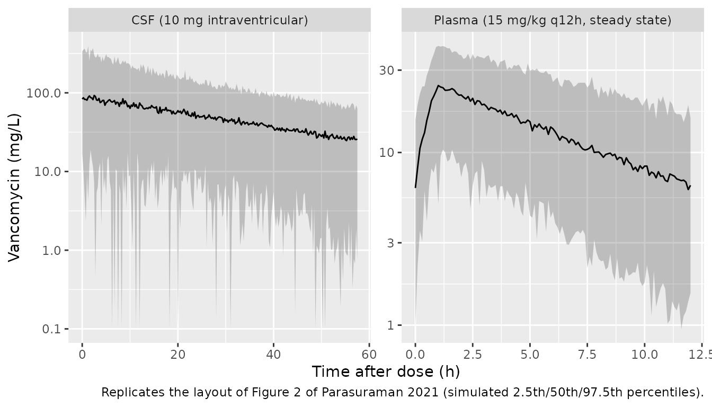
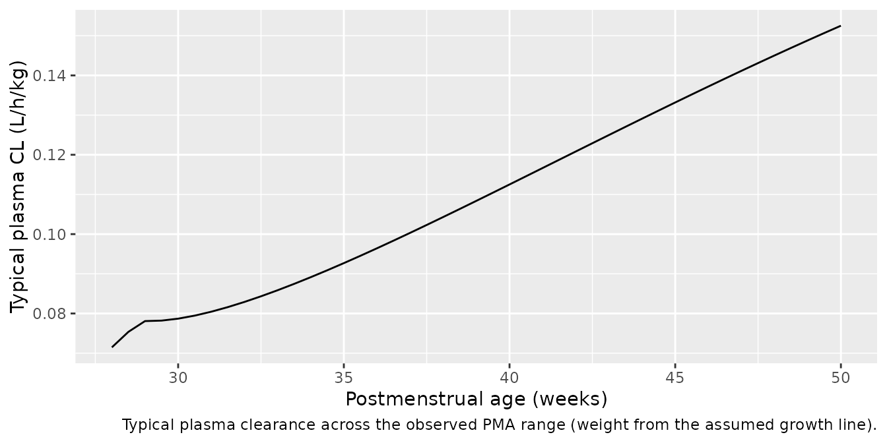

# Vancomycin (Parasuraman 2021)

## Model and source

``` r

mod <- readModelDb("Parasuraman_2021_vancomycin")
mod_ui <- rxode2::rxode2(mod)
#> ℹ parameter labels from comments will be replaced by 'label()'
```

- Citation: Parasuraman JM, Kloprogge F, Standing JF, Albur M, Heep A.
  Population pharmacokinetics of intraventricular vancomycin in neonatal
  ventriculitis, a preterm pilot study. Eur J Pharm Sci.
  2021;158:105643. <doi:10.1016/j.ejps.2020.105643>. Size and maturation
  form from Germovsek E, Barker CIS, Sharland M, Standing JF. Scaling
  clearance in paediatric pharmacokinetics: all models are wrong, which
  are useful? Br J Clin Pharmacol. 2017;83(4):777-790.
  <doi:10.1111/bcp.13160> (Table 1, model 9b).
- Description: Parallel one-compartment plasma and one-compartment CSF
  population PK model for intravenous and intraventricular vancomycin in
  extremely preterm infants (\<28 weeks gestation) treated for
  ventriculitis (Parasuraman 2021). Plasma CL and V are allometrically
  scaled to 70 kg (fixed exponents 0.632 on CL, 1 on V) with a fixed
  Rhodin postmenstrual-age maturation sigmoid on CL; the CSF compartment
  receives intraventricular doses and has its own clearance and volume,
  with no plasma-CSF transfer.
- Article: <https://doi.org/10.1016/j.ejps.2020.105643> (open access,
  PMC7848885)
- Size and maturation framework: Germovsek et al. 2017,
  <https://doi.org/10.1111/bcp.13160> (Table 1, model 9b)

Parasuraman et al. pooled intravenous (IV) and intraventricular
vancomycin data from eight extremely preterm infants treated for
ventriculitis through a ventricular access device (Ommaya reservoir).
The final model is two **parallel, unconnected** one-compartment models:
plasma (IV doses) and CSF (intraventricular doses). Transfer between
plasma and CSF in either direction did not improve the fit, so the
published model has none. Ventricular index, CSF protein and serum
creatinine were all tested and none was retained.

## Population

Eight preterm infants born at \<28 weeks gestation (median gestational
age 25.3 weeks, range 23.9-27.7; median birth weight 0.78 kg, range
0.517-1.13 kg; 62.5% female) were treated for ventriculitis at Southmead
Hospital NICU, Bristol, UK, between 2009 and 2016 (Table 2). At the time
of treatment the median postnatal age was 8.7 weeks (3.9-23.1) and the
median postmenstrual age 34.4 weeks (30.2-48.1). Intraventricular
starting doses were 3, 5, 10 or 15 mg, given as a 2-minute slow bolus of
a 10 mg/mL solution, and were repeated when the CSF level fell below 10
mg/L. Six of the eight infants also received IV vancomycin at 15 mg/kg
every 24 h (\<29 weeks PMA) or every 12 h (29-35 weeks PMA). The final
analysis used 37 plasma concentrations from 5 infants and 67 CSF
concentrations from 8 infants.

The same information is available programmatically:

``` r

str(mod_ui$population)
#> List of 16
#>  $ species              : chr "human"
#>  $ n_subjects           : int 8
#>  $ n_studies            : int 1
#>  $ age_range            : chr "Postnatal age 3.9-23.1 weeks; postmenstrual age 30.2-48.1 weeks"
#>  $ age_median           : chr "Postnatal age 8.7 weeks; postmenstrual age 34.4 weeks"
#>  $ gestational_age_range: chr "23.9-27.7 weeks (median 25.3)"
#>  $ weight_range         : chr "Birth weight 0.517-1.13 kg (current weight at sampling not reported)"
#>  $ weight_median        : chr "Birth weight 0.78 kg"
#>  $ sex_female_pct       : num 62.5
#>  $ race_ethnicity       : chr "Not reported"
#>  $ disease_state        : chr "Extremely preterm infants (<28 weeks gestation) with ventriculitis (CSF white cell count >20/mm^3 or positive C"| __truncated__
#>  $ dose_range           : chr "Intraventricular vancomycin starting doses of 3, 5, 10 or 15 mg (10 mg/mL slow bolus over 2 min via the reservo"| __truncated__
#>  $ regions              : chr "United Kingdom (Southmead Hospital NICU, Bristol), 2009-2016"
#>  $ samples_plasma       : chr "37 plasma concentrations from 5 infants (median 5 per infant, range 2-18)"
#>  $ samples_csf          : chr "67 CSF concentrations from 8 infants (median 7.5 per infant, range 4-16)"
#>  $ notes                : chr "Retrospective single-centre case review; demographics from Table 2. CSF drainage was fairly constant at 5-10 mL"| __truncated__
```

## Source trace

Every `ini()` value carries an in-file source comment in
`inst/modeldb/specificDrugs/Parasuraman_2021_vancomycin.R`; the table
collects them.

| Parameter / equation | Value | Source location |
|----|----|----|
| `lcl` (plasma CL per 70 kg, fully mature) | log(9.29) L/h | Table 3, CL = 9.29 L/h/70 kg |
| `lvc` (plasma V per 70 kg) | log(54.4) L | Table 3, V = 54.4 L/70 kg |
| `lcl_csf` (CSF clearance) | log(0.002) L/h | Table 3, CLCSF = 0.002 L/h |
| `lvcsf` (CSF volume) | log(0.109) L | Table 3, VCSF = 0.109 L |
| `e_wt_cl` | 0.632 (fixed) | Methods ‘NLME modelling’: weight standardised to 70 kg, allometric exponent 0.632 |
| `e_wt_vc` | 1 (fixed) | Table 3 reports V per 70 kg (linear scaling) |
| `tmat50` | 55.4 weeks (fixed) | Not printed; Germovsek 2017 Table 1 model 9b (the 0.632-exponent pairing), cited by the paper for its a priori size-and-age scaling |
| `hill` | 3.33 (fixed) | As `tmat50` |
| `etalcl` | 0.0676 | Table 3, IIV CL 26% CV; footnote CV = 100 x omega |
| `etalcl_csf` | 0.0841 | Table 3, IIV CLCSF 29% CV |
| `etalvcsf` | 0.36 | Table 3, IIV VCSF 60% CV |
| IIV on V | none | Table 3, 0 FIX |
| `propSd` | 0.3131 | Table 3, sigma prop plasma 31.31% CV |
| `propSd_Ccsf` | 0.458 | Table 3, sigma prop CSF 45.8% CV |
| `d/dt(central) <- -cl/vc * central` | n/a | Methods, dA(p)/dt equation |
| `d/dt(csf) <- -cl_csf/vcsf * csf` | n/a | Methods, dA(csf)/dt equation |
| `fmat <- PAGE^hill / (tmat50^hill + PAGE^hill)` | n/a | Methods (“maturation function”, citing Germovsek 2016 and 2017); form from Germovsek 2017 Table 1 model 9b |

## Virtual cohort

The paper reports birth weight but not the weight at the time of
treatment, which is what the allometric model needs. The cohort below
draws postmenstrual age from the published range and assigns a current
weight from a simple linear growth assumption (1.6 kg at the median 34.4
weeks PMA, +0.18 kg per week, with 12% log-normal scatter). Both are
assumptions by the maintainers; see *Assumptions and deviations*.

Every virtual infant receives one 10 mg intraventricular dose at time 0
into `csf`, and 15 mg/kg IV vancomycin as a 1-hour infusion every 12
hours for ten doses into `central`. Because the two compartments are not
connected, the two routes can share one event table without influencing
each other.

``` r

set.seed(20210107)
rxode2::rxSetSeed(20210107)
n_sub <- 200L

# Postmenstrual age: reject-and-redraw inside the published range
# (Table 2: 30.2-48.1 weeks, median 34.4).
draw_pma <- function(n) {
  out <- numeric(0)
  while (length(out) < n) {
    x <- exp(rnorm(n, log(34.4), 0.12))
    out <- c(out, x[x >= 30.2 & x <= 48.1])
  }
  out[seq_len(n)]
}

cohort <- tibble(
  id = seq_len(n_sub),
  PAGE = draw_pma(n_sub)
) |>
  mutate(WT = pmax(0.6, 1.6 + 0.18 * (PAGE - 34.4)) * exp(rnorm(n_sub, 0, 0.12)))

iv_times <- seq(0, 108, by = 12)
obs_times <- sort(unique(c(seq(0, 72, by = 0.25), seq(108, 120, by = 0.1))))

build_events <- function(cohort, ivt_dose = 10) {
  ivt <- cohort |>
    mutate(time = 0, amt = ivt_dose, rate = 0, evid = 1L, cmt = "csf")
  iv <- cohort |>
    tidyr::crossing(time = iv_times) |>
    mutate(amt = 15 * WT, rate = amt / 1, evid = 1L, cmt = "central")
  obs <- cohort |>
    tidyr::crossing(time = obs_times) |>
    mutate(amt = 0, rate = 0, evid = 0L, cmt = "central")
  # Two endpoints (Cc, Ccsf): observation rows sit on an ODE state and carry
  # dvid = 1 so rxode2 can map them; rxode2 returns BOTH Cc and Ccsf on every
  # observation row, so one observation grid serves both matrices.
  bind_rows(ivt, iv, obs) |>
    mutate(dvid = ifelse(evid == 0L, 1L, NA_integer_)) |>
    arrange(id, time, desc(evid)) |>
    as.data.frame()
}
events <- build_events(cohort)
stopifnot(!anyDuplicated(unique(events[, c("id", "time", "evid", "cmt")])))
```

## Simulation

``` r

sim <- rxode2::rxSolve(
  mod,
  events = events,
  keep = c("WT", "PAGE"),
  returnType = "data.frame"
)
#> ℹ parameter labels from comments will be replaced by 'label()'

# Residual error added in R so the VPC below matches the paper's
# observation-level percentiles (proportional on each matrix).
th <- rxode2::rxode2(mod)$theta
#> ℹ parameter labels from comments will be replaced by 'label()'
sim <- sim |>
  mutate(
    Cc_obs = Cc * (1 + th[["propSd"]] * rnorm(n())),
    Ccsf_obs = Ccsf * (1 + th[["propSd_Ccsf"]] * rnorm(n()))
  )
```

### Closed-form checks (typical values)

With the random effects set to zero, the CSF compartment after an
intraventricular bolus is a mono-exponential with `C0 = dose / vcsf` and
`k = cl_csf / vcsf`, and the plasma profile after ten 1-hour infusions
is the superposition of ten one-compartment infusion curves. Both are
recomputed analytically from the `ini()` values and compared with the
solver.

``` r

mod_typ <- rxode2::zeroRe(mod)
#> ℹ parameter labels from comments will be replaced by 'label()'
typ_cov <- data.frame(id = 1L, WT = 1.6, PAGE = 34.4)
ev_typ <- build_events(typ_cov)
sim_typ <- rxode2::rxSolve(
  mod_typ,
  events = ev_typ,
  returnType = "data.frame",
  atol = 1e-10, rtol = 1e-10
)
#> ℹ omega/sigma items treated as zero: 'etalcl', 'etalcl_csf', 'etalvcsf'

cl_typ <- exp(th[["lcl"]]) * (1.6 / 70)^th[["e_wt_cl"]] *
  34.4^th[["hill"]] / (th[["tmat50"]]^th[["hill"]] + 34.4^th[["hill"]])
v_typ <- exp(th[["lvc"]]) * (1.6 / 70)^th[["e_wt_vc"]]
k_typ <- cl_typ / v_typ
vcsf_typ <- exp(th[["lvcsf"]])
kcsf_typ <- exp(th[["lcl_csf"]]) / vcsf_typ

csf_analytic <- 10 / vcsf_typ * exp(-kcsf_typ * sim_typ$time)
inf_one <- function(t, t0, dose, tinf = 1) {
  r <- dose / tinf
  tt <- t - t0
  ifelse(
    tt <= 0, 0,
    ifelse(
      tt <= tinf,
      r / cl_typ * (1 - exp(-k_typ * tt)),
      r / cl_typ * (1 - exp(-k_typ * tinf)) * exp(-k_typ * (tt - tinf))
    )
  )
}
cc_analytic <- Reduce(`+`, lapply(iv_times, function(t0) inf_one(sim_typ$time, t0, 15 * 1.6)))

rel_csf <- abs(sim_typ$Ccsf - csf_analytic) / csf_analytic
rel_cc <- abs(sim_typ$Cc - cc_analytic)[sim_typ$time > 0] / cc_analytic[sim_typ$time > 0]
c(max_rel_err_csf = max(rel_csf), max_rel_err_plasma = max(rel_cc))
#>    max_rel_err_csf max_rel_err_plasma 
#>       1.836388e-11       2.326819e-10
stopifnot(max(rel_csf) < 1e-5, max(rel_cc) < 1e-5)

typical <- tibble(
  quantity = c(
    "Plasma CL (L/h), 1.6 kg, 34.4 wk PMA", "Plasma V (L)", "Plasma t1/2 (h)",
    "CSF CL (L/h)", "CSF V (L)", "CSF t1/2 (h)",
    "CSF C0 after 10 mg (mg/L)", "Time for CSF to fall to 10 mg/L after 10 mg (h)"
  ),
  value = c(
    cl_typ, v_typ, log(2) / k_typ,
    exp(th[["lcl_csf"]]), vcsf_typ, log(2) / kcsf_typ,
    10 / vcsf_typ, log(10 / vcsf_typ / 10) / kcsf_typ
  )
)
knitr::kable(typical, digits = 3, caption = "Typical-value quantities implied by Table 3.")
```

| quantity                                        |   value |
|:------------------------------------------------|--------:|
| Plasma CL (L/h), 1.6 kg, 34.4 wk PMA            |   0.145 |
| Plasma V (L)                                    |   1.243 |
| Plasma t1/2 (h)                                 |   5.950 |
| CSF CL (L/h)                                    |   0.002 |
| CSF V (L)                                       |   0.109 |
| CSF t1/2 (h)                                    |  37.777 |
| CSF C0 after 10 mg (mg/L)                       |  91.743 |
| Time for CSF to fall to 10 mg/L after 10 mg (h) | 120.794 |

Typical-value quantities implied by Table 3. {.table}

The typical CSF half-life is about 38 h, so a 10 mg dose stays above the
10 mg/L re-dosing threshold for roughly five days in a typical infant.

## Replicate published figures

### Figure 2: VPC versus time after dose

Figure 2 of the paper is a prediction-corrected VPC of plasma (left) and
CSF (right) concentrations against time after dose. The observed data
are not available, so the panels below show the simulated 2.5th, 50th
and 97.5th percentiles for the virtual cohort (plasma: last dosing
interval at steady state; CSF: after a single 10 mg intraventricular
dose over the observed 0-57 h time-after-dose range).

``` r

vpc <- bind_rows(
  sim |>
    filter(time >= 108, time <= 120) |>
    transmute(id, tad = time - 108, conc = Cc_obs, matrix = "Plasma (15 mg/kg q12h, steady state)"),
  sim |>
    filter(time <= 57.5) |>
    transmute(id, tad = time, conc = Ccsf_obs, matrix = "CSF (10 mg intraventricular)")
) |>
  group_by(matrix, tad) |>
  summarise(
    p025 = quantile(conc, 0.025),
    p50 = quantile(conc, 0.5),
    p975 = quantile(conc, 0.975),
    .groups = "drop"
  )

ggplot(vpc, aes(tad, p50)) +
  geom_ribbon(aes(ymin = pmax(p025, 0.1), ymax = p975), alpha = 0.25) +
  geom_line() +
  facet_wrap(~matrix, scales = "free") +
  scale_y_log10() +
  labs(
    x = "Time after dose (h)", y = "Vancomycin (mg/L)",
    caption = "Replicates the layout of Figure 2 of Parasuraman 2021 (simulated 2.5th/50th/97.5th percentiles)."
  )
```



### Comparison with the observed concentration ranges (Table 2)

Table 2 reports observed plasma concentrations of median 8.6 mg/L (range
2.2-26.6) at a median 5.59 h after dose, and CSF concentrations of
median 24.9 mg/L (range 2.5-230.7) at a median 7.39 h after dose. The
observed CSF data pool starting doses of 3 to 15 mg and repeat doses, so
the single 10 mg scenario is expected to sit toward the upper part of
the CSF range rather than on its median. Likewise, routine plasma
monitoring was a pre-dose level before the third and later IV doses
(Methods), so the observed plasma median leans toward troughs, whereas
the simulated summary spans the whole dosing interval; the simulated
steady-state `Cmin` in the PKNCA section below is the closer comparator.

``` r

obs_cmp <- bind_rows(
  sim |>
    filter(time >= 108, time <= 122) |>
    summarise(
      simulated_median = median(Cc_obs),
      simulated_p05 = quantile(Cc_obs, 0.05),
      simulated_p95 = quantile(Cc_obs, 0.95)
    ) |>
    mutate(matrix = "Plasma, steady-state interval", observed = "8.6 (2.2-26.6)"),
  sim |>
    filter(time <= 57.5) |>
    summarise(
      simulated_median = median(Ccsf_obs),
      simulated_p05 = quantile(Ccsf_obs, 0.05),
      simulated_p95 = quantile(Ccsf_obs, 0.95)
    ) |>
    mutate(matrix = "CSF, 0-57 h after 10 mg", observed = "24.9 (2.5-230.7)")
) |>
  relocate(matrix, observed)

obs_cmp |>
  rename(
    "Matrix" = matrix,
    "Observed median (range), Table 2" = observed,
    "Simulated median" = simulated_median,
    "Simulated 5th pct" = simulated_p05,
    "Simulated 95th pct" = simulated_p95
  ) |>
  knitr::kable(digits = 1, caption = "Simulated concentrations (mg/L) versus the observed ranges in Table 2.")
```

| Matrix | Observed median (range), Table 2 | Simulated median | Simulated 5th pct | Simulated 95th pct |
|:---|:---|---:|---:|---:|
| Plasma, steady-state interval | 8.6 (2.2-26.6) | 12.6 | 3.5 | 28.9 |
| CSF, 0-57 h after 10 mg | 24.9 (2.5-230.7) | 44.6 | 7.9 | 149.8 |

Simulated concentrations (mg/L) versus the observed ranges in Table 2.
{.table}

``` r


# Unit / scale guard: a volume entered in mL instead of L, or a per-kg value
# read as per-70-kg, moves these medians by orders of magnitude.
stopifnot(
  obs_cmp$simulated_median[1] > 2.2, obs_cmp$simulated_median[1] < 26.6,
  obs_cmp$simulated_median[2] > 2.5, obs_cmp$simulated_median[2] < 230.7
)
```

## PKNCA validation

### CSF: single intraventricular dose by starting dose

The paper’s four intraventricular starting doses (3, 5, 10, 15 mg) are
simulated with typical parameters and analysed with PKNCA. The paper
reports no NCA table, so the reference values are the analytic
single-dose values implied by Table 3 (`Cmax = dose / VCSF`,
`AUCinf = dose / CLCSF`, `t1/2 = ln 2 * VCSF / CLCSF`).

``` r

ivt_doses <- c(3, 5, 10, 15)
ev_csf <- bind_rows(lapply(seq_along(ivt_doses), function(i) {
  d <- ivt_doses[i]
  bind_rows(
    data.frame(id = i, time = 0, amt = d, evid = 1L, cmt = "csf"),
    data.frame(id = i, time = c(0, seq(0.25, 2, 0.25), seq(3, 336, 1)), amt = 0, evid = 0L, cmt = "csf")
  ) |>
    mutate(
      WT = 1.6, PAGE = 34.4, treatment = paste(d, "mg"),
      dvid = ifelse(evid == 0L, 2L, NA_integer_)
    )
}))

sim_csf <- rxode2::rxSolve(mod_typ, events = ev_csf, keep = "treatment", returnType = "data.frame")
#> ℹ omega/sigma items treated as zero: 'etalcl', 'etalcl_csf', 'etalvcsf'
#> Warning: multi-subject simulation without without 'omega'

conc_csf <- sim_csf |>
  filter(!is.na(Ccsf)) |>
  select(id, time, Ccsf, treatment)
dose_csf <- ev_csf |>
  filter(evid == 1) |>
  select(id, time, amt, treatment)

nca_csf <- PKNCA::pk.nca(PKNCA::PKNCAdata(
  PKNCA::PKNCAconc(conc_csf, Ccsf ~ time | treatment + id, concu = "mg/L", timeu = "h"),
  PKNCA::PKNCAdose(dose_csf, amt ~ time | treatment + id, route = "intravascular", doseu = "mg"),
  intervals = data.frame(start = 0, end = Inf, cmax = TRUE, aucinf.obs = TRUE, half.life = TRUE)
))

ref_csf <- tibble(
  treatment = paste(ivt_doses, "mg"),
  cmax = ivt_doses / vcsf_typ,
  aucinf.obs = ivt_doses / exp(th[["lcl_csf"]]),
  half.life = log(2) / kcsf_typ
)

cmp_csf <- nlmixr2lib::ncaComparisonTable(
  simulated = nca_csf,
  reference = ref_csf,
  by = "treatment",
  units = c(cmax = "mg/L", aucinf.obs = "mg*h/L", half.life = "h"),
  tolerance_pct = 5
)
knitr::kable(cmp_csf, caption = "CSF NCA (typical infant) versus the analytic values implied by Table 3. * differs by >5%.")
```

| NCA parameter          | treatment | Reference | Simulated | % diff |
|:-----------------------|:----------|:----------|:----------|:-------|
| Cmax (mg/L)            | 3 mg      | 27.5      | 27.5      | -0.0%  |
| Cmax (mg/L)            | 5 mg      | 45.9      | 45.9      | -0.0%  |
| Cmax (mg/L)            | 10 mg     | 91.7      | 91.7      | -0.0%  |
| Cmax (mg/L)            | 15 mg     | 138       | 138       | -0.0%  |
| AUC0-∞ (obs) (mg\*h/L) | 3 mg      | 1500      | 1500      | -0.0%  |
| AUC0-∞ (obs) (mg\*h/L) | 5 mg      | 2500      | 2500      | -0.0%  |
| AUC0-∞ (obs) (mg\*h/L) | 10 mg     | 5000      | 5000      | -0.0%  |
| AUC0-∞ (obs) (mg\*h/L) | 15 mg     | 7500      | 7500      | -0.0%  |
| t½ (h)                 | 3 mg      | 37.8      | 37.8      | -0.0%  |
| t½ (h)                 | 5 mg      | 37.8      | 37.8      | -0.0%  |
| t½ (h)                 | 10 mg     | 37.8      | 37.8      | -0.0%  |
| t½ (h)                 | 15 mg     | 37.8      | 37.8      | -0.0%  |

CSF NCA (typical infant) versus the analytic values implied by Table 3.
\* differs by \>5%. {.table}

``` r

# Flags live on the "% diff" column only (the unit labels contain "*" too).
# Guard the column name so a rename cannot make the check vacuous.
stopifnot(
  "% diff" %in% names(cmp_csf),
  nrow(cmp_csf) == 12L,
  !any(grepl("\\*", cmp_csf[["% diff"]]))
)
```

### Plasma: steady-state dosing interval

For each virtual infant, the steady-state `AUC0-12` from PKNCA over the
tenth dosing interval should equal `dose / CL` for that infant’s own
clearance (the `cl` column of the solve).

``` r

conc_pl <- sim |>
  filter(time >= 108, time <= 120, !is.na(Cc)) |>
  mutate(treatment = "15 mg/kg q12h") |>
  select(id, time, Cc, treatment)
dose_pl <- events |>
  filter(evid == 1, cmt == "central") |>
  mutate(treatment = "15 mg/kg q12h") |>
  select(id, time, amt, treatment)

nca_pl <- PKNCA::pk.nca(PKNCA::PKNCAdata(
  PKNCA::PKNCAconc(conc_pl, Cc ~ time | treatment + id, concu = "mg/L", timeu = "h"),
  PKNCA::PKNCAdose(dose_pl, amt ~ time | treatment + id, route = "intravascular", doseu = "mg"),
  intervals = data.frame(start = 108, end = 120, cmax = TRUE, cmin = TRUE, auclast = TRUE)
))

auc_chk <- as.data.frame(nca_pl) |>
  filter(PPTESTCD == "auclast") |>
  select(id, auclast = PPORRES) |>
  left_join(
    sim |> filter(time == 108) |> select(id, cl, WT),
    by = "id"
  ) |>
  mutate(ratio = auclast * cl / (15 * WT))

summary(auc_chk$ratio)
#>    Min. 1st Qu.  Median    Mean 3rd Qu.    Max. 
#>  0.9996  1.0000  1.0000  1.0000  1.0000  1.0000
stopifnot(
  abs(median(auc_chk$ratio) - 1) < 0.02,
  quantile(abs(auc_chk$ratio - 1), 0.9) < 0.05
)

as.data.frame(nca_pl) |>
  group_by(PPTESTCD) |>
  summarise(
    median = median(PPORRES),
    p05 = quantile(PPORRES, 0.05),
    p95 = quantile(PPORRES, 0.95),
    .groups = "drop"
  ) |>
  rename("NCA parameter" = PPTESTCD, "Median" = median, "5th pct" = p05, "95th pct" = p95) |>
  knitr::kable(digits = 2, caption = "Plasma steady-state NCA over the tenth 12-hour interval (mg/L, mg*h/L).")
```

| NCA parameter | Median | 5th pct | 95th pct |
|:--------------|-------:|--------:|---------:|
| auclast       | 167.33 |   94.11 |   249.26 |
| cmax          |  24.32 |   19.08 |    30.69 |
| cmin          |   6.84 |    2.00 |    13.09 |

Plasma steady-state NCA over the tenth 12-hour interval (mg/L, mg\*h/L).
{.table}

### Maturation of plasma clearance

``` r

mat <- tibble(PAGE = seq(28, 50, by = 0.5)) |>
  mutate(
    WT = pmax(0.6, 1.6 + 0.18 * (PAGE - 34.4)),
    fmat = PAGE^th[["hill"]] / (th[["tmat50"]]^th[["hill"]] + PAGE^th[["hill"]]),
    cl_per_kg = exp(th[["lcl"]]) * (WT / 70)^th[["e_wt_cl"]] * fmat / WT
  )
ggplot(mat, aes(PAGE, cl_per_kg)) +
  geom_line() +
  labs(x = "Postmenstrual age (weeks)", y = "Typical plasma CL (L/h/kg)",
       caption = "Typical plasma clearance across the observed PMA range (weight from the assumed growth line).")
```



## Assumptions and deviations

- **Maturation constants are not printed in the paper.** The Methods
  state that all parameters were scaled a priori for size and age with a
  weight exponent of 0.632 and a maturation function on clearance,
  citing Germovsek et al. 2016 and 2017, but give no values. The
  maintainers used the pairing Germovsek et al. 2017 (Table 1, model 9b)
  gives for the fixed 0.632 exponent,
  `PMA^3.33 / (55.4^3.33 + PMA^3.33)` (the Rhodin 2009
  glomerular-filtration fit with its estimated 0.632 exponent), which is
  also the pairing in the Germovsek 2016 gentamicin model the paper
  cites. The Rhodin constants paired with a 0.75 exponent (47.7 weeks,
  3.4) would give a typical clearance about 45% higher at 34.4 weeks
  PMA, so this choice matters for plasma exposure.
- **No postnatal-age term.** Germovsek 2016 also carried a
  gentamicin-specific postnatal-age factor with an estimated
  half-saturation. Table 3 lists no such estimate, so it is not
  included; at the cohort’s postnatal ages (3.9-23.1 weeks) that factor
  would be near 1 anyway.
- **Volume scales linearly with weight** (exponent 1), inferred from
  Table 3 reporting V in L/70 kg.
- **CSF parameters are not weight- or age-scaled.** Table 3 reports
  CLCSF in L/h and VCSF in L, without the per-70 kg normalisation used
  for the plasma parameters, and the Results describe no covariate on
  them.
- **IIV variances.** The Table 3 footnote defines CV as 100 x omega, so
  each variance is (CV/100)^2. IIV on V was fixed to 0 and is omitted.
- **Current weight was not reported.** Only birth weight is tabulated.
  The virtual cohort uses a linear growth assumption (1.6 kg at 34.4
  weeks PMA, +0.18 kg per week, 12% scatter). This affects the plasma
  simulations only.
- **IV infusion duration was not reported.** A 1-hour infusion is
  assumed. The paper gives intervals only up to 35 weeks PMA (every 12 h
  for 29-35 weeks); every virtual infant receives every-12-hour dosing.
- **CLCSF is printed to one significant figure** (0.002 L/h; bootstrap
  median 0.002, 95% CI 0.002-0.003), so the CSF half-life of about 38 h
  carries that rounding.
- **Figure 3** (time to CSF sterilisation against CSF AUC0-24 and
  average concentration) is an exploratory scatter of observed outcomes
  with no fitted relationship, so it is not reproduced.
- No erratum or correction notice was found for this article (checked
  2026-09-27).
