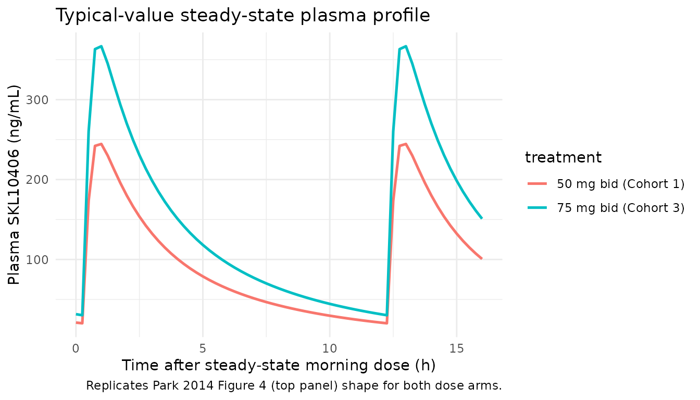
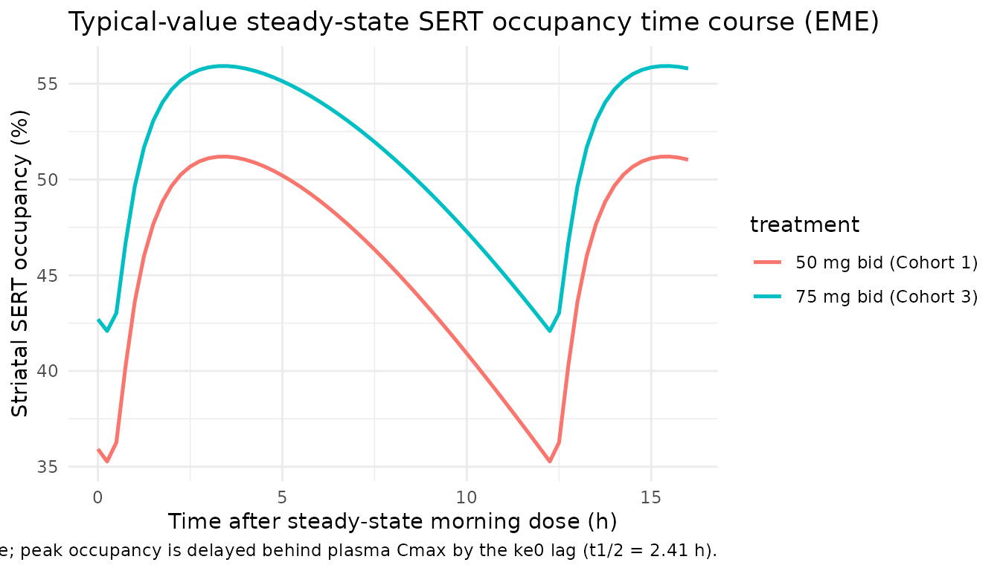
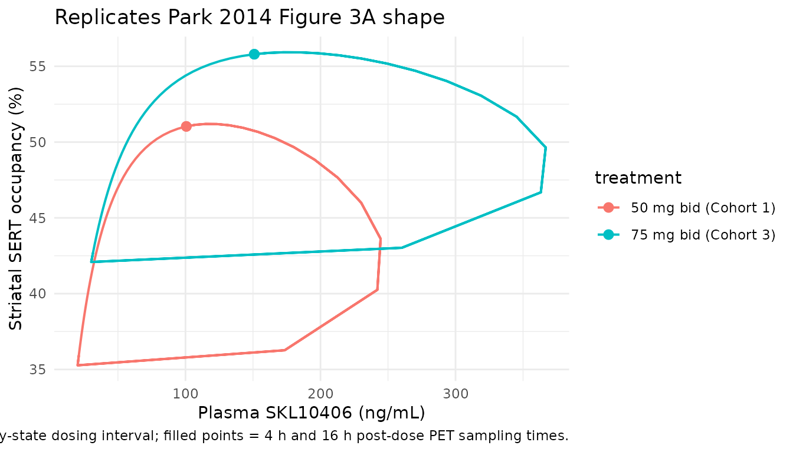
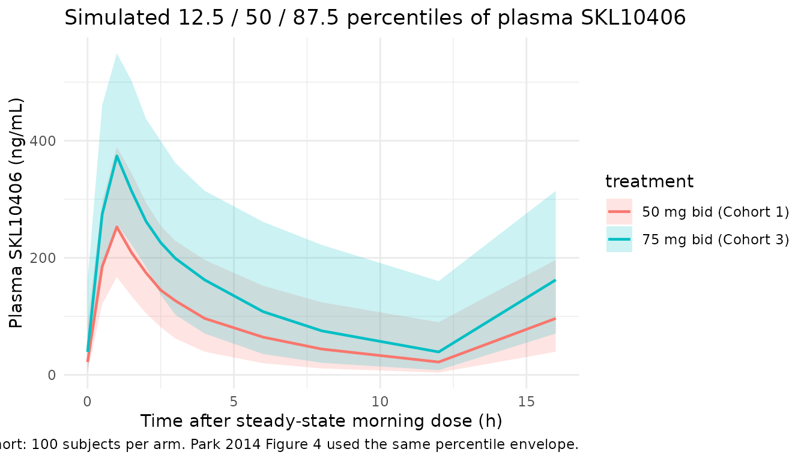
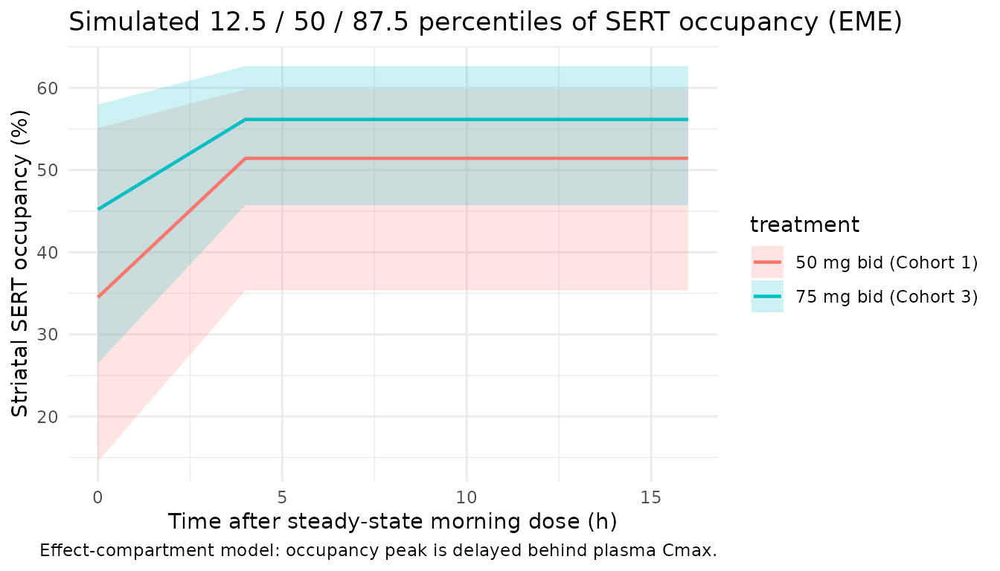

# SKL10406 (Park 2014)

## Model and source

- Citation: Park JS, Lee J, Meyer J, Ilankumaran P, Han S, Yim DS.
  Serotonin transporter occupancy of SKL10406 in humans: comparison of
  pharmacokinetic-pharmacodynamic modeling methods for estimation of
  occupancy parameters. Transl Clin Pharmacol. 2014;22(2):83-91.
  <doi:10.12793/tcp.2014.22.2.83>
- Description: Two-compartment first-order oral absorption population PK
  with effect-compartment Emax PK-PD model for striatal serotonin
  transporter (SERT) occupancy by SKL10406 (a triple monoamine reuptake
  inhibitor candidate) in healthy adult volunteers (Park 2014; EME
  variant, Table 3)
- Article: <https://doi.org/10.12793/tcp.2014.22.2.83>

## Population

SKL10406 is a triple monoamine reuptake inhibitor (TRI) candidate under
development as an antidepressant. The Park 2014 study enrolled 15
healthy adult volunteers in four cohorts (three subjects per cohort) at
a single PET centre in Toronto, Canada; 11 subjects completed both PK
and PET assessments (Park 2014 Table 1). Cohorts 1 and 2 received
SKL10406 50 mg every 12 h orally for 6 days. Cohorts 3 and 4 received 50
mg every 12 h for 4 days followed by 75 mg every 12 h for 6 days.
Cohorts 1 and 3 underwent striatal SERT-occupancy \[11C\]DASB PET scans
(n = 6 subjects); cohorts 2 and 4 underwent striatal DAT-occupancy
\[11C\]PE2I PET scans (n = 5 subjects). The pop-PK model was fit to all
11 completers; the EME PK / PD model was fit to the 6 SERT subjects
because DAT occupancies were too sparse to support a robust PD fit (Park
2014 Results).

Demographics for the 11 completers (Park 2014 Table 1): 10 male / 1
female; age 43.5 +/- 8.21 years (range 18-50 by inclusion criterion);
BMI 25.7 +/- 2.90 kg/m^2 (range 19.0-30.0 by inclusion); 10 White and 1
Black or African American; body weight \< 125 kg by inclusion criterion
(no separate weight summary reported).

The same information is available programmatically via
`readModelDb("Park_2014_SKL10406")$population`.

## Source trace

Per-parameter origin is recorded as an in-file comment next to each
`ini()` entry in `inst/modeldb/specificDrugs/Park_2014_SKL10406.R`. The
table below collects them for review.

| Equation / parameter | Value | Source location |
|----|----|----|
| Structural model | 2-compartment first-order oral absorption with lag + effect-compartment Emax | Park 2014 Methods (Population PK Model Building for ME; EME); Figure 2; Table 3 |
| `lcl` (CL/F) | `log(49.6)` L/h | Table 3 ME row: CL = 49.6 L/h |
| `lvc` (V2/F central) | `log(176)` L | Table 3 ME row: V2 = 176 L |
| `lka` (absorption rate) | `log(5.05)` 1/h | Table 3 ME row: ka = 5.05 1/h |
| `lvp` (V3/F peripheral) | `log(63.7)` L | Table 3 ME row: V3 = 63.7 L |
| `lq` (Q/F) | `log(21.1)` L/h | Table 3 ME row: Q = 21.1 L/h |
| `ltlag` (ALAG) | `log(0.336)` h | Table 3 ME row: ALAG = 0.336 h |
| `lemax` (max SERT occupancy) | `log(68.6)` % | Table 3 EME row: Emax = 68.6%, no IIV (estimation did not converge with eta on Emax) |
| `lec50` (effect-site EC50) | `log(40.2)` ng/mL | Table 3 EME row: EC50 = 40.2 ng/mL |
| `lke0` (equilibration rate) | `log(0.288)` 1/h | Table 3 EME row: ke0 = 0.288 1/h; t1/2 = 2.41 h |
| `etalcl` (IIV CL) | `log(0.622^2 + 1)` | Table 3 ME row: IIV CL = 62.2% CV |
| `etalvc` (IIV V2) | `log(0.416^2 + 1)` | Table 3 ME row: IIV V2 = 41.6% CV |
| `etalec50` (IIV EC50) | `log(0.683^2 + 1)` | Table 3 EME row: IIV EC50 = 68.3% CV |
| `addSd`, `propSd`, `propSd_TO` | `fixed(...)` library defaults | Park 2014 Methods state “combined” PK residual and “proportional” PD residual; numeric values NOT reported in the paper. See Errata. |
| `d/dt(effect) = ke0 * (Cc - effect)` | effect compartment ODE | Park 2014 Eq. 3 |
| `TO = emax * effect / (ec50 + effect)` | Emax PD on effect compartment | Park 2014 Methods (EME paragraph) |

## Virtual cohort

The published individual-level data are not available. The cohort below
approximates Park 2014 Table 1 demographics and the two dosing regimens
the study used. Cohort A receives 50 mg PO every 12 h for 6 days (Park
2014 Cohorts 1 + 2). Cohort B receives 50 mg every 12 h for 4 days
followed by 75 mg every 12 h for 6 days (Park 2014 Cohorts 3 + 4). The
SERT-occupancy PD fit (EME) used only Cohorts 1 (n = 3) and 3 (n = 3);
for visualisation we simulate a larger virtual cohort to make the
prediction intervals legible.

``` r

set.seed(20141204) # Park 2014 accepted date
n_per_arm <- 100

cohort <- tibble(
  id        = seq_len(2 * n_per_arm),
  treatment = factor(rep(c("50 mg bid (Cohort 1)", "75 mg bid (Cohort 3)"),
                          each = n_per_arm),
                     levels = c("50 mg bid (Cohort 1)", "75 mg bid (Cohort 3)"))
)
```

Dosing and observation events. For the 50 mg bid arm we administer
SKL10406 50 mg PO every 12 h for 6 days (12 doses). For the 75 mg bid
arm we mirror Park 2014 Cohort 3: 50 mg every 12 h for 4 days followed
by 75 mg every 12 h for 6 days. We sample PK on the steady-state dosing
day at the protocol times (0, 0.5, 1, 1.5, 2, 2.5, 3, 4, 6, 8, 12, 16 h
after the morning dose) and sample SERT occupancy at the two protocol
PET timepoints (4 h and 16 h after the steady-state morning dose).

``` r

# Per-arm dosing schedules
dose_schedule <- function(arm, id_v) {
  if (arm == "50 mg bid (Cohort 1)") {
    # 50 mg every 12 h for 6 days
    times <- seq(0, by = 12, length.out = 12)
    amts  <- rep(50, length(times))
  } else {
    # 50 mg every 12 h for 4 days followed by 75 mg every 12 h for 6 days
    pre   <- seq(0,        by = 12, length.out = 8)   # 4 days x 2 doses/day
    post  <- seq(96,       by = 12, length.out = 12)  # 6 days x 2 doses/day starting at 96 h
    times <- c(pre, post)
    amts  <- c(rep(50, length(pre)), rep(75, length(post)))
  }
  tidyr::expand_grid(id = id_v, dose_idx = seq_along(times)) |>
    dplyr::mutate(
      time = times[dose_idx],
      amt  = amts[dose_idx],
      cmt  = "depot",
      evid = 1L
    ) |>
    dplyr::select(id, time, amt, cmt, evid)
}

doses <- dplyr::bind_rows(
  dose_schedule("50 mg bid (Cohort 1)",
                cohort |> dplyr::filter(treatment == "50 mg bid (Cohort 1)") |> dplyr::pull(id)),
  dose_schedule("75 mg bid (Cohort 3)",
                cohort |> dplyr::filter(treatment == "75 mg bid (Cohort 3)") |> dplyr::pull(id))
)

# Steady-state observation day: morning dose at t_ss
# Cohort 1: PK observed on Day 6 (i.e. dose 11 at t = 120 h is the SS morning dose)
# Cohort 3: PK observed on Day 10 (i.e. dose 19 at t = 216 h is the SS morning dose)
t_ss <- tibble(
  treatment = factor(c("50 mg bid (Cohort 1)", "75 mg bid (Cohort 3)"),
                     levels = c("50 mg bid (Cohort 1)", "75 mg bid (Cohort 3)")),
  ss_time = c(120, 216)
)

pk_grid <- c(0, 0.5, 1, 1.5, 2, 2.5, 3, 4, 6, 8, 12, 16)
pd_grid <- c(0, 4, 16) # baseline and the two protocol PET scans

obs_cc <- cohort |>
  dplyr::left_join(t_ss, by = "treatment") |>
  tidyr::crossing(dt = pk_grid) |>
  dplyr::mutate(time = ss_time + dt, amt = 0, cmt = "Cc", evid = 0L) |>
  dplyr::select(id, time, amt, cmt, evid)

obs_to <- cohort |>
  dplyr::left_join(t_ss, by = "treatment") |>
  tidyr::crossing(dt = pd_grid) |>
  dplyr::mutate(time = ss_time + dt, amt = 0, cmt = "TO", evid = 0L) |>
  dplyr::select(id, time, amt, cmt, evid)

events <- dplyr::bind_rows(doses, obs_cc, obs_to) |>
  dplyr::left_join(cohort, by = "id") |>
  dplyr::arrange(id, time, dplyr::desc(evid))

stopifnot(!anyDuplicated(unique(events[, c("id", "time", "evid", "cmt")])))
```

## Simulation

``` r

mod <- rxode2::rxode2(readModelDb("Park_2014_SKL10406"))
#> ℹ parameter labels from comments will be replaced by 'label()'
conc_unit <- mod$units[["concentration"]]
sim <- rxode2::rxSolve(
  mod, events = events,
  keep = c("treatment"),
  returnType = "data.frame"
)

# Multi-output: filter by observation compartment so each timepoint contributes
# exactly one row per output. Compartment ordering follows the d/dt() and
# observation-equation declaration order in model(): depot=1, central=2,
# peripheral1=3, effect=4, Cc=5, TO=6.
sim_cc <- sim |> dplyr::filter(CMT == 5)
sim_to <- sim |> dplyr::filter(CMT == 6)
```

## Replicate published figures

### Typical-value PK and SERT occupancy over the steady-state interval

``` r

mod_typical <- mod |> rxode2::zeroRe()

typical_cohort <- tibble(
  id = 1:2,
  treatment = factor(c("50 mg bid (Cohort 1)", "75 mg bid (Cohort 3)"),
                     levels = c("50 mg bid (Cohort 1)", "75 mg bid (Cohort 3)"))
)

typical_doses <- dplyr::bind_rows(
  dose_schedule("50 mg bid (Cohort 1)", 1L),
  dose_schedule("75 mg bid (Cohort 3)", 2L)
)

dense_dt <- seq(0, 16, by = 0.25)
typical_obs_cc <- typical_cohort |>
  dplyr::left_join(t_ss, by = "treatment") |>
  tidyr::crossing(dt = dense_dt) |>
  dplyr::mutate(time = ss_time + dt, amt = 0, cmt = "Cc", evid = 0L) |>
  dplyr::select(id, time, amt, cmt, evid)

typical_obs_to <- typical_cohort |>
  dplyr::left_join(t_ss, by = "treatment") |>
  tidyr::crossing(dt = dense_dt) |>
  dplyr::mutate(time = ss_time + dt, amt = 0, cmt = "TO", evid = 0L) |>
  dplyr::select(id, time, amt, cmt, evid)

typical_events <- dplyr::bind_rows(typical_doses, typical_obs_cc, typical_obs_to) |>
  dplyr::left_join(typical_cohort, by = "id") |>
  dplyr::arrange(id, time, dplyr::desc(evid))

sim_typical <- rxode2::rxSolve(
  mod_typical, events = typical_events,
  keep = c("treatment"),
  returnType = "data.frame"
)
#> ℹ omega/sigma items treated as zero: 'etalcl', 'etalvc', 'etalec50'
#> Warning: multi-subject simulation without without 'omega'
sim_typical_cc <- sim_typical |> dplyr::filter(CMT == 5)
sim_typical_to <- sim_typical |> dplyr::filter(CMT == 6)

# Re-express time as hours since the steady-state morning dose so both arms align.
sim_typical_cc <- sim_typical_cc |>
  dplyr::left_join(t_ss, by = "treatment") |>
  dplyr::mutate(dt = time - ss_time)
sim_typical_to <- sim_typical_to |>
  dplyr::left_join(t_ss, by = "treatment") |>
  dplyr::mutate(dt = time - ss_time)

ggplot(sim_typical_cc, aes(dt, Cc, colour = treatment)) +
  geom_line(linewidth = 0.9) +
  labs(x = "Time after steady-state morning dose (h)",
       y = paste0("Plasma SKL10406 (", conc_unit, ")"),
       title = "Typical-value steady-state plasma profile",
       caption = "Replicates Park 2014 Figure 4 (top panel) shape for both dose arms.") +
  theme_minimal()
```



``` r


ggplot(sim_typical_to, aes(dt, TO, colour = treatment)) +
  geom_line(linewidth = 0.9) +
  labs(x = "Time after steady-state morning dose (h)",
       y = "Striatal SERT occupancy (%)",
       title = "Typical-value steady-state SERT occupancy time course (EME)",
       caption = "Replicates Park 2014 Figure 4 (bottom panel, EME) shape; peak occupancy is delayed behind plasma Cmax by the ke0 lag (t1/2 = 2.41 h).") +
  theme_minimal()
```



### Concentration vs SERT occupancy (Figure 3A shape)

Park 2014 Figure 3A plots steady-state plasma concentration against
striatal SERT occupancy at the two PET sampling times. The library model
reproduces this nonlinear effect-compartment relationship across the
full SS interval; the hysteresis loop is the EME-specific signature
(Park 2014 Methods, EME paragraph) that distinguishes the EME from the
DME / NPM variants.

``` r

sim_typical_cp_vs_to <- sim_typical_cc |>
  dplyr::select(treatment, dt, Cc) |>
  dplyr::inner_join(
    sim_typical_to |> dplyr::select(treatment, dt, TO),
    by = c("treatment", "dt")
  )

ggplot(sim_typical_cp_vs_to, aes(Cc, TO, colour = treatment)) +
  geom_path(linewidth = 0.7) +
  geom_point(data = sim_typical_cp_vs_to |> dplyr::filter(dt %in% c(4, 16)),
             size = 2.5) +
  labs(x = paste0("Plasma SKL10406 (", conc_unit, ")"),
       y = "Striatal SERT occupancy (%)",
       title = "Replicates Park 2014 Figure 3A shape",
       caption = "Hysteresis loop traced over the steady-state dosing interval; filled points = 4 h and 16 h post-dose PET sampling times.") +
  theme_minimal()
```



### Stochastic VPC across the steady-state dosing interval

``` r

sim_cc_ss <- sim_cc |>
  dplyr::left_join(t_ss, by = "treatment") |>
  dplyr::mutate(dt = time - ss_time)

sim_cc_ss |>
  dplyr::group_by(dt, treatment) |>
  dplyr::summarise(
    Q125 = quantile(Cc, 0.125, na.rm = TRUE),
    Q50  = quantile(Cc, 0.50,  na.rm = TRUE),
    Q875 = quantile(Cc, 0.875, na.rm = TRUE),
    .groups = "drop"
  ) |>
  ggplot(aes(dt, Q50, colour = treatment, fill = treatment)) +
  geom_ribbon(aes(ymin = Q125, ymax = Q875), alpha = 0.20, colour = NA) +
  geom_line(linewidth = 0.8) +
  labs(x = "Time after steady-state morning dose (h)",
       y = paste0("Plasma SKL10406 (", conc_unit, ")"),
       title = "Simulated 12.5 / 50 / 87.5 percentiles of plasma SKL10406",
       caption = "Cohort: 100 subjects per arm. Park 2014 Figure 4 used the same percentile envelope.") +
  theme_minimal()
```



``` r


sim_to_ss <- sim_to |>
  dplyr::left_join(t_ss, by = "treatment") |>
  dplyr::mutate(dt = time - ss_time)

sim_to_ss |>
  dplyr::group_by(dt, treatment) |>
  dplyr::summarise(
    Q125 = quantile(TO, 0.125, na.rm = TRUE),
    Q50  = quantile(TO, 0.50,  na.rm = TRUE),
    Q875 = quantile(TO, 0.875, na.rm = TRUE),
    .groups = "drop"
  ) |>
  ggplot(aes(dt, Q50, colour = treatment, fill = treatment)) +
  geom_ribbon(aes(ymin = Q125, ymax = Q875), alpha = 0.20, colour = NA) +
  geom_line(linewidth = 0.8) +
  labs(x = "Time after steady-state morning dose (h)",
       y = "Striatal SERT occupancy (%)",
       title = "Simulated 12.5 / 50 / 87.5 percentiles of SERT occupancy (EME)",
       caption = "Effect-compartment model: occupancy peak is delayed behind plasma Cmax.") +
  theme_minimal()
```



## PKNCA validation

PKNCA is run on the simulated plasma profiles over a single steady-state
dosing interval (recipe 2 of `pknca-recipes.md`, steady-state). The 12-h
tau is from the q12h dosing schedule. Per-cohort results are stratified
by `treatment`.

``` r

# Steady-state interval: morning dose at ss_time, tau = 12 h.
sim_nca <- sim_cc |>
  dplyr::left_join(t_ss, by = "treatment") |>
  dplyr::mutate(dt = time - ss_time) |>
  dplyr::filter(dt >= 0, dt <= 12) |>
  dplyr::select(id, time = dt, Cc, treatment)

dose_df <- events |>
  dplyr::filter(evid == 1) |>
  dplyr::left_join(t_ss, by = "treatment") |>
  dplyr::filter(time == ss_time) |>
  dplyr::mutate(time = 0) |>
  dplyr::select(id, time, amt, treatment)

conc_obj <- PKNCA::PKNCAconc(sim_nca, Cc ~ time | treatment + id)
dose_obj <- PKNCA::PKNCAdose(dose_df, amt ~ time | treatment + id)

intervals <- data.frame(
  start    = 0,
  end      = 12,
  cmax     = TRUE,
  tmax     = TRUE,
  auclast  = TRUE,
  ctrough  = TRUE
)

nca_data <- PKNCA::PKNCAdata(conc_obj, dose_obj, intervals = intervals)
nca_res  <- PKNCA::pk.nca(nca_data)
knitr::kable(summary(nca_res),
  caption = "Single-tau steady-state NCA per dose arm (n = 100 per arm).")
```

| start | end | treatment | N | auclast | cmax | tmax | ctrough |
|---:|---:|:---|:---|:---|:---|:---|:---|
| 0 | 12 | 50 mg bid (Cohort 1) | 100 | 1050 \[62.2\] | 252 \[37.1\] | 1.00 \[0.500, 1.00\] | 19.7 \[225\] |
| 0 | 12 | 75 mg bid (Cohort 3) | 100 | 1670 \[65.2\] | 379 \[37.2\] | 1.00 \[0.500, 1.00\] | 33.9 \[235\] |

Single-tau steady-state NCA per dose arm (n = 100 per arm). {.table}

### Steady-state SERT occupancy: simulated vs reported

Park 2014 Discussion states: “50 mg bid and 75 mg bid multiple dosing of
SKL10406 resulted in approximately 30-50% median SERT occupancy in the
simulation step based upon the final PK-PD models used in this study.”
Table 2 reports the median (range) striatal occupancy by cohort and PET
sampling time (4 h and 16 h post-dose). The library simulation median
across the SS dosing interval should land in the same 30-50% band for
both arms.

``` r

ss_summary <- sim_to_ss |>
  dplyr::filter(dt >= 0, dt <= 12) |>
  dplyr::group_by(treatment) |>
  dplyr::summarise(
    occupancy_median = median(TO, na.rm = TRUE),
    occupancy_q125   = quantile(TO, 0.125, na.rm = TRUE),
    occupancy_q875   = quantile(TO, 0.875, na.rm = TRUE),
    occupancy_at_4h  = median(TO[dt == 4], na.rm = TRUE),
    occupancy_at_16h = median(TO[dt == 16], na.rm = TRUE),
    .groups = "drop"
  )

knitr::kable(ss_summary,
  caption = "Simulated steady-state SERT occupancy (%) per dose arm. Compare to Park 2014 Table 2 (median, range): 50 mg bid 4 h = 40%, 16 h = 17%; 75 mg bid 4 h = 53%, 16 h = 15%.",
  digits = 1)
```

| treatment | occupancy_median | occupancy_q125 | occupancy_q875 | occupancy_at_4h | occupancy_at_16h |
|:---|---:|---:|---:|---:|---:|
| 50 mg bid (Cohort 1) | 44.5 | 21.1 | 58.0 | 51.4 | NA |
| 75 mg bid (Cohort 3) | 51.7 | 30.0 | 61.7 | 56.2 | NA |

Simulated steady-state SERT occupancy (%) per dose arm. Compare to Park
2014 Table 2 (median, range): 50 mg bid 4 h = 40%, 16 h = 17%; 75 mg bid
4 h = 53%, 16 h = 15%. {.table}

## Assumptions and deviations

- **Residual error magnitudes are library defaults, not paper-reported
  values.** Park 2014 Methods state that a “combined” (additive +
  proportional) residual-error model was used for plasma SKL10406 and a
  “proportional” residual-error model for the EME SERT occupancy fit
  (“successful convergence was not achieved with either the additive or
  combined error models for both DME and EME”). The numeric magnitudes
  are not tabulated in Park 2014 Table 3 nor stated in the paper text.
  The library encodes the residuals as `fixed(propSd = 0.20)` and
  `fixed(addSd = 1.0 ng/mL)` for PK and `fixed(propSd_TO = 0.15)` for PD
  as pragmatic defaults so that downstream stochastic simulation
  produces plausible-magnitude prediction intervals. Users with access
  to the underlying NONMEM output (e.g., via S. Han / D. S. Yim, the
  senior authors) should replace these defaults with the published
  estimates before using the model for fitting or quantitative
  regulatory analyses.
- **PD model variant.** Park 2014 reports three PD models on the same
  SERT occupancy data: NPM (naive pooled, no IIV), DME (direct
  mixed-effects Emax), and EME (effect-compartment mixed-effects Emax).
  The library packages only the EME variant because it is the only one
  that produces a meaningful PD time course (effect-site hysteresis
  behind plasma Cmax). The DME and NPM fits are reported in Park 2014
  Table 3 but are not packaged separately:
  - NPM: Emax = 74.1%, EC50 = 36.8 ng/mL (no IIV).
  - DME: Emax = 53.4% (IIV 20.7%), EC50 = 11.8 ng/mL (IIV 44.9%).
- **No IIV on Emax in the EME variant.** Park 2014 Discussion explains
  that the EME estimation step did not converge with eta on Emax, and so
  Emax was estimated without inter-individual variability. The library
  accordingly carries `etalemax` as no IIV (only `etalec50` is encoded).
- **No covariates.** Park 2014 did not report covariates on PK or PD
  parameters; the dataset (n = 11 PK, n = 6 PD) is too small to support
  covariate-effect estimation. The library model is therefore a
  structural-only fit with no `WT`, `AGE`, or other covariate effects.
- **Body weight / size effects.** The PK parameters are reported as
  apparent values (CL/F, V/F, etc.) for a 70 kg-range adult cohort (BMI
  19-30 kg/m^2 by inclusion criterion; body weight \< 125 kg). No
  allometric scaling was estimated. Users who want to extrapolate to
  other body-weight ranges should pair this model with an external
  allometric assumption (e.g., (WT/70)^0.75 on CL/F and (WT/70)^1 on
  V/F).
- **Sample size limitations.** The PD model was fit to 6 SERT subjects
  with 2 post-dose PET scans per subject. Park 2014 Discussion observes
  that “the simple NPM may be better for estimating both of the
  occupancy parameters (Emax and EC50, herein) with sparsely sampled PET
  data in a small number of subjects as in the present study.” The EME
  fit is therefore the most mechanistically complete but not the only
  defensible choice; see DME and NPM rows of Table 3 for the
  alternatives.
- **Virtual cohort.** The vignette simulates 100 subjects per arm to
  produce legible prediction intervals; the original Park 2014 PD fit
  used only 6 SERT subjects. The simulated cohort is therefore a
  visualisation expansion and not a re-sampling of the original
  individuals.
- **DAT occupancy not modelled.** Park 2014 reports DAT occupancies
  (Cohorts 2 and 4) but did not fit a PD model to those data because
  observed DAT occupancy \> 50% was seen only twice across the cohort
  (Park 2014 Results). The library model covers SERT only.
