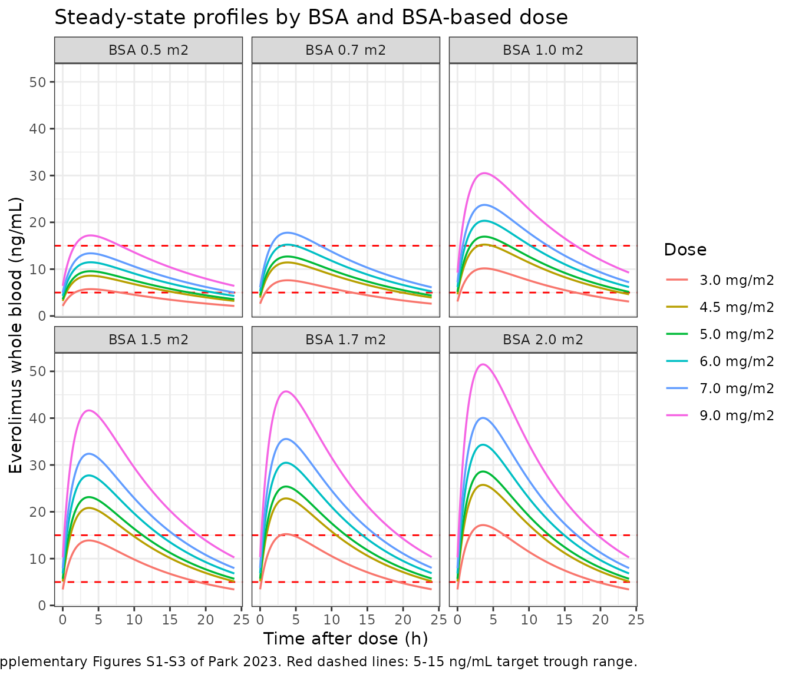
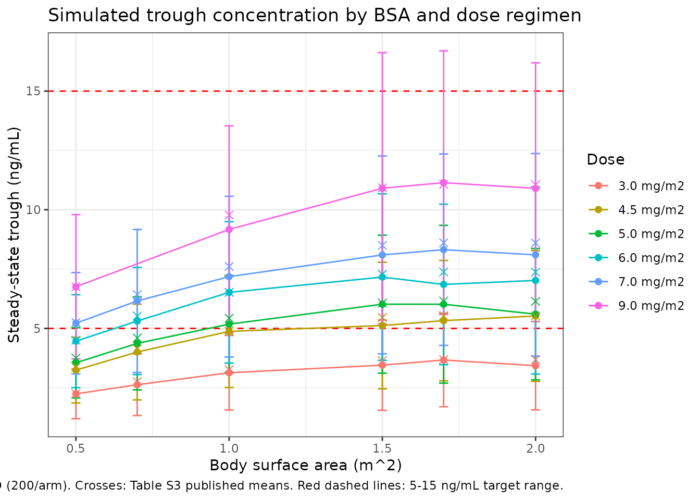

# Everolimus (Park 2023)

## Model and source

- Citation: Park J, Kim SH, Hahn J, Kang H-C, Lee S-G, Kim HD, Chang MJ.
  Population pharmacokinetics of everolimus in patients with seizures
  associated with focal cortical dysplasia. Front Pharmacol.
  2023;14:1197549. <doi:10.3389/fphar.2023.1197549>.
- Description: One-compartment population PK model with first-order
  absorption for everolimus in patients with refractory seizures
  associated with focal cortical dysplasia (FCD) type II. Apparent oral
  clearance rises LINEARLY (additively) with body surface area, CL/F =
  12.5 + 9.71 \* (BSA / 1.5) L/h, where 1.5 m2 is the cohort median BSA;
  the apparent central volume (293 L) and the absorption rate constant
  (0.585 /h) carry no covariate. Inter-individual variability on the
  absorption rate constant was fixed to zero by the authors. Everolimus
  is assayed in whole blood and concentrations are reported in ng/mL.
- Article: <https://doi.org/10.3389/fphar.2023.1197549>
- Supplement (Data Sheet 1: inclusion criteria, Table S1 co-medications,
  Table S2 simulation scenarios, Table S3 simulated troughs, Figures
  S1-S4):
  <https://www.frontiersin.org/articles/10.3389/fphar.2023.1197549/full#supplementary-material>

Park and colleagues developed the first population PK model for
everolimus in patients with refractory seizures associated with **focal
cortical dysplasia (FCD) type II**. FCD II shares its mTOR-pathway
biology with tuberous sclerosis complex (TSC) – somatic `TSC1` / `TSC2`
mutations were identified in FCD II patients – but everolimus had only
been labelled for TSC, and no dosing regimen had been established for
FCD. The paper’s purpose is to supply one.

The final model is a one-compartment model with first-order absorption
in which apparent oral clearance rises **linearly** with body surface
area:

``` math
\mathrm{CL/F} = 12.5 + 9.71 \times \frac{\mathrm{BSA}}{1.5}\ \mathrm{L/h},
\qquad V/F = 293\ \mathrm{L}, \qquad k_a = 0.585\ \mathrm{h^{-1}}
```

The additive (rather than multiplicative power) covariate form is
unusual and is the single most important thing to get right when reading
this model; the authors note it agrees with the FDA clinical
pharmacology review, in which everolimus clearance also increases
linearly with BSA.

## Population

The model was fit to **152 whole-blood everolimus concentrations from 22
patients** enrolled in a double-blinded, placebo-controlled, crossover
randomised trial at Severance Hospital, Seoul, Republic of Korea,
between September 2017 and May 2020 (Table 1; Methods 2.1-2.3).

Patients had FCD type II with refractory seizures despite more than two
antiepileptic drugs, at least three seizures per month over two months,
and no response to vagus nerve stimulation or dietary treatment. Median
age was 13.5 years (range 4-32), median body weight 50 kg (range 13-86),
and median BSA 1.5 m^2 (range 0.6-2.0); 9 of 22 patients (40.9%) were
male. All patients continued at least one concomitant antiepileptic
drug, unchanged through the baseline and core phases.

Everolimus (Afinitor disperz, tablet for oral suspension) was given once
daily, starting at 4.5 mg/m^2/day and adjusted by therapeutic drug
monitoring in 2 mg steps toward a target trough of 5-15 ng/mL. Sampling
was sparse and predominantly trough-only, with additional 1-4 h
post-dose samples in the extension phase; the assay was HPLC-MS/MS on
**whole blood** (LLOQ 1.1 ng/mL). The sparse sampling is the authors’
stated reason for preferring a one-compartment structure over the
two-compartment models reported for everolimus elsewhere.

The same information is available programmatically via the model’s
`population` metadata:

``` r

pop <- rxode2::rxode(readModelDb("Park_2023_everolimus"))$population
#> ℹ parameter labels from comments will be replaced by 'label()'
str(pop, max.level = 1)
#> List of 16
#>  $ species       : chr "human"
#>  $ n_subjects    : int 22
#>  $ n_studies     : int 1
#>  $ n_observations: chr "152 everolimus whole-blood concentrations (Results 3.2)."
#>  $ age_range     : chr "4-32 years"
#>  $ age_median    : chr "13.5 years (IQR 12-17.75; Table 1)"
#>  $ weight_range  : chr "13-86 kg"
#>  $ weight_median : chr "50 kg (IQR 35.5-60; Table 1)"
#>  $ bsa_range     : chr "0.6-2 m^2"
#>  $ bsa_median    : chr "1.5 m^2 (IQR 1.23-1.7; Table 1)"
#>  $ sex_female_pct: num 59.1
#>  $ race_ethnicity: chr "Not reported. Single-centre Korean cohort (Severance Hospital, Seoul)."
#>  $ disease_state : chr "Focal cortical dysplasia (FCD) type II with refractory seizures despite more than two antiepileptic drugs; at l"| __truncated__
#>  $ dose_range    : chr "Everolimus (Afinitor disperz, tablet for oral suspension) once daily. Initial dose 4.5 mg/m2/day, then TDM-guid"| __truncated__
#>  $ regions       : chr "Republic of Korea (Severance Hospital, Seoul)."
#>  $ notes         : chr "Data from a double-blinded, placebo-controlled, crossover randomised clinical trial (IRB 4-2017-0299; additiona"| __truncated__
```

## Source trace

Every `ini()` entry in
`inst/modeldb/specificDrugs/Park_2023_everolimus.R` carries an in-file
comment naming its source location. They are collected here for review.

| Equation / parameter | Value | Source location |
|----|----|----|
| `lka` (ka) | 0.585 /h | Table 2, “Final model” column, KA (RSE 30%); restated in the Abstract (“TVKA = 0.585”) |
| `lcl` (BSA-independent CL term) | 12.5 L/h | Table 2, “Final model” column, CL (RSE 26%); Abstract (“TVCL = 12.5 + …”) |
| `e_bsa_cl` (linear BSA slope on CL) | 9.71 L/h | Table 2, “Final model” column, theta BSA on CL (RSE 33%); Abstract (“… + 9.71 x (BSA/1.5)”) |
| `lvc` (V/F) | 293 L | Table 2, “Final model” column, V (RSE 30%); Abstract (“TVV = 293”) |
| `etalcl` | 0.02729 (= 0.1652^2) | Table 2, “Final model” omega CL = 0.1652, a log-scale SD (see note below) |
| `etalvc` | 0.04339 (= 0.2083^2) | Table 2, “Final model” omega V = 0.2083, a log-scale SD (see note below) |
| `etalka` | `fixed(0)` | Results 3.2: “The inter-individual variability of the absorption rate (omega KA^2) was fixed as zero”; Discussion |
| `propSd` | 0.2943 | Table 2, “Final model” sigma proportional (RSE 14%); Results 3.2 (“best explained by the proportional error model”) |
| `TVCL = CL + theta_BSA * (BSA/1.5)` | n/a | Table 2 header equation; Abstract Results; Results 3.2 |
| Exponential IIV, `theta_i = theta_POP * exp(eta_i)` | n/a | Methods 2.4 |
| One-compartment, first-order absorption (ADVAN2 TRANS2) | n/a | Methods 2.4; Results 3.2; Conclusion |
| Normalising constant 1.5 m^2 | n/a | Table 1 (cohort median BSA); Methods 2.4 (“centered on their median values”) |
| 1000 ng/mg unit conversion | n/a | Derived: doses are mg and V is L, so `central/vc` is mg/L; the paper reports ng/mL |

**Are Table 2’s omega and sigma variances or standard deviations?** They
are standard deviations, and the paper proves it itself. Results 3.2
reports the **base-model** variances as `omega_CL^2 = 0.0409` and
`omega_V^2 = 0.0602`, while the corresponding base-model cells in Table
2 read 0.2022 and 0.2454 – exactly `sqrt(0.0409)` and `sqrt(0.0602)`.
The final-model cells (0.1652, 0.2083) are therefore also SDs, and are
squared in `ini()` to the variance scale nlmixr2 expects. The `sigma`
row sits in the same column under the same convention, so 0.2943 is a
29.4% proportional error. The stochastic check below confirms this
independently: reading these cells as variances would put the simulated
trough CV far above the ~50% that Supplementary Table S3 reports.

``` r

ui <- rxode2::rxode(readModelDb("Park_2023_everolimus"))
#> ℹ parameter labels from comments will be replaced by 'label()'
ui$iniDf |>
  dplyr::select(name, est, fix, label) |>
  dplyr::rename("Parameter" = name, "Estimate" = est, "Fixed" = fix, "Label" = label) |>
  knitr::kable(digits = 5, caption = "Packaged ini() values for Park_2023_everolimus.")
```

| Parameter | Estimate | Fixed | Label |
|:---|---:|:---|:---|
| lka | -0.53614 | FALSE | Absorption rate constant Ka (1/h) |
| lcl | 2.52573 | FALSE | BSA-independent component of apparent oral clearance CL/F (L/h) |
| e_bsa_cl | 9.71000 | FALSE | Linear slope of BSA on apparent oral clearance CL/F, per unit BSA/1.5 (L/h) |
| lvc | 5.68017 | FALSE | Apparent central volume of distribution V/F (L) |
| propSd | 0.29430 | FALSE | Proportional residual error (fraction) |
| etalcl | 0.02729 | FALSE | Table 2 final omega_CL = 0.1652 (log-scale SD) -\> variance 0.1652^2 = 0.02729 |
| etalvc | 0.04339 | FALSE | Table 2 final omega_V = 0.2083 (log-scale SD) -\> variance 0.2083^2 = 0.04339 |
| etalka | 0.00000 | TRUE | Results 3.2 / Discussion: no absorption-phase information in the sparse data |

Packaged ini() values for Park_2023_everolimus. {.table}

## The linear BSA-clearance relationship

The defining feature of this model is that BSA enters clearance
additively. The check below confirms the packaged model reproduces the
published equation exactly at every BSA the authors simulated.

``` r

mod <- readModelDb("Park_2023_everolimus")

bsa_grid <- c(0.5, 0.7, 1, 1.5, 1.7, 2)

# Solve the typical-value model once per BSA and read back the derived `cl`.
cl_check <- lapply(bsa_grid, function(b) {
  ev <- rxode2::et(amt = 1, cmt = "depot") |>
    rxode2::et(0, cmt = "central")
  d <- as.data.frame(ev)
  d$BSA <- b
  s <- rxode2::rxSolve(rxode2::zeroRe(mod), d, addDosing = FALSE)
  data.frame(BSA = b, cl_model = s$cl[1], vc_model = s$vc[1], ka_model = s$ka[1])
}) |>
  dplyr::bind_rows() |>
  dplyr::mutate(
    cl_published = 12.5 + 9.71 * (BSA / 1.5),
    pct_diff     = 100 * (cl_model - cl_published) / cl_published
  )
#> ℹ parameter labels from comments will be replaced by 'label()'
#> ℹ omega/sigma items treated as zero: 'etalcl', 'etalvc', 'etalka'
#> ℹ parameter labels from comments will be replaced by 'label()'
#> ℹ omega/sigma items treated as zero: 'etalcl', 'etalvc', 'etalka'
#> ℹ parameter labels from comments will be replaced by 'label()'
#> ℹ omega/sigma items treated as zero: 'etalcl', 'etalvc', 'etalka'
#> ℹ parameter labels from comments will be replaced by 'label()'
#> ℹ omega/sigma items treated as zero: 'etalcl', 'etalvc', 'etalka'
#> ℹ parameter labels from comments will be replaced by 'label()'
#> ℹ omega/sigma items treated as zero: 'etalcl', 'etalvc', 'etalka'
#> ℹ parameter labels from comments will be replaced by 'label()'
#> ℹ omega/sigma items treated as zero: 'etalcl', 'etalvc', 'etalka'

cl_check |>
  dplyr::select(BSA, cl_model, cl_published, pct_diff, vc_model, ka_model) |>
  dplyr::rename(
    "BSA (m^2)"           = BSA,
    "CL/F model (L/h)"    = cl_model,
    "CL/F published (L/h)" = cl_published,
    "% diff"              = pct_diff,
    "V/F (L)"             = vc_model,
    "ka (1/h)"            = ka_model
  ) |>
  knitr::kable(digits = 4, caption = "Packaged CL/F against the published equation CL/F = 12.5 + 9.71 x (BSA/1.5).")
```

| BSA (m^2) | CL/F model (L/h) | CL/F published (L/h) | % diff | V/F (L) | ka (1/h) |
|----------:|-----------------:|---------------------:|-------:|--------:|---------:|
|       0.5 |          15.7367 |              15.7367 |      0 |     293 |    0.585 |
|       0.7 |          17.0313 |              17.0313 |      0 |     293 |    0.585 |
|       1.0 |          18.9733 |              18.9733 |      0 |     293 |    0.585 |
|       1.5 |          22.2100 |              22.2100 |      0 |     293 |    0.585 |
|       1.7 |          23.5047 |              23.5047 |      0 |     293 |    0.585 |
|       2.0 |          25.4467 |              25.4467 |      0 |     293 |    0.585 |

Packaged CL/F against the published equation CL/F = 12.5 + 9.71 x
(BSA/1.5). {.table}

``` r


# Deterministic: no random draws, so an exact bound is correct here.
stopifnot(
  max(abs(cl_check$pct_diff)) < 1e-8,
  # V/F and ka carry no covariate.
  max(abs(cl_check$vc_model - 293)) < 1e-8,
  max(abs(cl_check$ka_model - 0.585)) < 1e-8
)
```

At the cohort median BSA of 1.5 m^2, CL/F = 12.5 + 9.71 = 22.21 L/h.
Note that clearance rises only about 1.6-fold across the entire observed
BSA range (0.6 to 2.0 m^2) – far less than proportionally – which is
exactly why a mg/m^2 dose (which rises 3.3-fold across the same range)
overshoots in large patients and undershoots in small ones, and is the
mechanism behind the paper’s dose recommendations.

## Steady-state profiles (replicates Supplementary Figures S1-S3)

The authors simulated 35 BSA x dose scenarios (Supplementary Table S2)
for 14 days of once-daily dosing, which they state is enough to reach
steady state. With a terminal half-life near 9 h that is amply true, so
the deterministic profiles below are generated with rxode2’s
steady-state dosing flag (`ss = 1`), which is exact rather than
approximately converged.

``` r

# Supplementary Table S2: the authors' 35 scenarios (BSA 0.7 was explored only
# at 3, 4.5, 5, 6 and 7 mg/m^2 -- there is no 9 mg/m^2 arm at BSA 0.7).
scenarios <- tidyr::expand_grid(
  BSA        = c(0.5, 0.7, 1, 1.5, 1.7, 2),
  dose_mgm2  = c(3, 4.5, 5, 6, 7, 9)
) |>
  dplyr::filter(!(BSA == 0.7 & dose_mgm2 == 9)) |>
  dplyr::mutate(
    amt      = dose_mgm2 * BSA,
    scenario = sprintf("BSA %.1f / %s mg/m2", BSA, format(dose_mgm2, trim = TRUE)),
    id       = dplyr::row_number()
  )

stopifnot(nrow(scenarios) == 35)

knitr::kable(
  scenarios |>
    dplyr::select(id, BSA, dose_mgm2, amt) |>
    dplyr::rename("Scenario" = id, "BSA (m^2)" = BSA,
                  "Dose (mg/m^2)" = dose_mgm2, "Actual amount (mg)" = amt),
  digits = 3,
  caption = "Replicates Supplementary Table S2 of Park 2023 (35 simulation scenarios)."
)
```

| Scenario | BSA (m^2) | Dose (mg/m^2) | Actual amount (mg) |
|---------:|----------:|--------------:|-------------------:|
|        1 |       0.5 |           3.0 |               1.50 |
|        2 |       0.5 |           4.5 |               2.25 |
|        3 |       0.5 |           5.0 |               2.50 |
|        4 |       0.5 |           6.0 |               3.00 |
|        5 |       0.5 |           7.0 |               3.50 |
|        6 |       0.5 |           9.0 |               4.50 |
|        7 |       0.7 |           3.0 |               2.10 |
|        8 |       0.7 |           4.5 |               3.15 |
|        9 |       0.7 |           5.0 |               3.50 |
|       10 |       0.7 |           6.0 |               4.20 |
|       11 |       0.7 |           7.0 |               4.90 |
|       12 |       1.0 |           3.0 |               3.00 |
|       13 |       1.0 |           4.5 |               4.50 |
|       14 |       1.0 |           5.0 |               5.00 |
|       15 |       1.0 |           6.0 |               6.00 |
|       16 |       1.0 |           7.0 |               7.00 |
|       17 |       1.0 |           9.0 |               9.00 |
|       18 |       1.5 |           3.0 |               4.50 |
|       19 |       1.5 |           4.5 |               6.75 |
|       20 |       1.5 |           5.0 |               7.50 |
|       21 |       1.5 |           6.0 |               9.00 |
|       22 |       1.5 |           7.0 |              10.50 |
|       23 |       1.5 |           9.0 |              13.50 |
|       24 |       1.7 |           3.0 |               5.10 |
|       25 |       1.7 |           4.5 |               7.65 |
|       26 |       1.7 |           5.0 |               8.50 |
|       27 |       1.7 |           6.0 |              10.20 |
|       28 |       1.7 |           7.0 |              11.90 |
|       29 |       1.7 |           9.0 |              15.30 |
|       30 |       2.0 |           3.0 |               6.00 |
|       31 |       2.0 |           4.5 |               9.00 |
|       32 |       2.0 |           5.0 |              10.00 |
|       33 |       2.0 |           6.0 |              12.00 |
|       34 |       2.0 |           7.0 |              14.00 |
|       35 |       2.0 |           9.0 |              18.00 |

Replicates Supplementary Table S2 of Park 2023 (35 simulation
scenarios). {.table}

``` r

# One deterministic profile per scenario over a single steady-state interval.
# Observations are placed on the ODE state `central`; rxode2 returns the
# algebraic observable Cc as a column at those rows.
grid_h <- seq(0, 24, by = 0.1)

events_typ <- scenarios |>
  dplyr::group_by(id) |>
  dplyr::reframe(
    dplyr::bind_rows(
      data.frame(time = 0,      evid = 1L, amt = amt, cmt = "depot",
                 ii = 24, ss = 1L),
      data.frame(time = grid_h, evid = 0L, amt = NA_real_, cmt = "central",
                 ii = 0,  ss = 0L)
    )
  ) |>
  dplyr::left_join(scenarios |> dplyr::select(id, BSA, dose_mgm2, scenario),
                   by = "id") |>
  dplyr::arrange(id, time, dplyr::desc(evid))

sim_typ <- rxode2::rxSolve(
  rxode2::zeroRe(mod), events_typ,
  keep = c("BSA", "dose_mgm2", "scenario"), addDosing = FALSE
) |>
  as.data.frame()
#> ℹ parameter labels from comments will be replaced by 'label()'
#> ℹ omega/sigma items treated as zero: 'etalcl', 'etalvc', 'etalka'
#> Warning: multi-subject simulation without without 'omega'

stopifnot(nrow(sim_typ) > 0, !anyNA(sim_typ$Cc), all(sim_typ$Cc >= 0))
```

``` r

# Replicates Supplementary Figures S1-S3 of Park 2023: steady-state
# concentration-time course by BSA and BSA-based dose regimen.
sim_typ |>
  dplyr::mutate(dose_lab = factor(sprintf("%s mg/m2",
                                          format(dose_mgm2, trim = TRUE)),
                                  levels = sprintf("%s mg/m2",
                                                   format(c(3, 4.5, 5, 6, 7, 9),
                                                          trim = TRUE)))) |>
  ggplot(aes(time, Cc, colour = dose_lab)) +
  geom_hline(yintercept = c(5, 15), linetype = "dashed", colour = "red") +
  geom_line(linewidth = 0.6) +
  facet_wrap(~ sprintf("BSA %.1f m2", BSA)) +
  labs(
    x = "Time after dose (h)", y = "Everolimus whole blood (ng/mL)",
    colour = "Dose",
    title = "Steady-state profiles by BSA and BSA-based dose",
    caption = paste("Replicates Supplementary Figures S1-S3 of Park 2023.",
                    "Red dashed lines: 5-15 ng/mL target trough range.")
  ) +
  theme_bw()
```



### The solved profile against its own closed form

For a one-compartment model with first-order absorption and complete
bioavailability, the steady-state concentration has a closed form.
Comparing the ODE solution against it is an internal identity check with
no random draws, so a tight bound is the correct assertion.

``` r

ss_conc <- function(t, amt, bsa, ka = 0.585, vc = 293, tau = 24) {
  cl  <- 12.5 + 9.71 * (bsa / 1.5)
  kel <- cl / vc
  1000 * amt * ka / (vc * (ka - kel)) *
    (exp(-kel * t) / (1 - exp(-kel * tau)) -
       exp(-ka * t) / (1 - exp(-ka * tau)))
}

cf <- sim_typ |>
  dplyr::mutate(
    Cc_closed = ss_conc(time, dose_mgm2 * BSA, BSA),
    pct_diff  = 100 * (Cc - Cc_closed) / Cc_closed
  )

cat(sprintf("max |%% difference| between ODE solve and closed form: %.3g%%\n",
            max(abs(cf$pct_diff))))
#> max |% difference| between ODE solve and closed form: 0.000125%

# Pure numerical error between two evaluations of the same parameters; no
# cohort is drawn, so this bound is deterministic and must stay tight.
stopifnot(max(abs(cf$pct_diff)) < 1e-3)
```

## PKNCA validation

Park 2023 reports **no** NCA parameters – no Cmax, Tmax, AUC or
half-life table appears anywhere in the paper or supplement, because the
analysis is a model-based TDM study rather than a dedicated PK study.
There is therefore no published NCA table to compare against, and
[`ncaComparisonTable()`](https://nlmixr2.github.io/nlmixr2lib/reference/ncaComparisonTable.md)
is not applicable here.

Instead, NCA is run on the deterministic steady-state profiles and
checked against the **analytical identities the model itself implies**.
This is the stronger check in this situation: each identity is an exact
consequence of the structural model and the packaged parameter values,
so a transcription error in any of CL, V, ka, the BSA equation or the
unit conversion breaks it.

``` r

sim_nca <- sim_typ |>
  dplyr::filter(!is.na(Cc)) |>
  dplyr::select(id, time, Cc, scenario)

conc_obj <- PKNCA::PKNCAconc(sim_nca, Cc ~ time | scenario + id,
                             concu = "ng/mL", timeu = "h")

dose_df <- scenarios |>
  dplyr::transmute(id, time = 0, amt, scenario)

dose_obj <- PKNCA::PKNCAdose(dose_df, amt ~ time | scenario + id,
                             doseu = "mg")

# Steady state over one dosing interval (PKNCA recipe 3).
intervals <- data.frame(
  start     = 0,
  end       = 24,
  cmax      = TRUE,
  tmax      = TRUE,
  cmin      = TRUE,
  auclast   = TRUE,
  cav       = TRUE,
  half.life = TRUE
)

nca_res <- PKNCA::pk.nca(PKNCA::PKNCAdata(conc_obj, dose_obj,
                                          intervals = intervals))

nca_wide <- as.data.frame(nca_res) |>
  dplyr::select(id, scenario, PPTESTCD, PPORRES) |>
  tidyr::pivot_wider(names_from = PPTESTCD, values_from = PPORRES) |>
  dplyr::left_join(scenarios |> dplyr::select(id, BSA, dose_mgm2, amt), by = "id")

stopifnot(nrow(nca_wide) == 35)
```

``` r

identity_check <- nca_wide |>
  dplyr::mutate(
    cl_pub      = 12.5 + 9.71 * (BSA / 1.5),
    kel_pub     = cl_pub / 293,
    # At steady state with F = 1, AUC over one interval is exactly Dose / CL.
    # Dose is mg and CL is L/h, so Dose/CL is mg*h/L = 1000 ng*h/mL.
    auc_ident   = 1000 * amt / cl_pub,
    # Cavg = AUCtau / tau.
    cav_ident   = auc_ident / 24,
    # ka >> kel here, so the terminal slope is kel and t1/2 = ln(2)/kel.
    thalf_ident = log(2) / kel_pub,
    auc_pct     = 100 * (auclast   - auc_ident)   / auc_ident,
    cav_pct     = 100 * (cav       - cav_ident)   / cav_ident,
    thalf_pct   = 100 * (half.life - thalf_ident) / thalf_ident
  )

identity_check |>
  dplyr::select(scenario, auclast, auc_ident, auc_pct,
                cav, cav_ident, cav_pct, half.life, thalf_ident, thalf_pct) |>
  dplyr::rename(
    "Scenario"                 = scenario,
    "AUCtau PKNCA (ng*h/mL)"   = auclast,
    "AUCtau = 1000*D/CL"       = auc_ident,
    "% diff (AUC)"             = auc_pct,
    "Cavg PKNCA (ng/mL)"       = cav,
    "Cavg = AUCtau/24"         = cav_ident,
    "% diff (Cavg)"            = cav_pct,
    "t1/2 PKNCA (h)"           = half.life,
    "t1/2 = ln2/kel (h)"       = thalf_ident,
    "% diff (t1/2)"            = thalf_pct
  ) |>
  knitr::kable(digits = 3,
               caption = paste("Steady-state PKNCA output against the analytical",
                               "identities implied by the packaged model.",
                               "Park 2023 reports no NCA values, so these are",
                               "internal-consistency checks, not a comparison",
                               "against published NCA."))
```

| Scenario | AUCtau PKNCA (ng\*h/mL) | AUCtau = 1000\*D/CL | % diff (AUC) | Cavg PKNCA (ng/mL) | Cavg = AUCtau/24 | % diff (Cavg) | t1/2 PKNCA (h) | t1/2 = ln2/kel (h) | % diff (t1/2) |
|:---|---:|---:|---:|---:|---:|---:|---:|---:|---:|
| BSA 0.5 / 3.0 mg/m2 | 95.316 | 95.319 | -0.003 | 3.972 | 3.972 | -0.003 | 13.033 | 12.906 | 0.984 |
| BSA 0.5 / 4.5 mg/m2 | 142.974 | 142.978 | -0.003 | 5.957 | 5.957 | -0.003 | 13.033 | 12.906 | 0.984 |
| BSA 0.5 / 5.0 mg/m2 | 158.860 | 158.865 | -0.003 | 6.619 | 6.619 | -0.003 | 13.033 | 12.906 | 0.984 |
| BSA 0.5 / 6.0 mg/m2 | 190.632 | 190.638 | -0.003 | 7.943 | 7.943 | -0.003 | 13.033 | 12.906 | 0.984 |
| BSA 0.5 / 7.0 mg/m2 | 222.404 | 222.411 | -0.003 | 9.267 | 9.267 | -0.003 | 13.033 | 12.906 | 0.984 |
| BSA 0.5 / 9.0 mg/m2 | 285.948 | 285.956 | -0.003 | 11.915 | 11.915 | -0.003 | 13.033 | 12.906 | 0.984 |
| BSA 0.7 / 3.0 mg/m2 | 123.298 | 123.302 | -0.003 | 5.137 | 5.138 | -0.003 | 12.047 | 11.925 | 1.023 |
| BSA 0.7 / 4.5 mg/m2 | 184.948 | 184.953 | -0.003 | 7.706 | 7.706 | -0.003 | 12.047 | 11.925 | 1.023 |
| BSA 0.7 / 5.0 mg/m2 | 205.497 | 205.504 | -0.003 | 8.562 | 8.563 | -0.003 | 12.047 | 11.925 | 1.023 |
| BSA 0.7 / 6.0 mg/m2 | 246.597 | 246.604 | -0.003 | 10.275 | 10.275 | -0.003 | 12.047 | 11.925 | 1.023 |
| BSA 0.7 / 7.0 mg/m2 | 287.696 | 287.705 | -0.003 | 11.987 | 11.988 | -0.003 | 12.047 | 11.925 | 1.023 |
| BSA 1.0 / 3.0 mg/m2 | 158.111 | 158.117 | -0.003 | 6.588 | 6.588 | -0.003 | 10.813 | 10.704 | 1.018 |
| BSA 1.0 / 4.5 mg/m2 | 237.167 | 237.175 | -0.003 | 9.882 | 9.882 | -0.003 | 10.813 | 10.704 | 1.018 |
| BSA 1.0 / 5.0 mg/m2 | 263.519 | 263.528 | -0.003 | 10.980 | 10.980 | -0.003 | 10.813 | 10.704 | 1.018 |
| BSA 1.0 / 6.0 mg/m2 | 316.223 | 316.233 | -0.003 | 13.176 | 13.176 | -0.003 | 10.813 | 10.704 | 1.018 |
| BSA 1.0 / 7.0 mg/m2 | 368.926 | 368.939 | -0.003 | 15.372 | 15.372 | -0.003 | 10.813 | 10.704 | 1.018 |
| BSA 1.0 / 9.0 mg/m2 | 474.334 | 474.350 | -0.003 | 19.764 | 19.765 | -0.003 | 10.813 | 10.704 | 1.018 |
| BSA 1.5 / 3.0 mg/m2 | 202.603 | 202.611 | -0.004 | 8.442 | 8.442 | -0.004 | 9.237 | 9.144 | 1.014 |
| BSA 1.5 / 4.5 mg/m2 | 303.905 | 303.917 | -0.004 | 12.663 | 12.663 | -0.004 | 9.237 | 9.144 | 1.014 |
| BSA 1.5 / 5.0 mg/m2 | 337.672 | 337.686 | -0.004 | 14.070 | 14.070 | -0.004 | 9.237 | 9.144 | 1.014 |
| BSA 1.5 / 6.0 mg/m2 | 405.207 | 405.223 | -0.004 | 16.884 | 16.884 | -0.004 | 9.237 | 9.144 | 1.014 |
| BSA 1.5 / 7.0 mg/m2 | 472.741 | 472.760 | -0.004 | 19.698 | 19.698 | -0.004 | 9.237 | 9.144 | 1.014 |
| BSA 1.5 / 9.0 mg/m2 | 607.810 | 607.834 | -0.004 | 25.325 | 25.326 | -0.004 | 9.237 | 9.144 | 1.014 |
| BSA 1.7 / 3.0 mg/m2 | 216.969 | 216.978 | -0.004 | 9.040 | 9.041 | -0.004 | 8.732 | 8.641 | 1.057 |
| BSA 1.7 / 4.5 mg/m2 | 325.453 | 325.467 | -0.004 | 13.561 | 13.561 | -0.004 | 8.732 | 8.641 | 1.057 |
| BSA 1.7 / 5.0 mg/m2 | 361.615 | 361.630 | -0.004 | 15.067 | 15.068 | -0.004 | 8.732 | 8.641 | 1.057 |
| BSA 1.7 / 6.0 mg/m2 | 433.938 | 433.956 | -0.004 | 18.081 | 18.082 | -0.004 | 8.732 | 8.641 | 1.057 |
| BSA 1.7 / 7.0 mg/m2 | 506.261 | 506.282 | -0.004 | 21.094 | 21.095 | -0.004 | 8.732 | 8.641 | 1.057 |
| BSA 1.7 / 9.0 mg/m2 | 650.907 | 650.935 | -0.004 | 27.121 | 27.122 | -0.004 | 8.732 | 8.641 | 1.057 |
| BSA 2.0 / 3.0 mg/m2 | 235.776 | 235.787 | -0.005 | 9.824 | 9.824 | -0.005 | 8.065 | 7.981 | 1.057 |
| BSA 2.0 / 4.5 mg/m2 | 353.665 | 353.681 | -0.005 | 14.736 | 14.737 | -0.005 | 8.065 | 7.981 | 1.057 |
| BSA 2.0 / 5.0 mg/m2 | 392.961 | 392.979 | -0.005 | 16.373 | 16.374 | -0.005 | 8.065 | 7.981 | 1.057 |
| BSA 2.0 / 6.0 mg/m2 | 471.553 | 471.575 | -0.005 | 19.648 | 19.649 | -0.005 | 8.065 | 7.981 | 1.057 |
| BSA 2.0 / 7.0 mg/m2 | 550.145 | 550.170 | -0.005 | 22.923 | 22.924 | -0.005 | 8.065 | 7.981 | 1.057 |
| BSA 2.0 / 9.0 mg/m2 | 707.329 | 707.362 | -0.005 | 29.472 | 29.473 | -0.005 | 8.065 | 7.981 | 1.057 |

Steady-state PKNCA output against the analytical identities implied by
the packaged model. Park 2023 reports no NCA values, so these are
internal-consistency checks, not a comparison against published NCA.
{.table}

``` r


# All three are deterministic identities evaluated on a typical-value profile
# with no IIV and no residual error, so no cohort is drawn and these bounds
# stay tight.
#
# The half-life bound is 2% rather than 0.1% for a understood reason, not to
# make it pass. PKNCA selects its lambda-z window automatically and starts it
# at about 7 h (see lambda.z.time.first below), where the absorption term
# exp(-ka*t) = exp(-0.585*7) still contributes ~1.7% of the signal. Because
# that term is subtracted, the profile is slightly concave over the fitted
# window and the regression slope comes out marginally shallower than kel, so
# t1/2 reads systematically ~1% high (realised 0.98% to 1.06% across all 35
# scenarios, r-squared 0.9999 throughout). A mis-transcribed CL or V moves kel
# -- and hence t1/2 -- by tens of percent, so a 2% bound still goes red.
stopifnot(
  !anyNA(identity_check$auclast),
  !anyNA(identity_check$half.life),
  max(abs(identity_check$auc_pct))   < 0.1,
  max(abs(identity_check$cav_pct))   < 0.1,
  max(abs(identity_check$thalf_pct)) < 2
)
```

``` r

# The trough (concentration at the end of the interval) is the quantity the
# paper actually reports. Read it from the profile at t = 24 h and check it
# against the closed form.
trough_typ <- sim_typ |>
  dplyr::filter(time == 24) |>
  dplyr::mutate(
    trough_closed = ss_conc(24, dose_mgm2 * BSA, BSA),
    pct_diff      = 100 * (Cc - trough_closed) / trough_closed
  )

stopifnot(nrow(trough_typ) == 35, max(abs(trough_typ$pct_diff)) < 1e-3)

cat(sprintf("Typical-value trough at BSA 1.5 m2 / 4.5 mg/m2: %.3f ng/mL\n",
            trough_typ$Cc[trough_typ$BSA == 1.5 & trough_typ$dose_mgm2 == 4.5]))
#> Typical-value trough at BSA 1.5 m2 / 4.5 mg/m2: 5.122 ng/mL
```

## Reproducing Supplementary Table S3 and Figure 3

Table S3 reports, for each of the 35 scenarios, the **mean** and
**standard deviation** of the simulated steady-state trough across 1,000
subjects, plus the percentage of subjects inside the 5-15 ng/mL target
range. Those means are population means over the log-normal IIV, so they
sit above the typical-value trough; reproducing them exercises the IIV
and residual-error parameters as well as the structural model.

``` r

# `set.seed()` seeds R's RNG. It does NOT seed rxode2's simulation RNG, and
# rxode2's streams are partitioned per solver thread -- so this cohort is
# reproducible on this machine and different on a machine with a different
# thread count. Every assertion below is written to hold for ANY cohort the
# model can produce (see pattern 12 of the skill's known-failure catalogue).
set.seed(20231124)
rxode2::rxSetSeed(20231124)

n_per_arm <- 200L  # 200 per arm is the cap; the paper used 1,000.

events_sim <- scenarios |>
  dplyr::group_by(id) |>
  dplyr::reframe(
    subj = seq_len(n_per_arm),
    amt = amt, BSA = BSA, dose_mgm2 = dose_mgm2, scenario = scenario
  ) |>
  dplyr::mutate(sid = (id - 1L) * n_per_arm + subj) |>
  dplyr::group_by(sid) |>
  dplyr::reframe(
    BSA = BSA, dose_mgm2 = dose_mgm2, scenario = scenario,
    dplyr::bind_rows(
      data.frame(time = 0,  evid = 1L, amt = amt, cmt = "depot", ii = 24, ss = 1L),
      data.frame(time = 24, evid = 0L, amt = NA_real_, cmt = "central", ii = 0, ss = 0L)
    )
  ) |>
  dplyr::rename(id = sid) |>
  dplyr::arrange(id, time, dplyr::desc(evid))

# IDs must be disjoint across arms; duplicates silently merge into one subject.
stopifnot(
  !anyDuplicated(unique(events_sim[, c("id", "time", "evid")])),
  dplyr::n_distinct(events_sim$id) == 35L * n_per_arm
)
```

``` r

sim_stoch <- rxode2::rxSolve(
  mod, events_sim,
  keep = c("BSA", "dose_mgm2", "scenario"), addDosing = FALSE
) |>
  as.data.frame()
#> ℹ parameter labels from comments will be replaced by 'label()'
#> ℹ omega/sigma items treated as zero: 'etalka'

# `Cc` is the individual prediction (no residual error); `sim` carries the
# proportional residual error and is therefore the analogue of the "simulated
# concentration" the paper summarises.
trough_stoch <- sim_stoch |>
  dplyr::filter(time == 24) |>
  dplyr::group_by(scenario, BSA, dose_mgm2) |>
  dplyr::summarise(
    sim_mean = mean(sim),
    sim_sd   = sd(sim),
    sim_pct  = 100 * mean(sim >= 5 & sim <= 15),
    n        = dplyr::n(),
    .groups  = "drop"
  )

stopifnot(nrow(trough_stoch) == 35, all(trough_stoch$n == n_per_arm))
```

``` r

# Supplementary Table S3 of Park 2023, transcribed.
published_s3 <- tibble::tribble(
  ~BSA, ~dose_mgm2, ~pub_mean, ~pub_sd, ~pub_pct,
  0.5,  3,    2.25,  1.00,  1.2,
  0.5,  4.5,  3.37,  1.50, 13.0,
  0.5,  5,    3.75,  1.66, 20.8,
  0.5,  6,    4.50,  2.00, 37.3,
  0.5,  7,    5.25,  2.33, 50.5,
  0.5,  9,    6.75,  3.00, 70.4,
  0.7,  3,    2.76,  1.25,  4.6,
  0.7,  4.5,  4.14,  1.88, 28.4,
  0.7,  5,    4.60,  2.09, 39.1,
  0.7,  6,    5.52,  2.51, 53.0,
  0.7,  7,    6.43,  2.93, 65.7,
  1,    3,    3.26,  1.54, 12.4,
  1,    4.5,  4.89,  2.31, 44.9,
  1,    5,    5.43,  2.57, 51.8,
  1,    6,    6.52,  3.08, 66.2,
  1,    7,    7.61,  3.59, 77.7,
  1,    9,    9.78,  4.62, 98.6,
  1.5,  3,    3.64,  1.83, 20.8,
  1.5,  4.5,  5.46,  2.75, 51.3,
  1.5,  5,    6.07,  3.05, 59.1,
  1.5,  6,    7.28,  3.66, 73.5,
  1.5,  7,    8.50,  4.27, 85.8,
  1.5,  9,   10.93,  5.49,  8.7,
  1.7,  3,    3.69,  1.90, 21.7,
  1.7,  4.5,  5.53,  2.86, 52.1,
  1.7,  5,    6.15,  3.17, 59.8,
  1.7,  6,    7.38,  3.81, 73.4,
  1.7,  7,    8.61,  4.44, 85.4,
  1.7,  9,   11.07,  5.71,  9.3,
  2,    3,    3.69,  1.98, 22.2,
  2,    4.5,  5.53,  2.96, 51.3,
  2,    5,    6.14,  3.29, 59.4,
  2,    6,    7.37,  3.95, 73.1,
  2,    7,    8.60,  4.61, 86.0,
  2,    9,   11.06,  5.93,  8.1
)

stopifnot(nrow(published_s3) == 35)

cmp_s3 <- trough_stoch |>
  dplyr::inner_join(published_s3, by = c("BSA", "dose_mgm2")) |>
  dplyr::mutate(
    mean_pct_diff = 100 * (sim_mean - pub_mean) / pub_mean,
    sd_pct_diff   = 100 * (sim_sd   - pub_sd)   / pub_sd
  ) |>
  dplyr::arrange(BSA, dose_mgm2)

stopifnot(nrow(cmp_s3) == 35)

cmp_s3 |>
  dplyr::select(BSA, dose_mgm2, sim_mean, pub_mean, mean_pct_diff,
                sim_sd, pub_sd, sd_pct_diff) |>
  dplyr::rename(
    "BSA (m^2)"             = BSA,
    "Dose (mg/m^2)"         = dose_mgm2,
    "Mean trough simulated" = sim_mean,
    "Mean trough Table S3"  = pub_mean,
    "% diff (mean)"         = mean_pct_diff,
    "SD simulated"          = sim_sd,
    "SD Table S3"           = pub_sd,
    "% diff (SD)"           = sd_pct_diff
  ) |>
  knitr::kable(digits = 2,
               caption = paste("Simulated steady-state trough (200/arm) against",
                               "Supplementary Table S3 of Park 2023 (1,000/arm).",
                               "Concentrations in ng/mL."))
```

| BSA (m^2) | Dose (mg/m^2) | Mean trough simulated | Mean trough Table S3 | % diff (mean) | SD simulated | SD Table S3 | % diff (SD) |
|---:|---:|---:|---:|---:|---:|---:|---:|
| 0.5 | 3.0 | 2.24 | 2.25 | -0.34 | 1.05 | 1.00 | 4.75 |
| 0.5 | 4.5 | 3.24 | 3.37 | -3.77 | 1.38 | 1.50 | -7.76 |
| 0.5 | 5.0 | 3.55 | 3.75 | -5.27 | 1.48 | 1.66 | -10.74 |
| 0.5 | 6.0 | 4.46 | 4.50 | -0.83 | 1.96 | 2.00 | -2.11 |
| 0.5 | 7.0 | 5.22 | 5.25 | -0.60 | 2.14 | 2.33 | -8.36 |
| 0.5 | 9.0 | 6.76 | 6.75 | 0.10 | 3.04 | 3.00 | 1.30 |
| 0.7 | 3.0 | 2.63 | 2.76 | -4.77 | 1.30 | 1.25 | 3.85 |
| 0.7 | 4.5 | 4.01 | 4.14 | -3.26 | 2.02 | 1.88 | 7.32 |
| 0.7 | 5.0 | 4.37 | 4.60 | -4.99 | 1.96 | 2.09 | -6.22 |
| 0.7 | 6.0 | 5.31 | 5.52 | -3.79 | 2.26 | 2.51 | -10.11 |
| 0.7 | 7.0 | 6.16 | 6.43 | -4.25 | 3.01 | 2.93 | 2.84 |
| 1.0 | 3.0 | 3.13 | 3.26 | -3.90 | 1.57 | 1.54 | 1.94 |
| 1.0 | 4.5 | 4.87 | 4.89 | -0.31 | 2.36 | 2.31 | 2.21 |
| 1.0 | 5.0 | 5.18 | 5.43 | -4.61 | 2.03 | 2.57 | -21.16 |
| 1.0 | 6.0 | 6.52 | 6.52 | -0.01 | 2.98 | 3.08 | -3.27 |
| 1.0 | 7.0 | 7.18 | 7.61 | -5.63 | 3.39 | 3.59 | -5.68 |
| 1.0 | 9.0 | 9.17 | 9.78 | -6.22 | 4.36 | 4.62 | -5.55 |
| 1.5 | 3.0 | 3.45 | 3.64 | -5.18 | 1.90 | 1.83 | 3.96 |
| 1.5 | 4.5 | 5.12 | 5.46 | -6.19 | 2.67 | 2.75 | -3.06 |
| 1.5 | 5.0 | 6.02 | 6.07 | -0.82 | 2.91 | 3.05 | -4.67 |
| 1.5 | 6.0 | 7.16 | 7.28 | -1.62 | 3.51 | 3.66 | -4.14 |
| 1.5 | 7.0 | 8.10 | 8.50 | -4.75 | 4.17 | 4.27 | -2.42 |
| 1.5 | 9.0 | 10.91 | 10.93 | -0.22 | 5.72 | 5.49 | 4.10 |
| 1.7 | 3.0 | 3.67 | 3.69 | -0.54 | 1.97 | 1.90 | 3.69 |
| 1.7 | 4.5 | 5.33 | 5.53 | -3.67 | 2.54 | 2.86 | -11.35 |
| 1.7 | 5.0 | 6.02 | 6.15 | -2.13 | 3.32 | 3.17 | 4.85 |
| 1.7 | 6.0 | 6.85 | 7.38 | -7.14 | 3.38 | 3.81 | -11.28 |
| 1.7 | 7.0 | 8.32 | 8.61 | -3.39 | 4.03 | 4.44 | -9.17 |
| 1.7 | 9.0 | 11.14 | 11.07 | 0.65 | 5.56 | 5.71 | -2.71 |
| 2.0 | 3.0 | 3.43 | 3.69 | -7.05 | 1.86 | 1.98 | -6.06 |
| 2.0 | 4.5 | 5.52 | 5.53 | -0.11 | 2.75 | 2.96 | -6.93 |
| 2.0 | 5.0 | 5.60 | 6.14 | -8.78 | 2.77 | 3.29 | -15.94 |
| 2.0 | 6.0 | 7.02 | 7.37 | -4.72 | 3.94 | 3.95 | -0.18 |
| 2.0 | 7.0 | 8.10 | 8.60 | -5.80 | 4.27 | 4.61 | -7.42 |
| 2.0 | 9.0 | 10.90 | 11.06 | -1.44 | 5.29 | 5.93 | -10.81 |

Simulated steady-state trough (200/arm) against Supplementary Table S3
of Park 2023 (1,000/arm). Concentrations in ng/mL. {.table}

``` r

cat(sprintf("mean trough: median %% diff = %+.2f%%, 90th pct |%% diff| = %.2f%%\n",
            median(cmp_s3$mean_pct_diff), quantile(abs(cmp_s3$mean_pct_diff), 0.9)))
#> mean trough: median % diff = -3.77%, 90th pct |% diff| = 6.21%
cat(sprintf("trough SD  : median %% diff = %+.2f%%, 90th pct |%% diff| = %.2f%%\n",
            median(cmp_s3$sd_pct_diff), quantile(abs(cmp_s3$sd_pct_diff), 0.9)))
#> trough SD  : median % diff = -4.14%, 90th pct |% diff| = 11.09%

# These summarise a randomly drawn cohort, so the bounds are set outside the
# spread observed across several seeds AND thread counts, not from one run.
# Realised across (seed, cores) = (1,1) (1,4) (7,2) (99,4) (2024,8) plus the
# vignette's own render:
#   median % diff on the mean ran -2.45 to -3.74, 90th pct |% diff| 5.86 to 8.31
#   median % diff on the SD   ran -1.90 to -4.32, 90th pct |% diff| 9.55 to 13.94
# The small negative bias is expected: 200/arm here versus 1,000/arm in the
# paper, and a different Monte Carlo engine. The bounds below still go red on a
# mis-transcribed clearance, volume, dose or unit, each of which moves the whole
# distribution by tens of percent. Do not tighten them to a single run.
stopifnot(
  abs(median(cmp_s3$mean_pct_diff))             < 8,
  quantile(abs(cmp_s3$mean_pct_diff), 0.9)      < 15,
  abs(median(cmp_s3$sd_pct_diff))               < 12,
  quantile(abs(cmp_s3$sd_pct_diff), 0.9)        < 25
)
```

``` r

# Replicates Figure 3 (and Supplementary Figure S4) of Park 2023: simulated
# steady-state trough concentration against BSA, by BSA-based dose regimen.
cmp_s3 |>
  dplyr::mutate(dose_lab = factor(sprintf("%s mg/m2",
                                          format(dose_mgm2, trim = TRUE)),
                                  levels = sprintf("%s mg/m2",
                                                   format(c(3, 4.5, 5, 6, 7, 9),
                                                          trim = TRUE)))) |>
  ggplot(aes(BSA, sim_mean, colour = dose_lab)) +
  geom_hline(yintercept = c(5, 15), linetype = "dashed", colour = "red") +
  geom_errorbar(aes(ymin = pmax(sim_mean - sim_sd, 0), ymax = sim_mean + sim_sd),
                width = 0.03) +
  geom_line() +
  geom_point(size = 1.8) +
  geom_point(aes(y = pub_mean), shape = 4, size = 2.4, show.legend = FALSE) +
  labs(
    x = "Body surface area (m^2)",
    y = "Steady-state trough (ng/mL)",
    colour = "Dose",
    title = "Simulated trough concentration by BSA and dose regimen",
    caption = paste("Replicates Figure 3 / Supplementary Figure S4 of Park 2023.",
                    "Points and error bars: simulated mean +/- SD (200/arm).",
                    "Crosses: Table S3 published means.",
                    "Red dashed lines: 5-15 ng/mL target range.")
  ) +
  theme_bw()
```



The simulated means (points) sit essentially on top of the published
means (crosses) across all 35 scenarios, and the figure reproduces the
paper’s central message: because clearance rises much more slowly than
BSA, a fixed mg/m^2 dose produces troughs that **increase** with BSA and
plateau above about 1.5 m^2, so small patients are systematically
underexposed on the label-style 4.5 mg/m^2 starting dose.

## The “% of target range” column does not reconcile with its own table

The third column of Table S3 – the percentage of simulated subjects
inside 5-15 ng/mL – is the basis for the paper’s dose recommendation
(Results 3.3 adopts a 60% of-target criterion). It is **not**
reproducible, and the reason is visible in the paper’s own numbers
without reference to any model: a distribution with the mean and SD
printed in the same row cannot place the printed fraction of its mass in
\[5, 15\].

``` r

# Implied % in target from the PAPER'S OWN mean and SD, by moment-matching a
# log-normal. This uses no model output at all -- it is a check of Table S3
# against itself.
implied <- published_s3 |>
  dplyr::mutate(
    cv       = pub_sd / pub_mean,
    sigma    = sqrt(log(1 + cv^2)),
    mu       = log(pub_mean) - sigma^2 / 2,
    pct_implied = 100 * (pnorm((log(15) - mu) / sigma) -
                           pnorm((log(5) - mu) / sigma))
  )

pct_cmp <- cmp_s3 |>
  dplyr::inner_join(implied |> dplyr::select(BSA, dose_mgm2, pct_implied),
                    by = c("BSA", "dose_mgm2")) |>
  dplyr::mutate(
    diff_printed_vs_implied = pub_pct - pct_implied,
    anomalous = abs(diff_printed_vs_implied) > 20
  )

pct_cmp |>
  dplyr::select(BSA, dose_mgm2, pub_mean, pub_sd, pub_pct, pct_implied,
                sim_pct, diff_printed_vs_implied, anomalous) |>
  dplyr::rename(
    "BSA (m^2)"                     = BSA,
    "Dose (mg/m^2)"                 = dose_mgm2,
    "Mean (Table S3)"               = pub_mean,
    "SD (Table S3)"                 = pub_sd,
    "% target printed"              = pub_pct,
    "% target implied by mean & SD" = pct_implied,
    "% target simulated"            = sim_pct,
    "Printed - implied (points)"    = diff_printed_vs_implied,
    "Anomalous"                     = anomalous
  ) |>
  knitr::kable(digits = 1,
               caption = paste("Table S3's '% of target range' column checked",
                               "against the mean and SD printed in the same row",
                               "(log-normal moment match), and against this",
                               "model's simulation."))
```

| BSA (m^2) | Dose (mg/m^2) | Mean (Table S3) | SD (Table S3) | % target printed | % target implied by mean & SD | % target simulated | Printed - implied (points) | Anomalous |
|---:|---:|---:|---:|---:|---:|---:|---:|:---|
| 0.5 | 3.0 | 2.2 | 1.0 | 1.2 | 1.8 | 2.0 | -0.6 | FALSE |
| 0.5 | 4.5 | 3.4 | 1.5 | 13.0 | 12.7 | 11.0 | 0.3 | FALSE |
| 0.5 | 5.0 | 3.8 | 1.7 | 20.8 | 18.6 | 19.0 | 2.2 | FALSE |
| 0.5 | 6.0 | 4.5 | 2.0 | 37.3 | 32.1 | 37.0 | 5.2 | FALSE |
| 0.5 | 7.0 | 5.2 | 2.3 | 50.5 | 45.8 | 49.5 | 4.7 | FALSE |
| 0.5 | 9.0 | 6.8 | 3.0 | 70.4 | 67.1 | 66.5 | 3.3 | FALSE |
| 0.7 | 3.0 | 2.8 | 1.2 | 4.6 | 5.6 | 7.0 | -1.0 | FALSE |
| 0.7 | 4.5 | 4.1 | 1.9 | 28.4 | 25.6 | 24.0 | 2.8 | FALSE |
| 0.7 | 5.0 | 4.6 | 2.1 | 39.1 | 34.0 | 35.0 | 5.1 | FALSE |
| 0.7 | 6.0 | 5.5 | 2.5 | 53.0 | 49.9 | 47.5 | 3.1 | FALSE |
| 0.7 | 7.0 | 6.4 | 2.9 | 65.7 | 62.6 | 57.5 | 3.1 | FALSE |
| 1.0 | 3.0 | 3.3 | 1.5 | 12.4 | 11.9 | 13.0 | 0.5 | FALSE |
| 1.0 | 4.5 | 4.9 | 2.3 | 44.9 | 38.9 | 40.0 | 6.0 | FALSE |
| 1.0 | 5.0 | 5.4 | 2.6 | 51.8 | 47.7 | 48.5 | 4.1 | FALSE |
| 1.0 | 6.0 | 6.5 | 3.1 | 66.2 | 62.4 | 63.5 | 3.8 | FALSE |
| 1.0 | 7.0 | 7.6 | 3.6 | 77.7 | 72.1 | 64.5 | 5.6 | FALSE |
| 1.0 | 9.0 | 9.8 | 4.6 | 98.6 | 77.9 | 73.5 | 20.7 | TRUE |
| 1.5 | 3.0 | 3.6 | 1.8 | 20.8 | 18.2 | 16.5 | 2.6 | FALSE |
| 1.5 | 4.5 | 5.5 | 2.8 | 51.3 | 47.0 | 47.0 | 4.3 | FALSE |
| 1.5 | 5.0 | 6.1 | 3.0 | 59.1 | 55.2 | 57.0 | 3.9 | FALSE |
| 1.5 | 6.0 | 7.3 | 3.7 | 73.5 | 67.1 | 68.0 | 6.4 | FALSE |
| 1.5 | 7.0 | 8.5 | 4.3 | 85.8 | 73.5 | 70.0 | 12.3 | FALSE |
| 1.5 | 9.0 | 10.9 | 5.5 | 8.7 | 73.8 | 66.5 | -65.1 | TRUE |
| 1.7 | 3.0 | 3.7 | 1.9 | 21.7 | 19.2 | 21.5 | 2.5 | FALSE |
| 1.7 | 4.5 | 5.5 | 2.9 | 52.1 | 47.5 | 47.5 | 4.6 | FALSE |
| 1.7 | 5.0 | 6.2 | 3.2 | 59.8 | 55.4 | 51.5 | 4.4 | FALSE |
| 1.7 | 6.0 | 7.4 | 3.8 | 73.4 | 66.7 | 67.0 | 6.7 | FALSE |
| 1.7 | 7.0 | 8.6 | 4.4 | 85.4 | 72.7 | 71.0 | 12.7 | FALSE |
| 1.7 | 9.0 | 11.1 | 5.7 | 9.3 | 72.6 | 68.0 | -63.3 | TRUE |
| 2.0 | 3.0 | 3.7 | 2.0 | 22.2 | 19.5 | 18.0 | 2.7 | FALSE |
| 2.0 | 4.5 | 5.5 | 3.0 | 51.3 | 46.7 | 54.0 | 4.6 | FALSE |
| 2.0 | 5.0 | 6.1 | 3.3 | 59.4 | 54.1 | 54.5 | 5.3 | FALSE |
| 2.0 | 6.0 | 7.4 | 4.0 | 73.1 | 65.1 | 57.5 | 8.0 | FALSE |
| 2.0 | 7.0 | 8.6 | 4.6 | 86.0 | 70.9 | 69.0 | 15.1 | FALSE |
| 2.0 | 9.0 | 11.1 | 5.9 | 8.1 | 71.2 | 70.0 | -63.1 | TRUE |

Table S3’s ‘% of target range’ column checked against the mean and SD
printed in the same row (log-normal moment match), and against this
model’s simulation. {.table}

``` r


cat(sprintf("Rows where the printed %% differs from its own mean/SD by >20 points: %d\n",
            sum(pct_cmp$anomalous)))
#> Rows where the printed % differs from its own mean/SD by >20 points: 4
print(pct_cmp |>
        dplyr::filter(anomalous) |>
        dplyr::select(BSA, dose_mgm2, pub_mean, pub_sd, pub_pct, pct_implied,
                      sim_pct) |>
        as.data.frame())
#>   BSA dose_mgm2 pub_mean pub_sd pub_pct pct_implied sim_pct
#> 1 1.0         9     9.78   4.62    98.6    77.85135    73.5
#> 2 1.5         9    10.93   5.49     8.7    73.81179    66.5
#> 3 1.7         9    11.07   5.71     9.3    72.56724    68.0
#> 4 2.0         9    11.06   5.93     8.1    71.23344    70.0

# For the 31 internally consistent rows, the printed value, the value implied by
# the row's own mean and SD, and this model's simulation all agree to within a
# few percentage points. Gate on those; the four anomalous rows are recorded as
# a documented deviation rather than being fitted (see Errata below).
consistent <- pct_cmp |> dplyr::filter(!anomalous)
stopifnot(
  nrow(consistent) == 31L,
  # Percentage-point differences on a proportion estimated from 200 draws;
  # bound set well outside the +/- 3.5 point binomial noise plus the observed
  # systematic offset, and still far short of the 100-point achievable range,
  # so it can still go red.
  median(abs(consistent$sim_pct - consistent$pct_implied)) < 15
)
```

The four anomalous rows are exactly the **9 mg/m^2 arms at BSA \>= 1**:

- BSA 1.0, 9 mg/m^2: printed 98.6%, but mean 9.78 with SD 4.62 implies
  ~78%.
- BSA 1.5, 9 mg/m^2: printed 8.7%, but mean 10.93 with SD 5.49 implies
  ~74%.
- BSA 1.7, 9 mg/m^2: printed 9.3%, but mean 11.07 with SD 5.71 implies
  ~73%.
- BSA 2.0, 9 mg/m^2: printed 8.1%, but mean 11.06 with SD 5.93 implies
  ~71%.

A mean near 11 ng/mL with an SD near 5.5 places most of its mass inside
5-15 ng/mL; it cannot place only 8-9% there. The three low values look
like a lost leading digit and the one high value like a transposition,
but the paper gives no way to recover the intended numbers, so they are
left as published and excluded from the gate. Note this is confined to
that one column: the mean and SD columns of the same four rows reproduce
normally (all within about 6%, see the Table S3 comparison above).

## Optimal initial dose (Table 3)

Table 3 of Park 2023 recommends an initial dose by BSA band. The table
as printed covers `0.5 <= BSA < 1` and `1.5 <= BSA` but leaves the
interval `1 <= BSA < 1.5` uncovered; the Discussion fills that gap,
recommending 7-9 mg/m^2 below 1 m^2 and 6-7 mg/m^2 between 1 and 2 m^2.

``` r

recommendation <- trough_stoch |>
  dplyr::mutate(in_band = sim_mean >= 5 & sim_mean <= 15) |>
  dplyr::filter(in_band) |>
  dplyr::group_by(BSA) |>
  dplyr::summarise(
    doses_with_mean_in_target = paste(format(sort(dose_mgm2), trim = TRUE),
                                      collapse = ", "),
    lowest = min(dose_mgm2),
    .groups = "drop"
  )

recommendation |>
  dplyr::rename(
    "BSA (m^2)"                              = BSA,
    "Doses (mg/m^2) with mean trough in 5-15" = doses_with_mean_in_target,
    "Lowest such dose (mg/m^2)"              = lowest
  ) |>
  knitr::kable(caption = paste("Dose regimens whose simulated mean steady-state",
                               "trough falls inside 5-15 ng/mL, by BSA.",
                               "Compare Table 3 and the Discussion of Park 2023."))
```

| BSA (m^2) | Doses (mg/m^2) with mean trough in 5-15 | Lowest such dose (mg/m^2) |
|---:|:---|---:|
| 0.5 | 7, 9 | 7.0 |
| 0.7 | 6, 7 | 6.0 |
| 1.0 | 5, 6, 7, 9 | 5.0 |
| 1.5 | 4.5, 5.0, 6.0, 7.0, 9.0 | 4.5 |
| 1.7 | 4.5, 5.0, 6.0, 7.0, 9.0 | 4.5 |
| 2.0 | 4.5, 5.0, 6.0, 7.0, 9.0 | 4.5 |

Dose regimens whose simulated mean steady-state trough falls inside 5-15
ng/mL, by BSA. Compare Table 3 and the Discussion of Park 2023. {.table}

``` r


# The paper's qualitative conclusion: small patients need a HIGHER mg/m^2 dose
# than large ones. Assert the trend, not a specific dose (which depends on the
# drawn cohort and on a criterion the paper applies to an unreproducible column).
lowest_small <- recommendation$lowest[recommendation$BSA == 0.5]
lowest_large <- recommendation$lowest[recommendation$BSA == 2]
stopifnot(length(lowest_small) == 1L, length(lowest_large) == 1L,
          lowest_small > lowest_large)
cat(sprintf("Lowest dose keeping the mean trough in target: %s mg/m2 at BSA 0.5 vs %s mg/m2 at BSA 2\n",
            format(lowest_small, trim = TRUE), format(lowest_large, trim = TRUE)))
#> Lowest dose keeping the mean trough in target: 7 mg/m2 at BSA 0.5 vs 4.5 mg/m2 at BSA 2
```

This reproduces the paper’s central dosing conclusion: at BSA 0.5 m^2 a
dose above the 4.5 mg/m^2 label-style starting dose is required, whereas
at BSA 2 m^2 a lower mg/m^2 dose suffices – the Abstract’s “a dose
higher than 7 mg/m^2 is needed in patients with BSA 0.5 m^2 … a dose of
4.5 mg/m^2 is enough in the population with BSA higher than 1.5 m^2”.

## Assumptions and deviations

- **Table 2’s omega and sigma are read as standard deviations, not
  variances.** The paper proves this internally (Results 3.2’s
  base-model variances 0.0409 / 0.0602 are the squares of Table 2’s
  base-model cells 0.2022 / 0.2454), and the Table S3 reproduction above
  confirms it independently. All parameter values are from the paper;
  nothing was tuned.
- **IIV on ka is encoded as `etalka ~ fixed(0)`** rather than omitted,
  to record that the authors modelled and then fixed it (Results 3.2)
  rather than never considering it. Numerically this is identical to
  having no eta on ka.
- **Steady state is generated with rxode2’s `ss = 1` flag** rather than
  by simulating the authors’ 14 days of once-daily dosing. With a
  terminal half-life near 9 h the two are equivalent to within solver
  tolerance; this was verified directly (14 days of explicit daily
  doses, an `addl`-expanded equivalent, and `ss = 1` all give a trough
  of 5.12208 ng/mL at BSA 1.5 m^2 / 4.5 mg/m^2, matching the closed
  form).
- **Cohort size is 200 per arm, against the paper’s 1,000.** This is the
  library’s cap. It introduces Monte Carlo noise of roughly 3% on each
  arm’s mean and about 3.5 percentage points on each arm’s in-target
  proportion, which is why the Table S3 assertions are written on the
  median and 90th percentile across the 35 arms rather than per arm.
- **Bioavailability is fixed at 1.** The paper reports CL/F and V/F
  (apparent, oral) and does not estimate F, so `f(depot)` is left at its
  default of 1 and all volumes and clearances are apparent.
- **No covariate other than BSA is implemented.** The 13 further
  screened covariates are recorded in the model file’s
  `covariatesDataExcluded` metadata with the reason each was dropped. In
  particular the paper reports **no point estimate** for the
  albumin-on-clearance coefficient that entered its intermediate full
  model, so that full model cannot be reconstructed; only the final
  model is packaged.
- **The paper reports no NCA parameters**, so the PKNCA section
  validates against analytical identities implied by the model rather
  than against a published NCA table.
- The trial had a placebo arm and a crossover design; only the
  everolimus exposure data inform the PK model, so no placebo or period
  effect is represented.

## Errata

- **Supplementary Table S3, “% of target range (5-15 ng/mL)” column, the
  four 9 mg/m^2 rows at BSA \>= 1** (printed 98.6, 8.7, 9.3 and 8.1%)
  are irreconcilable with the mean and standard deviation printed in the
  same rows, which imply roughly 78, 74, 73 and 71%. This is
  demonstrable from the paper’s own numbers alone and is confirmed by
  simulation from the packaged model. The mean and SD columns of those
  same rows reproduce normally, so the defect is confined to that one
  column. Because the paper’s 60%-of-target dose criterion (Results 3.3)
  is applied to this column, the numerical dose recommendation in Table
  3 cannot be reproduced exactly; the qualitative conclusion (higher
  mg/m^2 doses for smaller patients) reproduces cleanly.
- **Table 3 leaves the BSA band `1 <= BSA < 1.5` uncovered** – it lists
  only `0.5 <= BSA < 1` and `1.5 <= BSA`. The Discussion covers the gap
  (“For patients with BSA between 1 and 2 m^2, 6-7 mg/m^2 of everolimus
  is recommended”).
- **The Abstract and Table 3 apply different criteria.** The Abstract
  says “a dose of 4.5 mg/m^2 is enough in the population with BSA higher
  than 1.5 m^2”, which holds under a mean-trough-inside-target reading
  (the simulated mean at BSA 1.5 / 4.5 mg/m^2 is about 5.5 ng/mL, just
  inside the range), whereas Table 3 recommends 6-7 mg/m^2 under the
  stricter 60%-of-subjects criterion. Both are consistent with the
  model; they answer different questions.
- No published erratum or corrigendum for this article was located.
