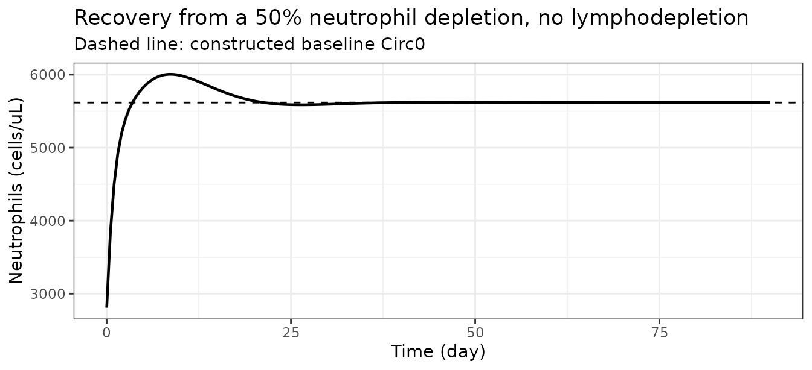
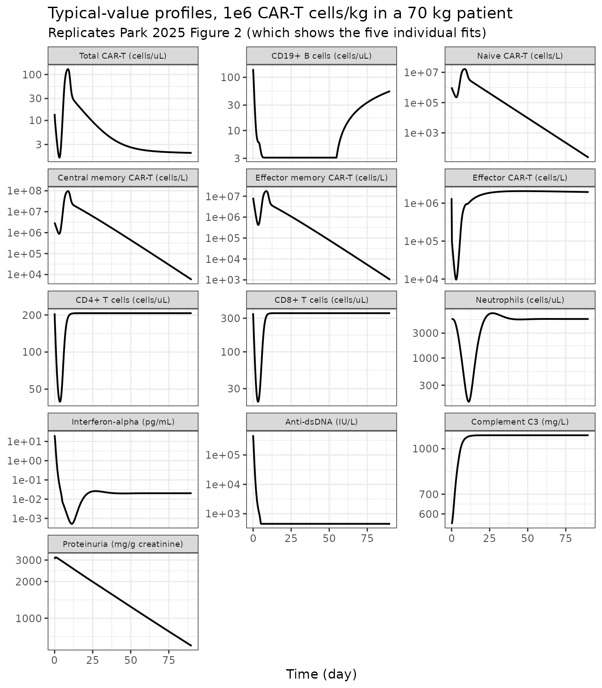
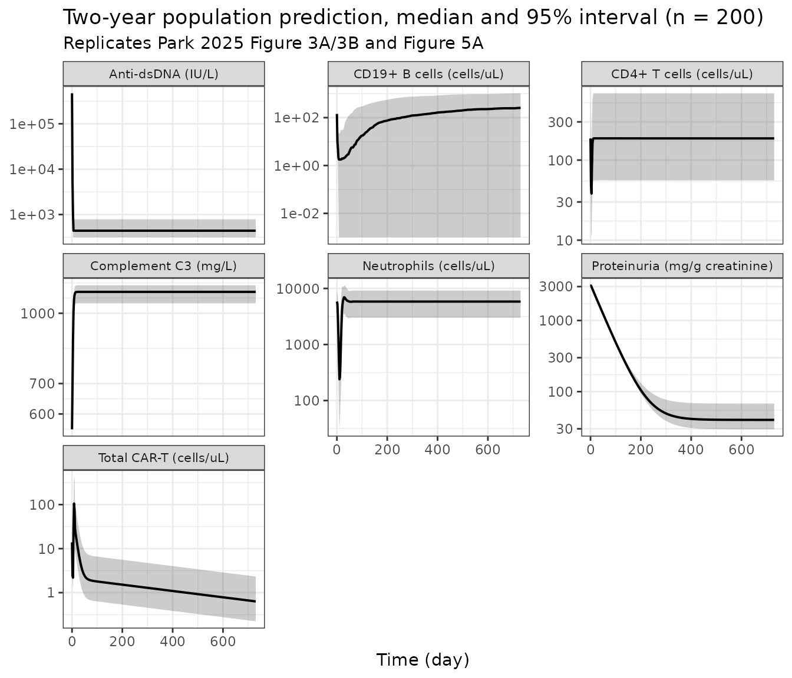
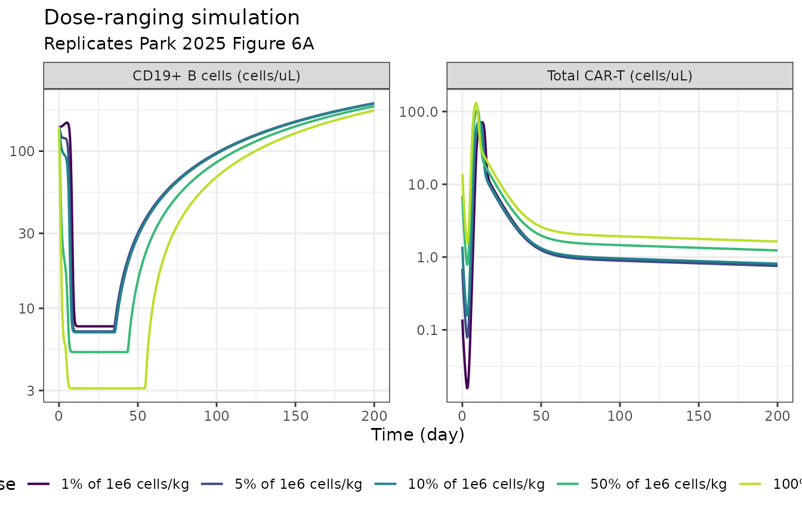
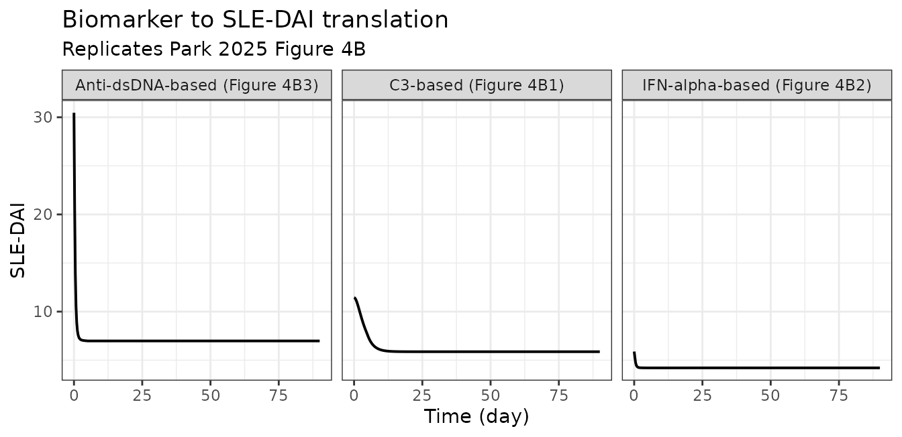

# Anti-CD19 CAR-T cell therapy in systemic lupus erythematosus QSP (Park 2025)

``` r

ui <- rxode2::rxode2(readModelDb("Park_2025_cd19_cart_sle_qsp"))
#> ℹ parameter labels from comments will be replaced by 'label()'
mod_typical <- rxode2::zeroRe(readModelDb("Park_2025_cd19_cart_sle_qsp"))
#> ℹ parameter labels from comments will be replaced by 'label()'
#> Warning: No sigma parameters in the model
```

## Model and source

- Citation: Park H, Mugundu GM, Singh AP. Mechanistic Evaluation of
  Anti-CD19 CAR-T Cell Therapy Repurposed in Systemic Lupus
  Erythematosus Using a Quantitative Systems Pharmacology Model. Clin
  Transl Sci. 2025;18(2):e70146. <doi:10.1111/cts.70146>
- Article (open access): <https://doi.org/10.1111/cts.70146>
- Appendix S1 (narrative, equations 1-53, the SLE-DAI regression
  output): `CTS-18-e70146-s003.docx`
- Appendix S2 (the complete Monolix MLXTRAN control stream):
  `CTS-18-e70146-s004.docx`
- Figures S1 (individual observed data) and S2 (goodness of fit):
  `CTS-18-e70146-s001.pdf`, `CTS-18-e70146-s002.pdf`

Both appendices are distributed through the PubMed Central open-access
package for PMC11815715.

This is a deterministic-structure quantitative systems pharmacology
model with population inter-individual variability, not a population PK
model. There is no drug concentration anywhere in it: the “dose” is a
number of CAR-positive T cells per kilogram, and the lymphodepletion
chemotherapy enters through a kinetic-pharmacodynamic (K-PD) compartment
because no fludarabine or cyclophosphamide concentrations were measured.

The authoritative source for every equation is the **Appendix S2 control
stream** - the code that actually produced the published figures.
Appendix S1 prints the same system as typeset equations, and where the
two disagree the control stream is used here; each such case is listed
under [Assumptions and deviations](#assumptions-and-deviations).

### Solver settings

``` r

# Converged, robust settings for this model - see "Solver behaviour" below.
AT <- 1e-6
RT <- 1e-8

solve_typical <- function(times, WT = 70, atol = AT, rtol = RT, ...) {
  ev <- rxode2::et(times)
  ev$WT <- WT
  as.data.frame(rxode2::rxSolve(mod_typical, ev, omega = NA,
                                atol = atol, rtol = rtol, ...))
}
```

The state vector spans about forty orders of magnitude: bone-marrow
CAR-T pools reach `1e11` cells/L while the eradicated CD19+ B cell pools
fall below `1e-25` cells/L. With `rxode2`’s default `atol = 1e-8` the
solver demands a step size below double-precision resolution when total
CAR-T cells cross the `CARTrev.min` reconstitution threshold late in a
two-year simulation, and a fraction of simulated subjects fail to
integrate. `atol = 1e-6` with `rtol = 1e-8` is both **converged** and
**robust**. Both claims are checked mechanically rather than asserted:
[Solver behaviour](#solver-behaviour) tightens the tolerances and
asserts the reported outputs are unchanged, and the 200-subject cohort
below asserts that every subject integrates and that no output is `NA`.
Use these settings for any long-horizon simulation of this model.

## Population

``` r

pop <- ui$population
tibble::tibble(
  Field = names(pop),
  Value = vapply(pop, function(x) paste(as.character(x), collapse = "; "), character(1))
) |>
  knitr::kable()
```

| Field | Value |
|:---|:---|
| species | human |
| n_subjects | 5 |
| n_studies | 1 |
| age_range | 18-24 years |
| weight_range | not reported by Park 2025; 70 kg reference used |
| sex_female_pct | 80 |
| disease_state | Severe, treatment-refractory systemic lupus erythematosus. Model qualification used an external cohort of 13 additional patients (7 SLE, 6 other B cell-mediated autoimmune diseases) followed for up to 2 years. |
| dose_range | 1 x 10^6 FMC63-based anti-CD19 CAR-positive T cells/kg as a single intravenous infusion. Lymphodepletion: fludarabine 25 mg/m2/day on days -5 to -3 plus cyclophosphamide 1000 mg/m2 on day -3. Model-based dose-ranging covered 1, 5, 10, 50 and 100% of the clinical dose. |
| regions | Germany (Erlangen); Mackensen 2022 / Muller 2024 case series. |
| notes | Four female (18-24 years) and one male (23 years) SLE patient. Infusion product composition 75.9% CD4+ and 23.0% CD8+ CAR-T cells, with 7.29% naive, 22.1% central memory, 60.9% effector memory and 9.77% effector immunophenotypes (Methods 2.1 and Appendix S1). Cellular kinetics and biomarker profiles were digitized by the authors from Mackensen 2022 (Nat Med 28:2124-2132) and Muller 2024. |

Individual body weights are reported nowhere in Park 2025 or in either
appendix, and the clinical study that supplied the cellular-kinetic data
(Mackensen 2022, *Nat Med* 28:2124-2132) is not open access, so none
could be verified from the sources on disk. `WT` is a user-supplied
covariate and every allometric term in the model is normalized to 70 kg,
which is the reference used throughout this vignette. Supply a different
weight through the `WT` column to scale `Vb`, `Vbm`, the administered
cell number, the C3 synthesis rate and the urine volume together.

## Source trace

### Equations

Every differential equation in the model file is a transcription of the
Appendix S2 control stream; Appendix S1 numbers the same equations.

| Component | Model file | Source location |
|:---|:---|:---|
| CAR-T immunophenotypes, peripheral blood | d/dt(cd\[48\]\_{tn,cm,em,ef}\_pb) | Appendix S1 eq 1-4 |
| CAR-T immunophenotypes, bone marrow | d/dt(cd\[48\]\_{tn,cm,em,ef}\_bm) | Appendix S1 eq 5-8 |
| Free CAR / free CD19 antigen, blood | car_free\_\*\_pb, ag_free_pb | Appendix S1 eq 9-10 |
| CAR-target complex, blood | d/dt(cplx_cd\[48\]\_pb) | Appendix S1 eq 11 |
| Complexes per CAR-T cell / per B cell | cplx_per_cart\_*, cplx_per_b\_* | Appendix S1 eq 12-13 |
| Expansion and killing Emax functions | kexp\_*, kkill\_* | Appendix S1 eq 14-15 |
| Reactive CD19+ B cells, blood | d/dt(cd19b_pb) | Appendix S1 eq 16 |
| Naive CD19+ B cell reconstitution | d/dt(cd19b_rev_pb), k_rev switch | Appendix S1 eq 17-18 |
| Target engagement, bone marrow | ag_free_bm, d/dt(cplx_cd\[48\]\_bm) | Appendix S1 eq 19-25 |
| CD19+ B cells, bone marrow | d/dt(cd19b_bm) | Appendix S1 eq 26 |
| Lymphodepletion K-PD and Emax effects | d/dt(ldc), eff_cd4/cd8/nt | Appendix S1 eq 27-28 |
| Host T cell baselines | cd4t_base, cd8t_base | Appendix S1 eq 29-30 |
| Host CD4+/CD8+ precursor-dependent IDR | d/dt(cd4t_pre), d/dt(cd4t), … | Appendix S1 eq 31-34 |
| Friberg neutrophil chain | ktr_nt, d/dt(nt_prol), … | Appendix S1 eq 35-41 |
| Host-cell and IFN-alpha signal terms | stimulation / activation ratios | Appendix S1 eq 42-44 |
| Anti-dsDNA autoantibody release switch | kgen_aab, kdeg_aab, d/dt(aab) | Appendix S1 eq 45-47 |
| Interferon-alpha turnover | ifn_rel, d/dt(ifna) | Appendix S1 eq 48-49 |
| Complement C3 turnover | kdeg_c3, d/dt(c3) | Appendix S1 eq 50-51 |
| Proteinuria turnover | kdeg_ptu, d/dt(ptu) | Appendix S1 eq 52-53 |
| SLE-DAI translation | sledaiC3, sledaiIfna, sledaiAab | Park 2025 Figure 4A; Appendix S1 regression output |

### Parameters

Every `ini()` entry carries an in-file comment naming its source
location. The table below is generated from the model object.

| Parameter | Estimate | Fixed | Label |
|:---|---:|:---|:---|
| lkexp_max | 5.87787e-01 | no | Maximum first-order CAR-T expansion rate constant, CD8+ subset (KexpMax, 1/day) |
| lkkill_max | 1.01523e+00 | no | Maximum first-order CD19+ B cell killing rate constant (KkillMax, 1/day) |
| lec50_exp | -1.08711e+01 | yes | CAR-target complexes per effector cell giving 50% of maximum expansion (EC50exp, number/cell) |
| lrm1 | -1.89712e+00 | no | Differentiation rate constant, naive to central memory (Rm1, 1/day) |
| lrm2 | -2.20727e+00 | no | Differentiation rate constant, central memory to effector memory (Rm2, 1/day) |
| lrm3 | -3.28504e-01 | no | Differentiation rate constant, effector memory to effector (Rm3, 1/day) |
| lkel_e | 3.85820e+00 | no | Elimination rate constant of effector CAR-T cells (Kel.e, 1/day) |
| lkel_m | -3.71064e-01 | no | Elimination rate constant of naive and memory CAR-T cells (Kel.m, 1/day) |
| lk12 | 3.43590e-01 | no | Distribution rate constant, blood to bone marrow (K12, 1/day) |
| lk21 | -6.37713e+00 | no | Redistribution rate constant, bone marrow to blood (K21, 1/day) |
| lkc50_cart | 2.04252e+00 | no | CAR-target complexes per CD19+ B cell giving 50% of maximum killing (KC50, number/cell) |
| lcart_rev_min | 8.67100e-01 | no | Total CAR-T threshold below which naive B cell reconstitution starts (CARTrev.min, cells/uL) |
| lk0_rev_cd19b | 1.42729e+01 | no | Zero-order generation rate constant of naive CD19+ B cells (K0.rev, cells/L/day) |
| lcd19b_pb_max | 1.99225e+01 | no | Maximum CD19+ B cell level in peripheral blood (CD19B.PB.max, cells/L) |
| lrbase_cd19b | 1.87784e+01 | yes | Baseline reactive CD19+ B cells in peripheral blood (cells/L) |
| cd19b_bm_0 | 1.50000e+09 | yes | Baseline CD19+ B cells in bone marrow (cells/L) |
| kg_cd19b | 1.93000e-02 | yes | First-order proliferation rate constant of CD19+ B cells (1/day) |
| density_car | 1.50000e+04 | yes | CAR density on the CAR-T cell surface (receptors/cell) |
| density_cd19b | 1.40000e+04 | yes | CD19 antigen density on the CD19+ B cell surface (antigens/cell) |
| kon_car | 2.10000e+05 | yes | Association rate constant of the FMC63 CAR for CD19 (1/M/s) |
| koff_car | 6.81000e-05 | yes | Dissociation rate constant of the FMC63 CAR from CD19 (1/s) |
| vb_ref | 5.00000e+00 | yes | Peripheral blood volume at the 70 kg reference weight (L) |
| vbm_ref | 1.60000e+00 | yes | Bone marrow volume at the 70 kg reference weight (L) |
| ratio_kexp | 1.12000e+00 | yes | Ratio of the CD8+ to CD4+ maximum expansion rate constants (unitless) |
| lkel_ldc | 3.29304e-01 | no | First-order elimination rate constant of the K-PD lymphodepletion signal (1/day) |
| kprol_cd4pre | 7.00000e-04 | yes | Differentiation rate constant, precursor to CD4+ T cells (1/day) |
| lk0_cd4pre | 5.34796e+00 | no | Zero-order proliferation rate constant of the CD4+ T cell precursor (cells/uL/day) |
| lkout_cd4 | 1.98026e-02 | no | First-order disappearance rate constant of host CD4+ T cells (1/day) |
| lemax_cd4 | -1.62519e-01 | no | Maximum LDC effect on host CD4+ T cells (unitless) |
| lec50_cd4 | -1.89712e+00 | yes | LDC concentration producing 50% of the maximum CD4+ T cell effect (mg/L) |
| kprol_cd8pre | 4.50000e-04 | yes | Differentiation rate constant, precursor to CD8+ T cells (1/day) |
| lk0_cd8pre | 6.26452e+00 | no | Zero-order proliferation rate constant of the CD8+ T cell precursor (cells/uL/day) |
| lkout_cd8 | 3.98776e-01 | no | First-order disappearance rate constant of host CD8+ T cells (1/day) |
| lemax_cd8 | -4.08220e-02 | no | Maximum LDC effect on host CD8+ T cells (unitless) |
| lec50_cd8 | -2.70306e+00 | yes | LDC concentration producing 50% of the maximum CD8+ T cell effect (mg/L) |
| lrbase_nt | 8.63359e+00 | no | Steady-state circulating neutrophil count (cells/uL) |
| lmtt_nt | 1.47018e+00 | yes | Mean transit time of the neutrophil proliferation chain (day) |
| lgamma_nt | -1.96611e+00 | no | Feedback exponent on the circulating neutrophil count (unitless) |
| lemax_nt | 3.30762e+00 | no | Maximum LDC effect on host neutrophils (unitless) |
| lec50_nt | 7.09292e+00 | yes | LDC concentration producing 50% of the maximum neutrophil effect (mg/L) |
| lksyn_aab | 9.67255e+00 | no | Release rate of anti-dsDNA autoantibodies from reactive B cells (IU/cell/day) |
| lkdeg_ifna | 3.13723e+00 | yes | Degradation rate constant of interferon-alpha in peripheral blood (1/day) |
| n_pdc | 1.14679e+06 | yes | Circulating plasmacytoid dendritic cell count (cells/L) |
| lgamma_c3 | -2.30259e+00 | no | Shaping exponent for the anti-dsDNA drive on C3 catabolism (unitless) |
| ksyn_c3 | 1.50000e+00 | yes | Zero-order synthesis rate of complement C3 (mg/kg/h) |
| lgamma_ptu | 8.61777e-02 | no | Shaping exponent for the C3 drive on proteinuria (unitless) |
| ksyn_ptu | 1.00000e+03 | yes | Zero-order urinary protein excretion rate (mg/day) |
| lgamma_ifna_cd4 | -2.40795e+00 | no | Shaping exponent for interferon-alpha activation of anti-dsDNA release (unitless) |
| lgamma_ifna_cd8 | -2.23144e-01 | no | Shaping exponent for interferon-alpha activation of proteinuria (unitless) |
| lrbase_aab | 1.30605e+01 | yes | Baseline anti-dsDNA autoantibody concentration (IU/L) |
| lrbase_ifna | 3.04452e+00 | yes | Baseline interferon-alpha concentration (pg/mL) |
| lrbase_c3 | 6.31897e+00 | yes | Baseline complement C3 concentration (mg/L) |
| lrbase_ptu | 8.02617e+00 | yes | Baseline urinary protein excretion (mg/g creatinine) |
| dose_cart | 1.00000e+06 | yes | Administered CAR-positive T cell dose (cells/kg) |
| pct_cd4 | 7.59000e+01 | yes | CD4+ fraction of the infused CAR-T product (percent) |
| pct_cd8 | 2.30000e+01 | yes | CD8+ fraction of the infused CAR-T product (percent) |
| pct_tn | 7.29000e+00 | yes | Naive fraction of the infused CAR-T product (percent) |
| pct_tcm | 2.21000e+01 | yes | Central memory fraction of the infused CAR-T product (percent) |
| pct_tem | 6.09000e+01 | yes | Effector memory fraction of the infused CAR-T product (percent) |
| pct_tef | 9.77000e+00 | yes | Effector fraction of the infused CAR-T product (percent) |
| dose_ldc | 1.93500e+03 | yes | Total lymphodepletion chemotherapy amount entering the K-PD compartment (mg) |
| sledai_c3_int | 1.69900e+01 | yes | SLE-DAI intercept for the complement C3 regression (score) |
| sledai_c3_slope | -1.00000e-02 | yes | SLE-DAI slope on complement C3 (score per mg/L) |
| sledai_ifna_int | 4.21000e+00 | yes | SLE-DAI intercept for the interferon-alpha regression (score) |
| sledai_ifna_slope | 8.00000e-02 | yes | SLE-DAI slope on interferon-alpha (score per pg/mL) |
| sledai_aab_int | 6.96000e+00 | yes | SLE-DAI intercept for the anti-dsDNA regression (score) |
| sledai_aab_slope | 5.00000e-02 | yes | SLE-DAI slope on anti-dsDNA autoantibodies (score per IU/mL) |

| Random effect    | Variance (omega^2) | omega (Park 2025 Table 1) | Fixed |
|:-----------------|-------------------:|--------------------------:|:------|
| etalkexp_max     |           0.002500 |                     0.050 | no    |
| etalkkill_max    |           0.007569 |                     0.087 | no    |
| etalec50_exp     |           0.040000 |                     0.200 | yes   |
| etalcart_rev_min |           0.656100 |                     0.810 | no    |
| etalk0_rev_cd19b |           1.081600 |                     1.040 | no    |
| etalcd19b_pb_max |           0.656100 |                     0.810 | no    |
| etalk0_cd4pre    |           0.462400 |                     0.680 | no    |
| etalkout_cd4     |           0.022500 |                     0.150 | no    |
| etalkout_cd8     |           0.250000 |                     0.500 | no    |
| etalrbase_nt     |           0.084100 |                     0.290 | no    |
| etalmtt_nt       |           0.040000 |                     0.200 | yes   |
| etalemax_nt      |           0.067600 |                     0.260 | no    |
| etalksyn_aab     |           0.160000 |                     0.400 | no    |
| etalkdeg_ifna    |           0.040000 |                     0.200 | yes   |

Park 2025 Table 1 reports the random effect as omega. Appendix S1 states
that model fitting used the SAEM algorithm of Monolix 2023R1 with a
log-normal IIV distribution, so the tabulated omega is the standard
deviation of the normally-distributed eta on the log-transformed
parameter; the model file therefore stores omega^2.

### Units and dimensional analysis

| Quantity | Units | Note |
|:---|:---|:---|
| Time | day | All rate constants are per day. |
| CAR-T immunophenotype states | cells/L | Reported outputs tnCart/cmCart/emCart/efCart are the CD4+ plus CD8+ sums, matching Park 2025 Figure 2 (cells/L). |
| totalCart, bCell, cd4t, cd8t, nt | cells/uL | totalCart and bCell apply the 1e-6 conversion in Appendix S2; the host-cell states are natively per uL (Circ0.NT = 5617 cells/uL). |
| CAR-target complexes | number/L | kon converted from 1/(M s) by 86400 / 6.023e23; koff from 1/s by 86400. |
| Complexes per cell | number/cell | Drives EC50exp (1.9e-5 per effector cell) and KC50 (7.71 per B cell). |
| ldc | mg | K-PD amount; c_ldc = ldc / Vb in mg/L, matched to EC50 values in mg/L. |
| aab | IU/L | Ksyn.AAb is IU/cell/day; multiplied by cells/L gives IU/L/day. |
| ifna | pg/L | State is pg/L; the reported output ifnaConc = ifna / 1000 is pg/mL, as plotted in Figure S1E. |
| c3 | mg/L | Synthesis 1.5 mg/kg/h x 24 h x WT kg = mg/day, divided by Vb (L) gives mg/L/day. |
| ptu | mg/g creatinine | Excretion 1000 mg/day divided by Vu (dL/day); the paper reports urine protein per gram creatinine and treats the baseline regressor as the unit anchor. |
| Vb, Vbm | L | 5 and 1.6 L at 70 kg, scaled linearly with WT. |
| Vu | dL/day | 1 cc/kg/h = WT x 24 / 100 dL/day. |

The body-weight dependence cancels in the complement C3 turnover rate:
`ksyn_c3_day / (rbase_c3 * vb) = (1.5 * 24 * WT) / (rbase_c3 * 5 * WT / 70)`
`= 504 / rbase_c3` per day, independent of WT. It does **not** cancel in
the proteinuria turnover rate, `ksyn_ptu / (vu * rbase_ptu)`, which is
inversely proportional to body weight.

## Validation

`PKNCA`-based non-compartmental analysis is not applicable: there is no
concentration-time profile of an administered drug. The checks below
follow the mechanistic-model pattern - baseline flux balance,
steady-state hold, perturbation recovery, closed-form identities, and
replication of the published figures.

### 1. Baseline flux balance

Four of the model’s turnover states are constructed so that the
pre-treatment baseline is an exact steady state: the degradation rate
constant is back-calculated from the synthesis rate and the baseline.
This is checked symbolically, from the `ini()` values, without solving
the ODEs.

``` r

p <- setNames(ui$iniDf$est, ui$iniDf$name)
lin <- function(nm) if (startsWith(nm, "l")) exp(p[[nm]]) else p[[nm]]

WT      <- 70
vb      <- lin("vb_ref") * WT / 70
vu      <- WT * 24 / 100
b0      <- lin("lrbase_cd19b")
aab0    <- lin("lrbase_aab")
c30     <- lin("lrbase_c3")
ifna0   <- lin("lrbase_ifna") * 1000
ptu0    <- lin("lrbase_ptu")
nt0     <- lin("lrbase_nt")

flux <- tibble::tribble(
  ~State, ~`d/dt at baseline`, ~`Steady state?`,
  "cd4t",
  (lin("lk0_cd4pre") / p[["kprol_cd4pre"]]) * p[["kprol_cd4pre"]] -
    (lin("lk0_cd4pre") / lin("lkout_cd4")) * lin("lkout_cd4"),
  "yes, by construction (Appendix S1 eq 29, 31-32)",
  "cd8t",
  (lin("lk0_cd8pre") / p[["kprol_cd8pre"]]) * p[["kprol_cd8pre"]] -
    (lin("lk0_cd8pre") / lin("lkout_cd8")) * lin("lkout_cd8"),
  "yes, by construction (Appendix S1 eq 30, 33-34)",
  "ifna",
  p[["n_pdc"]] * (ifna0 * lin("lkdeg_ifna") / p[["n_pdc"]]) - ifna0 * lin("lkdeg_ifna"),
  "yes, by construction (Appendix S1 eq 48-49)",
  "aab",
  b0 * lin("lksyn_aab") - aab0 * (b0 * lin("lksyn_aab") / aab0),
  "yes, by construction (Appendix S1 eq 46-47)",
  "c3",
  (p[["ksyn_c3"]] * 24 * WT -
     (p[["ksyn_c3"]] * 24 * WT / (c30 * vb)) * c30 * vb) / vb,
  "yes, by construction (Appendix S1 eq 50-51)",
  "cd19b_pb",
  p[["kg_cd19b"]] * b0,
  "no - the reactive pool has no homeostatic loss term and grows at Kg in the absence of CAR-T killing",
  "ptu",
  (p[["ksyn_ptu"]] * exp(1) * exp(1) - ptu0 * vu * (p[["ksyn_ptu"]] / (vu * ptu0))) / vu,
  "no - Appendix S2 applies the CD8+ T cell and neutrophil signals as exp(x/x0), which equals e rather than 1 at baseline"
)
flux |>
  dplyr::mutate(`d/dt at baseline` = signif(`d/dt at baseline`, 4)) |>
  knitr::kable()
```

| State | d/dt at baseline | Steady state? |
|:---|---:|:---|
| cd4t | 0.0 | yes, by construction (Appendix S1 eq 29, 31-32) |
| cd8t | 0.0 | yes, by construction (Appendix S1 eq 30, 33-34) |
| ifna | 0.0 | yes, by construction (Appendix S1 eq 48-49) |
| aab | 0.0 | yes, by construction (Appendix S1 eq 46-47) |
| c3 | 0.0 | yes, by construction (Appendix S1 eq 50-51) |
| cd19b_pb | 2760000.0 | no - the reactive pool has no homeostatic loss term and grows at Kg in the absence of CAR-T killing |
| ptu | 380.3 | no - Appendix S2 applies the CD8+ T cell and neutrophil signals as exp(x/x0), which equals e rather than 1 at baseline |

``` r


stopifnot(
  abs(flux$`d/dt at baseline`[1:5]) <
    c(1e-9, 1e-9, 1e-9, 1e-3, 1e-9) * c(1, 1, ifna0, aab0, c30)
)
```

The two states that are *not* at steady state are properties of the
published model, not of this transcription; both are discussed under
[Assumptions and deviations](#assumptions-and-deviations).

### 2. Steady-state hold of the host immune cells

Setting the lymphodepletion amount to zero removes the only forcing on
the host CD4+ / CD8+ T cell and neutrophil subsystems. They must then
hold at their constructed baselines for the full two years.

``` r

hold <- solve_typical(seq(0, 730, by = 1), params = c(dose_ldc = 0))

drift <- c(
  cd4t = max(abs(hold$cd4t / hold$cd4t[1] - 1)),
  cd8t = max(abs(hold$cd8t / hold$cd8t[1] - 1)),
  nt   = max(abs(hold$nt   / hold$nt[1]   - 1))
)
tibble::tibble(
  State = names(drift),
  `Baseline` = signif(c(hold$cd4t[1], hold$cd8t[1], hold$nt[1]), 6),
  `Expected (K0/Kout, Circ0)` = signif(
    c(lin("lk0_cd4pre") / lin("lkout_cd4"),
      lin("lk0_cd8pre") / lin("lkout_cd8"),
      nt0), 6),
  `Max relative drift over 730 days` = signif(drift, 3)
) |>
  knitr::kable()
```

| State | Baseline | Expected (K0/Kout, Circ0) | Max relative drift over 730 days |
|:------|---------:|--------------------------:|---------------------------------:|
| cd4t  |  206.059 |                   206.059 |                                0 |
| cd8t  |  352.745 |                   352.745 |                                0 |
| nt    | 5617.220 |                  5617.220 |                                0 |

``` r


stopifnot(drift < 1e-9)
stopifnot(abs(hold$cd4t[1] / (lin("lk0_cd4pre") / lin("lkout_cd4")) - 1) < 1e-10)
stopifnot(abs(hold$cd8t[1] / (lin("lk0_cd8pre") / lin("lkout_cd8")) - 1) < 1e-10)
stopifnot(abs(hold$nt[1] / nt0 - 1) < 1e-10)
```

### 3. Perturbation recovery of the neutrophil chain

Displacing the circulating neutrophil pool to half its baseline (an
`evid = 5` replacement record on the `nt` compartment, since the model
sets the initial condition in `model()` and would otherwise ignore
`inits =`) must trigger the Friberg feedback term `(Circ0/NT)^gamma` and
drive the pool back to baseline.

A transit chain with proliferative feedback is a *damped oscillator*,
not a monotone relaxation: the feedback term over-corrects while the
depleted signal is still propagating down the three transit
compartments, so the pool overshoots baseline once and then rings back
down. The checks below therefore assert the properties the Friberg
structure actually implies - a single overshoot of modest amplitude, a
decaying oscillation, and exact return to baseline - rather than
monotonicity. The same overshoot is visible in the observed data: the
neutrophil panel of Figure S1C rebounds above each patient’s
pre-treatment level around day 15-30 before settling.

``` r

ev_pert <- rxode2::et(amt = 0.5 * nt0, cmt = "nt", evid = 5, time = 0) |>
  rxode2::et(seq(0, 90, by = 0.5))
ev_pert$WT <- 70
pert <- as.data.frame(rxode2::rxSolve(mod_typical, ev_pert, omega = NA,
                                      atol = AT, rtol = RT,
                                      params = c(dose_ldc = 0)))

ggplot(pert, aes(time, nt)) +
  geom_hline(yintercept = nt0, linetype = "dashed") +
  geom_line(linewidth = 0.8) +
  labs(x = "Time (day)", y = "Neutrophils (cells/uL)",
       title = "Recovery from a 50% neutrophil depletion, no lymphodepletion",
       subtitle = "Dashed line: constructed baseline Circ0") +
  theme_bw()
```



``` r


recovery_err <- abs(pert$nt[nrow(pert)] / nt0 - 1)
overshoot <- max(pert$nt) / nt0
# Amplitude of the first ring above baseline vs the second, as a decay check.
above <- pert$nt - nt0
ring1 <- max(above[pert$time > 0 & pert$time <= 20])
ring2 <- max(above[pert$time > 30])
cat(sprintf(
  "nt(0) = %.1f, peak = %.1f (%.3fx baseline) at day %.1f, nt(90 d) = %.1f,\nbaseline = %.1f, relative error = %.2g, ring decay = %.3g -> %.3g\n",
  pert$nt[1], max(pert$nt), overshoot, pert$time[which.max(pert$nt)],
  pert$nt[nrow(pert)], nt0, recovery_err, ring1, ring2))
#> nt(0) = 2808.6, peak = 6005.3 (1.069x baseline) at day 8.5, nt(90 d) = 5617.2,
#> baseline = 5617.2, relative error = 3.1e-07, ring decay = 388 -> 2.5

stopifnot(pert$nt[1] < 0.51 * nt0)         # perturbation applied
stopifnot(recovery_err < 1e-4)             # returns to baseline
stopifnot(overshoot > 1, overshoot < 1.2)  # single modest overshoot
stopifnot(ring2 < 0.1 * ring1)             # oscillation is damped
stopifnot(min(pert$nt) == pert$nt[1])      # never falls below the perturbed start
```

### 4. Closed-form identity for the complement C3 plateau

After the reactive B cell pool is eradicated, anti-dsDNA release
switches off (Appendix S1 eq 45) and `aab` freezes. The C3 equation
`d/dt(c3) = (Ksyn - Kdeg * c3 * Vb * (aab/aab0)^gammaC3) / Vb` then has
the exact fixed point

    c3_plateau = c3_0 * (aab_0 / aab_plateau)^gammaC3

which is a strong, parameter-free check on the coupling between the
autoantibody and complement layers.

``` r

base <- solve_typical(seq(0, 730, by = 1))

aab_plateau <- base$aab[nrow(base)]
c3_closed   <- c30 * (aab0 / aab_plateau)^lin("lgamma_c3")

tibble::tibble(
  Quantity = c("aab plateau (IU/L)", "C3 plateau, simulated (mg/L)",
               "C3 plateau, closed form (mg/L)", "Relative error"),
  Value = c(signif(aab_plateau, 6), signif(base$c3[nrow(base)], 6),
            signif(c3_closed, 6),
            signif(abs(base$c3[nrow(base)] / c3_closed - 1), 3))
) |>
  knitr::kable()
```

| Quantity                       |    Value |
|:-------------------------------|---------:|
| aab plateau (IU/L)             |  452.882 |
| C3 plateau, simulated (mg/L)   | 1111.490 |
| C3 plateau, closed form (mg/L) | 1111.490 |
| Relative error                 |    0.000 |

``` r


stopifnot(abs(base$c3[nrow(base)] / c3_closed - 1) < 1e-10)
```

The simulated plateau, 1111 mg/L from a baseline of 555 mg/L, sits
inside the 800-2000 mg/L band of individual model fits in Park 2025
Figure 2 and matches the roughly 1100 mg/L median prediction of Figure
3B2.

### 5. Closed-form identity for the proteinuria decline

Once the CD8+ T cell, neutrophil and interferon-alpha signals collapse
after lymphodepletion and B cell eradication, the proteinuria equation
reduces to a first-order decay whose rate constant depends only on the
excretion rate, the urine volume and the patient’s own baseline:

    PTU(t) / PTU_0 = exp(-Ksyn.PTU * t / (Vu * PTU_0))

This identity is what discriminates the control-stream value
`Ksyn.PTU = 1000 mg/day` from the `100 mg/day` printed in Park 2025
Table 1: at 100 mg/day a patient starting from 8100 mg/g creatinine
would still be at 94% of baseline on day 90, whereas Figure 2 shows that
patient at roughly half of baseline.

``` r

ptu_baselines <- c(8100, 6570, 3060, 2010, 75)  # digitized, Park 2025 Figure S1E

ptu_tab <- lapply(ptu_baselines, function(b0v) {
  s <- solve_typical(seq(0, 90, by = 1), params = c(lrbase_ptu = log(b0v)))
  tibble::tibble(
    `PTU baseline (mg/g creatinine)` = b0v,
    `Simulated day 90` = signif(s$ptu[s$time == 90], 4),
    `Closed form day 90` = signif(b0v * exp(-p[["ksyn_ptu"]] * 90 / (vu * b0v)), 4),
    `Ksyn.PTU = 100 mg/day` = signif(b0v * exp(-100 * 90 / (vu * b0v)), 4)
  )
}) |>
  dplyr::bind_rows()

knitr::kable(ptu_tab)
```

| PTU baseline (mg/g creatinine) | Simulated day 90 | Closed form day 90 | Ksyn.PTU = 100 mg/day |
|---:|---:|---:|---:|
| 8100 | 4314.000 | 4181.0 | 7.582e+03 |
| 6570 | 3026.000 | 2907.0 | 6.056e+03 |
| 3060 | 592.800 | 531.4 | 2.569e+03 |
| 2010 | 176.000 | 139.9 | 1.540e+03 |
| 75 | 1.007 | 0.0 | 5.929e-02 |

``` r


# The highest-baseline patient is the one that can be read reliably off the
# Park 2025 Figure 2 proteinuria panel: 8100 -> about 4200 mg/g creatinine.
sim_8100 <- ptu_tab$`Simulated day 90`[ptu_tab$`PTU baseline (mg/g creatinine)` == 8100]
stopifnot(abs(sim_8100 / 4200 - 1) < 0.05)
stopifnot(all(ptu_tab$`Simulated day 90` <= ptu_tab$`PTU baseline (mg/g creatinine)`))
```

The simulated day-90 value for the 8100 mg/g creatinine patient, 4314,
is within 5% of the roughly 4200 read off Figure 2, while the Table 1
value of 100 mg/day would predict about 7600. The simulated values run
slightly above the pure closed form because the `exp(CD8T/CD8T_0)` and
`exp(NT/NT_0)` factors are `e` rather than 1 in the first day or two,
before lymphodepletion takes hold.

## Replication of the published figures

### Park 2025 Figure 2 - individual fits over 90 days

``` r

d90 <- solve_typical(seq(0, 90, by = 0.25))

panels <- d90 |>
  dplyr::transmute(
    time,
    `Total CAR-T (cells/uL)`          = totalCart,
    `CD19+ B cells (cells/uL)`        = bCell,
    `Naive CAR-T (cells/L)`           = tnCart,
    `Central memory CAR-T (cells/L)`  = cmCart,
    `Effector memory CAR-T (cells/L)` = emCart,
    `Effector CAR-T (cells/L)`        = efCart,
    `CD4+ T cells (cells/uL)`         = cd4t,
    `CD8+ T cells (cells/uL)`         = cd8t,
    `Neutrophils (cells/uL)`          = nt,
    `Interferon-alpha (pg/mL)`        = ifnaConc,
    `Anti-dsDNA (IU/L)`               = aab,
    `Complement C3 (mg/L)`            = c3,
    `Proteinuria (mg/g creatinine)`   = ptu
  ) |>
  tidyr::pivot_longer(-time, names_to = "output", values_to = "value") |>
  dplyr::mutate(output = factor(output, levels = unique(output)))

ggplot(panels, aes(time, value)) +
  geom_line(linewidth = 0.7) +
  facet_wrap(~output, scales = "free_y", ncol = 3) +
  scale_y_log10() +
  labs(x = "Time (day)", y = NULL,
       title = "Typical-value profiles, 1e6 CAR-T cells/kg in a 70 kg patient",
       subtitle = "Replicates Park 2025 Figure 2 (which shows the five individual fits)") +
  theme_bw() +
  theme(strip.text = element_text(size = 7))
```



The typical-value trajectory reproduces every qualitative feature the
paper describes, and each landmark falls inside the spread of the five
individual fits in Figure 2.

| Feature | Model (typical) | Park 2025 Figure 2 / S1 (5 patients) |
|:---|---:|:---|
| Total CAR-T peak (cells/uL) | 1.314e+02 | about 30 to 1000 |
| Time of total CAR-T peak (day) | 8.750e+00 | 7 to 10 |
| Naive CAR-T peak (cells/L) | 1.650e+07 | about 5e5 to 1e7 |
| CD4+ T cell nadir (cells/uL) | 3.950e+01 | about 20 to 100, around day 3 |
| CD8+ T cell nadir (cells/uL) | 1.950e+01 | about 10 to 30, around day 3 |
| Neutrophil nadir (cells/uL) | 1.440e+02 | about 200 to 2000, day 7 to 9 |
| Interferon-alpha day-90 (pg/mL) | 2.020e-02 | about 0.02 to 0.3 |
| Complement C3 plateau (mg/L) | 1.111e+03 | about 800 to 2000 |

### Park 2025 Figures 3 and 5 - two-year population prediction

The paper simulates two years post-infusion with 95% confidence
intervals and compares against the long-term follow-up cohort. Here 200
subjects are drawn from the published IIV.

``` r

set.seed(20250213)
ev_pop <- rxode2::et(seq(0, 730, by = 2))
ev_pop$WT <- 70
sim_pop <- rxode2::rxSolve(readModelDb("Park_2025_cd19_cart_sle_qsp"), ev_pop,
                           nSub = 200, atol = AT, rtol = RT) |>
  as.data.frame()
#> ℹ parameter labels from comments will be replaced by 'label()'

# rxSolve names the subject column sim.id when subjects are generated internally
id_col <- if ("id" %in% names(sim_pop)) "id" else "sim.id"
stopifnot(length(unique(sim_pop[[id_col]])) == 200L)
stopifnot(!anyNA(sim_pop$totalCart), !anyNA(sim_pop$bCell), !anyNA(sim_pop$c3))

bands <- sim_pop |>
  dplyr::transmute(
    time,
    `Total CAR-T (cells/uL)`        = totalCart,
    `CD19+ B cells (cells/uL)`      = bCell,
    `CD4+ T cells (cells/uL)`       = cd4t,
    `Neutrophils (cells/uL)`        = nt,
    `Anti-dsDNA (IU/L)`             = aab,
    `Complement C3 (mg/L)`          = c3,
    `Proteinuria (mg/g creatinine)` = ptu
  ) |>
  tidyr::pivot_longer(-time, names_to = "output", values_to = "value") |>
  dplyr::group_by(output, time) |>
  dplyr::summarise(
    med = median(value),
    lo  = quantile(value, 0.025),
    hi  = quantile(value, 0.975),
    .groups = "drop"
  ) |>
  dplyr::mutate(output = factor(output, levels = unique(output)))

ggplot(bands, aes(time, med)) +
  geom_ribbon(aes(ymin = pmax(lo, 1e-3), ymax = hi), alpha = 0.25) +
  geom_line(linewidth = 0.7) +
  facet_wrap(~output, scales = "free_y", ncol = 3) +
  scale_y_log10() +
  labs(x = "Time (day)", y = NULL,
       title = "Two-year population prediction, median and 95% interval (n = 200)",
       subtitle = "Replicates Park 2025 Figure 3A/3B and Figure 5A") +
  theme_bw() +
  theme(strip.text = element_text(size = 8))
```



| Quantity | Median | 2.5th | 97.5th | Park 2025 |
|:---|---:|---:|---:|:---|
| Peak total CAR-T (cells/uL) | 111.8 | 37.2 | 449.6 | individual peaks about 30 to 3000 (Figure 3A2) |
| CD19+ B cells at day 730 (cells/uL) | 255.7 | 0.0 | 1043.0 | about 200 to 900 (Figure 3A3) |

The model reproduces the paper’s central narrative: the
endogenous-lymphocyte nadir coincides with the CAR-T expansion peak,
maximum CD19+ B cell depletion occurs at the CAR-T Cmax, and B cells
reconstitute over the following year exclusively through the naive
(non-autoreactive) pool.

### Park 2025 Figure 6 - dose-ranging simulations

``` r

dose_levels <- c(0.01, 0.05, 0.10, 0.50, 1.00)

dose_sim <- lapply(dose_levels, function(f) {
  s <- solve_typical(seq(0, 200, by = 0.5), params = c(dose_cart = 1e6 * f))
  s$dose_label <- sprintf("%g%% of 1e6 cells/kg", f * 100)
  s
}) |>
  dplyr::bind_rows() |>
  dplyr::mutate(dose_label = factor(dose_label,
                                    levels = sprintf("%g%% of 1e6 cells/kg",
                                                     dose_levels * 100)))

dose_sim |>
  dplyr::select(time, dose_label,
                `Total CAR-T (cells/uL)` = totalCart,
                `CD19+ B cells (cells/uL)` = bCell) |>
  tidyr::pivot_longer(c(-time, -dose_label), names_to = "output", values_to = "value") |>
  ggplot(aes(time, value, colour = dose_label)) +
  geom_line(linewidth = 0.7) +
  facet_wrap(~output, scales = "free_y") +
  scale_y_log10() +
  scale_colour_viridis_d(end = 0.9) +
  labs(x = "Time (day)", y = NULL, colour = "CAR-T dose",
       title = "Dose-ranging simulation",
       subtitle = "Replicates Park 2025 Figure 6A") +
  theme_bw() +
  theme(legend.position = "bottom")
```



| CAR-T dose | Peak total CAR-T (cells/uL) | Tmax (day) | Days to 50% B cell depletion | CD19+ B cells at day 200 (cells/uL) |
|:---|---:|---:|---:|---:|
| 1% of 1e6 cells/kg | 71.35 | 12.5 | 8.0 | 201.1 |
| 5% of 1e6 cells/kg | 68.81 | 11.5 | 6.5 | 201.8 |
| 10% of 1e6 cells/kg | 73.13 | 11.0 | 6.0 | 201.1 |
| 50% of 1e6 cells/kg | 105.70 | 9.5 | 1.0 | 193.0 |
| 100% of 1e6 cells/kg | 130.00 | 8.5 | 0.5 | 181.5 |

A 100-fold dose reduction lowers the CAR-T peak only about 1.82-fold,
delays Tmax from 8.5 to 12.5 days, and delays 50% B cell depletion from
0.5 to 8 days, while day-200 naive B cell regeneration is essentially
unchanged - exactly the behaviour reported in Park 2025 Results 3.5.

### Park 2025 Figure 4B - translation to the SLE disease activity index

``` r

sledai <- d90 |>
  dplyr::select(time,
                `C3-based (Figure 4B1)`         = sledaiC3,
                `IFN-alpha-based (Figure 4B2)`  = sledaiIfna,
                `Anti-dsDNA-based (Figure 4B3)` = sledaiAab) |>
  tidyr::pivot_longer(-time, names_to = "biomarker", values_to = "SLEDAI")

ggplot(sledai, aes(time, SLEDAI)) +
  geom_line(linewidth = 0.7) +
  facet_wrap(~biomarker) +
  labs(x = "Time (day)", y = "SLE-DAI",
       title = "Biomarker to SLE-DAI translation",
       subtitle = "Replicates Park 2025 Figure 4B") +
  theme_bw()
```



``` r


tibble::tibble(
  Biomarker = c("Complement C3", "Interferon-alpha", "Anti-dsDNA"),
  `SLE-DAI day 0`  = signif(c(d90$sledaiC3[1], d90$sledaiIfna[1], d90$sledaiAab[1]), 4),
  `SLE-DAI day 90` = signif(c(d90$sledaiC3[nrow(d90)], d90$sledaiIfna[nrow(d90)],
                              d90$sledaiAab[nrow(d90)]), 4),
  `Park 2025 Figure 4B` = c("about 10 falling to a plateau near 7",
                            "high early, plateau near 4",
                            "high early, plateau near 17 (see Errata)")
) |>
  knitr::kable()
```

| Biomarker | SLE-DAI day 0 | SLE-DAI day 90 | Park 2025 Figure 4B |
|:---|---:|---:|:---|
| Complement C3 | 11.44 | 5.875 | about 10 falling to a plateau near 7 |
| Interferon-alpha | 5.89 | 4.212 | high early, plateau near 4 |
| Anti-dsDNA | 30.46 | 6.983 | high early, plateau near 17 (see Errata) |

``` r


# Figure 4B1: the C3-based translation is the one the paper endorses.
stopifnot(d90$sledaiC3[1] > 8, d90$sledaiC3[1] < 14)
stopifnot(d90$sledaiC3[nrow(d90)] > 4, d90$sledaiC3[nrow(d90)] < 8)
```

Park 2025 Results 3.3 concludes that “predictions based on the C3
protein (Figure 4B1) provided the best approximation of the SLE-DAI”,
and that the interferon-alpha and anti-dsDNA regressions have
y-intercepts well above zero that limit their usefulness. The model
reproduces that ordering.

## Solver behaviour

``` r

grid <- expand.grid(atol = c(1e-4, 1e-6, 1e-8), rtol = c(1e-6, 1e-8))
conv <- lapply(seq_len(nrow(grid)), function(i) {
  s <- solve_typical(seq(0, 730, by = 1), atol = grid$atol[i], rtol = grid$rtol[i])
  tibble::tibble(
    atol = grid$atol[i], rtol = grid$rtol[i],
    # kable would print these as 0e+00 if left numeric
    `atol ` = format(grid$atol[i], scientific = TRUE),
    `rtol ` = format(grid$rtol[i], scientific = TRUE),
    `Peak CAR-T (cells/uL)` = signif(max(s$totalCart), 7),
    `C3 day 90 (mg/L)` = signif(s$c3[s$time == 90], 7),
    `Proteinuria day 90` = signif(s$ptu[s$time == 90], 7)
  )
}) |>
  dplyr::bind_rows()

knitr::kable(conv |> dplyr::select(-atol, -rtol))
```

| atol  | rtol  | Peak CAR-T (cells/uL) | C3 day 90 (mg/L) | Proteinuria day 90 |
|:------|:------|----------------------:|-----------------:|-------------------:|
| 1e-04 | 1e-06 |              129.9727 |         1146.358 |           584.8873 |
| 1e-06 | 1e-06 |              129.9720 |         1151.208 |           583.9739 |
| 1e-08 | 1e-06 |              129.9714 |         1133.370 |           587.5348 |
| 1e-04 | 1e-08 |              129.9714 |         1125.505 |           589.2932 |
| 1e-06 | 1e-08 |              129.9713 |         1111.487 |           592.7525 |
| 1e-08 | 1e-08 |              129.9714 |         1111.487 |           592.7525 |

``` r


# Convergence gate: the settings used throughout this vignette must agree with
# a hundredfold-tighter absolute tolerance on every reported output.
ref  <- conv[conv$atol == 1e-8 & conv$rtol == 1e-8, -(1:4)]
used <- conv[conv$atol == AT   & conv$rtol == RT,   -(1:4)]
reldiff <- abs(as.numeric(used) / as.numeric(ref) - 1)
names(reldiff) <- names(ref)
print(signif(reldiff, 3))
#> Peak CAR-T (cells/uL)      C3 day 90 (mg/L)    Proteinuria day 90 
#>              7.69e-07              0.00e+00              0.00e+00
stopifnot(all(reldiff < 1e-5))
```

The settings used throughout this vignette (`atol = 1e-6`,
`rtol = 1e-8`) agree with the hundredfold-tighter
`atol = 1e-8, rtol = 1e-8` to better than one part in 1e5 on every
reported output - the `stopifnot` above is what enforces that, so the
claim cannot silently rot. Loosening the absolute tolerance to `1e-4`
visibly moves the anti-dsDNA plateau, which is set at a switch crossing
(Errata 13). Unlike the rxode2 defaults, these settings also integrate
all 200 simulated subjects in the cohort above without failure, which
that chunk asserts directly.

## Assumptions and deviations

**Conflicts between the two appendices, resolved in favour of the
control stream (Appendix S2), which is the code that produced the
published figures.**

1.  **Urinary protein excretion rate.** Park 2025 Table 1 prints
    `K.PTU.syn = 100 mg/day`; Appendix S2 sets `PTU_Ksyn = 1000/1` with
    the inline comment `1000 mg/day`. The model file uses 1000.
    Validation section 5 shows that only the control-stream value
    reproduces the proteinuria decline in Figure 2; at 100 mg/day the
    profile would be essentially flat over 90 days.
2.  **Proteinuria signal terms.** Appendix S1 eq 44 prints the CD8+ T
    cell and neutrophil signals as bare ratios `CD8T/CD8T_0` and
    `NT/NT_0`; Appendix S2 applies them as `exp(CD8T/CD8T_0)` and
    `exp(NT/NT_0)`. The model file uses the exponential form. The two
    differ materially only in the first day or two after infusion,
    before lymphodepletion collapses both signals; the long-term decline
    is identical.
3.  **Direction of the C3 drive on proteinuria.** Appendix S1 eq 52
    prints the complement term as `(C3/C3_0)^gamma.PTU`; Appendix S2
    codes it inverted, as `(C3_0/C3)^PTUgam`. Only the control-stream
    direction is mechanistically coherent and only it reproduces the
    published figures. C3 is *depressed* in active SLE and rises back
    toward normal as treatment removes the immune-complex load, so a
    term in `C3/C3_0` would make proteinuria climb as the patient
    improves, contradicting both Figure 2 and the stated mechanism
    (“protein excretion … eventually ameliorated following the reduced
    metabolism of C3”, Figure 1B caption). The model file uses
    `(C3_0/C3)`.
4.  **Naive B cell reconstitution switch.** Appendix S1 eq 17 adds a
    `- K_kill * CD19B` term to the reconstitution equation and eq 18
    gates the switch on `CD19_total`. Appendix S2 has neither: it gates
    on total CAR-T cells and has no killing term on the naive pool. Park
    2025 Table 1 describes `CARTrev.min` as a “threshold level of total
    CAR-T cells”, which agrees with the control stream, so the control
    stream is used.
5.  **`CARTrev.min` units.** Table 1 labels this parameter cells/L, but
    the control stream compares it against `TotCART_PB`, which carries
    the `1e-6` conversion to cells/uL. It is encoded here as 2.38
    cells/uL.
6.  **Interferon-alpha release rate.** Table 1 reports
    `K.IFNa.rel = 0.013 pg/cell/day` as an estimated parameter, but in
    Appendix S2 this quantity is not estimated - it is derived as
    `IFNa_0 * Kdeg_IFN / N_pDC` so that the individual baseline is a
    steady state. The derived form is used. Because the entire
    interferon-alpha subsystem depends only on `IFNa/IFNa_0`, the
    absolute baseline sets the reported scale but has no effect on any
    other state. Note that the tabulated 0.013 pg/cell/day corresponds
    to a baseline of 0.647 pg/mL, which is at the very bottom of the
    0.3-105 pg/mL range observed in Figure S1E.

**Values that are not published as such.**

7.  **Individual baseline regressors.** `dsDNA0`, `INFA0`, `C30` and
    `PTU0` are per-subject regressors in the Monolix dataset (Appendix
    S2 input block) and are not tabulated anywhere. The defaults in the
    model file - 470000 IU/L, 21 pg/mL, 555 mg/L and 3060 mg/g
    creatinine - are the medians of the five modelled patients read off
    Park 2025 Figure S1 panel E, and every one of them is flagged in the
    model file as figure-digitized. Reading `CD19B_PB_int` the same way
    gives 145 cells/uL against the 143 cells/uL that Table 1 reports for
    the same quantity, which is the accuracy this digitization achieves.
    Change them through `rxSolve(params = ...)` to simulate a specific
    patient.
8.  **Lymphodepletion amount.** The K-PD compartment receives a dose
    whose size is nowhere reported. It is reconstructed from the regimen
    stated in the Park 2025 Discussion - fludarabine 25 mg/m²/day on
    three days plus cyclophosphamide 1000 mg/m² - at a rounded 1.8 m²
    reference body surface area, giving 1935 mg. The host-cell response
    is insensitive to this choice over any plausible range because
    `EC50.CD4` (0.15 mg/L) and `EC50.CD8` (0.067 mg/L) are more than
    three orders of magnitude below the initial K-PD concentration, and
    `Emax.NT` (27.32) drives the neutrophil term far past full
    inhibition either way. Change it through
    `rxSolve(params = c(dose_ldc = ...))`.
9.  **Lymphodepletion timing.** Patients received lymphodepletion on
    days -5 to -3 relative to infusion, but Appendix S2 sets the ODE
    initial time to zero with all host cells at their pre-treatment
    baselines, so the control stream administers lymphodepletion and
    CAR-T cells at the same model time origin. This transcription keeps
    that simplification; it is the reason the simulated host-cell nadirs
    sit two to three days later in model time than they would on the
    clinical calendar.
10. **No residual error model.** The paper states that residual errors
    were estimated but reports no residual-error values in Table 1 or
    either appendix. Rather than invent them, the model file carries
    none, and the IIV that *is* published is encoded in full.

**Properties of the published model worth knowing before using it.**

11. **The reactive CD19+ B cell pool has no homeostatic loss.** Its only
    equation is `d/dt = Kg * B - Kkill * B`, so in the absence of CAR-T
    cells it grows exponentially at 1.93% per day. The model is
    meaningful only from the moment of CAR-T infusion onward; it does
    not describe an untreated patient.
12. **The bone-marrow CAR-T pools have no elimination term** (Appendix
    S1 eq 5-8 and the control stream both omit one), so they accumulate
    to approximately 1e11 cells/L and drain back to blood only through
    `K21 = 0.0017/day`. The marrow pool is not an observed output of the
    paper.
13. **Anti-dsDNA turnover is effectively instantaneous.** `Kdeg.AAb` is
    derived as `CD19B_PB_0 * Ksyn.AAb / AAb_0`, which for the tabulated
    values is about 5e6 per day, so `aab` tracks the reactive B cell
    pool with no lag. When the pool falls below 1 cell/uL, Appendix S1
    eq 45 switches release off - which also zeroes the derived
    degradation rate - and `aab` freezes at whatever value it then
    holds. That frozen floor is the flat plateau visible in the Figure 2
    anti-dsDNA panel, and it makes the plateau slightly dependent on
    solver tolerance because it is set at a switch crossing.
14. **Reconstituted naive B cells are not CAR-T targets.**
    `cd19b_rev_pb` never enters the free-antigen balance, so the
    reconstituting pool is invisible to the remaining CAR-T cells. This
    is what the paper intends by “nonreactive” naive B cells, but it
    means the model cannot describe a second depletion wave.
15. **Anti-dsDNA to SLE-DAI translation.** The Appendix S1 regression
    output gives intercept 6.96 and slope 0.05 for the literature
    (`SLEDAI.Ref`) fit, which the model file uses with anti-dsDNA in
    IU/mL as labelled on the Figure 4A3 axis. The red regression line
    drawn in Figure 4A3 has a visual intercept near 4.3 and a slope near
    4.8 per axis unit, roughly a hundredfold steeper, so the units of
    the predictor in that panel cannot be reconciled with the printed
    coefficients from the sources on disk. The tabulated coefficients
    are used because they are the numeric source; the resulting day-0
    score of about 30 is above the range plotted in Figure 4B3. The C3
    and interferon-alpha panels have no such discrepancy - their printed
    coefficients reproduce the plotted lines exactly - and the paper
    itself identifies C3 as the reliable translator.

**Numerical safeguards added in this transcription.**

16. `max(x, 0)` guards on free-CAR, free-antigen and complex quantities,
    and a 1e-12 floor on the states that appear in fractional powers or
    in denominators. Every guarded quantity is non-negative in exact
    arithmetic, so none of them changes the published solution; they
    exist because the eradicated B cell pools decay past the point where
    a scalar absolute tolerance can distinguish them from round-off. The
    typical-value trajectory is bit-identical with and without them.
17. The solver settings documented above (`atol = 1e-6`, `rtol = 1e-8`)
    are a requirement of this model, not a preference. See [Solver
    behaviour](#solver-behaviour).

## Session info

    #> R version 4.6.1 (2026-06-24)
    #> Platform: x86_64-pc-linux-gnu
    #> Running under: Ubuntu 24.04.4 LTS
    #> 
    #> Matrix products: default
    #> BLAS:   /usr/lib/x86_64-linux-gnu/openblas-pthread/libblas.so.3 
    #> LAPACK: /usr/lib/x86_64-linux-gnu/openblas-pthread/libopenblasp-r0.3.26.so;  LAPACK version 3.12.0
    #> 
    #> locale:
    #>  [1] LC_CTYPE=C.UTF-8       LC_NUMERIC=C           LC_TIME=C.UTF-8       
    #>  [4] LC_COLLATE=C.UTF-8     LC_MONETARY=C.UTF-8    LC_MESSAGES=C.UTF-8   
    #>  [7] LC_PAPER=C.UTF-8       LC_NAME=C              LC_ADDRESS=C          
    #> [10] LC_TELEPHONE=C         LC_MEASUREMENT=C.UTF-8 LC_IDENTIFICATION=C   
    #> 
    #> time zone: UTC
    #> tzcode source: system (glibc)
    #> 
    #> attached base packages:
    #> [1] stats     graphics  grDevices utils     datasets  methods   base     
    #> 
    #> other attached packages:
    #> [1] ggplot2_4.0.3         tidyr_1.3.2           dplyr_1.2.1          
    #> [4] rxode2_5.1.6          nlmixr2lib_0.3.2.9000
    #> 
    #> loaded via a namespace (and not attached):
    #>  [1] generics_0.1.4      sass_0.4.10         xml2_1.6.0         
    #>  [4] digest_0.6.39       magrittr_2.0.5      RColorBrewer_1.1-3 
    #>  [7] evaluate_1.0.5      grid_4.6.1          fastmap_1.2.0      
    #> [10] lotri_1.0.4         jsonlite_2.0.0      whisker_0.4.1      
    #> [13] rxode2ll_2.0.16     backports_1.5.1     purrr_1.2.2        
    #> [16] viridisLite_0.4.3   scales_1.4.0        textshaping_1.0.5  
    #> [19] jquerylib_0.1.4     cli_3.6.6           crayon_1.5.3       
    #> [22] symengine_0.2.13    rlang_1.3.0         withr_3.0.3        
    #> [25] cachem_1.1.0        yaml_2.3.12         otel_0.2.0         
    #> [28] tools_4.6.1         parallel_4.6.1      memoise_2.0.1      
    #> [31] checkmate_2.3.4     vctrs_0.7.3         R6_2.6.1           
    #> [34] lifecycle_1.0.5     fs_2.1.0            ragg_1.5.2         
    #> [37] PreciseSums_0.7     fontawesome_0.5.3   pkgconfig_2.0.3    
    #> [40] desc_1.4.3          rex_1.2.2           pkgdown_2.2.1      
    #> [43] RcppParallel_6.2.1  pillar_1.11.1       bslib_0.12.0       
    #> [46] gtable_0.3.6        glue_1.8.1          data.table_1.18.6.1
    #> [49] Rcpp_1.1.2          systemfonts_1.3.2   tidyselect_1.2.1   
    #> [52] xfun_0.60           tibble_3.3.1        sys_3.4.3          
    #> [55] knitr_1.51          farver_2.1.2        dparser_1.3.1-13   
    #> [58] htmltools_0.5.9     labeling_0.4.3      rmarkdown_2.31     
    #> [61] compiler_4.6.1      S7_0.2.2            downlit_0.4.5      
    #> [64] askpass_1.2.1       openssl_2.4.2
