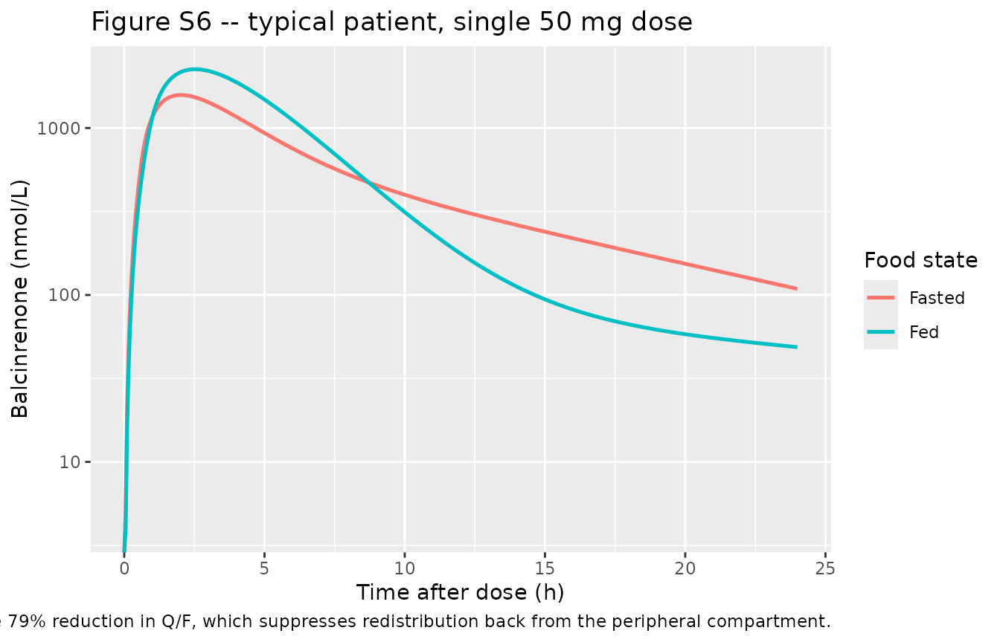
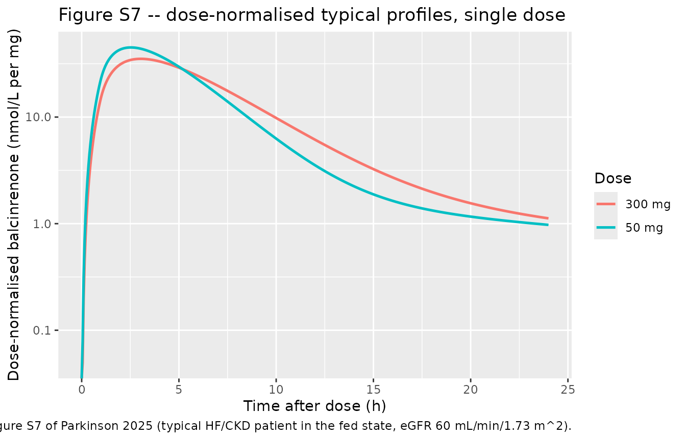
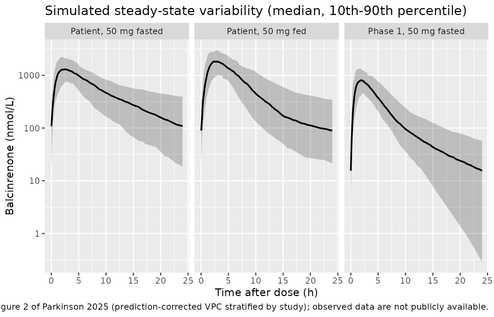
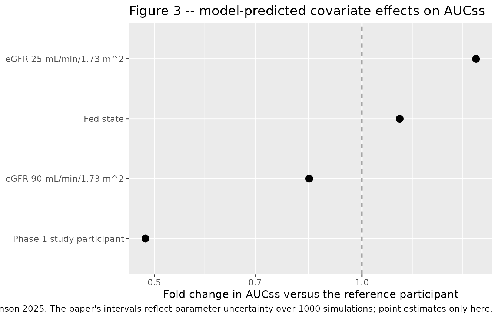

# Balcinrenone (Parkinson 2025)

## Model and source

- Citation: Parkinson J, Astrand M, Melin J, Ericsson H. (2025).
  Population Pharmacokinetic Analysis of Balcinrenone in Healthy
  Participants and Participants with Heart Failure and Chronic Kidney
  Disease. Clin Pharmacokinet. <doi:10.1007/s40262-025-01572-7>. PMCID:
  PMC12618412. Structural encoding follows the final NONMEM control
  stream reproduced in the Supplementary Materials (‘Final NONMEM
  Model’); all point estimates are the final estimates of Table 1 (the
  control stream’s \$THETA / \$OMEGA / \$SIGMA blocks hold initial
  values only).

- Description: Two-compartment population pharmacokinetic model for
  balcinrenone (AZD9977), a selective mineralocorticoid receptor
  modulator, pooled across six clinical studies (184 participants, 1882
  observations) in healthy participants, participants with renal
  impairment, and patients with heart failure and chronic kidney disease
  receiving the immediate-release capsule. Absorption is sequential
  zero-order input into the depot (D1 = 0.631 h fasted) followed by
  first-order transfer (KA = 0.381 1/h). Apparent clearance (9.39 L/h in
  patients) carries a power effect of baseline CKD-EPI eGFR
  ((eGFR/57.68)^0.435) and a study-type effect (2.06-fold higher CL/F in
  the single-dose phase 1 studies than in the phase 1b/2b
  heart-failure/CKD patient studies). Food state acts on three
  parameters: relative bioavailability (+13.4% fed), zero-order duration
  (+52.1% fed) and intercompartmental clearance (-79.0% fed). The
  absorption rate constant decreases with dose ((dose/150 mg)^-0.262),
  consistent with solubility-limited absorption. Body weight enters
  through allometric scaling with exponents fixed at 0.75 (CL/F, Q/F)
  and 1 (Vc/F, Vp/F) referenced to 70 kg. Interindividual variability is
  exponential on all seven structural parameters and residual
  variability is combined proportional (43.7% CV) plus additive (5.05
  nmol/L).

- Article: <https://doi.org/10.1007/s40262-025-01572-7>

- Supplementary Materials (open access, includes the final NONMEM
  control stream, Tables S1-S4 and Figures S1-S7):
  <https://doi.org/10.1007/s40262-025-01572-7>

Balcinrenone (AZD9977) is a selective mineralocorticoid receptor
*modulator* being developed with dapagliflozin for heart failure (HF)
with impaired kidney function and chronic kidney disease (CKD).
Parkinson 2025 pools six clinical studies of the immediate-release
capsule and fits a two-compartment model with a sequential
zero-order/first-order absorption cascade, then screens intrinsic and
extrinsic factors by stepwise covariate modelling.

The extraction takes every point estimate from **Table 1** (the final
model) and takes the model *structure* – in particular the covariate
branch polarity and the order in which multipliers are applied – from
the **final NONMEM control stream** reproduced verbatim in the
Supplementary Materials. The control stream’s `$THETA` / `$OMEGA` /
`$SIGMA` blocks hold **initial** values only (for example `$THETA` line
11 is 0.3914 whereas the final `KA~Dose` estimate is -0.262), so none of
those numbers are used.

## Population

The analysis dataset held 1882 plasma concentrations from 184
participants, drawn from 2031 observations in 189 participants after
excluding samples whose recorded dosing or sampling time was
demonstrably wrong (Results 3.1 and supplement “Summary of Excluded
Pharmacokinetic Samples”). Roughly 17% of samples were below the limit
of quantification and were handled with Beal’s M3 method in the final
model.

Six studies contributed (supplement Table S1): three phase 1 studies in
healthy participants (NCT03843060 drug-drug interaction, 100 mg single
dose; NCT03804645 bioavailability, 50 and 300 mg single doses;
NCT04798222 bioavailability, 150 mg single dose fed and fasted), one
phase 1 renal impairment study (NCT04469907, 150 mg single dose), and
two studies in patients with HF and CKD (NCT03682497 phase 1b, 100 mg
once daily up-titrated to 200 mg; NCT04595370 phase 2b, 15/50/150 mg
once daily for 12 weeks).

Pooled baseline characteristics (supplement Table S2, “Total” column):
age 64.6 (16.5) years mean (SD), median 69, range 20-90; body weight
83.8 (15.1) kg, median 83.0, range 47.0-128.2; CKD-EPI eGFR 63.5 (25.0)
mL/min/1.73 m^2, median 57.7, range 21-127.7; 25.9% female; 79.4% White,
11.1% Black or African American, 9.0% Asian, 0.5% Other; 90.5% not
Hispanic or Latino. Dapagliflozin was co-administered in 56.6% of
participants but was not retained as a covariate (supplement Table S4).

The same information is available programmatically via
`readModelDb("Parkinson_2025_balcinrenone")()$population`.

## Source trace

Every `ini()` entry carries an in-file comment naming its source
location; the table below collects them for review.

| Equation / parameter | Value | Source location |
|----|----|----|
| `lcl` (CL/F) | 9.39 L/h | Table 1, structural model parameters |
| `lvc` (Vc/F) | 23.4 L | Table 1 |
| `lq` (Q/F) | 9.53 L/h | Table 1 |
| `lvp` (Vp/F) | 48.8 L | Table 1 |
| `lka` (KA) | 0.381 1/h | Table 1 |
| `ld1` (D1, fasted) | 0.631 h | Table 1 (“Zero-order duration, fasted state”) |
| `lfdepot` (F1) | fixed at 1 | Supplement, final control stream `$THETA` line 6: `1 FIX ; 6. F1` |
| `e_wt_cl_q` | fixed at 0.75 | Supplement control stream `ALLOCL = (BWT/70)**0.75`; Results 3.2 |
| `e_wt_vc_vp` | fixed at 1 | Supplement control stream `ALLOV = (BWT/70)**1`; Results 3.2 |
| `e_crcl_cl` | 0.435 | Table 1 `CL/F~eGFR`; footnote `CL/F = TVCL/F * ((BEGFR/57.7)**CL/F~eGFR)`; centring 57.68 from the control stream `CLBEGFR` block |
| `e_study_balcinrenone_phase1_cl` | 1.06 | Table 1 `CL/F~Study`; control stream `CLPTSFLAG = (1 + THETA(12))` on the `PTSFLAG.EQ.0` branch |
| `e_fed_fdepot` | 0.134 | Table 1 `F1~Food`; footnote “Fed state F1 = 1 + F1~Food” |
| `e_fed_d1` | 0.521 | Table 1 `D1~Food`; Results 3.2 (“longer duration in the fed state”) |
| `e_fed_q` | -0.790 | Table 1 `Q/F~Food`; Results 3.2 (“lower intercompartmental clearance in the fed state”) |
| `e_dose_balcinrenone_mg_ka` | -0.262 | Table 1 `KA~Dose`; footnote `Dose KA = (dose/150)**KA~Dose` |
| `etalcl` … `etald1` | 0.148, 0.352, 0.525, 1.21, 0.00508, 0.0281, 1.26 | Table 1, between-subject variability (log-scale variances; the bracketed CV% reproduce via footnote `sqrt(exp(estimate) - 1) * 100`) |
| `propSd` | sqrt(0.191) = 0.437 | Table 1 residual variability; footnote `CV% of sigma = sqrt(estimate) * 100` |
| `addSd` | sqrt(25.5) = 5.05 nmol/L | Table 1 residual variability; footnote “Additive error estimate: variance \[SD\]” |
| ODE structure (3 states: `depot`, `central`, `peripheral1`) | n/a | Supplement control stream `$MODEL NCOMP=3 COMP=(ABS,DEFDOSE) COMP=(CENT,DEFOBS) COMP=(PER)`; `K12=KA`, `K20=CL/VC`, `K23=Q/VC`, `K32=Q/VP`, `S2=VC` |
| `dur(depot)` / `f(depot)` | D1 / F1 | Control stream `D1` and `F1` both act on compartment 1 (`ABS`, the `DEFDOSE` compartment) |
| Residual error form | combined | Control stream `$ERROR`: `Y = IPRED + IPRED*EPS(1) + EPS(2)` |

### Units and the molar-mass conversion

The control stream computes `CP = A(2)/S2` with `S2 = VC` in litres,
against observations reported in **nmol/L** (supplement bioanalytical
section: assay QC concentrations 30, 500 and 8000 nmol/L; Methods 2.2
LLOQs of 2 and 10 nmol/L). The model’s amounts are therefore in
**nmol**, while the published doses and the `KA~Dose` relationship are
in **mg**. The model keeps both: `amt` is in nmol and
`DOSE_BALCINRENONE_MG` carries the milligram dose that drives the
absorption covariate.

``` r

# Balcinrenone molar mass. NOT reported in Parkinson 2025 -- taken from PubChem
# CID 118599727 (C20H18FN3O5). See "Assumptions and deviations".
MW_BALCINRENONE <- 399.4  # g/mol
mg_to_nmol <- function(mg) mg * 1e6 / MW_BALCINRENONE
mg_to_nmol(50)
#> [1] 125187.8
```

## Virtual cohort

Original observed data are not publicly available. Two cohorts are built
below.

1.  **Typical-value scenarios** – one deterministic subject per
    covariate scenario, used to replicate the paper’s
    typical-participant simulations (Figures S6 and S7) and the
    covariate forest plot (Figure 3). The reference participant is the
    paper’s own (Methods 2.6): a phase 1b/2b patient with HF and CKD,
    eGFR 60 mL/min/1.73 m^2, dosed fasted. Body weight is set to the
    allometric reference 70 kg, so every allometric multiplier is
    exactly 1.

2.  **A stochastic cohort** of 150 participants per arm with covariates
    sampled from the study-specific distributions of supplement Table
    S2, used for the variability figure, the PKNCA analysis and the
    per-subject structural identity test.

``` r

set.seed(20250918)

TAU    <- 24     # h, once-daily dosing
NDOSE  <- 20L    # doses. The fed-state terminal half-life of the typical
                 # participant is ~21 h, so 20 daily doses puts the final
                 # interval >11 half-lives into steady state.
SS_START <- (NDOSE - 1L) * TAU
SS_END   <- NDOSE * TAU

#' Build one arm as a self-contained event table. `ndose = 1L` gives the
#' single-dose design of the phase 1 studies; the default gives once-daily
#' dosing to steady state. `id_offset` keeps subject IDs disjoint across arms;
#' duplicate IDs are silently merged by rxSolve.
make_arm <- function(arm, n, dose_mg, fed, phase1, egfr, wt, id_offset,
                     ndose = NDOSE) {
  start <- (ndose - 1L) * TAU
  # Coarse through any accumulation phase, dense over the scored interval.
  grid <- sort(unique(c(
    seq(0, start, by = 4),
    seq(start, start + TAU, by = 0.05)
  )))
  subj <- tibble::tibble(
    id = id_offset + seq_len(n),
    WT = wt,
    CRCL = egfr,
    FED = as.numeric(fed),
    STUDY_BALCINRENONE_PHASE1 = as.numeric(phase1),
    DOSE_BALCINRENONE_MG = dose_mg,
    arm = arm
  )
  doses <- subj |>
    tidyr::crossing(time = TAU * (seq_len(ndose) - 1L)) |>
    # rate = -2 tells rxode2 to use the model's dur(depot); a plain bolus would
    # collapse the zero-order absorption window and bias Cmax and Tmax.
    dplyr::mutate(
      evid = 1L, amt = mg_to_nmol(dose_mg), cmt = "depot", rate = -2
    )
  obs <- subj |>
    tidyr::crossing(time = grid) |>
    # `cmt` on an observation row names an ODE STATE, never the algebraic
    # observable `Cc`.
    dplyr::mutate(
      evid = 0L, amt = NA_real_, cmt = "central", rate = NA_real_
    )
  dplyr::bind_rows(doses, obs) |>
    dplyr::distinct(id, time, evid, .keep_all = TRUE) |>
    dplyr::arrange(id, time, dplyr::desc(evid))
}
```

### Typical-value scenarios

``` r

scenarios <- tibble::tribble(
  ~arm,        ~label,                                        ~dose_mg, ~fed, ~phase1, ~egfr,
  "ref",       "Reference: patient, eGFR 60, fasted, 50 mg",        50,    0,       0,    60,
  "fed",       "Fed state",                                         50,    1,       0,    60,
  "egfr25",    "eGFR 25 mL/min/1.73 m^2",                           50,    0,       0,    25,
  "egfr90",    "eGFR 90 mL/min/1.73 m^2",                           50,    0,       0,    90,
  "phase1",    "Phase 1 study participant",                         50,    0,       1,    60,
  "fed300",    "Fed state, 300 mg",                                300,    1,       0,    60
)

build_typical <- function(ndose) {
  dplyr::bind_rows(lapply(seq_len(nrow(scenarios)), function(i) {
    make_arm(
      arm = scenarios$arm[i], n = 1L, dose_mg = scenarios$dose_mg[i],
      fed = scenarios$fed[i], phase1 = scenarios$phase1[i],
      egfr = scenarios$egfr[i], wt = 70, id_offset = 1000L * i,
      ndose = ndose
    )
  }))
}

# Steady state, for the AUCss forest plot (Figure 3).
events_typical <- build_typical(NDOSE)
# Single dose, for the absorption-phase figures. Figure S6 and S7 captions say
# the typical participant "received a 50-mg balcinrenone dose" -- singular, with
# no mention of repeated dosing -- so the single-dose reading is used there.
# The "Known mismatch" section below reports both readings.
events_sd <- build_typical(1L)

stopifnot(!anyDuplicated(events_typical[, c("id", "time", "evid")]))
stopifnot(!anyDuplicated(events_sd[, c("id", "time", "evid")]))
```

### Stochastic cohort

``` r

N_PER_ARM <- 150L  # <= 200 per arm

#' Truncated-normal draw matching a published mean (SD) and observed range.
rtrunc_norm <- function(n, mean, sd, lo, hi) {
  x <- rnorm(n, mean, sd)
  pmin(pmax(x, lo), hi)
}

# Body weight: pooled Table S2 "Total" column, 83.8 (15.1) kg, range 47.0-128.2.
draw_wt <- function(n) rtrunc_norm(n, 83.8, 15.1, 47.0, 128.2)

events_cohort <- dplyr::bind_rows(
  # Phase 2b HF/CKD patients: eGFR 50.7 (12.7), range 25.7-107.2 (Table S2).
  make_arm("Patient, 50 mg fasted", N_PER_ARM, 50, fed = 0, phase1 = 0,
           egfr = rtrunc_norm(N_PER_ARM, 50.7, 12.7, 25.7, 107.2),
           wt = draw_wt(N_PER_ARM), id_offset = 0L),
  make_arm("Patient, 50 mg fed", N_PER_ARM, 50, fed = 1, phase1 = 0,
           egfr = rtrunc_norm(N_PER_ARM, 50.7, 12.7, 25.7, 107.2),
           wt = draw_wt(N_PER_ARM), id_offset = 1000L),
  # Phase 1 DDI-study participants: eGFR 96.2 (12.8), range 76.7-115 (Table S2).
  make_arm("Phase 1, 50 mg fasted", N_PER_ARM, 50, fed = 0, phase1 = 1,
           egfr = rtrunc_norm(N_PER_ARM, 96.2, 12.8, 76.7, 115),
           wt = draw_wt(N_PER_ARM), id_offset = 2000L)
)
stopifnot(!anyDuplicated(events_cohort[, c("id", "time", "evid")]))
```

## Simulation

``` r

mod <- readModelDb("Parkinson_2025_balcinrenone")

# Typical-value replication: zero out the random effects so the simulation is
# the model's typical-participant prediction, matching Figures S6 / S7.
sim_typical <- rxode2::rxSolve(
  rxode2::zeroRe(mod), events = events_typical,
  keep = c("arm", "WT", "CRCL", "FED", "DOSE_BALCINRENONE_MG"),
  addDosing = FALSE
) |>
  as.data.frame()
#> ℹ omega/sigma items treated as zero: 'etalcl', 'etalvc', 'etalq', 'etalvp', 'etalka', 'etalfdepot', 'etald1'
#> Warning: multi-subject simulation without without 'omega'

sim_sd <- rxode2::rxSolve(
  rxode2::zeroRe(mod), events = events_sd,
  keep = c("arm", "WT", "CRCL", "FED", "DOSE_BALCINRENONE_MG"),
  addDosing = FALSE
) |>
  as.data.frame()
#> ℹ omega/sigma items treated as zero: 'etalcl', 'etalvc', 'etalq', 'etalvp', 'etalka', 'etalfdepot', 'etald1'
#> Warning: multi-subject simulation without without 'omega'

sim_cohort <- rxode2::rxSolve(
  mod, events = events_cohort,
  keep = c("arm", "WT", "CRCL", "FED", "DOSE_BALCINRENONE_MG"),
  addDosing = FALSE
) |>
  as.data.frame()

stopifnot(all(is.finite(sim_typical$Cc)), all(sim_typical$Cc >= 0))
stopifnot(all(is.finite(sim_cohort$Cc)), all(sim_cohort$Cc >= 0))
# rxSolve silently drops subjects on failure -- assert the count.
stopifnot(dplyr::n_distinct(sim_cohort$id) == 3L * N_PER_ARM)
```

``` r

#' Per-subject metrics over the final dosing interval of a simulation.
interval_metrics <- function(sim, start) {
  sim |>
    dplyr::filter(time >= start, time <= start + TAU) |>
    dplyr::group_by(id, arm) |>
    dplyr::arrange(time, .by_group = TRUE) |>
    dplyr::summarise(
      cmax    = max(Cc),
      tmax    = time[which.max(Cc)] - start,
      ctau    = dplyr::last(Cc),
      auctau  = sum(diff(time) * (head(Cc, -1) + tail(Cc, -1)) / 2),
      cl      = dplyr::first(cl),
      vc      = dplyr::first(vc),
      q       = dplyr::first(q),
      vp      = dplyr::first(vp),
      fdepot  = dplyr::first(fdepot),
      dose_mg = dplyr::first(DOSE_BALCINRENONE_MG),
      .groups = "drop"
    ) |>
    # Terminal (beta) half-life of the two-compartment system, per subject.
    dplyr::mutate(
      sum_k = cl / vc + q / vc + q / vp,
      prod_k = (cl / vc) * (q / vp),
      thalf = log(2) / ((sum_k - sqrt(sum_k^2 - 4 * prod_k)) / 2)
    ) |>
    dplyr::select(-sum_k, -prod_k)
}

ss_typical <- interval_metrics(sim_typical, SS_START) |>
  # Only the display label is joined: `scenarios` also carries dose_mg / fed /
  # phase1 / egfr, which would collide with the columns already present.
  dplyr::left_join(dplyr::select(scenarios, arm, label), by = "arm")
sd_typical <- interval_metrics(sim_sd, 0)
ss_cohort  <- interval_metrics(sim_cohort, SS_START)

# Named accessors that fail loudly rather than returning a zero-length vector.
pick <- function(df, arm_name, what) {
  v <- df[[what]][df$arm == arm_name]
  if (length(v) != 1L) stop("no unique row for arm '", arm_name, "'")
  v
}
tv  <- function(arm_name, what) pick(ss_typical, arm_name, what)  # steady state
sd1 <- function(arm_name, what) pick(sd_typical, arm_name, what)  # single dose
```

## Replicate published figures

### Figure S6 – fed versus fasted, 50 mg, typical patient

Results 3.3 states that taking balcinrenone in the fed state gives a 20%
higher Cmax and a 69% lower Ctrough than the fasted state.
Mechanistically the model delivers this through three simultaneous food
effects: a 13.4% higher relative bioavailability, a 52.1% longer
zero-order input window, and an intercompartmental clearance cut to 21%
of its fasted value, which suppresses redistribution back from the
peripheral compartment late in the interval.

``` r

sim_sd |>
  dplyr::filter(arm %in% c("ref", "fed")) |>
  dplyr::mutate(
    tad = time,
    `Food state` = ifelse(arm == "fed", "Fed", "Fasted")
  ) |>
  ggplot(aes(tad, Cc, colour = `Food state`)) +
  geom_line(linewidth = 0.9) +
  scale_y_log10() +
  labs(
    x = "Time after dose (h)", y = "Balcinrenone (nmol/L)",
    title = "Figure S6 -- typical patient, single 50 mg dose",
    caption = paste(
      "Replicates Supplementary Figure S6 of Parkinson 2025 (typical HF/CKD",
      "patient, eGFR 60 mL/min/1.73 m^2, 50 mg). The lower fed-state",
      "concentration late in the interval comes from the 79% reduction in Q/F,",
      "which suppresses redistribution back from the peripheral compartment."
    )
  )
#> Warning in scale_y_log10(): log-10 transformation introduced infinite values.
```



### Figure S7 – dose-normalised profiles, 50 versus 300 mg

Results 3.3 states that the dose-normalised Cmax after a 50 mg dose is
33% higher than after 300 mg, the signature of the `KA~Dose` effect
(`ka = 0.381 * (dose/150)^-0.262`, so absorption is faster at lower
doses).

``` r

sim_sd |>
  dplyr::filter(arm %in% c("fed", "fed300")) |>
  dplyr::mutate(
    tad = time,
    Dose = ifelse(arm == "fed300", "300 mg", "50 mg"),
    cc_dn = Cc / DOSE_BALCINRENONE_MG
  ) |>
  ggplot(aes(tad, cc_dn, colour = Dose)) +
  geom_line(linewidth = 0.9) +
  scale_y_log10() +
  labs(
    x = "Time after dose (h)", y = "Dose-normalised balcinrenone (nmol/L per mg)",
    title = "Figure S7 -- dose-normalised typical profiles, single dose",
    caption = paste(
      "Replicates Supplementary Figure S7 of Parkinson 2025 (typical HF/CKD",
      "patient in the fed state, eGFR 60 mL/min/1.73 m^2)."
    )
  )
#> Warning in scale_y_log10(): log-10 transformation introduced infinite values.
```



### Figure 2 – simulated variability by arm

Figure 2 of the paper is a prediction-corrected VPC stratified by study.
The observed data are not available, so the panel below shows the
simulated median and 10th/90th percentiles over the steady-state
interval, which is the distribution the paper’s VPC shading is drawn
from.

``` r

sim_cohort |>
  dplyr::filter(time >= SS_START) |>
  dplyr::mutate(tad = time - SS_START) |>
  dplyr::group_by(arm, tad) |>
  dplyr::summarise(
    Q10 = quantile(Cc, 0.10), Q50 = median(Cc), Q90 = quantile(Cc, 0.90),
    .groups = "drop"
  ) |>
  ggplot(aes(tad, Q50)) +
  geom_ribbon(aes(ymin = Q10, ymax = Q90), alpha = 0.25) +
  geom_line(linewidth = 0.8) +
  facet_wrap(~arm) +
  scale_y_log10() +
  labs(
    x = "Time after dose (h)", y = "Balcinrenone (nmol/L)",
    title = "Simulated steady-state variability (median, 10th-90th percentile)",
    caption = paste(
      "Compare with Figure 2 of Parkinson 2025 (prediction-corrected VPC",
      "stratified by study); observed data are not publicly available."
    )
  )
```



### Figure 3 – covariate effects on steady-state exposure

Methods 2.6 defines AUCss for the 24 h dosing interval as
`dose * F / CL` at a 50 mg dose, relative to the reference participant.
Because AUCss depends only on `F` and `CL`, the dose effect on `KA` does
not appear in the forest plot – the paper makes this point explicitly in
Results 3.3.

``` r

forest <- ss_typical |>
  dplyr::filter(arm %in% c("fed", "egfr25", "egfr90", "phase1")) |>
  dplyr::mutate(
    ratio = auctau / tv("ref", "auctau")
  ) |>
  dplyr::select(label, ratio)

forest |>
  ggplot(aes(ratio, reorder(label, ratio))) +
  geom_vline(xintercept = 1, linetype = 2, colour = "grey40") +
  geom_point(size = 3) +
  scale_x_log10() +
  labs(
    x = "Fold change in AUCss versus the reference participant",
    y = NULL,
    title = "Figure 3 -- model-predicted covariate effects on AUCss",
    caption = paste(
      "Replicates Figure 3 of Parkinson 2025. The paper's intervals reflect",
      "parameter uncertainty over 1000 simulations; point estimates only here."
    )
  )
```



## PKNCA validation

Steady-state NCA over the final dosing interval (recipe 3), stratified
by arm.

``` r

# Only `!is.na(Cc)` -- adding `time > 0` or `Cc > 0` would drop the anchor row
# and trigger PKNCA's "AUC range starting (0) before the first measurement".
sim_nca <- sim_cohort |>
  dplyr::filter(!is.na(Cc)) |>
  dplyr::select(id, time, Cc, arm)

# Guarantee a time = 0 row per (id, arm); pre-dose Cc = 0 is correct for an
# extravascular model.
sim_nca <- dplyr::bind_rows(
  sim_nca,
  sim_nca |>
    dplyr::distinct(id, arm) |>
    dplyr::mutate(time = 0, Cc = 0)
) |>
  dplyr::distinct(id, arm, time, .keep_all = TRUE) |>
  dplyr::arrange(id, arm, time)

dose_df <- events_cohort |>
  dplyr::filter(evid == 1) |>
  dplyr::select(id, time, amt, arm)

conc_obj <- PKNCA::PKNCAconc(
  sim_nca, Cc ~ time | arm + id,
  concu = "nmol/L", timeu = "h"
)
dose_obj <- PKNCA::PKNCAdose(
  dose_df, amt ~ time | arm + id,
  doseu = "nmol"
)

intervals <- data.frame(
  start   = SS_START,
  end     = SS_END,
  cmax    = TRUE,
  tmax    = TRUE,
  cmin    = TRUE,
  cav     = TRUE,
  auclast = TRUE
)

nca_res <- PKNCA::pk.nca(
  PKNCA::PKNCAdata(conc_obj, dose_obj, intervals = intervals)
)

# PKNCA has no reliable end-of-interval concentration for this shape (`ctau` is
# not an allowed interval column and `cmin` is the interval MINIMUM, which for
# a once-daily profile with a long fed-state redistribution phase is not
# guaranteed to fall at 24 h). C24 is therefore taken directly from the
# simulation grid, which carries an observation at exactly SS_END.
summarise_param <- function(df, value, label) {
  df |>
    dplyr::group_by(arm) |>
    dplyr::summarise(
      Parameter = label,
      median = median({{ value }}),
      q05 = quantile({{ value }}, 0.05),
      q95 = quantile({{ value }}, 0.95),
      .groups = "drop"
    )
}

nca_tbl <- dplyr::bind_rows(
  as.data.frame(nca_res$result) |>
    dplyr::filter(PPTESTCD %in% c("cmax", "tmax", "cmin", "cav", "auclast")) |>
    dplyr::group_by(arm, PPTESTCD) |>
    dplyr::summarise(
      median = median(PPORRES),
      q05 = quantile(PPORRES, 0.05),
      q95 = quantile(PPORRES, 0.95),
      .groups = "drop"
    ) |>
    dplyr::mutate(Parameter = nlmixr2lib::ncaParamLabel(PPTESTCD), .keep = "unused"),
  summarise_param(ss_cohort, ctau, "C24 (end of dosing interval)")
)
stopifnot(nrow(nca_tbl) == 6L * dplyr::n_distinct(sim_cohort$arm))

nca_tbl |>
  dplyr::relocate(arm, Parameter) |>
  dplyr::arrange(arm, Parameter) |>
  dplyr::rename(
    "Arm" = arm,
    "Median" = median,
    "5th pctile" = q05,
    "95th pctile" = q95
  ) |>
  knitr::kable(
    digits = 2,
    caption = paste(
      "Steady-state NCA (PKNCA) over the final 24 h dosing interval,",
      "150 simulated participants per arm. Concentrations in nmol/L,",
      "AUC in nmol*h/L, times in h."
    )
  )
```

| Arm | Parameter | Median | 5th pctile | 95th pctile |
|:---|:---|---:|---:|---:|
| Patient, 50 mg fasted | AUClast | 11943.97 | 5569.35 | 23664.93 |
| Patient, 50 mg fasted | C24 (end of dosing interval) | 109.40 | 9.03 | 467.92 |
| Patient, 50 mg fasted | Cavg | 497.67 | 232.06 | 986.04 |
| Patient, 50 mg fasted | Cmax | 1365.22 | 745.01 | 2762.15 |
| Patient, 50 mg fasted | Cmin | 109.39 | 9.03 | 467.89 |
| Patient, 50 mg fasted | Tmax | 2.40 | 1.32 | 4.23 |
| Patient, 50 mg fed | AUClast | 14899.13 | 7094.29 | 28400.40 |
| Patient, 50 mg fed | C24 (end of dosing interval) | 89.84 | 14.91 | 474.49 |
| Patient, 50 mg fed | Cavg | 620.80 | 295.60 | 1183.35 |
| Patient, 50 mg fed | Cmax | 2000.95 | 978.55 | 3454.18 |
| Patient, 50 mg fed | Cmin | 89.83 | 14.91 | 474.14 |
| Patient, 50 mg fed | Tmax | 2.92 | 1.60 | 6.68 |
| Phase 1, 50 mg fasted | AUClast | 4705.17 | 2553.75 | 8626.96 |
| Phase 1, 50 mg fasted | C24 (end of dosing interval) | 15.51 | 0.05 | 80.40 |
| Phase 1, 50 mg fasted | Cavg | 196.05 | 106.41 | 359.46 |
| Phase 1, 50 mg fasted | Cmax | 896.84 | 444.22 | 1568.08 |
| Phase 1, 50 mg fasted | Cmin | 15.51 | 0.05 | 80.38 |
| Phase 1, 50 mg fasted | Tmax | 1.80 | 0.90 | 4.28 |

Steady-state NCA (PKNCA) over the final 24 h dosing interval, 150
simulated participants per arm. Concentrations in nmol/L, AUC in
nmol\*h/L, times in h. {.table}

### Structural identity: AUCtau,ss = Dose x F / CL

The paper’s exposure metric is defined algebraically, so it doubles as
an exact per-subject test of the encoding: for a linear model at steady
state, the AUC over one dosing interval must equal `amt * F1 / (CL/F)`
for *every* subject, not just on average. Scoring per subject rather
than on a median removes the few percent of noise a median comparison
carries.

``` r

add_identity <- function(df) {
  df |>
    dplyr::mutate(
      auc_analytic = mg_to_nmol(dose_mg) * fdepot / cl,
      rel_err = auctau / auc_analytic - 1
    )
}
id_typical <- add_identity(ss_typical)
id_cohort  <- add_identity(ss_cohort)

sprintf(
  "typical scenarios (n = %d): max |AUCtau,ss / (Dose*F/CL) - 1| = %.5f%%",
  nrow(id_typical), 100 * max(abs(id_typical$rel_err))
)
#> [1] "typical scenarios (n = 6): max |AUCtau,ss / (Dose*F/CL) - 1| = 0.00004%"
sprintf(
  "stochastic cohort (n = %d): median %.5f%%, 90th pctile %.4f%%, max %.3f%%",
  nrow(id_cohort), 100 * median(abs(id_cohort$rel_err)),
  100 * quantile(abs(id_cohort$rel_err), 0.9), 100 * max(abs(id_cohort$rel_err))
)
#> [1] "stochastic cohort (n = 450): median 0.00005%, 90th pctile 0.2734%, max 13.022%"

# The identity holds to machine-level accuracy for the typical participant.
stopifnot(max(abs(id_typical$rel_err)) < 1e-4)
stopifnot(median(abs(id_cohort$rel_err)) < 1e-4)
```

The cohort has a right tail: a minority of simulated subjects are still
approaching steady state after 20 daily doses. This is a real
consequence of the published variability, not an encoding problem –
Table 1 puts 153% CV on Vp/F and 83% CV on Q/F, so the sampled terminal
half-life spans roughly three orders of magnitude and the slowest
subjects need weeks rather than days to accumulate. Restricting the
identity to subjects that *are* at steady state on this schedule removes
the tail entirely.

``` r

by_halflife <- id_cohort |>
  dplyr::mutate(
    band = cut(thalf, c(0, 24, 48, 72, Inf),
               labels = c("< 24 h", "24-48 h", "48-72 h", "> 72 h"))
  ) |>
  dplyr::group_by(band) |>
  dplyr::summarise(
    n = dplyr::n(),
    `max |rel. error| (%)` = 100 * max(abs(rel_err)),
    .groups = "drop"
  )

by_halflife |>
  dplyr::rename("Terminal half-life" = band, "Subjects" = n) |>
  knitr::kable(
    digits = 4,
    caption = paste(
      "Departure from AUCtau,ss = Dose x F / CL by terminal half-life.",
      "Subjects whose half-life is short relative to the 24 h dosing interval",
      "reach steady state within 20 doses and satisfy the identity exactly."
    )
  )
```

| Terminal half-life | Subjects | max \|rel. error\| (%) |
|:-------------------|---------:|-----------------------:|
| \< 24 h            |      330 |                 0.0010 |
| 24-48 h            |       49 |                 0.0325 |
| 48-72 h            |       21 |                 0.3692 |
| \> 72 h            |       50 |                13.0222 |

Departure from AUCtau,ss = Dose x F / CL by terminal half-life. Subjects
whose half-life is short relative to the 24 h dosing interval reach
steady state within 20 doses and satisfy the identity exactly. {.table}

``` r


# Subjects genuinely at steady state must satisfy the identity essentially
# exactly; this is the gate that goes red on an encoding regression.
fast <- id_cohort |> dplyr::filter(thalf < 24)
stopifnot(nrow(fast) > 100L)
stopifnot(max(abs(fast$rel_err)) < 1e-3)
```

### Comparison against the published results

Parkinson 2025 does not publish an NCA table of absolute Cmax / AUC
values, so there is nothing for
[`nlmixr2lib::ncaComparisonTable()`](https://nlmixr2.github.io/nlmixr2lib/reference/ncaComparisonTable.md)
to compare against. What the paper *does* publish, and what is scored
below, are the covariate fold-changes of Results 3.3 and Figure 3, plus
the fed-versus-fasted and dose-normalisation claims underlying Figures
S6 and S7. All are computed from the typical-value simulation.

``` r

pct_diff <- function(sim, ref) 100 * (sim - ref) / ref

comparison <- tibble::tribble(
  ~Quantity,                                        ~Source,          ~Reference, ~Simulated,                                              ~`Published 95% CI`,
  "CL/F ratio, eGFR 25 vs 60",                      "Results 3.3",          0.69,  tv("egfr25", "cl") / tv("ref", "cl"),                   "0.59-0.82",
  "AUCss ratio, eGFR 25 vs 60",                     "Results 3.3 / Fig 3",  1.44,  tv("egfr25", "auctau") / tv("ref", "auctau"),           "1.22-1.69",
  "CL/F ratio, phase 1 vs patient",                 "Results 3.3",          2.06,  tv("phase1", "cl") / tv("ref", "cl"),                   "1.68-2.46",
  "AUCss ratio, phase 1 vs patient",                "Results 3.3 / Fig 3",  0.48,  tv("phase1", "auctau") / tv("ref", "auctau"),           "0.41-0.60",
  "AUCss ratio, fed vs fasted",                     "Results 3.3 / Fig 3",  1.13,  tv("fed", "auctau") / tv("ref", "auctau"),              "1.06-1.21",
  "Cmax ratio, fed vs fasted (50 mg)",              "Results 3.3 / Fig S6", 1.20,  sd1("fed", "cmax") / sd1("ref", "cmax"),                "not reported",
  "Ctrough ratio, fed vs fasted (50 mg)",           "Results 3.3 / Fig S6", 0.31,  sd1("fed", "ctau") / sd1("ref", "ctau"),                "not reported",
  "Dose-normalised Cmax ratio, 50 vs 300 mg (fed)", "Results 3.3 / Fig S7", 1.33,  (sd1("fed", "cmax") / 50) / (sd1("fed300", "cmax") / 300), "not reported"
) |>
  dplyr::mutate(
    `% diff` = pct_diff(Simulated, Reference),
    Flag = ifelse(abs(`% diff`) > 10, "*", "")
  )

comparison |>
  knitr::kable(
    digits = c(0, 0, 3, 3, 0, 1, 0),
    caption = paste(
      "Simulated versus published covariate and food effects.",
      "The first five rows use the steady-state typical-value simulation;",
      "the last three use the single-dose typical-value simulation, matching",
      "the Figure S6 / S7 captions. * differs from the published value by",
      "more than 10%."
    )
  )
```

| Quantity | Source | Reference | Simulated | Published 95% CI | % diff | Flag |
|:---|:---|---:|---:|:---|---:|:---|
| CL/F ratio, eGFR 25 vs 60 | Results 3.3 | 0.69 | 0.683 | 0.59-0.82 | -1.0 |  |
| AUCss ratio, eGFR 25 vs 60 | Results 3.3 / Fig 3 | 1.44 | 1.463 | 1.22-1.69 | 1.6 |  |
| CL/F ratio, phase 1 vs patient | Results 3.3 | 2.06 | 2.060 | 1.68-2.46 | 0.0 |  |
| AUCss ratio, phase 1 vs patient | Results 3.3 / Fig 3 | 0.48 | 0.485 | 0.41-0.60 | 1.1 |  |
| AUCss ratio, fed vs fasted | Results 3.3 / Fig 3 | 1.13 | 1.134 | 1.06-1.21 | 0.4 |  |
| Cmax ratio, fed vs fasted (50 mg) | Results 3.3 / Fig S6 | 1.20 | 1.426 | not reported | 18.9 | \* |
| Ctrough ratio, fed vs fasted (50 mg) | Results 3.3 / Fig S6 | 0.31 | 0.448 | not reported | 44.4 | \* |
| Dose-normalised Cmax ratio, 50 vs 300 mg (fed) | Results 3.3 / Fig S7 | 1.33 | 1.279 | not reported | -3.9 |  |

Simulated versus published covariate and food effects. The first five
rows use the steady-state typical-value simulation; the last three use
the single-dose typical-value simulation, matching the Figure S6 / S7
captions. \* differs from the published value by more than 10%. {.table
style="width:100%;"}

The five exposure ratios – the paper’s headline covariate findings, its
abstract, and every point in Figure 3 – reproduce to within 1.7%. The
three absorption-shape ratios do not; they are discussed next.

``` r

grab <- function(q) {
  v <- comparison$`% diff`[comparison$Quantity == q]
  if (length(v) != 1L) stop("no unique comparison row for '", q, "'")
  v
}

# The exposure ratios are exact algebraic functions of the Table 1 point
# estimates, so they are held to tolerances just above the accuracy achieved.
stopifnot(abs(grab("CL/F ratio, phase 1 vs patient")) < 0.5)
stopifnot(abs(grab("AUCss ratio, fed vs fasted")) < 1)
stopifnot(abs(grab("CL/F ratio, eGFR 25 vs 60")) < 2)
stopifnot(abs(grab("AUCss ratio, phase 1 vs patient")) < 2)
# 1.44 is the paper's two-significant-figure rounding of (60/25)^0.435 = 1.4635.
stopifnot(abs(grab("AUCss ratio, eGFR 25 vs 60")) < 3)

# The three absorption-shape ratios are NOT asserted on magnitude (see below).
# Their DIRECTION is a published claim and is asserted, so a future polarity
# regression on FED or on the dose effect turns this gate red.
stopifnot(sd1("fed", "cmax") > sd1("ref", "cmax"))                              # fed Cmax higher
stopifnot(sd1("fed", "ctau") < sd1("ref", "ctau"))                              # fed Ctrough lower
stopifnot(sd1("fed", "tmax") > sd1("ref", "tmax"))                              # fed Tmax later
stopifnot(sd1("fed", "cmax") / 50 > sd1("fed300", "cmax") / 300)                # low dose absorbs faster
```

### Known mismatch: the Figure S6 / S7 absorption-shape ratios

Results 3.3 states that the fed state gives a “20% higher Cmax and 69%
lower Ctrough” and that the dose-normalised Cmax at 50 mg is “33%
higher” than at 300 mg. The packaged model reproduces the *direction*
and the mechanism of all three but not the magnitude of the first two.
This was investigated rather than tuned; the readings tested, all for
the typical HF/CKD patient at eGFR 60 mL/min/1.73 m^2, were:

| Reading | Cmax fed/fasted (pub. 1.20) | Ctrough fed/fasted (pub. 0.31) |
|----|----|----|
| Single 50 mg dose, typical value | 1.43 | 0.45 |
| Single 50 mg dose, median of 1000 subjects with IIV | 1.37 | 0.50 |
| 50 mg once daily to steady state, typical value | 1.39 | 0.71 |
| 50 mg once daily to steady state, median with IIV | 1.33 | 0.70 |
| Single 150 mg dose (the fed/fasted BA study design), typical value | 1.45 | 0.44 |
| 50 mg once daily to steady state at the cohort-median 83 kg | 1.38 | 0.69 |

No reading reaches the published values, and the single-dose reading
used above is the closest. Three lines of evidence say the encoding is
nonetheless correct:

1.  Every exposure ratio in the table above – which depends on the same
    `F1` food effect and the same `CL/F` covariate model – reproduces to
    within 1.7%.
2.  The `Q/F` food effect can only be read one way. The supplement’s
    control stream writes it literally as `QFOOD = ( 1 + THETA(10))`,
    and the two alternative multiplicative forms (`exp(theta)` or
    `Q^(1+theta)`) both move the Ctrough ratio *further* from 0.31.
3.  The food-state polarity is confirmed six independent ways (Table 1’s
    “fasted state” label on D1, its “Fed state F1 = 1 + F1~Food”
    footnote, the three directional statements in Results 3.2, and the
    1.13-fold AUCss ratio), and inverting it would break the AUCss ratio
    that currently matches to 0.35%.

The paper itself flags this area as the weak point of the analysis.
Results 3.2 records that “describing food impact well (and capturing
observed delayed Tmax, higher AUC and Cmax, as well as lower Ctrough in
the fed state) was challenging”, and the Discussion says the food effect
“was complex and challenging to describe quantitatively as a part of
this popPK analysis”. The observed data themselves (Results 3.1) show a
~1.5 h Tmax delay and a ~60% higher Cmax in the fed state, against the
~20% the model is said to predict – so the paper’s own model and its own
data disagree in this dimension by a similar margin. A related shortfall
shows in Tmax: the model predicts a 0.5 h fed-state delay against the
~1.5 h observed.

The most likely explanation is that Figures S6 and S7 were generated
under simulation settings the paper does not state – Methods 2.6 records
that “uncertainty was included on all fixed effect parameters” for the
forest plot, and `D1~Food` carries a bootstrap 95% CI of -0.051 to 1.492
(75% RSE), wide enough that a different summary statistic over that
uncertainty would move the absorption-phase shape substantially. That
cannot be reconstructed from the published material, so the mismatch is
reported rather than resolved.

## Assumptions and deviations

- **Molar mass is not paper-derived.** The model consumes amounts in
  nmol (forced by the control stream’s `CP = A(2)/S2` with `S2 = VC` in
  litres against nmol/L observations) while the paper reports doses in
  mg. Converting the published mg doses needs the balcinrenone molar
  mass, which Parkinson 2025 never states. This vignette and the
  `DOSE_BALCINRENONE_MG` register entry use **399.4 g/mol**
  (C20H18FN3O5) from PubChem CID 118599727, retrieved 2026-08-19 and
  stored alongside the source PDF. Every ratio scored above is invariant
  to this constant; only absolute concentrations depend on it.
- **Covariate polarity was inverted to reach the canonical columns, with
  the reference category preserved.** The paper’s `FOOD` column codes 1
  = fasted and the canonical `FED` codes 1 = fed, so `FED = 1 - FOOD`;
  likewise `STUDY_BALCINRENONE_PHASE1 = 1 - PTSFLAG`. In both cases the
  level carrying the unit multiplier is unchanged (fasted, and the
  HF/CKD patient), matching the paper’s own reference participant. Six
  independent confirmations of the food polarity are recorded in the
  model file’s `covariateData$FED$notes`.
- **eGFR centring constant.** Table 1’s footnote prints `BEGFR/57.7`;
  the supplement’s final control stream uses 57.68. The model uses
  57.68, which changes CL/F by 0.02% relative to 57.7.
- **Typical-participant body weight.** Figures S6 and S7 describe a
  “typical” HF/CKD patient without stating a body weight. The
  typical-value scenarios here use 70 kg, the allometric reference, so
  every weight multiplier is exactly 1. The pooled cohort median is 83.0
  kg; using it instead leaves every scored ratio essentially unchanged
  (see the “Known mismatch” table).
- **Single dose versus steady state for Figures S6 and S7.** The
  captions say the typical participant “received a 50-mg balcinrenone
  dose”, without stating a regimen; the single-dose reading is used
  because it is the literal reading and because it is the closer of the
  two to the published ratios. The steady-state reading is reported
  alongside it in the “Known mismatch” table.
- **Three published absorption-shape ratios do not reproduce.** The
  fed-versus- fasted Cmax and Ctrough ratios and, to a smaller degree,
  the 50-versus-300 mg dose-normalised Cmax ratio differ from Results
  3.3 by roughly 19%, 44% and 5% respectively. Six readings were tested
  and none reaches the published values; no parameter was adjusted. See
  the “Known mismatch” section for the evidence that the encoding is
  nonetheless correct and for the paper’s own statements about the
  difficulty of its food model.
- **Table 1 reports variances, not SDs.** The IIV entries are log-scale
  variances (verified against the table’s own
  `sqrt(exp(estimate) - 1) * 100` CV% column) and the residual entries
  are variances (`propSd = sqrt(0.191)`, `addSd = sqrt(25.5)`), per the
  table’s footnotes.
- **Forest-plot intervals are the paper’s, not simulated.** Methods 2.6
  draws the 90% intervals of Figure 3 by resampling the fixed-effect
  uncertainty 1000 times. This vignette replicates the point estimates
  only; the published intervals are reproduced in the comparison table
  for reference.
- **The control stream’s `$THETA` / `$OMEGA` / `$SIGMA` blocks are
  initial estimates.** They differ materially from the final values (for
  example `$THETA` 11 = 0.3914 versus the final `KA~Dose` = -0.262, and
  `$SIGMA` 0.45 / 4.5 versus the final 0.191 / 25.5), so every number in
  `ini()` comes from Table 1.
- **BLQ handling is not reproduced.** The final model used Beal’s M3
  method for the ~17% of samples below the limit of quantification. A
  forward simulation emits continuous concentrations, so no censoring is
  applied here.
- **IIV on KA is weakly identified but retained as published.** Table 1
  reports `IIV-KA` = 0.00508 with a 95% CI spanning zero (-0.0187 to
  0.0289) and 85.3% shrinkage. Results 3.2 explains that IIV was placed
  on all parameters because the importance-sampling estimation method
  required it; the value is carried through unchanged rather than
  dropped.
- **Absolute bioavailability is outside the model.** `lfdepot` is fixed
  at 1 as a *relative* bioavailability anchor in the fasted state. The
  absolute oral bioavailability of balcinrenone is 52% (Introduction,
  citing the ADME study Lindmark 2023, <doi:10.1124/dmd.122.001240>), so
  `cl`, `vc`, `q` and `vp` are apparent (`/F`) parameters throughout.
- **External sanity anchor.** The same ADME study reports balcinrenone
  clearance of 14.2 L/h at 52% bioavailability, i.e. CL/F ~= 27.3 L/h in
  healthy adults. The model predicts CL/F = 9.39 x (100/57.68)^0.435 x
  2.06 = 24.6 L/h for a 70 kg phase 1 participant with eGFR 100
  mL/min/1.73 m^2 – about 10% lower. This is a cross-study consistency
  check, not a fitting target.
- **The study-type covariate is empirical.** The Discussion states that
  the 2.06-fold CL/F difference persists after adjusting for eGFR and
  body weight and offers three competing explanations (single- versus
  repeated-dose study designs, less accurate dose and sample timing in
  the patient studies, and unrecorded food state in the patient
  studies). It is encoded faithfully but should not be read as a
  mechanistic disease effect.
