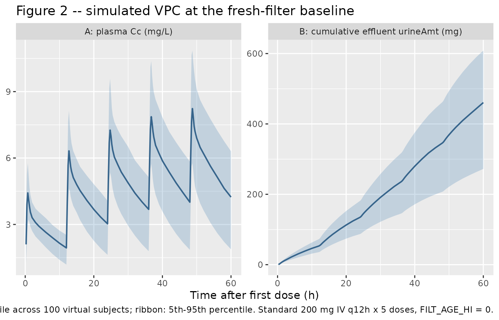
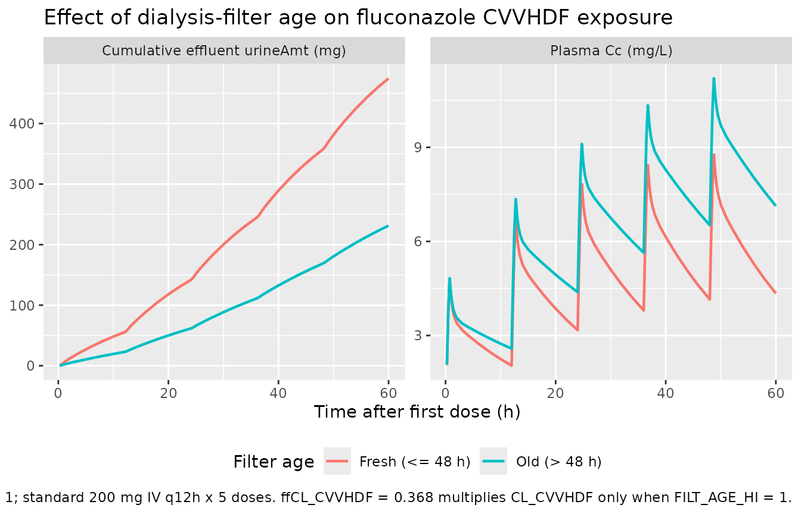

# Fluconazole (Patel 2011)

## Model and source

- Citation: Patel K, Roberts JA, Lipman J, Tett SE, Deldot ME,
  Kirkpatrick CM. Population pharmacokinetics of fluconazole in
  critically ill patients receiving continuous venovenous
  hemodiafiltration: using Monte Carlo simulations to predict doses for
  specified pharmacodynamic targets. *Antimicrobial Agents and
  Chemotherapy* 2011; 55(12):5868-5874.
  <doi:%5B10.1128/AAC.00424-11>\](<https://doi.org/10.1128/AAC.00424-11>).
- Full text (Open Access via PMC):
  <https://pmc.ncbi.nlm.nih.gov/articles/PMC3232798/>.

This is a two-compartment IV-infusion popPK model for fluconazole in 10
critically ill anuric adults receiving continuous venovenous
hemodiafiltration (CVVHDF). Total fluconazole clearance from the central
compartment is partitioned into a CVVHDF-route arm (CL_CVVHDF, encoded
as `lcl_renal`; the dialysis filter performs the renal-mimetic
extracorporeal clearance in these anuric patients) and a non-CVVHDF arm
(CL_NCVVHDF, encoded as `lcl_nonren`). The two arms are fitted
simultaneously to the plasma concentration-time data and the cumulative
amount of fluconazole in the CVVHDF effluent. Dialysis filters in use
for more than 48 hours reduce the CVVHDF clearance efficiency to 36.8%
of the fresh-filter baseline (`FILT_AGE_HI` indicator on the CVVHDF arm;
Patel 2011 Table 2 ffCL_CVVHDF = 0.368, bootstrap 95% CI 0.326-0.426).

``` r

mod_fn  <- readModelDb("Patel_2011_fluconazole")
mod     <- rxode2::rxode2(mod_fn())
mod_typ <- rxode2::rxode2(rxode2::zeroRe(mod_fn()))
```

## Population

The model was developed from 10 critically ill anuric adults enrolled at
the Royal Brisbane and Women’s Hospital, Queensland, Australia, over a
28-month window. Age range 51-76 years (median 67); body weight 50-104
kg (median 80); 50% female; APACHE II scores 17-44 (median 29). All 10
patients were anuric and required CVVHDF for renal failure of any cause;
all were prescribed IV fluconazole for a suspected fungal infection.
Causative organism was *Candida albicans* in 7 patients, *Candida
parapsilosis* in 1, nonfungal in 1, and not listed in 1. Eight of 10
patients had normal liver function; serum albumin was low in all 10
(range 11-30 g/L), consistent with critical illness.

Each patient received a standard 200 mg dose of IV fluconazole twice
daily delivered as a 60-min infusion. Plasma was sampled at 0.5, 1, 2,
3, 4, 6, 8, and 12 h after the dose; CVVHDF effluent was sampled hourly
over 12 h. Patients 3, 4, and 8 were sampled on the first day of
treatment (initial profile); the other 7 patients were sampled on day 3
or day 5 (steady-state profile). The dialysis prescription was uniform:
predilution filtration solution 2 L/h + dialysate 1 L/h = 3 L/h CVVHDF
effluent, with fluid input / effluent flow rates controlled at 999 mL/h.
Blood was pumped at 200 mL/min through a Hospal AN69HF hemofilter. With
the exception of patient 4, all patients had filters in use less than 48
h at the start of CVVHDF treatment.

The same baseline-characteristics summary is available programmatically
via `readModelDb("Patel_2011_fluconazole")$population`.

## Source trace

Per-parameter origins are recorded as in-file comments in
`inst/modeldb/specificDrugs/Patel_2011_fluconazole.R`; the table below
collects them in one place for review.

| Item | Value | Source |
|----|----|----|
| Two-compartment IV-infusion disposition with zero-order input | structural | Patel 2011 Results paragraph 2 (“the time course of fluconazole in plasma was best described by a two-compartment model with combined residual error, BSV on clearance, central volume of distribution, and infusion duration. Input into the central compartment was fitted by zero-order kinetics.”); Figure 1 |
| Additive split CL_total = CL_CVVHDF + CL_NCVVHDF | structural | Patel 2011 Methods (“CVVHDF model”) and Figure 1 |
| `lcl_renal` -\> CL_CVVHDF = 1.66 L/h | 1.66 | Patel 2011 Table 2 |
| `lcl_nonren` -\> CL_NCVVHDF = 1.01 L/h | 1.01 | Patel 2011 Table 2 |
| `lvc` -\> Vc = 31.7 L | 31.7 | Patel 2011 Table 2 |
| `lvp` -\> Vp = 21.9 L | 21.9 | Patel 2011 Table 2 |
| `lq` -\> Q = 27.6 L/h | 27.6 | Patel 2011 Table 2 |
| `ldur` -\> D1 = 0.689 h | 0.689 | Patel 2011 Table 2 |
| `e_filt_age_hi_cl_renal` -\> ffCL_CVVHDF = 0.368 (multiplicative on CL_CVVHDF when FILT_AGE_HI = 1) | 0.368 | Patel 2011 Table 2 (bootstrap 95% CI 0.326-0.426); Results (“filters in use \> 48 h considerably reduced the efficiency of dialysis to 37% of total fluconazole clearance”); Methods (“CVVHDF model”: Delta-OBJ = -11.46) |
| Filter-age binary threshold (48 h) and the n = 1 subject above the threshold | structural | Patel 2011 Methods (“Dosing and sample collection”: “With the exception of patient 4, all patients had filters in use \< 48 h at the start of CVVHDF treatment”) |
| BSV CL_CVVHDF | 19.8% CV -\> log(1 + 0.198^2) | Patel 2011 Table 2 |
| BSV CL_NCVVHDF | 77.1% CV -\> log(1 + 0.771^2) | Patel 2011 Table 2 |
| BSV Vc | 22.9% CV -\> log(1 + 0.229^2) | Patel 2011 Table 2 |
| BSV D1 | 23.0% CV -\> log(1 + 0.230^2) | Patel 2011 Table 2 |
| Lognormal BSV interpretation (omega^2 = log(1 + CV^2)) | structural | Patel 2011 Methods (“Between-subject variability (BSV) was calculated using an exponential variability model and was assumed to follow a lognormal distribution”) |
| `addSd` (plasma additive residual SD) | 0.239 mg/L | Patel 2011 Table 2 (RUVSDP) |
| `propSd` (plasma proportional residual SD) | 0.0367 (3.67% CV) | Patel 2011 Table 2 (RUVCVP) |
| `addSd_urineAmt` (cumulative CVVHDF effluent additive residual SD) | 2.84 mg (see Errata for the units note) | Patel 2011 Table 2 (RUVSDC) |
| Combined exponential + additive plasma residual | structural | Patel 2011 Methods (“Residual unexplained variability (RUV) was modeled using a combined exponential and additive random error”) |
| Additive-only effluent residual | structural | Patel 2011 Results paragraph 3 (“The residual variability for the amount of fluconazole in the CVVHDF effluent was best described by an additive error model”) |
| No demographic covariates retained | structural | Patel 2011 Results paragraph 2 (“After screening all biologically plausible covariates on clearance and volume of distribution, no statistically significant improvements in the base model were found”) |

## Virtual cohort

Original observed concentrations from the 10 enrolled patients are not
publicly available. The simulations below use a 100-subject virtual
cohort, dosed at the standard regimen of 200 mg IV q12h delivered as
60-min infusions over five doses (60 h total simulation horizon, which
spans the initial-profile day-1 dose through to a steady-state day-3
profile per the paper’s sampling design). Subject-level FILT_AGE_HI is
set to 0 for the typical-population scenario (fresh-filter baseline); a
matched n = 100 cohort with FILT_AGE_HI = 1 is built for the
side-by-side filter-age comparison.

The model has no retained demographic covariates, so the covariate
distribution does not affect the simulation; only FILT_AGE_HI matters.

``` r

set.seed(20260609)

n_subjects <- 100L
dose_mg    <- 200
tau_h      <- 12        # q12h dosing interval
n_doses    <- 5L        # 5 doses -> 4 complete intervals; steady state by 48-60 h
t_horizon  <- tau_h * n_doses   # 60 h

build_events <- function(filt_age_hi, id_offset) {
  ids <- id_offset + seq_len(n_subjects)
  dose_times <- (seq_len(n_doses) - 1L) * tau_h

  # Dosing rows: rate = -2 invokes the model-defined dur(central) <- dur_inf
  dose_rows <- tidyr::expand_grid(id = ids, time = dose_times) |>
    dplyr::mutate(
      evid        = 1L,
      cmt         = "central",
      amt         = dose_mg,
      rate        = -2,
      FILT_AGE_HI = filt_age_hi
    )

  # Observation grid: dense over each interval to capture infusion peak +
  # post-infusion decline; sparser at end-of-interval troughs.
  obs_times_one_interval <- c(0.25, 0.5, 0.75, 1, 1.25, 1.5, 2, 3, 4, 6, 8, 10, 12)
  obs_times <- sort(unique(c(
    as.numeric(outer(dose_times, obs_times_one_interval, "+")),
    t_horizon
  )))
  obs_times <- obs_times[obs_times <= t_horizon]
  obs_rows <- tidyr::expand_grid(id = ids, time = obs_times) |>
    dplyr::mutate(
      evid        = 0L,
      cmt         = "Cc",
      amt         = 0,
      rate        = 0,
      FILT_AGE_HI = filt_age_hi
    )

  dplyr::bind_rows(dose_rows, obs_rows) |>
    dplyr::arrange(id, time, dplyr::desc(evid))
}

events_fresh <- build_events(filt_age_hi = 0L, id_offset = 0L)
events_old   <- build_events(filt_age_hi = 1L, id_offset = n_subjects)
events_all   <- dplyr::bind_rows(
  events_fresh |> dplyr::mutate(filter_age = "Fresh (<= 48 h)"),
  events_old   |> dplyr::mutate(filter_age = "Old (> 48 h)")
)

# Disjoint-id sanity check across the two cohorts.
stopifnot(!anyDuplicated(unique(events_all[, c("id", "time", "evid")])))
```

## Simulation

``` r

sim <- rxode2::rxSolve(
  mod,
  events = events_all,
  keep   = c("FILT_AGE_HI", "filter_age")
) |>
  as.data.frame() |>
  dplyr::filter(time > 0)
```

Typical-value (no IIV, no residual) simulation for the deterministic
overlays:

``` r

sim_typ <- rxode2::rxSolve(
  mod_typ,
  events = events_all,
  keep   = c("FILT_AGE_HI", "filter_age")
) |>
  as.data.frame() |>
  dplyr::filter(time > 0)
#> ℹ omega/sigma items treated as zero: 'etalcl_renal', 'etalcl_nonren', 'etalvc', 'etaldur'
#> Warning: multi-subject simulation without without 'omega'
```

## Replicate published figures

### Figure 2 – plasma and CVVHDF-effluent VPC at the fresh-filter baseline

Patel 2011 Figure 2 shows the visual predictive check of fluconazole in
plasma (panels A, C) and in the CVVHDF effluent (panels B, D), with the
top row covering the initial-profile day-1 cohort and the bottom row the
steady-state profile. The chunk below renders an analogous VPC at the
fresh-filter baseline (`FILT_AGE_HI = 0`), with median and
5th/95th-percentile envelopes across the 100-subject virtual cohort.

``` r

vpc_df <- sim |>
  dplyr::filter(filter_age == "Fresh (<= 48 h)") |>
  dplyr::group_by(time) |>
  dplyr::summarise(
    Q05_plasma = stats::quantile(Cc,       0.05, na.rm = TRUE),
    Q50_plasma = stats::quantile(Cc,       0.50, na.rm = TRUE),
    Q95_plasma = stats::quantile(Cc,       0.95, na.rm = TRUE),
    Q05_efflux = stats::quantile(urineAmt, 0.05, na.rm = TRUE),
    Q50_efflux = stats::quantile(urineAmt, 0.50, na.rm = TRUE),
    Q95_efflux = stats::quantile(urineAmt, 0.95, na.rm = TRUE),
    .groups = "drop"
  )

vpc_long <- dplyr::bind_rows(
  vpc_df |>
    dplyr::transmute(time, panel = "A: plasma Cc (mg/L)",
                     Q05 = Q05_plasma, Q50 = Q50_plasma, Q95 = Q95_plasma),
  vpc_df |>
    dplyr::transmute(time, panel = "B: cumulative effluent urineAmt (mg)",
                     Q05 = Q05_efflux, Q50 = Q50_efflux, Q95 = Q95_efflux)
)

ggplot(vpc_long, aes(time, Q50)) +
  geom_ribbon(aes(ymin = Q05, ymax = Q95), alpha = 0.25, fill = "steelblue") +
  geom_line(colour = "steelblue4", size = 0.7) +
  facet_wrap(~ panel, nrow = 1, scales = "free_y") +
  labs(
    x = "Time after first dose (h)",
    y = NULL,
    title = "Figure 2 -- simulated VPC at the fresh-filter baseline",
    caption = paste0(
      "Replicates Figure 2 of Patel 2011 (plasma and CVVHDF effluent). ",
      "Lines: 50th percentile across ", n_subjects, " virtual subjects; ",
      "ribbon: 5th-95th percentile. Standard 200 mg IV q12h x 5 doses, ",
      "FILT_AGE_HI = 0."
    )
  )
#> Warning: Using `size` aesthetic for lines was deprecated in ggplot2 3.4.0.
#> ℹ Please use `linewidth` instead.
#> This warning is displayed once per session.
#> Call `lifecycle::last_lifecycle_warnings()` to see where this warning was
#> generated.
```



### Filter-age effect (Patel 2011 Table 2 ffCL_CVVHDF = 0.368)

The same 100-subject cohort is also simulated with `FILT_AGE_HI = 1`
(filter in use \> 48 h), in which the CVVHDF clearance arm is reduced to
36.8% of its fresh-filter value. The expected qualitative effect is a
higher steady-state plasma Cc (because the CVVHDF-route elimination is
slower) and a lower cumulative effluent urineAmt (because less drug is
extracted into the effluent per unit time).

``` r

filt_summary <- sim_typ |>
  dplyr::group_by(time, filter_age) |>
  dplyr::summarise(
    Cc       = mean(Cc,       na.rm = TRUE),
    urineAmt = mean(urineAmt, na.rm = TRUE),
    .groups  = "drop"
  )

filt_long <- dplyr::bind_rows(
  filt_summary |>
    dplyr::transmute(time, filter_age,
                     panel = "Plasma Cc (mg/L)", value = Cc),
  filt_summary |>
    dplyr::transmute(time, filter_age,
                     panel = "Cumulative effluent urineAmt (mg)", value = urineAmt)
)

ggplot(filt_long, aes(time, value, colour = filter_age)) +
  geom_line(size = 0.8) +
  facet_wrap(~ panel, nrow = 1, scales = "free_y") +
  labs(
    x      = "Time after first dose (h)",
    y      = NULL,
    colour = "Filter age",
    title  = "Effect of dialysis-filter age on fluconazole CVVHDF exposure",
    caption = paste0(
      "Typical-value (no IIV) trajectories at FILT_AGE_HI = 0 vs 1; ",
      "standard 200 mg IV q12h x 5 doses. ",
      "ffCL_CVVHDF = 0.368 multiplies CL_CVVHDF only when FILT_AGE_HI = 1."
    )
  ) +
  theme(legend.position = "bottom")
```



## PKNCA validation

For an IV q12h dosing regimen at steady state, the canonical NCA
quantity of greatest clinical interest in this paper is the
within-interval AUC (`AUC0-tau`), which determines the `fAUC0-24 / MIC`
ratio that drives fluconazole efficacy. Below, AUC0-tau is computed over
the steady-state 48-60 h interval (the fifth dose interval) via PKNCA,
separately for each filter-age cohort.

``` r

sim_nca <- sim |>
  dplyr::filter(!is.na(Cc), time >= 48, time <= 60) |>
  dplyr::select(id, time, Cc, treatment = filter_age)

dose_df <- events_all |>
  dplyr::filter(evid == 1L) |>
  dplyr::select(id, time, amt, treatment = filter_age)

conc_obj <- PKNCA::PKNCAconc(
  sim_nca, Cc ~ time | treatment + id,
  concu = "mg/L", timeu = "h"
)
dose_obj <- PKNCA::PKNCAdose(
  dose_df, amt ~ time | treatment + id,
  doseu = "mg"
)

intervals <- data.frame(
  start   = 48,
  end     = 60,
  cmax    = TRUE,
  cmin    = TRUE,
  cav     = TRUE,
  auclast = TRUE
)

nca_res <- PKNCA::pk.nca(PKNCA::PKNCAdata(conc_obj, dose_obj, intervals = intervals))
```

### Comparison against the derived steady-state AUC0-tau

Under linear kinetics and steady state, the within-interval AUC0-tau =
Dose / CL_total. The Patel 2011 Table 2 typical-value clearances give:

- Fresh filter (FILT_AGE_HI = 0): CL_total = 1.66 + 1.01 = 2.67 L/h, so
  AUC0-tau = 200 / 2.67 = 74.9 mg.h/L per 12 h interval (which
  extrapolates to a steady-state fAUC0-24 of approximately 0.78 \* 2 \*
  74.9 = 116.8 mg.h/L of unbound drug under the paper’s
  22%-protein-binding assumption for critically ill patients).
- Old filter (FILT_AGE_HI = 1): CL_total = 1.66 \* 0.368 + 1.01 = 1.62
  L/h, so AUC0-tau = 200 / 1.62 = 123.5 mg.h/L per 12 h interval – the
  CVVHDF arm slows down, so fluconazole accumulates and the
  within-interval AUC grows by approximately 65%.

``` r

res_tbl <- as.data.frame(nca_res$result)

simulated_summary <- res_tbl |>
  dplyr::filter(PPTESTCD %in% c("cmax", "cmin", "cav", "auclast")) |>
  dplyr::group_by(treatment, PPTESTCD) |>
  dplyr::summarise(
    median = stats::median(PPORRES, na.rm = TRUE),
    q05    = stats::quantile(PPORRES, 0.05, na.rm = TRUE),
    q95    = stats::quantile(PPORRES, 0.95, na.rm = TRUE),
    .groups = "drop"
  )

published_auc <- tibble::tibble(
  treatment = c("Fresh (<= 48 h)", "Old (> 48 h)"),
  derived_AUC0_tau_mg_h_L = c(200 / 2.67, 200 / (1.66 * 0.368 + 1.01))
)

knitr::kable(
  simulated_summary,
  digits  = 2,
  caption = paste("Simulated steady-state NCA parameters (48-60 h dosing",
                  "interval) by filter-age cohort. PPTESTCD: cmax, cmin,",
                  "cav, auclast. Compare auclast against the derived",
                  "Dose / CL_total in the table below.")
)
```

| treatment        | PPTESTCD | median |   q05 |    q95 |
|:-----------------|:---------|-------:|------:|-------:|
| Fresh (\<= 48 h) | auclast  |  68.41 | 38.73 |  93.31 |
| Fresh (\<= 48 h) | cav      |   5.70 |  3.23 |   7.78 |
| Fresh (\<= 48 h) | cmax     |   8.41 |  6.03 |  11.23 |
| Fresh (\<= 48 h) | cmin     |   4.01 |  1.85 |   5.84 |
| Old (\> 48 h)    | auclast  | 100.85 | 48.21 | 146.54 |
| Old (\> 48 h)    | cav      |   8.40 |  4.02 |  12.21 |
| Old (\> 48 h)    | cmax     |  10.92 |  7.13 |  14.92 |
| Old (\> 48 h)    | cmin     |   6.36 |  2.48 |   9.41 |

Simulated steady-state NCA parameters (48-60 h dosing interval) by
filter-age cohort. PPTESTCD: cmax, cmin, cav, auclast. Compare auclast
against the derived Dose / CL_total in the table below. {.table}

``` r


knitr::kable(
  published_auc,
  digits  = 1,
  caption = "Derived steady-state AUC0-tau (mg.h/L) from Patel 2011 Table 2 typical-value clearances."
)
```

| treatment        | derived_AUC0_tau_mg_h_L |
|:-----------------|------------------------:|
| Fresh (\<= 48 h) |                    74.9 |
| Old (\> 48 h)    |                   123.4 |

Derived steady-state AUC0-tau (mg.h/L) from Patel 2011 Table 2
typical-value clearances. {.table}

## Assumptions and deviations

- **Effluent residual-unit convention.** Patel 2011 Table 2 lists the
  CVVHDF residual error `RUVSDC` with units “mg/liters” while the
  paper’s Methods (CVVHDF model paragraph) describes the fit as being on
  “cumulative amounts of fluconazole in the CVVHDF effluent”. The
  packaged model treats the structural state `urine` as a cumulative
  amount (mg) and applies the published 2.84 magnitude as an additive
  residual on that mass scale, consistent with the Krekels 2015
  paracetamol (`urineP` / `urinePG` / `urinePS` cumulative-amount with
  `addSd_urineP` residual in mg) and Taubert 2018 finafloxacin
  (`urineAmt`) urine-compartment precedents. The “mg/liters” label in
  Table 2 most likely reflects the effluent assay’s calibration scale
  (standard curves prepared at 2.0-200 mg/L) rather than the structural
  state’s unit. Downstream users running NCA on the cumulative-effluent
  state can divide by the prescribed CVVHDF effluent rate (3 L/h per
  Patel 2011 Methods) to convert to an instantaneous effluent
  concentration if desired.
- **CVVHDF dialysis prescription is hard-coded into CL_CVVHDF.** Patel
  2011 fits CL_CVVHDF under a uniform dialysis prescription (2 L/h
  predilution filtration + 1 L/h dialysate = 3 L/h effluent, 200 mL/min
  blood flow, Hospal AN69HF hemofilter, 999 mL/h fluid input / effluent
  flow rates). The published CL_CVVHDF point estimate therefore embeds
  this specific prescription; users simulating other dialysate flow
  rates, predilution proportions, or hemofilter types should scale
  CL_CVVHDF accordingly or refit the model against their own data.
- **No demographic covariates were retained.** Patel 2011 screened age,
  total body weight, sex, and APACHE II score with stepwise forwards /
  backwards inclusion at Delta-OBJ \>= 3.84 (p \< 0.05) and retained
  none. The packaged model therefore has no allometric scaling or
  demographic effects on CL, Vc, Q, or Vp – a notable deviation from
  popPK practice in larger cohorts, justified by the small enrolled
  sample (n = 10) and the homogeneity of the underlying dialysis
  prescription.
- **FILT_AGE_HI is informed by n = 1 patient above the 48 h threshold.**
  Only patient 4 had a hemofilter in use \> 48 h at the start of CVVHDF
  treatment. The bootstrap 95% CI on `e_filt_age_hi_cl_renal` (0.326 to
  0.426) is informed by that single subject combined with the dense
  plasma + effluent sampling over the 12 h profile. Patel 2011
  Discussion paragraph 4 cautions that “caution must be applied, since
  only 1 patient received CVVHDF treatment with a 48-h filter. Further
  data are required to confirm the long-term effects of filter age on
  fluconazole clearance.” Simulations using `FILT_AGE_HI = 1` therefore
  extrapolate outside the cohort and should be interpreted with
  appropriate uncertainty.
- **Lognormal BSV interpretation (omega^2 = log(1 + CV^2)).** Patel 2011
  Methods state that BSV “was calculated using an exponential
  variability model and was assumed to follow a lognormal distribution”.
  The packaged model back-transforms the published CV% via
  `omega^2 = log(1 + CV^2)` (the canonical lognormal-arithmetic-CV
  relationship). This is distinct from the `omega^2 = CV^2`
  interpretation used in some NONMEM tables (where CV% is the standard
  deviation of the log-scale eta expressed as a percentage), and is
  consistent with the explicit lognormal language in the Patel 2011
  Methods.
- **No reported correlation between etas.** Patel 2011 Table 2 reports
  only diagonal BSV magnitudes for CL_CVVHDF, CL_NCVVHDF, Vc, and D1; no
  off-diagonal correlation coefficients are reported, so the packaged
  model treats all four etas as independent.
- **NONMEM “exponential” residual maps to `prop()` in nlmixr2.** Patel
  2011 Methods describe the plasma RUV as “a combined exponential and
  additive random error”. The NONMEM exponential residual encodes a
  log-additive error on the observation, which corresponds to a
  proportional residual on the linear concentration scale in nlmixr2 to
  first order in eps (the standard `Cc ~ add(addSd) + prop(propSd)`
  combination). Patel 2011 Table 2 reports propSd as a CV% (3.67%); this
  is read as the linear-scale CV magnitude and entered as
  `propSd = 0.0367`. See
  `.claude/skills/extract-literature-model/references/verification-checklist.md`
  section D for the canonical NONMEM-to-nlmixr2 residual mapping.
- **The healthy-subject comparator (reference 31) is documented but not
  packaged.** Patel 2011 Figure 3C overlays the CVVHDF PTA against a
  healthy-subject parameter set drawn from a separate publication
  (Brammer and Tarbit 1987, reference 31 of Patel 2011), with CL_total =
  1.18 L/h, Vss = 55.7 L, one-compartment disposition. That upstream
  parameter set is NOT encoded here; the packaged model is the CVVHDF
  model only. Users who wish to compare CVVHDF dosing against
  normal-renal-function dosing should reproduce the Brammer and Tarbit
  parameters separately.
