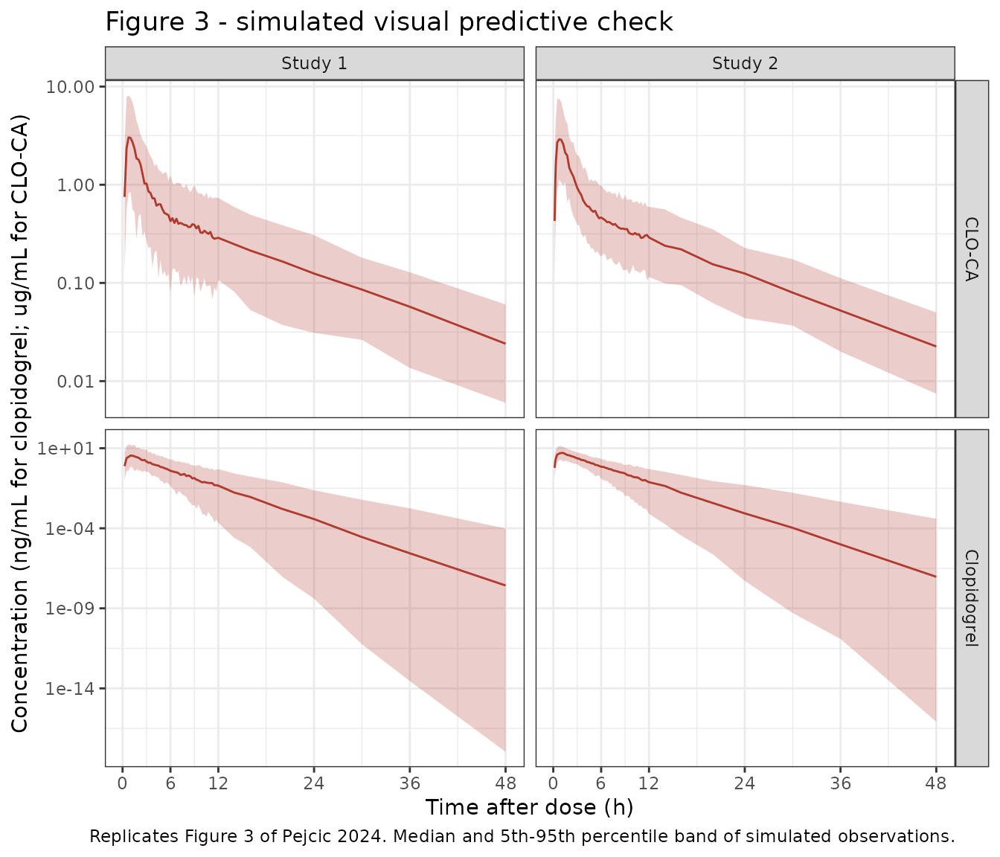
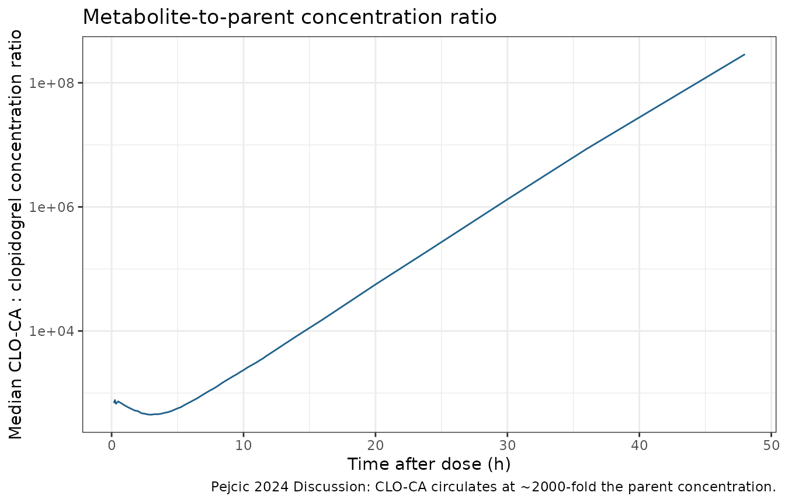

# Clopidogrel (Pejcic 2024)

## Model and source

- Citation: Pejcic Z, Topic Vucenovic V, Miljkovic B, Vucicevic KM.
  Integrating Clopidogrel’s First-Pass Effect in a Joint
  Semi-Physiological Population Pharmacokinetic Model of the Drug and
  Its Inactive Carboxylic Acid Metabolite. Pharmaceutics.
  2024;16(5):685. <doi:10.3390/pharmaceutics16050685>
- Article: <https://doi.org/10.3390/pharmaceutics16050685>
- PubMed Central:
  <https://www.ncbi.nlm.nih.gov/pmc/articles/PMC11124785/>

Pejcic 2024 pooled individual data from two clopidogrel bioequivalence
studies into a single joint semi-physiological population PK model that
describes the parent pro-drug (CLO) and its inactive carboxylic acid
metabolite (CLO-CA) simultaneously. The distinguishing feature is an
explicit hepatic compartment that carries the first-pass effect: the
entire absorbed dose enters the liver, and the parent that reaches the
systemic circulation is recycled back to the liver so that all of it is
eventually metabolised.

``` r

cat(strwrap(rxode2::rxode2(readModelDb("Pejcic_2024_clopidogrel"))$description, 78), sep = "\n")
#> ℹ parameter labels from comments will be replaced by 'label()'
#> Warning: some etas defaulted to non-mu referenced, possible parsing error: etalfdepotStudy1, etalfdepotStudy2, etalogitfmStudy1, etalogitfmStudy2, etaiov_fdepot_1_Study1, etaiov_fdepot_2_Study1, etaiov_fdepot_1_Study2, etaiov_fdepot_2_Study2, etaiov_mtt_1_Study1, etaiov_mtt_2_Study1, etaiov_mtt_1_Study2, etaiov_mtt_2_Study2
#> as a work-around try putting the mu-referenced expression on a simple line
#> Joint semi-physiological population PK model for oral clopidogrel (CLO) and
#> its inactive carboxylic acid metabolite (CLO-CA) in healthy Caucasian adults,
#> pooled from two 2-way crossover bioequivalence studies of 150 mg (2 x 75 mg)
#> single oral doses (Pejcic 2024). Absorption is an Erlang-type transit chain
#> (depot -> transit1 -> transit2 -> liver) with a single transit rate constant
#> Ktr = 3 / MTT. The first-pass effect is represented by a hepatic compartment
#> (Vh = 1.5 L/70 kg, liver plasma flow Qh = 50 L/h, both fixed) that receives
#> the whole absorbed dose and also receives the parent returning from the
#> systemic circulation at CLP, so that all parent drug is ultimately
#> metabolised there. Hepatic outflow Qh/Vh is partitioned into three branches
#> whose fractions sum to one: FP to systemic clopidogrel, FiaM to CLO-CA, and
#> FaM to the active thiol CLO-TH (a sink; CLO-TH concentrations were not
#> measured). The fractions use the source's softmax reparameterisation FiaM =
#> FR1 / (1 + FR1 + FR2), FaM = FR2 / (1 + FR1 + FR2), FP = 1 / (1 + FR1 + FR2)
#> with FaM fixed at 12%, giving FiaM = 87.27% (Study 1) and 86.87% (Study 2). A
#> molecular-weight factor of 0.9565 (307.80 / 321.82) scales the CLO-CA
#> formation flux. Clopidogrel is one-compartment; CLO-CA is two-compartment.
#> Body weight is applied allometrically (exponent 0.75 on clearances, 1 on
#> volumes) to a 70 kg reference. MTT, the generic-product relative
#> bioavailability, FR1, the IIV and IOV magnitudes and the proportional
#> residual error are all study- specific, selected by the STUDY_CLO_BE2
#> indicator; inter-occasion variability on bioavailability and MTT reflects the
#> crossover design.
```

### Structure

Absorption is an Erlang-type chain of a depot plus two transit
compartments, all governed by one transit rate constant. Because there
are two transit compartments there are three transfers between the dose
and the liver, so the Savic 2007 relation is
`Ktr = (n_transit + 1) / MTT = 3 / MTT`. The paper confirms this
arithmetic itself (Discussion): the reported `MTT` values of 0.470 h and
0.410 h correspond to `Ktr` of 6.38 and 7.32 h^-1.

Hepatic outflow `Qh / Vh` is split into three branches whose fractions
sum to one (Pejcic 2024 Equations 1-3, with the intact-parent branch as
the reference category of a softmax / multinomial-logit
reparameterisation):

``` math
F_{iaM} = \frac{FR_1}{1 + FR_1 + FR_2}, \qquad
  F_{aM}  = \frac{FR_2}{1 + FR_1 + FR_2}, \qquad
  F_{P}   = \frac{1}{1 + FR_1 + FR_2}
```

`FaM` (to the active thiol CLO-TH) was fixed at 12%, and `FR1` was
estimated per study, so `FR2` is a derived quantity obtained by
inverting Equation 2: `FR2 = FaM * (1 + FR1) / (1 - FaM)`. The CLO-TH
branch is a pure sink – those concentrations were not measured in either
study.

``` r

fractions <- tibble::tibble(study = c("Study 1", "Study 2"), FR1 = c(119, 76.8)) |>
  mutate(
    FaM  = 0.12,
    FR2  = FaM * (1 + FR1) / (1 - FaM),
    FiaM = FR1 / (1 + FR1 + FR2),
    FP   = 1   / (1 + FR1 + FR2)
  )

fractions |>
  mutate(across(c(FaM, FiaM, FP), ~ round(100 * .x, 2)), FR2 = round(FR2, 3)) |>
  dplyr::rename("Study" = study, "FR1 (estimated)" = FR1, "FR2 (derived)" = FR2,
                "FaM (%)" = FaM, "FiaM (%)" = FiaM, "FP (%)" = FP) |>
  knitr::kable(caption = "First-pass branch fractions reconstructed from the model file.")
```

| Study   | FR1 (estimated) | FaM (%) | FR2 (derived) | FiaM (%) | FP (%) |
|:--------|----------------:|--------:|--------------:|---------:|-------:|
| Study 1 |           119.0 |      12 |        16.364 |    87.27 |   0.73 |
| Study 2 |            76.8 |      12 |        10.609 |    86.87 |   1.13 |

First-pass branch fractions reconstructed from the model file. {.table}

The reconstructed `FiaM` of 87.27% and 86.87% reproduce the paper’s
Results paragraph (“the fractions metabolized to inactive metabolites …
were determined to be 87.27% and 86.87% for the two studies”) to all
four reported digits, which confirms both the equations and the
`FaM = 12%` constraint.

``` r

stopifnot(
  all.equal(round(100 * fractions$FiaM, 2), c(87.27, 86.87)),
  all.equal(fractions$FaM + fractions$FiaM + fractions$FP, c(1, 1))
)
```

`log(FR1)` is stored as the canonical `logitfm` parameter because `FR1`
is exactly the odds `FiaM / FP`, so
`log(FR1) = logit(FiaM / (FiaM + FP))` – the logit of the CLO-CA share
of the flux that does not become CLO-TH.

## Population

The model was built on individual data from 50 healthy adult volunteers
of Caucasian origin (29 male, 21 female) enrolled in two 2-treatment,
2-period, 2-sequence crossover bioequivalence studies conducted at the
Military Medical Academy, Belgrade, Serbia. Each subject received a
single 150 mg oral dose (2 x 75 mg film-coated tablets) under fasting
conditions on each of two occasions: once as the study’s generic product
and once as Plavix 75 mg reference. Study 1 enrolled 24 subjects with
sampling to 48 h (14 samples per subject per period); Study 2 enrolled
26 subjects with sampling to 36 h (17 samples per subject per period).
Per Table 1 the pooled cohort was 31.94 +/- 8.51 years old (range
19-54), weighed 74.1 +/- 13.56 kg (range 47-100), was 177.26 +/- 9.06 cm
tall, and had a BMI of 23.40 +/- 2.66 kg/m^2. Baseline hepatic and renal
screening values were unremarkable (total bilirubin 9.1 +/- 4.43 umol/L,
serum creatinine 81.5 +/- 17.70 umol/L, ALT 26.2 +/- 9.85 U/L, AST 23.7
+/- 4.80 U/L). The analysis used 841 non-zero clopidogrel and 1149
non-zero CLO-CA concentrations; samples below the LLOQ (0.5 ng/mL for
CLO, 0.1 ug/mL for CLO-CA) were excluded.

Classical covariate model-building was deliberately not performed,
because the inclusion and exclusion criteria produced a homogeneous
healthy population with no differences between the two studies. Body
weight is the sole covariate, entered as fixed allometric scaling. The
demographic and biochemical variables that were collected but not
modelled are recorded in the model file’s `covariatesDataExcluded`
metadata.

The same information is available programmatically via the model’s
`population` metadata
(`readModelDb("Pejcic_2024_clopidogrel")()$population`).

## Source trace

The per-parameter origin is recorded as an in-file comment next to each
`ini()` entry in `inst/modeldb/specificDrugs/Pejcic_2024_clopidogrel.R`.
The table below collects them in one place for review.

| Equation / parameter | Value | Source location |
|----|----|----|
| `lcl` (CLP) | 89.5 L/h/70 kg, fixed | Table 2 `CL_P` = 89.5 FIX; Methods 2.2 (“estimated at 89.5 L/h, and subsequently … fixed”) |
| `lvc` (Vc,P) | 218 L/70 kg | Table 2 `V_c,P` = 218 (95% CI 188-248) |
| `lqh` (Qh) | 50 L/h, fixed | Table 2 `Q_h` = 50 FIX; Methods 2.2 (physiological value from reference 24) |
| `lvh` (Vh) | 1.5 L/70 kg, fixed | Table 2 `V_h` = 1.5 FIX; Methods 2.2 |
| `lmttStudy1` | 0.470 h | Table 2 `MTT_st1` (95% CI 0.425-0.515) |
| `lmttStudy2` | 0.410 h | Table 2 `MTT_st2` (95% CI 0.381-0.439) |
| `lfdepot` (F reference) | 1, fixed | Methods 2.2 (“Bioavailability for the reference medicine (F) was fixed at 100%”) |
| `lfgenStudy1` | 1.08 | Table 2 `F_gen_st1` (95% CI 0.993-1.17) |
| `lfgenStudy2` | 0.960 | Table 2 `F_gen_st2` (95% CI 0.818-1.10) |
| `fm_h4` (FaM) | 0.12, fixed | Methods 2.2 (“FaM was fixed to the estimated value of 12%”) |
| `logitfmStudy1` | log(119) | Table 2 `FR1_st1` = 119 (95% CI 84.3-154) |
| `logitfmStudy2` | log(76.8) | Table 2 `FR1_st2` = 76.8 (95% CI 64.8-88.8) |
| `lcl_cloca` (CLiaM) | 8.70 L/h/70 kg | Table 2 `CL_iaM` (95% CI 7.38-10.0) |
| `lvc_cloca` (Vc,iaM) | 23.7 L/70 kg | Table 2 `V_c,iaM` (95% CI 19.7-27.7) |
| `lq_cloca` (QiaM) | 10.8 L/h/70 kg | Table 2 `Q_iaM` (95% CI 8.02-13.6) |
| `lvp_cloca` (Vp,iaM) | 61.3 L/70 kg | Table 2 `V_p,iaM` (95% CI 50.3-72.3) |
| `e_wt_cl` | 0.75, fixed | Methods 2.2 final paragraph |
| `e_wt_vc` | 1, fixed | Methods 2.2 final paragraph |
| `etalvc` | 45.82% CV | Table 2 IIV(V_c,P); omega^2 = log(1 + CV^2) |
| `etalvc_cloca` | 25.06% CV | Table 2 IIV(V_c,iaM) |
| `etalfdepotStudy1` / `Study2` | 42.66% / 25.88% CV | Table 2 IIV(F_st1), IIV(F_st2) |
| `etalogitfmStudy1` / `Study2` | 72.80% / 27.86% CV | Table 2 IIV(FR1_st1), IIV(FR1_st2) |
| `etaiov_fdepot_*_Study1` / `Study2` | 8.83% / 23.24% CV | Table 2 IOV(F_st1), IOV(F_st2) |
| `etaiov_mtt_*_Study1` / `Study2` | 25.44% / 27.48% CV | Table 2 IOV(MTT_st1), IOV(MTT_st2) |
| `propSdStudy1` / `propSdStudy2` | 41.95% / 29.39% | Table 2 Wp(st1), Wp(st2) |
| Equations 1-3 (branch fractions) | n/a | Equations 1, 2, 3 on pages 3-4 |
| `Ktr = 3 / MTT` | n/a | Methods 2.2 + Discussion (two transit compartments; Ktr 6.38 / 7.32 h^-1); Savic 2007 (reference 35) |
| `mwRatio = 0.9565` | n/a | Methods 2.2 (307.80 / 321.82 molecular-weight correction) |
| ODE topology (depot -\> transit -\> liver -\> central / CLO-CA, with CLP return) | n/a | Figure 1 schematic |

## Structural identities

Before simulating a cohort, three closed-form identities implied by the
published parameters are checked against numbers the paper reports
independently. These are the strongest available validation for this
model because the underlying data are not public.

### Terminal half-life of clopidogrel

The paper reports a mean terminal clopidogrel half-life of 1.69 h with a
range of 1.46-1.92 h (Discussion). Because only 0.73% of hepatic outflow
escapes as intact parent, recycling is negligible and the terminal slope
is set by `CLP / Vc,P`. Propagating the reported `Vc,P` confidence
interval reproduces the reported half-life interval.

``` r

thalf <- function(vc) log(2) * vc / 89.5
tibble::tibble(
  quantity = c("Point estimate (Vc,P = 218 L)",
               "Lower (Vc,P = 188 L)", "Upper (Vc,P = 248 L)"),
  derived  = round(thalf(c(218, 188, 248)), 3),
  reported = c(1.69, 1.46, 1.92)
) |>
  dplyr::rename("Quantity" = quantity, "log(2) * Vc,P / CLP (h)" = derived,
                "Reported (h)" = reported) |>
  knitr::kable(caption = "Terminal clopidogrel half-life derived from Table 2 vs the Discussion value.")
```

| Quantity                      | log(2) \* Vc,P / CLP (h) | Reported (h) |
|:------------------------------|-------------------------:|-------------:|
| Point estimate (Vc,P = 218 L) |                    1.688 |         1.69 |
| Lower (Vc,P = 188 L)          |                    1.456 |         1.46 |
| Upper (Vc,P = 248 L)          |                    1.921 |         1.92 |

Terminal clopidogrel half-life derived from Table 2 vs the Discussion
value. {.table}

``` r


stopifnot(all(abs(round(thalf(c(218, 188, 248)), 2) - c(1.69, 1.46, 1.92)) <= 0.01))
```

### Dose-exposure identities

For this structure the steady-state-free AUC identities are exact. Every
pass through the liver returns a fraction `FP` of the flux to the
systemic circulation, so the geometric series gives the total parent
input as `Dose * FP / (1 - FP)` and the total CLO-CA input as
`Dose * mwRatio * FiaM / (1 - FP)`. Dividing by the respective clearance
gives `AUC(0-inf)` with no dependence on volumes, `Qh`, `Vh` or `Ktr`.

``` r

dose <- 150
auc_theory <- fractions |>
  transmute(
    study,
    auc_clo   = dose * (FP / (1 - FP)) / 89.5 * 1000,     # ng*h/mL
    auc_cloca = dose * 0.9565 * (FiaM / (1 - FP)) / 8.70  # ug*h/mL
  )
auc_theory |>
  mutate(across(-study, ~ round(.x, 3))) |>
  dplyr::rename("Study" = study, "CLO AUC0-inf (ng*h/mL)" = auc_clo,
                "CLO-CA AUC0-inf (ug*h/mL)" = auc_cloca) |>
  knitr::kable(caption = "Closed-form AUC0-inf for a 150 mg dose in a 70 kg subject.")
```

| Study   | CLO AUC0-inf (ng\*h/mL) | CLO-CA AUC0-inf (ug\*h/mL) |
|:--------|------------------------:|---------------------------:|
| Study 1 |                  12.381 |                     14.498 |
| Study 2 |                  19.174 |                     14.490 |

Closed-form AUC0-inf for a 150 mg dose in a 70 kg subject. {.table}

These identities are compared against the numerically integrated ODE
solution below, which is the check that the encoded ODE system actually
implements the intended topology.

``` r

mod <- readModelDb("Pejcic_2024_clopidogrel")

grid_fine <- sort(unique(c(seq(0, 12, by = 0.02), seq(12.5, 96, by = 0.5))))
ev_typ <- bind_rows(
  tibble::tibble(id = 1L, time = 0, amt = dose, evid = 1L,
                 cmt = "depot", dvid = NA_integer_),
  tibble::tibble(id = 1L, time = grid_fine, amt = NA_real_, evid = 0L,
                 cmt = "central", dvid = 1L),
  tibble::tibble(id = 1L, time = grid_fine, amt = NA_real_, evid = 0L,
                 cmt = "central_cloca", dvid = 2L)
) |>
  mutate(WT = 70, STUDY_CLO_BE2 = 0L, FORM_CLO_GENERIC = 0L, OCC = 1L) |>
  arrange(time, dvid)

sim_typ <- rxode2::rxSolve(mod, events = ev_typ, omega = NA, sigma = NA,
                           returnType = "data.frame", addDosing = FALSE)
#> ℹ parameter labels from comments will be replaced by 'label()'
#> Warning: some etas defaulted to non-mu referenced, possible parsing error: etalfdepotStudy1, etalfdepotStudy2, etalogitfmStudy1, etalogitfmStudy2, etaiov_fdepot_1_Study1, etaiov_fdepot_2_Study1, etaiov_fdepot_1_Study2, etaiov_fdepot_2_Study2, etaiov_mtt_1_Study1, etaiov_mtt_2_Study1, etaiov_mtt_1_Study2, etaiov_mtt_2_Study2
#> as a work-around try putting the mu-referenced expression on a simple line

trap <- function(x, y) sum(diff(x) * (head(y, -1) + tail(y, -1)) / 2)
prof <- sim_typ |> filter(CMT == min(CMT)) |> arrange(time)

identities <- tibble::tibble(
  quantity = c("CLO AUC0-96 (ng*h/mL)", "CLO-CA AUC0-96 (ug*h/mL)"),
  numeric  = c(trap(prof$time, prof$Cc), trap(prof$time, prof$Cc_cloca)),
  closed_form = c(auc_theory$auc_clo[1], auc_theory$auc_cloca[1])
) |>
  mutate(pct_diff = 100 * (numeric - closed_form) / closed_form)

identities |>
  mutate(across(where(is.numeric), ~ round(.x, 3))) |>
  dplyr::rename("Quantity" = quantity, "ODE integration" = numeric,
                "Closed form" = closed_form, "Difference (%)" = pct_diff) |>
  knitr::kable(caption = "Numerically integrated exposure vs the closed-form identity (Study 1, reference product, 70 kg).")
```

| Quantity                  | ODE integration | Closed form | Difference (%) |
|:--------------------------|----------------:|------------:|---------------:|
| CLO AUC0-96 (ng\*h/mL)    |          12.382 |      12.381 |          0.003 |
| CLO-CA AUC0-96 (ug\*h/mL) |          14.486 |      14.498 |         -0.082 |

Numerically integrated exposure vs the closed-form identity (Study 1,
reference product, 70 kg). {.table}

``` r


# CLO is fully eliminated well inside the window; CLO-CA has a ~10 h terminal
# half-life so a small tail remains truncated at 96 h.
stopifnot(abs(identities$pct_diff[1]) < 0.5, abs(identities$pct_diff[2]) < 1)
```

### Mass balance

At the end of the simulation window essentially the whole dose has left
the system through the three hepatic branches; nothing is stranded in
the absorption chain or the liver.

``` r

last_row <- sim_typ |> filter(CMT == min(CMT)) |> slice_tail(n = 1)
residual_amt <- with(last_row, depot + transit1 + transit2 + liver + central)
cat(sprintf("Clopidogrel-side amount remaining at 96 h: %.3g mg of %.0f mg dosed\n",
            residual_amt, dose))
#> Clopidogrel-side amount remaining at 96 h: 2.04e-17 mg of 150 mg dosed
stopifnot(residual_amt < 1e-6 * dose)
```

## Virtual cohort

Original observed data are not publicly available (the paper’s Data
Availability Statement cites privacy restrictions), so the figures below
use a virtual population whose weight distribution approximates the
published demographics. Body weights are taken as deterministic
quantiles of a N(74.1, 13.56) distribution truncated to the reported
47-100 kg range, so the cohort is reproducible without depending on the
random-number stream.

Four arms are simulated – both products in both studies – at 100
subjects per arm (well inside the 200-per-arm cap).

``` r

set.seed(20240520)
n_arm <- 100L

# Reconstructed bioequivalence sampling schedules. The paper reports only the
# number of samples per period and the sampling duration, not the exact times;
# see "Assumptions and deviations".
sched <- list(
  `1` = c(0, 0.25, 0.5, 0.75, 1, 1.5, 2, 3, 4, 6, 8, 12, 24, 48),
  `2` = c(0, 0.17, 0.33, 0.5, 0.75, 1, 1.25, 1.5, 2, 2.5, 3, 4, 6, 8, 12, 24, 36)
)
stopifnot(lengths(sched) == c(14L, 17L))

# Denser grid for the concentration-time figures, on top of the NCA schedule.
grid_vpc <- sort(unique(c(seq(0, 12, by = 0.25), 14, 16, 20, 24, 30, 36, 48)))

make_arm <- function(study, generic, id_offset) {
  q  <- seq(0.5 / n_arm, 1 - 0.5 / n_arm, length.out = n_arm)
  wt <- pmin(pmax(qnorm(q, mean = 74.1, sd = 13.56), 47), 100)
  times <- sort(unique(c(sched[[as.character(study)]], grid_vpc)))
  subj <- tibble::tibble(id = id_offset + seq_len(n_arm), WT = wt)
  bind_rows(
    subj |> mutate(time = 0, amt = 150, evid = 1L,
                   cmt = "depot", dvid = NA_integer_),
    tidyr::crossing(subj, time = times) |>
      mutate(amt = NA_real_, evid = 0L, cmt = "central", dvid = 1L),
    tidyr::crossing(subj, time = times) |>
      mutate(amt = NA_real_, evid = 0L, cmt = "central_cloca", dvid = 2L)
  ) |>
    mutate(
      STUDY_CLO_BE2    = as.integer(study == 2),
      FORM_CLO_GENERIC = as.integer(generic),
      OCC              = 1L,
      study            = paste("Study", study),
      product          = if (generic) "Generic" else "Reference (Plavix)",
      arm              = paste0("Study ", study, " / ",
                                if (generic) "Generic" else "Reference")
    ) |>
    arrange(id, time, dvid)
}

events <- bind_rows(
  make_arm(1, FALSE, id_offset =   0L),
  make_arm(1, TRUE,  id_offset = 100L),
  make_arm(2, FALSE, id_offset = 200L),
  make_arm(2, TRUE,  id_offset = 300L)
)

# Disjoint IDs across arms are mandatory: rxSolve keys on id alone, so a
# repeated id would silently merge two arms into one subject.
stopifnot(!anyDuplicated(unique(events[, c("id", "time", "evid", "dvid")])))
stopifnot(dplyr::n_distinct(events$id) == 4L * n_arm)
```

## Simulation

`OCC` is held at 1 throughout: each simulated subject contributes a
single occasion, so the IOV terms draw one deviate per subject rather
than the two a full crossover replication would use.

``` r

sim <- rxode2::rxSolve(
  mod,
  events = events,
  keep   = c("study", "product", "arm", "WT"),
  returnType = "data.frame",
  addDosing  = FALSE
) |>
  mutate(analyte = if_else(CMT == min(CMT), "Clopidogrel", "CLO-CA"))
```

`ipredSim` holds the individual prediction for whichever endpoint the
row belongs to and `sim` adds the study’s proportional residual error,
so the two columns give the model on the individual-prediction scale and
on the observed-data scale respectively.

## Replicate published figures

### Figure 3 – visual predictive checks

Figure 3 of Pejcic 2024 shows VPCs for clopidogrel (panel A) and CLO-CA
(panel B), with the 5th, 50th and 95th percentiles of the predictions.
The panels below reproduce that layout on the observed-data scale,
pooling the two products within each study as the paper’s VPC does.

``` r

vpc <- sim |>
  group_by(analyte, study, time) |>
  summarise(
    Q05 = quantile(sim, 0.05, na.rm = TRUE),
    Q50 = quantile(sim, 0.50, na.rm = TRUE),
    Q95 = quantile(sim, 0.95, na.rm = TRUE),
    .groups = "drop"
  ) |>
  filter(time > 0)

ggplot(vpc, aes(time, Q50)) +
  geom_ribbon(aes(ymin = Q05, ymax = Q95), alpha = 0.25, fill = "#B03A2E") +
  geom_line(colour = "#B03A2E") +
  facet_grid(analyte ~ study, scales = "free_y") +
  scale_y_log10() +
  scale_x_continuous(breaks = c(0, 6, 12, 24, 36, 48)) +
  labs(
    x = "Time after dose (h)",
    y = "Concentration (ng/mL for clopidogrel; ug/mL for CLO-CA)",
    title = "Figure 3 - simulated visual predictive check",
    caption = paste("Replicates Figure 3 of Pejcic 2024. Median and 5th-95th",
                    "percentile band of simulated observations.")
  ) +
  theme_bw()
```



The clopidogrel panels fall away steeply and cross the study LLOQ of 0.5
ng/mL within roughly 10 h, which matches the paper’s observation that
CLO “was expected to completely eliminate after approximately 10 h,
indicating that the sampling duration may have been too long”, and
explains why 46% of the scheduled clopidogrel samples were below the
limit of quantification.

### Parent versus metabolite exposure

The paper notes that CLO-CA circulates at roughly 2000-fold higher
concentrations than the parent. Both analytes are simulated in the same
units below to check that the encoded molecular-weight scaling and
branch fractions reproduce that separation.

``` r

ratio <- sim |>
  filter(time > 0, analyte == "Clopidogrel") |>
  select(id, time, arm, clo = ipredSim) |>
  inner_join(
    sim |> filter(time > 0, analyte == "CLO-CA") |>
      select(id, time, cloca = ipredSim),
    by = c("id", "time")
  ) |>
  mutate(ratio = (cloca * 1000) / clo)   # both in ng/mL

ratio |>
  group_by(time) |>
  summarise(median_ratio = median(ratio), .groups = "drop") |>
  ggplot(aes(time, median_ratio)) +
  geom_line(colour = "#1F618D") +
  scale_y_log10() +
  labs(x = "Time after dose (h)",
       y = "Median CLO-CA : clopidogrel concentration ratio",
       title = "Metabolite-to-parent concentration ratio",
       caption = "Pejcic 2024 Discussion: CLO-CA circulates at ~2000-fold the parent concentration.") +
  theme_bw()
```



## PKNCA validation

NCA is run on the reconstructed bioequivalence sampling schedule rather
than on the dense plotting grid, because `Cmax` is a
maximum-over-samples statistic and is sensitive to how densely the
profile is sampled. Each analyte gets its own PKNCA block, and each is
run twice – once on the individual-prediction scale (`ipredSim`) and
once on the observed-data scale (`sim`, which carries the paper’s
proportional residual error). The published means are means of
*observed* subject Cmax values, so the observed-data scale is the
like-for-like comparator; the individual-prediction scale is shown
alongside to make the size of the residual-error contribution visible.

``` r

nca_times <- sim |>
  distinct(study) |>
  mutate(times = sched[sub("Study ", "", study)]) |>
  tidyr::unnest(times) |>
  dplyr::rename(time = times)

nca_long <- sim |>
  semi_join(nca_times, by = c("study", "time")) |>
  select(id, time, arm, study, analyte, ipredSim, sim) |>
  tidyr::pivot_longer(c(ipredSim, sim), names_to = "scale", values_to = "Cc") |>
  mutate(scale = if_else(scale == "ipredSim",
                         "Individual prediction", "With residual error")) |>
  filter(!is.na(Cc))

# Guarantee a time = 0 row per profile; pre-dose concentration is zero for an
# extravascular dose.
nca_long <- bind_rows(
  nca_long,
  nca_long |> distinct(id, arm, study, analyte, scale) |> mutate(time = 0, Cc = 0)
) |>
  distinct(id, analyte, scale, time, .keep_all = TRUE) |>
  arrange(analyte, scale, id, time)

dose_df <- events |>
  filter(evid == 1L) |>
  select(id, time, amt, arm, study)

run_nca <- function(which_analyte) {
  cdat <- nca_long |> filter(analyte == which_analyte)
  ddat <- dose_df |>
    tidyr::crossing(scale = unique(cdat$scale))

  conc_obj <- PKNCA::PKNCAconc(cdat, Cc ~ time | scale + id)
  dose_obj <- PKNCA::PKNCAdose(ddat, amt ~ time | scale + id)

  intervals <- data.frame(
    start = 0, end = Inf,
    cmax = TRUE, tmax = TRUE, auclast = TRUE, half.life = TRUE
  )
  PKNCA::pk.nca(PKNCA::PKNCAdata(conc_obj, dose_obj, intervals = intervals))
}

nca_clo   <- run_nca("Clopidogrel")
#> Warning in assert_conc(conc, any_missing_conc = any_missing_conc): Negative
#> concentrations found
#> Warning in assert_conc(conc, any_missing_conc = any_missing_conc): Negative
#> concentrations found
#> Warning in log(conc.2/conc.1): NaNs produced
#> Warning in assert_conc(conc = conc): Negative concentrations found
#> Warning in assert_conc(conc, any_missing_conc = any_missing_conc): Negative
#> concentrations found
#> Warning in assert_conc(conc, any_missing_conc = any_missing_conc): Negative
#> concentrations found
#> Warning in assert_conc(conc, any_missing_conc = any_missing_conc): Negative
#> concentrations found
#> Warning in assert_conc(conc, any_missing_conc = any_missing_conc): Negative
#> concentrations found
#> Warning in log(data$conc): NaNs produced
#> Warning in assert_conc(conc, any_missing_conc = any_missing_conc): Negative
#> concentrations found
#> Warning in log(conc.2/conc.1): NaNs produced
#> Warning in assert_conc(conc = conc): Negative concentrations found
#> Warning in assert_conc(conc, any_missing_conc = any_missing_conc): Negative
#> concentrations found
#> Warning in assert_conc(conc, any_missing_conc = any_missing_conc): Negative
#> concentrations found
#> Warning in assert_conc(conc, any_missing_conc = any_missing_conc): Negative
#> concentrations found
#> Warning in assert_conc(conc, any_missing_conc = any_missing_conc): Negative
#> concentrations found
#> Warning in log(data$conc): NaNs produced
#> Warning in assert_conc(conc, any_missing_conc = any_missing_conc): Negative
#> concentrations found
#> Warning in log(conc.2/conc.1): NaNs produced
#> Warning in assert_conc(conc = conc): Negative concentrations found
#> Warning in assert_conc(conc, any_missing_conc = any_missing_conc): Negative
#> concentrations found
#> Warning in assert_conc(conc, any_missing_conc = any_missing_conc): Negative
#> concentrations found
#> Warning in assert_conc(conc, any_missing_conc = any_missing_conc): Negative
#> concentrations found
#> Warning in assert_conc(conc, any_missing_conc = any_missing_conc): Negative
#> concentrations found
#> Warning in log(data$conc): NaNs produced
#> Warning in assert_conc(conc, any_missing_conc = any_missing_conc): Negative
#> concentrations found
#> Warning in log(conc.2/conc.1): NaNs produced
#> Warning in assert_conc(conc = conc): Negative concentrations found
#> Warning in assert_conc(conc, any_missing_conc = any_missing_conc): Negative
#> concentrations found
#> Warning in assert_conc(conc, any_missing_conc = any_missing_conc): Negative
#> concentrations found
#> Warning in assert_conc(conc, any_missing_conc = any_missing_conc): Negative
#> concentrations found
#> Warning in assert_conc(conc, any_missing_conc = any_missing_conc): Negative
#> concentrations found
#> Warning in log(data$conc): NaNs produced
#> Warning in assert_conc(conc, any_missing_conc = any_missing_conc): Negative
#> concentrations found
#> Warning in log(conc.2/conc.1): NaNs produced
#> Warning in assert_conc(conc = conc): Negative concentrations found
#> Warning in assert_conc(conc, any_missing_conc = any_missing_conc): Negative
#> concentrations found
#> Warning in assert_conc(conc, any_missing_conc = any_missing_conc): Negative
#> concentrations found
#> Warning in assert_conc(conc, any_missing_conc = any_missing_conc): Negative
#> concentrations found
#> Warning in assert_conc(conc, any_missing_conc = any_missing_conc): Negative
#> concentrations found
#> Warning in log(data$conc): NaNs produced
#> Warning in assert_conc(conc, any_missing_conc = any_missing_conc): Negative
#> concentrations found
#> Warning in log(conc.2/conc.1): NaNs produced
#> Warning in assert_conc(conc = conc): Negative concentrations found
#> Warning in assert_conc(conc, any_missing_conc = any_missing_conc): Negative
#> concentrations found
#> Warning in assert_conc(conc, any_missing_conc = any_missing_conc): Negative
#> concentrations found
#> Warning in assert_conc(conc, any_missing_conc = any_missing_conc): Negative
#> concentrations found
#> Warning in assert_conc(conc, any_missing_conc = any_missing_conc): Negative
#> concentrations found
#> Warning in log(data$conc): NaNs produced
#> Warning in assert_conc(conc, any_missing_conc = any_missing_conc): Negative
#> concentrations found
#> Warning in log(conc.2/conc.1): NaNs produced
#> Warning in assert_conc(conc = conc): Negative concentrations found
#> Warning in assert_conc(conc, any_missing_conc = any_missing_conc): Negative
#> concentrations found
#> Warning in assert_conc(conc, any_missing_conc = any_missing_conc): Negative
#> concentrations found
#> Warning in assert_conc(conc, any_missing_conc = any_missing_conc): Negative
#> concentrations found
#> Warning in assert_conc(conc, any_missing_conc = any_missing_conc): Negative
#> concentrations found
#> Warning in log(data$conc): NaNs produced
#> Warning in assert_conc(conc, any_missing_conc = any_missing_conc): Negative
#> concentrations found
#> Warning in log(conc.2/conc.1): NaNs produced
#> Warning in assert_conc(conc = conc): Negative concentrations found
#> Warning in assert_conc(conc, any_missing_conc = any_missing_conc): Negative
#> concentrations found
#> Warning in assert_conc(conc, any_missing_conc = any_missing_conc): Negative
#> concentrations found
#> Warning in assert_conc(conc, any_missing_conc = any_missing_conc): Negative
#> concentrations found
#> Warning in assert_conc(conc, any_missing_conc = any_missing_conc): Negative
#> concentrations found
#> Warning in log(data$conc): NaNs produced
#> Warning in assert_conc(conc, any_missing_conc = any_missing_conc): Negative
#> concentrations found
#> Warning in log(conc.2/conc.1): NaNs produced
#> Warning in assert_conc(conc = conc): Negative concentrations found
#> Warning in assert_conc(conc, any_missing_conc = any_missing_conc): Negative
#> concentrations found
#> Warning in assert_conc(conc, any_missing_conc = any_missing_conc): Negative
#> concentrations found
#> Warning in assert_conc(conc, any_missing_conc = any_missing_conc): Negative
#> concentrations found
#> Warning in assert_conc(conc, any_missing_conc = any_missing_conc): Negative
#> concentrations found
#> Warning in log(data$conc): NaNs produced
#> Warning in assert_conc(conc, any_missing_conc = any_missing_conc): Negative
#> concentrations found
#> Warning in log(conc.2/conc.1): NaNs produced
#> Warning in assert_conc(conc = conc): Negative concentrations found
#> Warning in assert_conc(conc, any_missing_conc = any_missing_conc): Negative
#> concentrations found
#> Warning in assert_conc(conc, any_missing_conc = any_missing_conc): Negative
#> concentrations found
#> Warning in assert_conc(conc, any_missing_conc = any_missing_conc): Negative
#> concentrations found
#> Warning in assert_conc(conc, any_missing_conc = any_missing_conc): Negative
#> concentrations found
#> Warning in log(data$conc): NaNs produced
#> Warning in assert_conc(conc, any_missing_conc = any_missing_conc): Negative
#> concentrations found
#> Warning in log(conc.2/conc.1): NaNs produced
#> Warning in assert_conc(conc = conc): Negative concentrations found
#> Warning in assert_conc(conc, any_missing_conc = any_missing_conc): Negative
#> concentrations found
#> Warning in assert_conc(conc, any_missing_conc = any_missing_conc): Negative
#> concentrations found
#> Warning in assert_conc(conc, any_missing_conc = any_missing_conc): Negative
#> concentrations found
#> Warning in assert_conc(conc, any_missing_conc = any_missing_conc): Negative
#> concentrations found
#> Warning in log(data$conc): NaNs produced
#> Warning in assert_conc(conc, any_missing_conc = any_missing_conc): Negative
#> concentrations found
#> Warning in log(conc.2/conc.1): NaNs produced
#> Warning in assert_conc(conc = conc): Negative concentrations found
#> Warning in assert_conc(conc, any_missing_conc = any_missing_conc): Negative
#> concentrations found
#> Warning in assert_conc(conc, any_missing_conc = any_missing_conc): Negative
#> concentrations found
#> Warning in assert_conc(conc, any_missing_conc = any_missing_conc): Negative
#> concentrations found
#> Warning in assert_conc(conc, any_missing_conc = any_missing_conc): Negative
#> concentrations found
#> Warning in log(data$conc): NaNs produced
#> Warning in assert_conc(conc, any_missing_conc = any_missing_conc): Negative
#> concentrations found
#> Warning in log(conc.2/conc.1): NaNs produced
#> Warning in assert_conc(conc = conc): Negative concentrations found
#> Warning in assert_conc(conc, any_missing_conc = any_missing_conc): Negative
#> concentrations found
#> Warning in assert_conc(conc, any_missing_conc = any_missing_conc): Negative
#> concentrations found
#> Warning in assert_conc(conc, any_missing_conc = any_missing_conc): Negative
#> concentrations found
#> Warning in assert_conc(conc, any_missing_conc = any_missing_conc): Negative
#> concentrations found
#> Warning in log(data$conc): NaNs produced
#> Warning in assert_conc(conc, any_missing_conc = any_missing_conc): Negative
#> concentrations found
#> Warning in log(conc.2/conc.1): NaNs produced
#> Warning in assert_conc(conc = conc): Negative concentrations found
#> Warning in assert_conc(conc, any_missing_conc = any_missing_conc): Negative
#> concentrations found
#> Warning in assert_conc(conc, any_missing_conc = any_missing_conc): Negative
#> concentrations found
#> Warning in assert_conc(conc, any_missing_conc = any_missing_conc): Negative
#> concentrations found
#> Warning in assert_conc(conc, any_missing_conc = any_missing_conc): Negative
#> concentrations found
#> Warning in log(data$conc): NaNs produced
#> Warning in assert_conc(conc, any_missing_conc = any_missing_conc): Negative
#> concentrations found
#> Warning in log(conc.2/conc.1): NaNs produced
#> Warning in assert_conc(conc = conc): Negative concentrations found
#> Warning in assert_conc(conc, any_missing_conc = any_missing_conc): Negative
#> concentrations found
#> Warning in assert_conc(conc, any_missing_conc = any_missing_conc): Negative
#> concentrations found
#> Warning in assert_conc(conc, any_missing_conc = any_missing_conc): Negative
#> concentrations found
#> Warning in assert_conc(conc, any_missing_conc = any_missing_conc): Negative
#> concentrations found
#> Warning in log(data$conc): NaNs produced
#> Warning in assert_conc(conc, any_missing_conc = any_missing_conc): Negative
#> concentrations found
#> Warning in log(conc.2/conc.1): NaNs produced
#> Warning in assert_conc(conc = conc): Negative concentrations found
#> Warning in assert_conc(conc, any_missing_conc = any_missing_conc): Negative
#> concentrations found
#> Warning in assert_conc(conc, any_missing_conc = any_missing_conc): Negative
#> concentrations found
#> Warning in assert_conc(conc, any_missing_conc = any_missing_conc): Negative
#> concentrations found
#> Warning in assert_conc(conc, any_missing_conc = any_missing_conc): Negative
#> concentrations found
#> Warning in log(data$conc): NaNs produced
#> Warning in assert_conc(conc, any_missing_conc = any_missing_conc): Negative
#> concentrations found
#> Warning in log(conc.2/conc.1): NaNs produced
#> Warning in assert_conc(conc = conc): Negative concentrations found
#> Warning in assert_conc(conc, any_missing_conc = any_missing_conc): Negative
#> concentrations found
#> Warning in assert_conc(conc, any_missing_conc = any_missing_conc): Negative
#> concentrations found
#> Warning in assert_conc(conc, any_missing_conc = any_missing_conc): Negative
#> concentrations found
#> Warning in assert_conc(conc, any_missing_conc = any_missing_conc): Negative
#> concentrations found
#> Warning in log(data$conc): NaNs produced
#> Warning in assert_conc(conc, any_missing_conc = any_missing_conc): Negative
#> concentrations found
#> Warning in log(conc.2/conc.1): NaNs produced
#> Warning in assert_conc(conc = conc): Negative concentrations found
#> Warning in assert_conc(conc, any_missing_conc = any_missing_conc): Negative
#> concentrations found
#> Warning in assert_conc(conc, any_missing_conc = any_missing_conc): Negative
#> concentrations found
#> Warning in assert_conc(conc, any_missing_conc = any_missing_conc): Negative
#> concentrations found
#> Warning in assert_conc(conc, any_missing_conc = any_missing_conc): Negative
#> concentrations found
#> Warning in log(data$conc): NaNs produced
#> Warning in assert_conc(conc, any_missing_conc = any_missing_conc): Negative
#> concentrations found
#> Warning in log(conc.2/conc.1): NaNs produced
#> Warning in assert_conc(conc = conc): Negative concentrations found
#> Warning in assert_conc(conc, any_missing_conc = any_missing_conc): Negative
#> concentrations found
#> Warning in assert_conc(conc, any_missing_conc = any_missing_conc): Negative
#> concentrations found
#> Warning in assert_conc(conc, any_missing_conc = any_missing_conc): Negative
#> concentrations found
#> Warning in assert_conc(conc, any_missing_conc = any_missing_conc): Negative
#> concentrations found
#> Warning in log(data$conc): NaNs produced
#> Warning in assert_conc(conc, any_missing_conc = any_missing_conc): Negative
#> concentrations found
#> Warning in log(conc.2/conc.1): NaNs produced
#> Warning in assert_conc(conc = conc): Negative concentrations found
#> Warning in assert_conc(conc, any_missing_conc = any_missing_conc): Negative
#> concentrations found
#> Warning in assert_conc(conc, any_missing_conc = any_missing_conc): Negative
#> concentrations found
#> Warning in assert_conc(conc, any_missing_conc = any_missing_conc): Negative
#> concentrations found
#> Warning in assert_conc(conc, any_missing_conc = any_missing_conc): Negative
#> concentrations found
#> Warning in log(data$conc): NaNs produced
#> Warning in assert_conc(conc, any_missing_conc = any_missing_conc): Negative
#> concentrations found
#> Warning in log(conc.2/conc.1): NaNs produced
#> Warning in assert_conc(conc = conc): Negative concentrations found
#> Warning in assert_conc(conc, any_missing_conc = any_missing_conc): Negative
#> concentrations found
#> Warning in assert_conc(conc, any_missing_conc = any_missing_conc): Negative
#> concentrations found
#> Warning in assert_conc(conc, any_missing_conc = any_missing_conc): Negative
#> concentrations found
#> Warning in assert_conc(conc, any_missing_conc = any_missing_conc): Negative
#> concentrations found
#> Warning in log(data$conc): NaNs produced
#> Warning in assert_conc(conc, any_missing_conc = any_missing_conc): Negative
#> concentrations found
#> Warning in log(conc.2/conc.1): NaNs produced
#> Warning in assert_conc(conc = conc): Negative concentrations found
#> Warning in assert_conc(conc, any_missing_conc = any_missing_conc): Negative
#> concentrations found
#> Warning in assert_conc(conc, any_missing_conc = any_missing_conc): Negative
#> concentrations found
#> Warning in assert_conc(conc, any_missing_conc = any_missing_conc): Negative
#> concentrations found
#> Warning in assert_conc(conc, any_missing_conc = any_missing_conc): Negative
#> concentrations found
#> Warning in log(data$conc): NaNs produced
#> Warning in assert_conc(conc, any_missing_conc = any_missing_conc): Negative
#> concentrations found
#> Warning in log(conc.2/conc.1): NaNs produced
#> Warning in assert_conc(conc = conc): Negative concentrations found
#> Warning in assert_conc(conc, any_missing_conc = any_missing_conc): Negative
#> concentrations found
#> Warning in assert_conc(conc, any_missing_conc = any_missing_conc): Negative
#> concentrations found
#> Warning in assert_conc(conc, any_missing_conc = any_missing_conc): Negative
#> concentrations found
#> Warning in assert_conc(conc, any_missing_conc = any_missing_conc): Negative
#> concentrations found
#> Warning in log(data$conc): NaNs produced
#> Warning in assert_conc(conc, any_missing_conc = any_missing_conc): Negative
#> concentrations found
#> Warning in log(conc.2/conc.1): NaNs produced
#> Warning in assert_conc(conc = conc): Negative concentrations found
#> Warning in assert_conc(conc, any_missing_conc = any_missing_conc): Negative
#> concentrations found
#> Warning in assert_conc(conc, any_missing_conc = any_missing_conc): Negative
#> concentrations found
#> Warning in assert_conc(conc, any_missing_conc = any_missing_conc): Negative
#> concentrations found
#> Warning in assert_conc(conc, any_missing_conc = any_missing_conc): Negative
#> concentrations found
#> Warning in log(data$conc): NaNs produced
#> Warning in assert_conc(conc, any_missing_conc = any_missing_conc): Negative
#> concentrations found
#> Warning in log(conc.2/conc.1): NaNs produced
#> Warning in assert_conc(conc = conc): Negative concentrations found
#> Warning in assert_conc(conc, any_missing_conc = any_missing_conc): Negative
#> concentrations found
#> Warning in assert_conc(conc, any_missing_conc = any_missing_conc): Negative
#> concentrations found
#> Warning in assert_conc(conc, any_missing_conc = any_missing_conc): Negative
#> concentrations found
#> Warning in assert_conc(conc, any_missing_conc = any_missing_conc): Negative
#> concentrations found
#> Warning in log(data$conc): NaNs produced
#> Warning in assert_conc(conc, any_missing_conc = any_missing_conc): Negative
#> concentrations found
#> Warning in log(conc.2/conc.1): NaNs produced
#> Warning in assert_conc(conc = conc): Negative concentrations found
#> Warning in assert_conc(conc, any_missing_conc = any_missing_conc): Negative
#> concentrations found
#> Warning in assert_conc(conc, any_missing_conc = any_missing_conc): Negative
#> concentrations found
#> Warning in assert_conc(conc, any_missing_conc = any_missing_conc): Negative
#> concentrations found
#> Warning in assert_conc(conc, any_missing_conc = any_missing_conc): Negative
#> concentrations found
#> Warning in log(data$conc): NaNs produced
#> Warning in assert_conc(conc, any_missing_conc = any_missing_conc): Negative
#> concentrations found
#> Warning in log(conc.2/conc.1): NaNs produced
#> Warning in assert_conc(conc = conc): Negative concentrations found
#> Warning in assert_conc(conc, any_missing_conc = any_missing_conc): Negative
#> concentrations found
#> Warning in assert_conc(conc, any_missing_conc = any_missing_conc): Negative
#> concentrations found
#> Warning in assert_conc(conc, any_missing_conc = any_missing_conc): Negative
#> concentrations found
#> Warning in assert_conc(conc, any_missing_conc = any_missing_conc): Negative
#> concentrations found
#> Warning in log(data$conc): NaNs produced
#> Warning in assert_conc(conc, any_missing_conc = any_missing_conc): Negative
#> concentrations found
#> Warning in log(conc.2/conc.1): NaNs produced
#> Warning in assert_conc(conc = conc): Negative concentrations found
#> Warning in assert_conc(conc, any_missing_conc = any_missing_conc): Negative
#> concentrations found
#> Warning in assert_conc(conc, any_missing_conc = any_missing_conc): Negative
#> concentrations found
#> Warning in assert_conc(conc, any_missing_conc = any_missing_conc): Negative
#> concentrations found
#> Warning in assert_conc(conc, any_missing_conc = any_missing_conc): Negative
#> concentrations found
#> Warning in log(data$conc): NaNs produced
#> Warning in assert_conc(conc, any_missing_conc = any_missing_conc): Negative
#> concentrations found
#> Warning in log(conc.2/conc.1): NaNs produced
#> Warning in assert_conc(conc = conc): Negative concentrations found
#> Warning in assert_conc(conc, any_missing_conc = any_missing_conc): Negative
#> concentrations found
#> Warning in assert_conc(conc, any_missing_conc = any_missing_conc): Negative
#> concentrations found
#> Warning in assert_conc(conc, any_missing_conc = any_missing_conc): Negative
#> concentrations found
#> Warning in assert_conc(conc, any_missing_conc = any_missing_conc): Negative
#> concentrations found
#> Warning in log(data$conc): NaNs produced
nca_cloca <- run_nca("CLO-CA")
#> Warning in assert_conc(conc, any_missing_conc = any_missing_conc): Negative
#> concentrations found
#> Warning in assert_conc(conc, any_missing_conc = any_missing_conc): Negative
#> concentrations found
#> Warning in log(conc.2/conc.1): NaNs produced
#> Warning in assert_conc(conc = conc): Negative concentrations found
#> Warning in assert_conc(conc, any_missing_conc = any_missing_conc): Negative
#> concentrations found
#> Warning in assert_conc(conc, any_missing_conc = any_missing_conc): Negative
#> concentrations found
#> Warning in assert_conc(conc, any_missing_conc = any_missing_conc): Negative
#> concentrations found
#> Warning in assert_conc(conc, any_missing_conc = any_missing_conc): Negative
#> concentrations found
#> Warning in log(data$conc): NaNs produced
#> Warning in assert_conc(conc, any_missing_conc = any_missing_conc): Negative
#> concentrations found
#> Warning in log(conc.2/conc.1): NaNs produced
#> Warning in assert_conc(conc = conc): Negative concentrations found
#> Warning in assert_conc(conc, any_missing_conc = any_missing_conc): Negative
#> concentrations found
#> Warning in assert_conc(conc, any_missing_conc = any_missing_conc): Negative
#> concentrations found
#> Warning in assert_conc(conc, any_missing_conc = any_missing_conc): Negative
#> concentrations found
#> Warning in assert_conc(conc, any_missing_conc = any_missing_conc): Negative
#> concentrations found
#> Warning in log(data$conc): NaNs produced
#> Warning in assert_conc(conc, any_missing_conc = any_missing_conc): Negative
#> concentrations found
#> Warning in log(conc.2/conc.1): NaNs produced
#> Warning in assert_conc(conc = conc): Negative concentrations found
#> Warning in assert_conc(conc, any_missing_conc = any_missing_conc): Negative
#> concentrations found
#> Warning in assert_conc(conc, any_missing_conc = any_missing_conc): Negative
#> concentrations found
#> Warning in assert_conc(conc, any_missing_conc = any_missing_conc): Negative
#> concentrations found
#> Warning in assert_conc(conc, any_missing_conc = any_missing_conc): Negative
#> concentrations found
#> Warning in log(data$conc): NaNs produced
#> Warning in assert_conc(conc, any_missing_conc = any_missing_conc): Negative
#> concentrations found
#> Warning in log(conc.2/conc.1): NaNs produced
#> Warning in assert_conc(conc = conc): Negative concentrations found
#> Warning in assert_conc(conc, any_missing_conc = any_missing_conc): Negative
#> concentrations found
#> Warning in assert_conc(conc, any_missing_conc = any_missing_conc): Negative
#> concentrations found
#> Warning in assert_conc(conc, any_missing_conc = any_missing_conc): Negative
#> concentrations found
#> Warning in assert_conc(conc, any_missing_conc = any_missing_conc): Negative
#> concentrations found
#> Warning in log(data$conc): NaNs produced
#> Warning in assert_conc(conc, any_missing_conc = any_missing_conc): Negative
#> concentrations found
#> Warning in log(conc.2/conc.1): NaNs produced
#> Warning in assert_conc(conc = conc): Negative concentrations found
#> Warning in assert_conc(conc, any_missing_conc = any_missing_conc): Negative
#> concentrations found
#> Warning in assert_conc(conc, any_missing_conc = any_missing_conc): Negative
#> concentrations found
#> Warning in assert_conc(conc, any_missing_conc = any_missing_conc): Negative
#> concentrations found
#> Warning in assert_conc(conc, any_missing_conc = any_missing_conc): Negative
#> concentrations found
#> Warning in log(data$conc): NaNs produced
#> Warning in assert_conc(conc, any_missing_conc = any_missing_conc): Negative
#> concentrations found
#> Warning in log(conc.2/conc.1): NaNs produced
#> Warning in assert_conc(conc = conc): Negative concentrations found
#> Warning in assert_conc(conc, any_missing_conc = any_missing_conc): Negative
#> concentrations found
#> Warning in assert_conc(conc, any_missing_conc = any_missing_conc): Negative
#> concentrations found
#> Warning in assert_conc(conc, any_missing_conc = any_missing_conc): Negative
#> concentrations found
#> Warning in assert_conc(conc, any_missing_conc = any_missing_conc): Negative
#> concentrations found
#> Warning in log(data$conc): NaNs produced
#> Warning in assert_conc(conc, any_missing_conc = any_missing_conc): Negative
#> concentrations found
#> Warning in log(conc.2/conc.1): NaNs produced
#> Warning in assert_conc(conc = conc): Negative concentrations found
#> Warning in assert_conc(conc, any_missing_conc = any_missing_conc): Negative
#> concentrations found
#> Warning in assert_conc(conc, any_missing_conc = any_missing_conc): Negative
#> concentrations found
#> Warning in assert_conc(conc, any_missing_conc = any_missing_conc): Negative
#> concentrations found
#> Warning in assert_conc(conc, any_missing_conc = any_missing_conc): Negative
#> concentrations found
#> Warning in log(data$conc): NaNs produced
#> Warning in assert_conc(conc, any_missing_conc = any_missing_conc): Negative
#> concentrations found
#> Warning in log(conc.2/conc.1): NaNs produced
#> Warning in assert_conc(conc = conc): Negative concentrations found
#> Warning in assert_conc(conc, any_missing_conc = any_missing_conc): Negative
#> concentrations found
#> Warning in assert_conc(conc, any_missing_conc = any_missing_conc): Negative
#> concentrations found
#> Warning in assert_conc(conc, any_missing_conc = any_missing_conc): Negative
#> concentrations found
#> Warning in assert_conc(conc, any_missing_conc = any_missing_conc): Negative
#> concentrations found
#> Warning in log(data$conc): NaNs produced
#> Warning in assert_conc(conc, any_missing_conc = any_missing_conc): Negative
#> concentrations found
#> Warning in log(conc.2/conc.1): NaNs produced
#> Warning in assert_conc(conc = conc): Negative concentrations found
#> Warning in assert_conc(conc, any_missing_conc = any_missing_conc): Negative
#> concentrations found
#> Warning in assert_conc(conc, any_missing_conc = any_missing_conc): Negative
#> concentrations found
#> Warning in assert_conc(conc, any_missing_conc = any_missing_conc): Negative
#> concentrations found
#> Warning in assert_conc(conc, any_missing_conc = any_missing_conc): Negative
#> concentrations found
#> Warning in log(data$conc): NaNs produced
#> Warning in assert_conc(conc, any_missing_conc = any_missing_conc): Negative
#> concentrations found
#> Warning in log(conc.2/conc.1): NaNs produced
#> Warning in assert_conc(conc = conc): Negative concentrations found
#> Warning in assert_conc(conc, any_missing_conc = any_missing_conc): Negative
#> concentrations found
#> Warning in assert_conc(conc, any_missing_conc = any_missing_conc): Negative
#> concentrations found
#> Warning in assert_conc(conc, any_missing_conc = any_missing_conc): Negative
#> concentrations found
#> Warning in assert_conc(conc, any_missing_conc = any_missing_conc): Negative
#> concentrations found
#> Warning in log(data$conc): NaNs produced
#> Warning in assert_conc(conc, any_missing_conc = any_missing_conc): Negative
#> concentrations found
#> Warning in log(conc.2/conc.1): NaNs produced
#> Warning in assert_conc(conc = conc): Negative concentrations found
#> Warning in assert_conc(conc, any_missing_conc = any_missing_conc): Negative
#> concentrations found
#> Warning in assert_conc(conc, any_missing_conc = any_missing_conc): Negative
#> concentrations found
#> Warning in assert_conc(conc, any_missing_conc = any_missing_conc): Negative
#> concentrations found
#> Warning in assert_conc(conc, any_missing_conc = any_missing_conc): Negative
#> concentrations found
#> Warning in log(data$conc): NaNs produced
#> Warning in assert_conc(conc, any_missing_conc = any_missing_conc): Negative
#> concentrations found
#> Warning in log(conc.2/conc.1): NaNs produced
#> Warning in assert_conc(conc = conc): Negative concentrations found
#> Warning in assert_conc(conc, any_missing_conc = any_missing_conc): Negative
#> concentrations found
#> Warning in assert_conc(conc, any_missing_conc = any_missing_conc): Negative
#> concentrations found
#> Warning in assert_conc(conc, any_missing_conc = any_missing_conc): Negative
#> concentrations found
#> Warning in assert_conc(conc, any_missing_conc = any_missing_conc): Negative
#> concentrations found
#> Warning in log(data$conc): NaNs produced
#> Warning in assert_conc(conc, any_missing_conc = any_missing_conc): Negative
#> concentrations found
#> Warning in log(conc.2/conc.1): NaNs produced
#> Warning in assert_conc(conc = conc): Negative concentrations found
#> Warning in assert_conc(conc, any_missing_conc = any_missing_conc): Negative
#> concentrations found
#> Warning in assert_conc(conc, any_missing_conc = any_missing_conc): Negative
#> concentrations found
#> Warning in assert_conc(conc, any_missing_conc = any_missing_conc): Negative
#> concentrations found
#> Warning in assert_conc(conc, any_missing_conc = any_missing_conc): Negative
#> concentrations found
#> Warning in log(data$conc): NaNs produced
#> Warning in assert_conc(conc, any_missing_conc = any_missing_conc): Negative
#> concentrations found
#> Warning in log(conc.2/conc.1): NaNs produced
#> Warning in assert_conc(conc = conc): Negative concentrations found
#> Warning in assert_conc(conc, any_missing_conc = any_missing_conc): Negative
#> concentrations found
#> Warning in assert_conc(conc, any_missing_conc = any_missing_conc): Negative
#> concentrations found
#> Warning in assert_conc(conc, any_missing_conc = any_missing_conc): Negative
#> concentrations found
#> Warning in assert_conc(conc, any_missing_conc = any_missing_conc): Negative
#> concentrations found
#> Warning in log(data$conc): NaNs produced
#> Warning in assert_conc(conc, any_missing_conc = any_missing_conc): Negative
#> concentrations found
#> Warning in log(conc.2/conc.1): NaNs produced
#> Warning in assert_conc(conc = conc): Negative concentrations found
#> Warning in assert_conc(conc, any_missing_conc = any_missing_conc): Negative
#> concentrations found
#> Warning in assert_conc(conc, any_missing_conc = any_missing_conc): Negative
#> concentrations found
#> Warning in assert_conc(conc, any_missing_conc = any_missing_conc): Negative
#> concentrations found
#> Warning in assert_conc(conc, any_missing_conc = any_missing_conc): Negative
#> concentrations found
#> Warning in log(data$conc): NaNs produced
#> Warning in assert_conc(conc, any_missing_conc = any_missing_conc): Negative
#> concentrations found
#> Warning in log(conc.2/conc.1): NaNs produced
#> Warning in assert_conc(conc = conc): Negative concentrations found
#> Warning in assert_conc(conc, any_missing_conc = any_missing_conc): Negative
#> concentrations found
#> Warning in assert_conc(conc, any_missing_conc = any_missing_conc): Negative
#> concentrations found
#> Warning in assert_conc(conc, any_missing_conc = any_missing_conc): Negative
#> concentrations found
#> Warning in assert_conc(conc, any_missing_conc = any_missing_conc): Negative
#> concentrations found
#> Warning in log(data$conc): NaNs produced
#> Warning in assert_conc(conc, any_missing_conc = any_missing_conc): Negative
#> concentrations found
#> Warning in log(conc.2/conc.1): NaNs produced
#> Warning in assert_conc(conc = conc): Negative concentrations found
#> Warning in assert_conc(conc, any_missing_conc = any_missing_conc): Negative
#> concentrations found
#> Warning in assert_conc(conc, any_missing_conc = any_missing_conc): Negative
#> concentrations found
#> Warning in assert_conc(conc, any_missing_conc = any_missing_conc): Negative
#> concentrations found
#> Warning in assert_conc(conc, any_missing_conc = any_missing_conc): Negative
#> concentrations found
#> Warning in log(data$conc): NaNs produced
#> Warning in assert_conc(conc, any_missing_conc = any_missing_conc): Negative
#> concentrations found
#> Warning in log(conc.2/conc.1): NaNs produced
#> Warning in assert_conc(conc = conc): Negative concentrations found
#> Warning in assert_conc(conc, any_missing_conc = any_missing_conc): Negative
#> concentrations found
#> Warning in assert_conc(conc, any_missing_conc = any_missing_conc): Negative
#> concentrations found
#> Warning in assert_conc(conc, any_missing_conc = any_missing_conc): Negative
#> concentrations found
#> Warning in assert_conc(conc, any_missing_conc = any_missing_conc): Negative
#> concentrations found
#> Warning in log(data$conc): NaNs produced
#> Warning in assert_conc(conc, any_missing_conc = any_missing_conc): Negative
#> concentrations found
#> Warning in log(conc.2/conc.1): NaNs produced
#> Warning in assert_conc(conc = conc): Negative concentrations found
#> Warning in assert_conc(conc, any_missing_conc = any_missing_conc): Negative
#> concentrations found
#> Warning in assert_conc(conc, any_missing_conc = any_missing_conc): Negative
#> concentrations found
#> Warning in assert_conc(conc, any_missing_conc = any_missing_conc): Negative
#> concentrations found
#> Warning in assert_conc(conc, any_missing_conc = any_missing_conc): Negative
#> concentrations found
#> Warning in log(data$conc): NaNs produced
#> Warning in assert_conc(conc, any_missing_conc = any_missing_conc): Negative
#> concentrations found
#> Warning in log(conc.2/conc.1): NaNs produced
#> Warning in assert_conc(conc = conc): Negative concentrations found
#> Warning in assert_conc(conc, any_missing_conc = any_missing_conc): Negative
#> concentrations found
#> Warning in assert_conc(conc, any_missing_conc = any_missing_conc): Negative
#> concentrations found
#> Warning in assert_conc(conc, any_missing_conc = any_missing_conc): Negative
#> concentrations found
#> Warning in assert_conc(conc, any_missing_conc = any_missing_conc): Negative
#> concentrations found
#> Warning in log(data$conc): NaNs produced
#> Warning in assert_conc(conc, any_missing_conc = any_missing_conc): Negative
#> concentrations found
#> Warning in log(conc.2/conc.1): NaNs produced
#> Warning in assert_conc(conc = conc): Negative concentrations found
#> Warning in assert_conc(conc, any_missing_conc = any_missing_conc): Negative
#> concentrations found
#> Warning in assert_conc(conc, any_missing_conc = any_missing_conc): Negative
#> concentrations found
#> Warning in assert_conc(conc, any_missing_conc = any_missing_conc): Negative
#> concentrations found
#> Warning in assert_conc(conc, any_missing_conc = any_missing_conc): Negative
#> concentrations found
#> Warning in log(data$conc): NaNs produced
#> Warning in assert_conc(conc, any_missing_conc = any_missing_conc): Negative
#> concentrations found
#> Warning in log(conc.2/conc.1): NaNs produced
#> Warning in assert_conc(conc = conc): Negative concentrations found
#> Warning in assert_conc(conc, any_missing_conc = any_missing_conc): Negative
#> concentrations found
#> Warning in assert_conc(conc, any_missing_conc = any_missing_conc): Negative
#> concentrations found
#> Warning in assert_conc(conc, any_missing_conc = any_missing_conc): Negative
#> concentrations found
#> Warning in assert_conc(conc, any_missing_conc = any_missing_conc): Negative
#> concentrations found
#> Warning in log(data$conc): NaNs produced
#> Warning in assert_conc(conc, any_missing_conc = any_missing_conc): Negative
#> concentrations found
#> Warning in log(conc.2/conc.1): NaNs produced
#> Warning in assert_conc(conc = conc): Negative concentrations found
#> Warning in assert_conc(conc, any_missing_conc = any_missing_conc): Negative
#> concentrations found
#> Warning in assert_conc(conc, any_missing_conc = any_missing_conc): Negative
#> concentrations found
#> Warning in assert_conc(conc, any_missing_conc = any_missing_conc): Negative
#> concentrations found
#> Warning in assert_conc(conc, any_missing_conc = any_missing_conc): Negative
#> concentrations found
#> Warning in log(data$conc): NaNs produced
#> Warning in assert_conc(conc, any_missing_conc = any_missing_conc): Negative
#> concentrations found
#> Warning in log(conc.2/conc.1): NaNs produced
#> Warning in assert_conc(conc = conc): Negative concentrations found
#> Warning in assert_conc(conc, any_missing_conc = any_missing_conc): Negative
#> concentrations found
#> Warning in assert_conc(conc, any_missing_conc = any_missing_conc): Negative
#> concentrations found
#> Warning in assert_conc(conc, any_missing_conc = any_missing_conc): Negative
#> concentrations found
#> Warning in assert_conc(conc, any_missing_conc = any_missing_conc): Negative
#> concentrations found
#> Warning in log(data$conc): NaNs produced
```

### Comparison against published values

Pejcic 2024 reports three NCA-comparable quantities: the mean observed
maximum concentration of each analyte (Results paragraph 2: “The maximum
plasma concentrations were, on average, 7.2 ng/mL and 4.9 ug/mL for CLO
and CLO-CA, respectively”) and the mean terminal clopidogrel half-life
of 1.69 h. No AUC values are reported, so `auclast` is computed but has
no published comparator.

[`ncaComparisonTable()`](https://nlmixr2.github.io/nlmixr2lib/reference/ncaComparisonTable.md)
aggregates per-subject NCA values with the median by default, but the
paper’s Cmax values are arithmetic means (“on average”). The simulated
results are therefore pre-aggregated with
[`mean()`](https://rdrr.io/r/base/mean.html) – the documented escape
hatch – so that like is compared with like. The distributions are
strongly right-skewed (IIV on `FR1` reaches 72.8% CV in Study 1), so the
medians are appreciably lower than the means; both are shown.

``` r

nca_mean <- function(res) {
  as.data.frame(res$result) |>
    filter(PPTESTCD %in% c("cmax", "tmax", "auclast", "half.life"),
           is.finite(PPORRES)) |>
    group_by(scale, PPTESTCD) |>
    summarise(PPORRES = mean(PPORRES, na.rm = TRUE), .groups = "drop")
}

as.data.frame(nca_clo$result) |>
  filter(PPTESTCD == "cmax") |>
  group_by(scale) |>
  summarise(mean = mean(PPORRES), median = median(PPORRES), .groups = "drop") |>
  mutate(across(where(is.numeric), ~ round(.x, 2))) |>
  dplyr::rename("Scale" = scale, "Mean Cmax (ng/mL)" = mean,
                "Median Cmax (ng/mL)" = median) |>
  knitr::kable(caption = "Clopidogrel Cmax: arithmetic mean vs median across the simulated cohort (published mean 7.2 ng/mL).")
```

| Scale                 | Mean Cmax (ng/mL) | Median Cmax (ng/mL) |
|:----------------------|------------------:|--------------------:|
| Individual prediction |              5.88 |                4.62 |
| With residual error   |              7.49 |                5.79 |

Clopidogrel Cmax: arithmetic mean vs median across the simulated cohort
(published mean 7.2 ng/mL). {.table}

``` r

published_clo <- tibble::tibble(
  scale     = c("Individual prediction", "With residual error"),
  cmax      = 7.2,
  half.life = 1.69
)

nlmixr2lib::ncaComparisonTable(
  simulated = nca_mean(nca_clo),
  reference = published_clo,
  by        = "scale",
  units     = c(cmax = "ng/mL", tmax = "h", auclast = "ng*h/mL", half.life = "h"),
  tolerance_pct = 20
) |>
  knitr::kable(
    caption = paste("Clopidogrel: simulated vs published NCA, pooled over both",
                    "studies and both products. * differs from the published",
                    "value by more than 20%.")
  )
```

| NCA parameter | scale                 | Reference | Simulated | % diff |
|:--------------|:----------------------|:----------|:----------|:-------|
| Cmax (ng/mL)  | Individual prediction | 7.2       | 5.88      | -18.4% |
| Cmax (ng/mL)  | With residual error   | 7.2       | 7.49      | +4.0%  |
| t½ (h)        | Individual prediction | 1.69      | 1.92      | +13.7% |
| t½ (h)        | With residual error   | 1.69      | 1.91      | +13.1% |

Clopidogrel: simulated vs published NCA, pooled over both studies and
both products. \* differs from the published value by more than 20%.
{.table}

``` r

published_cloca <- tibble::tibble(
  scale = c("Individual prediction", "With residual error"),
  cmax  = 4.9
)

nlmixr2lib::ncaComparisonTable(
  simulated = nca_mean(nca_cloca),
  reference = published_cloca,
  by        = "scale",
  units     = c(cmax = "ug/mL", tmax = "h", auclast = "ug*h/mL", half.life = "h"),
  tolerance_pct = 20
) |>
  knitr::kable(
    caption = paste("Clopidogrel carboxylic acid: simulated vs published NCA,",
                    "pooled over both studies and both products.",
                    "* differs from the published value by more than 20%.")
  )
```

| NCA parameter | scale                 | Reference | Simulated | % diff   |
|:--------------|:----------------------|:----------|:----------|:---------|
| Cmax (ug/mL)  | Individual prediction | 4.9       | 3.67      | -25.0%\* |
| Cmax (ug/mL)  | With residual error   | 4.9       | 4.61      | -5.9%    |

Clopidogrel carboxylic acid: simulated vs published NCA, pooled over
both studies and both products. \* differs from the published value by
more than 20%. {.table}

On the observed-data scale – the like-for-like comparator, since the
published values are means of observed subject maxima – the simulated
clopidogrel `Cmax` is 7.49 ng/mL against a published 7.2 ng/mL (+4.0%)
and the simulated CLO-CA `Cmax` is 4.61 ug/mL against a published 4.9
ug/mL (-5.9%). Both published values are bracketed by the two scales,
with the individual-prediction mean below and the observed-data mean at
or above, which is the expected ordering: `Cmax` is a
maximum-over-samples statistic, so the study’s proportional residual
error of 42% (Study 1) and 29% (Study 2) inflates it. No parameter was
adjusted to obtain this agreement.

The half-life recovered by PKNCA is about 1.92 h against the reported
1.69 h (+13.7%). This gap is expected rather than a discrepancy, and its
size is predictable: the paper’s 1.69 h is the half-life of the typical
subject, whereas PKNCA returns the arithmetic mean of individual
half-lives. With `t_1/2,i = log(2) * Vc,i / CLP` and log-normal IIV on
`Vc,P`, the mean of a log-normal exceeds its median by
`exp(omega^2 / 2)`.

``` r

c(median_thalf = log(2) * 218 / 89.5,
  expected_mean_thalf = log(2) * 218 / 89.5 * exp(0.190577 / 2)) |>
  round(3)
#>        median_thalf expected_mean_thalf 
#>               1.688               1.857
```

That predicts a mean of about 1.86 h before any estimation noise, which
accounts for nearly all of the observed offset; the remainder comes from
fitting the terminal slope on a 14- to 17-point schedule whose late
clopidogrel samples sit near the 0.5 ng/mL LLOQ.

### Bioequivalence contrast

Because relative bioavailability is the only difference between the
products within a study, the generic-to-reference exposure ratio must
reproduce the estimated `Fgen` exactly. The contrast is evaluated
deterministically (`omega = NA`, `sigma = NA`) on a common weight so
that the ratio is not blurred by independent random effects in the two
arms – a strict check on the bioavailability wiring.

``` r

auc_arm <- function(study, generic) {
  ev <- bind_rows(
    tibble::tibble(id = 1L, time = 0, amt = 150, evid = 1L,
                   cmt = "depot", dvid = NA_integer_),
    tibble::tibble(id = 1L, time = grid_fine, amt = NA_real_, evid = 0L,
                   cmt = "central", dvid = 1L)
  ) |>
    mutate(WT = 70, STUDY_CLO_BE2 = as.integer(study == 2),
           FORM_CLO_GENERIC = as.integer(generic), OCC = 1L) |>
    arrange(time)
  s <- rxode2::rxSolve(mod, events = ev, omega = NA, sigma = NA,
                       returnType = "data.frame", addDosing = FALSE) |>
    arrange(time)
  trap(s$time, s$Cc)
}

be <- tibble::tibble(study = c(1L, 2L)) |>
  mutate(
    reference     = vapply(study, auc_arm, numeric(1), generic = FALSE),
    generic       = vapply(study, auc_arm, numeric(1), generic = TRUE),
    ratio         = generic / reference,
    reported_Fgen = if_else(study == 1L, 1.08, 0.960)
  )

be |>
  mutate(study = paste("Study", study), across(where(is.numeric), ~ round(.x, 4))) |>
  dplyr::rename("Study" = study, "Reference AUC0-96 (ng*h/mL)" = reference,
                "Generic AUC0-96 (ng*h/mL)" = generic,
                "Simulated ratio" = ratio, "Reported Fgen" = reported_Fgen) |>
  knitr::kable(caption = "Generic-to-reference clopidogrel AUC ratio vs the estimated relative bioavailability.")
```

| Study | Reference AUC0-96 (ng\*h/mL) | Generic AUC0-96 (ng\*h/mL) | Simulated ratio | Reported Fgen |
|:---|---:|---:|---:|---:|
| Study 1 | 12.3817 | 13.3722 | 1.08 | 1.08 |
| Study 2 | 19.1746 | 18.4076 | 0.96 | 0.96 |

Generic-to-reference clopidogrel AUC ratio vs the estimated relative
bioavailability. {.table}

``` r


stopifnot(max(abs(be$ratio - be$reported_Fgen)) < 1e-6)
```

## Assumptions and deviations

- **Sampling schedule.** The paper reports the number of samples per
  subject per period (14 in Study 1 to 48 h, 17 in Study 2 to 36 h) but
  not the actual sampling times. The schedules used for NCA here are
  plausible reconstructions for a bioequivalence study of a drug with a
  ~45 min `Tmax`, with the required sample counts and durations. `Cmax`
  and `Tmax` depend on sampling density, so the NCA comparison above
  should be read as an order-of-magnitude check rather than an exact
  replication.
- **CV-to-variance convention.** Table 2 reports IIV and IOV as
  “Estimate CV (%)” with no footnote giving the conversion formula. All
  variances are encoded as `omega^2 = log(1 + CV^2)`, the standard
  relation for a log-normally distributed parameter and the convention
  used by the sibling clopidogrel extraction
  `Danielak_2017_clopidogrel`. If the authors instead reported
  `CV = sqrt(omega^2)`, the largest affected variance (IIV on `FR1` in
  Study 1) would be 0.530 rather than 0.425; the structural parameters
  and every identity checked above are unaffected.
- **`FR2` is derived, not fixed.** The paper fixes `FaM` at 12% and
  estimates `FR1`, so `FR2` is back-solved from Equation 2. The model
  file computes `FR2` from the *individual* `FR1`, which holds `FaM` at
  exactly 12% for every subject. The alternative reading – computing
  `FR2` once from the typical `FR1` – would let individual `FaM` drift
  with the `FR1` random effect and is harder to reconcile with the
  statement that `FaM` “was fixed”.
- **`Qh` is not weight-scaled.** Table 2 labels every clearance and
  volume with a `/70 kg` normalisation except `Qh`, which is given as
  `L/h`. That asymmetry is encoded literally: `Vh` scales with weight
  (exponent 1) and `Qh` does not. Since the liver empties at `Qh / Vh`
  with a mean residence time of only about 1.8 min, this choice has
  almost no effect on the simulated profiles.
- **Residual error is shared between analytes.** Table 2 lists exactly
  two residual-error rows, `Wp(st1)` and `Wp(st2)`, with no analyte
  dimension, and the Methods describe “a study-specific proportional
  error model”. A single proportional error is therefore applied to both
  clopidogrel and CLO-CA within a study. This is consistent with Figure
  2, whose goodness-of-fit panels plot the two analytes together, and
  with a proportional error being unitless.
- **Estimated-parameter count.** The paper states that 24 parameters (11
  structural) were estimated. Table 2 itemises 11 estimated structural
  parameters, 10 variance parameters and 2 residual-error parameters,
  which totals 23. The most likely twenty-fourth is `FaM`, which the
  Methods describe as having been estimated at 12% before being fixed
  but which has no Table 2 row. This affects only the bookkeeping, not
  any encoded value.
- **CLO-TH is not a state.** The active thiol metabolite branch carries
  12% of hepatic outflow but was not measured in either study, so it is
  encoded as a sink. For a model of the active metabolite of clopidogrel
  see `modellib("Danielak_2017_clopidogrel")`.
- **Inter-occasion variability.** The model carries IOV on
  bioavailability and `MTT` for two occasions, matching the 2-period
  crossover. The simulations in this vignette set `OCC = 1` for every
  subject, so each subject draws a single occasion deviate; replicating
  the full crossover would require two dosing occasions per subject.
- **Non-mu-referenced etas.** Because the IIV and IOV magnitudes are
  study-specific, the random effects enter through a study-switched sum
  such as `st1 * etalfdepotStudy1 + st2 * etalfdepotStudy2`. `rxode2`
  reports these etas as non-mu-referenced at build time. That is
  expected for this structure and is harmless for simulation; it would
  only matter for the efficiency of a re-estimation.
- **Age range.** Table 1 gives a pooled age range of 19-54 years while
  the Methods narrative gives 21-53 for Study 1 and 19-42 for Study 2.
  The `population` metadata records the Table 1 range and notes the
  discrepancy.
- **No non-paper-derived parameter values.** Every value in `ini()`
  comes from the paper’s Table 2 or its Methods text; nothing was
  digitised from a figure, supplied by correspondence, or carried from
  another publication.
