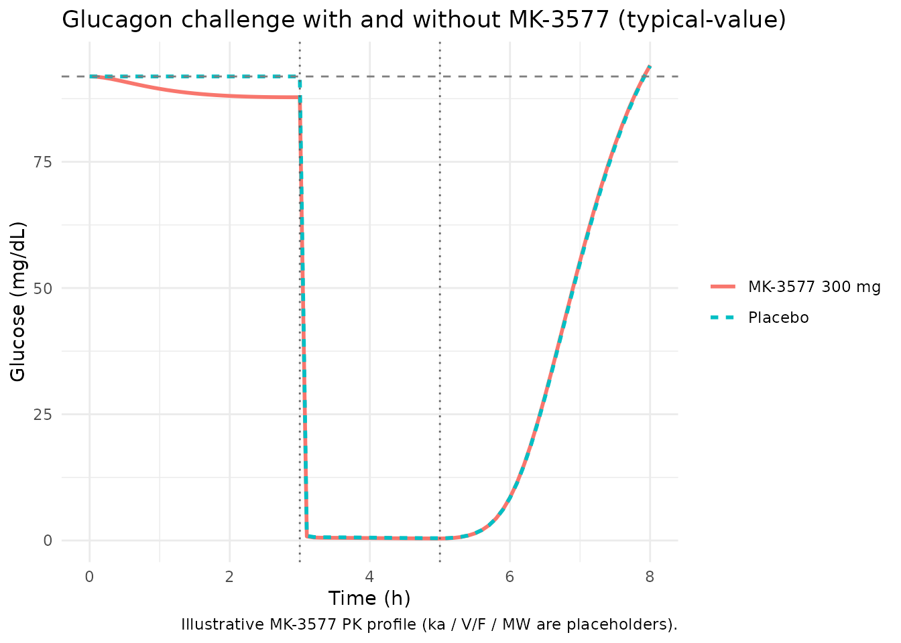
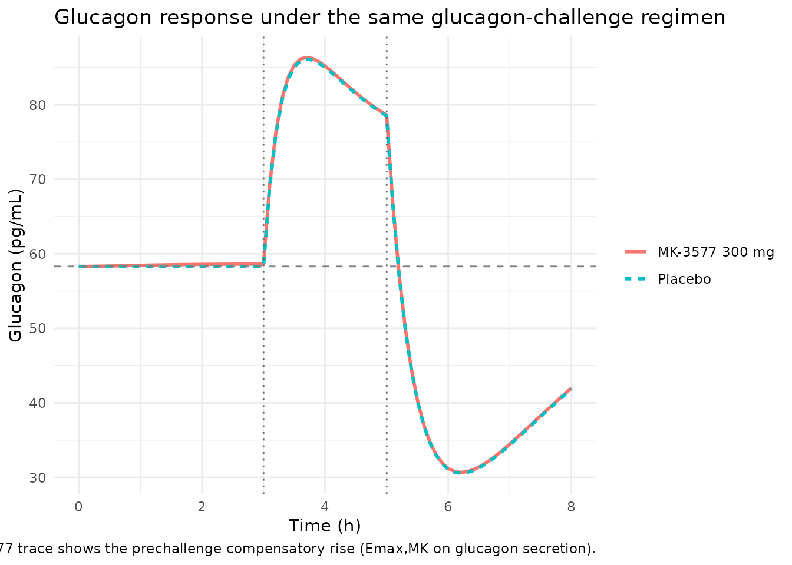
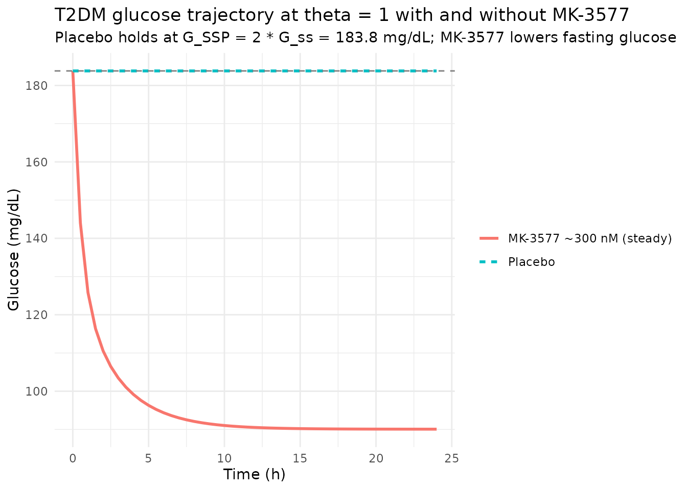

# MK-3577 glucagon receptor antagonist (Peng 2014)

## Model and source

- Citation: Peng JZ, Denney WS, Musser BJ, Liu R, Tsai K, Fang L,
  Reitman ML, Troyer MD, Engel SS, Xu L, Stoch A, Stone JA, Kowalski KG.
  A Semi-mechanistic Model for the Effects of a Novel Glucagon Receptor
  Antagonist on Glucagon and the Interaction Between Glucose, Glucagon,
  and Insulin Applied to Adaptive Phase II Design. *The AAPS Journal*
  2014;16(6):1259-1270.
- DOI: <https://doi.org/10.1208/s12248-014-9648-x>

Peng 2014 develops a semi-mechanistic PK/PD model for MK-3577, a Merck
glucagon receptor antagonist for type 2 diabetes mellitus (T2DM). The
healthy-subjects model was fit to a first-in-man (FIM)
glucagon-challenge study in 36 healthy male volunteers; the T2DM-patient
adaptation was used as a clinical trial simulation (CTS) tool to guide
adaptive dose adjustment for the interim analysis of a Phase IIa study.

Per the standing one-vignette-per-paper rule (the paper contributes two
structurally distinct models for two populations), this vignette walks
the paper as a whole and uses each model at the appropriate point:

- `modellib("Peng_2014_MK3577")` – healthy subjects undergoing glucagon
  challenge (Fig. 1a).
- `modellib("Peng_2014_MK3577_t2dm")` – T2DM adaptation with GPRG1 = 0,
  CL_GI scaled to 11%, and theta-fold elevated baseline glucose (Fig.
  1b).

The MK-3577 PK layer is NOT modeled in either file. The on-disk paper
does not report the absorption rate `ka`, apparent volume `V/F`, or
molecular weight needed to convert the mg dose to a nM plasma
concentration; users supply the time-varying MK-3577 concentration
through the covariate column `CP_MK3577_NM` (nM). For illustration the
vignette uses a stylised one-compartment first-order absorption profile
with placeholder PK parameters explicitly documented as illustrative
only.

## Population

The healthy-subjects model was fit to 36 healthy male volunteers (FIM,
Peng 2014 Table I): mean age 35 +/- 7.1 years; BMI 24.7 +/- 2.5 kg/m^2.
Single oral doses of MK-3577 1-900 mg were administered AM or PM,
followed by 2-h infusions of glucagon (3 ng/kg/min), Sandostatin /
octreotide (30 ng/kg/min), and basal insulin (0.1 mIU/kg/min) starting
at 3, 12, or 24 h post MK-3577 dose.

The T2DM-patient CTS targeted the 118-patient Phase IIa interim cohort
(Peng 2014 Table I): mean age 54 +/- 10 years; baseline FPG 152 +/- 35
mg/dL; A1c 7.6 +/- 0.8 %; 2-h PMG 223 +/- 63 mg/dL. Treatments were
MK-3577 10 mg QD AM, 6 mg QD PM, 25 mg BID; metformin 1000 mg BID
(active control); or placebo.

## Source trace

The per-parameter origin is recorded in the in-file comments of each
`inst/modeldb/specificDrugs/Peng_2014_MK3577*.R` file. The table below
collects the structural equations and parameter values in one place.

### Structural equations (healthy model; Peng 2014 Eqs. 2-6)

| Equation | Description | Source location |
|----|----|----|
| Eq. 1 | `kd(t) = kmin + (kmax - kmin) * (cos((T + NDI*12 - TKM) * pi * 2 / 24) / 2 + 0.5)` (NOT used; PK not modeled here) | Peng 2014 Eq. 1 (p. 1260) |
| Eq. 2 | `GPROD = 0.5 * GPROD_0 * ((GE/Gss)^GPRG1 + (1 - Imax,MK*CMK/(IC50,MK+CMK)) * (GN/GNss)^GPRG3)` | Peng 2014 Eq. 2 (p. 1261) |
| Eq. 3 | `GPROD_0 = Gss * (CLG + CLGI * Iss)` | Peng 2014 Eq. 3 (p. 1261) |
| Eq. 4 | `dA(6)/dt = GPROD + kPG*A(7) - (kGP + kG + kGI*CI)*A(6)` | Peng 2014 Eq. 4 (p. 1261) |
| Eq. 5 | `dA(5)/dt = Iss*CLI*(CGC/Gss)^IPRG*(1 - CS/(IC50,S2+CS)) - kI*A(5)` | Peng 2014 Eq. 5 (p. 1261) |
| Eq. 6 | `dA(4)/dt = GNss*CLGN*(1 + Emax,MK*CMK/(EC50,MK+CMK))*(1 - CS/(IC50,S1+CS)) - kGN*A(4)` | Peng 2014 Eq. 6 (p. 1261) |
| Effect compartment | `dGE/dt = K_GE * (CGC - GE)` | Peng 2014 Fig. 1a + text |
| Sandostatin PK | `dA(SN)/dt = -CLS/VS * A(SN)`; CL_S = 0.121 L/kg/h, V_S = 0.194 L/kg | Peng 2014 Results (p. 1265) |

### Parameter values (Peng 2014 Table III + Results paragraph)

| Parameter | Value (units) | %RSE | IIV (%CV) | Source location |
|----|----|----|----|----|
| `Gss` | 91.9 (mg/dL) | 1.3 | 6.1 FIX | Table III, Glucose |
| `CL_G` | 0.463 (dL/kg/h) | 36 | – | Table III, Glucose (footnote a) |
| `CL_GI` (healthy) | 0.102 (dL/kg/h/(uU/mL)) | 30 | – | Table III, Glucose |
| `CL_GI` (T2DM) | 0.011 (= 0.11 \* healthy) | – | – | Methods p. 1262 |
| `Q_G` | 0.180 (dL/kg/h) | 14 | – | Table III, Glucose |
| `V_GC` | 0.845 (dL/kg) | 23 | 28.8 FIX | Table III, Glucose |
| `V_GP` | 0.301 (dL/kg) | 15 | – | Table III, Glucose |
| `K_GE` | 0.084 (1/h) | 43 | – | Table III, Glucose |
| `Imax,MK` | 0.961 (unitless) | 1.7 | – | Table III, Glucose |
| `IC50,MK` | 13.9 (nM) | 14 | 77.7 | Table III, Glucose |
| `GPRG1` | -2.08 (unitless) | 26 | – | Table III, Glucose |
| `GPRG3` | 4.05 (unitless) | 10 | – | Table III, Glucose |
| `Iss` | 4.14 (uU/mL) | 4.8 | 33.3 FIX | Table III, Insulin |
| `CL_I` | 1.40 (L/kg/h) | 13 | 26.3 FIX | Table III, Insulin |
| `V_I` | 0.320 (L/kg) | 33 | – | Table III, Insulin |
| `IPRG` | 2.30 (unitless) | 13 | – | Table III, Insulin |
| `IC50,S2` | 0.921 (ng/mL) | 23 | – | Table III, Insulin |
| `GNss` | 58.3 (pg/mL) | 3.3 | 10.6 FIX | Table III, Glucagon |
| `CL_GN` | 3.19 (L/kg/h) | 3.4 | 18.4 FIX | Table III, Glucagon |
| `V_GN` | 1.39 (L/kg) | 7.7 | – | Table III, Glucagon |
| `Emax,MK` | 0.788 (FIX, unitless) | – | – | Table III, Glucagon |
| `EC50,MK` | 575 (FIX, nM) | – | – | Table III, Glucagon |
| `IC50,S1` | 5.50 (ng/mL) | 10 | – | Table III, Glucagon |
| `CL_S` (Sandostatin) | 0.121 (L/kg/h, literature) | – | – | Results p. 1265 |
| `V_S` (Sandostatin) | 0.194 (L/kg, literature) | – | – | Results p. 1265 |
| `RESG` | 7.54% (proportional, log-transformed) | 8.1 | – | Table III, residual |
| `RESI` | 1.38 uU/mL (additive) | 7.4 | – | Table III, residual |
| `RESGN` | 30.3% (proportional, log-transformed) | 5.0 | – | Table III, residual |
| `theta` (T2DM) | 1.0 (FIX; 2-fold baseline) | – | 51 FIX | Methods p. 1264 |

### Dimensional analysis

Both models track per-kg amounts; concentrations are derived as
`state / V`. Time is in hours.

| ODE term | Units | Calculation |
|----|----|----|
| `gprod0 = gss * (clg + clgi * iss)` | mg/kg/h | (mg/dL) \* (dL/kg/h + dL/kg/h/(uU/mL) \* uU/mL) = (mg/dL) \* (dL/kg/h) = mg/kg/h |
| `(clg / vgc) * glucose` | mg/kg/h | (dL/kg/h / dL/kg) \* mg/kg = (1/h) \* mg/kg |
| `(qg / vgc) * glucose` | mg/kg/h | (dL/kg/h / dL/kg) \* mg/kg = (1/h) \* mg/kg |
| `(qg / vgp) * glucose_peripheral` | mg/kg/h | (dL/kg/h / dL/kg) \* mg/kg = (1/h) \* mg/kg |
| `gnss * clgn` | pg/mL \* L/kg/h | numerically yields ng/kg/h, matching ng/kg glucagon state |
| `(clgn / vgn) * glucagon` | ng/kg/h | (L/kg/h / L/kg) \* ng/kg = (1/h) \* ng/kg |
| `iss * cli * (cgc/gss)^iprg` | mU/kg/h | (uU/mL) \* (L/kg/h) numerically yields mU/kg/h |
| `cs = sandostatin / vsand / 1000` | ng/mL | explicit /1000 because V_S in L/kg and state in ng/kg gives ng/L |

Concentration unit identities: 1 ng/L = 1 pg/mL (glucagon); 1 mU/L = 1
uU/mL (insulin); ng/L \* 1e-3 = ng/mL (Sandostatin, hence the explicit
`/1000`).

## Loading the models

``` r

mod_h <- readModelDb("Peng_2014_MK3577")
mod_t <- readModelDb("Peng_2014_MK3577_t2dm")
mod_h_typ <- rxode2::zeroRe(mod_h)
#> ℹ parameter labels from comments will be replaced by 'label()'
mod_t_typ <- rxode2::zeroRe(mod_t)
#> ℹ parameter labels from comments will be replaced by 'label()'
```

## Baseline check (no drug, no challenge)

Without any perturbation, both models should hold at their reported
baselines. The healthy model holds at G_SS = 91.9 mg/dL, I_SS = 4.14
uU/mL, GN_SS = 58.3 pg/mL. The T2DM model holds at G_SSP = 2 \* G_SS =
183.8 mg/dL (at theta = 1), with I_SSP and GN_SSP derived from Peng 2014
Eqs. 8 and 10.

``` r

ss_grid <- seq(0, 48, by = 1)
ss_events <- data.frame(
  time          = ss_grid,
  evid          = 0L,
  amt           = NA_real_,
  cmt           = "Gc",
  CP_MK3577_NM  = 0
)

ss_h <- rxode2::rxSolve(mod_h_typ, events = ss_events) |> as.data.frame()
#> ℹ omega/sigma items treated as zero: 'etalgss', 'etalvgc', 'etaliss', 'etalcli', 'etalgnss', 'etalclgn', 'etalic50_mk_gp'
ss_t <- rxode2::rxSolve(mod_t_typ, events = ss_events) |> as.data.frame()
#> ℹ omega/sigma items treated as zero: 'etalgss', 'etalvgc', 'etaliss', 'etalcli', 'etalgnss', 'etalclgn', 'etalic50_mk_gp', 'etaltheta'

cat("Healthy: Gc range", round(range(ss_h$Gc), 3), "mg/dL (target 91.9)\n")
#> Healthy: Gc range 91.9 91.9 mg/dL (target 91.9)
cat("Healthy: Ic range", round(range(ss_h$Ic), 3), "uU/mL (target 4.14)\n")
#> Healthy: Ic range 4.14 4.14 uU/mL (target 4.14)
cat("Healthy: GNc range", round(range(ss_h$GNc), 3), "pg/mL (target 58.3)\n")
#> Healthy: GNc range 58.3 58.3 pg/mL (target 58.3)
cat("T2DM:    Gc range", round(range(ss_t$Gc), 3), "mg/dL (target ~ 183.8)\n")
#> T2DM:    Gc range 183.8 183.8 mg/dL (target ~ 183.8)
cat("T2DM:    Ic range", round(range(ss_t$Ic), 3), "uU/mL (target ~ 20.4 = 4.14 * 2^2.3)\n")
#> T2DM:    Ic range 20.388 20.388 uU/mL (target ~ 20.4 = 4.14 * 2^2.3)
cat("T2DM:    GNc range", round(range(ss_t$GNc), 3), "pg/mL (target ~ 84)\n")
#> T2DM:    GNc range 84.199 84.199 pg/mL (target ~ 84)

stopifnot(diff(range(ss_h$Gc))  < 0.01)
stopifnot(diff(range(ss_h$Ic))  < 0.01)
stopifnot(diff(range(ss_h$GNc)) < 0.01)
stopifnot(diff(range(ss_t$Gc))  < 0.01)
```

The narrow ranges (well under 0.01) confirm that both models hold at the
reported endogenous baselines indefinitely in the absence of drug or
challenge.

## Glucagon challenge in placebo (healthy)

Replicates the qualitative pattern of Peng 2014 Fig. 2b (dose = 0 mg,
PART = 2): a 2-h glucagon infusion starting at 3 h, with Sandostatin and
basal insulin co-infusions. The drug-naive subject’s glucose roughly
doubles during the challenge.

``` r

challenge_start <- 3  # h after MK-3577 dose (placebo, so no MK-3577 dose)
obs_grid <- sort(unique(c(seq(0, 8, by = 0.1), challenge_start + c(-0.01, 0, 2, 2.01))))

placebo_events <- dplyr::bind_rows(
  data.frame(time = challenge_start, evid = 1L, amt = 360,    cmt = "glucagon",
             dur = 2, CP_MK3577_NM = 0),
  data.frame(time = challenge_start, evid = 1L, amt = 3600,   cmt = "sandostatin",
             dur = 2, CP_MK3577_NM = 0),
  data.frame(time = challenge_start, evid = 1L, amt = 12000,  cmt = "insulin",
             dur = 2, CP_MK3577_NM = 0),
  data.frame(time = obs_grid,        evid = 0L, amt = NA_real_, cmt = "Gc",
             dur = NA_real_, CP_MK3577_NM = 0)
) |>
  dplyr::arrange(time)

sim_placebo <- rxode2::rxSolve(mod_h_typ, events = placebo_events,
                               returnType = "data.frame")
#> ℹ omega/sigma items treated as zero: 'etalgss', 'etalvgc', 'etaliss', 'etalcli', 'etalgnss', 'etalclgn', 'etalic50_mk_gp'

ggplot(sim_placebo, aes(time)) +
  geom_line(aes(y = Gc, colour = "Glucose (mg/dL)"), linewidth = 1) +
  geom_hline(yintercept = 91.9, linetype = "dashed", colour = "grey50") +
  geom_vline(xintercept = challenge_start, linetype = "dotted", colour = "grey40") +
  geom_vline(xintercept = challenge_start + 2, linetype = "dotted", colour = "grey40") +
  scale_colour_manual(values = c("Glucose (mg/dL)" = "#1f77b4")) +
  labs(x = "Time (h)", y = "Glucose (mg/dL)", colour = "",
       title = "Glucagon challenge in placebo (typical-value, healthy)",
       subtitle = "Vertical dotted lines bracket the 2-h infusion window",
       caption = "Replicates the qualitative pattern of Peng 2014 Fig. 2b (dose = 0).") +
  theme_minimal()
```


## Glucagon challenge with MK-3577 (healthy)

Now we supply a stylised one-compartment MK-3577 PK profile – one of
many that fit Peng 2014 Fig. 2a – and feed it through the `CP_MK3577_NM`
covariate column. The drug effect on glucagon-driven glucose production
blocks most of the glucose excursion at high doses, matching the
qualitative pattern of Peng 2014 Fig. 2b (dose = 30 mg / 300 mg panels).

The PK profile parameters below are **illustrative only** – the on-disk
Peng 2014 PDF does not report `ka`, `V/F`, or the molecular weight that
would let us derive a self-contained mg-to-nM mapping. Users who need a
runnable PK layer should supply their own profile.

``` r

# Illustrative MK-3577 PK profile: 1-compartment first-order absorption.
# Parameters are placeholders chosen so that a 300 mg dose produces nM
# concentrations in the IC50,MK / EC50,MK range of Peng 2014 Table III
# (IC50,MK = 13.9 nM; EC50,MK = 575 nM).
stylized_cmk <- function(dose_mg, time_h,
                         ka = 0.6,        # 1/h (illustrative)
                         vF = 100,        # L (illustrative)
                         mw = 425) {      # g/mol (illustrative small-molecule MW)
  # Compute mg/L from a single-dose one-cmt absorption and convert to nM
  # via: nM = (mg/L * 1000 mg/g / mw g/mol) = mg/L * 1000 / mw nM.
  kel <- ka / 3  # arbitrary 3:1 absorption-to-elimination ratio (illustrative)
  conc_mgL <- (dose_mg / vF) * (ka / (ka - kel)) *
              (exp(-kel * time_h) - exp(-ka * time_h))
  pmax(0, conc_mgL * 1000 / mw)
}

drug_grid <- sort(unique(c(seq(0, 8, by = 0.1),
                          challenge_start + c(-0.01, 0, 2, 2.01))))
drug_events <- dplyr::bind_rows(
  data.frame(time = challenge_start, evid = 1L, amt = 360,    cmt = "glucagon",
             dur = 2),
  data.frame(time = challenge_start, evid = 1L, amt = 3600,   cmt = "sandostatin",
             dur = 2),
  data.frame(time = challenge_start, evid = 1L, amt = 12000,  cmt = "insulin",
             dur = 2),
  data.frame(time = drug_grid,       evid = 0L, amt = NA_real_, cmt = "Gc",
             dur = NA_real_)
) |>
  dplyr::arrange(time)

# Compute the illustrative MK-3577 nM profile at every event row.
drug_events$CP_MK3577_NM <- stylized_cmk(300, drug_events$time)

sim_drug <- rxode2::rxSolve(mod_h_typ, events = drug_events,
                            returnType = "data.frame")
#> ℹ omega/sigma items treated as zero: 'etalgss', 'etalvgc', 'etaliss', 'etalcli', 'etalgnss', 'etalclgn', 'etalic50_mk_gp'

combined <- dplyr::bind_rows(
  sim_placebo |> dplyr::mutate(treatment = "Placebo"),
  sim_drug    |> dplyr::mutate(treatment = "MK-3577 300 mg")
)

ggplot(combined, aes(time, Gc, colour = treatment, linetype = treatment)) +
  geom_line(linewidth = 1) +
  geom_hline(yintercept = 91.9, linetype = "dashed", colour = "grey50") +
  geom_vline(xintercept = challenge_start, linetype = "dotted", colour = "grey40") +
  geom_vline(xintercept = challenge_start + 2, linetype = "dotted", colour = "grey40") +
  labs(x = "Time (h)", y = "Glucose (mg/dL)", colour = NULL, linetype = NULL,
       title = "Glucagon challenge with and without MK-3577 (typical-value)",
       caption = "Illustrative MK-3577 PK profile (ka / V/F / MW are placeholders).") +
  theme_minimal()
```



``` r


ggplot(combined, aes(time, GNc, colour = treatment, linetype = treatment)) +
  geom_line(linewidth = 1) +
  geom_hline(yintercept = 58.3, linetype = "dashed", colour = "grey50") +
  geom_vline(xintercept = challenge_start, linetype = "dotted", colour = "grey40") +
  geom_vline(xintercept = challenge_start + 2, linetype = "dotted", colour = "grey40") +
  labs(x = "Time (h)", y = "Glucagon (pg/mL)", colour = NULL, linetype = NULL,
       title = "Glucagon response under the same glucagon-challenge regimen",
       caption = "MK-3577 trace shows the prechallenge compensatory rise (Emax,MK on glucagon secretion).") +
  theme_minimal()
```



The glucose plot shows the drug blocking most of the glucagon-driven
glucose rise, with the MK-3577 trajectory tracking the placebo baseline
through the challenge window. The glucagon plot shows the prechallenge
compensatory rise predicted by the `Emax,MK = 0.788` stimulatory term:
MK-3577 plasma concentrations in the EC50,MK = 575 nM range modestly
elevate glucagon secretion before the exogenous glucagon infusion
begins.

## T2DM baseline elevation under MK-3577

The T2DM model holds at G_SSP, I_SSP, and GN_SSP at baseline (no drug).
Under a continuous MK-3577 exposure (a steady-state-like profile) the
drug blocks the glucagon-driven amplification of GPROD, dropping fasting
glucose below G_SSP – the central pharmacology that motivated the Phase
IIa programme.

``` r

t2dm_grid <- seq(0, 24, by = 0.5)
t2dm_events_pbo <- data.frame(
  time          = t2dm_grid,
  evid          = 0L,
  amt           = NA_real_,
  cmt           = "Gc",
  CP_MK3577_NM  = 0
)

# Stylized constant MK-3577 exposure at ~ 300 nM (well above IC50,MK = 13.9 nM
# but below EC50,MK = 575 nM, so glucose-production inhibition dominates).
t2dm_events_drug <- t2dm_events_pbo
t2dm_events_drug$CP_MK3577_NM <- 300

t2dm_pbo  <- rxode2::rxSolve(mod_t_typ, events = t2dm_events_pbo) |>
  as.data.frame() |>
  dplyr::mutate(treatment = "Placebo")
#> ℹ omega/sigma items treated as zero: 'etalgss', 'etalvgc', 'etaliss', 'etalcli', 'etalgnss', 'etalclgn', 'etalic50_mk_gp', 'etaltheta'
t2dm_drug <- rxode2::rxSolve(mod_t_typ, events = t2dm_events_drug) |>
  as.data.frame() |>
  dplyr::mutate(treatment = "MK-3577 ~300 nM (steady)")
#> ℹ omega/sigma items treated as zero: 'etalgss', 'etalvgc', 'etaliss', 'etalcli', 'etalgnss', 'etalclgn', 'etalic50_mk_gp', 'etaltheta'

t2dm_combined <- dplyr::bind_rows(t2dm_pbo, t2dm_drug)

ggplot(t2dm_combined, aes(time, Gc, colour = treatment, linetype = treatment)) +
  geom_line(linewidth = 1) +
  geom_hline(yintercept = 91.9 * 2, linetype = "dashed", colour = "grey50") +
  labs(x = "Time (h)", y = "Glucose (mg/dL)", colour = NULL, linetype = NULL,
       title = "T2DM glucose trajectory at theta = 1 with and without MK-3577",
       subtitle = "Placebo holds at G_SSP = 2 * G_ss = 183.8 mg/dL; MK-3577 lowers fasting glucose") +
  theme_minimal()
```



## Assumptions and deviations

- **MK-3577 PK layer is not modeled in either file.** The on-disk Peng
  2014 PDF reports the elimination-rate structure (k_min, k_max, T_KM
  for the circadian k_d(t) form in Eq. 1) but does NOT report the
  absorption rate `ka`, the apparent volume of distribution `V/F`, or
  the molecular weight needed to convert mg dose to nM plasma
  concentration. Per the operator decision (2026-06-17 sidecar response
  on task `frompeople-654-peng_2014_the_aaps_journal`), the PD layer is
  shipped with `CP_MK3577_NM` (nM) as a user-provided time-varying
  covariate. The vignette uses a stylized one-compartment first-order
  absorption profile with placeholder values (`ka = 0.6 /h`,
  `V/F = 100 L`, `MW = 425 g/mol`) chosen so that a 300 mg dose produces
  nM concentrations in the IC50,MK / EC50,MK range of Table III; these
  placeholders are illustrative only.
- **Sandostatin (octreotide) PK uses literature values.** The Peng 2014
  paper notes that Sandostatin is two-compartmental but published
  estimates were unavailable and the rapid distribution phase justifies
  a one-compartment simplification (CL = 0.121 L/kg/h, V = 0.194 L/kg
  from the published literature and product label). Both values are
  encoded as `fixed()` in the model file.
- **Basal insulin infusion is supplied through the event table, not
  modeled separately.** The 2-h 0.1 mIU/kg/min basal insulin infusion
  that the FIM study used to keep glycemia from dropping during
  Sandostatin / glucagon co-infusion is dosed into the `insulin`
  compartment via the user’s event table; there is no modelled
  insulin-input mass-balance term.
- **IIV is inherited and mostly FIXED.** Per Peng 2014 Table III, IIV on
  G_SS, V_GC, I_SS, CL_I, GN_SS, and CL_GN was fixed during estimation
  (often from lead-compound data). Only `IC50,MK` carries an estimated
  IIV (77.7% CV). The IIV on `theta` in the T2DM model is fixed at 51%
  CV per Methods p. 1264.
- **GPRG1 = 0 in T2DM (drops the effect compartment).** Peng 2014
  assumes glucose self-regulation is completely compromised in T2DM
  (Methods p. 1262). With GPRG1 = 0, the effect-compartment term
  `(GE/Gss)^GPRG1` is identically 1 and the effect compartment is
  dropped from the T2DM model entirely (Fig. 1b).
- **CL_GI scaled to 11% in T2DM** (lead-compound finding; Methods
  p. 1262). Implemented inside `model()` as
  `clgi_t <- 0.11 * exp(lclgi)` so the `lclgi` parameter remains the
  healthy reference and the scaling is visible in the source trace.
- **`linear(CP_MK3577_NM)` declared in both models** so a coarse
  user-supplied profile (one row per hour, say) interpolates smoothly
  between event rows for the Imax / Emax drug-effect calculations.
- **Footnote a of Table III applies (glucose V and CL are not
  independently identifiable).** Peng 2014 documents that the glucose
  volume and clearance terms cannot be estimated separately from
  observed glucose alone (only the ratios are identifiable). The model
  file uses the paper’s reported point estimates for forward simulation;
  the per-parameter source-trace comments label this footnote.

## How the missing PK gap is documented

The model files annotate this honestly: `description` calls out that the
PK layer is not modeled and explains why; `units$dosing` documents that
MK-3577 is NOT dosed and must be supplied as a covariate; the
covariate-columns register (`inst/references/covariate-columns.md`)
ratifies `CP_MK3577_NM` as a specific-scope canonical with a “Notes”
entry pointing users to the same caveat.
