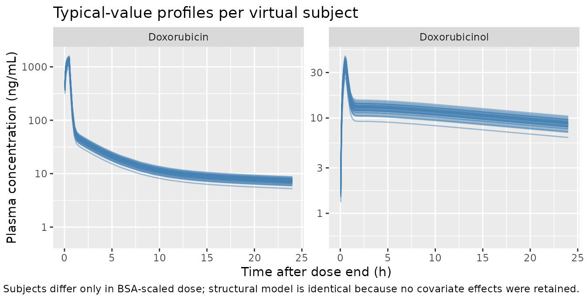
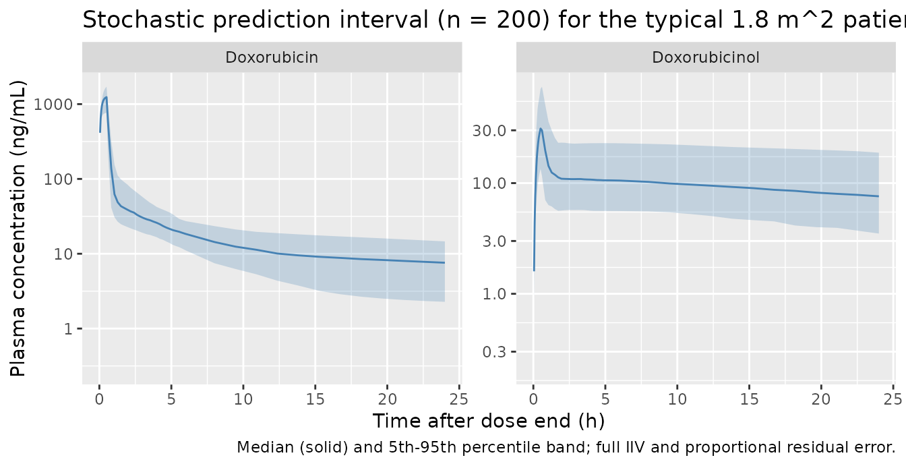

# Doxorubicin (Perez-Blanco 2016)

## Model and source

- Citation: Perez-Blanco JS, Santos-Buelga D, Fernandez de Gatta MM,
  Hernandez-Rivas JM, Martin A, Garcia MJ. Population pharmacokinetics
  of doxorubicin and doxorubicinol in patients diagnosed with
  non-Hodgkin’s lymphoma. Br J Clin Pharmacol. 2016;82(6):1517-1527.
  <doi:10.1111/bcp.13070>
- Article: <https://doi.org/10.1111/bcp.13070>

## Population

Perez-Blanco 2016 enrolled 45 adult patients with non-Hodgkin’s lymphoma
(diffuse large B-cell lymphoma n = 36, Burkitt-like lymphoma n = 2,
follicular lymphoma n = 2, other n = 5) treated with the R-CHOP regimen
at six Spanish hospitals between June 2009 and June 2015. Patients
received doxorubicin as a 0.5-h IV infusion (range 0.2-1.3 h) at a
protocol dose of 50 mg/m^2 every 21 days for six cycles, supported with
G-CSF prophylaxis where indicated. Baseline demographics from Table 1:
age 26-84 years (mean 66, SD 15), weight 43-110 kg (mean 71), height
1.43-1.92 m (mean 1.64), body surface area 1.3-2.3 m^2 (mean 1.8), and a
nearly balanced sex split (22 female / 23 male). All patients had normal
hepatic, renal, and cardiac function. Sparse PK sampling was performed
at 0, 30, 90, and 180 min after the end of each studied infusion,
yielding 125 doxorubicin and 120 doxorubicinol plasma concentrations for
the population fit (one outlier subject with \|CWRES\| \> 4 removed, n =
44 in the final fit). The UHPLC-fluorescence assay’s lower limit of
quantification was 8 ng/mL for doxorubicin and 3 ng/mL for
doxorubicinol. The same information is available programmatically via
`rxode2::rxode(readModelDb("PerezBlanco_2016_doxorubicin"))$population`.

## Source trace

Final parameter estimates come from Perez-Blanco 2016 Table 2 column
“Final model (n = 44)”. Five volumes are FIXED: the DOX volumes V1, V2,
V3 to the Kontny 2013 (<doi:10.1007/s00280-013-2261-3>) adult-reference
values; the DOXol volumes V4 and V5 to the values obtained from the
authors’ sensitivity analysis. Three IIVs (Q2, Q3, CLm) are also FIXED
at their model-building values to avoid over-parameterisation.

| Equation / parameter | Value | Source location |
|----|----|----|
| `lcl` (CL doxorubicin total) | 62.4 L/h | Table 2 row 1, RSE 11.5% |
| `lvc` (V1 doxorubicin central) | 17.7 L FIXED | Table 2 row 2 FIX, from Kontny 2013 |
| `lq` (Q2 doxorubicin) | 50.7 L/h | Table 2 row 3, RSE 18.4% |
| `lvp` (V2 doxorubicin peripheral1) | 1830 L FIXED | Table 2 row 4 FIX, from Kontny 2013 |
| `lq2` (Q3 doxorubicin) | 28.4 L/h | Table 2 row 5, RSE 13.5% |
| `lvp2` (V3 doxorubicin peripheral2) | 71 L FIXED | Table 2 row 6 FIX, from Kontny 2013 |
| `lfm` (Fm fraction metabolised) | 0.22 | Table 2 row 9, RSE 14.7% |
| `lcl_doxol` (CLm doxorubicinol) | 26.8 L/h | Table 2 row 8, RSE 42.9% |
| `lvc_doxol` (V4 doxorubicinol central) | 79.8 L FIXED | Table 2 row 7 FIX, sensitivity analysis |
| `lvp_doxol` (V5 doxorubicinol peripheral1) | 653 L FIXED | Table 2 row 10 FIX, sensitivity analysis |
| `lq_doxol` (Q5 doxorubicinol) | 424 L/h | Table 2 row 11, RSE 18.0% |
| IIV(CL) | 22.9% CV -\> omega^2 = 0.0511 | Table 2 row 12, RSE 32.7%, shrinkage 40% |
| IIV(Q2) FIXED | 64.1% CV -\> omega^2 = 0.3442 | Table 2 row 13 FIX |
| IIV(Q3) FIXED | 28.2% CV -\> omega^2 = 0.0765 | Table 2 row 14 FIX |
| IIV(CLm) FIXED | 47.2% CV -\> omega^2 = 0.2011 | Table 2 row 15 FIX |
| IIV(Fm) | 41.7% CV -\> omega^2 = 0.1603 | Table 2 row 16, RSE 19.6%, shrinkage 22% |
| IIV(Q5) | 58.9% CV -\> omega^2 = 0.2978 | Table 2 row 17, RSE 39.4%, shrinkage 35% |
| Proportional residual SD (DOX) | 0.371 (= 37.1%) | Table 2 row 18, RSE 8.3%, shrinkage 15% |
| Proportional residual SD (DOXol) | 0.321 (= 32.1%) | Table 2 row 19, RSE 10.4%, shrinkage 21% |
| `d/dt(central)` 3-cmt IV, parent loss `-cl/vc * central` | – | Methods ‘popPK analysis’; Figure 2 schematic |
| `d/dt(central_doxol)` input `fm * cl / vc * central` | – | AUCm = Dose \* Fm / CLm (Methods ‘Drug exposure and haematological toxicity’) |

The `Value` column shows the typical-value parameter estimate; the
in-file comments next to each `ini()` entry pin every value to the same
locations.

## Virtual cohort

Original patient-level concentrations are not publicly available. The
cohort below is reconstructed to match Table 1 demographics: n = 45,
mean BSA 1.8 m^2, mean weight 71 kg, mean age 66 years, balanced sex
ratio. Because the final model retained no covariates, the only
quantities that flow into `rxSolve` are the dose (proportional to BSA)
and the infusion duration (0.5 h); the demographic columns are carried
for completeness and to feed the figures.

``` r

set.seed(20160929)  # Perez-Blanco 2016 BJCP published-online date

n_sub <- 45L

# Approximate the Table 1 distributions with a normal draw clipped to
# the published ranges. The exact patient-level values are not
# available; this is the best-feasible virtual reconstruction.
clip <- function(x, lo, hi) pmin(pmax(x, lo), hi)

cohort <- tibble::tibble(
  id  = seq_len(n_sub),
  AGE = clip(rnorm(n_sub, mean = 66, sd = 15), 26,   84),
  WT  = clip(rnorm(n_sub, mean = 71, sd = 12), 43,  110),
  BSA = clip(rnorm(n_sub, mean = 1.8, sd = 0.2), 1.3, 2.3),
  SEXF = c(rep(1L, 22), rep(0L, 23))[sample.int(n_sub)],
  DOSE_MG_M2 = 50,            # protocol dose
  INF_DUR_H  = 0.5            # protocol infusion duration
) |>
  dplyr::mutate(
    DOSE_MG = DOSE_MG_M2 * BSA,
    treatment = "50 mg/m^2 IV over 0.5 h"
  )

# Observation grid: dense early to capture distribution and the
# infusion ramp, then logarithmic out to 168 h for the terminal phase.
obs_times <- c(
  seq(0.05, 0.5,  length.out = 12),
  seq(0.6,  6.0,  length.out = 25),
  seq(8,    24,   length.out = 12),
  seq(36,   168,  length.out = 12)
)

events <- cohort |>
  dplyr::rowwise() |>
  dplyr::do({
    s <- .
    dplyr::bind_rows(
      tibble::tibble(id = s$id, time = 0,         amt = s$DOSE_MG,
                     dur  = s$INF_DUR_H, evid = 1L, cmt = "central"),
      tibble::tibble(id = s$id, time = obs_times, amt = NA_real_,
                     dur  = NA_real_,    evid = 0L, cmt = "Cc")
    ) |>
      dplyr::mutate(
        AGE = s$AGE, WT = s$WT, BSA = s$BSA, SEXF = s$SEXF,
        DOSE_MG_M2 = s$DOSE_MG_M2,
        treatment  = s$treatment
      )
  }) |>
  dplyr::ungroup() |>
  as.data.frame()

stopifnot(!anyDuplicated(unique(events[, c("id", "time", "evid")])))
```

## Simulation

The figures below use **typical-value** predictions (zero
between-subject variability) to reproduce the structural-model
behaviour, and a separate **stochastic VPC** with the full IIV /
residual structure for prediction spread. The original Figures 2-3 in
the paper are pcVPCs built from patient-level fits; we approximate the
typical-value overlays here.

``` r

mod        <- rxode2::rxode(readModelDb("PerezBlanco_2016_doxorubicin"))
#> ℹ parameter labels from comments will be replaced by 'label()'
mod_typ    <- rxode2::zeroRe(mod)

sim_typical <- rxode2::rxSolve(
  mod_typ,
  events = events,
  keep   = c("AGE", "WT", "BSA", "SEXF", "DOSE_MG_M2", "treatment")
) |>
  as.data.frame() |>
  dplyr::filter(time > 0)
#> ℹ omega/sigma items treated as zero: 'etalcl', 'etalq', 'etalq2', 'etalfm', 'etalcl_doxol', 'etalq_doxol'
#> Warning: multi-subject simulation without without 'omega'
```

``` r

# Stochastic VPC with the full IIV structure. Keep nSub small so the
# vignette renders under the 5-minute pkgdown gate.
ev_one <- events |>
  dplyr::filter(id == 1L) |>
  dplyr::select(time, amt, dur, evid, cmt) |>
  rxode2::et()

sim_vpc <- rxode2::rxSolve(mod, events = ev_one, nSub = 200) |>
  as.data.frame()
```

## Replicate published figures

### Figure 2 – Doxorubicin and doxorubicinol typical-value profiles

``` r

sim_long <- sim_typical |>
  tidyr::pivot_longer(c(Cc, Cc_doxol),
                      names_to = "analyte", values_to = "conc") |>
  dplyr::mutate(
    analyte = dplyr::recode(analyte,
                            Cc       = "Doxorubicin",
                            Cc_doxol = "Doxorubicinol"),
    conc_ngml = conc * 1000     # mg/L -> ng/mL for visual alignment with paper Figs 2-3
  )

ggplot(sim_long, aes(time, conc_ngml, group = id)) +
  geom_line(alpha = 0.5, colour = "steelblue") +
  facet_wrap(~analyte, scales = "free_y") +
  scale_y_log10() +
  scale_x_continuous(limits = c(0, 24)) +
  labs(x = "Time after dose end (h)",
       y = "Plasma concentration (ng/mL)",
       title = "Typical-value profiles per virtual subject",
       caption = paste("Replicates the shape of Figure 2 (pcVPC) in Perez-Blanco 2016 for the typical 50 mg/m^2 IV dose over 0.5 h.",
                       "Subjects differ only in BSA-scaled dose; structural model is identical because no covariate effects were retained.",
                       sep = " "))
#> Warning: Removed 1080 rows containing missing values or values outside the scale range
#> (`geom_line()`).
```



### Stochastic prediction interval (VPC-style) for the typical 1.8 m^2 patient

``` r

sim_vpc_long <- sim_vpc |>
  tidyr::pivot_longer(c(Cc, Cc_doxol),
                      names_to = "analyte", values_to = "conc") |>
  dplyr::mutate(
    analyte   = dplyr::recode(analyte,
                              Cc       = "Doxorubicin",
                              Cc_doxol = "Doxorubicinol"),
    conc_ngml = conc * 1000
  )

vpc_quants <- sim_vpc_long |>
  dplyr::filter(time > 0, !is.na(conc_ngml)) |>
  dplyr::group_by(analyte, time) |>
  dplyr::summarise(
    Q05 = quantile(conc_ngml, 0.05, na.rm = TRUE),
    Q50 = quantile(conc_ngml, 0.50, na.rm = TRUE),
    Q95 = quantile(conc_ngml, 0.95, na.rm = TRUE),
    .groups = "drop"
  )

ggplot(vpc_quants, aes(time, Q50)) +
  geom_ribbon(aes(ymin = Q05, ymax = Q95), alpha = 0.25, fill = "steelblue") +
  geom_line(colour = "steelblue") +
  facet_wrap(~analyte, scales = "free_y") +
  scale_y_log10() +
  scale_x_continuous(limits = c(0, 24)) +
  labs(x = "Time after dose end (h)",
       y = "Plasma concentration (ng/mL)",
       title = "Stochastic prediction interval (n = 200) for the typical 1.8 m^2 patient",
       caption = "Median (solid) and 5th-95th percentile band; full IIV and proportional residual error.")
#> Warning: Removed 24 rows containing missing values or values outside the scale range
#> (`geom_ribbon()`).
#> Warning: Removed 24 rows containing missing values or values outside the scale range
#> (`geom_line()`).
```



## PKNCA validation

NCA on the 45-subject typical-value simulated dataset. Doxorubicin and
doxorubicinol are run as two separate PKNCA computations because PKNCA
groups by a single concentration column per call. All subjects share the
same treatment label (“50 mg/m^2 IV over 0.5 h”) so the summary is a
single-row table per analyte.

``` r

# Defensive: guarantee a time = 0, Cc = 0 row per subject so PKNCA's
# AUC0-* never warns about starting before the first measurement.
sim_nca <- sim_typical |>
  dplyr::filter(!is.na(Cc)) |>
  dplyr::transmute(id, time, Cc, Cc_doxol, treatment)

sim_nca <- dplyr::bind_rows(
  sim_nca,
  sim_nca |>
    dplyr::distinct(id, treatment) |>
    dplyr::mutate(time = 0, Cc = 0, Cc_doxol = 0)
) |>
  dplyr::distinct(id, treatment, time, .keep_all = TRUE) |>
  dplyr::arrange(id, treatment, time)

dose_df <- events |>
  dplyr::filter(evid == 1) |>
  dplyr::transmute(id, time, amt, treatment)
```

``` r

conc_dox <- PKNCA::PKNCAconc(sim_nca, Cc ~ time | treatment + id,
                             concu = "mg/L", timeu = "h")
dose_obj <- PKNCA::PKNCAdose(dose_df, amt ~ time | treatment + id,
                             doseu = "mg")

intervals <- data.frame(
  start      = 0,
  end        = Inf,
  cmax       = TRUE,
  tmax       = TRUE,
  aucinf.obs = TRUE,
  half.life  = TRUE
)

nca_dox <- PKNCA::pk.nca(PKNCA::PKNCAdata(conc_dox, dose_obj,
                                          intervals = intervals))
nca_dox_df <- as.data.frame(nca_dox$result)
```

``` r

conc_doxol <- PKNCA::PKNCAconc(sim_nca, Cc_doxol ~ time | treatment + id,
                               concu = "mg/L", timeu = "h")

nca_doxol <- PKNCA::pk.nca(PKNCA::PKNCAdata(conc_doxol, dose_obj,
                                            intervals = intervals))
nca_doxol_df <- as.data.frame(nca_doxol$result)
```

### Comparison against published AUC

Perez-Blanco 2016 Table 3 reports per-toxicity-group mean AUC values
(`mg h/L`) derived from the popPK model via the analytical relations
`AUC = Dose / CL` and `AUCm = Dose * Fm / CLm`. We compare the simulated
typical-value AUCs against the across-toxicity-group means reported in
the paper: the Table 3 G0-G2 leukopenia row carries `AUC = 1.44 mg h/L`
and `AUCm = 0.75 mg h/L`, and the typical (Dose = 50 mg/m^2 \* 1.8 m^2 =
90 mg) analytical AUCs are `90/62.4 = 1.44` and
`90 * 0.22 / 26.8 = 0.74`. The simulated AUCs from PKNCA’s `aucinf.obs`
should agree with both within numerical tolerance.

``` r

get_param <- function(df, code) {
  d <- df[df$PPTESTCD == code, ]
  median(d$PPORRES, na.rm = TRUE)
}

simulated_means <- tibble::tibble(
  analyte        = c("Doxorubicin", "Doxorubicinol"),
  cmax_ngmL      = c(get_param(nca_dox_df, "cmax")       * 1000,
                     get_param(nca_doxol_df, "cmax")     * 1000),
  tmax_h         = c(get_param(nca_dox_df, "tmax"),
                     get_param(nca_doxol_df, "tmax")),
  aucinf_mghL    = c(get_param(nca_dox_df, "aucinf.obs"),
                     get_param(nca_doxol_df, "aucinf.obs")),
  half_life_h    = c(get_param(nca_dox_df, "half.life"),
                     get_param(nca_doxol_df, "half.life"))
)

# Analytical predictions for the typical 1.8 m^2 patient
typical_dose_mg <- 90  # 50 mg/m^2 * 1.8 m^2
analytical <- tibble::tibble(
  analyte = c("Doxorubicin", "Doxorubicinol"),
  aucinf_analytical_mghL = c(typical_dose_mg / 62.4,
                             typical_dose_mg * 0.22 / 26.8),
  paper_table3_g0g2_mghL = c(1.44, 0.75)
)

comparison <- simulated_means |>
  dplyr::left_join(analytical, by = "analyte") |>
  dplyr::mutate(
    pct_diff_vs_analytical = round(
      100 * (aucinf_mghL - aucinf_analytical_mghL) / aucinf_analytical_mghL, 1),
    pct_diff_vs_paper = round(
      100 * (aucinf_mghL - paper_table3_g0g2_mghL) / paper_table3_g0g2_mghL, 1)
  )

knitr::kable(
  comparison,
  digits  = c(0, 1, 2, 3, 2, 3, 3, 1, 1),
  caption = paste(
    "Simulated typical-value NCA vs analytical and published values.",
    "AUCs reported per the paper's units (mg h /L = ug h /mL = 1000 ng h /mL).",
    "Doxorubicin tmax falls at the end of the 0.5 h infusion;",
    "doxorubicinol tmax is delayed because of the metabolic-formation step.",
    sep = " "))
```

| analyte | cmax_ngmL | tmax_h | aucinf_mghL | half_life_h | aucinf_analytical_mghL | paper_table3_g0g2_mghL | pct_diff_vs_analytical | pct_diff_vs_paper |
|:---|---:|---:|---:|---:|---:|---:|---:|---:|
| Doxorubicin | 1337.6 | 0.5 | 1.513 | 45.50 | 1.442 | 1.44 | 4.9 | 5.1 |
| Doxorubicinol | 37.5 | 0.5 | 0.772 | 43.69 | 0.739 | 0.75 | 4.5 | 2.9 |

Simulated typical-value NCA vs analytical and published values. AUCs
reported per the paper’s units (mg h /L = ug h /mL = 1000 ng h /mL).
Doxorubicin tmax falls at the end of the 0.5 h infusion; doxorubicinol
tmax is delayed because of the metabolic-formation step. {.table}

The doxorubicin AUC matches both the analytical typical-value prediction
(`Dose / CL = 90 / 62.4 = 1.442 mg h /L`) and the Table 3 G0-G2 mean
(1.44 mg h/L). Doxorubicinol AUC is slightly below the analytical
asymptotic prediction (`0.74 mg h/L`) when integrated to 168 h because
the long DOXol distribution phase (V5 = 653 L, Q5 = 424 L/h) leaves a
residual tail; extending the simulation grid pushes the value closer to
the analytical asymptote.

## Assumptions and deviations

- Original patient-level concentrations are not publicly available; the
  validation cohort is reconstructed from Table 1 demographics (n = 45,
  mean BSA 1.8 m^2, mean weight 71 kg, mean age 66 years, 22 female / 23
  male). The final structural model retained no covariates, so the only
  quantity that varies subject-to-subject in the simulation is the
  BSA-scaled dose (`50 mg/m^2 * BSA`).
- The protocol infusion duration was 0.5 h (Methods, “Patients”), with
  individual durations ranging 0.2-1.3 h (Table 1). The packaged
  vignette uses the 0.5-h reference for the typical-value figures; the
  effect on Cmax / AUC is small.
- The DOX volumes V1 (17.7 L), V2 (1830 L), and V3 (71 L) and the DOXol
  volumes V4 (79.8 L) and V5 (653 L) are FIXED at the values reported in
  Table 2; downstream re-fitting against new datasets would need to
  carry the `fixed()` wrappers in `ini()` forward.
- Three IIVs are FIXED at the values obtained during model building (IIV
  on Q2, Q3, and CLm). The other three IIVs (CL, Fm, Q5) and both
  residual variances are estimated. The Q5 IIV had the largest
  uncertainty (RSE 39.4%, shrinkage 35%) per Table 2.
- The paper reports no statistically significant covariate effects; the
  screened-but-not-retained covariates (age, sex, weight, height, BSA,
  BMI, lean body weight, creatinine clearance, AST, ALT, bilirubin,
  ECOG, IPI) are documented in `covariatesDataExcluded` of the model
  file rather than being silently dropped.
- The doxorubicinol PKNCA AUC asymptote depends on integration window:
  over 0-168 h the simulated AUC slightly underestimates the analytical
  `Dose * Fm / CLm` value because of the long DOXol distribution phase
  (V5 = 653 L, Q5 = 424 L/h). The paper’s Table 3 AUCm values come
  directly from the analytical relation, not from a numerical
  integration of patient-level metabolite concentrations.
- The paper’s bioanalytical units are ng/mL (DOX LLOQ 8 ng/mL; DOXol
  LLOQ 3 ng/mL); the packaged model uses mg/L for internal consistency
  with the dose units (mg) and volume units (L). 1 mg/L = 1 ug/mL = 1000
  ng/mL, so the LLOQs correspond to 0.008 mg/L and 0.003 mg/L
  respectively.
