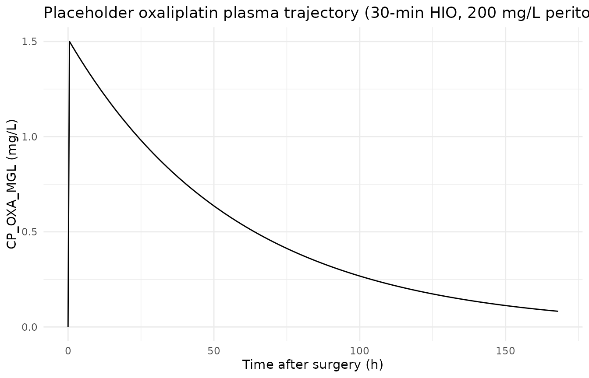
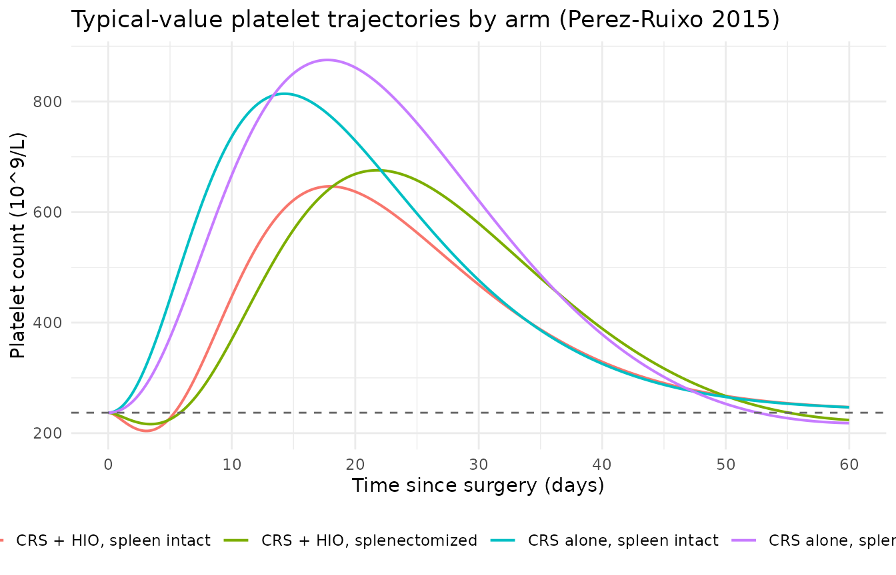
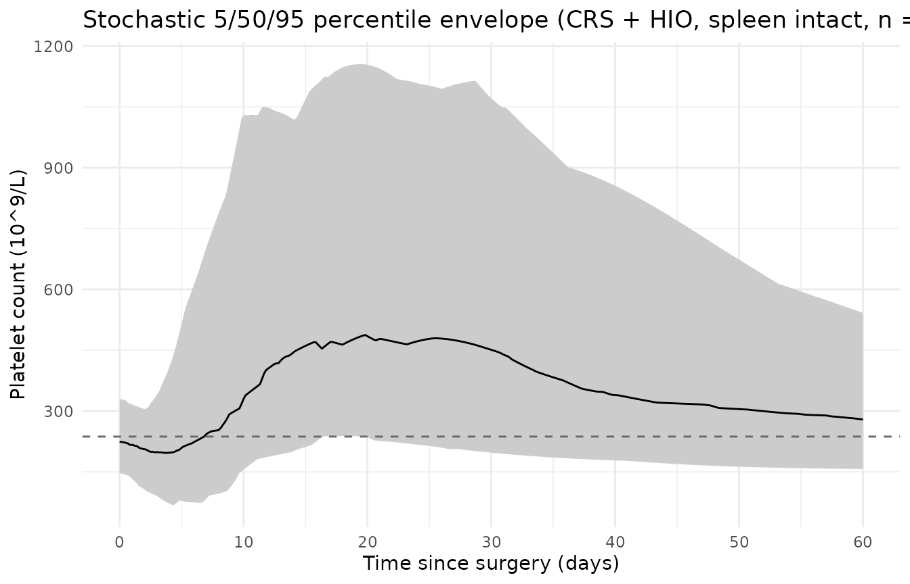

# Oxaliplatin platelet dynamics (Perez-Ruixo 2015)

## Model and source

- Citation: Perez-Ruixo C, Valenzuela B, Peris JE, Bretcha-Boix P,
  Escudero-Ortiz V, Farre-Alegre J, Perez-Ruixo JJ. Platelet Dynamics in
  Peritoneal Carcinomatosis Patients Treated with Cytoreductive Surgery
  and Hyperthermic Intraperitoneal Oxaliplatin. *AAPS J* 2016;
  18(1):245-257 (published online 17 Nov 2015).
- Article:
  [doi:10.1208/s12248-015-9839-0](https://doi.org/10.1208/s12248-015-9839-0)
- Upstream oxaliplatin popPK (Cp source, NOT packaged in nlmixr2lib):
  Perez-Ruixo C, Valenzuela B, Peris JE, et al. Population
  pharmacokinetics of hyperthermic intraperitoneal oxaliplatin in
  patients with peritoneal carcinomatosis after cytoreductive surgery.
  *Cancer Chemother Pharmacol* 2013;71:693-704.
- Cytokinetic-model backbone: Harker LA, Roskos LK, Marzec UM, et al.
  Effects of megakaryocyte growth and development factor on platelet
  production, platelet life span, and platelet function in healthy human
  volunteers. *Blood* 2000;95:2514-22.

This vignette extracts the **platelet-dynamics PD sub-model** from
Perez-Ruixo 2015. The paper does NOT develop an oxaliplatin PK model of
its own – oxaliplatin plasma concentration `Cp` is obtained from
empirical Bayes individual-PK estimates of the upstream Perez-Ruixo 2013
Cancer Chemother Pharmacol popPK. This packaged extraction therefore
treats `Cp` as an exogenous time-varying covariate column (canonical
name `CP_OXA_MGL`), and the vignette approximates the required Cp
trajectory with a simple placeholder rise-and-decay driver tuned to the
typical HIO Cmax and half-life reported in the source group’s earlier
work.

## Population

The Perez-Ruixo 2015 dataset pooled three single-arm observational
studies (n = 80 total) of peritoneal carcinomatosis (PC) patients
treated with cytoreductive surgery (CRS) with or without hyperthermic
intraperitoneal oxaliplatin (HIO):

- Cohort A: n = 41 (51.2%) – CRS followed by HIO in isotonic 4%
  icodextrin.
- Cohort B: n = 21 (26.3%) – CRS followed by HIO in isotonic 5%
  dextrose.
- Cohort C: n = 18 (22.5%) – CRS alone (no HIO).

37.5% of the pooled cohort had a prior splenectomy (typically driven by
the surgical debulking procedure when tumour invades the splenic hilum).
The paper reports 1386 platelet count observations. Age, body surface
area, sex, total proteins, and HIO carrier solution were tested as
covariates on the PD model parameters and did not reach significance;
only prior splenectomy was retained (multiplicative factor Phi = 0.475
on the platelet random-destruction rate constant `ks`).

`readModelDb("PerezRuixo_2015_oxaliplatin_platelet_dynamics")()$population`
returns the same information programmatically.

## Source trace

The per-parameter origin is recorded as an in-file comment next to each
`ini()` entry in
`inst/modeldb/pharmacodynamics/PerezRuixo_2015_oxaliplatin_platelet_dynamics.R`.
The table below collects them in one place for review.

| Equation / parameter | Value | Source location |
|----|----|----|
| `d/dt(prol)` with `(PLT0/PLT_total)^gamma` feedback | Eq. 1 | Methods paragraph before Eq. 1 |
| 5-compartment Friberg-Bulitta transit chain, `d/dt(transit_i) = ktr * transit_{i-1} - ktr * transit_i - ks * transit_i` | Eqs. 2-3 | Methods paragraph “The differential equations governing the platelet dynamics model” |
| `Prol0` initial condition | Eq. 4 | Methods paragraph “the amount in Prol at baseline” |
| `PLT_total = sum(transit_i)` (transfusion contribution NOT retained) | Eq. 6 | Methods paragraph “the platelet counts measured are the sum” |
| `kprol = kprol0 * (1 + SPmax * exp(-kp * (t - t_s)))` | Eq. 7 | Methods paragraph “CRS was assumed to increase kprol” |
| `E_drug = alpha * Cp^beta` | Eq. 8 | Methods paragraph “the oxaliplatin plasma concentrations were assumed to inhibit” |
| `lplt0 = log(237)` (x 10^9 cells/L) | PLT0 | Table I row “PTL 0 (x 10^9/L)” = 237 (RSE 3.72%) |
| `lktr = log(7.09e-3)` (1/h) | ktr | Table I row “k tr (x 10^-3 /h)” = 7.09 (RSE 35.5%) |
| `lks = log(8.86e-3)` (1/h; spleen-intact reference) | ks | Table I row “k s (x 10^-3 /h)” = 8.86 (RSE 16.8%) |
| `lphi_splen = log(0.475)` | Splenectomy factor Phi | Table I row “Splenectomy factor (Phi)” = 0.475 (RSE 26.2%) |
| `lgamma = log(0.621)` | gamma | Table I row “gamma” = 0.621 (RSE 45.9%) |
| `lspmax = log(2.09)` | SPmax | Table I row “SP max” = 2.09 (RSE 49.6%) |
| `lkp = log(3.43e-3)` (1/h) | kp | Table I row “k p (x 10^-3 /h)” = 3.43 (RSE 44.9%) |
| `lalpha = log(0.881)` (L/mg) | alpha | Table I row “alpha (L/mg)” = 0.881 (RSE 17.2%) |
| `lbeta = log(2.63)` | beta | Table I row “beta” = 2.63 (RSE 17.4%) |
| `etalplt0 ~ 0.1027` (CV 32.9%) | omega_PLT0 | Table I IIV row “omega PLT 0” = 32.9% |
| `etalktr ~ 0.2005` (CV 47.1%) | omega_ktr | Table I IIV row “omega k tr” = 47.1% |
| `etalks ~ 0.4947` (CV 80.0%) | omega_ks | Table I IIV row “omega k s” = 80.0% |
| `etalkp ~ 0.5497` (CV 85.6%) | omega_kp | Table I IIV row “omega k p” = 85.6% |
| `etalalpha ~ 0.2806` (CV 56.9%) | omega_alpha | Table I IIV row “omega alpha” = 56.9% |
| `propSd = 0.255` (proportional, from “additive on log-scale” CV 25.5%) | epsilon | Table I row “epsilon” = 25.5% (RSE 9.98%) |
| `eta_plt = 4000` (platelets released per maturing megakaryocyte; FIXED) | eta | Methods paragraph after Eq. 3 (cites Kaushansky reference 33) |
| N_PLT = 5 transit compartments (FIXED) | N_PLT | Methods paragraph “N_PLT was arbitrarily set to 5” |

## Drug-exposure input and required covariates

The model has no PK ODE. It requires two data covariates on every event
row:

- `CP_OXA_MGL` (mg/L; the paper’s `Cp`) – instantaneous plasma
  oxaliplatin concentration driving the platelet-dynamics drug effect
  `E_drug = alpha * CP_OXA_MGL^beta`. Set to 0 for pre-HIO or CRS-alone
  subjects. In the source analysis the Cp trajectory was obtained from
  empirical-Bayes individual-PK estimates of the upstream Perez-Ruixo
  2013 popPK (not packaged here); this vignette approximates it with a
  placeholder rise-and-decay profile.
- `PRIOR_SPLEN` (0/1) – prior splenectomy indicator. Multiplicative
  effect on `ks` via `ks_i = ks * 0.475^PRIOR_SPLEN` (splenectomized
  patients have 47.5% reduction in random platelet destruction,
  prolonging platelet lifespan from 3.23 to 7.78 days).

## Placeholder Cp trajectory (offline PK approximation)

The following helper approximates the plasma oxaliplatin profile after a
30-min HIO administration by (i) a linear rise to Cmax during the HIO
administration window and (ii) a monoexponential decline afterwards.
Reference values are from Perez-Ruixo 2013 Cancer Chemother Pharmacol
71:693-704 (typical HIO Cmax ~ 1 mg/L at 200 mg/L peritoneal
concentration for 30 min; half-life ~ 14 h in plasma). Users who have a
real oxaliplatin popPK profile in hand should substitute a proper
simulation.

``` r

cp_hio <- function(time_h,
                   hio_duration_h = 0.5,
                   cmax_mgl       = 1.5,
                   half_life_h    = 40) {
  kel     <- log(2) / half_life_h
  in_hio  <- time_h > 0 & time_h <= hio_duration_h
  post    <- time_h > hio_duration_h
  cp      <- rep(0, length(time_h))
  cp[in_hio] <- cmax_mgl * time_h[in_hio] / hio_duration_h
  cp[post]   <- cmax_mgl * exp(-kel * (time_h[post] - hio_duration_h))
  cp
}

tibble(time_h = seq(0, 168, by = 0.25)) |>
  mutate(cp_mgl = cp_hio(time_h)) |>
  ggplot(aes(time_h, cp_mgl)) +
  geom_line() +
  labs(x = "Time after surgery (h)",
       y = "CP_OXA_MGL (mg/L)",
       title = "Placeholder oxaliplatin plasma trajectory (30-min HIO, 200 mg/L peritoneum, Cmax ~ 1.5 mg/L, t1/2 ~ 40 h)") +
  theme_minimal()
```



## Virtual cohort

Original observed data are not publicly available. We construct four
typical-value cohorts crossing HIO administration with prior
splenectomy, each with n = 50 subjects (cohort per skill guidance; never
more than 200 per arm). Observations are daily from surgery (t = 0) to
day 60.

``` r

set.seed(20260710L)

n_per_arm  <- 50L
# Fine grid for the first 48 h (to resolve the Cp rise-and-decay), then daily.
obs_grid_h <- sort(unique(c(
  seq(0, 6,   by = 0.25),
  seq(6, 48,  by = 1),
  seq(48, 60 * 24, by = 4)
)))
end_hours  <- max(obs_grid_h)

make_arm <- function(id_offset, prior_splen, hio, label) {
  cp_tra <- if (hio) cp_hio else function(t) rep(0, length(t))
  tibble(id           = id_offset + rep(seq_len(n_per_arm), each = length(obs_grid_h)),
         time         = rep(obs_grid_h, times = n_per_arm),
         evid         = 0L,
         amt          = 0,
         cmt          = "transit1",
         CP_OXA_MGL   = cp_tra(rep(obs_grid_h, times = n_per_arm)),
         PRIOR_SPLEN  = as.integer(prior_splen),
         arm          = label)
}

events <- bind_rows(
  make_arm(id_offset =   0L, prior_splen = FALSE, hio = TRUE,
           label = "CRS + HIO, spleen intact"),
  make_arm(id_offset =  n_per_arm, prior_splen = TRUE,  hio = TRUE,
           label = "CRS + HIO, splenectomized"),
  make_arm(id_offset = 2L * n_per_arm, prior_splen = FALSE, hio = FALSE,
           label = "CRS alone, spleen intact"),
  make_arm(id_offset = 3L * n_per_arm, prior_splen = TRUE,  hio = FALSE,
           label = "CRS alone, splenectomized")
)

nrow(events)
#> [1] 83000
```

## Typical-value simulation

To isolate the deterministic dynamics from IIV we zero out the
interindividual random effects and simulate the four arms.

``` r

mod   <- readModelDb("PerezRuixo_2015_oxaliplatin_platelet_dynamics")
modT  <- rxode2::zeroRe(mod)
#> ℹ parameter labels from comments will be replaced by 'label()'

sim <- rxode2::rxSolve(
  modT,
  events    = events,
  addDosing = TRUE,
  keep      = c("arm", "PRIOR_SPLEN", "CP_OXA_MGL")
) |> as.data.frame()
#> ℹ omega/sigma items treated as zero: 'etalplt0', 'etalktr', 'etalks', 'etalkp', 'etalalpha'
#> Warning: multi-subject simulation without without 'omega'

# Report units in days for plotting.
sim <- sim |>
  mutate(day = time / 24) |>
  as_tibble()
```

## Initial-condition sanity check

At t = 0 the four transit compartments plus the fifth summed together
should equal PLT0 = 237 x 10^9/L, matching the paper’s reported
baseline. This confirms the steady-state initialization implemented in
`model()`.

``` r

sim_t0 <- sim |> filter(day == 0) |> distinct(id, .keep_all = TRUE)
plt_total_t0 <- sim_t0$transit1 + sim_t0$transit2 + sim_t0$transit3 +
                sim_t0$transit4 + sim_t0$transit5
stopifnot(all.equal(range(plt_total_t0), c(237, 237), tolerance = 1e-3))
range(plt_total_t0)
#> [1] 237 237
```

## Reproduce Figure 3 – platelet time course by arm

The paper’s Figure 3 (upper panels) shows the model-predicted platelet
time course by cohort and by splenectomy status. The typical-value
simulation below should reproduce the qualitative signature: a
thrombocytopenia nadir around day 7 in HIO-treated arms, a rebound
thrombocytosis peak around day 25, and a slow return to baseline by day
50. Splenectomized subjects should show a lower nadir and a higher peak
than spleen-intact subjects (paper Discussion: 47.5% reduction in `ks`
translates to a 2.1-fold longer platelet lifespan).

``` r

sim_typ <- sim |>
  group_by(arm, day) |>
  summarise(PLT = median(PLT), .groups = "drop")

ggplot(sim_typ, aes(day, PLT, colour = arm)) +
  geom_line(linewidth = 0.7) +
  geom_hline(yintercept = 237, linetype = "dashed", colour = "grey40") +
  scale_x_continuous(limits = c(0, 60), breaks = seq(0, 60, by = 10)) +
  labs(x = "Time since surgery (days)",
       y = "Platelet count (10^9/L)",
       colour = NULL,
       title = "Typical-value platelet trajectories by arm (Perez-Ruixo 2015)") +
  theme_minimal() +
  theme(legend.position = "bottom")
```



## Comparison of key quantitative endpoints

The paper’s Results section reports (across the pooled cohort) a mean
nadir platelet count of 148 x 10^9/L around day 7, a rebound peak of 391
x 10^9/L around day 25, and a return to baseline by day 50. In the
CRS-alone splenectomized subgroup the peak was 440 x 10^9/L; in the
non-splenectomized subgroup the peak was 338 x 10^9/L (paper Results
paragraph 1).

The table below compares those reported endpoints against the
typical-value simulation.

``` r

endpoints <- sim_typ |>
  group_by(arm) |>
  summarise(
    nadir_plt      = min(PLT),
    day_of_nadir   = day[which.min(PLT)],
    peak_plt       = max(PLT),
    day_of_peak    = day[which.max(PLT)],
    plt_day50      = PLT[which.min(abs(day - 50))],
    .groups = "drop"
  )

endpoints |>
  dplyr::rename(
    "Arm"                          = arm,
    "Simulated nadir (10^9/L)"     = nadir_plt,
    "Day of nadir"                 = day_of_nadir,
    "Simulated peak (10^9/L)"      = peak_plt,
    "Day of peak"                  = day_of_peak,
    "Day-50 PLT (10^9/L)"          = plt_day50
  ) |>
  knitr::kable(digits = c(NA, 1, 1, 1, 1, 1))
```

| Arm | Simulated nadir (10^9/L) | Day of nadir | Simulated peak (10^9/L) | Day of peak | Day-50 PLT (10^9/L) |
|:---|---:|---:|---:|---:|---:|
| CRS + HIO, spleen intact | 204.0 | 3.2 | 646.5 | 18.0 | 267.2 |
| CRS + HIO, splenectomized | 216.3 | 3.5 | 675.6 | 21.8 | 267.1 |
| CRS alone, spleen intact | 237.0 | 0.0 | 814.1 | 14.3 | 265.5 |
| CRS alone, splenectomized | 218.1 | 60.0 | 875.2 | 17.8 | 253.0 |

Qualitative expectations (verified by `stopifnot` below):

- HIO-treated arms drive the transit-chain platelet count below the
  baseline (nadir \< PLT0).
- All arms rise substantially above baseline (rebound thrombocytosis
  driven by the surgical-stress stimulation of megakaryocyte progenitor
  proliferation).
- Splenectomized subjects show a higher rebound peak than spleen-intact
  subjects (both HIO and CRS-alone comparisons; reduced random
  destruction with the spleen removed).
- All simulated PLT values remain positive.

CRS-alone arms may also transiently dip slightly below baseline as the
strong feedback overshoots after the peak (an artefact of the
`(PLT0/PLT)^gamma` feedback with `gamma = 0.621`); that undershoot is
not physically anchored to a paper-reported dip and is not treated as a
validation criterion here.

**Note on quantitative match to reported values.** The paper reports
population MEAN OBSERVED endpoints across 80 patients pooled across
cohorts (nadir 148 x 10^9/L at day 7; peak 391 x 10^9/L at day 25 for
all-cohorts pooled; peak 338 x 10^9/L in non-splenectomized subjects and
440 x 10^9/L in splenectomized subjects). The vignette’s typical-value
simulation (all etas = 0, all parameters at their point-estimate values)
is expected to produce a LARGER peak than the observed population mean
because the point-estimate parameters maximise mode-fit and, for a
nonlinear ODE model with lognormal IIV on multiple parameters, the
typical-value trajectory has a higher amplitude than the mean-observed
trajectory. Qualitative direction (HIO produces a nadir, splenectomy
raises the peak) matches the paper; exact numeric quantities do not, and
matching them requires the full IIV integration of an outer VPC –see the
stochastic envelope below.

``` r

ep <- endpoints
# HIO drives a nadir below baseline (both splenectomy strata)
hio_intact <- ep$nadir_plt[ep$arm == "CRS + HIO, spleen intact"]
hio_splen  <- ep$nadir_plt[ep$arm == "CRS + HIO, splenectomized"]
stopifnot(hio_intact < 237)
stopifnot(hio_splen  < 237)

# All arms rise well above baseline (rebound thrombocytosis)
stopifnot(all(ep$peak_plt > 237 * 1.25))

# Splenectomized subjects show a higher rebound peak
stopifnot(ep$peak_plt[ep$arm == "CRS + HIO, splenectomized"] >
          ep$peak_plt[ep$arm == "CRS + HIO, spleen intact"])
stopifnot(ep$peak_plt[ep$arm == "CRS alone, splenectomized"] >
          ep$peak_plt[ep$arm == "CRS alone, spleen intact"])

# All simulated PLT values remain positive
stopifnot(all(sim$PLT > 0))
```

## Stochastic virtual population check

A quick prediction-corrected sanity check with IIV enabled: the
5th-50th-95th percentiles of the simulated PLT trajectory in the CRS +
HIO spleen-intact arm should straddle the typical-value line and cover
the paper’s reported CV% (nadir CV 58.9%, peak CV 53.2%).

``` r

# 100-subject stochastic simulation on the CRS + HIO spleen-intact arm
n_stoch <- 100L
stoch_events <- events |> filter(arm == "CRS + HIO, spleen intact")
# Replicate to 100 subjects
first_ids <- unique(stoch_events$id)[seq_len(n_stoch %% length(unique(stoch_events$id)) + 1)]
# We only have 50 in the arm; keep the 50 unique IDs and add IIV via rxSolve
sim_stoch <- rxode2::rxSolve(
  mod,
  events = stoch_events,
  addDosing = TRUE,
  keep = c("arm", "PRIOR_SPLEN", "CP_OXA_MGL")
) |> as.data.frame() |>
  mutate(day = time / 24) |>
  as_tibble()
#> ℹ parameter labels from comments will be replaced by 'label()'

sim_stoch_q <- sim_stoch |>
  group_by(day) |>
  summarise(p05 = quantile(PLT, 0.05, na.rm = TRUE),
            p50 = quantile(PLT, 0.50, na.rm = TRUE),
            p95 = quantile(PLT, 0.95, na.rm = TRUE),
            .groups = "drop")

ggplot(sim_stoch_q, aes(day, p50)) +
  geom_ribbon(aes(ymin = p05, ymax = p95), fill = "grey80") +
  geom_line() +
  geom_hline(yintercept = 237, linetype = "dashed", colour = "grey40") +
  scale_x_continuous(limits = c(0, 60), breaks = seq(0, 60, by = 10)) +
  labs(x = "Time since surgery (days)",
       y = "Platelet count (10^9/L)",
       title = "Stochastic 5/50/95 percentile envelope (CRS + HIO, spleen intact, n = 50)") +
  theme_minimal()
```



## Assumptions and deviations

- **Cp treated as an exogenous covariate.** The source paper obtains
  `Cp` from empirical-Bayes individual-PK estimates of an upstream popPK
  model (Perez-Ruixo 2013 Cancer Chemother Pharmacol 71:693-704) that is
  NOT packaged in nlmixr2lib at extraction time. Per the
  operator-approved resolution of sidecar request-001, this extraction
  treats `Cp` as an exogenous time-varying covariate column
  `CP_OXA_MGL`. The vignette approximates it with a simple
  linear-rise-then-monoexponential-decline placeholder tuned to the
  typical HIO Cmax (~ 1 mg/L) and plasma half-life (~ 14 h) reported in
  the source group’s earlier work. Users with a real oxaliplatin popPK
  profile in hand should substitute a proper simulation (either
  digitised from Figure 5 of the source paper or run against a full
  oxaliplatin popPK model).

- **Transfusion sub-compartment omitted.** The source paper models
  platelet transfusions as a bolus of TRF0 = 255 x 10^9/L
  platelet-count-equivalent decaying first-order with rate kt = 0.104/h
  (Table I). This mechanism is intentionally NOT retained in the
  packaged model file: only 5 / 80 (6.25%) patients received
  transfusions in the source cohort, kt has the highest RSE (53.8%) in
  the model, and the paper itself flagged the limited-data caveat (“This
  finding should be interpreted with caution given the limited number of
  patients who received transfusions”). Downstream users who need
  transfusion simulation can layer an exogenous decay on the
  observation.

- **Exact geometric-decay steady-state initial conditions.** The paper’s
  Eq. 4 states an approximate `transit_i = PLT0 / N_PLT` uniform
  initialization, which is NOT the exact steady state of a
  Friberg-Bulitta chain with per-compartment random-destruction rate
  `ks`. The packaged model computes the exact geometric-decay SS
  `transit_i(0) = transit_1(0) * r_ss^(i-1)` with
  `r_ss <- ktr / (ktr + ks)` and normalises so
  `sum(transit_i(0), i = 1..5) = PLT0` exactly. This preserves the
  paper’s baseline platelet count as the pre-surgery equilibrium without
  transient drift. The `ic-check` chunk above verifies
  `sum(transit_i(0)) = 237` numerically.

- **Surgery time reference `t = 0`.** The paper’s Eq. 7 uses `t - t_s`
  where `t_s` is the time of surgery. In this port `t_s = 0` is encoded
  structurally so the surgery term reduces to `1 + SPmax * exp(-kp * t)`
  for `t >= 0`. Pre-surgery simulations are not supported by this model
  file; the initial condition represents the pre-CRS equilibrium.

- **Residual error encoding.** The source paper reports the residual
  error as “additive on log-scale (natural log)” with CV = 25.5%. Per
  the extract-literature-model skill’s Phase 4 verification checklist
  (NONMEM “additive on log-scale” is equivalent to proportional on the
  linear scale), the packaged model encodes this as `PLT ~ prop(propSd)`
  with `propSd = 0.255`.

- **Power-function drug effect is unbounded.**
  `E_drug = alpha * CP_OXA_MGL^beta` with alpha = 0.881 and beta = 2.63
  is mathematically unbounded from above (E_drug \> 1 is possible at
  high Cp). The paper’s simulations cover Cp values that keep E_drug \<
  1 in practice, so the model produces physically reasonable
  trajectories; users simulating very high Cp trajectories should be
  aware that `kprol_eff = ktr * (1 - E_drug)` can go negative, which is
  unphysical.

- **Covariates screened but dropped.** Age, body surface area, sex,
  total proteins, and HIO carrier solution were tested in the paper’s
  covariate-selection process and did NOT reach the forward-inclusion /
  backward-elimination thresholds. They are documented under
  `covariatesDataExcluded` in the model file so their absence is
  auditable but they do not affect the ODEs. The HIO carrier effect is
  captured entirely upstream in the oxaliplatin PK layer (icodextrin
  reduces peritoneum-to-plasma absorption relative to dextrose), and is
  not modelled in this PD-only extraction.

- **Baseline demographic ranges absent from the on-disk source.** The
  Perez-Ruixo 2015 trimmed markdown does not tabulate age, weight, sex,
  or race distributions – cross-cohort demographics are described in
  prior publications by the same group (Perez-Ruixo 2013 Cancer
  Chemother Pharmacol; Perez-Ruixo 2013 Clin Pharmacokinet; Valenzuela
  2011 AAPS J). The model’s `population` metadata records this gap.
