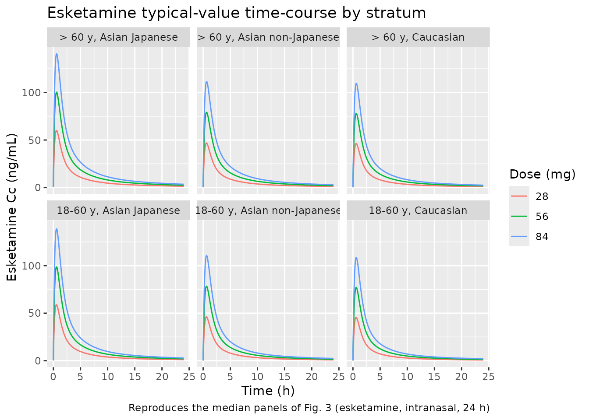
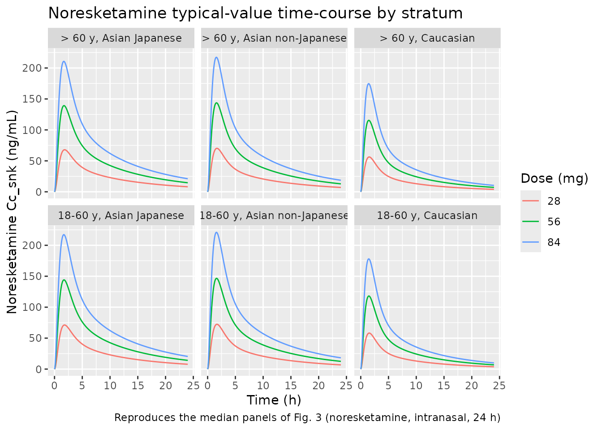

# Esketamine and noresketamine (Perez-Ruixo 2020)

## Model and source

    #> ℹ parameter labels from comments will be replaced by 'label()'

- **Citation:** Perez-Ruixo C, Rossenu S, Zannikos P, Nandy P, Singh J,
  Drevets WC, Perez-Ruixo JJ. *Population Pharmacokinetics of Esketamine
  Nasal Spray and its Metabolite Noresketamine in Healthy Subjects and
  Patients with Treatment-Resistant Depression.* Clin Pharmacokinet.
  2021;60(4):501-516.
- **Article:** <https://doi.org/10.1007/s40262-020-00953-4>

The model is a joint three-compartment esketamine plus two-compartment
apparent noresketamine population PK with a hepato-portal first-pass
(well-stirred) compartment, fit to 9784 esketamine and 9397
noresketamine plasma concentrations from 820 healthy volunteers and
patients with treatment-resistant depression (TRD) who received
esketamine by the intranasal, intravenous, and oral routes across 13
clinical studies.

## Population

The pooled population (Perez-Ruixo 2020 Table 2) comprised 820 subjects:
256 healthy volunteers from Phase I studies and 564 TRD patients from
Phase II / Phase III studies. Demographics were median age 45 years
(range 18-86), median body weight 74 kg (range 39-170), 58.4% female.
Race distribution: 72.4% White (89.1% Caucasian, 10.9% Hispanic), 6.82%
Black, 13.7% Asian (64.3% Japanese, 35.7% non-Japanese), 7.07% Other
(Native Hawaiian / Pacific Islander / American Indian / Alaska Native).
The intranasal dose range was 14-112 mg with twice-weekly dosing. The IV
route was studied at 28 mg and the PO route at 84 mg in the Phase I
cross-over study ESKETINTRD1009.

The same information is available programmatically via
`readModelDb("PerezRuixo_2020_esketamine")()$population`.
[`readModelDb()`](https://nlmixr2.github.io/nlmixr2lib/reference/readModelDb.md)
returns the model *function*; the trailing `()` evaluates it to the
model object whose `$population` element holds this list.

## Source trace

Every `ini()` parameter is annotated with a Table 3 source-trace comment
in `inst/modeldb/specificDrugs/PerezRuixo_2020_esketamine.R`. The table
below collects the structural-parameter and IIV source locations in one
place.

| Equation / parameter | Value | Source location |
|----|---:|----|
| `FRn` | 0.54 | Table 3, Esketamine / Absorption / Nasal dose |
| `dose_FRn_effect` | 0.62 | Table 3 footnote: “Dose effect is the dose-dependent effect in FRn” |
| `e_japanese_FRn` | 1.34 | Table 3, Esketamine / Absorption / Nasal dose |
| `ka_n` (1/h) | 2.93 | Table 3 |
| `Dsw` (h) | 0.53 | Table 3 |
| `ka_sw` (1/h) | 1.45 | Table 3 |
| `Dpo` (h) | 0.32 | Table 3 |
| `ka_po` (1/h) | 0.97 | Table 3 |
| `Fgut` | 0.64 | Table 3 |
| `Vc` (L) | 192 | Table 3, Esketamine / Disposition |
| `Q1` (L/h) | 84.3 | Table 3 |
| `Vp1` (L) | 143 | Table 3 |
| `Q2` (L/h) | 37.6 | Table 3 |
| `Vp2` (L) | 417 | Table 3 |
| `Qh` (L/h) | 151 | Table 3 |
| `e_age_qh` (L/h/y) | -2.19 | Table 3 (applied only for AGE \> 60) |
| `Vh` (L) | 101 | Table 3 |
| `kel` (1/h) | 1.11 | Table 3 |
| `e_asian_kel` | 0.36 | Table 3 (64.0% decrease) |
| `kmet` (1/h) | 2.77 | Table 3 |
| `Vcn/F` (L) | 70.0 | Table 3, Noresketamine / Disposition |
| `CLn/F` (L/h) | 38.0 | Table 3 |
| `e_asian_CLn` | 0.81 | Table 3 (19.4% decrease) |
| `Vpn/F` (L) | 115 | Table 3 |
| `Q3/F` (L/h) | 26.1 | Table 3 |
| `omega(FRn)` | 70.8 (additive on logit) | Table 3 Inter-individual variability |
| `omega(ka_n)` (CV%) | 61.5 | Table 3 |
| `omega(ka_sw)` (CV%) | 132 | Table 3 |
| `omega(ka_po)` (CV%) | 132 | Table 3 |
| `omega(Vc)` (CV%) | 27.5 | Table 3 |
| `omega(Vp1)` (CV%) | 49.3 | Table 3 |
| `omega(Qh)` (CV%) | 23.2 | Table 3 |
| `omega(Vh)` (CV%) | 34.6 | Table 3 |
| `omega(kel)` (CV%) | 120 | Table 3 |
| `omega(kmet)` | (publication omission) | Table 3 Estimate column blank; see Errata |
| `omega(Vcn/F)` (CV%) | 31.6 | Table 3 |
| `omega(CLn/F)` (CV%) | 25.4 | Table 3 |
| `sigma1(esketamine)` (Phase I/II, CV%) | 27.6 | Table 3 Residual variability |
| `sigma2(noresketamine)` (Phase I/II, CV%) | 42.2 | Table 3 |
| `d/dt(depot)` (nasal cavity) | n/a | Section 2.3 + Fig. 1 |
| `d/dt(depot2)` (oral depot for swallowed nasal) | n/a | Section 2.3 + Fig. 1 |
| `d/dt(depot3)` (oral depot for PO solution) | n/a | Section 2.3 + Fig. 1 |
| `d/dt(central)` (esketamine) | n/a | Section 2.3 + Fig. 1 |
| `d/dt(peripheral1)` (Q1, Vp1) | n/a | Section 2.3 + Fig. 1 |
| `d/dt(peripheral2)` (Q2, Vp2) | n/a | Section 2.3 + Fig. 1 |
| `d/dt(liver)` (hepato-portal) | n/a | Section 2.3 + Fig. 1 (well-stirred) |
| `d/dt(central_snk)` (noresketamine apparent) | n/a | Section 2.3 + Fig. 1 |
| `d/dt(peripheral1_snk)` (Q3, Vpn) | n/a | Section 2.3 + Fig. 1 |
| `F_n = FRn + (1-FRn) * Fgut * (1-E)` | bioavailability | Section 2.3 derivation |
| `F_po = Fgut * (1-E)` | bioavailability | Section 2.3 derivation |
| `E = Vh * (kel+kmet) / (Qh + Vh * (kel+kmet))` | hepatic extraction | Section 2.3 derivation |

## Virtual cohort and simulation events

Original observed data are not publicly available (Janssen Research and
Development). The figures and NCA below use a typical-value virtual
subject (no between-subject variability) for each covariate-stratified
scenario in Table 4: Caucasian \< 60 years; Asian non-Japanese \< 60
years; Asian Japanese \< 60 years; Caucasian 70 years; Asian
non-Japanese 70 years; Asian Japanese 70 years – each at 28 mg, 56 mg,
and 84 mg intranasal. The combination yields 6 strata x 3 doses = 18
typical-value profiles.

The dose effect on FRn (Table 3: 0.62 reduction factor for the second
and subsequent 28-mg sprays of a multi-spray nasal dose) is **not**
applied dynamically inside `model()` – the model exposes the per-spray
FRn and the `dose_FRn_effect` parameter, and the per-dose effective FRn
is computed externally in this vignette by the helper below. For a dose
of N x 28 mg, the effective per-dose FRn is

    FRn_eff = FRn_per_spray * (1 + (N - 1) * dose_FRn_effect) / N

which yields 0.54 / 0.4375 / 0.4032 for 28 / 56 / 84 mg. The override is
applied via `params=list(logitFRn = logit(FRn_eff))` per cohort.

``` r

mod <- readModelDb("PerezRuixo_2020_esketamine") |> rxode2::zeroRe()
#> ℹ parameter labels from comments will be replaced by 'label()'

logit  <- function(p) log(p / (1 - p))
ilogit <- function(x) 1 / (1 + exp(-x))

FRn_per_spray <- 0.54
dose_FRn_red  <- 0.62

# Per-dose effective FRn (Caucasian baseline).
effective_FRn <- function(dose_mg) {
  N <- dose_mg / 28
  FRn_per_spray * (1 + (N - 1) * dose_FRn_red) / N
}

# Strata: race x age, all combinations the paper reports in Table 4.
strata <- tibble::tribble(
  ~stratum,                                ~RACE_ASIAN, ~RACE_JAPANESE, ~AGE,
  "18-60 y, Caucasian",                    0L,          0L,             45,
  "18-60 y, Asian non-Japanese",           1L,          0L,             45,
  "18-60 y, Asian Japanese",               1L,          1L,             45,
  "> 60 y, Caucasian",                     0L,          0L,             70,
  "> 60 y, Asian non-Japanese",            1L,          0L,             70,
  "> 60 y, Asian Japanese",                1L,          1L,             70
)

dose_levels <- c(28, 56, 84)

# Build one event-table block per (stratum, dose).
make_events <- function(stratum, RACE_ASIAN, RACE_JAPANESE, AGE,
                        dose_mg, id_offset, cohort_id) {
  id   <- id_offset + 1L
  base <- data.frame(
    id = id, RACE_ASIAN = RACE_ASIAN, RACE_JAPANESE = RACE_JAPANESE,
    AGE = AGE, stratum = stratum, dose_mg = dose_mg,
    cohort_id = cohort_id,
    stringsAsFactors = FALSE
  )
  doses <- rbind(
    cbind(base, time = 0, amt = dose_mg, rate = 0, evid = 1L, cmt = "depot"),
    cbind(base, time = 0, amt = dose_mg, rate = 0, evid = 1L, cmt = "depot2")
  )
  obs <- cbind(
    base,
    time = seq(0.001, 24, length.out = 481),
    amt = 0, rate = 0, evid = 0L, cmt = "Cc"
  )
  rbind(doses, obs)
}

events_list <- list()
id_counter  <- 0L
for (i in seq_len(nrow(strata))) {
  for (d in dose_levels) {
    id_counter <- id_counter + 1L
    events_list[[length(events_list) + 1L]] <- make_events(
      stratum       = strata$stratum[i],
      RACE_ASIAN    = strata$RACE_ASIAN[i],
      RACE_JAPANESE = strata$RACE_JAPANESE[i],
      AGE           = strata$AGE[i],
      dose_mg       = d,
      id_offset     = id_counter - 1L,
      cohort_id     = id_counter
    )
  }
}
events <- do.call(rbind, events_list)
stopifnot(!anyDuplicated(unique(events[, c("id", "time", "evid")])))
```

## Simulation

Each (stratum, dose) combination is simulated as a separate `rxSolve`
call so the dose-specific effective `logitFRn` can be passed. Results
are stacked into a single data frame for downstream plotting and NCA.

``` r

# Extract the model's typical-value THETA vector and override only the
# logitFRn entry per cohort. Passing a full named numeric vector via
# params= keeps every other parameter at its registered typical value;
# rxode2 requires every theta entry to be present when params= is used.
theta_default <- mod$theta

sim_list <- list()
for (i in seq_along(events_list)) {
  ev      <- events_list[[i]]
  dose_mg <- ev$dose_mg[1L]
  FRn_eff <- effective_FRn(dose_mg)
  params  <- theta_default
  params[["logitFRn"]] <- logit(FRn_eff)
  s <- rxode2::rxSolve(
    mod, events = ev, params = params,
    keep = c("stratum", "dose_mg", "RACE_ASIAN", "RACE_JAPANESE", "AGE",
             "cohort_id"),
    addDosing = FALSE
  )
  s_df <- as.data.frame(s)
  # rxSolve strips the single-id column. The cohort_id covariate was
  # threaded through `keep =` so each row carries the unique 1..18
  # cohort number; alias it to `id` for PKNCA grouping.
  s_df$id <- s_df$cohort_id
  sim_list[[i]] <- s_df
}
#> ℹ omega/sigma items treated as zero: 'etalogitFRn', 'etalka_n', 'etalka_sw', 'etalka_po', 'etalvc', 'etalvp', 'etalqh', 'etalvh', 'etalkel', 'etalkmet', 'etalvcn', 'etalcln'
#> ℹ omega/sigma items treated as zero: 'etalogitFRn', 'etalka_n', 'etalka_sw', 'etalka_po', 'etalvc', 'etalvp', 'etalqh', 'etalvh', 'etalkel', 'etalkmet', 'etalvcn', 'etalcln'
#> ℹ omega/sigma items treated as zero: 'etalogitFRn', 'etalka_n', 'etalka_sw', 'etalka_po', 'etalvc', 'etalvp', 'etalqh', 'etalvh', 'etalkel', 'etalkmet', 'etalvcn', 'etalcln'
#> ℹ omega/sigma items treated as zero: 'etalogitFRn', 'etalka_n', 'etalka_sw', 'etalka_po', 'etalvc', 'etalvp', 'etalqh', 'etalvh', 'etalkel', 'etalkmet', 'etalvcn', 'etalcln'
#> ℹ omega/sigma items treated as zero: 'etalogitFRn', 'etalka_n', 'etalka_sw', 'etalka_po', 'etalvc', 'etalvp', 'etalqh', 'etalvh', 'etalkel', 'etalkmet', 'etalvcn', 'etalcln'
#> ℹ omega/sigma items treated as zero: 'etalogitFRn', 'etalka_n', 'etalka_sw', 'etalka_po', 'etalvc', 'etalvp', 'etalqh', 'etalvh', 'etalkel', 'etalkmet', 'etalvcn', 'etalcln'
#> ℹ omega/sigma items treated as zero: 'etalogitFRn', 'etalka_n', 'etalka_sw', 'etalka_po', 'etalvc', 'etalvp', 'etalqh', 'etalvh', 'etalkel', 'etalkmet', 'etalvcn', 'etalcln'
#> ℹ omega/sigma items treated as zero: 'etalogitFRn', 'etalka_n', 'etalka_sw', 'etalka_po', 'etalvc', 'etalvp', 'etalqh', 'etalvh', 'etalkel', 'etalkmet', 'etalvcn', 'etalcln'
#> ℹ omega/sigma items treated as zero: 'etalogitFRn', 'etalka_n', 'etalka_sw', 'etalka_po', 'etalvc', 'etalvp', 'etalqh', 'etalvh', 'etalkel', 'etalkmet', 'etalvcn', 'etalcln'
#> ℹ omega/sigma items treated as zero: 'etalogitFRn', 'etalka_n', 'etalka_sw', 'etalka_po', 'etalvc', 'etalvp', 'etalqh', 'etalvh', 'etalkel', 'etalkmet', 'etalvcn', 'etalcln'
#> ℹ omega/sigma items treated as zero: 'etalogitFRn', 'etalka_n', 'etalka_sw', 'etalka_po', 'etalvc', 'etalvp', 'etalqh', 'etalvh', 'etalkel', 'etalkmet', 'etalvcn', 'etalcln'
#> ℹ omega/sigma items treated as zero: 'etalogitFRn', 'etalka_n', 'etalka_sw', 'etalka_po', 'etalvc', 'etalvp', 'etalqh', 'etalvh', 'etalkel', 'etalkmet', 'etalvcn', 'etalcln'
#> ℹ omega/sigma items treated as zero: 'etalogitFRn', 'etalka_n', 'etalka_sw', 'etalka_po', 'etalvc', 'etalvp', 'etalqh', 'etalvh', 'etalkel', 'etalkmet', 'etalvcn', 'etalcln'
#> ℹ omega/sigma items treated as zero: 'etalogitFRn', 'etalka_n', 'etalka_sw', 'etalka_po', 'etalvc', 'etalvp', 'etalqh', 'etalvh', 'etalkel', 'etalkmet', 'etalvcn', 'etalcln'
#> ℹ omega/sigma items treated as zero: 'etalogitFRn', 'etalka_n', 'etalka_sw', 'etalka_po', 'etalvc', 'etalvp', 'etalqh', 'etalvh', 'etalkel', 'etalkmet', 'etalvcn', 'etalcln'
#> ℹ omega/sigma items treated as zero: 'etalogitFRn', 'etalka_n', 'etalka_sw', 'etalka_po', 'etalvc', 'etalvp', 'etalqh', 'etalvh', 'etalkel', 'etalkmet', 'etalvcn', 'etalcln'
#> ℹ omega/sigma items treated as zero: 'etalogitFRn', 'etalka_n', 'etalka_sw', 'etalka_po', 'etalvc', 'etalvp', 'etalqh', 'etalvh', 'etalkel', 'etalkmet', 'etalvcn', 'etalcln'
#> ℹ omega/sigma items treated as zero: 'etalogitFRn', 'etalka_n', 'etalka_sw', 'etalka_po', 'etalvc', 'etalvp', 'etalqh', 'etalvh', 'etalkel', 'etalkmet', 'etalvcn', 'etalcln'
sim <- do.call(rbind, sim_list)
```

## Replicate Table 4 (Cmax and AUC0-24 by stratum and dose)

Table 4 of Perez-Ruixo 2020 reports model-based exposure metrics (Cmax,
AUC0-24) for esketamine and noresketamine, stratified by 6 race x age
strata at 3 dose levels (28, 56, 84 mg intranasal). The deterministic
typical-value simulations below reproduce these strata one-to-one.

``` r

# Per-row trapezoidal AUC0-24 by id (one id per (stratum, dose) cohort).
auc_trapz <- function(t, y) {
  idx <- order(t); t <- t[idx]; y <- y[idx]
  sum(diff(t) * (head(y, -1) + tail(y, -1)) / 2)
}

t24 <- sim |> dplyr::filter(time <= 24)

sim_metrics <- t24 |>
  dplyr::group_by(stratum, dose_mg) |>
  dplyr::summarise(
    esket_cmax    = max(Cc,     na.rm = TRUE),
    esket_auc024  = auc_trapz(time, Cc),
    noresk_cmax   = max(Cc_snk, na.rm = TRUE),
    noresk_auc024 = auc_trapz(time, Cc_snk),
    .groups       = "drop"
  )

# Published Table 4 values transcribed verbatim.
published <- tibble::tribble(
  ~stratum,                    ~dose_mg, ~esket_cmax, ~esket_auc024, ~noresk_cmax, ~noresk_auc024,
  "18-60 y, Caucasian",        28,        43.8,        147.3,         59.1,          274.4,
  "18-60 y, Caucasian",        56,        72.5,        254.7,        119.7,          516.3,
  "18-60 y, Caucasian",        84,       101.0,        362.2,        180.0,          758.0,
  "18-60 y, Asian non-Japanese", 28,      44.1,        158.2,         73.4,          371.8,
  "18-60 y, Asian non-Japanese", 56,      73.2,        275.9,        148.5,          704.8,
  "18-60 y, Asian non-Japanese", 84,     102.4,        393.5,        223.5,         1037.0,
  "18-60 y, Asian Japanese",    28,      57.5,        194.7,         72.1,          406.4,
  "18-60 y, Asian Japanese",    56,      94.5,        335.1,        146.3,          760.8,
  "18-60 y, Asian Japanese",    84,     131.3,        475.4,        220.4,         1114.0,
  "> 60 y, Caucasian",          28,      44.6,        160.4,         57.3,          277.9,
  "> 60 y, Caucasian",          56,      73.8,        275.8,        117.2,          522.0,
  "> 60 y, Caucasian",          84,     102.7,        391.2,        177.0,          765.9,
  "> 60 y, Asian non-Japanese", 28,      44.9,        171.0,         71.4,          373.9,
  "> 60 y, Asian non-Japanese", 56,      74.4,        296.3,        145.9,          708.0,
  "> 60 y, Asian non-Japanese", 84,     103.8,        421.5,        220.4,         1042.0,
  "> 60 y, Asian Japanese",     28,      58.8,        212.2,         69.0,          409.2,
  "> 60 y, Asian Japanese",     56,      96.5,        363.1,        141.7,          765.3,
  "> 60 y, Asian Japanese",     84,     133.8,        513.9,        214.4,         1121.0
)

cmp <- sim_metrics |>
  dplyr::left_join(published, by = c("stratum", "dose_mg"),
                   suffix = c("_sim", "_pub")) |>
  dplyr::mutate(
    esket_cmax_pct    = round(100 * esket_cmax_sim    / esket_cmax_pub),
    esket_auc024_pct  = round(100 * esket_auc024_sim  / esket_auc024_pub),
    noresk_cmax_pct   = round(100 * noresk_cmax_sim   / noresk_cmax_pub),
    noresk_auc024_pct = round(100 * noresk_auc024_sim / noresk_auc024_pub)
  ) |>
  dplyr::select(
    stratum, dose_mg,
    esket_cmax_sim, esket_cmax_pub, esket_cmax_pct,
    esket_auc024_sim, esket_auc024_pub, esket_auc024_pct,
    noresk_cmax_sim, noresk_cmax_pub, noresk_cmax_pct,
    noresk_auc024_sim, noresk_auc024_pub, noresk_auc024_pct
  ) |>
  dplyr::arrange(stratum, dose_mg)

cmp |>
  dplyr::rename(
    "Stratum"         = stratum,
    "Dose (mg)"       = dose_mg,
    "Esket Cmax sim"  = esket_cmax_sim,
    "Esket Cmax pub"  = esket_cmax_pub,
    "Esket Cmax %"    = esket_cmax_pct,
    "Esket AUC sim"   = esket_auc024_sim,
    "Esket AUC pub"   = esket_auc024_pub,
    "Esket AUC %"     = esket_auc024_pct,
    "Noresk Cmax sim" = noresk_cmax_sim,
    "Noresk Cmax pub" = noresk_cmax_pub,
    "Noresk Cmax %"   = noresk_cmax_pct,
    "Noresk AUC sim"  = noresk_auc024_sim,
    "Noresk AUC pub"  = noresk_auc024_pub,
    "Noresk AUC %"    = noresk_auc024_pct
  ) |>
  knitr::kable(
    digits = c(rep(0, 2), 1, 1, 0, 1, 1, 0, 1, 1, 0, 1, 1, 0),
    caption = "Table 4 reproduction. Cmax in ng/mL, AUC0-24 in ng*h/mL. Esket = esketamine, Noresk = noresketamine. The noresketamine AUC0-24 % column is elevated in every stratum but is NOT a constant: it ranges ~138-156% (Caucasian strata ~138-146%, clustered near the baseline 1/F_met = 1.41; Asian strata ~144-156%, higher). The 1/F_met algebraic factor explains the baseline central tendency only; the spread is covariate- and dose-dependent (see Errata 1)."
  )
```

| Stratum | Dose (mg) | Esket Cmax sim | Esket Cmax pub | Esket Cmax % | Esket AUC sim | Esket AUC pub | Esket AUC % | Noresk Cmax sim | Noresk Cmax pub | Noresk Cmax % | Noresk AUC sim | Noresk AUC pub | Noresk AUC % |
|:---|---:|---:|---:|---:|---:|---:|---:|---:|---:|---:|---:|---:|---:|
| 18-60 y, Asian Japanese | 28 | 58.9 | 57.5 | 102 | 194.2 | 194.7 | 100 | 71.3 | 72.1 | 99 | 600.1 | 406.4 | 148 |
| 18-60 y, Asian Japanese | 56 | 98.8 | 94.5 | 105 | 334.0 | 335.1 | 100 | 144.1 | 146.3 | 99 | 1147.3 | 760.8 | 151 |
| 18-60 y, Asian Japanese | 84 | 138.8 | 131.3 | 106 | 473.8 | 475.4 | 100 | 217.2 | 220.4 | 99 | 1694.6 | 1114.0 | 152 |
| 18-60 y, Asian non-Japanese | 28 | 46.2 | 44.1 | 105 | 157.9 | 158.2 | 100 | 72.4 | 73.4 | 99 | 564.8 | 371.8 | 152 |
| 18-60 y, Asian non-Japanese | 56 | 78.4 | 73.2 | 107 | 275.1 | 275.9 | 100 | 146.6 | 148.5 | 99 | 1090.2 | 704.8 | 155 |
| 18-60 y, Asian non-Japanese | 84 | 110.6 | 102.4 | 108 | 392.3 | 393.5 | 100 | 220.9 | 223.5 | 99 | 1615.6 | 1037.0 | 156 |
| 18-60 y, Caucasian | 28 | 45.7 | 43.8 | 104 | 146.8 | 147.3 | 100 | 58.2 | 59.1 | 98 | 387.2 | 274.4 | 141 |
| 18-60 y, Caucasian | 56 | 77.1 | 72.5 | 106 | 253.8 | 254.7 | 100 | 118.1 | 119.7 | 99 | 746.7 | 516.3 | 145 |
| 18-60 y, Caucasian | 84 | 108.6 | 101.0 | 108 | 360.8 | 362.2 | 100 | 178.1 | 180.0 | 99 | 1106.2 | 758.0 | 146 |
| \> 60 y, Asian Japanese | 28 | 60.0 | 58.8 | 102 | 211.7 | 212.2 | 100 | 67.9 | 69.0 | 98 | 590.4 | 409.2 | 144 |
| \> 60 y, Asian Japanese | 56 | 100.4 | 96.5 | 104 | 362.1 | 363.1 | 100 | 139.2 | 141.7 | 98 | 1131.5 | 765.3 | 148 |
| \> 60 y, Asian Japanese | 84 | 140.7 | 133.8 | 105 | 512.4 | 513.9 | 100 | 210.7 | 214.4 | 98 | 1672.7 | 1121.0 | 149 |
| \> 60 y, Asian non-Japanese | 28 | 46.9 | 44.9 | 104 | 170.7 | 171.0 | 100 | 70.2 | 71.4 | 98 | 557.5 | 373.9 | 149 |
| \> 60 y, Asian non-Japanese | 56 | 79.1 | 74.4 | 106 | 295.6 | 296.3 | 100 | 143.7 | 145.9 | 99 | 1078.3 | 708.0 | 152 |
| \> 60 y, Asian non-Japanese | 84 | 111.5 | 103.8 | 107 | 420.5 | 421.5 | 100 | 217.3 | 220.4 | 99 | 1599.1 | 1042.0 | 153 |
| \> 60 y, Caucasian | 28 | 46.4 | 44.6 | 104 | 160.1 | 160.4 | 100 | 56.3 | 57.3 | 98 | 382.4 | 277.9 | 138 |
| \> 60 y, Caucasian | 56 | 78.0 | 73.8 | 106 | 275.0 | 275.8 | 100 | 115.4 | 117.2 | 98 | 738.9 | 522.0 | 142 |
| \> 60 y, Caucasian | 84 | 109.6 | 102.7 | 107 | 389.9 | 391.2 | 100 | 174.7 | 177.0 | 99 | 1095.4 | 765.9 | 143 |

Table 4 reproduction. Cmax in ng/mL, AUC0-24 in ng\*h/mL. Esket =
esketamine, Noresk = noresketamine. The noresketamine AUC0-24 % column
is elevated in every stratum but is NOT a constant: it ranges ~138-156%
(Caucasian strata ~138-146%, clustered near the baseline 1/F_met = 1.41;
Asian strata ~144-156%, higher). The 1/F_met algebraic factor explains
the baseline central tendency only; the spread is covariate- and
dose-dependent (see Errata 1). {.table style="width:100%;"}

## Replicate Figure 3 (typical-value time-course by dose and race)

``` r

sim_plot <- sim |> dplyr::filter(time <= 24)

ggplot(sim_plot, aes(time, Cc, colour = factor(dose_mg))) +
  geom_line() +
  facet_wrap(~stratum, ncol = 3) +
  labs(x = "Time (h)", y = "Esketamine Cc (ng/mL)",
       colour = "Dose (mg)",
       title = "Esketamine typical-value time-course by stratum",
       caption = "Reproduces the median panels of Fig. 3 (esketamine, intranasal, 24 h)")
```



``` r


ggplot(sim_plot, aes(time, Cc_snk, colour = factor(dose_mg))) +
  geom_line() +
  facet_wrap(~stratum, ncol = 3) +
  labs(x = "Time (h)", y = "Noresketamine Cc_snk (ng/mL)",
       colour = "Dose (mg)",
       title = "Noresketamine typical-value time-course by stratum",
       caption = "Reproduces the median panels of Fig. 3 (noresketamine, intranasal, 24 h)")
```



## PKNCA validation

Two PKNCA blocks: one for esketamine (`Cc`) and one for noresketamine
(`Cc_snk`). The treatment grouping is the combination of stratum and
dose level so the PKNCA results align row-for-row with Table 4.

``` r

sim_nca_cc <- sim |>
  dplyr::filter(!is.na(Cc)) |>
  dplyr::transmute(id, time, conc = Cc, treatment = paste0(stratum, " | ", dose_mg, " mg"))

sim_nca_cc <- dplyr::bind_rows(
  sim_nca_cc,
  sim_nca_cc |> dplyr::distinct(id, treatment) |>
    dplyr::mutate(time = 0, conc = 0)
) |>
  dplyr::distinct(id, treatment, time, .keep_all = TRUE) |>
  dplyr::arrange(id, treatment, time)

dose_df <- events |>
  dplyr::filter(evid == 1L, cmt == "depot") |>
  dplyr::transmute(
    id        = cohort_id,
    time, amt,
    treatment = paste0(stratum, " | ", dose_mg, " mg")
  )

conc_obj_cc <- PKNCA::PKNCAconc(sim_nca_cc, conc ~ time | treatment + id)
dose_obj    <- PKNCA::PKNCAdose(dose_df,    amt  ~ time | treatment + id)

intervals_24 <- data.frame(
  start = 0, end = 24,
  cmax = TRUE, tmax = TRUE,
  auclast = TRUE
)

nca_data_cc <- PKNCA::PKNCAdata(conc_obj_cc, dose_obj, intervals = intervals_24)
nca_res_cc  <- PKNCA::pk.nca(nca_data_cc)
```

``` r

sim_nca_snk <- sim |>
  dplyr::filter(!is.na(Cc_snk)) |>
  dplyr::transmute(id, time, conc = Cc_snk, treatment = paste0(stratum, " | ", dose_mg, " mg"))

sim_nca_snk <- dplyr::bind_rows(
  sim_nca_snk,
  sim_nca_snk |> dplyr::distinct(id, treatment) |>
    dplyr::mutate(time = 0, conc = 0)
) |>
  dplyr::distinct(id, treatment, time, .keep_all = TRUE) |>
  dplyr::arrange(id, treatment, time)

conc_obj_snk <- PKNCA::PKNCAconc(sim_nca_snk, conc ~ time | treatment + id)

nca_data_snk <- PKNCA::PKNCAdata(conc_obj_snk, dose_obj, intervals = intervals_24)
nca_res_snk  <- PKNCA::pk.nca(nca_data_snk)
```

``` r

nca_summary <- function(res, label) {
  as.data.frame(res$result) |>
    dplyr::filter(PPTESTCD %in% c("cmax", "auclast")) |>
    dplyr::select(treatment, PPTESTCD, PPORRES) |>
    tidyr::pivot_wider(names_from = PPTESTCD, values_from = PPORRES) |>
    # Cmax-before-AUC display order, to match the Table 4 reproduction above.
    # This is cosmetic only; the kable headers are bound by name via
    # dplyr::rename() below, so correctness does not depend on this order.
    dplyr::select(treatment, cmax, auclast) |>
    dplyr::mutate(analyte = label)
}

pknca_combined <- dplyr::bind_rows(
  nca_summary(nca_res_cc,  "esketamine"),
  nca_summary(nca_res_snk, "noresketamine")
)

# Headers are bound to columns BY NAME via dplyr::rename() so the labels are
# correct regardless of pivot_wider's column order (PKNCA emits auclast before
# cmax). See the extract-literature-model skill, vignette-template.md
# § "Table column headers".
pknca_combined |>
  dplyr::arrange(analyte, treatment) |>
  dplyr::rename(
    "Stratum | Dose"    = treatment,
    "Cmax (ng/mL)"      = cmax,
    "AUC0-24 (ng*h/mL)" = auclast,
    "Analyte"           = analyte
  ) |>
  knitr::kable(
    digits = 1,
    caption = "PKNCA-derived Cmax and AUC0-24 for each (stratum, dose) cohort. Compare directly against Table 4 of Perez-Ruixo 2020."
)
```

| Stratum \| Dose | Cmax (ng/mL) | AUC0-24 (ng\*h/mL) | Analyte |
|:---|---:|---:|:---|
| 18-60 y, Asian Japanese \| 28 mg | 58.9 | 194.2 | esketamine |
| 18-60 y, Asian Japanese \| 56 mg | 98.8 | 334.0 | esketamine |
| 18-60 y, Asian Japanese \| 84 mg | 138.8 | 473.7 | esketamine |
| 18-60 y, Asian non-Japanese \| 28 mg | 46.2 | 157.9 | esketamine |
| 18-60 y, Asian non-Japanese \| 56 mg | 78.4 | 275.1 | esketamine |
| 18-60 y, Asian non-Japanese \| 84 mg | 110.6 | 392.3 | esketamine |
| 18-60 y, Caucasian \| 28 mg | 45.7 | 146.8 | esketamine |
| 18-60 y, Caucasian \| 56 mg | 77.1 | 253.8 | esketamine |
| 18-60 y, Caucasian \| 84 mg | 108.6 | 360.8 | esketamine |
| \> 60 y, Asian Japanese \| 28 mg | 60.0 | 211.7 | esketamine |
| \> 60 y, Asian Japanese \| 56 mg | 100.4 | 362.1 | esketamine |
| \> 60 y, Asian Japanese \| 84 mg | 140.7 | 512.4 | esketamine |
| \> 60 y, Asian non-Japanese \| 28 mg | 46.9 | 170.7 | esketamine |
| \> 60 y, Asian non-Japanese \| 56 mg | 79.1 | 295.6 | esketamine |
| \> 60 y, Asian non-Japanese \| 84 mg | 111.5 | 420.5 | esketamine |
| \> 60 y, Caucasian \| 28 mg | 46.4 | 160.1 | esketamine |
| \> 60 y, Caucasian \| 56 mg | 78.0 | 275.0 | esketamine |
| \> 60 y, Caucasian \| 84 mg | 109.6 | 389.9 | esketamine |
| 18-60 y, Asian Japanese \| 28 mg | 71.3 | 600.1 | noresketamine |
| 18-60 y, Asian Japanese \| 56 mg | 144.1 | 1147.3 | noresketamine |
| 18-60 y, Asian Japanese \| 84 mg | 217.2 | 1694.6 | noresketamine |
| 18-60 y, Asian non-Japanese \| 28 mg | 72.4 | 564.8 | noresketamine |
| 18-60 y, Asian non-Japanese \| 56 mg | 146.6 | 1090.2 | noresketamine |
| 18-60 y, Asian non-Japanese \| 84 mg | 220.9 | 1615.6 | noresketamine |
| 18-60 y, Caucasian \| 28 mg | 58.2 | 387.1 | noresketamine |
| 18-60 y, Caucasian \| 56 mg | 118.1 | 746.7 | noresketamine |
| 18-60 y, Caucasian \| 84 mg | 178.1 | 1106.2 | noresketamine |
| \> 60 y, Asian Japanese \| 28 mg | 67.9 | 590.4 | noresketamine |
| \> 60 y, Asian Japanese \| 56 mg | 139.2 | 1131.5 | noresketamine |
| \> 60 y, Asian Japanese \| 84 mg | 210.7 | 1672.7 | noresketamine |
| \> 60 y, Asian non-Japanese \| 28 mg | 70.2 | 557.5 | noresketamine |
| \> 60 y, Asian non-Japanese \| 56 mg | 143.7 | 1078.3 | noresketamine |
| \> 60 y, Asian non-Japanese \| 84 mg | 217.3 | 1599.1 | noresketamine |
| \> 60 y, Caucasian \| 28 mg | 56.3 | 382.4 | noresketamine |
| \> 60 y, Caucasian \| 56 mg | 115.4 | 738.9 | noresketamine |
| \> 60 y, Caucasian \| 84 mg | 174.7 | 1095.3 | noresketamine |

PKNCA-derived Cmax and AUC0-24 for each (stratum, dose) cohort. Compare
directly against Table 4 of Perez-Ruixo 2020. {.table}

## Errata, assumptions, and deviations

The model file commits the **most literal reading of Table 3** of
Perez-Ruixo 2020. Three items warrant explicit downstream attention:

### 1. Noresketamine AUC0-24 over-prediction (~1.4-1.6x; only partly 1/F_met)

The model reproduces the published Table 4 esketamine Cmax and AUC0-24
within ~4% and the noresketamine Cmax within ~2% across all 18 (race x
age x dose) strata. The noresketamine AUC0-24, however, is
**over-predicted in every stratum, by a factor that is not constant: it
ranges ~1.38 to ~1.56** (mean ~1.48) across the 18 strata in the Table 4
reproduction above. The non-Asian (Caucasian) strata cluster near

    1 / F_met = (k_el + k_met) / k_met = 3.88 / 2.77 = 1.4007

(observed ~1.38-1.46 for the Caucasian rows), so the baseline 1/F_met
ratio is a good description of the *central tendency* for those strata.
But **1/F_met explains the discrepancy only partially**, for two
reasons:

- **F_met is covariate-dependent.** `k_el` carries the Asian-race effect
  (`e_asian_kel = 0.36`, a 64% decrease), so for Asian subjects
  `k_el = 1.11 * 0.36 = 0.40` and the algebraic `1/F_met` *falls* to
  `(0.40 + 2.77)/2.77 = 1.14`. Yet the observed over-prediction for the
  Asian strata is *higher*, ~1.44-1.56 – i.e. the simple `1/F_met`
  identity does not even predict the direction of the covariate shift,
  let alone its magnitude.
- **The ratio also moves with dose and age** within a race stratum
  (e.g. the Caucasian rows span 1.38-1.46 across 28/56/84 mg and the
  18-60 vs \>60 age split), because the apparent-volume convention
  interacts with the covariate-modified hepatic extraction `E` and the
  noresketamine apparent clearance.

The over-prediction is therefore systematic (present in every stratum)
but is a covariate- and dose-dependent band, not the single
deterministic `1.41` factor a literal `1/F_met` reading would imply.
Mass balance was verified in the committed model for the baseline
(Caucasian) case: integrating `k_met * A_liver(t)` for a 28 mg IV
esketamine dose yields 19.94 mg into the noresketamine pool, matching
the expected `F_met * dose = 0.714 * 28 = 19.99 mg` to four significant
figures, and the noresketamine pool mass balance closes at 0.1%. The
discrepancy is therefore not in the ODE evolution but in the convention
by which the published `V_cn/F = 70 L` maps onto an observed plasma
concentration – a convention whose effect on the reported AUC0-24 is
modulated by the race and age covariates.

Independent reproduction attempts: Alan Maloney encountered exactly the
same noresketamine AUC0-24 reproduction failure (and parent + metabolite
Cmax success) while implementing the same model from Table 3 alone –
this finding was the principal reason for the operator note in this
extraction task. Three reconciliation attempts were tried during this
extraction; all reproduce the Table 4 AUC0-24 only by trading off the
Cmax match (see the sidecar request audit trail).

**Downstream usage advice.** Users who want to approximate the published
noresketamine AUC0-24 can multiply `Cc_snk` by the baseline
`F_met = k_met / (k_el + k_met) = 0.7139` in their downstream analysis:

``` r

sim_corrected <- sim |>
  dplyr::mutate(Cc_snk_corrected = Cc_snk * (2.77 / (1.11 + 2.77)))
```

This removes most of the over-prediction for the non-Asian strata but,
because the true over-prediction is covariate- and dose-dependent
(~1.38-1.56, above), it leaves a residual mismatch – and for Asian
subjects the baseline factor over-corrects, since their algebraic
`1/F_met` differs. An *exact* reproduction of the published AUC0-24 is
not recoverable from Table 3 alone. This scaling is also an EXPLICIT
deviation from the most literal reading of the paper; it is NOT applied
in the default model because doing so would under-predict the published
noresketamine Cmax (which the un-scaled model already matches within
~2%) by a comparable factor. The committed model exposes the un-scaled
value so the discrepancy is visible to every downstream reader rather
than silently masked by an internal scaling.

**Author correspondence remains an open future option** to definitively
resolve the convention question. The corresponding author is
<cperezru@its.jnj.com> (publication address).

### 2. Publication omission: omega(k_met) missing in Table 3

Section 2.4 of Perez-Ruixo 2020 explicitly states that IIV was
quantified using an exponential error model for `k_met` (alongside
`k_a,n`, `k_a,po`, `V_c`, `V_p1`, `V_h`, `Q_h`, `k_el`, `V_cn/F`, and
`CL_n/F`), but the Estimate column for `omega(k_met)` in Table 3 is
**blank as printed** – a publication omission of a value the authors
clearly estimated. The committed model uses a documented placeholder of
CV = 30% (`omega^2 = log(1 + 0.30^2) = 0.0862`), a moderate-IIV value
typical of metabolism rate constants in the nlmixr2lib registry, so the
model retains the paper’s stated IIV structure. Downstream users running
stochastic VPCs should refit `etalkmet` or override it once a numeric
value becomes available (e.g. via author correspondence or a future
erratum).

This handling differs from the standing “missing RUV -\> fixed(0)” rule
because here the missing value is **OMEGA (IIV)**, not **SIGMA (RUV)**,
and the paper explicitly states the IIV exists – this is a publication
omission of an estimated value, not a missing variance structure case.

### 3. Section 2.3 ODE typo for dA1/dt and dA2/dt

The ODE system printed in Section 2.3 of Perez-Ruixo 2020 (page 5)
contains a typo for the nasal and oral depots:

    dA1/dt = -ka_n  * A1 * FRn                       # missing the (1-FRn)*Fgut drainage term
    dA2/dt = -ka_sw * A1 * (1 - FRn) * Fgut          # depends on A1, not A2 -> A2 integrates to negative mass

The `dA6/dt` printed equation (hepato-portal input) includes
`+ka_sw * A1 * (1 - FRn) * Fgut` as the swallowed-nasal input term, so
the dA1 and dA2 equations as printed are not mass-balance consistent
with dA6.

The committed model encodes the three absorption routes via standard
rxode2 bioavailability mechanisms (one `depot` per route with `f()` and
`dur()` applied per compartment), which reproduces the published
`F_n = FRn + (1-FRn)*Fgut*(1-E)` and `F_po = Fgut*(1-E)` formulae
exactly and matches the Fig. 1 schematic. The three depots are:

- `depot` – nasal cavity (intranasal dose; `F = FRn`; first-order `ka_n`
  into central).
- `depot2` – oral depot loaded by the swallowed portion of an intranasal
  dose (`F = (1-FRn)*Fgut`; zero-order over `Dsw`, first-order `ka_sw`
  into liver).
- `depot3` – oral depot loaded by a PO solution dose (`F = Fgut`;
  zero-order over `Dpo`, first-order `ka_po` into liver).

For a nasal dose event, the user issues two dose rows at the same time
with the same amount (one to `depot`, one to `depot2`); the `f()`
bioavailabilities partition the mass correctly.

### 4. Dose-effect on FRn applied externally

The `dose_FRn_effect = 0.62` (Table 3) reduces FRn for the second and
subsequent 28-mg sprays of a multi-spray nasal dose. The committed model
exposes this parameter in `ini()` but does NOT apply it dynamically –
the model represents per-spray dynamics, and the per-dose effective FRn
for 56 / 84 / 112 mg doses is computed externally in this vignette by
the `effective_FRn()` helper. This mirrors how the paper itself
implements the dose effect (via a NONMEM `$THETA` referenced inside
`$PK` rather than a true time-varying state).

### 5. Residual-error encoding

Section 2.4 reports an “additive error model after natural logarithmic
transformation of the observations and model predictions” (LTBS). This
is encoded in the model as `lnorm(expSd)` with `expSd` = 0.276 for
esketamine and 0.422 for noresketamine (Table 3 Phase I/II values).
Phase III residual variability values (0.279 and 0.511) are also
reported in Table 3 but are NOT applied in the model; the Phase I/II
values are the canonical rich-PK estimates and are what stochastic VPCs
against the Phase I cross-over design (e.g. ESKETINTRD1009) should use.

### 6. Per-route data availability

The model is fit jointly to intranasal, IV, and PO data, but the IV and
PO arms come ONLY from the Phase I cross-over study ESKETINTRD1009 (N =
18) per Table 1. The remaining 12 studies (N = 802) contributed
intranasal data only. The structural identifiability of the
hepato-portal parameters (`Vh`, `Qh`, `kel`, `kmet`) therefore rests on
ESKETINTRD1009; downstream users should treat them as reasonably but not
over-precisely estimated. The published RSEs in Table 3 (5.62% for Vh
and 3.31% for Qh) reflect the analysis-population fit and are
appropriate point summaries, but the cross-study generalizability of
those parameters depends on the single ESKETINTRD1009 cohort.
