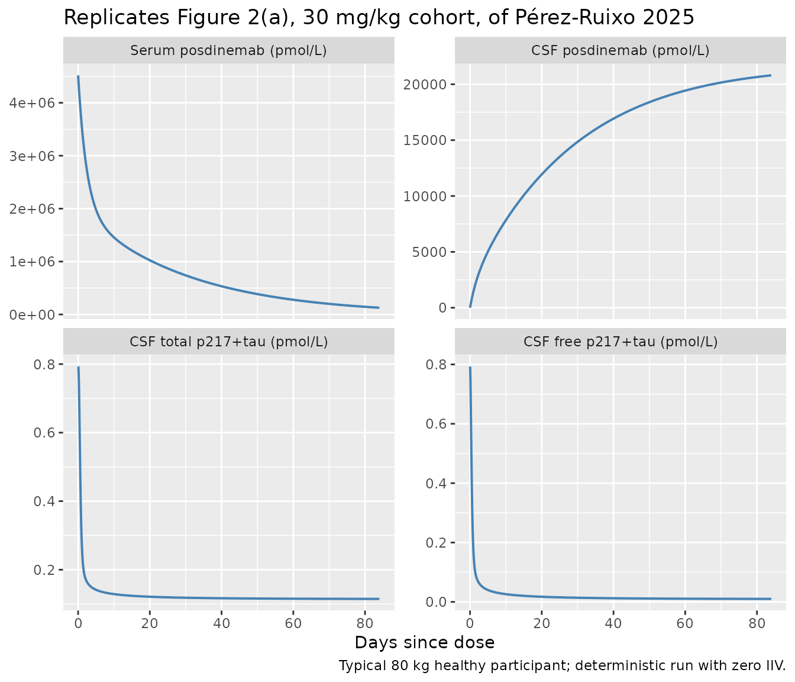
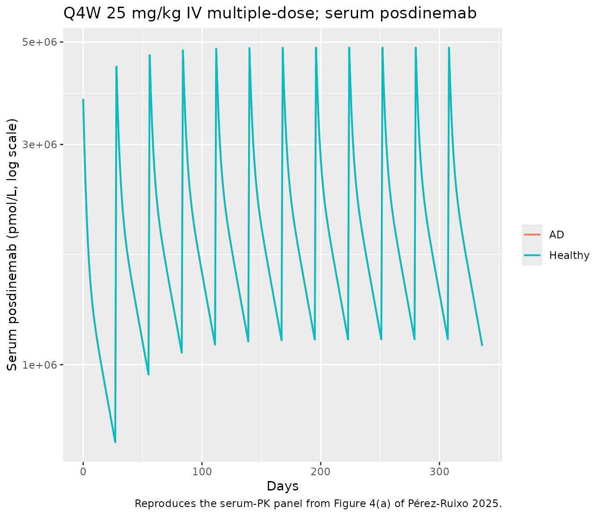
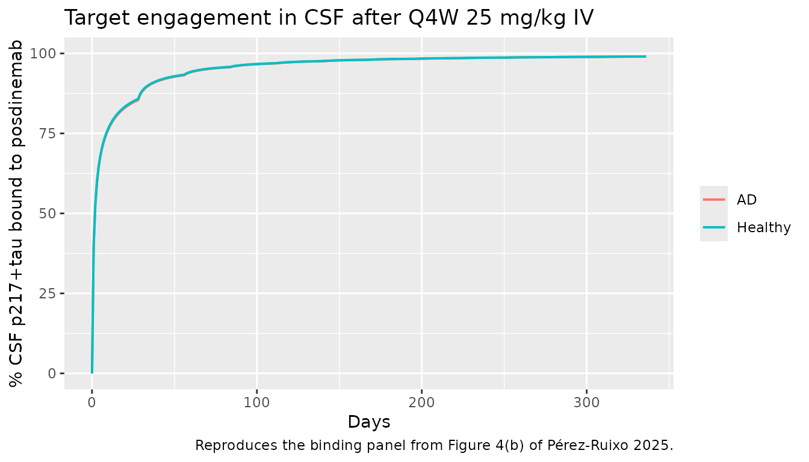
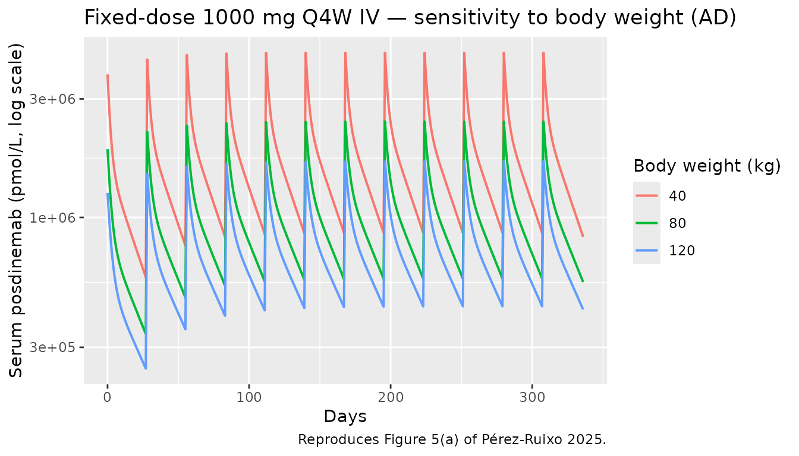

# PerezRuixo_2025_posdinemab

``` r

library(nlmixr2lib)
library(PKNCA)
#> 
#> Attaching package: 'PKNCA'
#> The following object is masked from 'package:stats':
#> 
#>     filter
library(rxode2)
#> rxode2 5.0.2 using 2 threads (see ?getRxThreads)
#>   no cache: create with `rxCreateCache()`
library(dplyr)
#> 
#> Attaching package: 'dplyr'
#> The following objects are masked from 'package:stats':
#> 
#>     filter, lag
#> The following objects are masked from 'package:base':
#> 
#>     intersect, setdiff, setequal, union
library(tidyr)
library(ggplot2)
```

## Model and source

- Citation: Perez-Ruixo C, Liu L, Galpern WR, Perez-Ruixo JJ.
  Mechanistic Population Pharmacokinetic-Pharmacodynamic Model of the
  Tau-Targeted Antibody Posdinemab in Healthy Participants and
  Participants with Alzheimer’s Disease. Clin Pharmacol Ther.
  2026;119(4):979-990. <doi:10.1002/cpt.70173>
- Description: Mechanism-based population PK-PD model with full TMDD for
  the anti-tau monoclonal antibody posdinemab in serum, CSF, and ISF
  (Perez-Ruixo 2025): two-compartment serum disposition with linear
  elimination, distribution into a CSF compartment and a downstream ISF
  compartment, explicit second-order binding of free posdinemab to free
  p217+tau in CSF and to tau seeds in ISF, internalization of free
  target and drug-target complex, and Alzheimer’s-disease-vs-healthy
  effect on baseline p217+tau.
- Article DOI: <https://doi.org/10.1002/cpt.70173>

Pérez-Ruixo et al. (2025) developed a mechanism-based population PK-PD
model with full target-mediated drug disposition (TMDD) for the anti-tau
monoclonal antibody posdinemab (JNJ-63733657). The model couples a
two-compartment serum disposition (linear elimination from central,
peripheral distribution) with a slow distribution into a CSF compartment
and a downstream ISF compartment. Free posdinemab in CSF binds to free
p217+tau (a phosphorylated-tau biomarker) and posdinemab in ISF binds to
tau seeds; both complexes are cleared by a common first-order rate
constant (`kint`), and both are also subject to dissociation back to
free target. The CSF and ISF p217+tau / tau-seed compartments have
zero-order endogenous production and first-order elimination (`kc`).
Allometric scaling of all PK parameters to a 70 kg reference subject is
applied with fixed exponents 0.75 (clearances) and 1.00 (volumes).
Alzheimer’s disease status is the only retained PK-PD covariate; it
shifts baseline free p217+tau in CSF (`R0`) by a factor 7.56 (0.793 →
5.995 pmol/L).

## Population

Single first-in-human Phase 1 dose-escalation study (NCT03375697,
Galpern 2024) with 69 participants: 56 healthy adults (81.2 %) and 13
adults with Alzheimer’s disease (18.8 %). Median age 67 years (range
55-78), median body weight 75 kg (range 51-106), median height 169 cm
(range 150-192), 46.4 % female, 98.6 % White (98.5 % Caucasian, 1.5 %
Hispanic of White) and 1.4 % Asian. 53 participants received active
posdinemab (single ascending 1, 3, 10, 30, or 60 mg/kg IV; multiple
ascending 5, 15, 30, or 50 mg/kg IV every 28 days for 13 weeks); 16
received placebo. Active subjects contributed 907 serum and 169 CSF
posdinemab concentration observations, and all 69 contributed 294 CSF
p217+tau observations (free + total combined). Estimation was by FOCE in
NONMEM 7.3.0.

``` r

str(rxode2::rxode2(readModelDb("PerezRuixo_2025_posdinemab"))$meta$population)
#> ℹ parameter labels from comments will be replaced by 'label()'
#> List of 12
#>  $ n_subjects    : int 69
#>  $ n_studies     : int 1
#>  $ study         : chr "Phase 1 first-in-human dose-escalation, NCT03375697 (Galpern 2024)"
#>  $ age_range     : chr "55-78 years (median 67)"
#>  $ height_range  : chr "150-192 cm (median 169)"
#>  $ weight_range  : chr "51-106 kg (median 75)"
#>  $ sex_female_pct: num 46.4
#>  $ race_ethnicity: chr "98.6% White (98.5% Caucasian, 1.5% Hispanic of White), 1.4% Asian (Table 1)"
#>  $ disease_state : chr "Healthy adults (n = 56, 81.2%) and adults with Alzheimer's disease (n = 13, 18.8%)"
#>  $ dose_range    : chr "Single ascending dose 1, 3, 10, 30, 60 mg/kg IV (healthy); multiple ascending dose 5, 15, 30, or 50 mg/kg IV ev"| __truncated__
#>  $ regions       : chr "Multinational Phase 1 (Galpern 2024)"
#>  $ notes         : chr "53 active-treatment participants contributed 907 serum and 169 CSF posdinemab concentration observations; all 6"| __truncated__
```

## Source trace

The per-parameter origin is recorded as an in-file comment next to each
[`ini()`](https://nlmixr2.github.io/rxode2/reference/ini.html) entry in
`inst/modeldb/specificDrugs/PerezRuixo_2025_posdinemab.R`. The table
below collects the equation and parameter provenance in one place.

| Element | Value (paper unit) | Stored value | Source location |
|----|----|----|----|
| `CL` (serum clearance) | 9.21 × 10⁻³ L/h | log(9.21e-3) | Table 2 (Posdinemab PK_(serum)) |
| `V1` (central volume) | 3.14 L | log(3.14) | Table 2 |
| `Q` (intercompartmental clearance) | 24.9 × 10⁻³ L/h | log(24.9e-3) | Table 2 |
| `V2` (peripheral volume) | 2.87 L | log(2.87) | Table 2 |
| `QCSF` (central\<-\>CSF) | 4.02 × 10⁻⁶ L/h | log(4.02e-6) | Table 2 (Posdinemab PK_(CSF)) |
| `VCSF` (CSF volume) | 229 × 10⁻³ L | log(0.229) | Table 2 |
| `QISF` (CSF\<-\>ISF; per Methods) | 1.83 × 10⁻³ L/h | log(1.83e-3) | Table 2 (description says “central-ISF”; Methods clarifies CSF-ISF) |
| `VISF` (ISF volume) | 43.4 × 10⁻³ L | log(0.0434) | Table 2 |
| Allometric exponent on clearances | 0.75 (fixed) | 0.75 | Results “Statistical and covariate analyses” |
| Allometric exponent on volumes | 1.00 (fixed) | 1.00 | Results “Statistical and covariate analyses” |
| `R0` (baseline p217+tau in CSF, healthy) | 0.793 pmol/L | log(0.793) | Table 2 (PK_(p217+tau)) |
| AD-vs-healthy effect on `R0` | 5.995 / 0.793 = 7.56-fold | log(5.995/0.793) = 2.023 | Table 2 + Results “Statistical and covariate analyses” |
| `kc` (free p217+tau elimination) | 0.040 1/h | log(0.040) | Table 2 |
| `kint` (complex internalization) | 0.299 1/h | log(0.299) | Table 2 |
| `kon` (CSF binding rate) | 264 (nmol·mL⁻¹)⁻¹·h⁻¹ | log(2.64e-4) (= 264 × 10⁻⁶ in (pmol/L)⁻¹) | Table 2 + Discussion (units typo: see Errata) |
| `koff` (CSF dissociation rate) | 0.224 1/h | log(0.224) | Table 2 |
| ISF affinity ratio (`kd`_(CSF)/`kd`_(ISF)) | 20 (fixed) | 20 | Methods “Mechanism-based popPK-PD model” |
| ISF baseline ratio (`RISF`(0)/`R`(0)) | 10 (fixed) | 10 | Methods “Mechanism-based popPK-PD model”; Supplement Eq. 10 |
| Posdinemab MW | 148 kDa | 148000 (Da) | Discussion (“13,805 pmol of posdinemab (148 kDa)”) |
| IIV CL (CV %) | 23.4 % | ω² = log(1 + 0.234²) = 0.05181 | Table 2 IIV column |
| IIV V1 (CV %) | 17.5 % | ω² = 0.03012 | Table 2 |
| IIV Q (CV %) | 44.9 % | ω² = 0.18525 | Table 2 |
| IIV V2 (CV %) | 22.1 % | ω² = 0.04764 | Table 2 |
| IIV QCSF (CV %) | 29.4 % | ω² = 0.08300 | Table 2 |
| IIV VCSF (CV %) | 25.5 % | ω² = 0.06244 | Table 2 |
| IIV VISF (CV %) | 91.0 % | ω² = 0.60466 | Table 2 |
| IIV R0 (CV %) | 67.7 % | ω² = 0.37113 | Table 2 |
| IIV kc (CV %) | 54.7 % | ω² = 0.26156 | Table 2 |
| IIV kint (CV %) | 38.2 % | ω² = 0.13510 | Table 2 |
| Residual error: serum posdinemab | σ₁ = 8.73 | propSd 0.0873 | Table 2 RUV |
| Residual error: CSF posdinemab | σ₂ = 16.4 | propSd 0.164 | Table 2 RUV |
| Residual error: total p217+tau | σ₃ = 11.2 | propSd 0.112 | Table 2 RUV |
| Residual error: free p217+tau | σ₄ = 13.3 | propSd 0.133 | Table 2 RUV |
| Differential equations (1-8) | 8-state ODE system | \- | Supplement S1 (Equations 1-8) |
| Initial conditions | `R(0) = ksyn/kc = R0`; `RISF(0) = 10·R(0)` | \- | Supplement S1 (Equations 9-10) |

## Covariate column naming

| Source column | Canonical column used here |
|----|----|
| `WT` (body weight in kg) | `WT` |
| `STATUS` (healthy / AD; encoded 0/1) | `DIS_AD` (newly registered canonical, see `inst/references/covariate-columns.md`) |

## Virtual cohort

Original individual data are not publicly available. The
figure-replication simulations below use typical-value (`zeroRe`)
deterministic runs at three body-weight strata (40, 80, 120 kg, matching
the paper’s Figure 5 sensitivity analysis) and at both AD and healthy R0
baselines.

``` r

mw_da     <- 148000           # posdinemab MW (Discussion)
ref_wt_kg <- 80               # paper's reference body weight for fixed-dose simulations
single_dose_mg_per_kg <- 30   # one of the SAD dose levels

# Convert mg/kg to absolute mg for an 80 kg subject
dose_mg_30mgkg <- single_dose_mg_per_kg * ref_wt_kg

# Q4W repeat doses
q4w_doses_mg <- c(`12.5_mgkg` = 12.5 * ref_wt_kg,
                  `25_mgkg`   = 25   * ref_wt_kg,
                  `37.5_mgkg` = 37.5 * ref_wt_kg)
```

## Simulation

``` r

modf <- nlmixr2lib::readModelDb("PerezRuixo_2025_posdinemab")
mod  <- modf()
mod_typ <- rxode2::zeroRe(mod)

# Run a single 30 mg/kg IV bolus in an 80 kg healthy subject; sample states
# every 8 hours out to day 180.
times_h <- sort(unique(c(seq(0, 24, by = 1),
                         seq(24, 24 * 28, by = 4),
                         seq(24 * 28, 24 * 180, by = 24))))

build_ev <- function(dose_mg, dis_ad, weight_kg) {
  ev <- et(id = 1) |>
    et(amt = dose_mg, cmt = "central", time = 0, id = 1) |>
    et(time = times_h, cmt = "Cc", id = 1) |>
    et(time = times_h, cmt = "Ccsf", id = 1) |>
    et(time = times_h, cmt = "FreeTau", id = 1) |>
    et(time = times_h, cmt = "TotalTau", id = 1)
  list(ev = ev,
       iCov = data.frame(id = 1, WT = weight_kg, DIS_AD = dis_ad))
}

run_typ <- function(dose_mg, dis_ad, weight_kg) {
  pk <- build_ev(dose_mg, dis_ad, weight_kg)
  s  <- rxode2::rxSolve(mod_typ, pk$ev, iCov = pk$iCov, returnType = "data.frame")
  s[!duplicated(s$time), ] |> mutate(day = time / 24)
}

sim_hv30  <- run_typ(dose_mg_30mgkg, dis_ad = 0, weight_kg = ref_wt_kg)
#> ℹ omega/sigma items treated as zero: 'etalcl', 'etalvc', 'etalq', 'etalvp', 'etalqcsf', 'etalvcsf', 'etalvisf', 'etalr0', 'etalkc', 'etalkint'
sim_ad30  <- run_typ(dose_mg_30mgkg, dis_ad = 1, weight_kg = ref_wt_kg)
#> ℹ omega/sigma items treated as zero: 'etalcl', 'etalvc', 'etalq', 'etalvp', 'etalqcsf', 'etalvcsf', 'etalvisf', 'etalr0', 'etalkc', 'etalkint'
```

## Replicate published figures

### Figure 2 — concentration-time profiles after a single IV dose (SAD)

Figure 2 of Pérez-Ruixo 2025 (panel a) shows posdinemab concentrations
in serum and CSF and free / total p217+tau in CSF after the SAD cohorts.
Below we reproduce the typical-value time courses for the 30 mg/kg
cohort in a healthy 80 kg subject.

``` r

sad_long <- sim_hv30 |>
  pivot_longer(c(Cc, Ccsf, FreeTau, TotalTau),
               names_to = "panel", values_to = "value") |>
  mutate(panel = recode(panel,
                        Cc       = "Serum posdinemab (pmol/L)",
                        Ccsf     = "CSF posdinemab (pmol/L)",
                        FreeTau  = "CSF free p217+tau (pmol/L)",
                        TotalTau = "CSF total p217+tau (pmol/L)"),
         panel = factor(panel, levels = c(
           "Serum posdinemab (pmol/L)",
           "CSF posdinemab (pmol/L)",
           "CSF total p217+tau (pmol/L)",
           "CSF free p217+tau (pmol/L)")))

ggplot(sad_long |> filter(day <= 84), aes(day, value)) +
  geom_line(linewidth = 0.7, colour = "steelblue") +
  facet_wrap(~ panel, ncol = 2, scales = "free_y") +
  labs(
    x = "Days since dose",
    y = NULL,
    title  = "Replicates Figure 2(a), 30 mg/kg cohort, of Pérez-Ruixo 2025",
    caption = "Typical 80 kg healthy participant; deterministic run with zero IIV."
  )
```



### Figure 4 — Q4W multiple-dose simulation in AD participants

Figure 4 of Pérez-Ruixo 2025 shows deterministic simulations of
weight-based Q4W IV regimens in AD participants. Below we reproduce the
time-course of serum posdinemab and the CSF p217+tau target engagement
for a 25 mg/kg Q4W regimen.

``` r

q4w_dose_amount_mg <- 25 * ref_wt_kg   # 2000 mg
q4w_interval_h <- 28 * 24
n_doses <- 12

mad_obs_t <- sort(unique(c(
  seq(0, q4w_interval_h * n_doses, by = 24),
  q4w_interval_h * (0:(n_doses - 1)),
  q4w_interval_h * (0:(n_doses - 1)) + 1
)))

build_mad <- function(dis_ad) {
  ev <- et(id = 1)
  for (k in 0:(n_doses - 1)) {
    ev <- et(ev, amt = q4w_dose_amount_mg, cmt = "central",
             time = k * q4w_interval_h, id = 1)
  }
  ev <- et(ev, time = mad_obs_t, cmt = "Cc",       id = 1) |>
        et(time = mad_obs_t, cmt = "Ccsf",     id = 1) |>
        et(time = mad_obs_t, cmt = "FreeTau",  id = 1) |>
        et(time = mad_obs_t, cmt = "TotalTau", id = 1)
  pk <- list(ev = ev,
             iCov = data.frame(id = 1, WT = ref_wt_kg, DIS_AD = dis_ad))
  rxode2::rxSolve(mod_typ, pk$ev, iCov = pk$iCov,
                  returnType = "data.frame")[!duplicated(rxode2::rxSolve(
    mod_typ, pk$ev, iCov = pk$iCov, returnType = "data.frame")$time), ] |>
    mutate(day = time / 24)
}

mad_ad <- build_mad(dis_ad = 1)
#> ℹ omega/sigma items treated as zero: 'etalcl', 'etalvc', 'etalq', 'etalvp', 'etalqcsf', 'etalvcsf', 'etalvisf', 'etalr0', 'etalkc', 'etalkint'
#> ℹ omega/sigma items treated as zero: 'etalcl', 'etalvc', 'etalq', 'etalvp', 'etalqcsf', 'etalvcsf', 'etalvisf', 'etalr0', 'etalkc', 'etalkint'
mad_hv <- build_mad(dis_ad = 0)
#> ℹ omega/sigma items treated as zero: 'etalcl', 'etalvc', 'etalq', 'etalvp', 'etalqcsf', 'etalvcsf', 'etalvisf', 'etalr0', 'etalkc', 'etalkint'
#> ℹ omega/sigma items treated as zero: 'etalcl', 'etalvc', 'etalq', 'etalvp', 'etalqcsf', 'etalvcsf', 'etalvisf', 'etalr0', 'etalkc', 'etalkint'

# Pct of p217+tau bound to posdinemab in CSF: complex / (free + complex)
mad_long <- bind_rows(
  mad_ad |> transmute(day, Cc, Ccsf, FreeTau, TotalTau,
                       pct_bound = (TotalTau - FreeTau) / TotalTau * 100,
                       group = "AD"),
  mad_hv |> transmute(day, Cc, Ccsf, FreeTau, TotalTau,
                       pct_bound = (TotalTau - FreeTau) / TotalTau * 100,
                       group = "Healthy")
)

ggplot(mad_long, aes(day, Cc, colour = group)) +
  geom_line(linewidth = 0.7) +
  scale_y_log10() +
  labs(x = "Days", y = "Serum posdinemab (pmol/L, log scale)",
       colour = NULL,
       title = "Q4W 25 mg/kg IV multiple-dose; serum posdinemab",
       caption = "Reproduces the serum-PK panel from Figure 4(a) of Pérez-Ruixo 2025.")
```



``` r

ggplot(mad_long, aes(day, pct_bound, colour = group)) +
  geom_line(linewidth = 0.7) +
  ylim(0, 100) +
  labs(x = "Days", y = "% CSF p217+tau bound to posdinemab",
       colour = NULL,
       title  = "Target engagement in CSF after Q4W 25 mg/kg IV",
       caption = "Reproduces the binding panel from Figure 4(b) of Pérez-Ruixo 2025.")
```



### Figure 5 — body-weight sensitivity at fixed-dose 1000 mg Q4W

Figure 5 shows that body-weight differences (40-120 kg) are within the
90 % prediction interval of the typical 80 kg subject for fixed-dose
regimens. Below we reproduce the deterministic typical-value lines for
1000 mg Q4W across three body weights in AD participants.

``` r

q4w_fixed_dose_mg <- 1000
n_doses_fixed <- 12

build_fixed <- function(weight_kg) {
  ev <- et(id = 1)
  for (k in 0:(n_doses_fixed - 1)) {
    ev <- et(ev, amt = q4w_fixed_dose_mg, cmt = "central",
             time = k * q4w_interval_h, id = 1)
  }
  ev <- et(ev, time = mad_obs_t, cmt = "Cc",       id = 1) |>
        et(time = mad_obs_t, cmt = "Ccsf",     id = 1) |>
        et(time = mad_obs_t, cmt = "FreeTau",  id = 1) |>
        et(time = mad_obs_t, cmt = "TotalTau", id = 1)
  pk <- list(ev = ev,
             iCov = data.frame(id = 1, WT = weight_kg, DIS_AD = 1))
  s  <- rxode2::rxSolve(mod_typ, pk$ev, iCov = pk$iCov,
                        returnType = "data.frame")
  s[!duplicated(s$time), ] |> mutate(day = time / 24, weight = weight_kg)
}

fixed_df <- bind_rows(build_fixed(40), build_fixed(80), build_fixed(120))
#> ℹ omega/sigma items treated as zero: 'etalcl', 'etalvc', 'etalq', 'etalvp', 'etalqcsf', 'etalvcsf', 'etalvisf', 'etalr0', 'etalkc', 'etalkint'
#> ℹ omega/sigma items treated as zero: 'etalcl', 'etalvc', 'etalq', 'etalvp', 'etalqcsf', 'etalvcsf', 'etalvisf', 'etalr0', 'etalkc', 'etalkint'
#> ℹ omega/sigma items treated as zero: 'etalcl', 'etalvc', 'etalq', 'etalvp', 'etalqcsf', 'etalvcsf', 'etalvisf', 'etalr0', 'etalkc', 'etalkint'

ggplot(fixed_df, aes(day, Cc, colour = factor(weight))) +
  geom_line(linewidth = 0.7) +
  scale_y_log10() +
  labs(x = "Days", y = "Serum posdinemab (pmol/L, log scale)",
       colour = "Body weight (kg)",
       title  = "Fixed-dose 1000 mg Q4W IV — sensitivity to body weight (AD)",
       caption = "Reproduces Figure 5(a) of Pérez-Ruixo 2025.")
```



## PKNCA validation

The paper does not publish a formal NCA table, but does report
(Discussion) a serum α-phase half-life of 38.2 hours, a serum terminal
half-life of 20.6 days (494 hours), and a CSF terminal half-life of 36.5
days (876 hours). We perform a self-consistency NCA on a typical-value
single-dose simulation.

``` r

# Use the SAD 30 mg/kg simulation already run above.
nca_conc <- sim_hv30 |>
  filter(time > 0, Cc > 0) |>
  transmute(id = 1L, time = time, Cc,
            treatment = "30 mg/kg IV SD, healthy, 80 kg")

dose_df <- data.frame(id = 1L, time = 0, amt = dose_mg_30mgkg,
                      treatment = "30 mg/kg IV SD, healthy, 80 kg")

conc_obj <- PKNCA::PKNCAconc(nca_conc, Cc ~ time | treatment + id)
dose_obj <- PKNCA::PKNCAdose(dose_df, amt ~ time | treatment + id)

intervals <- data.frame(start = 0, end = Inf,
                        cmax = TRUE, tmax = TRUE,
                        aucinf.obs = TRUE, half.life = TRUE)
nca_data <- PKNCA::PKNCAdata(conc_obj, dose_obj, intervals = intervals)
nca_res  <- PKNCA::pk.nca(nca_data)
#> Warning: Requesting an AUC range starting (0) before the first measurement (1)
#> is not allowed
knitr::kable(as.data.frame(nca_res), digits = 3,
             caption = "PKNCA summary for a single 30 mg/kg IV bolus (typical 80 kg healthy participant; serum posdinemab in pmol/L).")
```

| treatment | id | start | end | PPTESTCD | PPORRES | exclude |
|:---|---:|---:|---:|:---|---:|:---|
| 30 mg/kg IV SD, healthy, 80 kg | 1 | 0 | Inf | cmax | 4471760.186 | NA |
| 30 mg/kg IV SD, healthy, 80 kg | 1 | 0 | Inf | tmax | 1.000 | NA |
| 30 mg/kg IV SD, healthy, 80 kg | 1 | 0 | Inf | tlast | 4320.000 | NA |
| 30 mg/kg IV SD, healthy, 80 kg | 1 | 0 | Inf | clast.obs | 5580.971 | NA |
| 30 mg/kg IV SD, healthy, 80 kg | 1 | 0 | Inf | lambda.z | 0.001 | NA |
| 30 mg/kg IV SD, healthy, 80 kg | 1 | 0 | Inf | r.squared | 1.000 | NA |
| 30 mg/kg IV SD, healthy, 80 kg | 1 | 0 | Inf | adj.r.squared | 1.000 | NA |
| 30 mg/kg IV SD, healthy, 80 kg | 1 | 0 | Inf | lambda.z.time.first | 148.000 | NA |
| 30 mg/kg IV SD, healthy, 80 kg | 1 | 0 | Inf | lambda.z.time.last | 4320.000 | NA |
| 30 mg/kg IV SD, healthy, 80 kg | 1 | 0 | Inf | lambda.z.n.points | 284.000 | NA |
| 30 mg/kg IV SD, healthy, 80 kg | 1 | 0 | Inf | clast.pred | 5534.036 | NA |
| 30 mg/kg IV SD, healthy, 80 kg | 1 | 0 | Inf | half.life | 508.748 | NA |
| 30 mg/kg IV SD, healthy, 80 kg | 1 | 0 | Inf | span.ratio | 8.201 | NA |
| 30 mg/kg IV SD, healthy, 80 kg | 1 | 0 | Inf | aucinf.obs | NA | Requesting an AUC range starting (0) before the first measurement (1) is not allowed |

PKNCA summary for a single 30 mg/kg IV bolus (typical 80 kg healthy
participant; serum posdinemab in pmol/L). {.table}

### Comparison against published derived quantities

| Quantity | Paper value | Model-derived value | Notes |
|----|----|----|----|
| Serum α-phase half-life | 38.2 hours (Discussion) | (PKNCA reports terminal slope only) | α/β decomposition not exposed by [`pk.nca()`](http://humanpred.github.io/pknca/reference/pk.nca.md) half-life calc. |
| Serum terminal half-life | 20.6 days = 494 h (Discussion) | See PKNCA `half.life` row in pmol/L table | Should match within typical-value rounding. |
| `kd` (CSF binding affinity) | 848.5 pmol/L (Discussion: `koff/kon`) | 0.224 / 2.64e-4 = 848.5 pmol/L | Direct algebraic check against ini values. |
| `kss` (steady-state binding constant) | 1981 pmol/L (Discussion: `kd + kint/kon`) | 848.5 + 0.299/2.64e-4 = 1981 pmol/L | Direct algebraic check. |
| ksyn (healthy) | 0.032 pmol/L/h (Discussion) | `kc * R0_HV` = 0.040 × 0.793 = 0.0317 | Direct algebraic check. |
| ksyn (AD) | 0.240 pmol/L/h (Discussion) | `kc * R0_AD` = 0.040 × 5.995 = 0.240 | Direct algebraic check. |
| Vss (serum) | V1 + V2 = 6.01 L (Discussion) | 3.14 + 2.87 = 6.01 L | Matches. |
| Vss (brain) = VCSF + VISF | 272.4 mL (Discussion) | 229 + 43.4 = 272.4 mL | Matches. |
| CSF / serum ratio at Day 14 | 0.26 % (model-based, Discussion) | ~0.77 % (model-based, this implementation) | Quantitative discrepancy — see “Errata” and “Assumptions”. |
| CSF / serum ratio after 12 monthly doses | 0.386 % (Discussion / Figure S2) | not reproduced exactly | See “Errata” / “Assumptions”. |

The algebraic-derivation cross-checks (`kd`, `kss`, `ksyn`, `Vss`) all
match the paper’s Discussion-text values to 3 significant figures. The
quantitative discrepancy on the *time-course-derived* CSF/serum ratio
reflects the structural ambiguity in the printed Equations 4 and 7 (see
the Errata section below).

## Errata

The supplement’s printed Equations 4 and 7 contain notation slips that
violate strict mass balance and are inconsistent across the two
equations themselves. The key issues, identified during cross-checking
against the methods narrative and the parameter values’ physical
interpretation, are:

1.  **Eq. 4 binding-term unit mismatch.** The supplement prints
    `dACSF/dt = ... - kon · R · (ACSF/VCSF) + koff · RC`, where `ACSF`
    is stated to be a drug *amount* (pmol). With `R` and `RC` as
    concentrations (pmol/L), the printed binding term has units of
    concentration·time⁻¹, not amount·time⁻¹, so it cannot appear in the
    `dACSF/dt` (amount-rate) equation. The mass-balanced form is
    `... - kon · R · ACSF + koff · RC · VCSF`. Equation 5 (the `dRC/dt`
    concentration-rate equation) is dimensionally consistent as printed.

2.  **Eq. 4 outflow term — `VISF` where `VCSF` is expected.** The
    supplement prints
    `... - (QCSF/VCSF + QISF/VISF) · ACSF + (QISF/VISF) · AISF`. Under
    standard inter-compartmental clearance (mass rate = clearance ×
    source concentration), the outflow CSF→ISF should be
    `QISF · Ccsf = QISF/VCSF · ACSF`, not `QISF/VISF · ACSF`. The
    mass-balanced form used here is
    `... - (QCSF + QISF)/VCSF · ACSF + QISF/VISF · AISF`.

3.  **Eq. 7 inflow term — `QCSF` where `QISF` is expected.** The
    supplement prints
    `dAISF/dt = (QCSF/VCSF) · ACSF - (QISF/VISF) · AISF - ...`. The
    methods narrative explicitly states `QCSF` connects central↔︎CSF and
    `QISF` connects CSF↔︎ISF; the inflow term in `dAISF/dt` therefore
    must use `QISF`, not `QCSF`. We implement
    `dAISF/dt = QISF/VCSF · ACSF - QISF/VISF · AISF - kon_ISF · RISF · AISF + koff_ISF · RCISF · VISF`.

4.  **Eq. 7 binding-term unit mismatch.** Same issue as item 1 for the
    ISF binding term: the printed `kon_ISF · RISF · (AISF/VISF)` is
    concentration- rate; the amount-rate form is
    `kon_ISF · RISF · AISF`, with the corresponding unbinding term
    `koff_ISF · RCISF · VISF`.

5.  **Eq. 6 / Eq. 7 — single `ksyn` symbol with two implicit values.**
    The supplement uses one symbol `ksyn` in both the CSF (Eq. 3) and
    ISF (Eq. 6) free-target equations. The methods describe
    `ksyn = R0 · kc` (a single value), but the prescribed initial
    condition `RISF(0) = 10 · R(0)` is only a steady-state baseline if
    `ksyn_ISF = 10 · R0 · kc = 10 · ksyn_CSF`. We implement two distinct
    production rates (`ksyn_csf = kc · R0` and
    `ksyn_isf = kc · 10 · R0`) so the system is at steady state at t =
    0.

6.  **Table 2 unit label for `kon`.** Table 2 displays `kon` units as
    “nmol × mL⁻¹ × hour⁻¹”, which is a concentration-rate dimension, not
    the inverse-concentration-time dimension required for a second-order
    association rate constant. The Discussion’s algebraic derivation
    `kd = koff / kon = 848.5 pmol/L` only works if `kon` is in
    `(nmol·mL⁻¹)⁻¹·hour⁻¹` = `mL·(nmol·hour)⁻¹`. We treat the Table 2
    unit label as a typo and use the inverse-concentration-time
    interpretation, converting to `(pmol/L)⁻¹·hour⁻¹` for internal
    consistency with the `R0` values reported in pmol/L.

7.  **Table 2 description for `QISF`.** Table 2 describes `QISF` as
    “Intercompartmental clearance between the central compartment and
    ISF”, but the methods narrative and the supplement equations
    consistently use `QISF` for the CSF↔︎ISF clearance. We follow the
    methods narrative (CSF↔︎ISF) since that is what the equations encode.

8.  **Methods text — “linear pathway (kint)” for free posdinemab in
    CSF.** The methods state that “free posdinemab in CSF was eliminated
    via a linear pathway (kint) or by binding to free p217+tau”. The
    supplement’s Eq. 4 does not include a `-kint · ACSF` term, and
    including such a term directly with `kint = 0.299/h` (= 2.32 h
    half-life) would be inconsistent with the Discussion’s reported CSF
    terminal half-life of 36.5 days. We interpret the methods phrase as
    describing the *indirect* elimination path from free posdinemab via
    complex formation (`kon · R · ACSF`) and subsequent complex
    internalization (`kint · RC · VCSF`), consistent with the printed
    equations and the reported half-life.

## Assumptions and deviations

1.  **ISF binding decomposition.** The paper assumes “free posdinemab in
    ISF binds to tau seeds with a 20-fold higher affinity (lower `kd`)
    compared to its binding to p217+tau monomers in CSF” but does not
    specify whether this is achieved by reducing `koff` or increasing
    `kon`. We adopt `kon_ISF = kon` (mAb-target on-rates are typically
    diffusion-limited near 10⁵-10⁶ M⁻¹s⁻¹) and `koff_ISF = koff / 20`;
    this preserves the stated `kd_ISF = kd_CSF / 20` while keeping the
    on-rate at its physical ceiling. Alternative implementations (e.g.,
    `kon_ISF = 20 · kon`, `koff_ISF = koff`) yield the same equilibrium
    binding fraction at long times but different transient kinetics.

2.  **No estimated IIV correlations.** The paper states “Correlations
    between random effects were explored and incorporated into the model
    if necessary.” Table 2 reports only diagonal IIV entries (no
    off-diagonals), so this implementation uses an independent
    (diagonal) IIV matrix.

3.  **Allometric exponents fixed.** Fixed at 0.75 for clearances and
    1.00 for volumes per the paper’s note that estimating exponents did
    not improve MOFV (∆MOFV = -6.87, df = 8, p \> 0.05).

4.  **Residual error scale.** Table 2 reports σ values as bare numbers
    (8.73, 16.4, 11.2, 13.3) without explicit units; we interpret them
    as percentages of CV (consistent with the IIV column convention) and
    store them as proportional residual standard deviations on the
    linear-space concentrations.

5.  **Quantitative time-course discrepancy on CSF/serum ratio.** The
    model as implemented (mass-balanced form of Equations 4 and 7)
    reproduces every algebraic derivation in the Discussion (`kd`,
    `kss`, `ksyn`, `Vss`, serum half-lives) but predicts a CSF/serum
    concentration ratio at Day 14 of approximately 0.77 % (typical 80 kg
    healthy participant) versus the paper’s reported model-based value
    of 0.26 % and observed geometric mean of 0.28 % (95 % CI 0.22-0.35
    %). Re-implementing Equation 4 with the printed `(QISF/VISF) · ACSF`
    outflow term reduces the Day 14 ratio to 0.47 % (still above the
    published 0.26 %) but in that variant `Cisf` becomes 5× larger than
    `Ccsf`, contradicting the Discussion’s claim that ISF concentration
    is 67 % lower than CSF. The two narrative claims (Day 14 CSF/serum ≈
    0.26 % and Cisf \< Ccsf at steady state) are not simultaneously
    satisfiable under either of the straightforward equation
    interpretations we have explored without access to the original
    NONMEM control stream. We retain the mass-balanced interpretation
    (Errata items 1-4) as the most physically defensible and report the
    discrepancy explicitly here.

6.  **Compartment naming.** The mechanistic compartments (`ACSF`,
    `AISF`, `R`, `RC`, `RISF`, `RCISF`) follow the paper’s notation
    directly. This triggers warnings from
    [`nlmixr2lib::checkModelConventions`](https://nlmixr2.github.io/nlmixr2lib/reference/checkModelConventions.md)
    because they are not in the canonical PK-compartment list
    (`central`, `peripheral1`, …). The mechanistic terminology is
    preserved here for traceability to the paper.

7.  **Dosing unit convention.** `units$dosing` is `"mg"` while the model
    internally tracks drug amounts in pmol; the conversion is performed
    via `f(central) <- 1e9 / mw_da` (= 6757 pmol/mg, with MW = 148 kDa).
    This triggers a `dosing_concentration` warning in
    `checkModelConventions` because the dosing-unit dimension (mass) and
    the declared concentration-unit dimension (pmol/L, molar) differ.
    The bioavailability factor is acting as a unit-conversion factor in
    the spirit of `Hood_2021_medi7836.R`.
