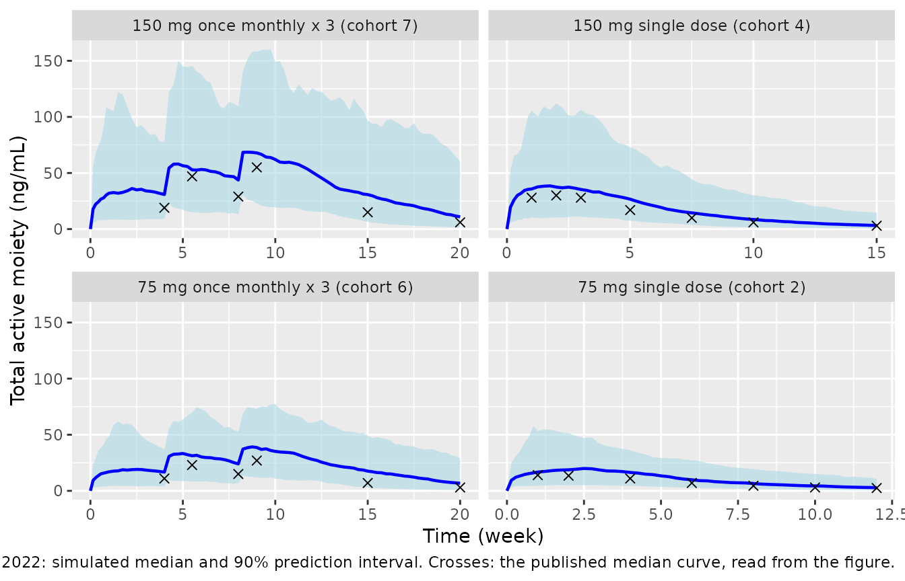
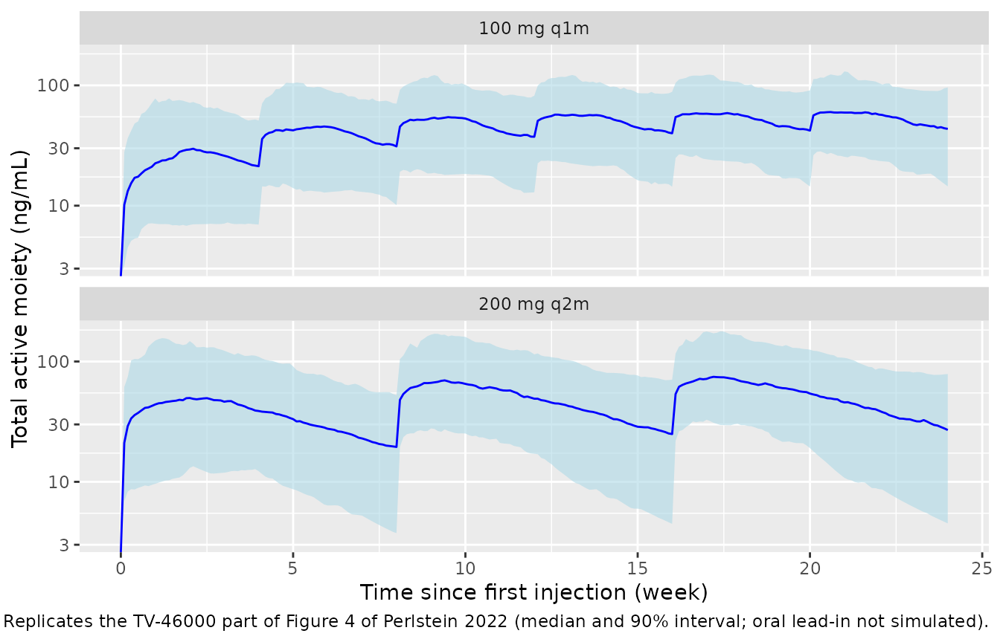
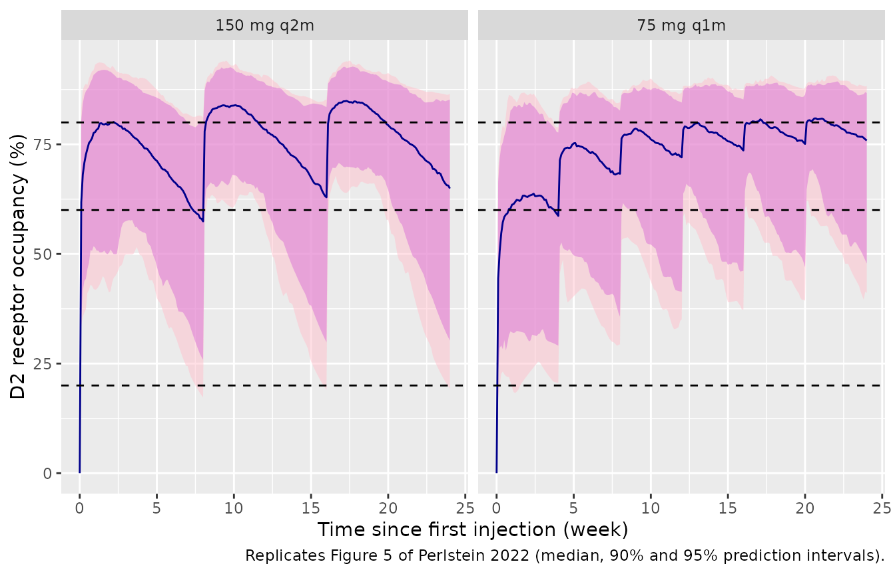

# Subcutaneous long-acting risperidone TV-46000 (Perlstein 2022)

## Model and source

``` r

mod <- readModelDb("Perlstein_2022_risperidone_tv46000")
ui <- rxode2::rxode(mod)
#> ℹ parameter labels from comments will be replaced by 'label()'
```

- Description: Two-compartment population PK model for the risperidone
  total active moiety (TAM = risperidone + 9-hydroxyrisperidone \*
  410/426) following subcutaneous TV-46000, a copolymer-based
  long-acting risperidone suspension, in 97 adults with schizophrenia or
  schizoaffective disorder from one phase 1 single- and multiple-dose
  study (Perlstein 2022). Absorption is the paper’s convolution-based
  prescribed input: a double Weibull release profile that splits the
  dose between a first release process (shape below 1, front-loaded) and
  a second, sigmoidal release process, implemented as two parallel depot
  compartments each emptying with its own Weibull hazard. Allometric
  body weight on CL/F (exponent 0.75) and V/F (exponent 1) fixed at the
  70 kg reference. Exponential inter-individual variability on every
  structural parameter and a combined additive + proportional residual
  error. Carries the published Emax dopamine D2 receptor occupancy layer
  (Kd 10.1 ng/mL) the authors used in their simulations as an algebraic
  observable. This is the phase 1 TAM model that selected the phase 3
  doses; the later pooled parent-metabolite TV-46000 model is
  modellib(‘Perlstein_2025_risperidone_tv46000’).
- Citation: Perlstein I, Merenlender Wagner A, Gomeni R, Lamson M,
  Harary E, Spiegelstein O, Kalmanczhelyi A, Tiver R, Loupe P, Levi M,
  Elgart A (2022). Population Pharmacokinetic Modeling and Simulation of
  TV-46000: A Long-Acting Injectable Formulation of Risperidone. Clin
  Pharmacol Drug Dev 11(7):865-877. <doi:10.1002/cpdd.1078>.
- Article: <https://doi.org/10.1002/cpdd.1078>
- Supplement: Figures S1-S5 (goodness of fit, all-cohort VPCs,
  individual fits, all simulated regimens) and the per-cohort sampling
  schedule. It contains no parameter values, so the model is fully
  specified by the main text.

TV-46000 is a once-monthly (q1m) or once-every-2-months (q2m)
subcutaneous risperidone suspension built on a copolymer delivery
technology: the copolymer precipitates on injection, entrapping
risperidone in a depot that degrades by hydrolysis. The analysis
modelled the **total active moiety** (TAM), the sum of risperidone and
its equipotent metabolite 9-hydroxyrisperidone corrected by molecular
weight (`TAM = risperidone + 9-OH-risperidone * 410/426`, Methods
Equation 1), and used the model to choose the phase 3 dose range (50-125
mg q1m, 100-250 mg q2m). The later pooled phase 1 + phase 3
parent-metabolite model of the same product is
`Perlstein_2025_risperidone_tv46000`.

## Population

97 of 99 enrolled patients with clinically stable schizophrenia or
schizoaffective disorder entered the analysis (two cohort-4 patients
were excluded for taking oral risperidone during the TV-46000 period).
Mean (SD) age was 44.4 (8.8) years, BMI 28.6 (4.4) kg/m^2, creatinine
clearance 115.76 (21.9) mL/min and weight 87 kg; 80% were men and 95.9%
Black or African American (Results, Data). Each cohort received 7 days
of oral risperidone 2-6 mg/day, a 7-day washout, then TV-46000:

| Cohort | TV-46000 regimen        | Site      |
|--------|-------------------------|-----------|
| 1      | 50 mg single dose       | abdomen   |
| 2      | 75 mg single dose       | abdomen   |
| 3      | 100 mg single dose      | abdomen   |
| 4      | 150 mg single dose      | abdomen   |
| 5      | 225 mg single dose      | abdomen   |
| 6      | 75 mg once monthly x 3  | abdomen   |
| 7      | 150 mg once monthly x 3 | abdomen   |
| 8      | 225 mg single dose      | upper arm |

## Source trace

| Element | Value in model | Source |
|----|----|----|
| Release function `r(t) = ff*exp(-(t/td)^ss) + (1-ff)*exp(-(t/td1)^ss1)` | two Weibull-hazard depots | Methods Eq. 3, Figure 2 |
| Input `Dose * (-dr/dt)` into central; 2-compartment disposition | `d/dt(depot)`, `d/dt(depot2)`, `d/dt(central)`, `d/dt(peripheral1)` | Methods Eqs. 2 and 4 |
| `td` = 2.69 week | `lra = log(1/2.69)` | Table 2 |
| `td1` = 3.32 week | `lra2 = log(1/3.32)` | Table 2 |
| `ss` = 0.616 | `lgam1 = log(0.616)` | Table 2 |
| `ss1` = 3.66 | `lgam2 = log(3.66)` | Table 2 |
| `ff` = 0.511 | `logitfrel = logit(0.511)` | Table 2 |
| CL/F = 354 L/week | `lcl = log(354)` | Table 2 |
| V/F = 374 L | `lvc = log(374)` | Table 2 |
| k23 = 1.48 1/week | `lk12 = log(1.48)` | Table 2 |
| k32 = 2.34 1/week | `lk21 = log(2.34)` | Table 2 |
| Allometry `(WT/70)^0.75` on CL, `(WT/70)^1` on V | `e_wt_cl = fixed(0.75)`, `e_wt_vc = fixed(1)` | Methods Eq. 5 |
| IIV variances td 0.163, td1 0.733, ss 0.0247, ss1 0.185, ff 0.115, CL/F 0.117, V/F 0.147, k23 1.41, k32 1.9 | `etalra` … `etalk21` | Table 2 Random effect |
| Proportional 0.152, additive 1.58 ng/mL | `propSd`, `addSd` | Table 2 Residual effect |
| D2RO = ROmax \* Cp / (Kd + Cp), ROmax 100%, Kd 10.1 ng/mL | `emax = fixed(100)`, `lec50 = fixed(log(10.1))` | Methods Eq. 7 |

## Release function

The Results text gives three points on the typical cumulative release
curve: about 50% released by 2.6 weeks, 79% by week 4 and 93% by week 8.
They test the direction of `r(t)` (unreleased, not released, fraction)
and the time unit. The two depots of the packaged model hold exactly the
unreleased dose, so their typical-value contents after a single
injection must reproduce Equation 3.

``` r

th <- ui$theta
ra <- exp(th[["lra"]]); ra2 <- exp(th[["lra2"]])
gam1 <- exp(th[["lgam1"]]); gam2 <- exp(th[["lgam2"]])
frel <- plogis(th[["logitfrel"]])

ev_rel <- et(amt = 100, cmt = "depot") |>
  et(amt = 100, cmt = "depot2") |>
  et(c(2.6, 4, 8))
rel <- rxSolve(rxode2::zeroRe(mod), ev_rel, params = c(WT = 70)) |>
  as.data.frame() |>
  mutate(
    released_model = 1 - (depot + depot2) / 100,
    released_eq3 = 1 - (frel * exp(-(ra * time)^gam1) + (1 - frel) * exp(-(ra2 * time)^gam2)),
    released_paper = c(0.50, 0.79, 0.93)
  )
#> ℹ parameter labels from comments will be replaced by 'label()'
#> ℹ omega/sigma items treated as zero: 'etalra', 'etalra2', 'etalgam1', 'etalgam2', 'etalogitfrel', 'etalcl', 'etalvc', 'etalk12', 'etalk21'
knitr::kable(
  rel |>
    select(time, released_model, released_eq3, released_paper) |>
    rename(
      "Time (week)" = time,
      "Released, model depots" = released_model,
      "Released, Equation 3" = released_eq3,
      "Released, Results text" = released_paper
    ),
  digits = 3
)
```

| Time (week) | Released, model depots | Released, Equation 3 | Released, Results text |
|---:|---:|---:|---:|
| 2.6 | 0.483 | 0.483 | 0.50 |
| 4.0 | 0.790 | 0.790 | 0.79 |
| 8.0 | 0.928 | 0.928 | 0.93 |

``` r

# Same parameters, closed form vs ODE: pure numerical error.
stopifnot(all(abs(rel$released_model - rel$released_eq3) < 1e-4))
# Against the rounded percentages printed in the Results.
stopifnot(all(abs(rel$released_model - rel$released_paper) < 0.02))
```

## Virtual cohort

The paper reports mean weight (87 kg) but not its spread. Weights are
drawn from a normal distribution with mean 87 kg and an assumed SD of 15
kg (consistent with the BMI SD of 4.4 kg/m^2), truncated to 55-140 kg.

``` r

n_per_arm <- 200
make_cohort <- function(n, seed) {
  set.seed(seed)
  wt <- rnorm(n * 3, 87, 15)
  wt <- wt[wt >= 55 & wt <= 140][seq_len(n)]
  data.frame(id = seq_len(n), WT = wt)
}

# One TV-46000 injection = one record on each depot with the same amount.
inject <- function(ids, times, amt) {
  expand.grid(id = ids, time = times, cmt = c("depot", "depot2"), stringsAsFactors = FALSE) |>
    mutate(amt = amt, evid = 1L)
}
observe <- function(ids, times) {
  expand.grid(id = ids, time = times) |>
    mutate(cmt = "central", amt = NA_real_, evid = 0L)
}
```

## Visual predictive checks (Figure 3)

``` r

arms <- tibble::tribble(
  ~panel, ~label, ~amt, ~n_dose, ~t_end,
  "A", "75 mg single dose (cohort 2)", 75, 1, 12,
  "B", "150 mg single dose (cohort 4)", 150, 1, 15,
  "C", "75 mg once monthly x 3 (cohort 6)", 75, 3, 20,
  "D", "150 mg once monthly x 3 (cohort 7)", 150, 3, 20
)
obs_grid <- sort(unique(c(seq(0, 1, by = 1 / 7), seq(1, 20, by = 0.25))))

rxode2::rxSetSeed(2022)
sim_vpc <- bind_rows(lapply(seq_len(nrow(arms)), function(i) {
  a <- arms[i, ]
  cohort <- make_cohort(n_per_arm, seed = 100 + i)
  ev <- bind_rows(
    inject(cohort$id, 4 * (seq_len(a$n_dose) - 1), a$amt),
    observe(cohort$id, obs_grid[obs_grid <= a$t_end])
  ) |>
    left_join(cohort, by = "id") |>
    arrange(id, time, desc(evid))
  rxSolve(mod, ev, returnType = "data.frame") |>
    mutate(panel = a$panel, label = a$label)
}))
#> ℹ parameter labels from comments will be replaced by 'label()'

vpc_summary <- sim_vpc |>
  group_by(panel, label, time) |>
  summarise(
    p05 = quantile(Cc, 0.05), p50 = median(Cc), p95 = quantile(Cc, 0.95),
    .groups = "drop"
  )

# Median curves read by the maintainers from Figure 3 (approximate, +/- 2 ng/mL).
fig3 <- tibble::tribble(
  ~panel, ~time, ~median_fig,
  "A", 1, 14, "A", 2, 13.5, "A", 4, 11, "A", 6, 7, "A", 8, 4.5, "A", 10, 3, "A", 12, 2.5,
  "B", 1, 28, "B", 2, 30, "B", 3, 28, "B", 5, 17, "B", 7.5, 10, "B", 10, 6, "B", 15, 3,
  "C", 4, 11, "C", 5.5, 23, "C", 8, 15, "C", 9, 27, "C", 15, 7, "C", 20, 3,
  "D", 4, 19, "D", 5.5, 47, "D", 8, 29, "D", 9, 55, "D", 15, 15, "D", 20, 6
) |>
  left_join(distinct(arms, panel, label), by = "panel")

ggplot(vpc_summary, aes(time)) +
  geom_ribbon(aes(ymin = p05, ymax = p95), fill = "lightblue", alpha = 0.6) +
  geom_line(aes(y = p50), colour = "blue", linewidth = 0.8) +
  geom_point(data = fig3, aes(y = median_fig), shape = 4, size = 2) +
  facet_wrap(~label, scales = "free_x") +
  labs(
    x = "Time (week)", y = "Total active moiety (ng/mL)",
    caption = paste(
      "Replicates Figure 3 of Perlstein 2022: simulated median and 90% prediction interval.",
      "Crosses: the published median curve, read from the figure."
    )
  )
```



The simulated medians sit above the published VPC medians at every time
point, and the gap widens after the peak:

``` r

vpc_ratio <- fig3 |>
  left_join(vpc_summary, by = c("panel", "label", "time")) |>
  mutate(ratio = p50 / median_fig)
knitr::kable(
  vpc_ratio |>
    select(label, time, median_fig, p50, ratio) |>
    rename(
      "Arm" = label, "Time (week)" = time,
      "Figure 3 median (ng/mL)" = median_fig,
      "Simulated median (ng/mL)" = p50,
      "Simulated / Figure 3" = ratio
    ),
  digits = 2
)
```

| Arm | Time (week) | Figure 3 median (ng/mL) | Simulated median (ng/mL) | Simulated / Figure 3 |
|:---|---:|---:|---:|---:|
| 75 mg single dose (cohort 2) | 1.0 | 14.0 | 16.74 | 1.20 |
| 75 mg single dose (cohort 2) | 2.0 | 13.5 | 18.75 | 1.39 |
| 75 mg single dose (cohort 2) | 4.0 | 11.0 | 16.40 | 1.49 |
| 75 mg single dose (cohort 2) | 6.0 | 7.0 | 9.87 | 1.41 |
| 75 mg single dose (cohort 2) | 8.0 | 4.5 | 6.54 | 1.45 |
| 75 mg single dose (cohort 2) | 10.0 | 3.0 | 4.41 | 1.47 |
| 75 mg single dose (cohort 2) | 12.0 | 2.5 | 2.83 | 1.13 |
| 150 mg single dose (cohort 4) | 1.0 | 28.0 | 35.78 | 1.28 |
| 150 mg single dose (cohort 4) | 2.0 | 30.0 | 37.46 | 1.25 |
| 150 mg single dose (cohort 4) | 3.0 | 28.0 | 35.33 | 1.26 |
| 150 mg single dose (cohort 4) | 5.0 | 17.0 | 26.67 | 1.57 |
| 150 mg single dose (cohort 4) | 7.5 | 10.0 | 14.48 | 1.45 |
| 150 mg single dose (cohort 4) | 10.0 | 6.0 | 8.60 | 1.43 |
| 150 mg single dose (cohort 4) | 15.0 | 3.0 | 3.24 | 1.08 |
| 75 mg once monthly x 3 (cohort 6) | 4.0 | 11.0 | 16.71 | 1.52 |
| 75 mg once monthly x 3 (cohort 6) | 5.5 | 23.0 | 31.26 | 1.36 |
| 75 mg once monthly x 3 (cohort 6) | 8.0 | 15.0 | 24.01 | 1.60 |
| 75 mg once monthly x 3 (cohort 6) | 9.0 | 27.0 | 38.62 | 1.43 |
| 75 mg once monthly x 3 (cohort 6) | 15.0 | 7.0 | 17.57 | 2.51 |
| 75 mg once monthly x 3 (cohort 6) | 20.0 | 3.0 | 6.77 | 2.26 |
| 150 mg once monthly x 3 (cohort 7) | 4.0 | 19.0 | 30.82 | 1.62 |
| 150 mg once monthly x 3 (cohort 7) | 5.5 | 47.0 | 52.83 | 1.12 |
| 150 mg once monthly x 3 (cohort 7) | 8.0 | 29.0 | 43.74 | 1.51 |
| 150 mg once monthly x 3 (cohort 7) | 9.0 | 55.0 | 67.90 | 1.23 |
| 150 mg once monthly x 3 (cohort 7) | 15.0 | 15.0 | 30.75 | 2.05 |
| 150 mg once monthly x 3 (cohort 7) | 20.0 | 6.0 | 10.95 | 1.82 |

See the Errata section: these ratios, together with Table 3 below,
indicate that the clearance printed in Table 2 is about 1.4-fold lower
than the clearance the authors’ own figures and simulations were
produced with.

## Steady-state exposure (Table 3)

Table 3 reports the median steady-state AUC over the dosing interval for
four q1m and four q2m regimens. Every regimen is simulated for 64 weeks
(16 q1m or 8 q2m injections) so that the last interval is close to
steady state even for patients with a slow peripheral return rate `k21`;
PKNCA computes AUC over that interval, converted from ng*week/mL to the
ng*h/mL of the table. All arms share the same virtual patients and the
same random effects, so differences between arms come from the regimen
alone.

``` r

ss_arms <- tibble::tribble(
  ~treatment, ~amt, ~tau,
  "50 mg q1m", 50, 4, "75 mg q1m", 75, 4, "100 mg q1m", 100, 4, "125 mg q1m", 125, 4,
  "100 mg q2m", 100, 8, "150 mg q2m", 150, 8, "200 mg q2m", 200, 8, "250 mg q2m", 250, 8
)
t_total <- 64
ss_arms$n_inj <- t_total / ss_arms$tau

ss_cohort <- make_cohort(n_per_arm, seed = 7)
ss_ev <- lapply(seq_len(nrow(ss_arms)), function(i) {
  a <- ss_arms[i, ]
  t_last <- a$tau * (a$n_inj - 1)
  grid <- sort(unique(c(0, seq(t_last, t_last + a$tau, by = 0.05))))
  bind_rows(
    inject(ss_cohort$id, a$tau * (seq_len(a$n_inj) - 1), a$amt),
    observe(ss_cohort$id, grid)
  ) |>
    left_join(ss_cohort, by = "id") |>
    arrange(id, time, desc(evid)) |>
    mutate(treatment = a$treatment)
})
sim_ss <- bind_rows(lapply(ss_ev, function(ev) {
  # Re-seeding before every arm gives each virtual patient the same etas in
  # every arm.
  rxode2::rxSetSeed(20221)
  rxSolve(mod, select(ev, -treatment), returnType = "data.frame") |>
    mutate(treatment = ev$treatment[1])
}))
```

``` r

conc_df <- sim_ss |>
  filter(!is.na(Cc)) |>
  select(id, time, Cc, treatment)
dose_df <- bind_rows(ss_ev) |>
  filter(evid == 1, cmt == "depot") |>
  select(id, time, amt, treatment)

intervals <- ss_arms |>
  transmute(
    treatment,
    start = t_total - tau, end = t_total,
    auclast = TRUE, cmax = TRUE, cmin = TRUE
  )

nca <- PKNCA::pk.nca(PKNCA::PKNCAdata(
  PKNCA::PKNCAconc(conc_df, Cc ~ time | treatment + id),
  PKNCA::PKNCAdose(dose_df, amt ~ time | treatment + id),
  intervals = intervals
))
nca_res <- as.data.frame(nca$result) |>
  mutate(PPORRES = ifelse(PPTESTCD == "auclast", PPORRES * 168, PPORRES))
```

``` r

published <- tibble::tribble(
  ~treatment, ~auclast,
  "50 mg q1m", 14076, "75 mg q1m", 21136, "100 mg q1m", 28607, "125 mg q1m", 34402,
  "100 mg q2m", 29419, "150 mg q2m", 44243, "200 mg q2m", 58508, "250 mg q2m", 73558
)

cmp <- nlmixr2lib::ncaComparisonTable(
  simulated = nca_res |> filter(PPTESTCD == "auclast"),
  reference = published,
  by = "treatment",
  units = c(auclast = "ng*h/mL"),
  tolerance_pct = 20
)
knitr::kable(
  cmp,
  caption = "Simulated vs. published steady-state AUC over the dosing interval (Perlstein 2022 Table 3). * differs from reference by >20%."
)
```

| NCA parameter      | treatment  | Reference | Simulated | % diff   |
|:-------------------|:-----------|:----------|:----------|:---------|
| AUClast (ng\*h/mL) | 50 mg q1m  | 14100     | 18300     | +30.2%\* |
| AUClast (ng\*h/mL) | 75 mg q1m  | 21100     | 27500     | +30.1%\* |
| AUClast (ng\*h/mL) | 100 mg q1m | 28600     | 36700     | +28.2%\* |
| AUClast (ng\*h/mL) | 125 mg q1m | 34400     | 45800     | +33.2%\* |
| AUClast (ng\*h/mL) | 100 mg q2m | 29400     | 37300     | +26.6%\* |
| AUClast (ng\*h/mL) | 150 mg q2m | 44200     | 55900     | +26.3%\* |
| AUClast (ng\*h/mL) | 200 mg q2m | 58500     | 74500     | +27.3%\* |
| AUClast (ng\*h/mL) | 250 mg q2m | 73600     | 93100     | +26.6%\* |

Simulated vs. published steady-state AUC over the dosing interval
(Perlstein 2022 Table 3). \* differs from reference by \>20%. {.table}

Every row is starred: the simulated steady-state AUC is 26-33% above the
published value. At steady state `AUCtau = Dose / CL` for any release
function with complete release, so this comparison isolates the
clearance and is unaffected by the release parameters and the
multiple-dose approximation. For a typical 87 kg patient, `Dose / CL`
for 100 mg q1m is 40,300 ng\*h/mL, 1.41 times the printed 28,607; the
simulated cohort median sits a little lower because patients who draw a
slow peripheral return rate are still filling the peripheral compartment
after 64 weeks. The parts of Table 3 that do not depend on the clearance
value are reproduced:

``` r

auc_med <- nca_res |>
  filter(PPTESTCD == "auclast") |>
  group_by(treatment) |>
  summarise(auc = median(PPORRES), .groups = "drop") |>
  left_join(ss_arms, by = "treatment") |>
  left_join(published |> rename(auc_pub = auclast), by = "treatment") |>
  mutate(
    daily_sim = auc / (7 * tau), daily_pub = auc_pub / (7 * tau),
    ratio = auc / auc_pub
  )

pair <- tibble::tibble(q1m = c("50 mg q1m", "75 mg q1m", "100 mg q1m", "125 mg q1m"),
                       q2m = c("100 mg q2m", "150 mg q2m", "200 mg q2m", "250 mg q2m"))
pair_chk <- pair |>
  mutate(
    sim = auc_med$daily_sim[match(q2m, auc_med$treatment)] / auc_med$daily_sim[match(q1m, auc_med$treatment)],
    pub = auc_med$daily_pub[match(q2m, auc_med$treatment)] / auc_med$daily_pub[match(q1m, auc_med$treatment)]
  )
knitr::kable(
  pair_chk |>
    rename(
      "q1m regimen" = q1m, "q2m regimen" = q2m,
      "Daily AUC ratio q2m/q1m, simulated" = sim,
      "Daily AUC ratio q2m/q1m, Table 3" = pub
    ),
  digits = 3
)
```

| q1m regimen | q2m regimen | Daily AUC ratio q2m/q1m, simulated | Daily AUC ratio q2m/q1m, Table 3 |
|:---|:---|---:|---:|
| 50 mg q1m | 100 mg q2m | 1.016 | 1.045 |
| 75 mg q1m | 150 mg q2m | 1.016 | 1.047 |
| 100 mg q1m | 200 mg q2m | 1.016 | 1.023 |
| 125 mg q1m | 250 mg q2m | 1.016 | 1.069 |

``` r


stopifnot(
  # Clearance-free: equal daily dose gives equal daily exposure, as Table 3 shows.
  all(abs(pair_chk$sim / pair_chk$pub - 1) < 0.08),
  # The documented Table 2 vs Table 3 clearance discrepancy (see Errata). If this
  # fails, the model's clearance has changed and the Errata must be revisited.
  median(auc_med$ratio) > 1.15, median(auc_med$ratio) < 1.6
)
```

## Simulated profiles and D2 receptor occupancy (Figures 4 and 5)

``` r

rxode2::rxSetSeed(20222)
d2_arms <- tibble::tribble(
  ~label, ~amt, ~tau, ~n_dose,
  "75 mg q1m", 75, 4, 6, "150 mg q2m", 150, 8, 3,
  "100 mg q1m", 100, 4, 6, "200 mg q2m", 200, 8, 3
)
d2_cohort <- make_cohort(n_per_arm, seed = 11)
sim_d2 <- bind_rows(lapply(seq_len(nrow(d2_arms)), function(i) {
  a <- d2_arms[i, ]
  ev <- bind_rows(
    inject(d2_cohort$id, a$tau * (seq_len(a$n_dose) - 1), a$amt),
    observe(d2_cohort$id, seq(0, 24, by = 0.1))
  ) |>
    left_join(d2_cohort, by = "id") |>
    arrange(id, time, desc(evid))
  rxSolve(mod, ev, returnType = "data.frame") |>
    mutate(label = a$label)
}))
d2_sum <- sim_d2 |>
  group_by(label, time) |>
  summarise(
    across(c(Cc, D2RO), list(
      p025 = ~ quantile(.x, 0.025), p05 = ~ quantile(.x, 0.05), p50 = median,
      p95 = ~ quantile(.x, 0.95), p975 = ~ quantile(.x, 0.975)
    )),
    .groups = "drop"
  )

ggplot(filter(d2_sum, label %in% c("100 mg q1m", "200 mg q2m")), aes(time)) +
  geom_ribbon(aes(ymin = Cc_p05, ymax = Cc_p95), fill = "lightblue", alpha = 0.6) +
  geom_line(aes(y = Cc_p50), colour = "blue") +
  scale_y_log10() +
  facet_wrap(~label, ncol = 1) +
  labs(
    x = "Time since first injection (week)", y = "Total active moiety (ng/mL)",
    caption = "Replicates the TV-46000 part of Figure 4 of Perlstein 2022 (median and 90% interval; oral lead-in not simulated)."
  )
#> Warning in scale_y_log10(): log-10 transformation introduced infinite values.
#> log-10 transformation introduced infinite values.
#> log-10 transformation introduced infinite values.
```



``` r


ggplot(filter(d2_sum, label %in% c("75 mg q1m", "150 mg q2m")), aes(time)) +
  geom_ribbon(aes(ymin = D2RO_p025, ymax = D2RO_p975), fill = "pink", alpha = 0.5) +
  geom_ribbon(aes(ymin = D2RO_p05, ymax = D2RO_p95), fill = "orchid", alpha = 0.5) +
  geom_line(aes(y = D2RO_p50), colour = "darkblue") +
  geom_hline(yintercept = c(20, 60, 80), linetype = "dashed") +
  facet_wrap(~label) +
  labs(
    x = "Time since first injection (week)", y = "D2 receptor occupancy (%)",
    caption = "Replicates Figure 5 of Perlstein 2022 (median, 90% and 95% prediction intervals)."
  )
```



## Multiple-dose approximation

The paper’s convolution input superposes every injection on its own
clock. The packaged model holds all injections in one pair of Weibull
depots, whose hazard restarts at each new injection, so drug still left
from an earlier injection is released on the new injection’s clock. The
size of that approximation is checked here against an exact reference
model with a separate depot pair for every injection, at typical values
for a 70 kg patient.

``` r

n_ref <- 8
depot_code <- vapply(seq_len(n_ref), function(k) {
  sprintf(paste(
    "h1_%1$d <- gam1 * ra * (ra * max(tad0(da_%1$d), 1e-6))^(gam1 - 1)",
    "h2_%1$d <- gam2 * ra2 * (ra2 * max(tad0(db_%1$d), 1e-6))^(gam2 - 1)",
    "d/dt(da_%1$d) <- -h1_%1$d * da_%1$d",
    "d/dt(db_%1$d) <- -h2_%1$d * db_%1$d",
    "f(da_%1$d) <- frel",
    "f(db_%1$d) <- 1 - frel",
    sep = "\n"
  ), k)
}, character(1))
input <- paste(sprintf("h1_%1$d * da_%1$d + h2_%1$d * db_%1$d", seq_len(n_ref)), collapse = " + ")
ref_mod <- rxode2::rxode2(paste(c(
  depot_code,
  sprintf("d/dt(central) <- %s - kel * central - k12 * central + k21 * peripheral1", input),
  "d/dt(peripheral1) <- k12 * central - k21 * peripheral1",
  "Cc <- 1000 * central / vc"
), collapse = "\n"))

typ <- c(
  ra = ra, ra2 = ra2, gam1 = gam1, gam2 = gam2, frel = frel,
  kel = exp(th[["lcl"]]) / exp(th[["lvc"]]), vc = exp(th[["lvc"]]),
  k12 = exp(th[["lk12"]]), k21 = exp(th[["lk21"]])
)

approx_chk <- bind_rows(lapply(c(4, 8), function(tau) {
  grid <- seq(0, n_ref * tau, by = 0.05)
  ev_ref <- et(grid)
  for (k in seq_len(n_ref)) {
    ev_ref <- ev_ref |>
      et(time = (k - 1) * tau, amt = 100, cmt = sprintf("da_%d", k)) |>
      et(time = (k - 1) * tau, amt = 100, cmt = sprintf("db_%d", k))
  }
  exact <- as.data.frame(rxSolve(ref_mod, typ, ev_ref))
  ev_pkg <- et(grid) |>
    et(amt = 100, cmt = "depot", ii = tau, addl = n_ref - 1) |>
    et(amt = 100, cmt = "depot2", ii = tau, addl = n_ref - 1)
  pkg <- as.data.frame(rxSolve(rxode2::zeroRe(mod), ev_pkg, params = c(WT = 70)))
  last <- exact$time >= (n_ref - 1) * tau
  tibble::tibble(
    regimen = sprintf("100 mg every %d weeks", tau),
    max_abs_pct_diff = max(abs(pkg$Cc[exact$time > 0] / exact$Cc[exact$time > 0] - 1)) * 100,
    cmax_ss_exact = max(exact$Cc[last]), cmax_ss_model = max(pkg$Cc[last]),
    cmin_ss_exact = min(exact$Cc[last]), cmin_ss_model = min(pkg$Cc[last])
  )
}))
#> ℹ parameter labels from comments will be replaced by 'label()'
#> ℹ omega/sigma items treated as zero: 'etalra', 'etalra2', 'etalgam1', 'etalgam2', 'etalogitfrel', 'etalcl', 'etalvc', 'etalk12', 'etalk21'
#> ℹ parameter labels from comments will be replaced by 'label()'
#> ℹ omega/sigma items treated as zero: 'etalra', 'etalra2', 'etalgam1', 'etalgam2', 'etalogitfrel', 'etalcl', 'etalvc', 'etalk12', 'etalk21'
knitr::kable(
  approx_chk |>
    rename(
      "Regimen" = regimen, "Max |difference| over time (%)" = max_abs_pct_diff,
      "Cmax,ss exact" = cmax_ss_exact, "Cmax,ss model" = cmax_ss_model,
      "Cmin,ss exact" = cmin_ss_exact, "Cmin,ss model" = cmin_ss_model
    ),
  digits = 2
)
```

| Regimen | Max \|difference\| over time (%) | Cmax,ss exact | Cmax,ss model | Cmin,ss exact | Cmin,ss model |
|:---|---:|---:|---:|---:|---:|
| 100 mg every 4 weeks | 8.14 | 82.56 | 84.8 | 64.15 | 63.31 |
| 100 mg every 8 weeks | 7.79 | 55.31 | 55.1 | 12.40 | 11.54 |

``` r

stopifnot(all(approx_chk$max_abs_pct_diff < 12))
```

Concentrations differ from exact superposition by less than about 8% at
any time, and steady-state AUC is identical because every injection is
still fully released. For a regimen where that matters, give each
injection its own depot pair as in the reference model above.

## Assumptions and deviations

- **Clearance in Table 2 vs the paper’s own figures and simulations
  (unresolved).** With CL/F = 354 L/week as printed, the simulated
  steady-state AUC is 26-33% above every Table 3 value (1.41-fold for a
  typical 87 kg patient), and the simulated Figure 3 medians sit 1.1-1.6
  times above the published single-dose medians and up to 2.5 times
  above the late multiple-dose ones. Neither discrepancy can come from
  the release function or the virtual weights: steady-state AUC is
  `Dose / CL` exactly, and reaching Table 3 by weight alone would need a
  typical patient of about 140 kg against a study mean of 87 kg. A
  clearance of about 1.4 x 354 = 496 L/week closes the typical-patient
  Table 3 gap and brings the single-dose Figure 3 medians into line
  (shown below), which points to a reporting error in the Table 2
  clearance, but the paper states no other value and has no erratum
  (checked 2026-10-03). The model therefore carries the printed 354
  L/week, and users who need the paper’s simulated exposures should be
  aware of the difference. The later pooled TV-46000 model
  (`Perlstein_2025_risperidone_tv46000`) implies a typical TAM clearance
  of about 4.2 L/h (about 710 L/week), which is also above 354 L/week.

``` r

rxode2::rxSetSeed(2022)
sens <- bind_rows(lapply(c(1, 2), function(i) {
  a <- arms[i, ]
  cohort <- make_cohort(n_per_arm, seed = 100 + i)
  ev <- bind_rows(
    inject(cohort$id, 0, a$amt),
    observe(cohort$id, unique(fig3$time[fig3$panel == a$panel]))
  ) |>
    left_join(cohort, by = "id") |>
    arrange(id, time, desc(evid))
  bind_rows(
    rxSolve(mod, ev, returnType = "data.frame") |> mutate(cl_case = "Table 2 CL/F (354 L/week)"),
    rxSolve(mod |> ini(lcl = log(354 * 1.4)), ev, returnType = "data.frame") |>
      mutate(cl_case = "Diagnostic only: 1.4 x CL/F")
  ) |>
    mutate(panel = a$panel)
})) |>
  group_by(cl_case, panel, time) |>
  summarise(p50 = median(Cc), .groups = "drop") |>
  inner_join(fig3, by = c("panel", "time")) |>
  group_by(cl_case) |>
  summarise(median_ratio_to_figure3 = median(p50 / median_fig), .groups = "drop")
#> ℹ parameter labels from comments will be replaced by 'label()'
#> ℹ change initial estimate of `lcl` to `6.20576914975499`
#> ℹ parameter labels from comments will be replaced by 'label()'
#> ℹ change initial estimate of `lcl` to `6.20576914975499`
knitr::kable(
  sens |>
    rename("Clearance" = cl_case, "Median of simulated / Figure 3 median (panels A, B)" = median_ratio_to_figure3),
  digits = 2
)
```

| Clearance | Median of simulated / Figure 3 median (panels A, B) |
|:---|---:|
| Diagnostic only: 1.4 x CL/F | 0.93 |
| Table 2 CL/F (354 L/week) | 1.43 |

- **`ff` on the logit scale.** The paper puts a log-normal random effect
  on the first-process fraction (variance 0.115). Applied to
  `ff = 0.511`, that gives `ff > 1` (and a negative second-process
  fraction) for about 2.4% of patients. The model holds `ff` on the
  logit scale and converts the variance by the delta method,
  `0.115 / (1 - 0.511)^2 = 0.481`, matching the typical value and the
  local spread while keeping both fractions in (0, 1). The Results
  text’s “ff = 0.55%” is a typo for Table 2’s 0.511.
- **IIV on CL/F and V/F, not kel.** The Methods list IIV on kel, but
  Table 2 reports IIV on CL/F and V/F; the model follows Table 2.
- **Omega and residual scales.** Table 2 random effects are taken as
  NONMEM OMEGA variances; its “SE,%” column is the SE multiplied by 100
  (for example 0.163 x 45.3% = 0.0738, printed 7.38). The proportional
  (0.152) and additive (1.58 ng/mL) residual errors are taken as
  standard deviations of a combined error model, since the table reports
  a single epsilon shrinkage for the pair.
- **Weight distribution.** Only the mean weight (87 kg) is reported; the
  virtual cohorts use an assumed SD of 15 kg.
- **Multiple doses.** One depot pair carries all injections; see the
  multiple-dose approximation section for its size.
- **Parameter names.** The paper’s `ss` / `ss1` (sigmoidicity) are
  `gam1` / `gam2` and its `td` / `td1` are expressed as rates
  `ra = 1/td`, `ra2 = 1/td1`. The name `ss` cannot be used in an rxode2
  model because it is the steady-state event flag. The paper’s
  peripheral rate constants `k23` / `k32` are `k12` / `k21`.
- **Covariates screened but not retained** (age, injection site, BMI,
  creatinine clearance, sex, race) are recorded in
  `covariatesDataExcluded`.
