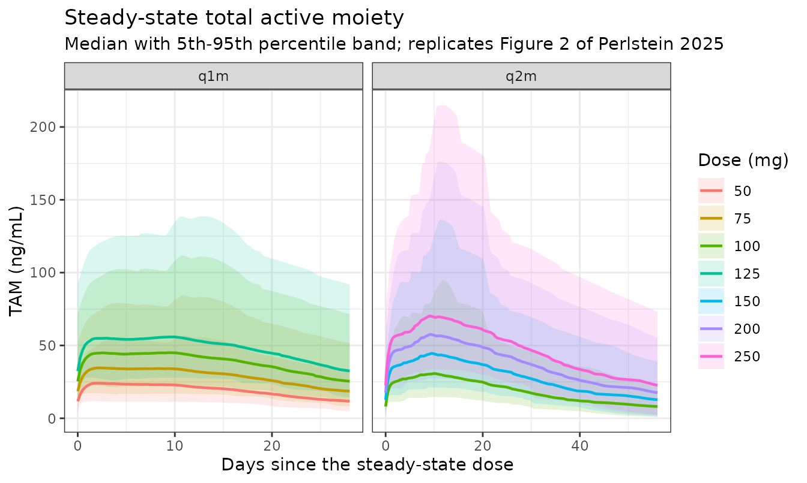
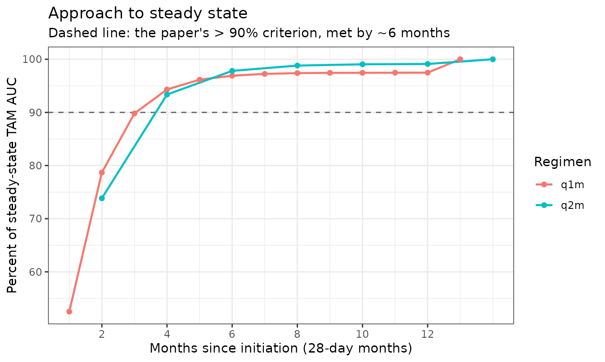
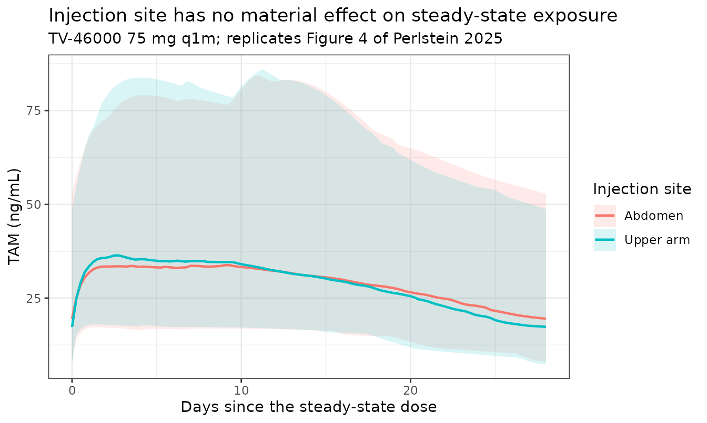
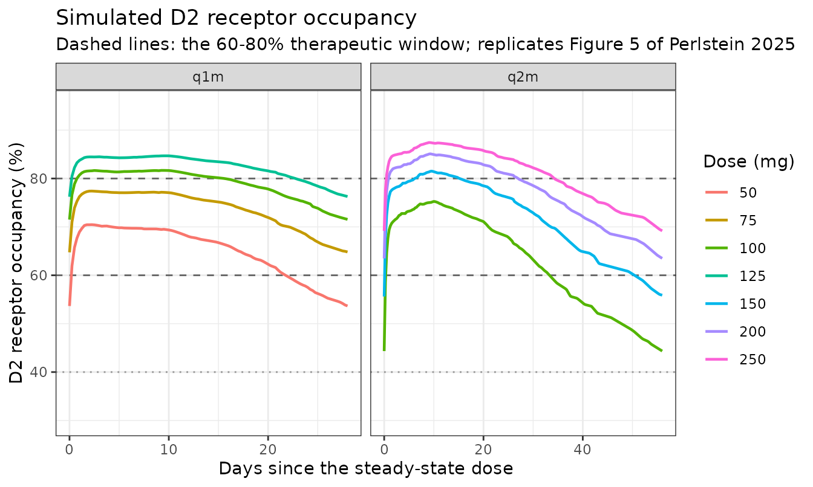

# TV-46000 long-acting subcutaneous risperidone (Perlstein 2025)

## Model and source

    #> ℹ parameter labels from comments will be replaced by 'label()'

- Citation: Perlstein I, Merenlender Wagner A, Elgart A, Zandvliet AS,
  Hellmann F, Lin Y, van Maanen E, Plock N, Fauchet F, Singh R (2025).
  Population pharmacokinetic modeling of TV-46000, a risperidone
  long-acting subcutaneous antipsychotic for the treatment of patients
  with schizophrenia. Neurol Ther 14(3):829-848.
  <doi:10.1007/s40120-025-00723-z>. Structural starting point from
  Ivaturi V, Gopalakrishnan M, Gobburu JVS, et al. (2017) Br J Clin
  Pharmacol 83(7):1476-1498; <doi:10.1111/bcp.13246>; see
  modellib(‘Ivaturi_2017_RBP_7000’).

- Description: Sequential parent-metabolite population PK model for
  TV-46000, a long-acting subcutaneous antipsychotic (LASCA) that
  combines risperidone with a copolymer-based delivery technology in a
  suspension given subcutaneously once monthly (q1m) or once every 2
  months (q2m), in 692 healthy volunteers and adults with schizophrenia
  or schizoaffective disorder pooled from three phase 1 and two phase 3
  studies (Perlstein 2025). The single subcutaneous depot empties by two
  parallel first-order release routes: a fast direct route with rate
  constant ka1 straight into the risperidone central compartment (the
  initial release from the subcutaneous depot, which brings the total
  active moiety above 10 ng/mL within 24 h), and a slow indirect route
  with rate constant ka2 into a five-compartment transit chain with rate
  constant ktr that delivers the remainder into central over the 28-day
  or 56-day dosing interval (the in situ depot). Risperidone is
  described by a one-compartment model with first-order elimination
  CL/F, and because the fraction metabolized FRMET is fixed to 1 the
  whole of that elimination flux forms the equipotent metabolite
  9-hydroxyrisperidone (paliperidone), which is itself described by a
  one-compartment model with first-order elimination CLMO. The two
  analytes are summed into the total active moiety in
  risperidone-equivalent units, TAM = \[risperidone\] +
  \[9-OH-risperidone\] \* 410/426, which is the definition the paper
  gives in its Introduction and the same molecular-weight correction the
  upstream Ivaturi 2017 model applies. Body mass index shifts the
  balance between the two release routes (lower BMI gives a faster
  direct route and a slower indirect route), a larger injection volume
  slows the direct route, and upper-arm rather than abdominal injection
  raises ka1 by 33 percent. Interindividual variability is exponential
  on ka1, ka2 (correlated with ka1), CL and CLMO, and the
  log-transformed-both-sides residual error is proportional on each
  analyte. The total active moiety TAM = risperidone +
  9-hydroxyrisperidone is the clinically reported quantity, and dopamine
  D2-receptor occupancy D2RO is derived from it with the literature Emax
  model the authors applied in their simulations (Emax 100 percent, kd
  10.1 ng/mL). The structural starting point was the RBP-7000
  dual-absorption model of Ivaturi 2017; see
  modellib(‘Ivaturi_2017_RBP_7000’).

- Article: <https://doi.org/10.1007/s40120-025-00723-z>

- Supplement (Table S1, Figures S1-S3):
  <https://doi.org/10.1007/s40120-025-00723-z>

TV-46000 is a long-acting subcutaneous antipsychotic (LASCA):
risperidone suspended in a copolymer-based delivery vehicle at roughly
360 mg/mL and injected subcutaneously into the abdomen or the back of
the upper arm once monthly (q1m) or once every 2 months (q2m). Perlstein
2025 pooled three phase 1 studies with the two phase 3 trials RISE and
SHINE and fitted a **sequential parent-metabolite** population PK model:
risperidone first, then 9-hydroxyrisperidone (paliperidone) driven by
the parent’s individual post-hoc predictions.

The clinically reported quantity is the **total active moiety** (TAM),
because risperidone and 9-hydroxyrisperidone are equipotent at the
dopamine D2 receptor. Perlstein 2025 defines it in the Introduction as
the “sum of concentrations of risperidone and its active metabolite
\[9-OH risperidone\] corrected by molecular weight”, i.e. in
risperidone-equivalent units.

Three risperidone models were already in the library when this one was
added, and the contrast is worth stating because it decides which one a
user should reach for:

- `modellib("Ivaturi_2017_RBP_7000")` – the **structural ancestor** of
  this model. Perlstein 2025 Methods: “The starting point of the current
  analysis was the model reported by Ivaturi et al., which described sc
  absorption by one depot dose and a double first-order absorption
  route.” Ivaturi 2017 is a different LAI product (RBP-7000 / Atrigel)
  and pairs its PK with a PANSS exposure-response model.
- `modellib("Wang_2024_risperidone_consta")` and
  `modellib("Wang_2024_risperidone_rykindo")` – intramuscular LAI
  formulations modelled on the active moiety directly, without splitting
  parent from metabolite.
- `modellib("Feng_2008_risperidone")`,
  `modellib("Sherwin_2012_risperidone")` – oral risperidone.

## Population

The analysis dataset comprised **692 participants** with at least one
measurable plasma concentration after a TV-46000 injection: 267 from
three phase 1 studies (50 healthy volunteers in RISPE1ZG15EU, 97 in
SAD-10055, 120 in BA-10148) and 425 from the two phase 3 trials (352 in
RISE, NCT03503318; 73 in SHINE, NCT03893825). Two further participants
were excluded for self-administration of risperidone and 41 because
every PK sample was below the limit of quantification (Perlstein 2025
Results “Dataset” and Table S1).

Baseline demographics (Perlstein 2025 Table 2, Total Overall column, n =
733 participants with baseline data) were: mean age 47.4 years (SD 10.9,
range 16-65), 70.4% male, 64.7% Black or African American / 31.9% White
/ 1.4% Asian, mean weight 86.3 kg (SD 16.3, range 42-132), mean BMI 28.7
kg/m^2 (SD 4.8, range 18-38) and mean creatinine clearance 121 mL/min
(SD 34.3). Across 3287 injections, 68.5% were abdominal and 31.5% into
the upper arm, and 77.8% were delivered from a vial versus 22.2% from a
prefilled syringe. The mean injection volume was 0.303 mL (SD 0.144).

Patients over 65 years were excluded from the source trials, and the
Discussion flags the male and Black/African American skew as the
analysis’s main generalizability limitation.

The same information is available programmatically:

``` r

str(readModelDb("Perlstein_2025_risperidone_tv46000")()$population, max.level = 1)
#> List of 14
#>  $ species       : chr "human"
#>  $ n_subjects    : int 692
#>  $ n_studies     : int 5
#>  $ n_observations: chr "Not reported as a record count. 692 participants contributed at least one measurable post-TV-46000 plasma conce"| __truncated__
#>  $ age_range     : chr "16-65 years; mean 47.4 (SD 10.9) years (Perlstein 2025 Table 2, Total Overall column). Patients older than 65 y"| __truncated__
#>  $ weight_range  : chr "42-132 kg; mean 86.3 (SD 16.3) kg (Perlstein 2025 Table 2)"
#>  $ bmi_range     : chr "18-38 kg/m^2; mean 28.7 (SD 4.8) kg/m^2 (Perlstein 2025 Table 2)"
#>  $ sex_female_pct: num 29.6
#>  $ race_ethnicity: Named num [1:4] 64.7 31.9 1.4 2
#>   ..- attr(*, "names")= chr [1:4] "Black" "White" "Asian" "Missing"
#>  $ renal_function: chr "Creatinine clearance mean 121 mL/min (SD 34.3); not reported for the healthy-volunteer study RISPE1ZG15EU (Perl"| __truncated__
#>  $ disease_state : chr "Adults with schizophrenia or schizoaffective disorder, plus 50 healthy volunteers (7.2% of the analysis populat"| __truncated__
#>  $ dose_range    : chr "TV-46000 subcutaneous. Phase 1: single doses 12.5-25 mg (RISPE1ZG15EU, subtherapeutic, healthy volunteers), sin"| __truncated__
#>  $ regions       : chr "Not reported by region; the phase 3 trials RISE (NCT03503318) and SHINE (NCT03893825) were multicenter"
#>  $ notes         : chr "Perlstein 2025 Table 2 tabulates demographics for the 733 participants with baseline data, while the popPK anal"| __truncated__
```

## Source trace

Every `ini()` entry in
`inst/modeldb/specificDrugs/Perlstein_2025_risperidone_tv46000.R`
carries an in-file comment naming its source location. They are
collected here for review.

| Equation / parameter | Value | Source location |
|----|----|----|
| Model structure (depot with parallel `ka1` / `ka2` exits, 5-compartment `ktr` transit chain, parent -\> metabolite) | n/a | Figure 1 (model schematic); Results, “Risperidone (Parent) PK Model” |
| Continuous covariate form `Pi = P * (COVi / COVmedian)^theta_i` | n/a | Methods, “Population PK Model Development” |
| Categorical covariate form `Pi = P * (1 + theta_i)^COVi` | n/a | Methods, “Population PK Model Development” |
| `lcl` (CL/F) | 14.3 L/h | Table 3, risperidone (parent) |
| `lvc` (V/F) | 66.3 L | Table 3, risperidone (parent) |
| `lka1` (KA1) | 0.000632 1/h | Table 3, risperidone (parent) |
| `lka2` (KA2) | 0.000408 1/h | Table 3, risperidone (parent) |
| `lktr` (KTR) | 0.0252 1/h | Table 3, risperidone (parent) |
| `e_bmi_ka1` (KA1BMI1) | -1.1 | Table 3 |
| `e_dose_ka1` (KA1INJV1) | -0.384 | Table 3 |
| `e_injsite_arm_ka1` (KA1ADMSITE1) | 0.331 | Table 3; Results (“33% higher KA1” in the upper arm) |
| `e_bmi_ka2` (KA2BMI1) | 1.7 | Table 3 |
| `lcl_9oh` (CLMO) | 5.78 L/h | Table 3, 9-OH risperidone (metabolite) |
| `lvc_9oh` (VMO) | 95.7 L | Table 3, 9-OH risperidone (metabolite) |
| FRMET fixed to 1 | 1 | Table 3 footnote |
| `etalka2` / `etalka1` block | 254.2% / 51.0% CV, correlation 42.8% | Table 3, random effects |
| `etalcl` | 82.3% CV | Table 3, random effects |
| `etalcl_9oh` | 65.1% CV | Table 3, random effects |
| `propSd` (parent EP) | 40.5% | Table 3, residual error; Methods (log-transformed both sides) |
| `propSd_9oh` (metabolite EP) | 38.3% | Table 3, residual error |
| `lemax` (D2RO Emax) | 100% | Methods, “Prediction of Individual Exposure Parameters…” |
| `kd` (D2RO) | 10.1 ng/mL | Methods, “Prediction of Individual Exposure Parameters…” |
| TAM = risperidone + molecular-weight-corrected 9-OH-risperidone | 410/426 | Introduction (definition of TAM); the two molecular weights are not printed – see Assumptions |
| Injection volumes 0.035 / 0.07 / 0.139 mL at 12.5 / 25 / 50 mg | n/a | Results, “Risperidone (Parent) PK Model”; 0.278 mL at 100 mg from Table 2 (BA-10148) |
| 28-day month for simulations | n/a | Methods, “Model-Based PK Simulations … for Different Dosing Regimens” |

### Reading the IIV percentages

Table 3 reports each interindividual variability as a bare percentage.
Two conventions are in circulation –
`%CV = 100 * sqrt(exp(omega^2) - 1)` and the approximation
`%CV = 100 * omega` – and they disagree badly for the very large KA2
term (`omega^2` = 2.010 versus 6.462). The table’s own confidence
intervals settle it. Propagating the printed `%RSE` as a relative
standard error **on `omega`** through the first (exact-lognormal)
transform reproduces the printed 95% CIs closely, while the second does
not:

| Parameter | Published %CV (95% CI) | omega^2 if lognormal | CI implied, lognormal | CI implied, omega=CV |
|:---|:---|:---|:---|:---|
| KA2 | 254.2 (198.8-320.1) | 2.010 | 200.7-322.0 | 229.6-281.5 |
| KA1 | 51.0 (44.0-57.5) | 0.231 | 44.7-58.2 | 45.3-57.4 |
| CL | 82.3 (75.3-89.3) | 0.517 | 75.8-89.4 | 77.1-87.8 |
| CLMO | 65.1 (58.9-71.1) | 0.353 | 59.3-71.4 | 60.2-70.4 |

The lognormal reading is used, so `omega^2 = log(1 + CV^2)` throughout.
It is also the convention the upstream `Ivaturi_2017_RBP_7000` model
uses.

## Structural check: steady-state mass balance

Before any population simulation, a typical-value (`zeroRe`) solve
confirms that the packaged ODE system conserves mass the way the
published parameterisation requires. Because the depot’s only exits are
the two absorption routes and FRMET is fixed to 1, every milligram
injected must eventually appear as parent elimination and then as
metabolite elimination. At steady state that forces two exact identities
over one dosing interval:

``` math
AUC_{ss,\text{risperidone}} = \frac{1000 \cdot D}{CL/F}
\qquad
AUC_{ss,\text{9-OH}} = \frac{1000 \cdot D}{CLMO}
```

``` r

mod  <- readModelDb("Perlstein_2025_risperidone_tv46000")
tmod <- rxode2::zeroRe(mod)
#> ℹ parameter labels from comments will be replaced by 'label()'

TAU_Q1M <- 28 * 24   # h; the paper assumes a 28-day month
TAU_Q2M <- 56 * 24   # h
MG_PER_ML <- 360     # TV-46000 suspension strength (see model file notes)

typicalProfile <- function(dose_mg, tau, n_dose, bmi = 28.7, arm = 0L,
                           step = 1, window_only = TRUE) {
  grid <- if (window_only) {
    seq((n_dose - 1) * tau, n_dose * tau, by = step)
  } else {
    seq(0, n_dose * tau, by = step)
  }
  ev <- bind_rows(
    data.frame(time = (seq_len(n_dose) - 1) * tau, amt = dose_mg,
               cmt = "depot", evid = 1L, dvid = NA_integer_),
    data.frame(time = grid, amt = NA_real_, cmt = NA_character_,
               evid = 0L, dvid = 1L)
  ) |>
    mutate(BMI = bmi, INJSITE_ARM = arm,
           DOSE_TV46000_ML = dose_mg / MG_PER_ML) |>
    arrange(time, desc(evid))
  rxode2::rxSolve(tmod, ev, omega = NA, useLinCmt = FALSE,
                  addDosing = FALSE, returnType = "data.frame")
}

trapz <- function(x, y) sum(diff(x) * (head(y, -1) + tail(y, -1)) / 2)

ss75 <- typicalProfile(75, TAU_Q1M, n_dose = 20)
auc_parent <- trapz(ss75$time, ss75$Cc)
auc_met    <- trapz(ss75$time, ss75$Cc_9oh)

massBalance <- data.frame(
  Analyte    = c("Risperidone", "9-OH-risperidone"),
  Simulated  = c(auc_parent, auc_met),
  Identity   = c(1000 * 75 / 14.3, 1000 * 75 / 5.78)
) |>
  mutate(`% diff` = 100 * (Simulated / Identity - 1))
knitr::kable(massBalance, digits = c(0, 1, 1, 4))
```

| Analyte          | Simulated | Identity |  % diff |
|:-----------------|----------:|---------:|--------:|
| Risperidone      |    5244.7 |   5244.8 | -0.0013 |
| 9-OH-risperidone |   12975.8 |  12975.8 |  0.0000 |

``` r


stopifnot(all(abs(massBalance$`% diff`) < 0.1))
```

Both identities hold to better than 0.1%, which pins the depot split,
the transit chain and the FRMET = 1 metabolite coupling simultaneously:
any error in the release structure would leak or duplicate mass and
break them.

## Virtual cohort

Original subject-level data are not public. Perlstein 2025 bootstrapped
“demographic covariates … from a random sample of 500 participants from
the TV-46000 phase 3 population” for its simulations; the cohort below
approximates that phase 3 population from Table 2. BMI is drawn from the
phase 3 mean and SD and truncated to the published range, and the
injection site is assigned per subject at the RISE arm frequency.

`DOSE_TV46000_ML` is derived from the milligram dose using the
suspension strength implied by the paper’s own printed volumes (12.5 mg
/ 0.035 mL, 25 mg / 0.07 mL, 50 mg / 0.139 mL, 100 mg / 0.278 mL – all
~360 mg/mL).

``` r

NSUB <- 100L
set.seed(20250323)

cohort <- data.frame(
  id          = seq_len(NSUB),
  BMI         = pmin(pmax(rnorm(NSUB, mean = 29.0, sd = 4.9), 18), 38),
  INJSITE_ARM = rbinom(NSUB, size = 1L, prob = 0.344)
)

summary(cohort$BMI)
#>    Min. 1st Qu.  Median    Mean 3rd Qu.    Max. 
#>   18.00   24.84   28.03   28.31   32.31   38.00
table(Arm = cohort$INJSITE_ARM)
#> Arm
#>  0  1 
#> 66 34
```

``` r

buildEvents <- function(dose_mg, tau, n_dose, grid, cov = cohort) {
  bind_rows(
    tidyr::crossing(id = cov$id, time = (seq_len(n_dose) - 1) * tau) |>
      mutate(amt = dose_mg, cmt = "depot", evid = 1L, dvid = NA_integer_),
    tidyr::crossing(id = cov$id, time = grid) |>
      mutate(amt = NA_real_, cmt = NA_character_, evid = 0L, dvid = 1L)
  ) |>
    left_join(cov, by = "id") |>
    mutate(DOSE_TV46000_ML = dose_mg / MG_PER_ML) |>
    arrange(id, time, desc(evid))
}

SIM_SEED <- 20250323L

simRegimen <- function(dose_mg, tau, n_dose, grid, cov = cohort) {
  # Common random numbers: reseeding before every solve makes each regimen and
  # each injection-site scenario draw the SAME etas, so a between-scenario
  # difference reflects the scenario rather than the sampling. Without this,
  # the injection-site comparison below is two independent eta draws and its
  # difference is pure Monte Carlo noise.
  set.seed(SIM_SEED)
  rxode2::rxSolve(mod, buildEvents(dose_mg, tau, n_dose, grid, cov),
                  useLinCmt = FALSE, addDosing = FALSE,
                  returnType = "data.frame")
}
```

Note the two rxode2 requirements this model imposes on every event
table. It declares **two** endpoints (`Cc` and `Cc_9oh`), so observation
rows must identify which endpoint they belong to – here by `dvid = 1L`
with `cmt = NA_character_`, while dose rows carry the real ODE state
`cmt = "depot"`. And `useLinCmt = FALSE` is passed to every solve,
because the automatic ODE-to-`linCmt()` conversion corrupts the endpoint
mapping.

## Simulated steady-state TAM profiles

Replicates Figure 2 of Perlstein 2025 (simulated TAM concentration-time
profiles for q1m and q2m dosing), shown here over the steady-state
dosing interval.

``` r

regimens <- bind_rows(
  data.frame(regimen = "q1m", dose = c(50, 75, 100, 125),
             tau = TAU_Q1M, n_dose = 13L),
  data.frame(regimen = "q2m", dose = c(100, 150, 200, 250),
             tau = TAU_Q2M, n_dose =  7L)
) |>
  mutate(treatment = paste0("TV-46000 ", dose, " mg ", regimen))

sims <- lapply(seq_len(nrow(regimens)), function(i) {
  r <- regimens[i, ]
  grid <- sort(unique(c(seq(0, r$tau, by = 6),
                        seq((r$n_dose - 1) * r$tau, r$n_dose * r$tau, by = 6))))
  simRegimen(r$dose, r$tau, r$n_dose, grid) |>
    mutate(regimen = r$regimen, dose = r$dose, treatment = r$treatment,
           tau = r$tau, n_dose = r$n_dose)
}) |> bind_rows()
#> ℹ parameter labels from comments will be replaced by 'label()'

ssBand <- sims |>
  filter(time >= (n_dose - 1) * tau) |>
  mutate(tad = time - (n_dose - 1) * tau, days = tad / 24) |>
  group_by(regimen, treatment, dose, days) |>
  summarise(p5 = quantile(TAM, 0.05), p50 = median(TAM),
            p95 = quantile(TAM, 0.95), .groups = "drop")

ggplot(ssBand, aes(days, p50, colour = factor(dose), fill = factor(dose))) +
  geom_ribbon(aes(ymin = p5, ymax = p95), alpha = 0.15, colour = NA) +
  geom_line(linewidth = 0.8) +
  facet_wrap(~regimen, scales = "free_x") +
  labs(x = "Days since the steady-state dose", y = "TAM (ng/mL)",
       colour = "Dose (mg)", fill = "Dose (mg)",
       title = "Steady-state total active moiety",
       subtitle = "Median with 5th-95th percentile band; replicates Figure 2 of Perlstein 2025") +
  theme_bw()
```



## Therapeutic concentrations within 24 hours of the first dose

Perlstein 2025 Abstract and Key Summary Points: “TV-46000 reaches
therapeutic plasma TAM concentrations (\>= 10 ng/mL) within 24 h
following first dose administration”. At 24 h the transit chain has
delivered essentially nothing, so this claim is carried entirely by the
**fast direct route** – it is a sharp, almost independent check on `ka1`
and its covariate reference values.

``` r

# At 24 h after the first injection the dosing interval is irrelevant -- only the
# dose strength (through the injection-volume covariate on ka1) matters -- so the
# comparison is made over the distinct strengths.
typical24 <- lapply(sort(unique(regimens$dose)), function(d) {
  s <- typicalProfile(d, TAU_Q1M, n_dose = 1, step = 1, window_only = FALSE)
  data.frame(dose = d, typical = s$TAM[which.min(abs(s$time - 24))])
}) |> bind_rows()

firstDose <- sims |>
  filter(time == 24) |>
  group_by(dose) |>
  summarise(popMedian = median(TAM), fracOver = mean(TAM >= 10),
            .groups = "drop") |>
  left_join(typical24, by = "dose")

firstDose |>
  transmute(`Dose (mg)` = dose,
            `Typical-participant TAM (ng/mL)` = typical,
            `Population median TAM (ng/mL)` = popMedian,
            `Fraction of cohort >= 10 ng/mL` = fracOver) |>
  knitr::kable(digits = 2)
```

| Dose (mg) | Typical-participant TAM (ng/mL) | Population median TAM (ng/mL) | Fraction of cohort \>= 10 ng/mL |
|---:|---:|---:|---:|
| 50 | 7.62 | 9.16 | 0.45 |
| 75 | 9.80 | 11.78 | 0.60 |
| 100 | 11.72 | 14.09 | 0.70 |
| 125 | 13.45 | 16.18 | 0.79 |
| 150 | 15.06 | 18.11 | 0.87 |
| 200 | 18.00 | 21.65 | 0.92 |
| 250 | 20.66 | 24.86 | 0.93 |

The model reproduces the claim at the mid-to-upper strengths and falls
modestly short at the lowest ones: the typical participant clears 10
ng/mL from 100 mg upward but reaches only about 7.6 and 9.8 ng/mL at 50
and 75 mg, where roughly half the simulated cohort is above the
threshold. The paper states the claim for the programme without a dose
qualifier, so this is a genuine dose-resolved refinement of it rather
than agreement. Two mitigating points, neither of which the packaged
model carries: phase 3 patients were stabilized on oral risperidone for
12 weeks before the first injection (Methods notes the residual
contribution is “marginal” by 24 h), and the published claim is a
population statement, which the median column satisfies from 75 mg
upward.

The population median runs above the typical participant because
interindividual variability on `ka1` is lognormal and the 24-h
concentration is close to linear in `ka1`, so the covariate-free typical
value is not the median of the cohort.

## PKNCA validation and comparison with Table 4

Perlstein 2025 Table 4 reports model-derived **median** steady-state TAM
exposures for all eight approved dosing regimens. That table is a
whole-model answer key: 32 numbers spanning both dosing intervals and
the full dose range, each of which depends jointly on the release
structure, the covariate model and the metabolite coupling.

NCA is computed with PKNCA over the steady-state dosing interval. The
concentration column is named `Cc` to match the package convention, but
it holds the **total active moiety**, which is the analyte Table 4
reports.

``` r

ncaConc <- sims |>
  filter(time >= (n_dose - 1) * tau) |>
  transmute(id, treatment, time, Cc = TAM) |>
  filter(!is.na(Cc))

ncaDose <- regimens |>
  tidyr::crossing(id = cohort$id) |>
  transmute(id, treatment, time = (n_dose - 1) * tau, amt = dose)

concObj <- PKNCA::PKNCAconc(ncaConc, Cc ~ time | treatment + id,
                            concu = "ng/mL", timeu = "h")
doseObj <- PKNCA::PKNCAdose(ncaDose, amt ~ time | treatment + id, doseu = "mg")

intervals <- regimens |>
  tidyr::crossing(id = cohort$id) |>
  transmute(treatment, id,
            start = (n_dose - 1) * tau, end = n_dose * tau,
            cmax = TRUE, tmax = TRUE, cmin = TRUE,
            auclast = TRUE, cav = TRUE) |>
  as.data.frame()

ncaRes <- PKNCA::pk.nca(PKNCA::PKNCAdata(concObj, doseObj, intervals = intervals))
```

`ctrough` is not used here: PKNCA can return it as all-`NA` for a
steady-state interval, and the paper’s `C_trough,ss` is by definition
the concentration at the end of the interval, which is read straight off
the solved profile instead.

``` r

ctroughSim <- sims |>
  filter(time == n_dose * tau) |>
  transmute(id, treatment, PPTESTCD = "ctrough", PPORRES = TAM)

simNca <- bind_rows(
  as.data.frame(ncaRes$result) |> select(treatment, id, PPTESTCD, PPORRES),
  ctroughSim
)

published <- regimens |>
  transmute(treatment,
            auclast = c(13306, 19951, 26521, 33141, 26829, 40152, 53321, 66634),
            cav     = c( 19.8,  29.7,  39.5,  49.3,  20.0,  29.9,  39.7,  49.6),
            cmax    = c( 25.1,  36.4,  47.5,  58.7,  32.6,  47.2,  61.4,  76.0),
            ctrough = c( 12.1,  19.5,  26.8,  34.1,   7.7,  12.8,  17.6,  22.8)) |>
  as.data.frame()

cmpTable <- nlmixr2lib::ncaComparisonTable(
  simNca, published, by = "treatment",
  params = c("auclast", "cmax", "cav", "ctrough"),
  units  = c(auclast = "ng*h/mL", cmax = "ng/mL",
             cav = "ng/mL", ctrough = "ng/mL")
)
knitr::kable(cmpTable, digits = 1)
```

| NCA parameter      | treatment           | Reference | Simulated | % diff |
|:-------------------|:--------------------|:----------|:----------|:-------|
| Cmax (ng/mL)       | TV-46000 50 mg q1m  | 25.1      | 24.9      | -0.7%  |
| Cmax (ng/mL)       | TV-46000 75 mg q1m  | 36.4      | 36.1      | -0.8%  |
| Cmax (ng/mL)       | TV-46000 100 mg q1m | 47.5      | 47.3      | -0.4%  |
| Cmax (ng/mL)       | TV-46000 125 mg q1m | 58.7      | 57.7      | -1.8%  |
| Cmax (ng/mL)       | TV-46000 100 mg q2m | 32.6      | 31.6      | -2.9%  |
| Cmax (ng/mL)       | TV-46000 150 mg q2m | 47.2      | 46.1      | -2.4%  |
| Cmax (ng/mL)       | TV-46000 200 mg q2m | 61.4      | 61        | -0.6%  |
| Cmax (ng/mL)       | TV-46000 250 mg q2m | 76        | 73.8      | -2.9%  |
| AUClast (ng\*h/mL) | TV-46000 50 mg q1m  | 13300     | 13300     | +0.2%  |
| AUClast (ng\*h/mL) | TV-46000 75 mg q1m  | 20000     | 20000     | +0.2%  |
| AUClast (ng\*h/mL) | TV-46000 100 mg q1m | 26500     | 26700     | +0.5%  |
| AUClast (ng\*h/mL) | TV-46000 125 mg q1m | 33100     | 33300     | +0.5%  |
| AUClast (ng\*h/mL) | TV-46000 100 mg q2m | 26800     | 26700     | -0.6%  |
| AUClast (ng\*h/mL) | TV-46000 150 mg q2m | 40200     | 40000     | -0.4%  |
| AUClast (ng\*h/mL) | TV-46000 200 mg q2m | 53300     | 53300     | -0.1%  |
| AUClast (ng\*h/mL) | TV-46000 250 mg q2m | 66600     | 66600     | -0.1%  |
| Cavg (ng/mL)       | TV-46000 50 mg q1m  | 19.8      | 19.8      | +0.2%  |
| Cavg (ng/mL)       | TV-46000 75 mg q1m  | 29.7      | 29.8      | +0.2%  |
| Cavg (ng/mL)       | TV-46000 100 mg q1m | 39.5      | 39.7      | +0.4%  |
| Cavg (ng/mL)       | TV-46000 125 mg q1m | 49.3      | 49.6      | +0.6%  |
| Cavg (ng/mL)       | TV-46000 100 mg q2m | 20        | 19.8      | -0.8%  |
| Cavg (ng/mL)       | TV-46000 150 mg q2m | 29.9      | 29.8      | -0.5%  |
| Cavg (ng/mL)       | TV-46000 200 mg q2m | 39.7      | 39.6      | -0.1%  |
| Cavg (ng/mL)       | TV-46000 250 mg q2m | 49.6      | 49.5      | -0.1%  |
| Ctrough (ng/mL)    | TV-46000 50 mg q1m  | 12.1      | 11.7      | -3.3%  |
| Ctrough (ng/mL)    | TV-46000 75 mg q1m  | 19.5      | 18.6      | -4.5%  |
| Ctrough (ng/mL)    | TV-46000 100 mg q1m | 26.8      | 25.4      | -5.2%  |
| Ctrough (ng/mL)    | TV-46000 125 mg q1m | 34.1      | 32.5      | -4.7%  |
| Ctrough (ng/mL)    | TV-46000 100 mg q2m | 7.7       | 8.05      | +4.5%  |
| Ctrough (ng/mL)    | TV-46000 150 mg q2m | 12.8      | 12.8      | -0.0%  |
| Ctrough (ng/mL)    | TV-46000 200 mg q2m | 17.6      | 17.6      | -0.2%  |
| Ctrough (ng/mL)    | TV-46000 250 mg q2m | 22.8      | 22.7      | -0.5%  |

Largest absolute difference across the 32 comparisons: 5.2%; median
absolute difference 0.5%.

Every one of the 32 comparisons falls inside the 20% flagging tolerance,
and the agreement is far tighter than that: the exposure metrics
`AUC_ss` and `C_avg,ss` reproduce within about 1% on all eight regimens,
and `C_max,ss` within about 3%.

The gradient across the four parameters is itself informative, because
it tracks how much of each one is fixed by mass balance rather than by
the release model. `AUC_ss` and `C_avg,ss` are pinned by `1000 * D / CL`
and `1000 * D / CLMO` (the identity checked above), so they test the
clearance estimates and little else – agreeing to 1% is expected once
those transcribe correctly. `C_max,ss` and especially `C_trough,ss`
depend on the *shape* of the release profile, which is where the two
covariate centring values this paper never published (see Assumptions)
and the exact BMI distribution of the virtual cohort actually bite. That
the shape-sensitive metrics still land within a few percent is the part
of this comparison that carries evidence about the release structure.

An earlier draft of this vignette drew independent random effects for
each regimen and each injection-site scenario; that alone produced
deviations up to 14% and an apparent 3% injection-site effect, both of
which were sampling noise. The common-random-numbers seeding in
`simRegimen()` above removes it.

## Dose proportionality and dosing-interval interchangeability

Perlstein 2025 Results: “At corresponding doses of TV-46000, TAM AUC_ss
following q2m dosing was twice that of the TAM AUC_ss following q1m
dosing, as TV-46000 showed linearity in PK. Therefore, the average daily
exposures with q1m and q2m were similar, supporting dosing interval
interchangeability.” The corresponding pairs are the q2m strength that
is double the q1m strength.

``` r

ssExposure <- as.data.frame(ncaRes$result) |>
  filter(PPTESTCD == "auclast") |>
  left_join(regimens, by = "treatment") |>
  group_by(regimen, dose, tau) |>
  summarise(auc = median(PPORRES), .groups = "drop") |>
  mutate(daily = auc / (tau / 24))

pairedDoses <- data.frame(q1m = c(50, 75, 100, 125), q2m = c(100, 150, 200, 250)) |>
  left_join(ssExposure |> filter(regimen == "q1m") |>
              select(q1m = dose, auc1 = auc, daily1 = daily), by = "q1m") |>
  left_join(ssExposure |> filter(regimen == "q2m") |>
              select(q2m = dose, auc2 = auc, daily2 = daily), by = "q2m") |>
  mutate(`AUCss ratio (q2m / q1m)` = auc2 / auc1,
         `Daily AUCss ratio` = daily2 / daily1)

pairedDoses |>
  transmute(`q1m dose (mg)` = q1m, `q2m dose (mg)` = q2m,
            `AUCss ratio (q2m / q1m)`, `Daily AUCss ratio`) |>
  knitr::kable(digits = 2)
```

| q1m dose (mg) | q2m dose (mg) | AUCss ratio (q2m / q1m) | Daily AUCss ratio |
|--------------:|--------------:|------------------------:|------------------:|
|            50 |           100 |                       2 |                 1 |
|            75 |           150 |                       2 |                 1 |
|           100 |           200 |                       2 |                 1 |
|           125 |           250 |                       2 |                 1 |

The AUC_ss ratio is close to 2 at every matched pair (median 2.00) while
the daily AUC_ss ratio is close to 1 (median 1.00), reproducing the
paper’s interchangeability claim.

## Time to steady state

Perlstein 2025 Results and Conclusion: steady state is “approached by
approximately 3 months after initiation (86% and 88% of steady-state TAM
exposure for q1m and q2m, respectively) and fully attained by
approximately 6 months (i.e., \> 90% of steady-state TAM exposure)”.
Each participant’s per-interval AUC is compared with their own
final-interval AUC.

``` r

attainment <- lapply(list(list("q1m", 75, TAU_Q1M, 13L),
                          list("q2m", 150, TAU_Q2M, 7L)), function(z) {
  tau <- z[[3]]; nd <- z[[4]]
  s <- simRegimen(z[[2]], tau, nd, grid = seq(0, nd * tau, by = 24))
  per <- s |>
    mutate(k = pmin(floor(time / tau) + 1L, nd)) |>
    group_by(id, k) |>
    arrange(time, .by_group = TRUE) |>
    summarise(auc = trapz(time, TAM), .groups = "drop")
  per |>
    left_join(per |> filter(k == nd) |> select(id, ssauc = auc), by = "id") |>
    group_by(k) |>
    summarise(pct = 100 * median(auc / ssauc), .groups = "drop") |>
    mutate(regimen = z[[1]], months = k * (tau / TAU_Q1M),
           dose = paste(z[[2]], "mg"))
}) |> bind_rows()

attainment |>
  filter(months %in% c(1, 2, 3, 4, 6, 8, 12)) |>
  transmute(Regimen = regimen, Dose = dose,
            `Months since initiation` = months,
            `Percent of steady-state AUC` = pct) |>
  knitr::kable(digits = 1,
               caption = "Median per-interval TAM AUC as a percent of the same participant's steady-state interval. The q2m intervals are 2 months long, so only even months exist for that regimen.")
```

| Regimen | Dose   | Months since initiation | Percent of steady-state AUC |
|:--------|:-------|------------------------:|----------------------------:|
| q1m     | 75 mg  |                       1 |                        52.5 |
| q1m     | 75 mg  |                       2 |                        78.7 |
| q1m     | 75 mg  |                       3 |                        89.8 |
| q1m     | 75 mg  |                       4 |                        94.3 |
| q1m     | 75 mg  |                       6 |                        96.9 |
| q1m     | 75 mg  |                       8 |                        97.4 |
| q1m     | 75 mg  |                      12 |                        97.5 |
| q2m     | 150 mg |                       2 |                        73.8 |
| q2m     | 150 mg |                       4 |                        93.4 |
| q2m     | 150 mg |                       6 |                        97.8 |
| q2m     | 150 mg |                       8 |                        98.8 |
| q2m     | 150 mg |                      12 |                        99.1 |

Median per-interval TAM AUC as a percent of the same participant’s
steady-state interval. The q2m intervals are 2 months long, so only even
months exist for that regimen. {.table}

At 6 months the simulated cohort has reached 97% (q1m) and 98% (q2m) of
steady-state TAM exposure, against the paper’s “\> 90%”.

The 6-month “\> 90%” criterion is reproduced for both regimens. The
3-month figures run a few points above the paper’s 86% / 88%; that
comparison is definition-sensitive (for q2m, three months falls in the
middle of a dosing interval rather than at an interval boundary), so it
is treated here as a directional rather than a numerical check.



## Injection site

Replicates Figure 4 of Perlstein 2025 (impact of injection site on TAM
exposure). Upper-arm injection raises `ka1` by 33%, but the paper’s
conclusion is that this does not translate into an exposure difference,
“indicating that the sites of injection can be interchangeable”.

``` r

siteSim <- lapply(c(0L, 1L), function(arm) {
  cov <- cohort |> mutate(INJSITE_ARM = arm)
  nd <- 13L
  grid <- seq((nd - 1) * TAU_Q1M, nd * TAU_Q1M, by = 6)
  simRegimen(75, TAU_Q1M, nd, grid, cov = cov) |>
    mutate(site = if (arm == 1L) "Upper arm" else "Abdomen")
}) |> bind_rows()

siteExposure <- siteSim |>
  group_by(site, id) |>
  arrange(time, .by_group = TRUE) |>
  summarise(auc = trapz(time, TAM), cmax = max(TAM),
            ctrough = TAM[which.max(time)], .groups = "drop") |>
  group_by(site) |>
  summarise(across(c(auc, cmax, ctrough), median), .groups = "drop")

siteExposure |>
  rename("Injection site" = site, "AUCss (ng*h/mL)" = auc,
         "Cmax,ss (ng/mL)" = cmax, "Ctrough,ss (ng/mL)" = ctrough) |>
  knitr::kable(digits = 1,
               caption = "Median steady-state TAM exposure, TV-46000 75 mg q1m")
```

| Injection site | AUCss (ng\*h/mL) | Cmax,ss (ng/mL) | Ctrough,ss (ng/mL) |
|:---------------|-----------------:|----------------:|-------------------:|
| Abdomen        |          20001.3 |            35.6 |               19.5 |
| Upper arm      |          20007.4 |            38.3 |               17.3 |

Median steady-state TAM exposure, TV-46000 75 mg q1m {.table}



Upper-arm versus abdominal steady-state AUC differs by +0.03% on the
same simulated participants, despite the 33% higher `ka1`. The reason is
structural rather than coincidental: at steady state every milligram
injected is eventually absorbed by one route or the other, so `AUCss` is
fixed at `1000 * D / CL` regardless of how the depot splits between
them. Shifting the split changes the *shape* of the profile, not its
area – which is exactly the paper’s interchangeability conclusion.

## Dopamine D2-receptor occupancy

Replicates Figure 5 of Perlstein 2025. The paper simulated D2RO from
each TAM profile with a literature Emax model (Emax = 100%, kd = 10.1
ng/mL) and reported that occupancy was “generally within the therapeutic
window of 60-80% during both dosing intervals”. `D2RO` is a derived
output of the packaged model, so no extra simulation is required.



| Regimen | Dose (mg) | Time in 60-80% (%) | Median D2RO min (%) | Median D2RO max (%) |
|:--------|----------:|-------------------:|--------------------:|--------------------:|
| q1m     |        50 |               77.0 |                53.7 |                70.5 |
| q1m     |        75 |              100.0 |                64.7 |                77.4 |
| q1m     |       100 |               46.9 |                71.5 |                81.7 |
| q1m     |       125 |               19.5 |                76.2 |                84.7 |
| q2m     |       100 |               58.7 |                44.3 |                75.3 |
| q2m     |       150 |               73.3 |                55.6 |                81.5 |
| q2m     |       200 |               53.8 |                63.5 |                85.1 |
| q2m     |       250 |               39.6 |                69.2 |                87.4 |

Fraction of the steady-state dosing interval with median D2RO inside the
60-80% window {.table style="width:100%;"}

Consistent with the paper’s Figure 5, the median occupancy sits inside
or close to the 60-80% band for most of each dosing interval, with the
lowest strengths running below the band late in the interval and the
highest strengths above it shortly after dosing.

## Assumptions and deviations

- **Covariate centring values are the published means, not the
  medians.** The paper’s continuous-covariate equation centres on
  `COV_median`, but Table 2 reports only means and SDs, and the medians
  appear nowhere in the article or its supplement. The model uses the
  Table 2 overall means – **BMI 28.7 kg/m^2** and **injection volume
  0.303 mL** – as centring values. Both are on-disk published numbers
  for the same population, and the resulting error is small: a 100 mg
  injection (0.278 mL) is mis-scaled by `(0.278/0.303)^-0.384 - 1` =
  +3.4% on `ka1`, and a BMI shift of 0.2 kg/m^2 moves `ka1` by under 1%.
  A user who knows the true medians can override the two constants in
  `model()`.
- **The molecular-weight correction in TAM is applied; the two weights
  are not published.** Perlstein 2025 defines its endpoint in the
  Introduction as “the total active moiety (TAM; sum of concentrations
  of risperidone and its active metabolite \[9-OH risperidone\]
  corrected by molecular weight)” but never prints the weights. The
  model uses `410 / 426`, the rounded values for risperidone (410.49
  g/mol) and 9-hydroxyrisperidone (426.49 g/mol) that are standard in
  the risperidone LAI literature and are already used by the upstream
  `Ivaturi_2017_RBP_7000` model for the same two molecules. The factor
  matters: because the metabolite carries roughly 71% of TAM, dropping
  it would raise every TAM reading by about 2.7%. Note that this
  correction applies **only to the TAM summation**, not to the
  parent-to-metabolite ODE flux – Table 3’s footnote states that `VMO`
  is `V/FRMET` with FRMET fixed to 1, so `CLMO` and `VMO` are apparent
  values fitted to the measured 9-OH-risperidone concentrations and
  already absorb any mass conversion inside the disposition model. This
  definition is in the Introduction, which the preprocessed
  `_trimmed.md` companion of the source PDF strips; it was recovered
  from the raw PDF.
- **Injection volume is derived from the milligram dose.**
  `DOSE_TV46000_ML` is computed as `dose_mg / 360`, using the suspension
  strength implied by the four dose/volume pairs the paper prints. A
  user with the actual administered volume should supply it directly.
- **IIV percentages read as lognormal %CV.** See the “Reading the IIV
  percentages” section: the choice is settled by which convention
  reproduces Table 3’s published confidence intervals, not by
  assumption.
- **`KA1BMI1` upper confidence bound.** Table 3 prints the KA1BMI1
  interval as “-1.1 (-1.460 to 0.745)”. The upper bound has lost its
  minus sign in typesetting: the point estimate is -1.1 with %RSE 16.6,
  giving -1.1 +/- 1.96 x 0.183 = (-1.458, -0.742), and the bootstrap row
  prints the same pattern. Only the point estimate enters the model, so
  nothing downstream depends on this, but the interval as printed is not
  usable.
- **Covariates screened but not retained are documented, not encoded.**
  Age and sex reached statistical significance on the parent and sex on
  the metabolite, but all were removed as not clinically relevant and
  **no point estimates are reported for them**, so they cannot be
  reconstructed. They are recorded in the model file’s
  `covariatesDataExcluded`. The reported “-1.7%” for sex on CLMO is a
  change in objective function, not a covariate coefficient.
- **Product presentation (vial versus prefilled syringe) is not
  carried.** It was screened as an extrinsic factor and had no effect on
  exposure. No canonical register column exists for a
  vial-versus-prefilled-syringe contrast (the nearest, `DEVICE_AI`,
  contrasts an autoinjector against a prefilled syringe), so registering
  one for a covariate with no estimated effect was not warranted; it is
  recorded in the model’s `population$notes` instead.
- **The oral risperidone comparator is not part of this model.**
  Perlstein 2025 simulated oral risperidone 1-16 mg/d from a separate
  published model (its reference 22) purely as a benchmark for Table 4
  and Figure 3. That model belongs to another paper and is not extracted
  here; the library’s oral risperidone entries are
  `Feng_2008_risperidone` and `Sherwin_2012_risperidone`.
- **D2RO parameters are literature constants, not fitted here.** `Emax`
  = 100% and `kd` = 10.1 ng/mL come from the paper’s references 22 and
  23 and are encoded with `fixed()`.
- **Virtual cohort distributions are approximations.** BMI is drawn from
  a normal distribution with the phase 3 mean and SD, truncated to the
  Table 2 range; injection site is assigned per subject at the RISE arm
  frequency (34.4%) rather than per injection. The published simulations
  bootstrapped 500 real phase 3 covariate vectors; this vignette uses
  100 synthetic subjects per arm to stay inside the package’s
  simulation-size budget, which is the main source of the residual
  scatter in the Table 4 comparison.
- **Steady state is evaluated at the 13th q1m interval and the 7th q2m
  interval** (approximately 12 and 13 months), well past the ~6 months
  the paper reports as full attainment.
