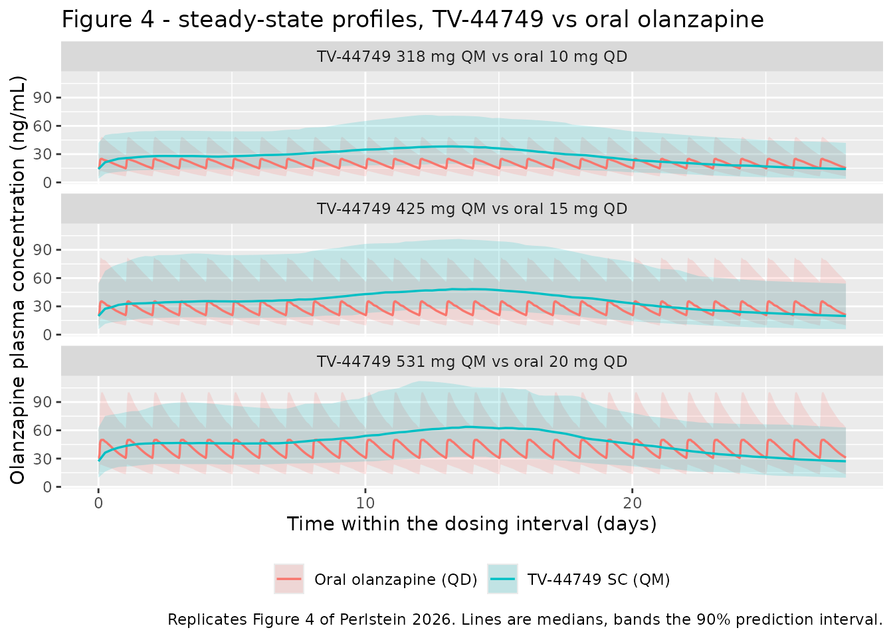
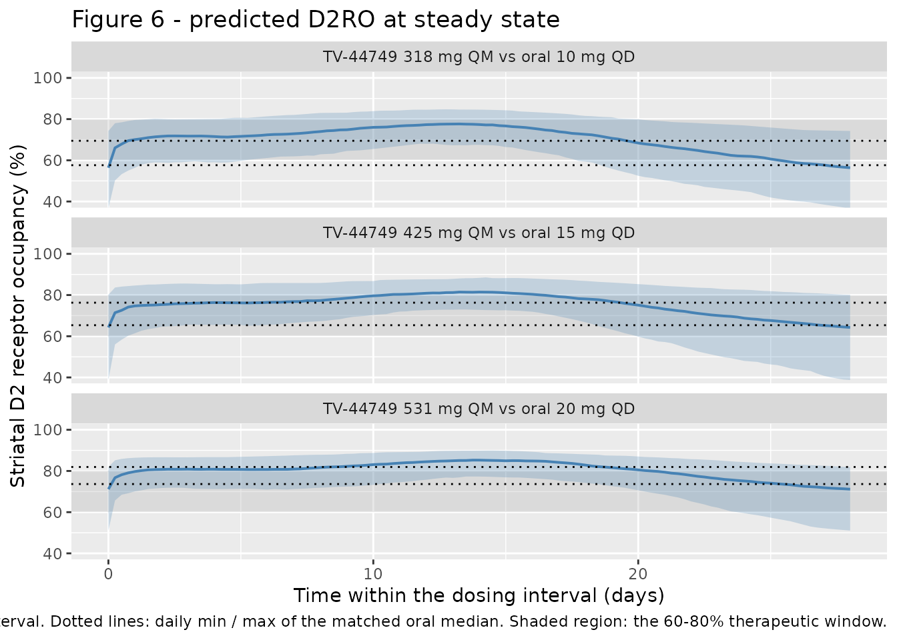
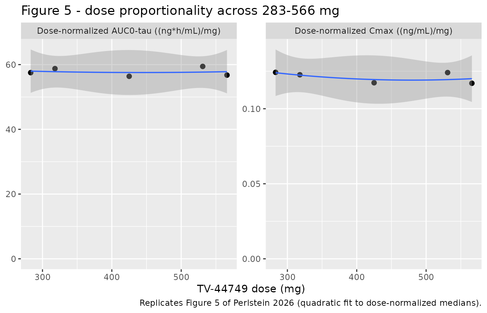

# Extended-release injectable olanzapine TV-44749 and oral olanzapine (Perlstein 2026)

## Models and source

This paper developed **two** population PK models from one Phase 1
study, fitted to two separate datasets, and both are packaged here:

``` r

mod_lai  <- readModelDb("Perlstein_2026_olanzapine_lai")
mod_oral <- readModelDb("Perlstein_2026_olanzapine_oral")
ui_lai   <- rxode2::rxode(mod_lai)
#> ℹ parameter labels from comments will be replaced by 'label()'
ui_oral  <- rxode2::rxode(mod_oral)
#> ℹ parameter labels from comments will be replaced by 'label()'
```

- `Perlstein_2026_olanzapine_lai` — Two-compartment population PK model
  for olanzapine following subcutaneous TV-44749, an extended-release
  copolymer-based long-acting injectable, in adults with schizophrenia
  or schizoaffective disorder and in healthy participants (Perlstein
  2026). Absorption is a convolution-based prescribed input function: a
  double Weibull release profile splitting the dose between a rapid
  first release process and a delayed sustained second release process,
  implemented as two parallel depot compartments each emptying with its
  own Weibull hazard. Allometric body weight on CL/F and V/F with
  estimated exponents, and a linear dose effect on the second-process
  release time. Carries the published Emax dopamine D2 receptor
  occupancy layer (Mamo 2008) as an algebraic observable.
- `Perlstein_2026_olanzapine_oral` — Two-compartment population PK model
  for oral olanzapine (ZYPREXA tablets) with first-order absorption and
  an absorption lag time, in healthy participants and adults with
  schizophrenia or schizoaffective disorder (Perlstein 2026). Companion
  oral comparator model to the TV-44749 subcutaneous long-acting
  injectable model Perlstein_2026_olanzapine_lai; the two were fitted to
  separate datasets in the same Phase 1 study. No covariates were
  retained. Carries the published Emax dopamine D2 receptor occupancy
  layer (Mamo 2008) as an algebraic observable.
- Citation: Perlstein I, Cherniakov I, Elgart A, Gomeni R, Gutman D,
  Merenlender Wagner A, Singh R. Population Pharmacokinetic Model-Based
  Dose Selection of Extended-Release Injectable Olanzapine (TV-44749)
  for Subcutaneous Use in Phase 3 Clinical Trial in Adults with
  Schizophrenia. The Journal of Clinical Pharmacology.
  2026;66(1):e70144. <doi:10.1002/jcph.70144>. D2 receptor occupancy
  layer from Mamo D, Kapur S, Keshavan M, et al. D2 receptor occupancy
  of olanzapine pamoate depot using positron emission tomography: an
  open-label study in patients with schizophrenia.
  Neuropsychopharmacology. 2008;33(2):298-304.
- Article: <https://doi.org/10.1002/jcph.70144>
- Supplement: the Supplementary Online Material PDF, whose
  **Supplemental Table 2** holds the complete oral olanzapine parameter
  set. The main text never cites Table S2 by number — it references only
  Table S1 (demographics) and Figure S2 (VPC) — so the oral model is
  easy to miss.

TV-44749 is an investigational once-monthly subcutaneous long-acting
injectable olanzapine built on a copolymer delivery technology: the
copolymer precipitates on injection, forming a depot that entraps
olanzapine and releases it over the monthly interval. The analysis
exists to pick Phase 3 doses that match approved oral olanzapine
exposure and land dopamine D2 receptor occupancy (D2RO) in the 60%-80%
therapeutic window.

## Population

89 participants contributed 3530 olanzapine plasma samples to the
TV-44749 model and 90 participants contributed 1196 samples to the oral
model, all from the single Phase 1 study TV-44749-SAD-10154. The cohort
was 18-60 years (healthy participants) and 18-65 years (patients);
cohort mean 45.6 years (SD 10.3), mean weight 85.8 kg (SD 15.7), mean
BMI 28.3 kg/m^2 (SD 4.7), 73% male, 79% Black or African American and
69% smokers (Results, Data; per-cohort detail in Supplemental Table 1).

Healthy participants received subtherapeutic single TV-44749 doses (70
or 105 mg); patients with schizophrenia or schizoaffective disorder
received single doses of 318, 425 or 531 mg or three consecutive monthly
doses of 283 or 566 mg. Every participant took daily oral olanzapine
before the injection period, which is what supports the oral model.

The same information is available programmatically via
`rxode2::rxode(readModelDb("Perlstein_2026_olanzapine_lai"))$population`.

## Source trace

Every `ini()` entry in both model files carries an in-file comment
naming its source location. Collected here for review.

### TV-44749 (`Perlstein_2026_olanzapine_lai`)

| Equation / parameter | Value | Source location |
|----|----|----|
| Release function `r(t) = FF*exp(-(t/TD)^SS) + (1-FF)*exp(-(t/TD1)^SS1)` | n/a | Methods p. 4, unnumbered display equation; Figure 2a |
| Disposition ODEs `dA1/dt`, `dA2/dt`, `Cp = A1/(V/F)` | n/a | Methods p. 4, unnumbered display equations |
| `lra` (paper `TD`) | 117 h, encoded `log(1/117)` | Table 1, Fixed effect |
| `lgam1` (paper `SS`) | 1.4 | Table 1, Fixed effect |
| `lra2` (paper `TD1_0`) | 323 h, encoded `log(1/323)` | Table 1, Fixed effect |
| `lgam2` (paper `SS1`) | 3.25 | Table 1, Fixed effect |
| `logitfrel` (paper `FF`) | 0.236 | Table 1, Fixed effect |
| `lcl` (`CL/F`) | 16.6 L/h | Table 1, Fixed effect |
| `lvc` (`V/F`) | 15.4 L | Table 1, Fixed effect |
| `lk12` | 1.61 1/h | Table 1, Fixed effect |
| `lk21` | 0.00313 1/h | Table 1, Fixed effect |
| `e_wt_cl` (`CL_P`) | 0.31 | Table 1, Fixed effect |
| `e_wt_vc` (`V_P`) | 0.364 | Table 1, Fixed effect |
| `e_dose_ra2` (`TD1_1`) | 0.0939 h/mg | Table 1, Fixed effect; footnote defines `TD1_0` / `TD1_1` |
| IIV on all nine structural parameters | 0.0038 - 0.445 | Table 1, Random effect |
| `addSd` / `propSd` | 0.632 / 0.233 | Table 1, Fixed effect (“Additive / Proportional RSE model”) |
| `emax` (`ROmax`) | 100% (fixed) | Methods, PK/D2RO Model (Mamo 2008) |
| `lec50` (`EC50`) | 11 ng/mL (fixed) | Methods, PK/D2RO Model (Mamo 2008) |

### Oral olanzapine (`Perlstein_2026_olanzapine_oral`)

| Equation / parameter | Value | Source location |
|----|----|----|
| Two-compartment, first-order absorption with lag | n/a | Methods p. 4 and Figure 2b |
| `lka` | 0.0292 1/h | Supplemental Table 2 |
| `lvc` | 9.61 L | Supplemental Table 2 |
| `lcl` | 22.6 L/h | Supplemental Table 2 |
| `lk12` / `lk21` | 0.254 / 0.015 1/h | Supplemental Table 2 |
| `ltlag` | 0.937 h | Supplemental Table 2 |
| IIV on ka, V/F, CL/F | 0.0444 / 0.897 / 0.227 | Supplemental Table 2, Random-effect |
| No IIV on k12, k21 | n/a | Supplemental Table 2 footnote (“The IIV of k12 and k21 were fixed to zero”) |
| `addSd` (fixed) / `propSd` | 0.0001 / 0.147 | Supplemental Table 2 (`*` marks the fixed additive term) |

## Virtual cohort

Original observed data are not public. The simulations below follow the
paper’s own Monte Carlo design (Methods, Simulations): individual
parameters are drawn from the estimated fixed- and random-effect
distributions, and body weight is resampled from the analysis-dataset
distribution, mean (SD) 85.84 (15.68) kg. The paper simulated 250
participants; 200 per arm is used here, the nlmixr2lib cap.

Eight arms are simulated: five TV-44749 once-monthly doses spanning the
paper’s stated dose-proportionality range (283-566 mg), and the three
oral daily doses they are meant to match.

``` r

rxode2::rxSetSeed(20260824)
set.seed(20260824)

N_PER_ARM <- 200L
TAU_LAI   <- 672    # once-monthly, h
TAU_ORAL  <- 24     # once-daily, h
ND_LAI    <- 35L    # injections simulated before the evaluated interval
ND_ORAL   <- 45L    # daily doses simulated before the evaluated interval

# One weight vector, reused across every arm, so the arms are paired
# (common random numbers) exactly as a matched dose-selection comparison needs.
wt_cohort <- pmax(45, rnorm(N_PER_ARM, mean = 85.84, sd = 15.68))

# TV-44749 is dosed onto TWO parallel depots -- the model splits the injected
# dose between the rapid and the sustained release process via f(depot) and
# f(depot2) -- so each injection needs one dose record per depot.
make_lai_arm <- function(dose_mg, id_offset) {
  ids  <- id_offset + seq_len(N_PER_ARM)
  dose_times <- seq(0, by = TAU_LAI, length.out = ND_LAI)
  dosing <- tidyr::crossing(id = ids, time = dose_times, cmt = c("depot", "depot2")) |>
    mutate(amt = dose_mg, evid = 1L)
  obs <- tidyr::crossing(
    id = ids,
    time = TAU_LAI * (ND_LAI - 1) + seq(0, TAU_LAI, by = 6)
  ) |>
    mutate(amt = NA_real_, evid = 0L, cmt = "central")
  bind_rows(dosing, obs) |>
    mutate(
      WT              = wt_cohort[id - id_offset],
      DOSE_TV44749_MG = dose_mg,
      dose_mg         = dose_mg,
      treatment       = sprintf("TV-44749 %d mg QM", dose_mg)
    ) |>
    arrange(id, time, evid)
}

make_oral_arm <- function(dose_mg, id_offset) {
  ids <- id_offset + seq_len(N_PER_ARM)
  dosing <- tidyr::crossing(id = ids, time = seq(0, by = TAU_ORAL, length.out = ND_ORAL)) |>
    mutate(amt = dose_mg, evid = 1L, cmt = "depot")
  obs <- tidyr::crossing(
    id = ids,
    time = TAU_ORAL * (ND_ORAL - 1) + seq(0, TAU_ORAL, by = 0.5)
  ) |>
    mutate(amt = NA_real_, evid = 0L, cmt = "central")
  bind_rows(dosing, obs) |>
    mutate(
      WT        = wt_cohort[id - id_offset],
      dose_mg   = dose_mg,
      treatment = sprintf("Oral olanzapine %d mg QD", dose_mg)
    ) |>
    arrange(id, time, evid)
}

lai_doses  <- c(283, 318, 425, 531, 566)
oral_doses <- c(10, 15, 20)

ev_lai <- bind_rows(lapply(seq_along(lai_doses), function(i)
  make_lai_arm(lai_doses[i], id_offset = (i - 1L) * N_PER_ARM)))
ev_oral <- bind_rows(lapply(seq_along(oral_doses), function(i)
  make_oral_arm(oral_doses[i], id_offset = 10000L + (i - 1L) * N_PER_ARM)))

# Disjoint IDs across arms are mandatory: rxSolve treats id as the subject key
# and would silently merge colliding ids into one over-dosed subject. Note the
# frame is NOT wrapped in unique() -- that would strip the very duplicate rows
# the assertion tests for, leaving a check that can never go red.
stopifnot(
  !anyDuplicated(ev_lai[, c("id", "time", "evid", "cmt")]),
  !anyDuplicated(ev_oral[, c("id", "time", "evid", "cmt")]),
  length(intersect(ev_lai$id, ev_oral$id)) == 0L
)
```

Both regimens are simulated well past steady state. The TV-44749 model
carries a deep peripheral compartment (`k21` = 0.00313 1/h, with 74%
CV), so a minority of simulated subjects approach steady state only
slowly — the slowest eta draws have terminal half-lives of several
months. Thirty-five monthly injections brings the 5th percentile of the
mass-balance check below to within 1% of its asymptotic value of 1 (see
the steady-state identity below).

## Simulation

``` r

sim_lai <- rxode2::rxSolve(
  mod_lai, events = ev_lai, keep = c("treatment", "dose_mg", "WT")
) |> as.data.frame()
#> ℹ parameter labels from comments will be replaced by 'label()'

sim_oral <- rxode2::rxSolve(
  mod_oral, events = ev_oral, keep = c("treatment", "dose_mg", "WT")
) |> as.data.frame()
#> ℹ parameter labels from comments will be replaced by 'label()'

stopifnot(!anyNA(sim_lai$Cc), !anyNA(sim_oral$Cc),
          all(sim_lai$Cc >= 0), all(sim_oral$Cc >= 0))

# Time relative to the start of the evaluated (final) dosing interval.
sim_lai$trel  <- sim_lai$time  - TAU_LAI  * (ND_LAI  - 1)
sim_oral$trel <- sim_oral$time - TAU_ORAL * (ND_ORAL - 1)
```

## Replicate published figures

### Figure 4 — steady-state concentration-time profiles

Figure 4 of Perlstein 2026 overlays the median steady-state olanzapine
profile after subcutaneous TV-44749 against the sawtooth profile of
daily oral olanzapine, with 90% prediction intervals. Reproduced here
for the three selected dose pairs. The oral arms are tiled across the
28-day window so both formulations share one time axis.

``` r

sel_pairs <- tibble::tribble(
  ~lai_dose, ~oral_dose, ~pair,
  318L, 10L, "TV-44749 318 mg QM vs oral 10 mg QD",
  425L, 15L, "TV-44749 425 mg QM vs oral 15 mg QD",
  531L, 20L, "TV-44749 531 mg QM vs oral 20 mg QD"
)

quant_by <- function(d, group_cols) {
  d |>
    group_by(across(all_of(group_cols))) |>
    summarise(
      Q05 = quantile(Cc, 0.05), Q50 = median(Cc), Q95 = quantile(Cc, 0.95),
      .groups = "drop"
    )
}

lai_band <- sim_lai |>
  filter(dose_mg %in% sel_pairs$lai_dose) |>
  quant_by(c("dose_mg", "trel")) |>
  left_join(sel_pairs, by = c("dose_mg" = "lai_dose")) |>
  mutate(formulation = "TV-44749 SC (QM)")

# Tile the 24 h oral profile across the 28-day TV-44749 window.
oral_band <- sim_oral |>
  quant_by(c("dose_mg", "trel")) |>
  left_join(sel_pairs, by = c("dose_mg" = "oral_dose")) |>
  tidyr::crossing(day = 0:27) |>
  mutate(trel = trel + day * 24, formulation = "Oral olanzapine (QD)") |>
  filter(trel <= TAU_LAI)

bind_rows(lai_band, oral_band) |>
  ggplot(aes(trel / 24, Q50, colour = formulation, fill = formulation)) +
  geom_ribbon(aes(ymin = Q05, ymax = Q95), alpha = 0.18, colour = NA) +
  geom_line(linewidth = 0.6) +
  facet_wrap(~pair, ncol = 1) +
  labs(
    x = "Time within the dosing interval (days)",
    y = "Olanzapine plasma concentration (ng/mL)",
    colour = NULL, fill = NULL,
    title = "Figure 4 - steady-state profiles, TV-44749 vs oral olanzapine",
    caption = "Replicates Figure 4 of Perlstein 2026. Lines are medians, bands the 90% prediction interval."
  ) +
  theme(legend.position = "bottom")
```



### Figure 6 — dopamine D2 receptor occupancy

Figure 6 plots the median model-predicted striatal D2RO for each
TV-44749 dose against the daily minimum-maximum band of the matched oral
dose, with the 60%-80% therapeutic window marked. Both packaged models
carry the published Emax layer `D2RO = ROmax * Cp / (EC50 + Cp)` with
`ROmax` fixed at 100% and `EC50` fixed at 11 ng/mL, so `D2RO` comes
straight out of the solve.

``` r

d2ro_lai <- sim_lai |>
  filter(dose_mg %in% sel_pairs$lai_dose) |>
  group_by(dose_mg, trel) |>
  summarise(Q10 = quantile(D2RO, 0.10), Q50 = median(D2RO),
            Q90 = quantile(D2RO, 0.90), .groups = "drop") |>
  left_join(sel_pairs, by = c("dose_mg" = "lai_dose"))

# The oral reference in Figure 6 is the median profile's daily min and max.
oral_ref <- sim_oral |>
  group_by(dose_mg, trel) |>
  summarise(Q50 = median(D2RO), .groups = "drop") |>
  group_by(dose_mg) |>
  summarise(oral_lo = min(Q50), oral_hi = max(Q50), .groups = "drop") |>
  left_join(sel_pairs, by = c("dose_mg" = "oral_dose"))

ggplot(d2ro_lai, aes(trel / 24)) +
  annotate("rect", xmin = -Inf, xmax = Inf, ymin = 60, ymax = 80,
           fill = "grey70", alpha = 0.30) +
  geom_ribbon(aes(ymin = Q10, ymax = Q90), alpha = 0.25, fill = "steelblue") +
  geom_line(aes(y = Q50), colour = "steelblue", linewidth = 0.7) +
  geom_hline(data = oral_ref, aes(yintercept = oral_lo), linetype = "dotted") +
  geom_hline(data = oral_ref, aes(yintercept = oral_hi), linetype = "dotted") +
  facet_wrap(~pair, ncol = 1) +
  coord_cartesian(ylim = c(40, 100)) +
  labs(
    x = "Time within the dosing interval (days)",
    y = "Striatal D2 receptor occupancy (%)",
    title = "Figure 6 - predicted D2RO at steady state",
    caption = paste(
      "Replicates Figure 6 of Perlstein 2026. Blue line: median TV-44749 D2RO;",
      "band: 80% prediction interval. Dotted lines: daily min / max of the matched",
      "oral median. Shaded region: the 60-80% therapeutic window."
    )
  )
```



### Figure 5 — dose proportionality

Perlstein 2026 fits dose-normalized AUC and Cmax against dose with a
quadratic function over 283-566 mg and concludes the exposure is dose
proportional.

``` r

per_subject_lai <- sim_lai |>
  group_by(treatment, dose_mg, id) |>
  arrange(time, .by_group = TRUE) |>
  summarise(
    cmin = min(Cc), cmax = max(Cc),
    auc  = sum(diff(time) * (head(Cc, -1) + tail(Cc, -1)) / 2),
    cl   = first(cl),
    .groups = "drop"
  ) |>
  mutate(cav = auc / TAU_LAI)

dose_prop <- per_subject_lai |>
  group_by(dose_mg) |>
  summarise(auc_norm = median(auc / dose_mg), cmax_norm = median(cmax / dose_mg),
            .groups = "drop") |>
  pivot_longer(c(auc_norm, cmax_norm), names_to = "metric", values_to = "value") |>
  mutate(metric = recode(metric,
                         auc_norm  = "Dose-normalized AUC0-tau ((ng*h/mL)/mg)",
                         cmax_norm = "Dose-normalized Cmax ((ng/mL)/mg)"))

ggplot(dose_prop, aes(dose_mg, value)) +
  geom_point(size = 2) +
  geom_smooth(method = "lm", formula = y ~ poly(x, 2), se = TRUE, linewidth = 0.6) +
  facet_wrap(~metric, scales = "free_y") +
  expand_limits(y = 0) +
  labs(x = "TV-44749 dose (mg)", y = NULL,
       title = "Figure 5 - dose proportionality across 283-566 mg",
       caption = "Replicates Figure 5 of Perlstein 2026 (quadratic fit to dose-normalized medians).")
```



Note that only the **Cmax** leg of this figure is an informative test.
Because the model gives the injected dose a total bioavailability of 1
(`frel` plus `1 - frel`), `AUC0-tau` at steady state equals `Dose/CL`
identically, so dose-normalized AUC is flat by construction rather than
by fit. Dose-normalized Cmax is not: the dose effect on the
second-process release time (`e_dose_ra2`) slows release as the dose
rises, and it is that term the flat Cmax line actually tests.

## PKNCA validation

Non-compartmental analysis over the final dosing interval of each arm,
which is the steady-state interval the paper’s Table 2 reports.

``` r

# PKNCA reserves the column names `dose` and `route`; the dose level therefore
# travels as `dose_mg`.
nca_one <- function(sim, ev, tau) {
  conc_df <- sim |>
    filter(!is.na(Cc)) |>
    select(id, time, Cc, treatment, dose_mg)

  dose_df <- ev |>
    filter(evid == 1, cmt == "depot") |>
    group_by(id, treatment, dose_mg) |>
    summarise(time = max(time), amt = first(amt), .groups = "drop") |>
    select(id, time, amt, treatment, dose_mg)

  conc_obj <- PKNCA::PKNCAconc(conc_df, Cc ~ time | treatment + id)
  dose_obj <- PKNCA::PKNCAdose(dose_df, amt ~ time | treatment + id)

  start_ss <- max(dose_df$time)
  intervals <- data.frame(
    start = start_ss, end = start_ss + tau,
    cmax = TRUE, tmax = TRUE, cmin = TRUE, cav = TRUE, auclast = TRUE
  )
  PKNCA::pk.nca(PKNCA::PKNCAdata(conc_obj, dose_obj, intervals = intervals))
}

nca_lai  <- nca_one(sim_lai,  ev_lai,  TAU_LAI)
nca_oral <- nca_one(sim_oral, ev_oral, TAU_ORAL)

nca_all <- bind_rows(as.data.frame(nca_lai$result), as.data.frame(nca_oral$result))
```

### Comparison against published NCA

Table 2 of Perlstein 2026 reports median (5th-95th percentile)
steady-state Cmin, Cavg and Cmax for the three selected TV-44749 doses
and the three oral doses they were selected to match. That is an 18-cell
answer key for the whole extraction — structure, both allometric
exponents, the reference weight, the dose effect on the release time,
the double-Weibull implementation and the mg-to-ng/mL conversion are all
tested at once.

``` r

published <- tibble::tribble(
  ~treatment,                 ~cmin,  ~cav,  ~cmax,
  "TV-44749 318 mg QM",       14.26, 26.46, 38.84,
  "TV-44749 425 mg QM",       20.89, 35.85, 50.04,
  "TV-44749 531 mg QM",       25.73, 45.53, 60.56,
  "Oral olanzapine 10 mg QD", 13.37, 18.23, 23.33,
  "Oral olanzapine 15 mg QD", 20.23, 27.48, 35.26,
  "Oral olanzapine 20 mg QD", 28.48, 37.98, 48.66
)

cmp <- nlmixr2lib::ncaComparisonTable(
  simulated = nca_all |> filter(treatment %in% published$treatment),
  reference = published,
  by        = "treatment",
  units     = c(cmin = "ng/mL", cav = "ng/mL", cmax = "ng/mL"),
  tolerance_pct = 20
)

knitr::kable(
  cmp,
  caption = "Simulated vs. published steady-state exposure (Perlstein 2026 Table 2). * differs from reference by >20%.",
  digits  = 2
)
```

| NCA parameter | treatment                | Reference | Simulated | % diff |
|:--------------|:-------------------------|:----------|:----------|:-------|
| Cmax (ng/mL)  | TV-44749 318 mg QM       | 38.8      | 39        | +0.4%  |
| Cmax (ng/mL)  | TV-44749 425 mg QM       | 50        | 49.9      | -0.4%  |
| Cmax (ng/mL)  | TV-44749 531 mg QM       | 60.6      | 65.9      | +8.8%  |
| Cmax (ng/mL)  | Oral olanzapine 10 mg QD | 23.3      | 25.4      | +9.0%  |
| Cmax (ng/mL)  | Oral olanzapine 15 mg QD | 35.3      | 35.9      | +1.9%  |
| Cmax (ng/mL)  | Oral olanzapine 20 mg QD | 48.7      | 51.2      | +5.2%  |
| Cmin (ng/mL)  | TV-44749 318 mg QM       | 14.3      | 14.2      | -0.3%  |
| Cmin (ng/mL)  | TV-44749 425 mg QM       | 20.9      | 19.8      | -5.3%  |
| Cmin (ng/mL)  | TV-44749 531 mg QM       | 25.7      | 27.1      | +5.5%  |
| Cmin (ng/mL)  | Oral olanzapine 10 mg QD | 13.4      | 15        | +11.9% |
| Cmin (ng/mL)  | Oral olanzapine 15 mg QD | 20.2      | 20.8      | +2.6%  |
| Cmin (ng/mL)  | Oral olanzapine 20 mg QD | 28.5      | 30.7      | +7.9%  |
| Cavg (ng/mL)  | TV-44749 318 mg QM       | 26.5      | 27.8      | +5.1%  |
| Cavg (ng/mL)  | TV-44749 425 mg QM       | 35.8      | 35.7      | -0.5%  |
| Cavg (ng/mL)  | TV-44749 531 mg QM       | 45.5      | 47        | +3.2%  |
| Cavg (ng/mL)  | Oral olanzapine 10 mg QD | 18.2      | 20.5      | +12.2% |
| Cavg (ng/mL)  | Oral olanzapine 15 mg QD | 27.5      | 27.9      | +1.4%  |
| Cavg (ng/mL)  | Oral olanzapine 20 mg QD | 38        | 40.8      | +7.5%  |

Simulated vs. published steady-state exposure (Perlstein 2026 Table 2).
\* differs from reference by \>20%. {.table}

``` r

pct <- cmp[[grep("diff", names(cmp), ignore.case = TRUE)[1]]]
pct <- abs(as.numeric(gsub("[^0-9.eE+-]", "", as.character(pct))))
pct <- pct[is.finite(pct)]
stopifnot(
  length(pct) == 18L,                 # the check must actually have had rows
  # Structural: a mis-transcribed clearance, exponent, reference weight or unit
  # moves whole rows by tens of percent.
  max(pct) < 15,
  # Centre: the typical cell agrees closely.
  median(pct) < 8
)
```

All 18 cells reproduce within 12.2% (median 5.2%), with deviations in
both directions and no systematic bias. The simulated values are medians
of a 200-subject Monte Carlo cohort compared against the paper’s
250-subject Monte Carlo medians, so a few percent of disagreement is
expected from the resampling alone.

## Structural checks

### Steady-state mass balance

At true steady state `AUC0-tau` equals `Dose/CL` exactly for every
subject, whatever the absorption kinetics, because total bioavailability
is 1. This is a per-subject identity rather than a group comparison, so
it is a strict test of the release implementation, the dose split across
the two depots, and the mg-to-ng/mL scaling.

``` r

per_subject_oral <- sim_oral |>
  group_by(treatment, dose_mg, id) |>
  arrange(time, .by_group = TRUE) |>
  summarise(cmin = min(Cc), cmax = max(Cc),
            auc = sum(diff(time) * (head(Cc, -1) + tail(Cc, -1)) / 2),
            cl = first(cl), .groups = "drop") |>
  mutate(cav = auc / TAU_ORAL)

mb <- bind_rows(per_subject_lai, per_subject_oral) |>
  mutate(ratio = auc / (1000 * dose_mg / cl))

mb_summary <- mb |>
  group_by(treatment) |>
  summarise(median = median(ratio), q05 = quantile(ratio, 0.05),
            min = min(ratio), .groups = "drop")

knitr::kable(mb_summary, digits = 4,
             caption = "AUC0-tau,ss divided by Dose/CL. The identity value is 1.")
```

| treatment                | median |    q05 |    min |
|:-------------------------|-------:|-------:|-------:|
| Oral olanzapine 10 mg QD | 0.9998 | 0.9996 | 0.9936 |
| Oral olanzapine 15 mg QD | 0.9998 | 0.9996 | 0.9988 |
| Oral olanzapine 20 mg QD | 0.9998 | 0.9996 | 0.9972 |
| TV-44749 283 mg QM       | 0.9997 | 0.9985 | 0.9968 |
| TV-44749 318 mg QM       | 0.9996 | 0.9966 | 0.8551 |
| TV-44749 425 mg QM       | 0.9996 | 0.9982 | 0.8985 |
| TV-44749 531 mg QM       | 0.9997 | 0.9981 | 0.9219 |
| TV-44749 566 mg QM       | 0.9997 | 0.9986 | 0.9921 |

AUC0-tau,ss divided by Dose/CL. The identity value is 1. {.table}

``` r


stopifnot(
  nrow(mb_summary) == 8L,
  # Centre: the identity holds to well under a percent for the typical subject.
  all(abs(mb_summary$median - 1) < 0.005),
  # Robust envelope. Asserted on a quantile rather than the minimum because the
  # deep peripheral compartment (k21 = 0.00313 1/h with 74% CV) leaves a small
  # tail of simulated subjects still accumulating after 35 monthly injections;
  # that is a property of the published IIV, not of the implementation.
  all(mb_summary$q05 > 0.98)
)
```

### Release completeness within the dosing interval

The model floors time-after-dose and lets `tad()` restart at the next
injection, which is exact only if release is essentially complete before
that injection arrives. Evaluating the published release function
directly confirms it is, across the whole simulated dose range.

``` r

unreleased <- vapply(lai_doses, function(d) {
  ra   <- 1 / 117
  ra2  <- 1 / (323 + 0.0939 * d)
  0.236 * exp(-(ra * TAU_LAI)^1.4) + 0.764 * exp(-(ra2 * TAU_LAI)^3.25)
}, numeric(1))
names(unreleased) <- paste(lai_doses, "mg")
signif(unreleased, 3)
#>   283 mg   318 mg   425 mg   531 mg   566 mg 
#> 0.000180 0.000231 0.000466 0.000868 0.001050

stopifnot(length(unreleased) == 5L, all(unreleased < 0.002))
```

### Dose selection: TV-44749 against the matched oral dose

The paper’s dose-selection logic is explicit (Results, Simulations):
Cmin is the anchor and must be maintained near or above the matched oral
dose, while Cavg and Cmax are permitted to run higher because the routes
differ. The simulation reproduces exactly that pattern.

``` r

med_exp <- bind_rows(per_subject_lai, per_subject_oral) |>
  group_by(treatment) |>
  summarise(cmin = median(cmin), cav = median(cav), cmax = median(cmax), .groups = "drop")

# The published counterpart of each ratio, straight out of Table 2, so the
# comparison is self-calibrating: a ratio of medians across two 200-subject
# cohorts is far too noisy to hold against a hand-picked band, but it can be
# held against the same ratio computed from the paper's own numbers.
pub_cmin <- setNames(published$cmin, published$treatment)

ratios <- sel_pairs |>
  mutate(
    lai_trt  = sprintf("TV-44749 %d mg QM", lai_dose),
    oral_trt = sprintf("Oral olanzapine %d mg QD", oral_dose)
  ) |>
  rowwise() |>
  mutate(
    cmin_ratio = med_exp$cmin[med_exp$treatment == lai_trt] / med_exp$cmin[med_exp$treatment == oral_trt],
    cav_ratio  = med_exp$cav[med_exp$treatment == lai_trt]  / med_exp$cav[med_exp$treatment == oral_trt],
    cmax_ratio = med_exp$cmax[med_exp$treatment == lai_trt] / med_exp$cmax[med_exp$treatment == oral_trt],
    cmin_ratio_pub = pub_cmin[[lai_trt]] / pub_cmin[[oral_trt]]
  ) |>
  ungroup() |>
  select(pair, cmin_ratio, cmin_ratio_pub, cav_ratio, cmax_ratio)

ratios |>
  rename("Dose pair" = pair, "Cmin ratio (simulated)" = cmin_ratio,
         "Cmin ratio (Table 2)" = cmin_ratio_pub,
         "Cavg ratio" = cav_ratio, "Cmax ratio" = cmax_ratio) |>
  knitr::kable(digits = 2,
               caption = "Median steady-state exposure of TV-44749 divided by that of the matched oral dose.")
```

| Dose pair | Cmin ratio (simulated) | Cmin ratio (Table 2) | Cavg ratio | Cmax ratio |
|:---|---:|---:|---:|---:|
| TV-44749 318 mg QM vs oral 10 mg QD | 0.95 | 1.07 | 1.36 | 1.53 |
| TV-44749 425 mg QM vs oral 15 mg QD | 0.95 | 1.03 | 1.28 | 1.39 |
| TV-44749 531 mg QM vs oral 20 mg QD | 0.88 | 0.90 | 1.15 | 1.29 |

Median steady-state exposure of TV-44749 divided by that of the matched
oral dose. {.table style="width:100%;"}

``` r


stopifnot(
  nrow(ratios) == 3L,
  # Cmin is the paper's dose-selection anchor: the simulated LAI-to-oral ratio
  # agrees with the same ratio formed from Table 2.
  all(abs(ratios$cmin_ratio - ratios$cmin_ratio_pub) < 0.15),
  # Cavg and Cmax run higher for the injectable, as the paper states, and the
  # same is true of the published numbers.
  all(ratios$cav_ratio  > 1),
  all(ratios$cmax_ratio > 1)
)
```

### D2 receptor occupancy window

``` r

d2ro_summary <- sim_lai |>
  filter(dose_mg %in% sel_pairs$lai_dose) |>
  group_by(dose_mg, trel) |>
  summarise(med = median(D2RO), .groups = "drop") |>
  group_by(dose_mg) |>
  summarise(
    min_med       = min(med),
    max_med       = max(med),
    mean_med      = mean(med),
    frac_above_60 = mean(med >= 60),
    days_above_80 = sum(med > 80) * 6 / 24,   # 6 h observation grid
    .groups = "drop"
  )

knitr::kable(d2ro_summary, digits = 2,
             caption = "D2RO of the median TV-44749 profile over the dosing interval.")
```

| dose_mg | min_med | max_med | mean_med | frac_above_60 | days_above_80 |
|--------:|--------:|--------:|---------:|--------------:|--------------:|
|     318 |   56.38 |   77.65 |    70.17 |          0.89 |          0.00 |
|     425 |   64.27 |   81.45 |    75.32 |          1.00 |          6.00 |
|     531 |   71.16 |   85.26 |    80.27 |          1.00 |         19.25 |

D2RO of the median TV-44749 profile over the dosing interval. {.table}

``` r


stopifnot(
  nrow(d2ro_summary) == 3L,
  # Efficacy floor: the median profile holds >= 60% occupancy for essentially
  # the whole interval at every selected dose.
  all(d2ro_summary$frac_above_60 > 0.75),
  # Interval-average occupancy sits in / at the top of the therapeutic window.
  all(d2ro_summary$mean_med >= 60), all(d2ro_summary$mean_med <= 85),
  all(d2ro_summary$mean_med[d2ro_summary$dose_mg %in% c(318, 425)] <= 80),
  # Time above 80% is monotone in dose, and the lowest selected dose never
  # crosses the ceiling. Asserted as an ordering rather than against a
  # published day count, because the paper's only quantitative statement on
  # this (7 days at 531 mg) is contradicted by its own Table 2 -- see Errata.
  d2ro_summary$days_above_80[d2ro_summary$dose_mg == 318] == 0,
  all(diff(d2ro_summary$days_above_80[order(d2ro_summary$dose_mg)]) > 0)
)
```

The occupancy pattern matches the paper’s qualitative narrative: all
three selected doses hold at or above 60% occupancy for essentially the
whole interval, and the interval-*average* occupancy stays inside the
60%-80% window at 318 and 425 mg. The two higher doses do push the
median transiently above 80% around the peak — 6.0 days at 425 mg and
19.2 days at 531 mg — while 318 mg stays below the ceiling throughout.
See the Errata below for the one quantitative D2RO claim that the
paper’s own Table 2 does not support.

## Assumptions and deviations

### The Methods text and Table 1 disagree about allometry, and Table 1 wins

Methods (p. 6) states that the final model “had weight included as a
standard allometric scaling functions on V/F (coefficient = 1) and CL/F
(coefficient = 0.75)”. Table 1, headed **Final** Model Parameter
Estimates, instead reports `CL_P = 0.31` with an RSE of 86.8% and
`V_P = 0.364` with an RSE of 110.7%. A fixed exponent has no RSE, so the
RSE column alone shows the final model *estimated* both exponents and
the Methods sentence describes a candidate that lost. This extraction
uses the Table 1 values.

Neither the reference (centring) weight nor the covariate equation is
printed anywhere in the paper. The extraction uses the standard **70
kg**, settled by inverting the model against Table 2’s nine TV-44749
cells at the reported cohort mean weight of 85.8 kg:

| Reading | Ratio simulated / published across the 9 cells |
|----|----|
| **70 kg reference, Table 1 exponents 0.31 / 0.364** | **0.948 - 1.026, no systematic direction** |
| 85.8 kg reference (cohort mean), Table 1 exponents | all 9 biased high, mean +5.0% |
| 70 kg reference, Methods-text exponents 0.75 / 1 | all 9 biased low, mean -9.9% |

The two rejected readings fail in *opposite* directions, which is what
makes the answer key decisive rather than merely consistent. The paper’s
own Discussion corroborates the small exponent: it states that “a
patient with a 30% lower body weight than the typical patient (85.8 kg)
would have only 6% higher exposure”, which is roughly what an exponent
of 0.31 gives (about 12%) and nowhere near what 0.75 gives (about 31%) —
no author calls 31% negligible. The paper also describes the weight
effect as statistically but not clinically significant, which is what a
~0.3 exponent with \>85% RSE looks like, not standard allometry.

### The printed input equation has a sign error

The paper prints `dA1/dt = Dose * f(t)` with `f(t) = dr/dt`, where
`r(t)` is defined as the fraction of the dose *released*… but the given
functional form, `r(t) = FF*exp(-(t/TD)^SS) + (1-FF)*exp(-(t/TD1)^SS1)`,
equals 1 at `t = 0` and decays to 0, so it is the fraction still
**unreleased**. `dr/dt` is therefore negative and the printed input term
is a negative input. The physically intended input is `Dose * (-dr/dt)`.
This is unambiguous and is what the model file implements.

The implementation uses two parallel depot compartments, each emptying
with the hazard of its own Weibull survival function. That is an exact
ODE representation of `Dose * (-dr/dt)` and, unlike an explicit `-dr/dt`
term, it superposes correctly across repeated injections.

### Parameter naming: reciprocal encoding of the release times

Following the operator ruling on this extraction’s naming sidecar, the
release processes reuse the register’s existing Weibull stems `ra` /
`gam1` (founded by `Desai_2016_isavuconazole`) plus new second-process
partners `ra2` / `gam2`, rather than founding a parallel time-scale
family. `ra` is a *rate* scaler and the paper reports *times*, so the
two are reciprocals: the printed `TD = 117 h` is encoded as
`lra <- log(1/117)` and `TD1_0 = 323 h` as `lra2 <- log(1/323)`. No
`ini()` value on those two lines is a number printed in Table 1; each
in-file comment spells the reciprocal out.

The dose effect keeps the paper’s own units.
`TD1 = TD1_0 + TD1_1 * DOSE` is additive on the release *time*, so it is
applied on the reciprocal as
`ra2 = 1/(1/ra2_0 + e_dose_ra2 * DOSE_TV44749_MG)`, which is
algebraically identical and preserves the printed `0.0939 h/mg` exactly.

The release fraction is held on the **logit** scale (`logitfrel`) rather
than the log scale, so it cannot leak above 1 for any eta draw. The
paper’s own notation `SS` / `SS1` for the shape parameters cannot be
used: `ss` is a reserved rxode2 symbol (steady state) and `rxode2()`
hard-errors on it.

### Variance scales were derived, not assumed

Neither table states whether its variability rows are variances or
standard deviations. Both were settled by the bound that the RSE of an
estimated variance cannot fall much below `sqrt(2/N)`:

- **Residual-error rows are SDs.** At N = 3530 TV-44749 observations the
  bound is 2.38%, yet the additive and proportional rows report 1.2% and
  0.5%; at N = 1196 oral observations the bound is 4.09% and the
  proportional row reports 1%. They map directly onto
  `add(addSd) + prop(propSd)`.
- **Random-effect rows are variances.** At N = 89 / 90 subjects the
  bound is 15.0% and every reported omega RSE is at or above 15.1%, the
  oral CL/F row sitting exactly on it. Magnitude corroborates: the
  TV-44749 `TD` omega of 0.0038 read as an SD would be a 0.38% CV,
  absurd for a row carrying 74.5% shrinkage; read as a variance it is a
  6.2% CV.

### Other assumptions

- **IIV transform.** Log-normal (exponential) IIV is assumed on every
  parameter; neither table states the transform. For the bounded release
  fraction the eta is applied on the logit scale, so the published
  variance of 0.0669 is carried across at face value rather than
  delta-method converted — if the authors did hold `FF` on a logit
  scale, as is usual for a bounded fraction, that is exactly right, and
  either reading keeps `FF` far from the (0, 1) boundary.
- **Zero IIV on the oral micro-constants.** Supplemental Table 2’s
  footnote states the IIV of `k12` and `k21` was fixed to zero. The etas
  are omitted rather than written as `~ fixed(0)`, because a
  zero-variance diagonal makes OMEGA singular and breaks the Cholesky
  sampler that `rxSolve()` uses. The two encodings are otherwise
  identical.
- **Screened but unretained covariates.** Age, BMI, height, sex, race
  and smoking status were screened in the paper’s stepwise search and
  not retained; no coefficient is reported for any of them. They are
  recorded in each model’s `covariatesDataExcluded` metadata rather than
  `covariateData`.
- **Weight distribution.** Drawn as `N(85.84, 15.68)` truncated below at
  45 kg, matching the mean and SD the paper reports for its own
  resampling. The paper resampled from the empirical distribution, which
  is not published.
- **D2RO layer provenance.** `ROmax = 100%` and `EC50 = 11 ng/mL` were
  not estimated in this paper; they are inherited from Mamo 2008 (the
  paper’s reference 13) and are encoded as `fixed()`.
- **Healthy-participant doses.** The 70 and 105 mg subtherapeutic arms
  contributed to the fit but are not simulated here; the paper itself
  declines to present them (“PK data from healthy participants will not
  be presented, since healthy participants received subtherapeutic
  doses”).

### Errata — a D2RO claim the paper’s own Table 2 does not support

The Discussion states that for the 531 mg dose “D2 receptor binding
would exceed the 80% threshold for approximately 7 days”. With the
published Emax layer, 80% occupancy corresponds to a plasma
concentration of `EC50 * 80 / (100 - 80)` = 44 ng/mL. Table 2 reports
the median steady-state **Cavg** for the 531 mg dose as 45.53 ng/mL —
above that threshold — so the paper’s own answer key implies the median
profile spends *more* than half of the 28-day interval above 80%, not
one quarter of it. This simulation gives 19.2 days, consistent with
Table 2 and not with the prose. The exposure numbers, not the sentence,
are what this extraction reproduces; no parameter was changed to chase
the 7-day figure.
