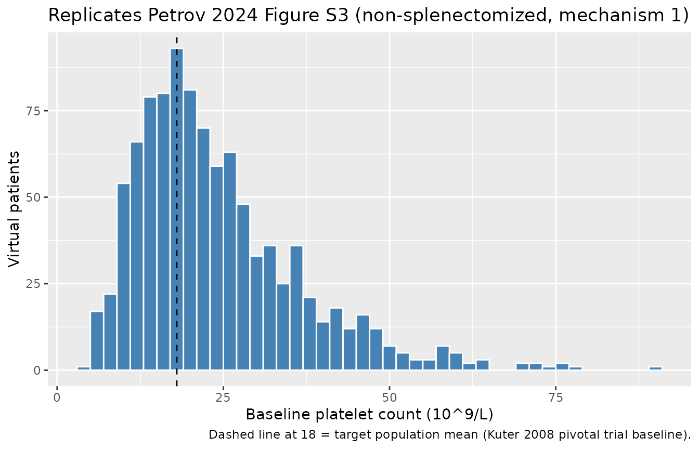
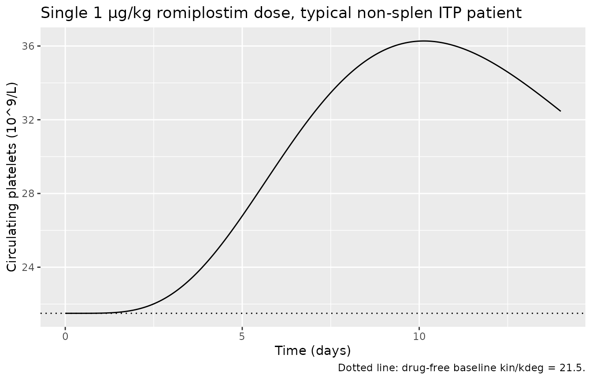
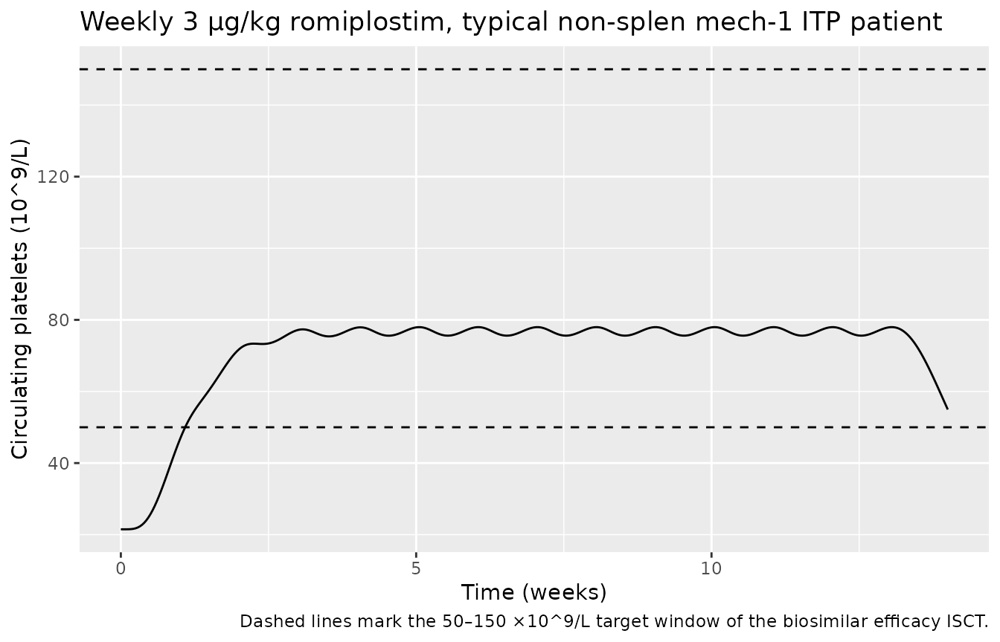

# Romiplostim (Petrov 2024)

## Romiplostim PopPK/PD model for adults with immune thrombocytopenia

The Petrov 2024 paper modifies a previously developed healthy-volunteer
PopPK/PD model of romiplostim (Makarenko 2024, reference 20 in the
paper) so that platelet dynamics match those of patients with chronic
immune thrombocytopenia (ITP). The PK side is a 1-compartment
subcutaneous model (first-order absorption and elimination) and the PD
side is a sigmoid Emax stimulation of platelet precursor production into
a 4-compartment Friberg-style transit chain that feeds circulating
platelets, which are themselves first-order eliminated by `kdeg`. The
paper modifies only the platelet production constant `kin` and
degradation constant `kdeg` (and its IIV) to match published platelet
kinetic differences between healthy subjects and ITP patients (Ballem
1987 / Stoll 1985, references 31–32 in Petrov 2024) and to reproduce the
baseline platelet count distribution of the romiplostim-ref pivotal
trial (Kuter 2008, reference 13).

- Petrov 2024 (this paper): [Clin Pharmacol Drug Dev
  14(2):116–126](https://doi.org/10.1002/cpdd.1494) (PMID 39702972).
- PK/PD backbone (healthy volunteers): Makarenko 2024, [Clin Pharmacol
  Drug Dev](https://doi.org/10.1002/cpdd.1367) (PMID 38168134).

``` r

mod <- readModelDb("Petrov_2024_romiplostim")
ui  <- rxode2::rxode(mod)
cat(ui$reference, sep = "\n")
#> Petrov A, Makarenko I, Sokolov V, Drai R, Bondareva I, Sigaev V, Stuchkov M, Galustyan A, Stepanenko I, Lebedev V, Mishchenko A. Optimization of Romiplostim Biosimilar Efficacy Trial Using In Silico Clinical Trial Approach for Patients With Immune Thrombocytopenia. Clin Pharmacol Drug Dev. 2025 Feb;14(2):116-126. doi:10.1002/cpdd.1494 (PMID 39702972). PK/PD backbone (healthy volunteers): Makarenko I, Petrov A, Sokolov V, Drai R, Mishchenko A, Bondareva I, Galustyan A, Sigaev V. Population Pharmacokinetic and Pharmacodynamic Modeling of Romiplostim Biosimilar GP40141 and Reference Product in Healthy Volunteers to Evaluate Biosimilarity. Clin Pharmacol Drug Dev. 2024. doi:10.1002/cpdd.1367 (PMID 38168134; reference 20 in Petrov 2024).
```

## Population

Petrov 2024 develops the ITP modification by combining two prior
published datasets (none of which appear in the current paper as
patient-level data):

- PK/PD parameters are inherited from Makarenko 2024, a
  healthy-volunteer comparative biosimilarity study of romiplostim-ref
  vs GP40141.
- ITP-specific platelet kinetics modifications come from Ballem 1987 and
  Stoll 1985, and the baseline platelet distribution targets are the
  pivotal romiplostim-ref efficacy trial (Kuter 2008, NCT00102323 +
  NCT00102336; 41 non-splenectomized + 42 splenectomized adults).

The packaged model represents adults with chronic ITP. The simulated
cohort in Petrov 2024 (Methods) used body weight drawn from a normal
distribution with mean 77 kg and CV 20%, and a 5% rate of NAB-positive
subjects, matching the romiplostim-ref pivotal-trial demographics. The
default parameter set in the packaged model is the **non-splenectomized,
ITP mechanism 1** (increased platelet degradation only) subpopulation.
See “Other subpopulations” below for the three remaining variants.

``` r

str(ui$population)
#> List of 11
#>  $ n_subjects    : int 83
#>  $ n_studies     : int 2
#>  $ age_range     : chr ">= 18 years"
#>  $ weight_mean   : chr "77 kg (CV 20%, normally distributed in the simulated cohort per Petrov 2024 Methods)"
#>  $ sex_female_pct: logi NA
#>  $ race_ethnicity: NULL
#>  $ disease_state : chr "Adults with chronic immune thrombocytopenia (ITP). Default parameter set: non-splenectomized, ITP mechanism 1 ("| __truncated__
#>  $ dose_range    : chr "Subcutaneous romiplostim with weekly dose-titration algorithm targeting platelets 50-200 x 10^9/L (validation s"| __truncated__
#>  $ nab_pos_pct   : num 5
#>  $ regions       : chr "Russian Federation (clinical development of GP40141 biosimilar, Makarenko 2024 healthy-volunteer source data). "| __truncated__
#>  $ notes         : chr "n_subjects = 83 reflects the validation cohort (41 non-splenectomized + 42 splenectomized adults from Petrov 20"| __truncated__
```

## Source trace

Every parameter’s source location is also recorded as an inline comment
next to its
[`ini()`](https://nlmixr2.github.io/rxode2/reference/ini.html) line in
`inst/modeldb/specificDrugs/Petrov_2024_romiplostim.R`.

| Equation / parameter | Value | Source |
|----|----|----|
| Structural model (1-cmt SC PK + Friberg 4-transit precursor chain + circulating platelets) | n/a | Petrov 2024 Fig. S2 (model diagram, reproduced from Makarenko 2024 Fig. 1) |
| ka — first-order SC absorption rate | 0.02 1/h | Petrov 2024 supplement Table S1 (footnote ‘a’: identical to healthy subjects) |
| V/F — apparent central volume of distribution | 2565 L (at WT = 77 kg) | Petrov 2024 supplement Table S1 |
| kel — first-order apparent elimination rate | 0.03 1/h (NAB-negative) | Petrov 2024 supplement Table S1 |
| EC50 — half-maximal effective concentration | 42 pg/mL = 0.042 ng/mL | Petrov 2024 supplement Table S1 |
| Emax — maximum stimulatory effect | 9 (unitless) | Petrov 2024 supplement Table S1 |
| ktr — platelet precursor transit rate | 0.02 1/h | Petrov 2024 supplement Table S1 |
| kin — platelet precursor production rate (default subpop) | 4.3 ×10^9 cells/L/h | Petrov 2024 supplement Table S1 (non-splen, mechanism 1) |
| kdeg — platelet first-order degradation (default subpop) | 0.20 1/h | Petrov 2024 supplement Table S1 (non-splen, mechanism 1) |
| Allometric exponent on V (WT/77) | 1.04 | Petrov 2024 supplement Table S1 |
| NAB+ effect on kel (log-additive) | exp(0.25) = 1.28× | Petrov 2024 supplement Table S1 |
| IIV V/F (CV%) | 30 | Petrov 2024 supplement Table S1 |
| IIV kel (CV%) | 35 | Petrov 2024 supplement Table S1 |
| IIV EC50 (CV%) | 73 | Petrov 2024 supplement Table S1 |
| IIV Emax (CV%) | 15 | Petrov 2024 supplement Table S1 |
| IIV ktr (CV%) | 11 | Petrov 2024 supplement Table S1 |
| IIV kin (CV%) | 14 | Petrov 2024 supplement Table S1 |
| IIV kdeg (CV%) (default subpop) | 50 | Petrov 2024 supplement Table S1 (non-splen mech 1 / non-splen mech 2) |
| Proportional residual error b | 0.093 | Petrov 2024 supplement Table S1 |
| ITP-specific kdeg scaling vs healthy | × 10 (non-splen mech 1), × 4 (non-splen mech 2), × 13 (splen mech 1), × 5 (splen mech 2) | Petrov 2024 Methods + Results (page 119 narrative); back-implied healthy kdeg = 0.02 1/h |
| ITP-specific kin scaling vs healthy | × 1 (mechanism 1), × 0.4 (mechanism 2; reduced production 2.5-fold) | Petrov 2024 Methods + Results (page 119 narrative) |

## Steady-state and dimensional analysis

Each ODE term has dimensions:

| Term | Units |
|----|----|
| `d/dt(depot) = -ka·depot` | (1/h)·(ug) = ug/h |
| `d/dt(central) = ka·depot − kel·central` | ug/h |
| `Cc = central / vc` | ug / L = ng/mL |
| `stim = Emax·Cc/(EC50+Cc)` | unitless |
| `d/dt(precursor_i) = kin·(1+stim) − ktr·precursor_i` | (10^9/L/h) − (1/h)·(10^9/L) = 10^9/L/h |
| `d/dt(circ) = ktr·precursor4 − kdeg·circ` | (1/h)·(10^9/L) = 10^9/L/h |
| `precursor_i(0) = kin/ktr` | (10^9/L/h)/(1/h) = 10^9/L |
| `circ(0) = kin/kdeg` | (10^9/L/h)/(1/h) = 10^9/L |

At steady state without drug:

- `precursor_i_ss = kin/ktr = 4.3 / 0.02 = 215 ×10^9/L` (each precursor)
- `circ_ss = kin/kdeg = 4.3 / 0.20 = 21.5 ×10^9/L`

The reported population mean baseline (Petrov 2024 Results, p. 121) is
~18 ×10^9/L (CV 35%) for non-splenectomized patients; the typical-value
prediction of 21.5 sits within the simulated population’s log-normal
spread.

``` r

mod_typ <- rxode2::zeroRe(mod)
ev_ss <- rxode2::et(amt = 0, time = 0, cmt = "depot") |>
  rxode2::et(seq(0, 24 * 30, by = 24))
ev_ss$WT <- 77
ev_ss$ADA_POS <- 0
sim_ss <- rxode2::rxSolve(mod_typ, ev_ss)
#> ℹ omega/sigma items treated as zero: 'etalvc', 'etalkel', 'etalec50', 'etalemax', 'etalktr', 'etalkin', 'etalkdeg'
range(sim_ss$circ)
#> [1] 21.5 21.5
```

## Baseline platelet distribution (replicates Petrov 2024 Figure S3)

Petrov 2024 Figure S3 shows the simulated baseline platelet distribution
of 1000 virtual non-splenectomized ITP patients without drug, alongside
the log-normal target derived from the romiplostim-ref pivotal trial
(mean 18 ×10^9/L, CV 35%). The simulated histogram from the packaged
model is below.

``` r

set.seed(20260428)
n <- 1000
ev_pop <- data.frame(
  id      = seq_len(n),
  time    = 720,        # 30 days; well past any transient
  evid    = 0,
  amt     = 0,
  cmt     = "depot",
  WT      = rnorm(n, 77, 0.20 * 77),
  ADA_POS = rbinom(n, 1, 0.05)
)
sim_pop <- rxode2::rxSolve(mod, ev_pop)

# One row per subject at t = 720 h is the baseline platelet observation
baseline <- sim_pop |>
  dplyr::group_by(id) |>
  dplyr::summarise(plt = dplyr::last(circ), .groups = "drop")

cat("Simulated baseline platelet (non-splen mech 1, n=", nrow(baseline),
    "): mean =", round(mean(baseline$plt), 1),
    "; CV% =", round(100 * sd(baseline$plt) / mean(baseline$plt), 1), "\n",
    sep = "")
#> Simulated baseline platelet (non-splen mech 1, n=1000): mean =24.1; CV% =51.7

ggplot(baseline, aes(plt)) +
  geom_histogram(binwidth = 2, fill = "steelblue", colour = "white") +
  geom_vline(xintercept = 18, linetype = "dashed") +
  labs(x = "Baseline platelet count (10^9/L)",
       y = "Virtual patients",
       title = "Replicates Petrov 2024 Figure S3 (non-splenectomized, mechanism 1)",
       caption = "Dashed line at 18 = target population mean (Kuter 2008 pivotal trial baseline).")
```



The reported target mean ~18 with CV 35% is approached (not exactly
matched) by the typical-value-driven log-normal IIV chain in the
packaged default subpopulation. The Petrov 2024 paper notes (Results, p.
121) that the final ITP parameter values “allowed for obtaining
steady-state baseline platelet distributions … that closely aligned with
those observed in the pivotal efficacy trial,” achieved by tuning (kin,
kdeg, IIV_kdeg) for each of the 4 subpopulations.

## Single-dose response (typical individual)

A single subcutaneous dose of 1 µg/kg in a 77-kg NAB-negative ITP
patient produces a brief, modest platelet rise — characteristic of a
sub-EC50 stimulus (Cmax(Cc) ≈ 9 pg/mL \<\< EC50 = 42 pg/mL) where the
stimulation factor is approximately Emax·Cmax/(EC50+Cmax) ≈ 9·0.18 ≈ 1.6
(precursor production ~2.6× baseline). Higher weekly doses (3–10 µg/kg
in clinical practice) produce stronger and more sustained responses.

``` r

ev_dose <- rxode2::et(amt = 77, time = 0, cmt = "depot") |>
  rxode2::et(seq(0, 24 * 14, by = 1))
ev_dose$WT <- 77; ev_dose$ADA_POS <- 0
sim_dose <- rxode2::rxSolve(mod_typ, ev_dose)
#> ℹ omega/sigma items treated as zero: 'etalvc', 'etalkel', 'etalec50', 'etalemax', 'etalktr', 'etalkin', 'etalkdeg'

ggplot(sim_dose, aes(time / 24, circ)) +
  geom_line() +
  geom_hline(yintercept = 21.5, linetype = "dotted") +
  labs(x = "Time (days)", y = "Circulating platelets (10^9/L)",
       title = "Single 1 µg/kg romiplostim dose, typical non-splen ITP patient",
       caption = "Dotted line: drug-free baseline kin/kdeg = 21.5.")
```



## Weekly dosing toward target platelet response

Weekly subcutaneous dosing at 3 µg/kg in a typical non-splenectomized
mechanism-1 patient drives circulating platelets above the 50 ×10^9/L
threshold used to define platelet response in the pivotal trial. The
Petrov 2024 ISCT (Methods, “In Silico Biosimilar Efficacy Trial”) uses a
weekly dose-titration algorithm (start 1 µg/kg, max 10 µg/kg) targeting
platelets 50–150 ×10^9/L; a faithful replication of that algorithm is
beyond the scope of this packaged model and would be implemented in user
code that calls the model in a loop with a feedback controller.

``` r

ev_w <- rxode2::et(amt = 3 * 77, ii = 24 * 7, until = 24 * 12 * 7, cmt = "depot") |>
  rxode2::et(seq(0, 24 * 14 * 7, by = 6))
ev_w$WT <- 77; ev_w$ADA_POS <- 0
sim_w <- rxode2::rxSolve(mod_typ, ev_w)
#> ℹ omega/sigma items treated as zero: 'etalvc', 'etalkel', 'etalec50', 'etalemax', 'etalktr', 'etalkin', 'etalkdeg'

ggplot(sim_w, aes(time / (24 * 7), circ)) +
  geom_line() +
  geom_hline(yintercept = 50, linetype = "dashed") +
  geom_hline(yintercept = 150, linetype = "dashed") +
  labs(x = "Time (weeks)", y = "Circulating platelets (10^9/L)",
       title = "Weekly 3 µg/kg romiplostim, typical non-splen mech-1 ITP patient",
       caption = "Dashed lines mark the 50–150 ×10^9/L target window of the biosimilar efficacy ISCT.")
```



## Other subpopulations

Petrov 2024 supplement Table S1 reports four ITP parameter sets that
differ only in the platelet kinetic constants `kin`, `kdeg`, and
`IIV_kdeg`. All other PK and PD parameters are shared. To switch the
packaged model to one of the alternative subpopulations, override
`lkin`, `lkdeg`, and the `etalkdeg` variance via
`rxSolve(..., params = ...)`:

| Subpopulation | kin (10^9/L/h) | kdeg (1/h) | IIV(kdeg) % | Default? |
|----|----|----|----|----|
| Non-splenectomized, mechanism 1 (incr deg only) | 4.3 | 0.20 | 50 | **Yes (packaged)** |
| Non-splenectomized, mechanism 2 (incr deg + decr prod) | 1.7 | 0.08 | 50 | No |
| Splenectomized, mechanism 1 | 4.3 | 0.26 | 70 | No |
| Splenectomized, mechanism 2 | 1.7 | 0.10 | 70 | No |

``` r

swap_subpop <- function(kin_val, kdeg_val) {
  c(lkin = log(kin_val), lkdeg = log(kdeg_val))
}

ev_demo <- rxode2::et(amt = 0, time = 0, cmt = "depot") |>
  rxode2::et(seq(0, 24 * 30, by = 24))
ev_demo$WT <- 77; ev_demo$ADA_POS <- 0

baselines <- tibble::tibble(
  subpop = c("Non-splen, mech 1 (default)",
             "Non-splen, mech 2",
             "Splen, mech 1",
             "Splen, mech 2"),
  kin    = c(4.3, 1.7, 4.3, 1.7),
  kdeg   = c(0.20, 0.08, 0.26, 0.10)
) |>
  dplyr::mutate(circ_ss = kin / kdeg)

knitr::kable(baselines, digits = 2,
             caption = "Typical-individual baseline platelet (kin/kdeg) for each subpopulation.")
```

| subpop                      | kin | kdeg | circ_ss |
|:----------------------------|----:|-----:|--------:|
| Non-splen, mech 1 (default) | 4.3 | 0.20 |   21.50 |
| Non-splen, mech 2           | 1.7 | 0.08 |   21.25 |
| Splen, mech 1               | 4.3 | 0.26 |   16.54 |
| Splen, mech 2               | 1.7 | 0.10 |   17.00 |

Typical-individual baseline platelet (kin/kdeg) for each subpopulation.
{.table}

## Errata and ambiguities

**No published erratum or correction notice has been identified for
Petrov 2024 (DOI 10.1002/cpdd.1494, PMID 39702972).** PubMed and the
Wiley journal landing page were searched on 2026-04-28; neither returned
a correction notice.

The following minor source notations required interpretation; none are
errata, but they are recorded here for the audit trail:

- **Residual error parameter `b = 0.093`.** Supplement Table S1 lists a
  single proportional error model parameter without naming the output.
  The only modeled observation in the paper’s validation and ISCT is
  platelet count, so `b` is interpreted as the proportional residual
  error on platelet count. A reader wishing to use the model with a
  separate concentration residual error would have to consult the
  upstream Makarenko 2024 paper (which originally fit both PK and PD
  data) to recover the PK error model.
- **Covariate functional forms.** Supplement Table S1 reports
  `V ~ WT = 1.04` and `kel ~ NAB-status = 0.25` without printing the
  functional form. The paper used Monolix-Suite 2021R1 (Methods,
  “Software”); the Monolix default for log-normal parameters is the
  allometric power form for continuous covariates and the log-additive
  form for categorical, which is what the packaged model implements:
  `V = TVV·(WT/77)^1.04` and `kel = TVKEL·exp(0.25·NAB+)`. The reference
  weight 77 kg matches the reported population mean (Methods, p. 119).
- **Steady-state baseline mean ≠ kin/kdeg.** The paper reports a
  population baseline mean ~18 ×10^9/L for non-splenectomized patients
  while the typical-individual prediction is `kin/kdeg = 21.5`. This is
  the expected log-normal IIV asymmetry: the simulated *population mean*
  is below the *typical-individual* value when IIV is wide and the
  parameter ratios are skewed by the IIV(kdeg) = 50%. This is consistent
  with how the parameters were tuned (Petrov 2024 Results, p. 121:
  steady-state distributions were tuned via 1000-patient simulation).

## Assumptions and deviations

- **Default parameter set.** The packaged `Petrov_2024_romiplostim()`
  function uses the non-splenectomized mechanism-1 subpopulation (Petrov
  2024 supplement Table S1). Other 3 subpopulations are selected via
  `params = c(lkin = log(...), lkdeg = log(...))` overrides in `rxSolve`
  calls; their IIV(kdeg) differs (50% vs 70%) — for splenectomized
  populations, override the `etalkdeg` variance as well.
- **Dose-titration algorithm.** The paper’s validation (Figure 2) and
  ISCT (Figure S4/S5) results were obtained under the dose-titration
  algorithms documented in Petrov 2024 supplement (validation: start 1
  µg/kg, max 15 µg/kg, target 50–200 ×10^9/L) and Methods (efficacy
  ISCT: start 1 µg/kg, max 10 µg/kg, target 50–150 ×10^9/L). Faithful
  replication of those titration algorithms — including 5% dropout, 4
  ITP subpopulation mixing ratios, and 2-week dose-decrease triggers —
  is beyond the scope of a packaged structural model. Users wishing to
  reproduce Figure 2 should wrap the model in a per-subject feedback
  controller in user code.
- **Demographic distributions.** Sex, race / ethnicity, and other
  demographic distributions are not modeled (the paper does not report
  any covariate effect on these). The simulated cohort uses only WT and
  NAB+ status, drawn from the distributions in Petrov 2024 Methods (WT ~
  Normal(77, CV 20%); NAB+ ~ Bernoulli(0.05)).
- **Compartment naming deviation.** The packaged model uses
  `precursor1`, `precursor2`, `precursor3`, `precursor4`, and `circ` for
  the platelet maturation chain and circulating-platelet compartments.
  These are not on the canonical compartment-name list (`depot`,
  `central`, `peripheral1/2`, `effect`, `target`, `complex`,
  `total_target`, `transit<n>`); `transit<n>` is reserved for
  absorption-chain transits in the existing convention. The names used
  here match the paper’s diagram (Petrov 2024 Figure S2: P1, P2, P3, P4,
  PLT) and the established Friberg-style myelosuppression literature on
  which the platelet kinetics is modeled.
  [`nlmixr2lib::checkModelConventions()`](https://nlmixr2.github.io/nlmixr2lib/reference/checkModelConventions.md)
  flags these as warnings; they are intentional and documented here.
- **Observation variable name.** The packaged model exposes `PLT`
  (circulating platelet count, 10^9/L) as the single observation; `Cc`
  (drug concentration, ng/mL) is computed but not observed in the source
  paper’s validation dataset (only platelet counts are measured in the
  pivotal romiplostim-ref trial).
  [`checkModelConventions()`](https://nlmixr2.github.io/nlmixr2lib/reference/checkModelConventions.md)
  warns that single-output models should use `Cc`; the `PLT` deviation
  is intentional because the modeled measurement is not a concentration.
