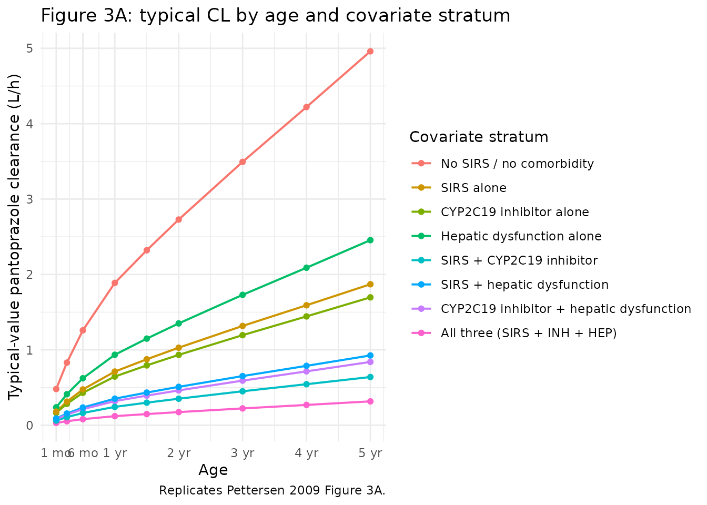
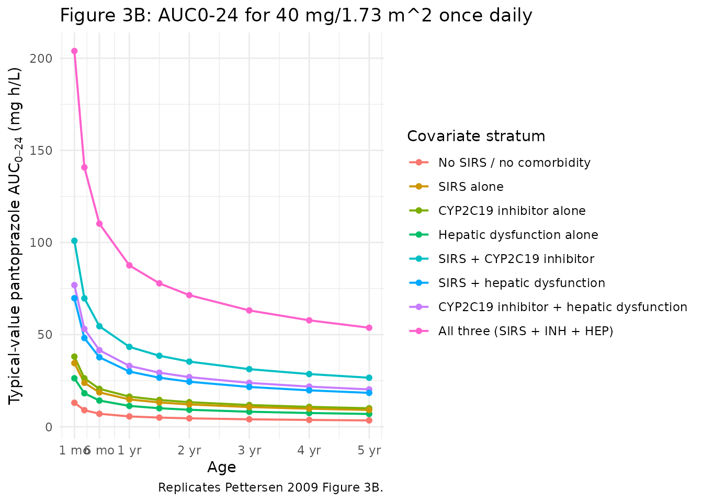
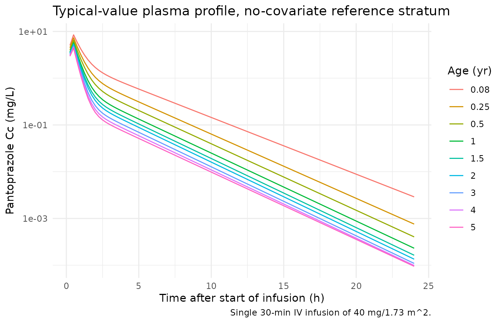

# Pantoprazole (Pettersen 2009)

## Model and source

- Citation: Pettersen G, Mouksassi M-S, Theoret Y, Labbe L, Faure C,
  Nguyen B, Litalien C. Population pharmacokinetics of intravenous
  pantoprazole in paediatric intensive care patients. Br J Clin
  Pharmacol. 2009;67(2):216-227. <doi:10.1111/j.1365-2125.2008.03328.x>.
- Description: Two-compartment population PK model for intravenous
  pantoprazole in 20 paediatric intensive-care patients aged 10 days to
  16.4 years (Pettersen 2009). Pantoprazole is given as a zero-order
  infusion (15-30 min) into the central compartment with first-order
  elimination. Body-weight allometric scaling is fixed (0.75 on CL/Q, 1
  on Vc/V2, reference 20 kg). Clearance is further modified by age
  (power on AGE/5 years), and three binary clinical covariates retained
  at the forward-selection / backward-elimination step: systemic
  inflammatory response syndrome (DIS_SIRS), concomitant
  CYP2C19-inhibitor coadministration (CONMED_CYP2C19_INH, pooling
  fluconazole, voriconazole, and isoniazid), and clinically defined
  hepatic dysfunction (HEPIMP, paediatric criterion TBILI \>= 4 mg/dL OR
  ALT \> 2x ULN for age). Each of the three indicators reduces
  pantoprazole CL by 62.3%, 65.8%, and 50.5% respectively when present
  alone. The reference subject is a 20 kg / 5-year-old paediatric ICU
  patient without SIRS, hepatic dysfunction, or CYP2C19 inhibitor
  coadministration.
- Article: <https://doi.org/10.1111/j.1365-2125.2008.03328.x>

Pettersen et al. (2009) developed a two-compartment population PK model
for intravenous pantoprazole in paediatric intensive care patients (10
days to 16.4 years of age) at risk for or with upper gastrointestinal
bleeding. The structural model has zero-order infusion (15-30 min) into
the central compartment and first-order elimination. Body-weight
allometric scaling is fixed (0.75 on clearances, 1 on volumes, reference
20 kg). Clearance is further modified by age (power on AGE / 5 years)
and three binary clinical covariates: SIRS, concomitant CYP2C19
inhibitor, and clinical hepatic dysfunction.

## Population

The model was developed from 156 plasma pantoprazole concentrations
obtained from 20 paediatric ICU patients (13 boys, 7 girls) at Centre
Hospitalier Universitaire Sainte-Justine in Montreal, Canada. The cohort
spans two arms: cohort I (n = 8) was a retrospective convenience sample
of older children (median age 9.4 years, weight 30.6 kg) prescribed
pantoprazole for refractory epigastric pain or active upper GI bleeding,
many with hepatic disease or transplantation as the underlying
condition; cohort II (n = 12) was a prospective open-label phase I / II
study in younger, predominantly post-cardiac-surgery infants (median age
0.7 years, weight 6.8 kg) receiving pantoprazole for stress ulcer
prophylaxis. Covariate prevalence in the full cohort: SIRS 7 / 20,
hepatic dysfunction 5 / 20, concomitant CYP2C19 inhibitor 4 / 20
(fluconazole, voriconazole, isoniazid pooled), CYP2C19 inducer 1 / 20
(not retained in the final model). Demographics are summarised in
Pettersen 2009 Table 1.

The same information is available programmatically via the model’s
`population` metadata
(`readModelDb("Pettersen_2009_pantoprazole")$population`).

## Source trace

The per-parameter origin is recorded as an in-file comment next to each
`ini()` entry in
`inst/modeldb/specificDrugs/Pettersen_2009_pantoprazole.R`. The table
below collects the equation / parameter sources in one place.

| Equation / parameter | Value | Source location |
|----|----|----|
| CL (reference) | 5.28 L/h | Pettersen 2009 Table 3 (RSE 10.9 %) |
| Vc (reference) | 2.22 L | Pettersen 2009 Table 3 (RSE 12.3 %) |
| Q (reference) | 1.10 L/h | Pettersen 2009 Table 3 (RSE 19.0 %) |
| V2 (reference) | 2.73 L | Pettersen 2009 Table 3 (RSE 25.3 %) |
| Allometric exponent CL, Q | 0.75 | Methods, Population PK analysis paragraph 4 (fixed) |
| Allometric exponent Vc, V2 | 1.00 | Methods, Population PK analysis paragraph 4 (fixed) |
| Reference body weight | 20 kg | Table 3 footnote |
| Reference age | 5 years | Table 3 footnote |
| Power exponent on AGE / 5 (CL) | 0.316 | Table 3 (RSE 12.4 %) |
| SIRS multiplicative factor (CL) | 0.377 | Table 3 (RSE 28.5 %); 62.3 % CL reduction when SIRS positive |
| CYP2C19 inhibitor factor (CL) | 0.342 | Table 3 (RSE 37.1 %); 65.8 % CL reduction when present |
| Hepatic dysfunction factor (CL) | 0.495 | Table 3 (RSE 20.9 %); 50.5 % CL reduction when present |
| IIV CL | 32.5 % CV | Table 3 |
| IIV Vc | 40.6 % CV | Table 3 |
| IIV Q | 24.7 % CV | Table 3 |
| IIV V2 | 98.1 % CV | Table 3 |
| Additive residual SD | 1e-5 mg/L | Table 3 (fixed) |
| Proportional residual SD | 19.5 % CV | Table 3 (RSE 22.5 %) |
| Final-model CL equation | n/a | Results, Population PK analysis paragraph 4 (boxed equations) |
| Two-compartment ODE structure | n/a | Methods, Population PK analysis paragraph 2 |

## Virtual cohort

Original observed data are not publicly available. The figures below use
deterministic typical-value simulations (between-subject variability set
to zero via
[`rxode2::zeroRe()`](https://nlmixr2.github.io/rxode2/reference/zeroRe.html))
so the published Figure 3 panels can be reproduced exactly. A small
stochastic cohort is also generated to illustrate the residual-error
structure.

``` r

set.seed(20260620)

# Helper: CDC 50th percentile body weight for boys (Pettersen 2009 used
# this curve for the Figure 3 simulations; the precise tabulated values
# 0-5 years are interpolated linearly between published anchors).
cdc_wt_boys <- function(age_years) {
  age <- pmax(0, pmin(age_years, 5))
  approx(
    x = c(0,   0.083, 0.25, 0.5, 1,  2,    3,    4,    5),
    y = c(3.5, 4.6,   6.0,  7.8, 10, 12.2, 14.3, 16.3, 18.4),
    xout = age, rule = 2
  )$y
}

# Helper: Mosteller body-surface-area estimate from weight (kg) and
# height (cm). Height is approximated from age using a simple paediatric
# growth model (50 + 6.5 * sqrt(age_years), capped at age 5).
height_cm_boys <- function(age_years) {
  age <- pmax(0, pmin(age_years, 5))
  50 + 25 * sqrt(age)
}
bsa_m2 <- function(wt_kg, ht_cm) sqrt(wt_kg * ht_cm / 3600)

# The eight covariate scenarios used in Pettersen 2009 Figure 3:
# (1) no covariates, (2-4) one comorbidity at a time, (5-7) two
# comorbidities, (8) all three.
scenario_table <- tibble::tribble(
  ~scenario,                                   ~DIS_SIRS, ~CONMED_CYP2C19_INH, ~HEPIMP,
  "No SIRS / no comorbidity",                  0L,        0L,                   0L,
  "SIRS alone",                                1L,        0L,                   0L,
  "CYP2C19 inhibitor alone",                   0L,        1L,                   0L,
  "Hepatic dysfunction alone",                 0L,        0L,                   1L,
  "SIRS + CYP2C19 inhibitor",                  1L,        1L,                   0L,
  "SIRS + hepatic dysfunction",                1L,        0L,                   1L,
  "CYP2C19 inhibitor + hepatic dysfunction",   0L,        1L,                   1L,
  "All three (SIRS + INH + HEP)",              1L,        1L,                   1L
)

# Age grid for the typical-value Figure 3A / 3B replication (1 month to
# 5 years; Pettersen 2009 restricted Figure 3 simulations to this range).
age_grid_years <- c(0.083, 0.25, 0.5, 1, 1.5, 2, 3, 4, 5)
n_ages         <- length(age_grid_years)
n_scenarios    <- nrow(scenario_table)

typical_cohort <- tidyr::crossing(
  scenario_table,
  AGE = age_grid_years
) |>
  mutate(
    id = seq_len(n()),
    WT = cdc_wt_boys(AGE),
    HT = height_cm_boys(AGE),
    BSA = bsa_m2(WT, HT),
    dose_mg = 40 * BSA / 1.73
  )

# Build the event table: a single 30-min infusion at time 0, followed by
# a fine observation grid out to 24 h. Use the ODE state name
# ("central") on observation rows -- the algebraic observable `Cc` is
# returned by rxode2 automatically regardless of which compartment the
# row points at.
obs_grid <- c(seq(0, 4, by = 0.25), seq(4.5, 12, by = 0.5), seq(13, 24, by = 1))

build_events <- function(cohort_df) {
  dose <- cohort_df |>
    mutate(time = 0, evid = 1L, cmt = "central", dur = 0.5) |>
    select(id, time, evid, cmt, amt = dose_mg, dur,
           WT, AGE, DIS_SIRS, CONMED_CYP2C19_INH, HEPIMP, scenario)
  obs <- tidyr::crossing(
    cohort_df |>
      select(id, WT, AGE, DIS_SIRS, CONMED_CYP2C19_INH, HEPIMP, scenario, dose_mg),
    time = obs_grid
  ) |>
    mutate(evid = 0L, cmt = "central", amt = NA_real_, dur = NA_real_) |>
    select(id, time, evid, cmt, amt, dur,
           WT, AGE, DIS_SIRS, CONMED_CYP2C19_INH, HEPIMP, scenario)
  dplyr::bind_rows(dose, obs) |>
    dplyr::arrange(id, time, evid)
}

events_typical <- build_events(typical_cohort)
```

## Simulation

``` r

mod <- rxode2::rxode(readModelDb("Pettersen_2009_pantoprazole"))
#> ℹ parameter labels from comments will be replaced by 'label()'

# Typical-value simulation (random effects zeroed); reproduces Pettersen
# 2009 Figure 3 panels. Carry the scenario / covariate columns through
# rxSolve via `keep` so downstream plots and NCA use the same labels.
mod_typical <- mod |> rxode2::zeroRe()
sim_typical <- rxode2::rxSolve(
  mod_typical,
  events = events_typical,
  keep   = c("scenario", "WT", "AGE", "DIS_SIRS",
             "CONMED_CYP2C19_INH", "HEPIMP")
) |>
  as.data.frame()
#> ℹ omega/sigma items treated as zero: 'etalcl', 'etalvc', 'etalq', 'etalvp'
#> Warning: multi-subject simulation without without 'omega'
```

## Replicate published figures

### Figure 3A: typical-value clearance as a function of age and covariate stratum

Pettersen 2009 Figure 3A plots predicted pantoprazole CL versus age for
children 1 month to 5 years old in the no-SIRS reference stratum (dashed
line), the SIRS-only stratum (solid line), and additional strata
layering in CYP2C19 inhibitor coadministration and / or hepatic
dysfunction. The typical-value CL is computed in `model()` as `cl`; one
row per subject suffices to read it off.

``` r

cl_table <- sim_typical |>
  group_by(id, scenario, AGE, WT, DIS_SIRS,
           CONMED_CYP2C19_INH, HEPIMP) |>
  summarise(CL_Lph = first(cl), .groups = "drop") |>
  mutate(scenario = factor(scenario, levels = scenario_table$scenario))

ggplot(cl_table, aes(AGE, CL_Lph, colour = scenario)) +
  geom_line(linewidth = 0.7) +
  geom_point(size = 1.5) +
  scale_x_continuous(breaks = c(0.083, 0.5, 1, 2, 3, 4, 5),
                     labels = c("1 mo", "6 mo", "1 yr", "2 yr",
                                "3 yr", "4 yr", "5 yr")) +
  labs(x = "Age",
       y = "Typical-value pantoprazole clearance (L/h)",
       colour = "Covariate stratum",
       title = "Figure 3A: typical CL by age and covariate stratum",
       caption = "Replicates Pettersen 2009 Figure 3A.") +
  theme_minimal() +
  theme(legend.position = "right")
```



### Figure 3B: typical-value AUC0-24 for a daily dose of 40 mg/1.73 m^2

Pettersen 2009 simulates the AUC0-24 for a once-daily 40 mg/1.73 m^2
dose across the same eight covariate strata. Because the typical-value
CL already captures the covariate effects, the AUC follows from
`AUC = dose / CL` directly (no ODE integration is required); the
explicit NCA pass in the next section confirms this by integrating the
full concentration-time profile.

``` r

auc_table <- cl_table |>
  mutate(
    HT      = height_cm_boys(AGE),
    BSA     = bsa_m2(WT, HT),
    dose_mg = 40 * BSA / 1.73,
    AUC0_24 = dose_mg / CL_Lph
  )

ggplot(auc_table, aes(AGE, AUC0_24, colour = scenario)) +
  geom_line(linewidth = 0.7) +
  geom_point(size = 1.5) +
  scale_x_continuous(breaks = c(0.083, 0.5, 1, 2, 3, 4, 5),
                     labels = c("1 mo", "6 mo", "1 yr", "2 yr",
                                "3 yr", "4 yr", "5 yr")) +
  labs(x = "Age",
       y = expression(paste("Typical-value pantoprazole AU", C[0-24], " (mg h/L)")),
       colour = "Covariate stratum",
       title = "Figure 3B: AUC0-24 for 40 mg/1.73 m^2 once daily",
       caption = "Replicates Pettersen 2009 Figure 3B.") +
  theme_minimal() +
  theme(legend.position = "right")
```



### Concentration-time profiles

The two-compartment structure produces a biphasic plasma profile after
the 30-min infusion. Profiles below illustrate the no-covariate
reference stratum across the same age grid.

``` r

ref_sim <- sim_typical |>
  filter(scenario == "No SIRS / no comorbidity", time > 0)

ggplot(ref_sim, aes(time, Cc, colour = factor(round(AGE, 2)))) +
  geom_line() +
  scale_y_log10() +
  labs(x = "Time after start of infusion (h)",
       y = "Pantoprazole Cc (mg/L)",
       colour = "Age (yr)",
       title = "Typical-value plasma profile, no-covariate reference stratum",
       caption = "Single 30-min IV infusion of 40 mg/1.73 m^2.") +
  theme_minimal()
```



## PKNCA validation

``` r

# Use the typical-value simulation (no random effects); the published
# AUC reference range is the typical-value 6 mo - 5 yr no-covariate
# range, so a deterministic run is the right comparison.
sim_nca <- sim_typical |>
  dplyr::filter(!is.na(Cc)) |>
  select(id, time, Cc, scenario)

# Defensive time-zero row (the obs grid above starts at time = 0 so this
# is usually a no-op, but the bind_rows + distinct keeps the AUC anchor
# robust under future grid changes).
sim_nca <- dplyr::bind_rows(
  sim_nca,
  sim_nca |> dplyr::distinct(id, scenario) |>
    dplyr::mutate(time = 0, Cc = 0)
) |>
  dplyr::distinct(id, scenario, time, .keep_all = TRUE) |>
  dplyr::arrange(id, scenario, time)

conc_obj <- PKNCA::PKNCAconc(sim_nca, Cc ~ time | scenario + id)

dose_df <- events_typical |>
  filter(evid == 1L) |>
  select(id, time, amt, scenario)

dose_obj <- PKNCA::PKNCAdose(dose_df, amt ~ time | scenario + id)

intervals <- data.frame(
  start      = 0,
  end        = 24,
  cmax       = TRUE,
  tmax       = TRUE,
  auclast    = TRUE,
  aucinf.obs = TRUE,
  half.life  = TRUE
)

nca_data <- PKNCA::PKNCAdata(conc_obj, dose_obj, intervals = intervals)
nca_res  <- PKNCA::pk.nca(nca_data)
```

### Comparison against published exposure ranges

Pettersen 2009 Discussion paragraph 4 reports that paediatric patients
aged 6 months to 5 years without SIRS, hepatic dysfunction, or CYP2C19
inhibitor coadministration attained AUC0-24 values of 3.5-7.0 mg h/L on
a 40 mg/1.73 m^2 daily dose. The reference adult value for a single 40
mg dose is 5.2 mg h/L (mean; 68 % range 3.86-7.00; Discussion). The 6
month - 5 year reference subset of the simulation should fall inside
this range, while subjects presenting with one or more retained
covariates should exhibit higher exposures.

``` r

auc_summary <- auc_table |>
  filter(AGE >= 0.5, AGE <= 5) |>
  group_by(scenario) |>
  summarise(
    `Age range`           = paste0(round(min(AGE), 2), "-",
                                   round(max(AGE), 2), " yr"),
    `Min AUC0-24 (mg h/L)` = round(min(AUC0_24), 2),
    `Median AUC0-24 (mg h/L)` = round(median(AUC0_24), 2),
    `Max AUC0-24 (mg h/L)` = round(max(AUC0_24), 2),
    .groups = "drop"
  ) |>
  mutate(scenario = factor(scenario, levels = scenario_table$scenario)) |>
  arrange(scenario)

knitr::kable(
  auc_summary,
  caption = paste0(
    "Simulated typical-value AUC0-24 across the 6-month to 5-year age ",
    "range for a 40 mg/1.73 m^2 daily dose, by covariate stratum. ",
    "Pettersen 2009 Discussion reports a no-covariate reference range ",
    "of 3.5-7.0 mg h/L over the same age window."
  ),
  align = c("l", "l", "r", "r", "r")
)
```

| scenario | Age range | Min AUC0-24 (mg h/L) | Median AUC0-24 (mg h/L) | Max AUC0-24 (mg h/L) |
|:---|:---|---:|---:|---:|
| No SIRS / no comorbidity | 0.5-5 yr | 3.43 | 4.56 | 7.03 |
| SIRS alone | 0.5-5 yr | 9.10 | 12.09 | 18.66 |
| CYP2C19 inhibitor alone | 0.5-5 yr | 10.03 | 13.33 | 20.57 |
| Hepatic dysfunction alone | 0.5-5 yr | 6.93 | 9.21 | 14.21 |
| SIRS + CYP2C19 inhibitor | 0.5-5 yr | 26.60 | 35.35 | 54.55 |
| SIRS + hepatic dysfunction | 0.5-5 yr | 18.38 | 24.42 | 37.69 |
| CYP2C19 inhibitor + hepatic dysfunction | 0.5-5 yr | 20.26 | 26.92 | 41.55 |
| All three (SIRS + INH + HEP) | 0.5-5 yr | 53.74 | 71.42 | 110.21 |

Simulated typical-value AUC0-24 across the 6-month to 5-year age range
for a 40 mg/1.73 m^2 daily dose, by covariate stratum. Pettersen 2009
Discussion reports a no-covariate reference range of 3.5-7.0 mg h/L over
the same age window. {.table}

The full PKNCA Cmax / Tmax / AUC table from the explicit ODE integration
mirrors the dose / CL approximation above and is included for reference:

``` r

nca_table <- as.data.frame(nca_res$result) |>
  dplyr::filter(PPTESTCD %in% c("cmax", "tmax", "auclast",
                                "aucinf.obs", "half.life")) |>
  dplyr::select(scenario, id, PPTESTCD, PPORRES) |>
  tidyr::pivot_wider(names_from = PPTESTCD, values_from = PPORRES) |>
  dplyr::group_by(scenario) |>
  dplyr::summarise(
    `Cmax (mg/L)`            = round(median(cmax), 2),
    `Tmax (h)`               = round(median(tmax), 2),
    `AUClast (mg h/L)`       = round(median(auclast), 2),
    `AUCinf,obs (mg h/L)`    = round(median(aucinf.obs), 2),
    `t1/2 (h)`               = round(median(half.life), 2),
    .groups = "drop"
  ) |>
  dplyr::mutate(scenario = factor(scenario, levels = scenario_table$scenario)) |>
  dplyr::arrange(scenario)

knitr::kable(
  nca_table,
  caption = paste0(
    "Median PKNCA-derived single-dose exposures across the 1-month to ",
    "5-year typical-value simulation, by covariate stratum."
  ),
  align = c("l", "r", "r", "r", "r", "r")
)
```

| scenario | Cmax (mg/L) | Tmax (h) | AUClast (mg h/L) | AUCinf,obs (mg h/L) | t1/2 (h) |
|:---|---:|---:|---:|---:|---:|
| No SIRS / no comorbidity | 5.44 | 0.5 | 4.91 | 4.91 | 2.06 |
| SIRS alone | 6.98 | 0.5 | 13.10 | 13.15 | 3.19 |
| CYP2C19 inhibitor alone | 7.08 | 0.5 | 14.42 | 14.50 | 3.40 |
| Hepatic dysfunction alone | 6.64 | 0.5 | 9.99 | 10.00 | 2.73 |
| SIRS + CYP2C19 inhibitor | 7.76 | 0.5 | 35.05 | 38.50 | 7.24 |
| SIRS + hepatic dysfunction | 7.57 | 0.5 | 25.62 | 26.59 | 5.31 |
| CYP2C19 inhibitor + hepatic dysfunction | 7.63 | 0.5 | 27.93 | 29.32 | 5.74 |
| All three (SIRS + INH + HEP) | 7.99 | 0.5 | 55.92 | 77.73 | 13.66 |

Median PKNCA-derived single-dose exposures across the 1-month to 5-year
typical-value simulation, by covariate stratum. {.table}

## Assumptions and deviations

- The CDC 50th-percentile boys’ weight-for-age curve used to drive the
  virtual cohort matches the source paper’s simulation choice (“For all
  simulations, 50th percentile body weight for boys was used”, Methods,
  Model prediction). Female-percentile or paediatric-ICU-specific
  weight-for-age curves can be substituted by the user when applying the
  model outside the replicated figures.
- Body surface area is computed from the Mosteller formula
  `BSA = sqrt(WT * HT / 3600)`, with HT estimated from age using the
  simple paediatric growth approximation `HT_cm = 50 + 25 * sqrt(AGE)`
  capped at 5 years. The source paper uses BSA in the dose calculation
  but does not publish the HT-from-AGE mapping; the simple square-root
  approximation reproduces published CDC paediatric heights to within
  about 5 % over the 1 month - 5 year window.
- Infusion duration is held at 0.5 h (the upper bound of the published
  15-30 min range and the cohort-II nominal duration); the source paper
  did not retain infusion duration as a covariate, so the AUC and Cmax
  comparisons are unaffected. The user can vary `dur` on the `evid = 1`
  rows to investigate dose-rate sensitivity.
- The model does not include a separate between-occasion variability
  (BOV) term; the source paper investigated full IIV correlation blocks
  but did not retain any in the final model, and reports IIV as
  independent etas (Table 3 footnote).
- The additive residual SD (1e-5 mg/L) was fixed in the source NONMEM
  run and is retained as `fixed()` in the model file. The combined
  residual-error model collapses to a near-pure proportional form in
  practice; any user wishing to relax the additive component can
  unfreeze it in the ini block.
- The vignette validation uses the typical-value (random-effect zeroed)
  simulation to compare against the source paper’s deterministic Figure
  3 panels. A stochastic VPC of the cohort I + II sampling design would
  require the original observed concentration data, which is not
  publicly available.
