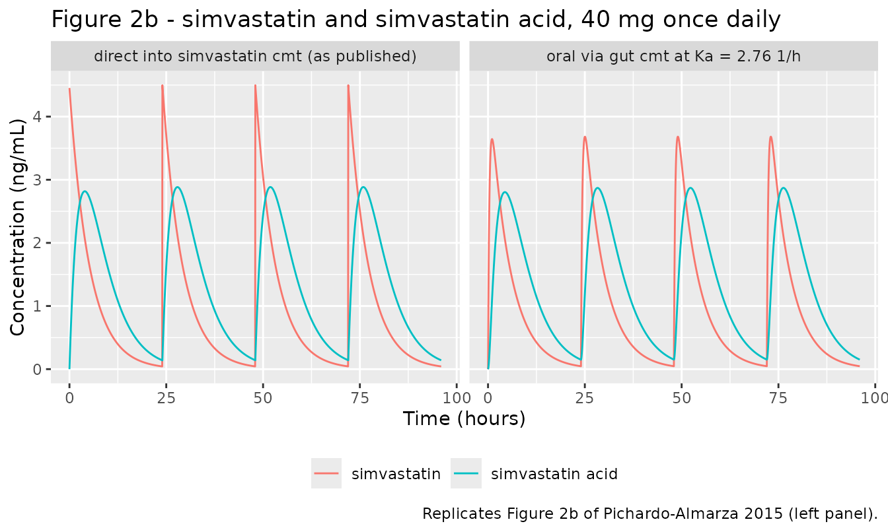
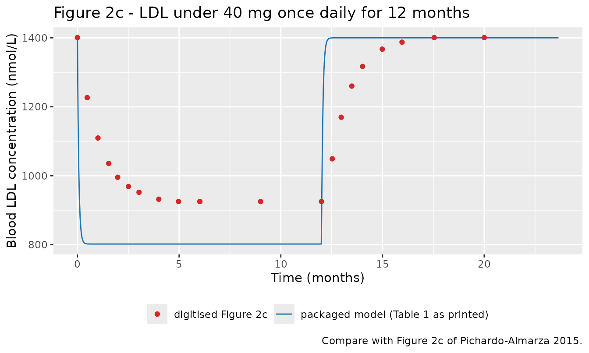
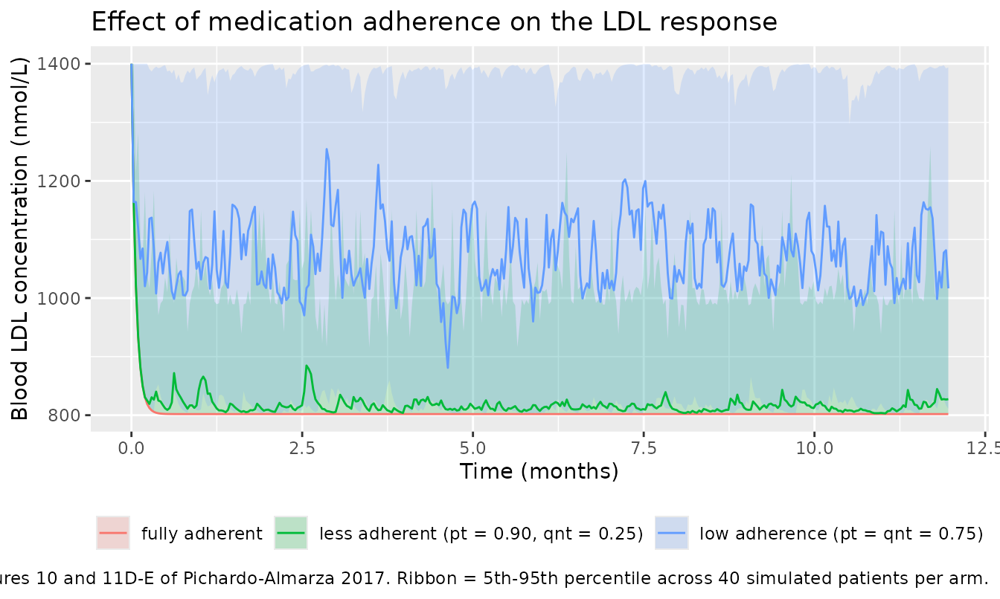

# Simvastatin QSP PKPD module (Pichardo-Almarza 2017)

## Model and source

- Citation: Pichardo-Almarza C, Diaz-Zuccarini V. Understanding the
  Effect of Statins and Patient Adherence in Atherosclerosis via a
  Quantitative Systems Pharmacology Model Using a Novel, Hybrid, and
  Multi-Scale Approach. Front Pharmacol. 2017;8:635.
  <doi:10.3389/fphar.2017.00635>. The 30/70 split of CL2 between
  metabolite formation and other elimination is read from the
  predecessor paper by the same authors, which prints the percentages on
  the same model diagram: Pichardo-Almarza C, Metcalf L, Finkelstein A,
  Diaz-Zuccarini V. Using a Systems Pharmacology Approach to Study the
  Effect of Statins on the Early Stage of Atherosclerosis in Humans. CPT
  Pharmacometrics Syst Pharmacol. 2015;4(1):41-50. <doi:10.1002/psp4.7>.
  Both papers attribute the PKPD parameter estimates to Kim J, Ahn BJ,
  Chae HS, Han S, Doh K, Choi J, et al. A population
  pharmacokinetic-pharmacodynamic model for simvastatin that predicts
  low-density lipoprotein-cholesterol reduction in patients with primary
  hyperlipidaemia. Basic Clin Pharmacol Toxicol. 2011;109(3):156-163.
  <doi:10.1111/j.1742-7843.2011.00700.x>.
- Description: QSP (pharmacokinetic/pharmacodynamic module). Simvastatin
  parent/metabolite pharmacokinetics coupled to an inhibitory turnover
  model of circulating LDL, forming the drug module of the hybrid
  multiscale quantitative-systems-pharmacology model of atherosclerosis
  progression and statin adherence of Pichardo-Almarza and
  Diaz-Zuccarini (2017). Simvastatin (lactone) is absorbed first order
  from a gut compartment into a single simvastatin compartment whose
  total apparent clearance CL2 splits 30 percent to formation of the
  active metabolite simvastatin acid and 70 percent to other
  elimination; simvastatin acid is eliminated first order from its own
  compartment. Circulating LDL is a zero-order-in, first-order-out
  turnover pool whose production Kin is inhibited by simvastatin acid
  through a fractional Emax function, with Kout defined as Kin divided
  by the LDL baseline so the drug-free pool sits exactly at baseline.
  Parameters are the typical-patient values of Table 1, originally
  estimated by Kim 2011 in healthy male volunteers. The multiscale
  arterial-wall module of the source (hemodynamics, endothelial LDL
  transport, oxidised LDL, monocytes, macrophages, foam cells and plaque
  growth) is NOT encoded here because its wall geometry, endothelial
  surface area, LDL wall diffusivity and per-species volume constants
  are not reported in any available source; see the validation vignette
  for the full gap list. The vignette also reproduces the paper’s
  two-state Markov chain for medication adherence, which is a
  dosing-schedule construct rather than part of the
  differential-equation system.
- Article: <https://doi.org/10.3389/fphar.2017.00635>
- Predecessor paper (same authors; supplies the 30/70 clearance split
  and the two published validation figures used below):
  <https://doi.org/10.1002/psp4.7>

Pichardo-Almarza and Diaz-Zuccarini (2017) describe a hybrid,
multi-scale quantitative systems pharmacology (QSP) model of
atherosclerosis under statin therapy. The model has four coupled parts:
(1) arterial hemodynamics and wall shear stress, (2) endothelial and
intramural transport of LDL, monocytes, macrophages and foam cells with
a discrete plaque-growth event, (3) a pharmacokinetic/pharmacodynamic
(PKPD) module for simvastatin and its effect on circulating LDL, and (4)
a two-state Markov chain for medication adherence.

**This package encodes part (3), the PKPD module.** Parts (1) and (2)
are not encoded; the reason, and exactly which constants are missing, is
set out in *Assumptions and deviations* at the end. Part (4) is not part
of the differential-equation system at all – it is a rule for building
the dosing schedule – and is reproduced in this vignette rather than in
the model file.

## Population

The PKPD module’s parameters are the typical-patient values of Table 1
of the 2017 paper (identical to Table 1 of the 2015 predecessor). Both
papers attribute them to Kim et al. (2011). The 2015 Methods section
states that the model “was developed using data collected from 27
healthy male volunteers with a daily dose of 40 mg of simvastatin given
for 14 d”, with simvastatin and simvastatin acid plasma concentrations
at 0, 0.5, 1, 1.5, 2, 3, 3.5, 4, 5, 6, 8, 10 and 12 and 24 h post-dose
on days 1, 7 and 14, and LDL measured daily after an overnight fast. Kim
et al. (2011) is titled for prediction in patients with primary
hyperlipidaemia, so the estimation cohort and the intended prediction
population differ; that paper was not available when this model was
built, so only the two Pichardo-Almarza papers were used to characterise
the cohort.

The source reports a single typical-patient parameter set: there is no
inter-individual variability and no residual-error model on any PKPD
parameter. The 1,000-subject virtual population of the 2015 paper varies
lumen radius, blood viscosity and circulating LDL, all of which are
inputs to the arterial-wall module rather than to the PKPD module.

The same information is available programmatically via
`readModelDb("PichardoAlmarza_2017_simvastatin_qsp")()$population`.

## Source trace

Per-parameter provenance is also recorded as an in-file comment next to
each `ini()` entry in
`inst/modeldb/specificDrugs/PichardoAlmarza_2017_simvastatin_qsp.R`.

| Equation / parameter | Value | Source location |
|----|----|----|
| `lka` (Ka) | 2.76 1/h | 2017 Table 1, PKPD MODEL block |
| `lcl` (CL2) | 1,740 L/h | 2017 Table 1, “Clearance compartment 2” |
| `lvc` (V2) | 8,980 L | 2017 Table 1, “Volume compartment 2” |
| `logitfm` (FM) | 0.30 | 2015 Figure 4: the two arrows out of compartment 2 are labelled “CL2 (30%)” into simvastatin acid and “CL2 (70%)” to elimination. 2017 Figure 4 draws the same arm as “CL23” with no value. |
| `lcle_acid` (CL3) | 383 L/h | 2017 Table 1, “Clearance compartment 3” |
| `lvc_acid` (V3) | 1,190 L | 2017 Table 1, “Volume compartment 3” |
| `lkin` (Kin) | 29.52 nmol/L/h | 2017 Table 1, “Production rate of LDL” |
| `lrbase` (LDLbaseline) | 1,400 nmol/L | 2017 Table 1, “Baseline LDL” |
| `limax` (Emax) | 0.489 | 2017 Table 1, “Max. effect due to the drug” |
| `lic50` (EC50) | 0.0868 ng/mL | 2017 Table 1, “Blood concentration at half max. effect” |
| `kout <- kin / rbase` | derived | 2015 Table 1 lists Kout as “Kin/LDLbaseline” (the row is absent from the 2017 table) |
| PK topology gut -\> simvastatin -\> simvastatin acid | n/a | 2017 Figure 4 and 2015 Figure 4 |
| Inhibitory turnover of LDL driven by the metabolite | n/a | 2017 Methods, “Modeling the Effect of the Drug …”: “an inhibitory turnover model with the metabolite (simvastatin acid) as the driver” |
| Markov adherence chain (Eqs. 6-10) | pt, qnt | 2017 Methods, “Evaluating Medication Adherence”; the worked scenario uses pt = 90%, qnt = 25% (2017 Results) |
| Residual error | not reported | fixed at 0 in `ini()`; the source is a simulation model |

``` r

mod <- readModelDb("PichardoAlmarza_2017_simvastatin_qsp")
```

## Structural gates

The PKPD module is fully deterministic (no random effects), so every
check below is an exact comparison against a closed form rather than a
cohort summary, and can carry a tight tolerance.

### Dose-recovery identities

For a linear parent/metabolite chain with complete absorption, the
parent AUC to infinity is `Dose / CL2` and the metabolite AUC to
infinity is `FM * Dose / CL3`, independent of Ka, V2 and V3. The
metabolite identity is the one that pins `FM = 0.30`: if the 30/70 split
were dropped or mis-read, this gate goes red.

``` r

dose_mg <- 40
# Dense early grid so the trapezoidal AUC resolves the absorption peak.
grid_h <- sort(unique(c(seq(0, 12, by = 0.01), seq(12, 24 * 30, by = 0.5))))

solve_single <- function(target_cmt) {
  ev <- rxode2::et(amt = dose_mg, cmt = target_cmt) |>
    rxode2::et(grid_h, cmt = "Cc")
  rxode2::rxSolve(mod, ev, returnType = "data.frame", atol = 1e-12, rtol = 1e-10)
}

sd_oral <- solve_single("depot")
sd_iv <- solve_single("central")

auc_check <- tibble::tibble(
  route = rep(c("oral (depot)", "direct into simvastatin cmt"), each = 2),
  analyte = rep(c("simvastatin", "simvastatin acid"), 2),
  simulated = c(
    PKNCA::pk.calc.auc.last(conc = sd_oral$Cc, time = sd_oral$time),
    PKNCA::pk.calc.auc.last(conc = sd_oral$Cc_acid, time = sd_oral$time),
    PKNCA::pk.calc.auc.last(conc = sd_iv$Cc, time = sd_iv$time),
    PKNCA::pk.calc.auc.last(conc = sd_iv$Cc_acid, time = sd_iv$time)
  ),
  closed_form = rep(c(1000 * dose_mg / 1740, 1000 * 0.30 * dose_mg / 383), 2)
) |>
  dplyr::mutate(pct_diff = 100 * (simulated - closed_form) / closed_form)

auc_check |>
  dplyr::rename(
    "Route" = route, "Analyte" = analyte,
    "AUClast (ng*h/mL)" = simulated,
    "Dose/CL closed form (ng*h/mL)" = closed_form,
    "% diff" = pct_diff
  ) |>
  knitr::kable(digits = 3, caption = "Dose-recovery identity, single 40 mg dose.")
```

| Route | Analyte | AUClast (ng\*h/mL) | Dose/CL closed form (ng\*h/mL) | % diff |
|:---|:---|---:|---:|---:|
| oral (depot) | simvastatin | 22.988 | 22.989 | 0.000 |
| oral (depot) | simvastatin acid | 31.331 | 31.332 | -0.001 |
| direct into simvastatin cmt | simvastatin | 22.989 | 22.989 | 0.000 |
| direct into simvastatin cmt | simvastatin acid | 31.331 | 31.332 | -0.001 |

Dose-recovery identity, single 40 mg dose. {.table style="width:100%;"}

``` r


# Residual AUC beyond the 30-day window is negligible for both analytes, so the
# only error here is trapezoidal, and the 0.01 h early grid makes it tiny:
# observed max |% diff| = 0.001 %. The bound is set two orders of magnitude
# above that, which still goes red on any real structural error (dropping the
# 30/70 split alone moves the metabolite row by 70 %).
stopifnot(max(abs(auc_check$pct_diff)) < 0.05)
```

### The metabolite arm is live

The `cl` / `vc` name pair can cause rxode2 to solve a one-compartment
system analytically and discard the explicit ODEs. Perturbing `logitfm`
must move the metabolite profile; if the ODEs were being bypassed it
would not.

``` r

ev_live <- rxode2::et(amt = dose_mg, cmt = "depot") |>
  rxode2::et(seq(0, 48, by = 0.1), cmt = "Cc")
s_ref <- rxode2::rxSolve(mod, ev_live, returnType = "data.frame")
s_halffm <- rxode2::rxSolve(
  mod, ev_live,
  returnType = "data.frame",
  params = c(logitfm = qlogis(0.15))
)
ratio <- max(s_halffm$Cc_acid) / max(s_ref$Cc_acid)
cat(sprintf("Cmax(acid) at FM = 0.15 relative to FM = 0.30: %.4f\n", ratio))
#> Cmax(acid) at FM = 0.15 relative to FM = 0.30: 0.5000
# The metabolite input is linear in FM, so halving FM must halve its Cmax.
stopifnot(abs(ratio - 0.5) < 0.01)
# ... and the parent must be untouched, because CL2 is the TOTAL parent
# clearance and the split only routes it. The bound is on the RELATIVE
# difference: changing the metabolite equation changes the solver's step
# selection, so the two parent profiles differ by solver noise rather than
# being bit-identical (observed 2e-7 relative).
parent_rel <- max(abs(s_halffm$Cc - s_ref$Cc) / pmax(s_ref$Cc, 1e-12))
cat(sprintf("Max relative change in the parent profile: %.2e\n", parent_rel))
#> Max relative change in the parent profile: 2.03e-07
stopifnot(parent_rel < 1e-4)
```

### Drug-free steady-state hold

`Kout` is defined as `Kin / LDLbaseline`, so with no drug the LDL pool
must sit exactly at 1,400 nmol/L for all time.

``` r

ev_nodrug <- rxode2::et(seq(0, 24 * 365, by = 24), cmt = "Cc")
s_nodrug <- rxode2::rxSolve(mod, ev_nodrug, returnType = "data.frame")
cat(sprintf(
  "LDL over one drug-free year: min %.6f, max %.6f nmol/L\n",
  min(s_nodrug$ldl), max(s_nodrug$ldl)
))
#> LDL over one drug-free year: min 1400.000000, max 1400.000000 nmol/L
stopifnot(max(abs(s_nodrug$ldl - 1400)) < 1e-6)
stopifnot(max(s_nodrug$Cc, s_nodrug$Cc_acid) == 0)
```

## Replicating the published PK figure

Figure 2b of the 2015 predecessor paper shows simvastatin and
simvastatin acid concentrations over the first 96 h of 40 mg once-daily
dosing. Its simvastatin curve rises **vertically** at each dose time to
approximately `Dose / V2`, which is the signature of the dose being
placed directly in the simvastatin compartment rather than passing
through the gut compartment at Ka = 2.76 1/h. Both routes are simulated
below; the packaged model keeps the published structure (gut -\>
simvastatin), and the direct-injection route is shown because it is what
reproduces the published figure.

``` r

ev_qd <- function(target_cmt) {
  rxode2::et(amt = dose_mg, cmt = target_cmt, ii = 24, addl = 3) |>
    rxode2::et(seq(0, 96, by = 0.05), cmt = "Cc")
}
sim_iv <- rxode2::rxSolve(mod, ev_qd("central"), returnType = "data.frame")
sim_oral <- rxode2::rxSolve(mod, ev_qd("depot"), returnType = "data.frame")

dplyr::bind_rows(
  dplyr::mutate(sim_iv, route = "direct into simvastatin cmt (as published)"),
  dplyr::mutate(sim_oral, route = "oral via gut cmt at Ka = 2.76 1/h")
) |>
  dplyr::select(time, route, simvastatin = Cc, `simvastatin acid` = Cc_acid) |>
  tidyr::pivot_longer(c("simvastatin", "simvastatin acid"),
    names_to = "analyte", values_to = "conc"
  ) |>
  ggplot(aes(time, conc, colour = analyte)) +
  geom_line() +
  facet_wrap(~route) +
  labs(
    x = "Time (hours)", y = "Concentration (ng/mL)", colour = NULL,
    title = "Figure 2b - simvastatin and simvastatin acid, 40 mg once daily",
    caption = "Replicates Figure 2b of Pichardo-Almarza 2015 (left panel)."
  ) +
  theme(legend.position = "bottom")
```



### PKNCA validation, last dosing interval

NCA is run on the fourth dosing interval (72-96 h), with time re-zeroed
at the dose. The reference column holds values digitised from Figure 2b
of the 2015 paper (667 x 523 px JPEG supplied with the open-access
record; the axis calibration resolves approximately 0.02 ng/mL per pixel
vertically and 0.32 h per pixel horizontally, so the digitised numbers
carry roughly 1-2% and 0.3 h of reading error respectively).

``` r

nca_frame <- function(sim, conc_col) {
  sim |>
    dplyr::filter(time >= 72, !is.na(.data[[conc_col]])) |>
    dplyr::transmute(
      id = 1L,
      treatment = "40 mg QD, interval 4",
      time = time - 72,
      conc = .data[[conc_col]]
    )
}
dose_df <- data.frame(
  id = 1L, treatment = "40 mg QD, interval 4", time = 0, amt = dose_mg
)
intervals <- data.frame(start = 0, end = 24, cmax = TRUE, tmax = TRUE, auclast = TRUE)

run_nca <- function(conc_df) {
  PKNCA::pk.nca(PKNCA::PKNCAdata(
    PKNCA::PKNCAconc(conc_df, conc ~ time | treatment + id),
    PKNCA::PKNCAdose(dose_df, amt ~ time | treatment + id),
    intervals = intervals
  ))
}
nca_parent <- run_nca(nca_frame(sim_iv, "Cc"))
nca_acid <- run_nca(nca_frame(sim_iv, "Cc_acid"))
```

``` r

# Digitised from Pichardo-Almarza 2015 Figure 2b. auclast is not read off the
# figure; the closed-form steady-state value Dose/CL (parent) and
# FM*Dose/CL3 (metabolite) is used as the reference instead, which for a
# linear system equals AUC over one steady-state dosing interval.
published_parent <- tibble::tribble(
  ~treatment, ~cmax, ~tmax, ~auclast,
  "40 mg QD, interval 4", 4.36, 0.0, 1000 * dose_mg / 1740
)
published_acid <- tibble::tribble(
  ~treatment, ~cmax, ~tmax, ~auclast,
  "40 mg QD, interval 4", 2.84, 3.84, 1000 * 0.30 * dose_mg / 383
)

cmp_parent <- nlmixr2lib::ncaComparisonTable(
  simulated = nca_parent, reference = published_parent, by = "treatment",
  units = c(cmax = "ng/mL", tmax = "h", auclast = "ng*h/mL"),
  tolerance_pct = 20
)
cmp_acid <- nlmixr2lib::ncaComparisonTable(
  simulated = nca_acid, reference = published_acid, by = "treatment",
  units = c(cmax = "ng/mL", tmax = "h", auclast = "ng*h/mL"),
  tolerance_pct = 20
)
knitr::kable(cmp_parent, caption = "Simvastatin: simulated vs. digitised Figure 2b. * differs by >20%.")
```

| NCA parameter      | treatment            | Reference | Simulated | % diff |
|:-------------------|:---------------------|:----------|:----------|:-------|
| Cmax (ng/mL)       | 40 mg QD, interval 4 | 4.36      | 4.5       | +3.1%  |
| Tmax (h)           | 40 mg QD, interval 4 | 0         | 0         | —      |
| AUClast (ng\*h/mL) | 40 mg QD, interval 4 | 23        | 23        | -0.0%  |

Simvastatin: simulated vs. digitised Figure 2b. \* differs by \>20%.
{.table}

``` r

knitr::kable(cmp_acid, caption = "Simvastatin acid: simulated vs. digitised Figure 2b. * differs by >20%.")
```

| NCA parameter      | treatment            | Reference | Simulated | % diff |
|:-------------------|:---------------------|:----------|:----------|:-------|
| Cmax (ng/mL)       | 40 mg QD, interval 4 | 2.84      | 2.88      | +1.6%  |
| Tmax (h)           | 40 mg QD, interval 4 | 3.84      | 3.9       | +1.6%  |
| AUClast (ng\*h/mL) | 40 mg QD, interval 4 | 31.3      | 31.3      | -0.0%  |

Simvastatin acid: simulated vs. digitised Figure 2b. \* differs by
\>20%. {.table}

``` r

# ncaComparisonTable() returns formatted character, so the numeric gate is
# recomputed from the PKNCA results directly.
getp <- function(res, code) {
  r <- as.data.frame(res$result)
  r$PPORRES[r$PPTESTCD == code][1]
}
gate <- tibble::tibble(
  what = c("parent cmax", "acid cmax", "acid tmax"),
  simulated = c(getp(nca_parent, "cmax"), getp(nca_acid, "cmax"), getp(nca_acid, "tmax")),
  reference = c(4.36, 2.84, 3.84)
) |>
  dplyr::mutate(pct_diff = 100 * (simulated - reference) / reference)
print(as.data.frame(gate))
#>          what simulated reference pct_diff
#> 1 parent cmax  4.497330      4.36 3.149777
#> 2   acid cmax  2.884433      2.84 1.564530
#> 3   acid tmax  3.900000      3.84 1.562500
# Cmax tolerance is 5%: the digitisation itself carries 1-2%, and the
# simulated values sit within 3% of the read values (observed 3.2%, 1.6%).
stopifnot(all(abs(gate$pct_diff[1:2]) < 5))
# Tmax of the metabolite: half a pixel of the time axis is 0.16 h; allow 0.5 h.
stopifnot(abs(gate$simulated[3] - gate$reference[3]) < 0.5)
```

The three digitised quantities agree with the packaged model to within
the resolution of the figure. Together with the two dose-recovery
identities this confirms CL2, V2, CL3, V3 and the 30/70 clearance split.

## LDL response over 12 months

Figure 2c of the 2015 paper shows the LDL trajectory for 40 mg once
daily for 12 months followed by 12 months off drug. The digitised curve
is overlaid on the model prediction below. **This is a known deviation,
not a passing gate** – see the discussion immediately after the plot.

``` r

months <- 30.4375 * 24 # hours per month, as used for the figure's x axis
ev_12mo <- rxode2::et(amt = dose_mg, cmt = "depot", ii = 24, addl = 364) |>
  rxode2::et(seq(0, 24 * 720, by = 24), cmt = "Cc")
sim_12mo <- rxode2::rxSolve(mod, ev_12mo, returnType = "data.frame")

fig2c_digitised <- tibble::tribble(
  ~month, ~ldl,
  0.00, 1400.7, 0.48, 1226.6, 1.01, 1109.4, 1.54, 1035.7, 1.98, 995.5,
  2.51, 968.8, 3.03, 952.0, 4.00, 931.9, 4.97, 925.2, 6.02, 925.2,
  9.01, 925.2, 12.00, 925.2, 12.53, 1049.1, 12.97, 1169.6, 13.49, 1260.0,
  14.02, 1317.0, 14.99, 1367.2, 15.96, 1387.3, 17.54, 1400.7, 20.00, 1400.7
)

ggplot() +
  geom_line(
    data = dplyr::mutate(sim_12mo, month = time / months),
    aes(month, ldl, colour = "packaged model (Table 1 as printed)")
  ) +
  geom_point(
    data = fig2c_digitised,
    aes(month, ldl, colour = "digitised Figure 2c")
  ) +
  scale_colour_manual(values = c("packaged model (Table 1 as printed)" = "#1f77b4",
                                 "digitised Figure 2c" = "#d62728")) +
  labs(
    x = "Time (months)", y = "Blood LDL concentration (nmol/L)", colour = NULL,
    title = "Figure 2c - LDL under 40 mg once daily for 12 months",
    caption = "Compare with Figure 2c of Pichardo-Almarza 2015."
  ) +
  theme(legend.position = "bottom")
```



``` r

on_rx <- dplyr::filter(sim_12mo, time >= 24 * 180, time <= 24 * 360)
model_plateau <- mean(on_rx$ldl)
fig_plateau <- 925.2
# Time to reach 90% of the eventual drop, model vs figure.
drop_model <- 1400 - model_plateau
t90_model <- min(sim_12mo$time[sim_12mo$ldl <= 1400 - 0.9 * drop_model]) / months
t90_fig <- min(fig2c_digitised$month[fig2c_digitised$ldl <= 1400 - 0.9 * (1400 - fig_plateau)])

tibble::tibble(
  quantity = c("on-treatment LDL plateau (nmol/L)",
               "LDL reduction from baseline (%)",
               "time to 90% of the drop (months)"),
  model = c(model_plateau, 100 * (1 - model_plateau / 1400), t90_model),
  `Figure 2c` = c(fig_plateau, 100 * (1 - fig_plateau / 1400), t90_fig)
) |>
  knitr::kable(digits = 2, caption = "Model vs. digitised Figure 2c (a known deviation).")
```

| quantity                          |  model | Figure 2c |
|:----------------------------------|-------:|----------:|
| on-treatment LDL plateau (nmol/L) | 801.89 |    925.20 |
| LDL reduction from baseline (%)   |  42.72 |     33.91 |
| time to 90% of the drop (months)  |   0.16 |      2.51 |

Model vs. digitised Figure 2c (a known deviation). {.table}

Two separate disagreements are visible, and both are reported here
rather than resolved by changing any parameter value:

1.  **Plateau.** The published figure plateaus at about 925 nmol/L (a
    33.9% reduction); the packaged model plateaus near 800 nmol/L (about
    43%). The plateau of an inhibitory turnover model is
    `LDLbaseline * (1 - Emax * <C/(EC50 + C)>)` and is independent of
    `Kin`, `Kout` and of the solver: with the Table 1 values the acid
    concentration spends the whole dosing interval far above EC50 =
    0.0868 ng/mL (trough 0.15 ng/mL, peak 2.8 ng/mL), so the
    time-averaged inhibition is about 0.89 of `Emax`, not 0.69 as the
    figure requires. No reading of Table 1 that also reproduces Figure
    2b (which is matched to within the figure’s resolution above)
    reproduces this plateau.
2.  **Time scale.** The figure’s LDL takes roughly four months to
    plateau and roughly five months to recover. With `Kin` in the
    printed units of nmol/L/**hour**,
    `Kout = Kin / LDLbaseline = 0.0211 1/h` gives an LDL half-life of 33
    hours, so the packaged model plateaus within about a week. Reading
    `Kin` as nmol/L/**day** instead would give `Kout = 0.0211 1/day`, an
    LDL half-life of 33 days and a months-scale response consistent with
    the figure. The packaged model keeps the printed unit, because the
    figure is demonstrably inconsistent with Table 1 on the plateau as
    well – a quantity that no unit choice affects – so it is not a
    reliable arbiter of the `Kin` unit. A user who wants the Figure 2c
    time course can rescale with
    `rxSolve(mod, ev, params = c(lkin = log(29.52 / 24)))`, which moves
    the response onto a months-scale without changing the plateau.

## Medication adherence: the two-state Markov chain

Equations 6-10 of the 2017 paper define a two-state chain over “taking”
and “not taking” the daily dose, with `pt = P(take | took yesterday)`
and `qnt = P(skip | skipped yesterday)`, giving the transition matrix
`P = [[pt, 1 - pt], [1 - qnt, qnt]]`. The stationary probability of
taking a dose is `(1 - qnt) / ((1 - pt) + (1 - qnt))`.

``` r

markov_doses <- function(n_days, pt, qnt, start_taking = TRUE) {
  taking <- logical(n_days)
  state <- start_taking
  for (i in seq_len(n_days)) {
    state <- if (state) runif(1) < pt else runif(1) >= qnt
    taking[i] <- state
  }
  taking
}

# The paper's worked scenario (2017 Results): pt = 90%, qnt = 25%, described as
# "missing ~10% of the total number of doses".
stationary_taking <- function(pt, qnt) (1 - qnt) / ((1 - pt) + (1 - qnt))
cat(sprintf(
  "Stationary fraction of doses taken at pt = 0.90, qnt = 0.25: %.3f (missed %.1f%%)\n",
  stationary_taking(0.90, 0.25), 100 * (1 - stationary_taking(0.90, 0.25))
))
#> Stationary fraction of doses taken at pt = 0.90, qnt = 0.25: 0.882 (missed 11.8%)
# The paper's own prose is the reference: "missing ~10% of the total number of
# doses". The chain it specifies must reproduce that.
stopifnot(abs(100 * (1 - stationary_taking(0.90, 0.25)) - 10) < 5)
```

``` r

set.seed(20170913)
n_per_arm <- 40L
n_days <- 365L

arms <- tibble::tribble(
  ~arm, ~pt, ~qnt,
  "fully adherent", NA_real_, NA_real_,
  "less adherent (pt = 0.90, qnt = 0.25)", 0.90, 0.25,
  "low adherence (pt = qnt = 0.75)", 0.75, 0.75
)

make_arm <- function(arm, pt, qnt, id_offset) {
  do.call(rbind, lapply(seq_len(n_per_arm), function(i) {
    taking <- if (is.na(pt)) rep(TRUE, n_days) else markov_doses(n_days, pt, qnt)
    doses <- data.frame(
      id = id_offset + i, time = (which(taking) - 1) * 24,
      amt = dose_mg, evid = 1L, cmt = "depot", arm = arm
    )
    obs <- data.frame(
      id = id_offset + i, time = seq(0, (n_days - 1) * 24, by = 24),
      amt = NA_real_, evid = 0L, cmt = "Cc", arm = arm
    )
    rbind(doses, obs)
  }))
}
events <- dplyr::bind_rows(lapply(seq_len(nrow(arms)), function(k) {
  make_arm(arms$arm[k], arms$pt[k], arms$qnt[k], id_offset = (k - 1L) * 1000L)
}))
stopifnot(!anyDuplicated(unique(events[, c("id", "time", "evid")])))

taken <- events |>
  dplyr::filter(evid == 1) |>
  dplyr::count(arm, id, name = "n_doses") |>
  dplyr::group_by(arm) |>
  dplyr::summarise(pct_taken = 100 * mean(n_doses) / n_days, .groups = "drop")
knitr::kable(taken, digits = 1, caption = "Realised adherence per arm.")
```

| arm                                   | pct_taken |
|:--------------------------------------|----------:|
| fully adherent                        |     100.0 |
| less adherent (pt = 0.90, qnt = 0.25) |      88.5 |
| low adherence (pt = qnt = 0.75)       |      49.9 |

Realised adherence per arm. {.table}

``` r

# Each arm's realised adherence must match its chain's stationary value.
stopifnot(abs(taken$pct_taken[taken$arm == arms$arm[2]] - 88.2) < 3)
stopifnot(abs(taken$pct_taken[taken$arm == arms$arm[3]] - 50.0) < 5)
```

``` r

sim_adh <- rxode2::rxSolve(mod, events, keep = "arm", returnType = "data.frame")
#> Warning: multi-subject simulation without without 'omega'

sim_adh |>
  dplyr::mutate(month = time / months) |>
  dplyr::group_by(arm, month) |>
  dplyr::summarise(
    Q05 = quantile(ldl, 0.05), Q50 = median(ldl), Q95 = quantile(ldl, 0.95),
    .groups = "drop"
  ) |>
  ggplot(aes(month, Q50, colour = arm, fill = arm)) +
  geom_ribbon(aes(ymin = Q05, ymax = Q95), alpha = 0.2, colour = NA) +
  geom_line() +
  labs(
    x = "Time (months)", y = "Blood LDL concentration (nmol/L)",
    colour = NULL, fill = NULL,
    title = "Effect of medication adherence on the LDL response",
    caption = paste(
      "Compare with Figures 10 and 11D-E of Pichardo-Almarza 2017.",
      "Ribbon = 5th-95th percentile across", n_per_arm, "simulated patients per arm."
    )
  ) +
  theme(legend.position = "bottom")
```



``` r

endpoint <- sim_adh |>
  dplyr::filter(time == (n_days - 1) * 24) |>
  dplyr::group_by(arm) |>
  dplyr::summarise(
    ldl = mean(ldl),
    reduction_pct = 100 * (1 - mean(ldl) / 1400),
    .groups = "drop"
  )
knitr::kable(endpoint, digits = 1, caption = "LDL at 12 months by adherence arm.")
```

| arm                                   |    ldl | reduction_pct |
|:--------------------------------------|-------:|--------------:|
| fully adherent                        |  801.9 |          42.7 |
| less adherent (pt = 0.90, qnt = 0.25) |  884.2 |          36.8 |
| low adherence (pt = qnt = 0.75)       | 1077.8 |          23.0 |

LDL at 12 months by adherence arm. {.table}

``` r


ratio_adherent_vs_low <-
  endpoint$reduction_pct[endpoint$arm == arms$arm[1]] /
    endpoint$reduction_pct[endpoint$arm == arms$arm[3]]
cat(sprintf(
  "LDL reduction, fully adherent / low adherence: %.2f\n", ratio_adherent_vs_low
))
#> LDL reduction, fully adherent / low adherence: 1.86
# The 2017 Model Validation section compares against Kazerooni 2013, which
# reported a 37 mg/dL LDL fall in adherent patients vs 18 mg/dL in
# non-adherent patients at 12 months -- a ratio of 2.06 -- and states that the
# QSP model "reproduces similar differences" for a group taking around 50% of
# the prescription. The gate is on that ratio, which is unit-free and so does
# not require the unpublished nmol/L-to-mg/dL conversion.
stopifnot(ratio_adherent_vs_low > 1.4, ratio_adherent_vs_low < 2.8)
```

The 2017 paper also notes that an advantage of the QSP model is showing
the oscillations in the LDL time course caused by missed doses (its
Figure 11E). Those oscillations are visible in the ribbon above.

## Assumptions and deviations

### What is and is not encoded

- **Encoded:** the PKPD module (Figure 4 of both papers, Table 1 PKPD
  block) and the LDL inhibitory turnover.
- **Not encoded: the arterial-wall and plaque-growth module.** The 2015
  predecessor paper does publish its differential equations – LDL
  transport (Eq. 8), oxidised LDL (Eq. 9), monocytes (Eqs. 10-11),
  macrophages (Eq. 12), foam cells (Eq. 13) – and Table 1 gives the rate
  constants (`km`, `dm`, `dlox`, `dM`, `dF`, `rw`, `rho1`, `gamma0`, the
  WSS threshold, `m_lumen`, `sigma`, `Delta p`, `Q`, blood viscosity,
  lumen radius). What is **not** published in any available source is
  everything needed to close the system:
  - the arterial-wall volume and endothelial surface area, which set the
    conversion from the Kedem-Katchalsky flux `Js` into the well-stirred
    wall concentration in Eq. 8;
  - the LDL diffusivity in the wall `Dw`;
  - the initial conditions of the five wall species;
  - the per-particle and per-cell volumes needed to turn species amounts
    into plaque volume, and hence into %TAV (Eqs. 14-15). The
    computational supplement (Supplementary Materials S2 of the 2015
    paper) states these only as unevaluated placeholders
    (`V_LDL_part = f11(...)`, `V_cells = f12(...)`, `Wall = f13(...)`).

  The predecessor that would carry these constants, Di Tomaso,
  Diaz-Zuccarini and Pichardo-Almarza (2011), *IEEE Trans Biomed Eng*
  58:3460-3463, <doi:10.1109/TBME.2011.2165066>, is not open access and
  was not obtainable. Rather than substitute typical arterial geometry
  from outside the sources, the module is left out and recorded here.
- **Not encoded (by design): the adherence Markov chain.** It builds the
  dosing schedule and is not part of the differential-equation system;
  it is reproduced in this vignette above.
- **Not encoded: the hemodynamics.** Equations 1-2 of the 2017 paper are
  the continuity and Navier-Stokes equations, a spatial CFD problem with
  no ODE form. The 2015 paper’s own simplification – Poiseuille wall
  shear stress `tau = 4 mu Q / (pi r^3)` – is algebraic, but it only
  matters through the wall module, which is not encoded.

### Parameter-level assumptions

- **`FM = 0.30` comes from the 2015 figure, not the 2017 table.** The
  2017 paper’s Figure 4 labels the simvastatin-to-simvastatin-acid arm
  “CL23” and Table 1 gives no value for it, so the 2017 paper alone does
  not determine the metabolite exposure. The 2015 paper by the same
  authors draws the identical diagram with the two arms out of
  compartment 2 labelled “CL2 (30%)” and “CL2 (70%)”, which both
  identifies CL2 as the total clearance of that compartment and fixes
  FM. The dose-recovery gate above and the digitised metabolite Cmax
  (2.84 ng/mL published vs 2.88 simulated) both confirm it.
- **Ka is retained but is not exercised by the source’s own figures.**
  Table 1 reports Ka = 2.76 1/h and both papers draw a gut compartment
  feeding the simvastatin compartment, so the packaged model keeps that
  structure. The published Figure 2b, however, shows the simvastatin
  concentration rising vertically to `Dose / V2` at each dose, which
  only happens if the dose is placed directly in the simvastatin
  compartment. Both routes are simulated in this vignette; the oral
  route gives a 17% lower parent Cmax (3.68 vs 4.45 ng/mL) and shifts
  parent Tmax to about 1 h.
- **Emax / EC50 are encoded as `limax` / `lic50`.** The source names
  them Emax and EC50, but they enter as a fractional *inhibition* of LDL
  production, so the canonical inhibitory names are used. No numerical
  change.
- **`Kin` unit and the Figure 2c plateau** are discussed in full in the
  LDL section above. The printed value and unit are used as-is.
- **No inter-individual variability and no residual error are
  reported.** All ten structural parameters are wrapped in `fixed()` and
  the three residual standard deviations are `fixed(0)`. No variance was
  invented.
- **Kim et al. (2011), the originating PKPD publication, is not open
  access** and was not available when this model was built. Every value
  used here is printed in one of the two Pichardo-Almarza papers;
  nothing was taken from Kim et al. directly.

### Digitisation provenance

Figures 2b and 2c of the 2015 paper were digitised from the open-access
figure files distributed with PMC4337252 (`psp40004-e00007-f2.jpg`, 667
x 523 px) by locating the plot frame and axis tick labels and mapping
the coloured curve pixels back to data coordinates. The calibration
reproduces the known pre-treatment LDL baseline (1,400 nmol/L) to within
1 nmol/L, which is the check that the mapping is right. Digitised values
are used only as comparison references in this vignette; no packaged
parameter value derives from them except `FM`, which is read from a
printed percentage label rather than from a curve.
