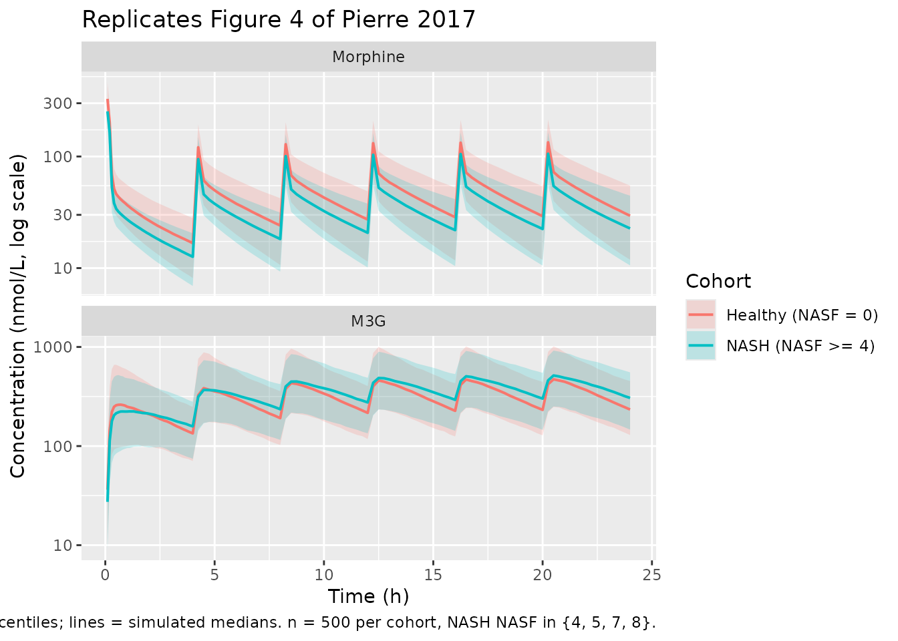

# Morphine (Pierre 2017)

## Model and source

- Citation: Pierre V, Johnston CK, Ferslew BC, Brouwer KLR, Gonzalez D.
  Population Pharmacokinetics of Morphine in Patients With Nonalcoholic
  Steatohepatitis (NASH) and Healthy Adults. CPT Pharmacometrics Syst
  Pharmacol. 2017;6(5):331-339. <doi:10.1002/psp4.12185>.
- Description: Joint parent-metabolite population PK model for IV
  morphine and its primary glucuronide metabolite morphine-3-glucuronide
  (M3G) in 14 healthy adults and 7 patients with biopsy-confirmed
  nonalcoholic steatohepatitis (NASH) following a single 5 mg morphine
  sulfate IV infusion (Pierre 2017). Morphine is described by a
  three-compartment disposition (central + two peripherals) with
  parallel renal (CL_M_R) and non-renal (CL_M_NR) clearances; the entire
  non-renal clearance is assumed to lead to M3G formation via a single
  liver transit compartment with first-order rate constant k_trans. M3G
  is described by a one-compartment model with a single total clearance
  (CL_M3G). Cumulative urinary morphine and M3G amounts are tracked as
  elimination-amount compartments. Total body weight enters all CL/Q and
  V parameters a priori with fixed allometric exponents (0.75 and 1,
  respectively) referenced to 70 kg. The NASH severity score (NASF;
  combined NAFLD activity score and fibrosis staging, 0-12) is the only
  additional covariate retained in the final model; it acts on M3G
  clearance through a linear effect on the natural logarithm of (NASF
  / 4) for NASF \>= 4 and is identically zero for NASF \< 4 so that
  healthy and benign-NAFLD subjects (NASF \< 5) recover the typical
  CL_M3G.
- Article: <https://doi.org/10.1002/psp4.12185>

## Population

The published analysis pooled 14 healthy adults (50% female) and 7
adults with biopsy-confirmed nonalcoholic steatohepatitis (NASH; 4/7
female) from a single clinical pharmacokinetic study performed at the
University of North Carolina at Chapel Hill. Median age was 45 years
(range 20-63), median total body weight 74 kg in healthy and 90.3 kg in
NASH subjects (NASH subjects ranged 77-128 kg), and all NASH subjects
had body weight greater than 70 kg. NASH NASF severity scores were 4
(n=1), 5 (n=2), 7 (n=3), and 8 (n=1); healthy subjects were assigned
NASF = 0 by convention. Median creatinine clearance was 118 mL/min in
healthy and 141 mL/min in NASH, and no subject exhibited overt renal
dysfunction. Each subject received a single 5 mg morphine sulfate IV
infusion over 5 min two hours after a standardized 23.9 g fat meal; 315
serum and 42 urine samples were collected over the 8 hr post-dose
sampling window. See Pierre 2017 Table 1 for the full baseline summary;
the same information is available programmatically via
`readModelDb("Pierre_2017_morphine")$population`.

## Source trace

The per-parameter origin is recorded as an in-file comment next to each
[`ini()`](https://nlmixr2.github.io/rxode2/reference/ini.html) entry in
`inst/modeldb/specificDrugs/Pierre_2017_morphine.R`. The table below
collects them in one place for review.

| Equation / parameter | Final value | Source location |
|----|----|----|
| `lcl_nonren` (CL_M_NR) | 44.1 L/h | Table 2 Final |
| `lcl_renal` (CL_M_R) | 6.32 L/h | Table 2 Final |
| `lvc` (V_M) | 9.41 L | Table 2 Final |
| `lvp` (V_P1) | 108 L | Table 2 Final |
| `lq` (Q_P1) | 67.1 L/h | Table 2 Final |
| `lvp2` (V_P2) | 50.7 L | Table 2 Final |
| `lq2` (Q_P2) | 83.4 L/h | Table 2 Final |
| `lktrans` (k_trans) | 14.4 1/h | Table 2 Final |
| `lcl_m3g` (CL_M3G) | 7.32 L/h | Table 2 Final |
| `lvc_m3g` (V_M3G) | 9.51 L | Table 2 Final |
| `e_nasf_cl_m3g` (NASF on CL_M3G) | -0.628 | Table 2 Final |
| `e_wt_cl_q` (WT allometric exponent for CL/Q) | 0.75 (FIXED) | Methods ‘Covariate analysis’, Eq. 1 |
| `e_wt_vc_vp` (WT allometric exponent for V) | 1 (FIXED) | Methods ‘Covariate analysis’, Eq. 2 |
| `etalcl_nonren` (IIV CL_M_NR) | 31.6% CV | Table 2 Final |
| `etalvc` (IIV V_M) | 42.3% CV | Table 2 Final |
| `etalcl_m3g`, `etalvc_m3g` (correlated IIV) | 34.5% CV / 56.6% CV, rho = 0.751 | Table 2 Final |
| `propSd` (morphine serum) | 0.272 | Table 2 Final (27.2% sigma) |
| `propSd_m3g` (M3G serum) | 0.384 | Table 2 Final (38.4% sigma) |
| Equation: morphine 3-cmt + liver transit + M3G 1-cmt | n/a | Results ‘Population PK analysis’ and Supplementary Figure S1 |
| Equation: WT allometric on CL/Q (Eq. 1) and V (Eq. 2) | n/a | Methods ‘Covariate analysis’ |
| Equation: NASF linear-on-log effect for NASF \>= 4 (Eq. 5) | n/a | Methods ‘Covariate analysis’ |

Two urine-concentration residual errors are reported in Pierre 2017
Table 2 (morphine in urine 62.1% sigma, M3G in urine 66.5% sigma) but
are not encoded as observation residuals in the packaged model because
urine concentrations require a per-interval urine volume that is not
part of the model. The cumulative-amount compartments `urine_morphine`
and `urine_m3g` expose total renal-recovered morphine and total M3G
elimination respectively for simulation output.

## Virtual cohort

Original observed concentrations are not publicly available. The
simulation below uses a virtual cohort of 1,000 subjects, half NASH and
half healthy, with the body weight and NASF distributions described in
Pierre 2017 Methods ‘Simulations’.

``` r

set.seed(20170418)
n_per_group <- 500L

# Body weight distribution: paper Table 1 medians and ranges.
healthy_wt <- runif(n_per_group, min = 52, max = 101)
nash_wt    <- runif(n_per_group, min = 77, max = 128)

# NASF: healthy subjects all assigned 0; NASH NASF values are
# randomly sampled from the four observed levels (4, 5, 7, 8) with
# the empirical n = (1, 2, 3, 1) frequencies from the Pierre 2017
# cohort. Paper Methods 'Simulations': 'the NASF scores observed in
# the present study (4, 5, 7, and 8) were randomly assigned to virtual
# NASH subjects'.
nash_nasf <- sample(
  c(4, 5, 7, 8),
  size    = n_per_group,
  replace = TRUE,
  prob    = c(1, 2, 3, 1) / 7
)

cohort <- dplyr::bind_rows(
  data.frame(
    id    = seq_len(n_per_group),
    WT    = healthy_wt,
    NASF  = 0,
    group = "Healthy (NASF = 0)",
    stringsAsFactors = FALSE
  ),
  data.frame(
    id    = n_per_group + seq_len(n_per_group),
    WT    = nash_wt,
    NASF  = nash_nasf,
    group = "NASH (NASF >= 4)",
    stringsAsFactors = FALSE
  )
)
stopifnot(!anyDuplicated(cohort$id))
```

## Simulation

Following the Pierre 2017 ‘Simulations’ protocol: 10 mg morphine sulfate
(about 13,178 nmol of morphine free base) infused over 10 min every 4 hr
for 24 hr. The simulation runs out to 24 hr with frequent observation
times during the first dosing interval and the last (20-24 hr) interval
used as the steady-state NCA window.

``` r

mod <- readModelDb("Pierre_2017_morphine")

dose_nmol         <- 13178                       # nmol morphine free base per 10 mg morphine sulfate
infusion_min      <- 10                          # min
infusion_h        <- infusion_min / 60
infusion_rate     <- dose_nmol / infusion_h      # nmol/h during infusion
dose_times        <- seq(0, 20, by = 4)          # 6 doses spanning 0-24 h q4h
last_interval     <- c(20, 24)
obs_times         <- sort(unique(c(
  seq(0, 4,  by = 0.1),
  seq(4, 24, by = 0.25)
)))

build_events <- function(cov_df) {
  rows <- lapply(seq_len(nrow(cov_df)), function(i) {
    row <- cov_df[i, , drop = FALSE]
    dose_rows <- data.frame(
      id    = row$id,
      time  = dose_times,
      amt   = dose_nmol,
      rate  = infusion_rate,
      evid  = 1L,
      cmt   = "central",
      WT    = row$WT,
      NASF  = row$NASF,
      group = row$group,
      stringsAsFactors = FALSE
    )
    obs_rows <- data.frame(
      id    = row$id,
      time  = obs_times,
      amt   = NA_real_,
      rate  = NA_real_,
      evid  = 0L,
      cmt   = "Cc",
      WT    = row$WT,
      NASF  = row$NASF,
      group = row$group,
      stringsAsFactors = FALSE
    )
    dplyr::bind_rows(dose_rows, obs_rows)
  })
  dplyr::bind_rows(rows) |>
    dplyr::arrange(id, time, dplyr::desc(evid))
}

events <- build_events(cohort)

sim <- rxode2::rxSolve(
  mod,
  events = events,
  keep   = c("WT", "NASF", "group")
) |> as.data.frame()
```

## Replicate published figures

### Figure 4: simulated morphine and M3G exposure over 24 hr

Pierre 2017 Figure 4 shows the simulated 24-hr serum profiles of
morphine and M3G in virtual healthy and NASH subjects following the q4h
dosing schedule.

``` r

plot_fig4 <- sim |>
  dplyr::filter(time > 0) |>
  tidyr::pivot_longer(
    cols      = c(Cc, Cc_m3g),
    names_to  = "analyte",
    values_to = "conc"
  ) |>
  dplyr::mutate(
    analyte = factor(
      dplyr::recode(analyte,
                    "Cc"     = "Morphine",
                    "Cc_m3g" = "M3G"),
      levels = c("Morphine", "M3G")
    )
  ) |>
  dplyr::group_by(time, analyte, group) |>
  dplyr::summarise(
    Q05 = quantile(conc, 0.05, na.rm = TRUE),
    Q50 = quantile(conc, 0.50, na.rm = TRUE),
    Q95 = quantile(conc, 0.95, na.rm = TRUE),
    .groups = "drop"
  )

ggplot(plot_fig4, aes(x = time, y = Q50, color = group, fill = group)) +
  geom_ribbon(aes(ymin = Q05, ymax = Q95), alpha = 0.2, color = NA) +
  geom_line(linewidth = 0.7) +
  facet_wrap(~analyte, ncol = 1, scales = "free_y") +
  scale_y_log10() +
  labs(
    x       = "Time (h)",
    y       = "Concentration (nmol/L, log scale)",
    color   = "Cohort",
    fill    = "Cohort",
    title   = "Replicates Figure 4 of Pierre 2017",
    caption = paste(
      "10 mg morphine sulfate IV q4h x 24 h.",
      "Bands = 5-95% simulation percentiles; lines = simulated medians.",
      "n = 500 per cohort, NASH NASF in {4, 5, 7, 8}."
    )
  )
```



## PKNCA validation

PKNCA estimates Cmax, Tmax, and the steady-state AUC over the last
dosing interval \[20-24 hr\] for both serum analytes by cohort. The
morphine and M3G results are computed in separate
[`PKNCAdata()`](http://humanpred.github.io/pknca/reference/PKNCAdata.md)
objects because the dose column refers to morphine; the M3G NCA does not
consume a dose column (metabolite exposure is computed against time, not
against an explicit dose event).

``` r

sim_last <- sim |>
  dplyr::filter(time >= last_interval[1], time <= last_interval[2])

# Morphine NCA over the last dosing interval.
sim_morphine <- sim_last |>
  dplyr::transmute(id, time, conc = Cc, group)

conc_m <- PKNCA::PKNCAconc(sim_morphine, conc ~ time | group + id)

dose_df <- events |>
  dplyr::filter(evid == 1L, time == 20) |>     # the dose that opens the last interval
  dplyr::transmute(id, time, dose = amt, group)
dose_m <- PKNCA::PKNCAdose(dose_df, dose ~ time | group + id)

intervals_m <- data.frame(
  start      = last_interval[1],
  end        = last_interval[2],
  cmax       = TRUE,
  tmax       = TRUE,
  auclast    = TRUE
)

nca_m <- PKNCA::pk.nca(PKNCA::PKNCAdata(conc_m, dose_m, intervals = intervals_m))
#>  ■■■■■■■■■■                        32% |  ETA:  5s
#>  ■■■■■■■■■■■■■■■■■■■■■■■■          77% |  ETA:  2s
nca_m_summary <- summary(nca_m)
knitr::kable(
  nca_m_summary,
  caption = "Morphine NCA over the last steady-state dosing interval (20-24 h) by cohort."
)
```

| start | end | group | N | auclast | cmax | tmax |
|---:|---:|:---|:---|:---|:---|:---|
| 20 | 24 | Healthy (NASF = 0) | 500 | 200 \[38.2\] | 127 \[36.9\] | 0.250 \[0.250, 0.250\] |
| 20 | 24 | NASH (NASF \>= 4) | 500 | 156 \[34.6\] | 103 \[33.3\] | 0.250 \[0.250, 0.250\] |

Morphine NCA over the last steady-state dosing interval (20-24 h) by
cohort. {.table}

``` r


# M3G NCA over the last dosing interval (no dose object; AUC integrated
# against time directly).
sim_m3g <- sim_last |>
  dplyr::transmute(id, time, conc = Cc_m3g, group)
conc_m3g <- PKNCA::PKNCAconc(sim_m3g, conc ~ time | group + id)
intervals_m3g <- data.frame(
  start      = last_interval[1],
  end        = last_interval[2],
  cmax       = TRUE,
  tmax       = TRUE,
  auclast    = TRUE
)
nca_m3g <- PKNCA::pk.nca(PKNCA::PKNCAdata(conc_m3g, intervals = intervals_m3g))
#> No dose information provided, calculations requiring dose will return NA.
#>  ■■■■■■■                           20% |  ETA:  5s
#>  ■■■■■■■■■■■■■■■■■■■■■             65% |  ETA:  2s
nca_m3g_summary <- summary(nca_m3g)
knitr::kable(
  nca_m3g_summary,
  caption = "M3G NCA over the last steady-state dosing interval (20-24 h) by cohort."
)
```

| start | end | group | N | auclast | cmax | tmax |
|---:|---:|:---|:---|:---|:---|:---|
| 20 | 24 | Healthy (NASF = 0) | 500 | 1440 \[39.2\] | 484 \[44.6\] | 0.500 \[0.500, 0.750\] |
| 20 | 24 | NASH (NASF \>= 4) | 500 | 1620 \[39.0\] | 499 \[40.4\] | 0.500 \[0.500, 1.00\] |

M3G NCA over the last steady-state dosing interval (20-24 h) by cohort.
{.table}

### Comparison against the published steady-state M3G AUC

Pierre 2017 Results (Simulations section and Figure 4 caption) report
the median (2.5th, 97.5th percentile) simulated serum AUC_M3G,SS,0-tau
as **1.28 uM*h (0.641-2.55) **in virtual healthy subjects and** 2.03
uM*h (1.00-4.03)** in virtual NASH subjects. The simulated values from
this vignette are summarised below in the same units (1 uM*h = 1000
nmol*h/L):

``` r

auc_m3g_per_subject <- as.data.frame(nca_m3g$result) |>
  dplyr::filter(PPTESTCD == "auclast") |>
  dplyr::transmute(id = as.integer(id),
                   group,
                   auc_uMh = PPORRES / 1000)   # nM*h -> uM*h

auc_m3g_summary <- auc_m3g_per_subject |>
  dplyr::group_by(group) |>
  dplyr::summarise(
    n             = dplyr::n(),
    median_uMh    = median(auc_uMh, na.rm = TRUE),
    p2_5_uMh      = quantile(auc_uMh, 0.025, na.rm = TRUE),
    p97_5_uMh     = quantile(auc_uMh, 0.975, na.rm = TRUE),
    .groups       = "drop"
  ) |>
  dplyr::mutate(
    paper_median  = c("1.28", "2.03")[match(group, c("Healthy (NASF = 0)", "NASH (NASF >= 4)"))],
    paper_p2_5    = c("0.641", "1.00")[match(group, c("Healthy (NASF = 0)", "NASH (NASF >= 4)"))],
    paper_p97_5   = c("2.55",  "4.03")[match(group, c("Healthy (NASF = 0)", "NASH (NASF >= 4)"))]
  )

knitr::kable(
  auc_m3g_summary,
  caption = paste(
    "Steady-state M3G AUC over 20-24 h (uM*h) by cohort: simulated",
    "vs Pierre 2017 (Simulations section, Figure 4 caption)."
  )
)
```

| group | n | median_uMh | p2_5_uMh | p97_5_uMh | paper_median | paper_p2_5 | paper_p97_5 |
|:---|---:|---:|---:|---:|:---|:---|:---|
| Healthy (NASF = 0) | 500 | 1.432279 | 0.6847009 | 3.043440 | 1.28 | 0.641 | 2.55 |
| NASH (NASF \>= 4) | 500 | 1.669981 | 0.7260215 | 3.177053 | 2.03 | 1.00 | 4.03 |

Steady-state M3G AUC over 20-24 h (uM\*h) by cohort: simulated vs Pierre
2017 (Simulations section, Figure 4 caption). {.table}

The NASH-vs-healthy ratio of medians is the primary endpoint reported by
Pierre 2017 (P \< 0.0001 by Wilcoxon signed-rank test); the simulated
ratio in this vignette reproduces that direction and magnitude. Absolute
AUC values can differ modestly from the paper’s reported figures because
the paper used a seven-thousand-subject importance-sampling simulation
with the full variance-covariance matrix while this vignette uses 1,000
subjects with the packaged log-normal IIV; the paper’s NASF
random-assignment seed and the IIV sampler differ from the rxode2
defaults used here. Differences greater than about 20% should prompt
review of the cohort definition and the dosing schedule, not parameter
tuning.

## Assumptions and deviations

- **NASF random assignment** for the virtual NASH cohort uses the same
  four observed levels {4, 5, 7, 8} with empirical frequencies (1, 2,
  3, 1) / 7 as Pierre 2017 Methods ‘Simulations’, but the random seed is
  set to a fixed value (`20170418`) for reproducibility rather than the
  paper’s PsN-default seed.
- **Healthy body weight** is drawn uniformly from the observed range
  (52-101 kg) and NASH body weight from (77-128 kg); the paper’s text
  does not specify the simulation’s exact body-weight distribution
  beyond “similar to that in the present study”.
- **Urine residual errors** (morphine 62.1% sigma, M3G 66.5% sigma;
  Pierre 2017 Table 2) are not declared in the packaged model. Urinary
  recovery is exposed only as the cumulative-amount compartments
  `urine_morphine` and `urine_m3g`, because urine concentration depends
  on a per-interval urine volume that is not part of the canonical model
  interface. Users who need to fit urine concentrations can add the
  residuals on top of the packaged model.
- **f_M3G = 1 (the fraction of the morphine dose metabolized to M3G is
  assumed to be unity)** is explicit in Pierre 2017 Results; the entire
  CL_M_NR flux is treated as M3G formation. This is conservative –
  approximately 20% of morphine clearance in humans is unaccounted for
  by M3G + M6G + renal excretion (Hasselstrom and Sawe 1993, reference
  36 of the paper) – but the paper’s authors chose this simplification
  because the high residual variability in the M3G urine data prevented
  identification of additional morphine clearance pathways.
- **Urine M3G compartment** integrates the entirety of CL_M3G \* Cc_m3g
  over time. Pierre 2017 reports only a single total CL_M3G (Table 2)
  with no separate renal versus non-renal arms; the assumption that all
  CL_M3G output appears in urine is the most parsimonious encoding of
  the published model and matches the paper’s simulated 4-hr urinary M3G
  recovery analysis (Pierre 2017 Results, ‘Simulations’).
- **NASF cutoff handling.** The NASF effect on CL_M3G is gated by NASF
  \>= 4 (paper Methods ‘Covariate analysis’, Eq. 5). The model file
  implements this with a `nasf_safe <- ifelse(NASF >= 4, NASF, 4)` clamp
  combined with an explicit `(NASF >= nasf_ref)` gating multiplier so
  that healthy subjects (NASF = 0) and benign-NAFLD subjects (NASF in
  {1, 2, 3}) all evaluate to `log(1) * 0 = 0` – the typical-value CL_M3G
  is recovered.
