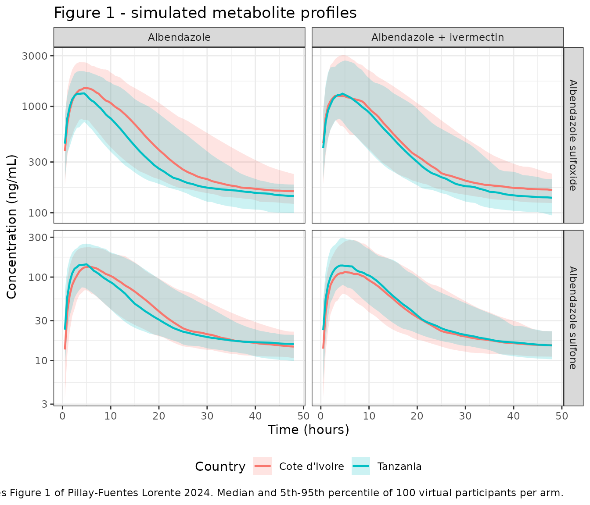
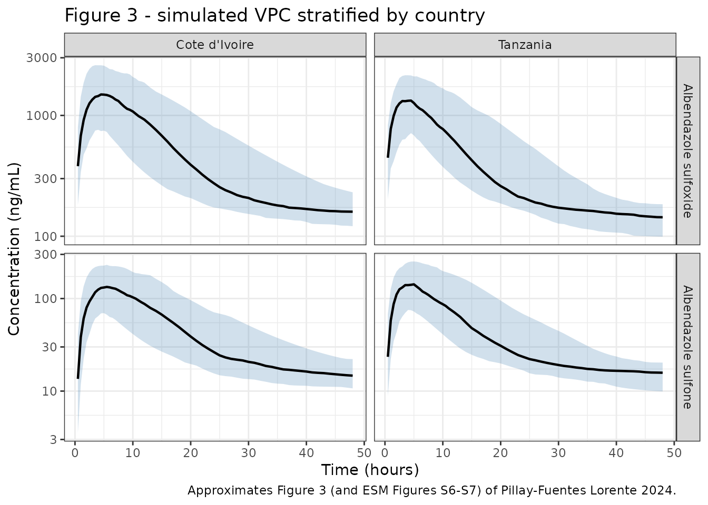
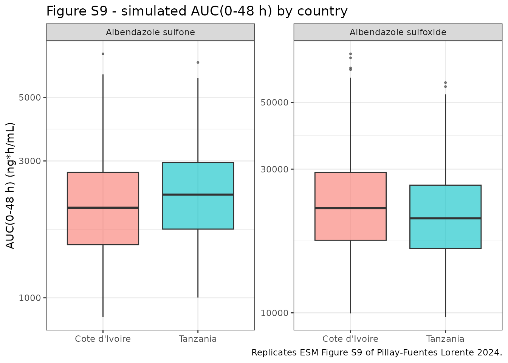

# Albendazole metabolites (Pillay-Fuentes Lorente 2024)

## Model and source

- Citation: Pillay-Fuentes Lorente V, Nwogu-Attah JN, Steffens B, Bram
  D, Sprecher V, Hofmann D, Buettcher M, Pillai G, Mouksassi S,
  Coulibaly J, Pfister M, Keiser J. Understanding Drug Exposure and
  Trichuris trichiura Cure Rates: A Pharmacometric Approach for
  Albendazole-Ivermectin Co-medication in Tanzania and Cote d’Ivoire.
  Drugs R D. 2024;24(2):205-215. <doi:10.1007/s40268-024-00476-4>.
- Description: Joint population PK model for the two main albendazole
  metabolites after a single oral 400 mg albendazole dose (with or
  without co-administered ivermectin) in adolescents infected with
  Trichuris trichiura in Tanzania and Cote d’Ivoire: Savic
  transit-compartment absorption feeding a two-compartment albendazole
  sulfoxide disposition that converts quantitatively to a
  one-compartment albendazole sulfone, with a study-population (country)
  effect on both apparent clearances
- Article: [Drugs R D.
  2024;24(2):205-215](https://doi.org/10.1007/s40268-024-00476-4)

Albendazole is rapidly and almost completely pre-systemically
metabolised, so the parent drug is barely measurable in plasma. The
published final model therefore carries no albendazole state at all: up
to 35% of the albendazole concentrations were below the limit of
quantification and including them did not give an acceptable fit
(Results 3.2). Instead, the 400 mg albendazole dose is routed through a
Savic transit-compartment absorption chain straight into a
two-compartment albendazole **sulfoxide** disposition, and everything
cleared from the sulfoxide central compartment appears as albendazole
**sulfone** in a one-compartment disposition. Both conversions are
assumed quantitative (Fig. 2 caption: “Assumed 100% conversion of ALB to
ALB-OX and total conversion of ALB-OX to ALB-ON”).

The single covariate retained in the final model is the study population
(Tanzania versus Cote d’Ivoire). Co-administered ivermectin - the
paper’s primary hypothesis - was tested on both apparent clearances and
**rejected** (inclusion raised the corrected BIC by 9.07).

## Population

The analysis pooled 227 concentration records from 44 adolescents aged
12-19 years infected with *Trichuris trichiura*, drawn from two phase
III trials (Methods 2.1, Results 3.1). Twenty-seven participants were
enrolled in Tanzania (Pemba Island; mean age 15.8 years, SD 1.37; mean
weight 51.8 kg, SD 8.18; 44.4% female) and 17 in Cote d’Ivoire (mean age
14.6 years, SD 1.86; mean weight 44.4 kg, SD 9.52; 47.1% female) (Table
1). All participants received a single oral albendazole 400 mg dose
after a high-fat meal, either alone (20 of 44) or with a single oral
ivermectin 200 ug/kg dose (24 of 44).

The two cohorts contribute different parts of the concentration-time
profile, which matters for how much each parameter is informed by data:

| Cohort | n | Sampling times (h post-dose) | Phase captured |
|----|----|----|----|
| Cote d’Ivoire | 17 | 1, 2, 4, 6, 8, 22, 27 | absorption + early elimination |
| Tanzania | 27 | 6, 21, 27, 48 | elimination only |

The same information is available programmatically via the model’s
`population` metadata
(`readModelDb("PillayFuentesLorente_2024_albendazole")()$population`).

## Source trace

Every `ini()` entry carries an in-file comment pointing at its source
location in
`inst/modeldb/specificDrugs/PillayFuentesLorente_2024_albendazole.R`.
They are collected here for review. All population, covariate,
random-effect and residual values come from Table 2 of the paper; the
structural equations come from Fig. 2 and Methods 2.2-2.3.

| Equation / parameter | Value | Source location |
|----|----|----|
| `lka` (ka) | 0.2 1/h, fixed | Table 2, “Absorption rate constant, \[Ka (h-1)\] = 0.2 (fix)”; Results 3.2 |
| `lktr` (Ktr) | 0.12 1/h (estimated, RSE 6.01%; `fixed()` here - see Assumptions) | Table 2, “Transit rate constant, \[Ktr (h-1)\]” |
| `lmtt` (Mtt) | 0.095 h (estimated, RSE 8.72%; `fixed()` here - see Assumptions) | Table 2, “Mean transit time, \[Mtt (h)\]” |
| `lcl` (Clox/F) | 2.09 L/h (RSE 5.62%) | Table 2, “Clearance of albendazole sulfoxide, \[Clox (L h-1)\]” |
| `lvc` (Vox/F) | 81.81 L (RSE 10.8%) | Table 2, “Volume of albendazole sulfoxide in the CC, \[Vox (L)\]” |
| `lq` (Qox/F) | 20.85 L/h (RSE 11.30%) | Table 2, “Intercompartmental clearance for sulfoxide, \[Qox (L h-1)\]” |
| `lvp` (Pvox/F) | 1931.53 L (RSE 5.61%) | Table 2, “Volume of sulfoxide in the PC, \[Pvox (L)\]” |
| `lcl_abzson` (Clon/F) | 22.87 L/h (RSE 5.38%) | Table 2, “Clearance of albendazole sulfone, \[Clon (L h-1)\]” |
| `lvc_abzson` (Von/F) | 11.51 L (RSE 26.9%) | Table 2, “Volume of albendazole sulfone in the CC, \[Von (L)\]” |
| `e_region_tanzania_cl` | 0.56 (RSE 18.2%) | Table 2, “Clox-Country (Tanzania)”; applied per Methods 2.3 Eq. 2 |
| `e_region_tanzania_cl_abzson` | 0.38 (RSE 17.5%) | Table 2, “Clon-Country (Tanzania)”; applied per Methods 2.3 Eq. 2 |
| `etalvc` | omega 0.52 (RSE 16.0%) -\> var 0.2704 | Table 2, “BSV on volume of ALB-OX in the CP” |
| `etalcl` | omega 0.11 (RSE 33.3%) -\> var 0.0121 | Table 2, “Variability on clearance of ALB-OX in the CP” |
| `etalq` | omega 0.69 (RSE 12.3%) -\> var 0.4761 | Table 2, “Variability on intercompartmental clearance of ALB-OX” |
| `etalvp` | omega 0.16 (RSE 30.3%) -\> var 0.0256 | Table 2, “Variability on volume of ALB-OX in the PC” |
| `etalvc_abzson` | omega 0.90 (RSE 22.4%) -\> var 0.81 | Table 2, “Variability on volume of ALB-ON in the CP” |
| `propSd` | 0.43 (RSE 6.18%) | Table 2, “Residual variability / Sulfoxide, proportional” (first row) |
| `propSd_Cc_abzson` | 0.22 (RSE 6.75%) | Table 2, second residual row (label repeats “Sulfoxide”; see Errata) |
| transit -\> depot -\> ka -\> sulfoxide central | n/a | Fig. 2 structural scheme |
| sulfoxide central \<-\> sulfoxide peripheral (Qox) | n/a | Fig. 2 structural scheme |
| sulfoxide central –CLox–\> sulfone central | n/a | Fig. 2 scheme + caption (“total conversion of ALB-OX to ALB-ON”) |
| exponential categorical covariate form | n/a | Methods 2.3 Eq. 2 |
| lognormal IIV distribution | n/a | Methods 2.2 |
| proportional residual error | n/a | Results 3.2 |

### Covariate-effect arithmetic

The two covariate coefficients are on the log scale (Methods 2.3 Eq. 2),
so the percentages quoted throughout the paper should be recovered by
exponentiating them. This is a direct check that the coefficients were
transcribed and applied correctly.

``` r

tibble::tibble(
  Parameter = c("Clox (albendazole sulfoxide)", "Clon (albendazole sulfone)"),
  Coefficient = c(0.56, 0.38),
  `Fold-change in Tanzania` = round(exp(c(0.56, 0.38)), 4),
  `Implied % higher` = round(100 * (exp(c(0.56, 0.38)) - 1), 1),
  `Paper states` = c("75% higher", "46% higher")
) |>
  knitr::kable(caption = "Table 2 covariate coefficients versus the percentages quoted in the Abstract, Key Points, Results 3.3 and Discussion.")
```

| Parameter | Coefficient | Fold-change in Tanzania | Implied % higher | Paper states |
|:---|---:|---:|---:|:---|
| Clox (albendazole sulfoxide) | 0.56 | 1.7507 | 75.1 | 75% higher |
| Clon (albendazole sulfone) | 0.38 | 1.4623 | 46.2 | 46% higher |

Table 2 covariate coefficients versus the percentages quoted in the
Abstract, Key Points, Results 3.3 and Discussion. {.table}

## Virtual cohort

The original observed data are not publicly available. The simulations
below use virtual cohorts matching the paper’s 2 (country) x 2
(medication) design, which is exactly the panel layout of Fig. 1.
Because co-medication was **not** retained as a covariate, the two
medication arms within a country are drawn from the same model; the fact
that their simulated profiles coincide is itself the paper’s central
negative finding.

``` r

set.seed(20240722)

n_per_arm <- 100L

obs_times <- c(seq(0, 12, by = 0.5), seq(13, 48, by = 1))

make_arm <- function(n, region_tanzania, country, medication, id_offset = 0L) {
  subj <- tibble::tibble(
    id = id_offset + seq_len(n),
    REGION_TANZANIA = region_tanzania,
    country = country,
    medication = medication
  )
  dose <- subj |>
    dplyr::mutate(time = 0, amt = 400, evid = 1L,
                  cmt = "depot", dvid = NA_integer_)
  # Observation rows point at the ODE STATE names (never at the observable
  # names Cc / Cc_abzson) and carry the dvid that selects the endpoint.
  obs_sox <- subj |>
    tidyr::crossing(time = obs_times) |>
    dplyr::mutate(amt = NA_real_, evid = 0L,
                  cmt = "central", dvid = 1L)
  obs_son <- subj |>
    tidyr::crossing(time = obs_times) |>
    dplyr::mutate(amt = NA_real_, evid = 0L,
                  cmt = "central_abzson", dvid = 2L)
  dplyr::bind_rows(dose, obs_sox, obs_son) |>
    dplyr::arrange(id, time)
}

events <- dplyr::bind_rows(
  make_arm(n_per_arm, 0L, "Cote d'Ivoire", "Albendazole",              id_offset =   0L),
  make_arm(n_per_arm, 0L, "Cote d'Ivoire", "Albendazole + ivermectin", id_offset = 100L),
  make_arm(n_per_arm, 1L, "Tanzania",      "Albendazole",              id_offset = 200L),
  make_arm(n_per_arm, 1L, "Tanzania",      "Albendazole + ivermectin", id_offset = 300L)
)

# Disjoint IDs across arms (duplicate IDs are silently merged by rxSolve).
stopifnot(!anyDuplicated(unique(events[, c("id", "time", "evid", "cmt")])))
stopifnot(dplyr::n_distinct(events$id) == 4L * n_per_arm)
```

## Simulation

``` r

mod <- readModelDb("PillayFuentesLorente_2024_albendazole")

sim <- rxode2::rxSolve(
  mod,
  events = events,
  keep = c("country", "medication", "REGION_TANZANIA"),
  # rxode2's ODE -> linCmt auto-conversion can corrupt the dvid -> cmt mapping
  # for multi-output models; disable it defensively.
  useLinCmt = FALSE
) |>
  as.data.frame()
#> ℹ parameter labels from comments will be replaced by 'label()'

# One row per (id, time) carries both observables, so de-duplicate the two
# endpoint rows before summarising.
sim_wide <- sim |>
  dplyr::distinct(id, time, .keep_all = TRUE) |>
  # rxSolve returns `id` as a factor; coerce back to the integer key used by
  # `events` so the PKNCA conc / dose grouping variables line up.
  dplyr::mutate(id = as.integer(as.character(id)))

stopifnot(dplyr::n_distinct(sim_wide$id) == 4L * n_per_arm)
```

## Replicate published figures

### Figure 1 - concentration-time profiles by medication and country

Fig. 1 of the paper plots the observed individual profiles of both
metabolites on a log scale, faceted by medication and coloured by
country. The simulated equivalent below shows the median and 5th-95th
percentile band of the virtual cohorts. The observed data ranged roughly
from 10 to just above 1000 ng/mL for albendazole sulfoxide and from
about 3 to 100 ng/mL for albendazole sulfone.

``` r

# Replicates Figure 1 of Pillay-Fuentes Lorente 2024. The time-zero record is
# excluded from the PLOT only (both concentrations are exactly 0 pre-dose and
# the y axis is log-scaled); the PKNCA section below keeps it.
plot_times <- obs_times[obs_times > 0]

prof <- sim_wide |>
  dplyr::filter(time %in% plot_times) |>
  dplyr::select(id, time, country, medication,
                `Albendazole sulfoxide` = Cc,
                `Albendazole sulfone` = Cc_abzson) |>
  tidyr::pivot_longer(
    cols = c("Albendazole sulfoxide", "Albendazole sulfone"),
    names_to = "analyte", values_to = "conc"
  ) |>
  dplyr::mutate(
    conc_ngml = 1000 * conc,
    analyte = factor(analyte,
                     levels = c("Albendazole sulfoxide", "Albendazole sulfone"))
  ) |>
  dplyr::group_by(analyte, medication, country, time) |>
  dplyr::summarise(
    Q05 = quantile(conc_ngml, 0.05),
    Q50 = quantile(conc_ngml, 0.50),
    Q95 = quantile(conc_ngml, 0.95),
    .groups = "drop"
  )

ggplot(prof, aes(time, Q50, colour = country, fill = country)) +
  geom_ribbon(aes(ymin = Q05, ymax = Q95), alpha = 0.2, colour = NA) +
  geom_line(linewidth = 0.8) +
  facet_grid(analyte ~ medication, scales = "free_y") +
  scale_y_log10() +
  labs(x = "Time (hours)", y = "Concentration (ng/mL)",
       colour = "Country", fill = "Country",
       title = "Figure 1 - simulated metabolite profiles",
       caption = paste("Replicates Figure 1 of Pillay-Fuentes Lorente 2024.",
                       "Median and 5th-95th percentile of", n_per_arm,
                       "virtual participants per arm.")) +
  theme_bw() +
  theme(legend.position = "bottom")
```



The two medication columns are identical by construction: co-medication
was tested and rejected as a covariate (Results 3.3), so the model has
no ivermectin term. This reproduces the paper’s headline negative
result.

### Figure 3 - visual predictive check by country

Fig. 3 shows prediction-corrected VPCs of both metabolite models in
semi-log format, and Figs. S6-S7 of the ESM stratify them by country.
Prediction correction requires the observed data, which are not public,
so the panel below is an uncorrected simulated VPC stratified by
country.

``` r

# Approximates Figure 3 / ESM Figures S6-S7 of Pillay-Fuentes Lorente 2024.
prof |>
  dplyr::filter(medication == "Albendazole") |>
  ggplot(aes(time, Q50)) +
  geom_ribbon(aes(ymin = Q05, ymax = Q95), alpha = 0.25, fill = "steelblue") +
  geom_line(linewidth = 0.8) +
  facet_grid(analyte ~ country, scales = "free_y") +
  scale_y_log10() +
  labs(x = "Time (hours)", y = "Concentration (ng/mL)",
       title = "Figure 3 - simulated VPC stratified by country",
       caption = "Approximates Figure 3 (and ESM Figures S6-S7) of Pillay-Fuentes Lorente 2024.") +
  theme_bw()
```



### Figure S9 - simulated AUC(0-48 h) by country

Results 3.5 states: “The median of simulated AUC from 0 to 48 h was
slightly lower in Tanzania than Cote d’Ivoire, which is in line with the
higher clearance seen in Tanzania.” That is the one quantitative claim
attached to the model-based simulations, so it is a direct validation
target. ESM Fig. S9 is not on disk, so only the direction and rough
magnitude can be checked.

The country contrast is simulated with **common random numbers**: the
same 200 virtual participants are solved twice, once with
`REGION_TANZANIA = 0` and once with `REGION_TANZANIA = 1`, so every
subject is its own control and the comparison carries no Monte Carlo
noise. Drawing two independent cohorts would blur a roughly 10%
covariate signal behind sampling variation in the median.

``` r

# Replicates ESM Figure S9 of Pillay-Fuentes Lorente 2024 (AUC0-48 by country).
paired_n <- 200L

make_paired <- function(region_tanzania, country) {
  subj <- tibble::tibble(id = seq_len(paired_n),
                         REGION_TANZANIA = region_tanzania,
                         country = country)
  dplyr::bind_rows(
    subj |> dplyr::mutate(time = 0, amt = 400, evid = 1L,
                          cmt = "depot", dvid = NA_integer_),
    subj |> tidyr::crossing(time = obs_times) |>
      dplyr::mutate(amt = NA_real_, evid = 0L, cmt = "central", dvid = 1L),
    subj |> tidyr::crossing(time = obs_times) |>
      dplyr::mutate(amt = NA_real_, evid = 0L, cmt = "central_abzson", dvid = 2L)
  ) |>
    dplyr::arrange(id, time)
}

solve_paired <- function(region_tanzania, country) {
  # Reseed INSIDE the helper so both country solves draw the identical etas.
  rxode2::rxSetSeed(20240722)
  set.seed(20240722)
  rxode2::rxSolve(mod, events = make_paired(region_tanzania, country),
                  keep = c("country", "REGION_TANZANIA"),
                  useLinCmt = FALSE) |>
    as.data.frame() |>
    dplyr::distinct(id, time, .keep_all = TRUE) |>
    dplyr::mutate(id = as.integer(as.character(id)))
}

sim_paired <- dplyr::bind_rows(
  solve_paired(0L, "Cote d'Ivoire"),
  solve_paired(1L, "Tanzania")
)

# The paired design is only valid if the two solves really did share etas:
# with common random numbers every subject's cl ratio must equal exp(0.56)
# exactly, and every cl_abzson ratio must equal exp(0.38) exactly.
ratio_check <- sim_paired |>
  dplyr::distinct(id, country, cl, cl_abzson) |>
  tidyr::pivot_wider(id_cols = id, names_from = country,
                     values_from = c(cl, cl_abzson))
stopifnot(
  nrow(ratio_check) == paired_n,
  max(abs(ratio_check$`cl_Tanzania` /
            ratio_check$`cl_Cote d'Ivoire` - exp(0.56))) < 1e-8,
  max(abs(ratio_check$`cl_abzson_Tanzania` /
            ratio_check$`cl_abzson_Cote d'Ivoire` - exp(0.38))) < 1e-8
)

auc48 <- sim_paired |>
  dplyr::group_by(id, country) |>
  dplyr::arrange(time, .by_group = TRUE) |>
  dplyr::summarise(
    auc_sox = 1000 * sum(diff(time) * (head(Cc, -1) + tail(Cc, -1)) / 2),
    auc_son = 1000 * sum(diff(time) * (head(Cc_abzson, -1) + tail(Cc_abzson, -1)) / 2),
    .groups = "drop"
  )

auc48_long <- auc48 |>
  tidyr::pivot_longer(c(auc_sox, auc_son),
                      names_to = "analyte", values_to = "auc") |>
  dplyr::mutate(analyte = ifelse(analyte == "auc_sox",
                                 "Albendazole sulfoxide", "Albendazole sulfone"))

ggplot(auc48_long, aes(country, auc, fill = country)) +
  geom_boxplot(alpha = 0.6, outlier.size = 0.6) +
  facet_wrap(~analyte, scales = "free_y") +
  scale_y_log10() +
  labs(x = NULL, y = "AUC(0-48 h) (ng*h/mL)",
       title = "Figure S9 - simulated AUC(0-48 h) by country",
       caption = "Replicates ESM Figure S9 of Pillay-Fuentes Lorente 2024.") +
  theme_bw() +
  theme(legend.position = "none")
```



``` r


auc48_long |>
  tidyr::pivot_wider(id_cols = c(id, analyte),
                     names_from = country, values_from = auc) |>
  dplyr::group_by(analyte) |>
  dplyr::summarise(
    `Median AUC, Cote d'Ivoire (ng*h/mL)` = round(median(`Cote d'Ivoire`)),
    `Median AUC, Tanzania (ng*h/mL)`      = round(median(Tanzania)),
    `Median within-subject ratio (TZA/CIV)` =
      round(median(Tanzania / `Cote d'Ivoire`), 3),
    .groups = "drop"
  ) |>
  dplyr::rename(Analyte = analyte) |>
  knitr::kable(caption = paste(
    "Simulated AUC(0-48 h) by country, from",
    paired_n,
    "virtual participants solved under both country settings with common random numbers."
  ))
```

| Analyte | Median AUC, Cote d’Ivoire (ng\*h/mL) | Median AUC, Tanzania (ng\*h/mL) | Median within-subject ratio (TZA/CIV) |
|:---|---:|---:|---:|
| Albendazole sulfone | 2061 | 2290 | 1.110 |
| Albendazole sulfoxide | 22272 | 20593 | 0.926 |

Simulated AUC(0-48 h) by country, from 200 virtual participants solved
under both country settings with common random numbers. {.table}

For albendazole sulfoxide the simulated median AUC(0-48 h) is lower in
Tanzania, matching Results 3.5. For albendazole **sulfone** the model
predicts the *opposite* direction; see the Errata section below, which
works through why the published structure necessarily implies this.

## PKNCA validation

NCA is run separately for each of the two model outputs, grouped by
country so the per-country contrast can be read directly. The paper
reports no NCA table of its own, so the comparison targets below are the
model-implied exposure identities and the concentration ranges visible
in Fig. 1.

``` r

nca_one <- function(sim_df, conc_col) {
  # select-with-rename in one step: renaming in place would collide with the
  # sibling observable column that is already called Cc.
  conc <- sim_df |>
    dplyr::select(id, time, country, Cc = dplyr::all_of(conc_col)) |>
    dplyr::filter(!is.na(Cc))

  # Guarantee a time = 0 row per (id, country); pre-dose extravascular Cc = 0.
  conc <- dplyr::bind_rows(
    conc,
    conc |> dplyr::distinct(id, country) |> dplyr::mutate(time = 0, Cc = 0)
  ) |>
    dplyr::distinct(id, country, time, .keep_all = TRUE) |>
    dplyr::arrange(id, country, time)

  dose_df <- events |>
    dplyr::filter(evid == 1L) |>
    dplyr::select(id, time, amt, country)

  intervals <- data.frame(
    start = 0, end = 48,
    cmax = TRUE, tmax = TRUE, auclast = TRUE, half.life = TRUE
  )

  PKNCA::pk.nca(PKNCA::PKNCAdata(
    PKNCA::PKNCAconc(conc, Cc ~ time | country + id),
    PKNCA::PKNCAdose(dose_df, amt ~ time | country + id),
    intervals = intervals
  ))
}

nca_sox <- nca_one(sim_wide, "Cc")
nca_son <- nca_one(sim_wide, "Cc_abzson")
```

``` r

summarise_nca <- function(res, analyte) {
  as.data.frame(res) |>
    dplyr::filter(PPTESTCD %in% c("cmax", "tmax", "auclast", "half.life")) |>
    dplyr::group_by(country, PPTESTCD) |>
    dplyr::summarise(median = median(PPORRES, na.rm = TRUE), .groups = "drop") |>
    dplyr::mutate(
      analyte = analyte,
      # Cc is in mg/L; report cmax and auclast in the paper's ng/mL units.
      median = dplyr::if_else(PPTESTCD %in% c("cmax", "auclast"),
                              1000 * median, median)
    )
}

nca_tbl <- dplyr::bind_rows(
  summarise_nca(nca_sox, "Albendazole sulfoxide"),
  summarise_nca(nca_son, "Albendazole sulfone")
) |>
  dplyr::mutate(PPTESTCD = factor(
    PPTESTCD,
    levels = c("cmax", "tmax", "auclast", "half.life"),
    labels = c("Cmax (ng/mL)", "Tmax (h)", "AUC(0-48 h) (ng*h/mL)", "t1/2 (h)")
  )) |>
  tidyr::pivot_wider(names_from = country, values_from = median) |>
  dplyr::arrange(analyte, PPTESTCD) |>
  dplyr::rename(Analyte = analyte, "NCA parameter" = PPTESTCD)

nca_tbl |>
  knitr::kable(digits = 2,
               caption = "Median PKNCA parameters over 0-48 h by analyte and country.")
```

| NCA parameter          | Analyte               | Cote d’Ivoire | Tanzania |
|:-----------------------|:----------------------|--------------:|---------:|
| Cmax (ng/mL)           | Albendazole sulfone   |        129.00 |   150.08 |
| Tmax (h)               | Albendazole sulfone   |          5.50 |     4.50 |
| AUC(0-48 h) (ng\*h/mL) | Albendazole sulfone   |       2246.10 |  2229.17 |
| t1/2 (h)               | Albendazole sulfone   |        197.07 |   254.95 |
| Cmax (ng/mL)           | Albendazole sulfoxide |       1486.23 |  1397.26 |
| Tmax (h)               | Albendazole sulfoxide |          4.50 |     4.00 |
| AUC(0-48 h) (ng\*h/mL) | Albendazole sulfoxide |      24163.78 | 20810.26 |
| t1/2 (h)               | Albendazole sulfoxide |        229.21 |   259.61 |

Median PKNCA parameters over 0-48 h by analyte and country. {.table}

The simulated **median** albendazole sulfoxide Cmax is about 1400-1500
ng/mL and the sulfone Cmax about 130-150 ng/mL. Both sit slightly
*above* the highest individual profiles visible in Fig. 1, which top out
near 1000-1300 ng/mL for the sulfoxide and near 100 ng/mL for the
sulfone. Two features of the design account for most of that gap, and
neither is an encoding choice:

- Predicted Tmax is 4-4.5 h. Only the Ivorian schedule brackets it (1,
  2, 4, 6, 8 h); the Tanzanian cohort’s first sample is at 6 h, already
  past the peak, so more than half the participants never observed a
  concentration near Tmax.
- The simulated cohort is sampled on a dense 0.5 h grid, so its Cmax is
  the true model maximum, whereas an observed Cmax can only ever be the
  largest of a handful of scheduled draws.

Nothing was tuned to close the gap: every value is exactly as tabulated
in Table 2. The paper’s own goodness-of-fit evidence is the
prediction-corrected VPC of Fig. 3, which cannot be reproduced without
the observed data, so the fit quality itself is not checkable here -
only that the published parameters have been transcribed and coupled
correctly, which the `Dose / CL` identity below establishes exactly.

The `t1/2` column is the apparent terminal half-life over the 0-48 h
sampling window, not the model’s true terminal half-life. The published
peripheral volume Pvox/F = 1931.53 L against Clox/F = 2.09 L/h implies a
genuine terminal half-life of several hundred hours, which is far
outside the 48 h observation window the model was fitted to. The paper
explicitly acknowledges this identifiability problem (Discussion: the
differing sampling schedules and the fixed ka “could explain the
difficulty in estimating the volume of distribution for albendazole
sulfoxide”).

### Exposure identity check: AUC(0-inf) = Dose / CL

For this structure both exposures have exact closed forms, which makes
them a strict test of the encoding rather than a soft plausibility
check:

- albendazole sulfoxide is eliminated only via `Clox`, so
  `AUC(0-inf)_sulfoxide = Dose / Clox`;
- the sulfone is formed quantitatively from that same elimination flux,
  so the amount of sulfone formed equals the dose and
  `AUC(0-inf)_sulfone = Dose / Clon`.

Both must hold separately in each country, so the check simultaneously
validates the two-compartment sulfoxide disposition, the 100%-conversion
coupling and the covariate encoding on both clearances.

``` r

mod_typ <- readModelDb("PillayFuentesLorente_2024_albendazole") |> rxode2::zeroRe()
#> ℹ parameter labels from comments will be replaced by 'label()'

# A long horizon with dense early sampling so lambda-z is estimated on the true
# terminal phase (the model's terminal half-life is several hundred hours).
long_times <- c(seq(0, 48, by = 0.25), seq(50, 3000, by = 10))

typ_subj <- tibble::tibble(
  id = c(1L, 2L),
  REGION_TANZANIA = c(0L, 1L),
  country = c("Cote d'Ivoire", "Tanzania"),
  medication = "Albendazole"
)

typ_events <- dplyr::bind_rows(
  typ_subj |>
    dplyr::mutate(time = 0, amt = 400, evid = 1L,
                  cmt = "depot", dvid = NA_integer_),
  typ_subj |>
    tidyr::crossing(time = long_times) |>
    dplyr::mutate(amt = NA_real_, evid = 0L, cmt = "central", dvid = 1L),
  typ_subj |>
    tidyr::crossing(time = long_times) |>
    dplyr::mutate(amt = NA_real_, evid = 0L, cmt = "central_abzson", dvid = 2L)
) |>
  dplyr::arrange(id, time)

sim_typ <- rxode2::rxSolve(mod_typ, events = typ_events,
                           keep = c("country", "REGION_TANZANIA"),
                           omega = NA, sigma = NA, useLinCmt = FALSE) |>
  as.data.frame() |>
  dplyr::distinct(id, time, .keep_all = TRUE) |>
  dplyr::mutate(id = as.integer(as.character(id)))

auc_inf <- function(df, col) {
  conc <- df |>
    dplyr::select(id, time, country, Cc = dplyr::all_of(col)) |>
    dplyr::filter(!is.na(Cc))
  dose_df <- typ_events |>
    dplyr::filter(evid == 1L) |>
    dplyr::select(id, time, amt, country)
  res <- PKNCA::pk.nca(PKNCA::PKNCAdata(
    PKNCA::PKNCAconc(conc, Cc ~ time | country + id),
    PKNCA::PKNCAdose(dose_df, amt ~ time | country + id),
    intervals = data.frame(start = 0, end = Inf, aucinf.obs = TRUE)
  ))
  as.data.frame(res) |>
    dplyr::filter(PPTESTCD == "aucinf.obs") |>
    dplyr::select(country, aucinf = PPORRES)
}

cl_civ <- 2.09
cl_tza <- 2.09 * exp(0.56)
cln_civ <- 22.87
cln_tza <- 22.87 * exp(0.38)

identity_tbl <- dplyr::bind_rows(
  auc_inf(sim_typ, "Cc") |>
    dplyr::mutate(Analyte = "Albendazole sulfoxide",
                  expected = 400 / c("Cote d'Ivoire" = cl_civ, "Tanzania" = cl_tza)[country]),
  auc_inf(sim_typ, "Cc_abzson") |>
    dplyr::mutate(Analyte = "Albendazole sulfone",
                  expected = 400 / c("Cote d'Ivoire" = cln_civ, "Tanzania" = cln_tza)[country])
) |>
  dplyr::transmute(
    Analyte,
    Country = country,
    `Simulated AUC(0-inf) (mg*h/L)` = round(aucinf, 3),
    `Dose / CL (mg*h/L)` = round(expected, 3),
    `Ratio` = round(aucinf / expected, 4)
  )

knitr::kable(identity_tbl,
             caption = "Simulated AUC(0-inf) versus the exact Dose / CL identity implied by the published structure.")
```

| Analyte | Country | Simulated AUC(0-inf) (mg\*h/L) | Dose / CL (mg\*h/L) | Ratio |
|:---|:---|---:|---:|---:|
| Albendazole sulfoxide | Cote d’Ivoire | 191.333 | 191.388 | 0.9997 |
| Albendazole sulfoxide | Tanzania | 109.313 | 109.322 | 0.9999 |
| Albendazole sulfone | Cote d’Ivoire | 17.486 | 17.490 | 0.9997 |
| Albendazole sulfone | Tanzania | 11.960 | 11.961 | 1.0000 |

Simulated AUC(0-inf) versus the exact Dose / CL identity implied by the
published structure. {.table}

``` r


# Hard gate: the identity must hold to within numerical / lambda-z tolerance.
stopifnot(all(abs(identity_tbl$Ratio - 1) < 0.002))
```

Both analytes recover `Dose / CL` in both countries, so the sulfoxide
disposition, the quantitative sulfoxide-to-sulfone coupling and the two
country effects are all encoded as published.

### Country contrast on clearance

``` r

sim_typ |>
  dplyr::distinct(country, cl, cl_abzson) |>
  tidyr::pivot_longer(c(cl, cl_abzson), names_to = "param", values_to = "value") |>
  tidyr::pivot_wider(names_from = country, values_from = value) |>
  # Bind the labels to the parameter BY NAME, never by row position.
  dplyr::mutate(
    Parameter = dplyr::case_match(param,
                                  "cl" ~ "Clox/F (L/h)",
                                  "cl_abzson" ~ "Clon/F (L/h)"),
    `Paper states` = dplyr::case_match(param,
                                       "cl" ~ "75% higher",
                                       "cl_abzson" ~ "46% higher"),
    `Fold-change (Tanzania / Cote d'Ivoire)` = round(Tanzania / `Cote d'Ivoire`, 4)
  ) |>
  dplyr::select(Parameter, `Cote d'Ivoire`, Tanzania,
                `Fold-change (Tanzania / Cote d'Ivoire)`, `Paper states`) |>
  knitr::kable(digits = 3,
               caption = "Typical-value apparent clearances by country, versus the paper's stated percentage differences.")
#> Warning: There was 1 warning in `dplyr::mutate()`.
#> ℹ In argument: `Parameter = dplyr::case_match(...)`.
#> Caused by warning:
#> ! `case_match()` was deprecated in dplyr 1.2.0.
#> ℹ Please use `recode_values()` instead.
```

| Parameter | Cote d’Ivoire | Tanzania | Fold-change (Tanzania / Cote d’Ivoire) | Paper states |
|:---|---:|---:|---:|:---|
| Clox/F (L/h) | 2.09 | 3.659 | 1.751 | 75% higher |
| Clon/F (L/h) | 22.87 | 33.442 | 1.462 | 46% higher |

Typical-value apparent clearances by country, versus the paper’s stated
percentage differences. {.table}

## Assumptions and deviations

### Transit-compartment absorption is encoded at its limiting form

Monolix parameterises the Savic transit chain by the mean transit time
`Mtt` and the transit rate constant `Ktr`, with the implied
(non-integer) number of transit compartments `nn = Mtt * Ktr - 1` and a
transit input that is a `Gamma(shape = nn + 1, rate = Ktr)` density
scaled by the dose. At the published estimates the shape parameter is
`Mtt * Ktr = 0.095 * 0.12 = 0.0114`, i.e. `nn = -0.9886`, just inside
the `nn > -1` support boundary.

That distribution is not literally a point mass - it has a long, thin
tail - but it is overwhelmingly front-loaded relative to the sampling
schedule:

``` r

shape <- 0.095 * 0.12   # Mtt * Ktr
rate  <- 0.12           # Ktr
tibble::tibble(
  `Time after dose (h)` = c(1e-4, 0.1, 1, 8, 27),
  `Fraction of dose out of transit` =
    round(pgamma(c(1e-4, 0.1, 1, 8, 27), shape = shape, rate = rate), 4)
) |>
  knitr::kable(caption = paste(
    "Cumulative arrival of the published Gamma(shape =", signif(shape, 3),
    ", rate =", rate, ") transit input. The earliest observation in either",
    "cohort is at 1 h."
  ))
```

| Time after dose (h) | Fraction of dose out of transit |
|--------------------:|--------------------------------:|
|              0.0001 |                          0.8845 |
|              0.1000 |                          0.9569 |
|              1.0000 |                          0.9812 |
|              8.0000 |                          0.9973 |
|             27.0000 |                          0.9999 |

Cumulative arrival of the published Gamma(shape = 0.0114 , rate = 0.12 )
transit input. The earliest observation in either cohort is at 1 h.
{.table}

88% of the dose has left the transit chain within 0.36 seconds and 98%
within 1 h, the earliest observation in either cohort. The model file
therefore encodes the exact `nn -> -1` limiting form - the dose lands
directly in `depot`, which absorbs at the fixed `ka` - rather than
calling rxode2’s `transit()` builtin, for two reasons.

**First, `transit()` cannot integrate the published shape.** The input
density carries a `t^nn` singularity at the dose time. Sweeping `nn` at
the published `Mtt` shows the solver succeeds down to `nn = -0.60` and
fails at `nn <= -0.65`, well above the published `nn = -0.9886`.
(Guarding the singularity with a small time offset does not rescue it:
it silently truncates the spike where most of the mass sits and loses
about 90% of the dose.)

**Second, the substitution is quantitatively negligible.** The check
below is the honest one: it compares the shipped encoding against a
*mass-conserving discretisation of the exact published input*, using
both the published `Mtt` and the published `Ktr`. (Comparing instead
against `transit()` at some larger integrable `nn` would silently change
`Ktr`, since rxode2 derives `ktr = (nn + 1) / Mtt`, and so would not
bound the published case at all.)

``` r

# Typical-value (no IIV) Cote d'Ivoire subject, solved two ways.
mod_tr <- readModelDb("PillayFuentesLorente_2024_albendazole") |> rxode2::zeroRe()
#> ℹ parameter labels from comments will be replaced by 'label()'

tr_times <- c(seq(0, 12, by = 0.05), seq(12.5, 48, by = 0.5))

tr_events <- function(dose_tbl) {
  # Observation rows name the ODE STATES and carry the dvid selecting the
  # endpoint, exactly as in the simulation chunks above.
  dplyr::bind_rows(
    dose_tbl,
    tibble::tibble(id = 1L, REGION_TANZANIA = 0L, time = tr_times,
                   amt = NA_real_, evid = 0L, cmt = "central", dvid = 1L),
    tibble::tibble(id = 1L, REGION_TANZANIA = 0L, time = tr_times,
                   amt = NA_real_, evid = 0L, cmt = "central_abzson", dvid = 2L)
  ) |>
    dplyr::arrange(time)
}

# (a) shipped encoding: the whole dose enters `depot` at t = 0
ev_limit <- tr_events(tibble::tibble(
  id = 1L, REGION_TANZANIA = 0L, time = 0, amt = 400, evid = 1L,
  cmt = "depot", dvid = NA_integer_
))

# (b) exact input: lump the mass arriving before t0 at t = 0, then discretise
#     the remaining tail into equal-probability arrivals.
t0 <- 1e-3
p0 <- pgamma(t0, shape = shape, rate = rate)
K  <- 300L
tail_times <- qgamma(p0 + (seq_len(K) - 0.5) / K * (1 - p0),
                     shape = shape, rate = rate)

ev_exact <- tr_events(tibble::tibble(
  id = 1L, REGION_TANZANIA = 0L,
  time = c(0, tail_times),
  amt  = c(400 * p0, rep(400 * (1 - p0) / K, K)),
  evid = 1L, cmt = "depot", dvid = NA_integer_
))

solve_tr <- function(ev) {
  rxode2::rxSolve(mod_tr, events = ev, omega = NA, sigma = NA,
                  useLinCmt = FALSE) |>
    as.data.frame() |>
    dplyr::filter(time %in% tr_times) |>
    dplyr::distinct(time, .keep_all = TRUE)
}

lim <- solve_tr(ev_limit)
exa <- solve_tr(ev_exact)
stopifnot(nrow(lim) == nrow(exa), all(is.finite(exa$Cc)))

trap <- function(t, y) sum(diff(t) * (head(y, -1) + tail(y, -1)) / 2)
obs <- lim$time >= 1   # earliest observation in either cohort

transit_cmp <- tibble::tibble(
  Metric = c("Max relative difference in Cc, t >= 1 h",
             "Max relative difference in Cc_abzson, t >= 1 h",
             "Relative difference in sulfoxide Cmax",
             "Relative difference in sulfoxide AUC(0-48 h)",
             "Relative difference in sulfone AUC(0-48 h)"),
  `Difference (%)` = round(100 * c(
    max(abs(exa$Cc[obs] - lim$Cc[obs]) / lim$Cc[obs]),
    max(abs(exa$Cc_abzson[obs] - lim$Cc_abzson[obs]) / lim$Cc_abzson[obs]),
    abs(max(exa$Cc) - max(lim$Cc)) / max(lim$Cc),
    abs(trap(exa$time, exa$Cc) - trap(lim$time, lim$Cc)) / trap(lim$time, lim$Cc),
    abs(trap(exa$time, exa$Cc_abzson) - trap(lim$time, lim$Cc_abzson)) /
      trap(lim$time, lim$Cc_abzson)
  ), 3)
)

knitr::kable(transit_cmp, caption = paste(
  "Shipped limiting-form encoding versus a mass-conserving discretisation of the",
  "exact published Gamma transit input, at the published Mtt and Ktr."
))
```

| Metric                                          | Difference (%) |
|:------------------------------------------------|---------------:|
| Max relative difference in Cc, t \>= 1 h        |          2.794 |
| Max relative difference in Cc_abzson, t \>= 1 h |          3.186 |
| Relative difference in sulfoxide Cmax           |          0.922 |
| Relative difference in sulfoxide AUC(0-48 h)    |          0.066 |
| Relative difference in sulfone AUC(0-48 h)      |          0.066 |

Shipped limiting-form encoding versus a mass-conserving discretisation
of the exact published Gamma transit input, at the published Mtt and
Ktr. {.table}

``` r


# Hard gate: the deviation must stay small at every observable time.
stopifnot(max(abs(exa$Cc[obs] - lim$Cc[obs]) / lim$Cc[obs]) < 0.05)
```

The deviation is at most a few percent at any time the study actually
observed, and well under 0.1% in AUC. The fixed `ka = 0.2 1/h` remains
the rate-limiting absorption step either way.

Because `nn` does not enter any ODE in this encoding, `Ktr` and `Mtt`
have identically zero influence on the predictions. They are retained in
`ini()` at their published values for provenance, but are wrapped in
`fixed()` so that re-estimating this model does not produce a
structurally singular problem. The paper did estimate both (RSE 6.01%
and 8.72%); that status is recorded in the model file’s in-line comments
and in the source-trace table above.

### Sulfone exposure is predicted to be higher in Tanzania

Results 3.5 says the median simulated AUC(0-48 h) “was slightly lower in
Tanzania than Cote d’Ivoire, which is in line with the higher clearance
seen in Tanzania”, and refers to ESM Fig. S9 “for both metabolites”. The
simulations above reproduce that for albendazole sulfoxide but give the
opposite direction for albendazole sulfone.

This is forced by the published structure, not by a transcription
choice. Because conversion is quantitative, the sulfone formation flux
is `Clox * C_sulfoxide`, so total sulfone formed equals the dose
regardless of `Clox`, and `AUC_sulfone = Dose / Clon`. Raising `Clox` by
75% raises the sulfone formation *rate* while leaving the total amount
formed unchanged; only the 46% higher `Clon` then acts on the exposure.
Over the truncated 0-48 h window the net effect is a roughly 10%
*higher* sulfone AUC in Tanzania (the sulfoxide AUC falls to 0.92 of the
Ivorian value, the formation clearance rises 1.75-fold and the sulfone
clearance rises 1.46-fold: `0.92 * 1.75 / 1.46 = 1.10`).

ESM Fig. S9 is not on disk, so it cannot be checked directly. Either the
Results 3.5 sentence describes only the sulfoxide panel, or the
published simulation differs from the tabulated final model in a way
that is not recoverable from the article text. Nothing was tuned to
remove the discrepancy.

### Errata and reporting issues in the source

- **Duplicated residual-error row label.** Table 2 lists both
  residual-variability rows as “Sulfoxide, proportional” (0.43 and
  0.22). The model has exactly two outputs and every other block of
  Table 2 lists the sulfoxide entry before the sulfone entry, so the
  second row is taken as the albendazole sulfone proportional error. The
  0.43 / 0.22 split is also consistent with Fig. 1, where the sulfoxide
  profiles are visibly more scattered than the sulfone profiles.
- **“CP” versus “CC” in the random-effects block.** Table 2’s
  random-effect rows say “in the CP” for `omega(Vox)`, `omega(Von)` and
  `omega(Clox)`, but the table’s own footnote defines CC = central
  compartment and PC = peripheral compartment, and `Von` is defined in
  the population block as the sulfone volume “in the CC”. The only row
  that genuinely refers to the peripheral compartment is `omega(Pvox)`,
  which spells it “PC”. The first three are read as central- compartment
  (and, for `omega(Clox)`, simply clearance) random effects.
- **Absorption rate constant provenance.** `ka` was fixed at 0.2 1/h
  “based on the estimate from a previous model (unpublished data)”
  (Results 3.2). The value itself is published in Table 2, so nothing
  had to be sourced off-paper, but it is not an estimate from these
  data.

### Other assumptions

- **No molar-mass conversion.** The paper assumes 100% conversion on a
  mass-amount basis and reports apparent (F-relative) volumes and
  clearances estimated on that basis, so the 400 mg albendazole dose is
  carried through the chain unchanged rather than being converted to
  sulfoxide- or sulfone-equivalent mass.
- **Omega scale.** Monolix reports `omega` as the standard deviation of
  the log-scale random effect for log-normally distributed parameters
  (Methods 2.2), so the nlmixr2 variances are `omega^2`. No
  CV%-to-variance conversion is involved.
- **No IIV on `Ktr`, `Mtt` or `Clon`.** Table 2 reports none, and none
  was invented.
- **Covariates screened but not retained.** Body weight, body mass
  index, sex and co-administered ivermectin were all tested and rejected
  (Results 3.3). They are recorded in the model file’s
  `covariatesDataExcluded` metadata rather than in `covariateData`,
  since `model()` does not reference them.
- **Sensitivity analysis excluded.** The paper’s sensitivity analysis
  (Results 3.4, ESM Table S1), which refits after excluding Tanzanian
  samples beyond 27 h with the peripheral parameters fixed, is a
  robustness check rather than the published final model and is not
  extracted.
- **Exploratory exposure-efficacy analysis not extracted.** Section 3.6
  and Fig. 4 relate Cpeak and time-above-threshold to the relative egg
  count, but the analysis is explicitly exploratory: it reports grouped
  scatter plots with trend lines and no fitted model, no parameter
  estimates and no equation. There is nothing to encode.
- **Supplement not on disk.** ESM Figs. S1-S9 and Table S1 were not
  available. They contain goodness-of-fit plots, VPCs, the
  AUC-by-country figure and the sensitivity-analysis parameter table -
  none of which are needed for the final model, whose parameters are all
  in Table 2.
- **Virtual cohort demographics.** No covariate other than country
  enters the model, so the virtual cohorts carry only the country
  indicator; the age, weight and sex distributions of Table 1 are not
  needed to simulate from the published model.
