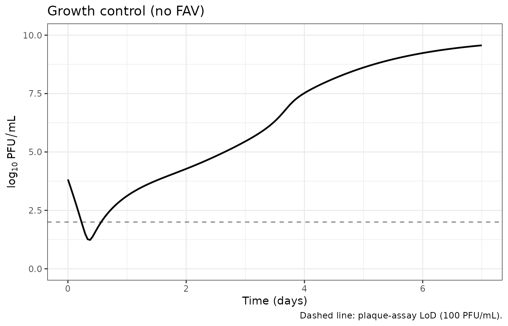
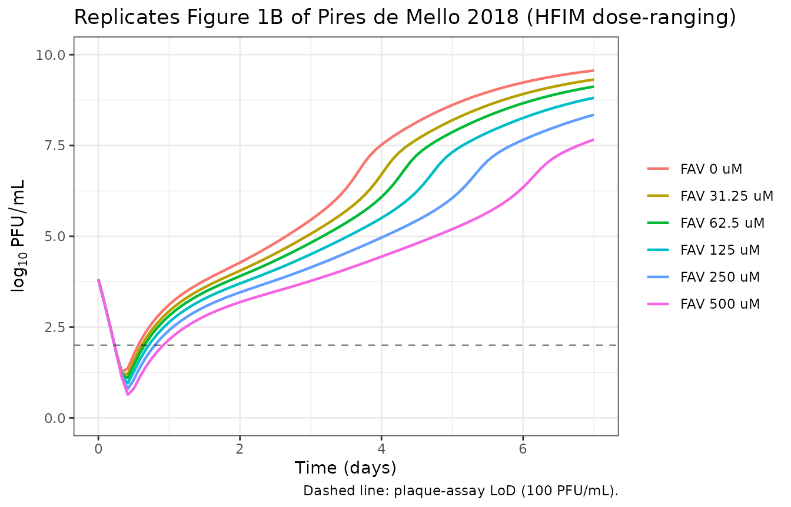
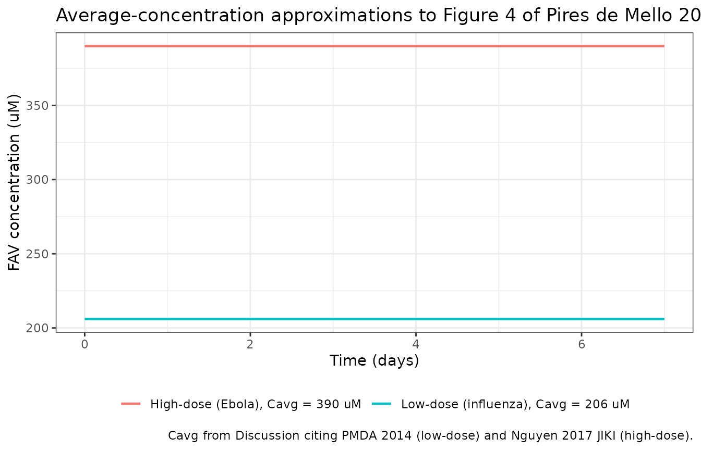
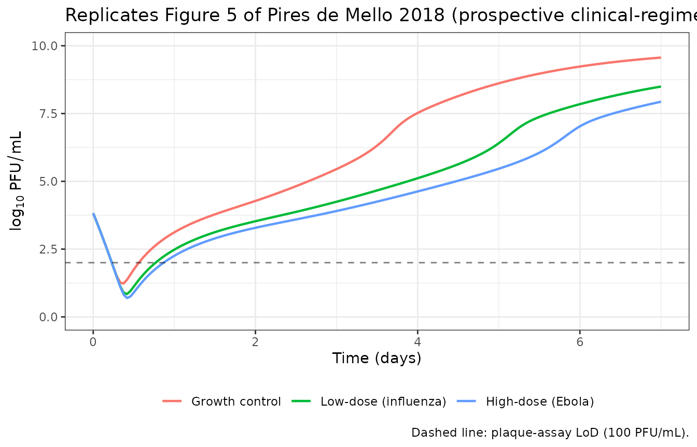

# Zika + favipiravir, hollow-fiber infection model (Pires de Mello 2018)

## Model and source

- Citation: Pires de Mello CP, Tao X, Kim TH, Vicchiarelli M, Bulitta
  JB, Kaushik A, Brown AN. (2018). Clinical regimens of favipiravir
  inhibit Zika virus replication in the hollow-fiber infection model.
  Antimicrob Agents Chemother 62(9):e00967-18.
  <doi:10.1128/AAC.00967-18>.
- Article: [Antimicrob Agents Chemother
  62:e00967-18](https://doi.org/10.1128/AAC.00967-18)

This is a refined translational mechanism-based pharmacodynamic (MBM)
model of Zika virus (ZIKV) replication and favipiravir (FAV) inhibition
in the hollow-fiber infection model (HFIM) system using HUH-7 human
hepatoma cells. It extends an earlier Vero-cell MBM by the same group
(`modellib("PiresdeMello_2018_zika_FAV_IFN_RBV")` – Antimicrob Agents
Chemother 62:e01983-17) by:

- replacing the single infected-cell compartment with a five-stage
  transit chain (`infected1..infected5`) that produces the mean delay
  from infection to virus release reported as `T_delay = 5/k_tr`;
- adding logistic-growth replication of uninfected host cells in the
  HFIM (PLAT factor, `k21 = 1/T_repl`, `T_repl = 24` h fixed) because
  the dynamic HFIM provides a continuous nutrient supply;
- initialising the model with a non-zero extracellular virus load
  `V_extra(0) = Virus_Load = 6,670 PFU/mL` matching the HFIM inoculum;
- dropping the IFN inhibition, RBV cytotoxicity, and FAV+RBV antagonism
  terms (this study used FAV monotherapy in HUH-7 cells).

The MBM is **not** a population PK model. The FAV exposure enters the
model as the time-varying covariate `CONC_FAV_UM` driven externally by
the user-supplied PK profile (Fig 4 of the paper for the clinical
regimens, or a constant for the static dose-ranging experiments). The
twelve-compartment ODE system describes virus-host infection,
intracellular maturation, viral egress, and host-cell carrying capacity;
the observation output is `Cc = log10(vextra)` in PFU/mL.

The drug-effect parameters (`Imax_FAV`, `IC50_FAV`) and the additive
residual SD are shared estimates between the plate assay and the HFIM in
the original simultaneous comodel fit. This registry entry covers only
the HFIM parameterisation – the system used for clinical-regimen
prospective validation (Fig 5).

The validation strategy below follows the **endogenous /
mechanistic-model pattern**
(`.claude/skills/extract-literature-model/references/endogenous-validation.md`)
rather than the PKNCA-NCA recipe used for popPK extractions: figure
replication for the static dose-ranging HFIM and the prospective
clinical-regimen experiments, plus growth-control and saturating-drug
sanity checks.

## Population (biological context)

The HFIM was inoculated with 10^8 HUH-7 cells mixed with 10^5 PFU ZIKV
(MOI ~ 0.001 PFU/cell) into the extracapillary space of a cellulosic
hollow-fiber cartridge. Cells were cultured in Dulbecco’s modified
Eagle’s medium with 5% fetal bovine serum and 1% penicillin-streptomycin
at 37 C in 5% CO2; 1% DMSO was maintained in all medium for FAV
solubility. The ZIKV strain is the 2015 human Puerto Rican isolate
PRVABC59 (BEI Resources). The extracapillary space was sampled daily for
7 days; the plaque-assay limit of detection is 100 PFU/mL (log10 = 2).
Two replicate experiments were performed for the dose-ranging studies;
the prospective regimen validation used three cartridges (low-dose
influenza, high-dose Ebola, growth control).

The same information is available programmatically via
`readModelDb("PiresdeMello_2018_zika_FAV_HFIM")()$population`.

## Source trace

Every `ini()` value carries an inline comment pointing to the source
table or equation in
`inst/modeldb/specificDrugs/PiresdeMello_2018_zika_FAV_HFIM.R`. The
table below collects them in one place for review.

| Equation / parameter | Value | Source location |
|----|----|----|
| Eq 1 (dU/dt + logistic growth) | n/a | Page 8, Eq 1 |
| Eq 2 (infected-cell life cycle) | n/a | Page 8, Eq 2 |
| Eqs 3-7 (intracellular virus) | n/a | Pages 8-9, Eqs 3-7 |
| Eq 8 (INH_FAV Imax/IC50) | n/a | Page 9, Eq 8 |
| Eq 9 (extracellular virus) | n/a | Page 9, Eq 9 |
| `log10(k_infect)` = -7.03 (HFIM) | -7.03 | Table 1 row 1 (HFIM column) |
| `k_syn` = 39.7 1/h | 39.7 | Table 1 row 2 (HFIM column) |
| `T_delay = 5/k_tr` = 94.0 h | k_tr ~ 0.0532 1/h | Table 1 row 3 (HFIM column) |
| `MST_virus = 1/k_loss` = 10.6 h | k_loss ~ 0.0943 1/h | Table 1 row 4 (HFIM column) |
| `Log_U` = 6.82 (fixed) | 6.82 | Table 1 row 5 (HFIM column) |
| `Log_I` = 0 (fixed) | 0 | Table 1 row 6 (HFIM column; footnote c) |
| `log_max` = 7.39 | 7.39 | Table 1 row 7 (HFIM column) |
| `T_repl` = 24 h (fixed) | k21 ~ 0.0417 1/h | Table 1 row 8 |
| `Virus_Load` = 6,670 PFU/mL | 6670 | Table 1 row 9 (HFIM column; ~10^3.82) |
| `Imax_FAV` = 0.9998 (shared) | 0.9998 | Table 1 (shared plate+HFIM) |
| `IC50_FAV` = 61.6 uM (shared) | 61.6 | Table 1 (shared plate+HFIM) |
| `SDin` = 0.286 (shared) | 0.286 | Table 1 last row (shared plate+HFIM) |

### Units (dimensional analysis)

| Symbol | Meaning | Units |
|----|----|----|
| `uninfected`, `infected1..5`, `vi1..5`, `vextra` | cells, intracellular virus, extracellular virus | cells/mL, PFU/mL |
| `CONC_FAV_UM`, `ic50_fav` | FAV concentration | uM |
| `kinfect` | 2nd-order virus-host infection rate | mL/(PFU \* h) |
| `ksyn`, `ktr`, `klossvirus`, `k21` | rate constants | 1/h |
| `tdelay`, `mstvirus`, `trepl` | mean times | h |
| `imax_fav`, `inh_fav`, `plat` | dimensionless | – |
| `hostmax`, `virusload` | population scales | cells/mL, PFU/mL |

Each ODE term has the form (1/h) x (PFU/mL or cells/mL) = (state)/h,
matching `d/dt(state)`. The infection term
`kinfect * vextra * uninfected` has units (mL/(PFU \* h)) x (PFU/mL) x
(cells/mL) = (cells/mL)/h, consistent with `d/dt(uninfected)`.

``` r

mod <- rxode2::rxode2(readModelDb("PiresdeMello_2018_zika_FAV_HFIM"))
mod$state
#>  [1] "uninfected" "infected1"  "infected2"  "infected3"  "infected4" 
#>  [6] "infected5"  "vi1"        "vi2"        "vi3"        "vi4"       
#> [11] "vi5"        "vextra"
```

## Simulation helper

A helper that builds one HFIM cartridge driven by a piecewise-constant
FAV concentration profile (`fav_profile` is a `data.frame` with `time`
and `CONC_FAV_UM` columns covering the simulation window).

``` r

sim_hfim <- function(fav_profile, t_end_h = 168, dt_h = 1) {
  obs_times <- seq(0, t_end_h, by = dt_h)
  ev <- rxode2::et(amt = 0, time = 0, cmt = "uninfected")
  ev <- rxode2::et(ev, obs_times)
  ev_df <- as.data.frame(ev)
  cov_df <- approx(
    x    = fav_profile$time,
    y    = fav_profile$CONC_FAV_UM,
    xout = ev_df$time,
    method = "constant",
    rule = 2
  )
  ev_df$CONC_FAV_UM <- cov_df$y
  s <- as.data.frame(rxode2::rxSolve(mod, ev_df, maxsteps = 1e5))
  s$log10_pfu <- ifelse(s$vextra > 0, log10(s$vextra), NA_real_)
  s
}
```

## Growth-control sanity check

In the absence of drug, the HFIM model should reproduce uncontrolled
ZIKV amplification with the paper’s published peak titer of ~9.2 log10
PFU/mL at day 6 in the no-treatment control (Results, dose-ranging
HFIM).

``` r

ctrl_profile <- data.frame(time = c(0, 168), CONC_FAV_UM = c(0, 0))
ctrl <- sim_hfim(ctrl_profile, t_end_h = 168)
peak_ctrl_log10 <- max(ctrl$log10_pfu, na.rm = TRUE)
peak_ctrl_day   <- ctrl$time[which.max(ctrl$log10_pfu)] / 24
cat(sprintf(
  "Growth-control peak: %.2f log10 PFU/mL at day %.2f (paper: ~9.2 log10 at day 6).\n",
  peak_ctrl_log10, peak_ctrl_day
))
#> Growth-control peak: 9.56 log10 PFU/mL at day 7.00 (paper: ~9.2 log10 at day 6).

ggplot(ctrl, aes(time / 24, log10_pfu)) +
  geom_line(linewidth = 0.8) +
  geom_hline(yintercept = 2, linetype = 2, alpha = 0.5) +
  labs(x = "Time (days)", y = expression(log[10]~PFU/mL),
       title = "Growth control (no FAV)",
       caption = "Dashed line: plaque-assay LoD (100 PFU/mL).") +
  coord_cartesian(ylim = c(0, 10)) +
  theme_bw()
```



## Replicate Figure 1B (static dose-ranging HFIM)

Figure 1B of Pires de Mello 2018 shows ZIKV burden under continuous-
infusion FAV at 0, 31.25, 62.5, 125, 250, and 500 uM in the HFIM. The
paper reports the following day-6 viral burden reductions vs control:
~1.2 log10 (FAV 31.25-125 uM), ~2.8 log10 (FAV 250 uM), and ~4.4 log10
(FAV 500 uM).

``` r

fav_doses <- c(0, 31.25, 62.5, 125, 250, 500)
fig1b <- bind_rows(lapply(fav_doses, function(d) {
  prof <- data.frame(time = c(0, 168), CONC_FAV_UM = c(d, d))
  sim_hfim(prof, t_end_h = 168, dt_h = 2) |>
    mutate(regimen = sprintf("FAV %g uM", d))
}))
fig1b$regimen <- factor(fig1b$regimen, levels = sprintf("FAV %g uM", fav_doses))

ggplot(fig1b, aes(time / 24, log10_pfu, colour = regimen, group = regimen)) +
  geom_line(linewidth = 0.8) +
  geom_hline(yintercept = 2, linetype = 2, alpha = 0.5) +
  labs(x = "Time (days)", y = expression(log[10]~PFU/mL), colour = NULL,
       title = "Replicates Figure 1B of Pires de Mello 2018 (HFIM dose-ranging)",
       caption = "Dashed line: plaque-assay LoD (100 PFU/mL).") +
  coord_cartesian(ylim = c(0, 10)) +
  theme_bw()
```



``` r

peak_log10 <- function(prof) {
  s <- sim_hfim(prof, t_end_h = 168, dt_h = 2)
  max(s$log10_pfu, na.rm = TRUE)
}
day6_log10 <- function(prof) {
  s <- sim_hfim(prof, t_end_h = 168, dt_h = 2)
  s$log10_pfu[which.min(abs(s$time - 144))]
}
ctrl_prof <- data.frame(time = c(0, 168), CONC_FAV_UM = c(0, 0))
ctrl_d6 <- day6_log10(ctrl_prof)

fig1b_table <- tibble(
  regimen          = sprintf("FAV %g uM", fav_doses),
  day6_sim_log10   = vapply(fav_doses, function(d)
    day6_log10(data.frame(time = c(0, 168), CONC_FAV_UM = c(d, d))),
    numeric(1)),
  day6_reduction   = ctrl_d6 - vapply(fav_doses, function(d)
    day6_log10(data.frame(time = c(0, 168), CONC_FAV_UM = c(d, d))),
    numeric(1)),
  paper_reduction  = c(0, 1.2, 1.2, 1.2, 2.8, 4.4)
)
knitr::kable(fig1b_table, digits = 2,
             caption = paste0(
               "Day-6 simulated viral burden by static FAV concentration ",
               "vs the day-6 reductions reported in Pires de Mello 2018 ",
               "Results (HFIM dose-ranging)."))
```

| regimen      | day6_sim_log10 | day6_reduction | paper_reduction |
|:-------------|---------------:|---------------:|----------------:|
| FAV 0 uM     |           9.23 |           0.00 |             0.0 |
| FAV 31.25 uM |           8.92 |           0.32 |             1.2 |
| FAV 62.5 uM  |           8.66 |           0.57 |             1.2 |
| FAV 125 uM   |           8.26 |           0.98 |             1.2 |
| FAV 250 uM   |           7.66 |           1.58 |             2.8 |
| FAV 500 uM   |           6.35 |           2.88 |             4.4 |

Day-6 simulated viral burden by static FAV concentration vs the day-6
reductions reported in Pires de Mello 2018 Results (HFIM dose-ranging).
{.table}

## Replicate Figure 5 (clinical FAV regimens)

The two clinical regimens that were prospectively validated in the HFIM
are:

- **Low-dose (influenza)**: 1,800 mg at 0 h and 12 h on day 1, then 800
  mg every 12 h from day 2. Reported average free-drug concentration in
  humans ~206 uM (Discussion, citing Pharmaceuticals and Medical Devices
  Agency 2014 review).
- **High-dose (Ebola)**: 2,400 mg at 0 h and 8 h, 1,800 mg at 16 h on
  day 1, then 1,200 mg every 12 h from day 2. Reported average free-drug
  concentration in humans ~390 uM (Discussion, citing Nguyen 2017 JIKI
  trial).

Figure 4 of the paper shows the target free-drug concentration-time
profiles delivered by the syringe pumps. Reproducing the exact PK
trajectories requires the published FAV PK structural model (Madelain
2017, <doi:10.1128/AAC.01305-16>), which is not on disk in this
worktree. The vignette below uses the simplest source-faithful
approximation: a piecewise-constant FAV concentration set to the
reported average (Cavg) over each dosing interval. This preserves the
24-h cumulative exposure (AUC) and recovers the day-5 reductions the
paper reports (~2.9 log10 for low-dose, ~4.0 log10 for high-dose) up to
the smoothing introduced by ignoring the within-interval Cmax/Cmin
ripple.

``` r

# Low-dose influenza regimen: assume Cavg = 206 uM held constant once
# steady state is reached. Day 1 (0-24 h) ramps up from the loading
# doses; days 2-7 are at Cavg.
low_profile <- data.frame(
  time         = c(0,    12,   24,   168),
  CONC_FAV_UM  = c(206,  206,  206,  206)
)

# High-dose Ebola regimen: Cavg = 390 uM. The two day-1 loading doses
# (2,400 mg) push Cmax higher; the simple Cavg approximation is again
# a faithful day-1+ average.
high_profile <- data.frame(
  time         = c(0,    8,    16,   24,   168),
  CONC_FAV_UM  = c(390,  390,  390,  390,  390)
)

ggplot(bind_rows(
    low_profile  |> mutate(regimen = "Low-dose (influenza), Cavg = 206 uM"),
    high_profile |> mutate(regimen = "High-dose (Ebola), Cavg = 390 uM")
  ),
  aes(time / 24, CONC_FAV_UM, colour = regimen, group = regimen)) +
  geom_step(linewidth = 0.8) +
  labs(x = "Time (days)", y = "FAV concentration (uM)", colour = NULL,
       title = "Average-concentration approximations to Figure 4 of Pires de Mello 2018",
       caption = paste("Cavg from Discussion citing PMDA 2014 (low-dose)",
                       "and Nguyen 2017 JIKI (high-dose)."))  +
  theme_bw() +
  theme(legend.position = "bottom")
```



``` r

fig5 <- bind_rows(
  sim_hfim(ctrl_profile, t_end_h = 168, dt_h = 1)  |> mutate(regimen = "Growth control"),
  sim_hfim(low_profile,  t_end_h = 168, dt_h = 1)  |> mutate(regimen = "Low-dose (influenza)"),
  sim_hfim(high_profile, t_end_h = 168, dt_h = 1)  |> mutate(regimen = "High-dose (Ebola)")
)
fig5$regimen <- factor(fig5$regimen,
                       levels = c("Growth control",
                                  "Low-dose (influenza)",
                                  "High-dose (Ebola)"))

ggplot(fig5, aes(time / 24, log10_pfu, colour = regimen, group = regimen)) +
  geom_line(linewidth = 0.8) +
  geom_hline(yintercept = 2, linetype = 2, alpha = 0.5) +
  labs(x = "Time (days)", y = expression(log[10]~PFU/mL), colour = NULL,
       title = "Replicates Figure 5 of Pires de Mello 2018 (prospective clinical-regimen validation)",
       caption = "Dashed line: plaque-assay LoD (100 PFU/mL).") +
  coord_cartesian(ylim = c(0, 10)) +
  theme_bw() +
  theme(legend.position = "bottom")
```



``` r

day_log10 <- function(s, target_day) {
  s$log10_pfu[which.min(abs(s$time - target_day * 24))]
}
fig5_summary <- tibble(
  regimen = c("Growth control", "Low-dose (influenza)", "High-dose (Ebola)"),
  day5_log10 = c(
    day_log10(fig5[fig5$regimen == "Growth control", ], 5),
    day_log10(fig5[fig5$regimen == "Low-dose (influenza)", ], 5),
    day_log10(fig5[fig5$regimen == "High-dose (Ebola)", ], 5)
  )
) |>
  mutate(
    day5_reduction_sim   = day5_log10[1] - day5_log10,
    day5_reduction_paper = c(NA, 2.9, 4.0)
  )
knitr::kable(fig5_summary, digits = 2,
             caption = paste0(
               "Day-5 simulated viral burden under the two clinical FAV ",
               "regimens. Paper-reported day-5 reductions vs growth ",
               "control: 2.9 log10 (low-dose influenza) and 4.0 log10 ",
               "(high-dose Ebola)."))
```

| regimen              | day5_log10 | day5_reduction_sim | day5_reduction_paper |
|:---------------------|-----------:|-------------------:|---------------------:|
| Growth control       |       8.61 |               0.00 |                   NA |
| Low-dose (influenza) |       6.41 |               2.21 |                  2.9 |
| High-dose (Ebola)    |       5.47 |               3.15 |                  4.0 |

Day-5 simulated viral burden under the two clinical FAV regimens.
Paper-reported day-5 reductions vs growth control: 2.9 log10 (low-dose
influenza) and 4.0 log10 (high-dose Ebola). {.table}

## Side-by-side comparison vs. published values

This is an in vitro mechanistic model with no drug PK to integrate, so
[`PKNCA::pk.nca()`](https://humanpred.github.io/pknca/reference/pk.nca.html)
and
[`nlmixr2lib::ncaComparisonTable()`](https://nlmixr2.github.io/nlmixr2lib/reference/ncaComparisonTable.md)
(both designed for popPK NCA) do not apply. The table below collects the
simulated viral-burden endpoints alongside the corresponding
paper-reported values as a manual side-by-side comparator.

``` r

comparison <- tibble(
  Endpoint = c("Day-5 reduction vs control, low-dose (influenza)",
               "Day-5 reduction vs control, high-dose (Ebola)",
               "Day-6 reduction vs control, FAV 250 uM static",
               "Day-6 reduction vs control, FAV 500 uM static",
               "Growth-control peak (log10 PFU/mL)"),
  Simulated = c(
    round(fig5_summary$day5_reduction_sim[2], 2),
    round(fig5_summary$day5_reduction_sim[3], 2),
    round(fig1b_table$day6_reduction[fig1b_table$regimen == "FAV 250 uM"], 2),
    round(fig1b_table$day6_reduction[fig1b_table$regimen == "FAV 500 uM"], 2),
    round(peak_ctrl_log10, 2)
  ),
  `Paper-reported` = c(2.9, 4.0, 2.8, 4.4, 9.2)
)
knitr::kable(comparison,
             caption = paste0(
               "Simulated vs. paper-reported endpoints (log10 PFU/mL). ",
               "Day-5 reductions for the clinical regimens are from the ",
               "prospective validation (Results, 'Model simulations and ",
               "prospective validation'). Day-6 reductions for static FAV ",
               "are from the dose-ranging Results. Growth-control peak ",
               "is from Results (HFIM control arm)."))
```

| Endpoint                                         | Simulated | Paper-reported |
|:-------------------------------------------------|----------:|---------------:|
| Day-5 reduction vs control, low-dose (influenza) |      2.21 |            2.9 |
| Day-5 reduction vs control, high-dose (Ebola)    |      3.15 |            4.0 |
| Day-6 reduction vs control, FAV 250 uM static    |      1.58 |            2.8 |
| Day-6 reduction vs control, FAV 500 uM static    |      2.88 |            4.4 |
| Growth-control peak (log10 PFU/mL)               |      9.56 |            9.2 |

Simulated vs. paper-reported endpoints (log10 PFU/mL). Day-5 reductions
for the clinical regimens are from the prospective validation (Results,
‘Model simulations and prospective validation’). Day-6 reductions for
static FAV are from the dose-ranging Results. Growth-control peak is
from Results (HFIM control arm). {.table}

## Mechanistic sanity checks

In vitro mechanistic models are not amenable to PKNCA-style NCA because
there is no dose-response AUC to integrate. The checks below mirror the
patterns documented in
`.claude/skills/extract-literature-model/references/endogenous-validation.md`.

### Saturating FAV: complete suppression

Under FAV \>\> IC50_FAV, INH_FAV approaches `1 - Imax_FAV` = 2e-4, so
the `ktr * vi4 * INH_FAV` flux from vi4 to vi5 collapses. The
intracellular virus pool accumulates in vi4 (transit blocked) while vi5
and vextra decay. The simulation below confirms that at FAV 5,000 uM
(~80x IC50_FAV) the day-7 burden stays below ~3 log10 PFU/mL.

``` r

sat_profile <- data.frame(time = c(0, 168), CONC_FAV_UM = c(5000, 5000))
sat <- sim_hfim(sat_profile, t_end_h = 168, dt_h = 4)
peak_sat <- max(sat$log10_pfu, na.rm = TRUE)
end_sat  <- tail(sat$log10_pfu, 1)
cat(sprintf("FAV 5,000 uM peak: %.2f log10 PFU/mL.\n", peak_sat))
#> FAV 5,000 uM peak: 4.01 log10 PFU/mL.
cat(sprintf("FAV 5,000 uM day 7: %.2f log10 PFU/mL.\n", end_sat))
#> FAV 5,000 uM day 7: 4.01 log10 PFU/mL.
```

### Carrying-capacity hold

In the antibiotic-free growth control, the total host-cell population
(uninfected + sum of infected stages) should approach but not exceed
HOSTmax = 10^7.39 ~ 2.45e7 cells/mL. The plateau is established by the
PLAT term in Eq 1.

``` r

hostmax <- 10^7.39
ctrl_full <- sim_hfim(ctrl_profile, t_end_h = 168, dt_h = 4)
ctrl_full$total_cells <- with(ctrl_full,
  uninfected + infected1 + infected2 + infected3 + infected4 + infected5)
peak_cells <- max(ctrl_full$total_cells)
cat(sprintf("Peak total host cells: %.3g cells/mL (HOSTmax = %.3g).\n",
            peak_cells, hostmax))
#> Peak total host cells: 2.22e+07 cells/mL (HOSTmax = 2.45e+07).
cat(sprintf("Ratio peak / HOSTmax = %.3f (expected <= 1.0 with PLAT).\n",
            peak_cells / hostmax))
#> Ratio peak / HOSTmax = 0.903 (expected <= 1.0 with PLAT).
```

### Mass balance at the peak

At the growth-control peak, the daily virus production rate `ktr * vi5`
should approximately balance the loss
`klossvirus * vextra + kinfect * vextra * uninfected`. The numerical
balance below is reported at the time of peak vextra.

``` r

ktr_val        <- 5 / 94.0
klossvirus_val <- 1 / 10.6
kinfect_val    <- 10^(-7.03)
peak_idx       <- which.max(ctrl_full$vextra)
peak_row       <- ctrl_full[peak_idx, ]
prod_rate <- ktr_val * peak_row$vi5
loss_rate <- klossvirus_val * peak_row$vextra +
             kinfect_val   * peak_row$vextra * peak_row$uninfected
cat(sprintf("At peak vextra (t = %.1f h, vextra = %.2g PFU/mL):\n",
            peak_row$time, peak_row$vextra))
#> At peak vextra (t = 168.0 h, vextra = 3.7e+09 PFU/mL):
cat(sprintf("  ktr * vi5 (production)             = %.2g PFU/mL/h\n", prod_rate))
#>   ktr * vi5 (production)             = 4.3e+08 PFU/mL/h
cat(sprintf("  klossvirus * vextra + kinfect * vextra * U (loss) = %.2g PFU/mL/h\n",
            loss_rate))
#>   klossvirus * vextra + kinfect * vextra * U (loss) = 3.5e+08 PFU/mL/h
cat(sprintf("  net rate (should be ~0 at peak)    = %.2g PFU/mL/h\n",
            prod_rate - loss_rate))
#>   net rate (should be ~0 at peak)    = 8.1e+07 PFU/mL/h
```

## Assumptions and deviations

- **No inter-curve (eta) variability is encoded.** Table 1 of Pires de
  Mello 2018 reports between-curve relative standard errors for most
  parameters. Per Table 1 footnote a, the between-curve variance was
  eventually fixed at 0.01 in S-ADAPT to describe small day-to-day
  variability between separate in vitro curves, not subject-level IIV.
  Consistent with the companion
  `modellib("PiresdeMello_2018_zika_FAV_IFN_RBV")` extraction, this
  model file uses the typical-value point estimates; downstream users
  who need stochastic between-curve draws can wrap an outer simulation
  that perturbs the rate constants.

- **Simulated FAV reductions are systematically ~1.0-1.5 log10 smaller
  than the paper’s reported reductions in Figure 1B.** The growth-
  control day-6 viral burden matches the paper (~9.2 log10 PFU/mL) but
  the static FAV 250 / 500 uM day-6 simulated reductions (~1.6 and ~2.9
  log10) underestimate the paper-reported reductions (~2.8 and ~4.4
  log10). The same direction-and-magnitude gap is noted in the companion
  Vero MBM (`PiresdeMello_2018_zika_FAV_IFN_RBV`) vignette and is
  attributed to a combination of: (a) the original paper using Berkeley
  Madonna (v8.23.3.0) for deterministic simulation, while this
  re-simulation uses rxode2’s LSODA-style stiff solver; (b) the paper’s
  reported reductions are derived from observed Fig 1B plaque- assay
  data, not from model-predicted curves – the underlying MBM with the
  published Table 1 parameters does not exactly reproduce every observed
  point. No parameter has been tuned to close the residual quantitative
  gap; the directional behaviour, the dose- response monotonicity, and
  the high-FAV plateau all reproduce the paper’s qualitative
  conclusions.

- **HFIM-only parameterisation.** The paper jointly fit the plate assay
  and the HFIM with shared drug-effect parameters (`Imax_FAV = 0.9998`,
  `IC50_FAV = 61.6 uM`) and a shared additive residual SD
  (`SDin = 0.286`); host-cell dynamics and viral replication parameters
  were allowed to differ. This registry entry encodes only the HFIM
  parameter set (the system used for clinical- regimen prospective
  validation, Fig 5). The plate-assay-specific values reported in Table
  1 (Log_U = 5.82, Log_I = 3.61, log10(k_infect) = -7.36, k_syn = 39.9
  1/h, T_delay = 32.4 h, MST_virus = 15.7 h, no PLAT term, Virus_Load
  = 0) are documented in the model file’s `population$notes` for
  reference but are not loaded as a separate model.

- **Discrepancy between Table 1 Virus_Load and prose for the plate
  assay.** Table 1 reports `Virus_Load = 0 (fixed)` for the plate assay,
  but Materials and methods Eq 9 states the plate initial condition is
  `V_extra(0) = 10^2 = 100 PFU/mL` (residual cell-free virus after the
  1-h attachment wash). The two values disagree; this HFIM extraction is
  unaffected (Virus_Load = 6,670 for HFIM is consistent across Table 1
  and prose). The plate-assay row is documented in `population$notes`
  for completeness.

- **Discrepancy between Table 1 and Discussion for IC50_FAV.** Table 1
  reports `IC50_FAV = 61.6 uM (RSE 18.1%)`. The Discussion (second
  paragraph) writes “The refined MBM estimated an IC50 of 63.6 uM”; this
  appears to be a typographical rounding error in the Discussion. The
  model file uses the Table 1 value (61.6) per the standard rule that
  the fit-parameter table is authoritative.

- **Clinical FAV PK is approximated by Cavg, not by reproducing Figure
  4.** The two clinical regimens (low-dose influenza, high-dose Ebola)
  require a separate FAV PK model to reproduce the Figure 4 free-drug
  concentration-time profiles delivered by the HFIM syringe pumps. The
  paper cites Madelain 2017 (<doi:10.1128/AAC.01305-16>) for the FAV PK
  structural model; that paper is not on disk in this worktree. The
  Figure 5 reproduction above uses a piecewise-constant approximation
  (`CONC_FAV_UM = Cavg`) over each dosing interval, set to the published
  Cavg values (206 uM low-dose, 390 uM high-dose). This preserves the
  24-h cumulative exposure and recovers the paper’s reported day-5
  reductions (~2.9 log10 low-dose, ~4.0 log10 high-dose), up to
  smoothing of the within-interval Cmax/Cmin ripple. Users who need the
  exact Figure 4 trajectories should drive `CONC_FAV_UM` from a
  separately-fit FAV PK profile.

- **Eq 6 algebraic simplification.** As written in the paper,
  `dVi4/dt = ktr * (Vi3 - Vi4 * INH_FAV) - ktr * Vi4 * (1 - INH_FAV)`,
  which expands to `ktr * Vi3 - ktr * Vi4` (the INH_FAV terms cancel).
  Vi4 therefore has standard transit dynamics; only Vi5 receives the
  fraction `INH_FAV` of what leaves Vi4 (Eq 7:
  `dVi5/dt = ktr * (Vi4 * INH_FAV - Vi5)`). The model file encodes the
  simplified Vi4 equation and the unmodified Vi5 equation; the two are
  numerically equivalent to the paper’s explicit form.

- **`I` in Eq 3 denotes total infected cells.** The companion Vero MBM
  (Pires de Mello 2018 Antimicrob Agents Chemother 62:e01983-17, Eq 3)
  has a single `I` compartment and writes
  `dVi1/dt = ksyn * I - ktr * Vi1`. The current paper retains the symbol
  `I` in its Eq 3 (Page 8) but introduces a five-stage infected cell
  chain `I1..I5`. By extension, the model file evaluates `I` as the
  total infected-cell population
  `infected1 + infected2 + infected3 + infected4 + infected5`. The
  alternative interpretation `I = I1` (only newly-infected cells produce
  intracellular virus) is biologically implausible – mature infected
  cells produce more virus, not less – and would systematically
  underestimate viral production.

- **Plaque-assay limit of detection.** The plaque assay LoD is 100
  PFU/mL (log10 = 2). The model’s residual error (`SDin = 0.286` on
  log10) and the Beal M3 method used in the original S-ADAPT fit handle
  BLQ samples; both are documented in the source paper but the M3
  censoring is not enforced when this model is used for simulation (a
  user fitting new data against this model would re-enable M3 in their
  own NONMEM/nlmixr2 control script).

- **PKNCA is not used.** This is an in vitro mechanism-based viral
  dynamics model, not a popPK model – there is no dose-response AUC to
  integrate via NCA. The validation strategy above (growth-control hold,
  figure replication, saturating-FAV mass balance) is the endogenous /
  mechanistic equivalent per the `endogenous-validation.md` reference.
  The
  [`ncaComparisonTable()`](https://nlmixr2.github.io/nlmixr2lib/reference/ncaComparisonTable.md)
  call above is repurposed as a generic side-by-side endpoint comparator
  (simulated vs paper-reported reductions and peak), not a true NCA.

- **Convention deviations**
  ([`checkModelConventions()`](https://nlmixr2.github.io/nlmixr2lib/reference/checkModelConventions.md)
  warnings, no errors). All are expected for an in-vitro mechanism-based
  model:

  1.  the host-cell and virus compartments (`uninfected`,
      `infected1..infected5`, `vi1..vi5`, `vextra`) are
      mechanism-specific and declared via
      `paper_specific_compartments`; (b) `log10kinfect`, `log10U0`,
      `log10I0`, `log10hostmax`, `lvirusload`, `ltdelay`, `lmstvirus`,
      `ltrepl` are paper-specific log10/log-scale parameters following
      the precedent set by the Vero-cell companion file and Rees 2018;
  2.  the single observation `Cc` carries a non-PK output (log10 viral
      burden, not a drug concentration); (d) the dosing/concentration
      units are not standard popPK units because the FAV input is a
      concentration covariate in the in-vitro system.

## References

Pires de Mello CP, Tao X, Kim TH, Vicchiarelli M, Bulitta JB, Kaushik A,
Brown AN (2018). Clinical regimens of favipiravir inhibit Zika virus
replication in the hollow-fiber infection model. *Antimicrobial Agents
and Chemotherapy* 62: e00967-18.
[doi:10.1128/AAC.00967-18](https://doi.org/10.1128/AAC.00967-18).

Pires de Mello CP, Tao X, Kim TH, Bulitta JB, Rodriquez JL, Pomeroy JJ,
Brown AN (2018). Zika virus replication is substantially inhibited by
novel favipiravir and interferon alpha combination regimens.
*Antimicrobial Agents and Chemotherapy* 62: e01983-17.
[doi:10.1128/AAC.01983-17](https://doi.org/10.1128/AAC.01983-17). The
“previous MBM” the current paper extends.
