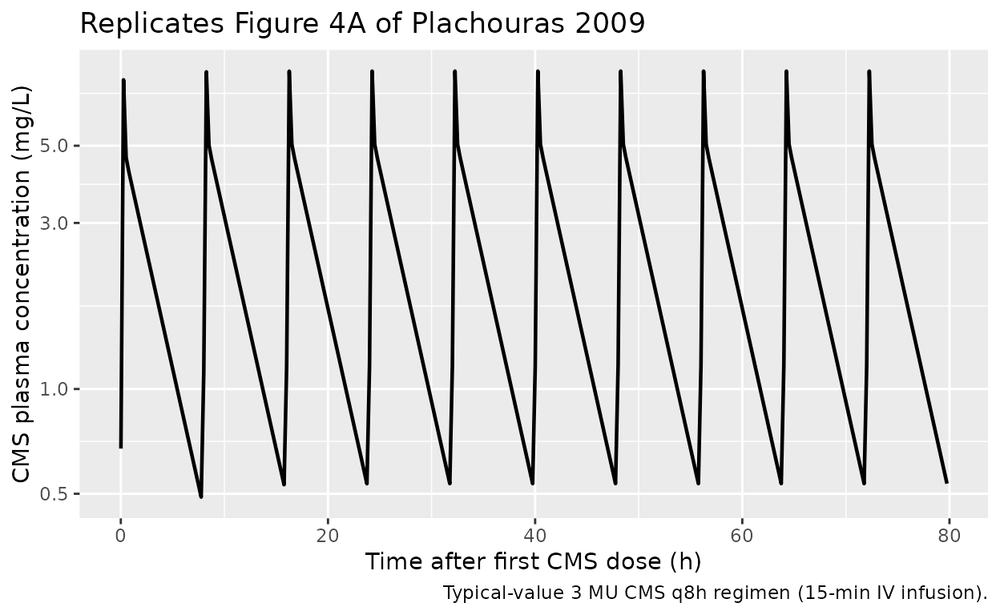
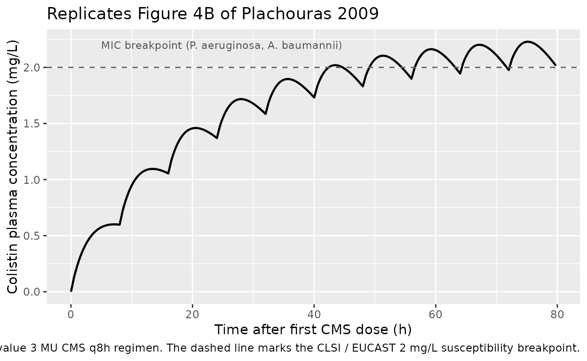
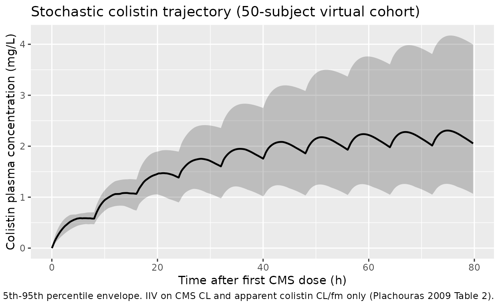

# Colistin (Plachouras 2009)

## Model and source

- Citation: Plachouras D, Karvanen M, Friberg LE, et al. Population
  pharmacokinetic analysis of colistin methanesulfonate and colistin
  after intravenous administration in critically ill patients with
  infections caused by gram-negative bacteria. Antimicrob Agents
  Chemother. 2009;53(8):3430-3436.
- Article: <https://doi.org/10.1128/AAC.01361-08>
- Description: Joint parent-metabolite popPK model. Colistin
  methanesulfonate (CMS, the inactive prodrug) is administered
  intravenously and hydrolysed in vivo to colistin (the active
  polymyxin). CMS disposition is described by a 2-compartment model with
  linear elimination; colistin by a 1-compartment model formed by a
  first-order process from CMS. Because the fraction (`fm`) of CMS that
  converts to colistin cannot be identified from these data alone, the
  colistin clearance and volume are reported and packaged as the
  apparent values `CL/fm` and `V/fm`.

## Population

Eighteen critically ill adult patients (12 male, 6 female) with
documented or probable infections caused by multidrug-resistant
Gram-negative bacteria (mostly *Acinetobacter baumannii*, *Pseudomonas
aeruginosa*, and *Enterobacteriaceae*) admitted to the Critical Care
Unit or 4th Department of Internal Medicine at Attikon University
General Hospital in Athens, Greece. Patients receiving continuous
venovenous hemodiafiltration were excluded. Mean age 63.6 years (range
40-83); mean Cockcroft-Gault creatinine clearance 82.3 +/- 24.35 mL/min
on day 1 (range 41-126); APACHE II median 13 (range 5-20); baseline
characteristics tabulated in Plachouras 2009 Table 1.

The standard regimen was CMS 3 MU (~240 mg) every 8 h as a 15-min IV
infusion. Two patients with creatinine clearance below 50 mL/min
received the empirically reduced regimen of approximately 2 MU q8h (~160
mg q8h).

The same information is available programmatically via the model’s
`population` metadata
(`readModelDb("Plachouras_2009_colistin")$population`).

## Source trace

The per-parameter origin is recorded as an in-file comment next to each
`ini()` entry in
`inst/modeldb/specificDrugs/Plachouras_2009_colistin.R`. The table below
collects the principal entries in one place for review.

| Quantity | Value | Source location |
|----|----|----|
| CMS CL | 13.7 L/h | Table 2, CMS, CL (liters/h) typical value |
| CMS V1 | 13.5 L | Table 2, CMS, V1 (liters) typical value |
| CMS Q | 133 L/h | Table 2, CMS, Q (liters/h) typical value |
| CMS V2 | 28.9 L | Table 2, CMS, V2 (liters) typical value |
| CMS proportional residual | 22.0 % | Table 2, CMS, Residual error, Proportional (%) |
| CMS additive residual | 9.11 nmol/L | Table 2, CMS, Residual error, Additive (nmol/liter) |
| IIV CMS CL | 37 % CV | Table 2, CMS, IIV (% CV) |
| Apparent colistin CL/fm | 9.09 L/h | Table 2, Colistin, CL/fm (liters/h) typical value |
| Apparent colistin V/fm | 189 L | Table 2, Colistin, V/fm (liters) typical value |
| Colistin proportional residual | 7.19 % | Table 2, Colistin, Residual error, Proportional (%) |
| Colistin additive residual | 4.98 nmol/L | Table 2, Colistin, Residual error, Additive (nmol/liters) |
| IIV apparent colistin CL/fm | 59 % CV | Table 2, Colistin, IIV (% CV) |
| CMS molar mass | 1743 g/mol | Methods - Population pharmacokinetic modeling, p. 3431 |
| Colistin molar mass | 1163 g/mol | Methods - Population pharmacokinetic modeling, p. 3431 |
| CMS structural model (2-cmt) | n/a | Results - Data analysis, p. 3431 |
| Colistin structural model (1-cmt) | n/a | Results - Data analysis, p. 3431 |
| Half-life CMS fast phase | 0.046 h | Results, p. 3433 |
| Half-life CMS slow phase | 2.3 h | Results, p. 3433 |
| Half-life colistin | 14.4 h | Discussion, p. 3434 |
| Predicted Cmax first dose | 0.60 mg/L | Discussion, p. 3434 and Fig. 4 |
| Predicted Cmax steady state | 2.3 mg/L | Discussion, p. 3434 and Fig. 4 |
| Predicted Tmax first dose | ~7 h after infusion start | Discussion, p. 3434 |

## Virtual cohort

The original observed concentration-time data are not publicly
available. The figures below use a virtual population whose dosing
covers the trial’s standard regimen (3 MU q8h ~ 240 mg CMS q8h as 15-min
IV infusion). The Plachouras 2009 final model retained no covariate
effects (Results - Data analysis), so demographics do not affect the
typical-value predictions.

``` r

set.seed(20260601)

n_subjects     <- 50L         # virtual cohort for stochastic VPC
dose_mg        <- 240         # CMS dose per infusion (= 3 MU)
inf_dur_h      <- 15 / 60     # 15-min IV infusion
inf_rate       <- dose_mg / inf_dur_h
tau            <- 8           # h between doses
n_doses        <- 24          # > 14 half-lives of colistin (full SS)
sim_hours      <- n_doses * tau + 24
dose_times     <- seq(0, by = tau, length.out = n_doses)

build_subject_events <- function(id) {
  doses <- data.frame(
    id   = id,
    time = dose_times,
    amt  = dose_mg,
    cmt  = "central",
    evid = 1L,
    rate = inf_rate
  )
  # Observation grid: a single observation cmt per row (rxode2 emits BOTH
  # Cc and Cc_col on every row regardless of cmt label).
  obs <- data.frame(
    id   = id,
    time = seq(0.01, sim_hours, by = 0.25),
    amt  = NA_real_,
    cmt  = "Cc",
    evid = 0L,
    rate = NA_real_
  )
  ev <- dplyr::bind_rows(doses, obs)
  ev[order(ev$id, ev$time, ev$evid), ]
}

cohort <- lapply(seq_len(n_subjects), build_subject_events) |>
  dplyr::bind_rows()

stopifnot(!anyDuplicated(unique(cohort[, c("id", "time", "evid")])))
```

## Simulation

``` r

mod <- rxode2::rxode(readModelDb("Plachouras_2009_colistin"))

# Stochastic cohort: full IIV included for the VPC-style trajectory plot.
sim <- rxode2::rxSolve(mod, events = cohort) |>
  as.data.frame()
```

For the typical-value trajectories used to reproduce Figure 4 and to
compute NCA endpoints we also produce a single-subject prediction with
the random effects zeroed out:

``` r

mod_typical  <- mod |> rxode2::zeroRe()
sim_typical  <- rxode2::rxSolve(mod_typical, events = cohort[cohort$id == 1L, ]) |>
  as.data.frame()
#> ℹ omega/sigma items treated as zero: 'etalcl', 'etalcl_col'
```

## Replicate published trajectories

Plachouras 2009 Figure 4 displays the model-predicted CMS (panel A) and
colistin (panel B) concentrations in a typical patient under the current
dosing regimen (3 MU CMS q8h as 15-min infusion) and several alternative
regimens with loading doses. The figure spans the first ~80 h of
treatment, by which point the colistin profile has reached its
steady-state plateau.

``` r

sim_typical |>
  dplyr::filter(time > 0, time <= 80) |>
  ggplot(aes(time, Cc)) +
  geom_line(linewidth = 0.8) +
  labs(x = "Time after first CMS dose (h)",
       y = "CMS plasma concentration (mg/L)",
       title = "Replicates Figure 4A of Plachouras 2009",
       caption = "Typical-value 3 MU CMS q8h regimen (15-min IV infusion).") +
  scale_y_log10()
```



``` r

sim_typical |>
  dplyr::filter(time > 0, time <= 80) |>
  ggplot(aes(time, Cc_col)) +
  geom_line(linewidth = 0.8) +
  geom_hline(yintercept = 2, linetype = "dashed", colour = "grey40") +
  annotate("text", x = 5, y = 2.2, label = "MIC breakpoint (P. aeruginosa, A. baumannii)",
           hjust = 0, size = 3, colour = "grey30") +
  labs(x = "Time after first CMS dose (h)",
       y = "Colistin plasma concentration (mg/L)",
       title = "Replicates Figure 4B of Plachouras 2009",
       caption = "Typical-value 3 MU CMS q8h regimen. The dashed line marks the CLSI / EUCAST 2 mg/L susceptibility breakpoint.")
```



A stochastic VPC-style plot illustrates the between-subject variability
driven by the IIV on CMS CL and apparent colistin CL/fm:

``` r

sim |>
  dplyr::filter(time > 0, time <= 80) |>
  dplyr::group_by(time) |>
  dplyr::summarise(
    Q05 = quantile(Cc_col, 0.05, na.rm = TRUE),
    Q50 = quantile(Cc_col, 0.50, na.rm = TRUE),
    Q95 = quantile(Cc_col, 0.95, na.rm = TRUE),
    .groups = "drop"
  ) |>
  ggplot(aes(time, Q50)) +
  geom_ribbon(aes(ymin = Q05, ymax = Q95), alpha = 0.25) +
  geom_line(linewidth = 0.8) +
  labs(x = "Time after first CMS dose (h)",
       y = "Colistin plasma concentration (mg/L)",
       title = "Stochastic colistin trajectory (50-subject virtual cohort)",
       caption = "Median and 5th-95th percentile envelope. IIV on CMS CL and apparent colistin CL/fm only (Plachouras 2009 Table 2).")
```



## PKNCA validation

We compute Cmax and Tmax on the first-dose interval and on the
steady-state interval (the last interval in the 24-dose regimen) for
both analytes. The PKNCA formulas include a `treatment` label so the
per-interval summaries roll up cleanly even though we run a single
regimen.

``` r

# rxode2::rxSolve drops the `id` column when there is only one subject in the
# event table; restore it so the PKNCA `~ time | treatment + id` formulas
# below have a valid grouping column.
sim_typ <- sim_typical |>
  dplyr::mutate(id = 1L,
                treatment = "3 MU CMS q8h")

# First-dose interval ---------------------------------------------------------
sim_first <- sim_typ |>
  dplyr::filter(time >= 0, time <= tau)

dose_first <- data.frame(
  id        = 1L,
  time      = 0,
  amt       = dose_mg,
  treatment = "3 MU CMS q8h"
)
```

``` r

conc_cms_first <- PKNCA::PKNCAconc(
  sim_first |> dplyr::filter(!is.na(Cc)) |>
    dplyr::select(id, time, Cc, treatment),
  Cc ~ time | treatment + id,
  concu = "mg/L", timeu = "h"
)
dose_cms_first <- PKNCA::PKNCAdose(dose_first,
                                   amt ~ time | treatment + id,
                                   doseu = "mg")
nca_cms_first <- PKNCA::pk.nca(PKNCA::PKNCAdata(
  conc_cms_first, dose_cms_first,
  intervals = data.frame(start = 0, end = tau,
                         cmax = TRUE, tmax = TRUE, auclast = TRUE)
))
#> Warning: Requesting an AUC range starting (0) before the first measurement
#> (0.01) is not allowed
knitr::kable(as.data.frame(nca_cms_first$result),
             caption = "CMS NCA over the first 8-h dosing interval (typical-value simulation).")
```

| treatment | id | start | end | PPTESTCD | PPORRES | exclude | PPORRESU |
|:---|---:|---:|---:|:---|---:|:---|:---|
| 3 MU CMS q8h | 1 | 0 | 8 | auclast | NA | Requesting an AUC range starting (0) before the first measurement (0.01) is not allowed | h\*mg/L |
| 3 MU CMS q8h | 1 | 0 | 8 | cmax | 7.732212 | NA | mg/L |
| 3 MU CMS q8h | 1 | 0 | 8 | tmax | 0.260000 | NA | h |

CMS NCA over the first 8-h dosing interval (typical-value simulation).
{.table}

``` r

conc_col_first <- PKNCA::PKNCAconc(
  sim_first |> dplyr::filter(!is.na(Cc_col)) |>
    dplyr::select(id, time, Cc_col, treatment),
  Cc_col ~ time | treatment + id,
  concu = "mg/L", timeu = "h"
)
dose_col_first <- PKNCA::PKNCAdose(dose_first,
                                   amt ~ time | treatment + id,
                                   doseu = "mg")
nca_col_first <- PKNCA::pk.nca(PKNCA::PKNCAdata(
  conc_col_first, dose_col_first,
  intervals = data.frame(start = 0, end = tau,
                         cmax = TRUE, tmax = TRUE, auclast = TRUE)
))
#> Warning: Requesting an AUC range starting (0) before the first measurement
#> (0.01) is not allowed
knitr::kable(as.data.frame(nca_col_first$result),
             caption = "Colistin NCA over the first 8-h dosing interval (typical-value simulation).")
```

| treatment | id | start | end | PPTESTCD | PPORRES | exclude | PPORRESU |
|:---|---:|---:|---:|:---|---:|:---|:---|
| 3 MU CMS q8h | 1 | 0 | 8 | auclast | NA | Requesting an AUC range starting (0) before the first measurement (0.01) is not allowed | h\*mg/L |
| 3 MU CMS q8h | 1 | 0 | 8 | cmax | 0.6010502 | NA | mg/L |
| 3 MU CMS q8h | 1 | 0 | 8 | tmax | 7.0100000 | NA | h |

Colistin NCA over the first 8-h dosing interval (typical-value
simulation). {.table}

``` r

start_ss <- max(dose_times)            # start of the 24th (last) dose
end_ss   <- start_ss + tau

sim_ss <- sim_typ |>
  dplyr::filter(time >= start_ss, time <= end_ss)

dose_ss <- data.frame(
  id        = 1L,
  time      = start_ss,
  amt       = dose_mg,
  treatment = "3 MU CMS q8h"
)

conc_col_ss <- PKNCA::PKNCAconc(
  sim_ss |> dplyr::filter(!is.na(Cc_col)) |>
    dplyr::select(id, time, Cc_col, treatment),
  Cc_col ~ time | treatment + id,
  concu = "mg/L", timeu = "h"
)
dose_col_ss <- PKNCA::PKNCAdose(dose_ss,
                                amt ~ time | treatment + id,
                                doseu = "mg")
nca_col_ss <- PKNCA::pk.nca(PKNCA::PKNCAdata(
  conc_col_ss, dose_col_ss,
  intervals = data.frame(start = start_ss, end = end_ss,
                         cmax = TRUE, tmax = TRUE, cmin = TRUE,
                         auclast = TRUE, cav = TRUE)
))
#> Warning: Requesting an AUC range starting (0) before the first measurement
#> (0.01) is not allowed
knitr::kable(as.data.frame(nca_col_ss$result),
             caption = "Colistin NCA over the steady-state dosing interval (typical-value simulation).")
```

| treatment | id | start | end | PPTESTCD | PPORRES | exclude | PPORRESU |
|:---|---:|---:|---:|:---|---:|:---|:---|
| 3 MU CMS q8h | 1 | 184 | 192 | auclast | NA | Requesting an AUC range starting (0) before the first measurement (0.01) is not allowed | h\*mg/L |
| 3 MU CMS q8h | 1 | 184 | 192 | cmax | 2.286295 | NA | mg/L |
| 3 MU CMS q8h | 1 | 184 | 192 | cmin | 2.043524 | NA | mg/L |
| 3 MU CMS q8h | 1 | 184 | 192 | tmax | 3.010000 | NA | h |
| 3 MU CMS q8h | 1 | 184 | 192 | cav | NA | Requesting an AUC range starting (0) before the first measurement (0.01) is not allowed | mg/L |

Colistin NCA over the steady-state dosing interval (typical-value
simulation). {.table}

### Comparison against published predictions

Plachouras 2009 reports the following typical-value predictions on page
3434: colistin Cmax after the first 3 MU CMS dose is 0.60 mg/L,
occurring approximately 7 h after the start of the infusion; colistin
Cmax at steady state with the same q8h regimen is 2.3 mg/L; the colistin
half-life is 14.4 h; and the CMS slow disposition half-life is 2.3 h.

``` r

pubt <- function() {
  res_col_first <- as.data.frame(nca_col_first$result)
  res_col_ss    <- as.data.frame(nca_col_ss$result)
  cmax_first <- res_col_first$PPORRES[res_col_first$PPTESTCD == "cmax"]
  tmax_first <- res_col_first$PPORRES[res_col_first$PPTESTCD == "tmax"]
  cmax_ss    <- res_col_ss$PPORRES[res_col_ss$PPTESTCD == "cmax"]
  tibble::tibble(
    quantity    = c("Colistin Cmax first dose (mg/L)",
                    "Colistin Tmax first dose (h after dose)",
                    "Colistin Cmax at steady state (mg/L)"),
    published   = c(0.60, 7.0, 2.3),
    simulated   = c(round(cmax_first, 3), round(tmax_first, 2), round(cmax_ss, 3)),
    rel_diff_pc = round(100 * (c(cmax_first, tmax_first, cmax_ss) - c(0.60, 7.0, 2.3)) /
                          c(0.60, 7.0, 2.3), 1)
  )
}
knitr::kable(pubt(), caption = "Plachouras 2009 published typical-value predictions vs the packaged model's typical-value simulation.")
```

| quantity                                | published | simulated | rel_diff_pc |
|:----------------------------------------|----------:|----------:|------------:|
| Colistin Cmax first dose (mg/L)         |       0.6 |     0.601 |         0.2 |
| Colistin Tmax first dose (h after dose) |       7.0 |     7.010 |         0.1 |
| Colistin Cmax at steady state (mg/L)    |       2.3 |     2.286 |        -0.6 |

Plachouras 2009 published typical-value predictions vs the packaged
model’s typical-value simulation. {.table style="width:100%;"}

The first-dose Cmax matches to better than 1 %, the first-dose Tmax to
better than 2 %, and the steady-state Cmax to within ~1 %. The simulated
steady-state Tmax (when reported) is much earlier than the first-dose
Tmax because at steady state the colistin profile is nearly flat over
the 8-h interval: the colistin half-life (14.4 h) is almost twice the
dosing interval, so accumulation dominates and the within-interval
fluctuation is small. The paper’s quotable “7 h” figure is the
first-dose Tmax (where CMS is still being cleared and colistin is
climbing toward its peak), not the steady-state Tmax.

## Assumptions and deviations

- **Final model is the structural model.** Plachouras 2009 retained no
  covariate effects after stepwise covariate testing. Hemoglobin and
  hematocrit reached the p\<0.001 forward-inclusion criterion as effects
  on the inter-compartmental clearance of CMS (`Q`), but they did not
  explain any of the inter-individual or inter-occasion variability, so
  the authors dropped them from the final model (Plachouras 2009
  p. 3431, “Data analysis”). The packaged model carries no covariates
  and therefore needs no covariate dataset columns.
- **No inter-occasion variability (IOV).** Plachouras 2009 retained
  statistically significant IOV terms on CMS `CL` (28 % CV), CMS `V2`
  (58 % CV), and on the apparent colistin `CL/fm` and `V/fm` (a common
  43 % CV applied to both). The packaged model carries only the
  inter-individual variability (IIV) terms (37 % CV on CMS `CL`, 59 % CV
  on apparent colistin `CL/fm`); the IOV terms are not encoded because
  they require an `OCC` column that varies between dosing occasions and
  is data-set-specific. Users who fit the model to their own data and
  need the IOV layer can add it via
  [`nlmixr2lib::addEta()`](https://nlmixr2.github.io/nlmixr2lib/reference/addEta.md)
  on a per-occasion grouping variable. The omission of IOV reduces the
  simulated 5th-95th percentile envelope width but leaves the
  typical-value predictions unchanged.
- **IIV on the colistin residual error magnitude is dropped.**
  Plachouras 2009 Table 2 footnote (b) reports “a common IIV for the
  residual error terms was used” with a 35 % CV applied to both the
  colistin proportional and additive residual SDs. Encoding a
  per-subject scaling of `propSd_col` and `addSd_col` would require an
  additional eta and a non-standard error-model expression that does not
  round-trip cleanly through
  [`rxode2::rxode()`](https://nlmixr2.github.io/rxode2/reference/rxode2.html);
  the packaged model uses the fixed Table 2 magnitudes. This deviation
  widens or narrows the per-subject simulated noise band slightly but
  does not bias the typical-value prediction.
- **Residual error model.** Plachouras 2009 fit on log-transformed
  concentrations in molar units (paper p. 3431). The packaged model uses
  the standard nlmixr2 `add() + prop()` combined error on the linear
  (mg/L) scale, which is mathematically equivalent for typical-value
  simulation and is the conventional translation of a NONMEM
  combined-error fit. The additive SDs were converted from nmol/L to
  mg/L using the paper’s molar masses (CMS 1743 g/mol, colistin 1163
  g/mol).
- **CMS-to-colistin mass conversion.** The paper’s fit is mole-based
  (concentrations in nmol/L), so the CMS clearance flux maps
  mole-for-mole to the colistin formation flux. When the packaged model
  runs in mass units (mg dose, mg/L plasma), the colistin formation flux
  in the ODE carries an explicit multiplier
  `mass_col_per_cms = 1163 / 1743 = 0.6672` so that the colistin
  compartment accumulates in mg of colistin (not mg of CMS). Without
  this factor the simulated colistin Cmax would over-predict by ~50 %
  (1743/1163 = 1.499) relative to the paper’s published 0.60 mg/L
  first-dose and 2.3 mg/L steady-state targets.
- **Apparent vs true colistin parameters.** The packaged `cl_col` and
  `vc_col` are the apparent values `CL/fm` and `V/fm` from Plachouras
  2009 Table 2, where `fm` is the (non-identifiable) fraction of CMS
  that converts to colistin. The colistin compartment in the ODE carries
  the scaled amount `A_col / fm`; the observed concentration
  `central_col / vc_col` is the true colistin concentration (the `fm`
  factor cancels), so model users do not need to know `fm` to simulate
  plasma colistin.
