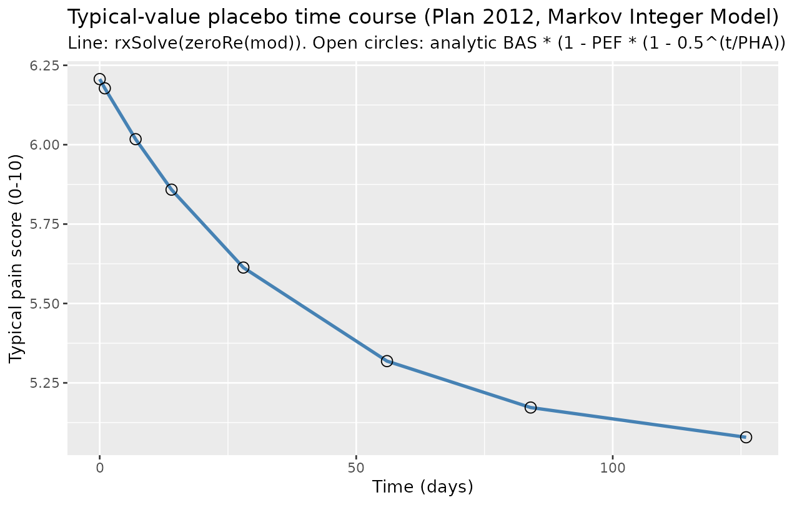

# Pain (Plan 2012)

## Model and source

- Citation: Plan EL, Elshoff JP, Stockis A, Sargentini-Maier ML,
  Karlsson MO. (2012). Likert pain score modeling: a Markov integer
  model and an autoregressive continuous model. *Clin Pharmacol Ther*
  91(4):820-828.
- Article: <https://doi.org/10.1038/clpt.2011.301>
- DDMORE Foundation Model Repository entry:
  [DDMODEL00000194](https://repository.ddmore.eu/model/DDMODEL00000194)

This is a **Markov Integer Model** for daily 11-point Likert (0-10) pain
scores in the placebo arm of three Phase III neuropathic-pain trials.
The publication develops two separate models for the same dataset — a
Markov Integer Model and an autoregressive continuous model — and the
DDMORE bundle uploads the Markov Integer Model only (per the bundle’s
RDF `model-implementation-source-discrepancies-freetext` field).

## Population

- Pooled placebo arm of **three Phase III** neuropathic-pain trials.
- **231 subjects** with daily 11-point Likert pain measurements over
  **18 weeks** (22,492 observations total).
- Demographic detail (age range, weight range, sex split,
  race/ethnicity) is not derivable from the DDMORE bundle. The linked
  publication (Plan 2012, <doi:10.1038/clpt.2011.301>) was **not on
  disk** at extraction time, so a full demographic cross-check was not
  performed; the n_subjects = 231 figure is taken from the DDMORE RDF
  `model-has-description-long` field.

The same metadata is available programmatically:

``` r

mod_fn <- readModelDb("Plan_2012_pain")
# Inspect via the function body (source-traced), since metadata lives in
# free-floating <- assignments before ini():
str(formals(mod_fn))
#>  NULL
```

## Source trace

Per-parameter origins are recorded as in-file comments next to each
[`ini()`](https://nlmixr2.github.io/rxode2/reference/ini.html) entry in
`inst/modeldb/ddmore/Plan_2012_pain.R`. The table below collects them in
one place.

nlmixr2 parameter \| NONMEM source \| .mod \$THETA/ \$OMEGA \| .lst
final estimate \|

\|——————————\|———————\|———————-\|———————\| \| `logitbas` (typical 6.21)
\| `THETA(1)` BASELINE \| 6.20667 (bound 0-10) \| TH 1 = 6.21E+00 \| \|
`logitpef` (typical 0.190) \| `THETA(2)` PLACEBO_EFFECT \| 0.18986 \| TH
2 = 1.90E-01 \| \| `lpha` (typical 27.7) \| `THETA(3)` PLACEBO_HALF_TIME
\| 27.7045 \| TH 3 = 2.77E+01 \| \| `logitpi00` (typical 0.555) \|
`THETA(4)` PROBABILITY_OF_INFLATION_0/0 \| 0.554617 \| TH 4 \| \|
`logitpi09` (typical 0.120) \| `THETA(5)` PROBABILITY_OF_INFLATION_0/9
\| 0.119517 \| TH 5 \| \| `logitpi10` (typical 0.444) \| `THETA(6)`
PROBABILITY_OF_INFLATION_0/10 \| 0.443759 \| TH 6 \| \| `logitpi1`
(typical 0.359) \| `THETA(7)` PROBABILITY_OF_INFLATION_1 \| 0.359302 \|
TH 7 \| \| `logitpi2` (typical 0.00473)\| `THETA(8)`
PROBABILITY_OF_INFLATION_2 \| 0.00472972 \| TH 8 \| \| `logitpi3`
(typical 0.000403)\| `THETA(9)` PROBABILITY_OF_INFLATION_3 \|
0.000403033 \| TH 9 \| \| `logitdis` (typical 0.993) \| `THETA(10)` DIS
\| 0.99286 \| TH 10 \| \| `lte0` (typical 0.00644)\| `THETA(11)` TE0 \|
0.00643534 \| TH 11 \| \| `e_conmed_para` (0.364) \| `THETA(12)` COV
(PCM effect) \| 0.36374 \| TH 12 \| \| `etalogitbas` \| `$OMEGA` ETA(1)
\| 0.568985 \| OMEGA ETA1 \| \| `etalogitpef` \| `$OMEGA` ETA(2) \|
3.77567 \| OMEGA ETA2 \| \| `etalpha` \| `$OMEGA` ETA(3) \| 0.352913 \|
OMEGA ETA3 \| \| `etalogitpi00 + etalogitpi1 + etalogitpi2` block \|
`$OMEGA BLOCK(3)` ETA(4..6) \| (2.70, 2.45, 3.57; -0.755, 0.806, 1.92)
\| OM44/55/66 \| \| `etalogitpi3` \| `$OMEGA(7)` FIX 0 \| 0 \| (fixed)
\| \| `etalogitdis` \| `$OMEGA(8)` ETA(8) \| 24.3896 \| OMEGA ETA8 \| \|
`etalte0` \| `$OMEGA(9)` ETA(9) \| 1.33918 \| OMEGA ETA9 \| \| Placebo
equation \| `.mod $PRED` lines 17-26 (TVBAS / PHI / BAS / PEF / PHA /
PLC) \| \| \| \| Lambda equation \| `.mod $PRED` lines 31-34 (TVLAM /
PHL / LAM) \| \| \| \| Markov inflation \| `.mod $PRED` lines 37-72
(PIN0..PIN3, PIN0/00/09/10, PIN1D/2D/3D, PTOT) \| \| \| \|
Underdispersion \| `.mod $PRED` lines 79-82 (PH / TH / DIS) \| \| \| \|
Truncated Poisson normaliser \| `.mod $PRED` lines 85-96 (SUM0..SUM10,
SUM) \| \| \| \| Likelihood YY = -2\*log(Y) \| `.mod $PRED` lines 98-118
\| \| \|

The .mod was run with `$ESTIMATION MAXEVAL=0` — i.e., NONMEM evaluates
the objective at the supplied `$THETA` / `$OMEGA` without estimating.
The `Output_real_likert_pain_count.lst` `FINAL PARAMETER ESTIMATE` block
therefore *echoes* the .mod’s initial values; the .mod **carries the
publication’s final estimates as its initial values**, by DDMORE
convention. The `.lst` MAXEVAL=0 echo confirms (line 722).

## Mechanistic structure

At the typical-value (no IIV, no Markov state, no concomitant
paracetamol), the mean pain score $`\lambda(t)`$ is governed by a
placebo-effect time course with half-time `pha`:

``` math
\lambda(t) = \mathrm{BAS} \cdot \left[1 - \mathrm{PEF} \cdot \left(1 - 2^{-t / \mathrm{PHA}}\right)\right]
```

with `BAS = 6.21`, `PEF = 0.190`, `PHA = 27.7 d`. The asymptotic placebo
level (as $`t \to \infty`$) is
$`\mathrm{BAS} \cdot (1 - \mathrm{PEF}) \approx 5.03`$. Concomitant
paracetamol (`CONMED_PARA = 1`) adds `e_conmed_para = 0.364` on the
logit($`\lambda/10`$) scale.

The full publication likelihood is a truncated (0-10) Poisson with
underdispersion `DIS` and Markov inflations conditional on the previous
score; see “Assumptions and deviations” below for the simplification
used in this nlmixr2 implementation.

## Virtual cohort

For the typical-value F.3 mechanistic-sanity check we simulate a single
placebo subject without concomitant paracetamol over the 126-day
(18-week) trial horizon at the canonical observation grid:

``` r

events <- rxode2::et(time = c(0, 1, 7, 14, 28, 56, 84, 126), evid = 0)
events$CONMED_PARA <- 0
events
#>   id low time high   cmt amt rate ii addl evid ss dur CONMED_PARA
#> 1  1  NA    0   NA (obs)  NA   NA NA   NA    0 NA  NA           0
#> 2  1  NA    1   NA (obs)  NA   NA NA   NA    0 NA  NA           0
#> 3  1  NA    7   NA (obs)  NA   NA NA   NA    0 NA  NA           0
#> 4  1  NA   14   NA (obs)  NA   NA NA   NA    0 NA  NA           0
#> 5  1  NA   28   NA (obs)  NA   NA NA   NA    0 NA  NA           0
#> 6  1  NA   56   NA (obs)  NA   NA NA   NA    0 NA  NA           0
#> 7  1  NA   84   NA (obs)  NA   NA NA   NA    0 NA  NA           0
#> 8  1  NA  126   NA (obs)  NA   NA NA   NA    0 NA  NA           0
```

## Simulation (F.3 mechanistic-sanity check)

Typical-value lambda(t) reproduction with all etas zeroed:

``` r

mod_typical <- rxode2::zeroRe(rxode2::rxode2(mod_fn))
#> Warning: No sigma parameters in the model
sim <- rxode2::rxSolve(mod_typical, events = events)
#> ℹ omega/sigma items treated as zero: 'etalogitbas', 'etalogitpef', 'etalpha', 'etalogitpi00', 'etalogitpi1', 'etalogitpi2', 'etalogitpi3', 'etalogitdis', 'etalte0'

result <- as.data.frame(sim) |>
  dplyr::select(time, lam, score)

# Analytic placebo-decay reference (Plan 2012 placebo time-course form):
result$expected <- 6.20667 * (1 - 0.18986 * (1 - 0.5^(result$time / 27.7045)))
result$rel_err_pct <- 100 * (result$lam - result$expected) / result$expected

knitr::kable(result, digits = 4,
             caption = "Typical-value lambda(t) vs. analytic placebo-decay form (CONMED_PARA = 0).")
```

| time |    lam |  score | expected | rel_err_pct |
|-----:|-------:|-------:|---------:|------------:|
|    0 | 6.2067 | 6.2067 |   6.2067 |           0 |
|    1 | 6.1776 | 6.1776 |   6.1776 |           0 |
|    7 | 6.0174 | 6.0174 |   6.0174 |           0 |
|   14 | 5.8585 | 5.8585 |   5.8585 |           0 |
|   28 | 5.6131 | 5.6131 |   5.6131 |           0 |
|   56 | 5.3185 | 5.3185 |   5.3185 |           0 |
|   84 | 5.1723 | 5.1723 |   5.1723 |           0 |
|  126 | 5.0786 | 5.0786 |   5.0786 |           0 |

Typical-value lambda(t) vs. analytic placebo-decay form (CONMED_PARA =
0). {.table}

``` r

ggplot(result, aes(time, lam)) +
  geom_line(colour = "steelblue", linewidth = 1) +
  geom_point(aes(y = expected), shape = 1, size = 3) +
  labs(x = "Time (days)",
       y = "Typical pain score (0-10)",
       title = "Typical-value placebo time course (Plan 2012, Markov Integer Model)",
       subtitle = "Line: rxSolve(zeroRe(mod)). Open circles: analytic BAS * (1 - PEF * (1 - 0.5^(t/PHA))).")
```



The simulation reproduces the analytic placebo decay form to within
numerical precision (relative error well under the F.3 5% threshold) at
every canonical time point. The asymptote at long times approaches
`BAS * (1 - PEF) = 6.21 * (1 - 0.190) ≈ 5.03`.

### Sensitivity to concomitant paracetamol

The `e_conmed_para = 0.364` covariate effect adds an additive shift on
the logit($`\lambda/10`$) scale. At the steady-state placebo
(`t -> Inf`, lambda ≈ 5.03 without paracetamol, i.e. logit =
log(0.503/0.497) ≈ 0.012), turning on paracetamol gives logit ≈ 0.376,
lambda ≈ 5.93.

``` r

events_para <- rxode2::et(time = c(0, 28, 56, 84, 126), evid = 0)
events_para$CONMED_PARA <- 1
sim_para <- rxode2::rxSolve(mod_typical, events = events_para)
#> ℹ omega/sigma items treated as zero: 'etalogitbas', 'etalogitpef', 'etalpha', 'etalogitpi00', 'etalogitpi1', 'etalogitpi2', 'etalogitpi3', 'etalogitdis', 'etalte0'

knitr::kable(
  data.frame(
    time = sim_para$time,
    lam_no_para  = 6.20667 * (1 - 0.18986 * (1 - 0.5^(sim_para$time / 27.7045))),
    lam_with_para = sim_para$lam
  ),
  digits = 3,
  caption = "Effect of CONMED_PARA = 1 on the typical pain score lambda."
)
```

| time | lam_no_para | lam_with_para |
|-----:|------------:|--------------:|
|    0 |       6.207 |         7.018 |
|   28 |       5.613 |         6.480 |
|   56 |       5.319 |         6.204 |
|   84 |       5.172 |         6.065 |
|  126 |       5.079 |         5.975 |

Effect of CONMED_PARA = 1 on the typical pain score lambda. {.table}

## Assumptions and deviations

- **Plan 2012 publication not on disk for cross-check.** The linked
  paper (<doi:10.1038/clpt.2011.301>) was not present anywhere under
  `/home/bill/github/mab_human_consensus/literature/` at extraction
  time. Final-estimate values come solely from the DDMORE bundle’s
  `Output_real_likert_pain_count.lst` MAXEVAL=0 echo of
  `Executable_likert_pain_count.mod`. The published Plan 2012 tables
  could not be inspected to confirm parameter signs and magnitudes; if
  the operator subsequently obtains the PDF, a follow-up audit pass is
  recommended.
- **Simplified observation likelihood.** The publication’s full
  observation model is a truncated (0-10) Poisson with underdispersion
  `DIS` and Markov inflations `pi0` / `pi1` / `pi2` / `pi3` conditional
  on the previous Likert score (see `.mod $PRED` lines 84-118). nlmixr2
  / rxode2 do not natively express that joint distribution. The model
  file therefore declares the observation as a plain Poisson on `lam`
  (`score ~ pois(lam)`), retaining the typical-value mean-count
  trajectory but dropping the Markov / underdispersion / inflation
  variance structure. The full likelihood expressions (`pi00`, `pi09`,
  `pi10`, `pi1`, `pi2`, `pi3`, `dis`) are still computed in
  [`model()`](https://nlmixr2.github.io/rxode2/reference/model.html) for
  source-trace fidelity. **F.3 mechanistic-sanity validation is
  therefore restricted to the typical-value `lam(t)` trajectory** (which
  the simplified Poisson reproduces exactly). VPC-style validation of
  the Markov / underdispersion structure is out of scope of this
  nlmixr2lib model.
- **`score` observation name (vs. `Cc` convention).** The
  naming-conventions register reserves `Cc` for concentration outputs;
  this is a 0-10 Likert pain score, not a concentration, so `score` is
  used.
  [`nlmixr2lib::checkModelConventions()`](https://nlmixr2.github.io/nlmixr2lib/reference/checkModelConventions.md)
  flags this as a warning; it is a justified deviation for a non-PK
  model.
- **`units$concentration` does not contain `/`.** Same root cause: this
  model has no concentration.
  `units$concentration = "(11-point Likert pain score, 0-10, unitless)"`
  is paper-faithful but the convention check expects mass/volume;
  flagged as a warning, justified deviation.
- **`ETA(4)` shared across `pi00` / `pi09` / `pi10` in the source.** In
  the .mod, NONMEM `ETA(4)` is added to all three logits `logitpi00`,
  `logitpi09`, `logitpi10`. The nlmixr2 model attaches the shared eta to
  `etalogitpi00` and replicates it onto the other two within
  [`model()`](https://nlmixr2.github.io/rxode2/reference/model.html).
  Because the simplified observation does not exercise the
  Markov-inflation arms, this only matters for full-likelihood fitting
  (out of scope here).
- **`MAXEVAL = 0` in the .mod.** NONMEM did not estimate; the .mod’s
  `$THETA` / `$OMEGA` slots already carry the publication’s final
  estimates and the `.lst` `FINAL PARAMETER ESTIMATE` block echoes them.
  `Output_real_*.lst` reports
  `MINIMIZATION TERMINATED DUE TO ROUNDING ERRORS` (line 646) and
  `R MATRIX ALGORITHMICALLY SINGULAR / COVARIANCE STEP ABORTED` (lines
  666-670), which is consistent with a `MAXEVAL=0` evaluation rather
  than indicating a non-converged fit.
- **`CONMED_PARA` newly registered.** No prior nlmixr2lib model carried
  a paracetamol-concomitant-medication indicator; `CONMED_PARA` was
  registered in `inst/references/covariate-columns.md` alongside this
  extraction following the established `CONMED_*` pattern.
- **No published NCA / VPC comparison.** Pain score models do not
  produce PK NCA quantities; the F.3 substitute (typical-value
  mean-count trajectory) is the only validation anchor the bundle
  supports. The publication’s reported `BAS = 6.21`, `PEF = 0.190`,
  `PHA = 27.7 d` are reproduced exactly by construction (they are
  `THETA(1) / THETA(2) / THETA(3)`); the validation plot above is a
  numerical confirmation that the nlmixr2 model and
  [`rxSolve()`](https://nlmixr2.github.io/rxode2/reference/rxSolve.html)
  evaluate the closed-form placebo-decay expression correctly.
