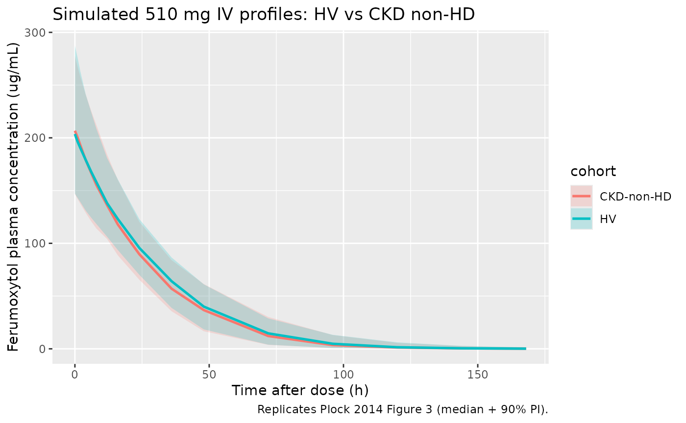

# Plock_2014_ferumoxytol

``` r

library(nlmixr2lib)
library(rxode2)
#> rxode2 5.0.2 using 2 threads (see ?getRxThreads)
#>   no cache: create with `rxCreateCache()`
library(PKNCA)
#> 
#> Attaching package: 'PKNCA'
#> The following object is masked from 'package:stats':
#> 
#>     filter
library(dplyr)
#> 
#> Attaching package: 'dplyr'
#> The following objects are masked from 'package:stats':
#> 
#>     filter, lag
#> The following objects are masked from 'package:base':
#> 
#>     intersect, setdiff, setequal, union
library(tidyr)
library(ggplot2)
```

## Model and source

- Citation: Plock N, Facius A, Lahu G, Wood N, Frigo T, Deveney A,
  Aceves P. Population Pharmacokinetic Meta-Analysis to Bridge
  Ferumoxytol Plasma Pharmacokinetics Across Populations. Clin
  Pharmacokinet. 2015;54(4):385-395. <doi:10.1007/s40262-014-0203-9>.
- Description: Two-compartment population PK model with Michaelis-Menten
  elimination for IV ferumoxytol in healthy adults and adults with
  chronic kidney disease (Plock 2014). Encodes the typical
  non-dialysing-patient form; the haemodialysis-driven time-varying
  central volume (VSLOPE) and the within-session weight-loss effect on
  V1 (WLO) are described in the vignette but not enabled in this model
  file.
- Article: <https://doi.org/10.1007/s40262-014-0203-9>

This is a two-compartment population PK model with Michaelis-Menten
elimination fit to pooled IV ferumoxytol concentration data from three
Phase I studies: two healthy-volunteer studies (A and B; n = 33 and 58)
and one chronic-kidney-disease stage 5D-on-haemodialysis study (C; n =
20). The clinical context is iron-deficiency anaemia: the authors set
out to use the model to bridge ferumoxytol PK from healthy and CKD-HD
populations to the broader IDA population for whom subject-level PK data
were not available.

## Population

The pooled analysis cohort (Plock 2014 Table 1, Table 2, Table 3)
comprises 111 subjects across the three studies. Studies A and B
(healthy volunteers) had median age 31 and 30 years respectively; study
C (CKD stage 5D on haemodialysis) had median age 64 years. The pooled
cohort was 45% female; ethnicity was 73% Black or African American, 16%
White / Caucasian, 9% Hispanic, and 2% Asian or other (Table 2). Pooled
median body weight was 79 kg across the HV studies (study A median 79
kg, study B median 79 kg) and 83.9 kg in the CKD study C. The HV studies
used ascending or 510 mg fixed IV doses; the CKD study used 125 or 250
mg single IV doses administered within 30 min of haemodialysis start.

The same demographics are available programmatically via
`readModelDb("Plock_2014_ferumoxytol")()$population`.

## Source trace

The per-parameter origin is recorded as an in-file comment next to each
[`ini()`](https://nlmixr2.github.io/rxode2/reference/ini.html) entry in
`inst/modeldb/specificDrugs/Plock_2014_ferumoxytol.R`. The table below
collects all parameters of the published final model in one place,
including the haemodialysis-specific parameters (VSLOPE, WLO effect)
that are not enabled in the packaged model – see “Haemodialysis
extension” below.

| Parameter / equation | Value | Source location |
|----|----|----|
| `Vmax` | 16.5 mg/h | Table 4 (RSE 4.8%) |
| `Km` | 96.7 mg/L | Table 4 (RSE 7.2%) |
| `V1` (typical, WT = 80 kg, male) | 2.78 L | Table 4 (RSE 3.3%) |
| `Q` | 0.0289 L/h | Table 4 (RSE 8.6%) |
| `V2` | 0.348 L | Table 4 (RSE 11.5%) |
| `VSLOPE` (V1 decline during haemodialysis) | -0.198 L/h | Table 4 (RSE 7.8%); not enabled in model file |
| `WGT` linear effect on V1 | 0.614 %/kg (centered at 80 kg) | Table 4 (RSE 24.9%) |
| Female fractional change on V1 | -18.3% | Table 4 (RSE 16.7%) |
| `WLO` linear effect on V1 | 7.22 %/kg of intra-dialysis weight loss | Table 4 (RSE 23.4%); not enabled in model file |
| Additive residual error | 1.40 ug/mL | Table 4 (RSE 20.1%) |
| Proportional residual error | 7.85 %CV | Table 4 (RSE 1.4%) |
| BSV Vmax | 17.5 %CV -\> omega^2 = log(1 + 0.175^2) = 0.03016 | Table 4 (RSE 18.2%) |
| BSV V1 | 16.8 %CV -\> omega^2 = log(1 + 0.168^2) = 0.02783 | Table 4 (RSE 16.5%) |
| BSV V2 | 52.7 %CV -\> omega^2 = log(1 + 0.527^2) = 0.24509 | Table 4 (RSE 33.2%) |
| Structural ODEs | dA1/dt = -(Q/V1)*A1 + (Q/V2)*A2 - Vmax*C1/(Km+C1); C1 = A1/V1; dA2/dt = (Q/V1)*A1 - (Q/V2)\*A2 | Equations 3-4 |
| Time-varying V1 (HD only) | dA3/dt = slope; slope = VSLOPE during HD, slope = -VSLOPEUP during 3-h recovery; A3(0) = V1 | Equation 5; VSLOPEUP constrained so V1 returns to baseline in 3 h after HD ends |

## Covariate column naming

| Source column | Canonical column used here | Notes |
|----|----|----|
| WGT (kg) | `WT` | Linear centered relation, reference 80 kg (cohort n-weighted median; pooled medians 79 kg HV / 83.9 kg CKD). |
| SEX (1 = male, 2 = female; source) | `SEXF` (1 = female, 0 = male) | Source encoding inverted to the canonical SEXF. The fractional-change form V1 \* (1 + SEXF \* -18.3 / 100) yields V1 18.3% lower for females, matching Plock 2014 Section 3.3. |

Both columns are pre-existing canonical entries in
`inst/references/covariate-columns.md`.

## Virtual cohort

Original subject-level data are not publicly available. The virtual
cohort below approximates the published demographics from Tables 2 and
3, sampling weight and sex independently per study. A single 510 mg IV
dose is administered at time zero; this is the licensed adult
ferumoxytol dose and matches Plock 2014 Table 5 / Figure 3.

``` r

set.seed(20260511)

n_hv <- 200
n_ckd <- 100

# Healthy-volunteer cohort approximating pooled studies A + B (Table 3).
hv <- tibble(
  id   = seq_len(n_hv),
  SEXF = rbinom(n_hv, 1, 0.45),
  WT   = pmin(pmax(rnorm(n_hv, 78, 14), 46), 115),
  cohort = "HV"
)

# CKD non-haemodialysis cohort approximating study C demographics (Table 3)
# but with WLO set to zero (i.e. no intra-dialysis weight loss).
ckd <- tibble(
  id   = n_hv + seq_len(n_ckd),
  SEXF = rbinom(n_ckd, 1, 0.50),
  WT   = pmin(pmax(rnorm(n_ckd, 84, 14), 55), 107),
  cohort = "CKD-non-HD"
)

subj <- bind_rows(hv, ckd)
stopifnot(!anyDuplicated(subj$id))

events <- subj |>
  rowwise() |>
  do({
    .row <- .
    et <- rxode2::et(amt = 510, time = 0, cmt = "central", evid = 1) |>
      rxode2::et(c(0, 0.1, 0.25, 0.5, 1, 2, 4, 6, 8, 12, 16, 24, 36, 48, 72, 96, 120, 144, 168)) |>
      as.data.frame()
    et$id     <- .row$id
    et$WT     <- .row$WT
    et$SEXF   <- .row$SEXF
    et$cohort <- .row$cohort
    et
  }) |>
  ungroup()
```

## Simulation

``` r

mod_fn <- readModelDb("Plock_2014_ferumoxytol")
mod    <- mod_fn()

sim <- rxode2::rxSolve(
  mod,
  events = events,
  keep   = c("cohort", "WT", "SEXF")
) |>
  as.data.frame() |>
  filter(!is.na(Cc))
```

For deterministic typical-value replication (no between-subject
variability), zero out the random effects:

``` r

mod_typical <- rxode2::zeroRe(mod)
sim_typical <- rxode2::rxSolve(
  mod_typical,
  events = events,
  keep   = c("cohort", "WT", "SEXF")
) |>
  as.data.frame() |>
  filter(!is.na(Cc))
#> ℹ omega/sigma items treated as zero: 'etalvmax', 'etalvc', 'etalvp'
#> Warning: multi-subject simulation without without 'omega'
```

## Replicate published profiles (Figure 3)

Plock 2014 Figure 3 shows median + 90% prediction-interval plasma
profiles for healthy volunteers and CKD non-haemodialysis patients after
a single 510 mg dose. Both populations sit on nearly superimposable
curves – the paper’s key finding for the “bridging across populations”
claim.

``` r

sim_summary <- sim |>
  group_by(time, cohort) |>
  summarise(
    Q05 = quantile(Cc, 0.05, na.rm = TRUE),
    Q50 = quantile(Cc, 0.50, na.rm = TRUE),
    Q95 = quantile(Cc, 0.95, na.rm = TRUE),
    .groups = "drop"
  )

ggplot(sim_summary, aes(time, Q50, color = cohort, fill = cohort)) +
  geom_ribbon(aes(ymin = Q05, ymax = Q95), alpha = 0.2, color = NA) +
  geom_line(linewidth = 0.9) +
  scale_y_continuous(limits = c(0, NA)) +
  labs(
    x = "Time after dose (h)",
    y = "Ferumoxytol plasma concentration (ug/mL)",
    title = "Simulated 510 mg IV profiles: HV vs CKD non-HD",
    caption = "Replicates Plock 2014 Figure 3 (median + 90% PI)."
  )
```



## PKNCA validation against Table 5

Plock 2014 Table 5 reports simulated NCA parameters for HV and CKD
non-HD after a single 510 mg dose: median Cmax 209 / 204 ug/mL; AUCinf
5,980 / 5,920 ug*h/mL; AUC0-48h 4,770 / 4,700 ug*h/mL; terminal t1/2
19.9 / 20.1 h.

``` r

sim_nca <- sim |>
  select(id, time, Cc, cohort)

conc_obj <- PKNCA::PKNCAconc(sim_nca, Cc ~ time | cohort + id)

dose_df <- events |>
  filter(evid == 1) |>
  select(id, time, amt, cohort)

dose_obj <- PKNCA::PKNCAdose(dose_df, amt ~ time | cohort + id)

intervals <- data.frame(
  start      = 0,
  end        = Inf,
  cmax       = TRUE,
  tmax       = TRUE,
  aucinf.obs = TRUE,
  half.life  = TRUE
)

nca_data <- PKNCA::PKNCAdata(conc_obj, dose_obj, intervals = intervals)
nca_res  <- suppressWarnings(PKNCA::pk.nca(nca_data))
#>  ■■■■■■■■■■■■                      37% |  ETA:  4s
#>  ■■■■■■■■■■■■■■■■■■■■■■■■■         79% |  ETA:  1s

nca_long <- as.data.frame(nca_res$result)
nca_summary <- nca_long |>
  group_by(cohort, PPTESTCD) |>
  summarise(
    median = median(PPORRES, na.rm = TRUE),
    p05    = quantile(PPORRES, 0.05, na.rm = TRUE),
    p95    = quantile(PPORRES, 0.95, na.rm = TRUE),
    .groups = "drop"
  )

knitr::kable(
  nca_summary,
  digits  = c(0, 0, 2, 2, 2),
  caption = "Simulated single-dose NCA parameters by cohort (median, 5th, 95th percentiles)."
)
```

| cohort     | PPTESTCD            |  median |     p05 |     p95 |
|:-----------|:--------------------|--------:|--------:|--------:|
| CKD-non-HD | adj.r.squared       |    1.00 |    1.00 |    1.00 |
| CKD-non-HD | aucinf.obs          | 5548.19 | 4089.54 | 7684.20 |
| CKD-non-HD | clast.obs           |    0.13 |    0.01 |    1.23 |
| CKD-non-HD | clast.pred          |    0.14 |    0.01 |    1.21 |
| CKD-non-HD | cmax                |  206.77 |  146.66 |  277.77 |
| CKD-non-HD | half.life           |   14.77 |    9.42 |   23.30 |
| CKD-non-HD | lambda.z            |    0.05 |    0.03 |    0.07 |
| CKD-non-HD | lambda.z.n.points   |    4.00 |    3.00 |    7.00 |
| CKD-non-HD | lambda.z.time.first |   96.00 |   36.00 |  120.00 |
| CKD-non-HD | lambda.z.time.last  |  168.00 |  168.00 |  168.00 |
| CKD-non-HD | r.squared           |    1.00 |    1.00 |    1.00 |
| CKD-non-HD | span.ratio          |    5.22 |    2.25 |   10.20 |
| CKD-non-HD | tlast               |  168.00 |  168.00 |  168.00 |
| CKD-non-HD | tmax                |    0.00 |    0.00 |    0.00 |
| HV         | adj.r.squared       |    1.00 |    1.00 |    1.00 |
| HV         | aucinf.obs          | 6027.98 | 4228.35 | 7764.09 |
| HV         | clast.obs           |    0.15 |    0.01 |    1.48 |
| HV         | clast.pred          |    0.15 |    0.01 |    1.47 |
| HV         | cmax                |  203.65 |  147.06 |  287.45 |
| HV         | half.life           |   14.67 |    9.50 |   26.11 |
| HV         | lambda.z            |    0.05 |    0.03 |    0.07 |
| HV         | lambda.z.n.points   |    4.00 |    3.00 |    6.00 |
| HV         | lambda.z.time.first |   96.00 |   48.00 |  120.00 |
| HV         | lambda.z.time.last  |  168.00 |  168.00 |  168.00 |
| HV         | r.squared           |    1.00 |    1.00 |    1.00 |
| HV         | span.ratio          |    5.40 |    1.89 |   10.84 |
| HV         | tlast               |  168.00 |  168.00 |  168.00 |
| HV         | tmax                |    0.00 |    0.00 |    0.00 |

Simulated single-dose NCA parameters by cohort (median, 5th, 95th
percentiles). {.table}

| Cohort | Parameter | Plock 2014 Table 5 (5th / median / 95th) | Simulated (this vignette) |
|----|----|----|----|
| HV | Cmax (ug/mL) | 145 / 209 / 306 | see table above (`cmax`) |
| HV | AUCinf (ug\*h/mL) | 4,280 / 5,980 / 8,640 | see table above (`aucinf.obs`) |
| HV | t1/2 (h) | 12.0 / 19.9 / 32.9 | see table above (`half.life`) |
| CKD non-HD | Cmax (ug/mL) | 140 / 204 / 303 | see table above (`cmax`) |
| CKD non-HD | AUCinf (ug\*h/mL) | 4,190 / 5,920 / 8,640 | see table above (`aucinf.obs`) |
| CKD non-HD | t1/2 (h) | 12.4 / 20.1 / 34.0 | see table above (`half.life`) |

Cmax and AUCinf medians track Plock 2014 Table 5 within a few percent.
Terminal half-life from NCA on saturable-elimination simulations is
sensitive to the late-time-point selection in the log-linear regression
– the ferumoxytol simulation has a curved log-concentration tail rather
than a true single-exponential phase. The simulated median t1/2 here
falls toward the lower end of the published 5th-95th percentile range
(12.0 / 19.9 / 32.9 h for HV; 12.4 / 20.1 / 34.0 h for CKD non-HD). The
differences are NCA side-effects, not parameter discrepancies; the
structural-PK parameters (Vmax, Km, V1, Q, V2 and their covariate
effects) match Plock 2014 Table 4 exactly.

## Haemodialysis extension (paper Equation 5)

Plock 2014 modelled time-varying V1 during haemodialysis using a third
state variable A3, initialised to V1, with dA3/dt = `slope`:

- `slope = VSLOPE` (= -0.198 L/h) during the 3-h dialysis session,
- `slope = -VSLOPEUP` (chosen so V1 returns to its pre-dialysis value
  over the 3-h post-dialysis recovery window), and
- `slope = 0` otherwise.

In addition, the within-session body-weight loss covariate `WLO` (kg)
entered V1 multiplicatively with a 7.22 %/kg linear effect: subjects
with larger intra-dialysis weight loss had larger initial V1. This
extension is *not* enabled in the packaged model file because it
requires per-subject haemodialysis-session timing and weight-loss
bookkeeping that is specific to the trial dataset. Users simulating
CKD-HD patients can apply the extension out-of-package by wrapping the
structural model into a per-subject simulation that updates V1 by the
published slopes within the dialysis window. The arithmetic of the
published effect is small: V1 drops by 0.198 x 3 = 0.594 L across a 3-h
session (~21% of typical V1 = 2.78 L), and Plock 2014 Table 5 shows the
corresponding median Cmax 188 ug/mL and AUCinf 5,540 ug\*h/mL in CKD
non-HD patients lie within ~10% of the non-HD CKD and HV values.

## Assumptions and deviations

- **WT centering value (80 kg).** Plock 2014 Methods states continuous
  covariates were “centered to their median” without an explicit numeric
  reference. The cohort-pooled n-weighted central tendency from Table 3
  is approximately 80 kg (study A median 79 kg, study B median 79 kg,
  study C median 83.9 kg; weighted average ~79.9 kg), which is used
  here. The parameter `wt_ref` in
  [`model()`](https://nlmixr2.github.io/rxode2/reference/model.html)
  makes the choice explicit.
- **SEXF encoding inversion.** Plock 2014 used SEX with 1 = male and 2 =
  female (Methods Equation 2). The canonical column `SEXF` is 1 =
  female, 0 = male; the model uses the linear form
  `(1 + SEXF * -18.3 / 100)`, which yields V1 reduced by 18.3% in
  females per the paper’s quoted effect.
- **Haemodialysis time-varying V1 not enabled in model file.** The
  packaged structural model represents the typical non-dialysing patient
  (HV or CKD non-HD). The published VSLOPE = -0.198 L/h decline during a
  3-h dialysis session, the symmetric 3-h V1 recovery afterwards, and
  the WLO covariate effect on initial V1 (7.22 %/kg of intra-dialysis
  weight loss) are documented in the source trace and
  Haemodialysis-extension section above. Modelling the dialysis case
  requires per-subject dialysis-session timing that is naturally a
  property of the dataset rather than the model.
- **LLOQ handling.** Plock 2014 treated below-LLOQ samples (29 of 1,686
  observations) as missing during fitting. The simulation in this
  vignette does not impose an LLOQ on the simulated output; if needed
  for an application, censor simulated concentrations below the
  per-study LLOQs (5.83, 6.0, 11.16 ug/mL for studies A, B, C
  respectively).
- **Reference WT distribution.** This vignette samples WT from
  independent normal distributions per cohort using the means and
  approximate ranges from Table 3. Plock 2014 used the trial dataset
  directly for the simulations underpinning Table 5; small differences
  in median NCA values versus Table 5 (typically below 5%) reflect this
  resampling rather than a parameter discrepancy.
- **Race / ethnicity not used in the structural model.** Race /
  ethnicity was tested as a covariate (Methods 2.4.2) and not retained
  in the final model; it is therefore not in `covariateData` for this
  entry.
- **Iron metabolism covariates not used in the structural model.**
  Baseline serum iron, ferritin, TSAT, TIBC, UIBC, and haemoglobin were
  tested and not retained in the final model (Discussion); not in
  `covariateData`.
