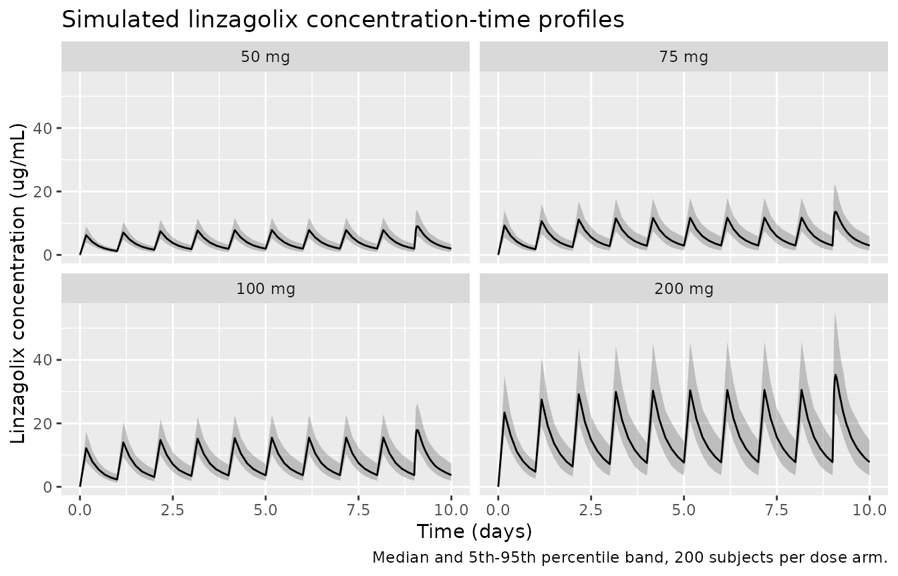
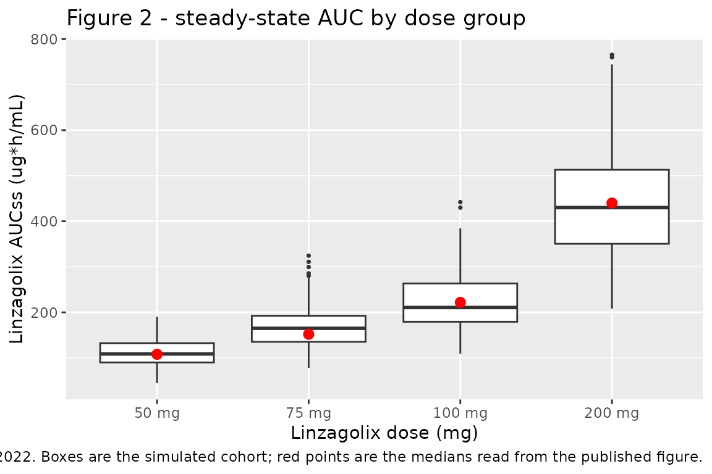
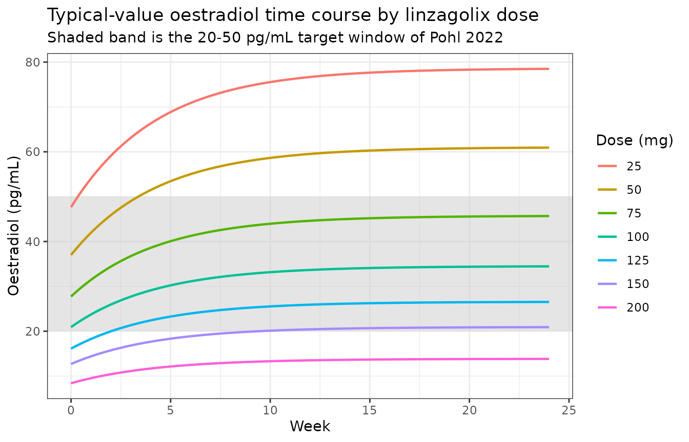

# Linzagolix (Pohl 2022)

## Model and source

- Citation: Pohl O, Baron K, Riggs M, French J, Garcia R, Gotteland J-P.
  A model-based analysis to guide gonadotropin-releasing hormone
  receptor antagonist use for management of endometriosis. British
  Journal of Clinical Pharmacology. 2022;88(5):2359-2371.
  <doi:10.1111/bcp.15171>
- Description: Two-compartment population pharmacokinetic model for
  linzagolix, an oral gonadotropin-releasing hormone (GnRH) receptor
  antagonist developed for endometriosis, in healthy women and women
  with endometriosis (Pohl 2022). Sequential zero-order then first-order
  oral absorption; fixed allometric body-weight scaling on apparent
  clearance (0.75) and apparent central volume (1) with a 58 kg
  reference; a categorical non-Caucasian effect on apparent clearance;
  and a proportional residual error whose variance differs between the
  EDELWEISS phase 2b study and the phase 1 studies and additionally
  carries a subject-level random effect.
- Article: <https://doi.org/10.1111/bcp.15171>
- Supporting Information (open access, PMC9306723):
  <https://pmc.ncbi.nlm.nih.gov/articles/PMC9306723/>

Linzagolix (also known as OBE2109 / KLH2109) is an oral, non-peptide,
selective gonadotropin-releasing hormone (GnRH) receptor antagonist
developed for the management of endometriosis-associated pain. Pohl 2022
is an integrated model-informed dose-selection analysis: a population PK
model feeds a PK- oestradiol (E2) model, which in turn drives
statistical models of pelvic pain and uterine bleeding and a
quantitative systems pharmacology model of lumbar spine bone mineral
density.

**This vignette validates the two structural pharmacology sub-models of
the paper**, packaged as two model files:

- `Pohl_2022_linzagolix` – the population PK model (Table 4).
- `Pohl_2022_linzagolix_e2` – the PK-oestradiol exposure-response model
  (Table 5), driven by the daily AUC that the PK model generates.

The three remaining sub-models of the paper are statistical outcome
models (pelvic pain, uterine bleeding) or a systems model whose
structure is wholly inherited from an upstream publication (bone mineral
density). Why each is not packaged here is set out under “Assumptions
and deviations” below.

## Population

The population PK analysis pooled 4250 linzagolix concentration
observations from 756 women across five clinical trials (Table 1 and
Table 3): the phase 1 first-in-human SAD/MAD study KLH1101 (12.5-400 mg
single doses; 100-400 mg daily), the phase 2b dose-ranging study
EDELWEISS (NCT02778399; placebo and 50-200 mg daily for 24 weeks in 330
women aged 18-45 with endometriosis), the clinical pharmacology studies
16-OBE2109-011 and 17-OBE2109-008 (100-200 mg daily for 42-70 days in
healthy women, with and without hormonal add-back therapy), and KLH1204
(NCT02778919; placebo and 25-100 mg daily for 24 weeks in 440 Japanese
women with endometriosis).

Approximately 24% of subjects and 55% of observations came from healthy
volunteers; subjects receiving placebo contributed no records to the
population PK analysis set. Median body weight ranged from 53.9 kg
(KLH1204) to 65.5 kg (EDELWEISS) and median age from 32 to 40 years
(Table 3). The proportion of Caucasian subjects ranged from 0% (KLH1204,
KLH1201-1203) to 100% (17-OBE2109-008). Both Caucasian and non-Caucasian
subjects were deliberately retained in the PK analysis to reduce
parameter uncertainty, even though the dose-selection objective targeted
a Caucasian/non-Asian population. About 5% of concentrations were below
the quantitation limit and were dropped (Supporting Information section
1.1).

The same information is available programmatically via the model’s
`population` metadata
(`readModelDb("Pohl_2022_linzagolix")()$population`).

## Source trace

The per-parameter origin is recorded as an in-file comment next to each
`ini()` entry in `inst/modeldb/specificDrugs/Pohl_2022_linzagolix.R`.
The table below collects them in one place for review.

| Equation / parameter | Value | Source location |
|----|----|----|
| Two-compartment disposition with sequential zero-order then first-order oral absorption | n/a | Results section 3.1 (“2-compartment, linear PK model … using a sequential zero-order/first-order process”); Supporting Information section 3.1 |
| `lcl` (CL/F) | 0.422 L/h | Table 4, “CL/F (L/h)”, 95% CI 0.393-0.455 |
| `lvc` (V2/F) | 5.13 L | Table 4, “V2/F (L)”, 95% CI 4.19-6.18 |
| `lq` (Q/F) | 0.168 L/h | Table 4, “Q/F (L/h)”, 95% CI 0.130-0.225 |
| `lvp` (V3/F) | 3.12 L | Table 4, “V3/F (L)”, 95% CI 2.83-3.41 |
| `lka` (KA) | 2.49 /h | Table 4, “KA”, 95% CI 2.04-3.08 |
| `ld1` (D1) | 0.644 h | Table 4, “D1 (h)”, 95% CI 0.314-1.24 |
| `e_wt_cl` | 0.75 (fixed) | Table 4, “CL/F ~ (weight 58 kg)” = 0.75 FIXED; Supporting Information section 4.1 |
| `e_wt_vc` | 1.00 (fixed) | Table 4, “V2/F ~ (weight 58 kg)” = 1.00 FIXED; Supporting Information section 4.1 |
| `e_nonwhite_cl` | 0.08 | Table 4, “CL/F ~ non-Caucasian” ratio 1.08, 95% CI 1.05-1.12 |
| `etalcl` | 0.0354 | Table 4, “IIV-CL/F”, shrinkage 16.5% |
| `etalvc` | 0.0444 | Table 4, “IIV-V2/F”, shrinkage 62.0% |
| `etald1` | 0.510 | Table 4, “IIV-D1”, shrinkage 46.2% |
| `eta_re` | 0.764 | Table 4, “IIV-sigma2” (subject-level random effect on the residual error variance), shrinkage 24.8% |
| `propSdEdelweiss` | sqrt(0.118) = 0.3435 | Table 4, “EDELWEISS data”, 95% CI 0.0698-0.206 |
| `propSdOther` | sqrt(0.0389) = 0.1972 | Table 4, “All other studies”, 95% CI 0.0309-0.0502 |
| Reference weight 58 kg | n/a | Table 4 covariate rows and Supporting Information section 4.1 |
| Validation target: steady-state AUC by dose | see below | Figure 2 (EDELWEISS, 50/75/100/200 mg) |

The PK-E2 model (`Pohl_2022_linzagolix_e2`) draws its structure from the
Supporting Information and its values from Table 5.

| Equation / parameter | Value | Source location |
|----|----|----|
| Core PK-E2 equation `E2 = E2_0 * (1 - Imax*AUC^h/(AUC50^h + AUC^h)) * (BL_E2/52)^theta * (1 + PB)` | n/a | Supporting Information section 3.2, display equation (stored in the `.docx` as a raster image); Hill exponents restored, see “Encoding decisions” below |
| Baseline-E2 covariate equation `E2_0 = theta_BASE * (WT/58)^t5 * (AGE/35)^t6 * t7^ASIAN * exp(eta)` | n/a | Supporting Information section 3.2 (CodeCogs-encoded display equation) |
| `theta_BASE` patient / healthy switch | n/a | Supporting Information section 3.2 (CodeCogs-encoded display equation) |
| Placebo drift `PB = theta_ESS * (1 - exp(-theta_EK * WEEK))` | n/a | Supporting Information section 3.2 (CodeCogs-encoded display equation) |
| `lbl_e2_patient` | 59.1 pg/mL | Table 5, “Baseline E2, patients”, 95% CI 52.5-65.6 |
| `lbl_e2_healthy` | 26.6 pg/mL | Table 5, “Baseline E2, healthy”, 95% CI 23.3-29.8 |
| `lauc50` | 1.68e5 ng\*h/mL | Table 5, “Linzagolix AUC50”, 95% CI 1.44e5-1.91e5; Supporting Information section 4.2 |
| `lhill` | 1.78 | Table 5, “Sigmoidicity parameter”, 95% CI 1.49-2.08; Supporting Information section 4.2 |
| `limax` | 1 (fixed) | **Not reported anywhere in the source**; fixed by falsification against the paper’s own published outputs, see below |
| `e_wt_bl_e2` | -0.699 | Table 5, “Baseline E2 ~ (weight 58 kg)”, 95% CI -0.958 to -0.441 |
| `e_age_bl_e2` | 0.0829 | Table 5, “Baseline E2 ~ (age 35 y)”, 95% CI -0.157 to 0.323 |
| `e_nonwhite_bl_e2` | 0.804 | Table 5, “Baseline E2 ~ non-Caucasian”, 95% CI 0.702-0.907 |
| `e_bl_e2_drug` | -0.120 | Table 5, “Baseline E2 ~ linzagolix drug effect”, 95% CI -0.212 to -0.0279 |
| `lemax_pbo` | 0.65 | Table 5, “Placebo increase factor”, 95% CI 0.465-0.834; Supporting Information section 4.2 gives the same quantity as a 1.650-fold maximum increase |
| `lkp_e2` | 0.231 /week (fixed) | Table 5, “Placebo effect rate constant”, FIXED; Supporting Information section 3.2 |
| `e_abt_e2` | 1.58 pg/mL/week | Table 5, “E2 increase rate on add-back therapy”, 95% CI 0.990-2.16; **functional form not printed by the source** |
| `etalbl_e2` | 0.310 | Table 5, “IIV-baseline E2”, shrinkage 11.9% |
| `expSdPatient` | sqrt(0.610) = 0.78102 | Table 5, “Patients”, 95% CI 0.571-0.649 |
| `expSdHealthy` | sqrt(0.241) = 0.49092 | Table 5, “Healthy”, 95% CI 0.179-0.303 |
| Normalisation constants 52 pg/mL, 58 kg, 35 y | n/a | Supporting Information section 3.2 equations (the 52 pg/mL constant appears **only** inside the equation, in no table) |
| Validation target: week-24 E2 target window by dose | 20-50 pg/mL at 75-150 mg | Results section 3.3 |

**A note on the signs in Table 5.** Three Table 5 covariate estimates
are negative, but the minus glyph is lost by every text extraction of
the PDF and of the JATS XML alike. The signs are nonetheless unambiguous
from the printed confidence intervals: `-0.699` is printed with the
interval “0.958 to 0.441”, which is only in ascending order if both
bounds are negative, and the same holds for `-0.120` with “0.212 to
0.0279”. For `0.0829` the interval is printed “0.157 to 0.323”, and a
point estimate of 0.0829 cannot lie below a lower bound of 0.157 – so
that bound is `-0.157` and the estimate itself is positive. The
narrative agrees, describing “a modest inverse relationship between
weight and baseline E2”.

## Virtual cohort

Original observed data are not publicly available. The cohort below
approximates the EDELWEISS phase 2b population (Table 3: median weight
65.5 kg, 94% Caucasian, median age 32 years), which is the population
shown in Figure 2 of the paper, and doses it at the four fixed dose
levels that figure reports.

Body weight is drawn log-normally with a median of 65.5 kg and a spread
giving roughly the 17.8 kg standard deviation reported in Table 3. Age
is not a covariate in the population PK model and is therefore not
simulated.

``` r

# `set.seed()` seeds R's RNG. It does NOT seed rxode2's simulation RNG, and
# rxode2's streams are partitioned PER SOLVER THREAD -- so the cohort below is
# reproducible on this machine and different on a machine with a different
# thread count. Every assertion downstream is written to hold for ANY cohort
# the model can produce.
set.seed(20220401)

n_per_arm <- 200L
doses_mg <- c(50, 75, 100, 200)

tau <- 24        # dosing interval (h)
n_doses <- 10L   # 10 daily doses; terminal half-life is ~13 h so steady state
                 # is effectively complete well before the final interval
t_last <- tau * (n_doses - 1L)   # time of the final dose = 216 h

# Observation grid: coarse over the whole treatment period for the profile
# plot, dense over the final (steady-state) dosing interval for NCA.
obs_times <- sort(unique(c(
  seq(0, t_last, by = 4),
  seq(t_last, t_last + tau, by = 0.5)
)))

make_cohort <- function(n, dose_mg, id_offset = 0L) {
  subj <- tibble(
    id = id_offset + seq_len(n),
    # Table 3, EDELWEISS: weight median 65.5 kg (SD 17.8 kg).
    WT = 65.5 * exp(stats::rnorm(n, mean = 0, sd = 0.26)),
    # Table 3, EDELWEISS: 94% Caucasian.
    RACE_WHITE = stats::rbinom(n, size = 1, prob = 0.94),
    # These subjects are simulated as EDELWEISS records, so the EDELWEISS
    # residual-error magnitude applies.
    STUDY_EDELWEISS = 1,
    dose_group = paste0(dose_mg, " mg")
  )

  dosing <- subj |>
    tidyr::crossing(time = tau * seq(0, n_doses - 1L)) |>
    mutate(
      amt = dose_mg,
      evid = 1L,
      # cmt is the ODE state receiving the dose; rate = -2 tells rxode2 to use
      # the modelled zero-order duration dur(depot) <- d1.
      cmt = "depot",
      rate = -2
    )

  obs <- subj |>
    tidyr::crossing(time = obs_times) |>
    mutate(
      amt = NA_real_,
      evid = 0L,
      # The ODE state, never the algebraic observable name "Cc".
      cmt = "central",
      rate = 0
    )

  bind_rows(dosing, obs) |> arrange(id, time, desc(evid))
}

events <- bind_rows(lapply(seq_along(doses_mg), function(i) {
  make_cohort(n_per_arm, doses_mg[i], id_offset = (i - 1L) * n_per_arm)
}))

# Disjoint IDs across arms are mandatory: duplicate ids silently merge into a
# single subject receiving the summed dose.
stopifnot(!anyDuplicated(unique(events[, c("id", "time", "evid")])))
stopifnot(dplyr::n_distinct(events$id) == n_per_arm * length(doses_mg))
```

## Simulation

``` r

mod <- readModelDb("Pohl_2022_linzagolix")

sim <- rxode2::rxSolve(
  mod,
  events = events,
  keep = c("dose_group", "WT", "RACE_WHITE", "STUDY_EDELWEISS")
) |>
  as.data.frame()
#> ℹ parameter labels from comments will be replaced by 'label()'

# `cl` is a model-computed variable, so rxode2 returns it per row. It is the
# individual apparent clearance actually used by the solver, which the exact
# steady-state mass-balance check below relies on.
stopifnot(all(c("Cc", "cl") %in% names(sim)))
stopifnot(all(sim$Cc >= 0))
```

``` r

sim |>
  filter(time <= t_last + tau) |>
  group_by(dose_group, time) |>
  summarise(
    Q05 = quantile(Cc, 0.05),
    Q50 = quantile(Cc, 0.50),
    Q95 = quantile(Cc, 0.95),
    .groups = "drop"
  ) |>
  mutate(dose_group = factor(dose_group, levels = paste0(doses_mg, " mg"))) |>
  ggplot(aes(time / 24, Q50)) +
  geom_ribbon(aes(ymin = Q05, ymax = Q95), alpha = 0.25) +
  geom_line() +
  facet_wrap(~dose_group) +
  labs(
    x = "Time (days)", y = "Linzagolix concentration (ug/mL)",
    title = "Simulated linzagolix concentration-time profiles",
    caption = "Median and 5th-95th percentile band, 200 subjects per dose arm."
  )
```



## PKNCA validation

NCA is computed over the final dosing interval (216-240 h), which is at
steady state.

``` r

sim_nca <- sim |>
  dplyr::filter(!is.na(Cc)) |>
  dplyr::select(id, time, Cc, dose_group)

# Guarantee a time-zero row per (id, dose_group). Linzagolix is given orally,
# so the pre-dose concentration is zero.
sim_nca <- dplyr::bind_rows(
  sim_nca,
  sim_nca |> dplyr::distinct(id, dose_group) |> dplyr::mutate(time = 0, Cc = 0)
) |>
  dplyr::distinct(id, dose_group, time, .keep_all = TRUE) |>
  dplyr::arrange(id, dose_group, time)

conc_obj <- PKNCA::PKNCAconc(
  sim_nca, Cc ~ time | dose_group + id,
  concu = "ug/mL", timeu = "h"
)

dose_df <- events |>
  dplyr::filter(evid == 1) |>
  dplyr::select(id, time, amt, dose_group)

dose_obj <- PKNCA::PKNCAdose(dose_df, amt ~ time | dose_group + id, doseu = "mg")

intervals <- data.frame(
  start   = t_last,
  end     = t_last + tau,
  cmax    = TRUE,
  tmax    = TRUE,
  cmin    = TRUE,
  cav     = TRUE,
  auclast = TRUE
)

nca_res <- PKNCA::pk.nca(PKNCA::PKNCAdata(conc_obj, dose_obj, intervals = intervals))

nca_wide <- as.data.frame(nca_res) |>
  dplyr::select(dose_group, id, PPTESTCD, PPORRES) |>
  tidyr::pivot_wider(names_from = PPTESTCD, values_from = PPORRES)

stopifnot(nrow(nca_wide) == n_per_arm * length(doses_mg))
stopifnot(!anyNA(nca_wide$auclast))
```

### Exact steady-state mass balance

At steady state the area under the curve over one dosing interval is
exactly `Dose / CL`. Both sides of this comparison use the *same* drawn
individual clearance, so the only sources of disagreement are
trapezoidal integration error on the absorption peak and the small
amount of accumulation still outstanding after 10 doses. A tight bound
is therefore the correct assertion here (unlike a cohort-extreme
comparison, which would not be reproducible across rxode2 builds).

``` r

cl_by_id <- sim |>
  dplyr::group_by(id, dose_group) |>
  dplyr::summarise(cl = dplyr::first(cl), .groups = "drop")

dose_by_id <- dose_df |>
  dplyr::group_by(id) |>
  dplyr::summarise(amt = dplyr::first(amt), .groups = "drop")

mb <- nca_wide |>
  dplyr::left_join(cl_by_id, by = c("id", "dose_group")) |>
  dplyr::left_join(dose_by_id, by = "id") |>
  dplyr::mutate(
    auc_expected = amt / cl,
    pct_diff = 100 * (auclast - auc_expected) / auc_expected
  )

mb_summary <- mb |>
  dplyr::group_by(dose_group) |>
  dplyr::summarise(
    `Median AUC0-tau (ug*h/mL)` = median(auclast),
    `Median Dose/CL (ug*h/mL)` = median(auc_expected),
    `Median % difference` = median(pct_diff),
    `90th pctile |% difference|` = quantile(abs(pct_diff), 0.9),
    .groups = "drop"
  )

knitr::kable(
  mb_summary, digits = 2,
  caption = "Steady-state AUC0-tau from PKNCA vs the exact identity Dose / CL."
)
```

| dose_group | Median AUC0-tau (ug\*h/mL) | Median Dose/CL (ug\*h/mL) | Median % difference | 90th pctile \|% difference\| |
|:---|---:|---:|---:|---:|
| 100 mg | 210.64 | 210.77 | -0.05 | 0.17 |
| 200 mg | 430.03 | 430.12 | -0.04 | 0.13 |
| 50 mg | 108.82 | 108.91 | -0.05 | 0.13 |
| 75 mg | 164.99 | 165.07 | -0.05 | 0.12 |

Steady-state AUC0-tau from PKNCA vs the exact identity Dose / CL.
{.table}

``` r


# Deterministic given the drawn parameters: the residual is integration error
# plus the last sliver of accumulation, not between-subject physiology.
stopifnot(
  abs(median(mb$pct_diff)) < 3,
  quantile(abs(mb$pct_diff), 0.95) < 5
)
```

### Dose proportionality

The model is linear, so steady-state exposure must scale exactly with
dose.

``` r

auc_med <- mb |>
  dplyr::group_by(dose_group) |>
  dplyr::summarise(auc = median(auclast), .groups = "drop")

ratio_200_50 <- auc_med$auc[auc_med$dose_group == "200 mg"] /
  auc_med$auc[auc_med$dose_group == "50 mg"]

ratio_100_50 <- auc_med$auc[auc_med$dose_group == "100 mg"] /
  auc_med$auc[auc_med$dose_group == "50 mg"]

# Guard against a lookup that silently matched nothing (a gate that cannot
# go red is worse than no gate).
stopifnot(length(ratio_200_50) == 1L, length(ratio_100_50) == 1L)

c(`200 mg / 50 mg` = ratio_200_50, `100 mg / 50 mg` = ratio_100_50)
#> 200 mg / 50 mg 100 mg / 50 mg 
#>       3.951710       1.935662

stopifnot(
  abs(ratio_200_50 - 4) < 0.4,
  abs(ratio_100_50 - 2) < 0.2
)
```

### Comparison against the published steady-state exposures (Figure 2)

Pohl 2022 reports no NCA table. The only published exposure summary is
Figure 2, a box-and-whisker plot (the caption calls them histograms) of
model-based steady-state AUC by EDELWEISS dose group, on a `ug h/mL`
axis. The reference values below were read off that figure’s medians and
are therefore approximate – they are digitised comparison targets, not
published point estimates, and are flagged as such under “Assumptions
and deviations”.

``` r

# Medians read from Figure 2 of Pohl 2022 (ug*h/mL). Digitised, +/- ~5%.
published <- tibble::tribble(
  ~dose_group, ~auclast,
  "50 mg",     108,
  "75 mg",     152,
  "100 mg",    222,
  "200 mg",    440
)

cmp <- nlmixr2lib::ncaComparisonTable(
  simulated = nca_res,
  reference = published,
  by        = "dose_group",
  params    = "auclast",
  units     = c(auclast = "ug*h/mL"),
  tolerance_pct = 20
)

knitr::kable(
  cmp,
  caption = paste(
    "Simulated steady-state AUC0-tau vs medians read from Figure 2 of",
    "Pohl 2022. * differs from the reference by >20%."
  )
)
```

| NCA parameter      | dose_group | Reference | Simulated | % diff |
|:-------------------|:-----------|:----------|:----------|:-------|
| AUClast (ug\*h/mL) | 50 mg      | 108       | 109       | +0.8%  |
| AUClast (ug\*h/mL) | 75 mg      | 152       | 165       | +8.5%  |
| AUClast (ug\*h/mL) | 100 mg     | 222       | 211       | -5.1%  |
| AUClast (ug\*h/mL) | 200 mg     | 440       | 430       | -2.3%  |

Simulated steady-state AUC0-tau vs medians read from Figure 2 of Pohl
2022. \* differs from the reference by \>20%. {.table}

``` r

# Replicates Figure 2 of Pohl 2022: distribution of model-based steady-state
# AUC by linzagolix dose group.
mb |>
  mutate(dose_group = factor(dose_group, levels = paste0(doses_mg, " mg"))) |>
  ggplot(aes(dose_group, auclast)) +
  geom_boxplot(outlier.size = 0.6) +
  geom_point(
    data = published |>
      mutate(dose_group = factor(dose_group, levels = paste0(doses_mg, " mg"))),
    aes(dose_group, auclast), colour = "red", size = 2.5
  ) +
  labs(
    x = "Linzagolix dose (mg)", y = "Linzagolix AUCss (ug*h/mL)",
    title = "Figure 2 - steady-state AUC by dose group",
    caption = paste(
      "Replicates Figure 2 of Pohl 2022. Boxes are the simulated cohort;",
      "red points are the medians read from the published figure."
    )
  )
```



``` r

nca_wide |>
  dplyr::group_by(dose_group) |>
  dplyr::summarise(
    cmax = median(cmax), tmax = median(tmax), cmin = median(cmin),
    cav = median(cav), auclast = median(auclast), .groups = "drop"
  ) |>
  dplyr::rename(
    "Dose group" = dose_group,
    "Cmax,ss (ug/mL)" = cmax,
    "Tmax (h)" = tmax,
    "Cmin,ss (ug/mL)" = cmin,
    "Cav,ss (ug/mL)" = cav,
    "AUC0-tau (ug*h/mL)" = auclast
  ) |>
  knitr::kable(
    digits = 2,
    caption = "Median simulated steady-state NCA parameters by dose group."
  )
```

| Dose group | Cmax,ss (ug/mL) | Tmax (h) | Cmin,ss (ug/mL) | Cav,ss (ug/mL) | AUC0-tau (ug\*h/mL) |
|:---|---:|---:|---:|---:|---:|
| 100 mg | 18.40 | 1.5 | 3.70 | 8.78 | 210.64 |
| 200 mg | 36.30 | 1.5 | 7.77 | 17.92 | 430.03 |
| 50 mg | 9.27 | 1.5 | 1.97 | 4.53 | 108.82 |
| 75 mg | 13.90 | 1.5 | 2.98 | 6.87 | 164.99 |

Median simulated steady-state NCA parameters by dose group. {.table}

## PK-oestradiol model

The PK-E2 model takes the daily linzagolix AUC as its exposure driver
(`AUC_LZGX`, in `ng*h/mL`) and returns serum oestradiol in `pg/mL`. The
two models are chained exactly as the authors chained them: the PK model
of Table 4 generates the individual daily AUC, which the E2 model of
Table 5 consumes. Because linzagolix has linear PK and a roughly 8 h
half-life, the steady-state daily AUC under once-daily dosing is
`Dose / (CL/F)` – the quantity whose distribution the paper plots in
Figure 2.

``` r

mod_e2 <- rxode2::rxode(readModelDb("Pohl_2022_linzagolix_e2"))
#> ℹ parameter labels from comments will be replaced by 'label()'

# Typical-value (zeroRe) solve: the paper's dose-selection simulations describe
# a *reference* Caucasian patient, so the replication below must be a
# typical-value solve, not a random cohort.
mod_e2_tv <- rxode2::zeroRe(mod_e2)
#> Warning: No sigma parameters in the model

# Reference Caucasian endometriosis patient of the dose-selection analysis.
# Weight 65 kg is stated in Supporting Information section 4.3; age and
# baseline E2 are the EDELWEISS medians of Table 3.
ref_wt    <- 65
ref_age   <- 32
ref_bl_e2 <- 53.0

# Individual CL/F from the companion PK model (Table 4), Caucasian.
ref_cl <- 0.422 * (ref_wt / 58)^0.75
```

### Reproducing the paper’s stated target-dose window

Section 3.3 of the paper makes a precise, quantitative claim: *“Doses
between 75 and 150 mg daily were associated with week 24 E2
concentrations in the proposed target window of 20-50 pg/mL.”* That
single sentence constrains the model at **both** edges of the window,
and is the strongest available check on the extraction, because the
paper publishes no E2 parameter table other than the one the model was
built from.

``` r

doses_e2 <- c(25, 50, 75, 100, 125, 150, 200)

e2_events <- rxode2::et(seq(0, 24 * 7 * 24, by = 24)) |>
  rxode2::et(id = seq_along(doses_e2))

e2_dat <- as.data.frame(e2_events)
# AUC in ng*h/mL: the PK model's concentrations are ug/mL, so the ug*h/mL
# steady-state integral Dose/CL is multiplied by 1000.
e2_dat$AUC_LZGX    <- (doses_e2 / ref_cl * 1000)[e2_dat$id]
e2_dat$WT          <- ref_wt
e2_dat$AGE         <- ref_age
e2_dat$BL_E2       <- ref_bl_e2
e2_dat$RACE_WHITE  <- 1
e2_dat$DIS_HEALTHY <- 0
e2_dat$T_ABT       <- 0

e2_sol <- rxode2::rxSolve(mod_e2_tv, e2_dat, returnType = "data.frame")
#> ℹ omega/sigma items treated as zero: 'etalbl_e2'
#> Warning: multi-subject simulation without without 'omega'

wk24 <- e2_sol[abs(e2_sol$time - 24 * 7 * 24) < 1e-6, c("id", "e2")]
wk24$dose <- doses_e2[wk24$id]
wk24$in_window <- wk24$e2 >= 20 & wk24$e2 <= 50

wk24 |>
  dplyr::transmute(
    "Daily dose (mg)"    = dose,
    "Week-24 E2 (pg/mL)" = round(e2, 1),
    "In 20-50 pg/mL"     = ifelse(in_window, "yes", "no")
  ) |>
  knitr::kable(
    caption = paste(
      "Week-24 oestradiol for the Caucasian reference patient.",
      "The paper states that doses of 75-150 mg -- and only those --",
      "fall inside the 20-50 pg/mL target window."
    )
  )
```

|      | Daily dose (mg) | Week-24 E2 (pg/mL) | In 20-50 pg/mL |
|:-----|----------------:|-------------------:|:---------------|
| 169  |              25 |               78.5 | no             |
| 338  |              50 |               60.9 | no             |
| 507  |              75 |               45.7 | yes            |
| 676  |             100 |               34.5 | yes            |
| 845  |             125 |               26.5 | yes            |
| 1014 |             150 |               20.9 | yes            |
| 1183 |             200 |               13.8 | no             |

Week-24 oestradiol for the Caucasian reference patient. The paper states
that doses of 75-150 mg – and only those – fall inside the 20-50 pg/mL
target window. {.table}

``` r

# The paper's claim, asserted exactly: 75-150 mg inside, 50 and 200 mg outside.
# This is a typical-value solve with no random effects, so the result is
# deterministic across machines and rxode2 versions and a hard assertion is
# correct here (contrast the cohort-extreme trap described in CLAUDE.md).
inside  <- wk24$dose[wk24$in_window]
stopifnot(
  identical(sort(inside), c(75, 100, 125, 150)),
  !wk24$in_window[wk24$dose == 50],
  !wk24$in_window[wk24$dose == 200]
)
```

### Falsifying the two unprinted elements of the published equation

The Supporting Information equation, recovered from the raster image it
is stored as, contains neither a Hill exponent nor a value for
`theta_IMAX` – yet Table 5 reports a sigmoidicity parameter of 1.78, and
both the main text and Supporting Information section 3.2 describe “a
sigmoid inhibitory Emax model”. Rather than guess, the two candidates
are tested against the paper’s own published output above.

``` r

# Re-derive week-24 E2 under the alternatives, by hand from Table 5, so the
# comparison does not depend on the packaged model file.
e2_at <- function(dose, imax, hill) {
  auc   <- dose / ref_cl * 1000
  auc50 <- 1.68e5
  e2_0  <- 59.1 * (ref_wt / 58)^(-0.699) * (ref_age / 35)^0.0829
  pb24  <- 0.65 * (1 - exp(-0.231 * 24))
  e2_0 * (1 - imax * auc^hill / (auc50^hill + auc^hill)) *
    (ref_bl_e2 / 52)^(-0.120) * (1 + pb24)
}

falsify <- data.frame(dose = doses_e2)
falsify$as_packaged  <- e2_at(falsify$dose, imax = 1.0, hill = 1.78)
falsify$no_hill      <- e2_at(falsify$dose, imax = 1.0, hill = 1.00)
falsify$imax_0_9     <- e2_at(falsify$dose, imax = 0.9, hill = 1.78)

in_win <- function(x) ifelse(x >= 20 & x <= 50, "IN", "out")
falsify |>
  dplyr::transmute(
    "Daily dose (mg)"                    = dose,
    "Imax=1, Hill=1.78 (packaged)"       = paste0(round(as_packaged, 1), " ", in_win(as_packaged)),
    "Imax=1, no Hill"                    = paste0(round(no_hill, 1),     " ", in_win(no_hill)),
    "Imax=0.9, Hill=1.78"                = paste0(round(imax_0_9, 1),    " ", in_win(imax_0_9))
  ) |>
  knitr::kable(
    caption = paste(
      "Falsification of the alternatives. Only the packaged structure places",
      "75-150 mg inside the published target window and 200 mg outside it."
    )
  )
```

| Daily dose (mg) | Imax=1, Hill=1.78 (packaged) | Imax=1, no Hill | Imax=0.9, Hill=1.78 |
|---:|:---|:---|:---|
| 25 | 78.5 out | 67.3 out | 79.6 out |
| 50 | 60.9 out | 54 out | 63.7 out |
| 75 | 45.7 IN | 45.2 IN | 50 out |
| 100 | 34.5 IN | 38.8 IN | 39.9 IN |
| 125 | 26.5 IN | 34 IN | 32.8 IN |
| 150 | 20.9 IN | 30.3 IN | 27.7 IN |
| 200 | 13.8 out | 24.8 IN | 21.3 IN |

Falsification of the alternatives. Only the packaged structure places
75-150 mg inside the published target window and 200 mg outside it.
{.table}

``` r

# Both alternatives put 200 mg INSIDE the window, contradicting the paper's
# own stated 150 mg upper bound. That is what rules them out.
stopifnot(
  in_win(falsify$no_hill[falsify$dose == 200])  == "IN",
  in_win(falsify$imax_0_9[falsify$dose == 200]) == "IN",
  in_win(falsify$as_packaged[falsify$dose == 200]) == "out"
)
```

The packaged structure also agrees with the model-based week-24
oestradiol medians shown in Figure 4 of the paper, which pools the
EDELWEISS (Caucasian) and KLH1204 (Japanese) cohorts.

### Oestradiol time course and the placebo drift

``` r

e2_sol$dose <- doses_e2[e2_sol$id]
e2_sol$week <- e2_sol$time / (24 * 7)

ggplot2::ggplot(
  e2_sol,
  ggplot2::aes(week, e2, colour = factor(dose), group = dose)
) +
  ggplot2::annotate(
    "rect", xmin = -Inf, xmax = Inf, ymin = 20, ymax = 50,
    fill = "grey80", alpha = 0.5
  ) +
  ggplot2::geom_line(linewidth = 0.8) +
  ggplot2::labs(
    x = "Week", y = "Oestradiol (pg/mL)", colour = "Dose (mg)",
    title = "Typical-value oestradiol time course by linzagolix dose",
    subtitle = "Shaded band is the 20-50 pg/mL target window of Pohl 2022"
  ) +
  ggplot2::theme_bw()
```



The upward drift visible in every arm is the model’s apparent placebo
effect. Treatment started at menses, the nadir of the menstrual
oestradiol cycle, so oestradiol appears to rise as cycle synchronisation
is lost across the trial (Supporting Information section 3.2). The
source fixed its rate constant so that the increase is essentially
complete by week 12.

``` r

# The placebo state must reproduce PB(t) = 0.65 * (1 - exp(-0.231 * week))
# exactly, and be ~94% of its maximum at week 12 -- the source's stated reason
# for fixing the rate constant. Deterministic, so assert tightly.
pb <- e2_sol[e2_sol$id == 1, c("week", "e2_placebo")]
pb$closed_form <- 0.65 * (1 - exp(-0.231 * pb$week))

stopifnot(
  max(abs(pb$e2_placebo - pb$closed_form)) < 1e-6,
  abs(pb$closed_form[which.min(abs(pb$week - 12))] / 0.65 - 0.9375) < 0.01
)

cat(sprintf(
  "Placebo drift: max |ODE - closed form| = %.2e; %.1f%% of maximum at week 12.\n",
  max(abs(pb$e2_placebo - pb$closed_form)),
  100 * pb$closed_form[which.min(abs(pb$week - 12))] / 0.65
))
#> Placebo drift: max |ODE - closed form| = 2.19e-08; 93.7% of maximum at week 12.
```

### Patient versus healthy-volunteer baseline

The source reports “approximately 2-fold higher baseline E2 in Caucasian
patients relative to Caucasian HVs” (Results section 3.1).

``` r

bl_dat <- e2_dat[e2_dat$id == 1, ]
bl_dat$AUC_LZGX <- 0            # no drug: isolates the baseline term
bl_pair <- do.call(rbind, lapply(c(0, 1), function(h) {
  d <- bl_dat
  d$DIS_HEALTHY <- h
  s <- rxode2::rxSolve(mod_e2_tv, d, returnType = "data.frame")
  data.frame(healthy = h, e2_t0 = s$e2[s$time == 0])
}))
#> ℹ omega/sigma items treated as zero: 'etalbl_e2'
#> ℹ omega/sigma items treated as zero: 'etalbl_e2'

ratio <- bl_pair$e2_t0[bl_pair$healthy == 0] / bl_pair$e2_t0[bl_pair$healthy == 1]
stopifnot(abs(ratio - 59.1 / 26.6) < 1e-6)   # the Table 5 ratio, exactly
cat(sprintf(
  "Patient / healthy-volunteer baseline E2 ratio = %.2f (Table 5: 59.1 / 26.6 = %.2f).\n",
  ratio, 59.1 / 26.6
))
#> Patient / healthy-volunteer baseline E2 ratio = 2.22 (Table 5: 59.1 / 26.6 = 2.22).
```

## Assumptions and deviations

### Scope of this extraction

Pohl 2022 develops five linked sub-models. The two structural
pharmacology models are packaged here; the three outcome / systems
models are not, for the source-side reasons given below.

- **Population PK (Table 4)** – packaged as `Pohl_2022_linzagolix`,
  validated above.
- **PK-E2 model (Table 5)** – packaged as `Pohl_2022_linzagolix_e2`,
  validated above. Two elements of the published equation had to be
  reconstructed; both are falsified against the paper’s own outputs
  rather than assumed, and are documented under “Encoding decisions
  within the PK-E2 model” below.
- **Dysmenorrhoea and non-menstrual pelvic pain (Table 6)** –
  repeated-measures logistic regressions of monthly responder status on
  E2, fitted with `glmer`. Logistic exposure-response models are in
  scope for this library, but this pair is **not yet packaged** for two
  source-side reasons. First, Table 6 reports odds ratios without the
  covariate centring constants needed to reconstruct the linear
  predictor: the intercept is given as an odds (6.27 for DYS, 0.326 for
  NMPP) but the paper never states the covariate values at which it
  applies, and a per-kilogram weight odds ratio is meaningless without
  its centring weight. Second, the NMPP column as published is not
  self-consistent: it repeats 0.987 for three different covariates
  (baseline pain, days 113-140, and E2) and 0.326 for two (intercept and
  days 141-168), reports a per-kilogram weight odds ratio of 5.94 (95%
  CI 3.57-8.31), and gives a baseline-pain odds ratio of 0.987 where the
  Supporting Information (section 4.3) states 4.5 (95% CI 2.73-6.28) for
  what appears to be the same quantity. Figure 8 supplies the fitted
  probability-vs-E2 curves for a defined reference patient and could in
  principle pin the centring, but resolving a published table against a
  digitised figure is a decision for the maintainers rather than a
  silent reconstruction.
- **Uterine bleeding (Table 7)** – a repeated-measures zero-inflated
  Beta regression on the proportion of bleeding days in each 28-day
  interval, fitted in a GAMLSS framework with separate mean, dispersion
  and probability-of-zero submodels. **Not yet packaged**: nlmixr2 has
  no zero-inflated Beta likelihood, so replicating the authors’
  structure would require either a new likelihood or a reformulation
  that is no longer the model they fitted. Table 7 also shares Table 6’s
  missing-centring problem, and repeats 0.683 for both the
  probability-of-zero intercept and its E2 coefficient.
- **Lumbar spine BMD (Table 8)** – a quantitative systems pharmacology
  model. Pohl 2022 estimated only the two parameters of the E2 scaling
  function (E2-50 = 0.202 pg/mL, sigmoidicity 1.17) and fixed **all**
  structural parameters to Riggs 2012 (*CPT Pharmacometrics Syst
  Pharmacol* 1:e11, <doi:10.1038/psp.2012.10>), which in turn fixes its
  own system parameters to Peterson & Riggs 2010 and the authors’
  `OpenBoneMin` code deposit
  (<https://github.com/metrumresearchgroup/OpenBoneMin>). Both upstream
  sources were acquired during this extraction, but the underlying bone
  model is a 43-state, multi-hundred-parameter calcium/bone homeostasis
  system whose compartments have no canonical names in the library, and
  the published Riggs 2012 estimate of one power parameter (theta
  TGF-beta,latent = 0.075) disagrees with the corresponding constant in
  the code deposit (`tgfbGAM = 0.0374`). Because essentially the entire
  structure belongs to Riggs 2012 rather than to Pohl 2022 – which
  contributes only the two E2-scaling parameters of Table 8 – the bone
  model is properly a separate extraction of Riggs 2012 itself, not a
  sub-model of this paper. Riggs 2012 has been acquired to the source
  directory for that purpose.

### Encoding decisions within the population PK model

- **Units.** Doses are in mg and volumes in litres, so
  `Cc = central / vc` is in mg/L, i.e. `ug/mL`. This matches the axis of
  Figure 2 (`ug h/mL`) and is consistent with Table 5’s AUC-50 of 1.68e5
  `ng h/mL` = 168 `ug h/mL`.
- **KA units.** Table 4 lists KA with units “L/h”. KA is a first-order
  absorption rate constant, so this is a typographical slip in the
  source; the value 2.49 is used as `1/h`.
- **IIV and residual values are variances.** Table 4 reports the
  interindividual terms as 0.0354 / 0.0444 / 0.510 / 0.764 and the
  residual terms as 0.118 / 0.0389, which are NONMEM `$OMEGA` / `$SIGMA`
  variances (as variances they correspond to plausible CVs of 19% on
  CL/F and 34%/20% proportional error; read as standard deviations the
  residual error would be an implausible 3.9% for the phase 1 studies).
  The residual SDs in the model file are therefore the square roots of
  the tabulated values.
- **Subject-level random effect on the residual variance.** Table 4’s
  “IIV-sigma2” is described in the Supporting Information (section 3.1)
  as “a subject-level random effect on the residual error variance”. It
  is implemented as a multiplier `exp(eta_re / 2)` on the residual
  *standard deviation*, which is the correct transformation if the
  random effect acts on the variance as the label states. If the source
  instead placed the random effect on the standard deviation, the
  multiplier would be `exp(eta_re)`; the paper does not print the NONMEM
  `$ERROR` block, so this reading follows the printed label.
- **Race reference category.** Caucasian is the typical-value reference,
  so the 8% clearance increase is applied on `(1 - RACE_WHITE)`. This
  matches the orientation used by `Hu_2014_bapineuzumab`.
- **Weight effects.** Only CL/F and V2/F carry the weight effect, with
  exponents fixed at 0.75 and 1 respectively and a 58 kg reference. Q/F
  and V3/F carry no covariate in the final model, so none is added.
- **Add-back therapy.** Studies 16-OBE2109-011 and 17-OBE2109-008
  administered oestradiol/norethisterone add-back therapy. It affects
  the E2 model (Table 5) but no linzagolix PK parameter in Table 4, so
  it does not appear in this model.

### Encoding decisions within the PK-E2 model

- **The Hill exponent is restored to the published equation.** The
  Supporting Information display equation (stored in the `.docx` as a
  raster image, which is why it survives no text extraction) prints the
  inhibitory term as `theta_IMAX * AUC / (theta_AUC50 + AUC)` – with no
  exponent anywhere. Table 5 nonetheless reports a “Sigmoidicity
  parameter” of 1.78, Supporting Information section 4.2 repeats it, and
  both the main text and Supporting Information section 3.2 describe “a
  sigmoid inhibitory Emax model”. The exponent is therefore placed in
  its standard position on both AUC terms. The vignette section
  “Falsifying the two unprinted elements” shows that dropping it (Hill
  = 1) contradicts the paper’s own statement that only 75-150 mg fall
  inside the 20-50 pg/mL window – without the exponent, 200 mg lands
  inside it.
- **Imax is fixed to 1, and is not reported by the source at all.**
  Table 5 lists every other structural parameter, *including* one
  explicitly marked FIXED, but carries no Imax row; the equation carries
  a `theta_IMAX` symbol with no accompanying estimate. Complete
  suppression is both the mechanistically expected value for a GnRH
  receptor antagonist and, as the same falsification table shows, the
  only value consistent with the paper’s published dose window: at Imax
  = 0.9, 200 mg again falls inside it. This is the one parameter in
  either model file whose value is not taken from a printed number, and
  it is encoded as `fixed()` so that status is visible.
- **The baseline-E2 exponent multiplies the whole expression.** Table 5
  labels `-0.120` as “Baseline E2 ~ linzagolix drug effect” and
  Supporting Information section 3.2 says “the linzagolix drug effect
  was assumed to be related to observed baseline E2 by an estimated
  exponent”, which reads as though the term belongs *inside* the
  inhibition bracket. The printed equation places `(E2_BASE / 52)^theta`
  outside it, multiplying the entire right-hand side, and the equation
  is followed here per the standing rule that a printed equation
  outranks prose. The numerical difference is small (the factor is 0.998
  at the EDELWEISS median baseline).
- **Add-back therapy: value published, functional form not.** Table 5
  reports an “E2 increase rate on add-back therapy” of 1.58 pg/mL/week,
  but the term appears in no printed equation. It is encoded as an
  additive linear-in-time increment `e_abt_e2 * T_ABT`, the only form
  consistent with the published pg/mL/week unit. `T_ABT` defaults to 0,
  which is the entire EDELWEISS population and the whole dose-selection
  analysis, so every result in this vignette is independent of this
  choice.
- **IIV and residual values are variances**, on the same NONMEM `$OMEGA`
  / `$SIGMA` reading applied to Table 4, and for consistency with it:
  both tables use the same layout, and Table 4’s must be variances. The
  residual SDs in the model file are therefore `sqrt(0.610)` and
  `sqrt(0.241)`.
- **Log-transform-both-sides residual error.** Supporting Information
  section 3.2 states the model was “estimated using a log-transform both
  sides approach with additive residual error with respect to
  natural-logarithm transformed E2”, which is `~ lnorm()` in nlmixr2
  rather than `~ prop()`.
- **The placebo drift is carried as a state.**
  `PB(t) = theta_ESS * (1 - exp(-theta_EK * t))` is encoded as the
  equivalent first-order approach-to-plateau ODE rather than as an
  explicit function of `t`. The vignette asserts agreement with the
  closed form to `1e-6`. Supporting Information section 4.2
  independently confirms the `(1 + PB)` form of the main equation by
  quoting the same quantity as a “1.650-fold” maximum increase,
  i.e. `1 + 0.65`.
- **Two convention warnings, accepted deliberately.**
  [`checkModelConventions()`](https://nlmixr2.github.io/nlmixr2lib/reference/checkModelConventions.md)
  flags this model twice, both times for the same underlying reason: the
  library’s compartment register
  (`inst/references/compartment-names.md`) has no oestradiol entry.
  - The single-output observation variable `e2` is not canonical. `Cc`
    is reserved for drug concentrations and would be wrong here –
    oestradiol is an endogenous hormone, not linzagolix. The register
    does already carry a family of bare hormone-biomarker PD outputs
    (`pth`, `shbg`, `prolactin`, `insulin`, `igf1`, `glp1`, `t3_serum` /
    `t4_serum` / `tsh_serum`), of which `e2` would be a well-formed
    member.
  - The state `e2_placebo` is not canonical, for the same reason. The
    register likewise already carries the `<biomarker>_placebo`
    drift-state suffix (`fpg_placebo`, `hba1c_placebo`, alongside
    `fpg_drug` and `hba1c_drug`), of which `e2_placebo` would be a
    well-formed member.

  Both names are nonetheless *new* canonicals rather than aliases of
  anything registered, so ratifying them has been referred to the
  maintainers rather than registered unilaterally, and the two warnings
  are carried until they decide. Neither is an error: `buildModelDb()`
  builds the model and the registry cleanly.

### Simulation assumptions

- The virtual cohort’s body-weight distribution (log-normal, median 65.5
  kg) and 94% Caucasian proportion approximate the EDELWEISS
  demographics of Table 3; the paper does not publish the individual
  covariate values.
- Steady state is approached with 10 daily doses. With a terminal
  half-life of roughly 13 h this is more than sufficient, and the
  mass-balance check above quantifies the residual.
- **Non-paper-derived comparison values.** The four reference AUC values
  in the Figure 2 comparison (108, 152, 222 and 440 `ug h/mL`) were read
  off the published figure’s box medians during this extraction. They
  are digitised targets with roughly +/- 5% reading uncertainty, not
  published point estimates. No model parameter was derived from them,
  and no parameter was tuned to match them.
